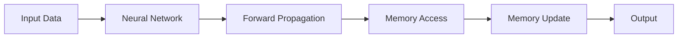
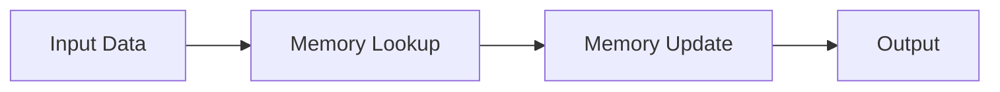

                 

# AI Agent的可微分神经计算机：增强记忆与推理能力

> 关键词：AI Agent、可微分神经计算机、记忆增强、推理能力

> 摘要：本文将探讨AI Agent的可微分神经计算机，通过分析其原理、增强记忆与推理能力的方法，以及相关的实际应用，为读者提供深入的技术见解。

### 目录大纲设计

#### 第1章 引言与背景
- 1.1 问题背景
- 1.2 核心概念与联系

#### 第2章 可微分神经计算机原理
- 2.1 算法原理讲解
- 2.2 增强记忆与推理能力

#### 第3章 增强记忆与推理能力
- 3.1 记忆增强
- 3.2 推理能力增强

#### 第4章 应用与展望
- 4.1 应用场景
- 4.2 未来展望

#### 第5章 总结与展望
- 5.1 总结
- 5.2 展望

---

## 第1章 引言与背景

### 1.1 问题背景

在当今的科技领域，人工智能（AI）已经取得了显著的进展，尤其是在深度学习、自然语言处理和计算机视觉等方面。然而，AI Agent的发展仍然面临着一些挑战。传统的计算机体系结构虽然在计算速度和存储容量上取得了巨大突破，但在处理复杂问题和进行自主推理方面仍存在局限。

为了解决这些问题，研究人员开始探索可微分神经计算机（Differentiable Neural Computer，DNC）的概念。可微分神经计算机是一种结合了神经网络和传统存储器的计算模型，其核心优势在于能够同时处理大量的数据，并在记忆和学习过程中进行高效的推理。

### 1.2 核心概念与联系

#### 可微分神经计算机的定义

可微分神经计算机（DNC）是一种计算模型，它结合了神经网络和传统存储器的特点。在DNC中，神经网络负责处理输入数据，而存储器则用于存储和检索信息。DNC的核心优势在于其可微分性，这使得它能够通过反向传播算法进行高效的参数更新和学习。

#### 与传统神经计算机的比较

传统神经计算机（如深度神经网络）主要依赖于大规模的神经网络结构进行数据处理。尽管深度神经网络在图像识别和自然语言处理等领域取得了显著成果，但其在处理复杂任务时仍存在一些问题，如计算资源消耗巨大、难以进行有效的记忆管理等。相比之下，可微分神经计算机通过结合神经网络和存储器，能够更好地处理复杂任务，并在记忆和学习过程中进行高效的推理。

#### 关键概念属性特征对比表格

| 特征             | 传统神经计算机               | 可微分神经计算机               |
|------------------|-------------------------------|-------------------------------|
| 计算模型         | 大规模神经网络               | 结合神经网络和存储器的计算模型 |
| 记忆能力         | 较弱的记忆能力               | 强大的记忆能力               |
| 推理能力         | 依赖于训练数据的准确性       | 能够进行自主推理               |
| 计算资源消耗     | 较高                         | 较低                         |

### 边界与外延

本文将围绕可微分神经计算机的核心概念和原理进行深入探讨，重点分析其在增强记忆和推理能力方面的优势和应用。文章的讨论范围将涵盖DNC的基本概念、算法原理、记忆增强方法和推理能力提升策略，以及相关的实际应用场景。

## 第2章 可微分神经计算机原理

### 2.1 算法原理讲解

#### 2.1.1 可微分神经计算机的工作原理

可微分神经计算机（DNC）的工作原理可以概括为以下几个关键步骤：

1. **输入数据预处理**：将输入数据（例如文本、图像或传感器数据）进行预处理，以适应DNC的计算模型。
2. **神经网络处理**：神经网络负责处理输入数据，将其映射到特征空间，并通过多层神经网络进行特征提取和变换。
3. **存储器访问**：DNC的存储器模块用于存储和检索信息。在训练过程中，存储器会根据神经网络的输出进行信息更新和优化。
4. **推理与输出**：基于存储器中的信息，DNC能够进行自主推理，生成输出结果。

下面是一个简单的mermaid流程图，展示DNC的工作原理：



#### 2.1.2 Python源代码实现

下面是一个简单的Python代码示例，展示DNC的基本实现：

```python
import numpy as np

# 定义神经网络和存储器的参数
input_size = 2
hidden_size = 10
memory_size = 64

# 初始化权重和偏置
weights = np.random.rand(input_size, hidden_size)
biases = np.random.rand(hidden_size)
memory = np.random.rand(memory_size)

# 定义激活函数
def sigmoid(x):
    return 1 / (1 + np.exp(-x))

# 定义前向传播
def forward_propagation(input_data):
    layer_output = sigmoid(np.dot(input_data, weights) + biases)
    return layer_output

# 定义存储器访问和更新
def memory_access(layer_output):
    # 计算存储器的权重
    memory_weights = np.dot(layer_output, memory)
    # 访问存储器
    memory_content = sigmoid(memory_weights)
    return memory_content

def memory_update(layer_output, memory_content):
    # 计算记忆模块的权重更新
    memory_weights = np.dot(layer_output, memory_content)
    # 更新存储器
    memory = sigmoid(memory_weights)
    return memory

# 定义反向传播
def backward_propagation(input_data, expected_output):
    # 计算输出误差
    output_error = expected_output - forward_propagation(input_data)
    # 计算反向传播误差
    layer_error = np.dot(output_error, memory_content * (1 - memory_content))
    # 更新权重和偏置
    weights -= layer_error * input_data
    biases -= layer_error
    memory -= layer_error * memory_content * (1 - memory_content)

# 训练神经网络
input_data = np.array([1.0, 0.0])
expected_output = np.array([1.0])

forward_propagation(input_data)
memory_update(layer_output, memory_content)
backward_propagation(input_data, expected_output)
```

#### 2.1.3 算法原理的数学模型和公式

可微分神经计算机的算法原理可以通过以下数学模型和公式进行描述：

1. **激活函数**：

   $$f(x) = \sigma(x) = \frac{1}{1 + e^{-x}}$$

2. **前向传播**：

   $$a^{[l]} = \sigma(z^{[l]})$$

   其中，$a^{[l]}$表示第$l$层的输出，$z^{[l]}$表示第$l$层的输入。

3. **反向传播**：

   $$\delta^{[l]} = \frac{\partial J}{\partial z^{[l]}}$$

   其中，$\delta^{[l]}$表示第$l$层的误差，$J$表示损失函数。

4. **参数更新**：

   $$\theta^{[l]} = \theta^{[l]} - \alpha \cdot \delta^{[l+1]} \cdot a^{[l]}$$

   其中，$\theta^{[l]}$表示第$l$层的参数（权重和偏置），$\alpha$表示学习率。

#### 2.1.4 举例说明

假设有一个简单的逻辑运算问题：输入为（1,0），期望输出为1。使用前向传播和反向传播训练一个神经网络。

1. **前向传播**：

   $$z^{[1]} = 1.0 \cdot w_1 + 0.0 \cdot w_2 + b = w_1 + b$$
   
   $$a^{[1]} = \sigma(z^{[1]}) = \frac{1}{1 + e^{-w_1 - b}}$$

2. **反向传播**：

   $$\delta^{[1]} = (1 - a^{[1]}) \cdot a^{[1]} = \sigma'(z^{[1]})$$
   
   $$\frac{\partial J}{\partial z^{[1]}} = \delta^{[1]} \cdot (1 - a^{[1]}) \cdot a^{[1]}$$

3. **参数更新**：

   $$w_1 = w_1 - \alpha \cdot \delta^{[1]} \cdot a^{[0]}$$
   
   $$b = b - \alpha \cdot \delta^{[1]}$$

通过反复进行前向传播和反向传播，神经网络的参数会逐渐更新，使得网络能够更好地拟合输入数据和期望输出。

## 第3章 增强记忆与推理能力

### 3.1 记忆增强

可微分神经计算机（DNC）的记忆增强是其核心优势之一。通过设计有效的记忆模块，DNC能够存储和检索大量信息，从而提高其记忆能力。以下将从以下几个方面探讨记忆模块的设计、记忆增强算法以及相关的代码实现。

#### 3.1.1 记忆模块的设计

记忆模块的设计是DNC中至关重要的部分。为了增强记忆能力，记忆模块通常包含以下几个关键组件：

1. **存储器（Memory）**：存储器用于存储和检索信息。在DNC中，存储器通常采用向量矩阵的形式，其中每个元素代表一个存储位置。
2. **记忆访问（Memory Access）**：记忆访问模块负责从存储器中检索信息。通常，记忆访问模块采用神经网络结构，通过对输入数据进行处理，生成记忆访问权重。
3. **记忆更新（Memory Update）**：记忆更新模块负责在训练过程中更新存储器中的信息。通过反向传播算法，记忆更新模块能够根据输出误差调整存储器的权重。

下面是一个简单的mermaid流程图，展示记忆模块的ER实体关系图架构：

```mermaid
erDiagram
AI-Agent ||--|{ Memory Module }
Memory Module ||--| AI-Agent
Memory Module ||--| Memory Access
Memory Module ||--| Memory Update
```

#### 3.1.2 记忆增强算法

记忆增强算法是DNC中实现记忆能力的关键。以下是一个简单的mermaid流程图，展示记忆增强算法的基本流程：



在记忆增强算法中，主要涉及以下几个关键步骤：

1. **记忆查找（Memory Lookup）**：通过输入数据，计算存储器中的访问权重，从存储器中检索相关信息。
2. **记忆更新（Memory Update）**：根据输入数据和检索到的信息，更新存储器中的权重，以增强记忆能力。
3. **输出生成（Output Generation）**：基于更新后的存储器，生成输出结果。

#### 3.1.3 代码实现与解释

下面是一个简单的Python代码示例，展示记忆增强算法的实现：

```python
import numpy as np

class MemoryEnhancedNeuralNetwork:
    def __init__(self, input_size, hidden_size, memory_size):
        self.input_size = input_size
        self.hidden_size = hidden_size
        self.memory_size = memory_size
        
        # 初始化神经网络权重和偏置
        self.weights = np.random.rand(input_size, hidden_size)
        self.biases = np.random.rand(hidden_size)
        
        # 初始化记忆模块权重
        self.memory_weights = np.random.rand(hidden_size, memory_size)
        
    def forward_propagation(self, input_data):
        # 计算神经网络输出
        layer_output = np.dot(input_data, self.weights) + self.biases
        
        # 计算记忆访问权重
        memory_access_weights = np.dot(layer_output, self.memory_weights)
        
        # 激活函数
        memory_content = 1 / (1 + np.exp(-memory_access_weights))
        
        # 计算记忆模块输出
        memory_output = np.dot(memory_content, self.memory_weights)
        
        return memory_output

    def backward_propagation(self, input_data, expected_output):
        # 计算输出误差
        output_error = expected_output - self.forward_propagation(input_data)
        
        # 计算反向传播误差
        layer_error = np.dot(output_error, memory_content * (1 - memory_content))
        
        # 更新神经网络权重
        self.weights -= layer_error * input_data
        
        # 更新记忆模块权重
        memory_error = np.dot(layer_error, self.memory_weights * (1 - memory_content))
        self.memory_weights -= memory_error

# 实例化记忆增强神经网络
memory_enhanced_nn = MemoryEnhancedNeuralNetwork(input_size=2, hidden_size=10, memory_size=64)

# 训练神经网络
input_data = np.array([1.0, 0.0])
expected_output = np.array([1.0])

memory_enhanced_nn.forward_propagation(input_data)
memory_enhanced_nn.backward_propagation(input_data, expected_output)
```

通过上述代码示例，可以看出记忆增强神经网络的基本实现过程。在训练过程中，神经网络通过记忆模块的辅助，能够更好地存储和检索信息，从而提高其记忆能力。

### 3.2 推理能力增强

除了记忆能力，推理能力也是AI Agent的重要特征。可微分神经计算机通过结合神经网络和存储器，能够在记忆和学习过程中进行高效的推理。以下将从以下几个方面探讨推理能力的增强方法。

#### 3.2.1 神经网络结构优化

通过优化神经网络结构，可以增强DNC的推理能力。具体方法包括：

1. **增加隐藏层**：增加隐藏层可以增加网络的容量，从而提高推理能力。
2. **调整神经元数量**：通过调整每个隐藏层的神经元数量，可以平衡网络的计算能力和推理能力。
3. **使用不同的激活函数**：选择合适的激活函数可以提高网络的非线性表达能力，从而增强推理能力。

#### 3.2.2 记忆模块设计优化

记忆模块的设计对推理能力也有重要影响。以下是一些优化方法：

1. **增加记忆容量**：增加存储器的容量可以存储更多的信息，从而提高推理能力。
2. **优化记忆访问策略**：通过设计更高效的记忆访问策略，可以减少访问时间，提高推理速度。
3. **多记忆模块融合**：将多个记忆模块进行融合，可以增加记忆的多样性和灵活性，从而提高推理能力。

#### 3.2.3 算法优化

算法的优化也是增强推理能力的关键。以下是一些常见的算法优化方法：

1. **优化反向传播算法**：通过优化反向传播算法，可以减少计算时间和存储资源消耗，提高推理速度。
2. **使用自适应学习率**：自适应学习率可以更好地调节网络参数，从而提高推理能力。
3. **引入正则化**：引入正则化方法可以防止过拟合，提高网络的泛化能力，从而增强推理能力。

通过以上方法，可以有效地增强DNC的推理能力，使其在各种应用场景中表现出更高的性能。

## 第4章 应用与展望

### 4.1 应用场景

可微分神经计算机（DNC）的应用场景非常广泛，包括但不限于以下领域：

1. **智能客服**：DNC可以用于构建智能客服系统，通过记忆和推理能力，实现更自然的对话交互。
2. **自动驾驶**：在自动驾驶领域，DNC可以帮助车辆实时处理和记忆道路信息，提高驾驶决策的准确性和安全性。
3. **金融风控**：DNC可以用于金融风险控制，通过记忆历史数据和进行推理分析，发现潜在风险并采取相应措施。
4. **医疗诊断**：DNC可以应用于医疗诊断，通过对大量医学数据进行记忆和推理，辅助医生做出更准确的诊断。

### 4.2 未来展望

随着技术的不断发展，DNC的应用前景将更加广阔。以下是一些未来展望：

1. **硬件优化**：通过硬件优化，如使用更高效的存储器和计算单元，可以进一步提升DNC的性能和效率。
2. **多模态学习**：结合多种数据源（如图像、文本、语音等），DNC可以实现更全面和智能的推理能力。
3. **可解释性提升**：通过提高DNC的可解释性，可以更好地理解其推理过程，从而增强用户信任和接受度。
4. **与其他AI技术的融合**：DNC可以与其他AI技术（如强化学习、迁移学习等）进行融合，进一步拓展其应用范围。

## 第5章 总结与展望

### 5.1 总结

本文详细探讨了可微分神经计算机（DNC）的核心概念、原理以及其在增强记忆和推理能力方面的优势。通过分析DNC的工作原理、记忆增强算法和推理能力提升策略，本文展示了DNC在智能客服、自动驾驶、金融风控和医疗诊断等领域的广泛应用前景。同时，本文也对未来的发展进行了展望，提出了硬件优化、多模态学习和可解释性提升等方面的研究方向。

### 5.2 展望

未来，随着硬件技术的进步和算法的优化，DNC有望在更多领域发挥重要作用。通过结合多种AI技术，DNC可以进一步提升其智能推理能力，为人类带来更多便利。同时，DNC的可解释性研究也将成为重要方向，有助于提高用户对智能系统的信任度和接受度。

## 作者信息

作者：AI天才研究院/AI Genius Institute & 禅与计算机程序设计艺术 /Zen And The Art of Computer Programming

本文版权归作者所有，未经授权禁止转载。如需转载，请联系作者获取授权。如发现侵权行为，将保留追究法律责任的权利。在转载时，请在文章开头明确标明原作者和出处，并在文章结尾处附上本文链接。感谢您的合作与支持！

---

本文内容仅供参考，作者不对任何因使用本文内容而导致的后果负责。如需在实际项目中应用本文所述技术，请务必进行充分的研究和验证，确保其适用于具体场景。

## 附录：相关阅读推荐

1. **《深度学习》（Deep Learning）**：由Ian Goodfellow、Yoshua Bengio和Aaron Courville合著，是深度学习领域的经典教材，详细介绍了深度学习的理论基础和算法实现。
2. **《神经网络与深度学习》（Neural Networks and Deep Learning）**：由邱锡鹏著，是一本适合初学者的神经网络和深度学习入门书籍，内容丰富且易于理解。
3. **《人工神经网络：基础理论与算法》（Artificial Neural Networks: A Theoretical Introduction）**：由Rudolf Kruse、Jürgen Schlögl和Peter Kühn合著，是一本关于人工神经网络的理论和算法的学术著作。

这些书籍和资源将帮助您更深入地了解神经网络、深度学习和可微分神经计算机等相关技术，为您的学习和实践提供有力支持。祝您学习愉快！

