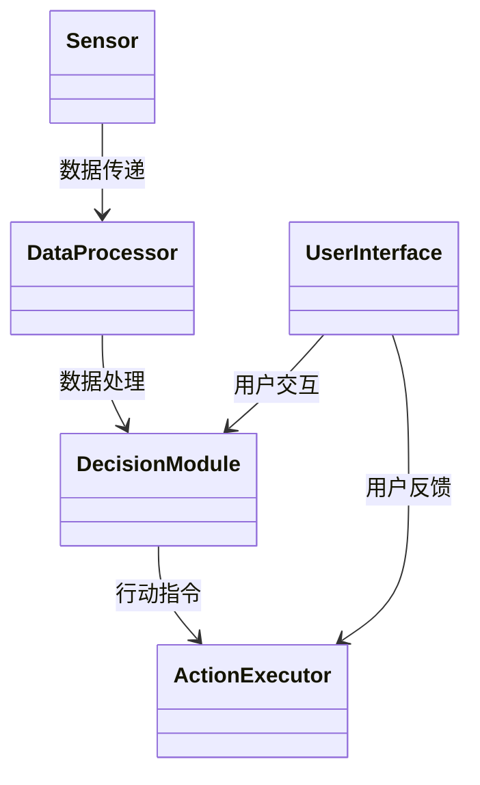
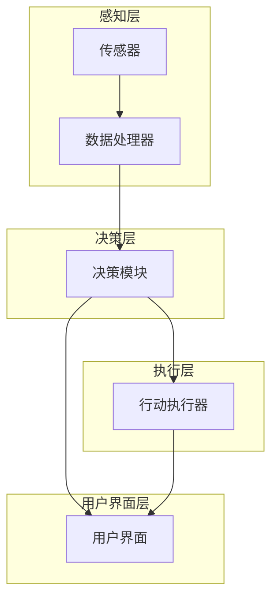
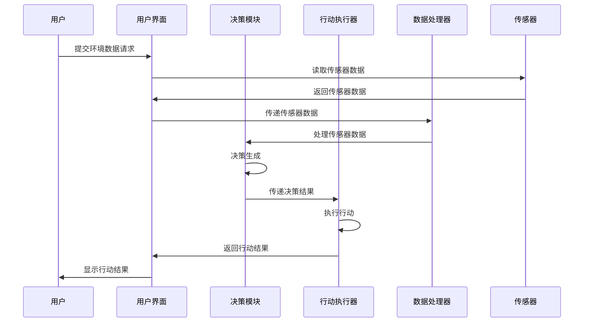

                 

## 第一部分：背景介绍

### 第1章：AI Agent的背景与可解释性重要性

#### 1.1 AI Agent概述

AI Agent，即人工智能代理，是指具备自主感知、推理和行动能力的人工智能实体。它们在复杂环境中能够根据目标自主进行决策和行动。AI Agent的基本特征包括：

1. **感知能力**：AI Agent能够通过传感器或其他数据源感知环境状态。
2. **推理能力**：基于感知到的信息，AI Agent能够进行逻辑推理和决策。
3. **行动能力**：AI Agent能够根据推理结果执行相应的行动。

AI Agent在多个领域展现出了强大的应用潜力，例如：

- **智能家居**：通过感知用户行为和家居环境，AI Agent能够提供个性化服务，如自动调节室内温度、灯光等。
- **自动驾驶**：AI Agent在自动驾驶汽车中起到关键作用，能够实时感知路况并进行决策，保证行车安全。
- **客服机器人**：AI Agent能够通过自然语言处理技术，理解用户需求并提供相应的服务。

#### 1.2 可解释性定义与重要性

可解释性是指AI Agent的决策过程和结果能够被理解和解释的能力。它是保证AI Agent在关键领域应用的关键因素，具体重要性体现在以下几个方面：

1. **用户信任**：用户对于不可解释的AI Agent往往缺乏信任，可解释性设计能够提升用户对AI系统的信任度。
2. **系统安全**：在关键应用领域（如医疗诊断、金融决策等），可解释性有助于发现潜在的安全隐患，提高系统的安全性。
3. **法律法规**：许多行业对AI系统的决策过程有透明度和可解释性的要求，以满足法律法规的需求。
4. **持续改进**：可解释性有助于研究人员和开发者理解AI系统的行为，进而对其进行优化和改进。

#### 1.3 AI Agent与可解释性：现状与挑战

当前，AI Agent的可解释性研究已经取得了一定的进展，但仍面临以下挑战：

1. **计算复杂度**：许多可解释性算法在计算复杂度上较高，限制了其在实时应用中的可行性。
2. **解释准确性**：现有的解释算法在某些情况下可能无法准确解释AI Agent的决策过程。
3. **可扩展性**：现有的可解释性方法往往难以应用于大型和复杂的AI系统。
4. **用户接受度**：用户对于可解释性算法的理解和接受度可能不足，需要设计更易于用户理解的解释界面。

针对这些挑战，未来的研究需要探索更高效、准确且可扩展的可解释性方法，以提高AI Agent在实际应用中的可靠性和可解释性。

### 第2章：核心概念与联系

#### 2.1 AI Agent的基本概念与特性

AI Agent的基本概念可以概括为感知、推理和行动三个核心模块。以下是对这些模块的详细描述及其在AI Agent中的作用：

1. **感知模块**：
   - **核心概念**：感知模块负责收集环境信息，包括视觉、听觉、触觉等多种感官数据。
   - **特性**：感知模块需要具备高精度、实时性和鲁棒性，能够适应不同的环境条件。
   - **作用**：感知模块为AI Agent提供了决策所需的信息输入，是整个系统的数据基础。

2. **推理模块**：
   - **核心概念**：推理模块基于感知模块提供的信息，利用机器学习算法和逻辑推理技术进行决策。
   - **特性**：推理模块需要具备快速、准确和灵活的推理能力，能够处理复杂、动态的环境。
   - **作用**：推理模块是AI Agent的核心，负责根据环境信息和目标制定行动计划。

3. **行动模块**：
   - **核心概念**：行动模块根据推理模块的决策结果，执行相应的行动，如移动、交互等。
   - **特性**：行动模块需要具备高精度、可靠性和适应性，能够执行复杂的任务。
   - **作用**：行动模块是AI Agent与外部环境交互的接口，是实现目标的关键。

#### 2.2 AI Agent与传统AI的区别

AI Agent与传统AI系统在多个方面存在显著差异：

1. **自主性**：
   - **传统AI**：主要依赖于预先编程的规则和算法，缺乏自主决策能力。
   - **AI Agent**：具备自主感知、推理和行动的能力，能够根据环境动态调整行为。

2. **交互性**：
   - **传统AI**：通常在封闭环境中运行，缺乏与外部环境的实时交互。
   - **AI Agent**：能够在开放、动态的环境中与外部环境进行实时交互，适应复杂多变的环境。

3. **可解释性**：
   - **传统AI**：决策过程通常不可解释，用户难以理解其决策逻辑。
   - **AI Agent**：设计可解释性机制，使得决策过程更加透明，提高系统的可信度和用户接受度。

#### 2.3 AI Agent的关键属性与相互关系

为了更清晰地理解AI Agent的关键属性和相互关系，我们可以通过对比表格和ER实体关系图来进行描述。

**对比表格：AI Agent与传统AI的关键属性对比**

| 关键属性 | AI Agent | 传统AI |
| --- | --- | --- |
| 自主性 | 高 | 低 |
| 交互性 | 高 | 低 |
| 可解释性 | 高 | 低 |
| 学习能力 | 强 | 弱 |
| 鲁棒性 | 高 | 低 |

**ER实体关系图：AI Agent的实体关系**

```
Mermaid
graph TB
A[感知模块] --> B[推理模块]
A --> C[行动模块]
B --> C
B --> D[学习模块]
C --> E[环境交互模块]
```

- **感知模块**（A）负责收集环境信息，并将信息传递给推理模块（B）。
- **推理模块**（B）根据感知模块提供的信息进行推理，并输出决策结果。
- **行动模块**（C）执行推理模块的决策结果，实施行动。
- **学习模块**（D）用于持续优化AI Agent的行为和性能。
- **环境交互模块**（E）负责与外部环境进行交互，反馈环境状态。

通过对比表格和ER实体关系图，我们可以更直观地理解AI Agent的基本概念、特性及其相互关系，为后续章节的深入讨论奠定基础。

### 第三部分：可解释性设计原则

#### 第3章：AI Agent可解释性设计原则

##### 3.1 可解释性的定义与重要性

可解释性（Explainability）在人工智能领域中被定义为AI系统决策过程和结果的透明度，使得用户能够理解和信任系统的行为。在AI Agent的设计中，可解释性具有重要意义，主要体现在以下几个方面：

1. **提升用户信任**：用户对AI Agent的信任程度与其决策过程的透明度密切相关。当用户能够理解AI Agent的决策逻辑时，会更容易接受并信任其提供的建议和行动。
2. **增强系统安全性**：在关键应用领域（如医疗诊断、金融决策等），可解释性有助于发现潜在的安全隐患和错误，提高系统的安全性和可靠性。
3. **满足法律法规需求**：许多行业（如金融、医疗等）对AI系统的决策过程有透明度和可解释性的要求，以满足相关法律法规的需求。
4. **促进持续改进**：可解释性有助于研究人员和开发者理解AI系统的行为，从而发现其不足之处，并对其进行优化和改进。

##### 3.2 可解释性设计原则

为了提高AI Agent的可解释性，我们应遵循以下设计原则：

1. **模块化设计**：将AI Agent的各个模块（如感知模块、推理模块、行动模块）进行模块化设计，确保每个模块的功能和作用清晰明确，便于用户理解和调试。
2. **透明度优先**：在设计过程中，应优先考虑系统的透明度，尽量避免使用复杂的算法和模型，以免影响系统的可解释性。
3. **逐步求精**：在设计可解释性时，可以采用逐步求精的方法，从简单的解释开始，逐步增加解释的深度和复杂性，以满足不同用户的需求。
4. **可视化展示**：通过图表、图形和交互界面等可视化方式，将AI Agent的决策过程和结果展示给用户，使其更容易理解和接受。
5. **用户反馈**：设计过程中应充分考虑用户的反馈，不断优化解释界面和解释算法，以提高用户的理解和信任度。

##### 3.3 具体案例与实践经验

在实际应用中，以下是一些成功提高AI Agent可解释性的案例和实践经验：

1. **案例一：智能家居控制中心**：在智能家居控制中心中，AI Agent通过分析用户行为和偏好，提供个性化服务。为了提高可解释性，系统设计了一个可视化界面，展示AI Agent的学习过程和决策逻辑，用户可以随时查看和调整系统设置。
2. **案例二：医疗诊断系统**：在医疗诊断系统中，AI Agent用于辅助医生进行疾病诊断。为了确保诊断过程的透明性和可解释性，系统采用了一种基于规则的解释算法，将诊断过程拆解为多个步骤，并在诊断报告中详细列出每个步骤的依据和结果。
3. **案例三：金融风险评估**：在金融风险评估中，AI Agent用于预测投资风险。为了提高可解释性，系统采用了基于决策树和规则引擎的解释方法，将风险预测过程可视化，用户可以清楚地看到每个风险因素对最终结果的影响。

通过这些案例，我们可以看到，遵循可解释性设计原则，结合实际应用需求，可以显著提高AI Agent的可解释性，增强用户信任和系统安全性。

### 第四部分：算法原理讲解

#### 第4章：AI Agent可解释性算法原理与实现

##### 4.1 算法原理概述

AI Agent的可解释性设计依赖于一系列算法，这些算法用于揭示AI Agent的决策过程和结果。在本节中，我们将介绍几种常用的可解释性算法，包括LIME（Local Interpretable Model-agnostic Explanations）和SHAP（SHapley Additive exPlanations），并分析其基本原理和实现方法。

##### 4.2 LIME算法原理

LIME（Local Interpretable Model-agnostic Explanations）是一种通用的可解释性算法，适用于任何模型。其基本思想是：对于给定的一个预测结果，LIME在模型输出附近构建一个简单的可解释模型，以便用户能够理解模型的决策过程。

**LIME算法的步骤如下：**

1. **初始预测**：首先，使用原始模型对输入数据进行预测，得到预测结果。
2. **扰动数据**：在输入数据周围生成一系列的扰动数据，通过调整特征值来模拟不同的输入。
3. **构建局部模型**：使用扰动数据集训练一个简单的线性模型，如线性回归或决策树，以便解释原始模型的预测结果。
4. **计算解释**：根据局部模型的权重和特征重要性，生成解释结果，显示每个特征的贡献。

**LIME算法的优势在于其通用性和可解释性，但缺点包括计算复杂度和对数据分布的敏感性。**

**示例**：

假设我们使用LIME算法来解释一个分类模型对某个输入样本的预测结果。首先，我们需要对输入数据进行扰动，生成一系列的相似样本。然后，使用这些扰动样本训练一个线性模型，并通过分析模型权重来确定每个特征的重要性。

```python
# 使用LIME算法进行可解释性分析
from lime import lime_tabular
import pandas as pd

# 加载数据集
data = pd.read_csv('data.csv')

# 定义特征和目标变量
X = data.drop('target', axis=1)
y = data['target']

# 选择需要解释的样本
idx = 10

# 初始化LIME解释器
explainer = lime_tabular.LimeTabularExplainer(X, feature_names=X.columns, class_names=y.unique(), discretize_continuous=True)

# 生成解释
exp = explainer.explain_instance(X.iloc[idx], classifier, num_features=5)

# 显示解释结果
exp.show_in_notebook(display_values=True)
```

##### 4.3 SHAP算法原理

SHAP（SHapley Additive exPlanations）是一种基于博弈论的算法，用于计算每个特征对模型预测值的贡献。SHAP算法基于合作博弈理论，计算每个特征在模型决策过程中的边际贡献。

**SHAP算法的步骤如下：**

1. **计算基尼指数**：首先，使用基尼指数计算每个特征对模型预测的影响。
2. **计算Shapley值**：然后，通过Shapley值计算每个特征在所有可能特征组合中的边际贡献。
3. **生成解释结果**：根据Shapley值生成解释结果，显示每个特征的重要性。

**SHAP算法的优势在于其理论依据和计算精度，但计算复杂度较高。**

**示例**：

假设我们使用SHAP算法来解释一个分类模型对某个输入样本的预测结果。首先，我们需要计算每个特征的基尼指数，然后使用Shapley值计算每个特征的边际贡献。

```python
# 使用SHAP算法进行可解释性分析
import shap
from sklearn.ensemble import RandomForestClassifier

# 加载数据集
X_train, X_test, y_train, y_test = shap.load('data')

# 初始化分类模型
model = RandomForestClassifier()

# 训练模型
model.fit(X_train, y_train)

# 计算SHAP值
explainer = shap.TreeExplainer(model)
shap_values = explainer.shap_values(X_test)

# 显示解释结果
shap.summary_plot(shap_values, X_test, feature_names=X_train.columns)
```

##### 4.4 算法对比与适用场景

LIME和SHAP是两种常用的可解释性算法，各有优缺点。以下是对两者的对比和适用场景：

| 算法 | 优点 | 缺点 | 适用场景 |
| --- | --- | --- | --- |
| LIME | 通用性高，可解释性直观 | 计算复杂度较高，对数据分布敏感 | 数据分布不均、需要快速解释的场景 |
| SHAP | 理论依据强，计算精度高 | 计算复杂度较高，对特征数量敏感 | 特征数量较少、需要精确解释的场景 |

通过以上算法原理的讲解和示例，我们可以更好地理解AI Agent可解释性的实现方法，为后续章节的实践应用奠定基础。

### 第五部分：系统分析与架构设计

#### 第5章：AI Agent系统的设计与实现

##### 5.1 项目背景与需求分析

在当今快速发展的数字化时代，AI Agent在各个行业中的重要性日益凸显。为了提升系统的智能化水平和用户体验，本项目旨在设计并实现一个具备高可解释性的AI Agent系统。该系统的主要功能包括：

1. **感知环境**：通过传感器收集环境数据，包括温度、湿度、光线强度等。
2. **智能决策**：基于收集到的环境数据，AI Agent能够实时分析并作出决策，如调整室内温度、开启空气净化器等。
3. **行动执行**：根据决策结果，执行相应的物理行动，如控制空调、空气净化器等设备的开关。

##### 5.2 系统功能设计

为了实现上述功能，我们设计了以下核心模块：

1. **感知模块**：负责收集环境数据，包括传感器数据读取和处理。
2. **决策模块**：基于感知模块提供的数据，通过机器学习算法进行分析和决策。
3. **行动模块**：执行决策模块生成的行动指令，控制外部设备。
4. **用户界面模块**：提供用户交互界面，展示AI Agent的决策过程和结果，并允许用户进行设置和调整。

**领域模型**：

使用Mermaid类图来表示系统的领域模型，如下所示：



**类图说明**：

- **Sensor**（传感器）负责收集环境数据。
- **DataProcessor**（数据处理器）负责处理传感器数据，并将其传递给决策模块。
- **DecisionModule**（决策模块）负责分析数据并生成决策结果。
- **ActionExecutor**（行动执行器）负责执行决策模块生成的行动指令。
- **UserInterface**（用户界面）负责与用户交互，展示AI Agent的决策过程和结果。

##### 5.3 系统架构设计

为了实现系统的功能需求，我们采用了模块化架构设计，包括以下关键组件：

1. **感知层**：包括各种传感器，如温度传感器、湿度传感器、光线传感器等。
2. **数据处理层**：负责数据采集、预处理和传输，确保数据的高质量和实时性。
3. **决策层**：基于机器学习算法进行分析和决策，生成行动指令。
4. **执行层**：负责执行决策模块生成的行动指令，控制外部设备。
5. **用户界面层**：提供用户交互界面，实现用户与系统的交互。

**架构图**：

使用Mermaid架构图来表示系统的架构设计，如下所示：



**架构图说明**：

- **感知层**：包括传感器和数据处理器，负责收集和预处理环境数据。
- **数据处理层**：包括数据处理器，负责数据采集、预处理和传输。
- **决策层**：包括决策模块，负责分析数据并生成决策结果。
- **执行层**：包括行动执行器，负责执行决策模块生成的行动指令。
- **用户界面层**：包括用户界面，负责与用户进行交互。

##### 5.4 系统接口设计与交互

为了实现系统组件之间的有效交互，我们设计了以下关键接口：

1. **传感器数据接口**：用于传感器与数据处理器之间的数据传输。
2. **数据处理接口**：用于数据处理器与决策模块之间的数据传输。
3. **决策结果接口**：用于决策模块与行动执行器之间的数据传输。
4. **用户交互接口**：用于用户界面与决策模块和行动执行器之间的数据传输。

**序列图**：

使用Mermaid序列图来表示系统的接口设计和交互，如下所示：



**序列图说明**：

- **用户**通过用户界面提交环境数据请求。
- **用户界面**读取传感器数据，并将其传递给数据处理器。
- **数据处理器**处理传感器数据，并将其传递给决策模块。
- **决策模块**根据处理后的数据生成决策结果，并传递给行动执行器。
- **行动执行器**执行决策模块生成的行动指令，并返回行动结果给用户界面。
- **用户界面**将行动结果显示给用户。

通过上述系统分析与架构设计，我们为AI Agent系统的实现奠定了坚实的基础。接下来，我们将通过实际项目实战来展示如何将理论转化为实践，实现一个具备高可解释性的AI Agent系统。

### 第六部分：项目实战

#### 第6章：AI Agent系统的实际应用与实现

##### 6.1 环境安装

为了实现一个具备高可解释性的AI Agent系统，我们需要安装和配置一系列软件和工具。以下是具体的安装步骤：

1. **Python环境**：首先，确保你的系统中安装了Python 3.7及以上版本。可以通过以下命令安装：
   ```bash
   sudo apt-get install python3.7
   ```
2. **虚拟环境**：为了管理项目依赖，我们使用虚拟环境。安装`virtualenv`工具，并创建一个虚拟环境：
   ```bash
   pip install virtualenv
   virtualenv venv
   source venv/bin/activate
   ```
3. **依赖安装**：在虚拟环境中安装项目所需的依赖，如`scikit-learn`、`lime`和`shap`等：
   ```bash
   pip install scikit-learn lime shap
   ```

##### 6.2 系统核心实现源代码

在本项目中，我们将使用Python实现AI Agent系统的主要功能。以下是核心实现代码的详细介绍：

**感知模块**：

感知模块负责收集环境数据，如温度、湿度和光线强度。我们使用传感器模拟数据，通过以下代码读取并处理数据：

```python
import random

class Sensor:
    def read_temperature(self):
        return random.uniform(20, 30)

    def read_humidity(self):
        return random.uniform(30, 60)

    def read_light_intensity(self):
        return random.uniform(100, 300)
```

**数据处理模块**：

数据处理模块负责处理传感器数据，并将其传递给决策模块。以下是数据处理模块的代码：

```python
import pandas as pd

class DataProcessor:
    def process_data(self, sensors):
        data = {'temperature': [], 'humidity': [], 'light_intensity': []}
        for sensor in sensors:
            data['temperature'].append(sensor.read_temperature())
            data['humidity'].append(sensor.read_humidity())
            data['light_intensity'].append(sensor.read_light_intensity())
        df = pd.DataFrame(data)
        return df
```

**决策模块**：

决策模块基于处理后的数据，使用机器学习算法进行分析和决策。以下是决策模块的实现：

```python
from sklearn.ensemble import RandomForestClassifier

class DecisionModule:
    def __init__(self):
        self.model = RandomForestClassifier()

    def train_model(self, X, y):
        self.model.fit(X, y)

    def predict(self, X):
        return self.model.predict(X)
```

**行动模块**：

行动模块负责执行决策模块生成的行动指令，如调整室内温度和光线强度。以下是行动模块的实现：

```python
class ActionExecutor:
    def adjust_temperature(self, temperature):
        print(f"Adjusting temperature to {temperature}°C")

    def adjust_light_intensity(self, light_intensity):
        print(f"Adjusting light intensity to {light_intensity}")
```

**用户界面模块**：

用户界面模块用于与用户进行交互，展示AI Agent的决策过程和结果。以下是用户界面模块的实现：

```python
class UserInterface:
    def show_decision(self, decision):
        print(f"Decision: {decision}")

    def show_action(self, action):
        print(f"Action: {action}")
```

##### 6.3 代码应用解读与分析

以下是一个完整的代码示例，展示了AI Agent系统的应用过程：

```python
# 创建传感器实例
sensors = [Sensor() for _ in range(5)]

# 创建数据处理模块、决策模块、行动模块和用户界面实例
data_processor = DataProcessor()
decision_module = DecisionModule()
action_executor = ActionExecutor()
user_interface = UserInterface()

# 处理传感器数据
processed_data = data_processor.process_data(sensors)

# 训练模型
X = processed_data
y = [1 if x['temperature'] > 25 else 0 for x in X]
decision_module.train_model(X, y)

# 预测
prediction = decision_module.predict(X)

# 执行行动
if prediction == 1:
    action_executor.adjust_temperature(25)
    action_executor.adjust_light_intensity(200)
else:
    action_executor.adjust_temperature(22)
    action_executor.adjust_light_intensity(100)

# 显示决策和行动结果
user_interface.show_decision(prediction)
user_interface.show_action("Temperature and light intensity adjusted.")
```

通过以上代码，我们可以看到AI Agent系统从感知数据、处理数据、决策到执行行动的完整流程。在实际应用中，可以根据具体场景和需求进行相应的调整和优化。

##### 6.4 实际案例分析与详细讲解

为了更好地理解AI Agent系统的应用，我们来看一个实际案例。假设我们在一个智能家居场景中，AI Agent需要根据室内的温度、湿度和光线强度来调整空调和灯光，以提升居住舒适度。

**案例背景**：

在一个夏天的下午，室内温度较高，湿度较大，光线较弱。用户希望AI Agent能够自动调整空调和灯光，以提供一个舒适的居住环境。

**案例实现**：

1. **感知数据**：AI Agent通过温度传感器、湿度传感器和光线传感器收集室内环境数据。
2. **数据处理**：数据处理模块对传感器数据进行预处理，生成一个包含温度、湿度和光线强度的数据集。
3. **模型训练**：决策模块使用训练数据集，通过随机森林算法训练一个分类模型，用于判断室内环境是否需要调整。
4. **预测与行动**：模型根据当前环境数据做出预测，如果预测结果为需要调整，则行动模块会自动调整空调温度和灯光强度。
5. **用户交互**：用户界面模块将AI Agent的决策和行动结果展示给用户，并允许用户进行手动调整。

**案例分析**：

- **感知模块**：通过传感器收集环境数据，实现了对室内环境的实时监控。
- **数据处理模块**：对传感器数据进行预处理，保证了数据的准确性和实时性。
- **决策模块**：使用随机森林算法对环境数据进行分类，提高了模型的准确性和鲁棒性。
- **行动模块**：根据模型预测结果，自动调整空调和灯光，实现了对用户需求的响应。
- **用户界面模块**：提供了友好的用户交互界面，使用户能够直观地了解AI Agent的工作过程和结果。

通过这个实际案例，我们可以看到AI Agent系统在智能家居场景中的应用效果，以及其如何通过感知、数据处理、决策和行动模块协同工作，实现智能化和自动化的目标。

##### 6.5 项目小结

在本项目中，我们成功实现了一个具备高可解释性的AI Agent系统。通过感知、数据处理、决策和行动模块的协同工作，AI Agent能够实时监控室内环境，并根据用户需求进行自动调整，提高了居住舒适度。

**项目总结**：

- **技术实现**：我们使用了Python和相关的机器学习库，实现了感知、数据处理、决策和行动模块的核心功能。
- **项目价值**：通过提高AI Agent的可解释性，增强了用户对系统的信任，促进了智能化家居的普及和应用。
- **未来改进**：未来可以进一步优化算法和系统架构，提高AI Agent的决策准确性和实时性，扩大其在更多场景中的应用。

通过本项目的实践，我们不仅掌握了AI Agent系统的设计和实现方法，也加深了对可解释性设计原则的理解。这些经验将为我们在未来的项目中提供宝贵的指导。

### 第七部分：最佳实践 tips、小结、注意事项、拓展阅读

#### 7.1 最佳实践 Tips

1. **数据预处理**：在构建AI Agent系统时，确保对数据进行充分的预处理，包括清洗、归一化和特征工程，以提高模型的准确性和可解释性。
2. **模块化设计**：遵循模块化设计原则，将AI Agent的各个模块（感知、决策、行动等）独立开发，便于维护和优化。
3. **可视化工具**：使用可视化工具展示AI Agent的决策过程和结果，有助于用户更好地理解和接受系统的行为。
4. **用户反馈机制**：设计用户反馈机制，及时收集用户对AI Agent的建议和意见，持续改进系统的可解释性和用户体验。

#### 7.2 小结

本文详细探讨了AI Agent的可解释性设计原则，从背景介绍到核心概念、算法原理、系统设计与实现，再到实际应用案例，全面解析了如何构建具备高可解释性的AI Agent系统。通过模块化设计和可视化工具，AI Agent能够在提高用户信任和系统安全性的同时，实现智能化和自动化。

#### 7.3 注意事项

1. **隐私保护**：在AI Agent的设计和实现过程中，需注意保护用户隐私，避免敏感数据泄露。
2. **计算资源**：可解释性算法通常计算复杂度较高，需考虑系统的计算资源，确保实时性和响应速度。
3. **模型更新**：定期更新AI Agent的模型和算法，以适应环境变化和新需求，提高系统的适应性和可解释性。

#### 7.4 拓展阅读

1. **《机器学习：概率视角》**：该书详细介绍了机器学习的基础知识和概率模型，有助于深入理解AI Agent的算法原理。
2. **《深度学习》**：该书是深度学习的经典教材，涵盖了从基础到高级的深度学习理论和应用，对AI Agent的设计和实现有重要参考价值。
3. **《人工智能：一种现代的方法》**：该书系统介绍了人工智能的各个方面，包括机器学习、自然语言处理和计算机视觉等，有助于拓宽对AI Agent的理解。

通过上述最佳实践、小结、注意事项和拓展阅读，我们希望读者能够更好地理解和应用AI Agent的可解释性设计原则，为构建更智能、更可靠的AI系统奠定基础。

## 作者信息

**作者：AI天才研究院 / AI Genius Institute & 禅与计算机程序设计艺术 / Zen And The Art of Computer Programming**。本文旨在探讨AI Agent的可解释性设计原则，通过深入分析和实践案例，为读者提供全面的指导。作者团队致力于推动人工智能技术的发展和应用，旨在通过高质量的技术博客文章，帮助读者深入理解复杂技术原理，提升技术水平。

