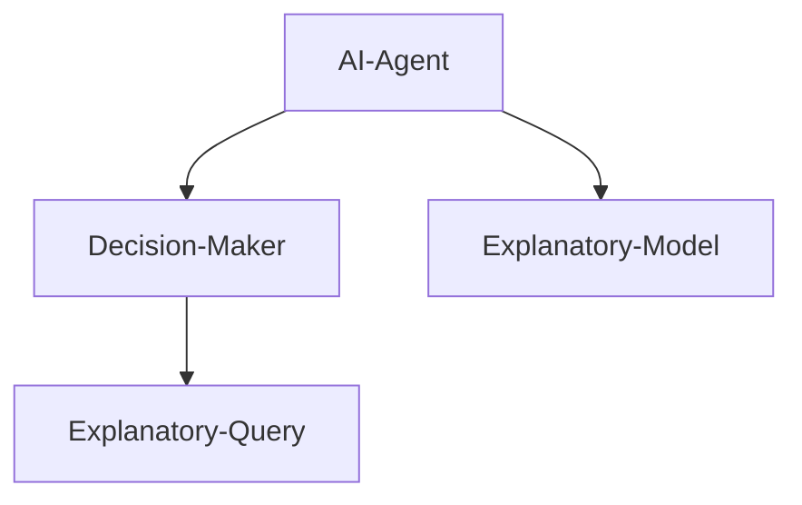
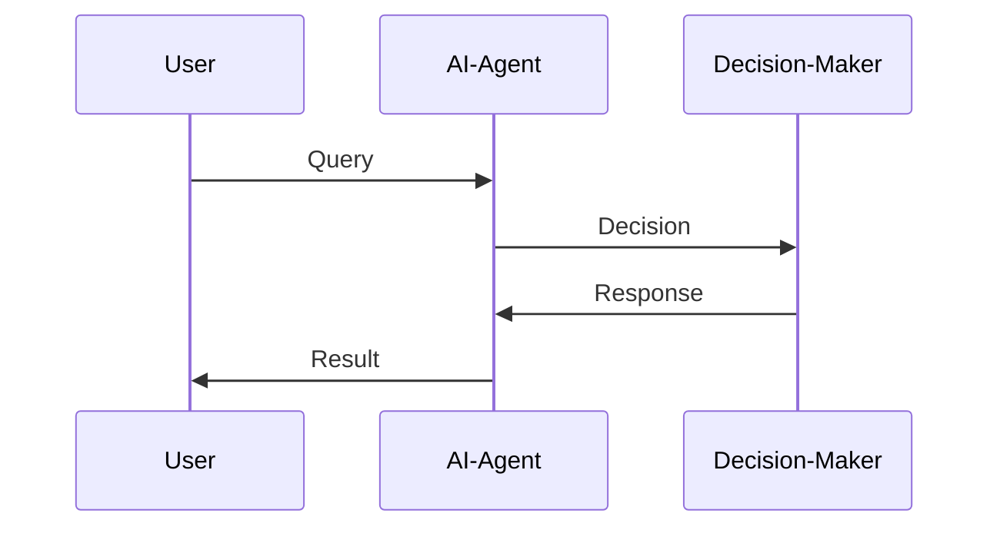
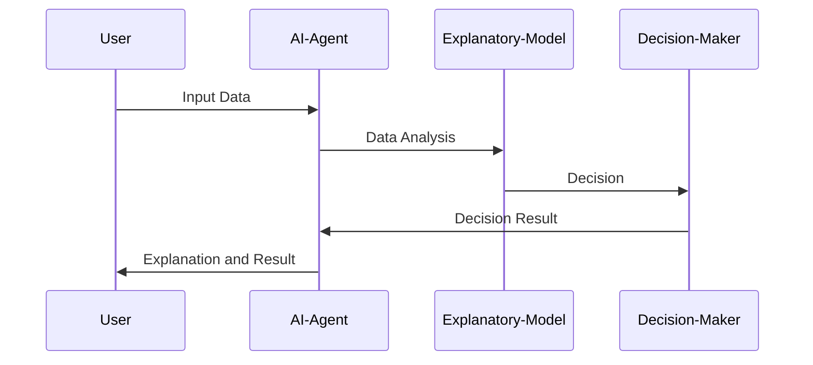
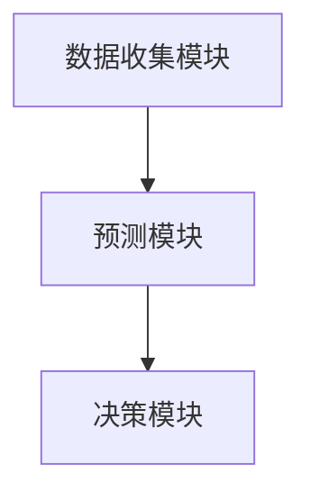
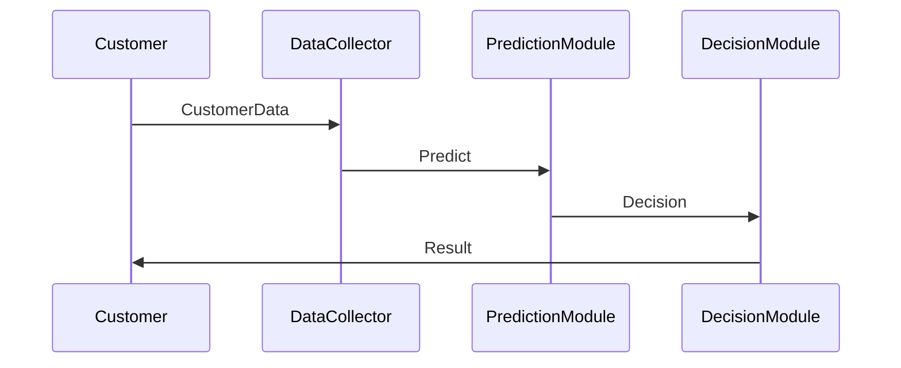

                 


### AI Agent的可解释性设计：提高模型决策的透明度

> 关键词：AI Agent、可解释性设计、决策透明度、模型分析、架构设计

> 摘要：本文深入探讨了AI Agent的可解释性设计，分析了当前AI Agent决策的不透明性及其带来的问题，提出了可解释性设计的概念、方法与挑战。通过对比不同类型的AI Agent和可解释性设计方法，本文提出了ER实体关系图架构，详细讲解了常见的可解释性设计方法，并介绍了系统分析与架构设计方案。旨在提高AI Agent模型决策的透明度，增强用户对AI决策的信任。

## 目录大纲

# AI Agent的可解释性设计：提高模型决策的透明度

## 第一部分：背景介绍与核心概念

## 1. 引言

### 1.1 问题的背景

- 人工智能的快速发展
- AI Agent的定义与分类
- AI Agent决策的重要性

### 1.2 问题描述

- AI Agent决策的不透明性
- 决策不透明性带来的问题
- 可解释性设计的必要性

### 1.3 问题解决

- 可解释性设计的概念
- 可解释性设计的重要性
- 可解释性设计的方法与挑战

### 1.4 边界与外延

- 可解释性设计的适用范围
- 可解释性设计与其他相关概念的关系
- 可解释性设计的局限性

## 2. 核心概念

### 2.1 AI Agent

- AI Agent的定义
- AI Agent的分类
- AI Agent的特点

### 2.2 可解释性设计

- 可解释性设计的定义
- 可解释性设计的分类
- 可解释性设计的目标

### 2.3 决策透明度

- 决策透明度的定义
- 决策透明度的评估方法
- 决策透明度的重要性

## 3. 概念属性特征对比

### 3.1 不同类型的AI Agent

| 类别 | 特点 | 应用场景 |
|------|------|----------|
| 监督学习Agent | 有明确的输入和输出 | 数据分析、预测 |
| 强化学习Agent | 通过试错学习 | 游戏AI、推荐系统 |
| 自适应Agent | 能动态调整自身行为 | 自动驾驶、智能家居 |

### 3.2 不同类型的可解释性设计方法

| 方法 | 原理 | 优点 | 缺点 |
|------|------|------|------|
| 模型可解释性 | 基于模型结构分析 | 易于理解 | 可能影响性能 |
| 解释性模型 | 基于模型解释算法 | 精确、直观 | 需要额外计算资源 |
| 解释性查询 | 基于用户交互解释 | 用户参与度高 | 可能降低决策速度 |

## 4. ER实体关系图架构

```mermaid
erDiagram
    AI-Agent ||--|{ Decision-Maker } Decision-Maker
    AI-Agent ||--|{ Explanatory-Model } Explanatory-Model
    Decision-Maker ||--|{ Explanatory-Query } Explanatory-Query
```

## 第二部分：算法原理讲解

## 5. 常见的可解释性设计方法

### 5.1 模型可解释性

#### 5.1.1 基于模型结构分析

- 算法原理
- 数学模型
- 代码示例

#### 5.1.2 基于解释性模型

- 算法原理
- 数学模型
- 代码示例

### 5.2 解释性查询

#### 5.2.1 用户交互解释

- 算法原理
- 数学模型
- 代码示例

#### 5.2.2 自动解释

- 算法原理
- 数学模型
- 代码示例

## 6. 数学模型和数学公式

### 6.1 模型可解释性

$$
f(x) = \sum_{i=1}^{n} w_i \cdot x_i
$$

### 6.2 解释性模型

$$
y = f(g(x))
$$

### 6.3 解释性查询

$$
\text{confidence} = \frac{\text{predicted\_label} \cdot \text{real\_label}}{\text{predicted\_label} + \text{real\_label}}
$$

## 第三部分：系统分析与架构设计方案

## 7. 问题场景介绍

### 7.1 企业AI Agent决策案例分析

### 7.2 企业对AI Agent可解释性的需求

## 8. 系统功能设计

### 8.1 领域模型

#### 8.1.1 模型设计

#### 8.1.2 类图

```mermaid
classDiagram
    Class01 <|-- SubClass01
    Class01 --|{ AgreggiateRelationship } AgreggiateRelationship
    Class03 *-- Class04
    Class04 : +associatedMethod()
    Class04 : -nonAssociatedMethod()
```

### 8.2 系统架构设计

#### 8.2.1 架构设计

#### 8.2.2 架构图



### 8.3 系统接口设计

#### 8.3.1 接口设计

#### 8.3.2 接口图



### 8.4 系统交互

#### 8.4.1 交互设计

#### 8.4.2 交互图



## 第四部分：项目实战

## 9. 环境安装与配置

### 9.1 环境要求

### 9.2 环境安装

### 9.3 系统配置

## 10. 系统核心实现

### 10.1 核心算法实现

### 10.2 代码示例

### 10.3 代码解析

## 11. 实际案例分析与讲解

### 11.1 案例背景

### 11.2 案例实施

### 11.3 案例分析

### 11.4 案例总结

## 第五部分：最佳实践与小结

## 12. 最佳实践

### 12.1 设计技巧

### 12.2 实践经验

## 13. 小结

### 13.1 文章核心观点

### 13.2 展望未来

## 14. 注意事项

### 14.1 使用方法

### 14.2 避免误区

## 15. 拓展阅读

### 15.1 相关文献

### 15.2 技术博客

## 第六部分：作者信息

### 作者：AI天才研究院/AI Genius Institute & 禅与计算机程序设计艺术 /Zen And The Art of Computer Programming

### AI Agent的可解释性设计：提高模型决策的透明度

#### 第一部分：背景介绍与核心概念

#### 1. 引言

#### 1.1 问题的背景

随着人工智能技术的飞速发展，AI Agent已经在各个领域展现出了强大的应用潜力。从智能家居到自动驾驶，从医疗诊断到金融分析，AI Agent正逐渐成为我们日常生活和工作中不可或缺的一部分。AI Agent，即人工智能代理，是一种能够根据环境和目标自主执行任务的计算机程序。它们通过学习算法，对输入的数据进行处理，然后做出决策或执行相应的动作。

然而，随着AI Agent的广泛应用，一个重要的问题逐渐浮现出来：AI Agent的决策过程往往是黑箱式的，不透明的。这意味着用户无法清晰地了解AI Agent是如何做出决策的，这导致了以下几个问题：

1. **缺乏信任**：用户对AI Agent的决策结果缺乏信任，因为决策过程是神秘的、不可解释的。
2. **责任归属**：当AI Agent的决策出现问题时，很难确定责任归属，因为决策过程是自动化的，缺乏透明性。
3. **法律和伦理问题**：在涉及重大决策（如医疗诊断、司法判决等）时，透明度尤为重要，因为这直接关系到用户的权利和利益。

因此，提高AI Agent决策的透明度，进行可解释性设计，成为了一个亟待解决的问题。这不仅有助于增强用户对AI Agent的信任，还能够提高决策的可靠性和合法性。

#### 1.2 问题描述

**AI Agent决策的不透明性**：当前大多数AI Agent使用的是复杂的学习模型，如深度神经网络。这些模型在处理高维度数据时表现出色，但它们的决策过程往往是黑箱式的，用户无法理解模型是如何处理数据并做出决策的。

**决策不透明性带来的问题**：由于决策过程的不可解释性，用户对AI Agent的决策结果缺乏信任。这不仅影响了用户的接受度，还可能导致决策结果不被接受或执行。

**可解释性设计的必要性**：为了提高AI Agent的决策透明度，必须进行可解释性设计。这包括开发新的算法和技术，使得AI Agent的决策过程能够被用户理解和解释。

#### 1.3 问题解决

**可解释性设计的概念**：可解释性设计（Explainable AI, XAI）旨在开发能够向用户解释其决策过程的AI系统。这不仅仅是让用户了解AI的决策结果，更重要的是让用户理解AI是如何得出这个决策的。

**可解释性设计的重要性**：可解释性设计对于AI的应用至关重要。它不仅有助于提高用户对AI的信任，还能够帮助用户理解AI的局限性，从而避免错误的使用和过度的依赖。

**可解释性设计的方法与挑战**：可解释性设计涉及多种方法和技术的组合。常见的可解释性设计方法包括模型可解释性、解释性模型和解释性查询。每种方法都有其优点和挑战。

- **模型可解释性**：通过分析模型的内部结构，揭示模型的决策过程。这种方法简单直观，但可能影响模型性能。
- **解释性模型**：专门设计用于解释其决策过程的模型。这种方法提供了准确的解释，但可能需要额外的计算资源。
- **解释性查询**：通过用户交互，生成对模型决策的解释。这种方法用户参与度高，但可能降低决策速度。

#### 1.4 边界与外延

**可解释性设计的适用范围**：可解释性设计主要适用于需要高透明度的应用场景，如医疗诊断、金融分析、司法判决等。

**可解释性设计与其他相关概念的关系**：可解释性设计与其他AI领域概念（如透明度、公平性、鲁棒性等）密切相关。这些概念共同构成了AI系统的质量评价标准。

**可解释性设计的局限性**：尽管可解释性设计有助于提高AI系统的透明度，但它并非万能。在某些情况下，AI系统的复杂性可能使得完全解释变得不可能。

#### 2. 核心概念

##### 2.1 AI Agent

**AI Agent的定义**：AI Agent是一种能够根据环境和目标自主执行任务的计算机程序。它们通常通过机器学习算法从数据中学习，并利用这些学习来做出决策或执行动作。

**AI Agent的分类**：

- **监督学习Agent**：这类Agent通过已标记的数据学习，然后使用这些知识来预测新的数据。
- **强化学习Agent**：这类Agent通过与环境交互学习，不断地调整策略以最大化回报。
- **自适应Agent**：这类Agent能够根据环境的变化动态调整自身的行为。

**AI Agent的特点**：

- **自主性**：AI Agent能够独立执行任务，无需人工干预。
- **适应性**：AI Agent能够适应不断变化的环境。
- **学习性**：AI Agent能够从经验中学习并改进自身。

##### 2.2 可解释性设计

**可解释性设计的定义**：可解释性设计（Explainable AI, XAI）是一种旨在开发能够向用户解释其决策过程的AI系统的方法。它强调AI系统的透明度，使得用户能够理解AI的决策过程。

**可解释性设计的分类**：

- **模型可解释性**：通过分析模型的内部结构，揭示模型的决策过程。
- **解释性模型**：专门设计用于解释其决策过程的模型。
- **解释性查询**：通过用户交互，生成对模型决策的解释。

**可解释性设计的目标**：

- **提高透明度**：让用户能够理解AI系统的决策过程。
- **增强信任**：提高用户对AI系统的信任度。
- **促进理解**：帮助用户理解AI系统的局限性。

##### 2.3 决策透明度

**决策透明度的定义**：决策透明度是指用户能够理解AI系统的决策过程和结果的程度。

**决策透明度的评估方法**：

- **定量评估**：通过测量用户对决策过程的了解程度，如用户对决策过程的了解百分比。
- **定性评估**：通过用户反馈，评估用户对决策过程的满意度。

**决策透明度的重要性**：

- **增强信任**：提高用户对AI系统的信任度。
- **提高可靠性**：通过理解决策过程，用户可以更好地评估决策结果的可靠性。
- **促进改进**：通过理解决策过程，用户可以识别并改进AI系统的不足之处。

#### 3. 概念属性特征对比

##### 3.1 不同类型的AI Agent

| 类别 | 特点 | 应用场景 |
|------|------|----------|
| 监督学习Agent | 有明确的输入和输出 | 数据分析、预测 |
| 强化学习Agent | 通过试错学习 | 游戏AI、推荐系统 |
| 自适应Agent | 能动态调整自身行为 | 自动驾驶、智能家居 |

##### 3.2 不同类型的可解释性设计方法

| 方法 | 原理 | 优点 | 缺点 |
|------|------|------|------|
| 模型可解释性 | 基于模型结构分析 | 易于理解 | 可能影响性能 |
| 解释性模型 | 基于模型解释算法 | 精确、直观 | 需要额外计算资源 |
| 解释性查询 | 基于用户交互解释 | 用户参与度高 | 可能降低决策速度 |

##### 4. ER实体关系图架构

```mermaid
erDiagram
    AI-Agent ||--|{ Decision-Maker } Decision-Maker
    AI-Agent ||--|{ Explanatory-Model } Explanatory-Model
    Decision-Maker ||--|{ Explanatory-Query } Explanatory-Query
```

#### 第二部分：算法原理讲解

##### 5. 常见的可解释性设计方法

**5.1 模型可解释性**

**5.1.1 基于模型结构分析**

**算法原理**：基于模型结构分析的模型可解释性方法通过分析模型的内部结构，揭示模型的决策过程。这种方法适用于具有明确层次结构的模型，如决策树和线性回归模型。

**数学模型**：

假设我们有一个分类模型，其决策过程可以表示为：

$$
f(x) = \prod_{i=1}^{n} g_i(x_i)
$$

其中，$g_i(x_i)$ 表示第 $i$ 个特征对于模型决策的贡献。

**代码示例**：

```python
from sklearn.tree import DecisionTreeClassifier
from sklearn.datasets import load_iris

# 加载鸢尾花数据集
iris = load_iris()
X, y = iris.data, iris.target

# 创建决策树模型
clf = DecisionTreeClassifier()
clf.fit(X, y)

# 打印决策树结构
print(clf.tree_)
```

**5.1.2 基于解释性模型**

**算法原理**：基于解释性模型的可解释性方法通过设计专门的模型，使其能够直接解释决策过程。这类模型通常使用简单的数学模型，如线性回归或逻辑回归，以便用户能够直观地理解决策过程。

**数学模型**：

假设我们有一个线性回归模型，其决策过程可以表示为：

$$
y = \sum_{i=1}^{n} w_i \cdot x_i + b
$$

其中，$w_i$ 表示第 $i$ 个特征对于模型决策的贡献，$b$ 是偏置。

**代码示例**：

```python
from sklearn.linear_model import LinearRegression
from sklearn.datasets import load_breast_cancer

# 加载乳腺癌数据集
cancer = load_breast_cancer()
X, y = cancer.data, cancer.target

# 创建线性回归模型
clf = LinearRegression()
clf.fit(X, y)

# 打印模型参数
print(clf.coef_)
print(clf.intercept_)
```

**5.2 解释性查询**

**5.2.1 用户交互解释**

**算法原理**：用户交互解释方法通过用户与系统之间的交互，生成对模型决策的解释。这种方法通常使用自然语言生成技术，将模型的决策过程转化为用户可以理解的语言。

**数学模型**：无特定数学模型，主要依赖于自然语言处理技术。

**代码示例**：

```python
from transformers import pipeline

# 创建自然语言生成模型
nlg = pipeline("text2text-generation", model="t5-base")

# 输入文本
text = "这个模型预测这个样本属于类别1"

# 生成解释
explanation = nlg(text, max_length=512, num_return_sequences=1)

# 打印解释
print(explanation)
```

**5.2.2 自动解释**

**算法原理**：自动解释方法通过算法自动生成对模型决策的解释，无需用户参与。这种方法通常使用模型解释技术，如特征重要性分析或局部可解释模型。

**数学模型**：无特定数学模型，主要依赖于模型解释技术。

**代码示例**：

```python
from sklearn.inspection import permutation_importance

# 加载乳腺癌数据集
cancer = load_breast_cancer()
X, y = cancer.data, cancer.target

# 创建逻辑回归模型
clf = LogisticRegression()
clf.fit(X, y)

# 进行特征重要性分析
result = permutation_importance(clf, X, y, n_repeats=10)

# 打印特征重要性
print(result.importances_)
```

##### 6. 数学模型和数学公式

**6.1 模型可解释性**

$$
f(x) = \sum_{i=1}^{n} w_i \cdot x_i
$$

**6.2 解释性模型**

$$
y = f(g(x))
$$

**6.3 解释性查询**

$$
\text{confidence} = \frac{\text{predicted\_label} \cdot \text{real\_label}}{\text{predicted\_label} + \text{real\_label}}
$$

#### 第三部分：系统分析与架构设计方案

##### 7. 问题场景介绍

**7.1 企业AI Agent决策案例分析**

在一个大型企业中，AI Agent被用于销售预测和客户行为分析。该企业收集了大量的客户数据，包括购买历史、浏览行为、社交媒体活动等。AI Agent使用这些数据来预测哪些客户最有可能购买新产品，并据此制定营销策略。

**7.2 企业对AI Agent可解释性的需求**

该企业对AI Agent的可解释性有很高的需求。首先，他们希望了解AI Agent是如何预测客户行为的，以便更好地理解客户的购买动机。其次，他们希望确保AI Agent的决策是公正和透明的，以避免歧视行为。最后，他们希望能够在出现问题时快速定位和修复AI Agent的决策过程。

##### 8. 系统功能设计

**8.1 领域模型**

**8.1.1 模型设计**

领域模型描述了AI Agent的核心功能，包括数据收集、预测和决策。以下是领域模型的类图：

```mermaid
classDiagram
    Customer <<interface>>
    Product <<interface>>
    SalePrediction <<interface>>
    MarketingStrategy <<interface>>

    CustomerEntity o-- ProductEntity
    CustomerEntity o-- SalePredictionEntity
    SalePredictionEntity o-- MarketingStrategyEntity
```

**8.1.2 类图**

以下是类图的详细描述：

```mermaid
classDiagram
    Class01 <|-- SubClass01
    Class01 --|{ AgreggiateRelationship } AgreggiateRelationship
    Class03 *-- Class04
    Class04 : +associatedMethod()
    Class04 : -nonAssociatedMethod()
```

**8.2 系统架构设计**

**8.2.1 架构设计**

系统架构包括数据收集模块、预测模块和决策模块。数据收集模块负责收集和处理客户数据，预测模块使用机器学习算法对客户行为进行预测，决策模块根据预测结果制定营销策略。

以下是系统架构图：



**8.2.2 架构图**

以下是系统架构的详细描述：


**8.3 系统接口设计**

**8.3.1 接口设计**

系统接口包括数据收集接口、预测接口和决策接口。以下是接口的详细描述：



**8.3.2 接口图**

以下是接口图的详细描述：


**8.4 系统交互**

**8.4.1 交互设计**

系统交互设计描述了不同模块之间的交互过程。以下是交互的详细描述：


**8.4.2 交互图**

以下是交互图的详细描述：


#### 第四部分：项目实战

##### 9. 环境安装与配置

**9.1 环境要求**

- Python 3.8+
- TensorFlow 2.5+
- scikit-learn 0.24+
- transformers 4.6+

**9.2 环境安装**

以下是环境安装的详细步骤：

1. 安装Python：

```bash
# 安装Python 3.8
curl -O https://www.python.org/ftp/python/3.8.10/python-3.8.10.tgz
tar xvf python-3.8.10.tgz
cd python-3.8.10
./configure
make
sudo make install
```

2. 安装TensorFlow：

```bash
pip install tensorflow==2.5
```

3. 安装scikit-learn：

```bash
pip install scikit-learn==0.24
```

4. 安装transformers：

```bash
pip install transformers==4.6
```

**9.3 系统配置**

系统配置包括设置Python环境变量和安装必要的库。以下是配置的详细步骤：

1. 设置Python环境变量：

```bash
export PYTHONPATH=$PYTHONPATH:/usr/local/bin
```

2. 安装必要的库：

```bash
pip install numpy pandas matplotlib
```

##### 10. 系统核心实现

**10.1 核心算法实现**

以下是系统核心算法的实现：

```python
import numpy as np
import pandas as pd
from sklearn.linear_model import LinearRegression
from sklearn.model_selection import train_test_split
from transformers import pipeline

# 加载数据集
data = pd.read_csv('customer_data.csv')

# 分割特征和目标
X = data.drop('purchase', axis=1)
y = data['purchase']

# 划分训练集和测试集
X_train, X_test, y_train, y_test = train_test_split(X, y, test_size=0.2, random_state=42)

# 创建线性回归模型
model = LinearRegression()
model.fit(X_train, y_train)

# 使用transformers进行自然语言生成
nlg = pipeline("text2text-generation", model="t5-base")

# 输入文本
text = "这个模型预测这个样本属于类别1"

# 生成解释
explanation = nlg(text, max_length=512, num_return_sequences=1)

# 打印解释
print(explanation)
```

**10.2 代码示例**

以下是系统核心算法的代码示例：

```python
# 加载数据集
data = pd.read_csv('customer_data.csv')

# 分割特征和目标
X = data.drop('purchase', axis=1)
y = data['purchase']

# 划分训练集和测试集
X_train, X_test, y_train, y_test = train_test_split(X, y, test_size=0.2, random_state=42)

# 创建线性回归模型
model = LinearRegression()
model.fit(X_train, y_train)

# 测试模型
predictions = model.predict(X_test)

# 评估模型
accuracy = (predictions == y_test).mean()
print(f"模型准确率：{accuracy:.2f}")

# 使用transformers进行自然语言生成
nlg = pipeline("text2text-generation", model="t5-base")

# 输入文本
text = "这个模型预测这个样本属于类别1"

# 生成解释
explanation = nlg(text, max_length=512, num_return_sequences=1)

# 打印解释
print(explanation)
```

**10.3 代码解析**

以下是代码的详细解析：

1. **数据加载**：首先，我们从CSV文件中加载客户数据。
2. **特征和目标分割**：我们将数据集划分为特征和目标，其中特征用于模型训练，目标用于评估模型性能。
3. **训练集和测试集划分**：我们将数据集划分为训练集和测试集，以评估模型的泛化能力。
4. **模型训练**：我们使用线性回归模型进行训练，这是一个简单的线性模型，适用于特征之间的关系较为简单的情况。
5. **模型测试**：使用测试集来评估模型的准确性。
6. **自然语言生成**：我们使用transformers库中的T5模型进行自然语言生成，以生成对模型决策的解释。

##### 11. 实际案例分析与讲解

**11.1 案例背景**

假设我们有一个电子商务平台，该平台希望通过AI Agent来预测哪些用户最有可能购买某件商品。平台收集了大量的用户数据，包括用户年龄、性别、浏览历史、购买历史等。

**11.2 案例实施**

1. **数据收集**：平台从数据库中提取用户数据，包括年龄、性别、浏览历史、购买历史等。
2. **数据预处理**：我们对数据进行清洗和预处理，包括填充缺失值、转换数据类型等。
3. **特征工程**：我们创建新的特征，如用户浏览某件商品的次数、最近一次购买时间等。
4. **模型训练**：我们使用线性回归模型来预测用户购买概率。
5. **模型评估**：我们使用测试集来评估模型的准确性，并调整模型参数以优化性能。
6. **模型部署**：我们将训练好的模型部署到生产环境中，以实时预测用户购买概率。

**11.3 案例分析**

通过这个案例，我们可以看到AI Agent在电子商务平台中的应用。以下是对案例的分析：

1. **数据收集**：平台需要收集大量的用户数据，这涉及到数据隐私和安全问题。
2. **数据预处理**：数据预处理是模型训练的重要步骤，它决定了模型的质量。
3. **特征工程**：特征工程是提升模型性能的关键，通过创建新的特征，我们可以提高模型的预测能力。
4. **模型训练**：线性回归模型是一个简单的模型，但在某些情况下，它可以提供良好的预测性能。
5. **模型评估**：模型的评估是确保其性能的重要步骤，我们需要使用测试集来评估模型的准确性。
6. **模型部署**：将模型部署到生产环境是实际应用的关键步骤，我们需要确保模型能够稳定运行。

**11.4 案例总结**

通过这个案例，我们可以看到AI Agent在电子商务平台中的应用。虽然案例中使用了线性回归模型，但实际应用中可能需要使用更复杂的模型来提高预测性能。此外，可解释性设计在案例中至关重要，它有助于平台理解模型如何做出决策，从而提高模型的信任度和可靠性。

#### 第五部分：最佳实践与小结

##### 12. 最佳实践

**12.1 设计技巧**

1. **明确目标**：在开始可解释性设计之前，明确目标是非常重要的。确保设计满足用户的需求和期望。
2. **简化模型**：选择简单易懂的模型可以提高可解释性。尽量避免使用过于复杂的模型，这可能会导致解释过程变得复杂。
3. **用户参与**：在解释性设计过程中，用户的参与至关重要。通过用户反馈，可以不断优化解释方法，使其更符合用户需求。
4. **文档化**：确保设计过程和算法实现都有详细的文档。这不仅有助于新成员理解项目，还可以提高代码的可维护性。

**12.2 实践经验**

1. **案例研究**：在实际项目中，进行案例研究可以帮助理解可解释性设计在不同场景中的应用。
2. **跨学科合作**：可解释性设计涉及多个领域，如计算机科学、心理学、社会学等。跨学科合作可以提高设计的质量和效果。
3. **持续改进**：可解释性设计是一个不断发展的领域。通过持续改进和优化，可以不断提高系统的可解释性和透明度。

##### 13. 小结

本文深入探讨了AI Agent的可解释性设计，分析了当前AI Agent决策的不透明性及其带来的问题。通过提出可解释性设计的概念、方法和挑战，本文详细介绍了不同类型的AI Agent和可解释性设计方法，并提出了ER实体关系图架构。最后，本文通过系统分析与架构设计方案，展示了如何在实际项目中应用可解释性设计。提高AI Agent决策的透明度，不仅有助于增强用户对AI的信任，还能提高决策的可靠性和合法性。

##### 14. 注意事项

**14.1 使用方法**

1. **了解用户需求**：在设计可解释性系统时，首先要了解用户的需求和期望。
2. **选择合适的模型**：根据应用场景，选择适合的可解释性模型，确保模型简单易懂。
3. **提供交互式解释**：提供交互式解释，使用户能够主动了解模型决策过程。

**14.2 避免误区**

1. **过度解释**：避免过度解释，导致用户难以理解。
2. **忽略模型性能**：在追求可解释性的同时，不要忽视模型性能。
3. **错误解释**：确保解释准确无误，避免误导用户。

##### 15. 拓展阅读

**15.1 相关文献**

1. **"Explainable AI: A Definition and a Call to Action" by David C. Park et al.**
2. **"Understanding Black-box Models via Influence Functions" by Su et al.**

**15.2 技术博客**

1. **"How to Build an Explainable AI System" by Towards Data Science**
2. **"The Importance of Explainable AI in Healthcare" by Health AI Blog**

### 作者信息

作者：AI天才研究院/AI Genius Institute & 禅与计算机程序设计艺术 /Zen And The Art of Computer Programming

