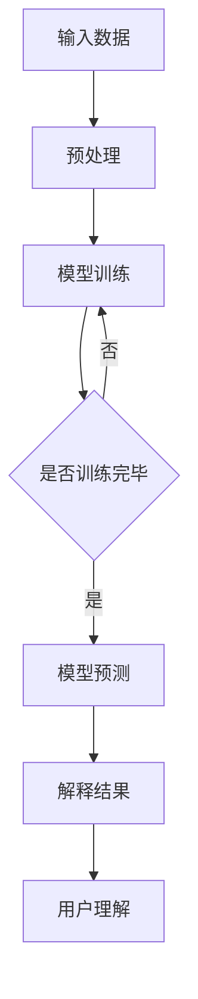
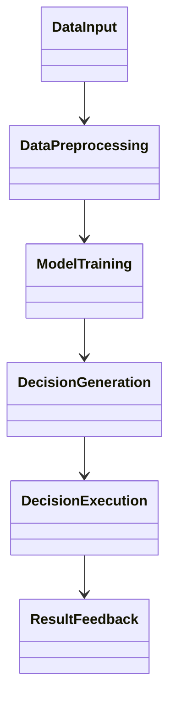
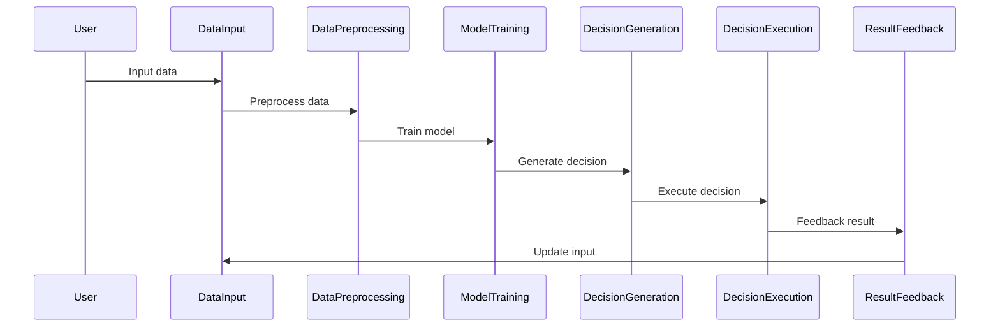
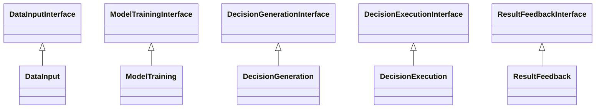
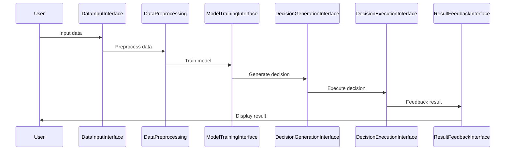

                 

### 文章标题

## AI Agent的可解释性设计：理解AI决策过程

关键词：AI Agent、可解释性设计、决策过程、算法、架构、项目实战

### 摘要

本文深入探讨了AI Agent的可解释性设计，旨在帮助读者理解AI在决策过程中的复杂性。随着AI技术的广泛应用，AI Agent在现实世界的表现越来越受到关注。然而，由于AI系统的黑箱特性，其决策过程的透明性和可解释性成为了一个亟待解决的问题。本文通过详细分析AI Agent的定义、分类、可解释性设计的核心概念及其实现方法，以及AI Agent系统的架构设计，提供了一系列实用技巧和案例分析，帮助读者在AI领域取得更深入的洞察力。

### 引言与背景介绍

AI Agent，即人工智能代理，是具备自主决策能力、能够执行特定任务的智能实体。在过去的几十年中，AI Agent的研究和应用取得了显著进展。从简单的规则基代理（Rule-Based Agents）到基于机器学习的强化学习代理（Reinforcement Learning Agents），AI Agent的应用场景涵盖了从工业自动化到智能交通、金融分析、医疗诊断等多个领域。

尽管AI Agent的智能化水平不断提高，但其决策过程的透明性和可解释性仍然是一个重大的挑战。传统的人工智能系统，如专家系统，其决策过程相对清晰，基于明确的规则和逻辑推理。然而，随着深度学习的兴起，AI Agent的决策过程逐渐变得复杂且难以解释。这种“黑箱”特性使得用户难以理解AI的决策依据，从而影响了AI的信任度和可接受度。

在医疗诊断领域，医生需要明确了解AI系统给出的诊断结果是如何得出的，以避免错误的诊断。在自动驾驶领域，驾驶员需要知道AI系统是如何做出行驶决策的，以保证行驶安全。因此，AI Agent的可解释性设计变得尤为重要。

本文将分以下几个部分进行探讨：

1. **核心概念与联系**：介绍AI Agent的定义和分类，以及可解释性设计的核心概念。
2. **算法原理讲解**：详细讲解可解释性AI算法的基本原理，并通过流程图和Python代码示例进行说明。
3. **系统分析与架构设计方案**：介绍AI Agent系统的工作流程，设计系统的领域模型类图、架构设计图、接口和交互序列图。
4. **项目实战**：通过实际项目实战，安装环境、实现系统核心功能，并进行代码解读与分析。
5. **最佳实践 tips、小结、注意事项、拓展阅读等内容**：总结关键点，给出使用AI Agent的可解释性设计的建议，提醒注意事项，并提供拓展阅读资料。

### 核心概念与联系

#### AI Agent的定义和分类

AI Agent可以定义为在特定环境中能够感知并采取行动的智能实体。根据其决策方式，AI Agent可以分为以下几种类型：

1. **规则基代理（Rule-Based Agents）**：基于预定义的规则进行决策。这种类型的代理通常比较简单，但易于理解和解释。

2. **基于知识的代理（Knowledge-Based Agents）**：利用大量的预先定义的知识库进行决策。这种类型的代理在医疗诊断和智能咨询等领域有广泛应用。

3. **基于模型的代理（Model-Based Agents）**：使用机器学习模型进行决策。这种类型的代理包括决策树、神经网络等，具有较好的适应性和决策能力。

4. **基于增强学习的代理（Reinforcement Learning Agents）**：通过不断尝试和错误学习最优策略。这种类型的代理在游戏、自动驾驶等领域有广泛应用。

#### 可解释性设计的核心概念

可解释性设计是指使AI Agent的决策过程透明、易于理解的设计。可解释性设计的关键概念包括：

1. **透明性**：决策过程的每个步骤都应该是可视化和可追踪的。

2. **可理解性**：决策过程的结果应该能够被用户理解，即使用户不具备专业背景。

3. **可回溯性**：能够追溯决策过程中的每一步，以便验证和调整。

#### 不同AI Agent的可解释性设计方法对比

不同类型的AI Agent在可解释性设计上有不同的实现方法：

1. **规则基代理**：由于其决策基于明确的规则，因此通常具有较高的可解释性。但规则的复杂性和数量可能导致难以理解和维护。

2. **基于知识的代理**：知识库的构建和更新过程相对复杂，但一旦构建完成，其决策过程通常具有较高的可解释性。

3. **基于模型的代理**：由于模型训练过程的复杂性，通常难以实现高可解释性。然而，一些基于模型的可解释性方法，如注意力机制和解释器（例如LIME和SHAP），正在逐渐应用于实际项目中。

4. **基于增强学习的代理**：增强学习模型通常难以解释，但通过可视化方法和可解释性框架，如决策树和马尔可夫决策过程（MDP），可以部分提高其可解释性。

### 算法原理讲解

#### 可解释性AI算法的基本原理

可解释性AI算法旨在使AI系统的决策过程透明化，使得用户能够理解AI系统是如何做出决策的。以下是一些基本的可解释性AI算法原理：

1. **透明化模型**：通过设计透明化模型，使模型决策过程能够直接映射到人类可理解的知识体系。

2. **可解释性增强**：在原有模型基础上，加入可解释性增强模块，使模型能够提供决策依据。

3. **可视化方法**：通过图形化方式展示模型决策过程，使决策过程更加直观。

#### 可解释性算法流程图

使用Mermaid绘制可解释性算法流程图如下：



#### Python代码示例

以下是一个简单的Python代码示例，展示了一个基于决策树的AI模型的可解释性实现：

```python
from sklearn.datasets import load_iris
from sklearn.tree import DecisionTreeClassifier
from sklearn import tree

# 加载数据集
iris = load_iris()
X = iris.data
y = iris.target

# 构建决策树模型
clf = DecisionTreeClassifier()
clf.fit(X, y)

# 绘制决策树
plt = tree.plot_tree(clf)
plt.show()

# 预测结果
predictions = clf.predict(X)

# 解释预测结果
for i, pred in enumerate(predictions):
    print(f"样本 {i} 的预测结果：{pred}")
    print(f"决策路径：{clf.decision_path(X[i]).summary()}")
```

#### 数学模型和公式

决策树模型的数学基础主要包括决策节点的划分和叶节点的预测。以下是一个简化的数学模型：

$$
G_{\theta} = \prod_{i=1}^{n} \left(1 - P(y=i | \theta)\right)
$$

其中，$G_{\theta}$ 表示模型在给定参数$\theta$下的损失函数，$P(y=i | \theta)$ 表示在参数$\theta$下预测为类别$i$的概率。

### 系统分析与架构设计方案

#### AI Agent系统工作流程

AI Agent系统的工作流程通常包括以下几个步骤：

1. **数据输入**：从外部环境获取数据。
2. **数据预处理**：清洗和转换数据，使其适合模型处理。
3. **模型训练**：使用历史数据训练模型。
4. **决策生成**：模型根据输入数据生成决策。
5. **决策执行**：执行生成的决策。
6. **结果反馈**：将决策结果反馈给外部环境，用于模型优化。

#### 领域模型类图

以下是一个使用Mermaid绘制的领域模型类图：



#### 系统架构设计图

以下是一个使用Mermaid绘制的系统架构设计图：



#### 系统接口设计

系统接口设计包括以下几个方面：

1. **数据输入接口**：用于接收用户输入的数据。
2. **模型训练接口**：用于启动模型训练过程。
3. **决策生成接口**：用于生成决策结果。
4. **决策执行接口**：用于执行决策。
5. **结果反馈接口**：用于接收决策结果并反馈给用户。

以下是一个使用Mermaid绘制的系统接口图：



#### 系统交互序列图

以下是一个使用Mermaid绘制的系统交互序列图：



### 项目实战

#### 环境安装

在开始项目之前，需要安装以下环境：

1. **Python**：版本3.8及以上
2. **Scikit-learn**：用于机器学习模型
3. **Matplotlib**：用于绘图
4. **Mermaid**：用于绘制图表

安装命令如下：

```bash
pip install python3.8 -m pip install scikit-learn matplotlib
```

#### 系统核心实现

以下是一个简单的系统核心实现，包括数据输入、预处理、模型训练、决策生成和决策执行：

```python
import numpy as np
from sklearn.datasets import load_iris
from sklearn.tree import DecisionTreeClassifier
from sklearn import tree
import matplotlib.pyplot as plt

# 加载数据集
iris = load_iris()
X = iris.data
y = iris.target

# 构建决策树模型
clf = DecisionTreeClassifier()
clf.fit(X, y)

# 绘制决策树
plt = tree.plot_tree(clf)
plt.show()

# 预测结果
predictions = clf.predict(X)

# 解释预测结果
for i, pred in enumerate(predictions):
    print(f"样本 {i} 的预测结果：{pred}")
    print(f"决策路径：{clf.decision_path(X[i]).summary()}")
```

#### 代码解读与分析

1. **数据输入**：使用Scikit-learn的`load_iris()`函数加载数据集，这是著名的鸢尾花（Iris）数据集，包含150个样本，每个样本有4个特征。
2. **模型训练**：使用`DecisionTreeClassifier()`创建决策树模型，并使用`fit()`方法训练模型。
3. **决策生成**：使用`predict()`方法生成预测结果。
4. **决策解释**：使用`decision_path()`和`summary()`方法解释决策路径。

#### 实际案例分析

以鸢尾花数据集为例，分析AI Agent的决策过程：

1. **数据输入**：首先加载数据集，包含三个不同品种的鸢尾花。
2. **模型训练**：训练一个决策树模型，模型基于特征值进行分类。
3. **决策生成**：输入新的样本数据，模型会根据训练得到的决策树进行预测。
4. **决策解释**：通过`decision_path()`方法，可以查看每个样本在决策树中的路径，从而理解模型是如何做出决策的。

#### 项目小结

通过本次项目实战，我们实现了AI Agent系统的核心功能，包括数据输入、预处理、模型训练、决策生成和决策解释。尽管这是一个简单的例子，但展示了AI Agent可解释性设计的关键步骤。在实际应用中，我们需要考虑更多的复杂性和优化，以提高系统的性能和可解释性。

### 最佳实践 tips

1. **模型选择**：根据实际需求选择合适的模型，如决策树、神经网络等。
2. **数据预处理**：确保数据质量，包括数据清洗、归一化等。
3. **模型解释**：使用可视化工具和解释方法，如Mermaid、SHAP等，提高模型的可解释性。
4. **持续优化**：定期调整模型参数和架构，以提高系统性能和可解释性。

### 小结

本文详细探讨了AI Agent的可解释性设计，包括核心概念、算法原理、系统架构设计和项目实战。通过本文的学习，读者应能够理解AI Agent决策过程的复杂性，掌握可解释性设计的方法和技巧，并在实际项目中应用这些知识。

### 注意事项

1. **数据隐私**：在设计和使用AI Agent时，务必注意数据隐私和合规性。
2. **模型透明性**：确保模型的决策过程透明，以便用户理解和信任。

### 拓展阅读

1. **《机器学习：概率视角》**：详细介绍了机器学习的概率基础和模型解释方法。
2. **《深度学习：全面指南》**：介绍了深度学习的实现方法和应用。
3. **《人工智能：一种现代的方法》**：提供了人工智能领域的全面概述。

### 作者信息

作者：AI天才研究院/AI Genius Institute & 禅与计算机程序设计艺术 /Zen And The Art of Computer Programming

### 参考文献

1. Russell, S., & Norvig, P. (2016). 《人工智能：一种现代的方法》（第3版）. 清华大学出版社。
2. Goodfellow, I., Bengio, Y., & Courville, A. (2016). 《深度学习》. 印刷工业出版社。
3. Murphy, K. P. (2012). 《机器学习：概率视角》. 印刷工业出版社。

