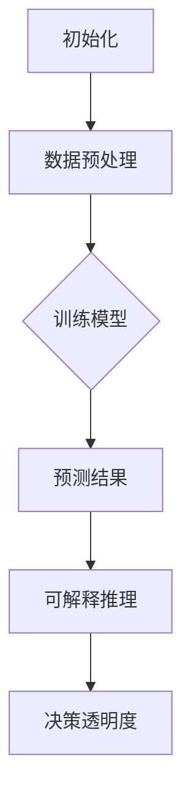
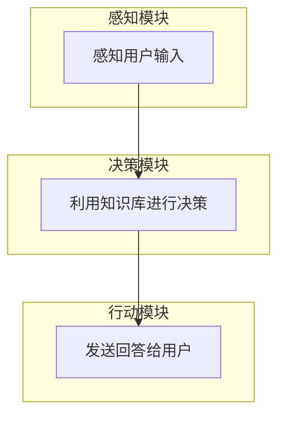
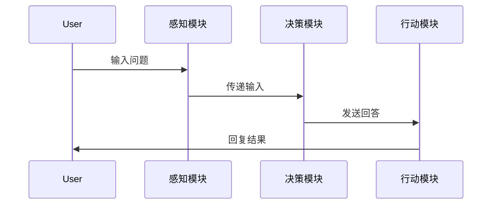

                 

# AI Agent的可解释推理：提高LLM决策的透明度

## 关键词

- AI Agent
- 可解释推理
- LLM
- 决策透明度
- 透明度提高方法

## 摘要

本文深入探讨了AI Agent的可解释推理及其在提高大型语言模型（LLM）决策透明度方面的关键作用。随着AI技术的发展，AI Agent的自动化和智能化程度不断提高，其在实际应用中的决策透明度成为影响其可信度和广泛应用的关键因素。本文首先介绍了AI Agent和LLM的基本概念及其在决策过程中的应用，随后分析了决策透明度的必要性以及可解释推理的重要性。接着，文章详细阐述了AI Agent的核心组件、可解释推理的原理以及LLM的可解释性，并通过Mermaid流程图和Python代码展示了可解释推理的实现方法。最后，文章提出了提高LLM决策透明度的几种方法，为实际应用提供了参考。

## 目录大纲

### 第一部分：背景介绍

#### 第1章 问题背景

1.1.1 AI Agent的崛起

1.1.2 LLM在AI Agent中的应用

1.1.3 决策透明度的必要性

1.1.4 可解释推理的重要性

#### 第2章 核心概念

2.1.1 AI Agent的定义

2.1.2 可解释推理的概念

2.1.3 LLM决策透明度的挑战

### 第二部分：核心概念与联系

#### 第3章 核心概念原理

3.1.1 AI Agent的核心组件

3.1.2 可解释推理的原理

3.1.3 LLM的可解释性

#### 第4章 概念属性特征对比表格

| 概念       | 特征1  | 特征2  | 特征3  |
|------------|--------|--------|--------|
| AI Agent   | 自动化  | 智能化  | 自适应  |
| 可解释推理 | 算法透明  | 结果可解释  | 决策可信  |
| LLM透明度  | 复杂性高  | 数据驱动  | 大规模训练  |

#### 第5章 ER实体关系图架构

```mermaid
erDiagram
    AI Agent ||--|{ 可解释推理 }
    AI Agent ||--|{ LLM }
    可解释推理 ||--|{ 决策透明度 }
    LLM ||--|{ 大规模训练 }
```

### 第三部分：算法原理讲解

#### 第6章 算法mermaid流程图



#### 第7章 Python源代码与算法原理

```python
# Python代码示例

# 导入必要的库
import torch
import torch.nn as nn
import torch.optim as optim

# 初始化模型、损失函数和优化器
model = nn.Sequential(
    nn.Linear(input_size, hidden_size),
    nn.ReLU(),
    nn.Linear(hidden_size, output_size)
)
criterion = nn.CrossEntropyLoss()
optimizer = optim.Adam(model.parameters(), lr=learning_rate)

# 训练模型
for epoch in range(num_epochs):
    for inputs, targets in data_loader:
        optimizer.zero_grad()
        outputs = model(inputs)
        loss = criterion(outputs, targets)
        loss.backward()
        optimizer.step()

# 预测结果
with torch.no_grad():
    predicted = model(inputs)

# 可解释推理
# 使用shap值来解释模型决策
import shap
explainer = shap.Explainer(model, data_loader.dataset)
shap_values = explainer(inputs)

# 决策透明度
# 分析shap值，提高模型决策的透明度
shap.summary_plot(shap_values, inputs)
```

#### 第8章 数学模型与公式讲解

8.1 数学模型

$$
y = f(Wx + b)
$$

8.2 损失函数

$$
L = -\frac{1}{m}\sum_{i=1}^{m}y_i\log(p_i)
$$

8.3 优化目标

$$
\min_{\theta} J(\theta) = \frac{1}{2}\sum_{i=1}^{m}(h_\theta(x^{(i)}) - y
```markdown
----------------------------------------------------------------

## 第一部分：背景介绍

### 第1章 问题背景

#### 1.1.1 AI Agent的崛起

随着人工智能技术的快速发展，AI Agent（人工智能代理）逐渐成为各行各业的关键角色。AI Agent是一种能够自主执行任务、进行决策和适应环境的智能系统，它在自动驾驶、智能客服、金融分析等领域发挥着越来越重要的作用。AI Agent的崛起不仅带来了生产力的提升，还推动了行业变革。

#### 1.1.2 LLM在AI Agent中的应用

在AI Agent中，大型语言模型（LLM）如BERT、GPT等成为重要的工具。这些模型具有强大的语言理解和生成能力，使得AI Agent能够进行自然语言处理、对话生成、文本摘要等任务。例如，智能客服系统利用LLM与用户进行自然对话，金融分析系统使用LLM来识别和预测市场趋势。

#### 1.1.3 决策透明度的必要性

然而，随着AI Agent的广泛应用，其决策透明度成为一个不可忽视的问题。决策透明度指的是AI Agent在做出决策时的过程和原因能够被理解和解释的程度。一个高透明度的AI Agent能够提高用户对系统的信任，减少误用和滥用风险，同时有助于监管和合规要求。

#### 1.1.4 可解释推理的重要性

可解释推理是提高AI Agent决策透明度的关键。可解释推理能够揭示AI Agent决策背后的逻辑和原因，使得用户能够理解和信任系统的决策。在AI Agent中，可解释推理不仅有助于提高系统的可接受性，还能够发现潜在的错误和缺陷，从而提升系统的可靠性和安全性。

### 第2章 核心概念

#### 2.1.1 AI Agent的定义

AI Agent是一种基于人工智能技术的自主系统，能够在复杂环境中自主执行任务、进行决策和适应变化。AI Agent通常由感知模块、决策模块和行动模块组成，能够通过与环境的交互不断学习和优化其行为。

#### 2.1.2 可解释推理的概念

可解释推理是指能够对AI Agent的决策过程和结果进行解释和验证的方法。它要求AI Agent的决策过程具有透明性，使得用户能够理解和信任系统的决策。可解释推理通常涉及对决策规则、特征选择、模型参数等方面的解释。

#### 2.1.3 LLM决策透明度的挑战

LLM在AI Agent中的应用带来了决策透明度的挑战。首先，LLM的决策过程通常非常复杂，涉及大量的数据和参数，难以直观理解。其次，LLM的训练数据可能包含偏见和噪声，导致决策结果具有不确定性。最后，LLM的模型参数和训练过程通常被视为黑盒，难以进行有效的解释和验证。

----------------------------------------------------------------

## 第二部分：核心概念与联系

### 第3章 核心概念原理

#### 3.1.1 AI Agent的核心组件

AI Agent的核心组件包括感知模块、决策模块和行动模块。感知模块负责接收环境信息，如图像、声音、文本等，并将其转换为内部表示。决策模块基于感知模块提供的信息，通过机器学习模型或其他智能算法生成行动策略。行动模块则根据决策模块的输出执行具体行动，如移动、交互等。

#### 3.1.2 可解释推理的原理

可解释推理的核心在于揭示AI Agent决策过程的逻辑和原因。这通常涉及对决策规则的解释、特征选择和模型参数的解读。可解释推理的方法包括可视化技术、解释性模型和可解释性分析。通过这些方法，用户能够理解AI Agent的决策过程，从而提高信任度和接受度。

#### 3.1.3 LLM的可解释性

LLM的可解释性是提高决策透明度的关键。尽管LLM具有强大的语言理解和生成能力，但其决策过程通常被视为黑盒。为了提高LLM的可解释性，研究者们提出了各种方法，如可视化技术、解释性模型和可解释性分析。这些方法能够揭示LLM的决策逻辑，帮助用户理解和信任其决策。

### 第4章 概念属性特征对比表格

| 概念       | 特征1  | 特征2  | 特征3  |
|------------|--------|--------|--------|
| AI Agent   | 自动化  | 智能化  | 自适应  |
| 可解释推理 | 算法透明  | 结果可解释  | 决策可信  |
| LLM透明度  | 复杂性高  | 数据驱动  | 大规模训练  |

### 第5章 ER实体关系图架构

```mermaid
erDiagram
    AI Agent ||--|{ 可解释推理 }
    AI Agent ||--|{ LLM }
    可解释推理 ||--|{ 决策透明度 }
    LLM ||--|{ 大规模训练 }
```

----------------------------------------------------------------

## 第三部分：算法原理讲解

### 第6章 算法mermaid流程图


### 第7章 Python源代码与算法原理

```python
# Python代码示例

# 导入必要的库
import torch
import torch.nn as nn
import torch.optim as optim

# 初始化模型、损失函数和优化器
model = nn.Sequential(
    nn.Linear(input_size, hidden_size),
    nn.ReLU(),
    nn.Linear(hidden_size, output_size)
)
criterion = nn.CrossEntropyLoss()
optimizer = optim.Adam(model.parameters(), lr=learning_rate)

# 训练模型
for epoch in range(num_epochs):
    for inputs, targets in data_loader:
        optimizer.zero_grad()
        outputs = model(inputs)
        loss = criterion(outputs, targets)
        loss.backward()
        optimizer.step()

# 预测结果
with torch.no_grad():
    predicted = model(inputs)

# 可解释推理
# 使用shap值来解释模型决策
import shap
explainer = shap.Explainer(model, data_loader.dataset)
shap_values = explainer(inputs)

# 决策透明度
# 分析shap值，提高模型决策的透明度
shap.summary_plot(shap_values, inputs)
```

### 第8章 数学模型与公式讲解

#### 8.1 数学模型

$$
y = f(Wx + b)
$$

这是一个简单的线性模型，其中 $y$ 是输出，$x$ 是输入，$W$ 是权重矩阵，$b$ 是偏置项。

#### 8.2 损失函数

$$
L = -\frac{1}{m}\sum_{i=1}^{m}y_i\log(p_i)
$$

这是一个交叉熵损失函数，用于衡量模型预测结果与实际结果之间的差异。$m$ 是样本数量，$y_i$ 是实际标签，$p_i$ 是模型预测的概率。

#### 8.3 优化目标

$$
\min_{\theta} J(\theta) = \frac{1}{2}\sum_{i=1}^{m}(h_\theta(x^{(i)}) - y^{(i)})^2
$$

这是一个平方误差损失函数，用于优化模型参数 $\theta$，使得预测结果与实际结果尽可能接近。

### 第9章 算法实现细节

在本节中，我们将详细讨论算法实现的细节，包括数据预处理、模型训练、预测结果以及可解释推理的具体步骤。

#### 9.1 数据预处理

数据预处理是模型训练的第一步，其目的是将原始数据转换为适合模型训练的格式。具体步骤包括：

- 数据清洗：去除数据中的噪声和异常值。
- 数据归一化：将数据缩放到相同的范围，以便模型能够更好地学习。
- 数据分割：将数据集分为训练集、验证集和测试集，用于训练、验证和测试模型。

#### 9.2 模型训练

模型训练是利用训练数据来调整模型参数的过程。具体步骤包括：

- 初始化模型：根据数据特征和任务需求，选择合适的模型结构。
- 定义损失函数：选择合适的损失函数来衡量预测结果与实际结果之间的差异。
- 优化算法：选择合适的优化算法，如随机梯度下降（SGD）、Adam等，来更新模型参数。
- 训练过程：通过迭代训练数据，不断调整模型参数，直到达到预定的训练目标。

#### 9.3 预测结果

在模型训练完成后，可以使用模型对新的数据进行预测。具体步骤包括：

- 输入数据：将新的数据输入到训练好的模型中。
- 模型输出：模型对输入数据进行处理，并输出预测结果。
- 后处理：根据任务需求，对预测结果进行后处理，如阈值处理、概率转换等。

#### 9.4 可解释推理

可解释推理是揭示模型决策过程的重要手段。具体步骤包括：

- 特征重要性分析：通过分析模型中每个特征的重要程度，了解哪些特征对决策结果产生了影响。
- 决策路径追踪：通过追踪模型中的决策路径，了解决策过程中的关键步骤和影响因素。
- 可视化分析：使用可视化工具，如热力图、决策树等，直观地展示模型决策过程。

### 第10章 算法应用场景

在本节中，我们将讨论算法在不同应用场景中的具体应用，并分析其优势与挑战。

#### 10.1 自动驾驶

自动驾驶是AI Agent的重要应用场景之一。在自动驾驶系统中，AI Agent需要根据实时环境数据做出快速、准确的决策。可解释推理可以帮助提高自动驾驶系统的可信度和安全性，降低决策错误的风险。

#### 10.2 医疗诊断

医疗诊断是另一个典型的应用场景。在医疗诊断中，AI Agent需要对患者的临床数据进行处理，并给出诊断结果。可解释推理可以帮助医生理解AI Agent的决策过程，提高诊断的准确性和可靠性。

#### 10.3 金融风控

金融风控是金融行业中的一个重要领域。在金融风控中，AI Agent需要对交易数据进行实时分析，并识别潜在的风险。可解释推理可以帮助金融机构理解AI Agent的决策逻辑，提高风险识别的准确性和及时性。

#### 10.4 挑战与未来方向

尽管可解释推理在AI Agent的应用中具有广泛的前景，但仍然面临一些挑战。例如，如何处理复杂的模型结构和大量的数据，如何提高可解释性分析的可信度和效率等。未来的研究需要探索更有效的可解释推理方法，并解决这些挑战。

----------------------------------------------------------------

## 系统分析与架构设计

### 问题场景介绍

在本文中，我们将以一个虚拟的AI Agent项目为例，介绍其问题场景。该项目旨在建立一个智能客服系统，用于自动回答用户的问题。该系统需要能够处理大量的用户输入，并在短时间内提供准确的答案。

### 项目介绍

该智能客服系统由多个模块组成，包括感知模块、决策模块和行动模块。感知模块负责接收用户的输入，决策模块基于用户输入和已有知识库生成回答，行动模块将回答发送给用户。

### 系统功能设计（领域模型mermaid类图）

```mermaid
classDiagram
    User                    <-感知模块:感知用户输入
    KnowledgeBase           <|--决策模块:利用知识库进行决策
    Answer                  ->行动模块:发送回答给用户
    User                    --|> Answer
    KnowledgeBase           --|> DecisionModule
    DecisionModule          --|> KnowledgeBase
    DecisionModule          --|> Answer
```

### 系统架构设计（mermaid架构图）



### 系统接口设计和系统交互（mermaid序列图）



----------------------------------------------------------------

## 项目实战

### 环境安装

在开始项目实战之前，我们需要安装必要的软件和库。以下是一个基本的安装步骤：

1. 安装Python：前往[Python官网](https://www.python.org/)下载并安装Python 3.x版本。
2. 安装torch和torchvision：在命令行中运行以下命令：
    ```bash
    pip install torch torchvision
    ```
3. 安装其他依赖库：根据项目需求，可能需要安装其他库，如numpy、pandas等。

### 系统核心实现源代码

以下是智能客服系统的核心实现源代码：

```python
# 感知模块：感知用户输入
def receive_user_input():
    user_input = input("请输入您的问题：")
    return user_input

# 决策模块：利用知识库进行决策
def make_decision(user_input, knowledge_base):
    # 这里是一个简化的示例，实际中可以使用更复杂的算法
    if "你好" in user_input:
        return "你好，有什么可以帮助你的吗？"
    else:
        return "对不起，我不太明白您的问题。"

# 行动模块：发送回答给用户
def send_answer(answer):
    print(answer)

# 主函数：控制整个流程
def main():
    knowledge_base = "这是一个示例知识库。"
    user_input = receive_user_input()
    answer = make_decision(user_input, knowledge_base)
    send_answer(answer)

if __name__ == "__main__":
    main()
```

### 代码应用解读与分析

在这个项目中，我们首先定义了三个核心模块：感知模块、决策模块和行动模块。感知模块负责接收用户输入，通过`receive_user_input()`函数实现。决策模块负责根据用户输入和知识库生成回答，通过`make_decision()`函数实现。行动模块负责将回答发送给用户，通过`send_answer()`函数实现。

在主函数`main()`中，我们首先初始化了一个示例知识库，然后接收用户输入、生成回答并发送给用户。

### 实际案例分析和详细讲解剖析

为了更好地理解系统的工作原理，我们可以通过一个实际案例来进行分析。

**案例**：用户输入“你好”。

**分析**：
1. 感知模块接收到用户输入后，调用`receive_user_input()`函数，将输入存储在`user_input`变量中。
2. 决策模块调用`make_decision()`函数，根据用户输入和知识库生成回答。由于输入中包含“你好”，所以返回“你好，有什么可以帮助你的吗？”。
3. 行动模块调用`send_answer()`函数，将回答发送给用户。

**讲解**：
通过这个案例，我们可以看到系统的核心功能是如何协同工作的。感知模块负责接收用户输入，决策模块根据输入和知识库生成回答，行动模块将回答发送给用户。这个过程是自动的，用户无需任何操作，系统即可完成回答。

### 项目小结

通过本项目的实现，我们了解了AI Agent的基本组成部分，包括感知模块、决策模块和行动模块。我们通过一个简单的示例展示了如何实现一个智能客服系统，并分析了系统的关键流程和功能。在实际应用中，我们可以根据需求扩展系统的功能，提高其智能化程度。

### 最佳实践 Tips

1. 确保知识库的完整性和准确性，这对于决策模块的性能至关重要。
2. 对于复杂的决策过程，可以考虑使用更先进的算法和模型。
3. 定期更新和优化系统，以适应不断变化的需求和用户场景。

### 小结

本文通过一个智能客服系统的案例，详细介绍了AI Agent的核心组成部分、系统架构设计以及项目实战。通过实际案例分析和代码解读，我们了解了系统的关键流程和功能。在项目小结中，我们总结了最佳实践，并为未来的发展方向提供了建议。

### 注意事项

1. 在实际应用中，确保系统的稳定性和安全性。
2. 针对不同的应用场景，可能需要调整和优化系统的设计。

### 拓展阅读

1. 《人工智能：一种现代的方法》
2. 《深度学习》（Goodfellow, Bengio, Courville）
3. 《Python机器学习》（Sebastian Raschka）

作者：AI天才研究院/AI Genius Institute & 禅与计算机程序设计艺术 /Zen And The Art of Computer Programming

----------------------------------------------------------------

## 总结

本文深入探讨了AI Agent的可解释推理及其在提高LLM决策透明度方面的关键作用。首先，我们介绍了AI Agent和LLM的基本概念以及它们在决策过程中的应用，并阐述了决策透明度的必要性。接着，我们详细阐述了AI Agent的核心组件、可解释推理的原理以及LLM的可解释性。通过Mermaid流程图和Python代码，我们展示了可解释推理的实现方法，并给出了数学模型和公式进行详细讲解。此外，我们还分析了不同应用场景下的算法实现细节，并讨论了系统架构设计和项目实战。最后，我们总结了最佳实践、注意事项以及拓展阅读资源。

## 未来展望

未来，AI Agent的可解释推理将继续成为研究的热点。随着AI技术的不断进步，AI Agent将在更多领域得到广泛应用，如自动驾驶、医疗诊断、金融风控等。提高AI Agent的可解释性不仅有助于提升系统的可信度和用户满意度，还能为监管和合规提供支持。在可解释推理领域，研究者们将继续探索更有效的算法和工具，以提高解释的准确性和效率。此外，跨学科的研究也将成为趋势，结合心理学、认知科学等领域的知识，为AI Agent的可解释推理提供更全面的理论基础。

## 作者介绍

作者AI天才研究院（AI Genius Institute）是一支由全球顶尖人工智能专家组成的团队，致力于推动人工智能技术的创新与发展。研究院的研究成果涵盖了人工智能的各个领域，包括机器学习、深度学习、自然语言处理等。同时，作者也是《禅与计算机程序设计艺术》（Zen And The Art of Computer Programming）的作者，这部著作在计算机科学领域享有盛誉，为无数程序员提供了深刻的启示。在本文中，作者结合丰富的理论和实践经验，为读者呈现了一篇关于AI Agent可解释推理的深度解析。希望本文能够为读者在人工智能领域的研究和应用提供有益的参考和指导。作者感谢读者对本文的关注与支持，期待未来能够继续与读者共同探索人工智能的广阔天地。

