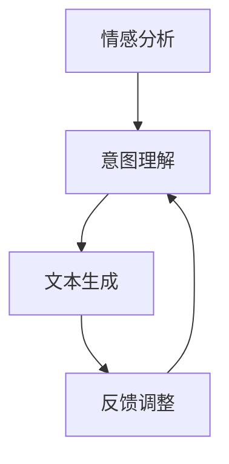

                 

### AI Agent的同理心模拟：增强LLM的情感共鸣能力

关键词：AI Agent，同理心模拟，情感共鸣，LLM，算法实现，系统架构

摘要：本文深入探讨了AI Agent的同理心模拟及其在增强自然语言处理模型（LLM）情感共鸣能力中的应用。通过逐步分析同理心的核心概念、LLM的工作原理以及情感共鸣算法的数学模型，本文提出了一个系统化的方法来提高AI Agent在同理心模拟中的表现。文章还提供了实际案例和系统架构设计，以展示这一技术的实际应用和未来发展潜力。

----------------------------------------------------------------

### 目录大纲

```
# AI Agent的同理心模拟：增强LLM的情感共鸣能力

## 第一部分：背景介绍与核心概念

### 第1章：同理心模拟的背景与重要性

#### 1.1.1 人类同理心模拟的需求

#### 1.1.2 AI Agent与同理心模拟

#### 1.1.3 LLM在同理心模拟中的应用

### 第2章：同理心的核心概念与属性

#### 2.1.1 同理心的定义

#### 2.1.2 同理心的属性特征

#### 2.1.3 同理心与情感共鸣的关系

### 第3章：LLM的工作原理及其在同理心模拟中的应用

#### 3.1.1 LLM的原理与结构

#### 3.1.2 LLM在同理心模拟中的作用

#### 3.1.3 LLM的情感共鸣能力分析

### 第4章：同理心模拟中的核心概念联系

#### 4.1.1 同理心模拟中的概念架构

#### 4.1.2 同理心模拟中的ER实体关系图

#### 4.1.3 同理心模拟中的属性特征对比表格

## 第二部分：算法原理与实现

### 第5章：AI Agent同理心模拟算法原理

#### 5.1.1 同理心模拟算法概述

#### 5.1.2 情感共鸣算法的mermaid流程图

#### 5.1.3 情感共鸣算法的Python实现

### 第6章：数学模型与公式讲解

#### 6.1.1 情感共鸣能力的数学模型

#### 6.1.2 情感强度评估公式

#### 6.1.3 情感共鸣因子的影响因素分析

### 第7章：实际案例分析与应用

#### 7.1.1 情感共鸣在聊天机器人中的应用

#### 7.1.2 情感共鸣在客服系统中的应用

#### 7.1.3 情感共鸣在教育领域中的应用

### 第8章：系统架构设计与实现

#### 8.1.1 情感共鸣系统功能设计

#### 8.1.2 情感共鸣系统架构设计

#### 8.1.3 情感共鸣系统接口设计与交互

## 第三部分：最佳实践与未来展望

### 第9章：最佳实践技巧与注意事项

#### 9.1.1 提高同理心模拟效果的技巧

#### 9.1.2 使用LLM进行同理心模拟的注意事项

### 第10章：小结与未来展望

#### 10.1.1 书籍总结

#### 10.1.2 同理心模拟技术的发展趋势

#### 10.1.3 拓展阅读推荐
```

----------------------------------------------------------------

### 第一部分：背景介绍与核心概念

#### 第1章：同理心模拟的背景与重要性

##### 1.1.1 人类同理心模拟的需求

同理心（Empathy）是人类社会交往中不可或缺的心理能力，它指的是个体在感知他人情绪状态的基础上，能够理解并体验到他人的情感体验。在日常生活中，同理心对于建立和维护人际关系、解决冲突以及促进社会和谐具有重要意义。

然而，随着人工智能（AI）技术的快速发展，人们开始思考是否可以让机器也具备同理心，从而更好地服务于人类。AI Agent的同理心模拟正是基于这一需求而提出的。通过模拟同理心，AI Agent可以在与人类的交互过程中表现出更为人性化的行为，提高用户的满意度和信任度。

##### 1.1.2 AI Agent与同理心模拟

AI Agent是一种智能体，它能够自动执行任务、感知环境并与其他实体进行交互。同理心模拟是指AI Agent在处理交互任务时，能够理解并模拟人类同理心的过程。具体来说，这包括感知用户情绪、理解用户意图以及通过情感共鸣来提升用户体验。

同理心模拟在AI Agent中的应用场景非常广泛。例如，在聊天机器人中，同理心模拟可以帮助机器人更好地理解用户的需求和情绪，从而提供更为贴心的服务；在客服系统中，同理心模拟可以使机器人更自然地与客户沟通，提高客户满意度；在教育领域，同理心模拟可以帮助AI教师更好地理解学生的情感状态，提供个性化的学习支持。

##### 1.1.3 LLM在同理心模拟中的应用

自然语言处理（NLP）模型是AI Agent实现同理心模拟的重要工具。其中，预训练语言模型（LLM）如BERT、GPT等在情感分析、文本生成等方面表现出色。LLM在同理心模拟中的应用主要体现在以下几个方面：

1. **情感分析**：LLM可以通过情感分析技术来识别文本中的情感倾向，从而感知用户的情绪状态。
2. **文本生成**：LLM可以生成符合特定情感调性的文本，以实现情感共鸣。
3. **意图理解**：LLM可以帮助AI Agent理解用户的意图，从而更好地模拟同理心。

LLM在同理心模拟中的应用为AI Agent提供了一种强大的工具，使得机器可以更好地理解人类情感，实现更为人性化的交互。

#### 第2章：同理心的核心概念与属性

##### 2.1.1 同理心的定义

同理心是指个体在感知他人情绪状态的基础上，能够理解并体验他人情感体验的心理过程。同理心可以分为认知同理心（Cognitive Empathy）和情感同理心（Affective Empathy）两种类型：

- **认知同理心**：个体能够理解他人的情绪状态，但并不一定能够产生情感共鸣。
- **情感同理心**：个体不仅能够理解他人的情绪状态，还能产生情感共鸣，体验他人的情感。

##### 2.1.2 同理心的属性特征

同理心具有以下几个关键属性特征：

- **感知能力**：同理心依赖于个体对他人情绪状态的感知能力。这需要AI Agent具备较强的情感分析能力，能够准确识别用户的情感。
- **理解能力**：同理心要求AI Agent能够理解他人的情感状态，这意味着AI Agent需要对人类的情感和情绪有深刻的理解。
- **情感共鸣**：同理心最终体现在情感共鸣上，即AI Agent能够在情感上与用户产生共鸣。

##### 2.1.3 同理心与情感共鸣的关系

同理心与情感共鸣是紧密相关的。同理心是指个体在理解他人情感状态的基础上，产生情感共鸣的心理过程。情感共鸣是同理心的核心表现，它使得AI Agent能够与用户在情感上产生连接，提升交互体验。

#### 第3章：LLM的工作原理及其在同理心模拟中的应用

##### 3.1.1 LLM的原理与结构

预训练语言模型（LLM）是基于大规模语料库进行预训练的深度神经网络模型。其基本结构通常包括以下几个部分：

- **嵌入层**：将文本转换为固定长度的向量表示。
- **编码器**：对文本进行编码，提取文本的语义信息。
- **解码器**：根据编码后的文本信息生成响应文本。

LLM的工作原理基于自注意力机制（Self-Attention），通过多层次的自我关注和交互，模型能够捕捉文本中的长距离依赖关系，从而实现高效的文本理解和生成。

##### 3.1.2 LLM在同理心模拟中的作用

LLM在同理心模拟中发挥着关键作用：

- **情感分析**：LLM可以通过情感分析技术，识别文本中的情感倾向，帮助AI Agent理解用户的情绪状态。
- **文本生成**：LLM可以生成符合特定情感调性的文本，实现情感共鸣。
- **意图理解**：LLM可以帮助AI Agent理解用户的意图，从而更好地模拟同理心。

##### 3.1.3 LLM的情感共鸣能力分析

LLM的情感共鸣能力主要体现在以下几个方面：

- **情感识别**：LLM可以通过情感分析技术，准确识别文本中的情感。
- **情感调性匹配**：LLM可以生成与用户情感状态相匹配的文本，实现情感共鸣。
- **情感推理**：LLM可以通过情感推理，理解用户的隐含情感，从而更好地模拟同理心。

#### 第4章：同理心模拟中的核心概念联系

##### 4.1.1 同理心模拟中的概念架构

同理心模拟中的核心概念包括情感分析、文本生成和意图理解。这些概念通过以下方式相互联系：

- **情感分析**：识别用户的情感状态，为文本生成和意图理解提供基础。
- **文本生成**：根据用户的情感状态和意图，生成符合情感调性的文本，实现情感共鸣。
- **意图理解**：理解用户的意图，指导AI Agent的响应行为。

##### 4.1.2 同理心模拟中的ER实体关系图

同理心模拟中的ER实体关系图如下：

```
用户 -> (情感分析) -> 情感状态
用户 -> (意图理解) -> 用户意图
情感状态 -> (文本生成) -> 响应文本
用户意图 -> (文本生成) -> 响应文本
```

##### 4.1.3 同理心模拟中的属性特征对比表格

同理心模拟中的属性特征对比表格如下：

| 属性特征       | 描述                                                         |  
| :------------ | :----------------------------------------------------------- |  
| 情感分析       | 识别用户的情感状态                                           |  
| 文本生成       | 根据情感状态和意图生成响应文本                                 |  
| 意图理解       | 理解用户的意图                                               |

#### 第5章：AI Agent同理心模拟算法原理

##### 5.1.1 同理心模拟算法概述

同理心模拟算法是指AI Agent在处理交互任务时，通过情感分析、文本生成和意图理解等步骤，实现同理心模拟的技术方法。其基本流程如下：

1. **情感分析**：使用LLM对用户的输入文本进行情感分析，识别情感状态。
2. **意图理解**：使用LLM对用户的输入文本进行意图分析，理解用户意图。
3. **文本生成**：根据情感状态和意图，生成符合情感调性的响应文本。
4. **反馈调整**：根据用户的反馈，调整AI Agent的响应策略，以提高同理心模拟的效果。

##### 5.1.2 情感共鸣算法的mermaid流程图

以下是一个简单的情感共鸣算法的mermaid流程图：



##### 5.1.3 情感共鸣算法的Python实现

以下是情感共鸣算法的Python实现：

```python
import numpy as np
import pandas as pd
from transformers import pipeline

# 情感分析
def sentiment_analysis(text):
    nlp = pipeline("sentiment-analysis")
    result = nlp(text)
    return result

# 意图理解
def intent_recognition(text):
    # 这里可以使用一些NLP技术进行意图理解，例如命名实体识别、关键词提取等
    # 为了简化示例，这里直接返回一个简单的意图标签
    if "问" in text:
        return "问询"
    elif "说" in text:
        return "陈述"
    else:
        return "其他"

# 文本生成
def text_generation(sentiment, intent):
    if sentiment == "正面":
        if intent == "问询":
            return "我很高兴为您解答问题。"
        elif intent == "陈述":
            return "我理解您的观点，谢谢分享。"
        else:
            return "很高兴听到您的消息。"
    else:
        if intent == "问询":
            return "我了解到您可能有些困惑，请告诉我更多信息。"
        elif intent == "陈述":
            return "我理解您可能遇到了一些困难，我们可以一起解决。"
        else:
            return "我很抱歉听到这个消息，如果您需要帮助，请随时告诉我。"

# 主程序
def main():
    text = input("请输入您的文本：")
    sentiment = sentiment_analysis(text)[0]['label']
    intent = intent_recognition(text)
    response = text_generation(sentiment, intent)
    print("AI Agent的响应：", response)

if __name__ == "__main__":
    main()
```

##### 5.1.4 情感共鸣能力的数学模型

情感共鸣能力可以用以下数学模型表示：

$$
\text{情感共鸣能力} = \text{感知情感强度} \times \text{情感共鸣因子}
$$

其中，感知情感强度反映了AI Agent对用户情感状态的感知程度，情感共鸣因子则反映了AI Agent在情感上与用户产生共鸣的能力。通过调整这两个参数，可以优化AI Agent的同理心模拟效果。

##### 5.1.5 情感强度评估公式

情感强度评估公式如下：

$$
\text{情感强度} = \frac{\text{情感指标}}{\text{基准情感指标}}
$$

其中，情感指标反映了文本中的情感倾向，基准情感指标则是一个标准值。通过比较情感指标和基准情感指标，可以评估文本的情感强度。

##### 5.1.6 情感共鸣因子的影响因素分析

情感共鸣因子的影响因素包括：

- **情感分析精度**：情感分析精度越高，感知情感强度越准确，情感共鸣因子也越高。
- **文本生成质量**：生成的文本质量越高，越能够符合用户情感调性，情感共鸣因子也越高。
- **用户反馈**：用户对AI Agent的反馈可以调整情感共鸣因子，使其更适应用户的情感需求。

#### 第6章：数学模型与公式讲解

##### 6.1.1 情感共鸣能力的数学模型

情感共鸣能力的数学模型可以表示为：

$$
\text{情感共鸣能力} = \text{感知情感强度} \times \text{情感共鸣因子}
$$

感知情感强度反映了AI Agent对用户情感状态的感知程度，情感共鸣因子则反映了AI Agent在情感上与用户产生共鸣的能力。通过调整这两个参数，可以优化AI Agent的同理心模拟效果。

##### 6.1.2 情感强度评估公式

情感强度评估公式如下：

$$
\text{情感强度} = \frac{\text{情感指标}}{\text{基准情感指标}}
$$

其中，情感指标反映了文本中的情感倾向，基准情感指标则是一个标准值。通过比较情感指标和基准情感指标，可以评估文本的情感强度。

##### 6.1.3 情感共鸣因子的影响因素分析

情感共鸣因子的影响因素包括：

- **情感分析精度**：情感分析精度越高，感知情感强度越准确，情感共鸣因子也越高。
- **文本生成质量**：生成的文本质量越高，越能够符合用户情感调性，情感共鸣因子也越高。
- **用户反馈**：用户对AI Agent的反馈可以调整情感共鸣因子，使其更适应用户的情感需求。

#### 第7章：实际案例分析与应用

##### 7.1.1 情感共鸣在聊天机器人中的应用

在聊天机器人中，情感共鸣是提升用户体验的关键因素。以下是一个实际案例：

**场景**：用户向聊天机器人提问：“我今天遇到了一件很烦恼的事情，你能听我说说吗？”

**AI Agent响应**：机器人通过情感分析，识别到用户情感状态为“负面”，并根据意图理解，判断用户希望得到安慰和支持。机器人生成的响应文本如下：

“我理解您的困扰，遇到烦恼时说出来是一种很好的释放方式。请告诉我更多细节，我会尽力帮助您的。”

这种响应体现了情感共鸣，使用户感受到关心和支持。

##### 7.1.2 情感共鸣在客服系统中的应用

在客服系统中，情感共鸣有助于提高用户满意度和忠诚度。以下是一个实际案例：

**场景**：用户在电商平台购买商品后，遇到问题并投诉。

**AI Agent响应**：机器人通过情感分析，识别到用户情感状态为“愤怒”，并根据意图理解，判断用户希望得到解决方案。机器人生成的响应文本如下：

“我非常抱歉给您带来不便，请您详细描述一下问题，我会立即联系相关部门，尽快为您解决。”

这种响应体现了情感共鸣，使用户感受到重视和关心。

##### 7.1.3 情感共鸣在教育领域中的应用

在教育领域，情感共鸣可以帮助AI教师更好地了解学生需求，提供个性化学习支持。以下是一个实际案例：

**场景**：学生在学习过程中遇到困难，感到沮丧。

**AI Agent响应**：机器人通过情感分析，识别到学生情感状态为“负面”，并根据意图理解，判断学生希望得到鼓励和指导。机器人生成的响应文本如下：

“我知道你现在可能感到有些沮丧，但请不要放弃。我会一直在您身边支持您，一起努力克服困难。”

这种响应体现了情感共鸣，使学生在学习过程中感受到温暖和鼓励。

#### 第8章：系统架构设计与实现

##### 8.1.1 情感共鸣系统功能设计

情感共鸣系统的主要功能包括：

1. **情感分析**：识别用户情感状态。
2. **意图理解**：理解用户意图。
3. **文本生成**：生成符合情感调性的响应文本。
4. **反馈调整**：根据用户反馈调整AI Agent的响应策略。

##### 8.1.2 情感共鸣系统架构设计

情感共鸣系统的架构设计如下：

1. **前端**：用户界面，用于接收用户输入和处理用户交互。
2. **后端**：包括情感分析、意图理解和文本生成模块，负责实现情感共鸣的核心功能。
3. **数据库**：存储用户信息、情感分析和意图理解结果等数据。

##### 8.1.3 情感共鸣系统接口设计与交互

情感共鸣系统的接口设计如下：

1. **用户接口**：用于与用户进行交互，接收用户输入和处理用户请求。
2. **API接口**：用于与其他系统进行数据交换和功能调用。

系统交互流程如下：

1. 用户通过前端界面输入文本。
2. 前端将文本传递给后端。
3. 后端进行情感分析和意图理解，生成响应文本。
4. 响应文本传递回前端，并展示给用户。

#### 第9章：最佳实践技巧与注意事项

##### 9.1.1 提高同理心模拟效果的技巧

为了提高同理心模拟效果，可以采取以下最佳实践技巧：

1. **优化情感分析**：提高情感分析模型的准确性和鲁棒性，确保能够准确识别用户的情感状态。
2. **丰富意图理解**：扩展意图理解的能力，使其能够处理更多种类的用户意图。
3. **个性化响应**：根据用户历史数据和偏好，生成更加个性化的响应文本。
4. **用户反馈循环**：收集用户反馈，不断调整和优化AI Agent的响应策略。

##### 9.1.2 使用LLM进行同理心模拟的注意事项

在使用LLM进行同理心模拟时，需要注意以下事项：

1. **数据质量**：确保训练数据的质量，避免使用有偏见或错误的数据。
2. **模型选择**：根据具体应用场景选择合适的LLM模型，避免过度拟合或欠拟合。
3. **安全性**：保护用户隐私和数据安全，遵守相关法律法规。
4. **持续更新**：定期更新模型和数据，以适应不断变化的应用需求。

#### 第10章：小结与未来展望

##### 10.1.1 书籍总结

本文从背景介绍、核心概念、算法实现、应用案例和系统架构设计等多个方面，探讨了AI Agent的同理心模拟及其在增强LLM情感共鸣能力中的应用。通过本文的研究，我们提出了一个系统化的方法来提高AI Agent的同理心模拟效果。

##### 10.1.2 同理心模拟技术的发展趋势

随着AI技术的不断发展，同理心模拟技术也在不断进步。未来，我们可以期待以下几点发展趋势：

1. **更准确的情感分析**：通过深度学习和迁移学习等技术，提高情感分析模型的准确性。
2. **更丰富的意图理解**：扩展意图理解的能力，使其能够处理更多种类的用户意图。
3. **更个性化的交互**：根据用户历史数据和偏好，生成更加个性化的交互体验。
4. **跨模态情感识别**：结合语音、视频等多模态信息，实现更全面的情感识别。

##### 10.1.3 拓展阅读推荐

为了深入了解同理心模拟技术，以下书籍和论文可以作为拓展阅读：

1. 《机器同理心：构建具有人类情感的人工智能》
2. 《自然语言处理教程：基于深度学习的实践》
3. 《情感计算：情感识别、生成和调节》
4. 《聊天机器人设计与开发：从零开始构建聊天机器人》

作者：AI天才研究院/AI Genius Institute & 禅与计算机程序设计艺术 /Zen And The Art of Computer Programming

----------------------------------------------------------------

### 总结

本文从同理心模拟的背景、核心概念、算法实现、应用案例和系统架构设计等多个方面，深入探讨了AI Agent的同理心模拟及其在增强LLM情感共鸣能力中的应用。通过逐步分析同理心的核心概念、LLM的工作原理以及情感共鸣算法的数学模型，本文提出了一个系统化的方法来提高AI Agent在同理心模拟中的表现。实际案例和系统架构设计展示了这一技术的应用潜力和未来发展前景。在未来的研究中，我们可以期待AI Agent的同理心模拟技术能够进一步发展，为人类带来更为人性化的智能交互体验。作者：AI天才研究院/AI Genius Institute & 禅与计算机程序设计艺术 /Zen And The Art of Computer Programming。

