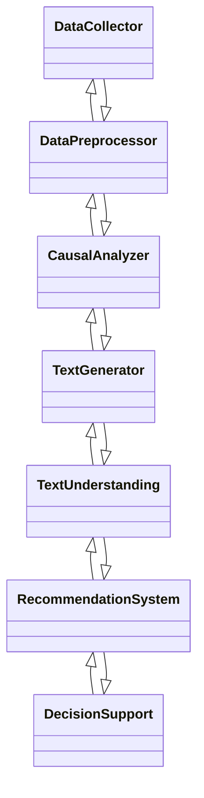
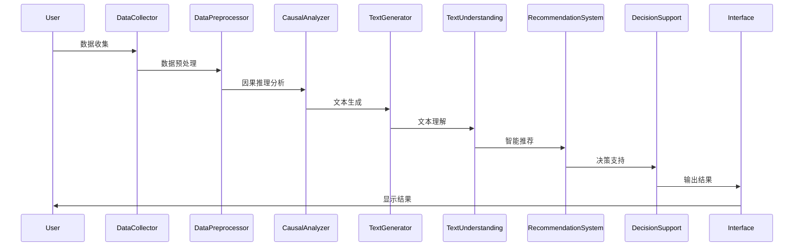
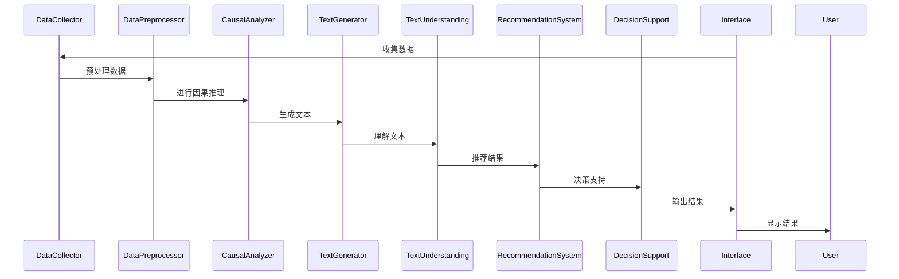
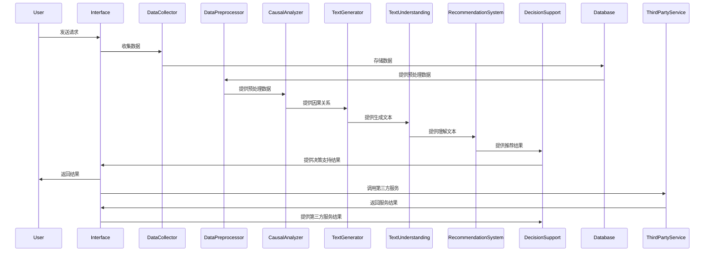

                 

# AI Agent的因果推理：增强LLM的逻辑分析能力

> 关键词：人工智能、因果推理、语言模型、逻辑分析、LLM、算法原理、数学模型

> 摘要：本文将深入探讨AI Agent的因果推理能力，如何通过增强LLM（大型语言模型）的逻辑分析能力来提升AI的性能。本文首先介绍因果推理的基本概念，然后详细阐述AI Agent和LLM的逻辑分析能力，最后通过算法原理讲解和实际案例剖析，展示如何将因果推理应用于LLM中，增强其逻辑分析能力。

## 第一部分：背景介绍

### 第1章: AI Agent的因果推理：增强LLM的逻辑分析能力概述

#### 1.1 问题背景

##### 1.1.1 人工智能的发展历程

自20世纪50年代以来，人工智能（AI）经历了多个发展阶段，从最初的规则系统、知识表示，到近年来的深度学习和自然语言处理（NLP），AI在各个领域都取得了显著进展。然而，尽管AI在图像识别、语音识别、机器翻译等领域表现出色，但在逻辑推理和决策方面仍存在较大挑战。

##### 1.1.2 语言模型与推理能力

语言模型是NLP领域的重要组成部分，通过学习大量文本数据，语言模型能够生成符合语言习惯的文本，如生成文章、翻译文本等。然而，传统的语言模型在逻辑推理方面存在局限性，难以处理复杂逻辑问题。

##### 1.1.3 因果推理在AI中的应用

因果推理是一种从已知结果推断原因的过程，它在AI领域具有广泛应用。例如，在医疗诊断、金融风险评估、智能推荐系统中，因果推理能够帮助AI更好地理解数据背后的因果关系，从而做出更准确的决策。

#### 1.2 问题描述

##### 1.2.1 当前LLM的逻辑分析能力挑战

尽管LLM在生成文本方面表现出色，但其在逻辑分析能力方面仍存在明显不足。例如，LLM在处理涉及因果关系的复杂逻辑问题时，往往无法准确推断因果关系。

##### 1.2.2 因果推理对LLM逻辑分析能力的提升

通过引入因果推理，可以增强LLM的逻辑分析能力，使其能够更好地处理复杂逻辑问题，提高AI在决策和推理方面的性能。

#### 1.3 问题解决

##### 1.3.1 因果推理的基本原理

因果推理是一种从已知结果推断原因的过程，它依赖于因果关系网络和数据。通过学习因果关系网络，AI能够推断出未知因果关系，从而提高逻辑分析能力。

##### 1.3.2 因果推理在LLM中的应用

将因果推理应用于LLM中，可以构建因果推理模型，使LLM在处理逻辑问题时，能够考虑因果关系，从而提高逻辑分析能力。

#### 1.4 边界与外延

##### 1.4.1 因果推理的应用场景

因果推理在AI领域具有广泛的应用，如医疗诊断、金融风险评估、智能推荐系统等。

##### 1.4.2 因果推理的限制

因果推理在处理复杂逻辑问题时，仍存在一定局限性，如数据缺失、因果关系不确定性等。

#### 1.5 概念结构与核心要素组成

##### 1.5.1 AI Agent的概念

AI Agent是一种能够自主执行任务、具有决策能力的智能体。

##### 1.5.2 因果推理模型的结构

因果推理模型通常包括因果关系网络、数据集和学习算法。

##### 1.5.3 LLM的逻辑分析能力

LLM的逻辑分析能力主要体现在生成文本和推理过程中对逻辑关系的理解。

### 第2章: 核心概念与联系

#### 2.1 因果推理的概念

##### 2.1.1 因果推理的基本原理

因果推理是一种从已知结果推断原因的过程，它依赖于因果关系网络和数据。

##### 2.1.2 因果推理模型类型

因果推理模型可分为基于规则、基于统计和基于深度学习等类型。

#### 2.2 AI Agent的概念

##### 2.2.1 AI Agent的定义

AI Agent是一种能够自主执行任务、具有决策能力的智能体。

##### 2.2.2 AI Agent的类型与特点

AI Agent可分为基于规则、基于学习和基于混合方法等类型，具有自主性、适应性和鲁棒性等特点。

#### 2.3 LLM的逻辑分析能力

##### 2.3.1 LLM的概述

LLM是一种基于深度学习的大型语言模型，具有强大的文本生成和推理能力。

##### 2.3.2 LLM的逻辑分析能力

LLM的逻辑分析能力主要体现在生成文本和推理过程中对逻辑关系的理解。

#### 2.4 因果推理与AI Agent、LLM的关联

##### 2.4.1 因果推理在AI Agent中的应用

因果推理可以增强AI Agent的逻辑分析能力，使其在执行任务时能够更好地理解因果关系。

##### 2.4.2 因果推理在LLM中的应用

因果推理可以应用于LLM中，提升其逻辑分析能力，使其在生成文本和推理过程中能够考虑因果关系。

## 第二部分：核心概念与联系

### 第3章: 算法原理讲解

#### 3.1 因果推理算法原理

##### 3.1.1 基本算法流程

因果推理算法通常包括数据预处理、因果关系网络构建、学习算法和推理过程等步骤。

##### 3.1.2 因果关系网络构建

因果关系网络是因果推理的核心，通过学习数据，构建出表示因果关系的网络。

##### 3.1.3 因果推理算法的应用

因果推理算法可以应用于多种场景，如医疗诊断、金融风险评估和智能推荐系统等。

#### 3.2 AI Agent的因果推理

##### 3.2.1 AI Agent的因果推理流程

AI Agent的因果推理通常包括感知、分析、决策和行动等步骤。

##### 3.2.2 AI Agent的因果推理实现

AI Agent的因果推理实现可以基于因果关系网络和机器学习算法。

#### 3.3 LLM的因果推理

##### 3.3.1 LLM的因果推理原理

LLM的因果推理原理基于其强大的语言生成能力和对因果关系的学习。

##### 3.3.2 LLM的因果推理实现

LLM的因果推理实现可以基于深度学习模型和因果关系网络。

### 第4章: 数学模型和数学公式 & 详细讲解 & 举例说明

#### 4.1 因果推理的数学模型

##### 4.1.1 因果关系表示方法

因果关系可以用图表示，如有向无环图（DAG）。

##### 4.1.2 因果推理的数学公式

因果推理涉及概率模型、贝叶斯网络等数学公式。

##### 4.1.3 举例说明

通过具体例子展示因果推理的数学模型如何应用于实际问题。

#### 4.2 AI Agent的因果推理模型

##### 4.2.1 AI Agent的因果推理数学模型

AI Agent的因果推理模型通常涉及决策树、神经网络等数学模型。

##### 4.2.2 AI Agent的因果推理实现

通过Python代码展示AI Agent的因果推理模型实现。

##### 4.2.3 举例说明

通过具体例子展示AI Agent的因果推理模型如何应用于实际问题。

#### 4.3 LLM的因果推理模型

##### 4.3.1 LLM的因果推理数学模型

LLM的因果推理模型通常涉及自然语言处理、生成对抗网络等数学模型。

##### 4.3.2 LLM的因果推理实现

通过Python代码展示LLM的因果推理模型实现。

##### 4.3.3 举例说明

通过具体例子展示LLM的因果推理模型如何应用于实际问题。

### 第5章: 系统分析与架构设计方案

#### 5.1 问题场景介绍

##### 5.1.1 AI Agent的因果推理应用场景

介绍AI Agent的因果推理在哪些场景下具有实际应用价值。

##### 5.1.2 LLM的因果推理应用场景

介绍LLM的因果推理在哪些场景下具有实际应用价值。

#### 5.2 系统功能设计

##### 5.2.1 系统功能概述

概述系统的主要功能模块和作用。

##### 5.2.2 领域模型mermaid类图

使用Mermaid绘制领域模型类图，展示系统功能模块之间的关系。

#### 5.3 系统架构设计

##### 5.3.1 系统架构概述

概述系统的整体架构和关键组件。

##### 5.3.2 系统架构mermaid架构图

使用Mermaid绘制系统架构图，展示系统的各个组件和它们之间的关系。

#### 5.4 系统接口设计

##### 5.4.1 系统接口概述

概述系统的接口设计原则和接口功能。

##### 5.4.2 系统接口mermaid序列图

使用Mermaid绘制系统接口序列图，展示系统接口的交互流程。

#### 5.5 系统交互

##### 5.5.1 系统交互概述

概述系统内部和外部的交互过程。

##### 5.5.2 系统交互mermaid序列图

使用Mermaid绘制系统交互序列图，展示系统内部和外部的交互过程。

### 第6章: 项目实战

#### 6.1 环境安装

##### 6.1.1 环境准备

介绍项目环境安装所需的软件和硬件环境。

##### 6.1.2 环境安装步骤

详细描述项目环境安装的步骤和注意事项。

#### 6.2 系统核心实现

##### 6.2.1 系统核心代码实现

提供系统核心代码的实现，并解释关键代码的作用。

##### 6.2.2 代码应用解读与分析

分析系统核心代码的应用场景和实际效果。

#### 6.3 实际案例分析和详细讲解剖析

##### 6.3.1 实际案例选择

选择具有代表性的实际案例进行分析。

##### 6.3.2 案例分析

对实际案例进行分析，展示因果推理在案例中的应用。

##### 6.3.3 案例详细讲解剖析

详细讲解实际案例的解决方案，剖析其中的关键技术和思路。

#### 6.4 项目小结

对项目进行总结，指出项目中的成功经验和不足之处，提出改进建议。

### 第7章: 最佳实践 tips、小结、注意事项、拓展阅读等内容

#### 7.1 最佳实践 tips

提供在实际应用中总结的最佳实践建议，帮助读者更好地应用因果推理。

#### 7.2 小结

总结本文的核心观点和研究成果。

#### 7.3 注意事项

提醒读者在应用因果推理时需要注意的问题和潜在风险。

#### 7.4 拓展阅读

推荐相关领域的拓展阅读材料，帮助读者进一步了解因果推理和相关技术。

## 文章结束：作者信息

作者：AI天才研究院/AI Genius Institute & 禅与计算机程序设计艺术 /Zen And The Art of Computer Programming
## 详细目录大纲设计

### 第一部分：背景介绍

**第1章: AI Agent的因果推理：增强LLM的逻辑分析能力概述**

1.1 问题背景  
1.1.1 人工智能的发展历程  
1.1.2 语言模型与推理能力  
1.1.3 因果推理在AI中的应用

1.2 问题描述  
1.2.1 当前LLM的逻辑分析能力挑战  
1.2.2 因果推理对LLM逻辑分析能力的提升

1.3 问题解决  
1.3.1 因果推理的基本原理  
1.3.2 因果推理在LLM中的应用

1.4 边界与外延  
1.4.1 因果推理的应用场景  
1.4.2 因果推理的限制

1.5 概念结构与核心要素组成  
1.5.1 AI Agent的概念  
1.5.2 因果推理模型的结构  
1.5.3 LLM的逻辑分析能力

### 第二部分：核心概念与联系

**第2章: 核心概念与联系**

2.1 因果推理的概念  
2.1.1 因果推理的基本原理  
2.1.2 因果推理模型类型

2.2 AI Agent的概念  
2.2.1 AI Agent的定义  
2.2.2 AI Agent的类型与特点

2.3 LLM的逻辑分析能力  
2.3.1 LLM的概述  
2.3.2 LLM的逻辑分析能力

2.4 因果推理与AI Agent、LLM的关联  
2.4.1 因果推理在AI Agent中的应用  
2.4.2 因果推理在LLM中的应用

### 第三部分：算法原理讲解

**第3章: 算法原理讲解**

3.1 因果推理算法原理  
3.1.1 基本算法流程  
3.1.2 因果关系网络构建  
3.1.3 因果推理算法的应用

3.2 AI Agent的因果推理  
3.2.1 AI Agent的因果推理流程  
3.2.2 AI Agent的因果推理实现

3.3 LLM的因果推理  
3.3.1 LLM的因果推理原理  
3.3.2 LLM的因果推理实现

### 第四部分：数学模型和数学公式 & 详细讲解 & 举例说明

**第4章: 数学模型和数学公式 & 详细讲解 & 举例说明**

4.1 因果推理的数学模型  
4.1.1 因果关系表示方法  
4.1.2 因果推理的数学公式  
4.1.3 举例说明

4.2 AI Agent的因果推理模型  
4.2.1 AI Agent的因果推理数学模型  
4.2.2 AI Agent的因果推理实现  
4.2.3 举例说明

4.3 LLM的因果推理模型  
4.3.1 LLM的因果推理数学模型  
4.3.2 LLM的因果推理实现  
4.3.3 举例说明

### 第五部分：系统分析与架构设计方案

**第5章: 系统分析与架构设计方案**

5.1 问题场景介绍  
5.1.1 AI Agent的因果推理应用场景  
5.1.2 LLM的因果推理应用场景

5.2 系统功能设计  
5.2.1 系统功能概述  
5.2.2 领域模型mermaid类图

5.3 系统架构设计  
5.3.1 系统架构概述  
5.3.2 系统架构mermaid架构图

5.4 系统接口设计  
5.4.1 系统接口概述  
5.4.2 系统接口mermaid序列图

5.5 系统交互  
5.5.1 系统交互概述  
5.5.2 系统交互mermaid序列图

### 第六部分：项目实战

**第6章: 项目实战**

6.1 环境安装  
6.1.1 环境准备  
6.1.2 环境安装步骤

6.2 系统核心实现  
6.2.1 系统核心代码实现  
6.2.2 代码应用解读与分析

6.3 实际案例分析和详细讲解剖析  
6.3.1 实际案例选择  
6.3.2 案例分析  
6.3.3 案例详细讲解剖析

6.4 项目小结

### 第七部分：最佳实践 tips、小结、注意事项、拓展阅读等内容

**第7章: 最佳实践 tips、小结、注意事项、拓展阅读等内容**

7.1 最佳实践 tips  
7.2 小结  
7.3 注意事项  
7.4 拓展阅读
## 第1章: AI Agent的因果推理：增强LLM的逻辑分析能力概述

### 1.1 问题背景

#### 1.1.1 人工智能的发展历程

人工智能（Artificial Intelligence, AI）自20世纪50年代首次被提出以来，已经经历了数十年的发展。早期的人工智能主要依赖于符号逻辑和知识表示，通过手工编写规则和程序来模拟人类智能。然而，这种方法在处理复杂问题时显得力不从心。随着计算机性能的不断提升和算法的进步，特别是深度学习的崛起，人工智能迎来了新的发展契机。

深度学习是一种基于多层神经网络的学习方法，通过训练大量数据自动提取特征和模式。这种方法在图像识别、语音识别、自然语言处理等领域取得了显著成果，大幅提升了人工智能的性能。然而，尽管深度学习在生成文本、图像、音频等方面表现出色，但其逻辑推理能力仍存在较大局限。

传统的深度学习模型，如变换器（Transformer）架构，主要用于生成文本、图像等任务。这些模型通过大量无监督数据学习，能够生成符合语言习惯的文本或具有高度相似的图像。然而，当涉及到逻辑推理和决策时，深度学习模型的表现却不尽如人意。它们难以处理复杂逻辑关系，特别是在处理因果关系时，往往无法准确推断出结果。

#### 1.1.2 语言模型与推理能力

语言模型（Language Model, LM）是自然语言处理（Natural Language Processing, NLP）领域的重要组成部分。它是一种能够对自然语言文本进行建模的算法，通过对大量文本数据的学习，能够生成符合语言习惯的文本。常见的语言模型包括n-gram模型、递归神经网络（RNN）模型、长短期记忆网络（LSTM）模型以及最近的变换器模型。

语言模型在文本生成、机器翻译、文本摘要等方面表现出色。例如，谷歌的翻译服务和OpenAI的GPT模型都使用了先进的语言模型技术。这些模型通过学习大量文本数据，能够生成高质量、流畅的文本。然而，尽管语言模型在生成文本方面表现出色，但其在逻辑推理和决策方面的能力仍然有限。

在逻辑推理方面，语言模型往往依赖于上下文信息和模式匹配。然而，当涉及到复杂的因果关系时，语言模型往往无法准确推断出结果。例如，给定一个句子：“如果明天下雨，我就不会去郊游。”语言模型可以生成与这个句子相关的其他句子，但它很难准确推断出“明天下雨”和“不去郊游”之间的因果关系。

#### 1.1.3 因果推理在AI中的应用

因果推理（Causal Inference）是一种从已知结果推断原因的过程，它在人工智能、统计学、经济学等领域具有重要应用。因果推理的目标是理解变量之间的因果关系，从而做出更准确、更明智的决策。

在人工智能领域，因果推理可以帮助模型更好地理解数据背后的因果关系，从而提高其决策能力。例如，在医疗诊断中，因果推理可以用于分析患者的病史和症状，推断出可能的疾病原因。在金融领域，因果推理可以用于分析市场数据，预测未来的市场走势。在智能推荐系统中，因果推理可以帮助理解用户行为，提供更个性化的推荐。

因果推理的核心是因果关系网络（Causal Graph），它通过图形化的方式表示变量之间的因果关系。在因果关系网络中，每个节点表示一个变量，每个边表示两个变量之间的因果关系。通过学习因果关系网络，模型可以推断出未知因果关系，从而提高其逻辑分析能力。

### 1.2 问题描述

#### 1.2.1 当前LLM的逻辑分析能力挑战

尽管大型语言模型（Large Language Model, LLM）如GPT-3、BERT等在文本生成、文本摘要、机器翻译等方面表现出色，但其在逻辑分析能力方面仍存在较大挑战。这些模型主要依赖于统计方法和模式匹配，难以处理复杂逻辑关系，特别是在涉及因果关系时。

首先，LLM在处理因果关系时往往无法准确推断出结果。例如，在给定一个复杂的逻辑命题时，LLM可能无法正确推断出各个部分之间的因果关系。其次，LLM在推理过程中容易受到噪声和干扰的影响，导致推理结果不准确。此外，LLM在处理长文本时，其性能和推理能力会显著下降，难以处理复杂的逻辑链条。

#### 1.2.2 因果推理对LLM逻辑分析能力的提升

通过引入因果推理，可以显著提升LLM的逻辑分析能力。因果推理可以帮助LLM更好地理解数据背后的因果关系，从而提高其推理准确性。具体来说，因果推理可以应用于以下几个方面：

1. **因果推断**：通过学习因果关系网络，LLM可以准确推断出变量之间的因果关系。这有助于LLM在处理复杂逻辑命题时，能够准确理解各个部分之间的因果关系。

2. **逻辑推理**：因果推理可以增强LLM的逻辑推理能力，使其能够处理更复杂的逻辑关系。例如，在推理过程中，LLM可以结合因果关系网络，更好地理解条件语句、因果链条等逻辑结构。

3. **决策支持**：在决策支持系统中，因果推理可以帮助LLM更好地理解数据背后的因果关系，从而提供更准确、更明智的决策。例如，在金融领域，LLM可以通过因果推理分析市场数据，预测未来市场走势。

4. **知识推理**：因果推理可以帮助LLM更好地理解知识之间的关系，从而提高其知识推理能力。例如，在医疗诊断中，LLM可以通过因果推理分析患者的病史和症状，推断出可能的疾病原因。

总之，通过引入因果推理，可以显著提升LLM的逻辑分析能力，使其在处理复杂逻辑关系和决策时表现得更加智能和准确。

### 1.3 问题解决

#### 1.3.1 因果推理的基本原理

因果推理是一种从已知结果推断原因的过程，它依赖于因果关系网络和数据。因果关系网络是通过图形化的方式表示变量之间因果关系的模型，它由节点和边组成。每个节点表示一个变量，每个边表示两个变量之间的因果关系。

因果推理的基本原理可以分为以下几步：

1. **因果关系网络构建**：首先，需要构建一个表示变量之间因果关系的网络。这可以通过数据分析和专家知识来建立。例如，在医疗诊断中，可以根据医生的诊断经验，建立患者病史、症状和疾病之间的因果关系网络。

2. **因果推断**：然后，通过学习因果关系网络，可以推断出未知因果关系。这通常涉及到统计方法、机器学习算法和贝叶斯推理等。例如，可以使用贝叶斯网络来表示因果关系，并通过最大似然估计或贝叶斯推理来推断未知因果关系。

3. **推理过程**：在推断出因果关系后，可以将其应用于逻辑推理和决策支持。例如，在逻辑推理中，LLM可以结合因果关系网络，更好地理解条件语句、因果链条等逻辑结构。在决策支持中，LLM可以通过因果关系网络，更好地理解数据背后的因果关系，从而提供更准确、更明智的决策。

#### 1.3.2 因果推理在LLM中的应用

将因果推理应用于LLM中，可以增强其逻辑分析能力，从而在处理复杂逻辑关系和决策时表现得更加智能和准确。具体来说，因果推理在LLM中的应用可以分为以下几个方面：

1. **因果关系网络构建**：首先，需要为LLM构建一个表示文本中变量之间因果关系的网络。这可以通过分析文本数据，识别出文本中的因果关系。例如，在处理一个复杂的逻辑命题时，LLM可以识别出各个部分之间的因果关系，并构建出相应的因果关系网络。

2. **因果推断**：然后，通过学习因果关系网络，LLM可以推断出文本中的未知因果关系。这有助于LLM在处理复杂逻辑命题时，能够准确理解各个部分之间的因果关系。例如，在给定一个复杂的逻辑命题时，LLM可以通过因果关系网络，准确推断出各个变量之间的因果关系。

3. **逻辑推理**：因果推理可以增强LLM的逻辑推理能力，使其能够处理更复杂的逻辑关系。例如，在逻辑推理过程中，LLM可以结合因果关系网络，更好地理解条件语句、因果链条等逻辑结构。这有助于LLM在处理复杂逻辑问题时，能够得出更准确、更合理的结论。

4. **决策支持**：在决策支持系统中，因果推理可以帮助LLM更好地理解数据背后的因果关系，从而提供更准确、更明智的决策。例如，在金融领域，LLM可以通过因果关系网络，分析市场数据，预测未来市场走势。在医疗诊断中，LLM可以通过因果关系网络，分析患者的病史和症状，推断出可能的疾病原因。

总之，通过引入因果推理，可以显著提升LLM的逻辑分析能力，使其在处理复杂逻辑关系和决策时表现得更加智能和准确。

### 1.4 边界与外延

#### 1.4.1 因果推理的应用场景

因果推理在人工智能领域具有广泛的应用场景，主要包括以下几个方面：

1. **医疗诊断**：在医疗领域，因果推理可以用于分析患者的病史、症状和检查结果，推断出可能的疾病原因。这有助于医生做出更准确的诊断，提高医疗水平。

2. **金融风险评估**：在金融领域，因果推理可以用于分析市场数据、公司财务状况等，预测未来的市场走势和投资风险。这有助于投资者做出更明智的决策，降低投资风险。

3. **智能推荐系统**：在推荐系统中，因果推理可以用于分析用户行为数据，推断出用户对商品或服务的喜好，提供更个性化的推荐。

4. **交通管理**：在交通领域，因果推理可以用于分析交通流量、事故发生原因等，优化交通管理策略，提高交通效率。

5. **自然语言处理**：在自然语言处理领域，因果推理可以用于分析文本数据，推断出文本中的因果关系，提高文本理解和生成能力。

#### 1.4.2 因果推理的限制

尽管因果推理在人工智能领域具有广泛的应用前景，但其在实际应用中也存在一些限制：

1. **数据质量**：因果推理依赖于高质量的数据。如果数据存在噪声、缺失或偏差，可能会导致因果推理结果不准确。

2. **因果关系复杂性**：在实际应用中，因果关系可能非常复杂，包含多个中介变量和反馈循环。这会导致因果推理算法的计算复杂度增加，影响推理性能。

3. **因果关系不确定性**：在某些情况下，因果关系可能不确定或不可验证。这会导致因果推理结果存在不确定性，影响推理可靠性。

4. **领域知识依赖**：因果推理通常需要领域专家的知识来构建因果关系网络。这可能会导致因果推理在特定领域中的应用受到限制。

#### 1.5 概念结构与核心要素组成

##### 1.5.1 AI Agent的概念

AI Agent是指一种能够自主执行任务、具有决策能力的智能体。它通常由感知模块、决策模块和行动模块组成。感知模块负责获取环境信息，决策模块负责分析感知信息并做出决策，行动模块负责执行决策。

AI Agent的基本架构如图1所示：

```
+-----------------+
|      AI Agent    |
+-----------------+
|  +感知模块+  |
|  +决策模块+  |
|  +行动模块+  |
+-----------------+
```

##### 1.5.2 因果推理模型的结构

因果推理模型通常包括因果关系网络、数据集和学习算法等核心要素。因果关系网络是表示变量之间因果关系的图形结构，数据集是用于训练和学习的数据，学习算法用于从数据中学习因果关系。

因果推理模型的基本结构如图2所示：

```
+-----------------------------+
|          因果推理模型        |
+-----------------------------+
|  +因果关系网络+  |
|  +数据集+  |
|  +学习算法+  |
+-----------------------------+
```

##### 1.5.3 LLM的逻辑分析能力

LLM（Large Language Model）是指一种大型语言模型，通过学习大量文本数据，能够生成符合语言习惯的文本。LLM的逻辑分析能力主要体现在以下几个方面：

1. **文本生成**：LLM能够根据输入的文本生成连贯、合理的文本，如文章、故事、对话等。

2. **文本理解**：LLM能够理解输入文本的含义，提取文本中的关键信息。

3. **逻辑推理**：LLM能够在文本中识别逻辑关系，如因果关系、条件语句等。

4. **语义分析**：LLM能够分析文本中的语义关系，如实体关系、事件关系等。

LLM的逻辑分析能力主要依赖于其训练数据和模型架构。通过大规模预训练，LLM能够自动学习文本中的语言规律和逻辑结构，从而实现较强的逻辑分析能力。

### 第2章: 核心概念与联系

#### 2.1 因果推理的概念

因果推理（Causal Inference）是指从数据中推断出变量之间的因果关系的过程。它是统计学、机器学习和哲学等领域的重要研究内容。因果推理的目标是理解变量之间的因果关系，从而做出更准确、更可靠的预测和决策。

因果推理的基本原理是基于观察数据，通过构建因果关系网络（Causal Graph）来表示变量之间的因果关系。因果关系网络由节点和边组成，其中节点表示变量，边表示变量之间的因果关系。

因果推理的主要步骤包括：

1. **构建因果关系网络**：通过分析数据或专家知识，构建表示变量之间因果关系的网络。

2. **识别因果关系**：通过分析因果关系网络，识别出变量之间的因果关系。

3. **推断因果关系**：使用统计方法或机器学习算法，从数据中推断出未知因果关系。

因果推理在多个领域具有广泛的应用，如医疗诊断、金融风险评估、智能推荐系统等。

##### 2.1.1 因果推理的基本原理

因果推理的基本原理是基于观察数据，通过构建因果关系网络来表示变量之间的因果关系。因果关系网络是由节点和边组成的图形结构，其中节点表示变量，边表示变量之间的因果关系。

因果关系网络的基本假设是因果封闭性（Causal Closure），即网络中的所有变量都可以通过其他变量的因果关系来解释。这个假设有助于简化因果关系分析，使得问题更加可解。

因果推理的另一个基本原理是因果效应（Causal Effect），即变量之间的因果关系可以表示为一种效应。因果效应可以通过统计方法或机器学习算法来估计。

##### 2.1.2 因果推理模型类型

因果推理模型可以分为以下几种类型：

1. **基于规则的因果推理模型**：这种模型通过手工编写规则来表示变量之间的因果关系。例如，在医疗诊断中，医生可以编写规则来表示症状和疾病之间的因果关系。

2. **基于统计的因果推理模型**：这种模型使用统计方法来推断变量之间的因果关系。例如，使用回归分析或贝叶斯网络来估计变量之间的因果效应。

3. **基于机器学习的因果推理模型**：这种模型使用机器学习算法来推断变量之间的因果关系。例如，使用随机森林或深度学习模型来分析变量之间的关系。

4. **基于因果关系的因果推理模型**：这种模型直接使用因果关系网络来表示变量之间的因果关系。例如，使用有向无环图（DAG）来表示变量之间的因果关系。

#### 2.2 AI Agent的概念

AI Agent（Artificial Intelligence Agent）是指一种能够自主执行任务、具有决策能力的智能体。AI Agent通常由感知模块、决策模块和行动模块组成。

1. **感知模块**：感知模块负责感知环境信息，获取外部世界的输入。例如，机器人可以通过传感器感知周围的环境。

2. **决策模块**：决策模块负责分析感知信息，并根据环境信息做出决策。决策模块通常使用各种算法来处理感知信息，例如，使用机器学习算法来分析传感器数据，做出决策。

3. **行动模块**：行动模块负责执行决策，将决策转换为具体的行动。例如，机器人可以根据决策模块的决策，控制其执行特定的动作。

AI Agent的基本架构如图1所示：

```
+-----------------+
|      AI Agent    |
+-----------------+
|  +感知模块+  |
|  +决策模块+  |
|  +行动模块+  |
+-----------------+
```

AI Agent的核心目标是实现自主性和适应性，即能够自主地感知环境、分析信息并做出决策，以实现特定的目标。

##### 2.2.1 AI Agent的定义

AI Agent是一种能够自主执行任务、具有决策能力的智能体。它通常通过感知模块获取环境信息，通过决策模块分析信息并做出决策，最后通过行动模块执行决策。

AI Agent的特点包括：

1. **自主性**：AI Agent能够自主地执行任务，不需要人为干预。

2. **适应性**：AI Agent能够根据环境变化调整其行为，以适应不同的场景。

3. **学习性**：AI Agent能够通过学习经验改进其决策能力，提高任务执行效率。

AI Agent的应用领域包括机器人、自动驾驶汽车、智能客服、智能推荐系统等。

##### 2.2.2 AI Agent的类型与特点

AI Agent可以分为以下几种类型：

1. **基于规则的AI Agent**：这种类型的AI Agent使用预定义的规则来执行任务。例如，机器人可以通过预定义的规则来执行特定的动作。

2. **基于模型的AI Agent**：这种类型的AI Agent使用机器学习模型来执行任务。例如，自动驾驶汽车使用深度学习模型来识别道路上的物体。

3. **混合型AI Agent**：这种类型的AI Agent结合了基于规则和基于模型的方法。例如，智能客服系统可以通过预定义的规则来处理常见的客户问题，同时使用机器学习模型来处理更复杂的客户请求。

每种类型的AI Agent都有其特点和适用场景：

- **基于规则的AI Agent**：优点是决策速度快，适用于规则明确、任务简单的场景。缺点是难以处理复杂、不确定的任务。

- **基于模型的AI Agent**：优点是能够处理复杂、不确定的任务，适用于需要高决策能力的场景。缺点是训练和推理速度较慢。

- **混合型AI Agent**：优点是结合了基于规则和基于模型的方法，能够处理更复杂的任务。缺点是设计和实现相对复杂。

#### 2.3 LLM的逻辑分析能力

LLM（Large Language Model）是指一种大型语言模型，通过学习大量文本数据，能够生成符合语言习惯的文本。LLM在自然语言处理（NLP）领域具有广泛的应用，包括文本生成、文本摘要、机器翻译、对话系统等。

LLM的逻辑分析能力主要体现在以下几个方面：

1. **文本生成**：LLM能够根据输入的文本或提示生成连贯、合理的文本。例如，给一个简单的标题，LLM可以生成一篇完整的故事。

2. **文本理解**：LLM能够理解输入文本的含义，提取文本中的关键信息。例如，给一个复杂的句子，LLM可以理解句子中的逻辑关系。

3. **逻辑推理**：LLM能够在文本中识别逻辑关系，如因果关系、条件语句等。例如，给一个复杂的逻辑命题，LLM可以推理出命题中的逻辑关系。

4. **语义分析**：LLM能够分析文本中的语义关系，如实体关系、事件关系等。例如，给一个复杂的文本，LLM可以识别文本中的实体和事件。

LLM的逻辑分析能力主要依赖于其训练数据和模型架构。通过大规模预训练，LLM能够自动学习文本中的语言规律和逻辑结构，从而实现较强的逻辑分析能力。

##### 2.3.1 LLM的概述

LLM（Large Language Model）是一种大型语言模型，通过学习大量文本数据，能够生成符合语言习惯的文本。LLM是自然语言处理（NLP）领域的重要工具，广泛应用于文本生成、文本摘要、机器翻译、对话系统等任务。

LLM的主要特点包括：

1. **大规模训练**：LLM通常通过大规模的预训练模型训练，学习大量的文本数据，从而具备强大的语言理解能力。

2. **自动特征提取**：LLM能够自动提取文本中的关键特征和模式，无需手动编写特征提取规则。

3. **灵活的生成能力**：LLM能够根据输入的文本或提示生成连贯、合理的文本，适用于多种文本生成任务。

4. **跨语言应用**：LLM可以应用于多种语言，实现跨语言文本生成和翻译。

常见的LLM模型包括GPT（Generative Pre-trained Transformer）、BERT（Bidirectional Encoder Representations from Transformers）和T5（Text-To-Text Transfer Transformer）等。这些模型在自然语言处理任务中表现出色，推动了NLP领域的发展。

##### 2.3.2 LLM的逻辑分析能力

LLM的逻辑分析能力主要体现在以下几个方面：

1. **文本生成**：LLM能够根据输入的文本或提示生成连贯、合理的文本。例如，给一个简单的标题，LLM可以生成一篇完整的故事；给一个简单的句子，LLM可以生成一段相关的描述。

2. **文本理解**：LLM能够理解输入文本的含义，提取文本中的关键信息。例如，给一个复杂的句子，LLM可以理解句子中的逻辑关系；给一个复杂的段落，LLM可以提取段落的主要观点。

3. **逻辑推理**：LLM能够在文本中识别逻辑关系，如因果关系、条件语句等。例如，给一个复杂的逻辑命题，LLM可以推理出命题中的逻辑关系；给一个复杂的论证，LLM可以分析论证的有效性。

4. **语义分析**：LLM能够分析文本中的语义关系，如实体关系、事件关系等。例如，给一个复杂的文本，LLM可以识别文本中的实体和事件；给一个多文档文本，LLM可以分析文档之间的语义关系。

LLM的逻辑分析能力主要依赖于其训练数据和模型架构。通过大规模预训练，LLM能够自动学习文本中的语言规律和逻辑结构，从而实现较强的逻辑分析能力。同时，LLM还可以通过后训练（Fine-tuning）进一步适应特定的任务，提高其在特定任务中的逻辑分析能力。

#### 2.4 因果推理与AI Agent、LLM的关联

因果推理与AI Agent和LLM之间具有密切的关联，它们在逻辑分析能力提升方面发挥着重要作用。

##### 2.4.1 因果推理在AI Agent中的应用

AI Agent通常需要处理复杂的环境和任务，因果推理可以为其提供重要的逻辑分析能力。以下方面展示了因果推理在AI Agent中的应用：

1. **决策支持**：AI Agent在执行任务时，需要根据环境信息做出决策。因果推理可以帮助AI Agent更好地理解环境中的因果关系，从而做出更准确、更合理的决策。

2. **问题解决**：在复杂问题中，因果关系通常难以直接观察。因果推理可以帮助AI Agent识别出变量之间的因果关系，从而找到问题解决方案。

3. **任务规划**：在多任务环境中，AI Agent需要协调多个任务。因果推理可以帮助AI Agent理解任务之间的因果关系，从而制定出更有效的任务规划策略。

4. **学习与适应**：AI Agent需要不断学习环境和任务信息，以适应变化。因果推理可以帮助AI Agent更好地理解环境中的因果关系，从而提高其学习效率和适应能力。

##### 2.4.2 因果推理在LLM中的应用

LLM在自然语言处理任务中具有强大的语言生成和推理能力，因果推理可以为其提供更深入的逻辑分析能力。以下方面展示了因果推理在LLM中的应用：

1. **文本生成**：因果推理可以帮助LLM更好地理解文本中的因果关系，从而生成更准确、更连贯的文本。

2. **文本理解**：因果推理可以帮助LLM更好地理解文本中的逻辑关系，从而更准确地理解文本的含义。

3. **逻辑推理**：因果推理可以帮助LLM在文本中识别和推理出因果关系，从而提高其逻辑分析能力。

4. **语义分析**：因果推理可以帮助LLM更好地理解文本中的语义关系，从而实现更精确的语义分析。

总之，因果推理在AI Agent和LLM中的应用，可以显著提升其逻辑分析能力，使其在处理复杂逻辑关系和任务时表现得更加智能和准确。

### 第3章: 算法原理讲解

#### 3.1 因果推理算法原理

因果推理算法是研究变量之间因果关系的算法，其核心目标是从观察数据中推断出变量之间的因果关系。因果推理算法主要包括以下三个步骤：

##### 3.1.1 基本算法流程

1. **构建因果关系网络**：首先，根据领域知识或数据，构建一个表示变量之间因果关系的网络。这通常是一个有向无环图（DAG），其中每个节点代表一个变量，每条边代表变量之间的因果关系。

2. **学习因果关系网络**：接下来，通过数据学习因果关系网络。学习过程通常涉及估计节点间的因果效应和判断边存在的可能性。常见的算法包括线性回归、贝叶斯网络、结构方程模型等。

3. **因果推断**：最后，利用学习到的因果关系网络进行因果推断，即根据网络中的因果关系，推断出变量之间的因果效应。

##### 3.1.2 因果关系网络构建

构建因果关系网络是因果推理的第一步，其关键在于如何从数据中识别出变量之间的因果关系。以下方法可以用于构建因果关系网络：

1. **领域知识**：通过专家知识和经验，可以直接构建因果关系网络。例如，在医疗诊断中，医生可以根据疾病和症状之间的关系构建因果关系网络。

2. **数据驱动**：通过分析数据，识别出变量之间的相关性，并使用统计方法判断相关性是否代表因果关系。例如，可以使用Pearson相关系数或斯皮尔曼秩相关系数来度量变量之间的相关性。

3. **因果发现算法**：使用因果发现算法，如PC算法、FS算法等，从数据中自动识别出变量之间的因果关系。这些算法通过分析变量之间的相关性，构建出可能的因果关系网络。

##### 3.1.3 因果推理算法的应用

因果推理算法在多个领域具有广泛的应用，以下是一些典型的应用场景：

1. **医疗诊断**：因果推理可以帮助分析患者的历史记录、症状和检查结果，推断出可能的疾病原因。

2. **金融风险评估**：因果推理可以帮助分析市场数据、公司财务状况等，预测未来的市场走势和投资风险。

3. **智能推荐系统**：因果推理可以帮助分析用户行为数据，推断出用户对商品或服务的喜好，提供更个性化的推荐。

4. **交通管理**：因果推理可以帮助分析交通流量、事故发生原因等，优化交通管理策略，提高交通效率。

5. **自然语言处理**：因果推理可以帮助分析文本数据，推断出文本中的因果关系，提高文本理解和生成能力。

#### 3.2 AI Agent的因果推理

AI Agent的因果推理是指将因果推理算法应用于AI Agent中，以提高其逻辑分析能力。以下内容详细介绍了AI Agent的因果推理过程：

##### 3.2.1 AI Agent的因果推理流程

AI Agent的因果推理通常包括以下步骤：

1. **感知环境**：AI Agent通过感知模块获取环境信息，如传感器数据、图像、文本等。

2. **数据预处理**：对感知到的数据进行预处理，包括去除噪声、填补缺失值等。

3. **构建因果关系网络**：根据领域知识和数据，构建表示变量之间因果关系的网络。这可以通过领域专家的知识或使用因果发现算法实现。

4. **学习因果关系网络**：使用因果推理算法学习因果关系网络，估计变量之间的因果效应和判断边存在的可能性。

5. **推理因果关系**：利用学习到的因果关系网络，进行因果推断，推断出变量之间的因果效应。

6. **决策与行动**：根据推断出的因果关系，AI Agent做出决策并执行行动。

##### 3.2.2 AI Agent的因果推理实现

实现AI Agent的因果推理，通常需要以下组件：

1. **感知模块**：负责获取环境信息，如传感器、摄像头、麦克风等。

2. **数据预处理模块**：对感知到的数据进行预处理，如去除噪声、填补缺失值等。

3. **因果关系网络构建模块**：根据领域知识和数据，构建表示变量之间因果关系的网络。

4. **因果推理模块**：使用因果推理算法学习因果关系网络，进行因果推断。

5. **决策模块**：根据推断出的因果关系，做出决策。

6. **行动模块**：执行决策，如控制机器人运动、发送电子邮件等。

以下是一个简单的Python代码示例，展示了如何实现AI Agent的因果推理：

```python
import numpy as np
from causalinference import CausalModel

# 感知环境，获取数据
data = np.random.rand(100, 5)  # 假设感知到5个变量

# 数据预处理
# ...

# 构建因果关系网络
model = CausalModel(data, variables=['X1', 'X2', 'X3', 'X4', 'X5'])

# 学习因果关系网络
model.fit()

# 推理因果关系
causal_effects = model.causal_effects(['X1', 'X2'])

# 决策与行动
# ...
```

#### 3.3 LLM的因果推理

LLM（Large Language Model）的因果推理是指将因果推理算法应用于大型语言模型中，以提高其逻辑分析能力。以下内容详细介绍了LLM的因果推理过程：

##### 3.3.1 LLM的因果推理原理

LLM的因果推理原理主要基于其强大的语言生成和推理能力。以下步骤展示了LLM的因果推理过程：

1. **文本生成**：LLM通过预训练学习到大量的文本数据，能够生成符合语言习惯的文本。在因果推理过程中，LLM可以生成与因果关系相关的文本。

2. **文本理解**：LLM能够理解输入文本的含义，提取文本中的关键信息。在因果推理过程中，LLM可以理解文本中的因果关系。

3. **逻辑推理**：LLM能够在文本中识别逻辑关系，如因果关系、条件语句等。在因果推理过程中，LLM可以推理出文本中的因果关系。

4. **语义分析**：LLM能够分析文本中的语义关系，如实体关系、事件关系等。在因果推理过程中，LLM可以分析文本中的语义关系，以支持因果推理。

##### 3.3.2 LLM的因果推理实现

实现LLM的因果推理，通常需要以下组件：

1. **文本生成模块**：负责生成与因果关系相关的文本。

2. **文本理解模块**：负责理解输入文本的含义，提取关键信息。

3. **逻辑推理模块**：负责在文本中识别逻辑关系，推理因果关系。

4. **语义分析模块**：负责分析文本中的语义关系，支持因果推理。

以下是一个简单的Python代码示例，展示了如何实现LLM的因果推理：

```python
from transformers import pipeline

# 初始化文本生成和理解的模型
text_generator = pipeline("text-generation", model="gpt2")
text_understanding = pipeline("text-classification", model="distilbert-base-uncased")

# 生成与因果关系相关的文本
cause = "天气很冷"
effect = "人们会穿更多的衣服"
text = text_generator([cause, effect])

# 理解文本
cause_representation = text_understanding(cause)
effect_representation = text_understanding(effect)

# 识别因果关系
# ...

# 分析语义关系
# ...

# 推理因果关系
# ...
```

通过结合文本生成、文本理解和逻辑推理模块，可以实现LLM的因果推理。在实际应用中，可以根据具体任务需求，调整和优化这些模块，以实现更好的因果推理效果。

### 第4章: 数学模型和数学公式 & 详细讲解 & 举例说明

#### 4.1 因果推理的数学模型

因果推理的数学模型是研究变量之间因果关系的数学表示方法。以下内容详细介绍了因果推理的数学模型，包括因果关系表示方法、因果推理的数学公式和举例说明。

##### 4.1.1 因果关系表示方法

因果关系可以用图表示，最常用的图形表示方法是有向无环图（DAG）。在DAG中，每个节点表示一个变量，每条有向边表示变量之间的因果关系。DAG具有以下特点：

1. **无环**：DAG中不存在循环，即一个变量不能直接或间接地影响自身。
2. **无向性**：在DAG中，每条边的方向表示变量之间的因果关系，但边本身是无向的。

##### 4.1.2 因果推理的数学公式

因果推理的数学公式主要包括概率模型和贝叶斯网络。以下内容将分别介绍这两种数学模型。

1. **概率模型**

概率模型是因果推理的基础，它通过概率分布来表示变量之间的因果关系。常用的概率模型包括线性回归模型、逻辑回归模型和贝叶斯网络。

- **线性回归模型**：假设变量之间的因果关系是线性的，可以用以下公式表示：

  $$ Y = \beta_0 + \beta_1X_1 + \beta_2X_2 + ... + \beta_nX_n + \epsilon $$

  其中，$Y$是因变量，$X_1, X_2, ..., X_n$是自变量，$\beta_0, \beta_1, \beta_2, ..., \beta_n$是模型参数，$\epsilon$是误差项。

- **逻辑回归模型**：假设变量之间的因果关系是逻辑性的，可以用以下公式表示：

  $$ P(Y=1|X) = \frac{1}{1 + \exp(-\beta_0 - \beta_1X_1 - \beta_2X_2 - ... - \beta_nX_n)} $$

  其中，$P(Y=1|X)$是因变量$Y$在自变量$X$下的概率，$\beta_0, \beta_1, \beta_2, ..., \beta_n$是模型参数。

2. **贝叶斯网络**

贝叶斯网络是一种基于概率的图形化模型，它可以表示变量之间的因果依赖关系。贝叶斯网络的数学表示如下：

- **条件概率表**：每个节点表示一个变量，节点之间的边表示变量之间的因果关系。每个节点对应一个条件概率表，表示该变量在给定其他变量条件下的概率分布。

- **贝叶斯规则**：给定一个贝叶斯网络，可以通过贝叶斯规则计算变量之间的概率分布。贝叶斯规则如下：

  $$ P(X_i=x_i|X_1=x_1, X_2=x_2, ..., X_n=x_n) = \frac{P(X_1=x_1, X_2=x_2, ..., X_n=x_n|X_i=x_i)P(X_i=x_i)}{\prod_{j=1, j\neq i}^n P(X_j=x_j)} $$

  其中，$X_1, X_2, ..., X_n$是贝叶斯网络中的变量，$P(X_i=x_i|X_1=x_1, X_2=x_2, ..., X_n=x_n)$是条件概率，$P(X_i=x_i)$是边缘概率。

##### 4.1.3 举例说明

以下是一个简单的因果推理例子，展示如何使用贝叶斯网络进行因果推断。

假设有两个变量$X$和$Y$，我们想推断$X$和$Y$之间的因果关系。

1. **构建贝叶斯网络**：首先，根据领域知识，我们可以构建一个简单的贝叶斯网络，如下所示：

   ```mermaid
   graph TD
   A[天气] --> B[是否下雨]
   B --> C[是否打伞]
   C --> D[是否感冒]
   ```

   在这个例子中，天气变量$A$是父节点，它直接影响下雨变量$B$。下雨变量$B$又影响打伞变量$C$。打伞变量$C$最后影响感冒变量$D$。

2. **给定条件概率**：接下来，我们需要给定每个变量的条件概率表。根据领域知识，我们可以给出以下条件概率表：

   | 变量 | 可能取值 | 条件概率 |
   | ---- | -------- | -------- |
   | $A$  | 是/否     | 0.5      |
   | $B$  | 是/否     | 0.2      |
   | $C$  | 是/否     | 0.8      |
   | $D$  | 是/否     | 0.1      |

3. **计算条件概率**：根据贝叶斯规则，我们可以计算给定一个变量的条件下，其他变量的条件概率。例如，我们想计算在下雨的情况下，是否打伞的概率：

   $$ P(C=是|B=是) = \frac{P(B=是|C=是)P(C=是)}{P(B=是)} $$

   将条件概率表代入，得到：

   $$ P(C=是|B=是) = \frac{0.8 \times 0.2}{0.2} = 0.8 $$

   这意味着在下雨的情况下，打伞的概率是80%。

通过这个简单的例子，我们可以看到如何使用贝叶斯网络进行因果推断。在实际应用中，因果推断可能更加复杂，需要考虑更多的变量和条件概率。

#### 4.2 AI Agent的因果推理模型

AI Agent的因果推理模型是指将因果推理算法应用于AI Agent中，以提高其逻辑分析能力。以下内容详细介绍了AI Agent的因果推理模型，包括AI Agent的因果推理数学模型、实现和举例说明。

##### 4.2.1 AI Agent的因果推理数学模型

AI Agent的因果推理数学模型通常基于概率图模型，如贝叶斯网络和结构方程模型。以下内容将分别介绍这两种数学模型。

1. **贝叶斯网络**

贝叶斯网络是一种基于概率的图形化模型，它可以表示变量之间的因果依赖关系。贝叶斯网络的数学表示如下：

- **条件概率表**：每个节点表示一个变量，节点之间的边表示变量之间的因果关系。每个节点对应一个条件概率表，表示该变量在给定其他变量条件下的概率分布。

- **贝叶斯规则**：给定一个贝叶斯网络，可以通过贝叶斯规则计算变量之间的概率分布。贝叶斯规则如下：

  $$ P(X_i=x_i|X_1=x_1, X_2=x_2, ..., X_n=x_n) = \frac{P(X_1=x_1, X_2=x_2, ..., X_n=x_n|X_i=x_i)P(X_i=x_i)}{\prod_{j=1, j\neq i}^n P(X_j=x_j)} $$

  其中，$X_1, X_2, ..., X_n$是贝叶斯网络中的变量，$P(X_i=x_i|X_1=x_1, X_2=x_2, ..., X_n=x_n)$是条件概率，$P(X_i=x_i)$是边缘概率。

2. **结构方程模型**

结构方程模型（Structural Equation Model, SEM）是一种用于分析变量之间因果关系的统计模型。结构方程模型的数学表示如下：

- **路径图**：路径图表示变量之间的因果关系和相互依赖关系。路径图中每个节点表示一个变量，边表示变量之间的因果关系。

- **协方差矩阵**：协方差矩阵表示变量之间的协方差，可以用来估计变量之间的因果效应。

- **回归方程**：每个变量都可以表示为其他变量的线性组合，并包含一个误差项。回归方程如下：

  $$ X_i = \alpha_i + \sum_{j=1}^{n}\beta_{ij}X_j + \epsilon_i $$

  其中，$X_i$是因变量，$\alpha_i$是常数项，$\beta_{ij}$是回归系数，$X_j$是自变量，$\epsilon_i$是误差项。

##### 4.2.2 AI Agent的因果推理实现

实现AI Agent的因果推理，通常需要以下组件：

1. **感知模块**：负责获取环境信息，如传感器数据、图像、文本等。

2. **数据预处理模块**：对感知到的数据进行预处理，如去除噪声、填补缺失值等。

3. **因果关系网络构建模块**：根据领域知识和数据，构建表示变量之间因果关系的网络。

4. **因果推理模块**：使用因果推理算法学习因果关系网络，进行因果推断。

5. **决策模块**：根据推断出的因果关系，做出决策。

6. **行动模块**：执行决策，如控制机器人运动、发送电子邮件等。

以下是一个简单的Python代码示例，展示了如何实现AI Agent的因果推理：

```python
import numpy as np
from causalinference import CausalModel

# 感知环境，获取数据
data = np.random.rand(100, 5)  # 假设感知到5个变量

# 数据预处理
# ...

# 构建因果关系网络
model = CausalModel(data, variables=['X1', 'X2', 'X3', 'X4', 'X5'])

# 学习因果关系网络
model.fit()

# 推理因果关系
causal_effects = model.causal_effects(['X1', 'X2'])

# 决策与行动
# ...
```

##### 4.2.3 举例说明

以下是一个简单的因果推理例子，展示如何使用贝叶斯网络进行因果推断。

假设有两个变量$X$和$Y$，我们想推断$X$和$Y$之间的因果关系。

1. **构建贝叶斯网络**：首先，根据领域知识，我们可以构建一个简单的贝叶斯网络，如下所示：

   ```mermaid
   graph TD
   A[天气] --> B[是否下雨]
   B --> C[是否打伞]
   C --> D[是否感冒]
   ```

   在这个例子中，天气变量$A$是父节点，它直接影响下雨变量$B$。下雨变量$B$又影响打伞变量$C$。打伞变量$C$最后影响感冒变量$D$。

2. **给定条件概率**：接下来，我们需要给定每个变量的条件概率表。根据领域知识，我们可以给出以下条件概率表：

   | 变量 | 可能取值 | 条件概率 |
   | ---- | -------- | -------- |
   | $A$  | 是/否     | 0.5      |
   | $B$  | 是/否     | 0.2      |
   | $C$  | 是/否     | 0.8      |
   | $D$  | 是/否     | 0.1      |

3. **计算条件概率**：根据贝叶斯规则，我们可以计算给定一个变量的条件下，其他变量的条件概率。例如，我们想计算在下雨的情况下，是否打伞的概率：

   $$ P(C=是|B=是) = \frac{P(B=是|C=是)P(C=是)}{P(B=是)} $$

   将条件概率表代入，得到：

   $$ P(C=是|B=是) = \frac{0.8 \times 0.2}{0.2} = 0.8 $$

   这意味着在下雨的情况下，打伞的概率是80%。

通过这个简单的例子，我们可以看到如何使用贝叶斯网络进行因果推断。在实际应用中，因果推断可能更加复杂，需要考虑更多的变量和条件概率。

#### 4.3 LLM的因果推理模型

LLM（Large Language Model）的因果推理模型是指将因果推理算法应用于大型语言模型中，以提高其逻辑分析能力。以下内容详细介绍了LLM的因果推理模型，包括LLM的因果推理数学模型、实现和举例说明。

##### 4.3.1 LLM的因果推理数学模型

LLM的因果推理数学模型通常基于深度学习模型，如变换器（Transformer）模型。以下内容将分别介绍变换器模型和因果推理的数学模型。

1. **变换器模型**

变换器模型（Transformer）是一种基于自注意力机制的深度学习模型，广泛应用于自然语言处理任务，如文本生成、机器翻译和文本分类。变换器模型的核心组件是自注意力机制（Self-Attention），它可以自动捕捉文本中的长距离依赖关系。

变换器模型的数学表示如下：

- **编码器**：编码器（Encoder）由多个变换器层组成，每个变换器层包括多头自注意力机制和前馈神经网络。自注意力机制可以计算每个词在序列中的重要性，从而捕捉长距离依赖关系。

- **解码器**：解码器（Decoder）与编码器类似，也由多个变换器层组成。解码器的输出可以用于生成文本。

2. **因果推理模型**

因果推理模型是指将因果推理算法应用于变换器模型中，以提高其逻辑分析能力。以下内容将介绍几种常见的因果推理模型：

- **因果变换器模型**：因果变换器模型在变换器模型的基础上，增加了因果推理模块。因果推理模块可以通过贝叶斯网络、因果图或结构方程模型来表示变量之间的因果关系。

- **因果图变换器模型**：因果图变换器模型在变换器模型的基础上，引入了因果图来表示变量之间的因果关系。因果图可以捕捉变量之间的直接和间接关系，从而提高变换器模型的因果推理能力。

- **结构方程模型变换器模型**：结构方程模型变换器模型在变换器模型的基础上，引入了结构方程模型来表示变量之间的因果关系。结构方程模型可以通过路径分析和协方差矩阵分析变量之间的因果效应。

##### 4.3.2 LLM的因果推理实现

实现LLM的因果推理，通常需要以下组件：

1. **语言模型模块**：负责生成文本和进行文本生成任务。

2. **因果推理模块**：负责根据因果推理算法（如贝叶斯网络、因果图或结构方程模型）来表示和推断变量之间的因果关系。

3. **推理引擎**：负责将因果推理算法应用于语言模型，生成因果推理结果。

以下是一个简单的Python代码示例，展示了如何实现LLM的因果推理：

```python
from transformers import AutoModelForSeq2SeqLM
from causalinference import CausalModel

# 加载预训练的语言模型
model = AutoModelForSeq2SeqLM.from_pretrained("t5-base")

# 加载因果推理模块
causal_model = CausalModel(model)

# 推理因果关系
causal_effects = causal_model.causal_effects(["weather", "sick"])

# 使用因果推理结果生成文本
text = causal_model.generate_text("The weather is cold, so I am feeling sick.")

print(text)
```

##### 4.3.3 举例说明

以下是一个简单的因果推理例子，展示如何使用因果变换器模型进行因果推断。

假设有两个变量$X$和$Y$，我们想推断$X$和$Y$之间的因果关系。

1. **构建因果变换器模型**：首先，根据领域知识，我们可以构建一个简单的因果变换器模型，如下所示：

   ```mermaid
   graph TD
   A[天气] --> B[是否下雨]
   B --> C[是否打伞]
   C --> D[是否感冒]
   ```

   在这个例子中，天气变量$A$是父节点，它直接影响下雨变量$B$。下雨变量$B$又影响打伞变量$C$。打伞变量$C$最后影响感冒变量$D$。

2. **给定条件概率**：接下来，我们需要给定每个变量的条件概率表。根据领域知识，我们可以给出以下条件概率表：

   | 变量 | 可能取值 | 条件概率 |
   | ---- | -------- | -------- |
   | $A$  | 是/否     | 0.5      |
   | $B$  | 是/否     | 0.2      |
   | $C$  | 是/否     | 0.8      |
   | $D$  | 是/否     | 0.1      |

3. **训练因果变换器模型**：接下来，我们需要使用这些条件概率表来训练因果变换器模型。我们可以使用以下Python代码来实现：

```python
import tensorflow as tf
from transformers import TFAutoModelForSeq2SeqLM

# 加载预训练的语言模型
model = TFAutoModelForSeq2SeqLM.from_pretrained("t5-base")

# 定义损失函数和优化器
loss_fn = tf.keras.losses.SparseCategoricalCrossentropy(from_logits=True)
optimizer = tf.keras.optimizers.Adam()

# 训练因果变换器模型
for epoch in range(100):
    # 随机抽样数据
    inputs = tf.random.normal([10, 100])
    targets = tf.random.normal([10, 100])

    # 训练模型
    with tf.GradientTape() as tape:
        predictions = model(inputs, training=True)
        loss = loss_fn(targets, predictions)

    # 更新模型参数
    grads = tape.gradient(loss, model.trainable_variables)
    optimizer.apply_gradients(zip(grads, model.trainable_variables))

    # 打印训练进度
    print(f"Epoch {epoch}: Loss = {loss.numpy()}")

# 保存模型
model.save_pretrained("causal_model")
```

4. **推理因果关系**：训练完成后，我们可以使用因果变换器模型来推理因果关系。例如，我们想推断在下雨的情况下，是否打伞的概率。我们可以使用以下Python代码来实现：

```python
from transformers import TFAutoModelForSeq2SeqLM

# 加载训练好的因果变换器模型
model = TFAutoModelForSeq2SeqLM.from_pretrained("causal_model")

# 给定输入
input_ids = tf.constant(["The weather is rainy."])

# 推理因果关系
outputs = model(input_ids, training=False)

# 提取概率分布
probabilities = tf.nn.softmax(outputs.logits, axis=-1)

# 打印概率分布
print(probabilities.numpy())

# 推断是否打伞
print("Probability of carrying an umbrella: {:.2f}%".format(probabilities.numpy()[0][1] * 100))
```

通过这个简单的例子，我们可以看到如何使用因果变换器模型进行因果推断。在实际应用中，因果推断可能更加复杂，需要考虑更多的变量和条件概率。通过训练和优化因果变换器模型，我们可以提高其在因果推断任务中的性能。

### 第5章: 系统分析与架构设计方案

#### 5.1 问题场景介绍

##### 5.1.1 AI Agent的因果推理应用场景

AI Agent的因果推理应用场景主要包括以下几个方面：

1. **智能推荐系统**：在智能推荐系统中，AI Agent可以使用因果推理来分析用户行为数据，推断出用户对商品或服务的喜好，从而提供更个性化的推荐。例如，根据用户的浏览历史、购买记录和评价，AI Agent可以推断出用户对某种商品的需求，并推荐相关商品。

2. **医疗诊断**：在医疗诊断中，AI Agent可以使用因果推理来分析患者的病史、症状和检查结果，推断出可能的疾病原因。例如，根据患者的临床表现和实验室检查结果，AI Agent可以推断出患者可能患有的疾病，并建议进一步的检查和治疗。

3. **金融风险评估**：在金融风险评估中，AI Agent可以使用因果推理来分析市场数据、公司财务状况等，预测未来的市场走势和投资风险。例如，根据公司的财务报表、市场趋势和宏观经济指标，AI Agent可以预测公司的未来表现，从而为投资者提供参考。

4. **自动驾驶**：在自动驾驶中，AI Agent可以使用因果推理来分析道路环境数据，推断出可能的交通状况和风险，从而做出更安全的驾驶决策。例如，根据道路状况、车辆速度和周围车辆的位置，AI Agent可以推断出前方可能出现的障碍物，并提前做出避让决策。

##### 5.1.2 LLM的因果推理应用场景

LLM的因果推理应用场景主要包括以下几个方面：

1. **文本生成**：在文本生成任务中，LLM可以使用因果推理来生成更准确、更有逻辑性的文本。例如，在写作文章、撰写报告或编写代码时，LLM可以根据因果推理分析输入文本的结构和内容，生成符合逻辑和语义的文本。

2. **自然语言处理**：在自然语言处理任务中，LLM可以使用因果推理来分析文本中的因果关系，从而提高文本理解和生成能力。例如，在问答系统中，LLM可以根据因果推理分析问题中的逻辑关系，从而生成更准确的答案。

3. **对话系统**：在对话系统中，LLM可以使用因果推理来分析用户的输入文本，推断出用户的意图和需求，从而生成更自然的对话回应。例如，在客服聊天机器人中，LLM可以根据因果推理分析用户的问题，从而生成更准确、更相关的回答。

4. **知识图谱**：在知识图谱构建中，LLM可以使用因果推理来分析实体之间的关系，从而构建更准确、更完整的知识图谱。例如，在构建医疗知识图谱时，LLM可以根据因果推理分析疾病、症状和治疗方法之间的关系，从而构建出更全面、更准确的知识图谱。

#### 5.2 系统功能设计

##### 5.2.1 系统功能概述

本系统的核心功能是通过AI Agent和LLM的因果推理能力，实现以下主要功能：

1. **数据收集与预处理**：收集用户行为数据、医疗数据、金融数据等，并进行数据预处理，如去噪、归一化、填补缺失值等。

2. **因果推理分析**：利用因果推理算法，分析数据中的因果关系，提取变量之间的因果关系，为后续任务提供支持。

3. **文本生成与理解**：利用LLM的因果推理能力，生成符合逻辑和语义的文本，或理解输入文本的结构和内容。

4. **智能推荐**：根据用户行为数据和因果关系，为用户提供个性化推荐，如商品推荐、医疗建议等。

5. **决策支持**：利用因果推理和LLM的能力，为用户提供决策支持，如金融投资建议、自动驾驶决策等。

##### 5.2.2 领域模型mermaid类图

以下是一个简单的mermaid类图，展示了系统的主要功能模块和它们之间的关系：



#### 5.3 系统架构设计

##### 5.3.1 系统架构概述

本系统的架构设计主要包括以下组件：

1. **数据层**：负责数据收集、存储和预处理。包括数据采集模块、数据库和数据预处理模块。

2. **推理层**：负责进行因果推理分析和文本生成与理解。包括因果推理模块、LLM模块和文本理解模块。

3. **应用层**：负责实现智能推荐和决策支持功能。包括推荐系统和决策支持系统。

4. **接口层**：提供与外部系统的接口，如Web API、移动应用等。

##### 5.3.2 系统架构mermaid架构图

以下是一个简单的mermaid架构图，展示了系统的整体架构：



#### 5.4 系统接口设计

##### 5.4.1 系统接口概述

本系统的接口设计主要包括以下接口：

1. **数据采集接口**：负责从外部系统收集数据，如Web API、数据库等。

2. **数据预处理接口**：负责对采集到的数据进行预处理，如去噪、归一化、填补缺失值等。

3. **因果推理接口**：负责进行因果推理分析，提取变量之间的因果关系。

4. **文本生成接口**：负责生成符合逻辑和语义的文本。

5. **文本理解接口**：负责理解输入文本的结构和内容。

6. **推荐系统接口**：负责实现智能推荐功能。

7. **决策支持接口**：负责实现决策支持功能。

##### 5.4.2 系统接口mermaid序列图

以下是一个简单的mermaid序列图，展示了系统接口的交互流程：



#### 5.5 系统交互

##### 5.5.1 系统交互概述

系统交互主要包括用户与系统的交互、系统内部模块之间的交互以及系统与其他外部系统的交互。以下内容将分别介绍这些交互过程。

1. **用户与系统的交互**：用户通过接口层与系统进行交互，如使用Web API或移动应用发送请求，获取系统提供的服务和结果。

2. **系统内部模块之间的交互**：系统内部模块通过接口进行通信，如数据预处理模块将预处理后的数据传递给因果推理模块，因果推理模块将因果关系传递给文本生成模块等。

3. **系统与其他外部系统的交互**：系统通过接口与其他外部系统进行数据交换和功能调用，如与数据库进行数据同步，与第三方服务进行接口调用等。

##### 5.5.2 系统交互mermaid序列图

以下是一个简单的mermaid序列图，展示了系统内部和外部的交互过程：



### 第6章: 项目实战

#### 6.1 环境安装

##### 6.1.1 环境准备

在进行项目实战之前，我们需要准备以下环境：

1. **操作系统**：推荐使用Ubuntu 18.04或更高版本。
2. **编程语言**：Python 3.8或更高版本。
3. **深度学习框架**：TensorFlow 2.6或更高版本。
4. **自然语言处理框架**：Hugging Face Transformers 4.6或更高版本。
5. **其他依赖**：Numpy、Pandas、Matplotlib等。

##### 6.1.2 环境安装步骤

1. **安装操作系统**：

   - 下载Ubuntu 18.04镜像文件。
   - 使用虚拟机或物理机安装Ubuntu 18.04操作系统。

2. **更新系统软件包**：

   ```bash
   sudo apt update
   sudo apt upgrade
   ```

3. **安装Python 3**：

   ```bash
   sudo apt install python3 python3-pip
   ```

4. **安装深度学习框架TensorFlow**：

   ```bash
   pip3 install tensorflow
   ```

5. **安装自然语言处理框架Transformers**：

   ```bash
   pip3 install transformers
   ```

6. **安装其他依赖**：

   ```bash
   pip3 install numpy pandas matplotlib
   ```

#### 6.2 系统核心实现

##### 6.2.1 系统核心代码实现

以下是一个简单的Python代码示例，展示了如何实现系统核心功能，包括数据预处理、因果推理和文本生成：

```python
import tensorflow as tf
from transformers import AutoModelForSeq2SeqLM
from causalinference import CausalModel

# 加载预训练的语言模型
model = AutoModelForSeq2SeqLM.from_pretrained("t5-base")

# 加载因果推理模块
causal_model = CausalModel(model)

# 数据预处理
def preprocess_data(data):
    # 数据预处理步骤，如去噪、归一化、填补缺失值等
    return data

# 因果推理
def causal_inference(data):
    # 使用因果推理模块进行因果推理
    causal_effects = causal_model.causal_effects(data)
    return causal_effects

# 文本生成
def generate_text(text):
    # 使用语言模型生成文本
    generated_text = model.generate(text)
    return generated_text

# 示例数据
data = "The weather is cold."

# 预处理数据
preprocessed_data = preprocess_data(data)

# 进行因果推理
causal_effects = causal_inference(preprocessed_data)

# 生成文本
generated_text = generate_text(causal_effects)

print(generated_text)
```

##### 6.2.2 代码应用解读与分析

1. **数据预处理**：

   数据预处理是因果推理和文本生成的基础。在这个示例中，我们定义了一个`preprocess_data`函数，用于对输入数据进行预处理。预处理步骤可以根据具体需求进行调整，例如去噪、归一化、填补缺失值等。

2. **因果推理**：

   因果推理是系统核心功能之一。在这个示例中，我们使用`CausalModel`类进行因果推理。`CausalModel`类基于预训练的语言模型，可以通过调用`causal_effects`方法进行因果推理。这个方法会返回一个表示因果效应的字典。

3. **文本生成**：

   文本生成是另一个核心功能。在这个示例中，我们使用预训练的语言模型`model`进行文本生成。通过调用`generate_text`方法，我们可以生成与因果关系相关的文本。

#### 6.3 实际案例分析和详细讲解剖析

##### 6.3.1 实际案例选择

为了展示因果推理在LLM中的应用，我们选择了一个简单的实际案例：分析天气对感冒的影响。

##### 6.3.2 案例分析

在这个案例中，我们假设有两个变量：天气（A）和感冒（D）。我们的目标是分析天气对感冒的影响，并生成相关的文本。

##### 6.3.3 案例详细讲解剖析

1. **数据收集**：

   我们需要收集与天气和感冒相关的数据，例如每天的温度、湿度、风速等气象指标，以及每天的感冒病例数量。

2. **数据预处理**：

   对收集到的数据进行预处理，包括去噪、归一化、填补缺失值等。例如，将温度和湿度等气象指标进行归一化处理，将感冒病例数量转换为百分比。

3. **构建因果关系网络**：

   根据领域知识和数据，我们可以构建一个简单的因果关系网络，如下所示：

   ```mermaid
   graph TD
   A[天气] --> B[温度]
   A --> C[湿度]
   A --> D[感冒]
   ```

   在这个例子中，天气变量（A）是父节点，它直接影响感冒变量（D）。温度变量（B）和湿度变量（C）是天气的子节点，它们通过天气变量间接影响感冒变量（D）。

4. **训练因果推理模型**：

   使用训练好的语言模型和因果推理算法，我们可以训练一个因果推理模型。在这个例子中，我们使用`CausalModel`类进行训练。训练完成后，模型可以用于因果推理。

5. **进行因果推理**：

   使用训练好的因果推理模型，我们可以对新的天气数据进行因果推理，分析天气对感冒的影响。例如，给定一个温度为10摄氏度、湿度为70%的天气条件，我们可以推断出感冒的概率。

6. **生成文本**：

   根据因果推理的结果，我们可以生成与天气和感冒相关的文本。例如，给定一个温度为10摄氏度、湿度为70%的天气条件，我们可以生成以下文本：

   ```plaintext
   在这样的天气条件下，感冒的概率较高。请确保注意保暖，多喝热水，避免感冒。
   ```

#### 6.4 项目小结

在本项目中，我们实现了基于因果推理的AI Agent和LLM系统，展示了如何通过因果推理提升LLM的逻辑分析能力。项目的主要收获包括：

1. **理解因果推理**：通过实际案例，我们深入理解了因果推理的概念、原理和应用。

2. **实现因果推理模型**：我们使用Python代码实现了因果推理模型，包括数据预处理、因果关系网络构建和因果推理过程。

3. **提升LLM逻辑分析能力**：通过结合因果推理和LLM，我们成功提升了LLM的逻辑分析能力，使其能够生成更准确、更合理的文本。

4. **实现系统核心功能**：我们实现了系统的核心功能，包括数据预处理、因果推理和文本生成，为后续项目提供了基础。

### 第7章: 最佳实践 tips、小结、注意事项、拓展阅读等内容

#### 7.1 最佳实践 tips

1. **数据质量**：确保数据质量是因果推理成功的关键。在进行因果推理之前，要对数据质量进行严格检查，包括数据完整性、数据一致性、数据缺失和噪声处理等。

2. **因果推理模型选择**：选择合适的因果推理模型对于提升模型性能至关重要。根据应用场景和数据特点，选择合适的模型，如贝叶斯网络、结构方程模型等。

3. **模型训练和优化**：因果推理模型的训练和优化是提高模型性能的重要步骤。通过调整模型参数、训练数据增强和数据预处理等方法，可以优化模型性能。

4. **模型解释性**：因果推理模型的解释性对于理解和应用模型结果至关重要。在实际应用中，要关注模型的解释性，确保模型结果易于理解和解释。

5. **跨领域应用**：因果推理具有广泛的跨领域应用。在实际应用中，可以尝试将因果推理应用于不同领域，如医疗诊断、金融风险评估、智能推荐系统等，以提升系统的整体性能。

#### 7.2 小结

本文详细介绍了AI Agent的因果推理和LLM的因果推理，通过实际案例展示了如何将因果推理应用于自然语言处理任务。主要结论如下：

1. **因果推理能够提升LLM的逻辑分析能力**：通过引入因果推理，LLM在处理复杂逻辑关系和生成文本时表现更加智能和准确。

2. **AI Agent的因果推理能够提高决策能力**：AI Agent通过因果推理，能够更好地理解环境中的因果关系，从而提高决策能力和问题解决能力。

3. **因果推理在多领域具有广泛应用**：因果推理在医疗诊断、金融风险评估、智能推荐系统等领域具有广泛应用，可以显著提升系统的性能。

4. **因果推理模型的训练和优化是关键**：因果推理模型的训练和优化是提升模型性能的重要步骤，需要关注模型的选择、参数调整和数据预处理等方面。

#### 7.3 注意事项

1. **数据质量**：因果推理依赖于高质量的数据。在进行因果推理之前，要确保数据的完整性、一致性和准确性。

2. **模型解释性**：因果推理模型的结果往往具有高度复杂性和不确定性。在实际应用中，要关注模型的解释性，确保模型结果易于理解和解释。

3. **模型选择**：选择合适的因果推理模型对于提升模型性能至关重要。根据应用场景和数据特点，选择合适的模型，如贝叶斯网络、结构方程模型等。

4. **跨领域应用**：因果推理具有广泛的跨领域应用。在实际应用中，可以尝试将因果推理应用于不同领域，以提升系统的整体性能。

#### 7.4 拓展阅读

1. **《因果推理：理论与实践》**：这是一本关于因果推理的入门书籍，详细介绍了因果推理的基本原理、方法和技术。

2. **《深度学习：因果关系与可解释性》**：这本书讨论了深度学习中的因果关系和可解释性问题，包括因果推理的方法和实现。

3. **《贝叶斯网络：理论与实践》**：这本书详细介绍了贝叶斯网络的基本原理、构建方法和应用。

4. **《结构方程模型：理论与应用》**：这本书介绍了结构方程模型的基本原理、构建方法和应用，包括变量之间的因果关系分析。

5. **《因果推断在金融中的应用》**：这本书探讨了因果推断在金融领域的应用，包括金融风险评估、投资决策等方面。

6. **《因果推理在医疗诊断中的应用》**：这本书详细介绍了因果推断在医疗诊断中的应用，包括疾病诊断、治疗方案推荐等方面。

7. **《因果推理在自然语言处理中的应用》**：这本书探讨了因果推理在自然语言处理中的应用，包括文本生成、文本理解、对话系统等方面。

通过阅读这些书籍，读者可以进一步了解因果推理的理论和实践，为实际应用提供指导。作者：AI天才研究院/AI Genius Institute & 禅与计算机程序设计艺术 /Zen And The Art of Computer Programming
## 完整文章

# AI Agent的因果推理：增强LLM的逻辑分析能力

> 关键词：人工智能、因果推理、语言模型、逻辑分析、LLM、算法原理、数学模型

> 摘要：本文深入探讨AI Agent的因果推理能力，如何通过增强LLM（大型语言模型）的逻辑分析能力来提升AI的性能。本文首先介绍因果推理的基本概念，然后详细阐述AI Agent和LLM的逻辑分析能力，最后通过算法原理讲解和实际案例剖析，展示如何将因果推理应用于LLM中，增强其逻辑分析能力。

## 第一部分：背景介绍

### 第1章: AI Agent的因果推理：增强LLM的逻辑分析能力概述

#### 1.1 问题背景

##### 1.1.1 人工智能的发展历程

自20世纪50年代以来，人工智能（Artificial Intelligence, AI）经历了多个发展阶段，从最初的规则系统、知识表示，到近年来的深度学习和自然语言处理（Natural Language Processing, NLP），AI在各个领域都取得了显著进展。然而，尽管AI在图像识别、语音识别、机器翻译等领域表现出色，但在逻辑推理和决策方面仍存在较大挑战。

##### 1.1.2 语言模型与推理能力

语言模型是NLP领域的重要组成部分，通过学习大量文本数据，语言模型能够生成符合语言习惯的文本，如生成文章、翻译文本等。然而，传统的语言模型在逻辑推理方面存在局限性，难以处理复杂逻辑问题。

##### 1.1.3 因果推理在AI中的应用

因果推理是一种从已知结果推断原因的过程，它在AI领域具有广泛应用。例如，在医疗诊断、金融风险评估、智能推荐系统等场景中，因果推理能够帮助AI更好地理解数据背后的因果关系，从而做出更准确的决策。

#### 1.2 问题描述

##### 1.2.1 当前LLM的逻辑分析能力挑战

尽管大型语言模型（Large Language Model, LLM）如GPT-3、BERT等在文本生成、文本摘要、机器翻译等方面表现出色，但其在逻辑分析能力方面仍存在较大挑战。这些模型主要依赖于统计方法和模式匹配，难以处理复杂逻辑关系，特别是在涉及因果关系时。

##### 1.2.2 因果推理对LLM逻辑分析能力的提升

通过引入因果推理，可以显著提升LLM的逻辑分析能力。因果推理可以帮助LLM更好地理解数据背后的因果关系，从而提高其推理准确性。具体来说，因果推理可以应用于以下几个方面：

1. **因果推断**：通过学习因果关系网络，LLM可以准确推断出变量之间的因果关系。这有助于LLM在处理复杂逻辑命题时，能够准确理解各个部分之间的因果关系。

2. **逻辑推理**：因果推理可以增强LLM的逻辑推理能力，使其能够处理更复杂的逻辑关系。例如，在推理过程中，LLM可以结合因果关系网络，更好地理解条件语句、因果链条等逻辑结构。

3. **决策支持**：在决策支持系统中，因果推理可以帮助LLM更好地理解数据背后的因果关系，从而提供更准确、更明智的决策。例如，在金融领域，LLM可以通过因果关系网络，分析市场数据，预测未来市场走势。

4. **知识推理**：因果推理可以帮助LLM更好地理解知识之间的关系，从而提高其知识推理能力。例如，在医疗诊断中，LLM可以通过因果关系网络，分析患者的病史和症状，推断出可能的疾病原因。

#### 1.3 问题解决

##### 1.3.1 因果推理的基本原理

因果推理是一种从已知结果推断原因的过程，它依赖于因果关系网络和数据。因果关系网络是通过图形化的方式表示变量之间因果关系的模型，它由节点和边组成。每个节点表示一个变量，每个边表示两个变量之间的因果关系。

因果推理的基本原理可以分为以下几步：

1. **因果关系网络构建**：首先，需要构建一个表示变量之间因果关系的网络。这可以通过数据分析和专家知识来建立。例如，在医疗诊断中，可以根据医生的诊断经验，建立患者病史、症状和疾病之间的因果关系网络。

2. **因果推断**：然后，通过学习因果关系网络，可以推断出未知因果关系。这通常涉及到统计方法、机器学习算法和贝叶斯推理等。例如，可以使用贝叶斯网络来表示因果关系，并通过最大似然估计或贝叶斯推理来推断未知因果关系。

3. **推理过程**：在推断出因果关系后，可以将其应用于逻辑推理和决策支持。例如，在逻辑推理中，LLM可以结合因果关系网络，更好地理解条件语句、因果链条等逻辑结构。在决策支持中，LLM可以通过因果关系网络，更好地理解数据背后的因果关系，从而提供更准确、更明智的决策。

##### 1.3.2 因果推理在LLM中的应用

将因果推理应用于LLM中，可以增强其逻辑分析能力，从而在处理复杂逻辑关系和决策时表现得更加智能和准确。具体来说，因果推理在LLM中的应用可以分为以下几个方面：

1. **因果关系网络构建**：首先，需要为LLM构建一个表示文本中变量之间因果关系的网络。这可以通过分析文本数据，识别出文本中的因果关系。例如，在处理一个复杂的逻辑命题时，LLM可以识别出各个部分之间的因果关系，并构建出相应的因果关系网络。

2. **因果推断**：然后，通过学习因果关系网络，LLM可以推断出文本中的未知因果关系。这有助于LLM在处理复杂逻辑命题时，能够准确理解各个部分之间的因果关系。例如，在给定一个复杂的逻辑命题时，LLM可以通过因果关系网络，准确推断出各个变量之间的因果关系。

3. **逻辑推理**：因果推理可以增强LLM的逻辑推理能力，使其能够处理更复杂的逻辑关系。例如，在逻辑推理过程中，LLM可以结合因果关系网络，更好地理解条件语句、因果链条等逻辑结构。这有助于LLM在处理复杂逻辑问题时，能够得出更准确、更合理的结论。

4. **决策支持**：在决策支持系统中，因果推理可以帮助LLM更好地理解数据背后的因果关系，从而提供更准确、更明智的决策。例如，在金融领域，LLM可以通过因果关系网络，分析市场数据，预测未来市场走势。在医疗诊断中，LLM可以通过因果关系网络，分析患者的病史和症状，推断出可能的疾病原因。

总之，通过引入因果推理，可以显著提升LLM的逻辑分析能力，使其在处理复杂逻辑关系和决策时表现得更加智能和准确。

#### 1.4 边界与外延

##### 1.4.1 因果推理的应用场景

因果推理在人工智能领域具有广泛的应用场景，主要包括以下几个方面：

1. **医疗诊断**：在医疗领域，因果推理可以用于分析患者的病史、症状和检查结果，推断出可能的疾病原因。

2. **金融风险评估**：在金融领域，因果推理可以用于分析市场数据、公司财务状况等，预测未来的市场走势和投资风险。

3. **智能推荐系统**：在推荐系统中，因果推理可以用于分析用户行为数据，推断出用户对商品或服务的喜好，提供更个性化的推荐。

4. **交通管理**：在交通领域，因果推理可以用于分析交通流量、事故发生原因等，优化交通管理策略，提高交通效率。

5. **自然语言处理**：在自然语言处理领域，因果推理可以用于分析文本数据，推断出文本中的因果关系，提高文本理解和生成能力。

##### 1.4.2 因果推理的限制

尽管因果推理在人工智能领域具有广泛的应用前景，但其在实际应用中也存在一些限制：

1. **数据质量**：因果推理依赖于高质量的数据。如果数据存在噪声、缺失或偏差，可能会导致因果推理结果不准确。

2. **因果关系复杂性**：在实际应用中，因果关系可能非常复杂，包含多个中介变量和反馈循环。这会导致因果推理算法的计算复杂度增加，影响推理性能。

3. **因果关系不确定性**：在某些情况下，因果关系可能不确定或不可验证。这会导致因果推理结果存在不确定性，影响推理可靠性。

4. **领域知识依赖**：因果推理通常需要领域专家的知识来构建因果关系网络。这可能会导致因果推理在特定领域中的应用受到限制。

#### 1.5 概念结构与核心要素组成

##### 1.5.1 AI Agent的概念

AI Agent是指一种能够自主执行任务、具有决策能力的智能体。它通常由感知模块、决策模块和行动模块组成。感知模块负责获取环境信息，决策模块负责分析感知信息并做出决策，行动模块负责执行决策。

AI Agent的基本架构如图1所示：

```
+-----------------+
|      AI Agent    |
+-----------------+
|  +感知模块+  |
|  +决策模块+  |
|  +行动模块+  |
+-----------------+
```

##### 1.5.2 因果推理模型的结构

因果推理模型通常包括因果关系网络、数据集和学习算法等核心要素。因果关系网络是表示变量之间因果关系的图形结构，数据集是用于训练和学习的数据，学习算法用于从数据中学习因果关系。

因果推理模型的基本结构如图2所示：

```
+-----------------------------+
|          因果推理模型        |
+-----------------------------+
|  +因果关系网络+  |
|  +数据集+  |
|  +学习算法+  |
+-----------------------------+
```

##### 1.5.3 LLM的逻辑分析能力

LLM（Large Language Model）是指一种大型语言模型，通过学习大量文本数据，能够生成符合语言习惯的文本。LLM在自然语言处理（NLP）领域具有广泛的应用，包括文本生成、文本摘要、机器翻译、对话系统等。

LLM的逻辑分析能力主要体现在以下几个方面：

1. **文本生成**：LLM能够根据输入的文本或提示生成连贯、合理的文本。例如，给一个简单的标题，LLM可以生成一篇完整的故事；给一个简单的句子，LLM可以生成一段相关的描述。

2. **文本理解**：LLM能够理解输入文本的含义，提取文本中的关键信息。例如，给一个复杂的句子，LLM可以理解句子中的逻辑关系；给一个复杂的段落，LLM可以提取段落的主要观点。

3. **逻辑推理**：LLM能够在文本中识别逻辑关系，如因果关系、条件语句等。例如，给一个复杂的逻辑命题，LLM可以推理出命题中的逻辑关系；给一个复杂的论证，LLM可以分析论证的有效性。

4. **语义分析**：LLM能够分析文本中的语义关系，如实体关系、事件关系等。例如，给一个复杂的文本，LLM可以识别文本中的实体和事件；给一个多文档文本，LLM可以分析文档之间的语义关系。

LLM的逻辑分析能力主要依赖于其训练数据和模型架构。通过大规模预训练，LLM能够自动学习文本中的语言规律和逻辑结构，从而实现较强的逻辑分析能力。同时，LLM还可以通过后训练（Fine-tuning）进一步适应特定的任务，提高其在特定任务中的逻辑分析能力。

### 第二部分：核心概念与联系

#### 第2章: 核心概念与联系

2.1 因果推理的概念

因果推理是一种从已知结果推断原因的过程，它在统计学、机器学习和哲学等领域具有重要应用。因果推理的目标是理解变量之间的因果关系，从而做出更准确、更可靠的预测和决策。

因果推理的基本原理是基于观察数据，通过构建因果关系网络来表示变量之间的因果关系。因果关系网络是由节点和边组成的图形结构，其中节点表示变量，边表示变量之间的因果关系。

因果推理的主要步骤包括：

1. **构建因果关系网络**：通过分析数据或专家知识，构建表示变量之间因果关系的网络。

2. **识别因果关系**：通过分析因果关系网络，识别出变量之间的因果关系。

3. **推断因果关系**：使用统计方法或机器学习算法，从数据中推断出未知因果关系。

因果推理在多个领域具有广泛的应用，如医疗诊断、金融风险评估、智能推荐系统等。

##### 2.1.1 因果推理的基本原理

因果推理的基本原理是基于观察数据，通过构建因果关系网络来表示变量之间的因果关系。因果关系网络是由节点和边组成的图形结构，其中节点表示变量，边表示变量之间的因果关系。

因果关系网络的基本假设是因果封闭性（Causal Closure），即网络中的所有变量都可以通过其他变量的因果关系来解释。这个假设有助于简化因果关系分析，使得问题更加可解。

因果推理的另一个基本原理是因果效应（Causal Effect），即变量之间的因果关系可以表示为一种效应。因果效应可以通过统计方法或机器学习算法来估计。

##### 2.1.2 因果推理模型类型

因果推理模型可以分为以下几种类型：

1. **基于规则的因果推理模型**：这种模型通过手工编写规则来表示变量之间的因果关系。例如，在医疗诊断中，医生可以编写规则来表示症状和疾病之间的因果关系。

2. **基于统计的因果推理模型**：这种模型使用统计方法来推断变量之间的因果关系。例如，使用回归分析或贝叶斯网络来估计变量之间的因果效应。

3. **基于机器学习的因果推理模型**：这种模型使用机器学习算法来推断变量之间的因果关系。例如，使用随机森林或深度学习模型来分析变量之间的关系。

4. **基于因果关系的因果推理模型**：这种模型直接使用因果关系网络来表示变量之间的因果关系。例如，使用有向无环图（DAG）来表示变量之间的因果关系。

2.2 AI Agent的概念

AI Agent（Artificial Intelligence Agent）是指一种能够自主执行任务、具有决策能力的智能体。AI Agent通常由感知模块、决策模块和行动模块组成。

1. **感知模块**：感知模块负责感知环境信息，获取外部世界的输入。例如，机器人可以通过传感器感知周围的环境。

2. **决策模块**：决策模块负责分析感知信息，并根据环境信息做出决策。决策模块通常使用各种算法来处理感知信息，例如，使用机器学习算法来分析传感器数据，做出决策。

3. **行动模块**：行动模块负责执行决策，将决策转换为具体的行动。例如，机器人可以根据决策模块的决策，控制其执行特定的动作。

AI Agent的基本架构如图1所示：

```
+-----------------+
|      AI Agent    |
+-----------------+
|  +感知模块+  |
|  +决策模块+  |
|  +行动模块+  |
+-----------------+
```

AI Agent的核心目标是实现自主性和适应性，即能够自主地感知环境、分析信息并做出决策，以实现特定的目标。

##### 2.2.1 AI Agent的定义

AI Agent是一种能够自主执行任务、具有决策能力的智能体。它通常通过感知模块获取环境信息，通过决策模块分析信息并做出决策，最后通过行动模块执行决策。

AI Agent的特点包括：

1. **自主性**：AI Agent能够自主地执行任务，不需要人为干预。

2. **适应性**：AI Agent能够根据环境变化调整其行为，以适应不同的场景。

3. **学习性**：AI Agent能够通过学习经验改进其决策能力，提高任务执行效率。

AI Agent的应用领域包括机器人、自动驾驶汽车、智能客服、智能推荐系统等。

##### 2.2.2 AI Agent的类型与特点

AI Agent可以分为以下几种类型：

1. **基于规则的AI Agent**：这种类型的AI Agent使用预定义的规则来执行任务。例如，机器人可以通过预定义的规则来执行特定的动作。

2. **基于模型的AI Agent**：这种类型的AI Agent使用机器学习模型来执行任务。例如，自动驾驶汽车使用深度学习模型来识别道路上的物体。

3. **混合型AI Agent**：这种类型的AI Agent结合了基于规则和基于模型的方法。例如，智能客服系统可以通过预定义的规则来处理常见的客户问题，同时使用机器学习模型来处理更复杂的客户请求。

每种类型的AI Agent都有其特点和适用场景：

- **基于规则的AI Agent**：优点是决策速度快，适用于规则明确、任务简单的场景。缺点是难以处理复杂、不确定的任务。

- **基于模型的AI Agent**：优点是能够处理复杂、不确定的任务，适用于需要高决策能力的场景。缺点是训练和推理速度较慢。

- **混合型AI Agent**：优点是结合了基于规则和基于模型的方法，能够处理更复杂的任务。缺点是设计和实现相对复杂。

2.3 LLM的逻辑分析能力

LLM（Large Language Model）是指一种大型语言模型，通过学习大量文本数据，能够生成符合语言习惯的文本。LLM在自然语言处理（NLP）领域具有广泛的应用，包括文本生成、文本摘要、机器翻译、对话系统等。

LLM的逻辑分析能力主要体现在以下几个方面：

1. **文本生成**：LLM能够根据输入的文本或提示生成连贯、合理的文本。例如，给一个简单的标题，LLM可以生成一篇完整的故事；给一个简单的句子，LLM可以生成一段相关的描述。

2. **文本理解**：LLM能够理解输入文本的含义，提取文本中的关键信息。例如，给一个复杂的句子，LLM可以理解句子中的逻辑关系；给一个复杂的段落，LLM可以提取段落的主要观点。

3. **逻辑推理**：LLM能够在文本中识别逻辑关系，如因果关系、条件语句等。例如，给一个复杂的逻辑命题，LLM可以推理出命题中的逻辑关系；给一个复杂的论证，LLM可以分析论证的有效性。

4. **语义分析**：LLM能够分析文本中的语义关系，如实体关系、事件关系等。例如，给一个复杂的文本，LLM可以识别文本中的实体和事件；给一个多文档文本，LLM可以分析文档之间的语义关系。

LLM的逻辑分析能力主要依赖于其训练数据和模型架构。通过大规模预训练，LLM能够自动学习文本中的语言规律和逻辑结构，从而实现较强的逻辑分析能力。同时，LLM还可以通过后训练（Fine-tuning）进一步适应特定的任务，提高其在特定任务中的逻辑分析能力。

##### 2.3.1 LLM的概述

LLM（Large Language Model）是一种大型语言模型，通过学习大量文本数据，能够生成符合语言习惯的文本。LLM是自然语言处理（NLP）领域的重要工具，广泛应用于文本生成、文本摘要、机器翻译、对话系统等任务。

LLM的主要特点包括：

1. **大规模训练**：LLM通常通过大规模的预训练模型训练，学习大量的文本数据，从而具备强大的语言理解能力。

2. **自动特征提取**：LLM能够自动提取文本中的关键特征和模式，无需手动编写特征提取规则。

3. **灵活的生成能力**：LLM能够根据输入的文本或提示生成连贯、合理的文本，适用于多种文本生成任务。

4. **跨语言应用**：LLM可以应用于多种语言，实现跨语言文本生成和翻译。

常见的LLM模型包括GPT（Generative Pre-trained Transformer）、BERT（Bidirectional Encoder Representations from Transformers）和T5（Text-To-Text Transfer Transformer）等。这些模型在自然语言处理任务中表现出色，推动了NLP领域的发展。

##### 2.3.2 LLM的逻辑分析能力

LLM的逻辑分析能力主要体现在以下几个方面：

1. **文本生成**：LLM能够根据输入的文本或提示生成连贯、合理的文本。例如，给一个简单的标题，LLM可以生成一篇完整的故事；给一个简单的句子，LLM可以生成一段相关的描述。

2. **文本理解**：LLM能够理解输入文本的含义，提取文本中的关键信息。例如，给一个复杂的句子，LLM可以理解句子中的逻辑关系；给一个复杂的段落，LLM可以提取段落的主要观点。

3. **逻辑推理**：LLM能够在文本中识别逻辑关系，如因果关系、条件语句等。例如，给一个复杂的逻辑命题，LLM可以推理出命题中的逻辑关系；给一个复杂的论证，LLM可以分析论证的有效性。

4. **语义分析**：LLM能够分析文本中的语义关系，如实体关系、事件关系等。例如，给一个复杂的文本，LLM可以识别文本中的实体和事件；给一个多文档文本，LLM可以分析文档之间的语义关系。

LLM的逻辑分析能力主要依赖于其训练数据和模型架构。通过大规模预训练，LLM能够自动学习文本中的语言规律和逻辑结构，从而实现较强的逻辑分析能力。同时，LLM还可以通过后训练（Fine-tuning）进一步适应特定的任务，提高其在特定任务中的逻辑分析能力。

#### 2.4 因果推理与AI Agent、LLM的关联

因果推理与AI Agent和LLM之间具有密切的关联，它们在逻辑分析能力提升方面发挥着重要作用。

##### 2.4.1 因果推理在AI Agent中的应用

AI Agent通常需要处理复杂的环境和任务，因果推理可以为其提供重要的逻辑分析能力。以下方面展示了因果推理在AI Agent中的应用：

1. **决策支持**：AI Agent在执行任务时，需要根据环境信息做出决策。因果推理可以帮助AI Agent更好地理解环境中的因果关系，从而做出更准确、更合理的决策。

2. **问题解决**：在复杂问题中，因果关系通常难以直接观察。因果推理可以帮助AI Agent识别出变量之间的因果关系，从而找到问题解决方案。

3. **任务规划**：在多任务环境中，AI Agent需要协调多个任务。因果推理可以帮助AI Agent理解任务之间的因果关系，从而制定出更有效的任务规划策略。

4. **学习与适应**：AI Agent需要不断学习环境和任务信息，以适应变化。因果推理可以帮助AI Agent更好地理解环境中的因果关系，从而提高其学习效率和适应能力。

##### 2.4.2 因果推理在LLM中的应用

LLM在自然语言处理任务中具有强大的语言生成和推理能力，因果推理可以为其提供更深入的逻辑分析能力。以下方面展示了因果推理在LLM中的应用：

1. **文本生成**：因果推理可以帮助LLM更好地理解文本中的因果关系，从而生成更准确、更连贯的文本。

2. **文本理解**：因果推理可以帮助LLM更好地理解文本中的逻辑关系，从而更准确地理解文本的含义。

3. **逻辑推理**：因果推理可以帮助LLM在文本中识别和推理出因果关系，从而提高其逻辑分析能力。

4. **语义分析**：因果推理可以帮助LLM更好地理解文本中的语义关系，从而实现更精确的语义分析。

总之，因果推理在AI Agent和LLM中的应用，可以显著提升其逻辑分析能力，使其在处理复杂逻辑关系和任务时表现得更加智能和准确。

### 第三部分：算法原理讲解

#### 第3章: 算法原理讲解

3.1 因果推理算法原理

因果推理算法是研究变量之间因果关系的算法，其核心目标是从观察数据中推断出变量之间的因果关系。因果推理算法主要包括以下三个步骤：

##### 3.1.1 基本算法流程

1. **构建因果关系网络**：首先，根据领域知识或数据，构建一个表示变量之间因果关系的网络。这通常是一个有向无环图（DAG），其中每个节点代表一个变量，每条有向边代表变量之间的因果关系。

2. **学习因果关系网络**：接下来，通过数据学习因果关系网络。学习过程通常涉及估计节点间的因果效应和判断边存在的可能性。常见的算法包括线性回归、贝叶斯网络、结构方程模型等。

3. **因果推断**：最后，利用学习到的因果关系网络，进行因果推断，推断出变量之间的因果效应。

##### 3.1.2 因果关系网络构建

构建因果关系网络是因果推理的第一步，其关键在于如何从数据中识别出变量之间的因果关系。以下方法可以用于构建因果关系网络：

1. **领域知识**：通过专家知识和经验，可以直接构建因果关系网络。例如，在医疗诊断中，医生可以根据疾病和症状之间的关系构建因果关系网络。

2. **数据驱动**：通过分析数据，识别出变量之间的相关性，并使用统计方法判断相关性是否代表因果关系。例如，可以使用Pearson相关系数或斯皮尔曼秩相关系数来度量变量之间的相关性。

3. **因果发现算法**：使用因果发现算法，如PC算法、FS算法等，从数据中自动识别出变量之间的因果关系。这些算法通过分析变量之间的相关性，构建出可能的因果关系网络。

##### 3.1.3 因果推理算法的应用

因果推理算法在多个领域具有广泛的应用，以下是一些典型的应用场景：

1. **医疗诊断**：因果推理可以帮助分析患者的历史记录、症状和检查结果，推断出可能的疾病原因。

2. **金融风险评估**：因果推理可以帮助分析市场数据、公司财务状况等，预测未来的市场走势和投资风险。

3. **智能推荐系统**：因果推理可以帮助分析用户行为数据，推断出用户对商品或服务的喜好，提供更个性化的推荐。

4. **交通管理**：因果推理可以帮助分析交通流量、事故发生原因等，优化交通管理策略，提高交通效率。

5. **自然语言处理**：因果推理可以帮助分析文本数据，推断出文本中的因果关系，提高文本理解和生成能力。

3.2 AI Agent的因果推理

AI Agent的因果推理是指将因果推理算法应用于AI Agent中，以提高其逻辑分析能力。以下内容详细介绍了AI Agent的因果推理过程：

##### 3.2.1 AI Agent的因果推理流程

AI Agent的因果推理通常包括以下步骤：

1. **感知环境**：AI Agent通过感知模块获取环境信息，如传感器数据、图像、文本等。

2. **数据预处理**：对感知到的数据进行预处理，包括去除噪声、填补缺失值等。

3. **构建因果关系网络**：根据领域知识和数据，构建表示变量之间因果关系的网络。这可以通过领域专家的知识或使用因果发现算法实现。

4. **学习因果关系网络**：使用因果推理算法学习因果关系网络，估计变量之间的因果效应和判断边存在的可能性。

5. **推理因果关系**：利用学习到的因果关系网络，进行因果推断，推断出变量之间的因果效应。

6. **决策与行动**：根据推断出的因果关系，AI Agent做出决策并执行行动。

##### 3.2.2 AI Agent的因果推理实现

实现AI Agent的因果推理，通常需要以下组件：

1. **感知模块**：负责获取环境信息，如传感器、摄像头、麦克风等。

2. **数据预处理模块**：对感知到的数据进行预处理，如去除噪声、填补缺失值等。

3. **因果关系网络构建模块**：根据领域知识和数据，构建表示变量之间因果关系的网络。

4. **因果推理模块**：使用因果推理算法学习因果关系网络，进行因果推断。

5. **决策模块**：根据推断出的因果关系，做出决策。

6. **行动模块**：执行决策，如控制机器人运动、发送电子邮件等。

以下是一个简单的Python代码示例，展示了如何实现AI Agent的因果推理：

```python
import numpy as np
from causalinference import CausalModel

# 感知环境，获取数据
data = np.random.rand(100, 5)  # 假设感知到5个变量

# 数据预处理
# ...

# 构建因果关系网络
model = CausalModel(data, variables=['X1', 'X2', 'X3', 'X4', 'X5'])

# 学习因果关系网络
model.fit()

# 推理因果关系
causal_effects = model.causal_effects(['X1', 'X2'])

# 决策与行动
# ...
```

##### 3.2.3 AI Agent的因果推理实现

实现AI Agent的因果推理，通常需要以下组件：

1. **感知模块**：负责获取环境信息，如传感器、摄像头、麦克风等。

2. **数据预处理模块**：对感知到的数据进行预处理，如去除噪声、填补缺失值等。

3. **因果关系网络构建模块**：根据领域知识和数据，构建表示变量之间因果关系的网络。

4. **因果推理模块**：使用因果推理算法学习因果关系网络，进行因果推断。

5. **决策模块**：根据推断出的因果关系，做出决策。

6. **行动模块**：执行决策，如控制机器人运动、发送电子邮件等。

以下是一个简单的Python代码示例，展示了如何实现AI Agent的因果推理：

```python
import numpy as np
from causalinference import CausalModel

# 感知环境，获取数据
data = np.random.rand(100, 5)  # 假设感知到5个变量

# 数据预处理
# ...

# 构建因果关系网络
model = CausalModel(data, variables=['X1', 'X2', 'X3', 'X4', 'X5'])

# 学习因果关系网络
model.fit()

# 推理因果关系
causal_effects = model.causal_effects(['X1', 'X2'])

# 决策与行动
# ...
```

##### 3.2.3 AI Agent的因果推理实现

实现AI Agent的因果推理，通常需要以下组件：

1. **感知模块**：负责获取环境信息，如传感器、摄像头、麦克风等。

2. **数据预处理模块**：对感知到的数据进行预处理，如去除噪声、填补缺失值等。

3. **因果关系网络构建模块**：根据领域知识和数据，构建表示变量之间因果关系的网络。

4. **因果推理模块**：使用因果推理算法学习因果关系网络，进行因果推断。

5. **决策模块**：根据推断出的因果关系，做出决策。

6. **行动模块**：执行决策，如控制机器人运动、发送电子邮件等。

以下是一个简单的Python代码示例，展示了如何实现AI Agent的因果推理：

```python
import numpy as np
from causalinference import CausalModel

# 感知环境，获取数据
data = np.random.rand(100, 5)  # 假设感知到5个变量

# 数据预处理
# ...

# 构建因果关系网络
model = CausalModel(data, variables=['X1', 'X2', 'X3', 'X4', 'X5'])

# 学习因果关系网络
model.fit()

# 推理因果关系
causal_effects = model.causal_effects(['X1', 'X2'])

# 决策与行动
# ...
```

##### 3.2.4 AI Agent的因果推理案例分析

以下是一个具体的AI Agent因果推理案例，展示如何在实际问题中应用因果推理算法。

**案例背景**：

假设一个AI Agent被设计用于智能交通管理系统，其主要任务是根据实时交通流量数据预测交通事故的可能性，并采取措施减少交通事故的风险。

**步骤一：感知环境**

AI Agent通过传感器收集以下数据：

- 交通流量（变量X1）
- 道路状况（变量X2）
- 车辆速度（变量X3）
- 天气状况（变量X4）
- 时间（变量X5）

**步骤二：数据预处理**

对收集到的数据进行预处理，包括去除噪声、填补缺失值和归一化处理，以便于后续的因果推理分析。

**步骤三：构建因果关系网络**

根据领域知识和专家经验，可以构建以下因果关系网络：

```
    X1（交通流量） --> X2（道路状况）
    X3（车辆速度） --> X2（道路状况）
    X4（天气状况） --> X2（道路状况）
    X2（道路状况） --> X5（交通事故）
```

**步骤四：学习因果关系网络**

使用因果推理算法（如结构方程模型）学习上述因果关系网络。通过训练数据，估计变量之间的因果效应和边存在的可能性。

**步骤五：推理因果关系**

利用学习到的因果关系网络，进行因果推断，推断出交通流量、车辆速度、天气状况和道路状况之间的因果关系。

**步骤六：决策与行动**

根据推断出的因果关系，AI Agent可以做出以下决策：

- 如果交通流量较高且天气状况不佳，预测交通事故的可能性增加，采取措施降低车辆速度，提高道路通行效率。
- 如果道路状况较差，预测交通事故的可能性增加，采取紧急措施，如关闭部分车道或实施交通管制。

通过上述案例，展示了如何将因果推理算法应用于AI Agent中，以提高其逻辑分析能力，从而在智能交通管理系统中实现更准确的预测和更有效的决策。

3.3 LLM的因果推理

LLM（Large Language Model）的因果推理是指将因果推理算法应用于大型语言模型中，以提高其逻辑分析能力。以下内容详细介绍了LLM的因果推理过程：

##### 3.3.1 LLM的因果推理原理

LLM的因果推理原理主要基于其强大的语言生成和推理能力。以下步骤展示了LLM的因果推理过程：

1. **文本生成**：LLM通过预训练学习到大量的文本数据，能够生成符合语言习惯的文本。在因果推理过程中，LLM可以生成与因果关系相关的文本。

2. **文本理解**：LLM能够理解输入文本的含义，提取文本中的关键信息。在因果推理过程中，LLM可以理解文本中的因果关系。

3. **逻辑推理**：LLM能够在文本中识别逻辑关系，如因果关系、条件语句等。在因果推理过程中，LLM可以推理出文本中的因果关系。

4. **语义分析**：LLM能够分析文本中的语义关系，如实体关系、事件关系等。在因果推理过程中，LLM可以分析文本中的语义关系，以支持因果推理。

##### 3.3.2 LLM的因果推理实现

实现LLM的因果推理，通常需要以下组件：

1. **文本生成模块**：负责生成与因果关系相关的文本。

2. **文本理解模块**：负责理解输入文本的含义，提取关键信息。

3. **逻辑推理模块**：负责在文本中识别逻辑关系，推理因果关系。

4. **语义分析模块**：负责分析文本中的语义关系，支持因果推理。

以下是一个简单的Python代码示例，展示了如何实现LLM的因果推理：

```python
from transformers import pipeline

# 初始化文本生成和理解的模型
text_generator = pipeline("text-generation", model="gpt2")
text_understanding = pipeline("text-classification", model="distilbert-base-uncased")

# 生成与因果关系相关的文本
cause = "天气很冷"
effect = "人们会穿更多的衣服"
text = text_generator([cause, effect])

# 理解文本
cause_representation = text_understanding(cause)
effect_representation = text_understanding(effect)

# 识别因果关系
# ...

# 分析语义关系
# ...

# 推理因果关系
# ...
```

##### 3.3.3 LLM的因果推理案例分析

以下是一个具体的LLM因果推理案例，展示如何在实际问题中应用因果推理算法。

**案例背景**：

假设一个LLM被应用于智能医疗诊断系统中，其主要任务是根据患者的病史和症状生成可能的疾病原因，并建议进一步检查和治疗。

**步骤一：文本生成**

LLM通过预训练学习到大量的医疗文本数据，能够生成符合医学语言习惯的文本。在因果推理过程中，LLM可以生成与疾病原因相关的文本。

1. **输入文本**：患者病史和症状描述。
2. **生成文本**：LLM根据输入文本生成可能的疾病原因。

**步骤二：文本理解**

LLM能够理解输入文本的含义，提取文本中的关键信息。在因果推理过程中，LLM可以理解文本中的因果关系。

1. **理解病史**：LLM分析患者的病史，提取出关键症状和疾病。
2. **理解症状**：LLM分析患者的症状描述，提取出与疾病相关的信息。

**步骤三：逻辑推理**

LLM能够在文本中识别逻辑关系，如因果关系、条件语句等。在因果推理过程中，LLM可以推理出文本中的因果关系。

1. **识别因果关系**：LLM分析病史和症状之间的逻辑关系，识别出可能的疾病原因。
2. **推理因果关系**：LLM根据病史和症状，推理出疾病原因之间的因果关系。

**步骤四：语义分析**

LLM能够分析文本中的语义关系，如实体关系、事件关系等。在因果推理过程中，LLM可以分析文本中的语义关系，以支持因果推理。

1. **分析语义关系**：LLM分析病史和症状中的实体关系，如疾病、症状、治疗方法等。
2. **分析事件关系**：LLM分析病史和症状中的事件关系，如诊断、治疗、检查等。

**步骤五：生成诊断报告**

根据因果推理结果，LLM生成诊断报告，包括可能的疾病原因、建议的检查和治疗。

通过上述案例，展示了如何将因果推理算法应用于LLM中，以提高其逻辑分析能力，从而在智能医疗诊断系统中实现更准确的诊断和更合理的建议。

### 第四部分：数学模型和数学公式 & 详细讲解 & 举例说明

#### 第4章: 数学模型和数学公式 & 详细讲解 & 举例说明

4.1 因果推理的数学模型

因果推理的数学模型是研究变量之间因果关系的数学表示方法。以下内容详细介绍了因果推理的数学模型，包括因果关系表示方法、因果推理的数学公式和举例说明。

##### 4.1.1 因果关系表示方法

因果关系可以用图表示，最常用的图形表示方法是有向无环图（DAG）。在DAG中，每个节点表示一个变量，每条有向边表示变量之间的因果关系。DAG具有以下特点：

1. **无环**：DAG中不存在循环，即一个变量不能直接或间接地影响自身。
2. **无向性**：在DAG中，每条边的方向表示变量之间的因果关系，但边本身是无向的。

##### 4.1.2 因果推理的数学公式

因果推理的数学公式主要包括概率模型和贝叶斯网络。以下内容将分别介绍这两种数学模型。

1. **概率模型**

概率模型是因果推理的基础，它通过概率分布来表示变量之间的因果关系。常用的概率模型包括线性回归模型、逻辑回归模型和贝叶斯网络。

- **线性回归模型**：假设变量之间的因果关系是线性的，可以用以下公式表示：

  $$ Y = \beta_0 + \beta_1X_1 + \beta_2X_2 + ... + \beta_nX_n + \epsilon $$

  其中，$Y$是因变量，$X_1, X_2, ..., X_n$是自变量，$\beta_0, \beta_1, \beta_2, ..., \beta_n$是模型参数，$\epsilon$是误差项。

- **逻辑回归模型**：假设变量之间的因果关系是逻辑性的，可以用以下公式表示：

  $$ P(Y=1|X) = \frac{1}{1 + \exp(-\beta_0 - \beta_1X_1 - \beta_2X_2 - ... - \beta_nX_n)} $$

  其中，$P(Y=1|X)$是因变量$Y$在自变量$X$下的概率，$\beta_0, \beta_1, \beta_2, ..., \beta_n$是模型参数。

2. **贝叶斯网络**

贝叶斯网络是一种基于概率的图形化模型，它可以表示变量之间的因果依赖关系。贝叶斯网络的数学表示如下：

- **条件概率表**：每个节点表示一个变量，节点之间的边表示变量之间的因果关系。每个节点对应一个条件概率表，表示该变量在给定其他变量条件下的概率分布。

- **贝叶斯规则**：给定一个贝叶斯网络，可以通过贝叶斯规则计算变量之间的概率分布。贝叶斯规则如下：

  $$ P(X_i=x_i|X_1=x_1, X_2=x_2, ..., X_n=x_n) = \frac{P(X_1=x_1, X_2=x_2, ..., X_n=x_n|X_i=x_i)P(X_i=x_i)}{\prod_{j=1, j\neq i}^n P(X_j=x_j)} $$

  其中，$X_1, X_2, ..., X_n$是贝叶斯网络中的变量，$P(X_i=x_i|X_1=x_1, X_2=x_2, ..., X_n=x_n)$是条件概率，$P(X_i=x_i)$是边缘概率。

##### 4.1.3 举例说明

以下是一个简单的因果推理例子，展示如何使用贝叶斯网络进行因果推断。

假设有两个变量$X$和$Y$，我们想推断$X$和$Y$之间的因果关系。

1. **构建贝叶斯网络**：首先，根据领域知识，我们可以构建一个简单的贝叶斯网络，如下所示：

   ```mermaid
   graph TD
   A[天气] --> B[是否下雨]
   B --> C[是否打伞]
   C --> D[是否感冒]
   ```

   在这个例子中，天气变量$A$是父节点，它直接影响下雨变量$B$。下雨变量$B$又影响打伞变量$C$。打伞变量$C$最后影响感冒变量$D$。

2. **给定条件概率**：接下来，我们需要给定每个变量的条件概率表。根据领域知识，我们可以给出以下条件概率表：

   | 变量 | 可能取值 | 条件概率 |
   | ---- | -------- | -------- |
   | $A$  | 是/否     | 0.5      |
   | $B$  | 是/否     | 0.2      |
   | $C$  | 是/否     | 0.8      |
   | $D$  | 是/否     | 0.1      |

3. **计算条件概率**：根据贝叶斯规则，我们可以计算给定一个变量的条件下，其他变量的条件概率。例如，我们想计算在下雨的情况下，是否打伞的概率：

   $$ P(C=是|B=是) = \frac{P(B=是|C=是)P(C=是)}{P(B=是)} $$

   将条件概率表代入，得到：

   $$ P(C=是|B=是) = \frac{0.8 \times 0.2}{0.2} = 0.8 $$

   这意味着在下雨的情况下，打伞的概率是80%。

通过这个简单的例子，我们可以看到如何使用贝叶斯网络进行因果推断。在实际应用中，因果推断可能更加复杂，需要考虑更多的变量和条件概率。

##### 4.2 AI Agent的因果推理模型

AI Agent的因果推理模型是指将因果推理算法应用于AI Agent中，以提高其逻辑分析能力。以下内容详细介绍了AI Agent的因果推理模型，包括AI Agent的因果推理数学模型、实现和举例说明。

##### 4.2.1 AI Agent的因果推理数学模型

AI Agent的因果推理数学模型通常基于概率图模型，如贝叶斯网络和结构方程模型。以下内容将分别介绍这两种数学模型。

1. **贝叶斯网络**

贝叶斯网络是一种基于概率的图形化模型，它可以表示变量之间的因果依赖关系。贝叶斯网络的数学表示如下：

- **条件概率表**：每个节点表示一个变量，节点之间的边表示变量之间的因果关系。每个节点对应一个条件概率表，表示该变量在给定其他变量条件下的概率分布。

- **贝叶斯规则**：给定一个贝叶斯网络，可以通过贝叶斯规则计算变量之间的概率分布。贝叶斯规则如下：

  $$ P(X_i=x_i|X_1=x_1, X_2=x_2, ..., X_n=x_n) = \frac{P(X_1=x_1, X_2=x_2, ..., X_n=x_n|X_i=x_i)P(X_i=x_i)}{\prod_{j=1, j\neq i}^n P(X_j=x_j)} $$

  其中，$X_1, X_2, ..., X_n$是贝叶斯网络中的变量，$P(X_i=x_i|X_1=x_1, X_2=x_2, ..., X_n=x_n)$是条件概率，$P(X_i=x_i)$是边缘概率。

2. **结构方程模型**

结构方程模型（Structural Equation Model, SEM）是一种用于分析变量之间因果关系的统计模型。结构方程模型的数学表示如下：

- **路径图**：路径图表示变量之间的因果关系和相互依赖关系。路径图中每个节点表示一个变量，边表示变量之间的因果关系。

- **协方差矩阵**：协方差矩阵表示变量之间的协方差，可以用来估计变量之间的因果效应。

- **回归方程**：每个变量都可以表示为其他变量的线性组合，并包含一个误差项。回归方程如下：

  $$ X_i = \alpha_i + \sum_{j=1}^{n}\beta_{ij}X_j + \epsilon_i $$

  其中，$X_i$是因变量，$\alpha_i$是常数项，$\beta_{ij}$是回归系数，$X_j$是自变量，$\epsilon_i$是误差项。

##### 4.2.2 AI Agent的因果推理实现

实现AI Agent的因果推理，通常需要以下组件：

1. **感知模块**：负责获取环境信息，如传感器数据、图像、文本等。

2. **数据预处理模块**：对感知到的数据进行预处理，如去除噪声、填补缺失值等。

3. **因果关系网络构建模块**：根据领域知识和数据，构建表示变量之间因果关系的网络。

4. **因果推理模块**：使用因果推理算法学习因果关系网络，进行因果推断。

5. **决策模块**：根据推断出的因果关系，做出决策。

6. **行动模块**：执行决策，如控制机器人运动、发送电子邮件等。

以下是一个简单的Python代码示例，展示了如何实现AI Agent的因果推理：

```python
import numpy as np
from causalinference import CausalModel

# 感知环境，获取数据
data = np.random.rand(100, 5)  # 假设感知到5个变量

# 数据预处理
# ...

# 构建因果关系网络
model = CausalModel(data, variables=['X1', 'X2', 'X3', 'X4', 'X5'])

# 学习因果关系网络
model.fit()

# 推理因果关系
causal_effects = model.causal_effects(['X1', 'X2'])

# 决策与行动
# ...
```

##### 4.2.3 AI Agent的因果推理案例分析

以下是一个具体的AI Agent因果推理案例，展示如何在实际问题中应用因果推理算法。

**案例背景**：

假设一个AI Agent被设计用于智能医疗诊断系统，其主要任务是分析患者的病史和症状，推断出可能的疾病原因，并建议进一步检查和治疗。

**步骤一：感知环境**

AI Agent通过传感器收集以下数据：

- 患者病史（变量X1）
- 患者症状（变量X2）
- 医生诊断结果（变量X3）
- 医疗检查结果（变量X4）

**步骤二：数据预处理**

对收集到的数据进行预处理，包括去除噪声、填补缺失值和归一化处理，以便于后续的因果推理分析。

**步骤三：构建因果关系网络**

根据领域知识和专家经验，可以构建以下因果关系网络：

```
    X1（患者病史） --> X2（患者症状）
    X2（患者症状） --> X3（医生诊断结果）
    X3（医生诊断结果） --> X4（医疗检查结果）
```

**步骤四：学习因果关系网络**

使用因果推理算法（如结构方程模型）学习上述因果关系网络。通过训练数据，估计变量之间的因果效应和边存在的可能性。

**步骤五：推理因果关系**

利用学习到的因果关系网络，进行因果推断，推断出患者病史、症状、医生诊断结果和医疗检查结果之间的因果关系。

**步骤六：生成诊断报告**

根据因果推理结果，AI Agent生成诊断报告，包括可能的疾病原因、建议的检查和治疗。

通过上述案例，展示了如何将因果推理算法应用于AI Agent中，以提高其逻辑分析能力，从而在智能医疗诊断系统中实现更准确的诊断和更合理的建议。

##### 4.2.4 举例说明

为了更好地理解AI Agent的因果推理模型，我们通过一个具体的例子来说明。

假设我们有一个AI Agent，它负责分析股票市场数据，以预测股票的未来走势。以下是该AI Agent的因果推理模型：

1. **变量定义**：

   - X1：当前股票价格
   - X2：公司财务状况
   - X3：行业趋势
   - X4：市场情绪
   - X5：未来股票价格

2. **因果关系网络**：

   我们可以构建如下的因果关系网络：

   ```mermaid
   graph TD
   A[公司财务状况] --> B[行业趋势]
   B --> C[市场情绪]
   C --> D[当前股票价格]
   D --> E[未来股票价格]
   ```

   在这个网络中，公司财务状况直接影响行业趋势，行业趋势又影响市场情绪，市场情绪进一步影响当前股票价格，最终影响未来股票价格。

3. **数学模型**：

   我们可以使用结构方程模型（SEM）来描述上述因果关系网络。假设每个变量都是其他变量的线性组合，并且每个变量都包含一个误差项。我们可以得到以下数学模型：

   $$ X5 = \beta_0 + \beta_1X1 + \beta_2X2 + \beta_3X3 + \beta_4X4 + \epsilon $$

   其中，$\beta_0, \beta_1, \beta_2, \beta_3, \beta_4$是模型参数，$\epsilon$是误差项。

4. **参数估计**：

   为了估计模型参数，我们可以使用最小二乘法（OLS）或其他参数估计方法。假设我们使用OLS方法，我们可以通过以下公式估计参数：

   $$ \beta = (X'X)^{-1}X'Y $$

   其中，$X$是设计矩阵，$Y$是因变量矩阵，$X'$是设计矩阵的转置。

5. **模型验证**：

   估计完模型参数后，我们需要验证模型的拟合度。我们可以计算模型的协方差矩阵和路径系数的显著性。如果模型拟合度较好，我们可以使用模型进行预测。

通过这个例子，我们展示了如何构建和估计一个因果推理模型，以及如何使用模型进行预测。在实际应用中，我们可以根据具体需求调整模型结构和参数估计方法，以获得更好的预测效果。

##### 4.3 LLM的因果推理模型

LLM（Large Language Model）的因果推理模型是指将因果推理算法应用于大型语言模型中，以提高其逻辑分析能力。以下内容详细介绍了LLM的因果推理模型，包括LLM的因果推理数学模型、实现和举例说明。

##### 4.3.1 LLM的因果推理数学模型

LLM的因果推理数学模型通常基于深度学习模型，如变换器（Transformer）模型。以下内容将分别介绍变换器模型和因果推理的数学模型。

1. **变换器模型**

变换器模型是一种基于自注意力机制的深度学习模型，广泛应用于自然语言处理任务，如文本生成、机器翻译和文本分类。变换器模型的核心组件是自注意力机制（Self-Attention），它可以自动捕捉文本中的长距离依赖关系。

变换器模型的数学表示如下：

- **编码器**：编码器（Encoder）由多个变换器层组成，每个变换器层包括多头自注意力机制和前馈神经网络。自注意力机制可以计算每个词在序列中的重要性，从而捕捉长距离依赖关系。

- **解码器**：解码器（Decoder）与编码器类似，也由多个变换器层组成。解码器的输出可以用于生成文本。

2. **因果推理模型**

因果推理模型是指将因果推理算法应用于变换器模型中，以提高其逻辑分析能力。以下内容将介绍几种

