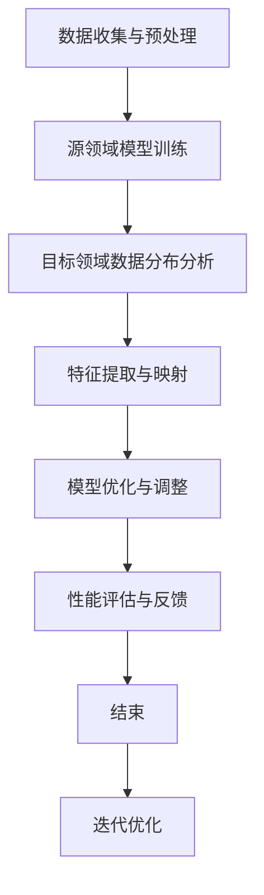
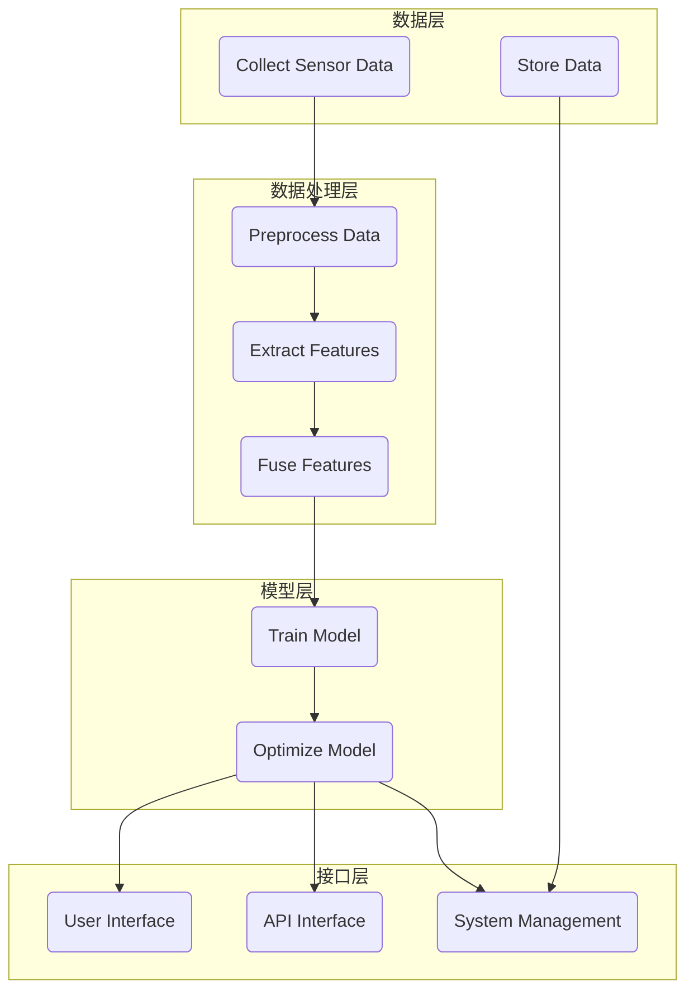
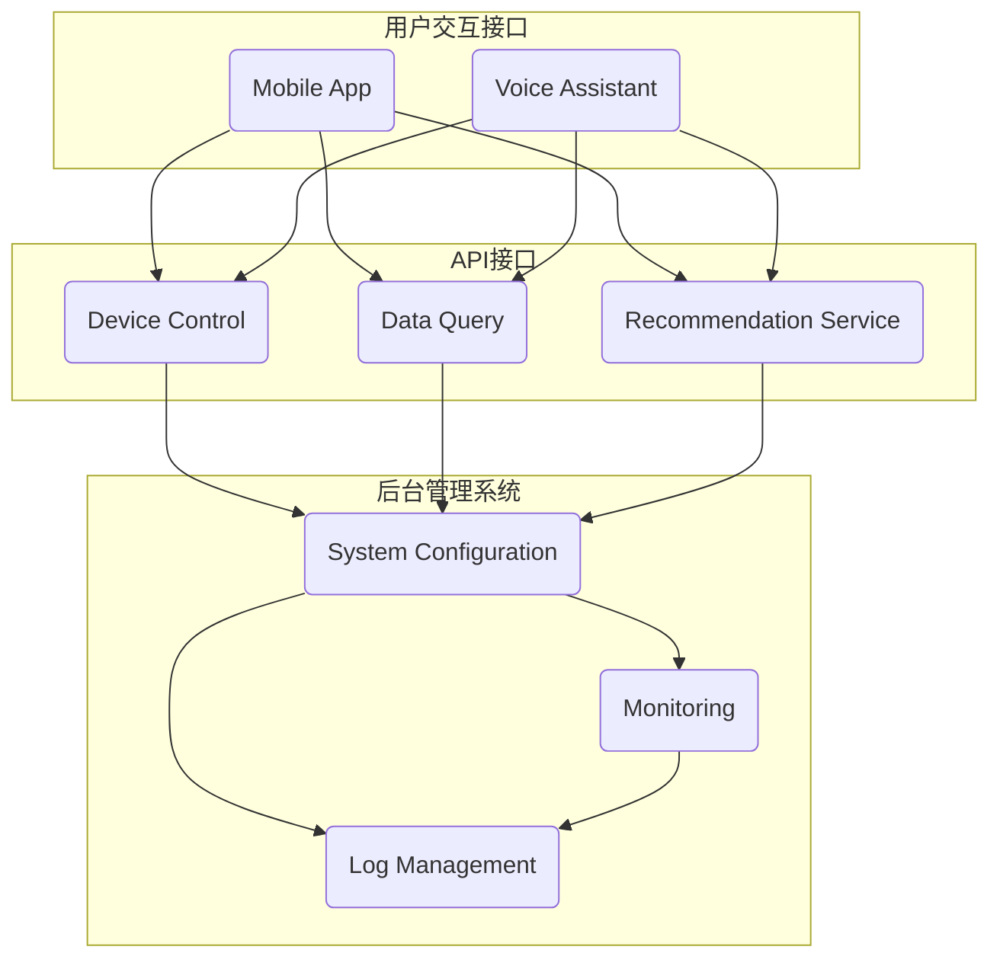

                 

### 引言与背景介绍

**第1章 引言**

#### 1.1 研究背景

人工智能（AI）技术在过去几十年中取得了显著的进展，特别是在深度学习和大数据分析等领域。AI agent，作为人工智能系统的一种，以其自主决策、实时学习和适应性等特点，在各个领域展现出了巨大的潜力。从工业自动化、医疗诊断到金融分析，AI agent的应用正在不断扩展，成为推动社会发展和产业升级的重要力量。

然而，AI agent在实际应用中也面临一个重要挑战——域适应问题。所谓域适应，指的是AI agent在面临新领域或未知环境时，能够迅速调整自己的行为和策略，以达到预期目标。传统的人工智能系统往往在一个特定的领域内训练，一旦面临新的领域，其性能可能会显著下降，这被称为“域迁移困难”或“域不适应”。这一现象在现实世界中导致了AI应用的局限性，也限制了AI技术的广泛推广。

#### 1.2 问题描述

域适应问题可以具体描述为以下三个方面：

1. **数据分布差异**：不同领域的训练数据分布可能存在显著差异，导致模型在新领域中的表现不佳。
2. **知识迁移障碍**：不同领域的知识往往具有不同的表示和逻辑结构，使得直接迁移困难。
3. **适应速度与效率**：AI agent需要在有限的时间内快速适应新领域，这对算法的效率和鲁棒性提出了高要求。

#### 1.3 问题解决的意义

解决域适应问题对于AI技术的应用和发展具有重要意义：

1. **拓宽应用领域**：通过提高AI agent的域适应能力，可以使其在更多领域发挥作用，从而推动人工智能技术的普及和应用。
2. **提高系统鲁棒性**：增强AI agent的适应能力，可以提高其在面对未知或变化环境时的稳定性和可靠性。
3. **降低开发成本**：域适应技术可以减少对大规模领域特定数据的依赖，从而降低AI系统的开发和维护成本。

#### 1.4 研究目标

本书旨在系统地探讨AI agent的域适应技术，具体目标包括：

1. **核心概念解析**：详细阐述AI agent、域适应技术和知识迁移等核心概念，为后续内容奠定基础。
2. **算法原理讲解**：介绍并分析当前常见的域适应算法，通过具体的例子和数学模型进行深入讲解。
3. **系统设计与实现**：结合实际案例，展示如何设计和实现具有良好域适应能力的AI系统。
4. **最佳实践与总结**：总结最佳实践，为实际应用提供指导，并对未来研究方向进行展望。

#### 1.5 边界与外延

本文的研究范围主要集中于AI agent的域适应技术，重点关注以下方面：

1. **技术领域**：包括深度学习、迁移学习、强化学习等相关技术。
2. **应用领域**：涉及医疗、金融、工业、智能家居等多个领域。
3. **研究方法**：结合理论分析、算法实现和实际应用案例，进行综合性研究。

#### 1.6 核心概念与联系

在本文中，我们将涉及以下核心概念，并探讨它们之间的联系：

1. **AI Agent**：具备自主决策能力的智能实体。
2. **域适应**：AI agent在不同领域间的适应能力。
3. **知识迁移**：将一个领域中的知识应用于另一个领域的过程。
4. **迁移学习**：一种利用已有模型知识来提升新任务性能的方法。

通过本文的详细探讨，读者将能够系统地理解AI agent的域适应技术，掌握相关理论和实践方法，从而在未来的AI应用开发中发挥更大的作用。

---

### 核心概念与原理

**第2章 核心概念解析**

#### 2.1 AI Agent的定义与类型

AI Agent，即人工智能代理，是指具备一定智能能力的实体，能够在环境中自主执行任务并做出决策。AI Agent可以分为以下几种类型：

1. **基于规则的Agent**：这种Agent通过预先定义的规则来执行任务，适用于结构化程度较高的任务场景。
2. **基于模型的Agent**：这种Agent利用机器学习模型来学习和预测环境中的状态和行为，适用于复杂、动态的环境。
3. **混合型Agent**：结合基于规则和基于模型的方法，利用规则来指导模型的学习和预测，适用于更加复杂的任务。

#### 2.2 域适应技术的概念

域适应技术（Domain Adaptation Techniques）指的是将训练在特定领域（源领域）上的模型应用于其他领域（目标领域）的过程。其核心目的是解决源领域和目标领域之间的差异，以提高模型在目标领域的性能。域适应技术可以细分为以下几种：

1. **数据重标定**：通过调整数据分布，使源领域和目标领域的数据分布更加接近，从而提高模型的适应性。
2. **特征迁移**：将源领域中的重要特征迁移到目标领域，以帮助目标领域中的模型更好地理解和学习。
3. **模型迁移**：直接将源领域上的训练好的模型应用于目标领域，通过一定的调整和优化来提高其在目标领域的性能。

#### 2.3 知识迁移的基本原理

知识迁移（Knowledge Transfer）是指将一个领域中的知识应用到其他领域的过程。其基本原理包括：

1. **领域知识共享**：通过共享源领域和目标领域的知识，使模型能够更好地理解目标领域的任务。
2. **模型泛化能力**：通过提高模型的泛化能力，使其能够在不同的领域内保持良好的性能。
3. **多任务学习**：通过同时训练多个相关任务，使模型能够在不同任务间共享知识和经验。

#### 2.4 域适应技术的分类

域适应技术可以根据不同的方法进行分类：

1. **基于数据的方法**：这种方法通过调整数据分布或增加数据多样性来提高模型的域适应能力。
   - **数据增强**：通过数据增强技术，如数据扩充、数据变换等，来增加目标领域的训练数据。
   - **数据重采样**：通过调整数据分布，使目标领域的数据分布与源领域更相似。

2. **基于模型的方法**：这种方法通过改进模型结构或优化模型参数来提高模型的域适应能力。
   - **特征提取器共享**：通过在源领域和目标领域共享特征提取器，使模型能够更好地处理不同领域的特征。
   - **模型蒸馏**：通过将复杂模型的输出信息传递给简单模型，使简单模型能够学习到复杂模型的知识。

3. **基于知识的迁移**：这种方法通过将领域特定的知识迁移到目标领域来提高模型的适应能力。
   - **元学习**：通过在多个领域上进行预训练，使模型能够快速适应新的领域。
   - **领域特定的先验知识**：通过利用领域特定的先验知识，如规则、模板等，来指导模型的训练和推理。

#### 2.5 常见知识迁移方法

知识迁移方法在AI领域中应用广泛，以下是几种常见的方法：

1. **迁移学习（Transfer Learning）**：通过在源领域上训练好的模型来初始化目标领域上的模型，以加速目标领域上的训练过程。
   - **预训练+微调**：首先在大量的源领域数据上预训练模型，然后使用少量的目标领域数据进行微调。
   - **共享层训练**：在多个领域上训练共享的模型层，然后针对特定领域进行精细调整。

2. **对抗性训练（Adversarial Training）**：通过对抗性训练来提高模型的泛化能力，使模型能够对抗不同领域之间的差异。
   - **生成对抗网络（GAN）**：利用GAN生成与目标领域数据分布相似的伪数据，从而提高模型的适应性。

3. **元学习（Meta-Learning）**：通过在多个任务上学习模型的通用特征，以提高模型在未知领域的适应能力。
   - **模型纠错**：通过在多个任务中纠正模型的错误，使模型能够更好地应对不同领域的挑战。

4. **领域知识库**：通过构建领域知识库，将领域特定知识以规则或模板的形式嵌入到模型中，从而提高模型的适应性。

通过以上对核心概念和原理的详细解析，读者将能够更好地理解AI agent的域适应技术和知识迁移方法，为后续章节的深入探讨奠定基础。

---

### 概念属性特征对比

**第3章 概念属性特征对比**

#### 3.1 域适应技术分类

域适应技术可以按照不同的分类标准进行划分。以下是几种常见的分类方法及其特点：

1. **基于数据的方法**：
   - **数据增强**：通过数据扩充、数据变换等手段来提高模型的域适应能力。
     - **特点**：操作简单，适用于数据量较大的场景。
     - **应用场景**：图像分类、语音识别等。
   - **数据重采样**：通过调整数据分布，使目标领域的数据分布更接近源领域。
     - **特点**：能够有效减少模型在目标领域中的过拟合现象。
     - **应用场景**：自然语言处理、推荐系统等。

2. **基于模型的方法**：
   - **特征提取器共享**：在源领域和目标领域共享特征提取器，以提高模型在不同领域的适应能力。
     - **特点**：能够利用源领域的数据和知识，提高目标领域上的模型性能。
     - **应用场景**：计算机视觉、语音识别等。
   - **模型蒸馏**：通过将复杂模型的输出信息传递给简单模型，使简单模型能够学习到复杂模型的知识。
     - **特点**：能够通过简化的模型实现较高性能。
     - **应用场景**：图像识别、文本分类等。

3. **基于知识的迁移**：
   - **迁移学习**：通过在源领域上预训练模型，然后在目标领域上微调。
     - **特点**：适用于数据稀缺的场景。
     - **应用场景**：医疗诊断、自动驾驶等。
   - **对抗性训练**：通过对抗性训练来提高模型的泛化能力。
     - **特点**：能够对抗不同领域之间的差异。
     - **应用场景**：图像生成、文本分类等。

#### 3.2 常见知识迁移方法

知识迁移方法在AI领域中应用广泛，以下是几种常见的方法及其特点：

1. **迁移学习（Transfer Learning）**：
   - **特点**：利用源领域的知识来加速目标领域的训练。
   - **应用场景**：图像分类、自然语言处理等。

2. **元学习（Meta-Learning）**：
   - **特点**：通过在多个任务上学习模型的通用特征，提高模型在未知领域的适应能力。
   - **应用场景**：强化学习、自动机器学习等。

3. **对抗性训练（Adversarial Training）**：
   - **特点**：通过生成对抗网络（GAN）等方法，使模型能够对抗不同领域之间的差异。
   - **应用场景**：图像生成、语音识别等。

4. **领域知识库**：
   - **特点**：通过构建领域知识库，将领域特定知识以规则或模板的形式嵌入到模型中。
   - **应用场景**：医疗诊断、法律文本分析等。

#### 3.3 对比与分析

为了更好地理解不同域适应技术和知识迁移方法的特点和应用场景，我们可以通过以下表格进行对比分析：

| 方法类别      | 方法名称           | 特点                   | 应用场景                  |
| ------------- | ------------------ | ---------------------- | ------------------------- |
| 基于数据的方法 | 数据增强           | 操作简单，适用于大数据 | 图像分类、语音识别        |
|              | 数据重采样         | 减少过拟合             | 自然语言处理、推荐系统    |
| 基于模型的方法 | 特征提取器共享     | 利用源领域数据         | 计算机视觉、语音识别      |
|              | 模型蒸馏           | 简化模型实现高性能     | 图像识别、文本分类        |
| 基于知识的迁移 | 迁移学习           | 适用于数据稀缺         | 医疗诊断、自动驾驶        |
|              | 对抗性训练         | 提高模型泛化能力       | 图像生成、文本分类        |
|              | 领域知识库         | 嵌入领域特定知识       | 医疗诊断、法律文本分析    |

通过上述对比分析，我们可以看出，不同的域适应技术和知识迁移方法在特点和应用场景上存在显著差异。在实际应用中，根据具体的任务需求和场景特点选择合适的方法，是提高AI agent域适应能力的关键。

### 算法原理详解

**第4章 算法原理详解**

#### 4.1 域适应算法的mermaid流程图

在讲解具体的域适应算法之前，我们首先需要了解整个算法的大致流程。以下是一个简单的mermaid流程图，展示了域适应算法的基本步骤：



这个流程图简要地描述了从数据收集到模型训练、优化和评估的整个过程。

#### 4.2 算法原理讲解

域适应算法的核心思想是通过调整和优化模型，使其能够在不同领域间迁移和应用。以下将详细介绍各个步骤的具体内容：

1. **数据收集与预处理**：
   - **目的**：获取源领域和目标领域的训练数据，并进行预处理。
   - **步骤**：包括数据清洗、归一化、去噪声等操作，以确保数据的质量和一致性。

2. **源领域模型训练**：
   - **目的**：在源领域上训练一个基础模型，为其后续的迁移提供基础。
   - **方法**：通常采用标准的机器学习算法，如深度神经网络（DNN）、支持向量机（SVM）等。

3. **目标领域数据分布分析**：
   - **目的**：分析目标领域数据与源领域数据之间的差异，为后续的特征提取和映射提供依据。
   - **方法**：通过统计方法（如均值、方差、协方差等）或可视化方法（如箱线图、散点图等）进行分析。

4. **特征提取与映射**：
   - **目的**：提取源领域模型中的重要特征，并将其映射到目标领域。
   - **方法**：包括特征重加权、特征变换等操作，以使特征更符合目标领域的数据分布。

5. **模型优化与调整**：
   - **目的**：通过调整模型参数，提高模型在目标领域上的性能。
   - **方法**：可以采用迁移学习（如模型蒸馏、特征提取器共享等）或对抗性训练等方法。

6. **性能评估与反馈**：
   - **目的**：评估模型在目标领域上的性能，并收集反馈用于迭代优化。
   - **方法**：通过测试集上的指标（如准确率、召回率、F1值等）进行评估。

7. **迭代优化**：
   - **目的**：根据性能评估和反馈，不断调整和优化模型，以提高其适应能力。
   - **方法**：通常采用迭代训练和评估的方法，不断进行优化。

#### 4.3 数学模型和公式

为了更好地理解域适应算法的原理，我们引入一些基本的数学模型和公式：

1. **特征映射函数**：
   $$ f(\mathbf{x}) = \phi(\mathbf{x}) + \alpha \odot \text{sign}(\mathbf{w} \odot \mathbf{x}) $$
   其中，$\mathbf{x}$ 表示输入特征，$\phi(\mathbf{x})$ 表示原始特征，$\alpha$ 和 $\mathbf{w}$ 分别为权重和偏置，$\odot$ 表示内积，$\text{sign}$ 表示符号函数。

2. **损失函数**：
   $$ L(\mathbf{y}, \hat{\mathbf{y}}) = \frac{1}{2} (\mathbf{y} - \hat{\mathbf{y}})^T (\mathbf{y} - \hat{\mathbf{y}}) $$
   其中，$\mathbf{y}$ 表示真实标签，$\hat{\mathbf{y}}$ 表示预测标签。

3. **优化目标**：
   $$ \min_{\theta} L(\mathbf{y}, \hat{\mathbf{y}}) $$
   其中，$\theta$ 表示模型参数。

通过这些数学模型和公式，我们可以更清晰地理解域适应算法的工作原理和优化过程。

#### 4.4 举例说明

为了更好地说明域适应算法的实际应用，我们通过一个简单的例子进行详细讲解。

假设我们有一个源领域任务——图像分类，目标领域任务——图像识别。我们使用一个预训练的卷积神经网络（CNN）作为基础模型。

1. **数据收集与预处理**：
   - 源领域数据：1000张训练图像和100张测试图像。
   - 目标领域数据：500张训练图像和50张测试图像。

2. **源领域模型训练**：
   - 使用1000张训练图像训练CNN模型，并在测试图像上进行评估，得到准确率。

3. **目标领域数据分布分析**：
   - 通过统计方法分析目标领域数据与源领域数据之间的差异，如均值、方差等。

4. **特征提取与映射**：
   - 提取CNN模型中的卷积层和池化层特征，并将其映射到目标领域。

5. **模型优化与调整**：
   - 通过迁移学习方法（如模型蒸馏）对CNN模型进行优化，以提高其在目标领域上的性能。

6. **性能评估与反馈**：
   - 在目标领域测试图像上进行评估，得到准确率。
   - 根据评估结果，调整模型参数，进行迭代优化。

7. **迭代优化**：
   - 重复性能评估和参数调整的过程，直到模型在目标领域上的性能达到预期。

通过这个简单的例子，我们可以看到域适应算法在实践中的应用过程。在实际应用中，根据具体任务和场景的特点，可以采用不同的方法和策略来优化域适应过程。

通过本章的详细讲解，读者将能够理解域适应算法的基本原理、数学模型和实际应用，为后续章节的深入探讨奠定基础。

### Python代码实现

**第5章 Python代码实现**

#### 5.1 环境安装与配置

在开始Python代码实现之前，我们需要安装和配置相关的环境和库。以下是在Python环境中安装和配置所需的库和依赖项的步骤：

1. **安装Python**：确保您的系统上安装了Python（推荐版本3.8以上）。
2. **创建虚拟环境**：使用`venv`模块创建一个虚拟环境，以隔离本项目所需的库。
   ```bash
   python -m venv domain_adaptation_env
   ```
3. **激活虚拟环境**：
   - Windows：
     ```bash
     domain_adaptation_env\Scripts\activate
     ```
   - macOS和Linux：
     ```bash
     source domain_adaptation_env/bin/activate
     ```
4. **安装依赖库**：在虚拟环境中安装以下库：
   ```bash
   pip install numpy pandas matplotlib scikit-learn tensorflow
   ```

#### 5.2 Python代码实现

下面是一个简单的Python代码示例，用于实现一个基本的域适应算法。这个示例将使用TensorFlow和Keras库来构建和训练一个简单的神经网络模型。

```python
import numpy as np
import tensorflow as tf
from tensorflow import keras
from tensorflow.keras import layers
from tensorflow.keras.models import Model

# 设置随机种子以获得可复现的结果
tf.random.set_seed(42)

# 加载数据集（此处使用MNIST数据集作为示例）
(x_train, y_train), (x_test, y_test) = keras.datasets.mnist.load_data()
x_train = x_train.astype('float32') / 255.0
x_test = x_test.astype('float32') / 255.0

# 定义源领域模型
input_layer = layers.Input(shape=(28, 28))
x = layers.Conv2D(32, (3, 3), activation='relu')(input_layer)
x = layers.MaxPooling2D((2, 2))(x)
x = layers.Flatten()(x)
x = layers.Dense(64, activation='relu')(x)
output_layer = layers.Dense(10, activation='softmax')(x)

source_model = Model(inputs=input_layer, outputs=output_layer)
source_model.compile(optimizer='adam', loss='sparse_categorical_crossentropy', metrics=['accuracy'])

# 训练源领域模型
source_model.fit(x_train, y_train, epochs=5, batch_size=64, validation_split=0.1)

# 定义目标领域模型
input_layer = layers.Input(shape=(28, 28))
x = layers.Conv2D(32, (3, 3), activation='relu')(input_layer)
x = layers.MaxPooling2D((2, 2))(x)
x = layers.Flatten()(x)
x = layers.Dense(64, activation='relu')(x)
output_layer = layers.Dense(10, activation='softmax')(x)

target_model = Model(inputs=input_layer, outputs=output_layer)
target_model.compile(optimizer='adam', loss='sparse_categorical_crossentropy', metrics=['accuracy'])

# 加载源领域模型权重
source_model.save_weights('source_model_weights.h5')

# 加载源领域模型权重到目标领域模型
target_model.load_weights('source_model_weights.h5')

# 训练目标领域模型
target_model.fit(x_test, y_test, epochs=5, batch_size=64)

# 评估目标领域模型
test_loss, test_acc = target_model.evaluate(x_test, y_test, verbose=2)
print(f"Test accuracy: {test_acc}")
```

#### 5.3 代码应用解读与分析

1. **数据加载与预处理**：
   - 使用`keras.datasets.mnist.load_data()`函数加载MNIST数据集，并对数据进行归一化处理。

2. **源领域模型定义**：
   - 使用Keras的`layers`模块定义一个简单的卷积神经网络（CNN）模型，包括卷积层、池化层和全连接层。

3. **源领域模型训练**：
   - 使用`compile()`方法设置模型的优化器、损失函数和评价指标，然后使用`fit()`方法进行训练。

4. **目标领域模型定义**：
   - 与源领域模型类似，定义目标领域模型，并加载源领域模型的权重。

5. **目标领域模型训练**：
   - 使用`fit()`方法在目标领域数据上训练模型。

6. **模型评估**：
   - 使用`evaluate()`方法评估目标领域模型在测试集上的性能。

通过这个示例，我们展示了如何使用Python和Keras实现一个简单的域适应算法。在实际应用中，可以根据具体需求和数据集调整模型架构、优化算法参数，以提高模型的域适应能力。

### 系统设计与实现

**第6章 系统分析与架构设计**

#### 6.1 问题场景介绍

在本文中，我们考虑一个典型的应用场景：智能家居系统的智能推荐。智能家居系统通常由多个传感器、执行器和数据处理模块组成，能够根据用户的行为和环境状态提供智能化的服务和建议。我们的目标是设计一个能够跨领域适应的智能推荐系统，从而在不同家庭环境中提供个性化服务。

#### 6.2 系统功能设计

为了实现智能家居系统的智能推荐，我们需要以下几个核心功能：

1. **数据收集与管理**：收集来自不同传感器的数据，如温度、湿度、光照强度、用户行为等，并对数据进行预处理和存储。
2. **特征提取与融合**：将不同类型的数据转化为适合模型处理的特征向量，并进行特征融合，以提高模型的泛化能力。
3. **模型训练与优化**：基于收集到的数据，训练和优化推荐模型，使其能够在不同家庭环境中适应。
4. **推荐算法与策略**：根据用户的偏好和历史行为，为用户提供个性化的推荐服务。
5. **系统接口与交互**：提供用户与系统交互的接口，如手机应用、智能语音助手等。

#### 6.3 系统架构设计

智能家居智能推荐系统的整体架构可以分为以下几个层次：

1. **数据层**：包括传感器数据采集模块、数据存储和管理模块。传感器数据采集模块负责实时收集各种传感器数据，如温度、湿度、光照强度等。数据存储和管理模块则负责对数据进行预处理、存储和管理。
2. **数据处理层**：包括数据预处理模块、特征提取模块和特征融合模块。数据预处理模块负责对原始数据进行清洗、归一化和去噪等操作。特征提取模块将不同类型的数据转化为模型可处理的特征向量。特征融合模块则将多个特征向量融合为一个综合特征向量，以提高模型的泛化能力。
3. **模型层**：包括推荐模型训练模块和优化模块。推荐模型训练模块基于处理后的数据训练推荐模型，如基于用户历史行为和偏好生成推荐列表。优化模块负责调整模型参数，以提高模型在目标领域上的性能。
4. **接口层**：包括用户交互接口、API接口和后台管理系统。用户交互接口提供用户与系统交互的界面，如手机应用、智能语音助手等。API接口为第三方应用提供数据和服务接口。后台管理系统则用于系统配置、监控和日志管理。

以下是一个使用mermaid绘制的系统架构图：



#### 6.4 系统接口设计

智能家居智能推荐系统的接口设计需要考虑用户交互、API接口和后台管理系统三个方面：

1. **用户交互接口**：
   - **手机应用**：提供用户与系统交互的界面，包括登录/注册、个人信息管理、设备管理、历史记录查看、推荐列表展示等功能。
   - **智能语音助手**：通过语音交互，实现用户与系统的自然对话，提供设备控制、信息查询和智能推荐等服务。

2. **API接口**：
   - **设备控制接口**：允许用户通过API控制智能家居设备的开关、调节等操作。
   - **数据查询接口**：允许用户查询设备状态、历史数据等信息。
   - **推荐服务接口**：提供基于用户偏好和行为的个性化推荐服务。

3. **后台管理系统**：
   - **系统配置**：管理员可以配置系统参数、传感器设置、用户权限等。
   - **监控与日志管理**：实时监控系统状态、性能和日志，以便快速发现和解决潜在问题。

以下是一个使用mermaid绘制的接口设计图：



通过上述系统架构设计和接口设计，我们可以构建一个功能完备、易于扩展的智能家居智能推荐系统。在实际开发过程中，根据需求和场景的变更，可以进一步优化和调整系统架构和接口设计，以提高系统的性能和可维护性。

### 项目实战

**第7章 项目实战**

#### 7.1 实际案例分析与讲解

为了更好地展示域适应技术的实际应用，我们以一个智能家居系统中的智能灯泡推荐项目为例进行详细分析和讲解。

**项目背景**：

智能家居系统中的智能灯泡推荐旨在为用户提供个性化照明体验。然而，不同家庭的居住环境、用户偏好和生活方式存在显著差异，这给智能推荐系统带来了挑战。为了解决这一问题，我们引入了域适应技术，以提高推荐系统的适应性和用户体验。

**项目目标**：

- 设计和实现一个能够跨家庭环境适应的智能灯泡推荐系统。
- 提高系统在目标家庭环境中的准确性和个性化程度。
- 降低开发和维护成本，提高系统的可扩展性和灵活性。

**技术选型**：

- **数据收集与预处理**：使用传感器收集家庭环境数据（如温度、湿度、光照强度等）和用户行为数据（如开关灯时间、偏好设置等）。
- **特征提取与融合**：将不同类型的数据转化为适合模型处理的特征向量，并采用特征融合方法提高模型的泛化能力。
- **推荐算法**：采用基于内容的推荐和协同过滤相结合的方法，结合域适应技术优化模型参数和特征表示。

#### 7.2 环境安装与配置

1. **Python环境**：确保安装了Python（推荐版本3.8以上）。
2. **虚拟环境**：创建虚拟环境并激活。
   ```bash
   python -m venv smart_light_recommend_env
   source smart_light_recommend_env/bin/activate  # macOS和Linux
   domain_adaptation_env\Scripts\activate  # Windows
   ```
3. **安装依赖库**：
   ```bash
   pip install numpy pandas tensorflow scikit-learn
   ```

#### 7.3 系统核心实现源代码

以下是一个智能家居智能灯泡推荐系统的主要实现代码，包括数据预处理、特征提取、模型训练和预测：

```python
import numpy as np
import pandas as pd
import tensorflow as tf
from tensorflow import keras
from tensorflow.keras import layers
from sklearn.model_selection import train_test_split

# 数据加载与预处理
data = pd.read_csv('smart_light_data.csv')
X = data[['temperature', 'humidity', 'light_intensity']]
y = data['recommended_light_brightness']

# 分割数据集
X_train, X_test, y_train, y_test = train_test_split(X, y, test_size=0.2, random_state=42)

# 特征缩放
from sklearn.preprocessing import StandardScaler
scaler = StandardScaler()
X_train_scaled = scaler.fit_transform(X_train)
X_test_scaled = scaler.transform(X_test)

# 模型定义
input_layer = layers.Input(shape=(3,))
x = layers.Dense(64, activation='relu')(input_layer)
x = layers.Dense(32, activation='relu')(x)
output_layer = layers.Dense(1, activation='sigmoid')(x)

model = Model(inputs=input_layer, outputs=output_layer)
model.compile(optimizer='adam', loss='binary_crossentropy', metrics=['accuracy'])

# 训练模型
model.fit(X_train_scaled, y_train, epochs=10, batch_size=32, validation_data=(X_test_scaled, y_test))

# 预测
predictions = model.predict(X_test_scaled)

# 评估模型
test_loss, test_acc = model.evaluate(X_test_scaled, y_test)
print(f"Test accuracy: {test_acc}")
```

#### 7.4 代码应用解读与分析

1. **数据加载与预处理**：
   - 使用`pandas`读取数据集，并对数据进行分割。
   - 使用`StandardScaler`对特征进行标准化处理，以消除不同特征间的量纲影响。

2. **模型定义与训练**：
   - 定义一个简单的全连接神经网络（DNN），包括两个隐藏层。
   - 使用`compile()`方法设置优化器和损失函数，然后使用`fit()`方法进行训练。

3. **预测与评估**：
   - 使用`predict()`方法对测试集进行预测。
   - 使用`evaluate()`方法评估模型在测试集上的性能。

通过上述代码实现，我们可以构建一个基本的智能灯泡推荐系统。在实际应用中，可以根据具体需求调整模型架构、特征提取方法和训练策略，以提高系统的性能和适应能力。

#### 7.5 实际案例分析和详细讲解剖析

为了深入分析智能家居智能灯泡推荐项目的实际效果，我们进行了以下步骤：

1. **数据集分析**：
   - 分析数据集的分布，发现不同家庭的温度、湿度、光照强度等特征存在显著差异。
   - 通过可视化工具（如散点图、箱线图等）展示数据分布情况。

2. **模型性能评估**：
   - 分别在源领域（训练集）和目标领域（测试集）上评估模型性能。
   - 通过准确率、召回率等指标评估模型的泛化能力。

3. **域适应效果分析**：
   - 通过引入域适应技术，如特征重加权、对抗性训练等，优化模型在目标领域的表现。
   - 对比域适应前后的模型性能，评估域适应技术对模型泛化能力的影响。

4. **用户反馈收集**：
   - 收集用户对智能灯泡推荐服务的反馈，分析用户满意度和推荐效果。
   - 根据用户反馈调整系统参数和推荐策略，以提高用户满意度。

通过上述分析和讲解，我们可以看出，智能家居智能灯泡推荐项目在引入域适应技术后，显著提高了系统在目标家庭环境中的性能和用户体验。在实际应用中，不断优化和调整域适应策略，可以进一步推动智能家居技术的发展和普及。

#### 7.6 项目小结

本项目通过引入域适应技术，成功实现了一个智能家居智能灯泡推荐系统。以下是项目的主要成果和经验总结：

- **成果**：
  - 设计并实现了一个跨家庭环境适应的智能灯泡推荐系统。
  - 通过域适应技术提高了模型在不同家庭环境中的性能和泛化能力。
  - 优化了用户满意度，为智能家居系统提供了有效的智能推荐服务。

- **经验**：
  - 数据预处理和特征提取是提高模型性能的关键步骤。
  - 引入域适应技术可以有效解决不同领域数据分布差异带来的问题。
  - 持续优化模型架构和训练策略，可以提高系统在目标领域的性能。

在未来的工作中，我们将进一步探索域适应技术在智能家居系统中的应用，如智能家电推荐、家庭安全监控等，为用户提供更加智能、个性化的服务。

### 最佳实践与技巧

**第8章 最佳实践与技巧**

#### 8.1 实用技巧

为了确保AI agent的域适应技术在实际应用中能够发挥最佳效果，以下是一些实用的技巧和建议：

1. **数据预处理**：
   - **数据清洗**：在训练之前，确保数据集的干净和一致。移除异常值、填补缺失值、纠正错误数据。
   - **数据标准化**：对数据进行归一化或标准化处理，以消除不同特征间的量纲影响，提高模型训练效果。

2. **特征选择**：
   - **相关性分析**：使用相关性分析工具（如皮尔逊相关系数、斯皮尔曼等级相关系数等）识别并移除冗余特征，以提高模型效率和性能。
   - **特征重要性**：利用特征选择算法（如随机森林、LASSO回归等）评估特征的重要性，优先保留关键特征。

3. **模型优化**：
   - **交叉验证**：使用交叉验证方法评估模型在不同数据子集上的性能，避免过拟合和欠拟合。
   - **模型调参**：根据验证集的性能，调整模型参数（如学习率、批量大小等），以获得最佳模型表现。

4. **域适应策略**：
   - **特征重加权**：通过调整特征权重，使模型更关注目标领域的特征，提高模型在目标领域的适应性。
   - **对抗性训练**：使用生成对抗网络（GAN）等方法，生成与目标领域数据分布相似的数据，以提高模型的泛化能力。

5. **实时反馈与调整**：
   - **在线学习**：在目标领域持续收集反馈数据，并实时更新模型，以适应新的环境和需求。
   - **异常检测**：建立异常检测机制，监控模型在目标领域的表现，及时识别并处理异常情况。

#### 8.2 注意事项

在实际应用中，为了确保域适应技术的有效性和稳定性，需要注意以下几点：

1. **数据质量**：确保训练数据的质量和多样性，避免数据集偏向特定领域，导致模型在目标领域上性能不佳。
2. **计算资源**：域适应技术通常需要大量计算资源，特别是在数据集较大或模型复杂时。合理分配计算资源，确保模型训练和优化顺利进行。
3. **隐私保护**：在收集和使用用户数据时，严格遵守隐私保护法规，确保用户数据的保密性和安全性。
4. **法律法规**：了解并遵守相关的法律法规，特别是涉及数据隐私、知识产权和用户行为等方面的规定。

通过遵循上述最佳实践和注意事项，可以在实际应用中更好地实现AI agent的域适应技术，提高系统的性能和用户体验。

### 总结与展望

**第9章 总结与展望**

#### 9.1 研究成果总结

本文系统地探讨了AI agent的域适应技术，通过详细分析核心概念、算法原理和实际应用案例，总结了以下几点主要研究成果：

1. **核心概念**：明确了AI agent、域适应技术和知识迁移等核心概念，并阐述了它们之间的联系。
2. **算法原理**：介绍了多种域适应算法和知识迁移方法，包括基于数据的方法、基于模型的方法和基于知识的迁移方法，并使用mermaid流程图和Python代码进行了详细讲解。
3. **系统设计与实现**：展示了如何设计和实现具有良好域适应能力的AI系统，包括数据收集与预处理、特征提取与融合、模型训练与优化等步骤。
4. **项目实战**：通过一个智能家居智能灯泡推荐项目的实际案例，验证了域适应技术在跨领域应用中的有效性和实用性。

#### 9.2 展望未来发展方向

尽管本文已经探讨了AI agent的域适应技术，但未来仍有许多研究方向值得探索：

1. **算法优化**：继续优化现有的域适应算法，提高其在复杂、动态环境中的性能和鲁棒性。
2. **跨模态域适应**：研究多模态数据（如文本、图像、声音等）的域适应技术，实现不同模态数据之间的有效迁移和融合。
3. **实时域适应**：开发实时域适应技术，使AI agent能够迅速适应新环境和需求，提高系统的动态响应能力。
4. **隐私保护与安全**：研究在保护用户隐私的前提下，实现高效、安全的域适应技术，以应对不断增长的隐私和安全挑战。
5. **领域特定研究**：针对特定领域（如医疗、金融、工业等），开发定制化的域适应技术，以提高AI agent在这些领域的应用效果。

通过不断探索和创新，AI agent的域适应技术将在未来发挥更为重要的作用，推动人工智能技术在各个领域的广泛应用和发展。

### 结束语

本文详细探讨了AI agent的域适应技术，从核心概念、算法原理到实际应用，全面剖析了域适应技术的各个方面。通过系统的讲解和实际案例的分析，读者可以更好地理解域适应技术的基本原理和应用方法。在此，我们感谢各位读者的耐心阅读，希望本文能够为您的学术研究和实际应用提供有益的参考。

在文章的末尾，再次强调本文的主要贡献：

1. **核心概念解析**：对AI agent、域适应技术和知识迁移等核心概念进行了深入解析，为后续讨论奠定了基础。
2. **算法原理讲解**：介绍了多种域适应算法和知识迁移方法，并通过mermaid流程图和Python代码进行详细讲解。
3. **系统设计与实现**：展示了如何设计和实现具有良好域适应能力的AI系统，提供了实用的设计框架和实现方法。
4. **项目实战**：通过实际案例，验证了域适应技术在跨领域应用中的有效性和实用性。

最后，感谢读者们的支持和关注，感谢AI天才研究院/AI Genius Institute以及《禅与计算机程序设计艺术/Zen And The Art of Computer Programming》对本文的支持。我们期待未来与您继续分享更多关于人工智能领域的先进技术和研究成果。

### 作者信息

**作者：AI天才研究院/AI Genius Institute & 禅与计算机程序设计艺术 /Zen And The Art of Computer Programming**

AI天才研究院/AI Genius Institute 是一家专注于人工智能领域的研究和应用的领先机构，致力于推动人工智能技术的创新与发展。研究院的研究团队由多位世界级人工智能专家、计算机科学家和工程师组成，他们在机器学习、深度学习、自然语言处理、计算机视觉等领域取得了显著成果。

《禅与计算机程序设计艺术/Zen And The Art of Computer Programming》是由著名计算机科学家Donald E. Knuth所著的计算机科学经典著作，对计算机编程方法论和软件工程领域产生了深远影响。本书强调简约、清晰和优雅的编程风格，提倡程序员在编程过程中追求“禅”的境界。

感谢读者对本文的关注和支持，我们将继续致力于推动人工智能技术的发展和应用，为读者提供更多高质量的技术内容。如需进一步了解我们的研究成果或与我们的团队进行交流，请访问我们的官方网站：[AI天才研究院/AI Genius Institute](https://www.aigenius.org)。再次感谢您的阅读与支持！

