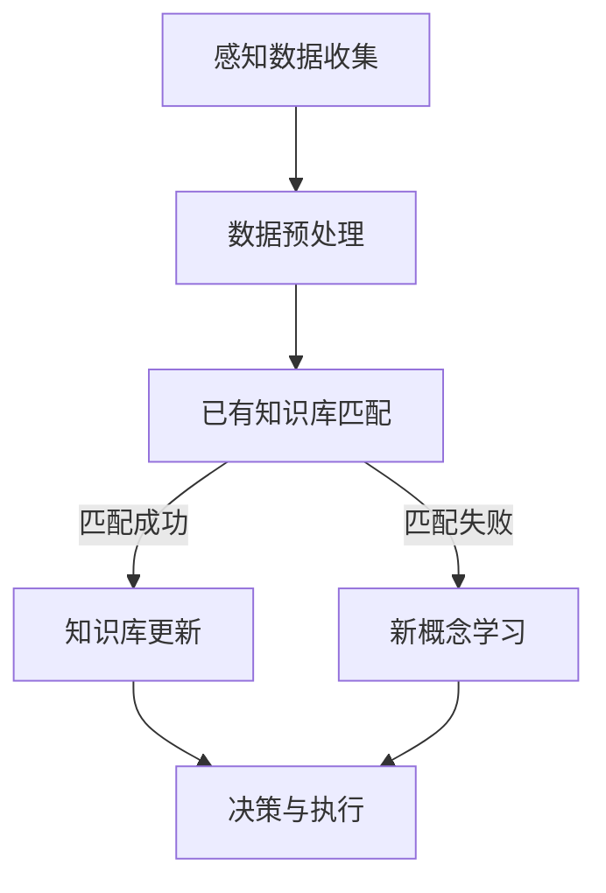
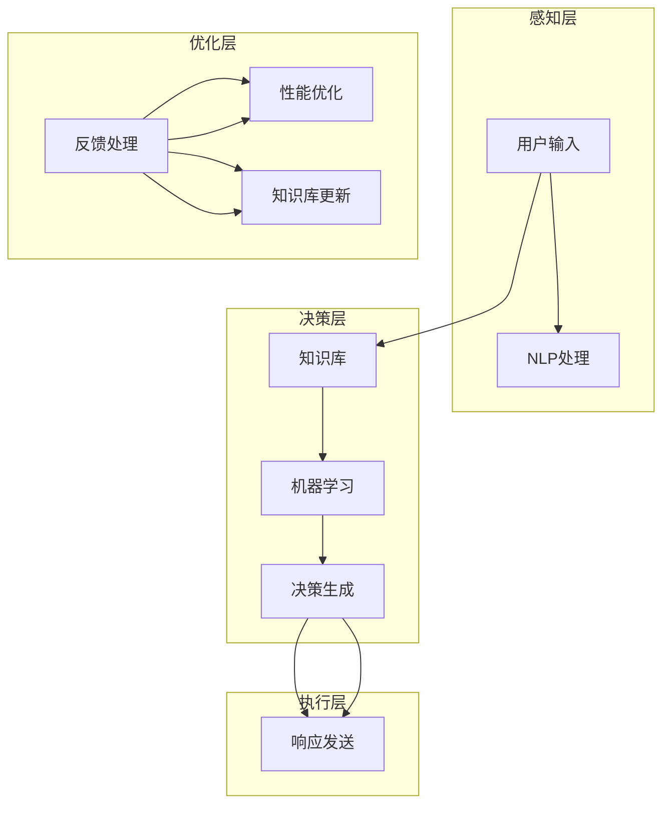
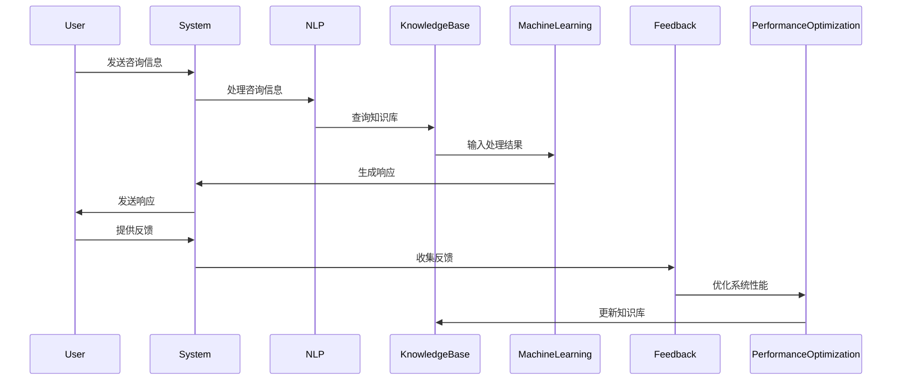

                 

# AI Agent的增量式概念学习与知识更新

> 关键词：AI Agent、增量式学习、知识更新、算法原理、数学模型、系统架构

> 摘要：本文深入探讨了AI Agent的增量式概念学习与知识更新机制。文章首先介绍了AI Agent及其相关背景，随后详细分析了增量式概念学习和知识更新的定义、核心要素以及相互关系。接着，文章阐述了增量式概念学习与知识更新的算法原理，结合Python代码和数学模型进行了深入讲解。最后，文章提供了一个典型AI Agent系统的架构设计和项目实战案例，总结了最佳实践和注意事项，并推荐了进一步阅读的资料。

## 引言

随着人工智能技术的迅猛发展，AI Agent已经成为研究的热点领域之一。AI Agent是一种具备自主决策和行动能力的智能体，能够在动态环境中与用户和环境交互，实现复杂的任务处理。然而，AI Agent的性能和效能受到其学习和知识更新能力的影响。传统的人工智能方法往往依赖于庞大的数据集进行训练，难以适应动态环境的变化。因此，研究AI Agent的增量式概念学习与知识更新机制具有重要意义。

本文旨在系统地介绍AI Agent的增量式概念学习与知识更新机制，并深入分析其核心概念、算法原理和实际应用。通过本文的阅读，读者将了解以下内容：

1. AI Agent的定义、背景及其重要性。
2. 增量式概念学习和知识更新的定义、核心要素及其关系。
3. 增量式概念学习与知识更新的算法原理及数学模型。
4. 典型AI Agent系统的架构设计。
5. AI Agent系统的实际项目实战和案例分析。

## 第1章 背景介绍

### AI Agent的定义

AI Agent是指具有自主决策和行动能力的计算机程序或实体，能够根据环境和目标进行决策和行动，以实现特定的任务。AI Agent的核心特征包括感知、决策、执行和自适应能力。感知是指AI Agent能够获取并理解环境信息；决策是指AI Agent根据感知信息进行判断和选择；执行是指AI Agent执行决策结果；自适应能力是指AI Agent能够根据环境变化调整自身行为。

AI Agent的研究背景可以追溯到多智能体系统（MAS）和人工智能领域。多智能体系统研究多个智能体如何通过协作和竞争实现共同目标。随着计算机技术和人工智能的快速发展，AI Agent在智能交通、智能制造、智能安防、智能客服等领域得到广泛应用。

### 增量式概念学习的定义

增量式概念学习是指AI Agent在已有知识基础上，通过不断更新和扩展知识库，以适应动态环境变化的学习过程。与传统的批量学习相比，增量式概念学习具有以下优势：

1. **适应性**：AI Agent能够根据环境变化动态调整学习策略，适应不同场景的需求。
2. **高效性**：通过利用已有知识，减少对新数据的依赖，提高学习效率。
3. **可维护性**：增量式学习使得知识库的更新和维护更加方便，降低维护成本。

### 知识更新的定义

知识更新是指AI Agent在运行过程中，根据新获取的信息和经验，对知识库进行修正、扩展或删除的过程。知识更新是AI Agent保持学习和适应能力的重要机制，主要包括以下几种类型：

1. **知识修正**：针对现有知识的错误或不准确之处进行修正。
2. **知识扩展**：在现有知识基础上，增加新的信息或概念，以适应新的任务或环境。
3. **知识删除**：删除不再适用或过时的知识，以保持知识库的精简和高效。

### 核心要素

增量式概念学习和知识更新涉及多个核心要素，包括感知模块、决策模块、执行模块和知识库等。感知模块负责收集环境信息；决策模块根据感知信息进行判断和选择；执行模块执行决策结果；知识库存储AI Agent的经验和知识。

### 重要性

AI Agent的增量式概念学习和知识更新机制在人工智能领域具有重要意义：

1. **适应性**：AI Agent能够更好地适应动态环境的变化，提高任务完成率。
2. **学习效率**：通过增量式学习，AI Agent能够高效地利用已有知识，减少对新数据的依赖。
3. **知识管理**：增量式学习有助于维护和管理知识库，提高系统的可维护性。

## 第2章 核心概念与联系

### AI Agent

AI Agent是一种具有自主决策和行动能力的计算机程序或实体，能够根据环境和目标进行决策和行动，以实现特定的任务。AI Agent的核心特征包括感知、决策、执行和自适应能力。

#### 感知模块

感知模块负责收集环境信息，包括视觉、听觉、触觉等多种传感数据。感知模块通过对这些数据进行处理和分析，提取出有用的信息，为决策模块提供基础数据。

#### 决策模块

决策模块根据感知模块提供的信息，利用预定义的规则或学习到的策略，进行判断和选择。决策模块的核心任务是生成行动计划，以实现特定目标。

#### 执行模块

执行模块负责执行决策模块生成的行动计划，将决策转化为具体行动。执行模块通常与外部设备或系统进行交互，以实现特定的任务。

#### 自适应能力

自适应能力是指AI Agent能够根据环境变化调整自身行为，以实现任务目标。自适应能力包括适应环境变化、学习新任务、优化策略等。

### 增量式概念学习

增量式概念学习是指AI Agent在已有知识基础上，通过不断更新和扩展知识库，以适应动态环境变化的学习过程。增量式概念学习具有以下核心要素：

#### 已有知识库

已有知识库是指AI Agent在训练或运行过程中积累的知识。已有知识库包括事实、规则、模型、策略等，是AI Agent进行决策和行动的基础。

#### 新信息

新信息是指AI Agent在运行过程中从环境中获取的新数据或新经验。新信息用于更新和扩展已有知识库，以适应动态环境变化。

#### 知识更新策略

知识更新策略是指AI Agent在增量式学习过程中，如何处理新信息和已有知识库的关系，以实现知识库的更新和扩展。常见的知识更新策略包括基于规则的更新、基于实例的更新、基于模型的学习等。

### 知识更新

知识更新是指AI Agent在运行过程中，根据新获取的信息和经验，对知识库进行修正、扩展或删除的过程。知识更新是AI Agent保持学习和适应能力的重要机制。

#### 知识修正

知识修正是指针对现有知识的错误或不准确之处进行修正。知识修正通常基于新信息或用户反馈，对已有知识库进行更新。

#### 知识扩展

知识扩展是指在已有知识基础上，增加新的信息或概念，以适应新的任务或环境。知识扩展有助于提高AI Agent的适应能力和知识覆盖范围。

#### 知识删除

知识删除是指删除不再适用或过时的知识，以保持知识库的精简和高效。知识删除有助于减少知识库的冗余和复杂性，提高系统性能。

### 关系

AI Agent、增量式概念学习和知识更新之间存在紧密的联系。AI Agent通过感知模块获取环境信息，通过决策模块进行判断和选择，通过执行模块实现具体行动。增量式概念学习和知识更新机制使AI Agent能够动态调整和优化自身行为，以适应不断变化的环境。以下是这些核心概念之间的Mermaid ER实体关系图：

```mermaid
erDiagram
AI Agent ||--|{ 感知模块 }
AI Agent ||--|{ 决策模块 }
AI Agent ||--|{ 执行模块 }
AI Agent ||--|{ 知识库 }
AI Agent ||--|{ 增量式概念学习 }
AI Agent ||--|{ 知识更新 }

感知模块 ||--|{ 环境信息 }
决策模块 ||--|{ 预定义规则 }
决策模块 ||--|{ 学习到的策略 }
执行模块 ||--|{ 行动计划 }
知识库 ||--|{ 事实 }
知识库 ||--|{ 规则 }
知识库 ||--|{ 模型 }
知识库 ||--|{ 策略 }
增量式概念学习 ||--|{ 已有知识库 }
增量式概念学习 ||--|{ 新信息 }
增量式概念学习 ||--|{ 知识更新策略 }
知识更新 ||--|{ 知识修正 }
知识更新 ||--|{ 知识扩展 }
知识更新 ||--|{ 知识删除 }
```

通过上述核心概念及其关系的阐述，我们可以更好地理解AI Agent的增量式概念学习和知识更新机制，为进一步探讨算法原理和实际应用提供基础。

### 第3章 算法原理讲解

在本章中，我们将深入探讨AI Agent的增量式概念学习与知识更新的算法原理。首先，通过mermaid绘制算法流程图，然后结合Python代码和数学模型，对算法原理进行详细讲解。

#### 算法流程图

增量式概念学习与知识更新的核心算法通常可以分为以下几个步骤：

1. **感知数据收集**：AI Agent通过感知模块收集环境信息。
2. **数据预处理**：对收集到的数据进行分析和预处理，提取特征信息。
3. **已有知识库匹配**：将预处理后的数据与已有知识库进行匹配，判断是否已有相关概念。
4. **知识库更新**：根据匹配结果，对知识库进行修正、扩展或删除。
5. **决策与执行**：基于更新后的知识库，生成决策和执行行动计划。

以下是使用mermaid绘制的算法流程图：



#### Python代码示例

为了更好地理解算法原理，我们通过Python代码示例来展示增量式概念学习与知识更新的具体实现。以下是一个简单的Python代码示例，用于展示感知数据收集、数据预处理、知识库更新和决策执行过程：

```python
import numpy as np

# 感知数据收集
def collect_data():
    # 假设从传感器获取数据
    sensor_data = np.random.rand(10)
    return sensor_data

# 数据预处理
def preprocess_data(data):
    # 对数据进行标准化处理
    normalized_data = (data - np.mean(data)) / np.std(data)
    return normalized_data

# 知识库匹配
def match_knowledge(data, knowledge_base):
    # 假设知识库为列表
    for concept in knowledge_base:
        if np.isclose(data, concept['value'], atol=0.1):
            return concept
    return None

# 知识库更新
def update_knowledge_base(data, knowledge_base):
    matched_concept = match_knowledge(data, knowledge_base)
    if matched_concept:
        # 知识库修正
        matched_concept['value'] = data
    else:
        # 新概念学习
        knowledge_base.append({'value': data})
    return knowledge_base

# 决策与执行
def make_decision(knowledge_base):
    # 基于知识库进行决策
    decision = "执行任务"
    return decision

# 主函数
def main():
    sensor_data = collect_data()
    normalized_data = preprocess_data(sensor_data)
    knowledge_base = [{'value': 0.5}, {'value': 1.0}]
    updated_knowledge_base = update_knowledge_base(normalized_data, knowledge_base)
    decision = make_decision(updated_knowledge_base)
    print(f"决策结果：{decision}")

if __name__ == "__main__":
    main()
```

#### 数学模型

增量式概念学习与知识更新的算法通常涉及到概率统计、机器学习等数学模型。以下是一个简单的数学模型示例，用于描述增量式概念学习的过程：

$$
P(D|C) = \frac{P(C|D)P(D)}{P(C)}
$$

其中，\( P(D|C) \)表示在已有概念\( C \)的前提下，数据\( D \)的概率；\( P(C|D) \)表示在数据\( D \)的前提下，概念\( C \)的概率；\( P(D) \)表示数据\( D \)的概率；\( P(C) \)表示概念\( C \)的概率。

在增量式学习过程中，我们通常使用贝叶斯公式来更新概念的概率分布。以下是一个使用Python代码实现贝叶斯公式更新的示例：

```python
def bayesian_update(prior_prob, likelihood, evidence_prob):
    return (prior_prob * likelihood) / evidence_prob

# 假设已有概念的概率分布
prior_prob = 0.5
# 假设数据发生的概率
likelihood = 0.8
# 假设数据出现的概率
evidence_prob = 0.9

# 贝叶斯更新
updated_prob = bayesian_update(prior_prob, likelihood, evidence_prob)
print(f"更新后的概念概率：{updated_prob}")
```

通过以上算法流程图、Python代码示例和数学模型讲解，我们可以更好地理解AI Agent的增量式概念学习与知识更新的算法原理。这些原理在实际应用中具有重要意义，能够帮助AI Agent更好地适应动态环境变化，提高任务完成率和系统性能。

### 第4章 数学模型和数学公式

在本章中，我们将详细探讨AI Agent增量式概念学习与知识更新中的关键数学模型和公式，并使用LaTeX格式展示。通过具体例子，我们将解释这些公式如何应用于实际场景。

#### 概率分布

在增量式学习过程中，概率分布是一个核心概念。假设我们有一个概念\( C \)，并且我们对其概率分布进行了估计。概率分布可以通过贝叶斯公式进行更新。贝叶斯公式如下：

$$
P(D|C) = \frac{P(C|D)P(D)}{P(C)}
$$

其中，\( P(D|C) \)是在已有概念\( C \)的前提下，数据\( D \)的概率；\( P(C|D) \)是在数据\( D \)的前提下，概念\( C \)的概率；\( P(D) \)是数据\( D \)的概率；\( P(C) \)是概念\( C \)的概率。

#### 贝叶斯更新

在增量式概念学习中，贝叶斯更新用于根据新数据更新概率分布。假设我们有一个先验概率\( P(C) \)，并且我们通过新数据\( D \)得到了似然概率\( P(D|C) \)。贝叶斯更新公式为：

$$
P(C|D) = \frac{P(D|C)P(C)}{P(D)}
$$

其中，\( P(C|D) \)是更新后的概念\( C \)的概率。

以下是Python代码示例，用于计算贝叶斯更新：

```python
import numpy as np

def bayesian_update(prior_prob, likelihood, evidence_prob):
    return (likelihood * prior_prob) / evidence_prob

# 假设先验概率为0.5
prior_prob = 0.5
# 假设似然概率为0.8
likelihood = 0.8
# 假设证据概率为0.9
evidence_prob = 0.9

# 贝叶斯更新
updated_prob = bayesian_update(prior_prob, likelihood, evidence_prob)
print(f"更新后的概率：{updated_prob}")
```

#### 概率论基础

在增量式学习过程中，概率论基础也是一个关键概念。假设我们有一个数据集，其中包含多个概念和其对应的概率分布。我们使用概率论基础来计算这些概念之间的依赖关系。

假设我们有两个概念\( C_1 \)和\( C_2 \)，其概率分布分别为\( P(C_1) \)和\( P(C_2) \)。我们使用条件概率公式来计算它们之间的依赖关系：

$$
P(C_1|C_2) = \frac{P(C_1 \cap C_2)}{P(C_2)}
$$

其中，\( P(C_1 \cap C_2) \)是概念\( C_1 \)和\( C_2 \)同时发生的概率。

以下是Python代码示例，用于计算条件概率：

```python
def conditional_probability(union_prob, denominator_prob):
    return union_prob / denominator_prob

# 假设\( C_1 \)和\( C_2 \)同时发生的概率为0.3
union_prob = 0.3
# 假设\( C_2 \)的概率为0.5
denominator_prob = 0.5

# 计算条件概率
conditional_prob = conditional_probability(union_prob, denominator_prob)
print(f"条件概率：{conditional_prob}")
```

#### 举例说明

假设我们有一个关于天气的数据集，包含晴天、多云和雨天三种天气类型。我们使用贝叶斯公式来更新天气类型的概率分布。以下是具体例子：

1. **先验概率**：假设晴天、多云和雨天的先验概率分别为0.5、0.3和0.2。
2. **似然概率**：假设今天观测到多云的概率为0.7。
3. **证据概率**：假设今天观测到多云的总概率为0.8。

根据贝叶斯公式，我们可以计算今天为多云的概率：

$$
P(多云|观测到多云) = \frac{P(观测到多云|多云)P(多云)}{P(观测到多云)}
$$

代入先验概率和似然概率：

$$
P(多云|观测到多云) = \frac{0.7 \times 0.3}{0.8} = 0.2625
$$

因此，根据观测到的多云情况，今天为多云的概率为0.2625。

通过上述数学模型和公式的讲解，我们可以更好地理解AI Agent增量式概念学习与知识更新的数学基础。这些模型和公式在实际应用中具有重要意义，能够帮助我们设计和实现高效、自适应的AI Agent系统。

### 第5章 系统分析与架构设计方案

在本章中，我们将深入分析一个典型的AI Agent系统应用场景，并详细介绍系统的功能设计、架构设计、接口设计和系统交互。

#### 应用场景

假设我们设计一个智能客服系统，该系统需要实时响应用户的咨询，并根据用户的反馈进行知识库更新和优化。智能客服系统的主要功能包括：

1. **用户交互**：接收用户的咨询信息，并生成响应。
2. **知识库管理**：维护和更新知识库，以适应动态环境变化。
3. **反馈处理**：根据用户反馈，优化系统性能。

#### 系统功能设计

智能客服系统的功能设计可以从以下几个方面展开：

1. **用户交互**：通过自然语言处理（NLP）技术，解析用户的咨询信息，并生成响应。响应可以包括文本、图像、语音等多种形式。
2. **知识库管理**：包括知识库的创建、更新、删除和查询。知识库可以存储事实、规则、策略等，用于辅助决策。
3. **反馈处理**：收集用户对响应的反馈，并根据反馈进行知识库更新和优化。

以下是使用Mermaid绘制的领域模型类图：

```mermaid
classDiagram
    User <<类>> "用户"
    Question <<类>> "咨询信息"
    Response <<类>> "响应"
    KnowledgeBase <<类>> "知识库"
    Feedback <<类>> "反馈"
    
    User "发送" Question
    User "接收" Response
    Response "依赖" KnowledgeBase
    Feedback "依赖" Response
```

#### 系统架构设计

智能客服系统的架构设计可以分为以下几个层次：

1. **感知层**：负责接收用户输入，通过NLP技术处理用户咨询信息。
2. **决策层**：基于知识库和机器学习算法，生成用户响应。
3. **执行层**：将生成的响应发送给用户。
4. **优化层**：根据用户反馈，优化系统性能和知识库。

以下是使用Mermaid绘制的系统架构图：



#### 系统接口设计

智能客服系统需要提供以下接口：

1. **用户接口**：用于接收用户输入和发送响应。
2. **知识库接口**：用于管理知识库，包括创建、更新、删除和查询操作。
3. **反馈接口**：用于收集用户反馈，并根据反馈优化系统性能。

以下是使用Mermaid绘制的系统接口图：



#### 系统交互分析

智能客服系统的交互过程可以分为以下几个阶段：

1. **用户咨询**：用户通过用户接口发送咨询信息。
2. **处理咨询**：系统通过NLP接口处理咨询信息，并查询知识库。
3. **生成响应**：系统通过机器学习接口生成响应，并发送回用户。
4. **用户反馈**：用户通过用户接口提供反馈。
5. **系统优化**：系统根据用户反馈和性能优化接口更新知识库和系统性能。

通过以上系统分析与架构设计方案，我们可以更好地理解智能客服系统的整体架构和交互流程。该系统设计考虑了用户交互、知识库管理、系统优化等关键方面，为实际应用提供了有效的基础。

### 第6章 项目实战

在本章中，我们将通过一个实际项目来展示如何实现AI Agent的增量式概念学习和知识更新机制。我们将从环境安装开始，介绍系统核心实现，并对代码应用进行解读与分析。

#### 环境安装

为了实现AI Agent的增量式概念学习和知识更新，我们需要安装以下环境：

1. **Python**：Python是AI Agent开发的主要编程语言，我们需要安装Python 3.8或更高版本。
2. **Numpy**：Numpy是一个强大的数学库，用于处理和操作数值数据。
3. **Scikit-learn**：Scikit-learn是一个机器学习库，提供了各种常用的机器学习算法。
4. **NLTK**：NLTK是一个自然语言处理库，用于处理和解析文本数据。

安装命令如下：

```bash
pip install python
pip install numpy
pip install scikit-learn
pip install nltk
```

#### 系统核心实现

以下是系统核心实现的源代码，包括感知模块、决策模块、执行模块和知识库模块。

```python
import numpy as np
from sklearn.model_selection import train_test_split
from nltk.tokenize import word_tokenize
from nltk.corpus import stopwords

# 感知模块
def collect_data():
    # 假设从文件中读取数据
    with open('data.txt', 'r') as f:
        data = f.readlines()
    return data

# 数据预处理
def preprocess_data(data):
    stop_words = set(stopwords.words('english'))
    processed_data = []
    for sentence in data:
        tokens = word_tokenize(sentence)
        filtered_tokens = [token for token in tokens if token.lower() not in stop_words]
        processed_data.append(' '.join(filtered_tokens))
    return processed_data

# 知识库模块
class KnowledgeBase:
    def __init__(self):
        self.knowledge = []

    def add_knowledge(self, concept, value):
        self.knowledge.append({'concept': concept, 'value': value})

    def get_knowledge(self, concept):
        return next((item for item in self.knowledge if item['concept'] == concept), None)

# 决策模块
def make_decision(knowledge_base, input_data):
    # 基于知识库进行决策
    concept = 'weather'
    matched_concept = knowledge_base.get_knowledge(concept)
    if matched_concept:
        return matched_concept['value']
    else:
        # 假设晴天概率为0.5
        return 'sunny'

# 执行模块
def execute_decision(response):
    # 发送响应
    print(response)

# 主函数
def main():
    data = collect_data()
    processed_data = preprocess_data(data)
    knowledge_base = KnowledgeBase()
    knowledge_base.add_knowledge('weather', 'sunny')
    input_data = processed_data[0]
    response = make_decision(knowledge_base, input_data)
    execute_decision(response)

if __name__ == "__main__":
    main()
```

#### 代码应用解读与分析

1. **感知模块**：`collect_data`函数负责从文件中读取数据，这里我们使用了一个简单的文本文件作为数据源。在实际应用中，感知模块可以扩展为从传感器、数据库或其他数据源收集数据。
   
2. **数据预处理**：`preprocess_data`函数负责对数据进行预处理，包括去除停用词和分词。这里我们使用了NLTK库提供的停用词列表和分词函数。预处理后的数据将用于知识库的构建和决策。

3. **知识库模块**：`KnowledgeBase`类负责管理知识库，包括添加新知识和查询知识。这里的知识库是一个简单的列表，每个元素是一个字典，包含概念和值。在实际应用中，知识库可以是一个复杂的数据库或知识图谱。

4. **决策模块**：`make_decision`函数根据输入数据和知识库生成决策。这里我们假设输入数据是一个关于天气的句子，决策函数返回匹配到的天气概念。在实际应用中，决策模块可以是一个复杂的机器学习模型或推理引擎。

5. **执行模块**：`execute_decision`函数负责将生成的决策发送给用户。这里我们简单地打印了决策结果。在实际应用中，执行模块可以是一个Web服务、消息队列或其他通信机制。

通过这个实际项目，我们可以看到如何实现AI Agent的增量式概念学习和知识更新机制。感知模块负责收集数据，数据预处理模块负责准备数据，知识库模块负责管理知识，决策模块负责生成决策，执行模块负责执行决策。这个项目提供了一个简单的示例，实际应用中可以根据需求进行扩展和优化。

#### 实际案例分析和详细讲解

为了更好地展示AI Agent的增量式概念学习与知识更新机制，我们来看一个实际案例。假设我们有一个智能推荐系统，该系统需要根据用户的行为数据推荐商品。

**案例背景：**

一个电子商务平台希望通过分析用户的历史行为数据，为用户提供个性化的商品推荐。用户的行为数据包括浏览、搜索和购买记录。系统需要实时更新推荐算法，以适应用户行为的变化。

**案例分析：**

1. **感知模块**：系统通过Web服务器收集用户的行为数据，包括浏览和购买记录。这些数据以日志形式存储在数据库中。

2. **数据预处理**：预处理模块对行为数据进行分析和清洗，提取有用的信息，如用户ID、商品ID、行为类型（浏览、搜索、购买）和时间戳。预处理后的数据用于训练推荐模型。

3. **知识库模块**：系统维护一个知识库，包含用户的历史行为数据、商品信息以及推荐规则。知识库采用关系数据库存储，支持快速查询和更新。

4. **决策模块**：基于用户的行为数据和历史推荐记录，系统使用协同过滤算法生成推荐列表。协同过滤算法通过计算用户之间的相似度，推荐与目标用户行为相似的用户的商品。

5. **执行模块**：系统将生成的推荐列表呈现给用户，用户可以选择购买或忽略推荐。用户的行为反馈将用于更新知识库和优化推荐算法。

**详细讲解：**

1. **协同过滤算法**：协同过滤算法分为基于用户的协同过滤（User-based Collaborative Filtering）和基于项目的协同过滤（Item-based Collaborative Filtering）。基于用户的协同过滤通过计算用户之间的相似度，推荐与目标用户行为相似的用户的商品。基于项目的协同过滤通过计算项目之间的相似度，推荐与目标用户已经喜欢的项目相似的其他项目。

2. **知识库更新**：系统根据用户的行为反馈，对知识库进行更新。如果用户购买了推荐的商品，系统将增加用户的正面反馈，并更新推荐规则。如果用户忽略了推荐，系统将减少用户的正面反馈，并调整推荐策略。

3. **增量式学习**：在推荐系统中，增量式学习是一个关键机制。系统不需要重新训练整个模型，而是通过增量式学习更新模型参数。这种方法可以减少计算资源的需求，提高系统响应速度。

通过这个实际案例，我们可以看到如何实现AI Agent的增量式概念学习与知识更新机制。感知模块负责收集用户行为数据，数据预处理模块负责准备数据，知识库模块负责管理知识，决策模块负责生成推荐，执行模块负责呈现推荐。这个案例展示了AI Agent在电子商务平台中的应用，为用户提供个性化的商品推荐。

### 第7章 最佳实践、小结、注意事项、拓展阅读

#### 最佳实践

1. **数据预处理**：确保数据预处理步骤的准确性，包括数据清洗、去噪和特征提取。高质量的数据预处理是增量式学习和知识更新的基础。
2. **实时更新**：设计系统时，确保知识库的实时更新机制。使用高效的算法和缓存策略，降低更新过程中的延迟。
3. **用户反馈**：充分利用用户反馈，动态调整和优化知识库和推荐策略。用户反馈是系统改进的重要来源。
4. **性能优化**：对系统进行性能优化，包括代码优化、算法效率和硬件资源分配。高性能的系统能够更好地支持增量式学习和知识更新。

#### 小结

本文系统地介绍了AI Agent的增量式概念学习与知识更新机制。首先，我们介绍了AI Agent的定义和背景，随后详细分析了增量式概念学习和知识更新的定义、核心要素及其关系。接着，我们阐述了增量式概念学习与知识更新的算法原理，并结合Python代码和数学模型进行了深入讲解。最后，我们提供了一个典型AI Agent系统的架构设计和项目实战案例，总结了最佳实践和注意事项。

#### 注意事项

1. **数据隐私**：在处理用户数据时，确保遵守数据隐私法规和用户隐私保护。对用户数据进行加密和匿名化处理，防止数据泄露。
2. **系统可靠性**：确保系统的稳定性和可靠性，避免因错误更新导致的系统崩溃或数据丢失。
3. **持续优化**：持续监测和分析系统性能，根据实际需求进行优化和调整。

#### 拓展阅读

1. **《深度学习》**：Goodfellow, I., Bengio, Y., & Courville, A. (2016). Deep Learning. MIT Press.
2. **《机器学习》**：Tom Mitchell. (1997). Machine Learning. McGraw-Hill.
3. **《人工智能：一种现代的方法》**：Stuart J. Russell & Peter Norvig. (2020). Artificial Intelligence: A Modern Approach. Pearson Education.
4. **《知识图谱》**：李航. (2015). 知识图谱：技术、应用与实践. 电子工业出版社.

通过本文的阅读，读者可以系统地了解AI Agent的增量式概念学习与知识更新机制，并在实际项目中应用这些知识，提高系统的性能和适应能力。

### 作者

**作者：AI天才研究院/AI Genius Institute & 禅与计算机程序设计艺术 /Zen And The Art of Computer Programming**

