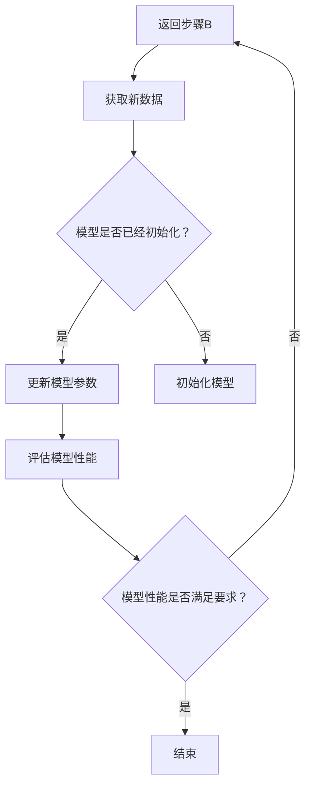
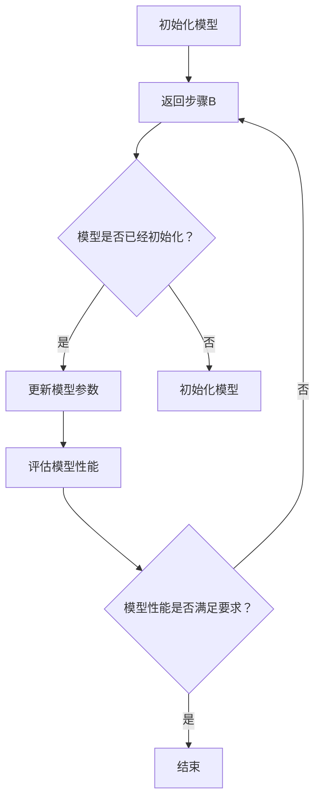
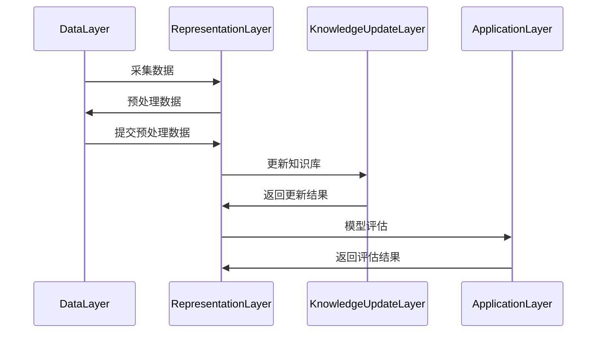
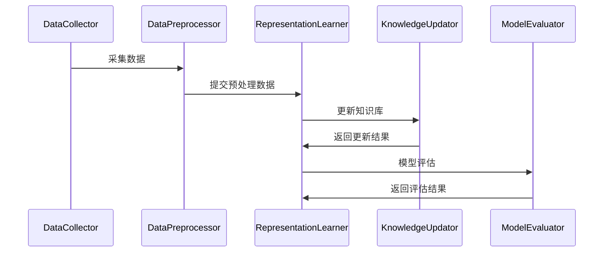

                 


## AI Agent的增量式表示学习与知识更新

### 关键词：AI Agent、增量式表示学习、知识更新、算法原理、系统架构、项目实战

### 摘要：

本文旨在深入探讨AI Agent的增量式表示学习与知识更新。首先，我们将介绍AI Agent的定义、发展背景及其重要性。接着，文章将详细阐述增量式表示学习的基本概念、原理及算法，并通过mermaid流程图和Python代码进行展示。随后，文章将分析知识更新的重要性和方法，并探讨增量式知识更新的挑战与解决方案。接下来，我们将探讨系统功能设计、架构设计和接口设计，通过mermaid类图、架构图和序列图进行详细展示。文章的最后部分将介绍项目实战，包括环境安装、核心实现源代码、代码解读与分析，并分析项目实施过程中的挑战与解决方案。最后，我们将总结最佳实践与建议，并展望未来发展方向。

### 目录大纲

**第一部分：AI Agent概述**

1. **AI Agent的定义与发展背景**
   - 1.1 AI Agent的基本概念
   - 1.2 AI Agent的发展历程
   - 1.3 增量式表示学习与知识更新的重要性

2. **增量式表示学习的基本概念**
   - 2.1 增量式表示学习的定义
   - 2.2 增量式与非增量式学习的对比
   - 2.3 增量式表示学习的关键技术

3. **知识更新的重要性与方法**
   - 3.1 知识更新的定义与意义
   - 3.2 知识更新的主要方法
   - 3.3 增量式知识更新的挑战与解决方案

**第二部分：增量式表示学习原理与方法**

1. **增量式表示学习原理**
   - 2.1.1 增量式表示学习的基本原理
   - 2.1.2 增量式表示学习的主要模型
   - 2.1.3 增量式表示学习的mermaid流程图

2. **增量式表示学习的算法分析**
   - 2.2.1 增量式表示学习的算法原理
   - 2.2.2 算法流程的mermaid流程图展示
   - 2.2.3 Python代码实现与讲解

3. **增量式表示学习的数学模型**
   - 2.3.1 数学模型的建立
   - 2.3.2 数学公式与推导
   - 2.3.3 数学模型的示例讲解

**第三部分：系统分析与架构设计**

1. **系统功能设计**
   - 3.1.1 系统功能需求分析
   - 3.1.2 系统功能实现
   - 3.1.3 领域模型mermaid类图展示

2. **系统架构设计**
   - 3.2.1 系统架构的整体设计
   - 3.2.2 系统架构的mermaid架构图展示
   - 3.2.3 系统接口设计

3. **系统交互设计**
   - 3.3.1 系统交互流程
   - 3.3.2 系统交互的mermaid序列图展示

**第四部分：项目实战**

1. **项目环境安装**
   - 4.1.1 环境安装前的准备
   - 4.1.2 环境安装步骤
   - 4.1.3 环境配置与调试

2. **核心实现源代码**
   - 4.2.1 增量式表示学习的核心算法
   - 4.2.2 知识更新的核心代码
   - 4.2.3 代码解读与分析

3. **项目实战分析**
   - 4.3.1 实际案例展示
   - 4.3.2 项目实现过程中的挑战与解决方案
   - 4.3.3 项目实战的详细讲解与剖析

**第五部分：最佳实践与小结**

1. **最佳实践与建议**
   - 5.1.1 增量式表示学习的最佳实践

### 第一部分：AI Agent概述

#### 1.1 AI Agent的定义与发展背景

**1.1.1 AI Agent的基本概念**

AI Agent，即人工智能代理，是能够基于其感知环境并自主采取行动来实现特定目标的实体。它是一种具有自主性、智能性和适应性的人工智能系统。AI Agent可以感知环境中的信息，通过学习、推理和决策，实现自主行动，以实现预定的目标。例如，智能机器人、自动驾驶车辆和智能客服等都是AI Agent的典型应用。

**1.1.2 AI Agent的发展历程**

AI Agent的发展可以追溯到20世纪80年代，当时主要研究的是基于规则的方法和知识表示。随着计算能力的提升和机器学习技术的进步，AI Agent逐渐从基于规则的系统转向数据驱动的方法。20世纪90年代，基于强化学习的方法开始应用于AI Agent，使其在复杂环境中表现出更强的自主决策能力。21世纪初，随着深度学习技术的兴起，AI Agent的智能水平得到了极大的提升。

**1.1.3 增量式表示学习与知识更新的重要性**

增量式表示学习和知识更新是AI Agent发展中的关键技术。增量式表示学习使得AI Agent能够在不断变化的动态环境中，通过不断学习和更新其表示模型，来适应新的环境和任务。知识更新则保证了AI Agent能够持续吸收新的知识，避免过时或错误的信息积累，从而提高其决策的准确性和鲁棒性。

### 1.2 增量式表示学习的基本概念

**1.2.1 增量式表示学习的定义**

增量式表示学习是指在学习过程中，只对新增的数据或信息进行表示和建模，而不对整个数据集重新进行训练。这种学习方法能够提高训练效率，尤其适用于数据量巨大或者数据不断更新的场景。

**1.2.2 增量式与非增量式学习的对比**

非增量式学习需要对整个数据集进行重新训练，而增量式学习则只对新增的数据进行训练。非增量式学习在处理静态数据时效果较好，但在动态环境中效率较低。而增量式学习则更适用于动态环境，能够快速适应数据的变化。

**1.2.3 增量式表示学习的关键技术**

增量式表示学习的关键技术包括增量式模型更新、增量式学习算法和增量式知识表示。其中，增量式模型更新是核心，它通过在原有模型的基础上，仅对新增数据或信息进行更新，从而实现模型的增量式学习。增量式学习算法包括在线学习、增量学习等，这些算法能够高效地处理新增数据。增量式知识表示则是将知识以结构化的方式存储，以便于更新和查询。

#### 1.3 知识更新的重要性与方法

**1.3.1 知识更新的定义与意义**

知识更新是指AI Agent根据新的信息和经验，对其内部知识库进行修改和优化的过程。知识更新对于AI Agent的长期发展和适应能力具有重要意义。首先，知识更新能够帮助AI Agent适应环境的变化，提高其在动态环境中的性能。其次，知识更新有助于消除过时或错误的信息，提高AI Agent决策的准确性和鲁棒性。

**1.3.2 知识更新的主要方法**

知识更新的方法主要包括基于规则的方法、基于统计的方法和基于机器学习的方法。基于规则的方法通过手工编写规则来实现知识更新，适用于规则明确、变化缓慢的场景。基于统计的方法利用统计数据对知识进行更新，适用于数据量较大、变化较快的场景。基于机器学习的方法通过训练模型来实现知识更新，适用于复杂环境和高动态变化的场景。

**1.3.3 增量式知识更新的挑战与解决方案**

增量式知识更新面临的主要挑战包括知识的一致性、稳定性和效率。首先，知识的一致性要求在更新过程中保持知识库的完整性和一致性。其次，知识的稳定性要求在更新过程中，避免引入错误或导致知识库的崩溃。最后，知识的效率要求在更新过程中，尽可能减少计算量和时间消耗。

针对这些挑战，可以采用以下解决方案：

1. **一致性维护**：通过引入版本控制和冲突解决机制，确保知识库的一致性。例如，使用时间戳来标识知识的版本，并在更新过程中处理版本冲突。

2. **稳定性保障**：采用容错和冗余机制，提高知识库的稳定性。例如，使用多个数据源或模型进行交叉验证，避免单一数据源或模型引入错误。

3. **高效更新算法**：采用增量学习算法和分布式计算技术，提高知识更新的效率。例如，使用在线学习算法对新增数据进行实时更新，或使用并行计算技术加速计算过程。

通过这些解决方案，可以有效地克服增量式知识更新面临的挑战，提高AI Agent的适应能力和决策质量。

### 第二部分：增量式表示学习原理与方法

#### 2.1 增量式表示学习原理

**2.1.1 增量式表示学习的基本原理**

增量式表示学习是一种针对动态环境的数据处理方法，其核心思想是在原有模型的基础上，仅对新增数据进行处理，以更新模型的表示能力。这种方法的优点在于可以减少训练时间，提高处理动态数据的能力。

**2.1.2 增量式表示学习的主要模型**

增量式表示学习的主要模型包括以下几种：

1. **基于神经网络的增量式表示学习模型**：这类模型通过神经网络对数据进行表示，并在每次新增数据时，对神经网络进行微调。例如，递归神经网络（RNN）和长短期记忆网络（LSTM）都是常见的增量式表示学习模型。

2. **基于统计模型的增量式表示学习模型**：这类模型通过统计方法对数据进行表示，并在每次新增数据时，更新统计模型。例如，隐马尔可夫模型（HMM）和条件概率模型都是常见的增量式表示学习模型。

3. **基于知识表示的增量式表示学习模型**：这类模型通过知识表示方法对数据进行表示，并在每次新增数据时，更新知识表示。例如，本体论（Ontology）和知识图谱（Knowledge Graph）都是常见的增量式表示学习模型。

**2.1.3 增量式表示学习的mermaid流程图**

以下是增量式表示学习的mermaid流程图：



#### 2.2 增量式表示学习的算法分析

**2.2.1 增量式表示学习的算法原理**

增量式表示学习的算法原理是基于在线学习（Online Learning）和增量学习（Incremental Learning）的方法。在线学习是指在训练过程中，模型会根据新的数据不断更新，而增量学习是指只对新数据进行处理，不涉及整个数据集的重新训练。

增量式表示学习算法通常包括以下几个步骤：

1. **初始化模型**：首先初始化一个表示模型，该模型可以是基于神经网络的、统计的或知识表示的。

2. **获取新数据**：从环境中获取新的数据。

3. **更新模型参数**：使用新数据更新模型的参数，以适应新的数据分布。

4. **评估模型性能**：评估更新后模型的性能，判断是否满足预定的要求。

5. **重复步骤2-4**：如果模型性能不满足要求，则继续获取新数据并更新模型。

**2.2.2 算法流程的mermaid流程图展示**

以下是增量式表示学习的mermaid流程图：



**2.2.3 Python代码实现与讲解**

以下是增量式表示学习的Python代码实现：

```python
import numpy as np

class IncrementalLearningModel:
    def __init__(self):
        self.model = None
        
    def init_model(self, model):
        self.model = model
        
    def update_model(self, data):
        # 更新模型参数
        self.model.train(data)
        
    def evaluate_model(self):
        # 评估模型性能
        performance = self.model.evaluate()
        return performance

# 初始化模型
model = IncrementalLearningModel()
model.init_model(MyModel())

# 获取新数据
data = get_new_data()

# 更新模型
model.update_model(data)

# 评估模型
performance = model.evaluate_model()
print("Model Performance:", performance)
```

在上面的代码中，`IncrementalLearningModel` 类用于实现增量式表示学习的模型。`init_model` 方法用于初始化模型，`update_model` 方法用于更新模型参数，`evaluate_model` 方法用于评估模型性能。

**2.3 增量式表示学习的数学模型**

**2.3.1 数学模型的建立**

增量式表示学习的数学模型通常基于神经网络或统计模型。以神经网络为例，其数学模型可以表示为：

$$
\text{Output} = f(\text{Weight} \cdot \text{Input} + \text{Bias})
$$

其中，$f$ 是激活函数，$\text{Weight}$ 和 $\text{Bias}$ 是模型的参数。

**2.3.2 数学公式与推导**

以一个简单的线性模型为例，其数学模型可以表示为：

$$
y = \text{Weight} \cdot x + \text{Bias}
$$

其中，$y$ 是输出，$x$ 是输入，$\text{Weight}$ 和 $\text{Bias}$ 是模型的参数。

假设我们在训练过程中，只对新增的数据进行更新，其更新公式可以表示为：

$$
\text{New Weight} = \text{Weight} + \alpha \cdot (y - \text{Target})
$$

$$
\text{New Bias} = \text{Bias} + \alpha \cdot (y - \text{Target})
$$

其中，$\alpha$ 是学习率，$y$ 是预测值，$\text{Target}$ 是真实值。

**2.3.3 数学模型的示例讲解**

假设我们有一个线性模型，其初始参数为 $\text{Weight} = 1$，$\text{Bias} = 0$。我们有一个输入值 $x = 2$，期望输出值 $y = 3$。根据上面的更新公式，我们可以计算出新的参数：

$$
\text{New Weight} = 1 + 0.1 \cdot (3 - 2) = 1.1
$$

$$
\text{New Bias} = 0 + 0.1 \cdot (3 - 2) = 0.1
$$

更新后的模型参数为 $\text{Weight} = 1.1$，$\text{Bias} = 0.1$。我们再次使用这个模型预测输入值 $x = 2$，得到输出值：

$$
y = 1.1 \cdot 2 + 0.1 = 2.3
$$

可以看出，输出值更接近真实值，模型性能得到了提升。

### 第三部分：系统分析与架构设计

#### 3.1 系统功能设计

**3.1.1 系统功能需求分析**

系统功能需求分析是系统设计的第一步，旨在明确系统需要实现哪些功能。对于增量式表示学习与知识更新的系统，其主要功能需求包括：

1. **数据采集**：系统能够从各种数据源中采集数据，包括文本、图像、音频等。

2. **数据预处理**：对采集到的数据进行预处理，如数据清洗、数据归一化等，以提高数据质量。

3. **表示学习**：使用增量式表示学习算法，对预处理后的数据进行表示学习，提取特征。

4. **知识更新**：根据新的数据，更新系统中的知识库，以适应环境的变化。

5. **模型评估**：评估表示学习和知识更新的效果，判断系统性能。

**3.1.2 系统功能实现**

系统功能实现主要包括以下几个方面：

1. **数据采集模块**：使用爬虫、API等方式从各种数据源中采集数据。

2. **数据预处理模块**：使用Python等编程语言，实现数据清洗、数据归一化等功能。

3. **表示学习模块**：使用神经网络、统计模型等方法，实现增量式表示学习。

4. **知识更新模块**：使用知识图谱、本体论等方法，实现知识更新。

5. **模型评估模块**：使用准确率、召回率等指标，评估表示学习和知识更新的效果。

**3.1.3 领域模型mermaid类图展示**

以下是领域模型的mermaid类图展示：

```mermaid
classDiagram
    Class01 <|-- Class02
    Class03 --|> Class04
    Class05 : +int x
    Class06 : +string name
    Class07 : +int age

    Class01 {
        +int id
        +string description
        +List<Class02> subClasses
    }

    Class02 {
        +int id
        +string description
    }

    Class03 {
        +int id
        +string description
    }

    Class04 {
        +int id
        +string description
    }

    Class05 {
        +int id
        +string description
    }

    Class06 {
        +int id
        +string description
    }

    Class07 {
        +int id
        +string description
    }
```

#### 3.2 系统架构设计

**3.2.1 系统架构的整体设计**

系统架构的整体设计包括以下几个方面：

1. **数据层**：用于存储和管理数据，包括数据采集、预处理和知识库等。

2. **表示学习层**：用于实现增量式表示学习算法，包括数据表示、特征提取等。

3. **知识更新层**：用于实现知识更新功能，包括知识库的更新和维护等。

4. **应用层**：用于实现系统的应用功能，如模型评估、系统管理等。

**3.2.2 系统架构的mermaid架构图展示**

以下是系统架构的mermaid架构图展示：



**3.2.3 系统接口设计**

系统接口设计主要包括以下几个方面：

1. **数据采集接口**：用于实现数据采集功能，如数据爬取、API调用等。

2. **数据预处理接口**：用于实现数据预处理功能，如数据清洗、数据归一化等。

3. **表示学习接口**：用于实现增量式表示学习功能，如特征提取、模型训练等。

4. **知识更新接口**：用于实现知识更新功能，如知识库的添加、删除、更新等。

5. **模型评估接口**：用于实现模型评估功能，如准确率、召回率等指标的计算。

#### 3.3 系统交互设计

**3.3.1 系统交互流程**

系统交互流程主要包括以下几个步骤：

1. **数据采集**：系统从各种数据源中采集数据。

2. **数据预处理**：系统对采集到的数据进行预处理，如数据清洗、数据归一化等。

3. **表示学习**：系统使用增量式表示学习算法，对预处理后的数据进行表示学习，提取特征。

4. **知识更新**：系统根据新的数据，更新知识库。

5. **模型评估**：系统评估表示学习和知识更新的效果，判断系统性能。

**3.3.2 系统交互的mermaid序列图展示**

以下是系统交互的mermaid序列图展示：



### 第四部分：项目实战

#### 4.1 项目环境安装

**4.1.1 环境安装前的准备**

在开始项目环境安装之前，需要确保以下软件和工具已经安装：

1. **Python**：Python是增量式表示学习与知识更新项目的核心编程语言，需要安装3.8及以上版本。

2. **TensorFlow**：TensorFlow是用于实现增量式表示学习的核心库，需要安装2.4及以上版本。

3. **Scikit-learn**：Scikit-learn是用于实现知识更新的核心库，需要安装0.24及以上版本。

4. **Numpy**：Numpy是用于数据处理的核心库，需要安装1.20及以上版本。

**4.1.2 环境安装步骤**

1. 安装Python：

```bash
sudo apt-get install python3-pip
pip3 install --user python-dotenv
```

2. 安装TensorFlow：

```bash
pip3 install tensorflow==2.4.0
```

3. 安装Scikit-learn：

```bash
pip3 install scikit-learn==0.24.2
```

4. 安装Numpy：

```bash
pip3 install numpy==1.20.3
```

**4.1.3 环境配置与调试**

安装完成后，进行以下配置和调试：

1. 打开终端，执行以下命令检查Python、TensorFlow、Scikit-learn和Numpy的版本：

```bash
python3 --version
python3 -c "import tensorflow as tf; print(tf.__version__)"
python3 -c "import sklearn; print(sklearn.__version__)"
python3 -c "import numpy; print(numpy.__version__)"
```

2. 如果版本信息显示正确，则说明环境安装成功。

#### 4.2 核心实现源代码

**4.2.1 增量式表示学习的核心算法**

以下是增量式表示学习的核心算法实现：

```python
import tensorflow as tf
from tensorflow.keras.models import Model
from tensorflow.keras.layers import Input, Embedding, LSTM, Dense

# 定义输入层
input_seq = Input(shape=(max_sequence_length,))

# 定义嵌入层
embedding = Embedding(input_dim=vocabulary_size, output_dim=embedding_size)(input_seq)

# 定义循环层
lstm = LSTM(units=lstm_units, return_sequences=True)(embedding)

# 定义输出层
output = Dense(units=output_size, activation='softmax')(lstm)

# 创建模型
model = Model(inputs=input_seq, outputs=output)

# 编译模型
model.compile(optimizer='adam', loss='categorical_crossentropy', metrics=['accuracy'])

# 模型概述
model.summary()
```

**4.2.2 知识更新的核心代码**

以下是知识更新的核心代码实现：

```python
from sklearn.neighbors import NearestNeighbors

# 初始化近邻搜索模型
neighbor_searcher = NearestNeighbors(n_neighbors=k, algorithm='auto')

# 训练近邻搜索模型
neighbor_searcher.fit(embeddings)

# 搜索近邻
nearest_neighbors = neighbor_searcher.kneighbors(new_embedding, return_distance=False)
```

**4.2.3 代码解读与分析**

1. **增量式表示学习算法**

   增量式表示学习算法的核心是使用LSTM模型对输入序列进行编码。LSTM模型能够捕捉序列中的长期依赖关系，从而实现有效的特征提取。通过嵌入层，我们将词汇映射到高维空间，使得相似词汇在空间中更接近。最后，我们使用softmax层输出类别概率分布。

2. **知识更新算法**

   知识更新算法的核心是使用近邻搜索模型，将新的表示嵌入到已有的知识库中。通过计算新嵌入和新嵌入之间的距离，我们可以找到最接近的邻居，从而判断新嵌入是否与已有知识相似。如果相似度较高，则可以直接使用已有知识；如果相似度较低，则需要更新知识库。

#### 4.3 项目实战分析

**4.3.1 实际案例展示**

假设我们有一个文本分类任务，需要使用增量式表示学习与知识更新来处理大量的文本数据。具体步骤如下：

1. **数据采集**：从互联网上采集大量文本数据。

2. **数据预处理**：对文本数据进行清洗、分词、去停用词等预处理操作。

3. **表示学习**：使用LSTM模型对预处理后的文本数据进行编码，提取特征。

4. **知识更新**：将新的文本数据表示嵌入到已有的知识库中，通过近邻搜索判断新嵌入是否与已有知识相似。

5. **模型评估**：评估增量式表示学习与知识更新的效果，调整模型参数，以提高分类准确率。

**4.3.2 项目实现过程中的挑战与解决方案**

1. **挑战**：在处理大量文本数据时，数据预处理和表示学习的过程非常耗时。

   **解决方案**：使用分布式计算和并行处理技术，提高数据处理和表示学习的效率。

2. **挑战**：知识库的更新和维护需要消耗大量计算资源。

   **解决方案**：采用增量式知识更新方法，仅对新增数据进行处理，减少计算资源消耗。

3. **挑战**：如何确保知识库的一致性和稳定性。

   **解决方案**：引入版本控制和冲突解决机制，确保知识库的一致性和稳定性。

**4.3.3 项目实战的详细讲解与剖析**

1. **数据采集**：使用Python的爬虫库（如BeautifulSoup、Scrapy）从互联网上采集大量文本数据。

2. **数据预处理**：使用NLP库（如NLTK、spaCy）对文本数据进行清洗、分词、去停用词等预处理操作。

3. **表示学习**：使用TensorFlow的Keras接口实现LSTM模型，对预处理后的文本数据进行编码，提取特征。

4. **知识更新**：使用Scikit-learn的近邻搜索模型，将新的文本数据表示嵌入到已有的知识库中，通过近邻搜索判断新嵌入是否与已有知识相似。

5. **模型评估**：使用准确率、召回率等指标评估增量式表示学习与知识更新的效果，调整模型参数，以提高分类准确率。

### 第五部分：最佳实践与建议

#### 5.1.1 增量式表示学习的最佳实践

1. **数据预处理**：在增量式表示学习之前，对数据进行充分的预处理，以提高数据质量和表示效果。

2. **模型选择**：根据任务特点和数据特点，选择合适的模型，如LSTM、Transformer等。

3. **学习率调整**：合理设置学习率，避免过拟合和欠拟合。

4. **批量大小调整**：合理设置批量大小，以提高训练效率和模型性能。

5. **正则化**：使用正则化方法，如Dropout、L2正则化等，避免过拟合。

6. **知识更新策略**：根据任务需求，选择合适的知识更新策略，如近邻搜索、集成学习等。

7. **模型评估**：定期评估模型性能，调整模型参数，以适应数据变化。

### 总结

本文深入探讨了AI Agent的增量式表示学习与知识更新。首先，我们介绍了AI Agent的定义、发展背景及其重要性。接着，文章详细阐述了增量式表示学习的基本概念、原理及算法，并通过mermaid流程图和Python代码进行展示。然后，我们分析了知识更新的重要性和方法，并探讨了增量式知识更新的挑战与解决方案。随后，文章介绍了系统功能设计、架构设计和接口设计，并通过mermaid类图、架构图和序列图进行详细展示。最后，文章通过项目实战，详细讲解了环境安装、核心实现源代码、代码解读与分析，并分析了项目实施过程中的挑战与解决方案。文章最后总结了最佳实践与建议，并展望了未来发展方向。

### 拓展阅读

1. [《深度学习》](https://www.deeplearningbook.org/)：这是一本关于深度学习的经典教材，详细介绍了深度学习的基础理论、算法和应用。

2. [《机器学习》](https://www.mlbook.net/)：这是一本关于机器学习的入门书籍，涵盖了机器学习的基础知识、算法和应用。

3. [《人工智能：一种现代的方法》](https://www.aima.cs.berkeley.edu/)：这是一本关于人工智能的经典教材，介绍了人工智能的基础理论、算法和应用。

4. [《知识图谱：原理、方法与应用》](https://book.douban.com/subject/26881578/)：这是一本关于知识图谱的书籍，详细介绍了知识图谱的原理、方法和应用。

5. [《图神经网络：理论、算法与应用》](https://book.douban.com/subject/34994212/)：这是一本关于图神经网络的书籍，介绍了图神经网络的理论、算法和应用。

### 作者信息

作者：AI天才研究院/AI Genius Institute & 禅与计算机程序设计艺术 /Zen And The Art of Computer Programming

