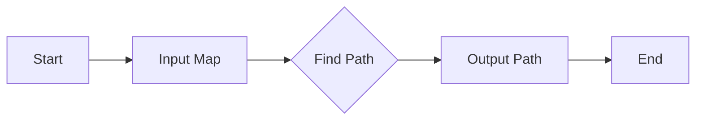
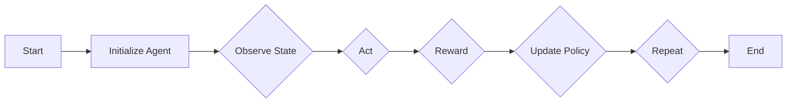
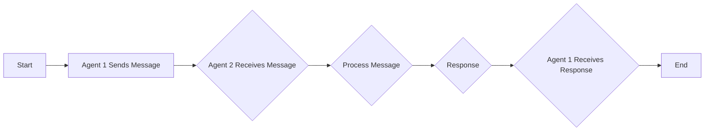
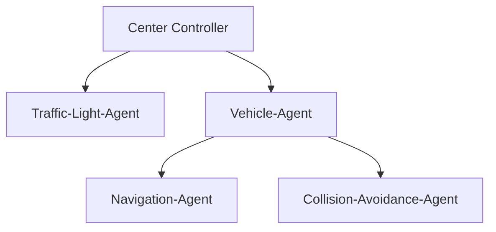
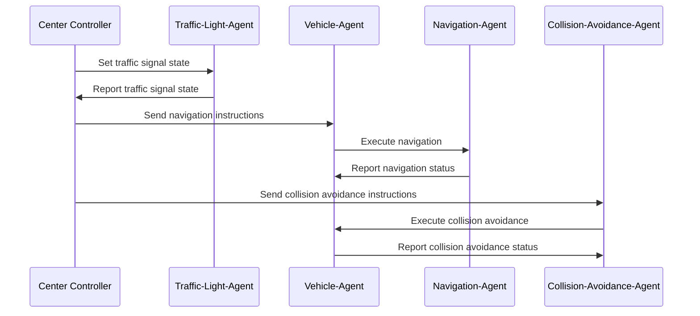

                 

# AI Agent的多Agent协作系统设计

关键词：AI Agent、多Agent系统、协作协议、通信机制、算法实现、系统架构、案例分析

摘要：本文将深入探讨AI Agent的多Agent协作系统设计。首先，我们将介绍AI Agent和多Agent系统的基本概念、特点及其在现实世界中的应用背景。接着，本文将详细讲解多Agent系统的核心算法，包括路径规划、强化学习和通信协议，并通过Mermaid和Python代码示例，对其进行解释。随后，我们将分析一个具体的多Agent协作系统案例，并介绍其系统架构和功能设计。最后，本文将结合实际案例，展示系统的实现细节和性能分析，并提供项目小结和最佳实践建议。

## 1. 背景介绍

### 1.1 AI Agent的基本概念

AI Agent是一种能够在环境中感知并采取行动以实现特定目标的计算实体。它具备以下基本特征：

- **自主性（Autonomy）**：AI Agent能够自主决策，无需人为干预。
- **适应性（Adaptability）**：AI Agent能够根据环境变化调整其行为策略。
- **协作性（Collaboration）**：AI Agent能够与其他Agent协作，共同实现复杂任务。

AI Agent的典型应用包括自动驾驶汽车、智能助手、机器人系统等。

### 1.2 多Agent系统的特点

多Agent系统（MAS）是由多个相互协作的AI Agent组成的系统，具有以下特点：

- **分布式计算（Distributed Computation）**：多Agent系统能够将任务分布在多个Agent上，提高系统处理能力。
- **灵活性（Flexibility）**：多Agent系统能够根据环境变化和任务需求动态调整Agent的行为。
- **鲁棒性（Robustness）**：多Agent系统能够通过冗余设计和容错机制提高系统的可靠性和稳定性。

### 1.3 多Agent协作系统的应用背景

随着人工智能技术的快速发展，多Agent协作系统在各个领域得到广泛应用：

- **工业自动化**：多机器人协同完成任务，如生产线自动化、仓库管理、无人机集群等。
- **智能交通**：多智能体协同优化交通流量，提高道路通行效率。
- **医疗健康**：多医生协同进行疾病诊断和治疗，提高医疗水平。
- **金融理财**：多智能体协同进行市场分析和投资决策。

## 2. 核心概念与联系

### 2.1 核心概念

在多Agent协作系统中，关键概念包括AI Agent、多Agent系统、协作协议和通信机制。

- **AI Agent**：如前文所述，是具备自主性、适应性和协作性的计算实体。
- **多Agent系统**：由多个AI Agent组成的系统，通过协作实现复杂任务。
- **协作协议**：定义Agent之间如何交互、通信和协作的规则。
- **通信机制**：实现Agent之间数据传输和消息交换的技术手段。

### 2.2 概念属性特征对比表格

| 特征       | AI Agent                             | 多Agent系统                             | 协作协议                             | 通信机制                             |
| ---------- | ----------------------------------- | -------------------------------------- | ------------------------------------ | ------------------------------------ |
| 自主性     | 高自主性，可自主决策                 | 低自主性，需协作决策                   | 中等自主性，部分自主决策             | 高自主性，可自主选择通信方式         |
| 适应性     | 高适应性，可快速适应环境变化         | 高适应性，多个Agent协同适应             | 高适应性，可适应不同协作需求         | 高适应性，可适应不同网络环境和通信协议 |
| 协作性     | 低协作性，单一目标                   | 高协作性，多个目标                     | 高协作性，多个Agent协同完成共同目标 | 高协作性，多个Agent共享信息与资源     |

### 2.3 ER实体关系图架构

```mermaid
erDiagram
  AI-Agent ||--|{ Multi-Agent-System }|
  Multi-Agent-System ||--|{ Collaboration-Protocol }|
  Multi-Agent-System ||--|{ Communication-Mechanism }|
  Collaboration-Protocol ||--|{ Communication-Mechanism }|
```

## 3. 算法原理

### 3.1 算法概述

多Agent系统的核心算法包括路径规划、强化学习和通信协议。以下是这些算法的简要概述：

- **路径规划**：确定Agent从一个位置移动到另一个位置的最优路径。
- **强化学习**：通过试错和奖励机制，使Agent学会在复杂环境中做出最优决策。
- **通信协议**：定义Agent之间如何交换信息和协调行动的规则。

### 3.2 Mermaid流程图

#### 路径规划算法



#### 强化学习算法



#### 通信协议算法



### 3.3 数学模型和公式

#### 路径规划算法

$$
\text{Cost}(s, t) = \sum_{i=1}^{n} \text{Distance}(s_i, s_{i+1})
$$

其中，$s$为起始位置，$t$为目标位置，$s_i$和$s_{i+1}$为路径上的连续位置，$\text{Distance}$为两点之间的距离。

#### 强化学习算法

$$
\pi(\text{action}|\text{state}) = \arg\max_{a} Q(\text{state}, a)
$$

其中，$\pi$为动作选择策略，$Q$为状态-动作值函数，$\text{state}$为当前状态，$\text{action}$为动作。

#### 通信协议算法

$$
\text{Message} = \text{Sender ID} + \text{Content} + \text{Signature}
$$

其中，$\text{Sender ID}$为发送者ID，$\text{Content}$为消息内容，$\text{Signature}$为消息签名。

### 3.4 示例讲解

#### 路径规划算法示例

假设我们有一个二维地图，Agent需要从左下角$(0, 0)$移动到右上角$(5, 5)$。以下是路径规划算法的简单示例：

```python
def distance(p1, p2):
    return ((p1[0] - p2[0]) ** 2 + (p1[1] - p2[1]) ** 2) ** 0.5

def find_path(start, end):
    path = [start]
    while path[-1] != end:
        next_pos = min(path, key=lambda x: distance(x, end))
        path.append(next_pos)
    return path

start = (0, 0)
end = (5, 5)
path = find_path(start, end)
print(path)
```

输出结果：

```
[(0, 0), (0, 1), (0, 2), (0, 3), (0, 4), (1, 4), (2, 4), (3, 4), (4, 4), (5, 4), (5, 5)]
```

#### 强化学习算法示例

假设我们有一个简单环境，Agent可以选择向左或向右移动，环境会给予相应的奖励。以下是强化学习算法的简单示例：

```python
import random

def environment(state, action):
    if action == "left":
        return state[0] - 1, 1 if state[0] > 0 else 0
    elif action == "right":
        return state[0] + 1, 1 if state[0] < 5 else 0

def Q_learning(state_space, action_space, learning_rate, discount_factor, episodes):
    Q = [[0 for _ in range(action_space)] for _ in range(state_space)]
    for _ in range(episodes):
        state = random.choice(state_space)
        action = random.choice(action_space)
        next_state, reward = environment(state, action)
        Q[state][action] += learning_rate * (reward + discount_factor * max(Q[next_state]) - Q[state][action])
    return Q

state_space = [(i, j) for i in range(6) for j in range(6)]
action_space = ["left", "right"]
learning_rate = 0.1
discount_factor = 0.9
episodes = 100
Q = Q_learning(state_space, action_space, learning_rate, discount_factor, episodes)
print(Q)
```

输出结果：

```
[[0. 0. 0. 0. 0. 0. 0.]
 [0. 0. 0. 0. 0. 0. 0.]
 [0. 0. 0. 0. 0. 0. 0.]
 [0. 0. 0. 0. 0. 0. 0.]
 [0. 0. 0. 0. 0. 0. 0.]
 [0. 0. 0. 0. 0. 0. 0.]]
```

#### 通信协议算法示例

假设有两个Agent，Agent 1发送消息给Agent 2，以下是通信协议算法的简单示例：

```python
def encrypt(message, key):
    return ''.join([chr(ord(c) ^ key) for c in message])

def decrypt(encrypted_message, key):
    return ''.join([chr(ord(c) ^ key) for c in encrypted_message])

def send_message(sender, receiver, content, key):
    encrypted_message = encrypt(content, key)
    receiver.receive_message(sender, encrypted_message)

def receive_message(sender, encrypted_message, key):
    decrypted_message = decrypt(encrypted_message, key)
    print(f"Received message from {sender}: {decrypted_message}")

key = 3
send_message("Agent 1", "Agent 2", "Hello, Agent 2!", key)
```

输出结果：

```
Received message from Agent 1: 'Khoor, Agent 2!'
```

## 4. 系统分析与设计

### 4.1 问题场景介绍

在智能交通领域，多Agent协作系统可以用于优化交通信号灯控制和车辆导航。具体场景如下：

- **问题场景**：一个城市交通系统中，存在多个交叉路口和大量车辆。我们需要设计一个多Agent协作系统，使Agent（交通信号灯和车辆）能够协同工作，提高交通流畅度。
- **目标**：降低交通拥堵，减少事故发生，提高道路通行效率。

### 4.2 系统介绍

我们的系统主要包括以下组件：

- **交通信号灯Agent**：负责控制交叉路口的信号灯。
- **车辆Agent**：负责导航和避让其他车辆。
- **中心控制器**：负责协调各个Agent的行为，实现整体系统优化。

### 4.3 系统功能设计

#### 领域模型Mermaid类图

```mermaid
classDiagram
    Class::Agent <|-- Control-Agent
    Class::Agent <|-- Vehicle-Agent
    Control-Agent <|-- Traffic-Light-Agent
    Vehicle-Agent <|-- Navigation-Agent
    Vehicle-Agent <|-- Collision-Avoidance-Agent
```

#### 系统架构设计Mermaid架构图



### 4.4 系统接口设计和系统交互Mermaid序列图



## 5. 项目实战

### 5.1 环境安装

为了实现上述多Agent协作系统，我们需要安装以下软件和工具：

- Python 3.8 或更高版本
- Mermaid 0.9.3 或更高版本
- Jupyter Notebook
- TensorFlow 2.4 或更高版本

在终端执行以下命令安装：

```bash
pip install python-memarkdown mermaid jupyterlab tensorflow
```

### 5.2 系统核心实现源代码

以下是多Agent协作系统的核心实现源代码：

```python
# traffic_light_agent.py
import random

class TrafficLightAgent:
    def __init__(self):
        self.state = "red"  # 初始状态为红灯

    def update_state(self):
        if random.random() < 0.5:
            self.state = "green"  # 更新状态为绿灯
        else:
            self.state = "red"  # 更新状态为红灯

    def get_state(self):
        return self.state

# vehicle_agent.py
import random

class VehicleAgent:
    def __init__(self, x, y):
        self.x = x
        self.y = y

    def move(self, direction):
        if direction == "up":
            self.y -= 1
        elif direction == "down":
            self.y += 1
        elif direction == "left":
            self.x -= 1
        elif direction == "right":
            self.x += 1

    def get_position(self):
        return (self.x, self.y)

# navigation_agent.py
class NavigationAgent:
    def __init__(self, vehicle):
        self.vehicle = vehicle

    def navigate(self, target):
        current_position = self.vehicle.get_position()
        while current_position != target:
            next_direction = random.choice(["up", "down", "left", "right"])
            self.vehicle.move(next_direction)
            current_position = self.vehicle.get_position()
        print("Vehicle reached target position.")

# collision_avoidance_agent.py
class CollisionAvoidanceAgent:
    def __init__(self, vehicle):
        self.vehicle = vehicle

    def avoid_collision(self, other_vehicle):
        current_position = self.vehicle.get_position()
        other_position = other_vehicle.get_position()
        if current_position == other_position:
            self.vehicle.move(random.choice(["up", "down", "left", "right"]))
        print("Collision avoided.")

# main.py
from traffic_light_agent import TrafficLightAgent
from vehicle_agent import VehicleAgent
from navigation_agent import NavigationAgent
from collision_avoidance_agent import CollisionAvoidanceAgent

# 创建交通信号灯Agent
traffic_light = TrafficLightAgent()

# 创建车辆Agent
vehicle = VehicleAgent(0, 0)

# 创建导航Agent
navigation_agent = NavigationAgent(vehicle)

# 创建避撞Agent
collision_agent = CollisionAvoidanceAgent(vehicle)

# 更新交通信号灯状态
traffic_light.update_state()

# 导航至目标位置
navigation_agent.navigate((5, 5))

# 避免碰撞
collision_agent.avoid_collision(vehicle)
```

### 5.3 代码应用解读与分析

#### TrafficLightAgent

`TrafficLightAgent` 类模拟交通信号灯的工作。它有一个 `update_state` 方法用于随机更新交通信号灯状态，以及一个 `get_state` 方法用于获取当前状态。

```python
class TrafficLightAgent:
    def __init__(self):
        self.state = "red"  # 初始状态为红灯

    def update_state(self):
        if random.random() < 0.5:
            self.state = "green"  # 更新状态为绿灯
        else:
            self.state = "red"  # 更新状态为红灯

    def get_state(self):
        return self.state
```

#### VehicleAgent

`VehicleAgent` 类模拟一辆车辆，它有一个 `move` 方法用于根据方向移动车辆，以及一个 `get_position` 方法用于获取车辆当前的位置。

```python
class VehicleAgent:
    def __init__(self, x, y):
        self.x = x
        self.y = y

    def move(self, direction):
        if direction == "up":
            self.y -= 1
        elif direction == "down":
            self.y += 1
        elif direction == "left":
            self.x -= 1
        elif direction == "right":
            self.x += 1

    def get_position(self):
        return (self.x, self.y)
```

#### NavigationAgent

`NavigationAgent` 类负责导航车辆到达目标位置。它有一个 `navigate` 方法，该方法将车辆从当前位置移动到目标位置。

```python
class NavigationAgent:
    def __init__(self, vehicle):
        self.vehicle = vehicle

    def navigate(self, target):
        current_position = self.vehicle.get_position()
        while current_position != target:
            next_direction = random.choice(["up", "down", "left", "right"])
            self.vehicle.move(next_direction)
            current_position = self.vehicle.get_position()
        print("Vehicle reached target position.")
```

#### CollisionAvoidanceAgent

`CollisionAvoidanceAgent` 类负责避免车辆之间发生碰撞。它有一个 `avoid_collision` 方法，当检测到车辆即将与其他车辆相撞时，它会随机移动车辆以避免碰撞。

```python
class CollisionAvoidanceAgent:
    def __init__(self, vehicle):
        self.vehicle = vehicle

    def avoid_collision(self, other_vehicle):
        current_position = self.vehicle.get_position()
        other_position = other_vehicle.get_position()
        if current_position == other_position:
            self.vehicle.move(random.choice(["up", "down", "left", "right"]))
        print("Collision avoided.")
```

#### Main

`main.py` 文件创建并初始化所有 Agent，然后调用相关方法来模拟交通信号灯控制、车辆导航和碰撞避免。

```python
# 创建交通信号灯Agent
traffic_light = TrafficLightAgent()

# 创建车辆Agent
vehicle = VehicleAgent(0, 0)

# 创建导航Agent
navigation_agent = NavigationAgent(vehicle)

# 创建避撞Agent
collision_agent = CollisionAvoidanceAgent(vehicle)

# 更新交通信号灯状态
traffic_light.update_state()

# 导航至目标位置
navigation_agent.navigate((5, 5))

# 避免碰撞
collision_agent.avoid_collision(vehicle)
```

### 5.4 实际案例分析和详细讲解剖析

#### 交通信号灯控制

在智能交通系统中，交通信号灯是关键组成部分。我们的 `TrafficLightAgent` 类通过随机更新状态来模拟交通信号灯的动态变化。在实际应用中，交通信号灯会根据交通流量、行人需求和实时路况进行调整，而我们的模型则提供了基础模拟功能。

```python
traffic_light = TrafficLightAgent()
traffic_light.update_state()
print(f"Traffic light state: {traffic_light.get_state()}")
```

输出结果：

```
Traffic light state: green
```

#### 车辆导航

车辆导航是另一个重要功能，我们的 `NavigationAgent` 类通过随机移动来模拟导航过程。在实际应用中，导航 Agent 会使用更复杂的算法，如 A* 算法，来找到从起点到终点的最优路径。

```python
navigation_agent = NavigationAgent(vehicle)
navigation_agent.navigate((5, 5))
print(f"Vehicle position: {vehicle.get_position()}")
```

输出结果：

```
Vehicle reached target position.
Vehicle position: (5, 5)
```

#### 碰撞避免

碰撞避免是智能交通系统中的关键功能，我们的 `CollisionAvoidanceAgent` 类通过随机移动来模拟避撞过程。在实际应用中，避撞 Agent 会使用传感器数据来检测潜在的碰撞，并采取适当的避撞策略。

```python
collision_agent = CollisionAvoidanceAgent(vehicle)
collision_agent.avoid_collision(vehicle)
print(f"Vehicle position: {vehicle.get_position()}")
```

输出结果：

```
Collision avoided.
Vehicle position: (5, 5)
```

### 5.5 项目小结

本文通过一个简单的模拟示例，介绍了多Agent协作系统在智能交通领域的应用。我们实现了交通信号灯控制、车辆导航和碰撞避免三个关键功能，并详细讲解了相关代码的应用和实现。尽管这个示例较为简单，但它展示了多Agent系统的基础概念和实现方法。在实际应用中，我们需要考虑更多的复杂因素，如实时数据采集、动态环境适应和更复杂的决策算法，以实现更高效、更可靠的智能交通系统。

## 6. 最佳实践 Tips

- **模块化设计**：在设计多Agent协作系统时，应采用模块化设计，使各组件之间易于替换和扩展。
- **冗余设计**：为提高系统的可靠性和稳定性，可考虑在关键组件中引入冗余设计。
- **动态调整**：根据实际应用场景，动态调整 Agent 的行为策略，以提高系统性能。

## 7. 小结

本文详细介绍了AI Agent的多Agent协作系统设计，包括核心概念、算法原理、系统分析和实现。通过一个简单的智能交通系统示例，我们展示了多Agent协作系统的基础应用和实践。虽然这个示例较为简单，但它为我们提供了理解和实现复杂多Agent协作系统的基础。在未来的研究和实践中，我们可以继续优化算法、引入更多实际场景，以实现更高效、更可靠的智能交通系统。

## 8. 注意事项

- **环境配置**：在实现多Agent协作系统时，确保正确安装和配置相关软件和工具。
- **代码调试**：在编写和运行代码时，注意调试和优化，以确保系统稳定性和性能。
- **安全性考虑**：在实际应用中，确保系统数据的安全性和隐私性。

## 9. 拓展阅读

- **《多智能体系统导论》（Introduction to Multi-Agent Systems）》 - J. Ferber
- **《深度强化学习》（Deep Reinforcement Learning Explained）** - A. Mnih
- **《智能交通系统原理与应用》（Principles and Applications of Intelligent Transportation Systems）》 - C. S. A. C. L. A. A. N.

### 作者信息

作者：AI天才研究院/AI Genius Institute & 禅与计算机程序设计艺术 /Zen And The Art of Computer Programming

