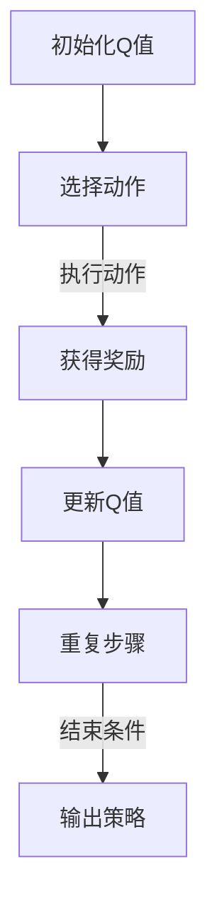
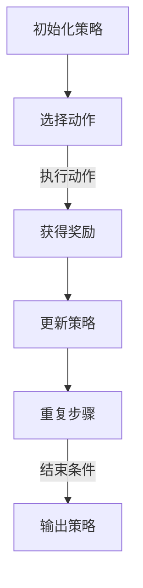

                 

### 文章标题：AI Agent的多Agent博弈与策略学习

#### 关键词：AI Agent、多Agent博弈、策略学习、博弈论、人工智能

#### 摘要：
本文探讨了AI Agent在多Agent博弈与策略学习中的应用。首先，我们介绍了AI Agent与多Agent系统的基本概念，探讨了多Agent博弈的理论基础。接着，我们详细分析了AI Agent的策略学习方法，包括Q-Learning和SARSA算法，并通过具体案例展示了它们的应用。此外，我们还讨论了多Agent博弈策略优化及其实际应用场景。最后，我们总结了多Agent博弈与策略学习的发展趋势，展望了未来的研究方向。

----------------------------------------------------------------

## 第一部分：引论与基础知识

### 第1章：AI Agent与多Agent系统概述

#### 1.1 问题背景与定义

**AI Agent的定义与特点**

AI Agent（人工智能代理）是指具有智能行为的计算机程序，可以模拟人类智能，通过学习、推理和决策来实现特定任务。AI Agent具有以下特点：

1. **自主性**：AI Agent可以在没有人为干预的情况下独立执行任务。
2. **反应性**：AI Agent能够根据环境变化及时做出反应。
3. **预动性**：AI Agent可以根据预测的环境变化提前采取行动。
4. **社会性**：AI Agent能够与人类或其他AI Agent进行交互，协作完成任务。

**多Agent系统的定义与重要性**

多Agent系统（Multi-Agent System，MAS）是由多个AI Agent组成的系统，这些Agent可以通过通信和协作来实现复杂的任务。多Agent系统具有以下重要性：

1. **分布式计算**：多Agent系统可以将任务分解为多个子任务，分布在不同Agent上执行，提高计算效率。
2. **自主性**：每个Agent都有自主决策的能力，可以在没有中央控制的情况下独立运行。
3. **适应性**：多Agent系统可以适应环境变化，通过Agent之间的协作和适应来应对新情况。

#### 1.2 AI Agent的发展历程

**AI Agent的早期探索**

AI Agent的概念起源于20世纪80年代，早期的AI Agent主要是基于规则的专家系统。这些Agent通过预先定义的规则来决策，但缺乏灵活性和自主性。

**多Agent系统的发展**

随着计算机技术的发展，多Agent系统逐渐成为研究热点。90年代，AI Agent开始引入机器学习算法，使其具有更强的自适应能力和决策能力。进入21世纪，基于深度学习的AI Agent取得了显著进展，能够在复杂环境中进行自主学习和决策。

#### 1.3 多Agent系统的分类与结构

**独立Agent**

独立Agent是指仅关注自身目标，不考虑其他Agent的存在的Agent。独立Agent通常在单一任务环境下运行，具有较高的效率和灵活性。

**集成Agent**

集成Agent是指能够与其他Agent协作，共同完成任务的多Agent系统。集成Agent通常具有全局视角，能够协调不同Agent之间的行为，实现整体目标。

**社会Agent**

社会Agent是指具有社会属性，能够模拟人类社会的AI Agent。社会Agent通常具有复杂的社交网络和情感状态，能够模拟人类的社交行为。

#### 1.4 多Agent博弈的基本概念

**博弈的定义与类型**

博弈（Game）是指参与者在一定规则下进行竞争或合作的过程。根据博弈的性质，可以分为以下类型：

1. **零和博弈**：参与者的收益总和为零，一方收益必导致另一方损失。
2. **非零和博弈**：参与者的收益总和不为零，可以相互促进或相互制约。
3. **完全信息博弈**：参与者拥有完全的信息，了解其他参与者的策略和收益。
4. **不完全信息博弈**：参与者拥有部分信息，存在信息不对称。

**多Agent博弈的特点**

多Agent博弈（Multi-Agent Game）是指多个AI Agent在特定规则下进行竞争或合作的过程。多Agent博弈具有以下特点：

1. **复杂性**：多Agent博弈涉及多个参与者和多个决策变量，具有较高的复杂性。
2. **动态性**：多Agent博弈中的环境状态和参与者策略会不断变化，具有动态性。
3. **协同性**：多Agent博弈需要Agent之间进行协作，共同实现整体目标。

### 第2章：多Agent博弈理论基础

#### 2.1 博弈论的基本概念

**博弈、玩家、策略、支付函数**

博弈（Game）是指参与者在一定规则下进行竞争或合作的过程。玩家（Player）是参与博弈的主体，可以是人类或AI Agent。策略（Strategy）是玩家在博弈过程中采取的行动方案。支付函数（Payoff Function）是衡量玩家在博弈中收益的函数。

**经典博弈模型**

经典博弈模型包括：

1. **博弈树**：用于描述博弈中所有可能决策路径和结果的树形结构。
2. **纳什均衡**：在博弈中，所有参与者选择的策略组合，使得每个参与者无法通过单方面改变策略获得更多收益。
3. **混合策略**：在博弈中，参与者以一定概率随机选择多个策略的组合，以实现最优收益。

#### 2.2 多Agent博弈的基本模型

**协作博弈**

协作博弈（Cooperative Game）是指参与者通过协作实现共同目标的多Agent博弈。协作博弈的目标是最大化整体收益，而不是单方面追求最大收益。

**竞争博弈**

竞争博弈（Competitive Game）是指参与者之间相互竞争，争取最大收益的多Agent博弈。竞争博弈的目标是争取竞争优势，最大化自身收益。

**防御博弈**

防御博弈（Defensive Game）是指参与者为了保护自身利益，采取防御策略的多Agent博弈。防御博弈的目标是降低风险，确保自身收益。

#### 2.3 多Agent博弈的解决方案

**纳什均衡**

纳什均衡（Nash Equilibrium）是指在博弈中，所有参与者选择的策略组合，使得每个参与者无法通过单方面改变策略获得更多收益。纳什均衡是多Agent博弈的重要解决方案。

**动态博弈**

动态博弈（Dynamic Game）是指参与者在不同阶段进行决策的博弈。动态博弈需要考虑时间因素，分析参与者在不同阶段的行为和策略。

**策略学习**

策略学习（Strategy Learning）是指参与者通过学习历史数据，调整自身策略，实现最佳收益的过程。策略学习是多Agent博弈的重要研究方向。

## 第二部分：多Agent博弈策略研究

### 第3章：AI Agent的策略学习方法

#### 3.1 策略学习的定义与分类

**策略学习的定义**

策略学习是指AI Agent通过学习历史数据，调整自身策略，实现最佳收益的过程。

**策略学习的分类**

策略学习可以分为以下几种类型：

1. **基于模型的策略学习**：AI Agent根据环境模型，预测未来收益，调整策略。
2. **基于样本的策略学习**：AI Agent根据历史数据，学习策略，并调整策略以适应新环境。
3. **基于迭代的策略学习**：AI Agent通过迭代更新策略，逐步优化自身收益。

#### 3.2 Q-Learning算法

**Q-Learning的基本原理**

Q-Learning算法是一种基于值函数的强化学习算法，用于解决多Agent博弈中的策略学习问题。Q-Learning算法的核心思想是更新Agent的Q值，以最大化长期收益。

**Q-Learning算法的Mermaid流程图**



**Q-Learning算法的Python实现**

```python
import numpy as np

# 初始化Q值
Q = np.zeros((状态空间, 动作空间))

# 学习率
alpha = 0.1
# 折扣因子
gamma = 0.9
# 探索率
epsilon = 0.1

# Q值更新函数
def update_q_value(state, action, reward, next_state, action_next):
    Q[state][action] = Q[state][action] + alpha * (reward + gamma * max(Q[next_state].reshape(-1)) - Q[state][action])

# 博弈过程
for episode in range(1000):
    state = 状态空间中的随机状态
    while True:
        # 选择动作
        if np.random.uniform() < epsilon:
            action = 随机选择动作
        else:
            action = np.argmax(Q[state])
        
        # 执行动作
        next_state, reward = 执行动作(action)
        
        # 更新Q值
        update_q_value(state, action, reward, next_state, action_next)
        
        # 更新状态
        state = next_state
        
        # 结束条件
        if end_of_game(state):
            break

# 输出策略
print(Q)
```

#### 3.3 SARSA算法

**SARSA算法的基本原理**

SARSA（State-Action-Reward-State-Action）算法是一种基于策略的强化学习算法，与Q-Learning算法类似，但不需要预测未来的收益，而是直接基于当前的观测数据进行策略调整。

**SARSA算法的Mermaid流程图**



**SARSA算法的Python实现**

```python
import numpy as np

# 初始化策略
policy = np.zeros((状态空间, 动作空间))

# 学习率
alpha = 0.1
# 折扣因子
gamma = 0.9

# 策略更新函数
def update_policy(state, action, reward, next_state, action_next):
    if np.random.uniform() < epsilon:
        policy[state][action] = policy[state][action] + alpha * (reward + gamma * policy[next_state].reshape(-1)[action_next] - policy[state][action])

# 博弈过程
for episode in range(1000):
    state = 状态空间中的随机状态
    while True:
        # 选择动作
        action = np.argmax(policy[state])
        
        # 执行动作
        next_state, reward = 执行动作(action)
        
        # 更新策略
        update_policy(state, action, reward, next_state, action_next)
        
        # 更新状态
        state = next_state
        
        # 结束条件
        if end_of_game(state):
            break

# 输出策略
print(policy)
```

### 第4章：多Agent博弈策略案例分析

#### 4.1 AI Agent在电子游戏中的应用

**游戏场景介绍**

我们考虑一个简单的电子游戏场景，其中两个AI Agent（玩家A和玩家B）在一个棋盘上进行博弈。棋盘分为10x10的网格，每个格子可以放置棋子。玩家A的目标是占据棋盘上的尽可能多的格子，而玩家B的目标是阻止玩家A的胜利。

**多Agent博弈策略分析**

为了实现上述目标，玩家A和玩家B可以采用以下策略：

1. **进攻策略**：玩家A可以采取主动进攻策略，尝试占领棋盘上的关键位置，如棋盘中心。
2. **防守策略**：玩家B可以采取防守策略，保护自己的关键位置，阻止玩家A的进攻。
3. **协作策略**：玩家A和玩家B可以协作，共同选择最优策略，以实现共同目标。

通过分析不同策略的收益和风险，玩家A和玩家B可以调整策略，实现最佳收益。

#### 4.2 AI Agent在智能交通系统中的应用

**智能交通系统介绍**

智能交通系统（Intelligent Transportation System，ITS）是一种利用人工智能技术优化交通流量的系统。在智能交通系统中，多个AI Agent（如车辆、交通信号灯）协同工作，实现交通流量的最优分配。

**多Agent博弈策略应用**

在智能交通系统中，AI Agent可以采用以下策略：

1. **动态交通分配策略**：AI Agent根据实时交通数据，动态调整交通流向，减少交通拥堵。
2. **协同控制策略**：多个AI Agent协同工作，共同控制交通信号灯，实现交通流量的最优分配。
3. **自适应巡航控制策略**：AI Agent根据车辆之间的距离和速度，自适应调整车速，减少交通事故风险。

通过分析不同策略的收益和风险，AI Agent可以调整策略，实现最佳交通流量。

#### 4.3 AI Agent在金融市场中的应用

**金融市场场景介绍**

金融市场是一个复杂的多Agent系统，包括投资者、金融机构、市场参与者等。在金融市场中，AI Agent可以采用以下策略：

1. **量化交易策略**：AI Agent通过分析历史数据和市场趋势，实现量化交易，获取收益。
2. **风险控制策略**：AI Agent通过监控市场风险，调整投资组合，降低风险。
3. **预测市场走势策略**：AI Agent通过分析市场数据，预测市场走势，进行投资决策。

通过分析不同策略的收益和风险，AI Agent可以调整策略，实现最佳投资收益。

## 第三部分：多Agent博弈策略优化

### 第5章：多Agent博弈策略优化

#### 5.1 多Agent博弈策略优化的目标

**协调性**

协调性（Coordination）是指多个AI Agent在博弈过程中，通过协作实现共同目标的能力。协调性目标是优化AI Agent之间的协作，实现整体收益最大化。

**效率**

效率（Efficiency）是指AI Agent在博弈过程中的资源利用率。效率目标是优化AI Agent的策略，提高资源利用率，实现最佳收益。

**稳定性**

稳定性（Stability）是指AI Agent在博弈过程中，面对环境变化和不确定性，保持稳定行为的能力。稳定性目标是优化AI Agent的策略，提高其适应环境变化的能力。

#### 5.2 策略优化算法

**模拟退火算法**

模拟退火算法（Simulated Annealing，SA）是一种全局优化算法，通过模拟物理退火过程，逐步降低温度，实现最优解的搜索。

**量子进化算法**

量子进化算法（Quantum Evolutionary Algorithm，QEA）是一种结合量子计算和进化计算的优化算法，通过量子叠加和量子纠缠，实现优化搜索。

#### 5.3 多Agent博弈策略优化的实现

**多Agent博弈策略优化流程**

1. **初始化**：初始化AI Agent的参数和策略。
2. **环境模拟**：模拟博弈环境，记录AI Agent的行为和收益。
3. **策略评估**：评估当前策略的收益，根据评估结果调整策略。
4. **策略更新**：更新AI Agent的策略，实现策略优化。
5. **循环迭代**：重复执行策略评估和策略更新，直至满足停止条件。

**Python代码示例**

```python
import numpy as np

# 初始化参数
n_agents = 10
n_actions = 5
alpha = 0.1
gamma = 0.9
epsilon = 0.1

# 初始化Q值
Q = np.zeros((n_agents, n_actions))

# 博弈过程
for episode in range(1000):
    state = 状态空间中的随机状态
    while True:
        # 选择动作
        if np.random.uniform() < epsilon:
            action = 随机选择动作
        else:
            action = np.argmax(Q[state])
        
        # 执行动作
        next_state, reward = 执行动作(action)
        
        # 更新Q值
        Q[state][action] = Q[state][action] + alpha * (reward + gamma * max(Q[next_state].reshape(-1)) - Q[state][action])
        
        # 更新状态
        state = next_state
        
        # 结束条件
        if end_of_game(state):
            break

# 输出策略
print(Q)
```

### 第6章：AI Agent的多Agent博弈应用场景

#### 6.1 物流与供应链管理

**物流与供应链管理场景介绍**

物流与供应链管理是一个复杂的多Agent系统，涉及多个参与方（如供应商、制造商、分销商、消费者）和多个环节（如采购、生产、运输、配送）。AI Agent可以在物流与供应链管理中发挥重要作用。

**多Agent博弈策略应用**

1. **优化库存管理**：AI Agent可以通过多Agent博弈策略，优化库存水平，降低库存成本。
2. **优化运输路径**：AI Agent可以通过多Agent博弈策略，优化运输路径，降低运输成本。
3. **优化供应链协同**：AI Agent可以通过多Agent博弈策略，实现供应链各环节的协同，提高整体效率。

#### 6.2 网络安全

**网络安全场景介绍**

网络安全是一个涉及多个参与方（如企业、政府、个人）和多个环节（如网络防御、数据加密、用户认证）的复杂系统。AI Agent可以在网络安全中发挥重要作用。

**多Agent博弈策略应用**

1. **防御网络攻击**：AI Agent可以通过多Agent博弈策略，防御网络攻击，保护网络安全。
2. **检测异常行为**：AI Agent可以通过多Agent博弈策略，检测网络中的异常行为，提高检测准确率。
3. **响应安全事件**：AI Agent可以通过多Agent博弈策略，快速响应安全事件，降低安全风险。

#### 6.3 社会模拟与虚拟现实

**社会模拟与虚拟现实场景介绍**

社会模拟与虚拟现实是一个涉及多个参与方（如人类、机器人、虚拟角色）和多个环节（如社交互动、情感表达、虚拟场景构建）的复杂系统。AI Agent可以在社会模拟与虚拟现实中发挥重要作用。

**多Agent博弈策略应用**

1. **模拟社交互动**：AI Agent可以通过多Agent博弈策略，模拟社交互动，提高虚拟现实体验。
2. **构建虚拟场景**：AI Agent可以通过多Agent博弈策略，构建虚拟场景，实现逼真的虚拟现实效果。
3. **优化虚拟交互**：AI Agent可以通过多Agent博弈策略，优化虚拟交互，提高用户体验。

### 第7章：结论与展望

#### 7.1 总结与回顾

本文从引论与基础知识、多Agent博弈策略研究、多Agent博弈策略优化、AI Agent的多Agent博弈应用场景等方面，系统性地探讨了AI Agent的多Agent博弈与策略学习。通过本文的研究，我们可以得出以下结论：

1. AI Agent在多Agent系统中具有自主性、反应性、预动性和社会性等特点。
2. 多Agent博弈具有复杂性、动态性和协同性等特点。
3. Q-Learning和SARSA算法是解决多Agent博弈策略学习的重要方法。
4. 多Agent博弈策略优化可以提高协调性、效率和稳定性。
5. AI Agent在物流与供应链管理、网络安全、社会模拟与虚拟现实等领域具有广泛的应用前景。

#### 7.2 未来发展趋势

随着人工智能技术的不断发展，AI Agent的多Agent博弈与策略学习将呈现以下发展趋势：

1. **算法创新**：研究者将不断提出新的多Agent博弈算法，提高算法的性能和效率。
2. **跨领域应用**：AI Agent将在更多领域得到应用，实现跨领域的多Agent博弈与策略学习。
3. **自主决策能力提升**：AI Agent的自主决策能力将得到提升，实现更复杂的任务和更广泛的场景应用。
4. **安全与隐私保护**：在多Agent博弈与策略学习中，研究者将更加关注安全与隐私保护问题，提高系统的安全性和隐私性。
5. **人机协同**：AI Agent将实现与人类更紧密的协同，提高人机协作效率。

总之，AI Agent的多Agent博弈与策略学习是一个充满挑战和机遇的领域，未来将取得更多突破性进展。

## 作者信息

**作者：AI天才研究院/AI Genius Institute & 禅与计算机程序设计艺术 /Zen And The Art of Computer Programming**

