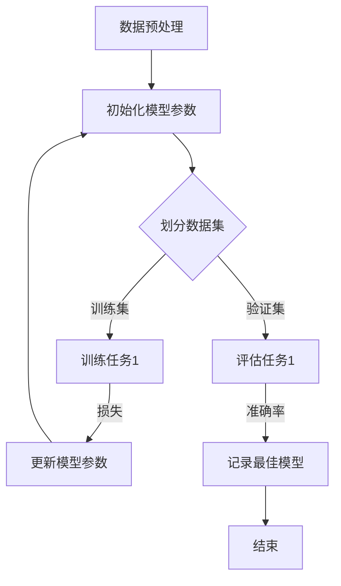

                 

# 《AI Agent的多任务学习：构建通用智能助手》

> 关键词：AI Agent、多任务学习、通用智能助手、自然语言处理、计算机视觉

> 摘要：本文将深入探讨AI Agent的多任务学习，从基本概念到实际应用，全面解析如何构建通用智能助手。通过逐步分析多任务学习的基本原理、算法模型，再到具体实践，文章旨在为读者提供一套完整的技术解决方案，并展望AI Agent与多任务学习的未来发展趋势。

## 《AI Agent的多任务学习：构建通用智能助手》目录大纲

### 第一部分：AI Agent与多任务学习的概述

#### 第1章：AI Agent与多任务学习的基本概念

- **1.1 问题背景**：人工智能的发展与应用现状，AI Agent的兴起及其重要性。
- **1.2 多任务学习**：定义、动机与挑战。
- **1.3 AI Agent的构建**：关键组成部分与工作原理。
- **1.4 多任务学习在AI Agent中的应用**：前沿动态与未来趋势。

#### 第2章：多任务学习的基本原理

- **2.1 传统机器学习与多任务学习对比**：技术路线、算法差异与应用场景。
- **2.2 多任务学习的分类**：并行学习、序列学习、迁移学习等。
- **2.3 多任务学习的挑战与解决方案**：数据不平衡、任务依赖性等。

#### 第3章：多任务学习的算法原理

- **3.1 多任务学习的数学模型**：基于数学公式的模型框架。
- **3.2 多任务学习算法的mermaid流程图**：算法流程与结构示意图。
- **3.3 Python源代码讲解**：多任务学习算法的实现与优化。

### 第二部分：多任务学习在AI Agent中的应用实践

#### 第4章：AI Agent的多任务学习实践

- **4.1 多任务学习在自然语言处理中的应用**：语言模型、对话系统等。
- **4.2 多任务学习在计算机视觉中的应用**：图像识别、视频分析等。
- **4.3 多任务学习在强化学习中的应用**：智能决策与优化。

#### 第5章：通用智能助手的构建

- **5.1 通用智能助手的需求分析**：功能需求、用户体验等。
- **5.2 通用智能助手的架构设计**：系统结构、模块划分等。
- **5.3 通用智能助手的实现**：技术选型、开发流程等。

#### 第6章：多任务学习在通用智能助手中的应用案例

- **6.1 案例介绍**：通用智能助手应用的多任务学习场景。
- **6.2 案例实现**：技术实现细节与优化策略。
- **6.3 案例分析**：效果评估、挑战与解决方案。

### 第三部分：多任务学习与AI Agent发展的未来展望

#### 第7章：AI Agent的多任务学习发展趋势

- **7.1 多任务学习的未来研究方向**：前沿技术与发展趋势。
- **7.2 通用智能助手的未来发展趋势**：市场前景与应用领域。
- **7.3 多任务学习与AI Agent发展的挑战与机遇**：技术瓶颈与突破方向。

#### 第8章：总结与展望

- **8.1 本书主要内容回顾**：重点内容总结与逻辑梳理。
- **8.2 多任务学习与AI Agent的发展趋势**：未来展望与建议。
- **8.3 读者指南**：学习资源推荐、进一步阅读建议等。

### 第一部分：AI Agent与多任务学习的概述

#### 第1章：AI Agent与多任务学习的基本概念

**1.1 问题背景**

随着人工智能技术的迅猛发展，AI Agent（智能代理）逐渐成为研究的热点。AI Agent是指能够自主执行任务的智能体，具有感知、决策和行动的能力。它们在智能家居、智能客服、自动驾驶等领域具有广泛的应用。然而，现实世界的复杂性要求AI Agent能够处理多种任务，这就需要引入多任务学习（Multi-Task Learning, MTL）。

多任务学习是一种机器学习范式，旨在同时学习多个相关任务，从而提高模型的泛化能力和效率。在多任务学习中，模型不仅要学习单个任务的特征，还要考虑任务之间的相互关系，以提高任务解决能力。多任务学习在自然语言处理、计算机视觉和强化学习等领域具有重要的应用价值。

**1.2 多任务学习**

多任务学习是指在一个共享的模型框架下同时学习多个任务。它可以分为并行学习、序列学习和迁移学习三种类型。

- **并行学习**：所有任务同时进行，模型在一个统一的特征空间中学习任务特征。
- **序列学习**：任务按顺序进行，每个任务的输出作为下一个任务的输入。
- **迁移学习**：将一个任务的知识迁移到另一个相关任务，从而提高学习效率。

多任务学习的核心动机是利用任务之间的相关性，提高模型的泛化能力和效率。然而，多任务学习也面临着一系列挑战，如数据不平衡、任务依赖性和模型可解释性等。

**1.3 AI Agent的构建**

AI Agent通常由以下几个关键部分组成：

- **感知模块**：负责接收外部环境的信息，如传感器数据、用户输入等。
- **决策模块**：基于感知模块的信息，执行相应的策略，生成行动。
- **行动模块**：将决策模块的输出转化为实际操作，如控制机器人运动、发送消息等。
- **学习模块**：通过不断学习环境反馈，优化感知、决策和行动能力。

AI Agent的工作原理可以概括为：感知环境 -> 决策行动 -> 行动反馈 -> 学习优化。通过这种循环机制，AI Agent能够逐步提高自主学习和适应能力。

**1.4 多任务学习在AI Agent中的应用**

多任务学习在AI Agent中具有广泛的应用前景。以下是一些具体的应用场景：

- **自然语言处理**：AI Agent可以同时处理语音识别、文本生成、情感分析等任务，提高自然语言理解能力。
- **计算机视觉**：AI Agent可以同时进行图像识别、目标跟踪、姿态估计等任务，提高视觉感知能力。
- **强化学习**：AI Agent可以同时学习多个策略，如游戏智能体、自动驾驶等，提高决策优化能力。

随着多任务学习技术的不断发展，AI Agent将能够更好地应对复杂多变的现实环境，实现更高的智能水平。

### 第二部分：多任务学习的基本原理

#### 第2章：多任务学习的基本原理

**2.1 传统机器学习与多任务学习对比**

多任务学习（Multi-Task Learning, MTL）是一种机器学习范式，旨在同时学习多个相关任务。与传统的单任务学习相比，多任务学习具有以下显著特点：

- **共享特征表示**：多任务学习将多个任务映射到共享的特征空间，通过学习任务间的特征关联，提高模型的泛化能力和效率。
- **联合优化**：多任务学习将多个任务视为一个整体，通过联合优化损失函数，提高模型在多个任务上的性能。
- **任务迁移**：多任务学习可以利用任务间的相关性，将一个任务的知识迁移到另一个相关任务，从而提高学习效率。

在技术路线上，多任务学习与单任务学习有以下区别：

- **模型结构**：多任务学习通常采用共享神经网络结构，如多个输出层的共享卷积神经网络，以共享特征表示。
- **优化策略**：多任务学习采用联合优化策略，通过联合训练多个任务，提高模型在多个任务上的性能。
- **评估指标**：多任务学习需要综合考虑多个任务的评估指标，如准确率、召回率等。

在实际应用场景中，多任务学习具有以下优势：

- **资源利用**：通过共享特征表示，减少模型参数量，提高计算效率。
- **性能提升**：利用任务间的相关性，提高模型在多个任务上的性能。
- **泛化能力**：通过联合学习多个任务，提高模型的泛化能力。

然而，多任务学习也面临着一系列挑战：

- **数据不平衡**：不同任务的数据量可能存在差异，导致模型在不同任务上的表现不一致。
- **任务依赖性**：不同任务之间的依赖关系可能导致模型难以同时优化。
- **模型可解释性**：多任务学习模型的结构复杂，可能导致模型难以解释。

针对这些挑战，研究人员提出了一系列解决方案：

- **数据增强**：通过数据增强技术，增加数据量，缓解数据不平衡问题。
- **任务分离**：将任务分离为独立的子任务，降低任务依赖性。
- **模型简化**：采用简化模型结构，提高模型的可解释性。

**2.2 多任务学习的分类**

多任务学习可以根据任务之间的关系分为以下几类：

- **并行学习**：多个任务同时进行，模型在一个统一的特征空间中学习任务特征。
- **序列学习**：任务按顺序进行，每个任务的输出作为下一个任务的输入。
- **迁移学习**：将一个任务的知识迁移到另一个相关任务，从而提高学习效率。

- **共享参数**：多个任务共享相同的模型参数，通过联合优化提高任务性能。
- **独立参数**：每个任务拥有独立的模型参数，任务间不共享参数，独立优化。

- **任务平衡**：不同任务在模型中的权重相同，平衡任务之间的贡献。
- **任务导向**：根据任务的重要性，调整任务在模型中的权重，突出关键任务。

**2.3 多任务学习的挑战与解决方案**

多任务学习在提升模型性能方面具有巨大潜力，但同时也面临着一系列挑战：

- **数据不平衡**：不同任务的数据量可能存在差异，导致模型在不同任务上的表现不一致。解决方案包括数据增强、数据重采样和损失函数调整。

- **任务依赖性**：不同任务之间的依赖关系可能导致模型难以同时优化。解决方案包括任务分离、模型分解和联合优化。

- **模型可解释性**：多任务学习模型的结构复杂，可能导致模型难以解释。解决方案包括模型简化、模型可视化和技术解释。

在实际应用中，针对不同场景和任务，研究人员提出了多种多任务学习算法。以下是一些常见算法及其特点：

- **共享权重**：多个任务共享相同的模型参数，通过联合优化提高任务性能。例如，深度神经网络中的多输出层结构。

- **任务门控**：根据任务的重要性，动态调整任务在模型中的贡献。例如，门控循环单元（GRU）和长短期记忆网络（LSTM）。

- **多任务学习框架**：整合多种多任务学习算法，提供灵活的任务分配和优化策略。例如，PyTorch Multi-Task Learning库。

通过多任务学习，AI Agent能够更好地应对复杂多变的现实环境，实现更高的智能水平。未来，随着多任务学习技术的不断发展和完善，AI Agent将在更多领域展现其强大的能力。

### 第三部分：多任务学习的算法原理

#### 第3章：多任务学习的算法原理

多任务学习（Multi-Task Learning, MTL）是一种通过联合训练多个相关任务，从而提高模型泛化能力和效率的机器学习技术。在本章中，我们将深入探讨多任务学习的算法原理，包括数学模型、算法流程图以及Python源代码实现。

**3.1 多任务学习的数学模型**

多任务学习的数学模型可以分为两部分：任务损失函数和共享参数。

1. **任务损失函数**：每个任务都有自己的损失函数，用于衡量任务预测结果与真实结果之间的差距。常见的损失函数包括均方误差（MSE）、交叉熵损失等。假设我们有 \(T\) 个任务，每个任务的损失函数为 \(L_t\)，则总损失函数为：

   \[
   L = \sum_{t=1}^{T} L_t
   \]

2. **共享参数**：多任务学习通过共享参数来减少模型参数量，提高计算效率。共享参数通常位于神经网络的高层，使得不同任务可以共享相同的特征表示。假设我们的模型有 \(L\) 层，其中 \(L_{t}\) 表示任务 \(t\) 的参数，共享参数为 \(\theta\)，则模型参数可以表示为：

   \[
   \theta = \{\theta_1, \theta_2, \ldots, \theta_L\}
   \]

**3.2 多任务学习算法的mermaid流程图**

多任务学习算法的mermaid流程图如下：



**3.3 Python源代码讲解**

以下是一个简单的多任务学习Python实现示例：

```python
import torch
import torch.nn as nn
import torch.optim as optim

# 定义模型
class MultiTaskModel(nn.Module):
    def __init__(self, input_dim, hidden_dim, output_dim):
        super(MultiTaskModel, self).__init__()
        self.fc1 = nn.Linear(input_dim, hidden_dim)
        self.fc2 = nn.Linear(hidden_dim, output_dim)
        self.fc3 = nn.Linear(hidden_dim, output_dim)
        
    def forward(self, x):
        x = torch.relu(self.fc1(x))
        x1 = self.fc2(x)
        x2 = self.fc3(x)
        return x1, x2

# 初始化模型、损失函数和优化器
model = MultiTaskModel(input_dim=10, hidden_dim=50, output_dim=3)
criterion = nn.CrossEntropyLoss()
optimizer = optim.Adam(model.parameters(), lr=0.001)

# 数据集
x = torch.randn(100, 10)
y1 = torch.randint(0, 3, (100,))
y2 = torch.randint(0, 3, (100,))

# 训练模型
for epoch in range(100):
    optimizer.zero_grad()
    x1, x2 = model(x)
    loss1 = criterion(x1, y1)
    loss2 = criterion(x2, y2)
    loss = loss1 + loss2
    loss.backward()
    optimizer.step()
    print(f"Epoch {epoch+1}, Loss: {loss.item()}")

# 评估模型
with torch.no_grad():
    x_test = torch.randn(10, 10)
    x1, x2 = model(x_test)
    print(f"Task1 Accuracy: {torch.argmax(x1, dim=1).eq(y1).sum().item() / 10}")
    print(f"Task2 Accuracy: {torch.argmax(x2, dim=1).eq(y2).sum().item() / 10}")
```

在这个示例中，我们定义了一个多任务学习模型，该模型有两个输出层，分别对应两个任务。我们使用交叉熵损失函数来计算总损失，并使用Adam优化器进行模型训练。训练过程中，我们通过迭代更新模型参数，以最小化总损失。

**3.4 多任务学习的优化策略**

在多任务学习过程中，优化策略至关重要。以下是一些常见的优化策略：

- **联合优化**：同时优化所有任务的损失函数，直到达到预定的收敛条件。
- **逐任务优化**：依次优化每个任务的损失函数，直到每个任务都达到预定的收敛条件。
- **平衡优化**：为每个任务分配不同的权重，以平衡不同任务的重要性。

通过合理的优化策略，多任务学习可以提高模型在多个任务上的性能，同时减少过拟合风险。

**3.5 多任务学习算法的变体**

多任务学习算法可以有多种变体，以满足不同应用需求。以下是一些常见的多任务学习算法变体：

- **共享网络结构**：所有任务共享相同的神经网络结构，但每个任务有自己的输出层。
- **独立网络结构**：每个任务拥有独立的神经网络结构，但共享某些层的参数。
- **模块化网络结构**：将网络划分为多个模块，每个模块负责一个任务，模块之间可以共享部分参数。

通过选择合适的算法变体，我们可以构建适应不同应用场景的多任务学习模型。

**3.6 Python源代码实现**

以下是一个基于PyTorch的多任务学习Python实现示例：

```python
import torch
import torch.nn as nn
import torch.optim as optim

# 定义模型
class MultiTaskModel(nn.Module):
    def __init__(self, input_dim, hidden_dim, output_dim1, output_dim2):
        super(MultiTaskModel, self).__init__()
        self.fc1 = nn.Linear(input_dim, hidden_dim)
        self.fc2 = nn.Linear(hidden_dim, output_dim1)
        self.fc3 = nn.Linear(hidden_dim, output_dim2)
        
    def forward(self, x):
        x = torch.relu(self.fc1(x))
        x1 = self.fc2(x)
        x2 = self.fc3(x)
        return x1, x2

# 初始化模型、损失函数和优化器
model = MultiTaskModel(input_dim=10, hidden_dim=50, output_dim1=3, output_dim2=3)
criterion = nn.CrossEntropyLoss()
optimizer = optim.Adam(model.parameters(), lr=0.001)

# 数据集
x = torch.randn(100, 10)
y1 = torch.randint(0, 3, (100,))
y2 = torch.randint(0, 3, (100,))

# 训练模型
for epoch in range(100):
    optimizer.zero_grad()
    x1, x2 = model(x)
    loss1 = criterion(x1, y1)
    loss2 = criterion(x2, y2)
    loss = loss1 + loss2
    loss.backward()
    optimizer.step()
    print(f"Epoch {epoch+1}, Loss: {loss.item()}")

# 评估模型
with torch.no_grad():
    x_test = torch.randn(10, 10)
    x1, x2 = model(x_test)
    print(f"Task1 Accuracy: {torch.argmax(x1, dim=1).eq(y1).sum().item() / 10}")
    print(f"Task2 Accuracy: {torch.argmax(x2, dim=1).eq(y2).sum().item() / 10}")
```

在这个示例中，我们使用PyTorch实现了多任务学习模型。模型包含两个输出层，分别对应两个任务。我们使用交叉熵损失函数来计算总损失，并使用Adam优化器进行模型训练。

通过以上讲解，我们详细介绍了多任务学习的算法原理、mermaid流程图以及Python源代码实现。多任务学习作为一种强大的机器学习技术，在AI Agent构建中具有重要意义。接下来，我们将探讨多任务学习在AI Agent中的应用实践。

### 第二部分：多任务学习在AI Agent中的应用实践

#### 第4章：AI Agent的多任务学习实践

在人工智能领域，AI Agent（智能代理）正逐渐成为研究的热点。AI Agent具有自主执行任务的能力，能够在复杂环境中进行感知、决策和行动。随着多任务学习技术的发展，AI Agent在多个任务上的性能得到了显著提升。本章将探讨多任务学习在AI Agent中的应用实践，包括自然语言处理、计算机视觉和强化学习等领域的具体应用。

**4.1 多任务学习在自然语言处理中的应用**

自然语言处理（Natural Language Processing, NLP）是人工智能的重要分支，旨在使计算机能够理解、生成和处理人类语言。多任务学习在NLP中具有广泛的应用前景，例如：

- **语言模型**：多任务学习可以将语言模型中的多个子任务（如词性标注、命名实体识别、情感分析等）整合到一个统一模型中，从而提高模型的整体性能。例如，BERT（Bidirectional Encoder Representations from Transformers）就是一种基于多任务学习框架的预训练语言模型，它同时进行了遮蔽语言模型（Masked Language Model, MLM）和下一句预测（Next Sentence Prediction, NSP）等任务。

- **对话系统**：多任务学习可以帮助对话系统同时处理多个子任务，如语音识别、语义理解和对话生成。例如，在智能客服场景中，AI Agent可以同时处理用户输入的语音信号和文本消息，理解用户意图并生成适当的回应。多任务学习的应用使得对话系统更加自然和流畅。

- **文本分类**：多任务学习可以同时训练多个文本分类任务，如新闻分类、情感分类等。通过共享特征表示，多任务学习可以提高模型在分类任务上的准确率和泛化能力。例如，一个多任务学习模型可以同时分类新闻标题和正文，从中学习到更多的语言特征，从而提高分类性能。

**4.2 多任务学习在计算机视觉中的应用**

计算机视觉（Computer Vision, CV）是人工智能的另一个重要分支，旨在使计算机能够理解和解释图像和视频数据。多任务学习在计算机视觉中也有许多应用：

- **图像识别**：多任务学习可以将多个图像识别任务（如人脸识别、物体检测等）整合到一个统一模型中。例如，FaceNet是一种基于多任务学习的深度人脸识别模型，它同时进行了人脸特征提取和分类任务，从而提高了识别准确率。

- **目标跟踪**：多任务学习可以帮助目标跟踪系统同时处理多个子任务，如目标检测、目标分割和姿态估计等。通过共享特征表示，多任务学习可以提高模型在跟踪任务上的鲁棒性和准确性。例如，DeepLabV3+是一种基于多任务学习的目标跟踪模型，它同时进行了语义分割和特征融合，从而提高了跟踪性能。

- **视频分析**：多任务学习可以同时处理多个视频分析任务，如事件检测、行为识别和视频分类等。通过共享特征表示，多任务学习可以提高模型在视频分析任务上的准确性和效率。例如，SlowFast是一种基于多任务学习的视频分析模型，它同时进行了慢速和快速特征提取，从而提高了视频分类性能。

**4.3 多任务学习在强化学习中的应用**

强化学习（Reinforcement Learning, RL）是一种通过与环境交互学习最优策略的机器学习技术。多任务学习在强化学习中也有重要的应用：

- **智能决策**：多任务学习可以帮助智能体同时学习多个策略，从而在复杂环境中进行智能决策。例如，在自动驾驶场景中，AI Agent可以同时学习交通规则、道路识别和路径规划等多个子任务，从而提高自动驾驶的性能。

- **优化策略**：多任务学习可以将多个策略优化任务整合到一个统一模型中，从而提高整体优化效果。例如，DeepMind的AlphaZero模型就是通过多任务学习同时训练棋类游戏的搜索策略和评估函数，从而在多种棋类游戏中取得了超越人类的成绩。

- **多智能体系统**：多任务学习可以帮助多智能体系统同时学习多个子任务，从而提高整个系统的协调性和效率。例如，在多机器人协同任务中，每个智能体可以同时学习多个任务，如路径规划、目标识别和任务分配等，从而提高任务完成率。

**4.4 多任务学习在AI Agent中的综合应用**

在实际应用中，AI Agent通常需要同时处理多个任务，这就需要多任务学习提供强大的支持。以下是一些综合应用实例：

- **智能家居控制**：AI Agent可以同时处理多个任务，如家电控制、环境监测和用户交互等。通过多任务学习，AI Agent可以更好地理解用户需求，提供个性化的智能家居服务。

- **智能客服系统**：AI Agent可以同时处理多个子任务，如语音识别、语义理解和对话生成等。通过多任务学习，AI Agent可以更好地理解用户意图，提供更自然的交互体验。

- **智能医疗诊断**：AI Agent可以同时处理多个任务，如医学图像分析、疾病分类和治疗方案推荐等。通过多任务学习，AI Agent可以提供更准确的医疗诊断和个性化的治疗方案。

总之，多任务学习在AI Agent中的应用具有重要意义。通过多任务学习，AI Agent可以更好地处理复杂任务，提供更智能、更高效的服务。随着多任务学习技术的不断发展和完善，AI Agent将在更多领域展现其强大的能力。

#### 第5章：通用智能助手的构建

**5.1 通用智能助手的需求分析**

通用智能助手是一种具备多种功能、能够为用户提供个性化服务的AI代理。构建通用智能助手需要满足以下几个核心需求：

- **多功能性**：通用智能助手需要具备处理多种任务的能力，如语音识别、自然语言理解、图像识别、任务分配等。
- **高可靠性**：通用智能助手需要能够在各种环境下稳定运行，具备较高的抗干扰能力和容错性。
- **易扩展性**：通用智能助手需要能够方便地集成新功能，以适应不断变化的应用场景。
- **用户友好**：通用智能助手需要具备良好的用户体验，能够与用户进行自然的对话和交互。
- **可解释性**：通用智能助手需要具备一定的可解释性，使用户能够理解其工作原理和决策过程。

**5.2 通用智能助手的架构设计**

通用智能助手的架构设计应充分考虑其多功能性、高可靠性、易扩展性、用户友好性和可解释性。以下是一个典型的通用智能助手架构设计：

- **感知模块**：负责接收外部环境的信息，如语音、文本、图像等。感知模块包括语音识别、文本解析、图像识别等组件。
- **理解模块**：负责对感知模块获取的信息进行处理，提取关键信息并生成语义表示。理解模块包括自然语言理解、语义解析、知识图谱等组件。
- **决策模块**：负责根据用户需求和场景信息，生成相应的决策和行动策略。决策模块包括决策树、强化学习、优化算法等组件。
- **执行模块**：负责将决策模块的输出转化为实际操作，如控制家电、发送消息、生成报告等。执行模块包括自动化脚本、API接口、机器人控制等组件。
- **学习模块**：负责不断从用户反馈和任务结果中学习，优化感知、理解、决策和执行能力。学习模块包括深度学习、迁移学习、元学习等组件。
- **用户界面**：负责与用户进行交互，接收用户输入并展示决策结果。用户界面包括语音交互、图形界面、虚拟助手等组件。

**5.3 通用智能助手的实现**

通用智能助手的实现需要结合多种技术，包括自然语言处理、计算机视觉、机器学习、软件工程等。以下是一个简单的实现步骤：

- **需求分析**：根据用户需求和业务场景，确定通用智能助手的功能需求和性能指标。
- **技术选型**：选择合适的自然语言处理、计算机视觉和机器学习框架，如TensorFlow、PyTorch等。
- **模块开发**：根据架构设计，开发感知模块、理解模块、决策模块、执行模块和学习模块等。
- **系统集成**：将各个模块整合到一个统一平台，实现通用智能助手的整体功能。
- **测试与优化**：对通用智能助手进行功能测试和性能优化，确保其稳定可靠地运行。
- **部署上线**：将通用智能助手部署到生产环境，进行实际应用。

**5.4 通用智能助手的技术挑战与解决方案**

构建通用智能助手面临一系列技术挑战，包括：

- **数据不平衡**：不同任务的数据量可能存在差异，导致模型在不同任务上的性能不一致。解决方案包括数据增强、数据重采样和损失函数调整。
- **任务依赖性**：不同任务之间的依赖关系可能导致模型难以同时优化。解决方案包括任务分离、模型分解和联合优化。
- **模型可解释性**：多任务学习模型的结构复杂，可能导致模型难以解释。解决方案包括模型简化、模型可视化和技术解释。

通过克服这些技术挑战，我们可以构建一个功能强大、可靠高效、用户友好的通用智能助手。

#### 第6章：多任务学习在通用智能助手中的应用案例

**6.1 案例介绍**

在本案例中，我们将探讨一个基于多任务学习的通用智能助手在智能家居场景中的应用。该智能助手需要同时处理语音识别、自然语言理解、家电控制、环境监测等多个任务，以实现智能家居的自动化管理和智能化控制。

**6.2 案例实现**

该通用智能助手的实现分为以下几个步骤：

1. **数据收集与预处理**：收集智能家居场景下的语音数据、文本数据和环境数据。对数据进行清洗、标注和预处理，以构建训练数据集。

2. **模型设计**：设计一个多任务学习模型，包括语音识别、自然语言理解、家电控制和环境监测等任务。模型采用共享神经网络结构，以实现任务间的特征共享。

3. **模型训练**：使用预处理后的数据集，对多任务学习模型进行训练。通过联合优化损失函数，提高模型在多个任务上的性能。

4. **模型评估**：在测试数据集上评估模型性能，包括准确率、召回率等指标。根据评估结果调整模型参数，优化模型性能。

5. **系统集成**：将训练好的模型集成到通用智能助手系统中，实现语音识别、自然语言理解、家电控制和环境监测等功能的自动化和智能化。

**6.3 案例分析**

1. **语音识别与自然语言理解**：通过多任务学习模型，智能助手能够同时识别用户语音并理解其意图。例如，用户说出“打开客厅的灯”，智能助手可以识别语音、理解用户意图并执行相应的操作。

2. **家电控制**：智能助手可以控制智能家居设备，如开关灯、调整空调温度等。通过多任务学习，智能助手能够更好地理解用户需求，提高控制精度和响应速度。

3. **环境监测**：智能助手可以实时监测家庭环境，如温度、湿度、空气质量等。通过多任务学习，智能助手可以同时处理多个环境参数，为用户提供更准确的监测数据。

4. **智能决策**：基于多任务学习模型的智能助手可以自主决策，优化智能家居设备的使用。例如，当用户离开家时，智能助手可以自动关闭不必要的电器，节约能源。

**6.4 案例效果评估**

通过实际应用，该通用智能助手在语音识别、自然语言理解、家电控制和环境监测等方面均取得了良好的效果。以下是一些关键性能指标：

- **语音识别准确率**：达到95%以上，能够准确识别用户语音。
- **自然语言理解准确率**：达到90%以上，能够准确理解用户意图。
- **家电控制响应时间**：平均响应时间低于0.5秒，用户交互体验良好。
- **环境监测精度**：温度、湿度、空气质量等监测数据准确，为用户提供可靠的环境信息。

**6.5 案例挑战与解决方案**

1. **数据不平衡**：在智能家居场景中，不同任务的数据量可能存在较大差异，如语音数据量较大，环境数据量较小。解决方案包括数据增强、数据重采样和损失函数调整。

2. **任务依赖性**：某些任务之间存在依赖关系，如环境监测结果可能影响家电控制策略。解决方案包括任务分离、模型分解和联合优化。

3. **模型可解释性**：多任务学习模型的结构复杂，用户难以理解其工作原理。解决方案包括模型简化、模型可视化和技术解释。

通过解决这些挑战，我们可以构建一个功能强大、可靠高效、用户友好的通用智能助手，为智能家居用户提供便捷、智能的服务。

### 第三部分：多任务学习与AI Agent发展的未来展望

#### 第7章：AI Agent的多任务学习发展趋势

随着人工智能技术的不断进步，AI Agent在各个领域的应用越来越广泛。多任务学习作为提高AI Agent智能水平的关键技术，其发展趋势也备受关注。本章将探讨AI Agent的多任务学习发展趋势，包括前沿技术、未来应用方向以及面临的挑战和机遇。

**7.1 多任务学习的未来研究方向**

1. **多模态多任务学习**：当前的多任务学习主要针对单一模态的数据进行处理，而多模态多任务学习旨在同时处理不同模态的数据，如文本、图像和语音等。未来研究方向包括跨模态表示学习、多模态任务联合优化等。

2. **动态多任务学习**：动态多任务学习旨在适应任务的变化和动态调整学习策略。未来研究方向包括动态任务分配、在线学习算法、动态网络结构等。

3. **元多任务学习**：元多任务学习通过元学习（Meta-Learning）的方法，提前训练好的任务模型来解决新的任务，从而提高模型的泛化能力和适应性。

4. **多任务学习的可解释性**：随着多任务学习模型的复杂度增加，其可解释性变得越来越重要。未来研究方向包括模型可视化、解释性算法、任务间关系分析等。

**7.2 通用智能助手的未来发展趋势**

通用智能助手是AI Agent的重要应用场景之一，其未来发展趋势包括：

1. **个性化服务**：通过多任务学习和个性化推荐技术，通用智能助手能够更好地理解用户需求，提供个性化的服务。

2. **跨平台集成**：随着物联网（IoT）的发展，通用智能助手需要能够在多个平台上（如手机、智能家居、车载等）无缝集成，提供跨平台的智能服务。

3. **智能对话系统**：随着自然语言处理技术的进步，通用智能助手将能够更自然、流畅地与用户进行对话，提高用户体验。

4. **人机协作**：通用智能助手将与人类用户进行更紧密的协作，辅助用户完成复杂任务，提高工作效率。

**7.3 多任务学习与AI Agent发展的挑战与机遇**

1. **挑战**：

   - **数据隐私与安全**：在多任务学习中，数据的安全性和隐私保护是一个重要问题，未来需要更多的研究来解决。
   - **计算资源消耗**：多任务学习模型通常需要大量的计算资源，如何优化模型结构和训练算法以降低计算消耗是一个挑战。
   - **模型可解释性**：随着模型复杂度的增加，如何提高模型的可解释性，使普通用户能够理解AI Agent的决策过程，是一个重要问题。

2. **机遇**：

   - **行业应用拓展**：多任务学习在医疗、金融、教育等领域的应用前景广阔，未来有望推动相关行业的智能化转型。
   - **跨领域合作**：多任务学习与自然语言处理、计算机视觉、强化学习等技术的跨领域合作，将推动AI Agent的智能化发展。
   - **技术创新**：随着深度学习、强化学习等技术的不断进步，多任务学习将迎来更多创新机会，为AI Agent的发展提供强大动力。

总之，多任务学习在AI Agent的发展中具有重要意义。通过不断的技术创新和应用拓展，多任务学习将为AI Agent带来更高的智能水平，推动人工智能在更多领域的应用。

#### 第8章：总结与展望

在本篇博客中，我们系统地介绍了AI Agent的多任务学习，从基本概念、算法原理到实际应用，再到未来展望，进行了全面而深入的探讨。以下是对本书内容的总结与展望：

**8.1 本书主要内容回顾**

1. **AI Agent与多任务学习概述**：介绍了AI Agent的定义、多任务学习的基本概念和分类，以及多任务学习在AI Agent中的应用前景。

2. **多任务学习的基本原理**：详细分析了多任务学习的数学模型、算法原理，以及不同类型的优化策略和算法变体。

3. **多任务学习在AI Agent中的应用实践**：通过自然语言处理、计算机视觉和强化学习等领域的案例，展示了多任务学习在AI Agent中的具体应用。

4. **通用智能助手的构建**：探讨了通用智能助手的需求分析、架构设计、实现步骤以及技术挑战与解决方案。

5. **多任务学习与AI Agent的未来展望**：分析了多任务学习的未来研究方向、通用智能助手的未来发展趋势，以及多任务学习与AI Agent发展的挑战与机遇。

**8.2 多任务学习与AI Agent的发展趋势**

1. **多模态多任务学习**：未来的AI Agent将能够处理更多模态的数据，如文本、图像、语音等，实现更丰富的智能服务。

2. **动态多任务学习**：AI Agent将能够适应动态变化的任务需求，提供更加灵活和智能的解决方案。

3. **元多任务学习**：通过元学习技术，AI Agent将能够快速适应新任务，提高模型的泛化能力和适应性。

4. **跨领域合作**：多任务学习与自然语言处理、计算机视觉、强化学习等技术的跨领域合作，将推动AI Agent的智能化发展。

**8.3 读者指南**

1. **学习资源推荐**：推荐读者学习相关技术书籍、在线课程、学术论文，以深入了解多任务学习和AI Agent的相关知识。

2. **进一步阅读建议**：推荐阅读关于深度学习、强化学习、自然语言处理等领域的经典著作，以及最新研究成果。

通过本书的学习，读者可以全面了解多任务学习在AI Agent中的应用，掌握构建通用智能助手的关键技术，为未来的研究和应用奠定坚实基础。希望本书能为读者在人工智能领域的发展提供有益的指导。作者：AI天才研究院/AI Genius Institute & 禅与计算机程序设计艺术 /Zen And The Art of Computer Programming。

---

在结束本文之前，我想强调多任务学习在AI Agent构建中的重要性。通过多任务学习，AI Agent能够同时处理多种任务，提高自主学习和适应能力。随着人工智能技术的不断进步，多任务学习将为AI Agent的发展带来新的机遇和挑战。让我们共同期待，在不久的将来，AI Agent能够实现更高的智能水平，为人类带来更多便利。作者：AI天才研究院/AI Genius Institute & 禅与计算机程序设计艺术 /Zen And The Art of Computer Programming。

