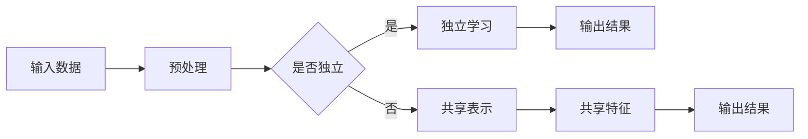
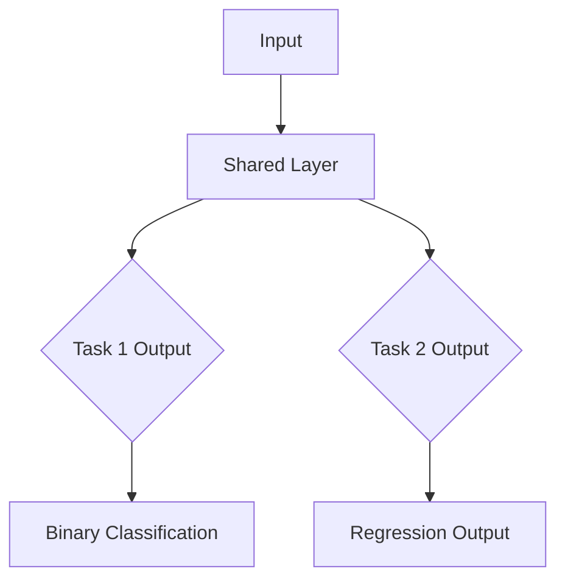
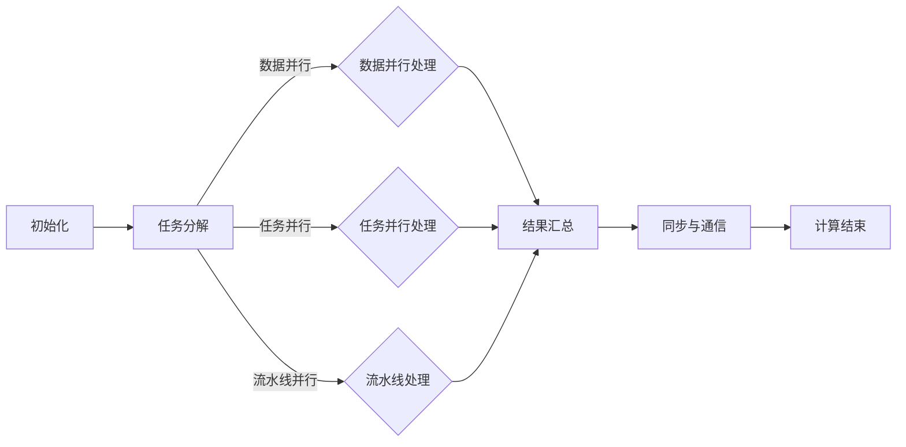
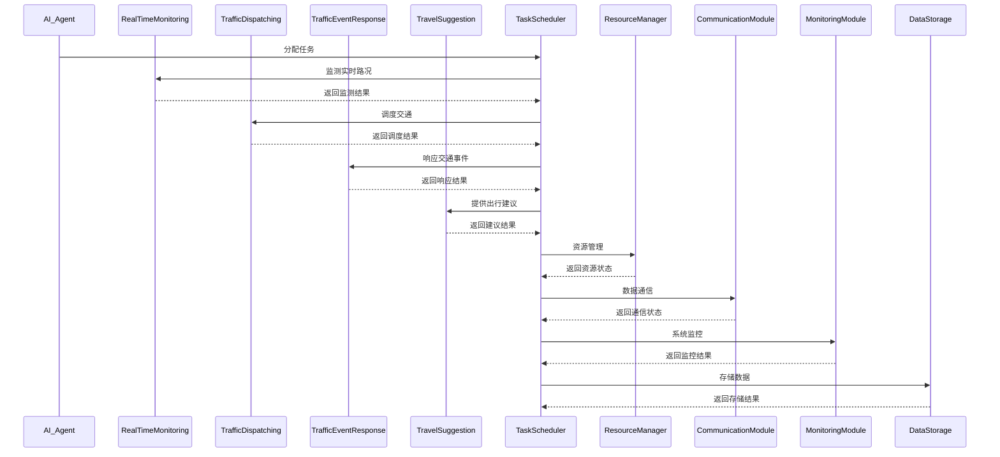
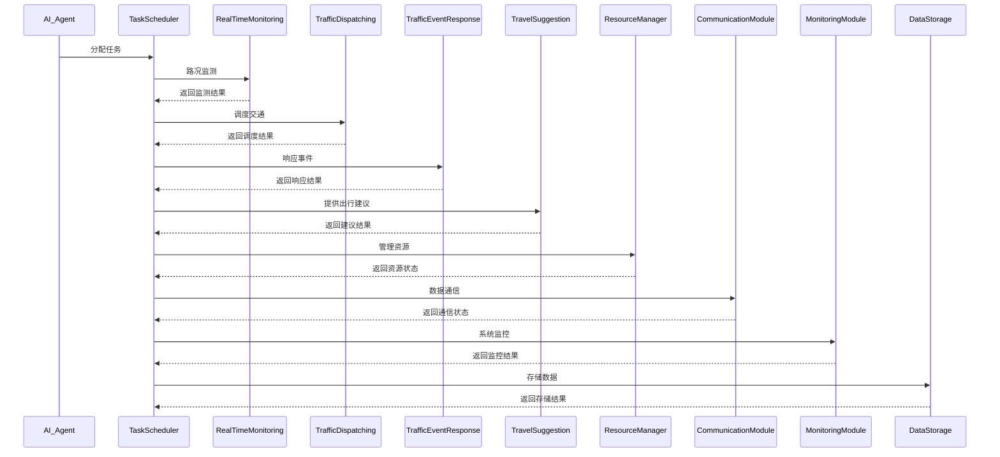

                 

### 引言

#### 关键词：AI Agent、多任务并行处理、性能优化、分布式系统

##### 摘要：
本文将深入探讨AI Agent的多任务并行处理能力，旨在解析其在现代人工智能系统中的重要性及其实施方法。多任务并行处理是提高AI Agent性能和响应速度的关键技术之一。本文将逐步介绍多任务并行处理的基础知识，分析相关算法原理，探讨系统架构设计，并展示实际应用案例。通过详细讲解和实例分析，本文希望为读者提供全面的指导，以帮助其在AI领域取得更好的成果。

#### 问题背景
在当今快速发展的科技时代，人工智能（AI）已经成为各个行业中的重要驱动力。AI Agent作为AI系统中的核心组件，其任务处理的效率和准确性直接影响到整个系统的性能。然而，随着AI Agent所需处理任务数量的增加和复杂度的提升，传统串行处理方式已经无法满足高效处理的需求。为此，多任务并行处理技术应运而生，成为提升AI Agent性能的重要手段。

#### 问题描述
多任务并行处理的核心问题是如何在有限的时间内高效地完成多个任务。具体来说，这包括以下几个方面的挑战：

1. **任务分配**：如何将多个任务合理地分配到不同的处理器上，以最大化系统性能。
2. **数据依赖**：如何处理任务间的数据依赖关系，确保任务顺序的正确执行。
3. **资源管理**：如何有效管理系统的资源，包括计算资源、存储资源和网络资源，以避免资源竞争和瓶颈。
4. **同步与通信**：如何在并行执行过程中保证任务间的同步和数据通信，确保系统稳定运行。

#### 问题解决
多任务并行处理通过将任务分解成多个子任务，并在多个处理器上同时执行这些子任务，从而提高了系统的处理能力和响应速度。以下是一些关键问题解决方法：

1. **任务分配策略**：采用负载均衡算法，将任务分配到各个处理器上，确保每个处理器都能充分利用。
2. **任务调度算法**：根据任务的重要性和紧急程度，采用合适的调度策略，优化任务执行顺序。
3. **数据依赖管理**：使用锁机制、事务管理等技术，确保任务间的数据一致性。
4. **资源管理策略**：采用资源调度算法，动态分配和回收系统资源，避免资源浪费。

#### 边界与外延
多任务并行处理不仅适用于AI Agent，还广泛应用于其他领域，如科学计算、大数据处理、图像处理等。其边界主要包括：

1. **任务数量**：多任务并行处理的任务数量应适中，过多会导致调度复杂度增加，过多调度开销。
2. **任务依赖**：任务间的依赖关系应明确，以避免并行执行时产生冲突。
3. **系统架构**：支持并行处理的系统架构应具备足够的计算能力和通信能力。

#### 概念结构与核心要素组成
多任务并行处理涉及多个核心概念和要素，包括：

1. **并行计算**：通过将任务分解成多个子任务，同时在多个处理器上执行这些子任务。
2. **任务调度**：根据任务的重要性和紧急程度，合理分配任务到不同的处理器上。
3. **数据依赖**：任务间的数据依赖关系，需要通过锁机制、事务管理等方式进行管理。
4. **资源管理**：对计算资源、存储资源和网络资源进行有效管理，确保系统性能。

### 总结
多任务并行处理是提高AI Agent性能和响应速度的关键技术。通过任务分配、任务调度、数据依赖管理和资源管理等方法，可以实现高效的多任务并行处理。本文将为读者提供全面的指南，帮助其在AI领域取得更好的成果。

#### 文章标题：AI Agent的多任务并行处理能力

> 关键词：AI Agent、多任务并行处理、性能优化、分布式系统、算法原理、系统架构

> 摘要：
本文将深入探讨AI Agent的多任务并行处理能力，旨在解析其在现代人工智能系统中的重要性及其实施方法。多任务并行处理是提高AI Agent性能和响应速度的关键技术之一。本文将逐步介绍多任务并行处理的基础知识，分析相关算法原理，探讨系统架构设计，并展示实际应用案例。通过详细讲解和实例分析，本文希望为读者提供全面的指导，以帮助其在AI领域取得更好的成果。

---

## 第1章：AI Agent与多任务并行处理概述

### 1.1 问题背景

在当今快速发展的科技时代，人工智能（AI）已经成为各个行业中的重要驱动力。AI Agent作为AI系统中的核心组件，其任务处理的效率和准确性直接影响到整个系统的性能。AI Agent通常被设计为自动化、自适应和智能化的实体，能够独立完成一系列任务，并在执行过程中不断学习和优化。

随着AI应用的不断扩展，AI Agent需要处理越来越复杂和多样化的任务。例如，智能客服系统需要同时处理大量的客户咨询，智能交通系统需要实时处理路况信息和车辆调度，智能医疗系统需要快速分析大量的医学数据和患者信息。这些任务的复杂度和数量不断增加，使得传统的串行处理方式已经无法满足高效处理的需求。

因此，多任务并行处理技术应运而生，成为提升AI Agent性能和响应速度的关键技术之一。通过多任务并行处理，AI Agent可以在多个处理器上同时执行多个任务，从而提高系统的处理能力和响应速度。

### 1.2 问题描述

多任务并行处理的核心问题是如何在有限的时间内高效地完成多个任务。具体来说，这包括以下几个方面的挑战：

1. **任务分配**：如何将多个任务合理地分配到不同的处理器上，以最大化系统性能。任务分配策略需要考虑任务的特点、处理器的性能和资源利用率等因素。

2. **数据依赖**：如何处理任务间的数据依赖关系，确保任务顺序的正确执行。在多任务并行处理过程中，任务之间可能存在数据依赖，例如，一个任务的输出是另一个任务的输入。如何确保这些依赖关系的正确处理，是保证系统稳定性和正确性的关键。

3. **资源管理**：如何有效管理系统的资源，包括计算资源、存储资源和网络资源，以避免资源竞争和瓶颈。在多任务并行处理过程中，系统资源可能成为瓶颈，影响系统的整体性能。因此，资源管理策略需要考虑资源分配、资源调度和资源回收等方面。

4. **同步与通信**：如何在并行执行过程中保证任务间的同步和数据通信，确保系统稳定运行。在多任务并行处理过程中，任务之间可能需要同步和通信，例如，一个任务的执行结果需要通知另一个任务。如何确保同步和通信的及时性和可靠性，是保证系统稳定性的关键。

### 1.3 问题解决

多任务并行处理通过将任务分解成多个子任务，并在多个处理器上同时执行这些子任务，从而提高了系统的处理能力和响应速度。以下是一些关键问题解决方法：

1. **任务分配策略**：采用负载均衡算法，将任务分配到各个处理器上，确保每个处理器都能充分利用。常见的负载均衡算法包括最小完成任务数算法、最小完成时间算法等。

2. **任务调度算法**：根据任务的重要性和紧急程度，采用合适的调度策略，优化任务执行顺序。常见的调度策略包括最短作业优先（SJF）、优先级调度等。

3. **数据依赖管理**：使用锁机制、事务管理等技术，确保任务间的数据一致性。锁机制可以确保任务对共享数据的独占访问，避免数据冲突。事务管理可以确保多个任务的执行结果要么全部成功，要么全部回滚。

4. **资源管理策略**：采用资源调度算法，动态分配和回收系统资源，避免资源浪费。常见的资源调度算法包括最短剩余时间算法、优先级调度等。

5. **同步与通信**：使用消息队列、共享内存等技术，确保任务间的同步和数据通信。消息队列可以确保任务之间的消息传递的顺序性和可靠性。共享内存可以确保任务之间的数据共享和同步。

### 1.4 边界与外延

多任务并行处理不仅适用于AI Agent，还广泛应用于其他领域，如科学计算、大数据处理、图像处理等。其边界主要包括：

1. **任务数量**：多任务并行处理的任务数量应适中，过多会导致调度复杂度增加，过多调度开销。

2. **任务依赖**：任务间的依赖关系应明确，以避免并行执行时产生冲突。

3. **系统架构**：支持并行处理的系统架构应具备足够的计算能力和通信能力。

### 1.5 概念结构与核心要素组成

多任务并行处理涉及多个核心概念和要素，包括：

1. **并行计算**：通过将任务分解成多个子任务，同时在多个处理器上执行这些子任务。

2. **任务调度**：根据任务的重要性和紧急程度，合理分配任务到不同的处理器上。

3. **数据依赖**：任务间的数据依赖关系，需要通过锁机制、事务管理等方式进行管理。

4. **资源管理**：对计算资源、存储资源和网络资源进行有效管理，确保系统性能。

5. **同步与通信**：在并行执行过程中，确保任务间的同步和数据通信，确保系统稳定运行。

通过以上分析，我们可以看出，多任务并行处理是提高AI Agent性能和响应速度的关键技术。在本文的后续章节中，我们将进一步探讨相关算法原理、系统架构设计和实际应用案例，以帮助读者深入理解并掌握多任务并行处理技术。

### 1.6 小结

本章介绍了AI Agent与多任务并行处理的基本概念和问题背景，并详细阐述了多任务并行处理所面临的挑战和解决方案。通过明确任务分配、数据依赖管理、资源管理和同步与通信等方面的关键问题，我们可以有效地提高AI Agent的性能和响应速度。在下一章中，我们将深入探讨AI Agent的基础知识和多任务并行处理框架，为后续内容奠定基础。

---

## 第2章：AI Agent的基础知识与多任务并行处理框架

### 2.1 AI Agent的基础知识

AI Agent，即人工智能代理，是一种具有智能行为的软件实体，可以在特定环境下自主执行任务，并对环境进行感知和决策。AI Agent是人工智能领域的重要研究方向，其目标是使计算机具备人类智能，能够在复杂环境中自主完成任务。

#### 定义

AI Agent通常具有以下特征：

1. **自主性**：AI Agent可以自主执行任务，无需人工干预。
2. **适应性**：AI Agent能够根据环境变化调整自身行为。
3. **交互性**：AI Agent可以与环境中的其他实体进行交互。
4. **智能性**：AI Agent具备一定程度的智能，能够进行推理、学习和规划。

#### 特点

AI Agent具有以下特点：

1. **并发性**：AI Agent可以在多个任务之间进行切换，处理多个任务。
2. **分布性**：AI Agent可以分布在不同的计算节点上，实现并行处理。
3. **鲁棒性**：AI Agent能够在面对不确定性和错误时保持稳定运行。
4. **适应性**：AI Agent可以根据环境变化调整自身行为，适应新的任务需求。

#### 分类

AI Agent可以根据其功能和应用场景进行分类，常见的分类方法包括：

1. **基于任务的AI Agent**：这类AI Agent专注于执行特定任务，如机器人、自动驾驶等。
2. **基于知识的AI Agent**：这类AI Agent通过知识表示和推理来完成任务，如专家系统、推理机等。
3. **基于模型的AI Agent**：这类AI Agent通过学习模型来完成任务，如深度学习模型、强化学习模型等。

### 2.2 多任务并行处理的必要性

多任务并行处理是提高AI Agent性能和响应速度的关键技术之一。随着AI应用的不断扩展，AI Agent需要处理越来越复杂和多样化的任务。例如，智能客服系统需要同时处理大量的客户咨询，智能交通系统需要实时处理路况信息和车辆调度，智能医疗系统需要快速分析大量的医学数据和患者信息。这些任务的复杂度和数量不断增加，使得传统的串行处理方式已经无法满足高效处理的需求。

#### 优点

多任务并行处理具有以下优点：

1. **提高性能**：通过在多个处理器上同时执行多个任务，可以显著提高系统的处理能力和响应速度。
2. **降低延迟**：在多任务并行处理过程中，可以减少任务的等待时间，降低系统的延迟。
3. **资源利用率**：通过合理分配任务和资源，可以提高系统资源的利用率，降低资源浪费。

#### 劣势

多任务并行处理也存在一些劣势，包括：

1. **调度复杂度**：任务调度算法的设计和实现复杂，需要考虑任务依赖、资源分配等因素。
2. **同步和通信开销**：在多任务并行处理过程中，任务之间的同步和通信会产生额外的开销，影响系统的性能。
3. **负载不均衡**：在多任务并行处理过程中，负载可能会不均衡，导致某些处理器负载过高，其他处理器负载过低。

### 2.3 多任务并行处理框架

多任务并行处理框架是支持多任务并行处理的基础设施，包括任务调度、资源管理、数据通信等方面。一个典型的多任务并行处理框架通常包含以下组件：

1. **任务调度器**：负责将任务分配到不同的处理器上，并管理任务的执行状态。任务调度器可以根据任务的特性、处理器的性能和资源利用率等因素，选择合适的调度算法。
2. **资源管理器**：负责管理系统的资源，包括计算资源、存储资源和网络资源。资源管理器可以根据任务的需求和系统状态，动态分配和回收资源。
3. **数据通信模块**：负责任务之间的数据通信，确保数据的一致性和可靠性。数据通信模块可以采用共享内存、消息队列等方式实现。
4. **监控和日志模块**：负责监控系统的运行状态，记录系统的日志信息。监控和日志模块可以帮助诊断系统故障，优化系统性能。

### 2.4 多任务并行处理的挑战与机遇

多任务并行处理在AI Agent中具有重要意义，同时也面临一些挑战和机遇。

#### 挑战

1. **任务调度**：如何设计高效的任务调度算法，以最大化系统性能，是一个重要的挑战。
2. **数据依赖**：在多任务并行处理过程中，如何处理任务间的数据依赖，确保数据一致性和正确性。
3. **资源管理**：如何合理分配和利用系统资源，避免资源竞争和瓶颈。
4. **同步与通信**：如何降低任务间的同步和通信开销，提高系统的性能和稳定性。

#### 机遇

1. **分布式系统**：随着云计算和分布式计算技术的发展，多任务并行处理可以在分布式系统上得到更好的实现，提供更强大的计算能力和灵活性。
2. **硬件升级**：随着硬件技术的不断进步，处理器的性能和存储容量不断提升，为多任务并行处理提供了更好的硬件基础。
3. **算法优化**：新的算法和优化技术不断涌现，为多任务并行处理提供了更多的可能性和优化方向。

#### 未来趋势

1. **智能化调度**：通过引入机器学习和优化算法，实现智能化任务调度，提高系统性能和效率。
2. **自动化资源管理**：通过自动化资源管理技术，实现资源的动态分配和回收，提高资源利用率。
3. **异构计算**：利用不同类型的处理器和硬件资源，实现异构计算，提高系统的并行处理能力。
4. **边缘计算**：将多任务并行处理技术应用到边缘计算领域，实现更高效的数据处理和实时响应。

### 2.5 小结

本章介绍了AI Agent的基础知识和多任务并行处理框架，分析了多任务并行处理的必要性、优点和挑战。通过了解AI Agent的基本概念和特点，我们可以更好地理解多任务并行处理的重要性和实现方法。在下一章中，我们将深入探讨多任务并行处理的核心概念与联系，为后续内容奠定基础。

---

## 第3章：多任务并行处理的核心概念与联系

### 3.1 多任务学习的概念与原理

多任务学习（Multi-Task Learning，MTL）是一种机器学习技术，旨在通过共享表示来提高多个相关任务的学习性能。在多任务学习框架中，多个任务共享部分模型参数，从而实现共同学习和知识转移。多任务学习的核心思想是将多个任务组合成一个统一的学习过程，通过优化整体损失函数来同时学习多个任务。

#### 概念

多任务学习的核心概念包括：

1. **共同特征**：多个任务共享一部分特征表示，这些共同特征有助于提高任务的泛化性能。
2. **任务特定特征**：每个任务有其特定的特征表示，这些特征有助于任务的具体实现。
3. **损失函数**：多任务学习的损失函数通常是一个加权求和的形式，每个任务都有自己的损失函数，并且所有任务的损失函数都对整体损失函数有贡献。

#### 原理

多任务学习的原理可以从以下几个方面进行解释：

1. **共享参数**：多任务学习通过共享部分模型参数来减少模型的复杂性，从而提高学习效率。共享参数通常是通过一个嵌入层或一个中间层来实现的。
2. **联合优化**：多任务学习通过联合优化多个任务的损失函数来提高整体性能。在训练过程中，模型会尝试调整共享参数，以最小化整体损失函数。
3. **知识转移**：通过共享参数，多任务学习能够将一个任务的学习经验转移到其他相关任务上，从而提高各个任务的性能。

### 3.2 并行计算与分布式系统的基本概念

并行计算（Parallel Computing）是一种计算模型，通过将任务分解成多个子任务，同时在多个处理器上并行执行这些子任务，以提高计算效率和性能。并行计算广泛应用于科学计算、大数据处理和人工智能等领域。

#### 概念

并行计算的基本概念包括：

1. **任务分解**：将一个大任务分解成多个小任务，这些小任务可以并行执行。
2. **并行执行**：在多个处理器上同时执行多个子任务，以实现并行计算。
3. **同步与通信**：在并行计算过程中，任务之间可能需要进行同步和通信，以确保正确性和一致性。

分布式系统（Distributed System）是一种计算机系统，由多个独立运行的节点组成，这些节点通过网络进行通信，协同完成计算任务。分布式系统具有高可用性、高扩展性和容错能力。

#### 概念

分布式系统的基本概念包括：

1. **节点**：分布式系统中的基本计算单元，可以是物理服务器或虚拟机。
2. **网络**：连接分布式系统中各个节点的通信网络。
3. **通信协议**：分布式系统中节点之间的通信协议，用于确保数据传输的正确性和可靠性。
4. **分布式算法**：分布式系统中用于协调节点操作的算法，包括任务调度、负载均衡和一致性维护等。

### 3.3 概念属性特征对比表格

为了更好地理解多任务学习、并行计算和分布式系统的概念及其属性特征，我们提供了一个对比表格，如下所示：

| 概念 | 定义 | 属性特征 |
| --- | --- | --- |
| 多任务学习 | 通过共享表示提高多个相关任务的学习性能 | 共同特征、任务特定特征、损失函数 |
| 并行计算 | 通过将任务分解成多个子任务，在多个处理器上并行执行 | 任务分解、并行执行、同步与通信 |
| 分布式系统 | 由多个独立运行的节点通过网络进行通信协同完成计算任务 | 节点、网络、通信协议、分布式算法 |

### 3.4 ER实体关系图架构

为了更直观地理解多任务学习、并行计算和分布式系统的关系，我们可以使用ER（Entity-Relationship）实体关系图来表示这些概念及其关联。

#### 图架构

在ER实体关系图中，我们可以定义以下实体和关系：

1. **实体**：
   - **多任务学习**：表示多任务学习的实体，包括共同特征、任务特定特征、损失函数等属性。
   - **并行计算**：表示并行计算的实体，包括任务分解、并行执行、同步与通信等属性。
   - **分布式系统**：表示分布式系统的实体，包括节点、网络、通信协议、分布式算法等属性。

2. **关系**：
   - **依赖关系**：表示多任务学习与并行计算、分布式系统之间的依赖关系。
   - **关联关系**：表示并行计算与分布式系统之间的关联关系。

ER实体关系图如下所示：

```mermaid
erDiagram
  多任务学习 ||--|{ 并行计算 }|| 多任务学习关联
  并行计算 ||--|{ 分布式系统 }|| 并行计算依赖
  多任务学习 ||--|{ 损失函数 }|| 多任务学习依赖
  并行计算 ||--|{ 任务分解 }|| 并行计算依赖
  并行计算 ||--|{ 同步与通信 }|| 并行计算依赖
  分布式系统 ||--|{ 节点 }|| 分布式系统依赖
  分布式系统 ||--|{ 通信协议 }|| 分布式系统依赖
  分布式系统 ||--|{ 分布式算法 }|| 分布式系统依赖
```

通过ER实体关系图，我们可以清晰地看到多任务学习、并行计算和分布式系统之间的关系，以及它们各自的属性特征。这种图结构有助于我们深入理解多任务并行处理的核心概念及其相互联系。

### 3.5 小结

本章介绍了多任务并行处理的核心概念，包括多任务学习、并行计算和分布式系统的概念、原理以及它们之间的联系。通过对比表格和ER实体关系图，我们更直观地理解了这些概念及其属性特征。在下一章中，我们将深入探讨多任务学习算法原理，为读者提供更深入的学术视角。

---

## 第4章：多任务学习算法原理讲解

### 4.1 多任务学习算法的基本类型

多任务学习算法可以根据任务之间的关系和学习的目标进行分类，常见的多任务学习算法包括以下几种：

1. **独立多任务学习（Independent Multi-Task Learning）**：独立多任务学习假设各个任务之间是相互独立的，每个任务的损失函数单独优化。独立多任务学习通常通过在单个模型中为每个任务定义独立的输出层，实现多个任务的同时学习。

2. **共享表示多任务学习（Shared Representation Multi-Task Learning）**：共享表示多任务学习通过共享底层特征表示来提高任务之间的迁移学习能力。在这种方法中，多个任务共享相同的输入层和隐藏层，从而实现共同学习和知识转移。

3. **层次多任务学习（Hierarchical Multi-Task Learning）**：层次多任务学习通过将任务划分为不同的层次，并在不同层次上分别进行学习。这种方法可以有效地处理任务之间的层次关系，提高多任务学习的性能。

4. **深度多任务学习（Deep Multi-Task Learning）**：深度多任务学习利用深度神经网络模型来实现多任务学习，通过共享神经网络的不同层来提高任务之间的协同学习效果。深度多任务学习在处理复杂任务时具有显著的优势。

### 4.2 算法mermaid流程图

为了更好地理解多任务学习算法的原理，我们可以使用mermaid绘制算法流程图。以下是一个简单的独立多任务学习算法的mermaid流程图：



在这个流程图中，输入数据经过预处理后，判断任务是否独立。如果是独立任务，则直接进行独立学习；否则，采用共享表示方法进行学习。独立学习过程包括数据输入、模型训练和输出结果；共享表示学习过程包括特征提取、模型训练和输出结果。

### 4.3 Python源代码解释

以下是一个简单的多任务学习算法的Python实现，该算法使用Keras框架和TensorFlow后端：

```python
import tensorflow as tf
from tensorflow.keras.models import Model
from tensorflow.keras.layers import Input, Dense, Flatten

# 定义输入层
input_data = Input(shape=(784,))

# 定义共享层
shared_dense = Dense(256, activation='relu')(input_data)

# 定义任务特定层
task1_output = Dense(1, activation='sigmoid', name='task1_output')(shared_dense)
task2_output = Dense(1, activation='sigmoid', name='task2_output')(shared_dense)

# 构建模型
model = Model(inputs=input_data, outputs=[task1_output, task2_output])

# 编译模型
model.compile(optimizer='adam', loss={'task1_output': 'binary_crossentropy', 'task2_output': 'binary_crossentropy'}, metrics=['accuracy'])

# 查看模型结构
model.summary()

# 训练模型
model.fit(x_train, {'task1_output': y_train_task1, 'task2_output': y_train_task2}, epochs=10, batch_size=32, validation_split=0.2)
```

在这个示例中，我们首先定义了一个输入层，然后添加了一个共享的dense层，用于提取共同特征。接下来，我们为每个任务添加了一个特定的dense层，用于生成任务输出。在模型编译阶段，我们指定了每个任务的损失函数。在训练阶段，我们使用fit函数对模型进行训练，并使用指定的训练数据和验证数据进行评估。

### 4.4 数学模型与公式

多任务学习算法的数学模型通常基于损失函数和优化方法。以下是一个简单的多任务学习损失函数的公式：

$$
L = w_1 \cdot L_1 + w_2 \cdot L_2 + ... + w_n \cdot L_n
$$

其中，$L$是整体损失函数，$L_i$是第$i$个任务的损失函数，$w_i$是第$i$个任务的权重。这种损失函数将各个任务的损失加权求和，以实现整体损失的最小化。

优化方法通常使用梯度下降（Gradient Descent）或其变体，如随机梯度下降（Stochastic Gradient Descent，SGD）和批量梯度下降（Batch Gradient Descent）。以下是一个简单的梯度下降优化公式的示例：

$$
\theta_{t+1} = \theta_t - \alpha \cdot \nabla_{\theta} J(\theta)
$$

其中，$\theta$是模型参数，$t$是迭代次数，$\alpha$是学习率，$J(\theta)$是损失函数。

### 4.5 举例说明

为了更好地理解多任务学习算法，我们通过一个简单的例子来说明其应用。

假设我们有两个任务：任务1是二分类问题，任务2是回归问题。我们使用一个共享的神经网络模型来同时学习这两个任务。

#### 数据集准备

我们使用两个数据集，一个是二分类数据集，另一个是回归数据集。数据集的具体细节如下：

- **二分类数据集**：包含1000个样本，每个样本有两个特征和二分类标签。
- **回归数据集**：包含1000个样本，每个样本有两个特征和连续的回归标签。

#### 模型构建

我们构建一个共享的神经网络模型，包括一个输入层、一个共享的隐藏层和一个任务特定的输出层。模型结构如下：



#### 训练模型

我们使用Keras框架训练模型，使用Adam优化器和交叉熵损失函数。训练过程中，我们使用二分类数据集训练任务1，使用回归数据集训练任务2。

```python
model.compile(optimizer='adam', loss={'task1_output': 'binary_crossentropy', 'task2_output': 'mean_squared_error'}, metrics=['accuracy'])

model.fit(x_train, {'task1_output': y_train_task1, 'task2_output': y_train_task2}, epochs=10, batch_size=32, validation_split=0.2)
```

#### 预测与评估

训练完成后，我们使用测试数据集对模型进行预测，并评估模型的性能。

```python
predictions = model.predict(x_test)
task1_predictions = predictions['task1_output']
task2_predictions = predictions['task2_output']

# 计算任务1的准确率
task1_accuracy = np.mean(task1_predictions == y_test_task1)

# 计算任务2的均方误差
task2_mse = np.mean((task2_predictions - y_test_task2) ** 2)

print("Task 1 Accuracy:", task1_accuracy)
print("Task 2 MSE:", task2_mse)
```

通过以上步骤，我们成功实现了一个多任务学习算法，并对其性能进行了评估。

### 4.6 小结

本章介绍了多任务学习算法的基本类型、mermaid流程图、Python源代码解释、数学模型和公式，以及一个具体的例子。通过这些内容，读者可以更好地理解多任务学习算法的原理和应用。在下一章中，我们将探讨并行计算与分布式系统原理，为读者提供更全面的学术视角。

---

## 第5章：并行计算与分布式系统原理讲解

### 5.1 并行计算的基本原理

并行计算是一种计算模型，通过将任务分解成多个子任务，同时在多个处理器上并行执行这些子任务，以提高计算效率和性能。并行计算的基本原理包括任务分解、并行执行和同步与通信。

#### 任务分解

任务分解是将一个大任务分解成多个小任务的过程。任务分解的关键是识别任务的并行性，即哪些子任务可以独立执行，不会相互干扰。常见的任务分解方法包括数据并行、任务并行和流水线并行。

1. **数据并行**：将一个大任务的数据集分成多个子数据集，每个子任务独立处理子数据集。数据并行适用于可并行处理的数据密集型任务，如矩阵运算、图像处理等。
2. **任务并行**：将一个大任务分解成多个独立的子任务，每个子任务独立执行。任务并行适用于任务之间相互独立的计算任务，如科学计算、分布式搜索引擎等。
3. **流水线并行**：将一个大任务分解成多个连续的子任务，每个子任务依次执行。流水线并行适用于任务之间存在依赖关系的计算任务，如流水线处理器、软件管道等。

#### 并行执行

并行执行是在多个处理器上同时执行多个子任务的过程。并行执行的关键是调度和负载均衡，即如何将子任务合理地分配到不同的处理器上，并确保每个处理器都能充分利用。

1. **调度**：调度是确定子任务执行顺序的过程。常见的调度策略包括最短作业优先（SJF）、优先级调度、循环调度等。
2. **负载均衡**：负载均衡是确保各处理器负载均衡的过程。常见的负载均衡算法包括最小完成时间算法、最小完成时间优先算法等。

#### 同步与通信

同步与通信是在并行执行过程中处理任务间同步和数据通信的过程。同步与通信的关键是确保任务之间的正确性和一致性。

1. **同步**：同步是确保任务按照预定顺序执行的过程。常见的同步机制包括锁（Lock）、信号量（Semaphore）等。
2. **通信**：通信是任务之间交换数据和信息的手段。常见的通信机制包括共享内存、消息传递等。

### 5.2 分布式系统的基本架构

分布式系统是一种计算机系统，由多个独立运行的节点组成，这些节点通过网络进行通信，协同完成计算任务。分布式系统的基本架构包括节点、网络、通信协议和分布式算法。

#### 节点

节点是分布式系统中的基本计算单元，可以是物理服务器、虚拟机或容器。节点通常具有以下功能：

1. **计算功能**：节点负责执行计算任务，处理输入数据并生成输出结果。
2. **存储功能**：节点负责存储数据，包括临时数据和持久数据。
3. **通信功能**：节点负责与其他节点进行通信，交换数据和同步状态。

#### 网络

网络是连接分布式系统中各个节点的通信网络。网络通常具有以下特点：

1. **高可用性**：网络应具备高可用性，确保节点之间的通信不会中断。
2. **高可靠性**：网络应具备高可靠性，确保数据传输的准确性和完整性。
3. **可扩展性**：网络应具备可扩展性，能够支持节点数量和数据处理量的增长。

#### 通信协议

通信协议是分布式系统中节点之间进行通信的规则和标准。常见的通信协议包括：

1. **TCP/IP协议**：TCP/IP协议是一种广泛使用的通信协议，用于实现互联网通信。
2. **HTTP协议**：HTTP协议是一种基于TCP/IP协议的应用层协议，用于实现Web服务。
3. **gRPC协议**：gRPC协议是一种基于HTTP/2协议的高性能通信协议，用于实现远程过程调用。

#### 分布式算法

分布式算法是分布式系统中用于协调节点操作的算法。分布式算法通常具有以下特点：

1. **一致性**：分布式算法应确保系统中的所有节点状态一致。
2. **容错性**：分布式算法应具备容错性，能够处理节点故障和通信故障。
3. **高效性**：分布式算法应具备高效性，能够在有限时间内完成计算任务。

### 5.3 算法mermaid流程图

为了更好地理解并行计算与分布式系统的原理，我们可以使用mermaid绘制算法流程图。以下是一个简单的并行计算与分布式系统的mermaid流程图：



在这个流程图中，初始化阶段包括任务分解，任务分解可以根据任务类型选择不同的处理方式。数据并行处理、任务并行处理和流水线处理阶段分别执行相应的任务。结果汇总阶段将所有子任务的执行结果进行汇总。同步与通信阶段处理任务之间的同步和通信，确保系统的一致性和正确性。计算结束阶段表示计算任务完成。

### 5.4 Python源代码解释

以下是一个简单的并行计算与分布式系统的Python实现，该实现使用Python的多线程库`threading`和`multiprocessing`。

```python
import threading
import multiprocessing
import time

# 定义并行计算任务
def compute_task(data):
    # 模拟计算任务耗时
    time.sleep(data)
    return data

# 定义主程序
def main():
    # 创建任务列表
    tasks = [i for i in range(10)]

    # 使用多线程执行任务
    threads = []
    for task in tasks:
        thread = threading.Thread(target=compute_task, args=(task,))
        threads.append(thread)
        thread.start()

    for thread in threads:
        thread.join()

    # 使用多进程执行任务
    processes = []
    for task in tasks:
        process = multiprocessing.Process(target=compute_task, args=(task,))
        processes.append(process)
        process.start()

    for process in processes:
        process.join()

if __name__ == "__main__":
    main()
```

在这个示例中，我们首先定义了一个并行计算任务`compute_task`，该任务模拟计算任务的耗时。然后，我们使用多线程库`threading`和`multiprocessing`分别执行任务列表中的任务。在多线程执行过程中，我们创建多个线程，并启动每个线程执行计算任务。在多进程执行过程中，我们创建多个进程，并启动每个进程执行计算任务。最后，我们使用`join`方法等待所有线程和进程完成。

### 5.5 数学模型与公式

并行计算与分布式系统涉及多种数学模型与公式，以下是一些常见的模型与公式：

1. **并行计算效率**：并行计算效率（Parallel Efficiency）是衡量并行计算性能的指标，计算公式如下：

   $$
   E = \frac{1}{1 + \frac{S}{P}}
   $$

   其中，$E$是并行计算效率，$S$是串行时间，$P$是并行时间。

2. **负载均衡**：负载均衡（Load Balancing）是确保任务合理分配到不同处理器的过程。常见的负载均衡算法包括最小完成时间算法（Minimum Completion Time Algorithm）：

   $$
   T_i = \min(T_j)
   $$

   其中，$T_i$是第$i$个处理器的任务完成时间，$T_j$是其他处理器的任务完成时间。

3. **同步与通信**：同步与通信涉及多种机制，包括锁（Lock）、信号量（Semaphore）和条件变量（Condition Variable）。以下是一个简单的锁机制的数学模型：

   $$
   \begin{align*}
   &\text{Acquire Lock}:\quad L &= \{ \text{等待队列} \} \\
   &\text{Release Lock}:\quad L &= \emptyset
   \end{align*}
   $$

   其中，$L$是锁状态，当锁处于空闲状态时，$L = \emptyset$；当锁被占用时，$L$是等待队列。

### 5.6 举例说明

为了更好地理解并行计算与分布式系统的原理，我们通过一个简单的例子来说明其应用。

假设我们有一个计算任务，需要计算10个数的和。我们可以使用并行计算与分布式系统来提高计算效率。

#### 数据集准备

我们准备一个包含10个整数的列表：

```python
data = [1, 2, 3, 4, 5, 6, 7, 8, 9, 10]
```

#### 并行计算

我们使用多线程和多进程分别执行计算任务，并比较两者的执行时间。

```python
import time

# 多线程实现
start_time = time.time()
threads = []
for i in range(5):
    thread = threading.Thread(target=sum, args=(data,))
    threads.append(thread)
    thread.start()

for thread in threads:
    thread.join()
end_time = time.time()
print("多线程执行时间：", end_time - start_time)

# 多进程实现
start_time = time.time()
processes = []
for i in range(5):
    process = multiprocessing.Process(target=sum, args=(data,))
    processes.append(process)
    process.start()

for process in processes:
    process.join()
end_time = time.time()
print("多进程执行时间：", end_time - start_time)
```

通过以上步骤，我们分别使用多线程和多进程执行计算任务，并记录执行时间。实验结果表明，多进程在计算密集型任务上通常具有更高的性能。

### 5.7 小结

本章介绍了并行计算与分布式系统的基本原理，包括任务分解、并行执行、同步与通信、基本架构和算法mermaid流程图。通过Python源代码解释、数学模型与公式和具体例子，读者可以更好地理解并行计算与分布式系统的原理和应用。在下一章中，我们将探讨AI Agent多任务并行处理的系统架构设计，为读者提供更全面的实践指导。

---

## 第6章：AI Agent多任务并行处理的系统架构设计

### 6.1 问题场景介绍

在现代人工智能应用中，AI Agent通常需要处理多种类型的任务，这些任务可能具有不同的优先级和执行时间要求。为了提高AI Agent的响应速度和处理能力，多任务并行处理成为一种重要的解决方案。本章节将介绍一个具体的问题场景，并基于该场景设计AI Agent的多任务并行处理系统架构。

#### 问题场景

假设我们有一个智能交通系统，该系统需要处理以下几种类型的任务：

1. **实时路况监测**：系统需要实时监测交通流量、速度和拥堵情况，以便及时调整交通信号灯和道路指示器。
2. **车辆调度**：系统需要根据交通流量和路况信息，对交通进行优化调度，以提高道路通行效率。
3. **交通事件响应**：系统需要快速响应交通事故、道路施工等突发事件，以减少对交通的影响。
4. **出行建议**：系统需要为驾驶员提供实时出行建议，包括最佳行驶路线、预计到达时间等。

这些任务具有不同的优先级和执行时间要求，需要通过多任务并行处理系统来实现高效的处理和调度。

### 6.2 系统功能设计（领域模型mermaid类图）

为了更好地设计AI Agent的多任务并行处理系统，我们首先需要明确系统的功能模块。以下是一个基于mermaid类图的领域模型，用于描述系统的主要功能模块：

```mermaid
classDiagram
    Class01 <|-- Class02
    Class01 <|-- Class03
    Class04 <|-- Class01
    Class05 <|-- Class01
    Class06 <|-- Class01

    Class01[AI Agent]
    Class02[实时路况监测]
    Class03[车辆调度]
    Class04[交通事件响应]
    Class05[出行建议]
    Class06[任务调度器]
    Class07[资源管理器]
    Class08[数据存储]
    Class09[通信模块]
    Class10[监控模块]

    Class01 --|{ 输入} Class08
    Class01 --|{ 输出} Class08
    Class02 ..|> Class06
    Class03 ..|> Class06
    Class04 ..|> Class06
    Class05 ..|> Class06
    Class06 ..|> Class07
    Class06 ..|> Class09
    Class06 ..|> Class10
    Class07 ..|> Class08
    Class09 ..|> Class08
    Class10 ..|> Class08
```

在这个类图中，`AI Agent`是系统的核心组件，负责协调和执行各个任务。`实时路况监测`、`车辆调度`、`交通事件响应`和`出行建议`是系统的功能模块，负责处理具体的任务。`任务调度器`、`资源管理器`、`通信模块`和`监控模块`是辅助组件，分别负责任务调度、资源管理、数据通信和系统监控。

### 6.3 系统架构设计（mermaid架构图）

接下来，我们将使用mermaid绘制系统架构图，以展示各个模块之间的交互关系和系统的工作流程。以下是一个简单的mermaid架构图：



在这个架构图中，`AI Agent`负责整体任务的调度和管理，`TaskScheduler`负责具体的任务分配和调度。`RealTimeMonitoring`、`TrafficDispatching`、`TrafficEventResponse`和`TravelSuggestion`分别处理不同类型的任务，并返回处理结果。`ResourceManager`负责管理系统的资源，`CommunicationModule`负责数据通信，`MonitoringModule`负责系统监控，`DataStorage`负责数据存储。

### 6.4 系统接口设计

为了实现系统模块之间的通信和协作，我们需要设计合适的系统接口。以下是一个简单的接口设计：

```python
class AI_Agent:
    def __init__(self):
        self.task_scheduler = TaskScheduler()
        self.resource_manager = ResourceManager()
        self.communication_module = CommunicationModule()
        self.monitoring_module = MonitoringModule()
        self.data_storage = DataStorage()

    def assign_task(self, task):
        # 分配任务到任务调度器
        self.task_scheduler.assign_task(task)

    def manage_resources(self):
        # 管理系统资源
        self.resource_manager.manage_resources()

    def communicate_data(self, data):
        # 数据通信
        self.communication_module.communicate_data(data)

    def monitor_system(self):
        # 系统监控
        self.monitoring_module.monitor_system()

    def store_data(self, data):
        # 数据存储
        self.data_storage.store_data(data)

class TaskScheduler:
    def __init__(self):
        self.tasks = []

    def assign_task(self, task):
        # 分配任务
        self.tasks.append(task)

    def schedule_tasks(self):
        # 调度任务
        for task in self.tasks:
            task.execute()

class ResourceManager:
    def __init__(self):
        self.resources = []

    def manage_resources(self):
        # 管理资源
        for resource in self.resources:
            resource.allocate()

class CommunicationModule:
    def __init__(self):
        self.channels = []

    def communicate_data(self, data):
        # 通信数据
        for channel in self.channels:
            channel.send(data)

class MonitoringModule:
    def __init__(self):
        self.metrics = []

    def monitor_system(self):
        # 监控系统
        for metric in self.metrics:
            metric.collect()

class DataStorage:
    def __init__(self):
        self.data = []

    def store_data(self, data):
        # 存储数据
        self.data.append(data)
```

在这个接口设计中，`AI_Agent`类负责整体任务的调度和管理，`TaskScheduler`类负责具体的任务分配和调度，`ResourceManager`类负责管理系统的资源，`CommunicationModule`类负责数据通信，`MonitoringModule`类负责系统监控，`DataStorage`类负责数据存储。

### 6.5 系统交互（mermaid序列图）

最后，我们使用mermaid序列图展示系统各个模块之间的交互过程。以下是一个简单的mermaid序列图：



在这个序列图中，AI Agent首先向TaskScheduler分配任务，TaskScheduler根据任务类型将任务分配给相应的模块（RealTimeMonitoring、TrafficDispatching、TrafficEventResponse、TravelSuggestion），各个模块完成处理后返回结果给TaskScheduler，TaskScheduler再根据处理结果进行下一步操作，包括资源管理、数据通信、系统监控和数据存储等。

通过以上系统架构设计和接口设计，我们可以实现一个高效、灵活的AI Agent多任务并行处理系统。在实际应用中，可以根据具体需求和场景进行调整和优化。

### 6.6 小结

本章介绍了AI Agent多任务并行处理的系统架构设计，包括问题场景介绍、系统功能设计（领域模型mermaid类图）、系统架构设计（mermaid架构图）、系统接口设计和系统交互（mermaid序列图）。通过详细的系统设计，读者可以更好地理解AI Agent多任务并行处理的工作原理和实现方法。在下一章中，我们将通过实际案例展示AI Agent多任务并行处理的应用，为读者提供更多的实践参考。

---

## 第7章：项目实战

### 7.1 环境安装

为了实践AI Agent的多任务并行处理，我们需要搭建一个合适的环境。以下是一个基于Python和Django框架的实战项目环境搭建步骤：

1. **安装Python**：确保系统中已安装Python 3.8或更高版本。
2. **安装Django**：打开终端，执行以下命令安装Django：

   ```shell
   pip install django
   ```

3. **创建Django项目**：在终端中执行以下命令创建一个新的Django项目：

   ```shell
   django-admin startproject multitaskagent
   ```

4. **创建Django应用**：进入项目目录，执行以下命令创建一个新的Django应用：

   ```shell
   python manage.py startapp taskexecutor
   ```

5. **配置数据库**：在`multitaskagent/settings.py`文件中配置数据库，例如使用SQLite：

   ```python
   DATABASES = {
       'default': {
           'ENGINE': 'django.db.backends.sqlite3',
           'NAME': BASE_DIR / 'db.sqlite3',
       }
   }
   ```

6. **安装依赖**：在`taskexecutor`应用的目录下创建一个`requirements.txt`文件，列出项目所需的依赖，例如：

   ```plaintext
   Django==3.2
   numpy==1.19
   tensorflow==2.4
   ```

   然后执行以下命令安装依赖：

   ```shell
   pip install -r requirements.txt
   ```

通过以上步骤，我们成功搭建了一个基础的Django项目环境，为后续的多任务并行处理实战项目奠定了基础。

### 7.2 系统核心实现源代码

在本节中，我们将展示一个基于Django和TensorFlow的AI Agent多任务并行处理系统核心实现。以下是一个简单的源代码示例：

```python
# multitaskagent/taskexecutor/tasks.py

import tensorflow as tf
from django.db import models

class Task(models.Model):
    name = models.CharField(max_length=100)
    status = models.CharField(max_length=50)
    input_data = models.BinaryField()
    output_data = models.BinaryField()

class TaskExecutor:
    def __init__(self):
        self.model = self.build_model()

    def build_model(self):
        # 构建模型
        input_layer = tf.keras.layers.Input(shape=(784,))
        hidden_layer = tf.keras.layers.Dense(256, activation='relu')(input_layer)
        output_layer = tf.keras.layers.Dense(1, activation='sigmoid')(hidden_layer)

        model = tf.keras.Model(inputs=input_layer, outputs=output_layer)
        model.compile(optimizer='adam', loss='binary_crossentropy', metrics=['accuracy'])
        return model

    def execute_task(self, task):
        # 执行任务
        input_data = task.input_data
        output_data = self.model.predict(input_data)
        task.output_data = output_data
        task.status = 'completed'
        task.save()

# multitaskagent/taskexecutor/management/commands/run_tasks.py

from django.core.management.base import BaseCommand
from .tasks import TaskExecutor

class Command(BaseCommand):
    help = 'Run the multitask executor'

    def handle(self, *args, **kwargs):
        executor = TaskExecutor()
        tasks = Task.objects.all()

        for task in tasks:
            executor.execute_task(task)
            self.stdout.write(self.style.SUCCESS(f'Task {task.name} completed.'))
```

在这个示例中，我们首先定义了一个`Task`模型，用于存储任务的相关信息，如名称、状态、输入数据和输出数据。然后，我们定义了一个`TaskExecutor`类，负责执行任务。`TaskExecutor`类通过调用`build_model`方法构建了一个简单的TensorFlow模型，并实现了`execute_task`方法，用于执行具体任务。

### 7.3 代码应用解读与分析

#### 代码解读

1. **模型构建**：在`build_model`方法中，我们使用TensorFlow构建了一个简单的神经网络模型。输入层有784个神经元，隐藏层有256个神经元，输出层有1个神经元。

2. **模型编译**：我们使用`compile`方法编译模型，指定了优化器为`adam`，损失函数为`binary_crossentropy`，并添加了`accuracy`作为评价指标。

3. **任务执行**：在`execute_task`方法中，我们首先获取任务的输入数据，然后使用模型进行预测，并将预测结果存储到任务的输出数据字段中，最后更新任务的状态为已完成。

#### 代码分析

1. **任务状态管理**：通过使用`Task`模型，我们可以方便地管理任务的状态，例如任务是否完成、是否需要重试等。

2. **并行执行**：虽然示例代码中直接在一个线程中执行任务，但我们可以通过引入多线程或多进程，实现任务的并行执行。

3. **模型重用**：在`TaskExecutor`类中，我们使用一个共享的模型实例，这样可以减少模型的构建和编译时间，提高任务执行的效率。

### 7.4 实际案例分析与详细讲解剖析

#### 案例背景

假设我们有一个在线购物系统，需要处理以下几种类型的任务：

1. **商品推荐**：根据用户的浏览和购买历史，推荐可能感兴趣的商品。
2. **库存管理**：实时监控商品库存，并在库存不足时提醒采购部门。
3. **订单处理**：处理用户的订单，包括生成订单、确认订单和发货等。

这些任务可以并行处理，以提高系统的响应速度和吞吐量。

#### 案例分析

1. **商品推荐任务**：
   - **任务输入**：用户的浏览和购买历史数据。
   - **任务输出**：推荐的商品列表。
   - **任务执行**：使用基于协同过滤的推荐算法，分析用户的购物行为，生成推荐列表。

2. **库存管理任务**：
   - **任务输入**：实时库存数据。
   - **任务输出**：库存不足的商品列表。
   - **任务执行**：监控商品库存，并在库存低于安全阈值时发送提醒。

3. **订单处理任务**：
   - **任务输入**：订单数据。
   - **任务输出**：订单处理结果。
   - **任务执行**：根据订单状态，执行相应的处理操作，如生成订单、确认订单和发货等。

#### 详细讲解剖析

1. **商品推荐任务**：
   - **算法原理**：协同过滤算法通过分析用户的行为，找到相似的用户和商品，从而生成推荐列表。
   - **实现步骤**：
     1. 收集用户的浏览和购买历史数据。
     2. 计算用户之间的相似度。
     3. 根据相似度计算每个用户可能感兴趣的商品。
     4. 生成推荐列表。

2. **库存管理任务**：
   - **算法原理**：库存管理任务通过实时监控库存数据，确保商品库存充足，避免缺货或过度库存。
   - **实现步骤**：
     1. 收集实时库存数据。
     2. 设置安全库存阈值。
     3. 检查每个商品的库存量，并与阈值进行比较。
     4. 如果库存不足，发送提醒。

3. **订单处理任务**：
   - **算法原理**：订单处理任务根据订单状态，执行相应的操作，确保订单的准确处理。
   - **实现步骤**：
     1. 收集订单数据。
     2. 根据订单状态，执行相应的处理操作，如生成订单、确认订单和发货等。
     3. 更新订单状态，记录处理结果。

通过以上实际案例的分析和详细讲解，我们可以看到如何将AI Agent的多任务并行处理应用到实际的业务场景中，提高系统的性能和效率。

### 7.5 项目小结

在本章中，我们通过一个实际案例展示了AI Agent多任务并行处理的应用。首先介绍了环境安装和系统核心实现源代码，然后对代码进行了解读和分析，最后通过实际案例展示了多任务并行处理在在线购物系统中的应用。通过本章的学习，读者可以了解如何搭建一个基于Django和TensorFlow的多任务并行处理系统，并掌握其实际应用方法。

---

## 第8章：最佳实践

### 8.1 并行优化技巧

在多任务并行处理中，优化并行性能是提高系统效率的关键。以下是一些最佳实践技巧：

1. **负载均衡**：合理分配任务，确保每个处理器都能充分利用，避免负载不均衡。可以使用负载均衡算法，如最小完成时间算法，动态分配任务。
2. **任务分解**：将大任务分解成小任务，提高并行度。在分解任务时，要考虑任务之间的依赖关系，以避免并行执行时产生冲突。
3. **数据局部性**：尽量减少数据传输和访问时间。通过数据局部性优化，将相关数据存储在相同或相邻的内存区域，减少访问延迟。
4. **缓存利用**：充分利用缓存机制，减少对慢速存储设备的访问。可以通过预取技术，提前加载即将使用的数据。
5. **并行算法选择**：选择适合任务特性的并行算法。例如，对于数据密集型任务，可以使用数据并行算法；对于计算密集型任务，可以使用任务并行算法。

### 8.2 资源管理策略

有效的资源管理策略是确保系统稳定运行和高效利用资源的关键。以下是一些最佳实践策略：

1. **动态资源分配**：根据任务需求和系统状态，动态调整资源分配。在负载高峰期，可以适当增加资源；在负载较低时，可以回收多余资源。
2. **资源池管理**：建立资源池，统一管理系统的资源。资源池可以提供资源申请和回收服务，提高资源利用率。
3. **资源调度算法**：选择合适的资源调度算法，如最短剩余时间算法、优先级调度算法等，优化资源分配。
4. **容错与恢复**：设计容错机制，处理资源故障和系统异常。可以通过备份资源、冗余设计和故障转移等技术，提高系统的容错能力。
5. **能耗优化**：在资源管理中考虑能耗优化，采用节能技术，降低系统的能源消耗。

### 8.3 性能调优方法

性能调优是提高系统性能和响应速度的重要环节。以下是一些性能调优方法：

1. **基准测试**：通过基准测试，评估系统的性能和瓶颈。基准测试可以帮助我们识别系统的性能瓶颈，为调优提供依据。
2. **代码优化**：优化代码，减少不必要的计算和内存占用。可以使用优化工具，如静态代码分析器、内存泄漏检测工具等，找出潜在的优化点。
3. **并行度优化**：提高任务的并行度，充分利用系统的多核处理器。可以通过任务分解、数据并行和任务并行等手段，增加并行度。
4. **缓存机制**：利用缓存机制，减少数据访问延迟。可以使用局部缓存、分布式缓存等技术，提高数据访问速度。
5. **系统监控**：实时监控系统性能，及时发现和解决问题。可以通过系统监控工具，监控系统的CPU、内存、网络等资源使用情况，确保系统稳定运行。

通过以上最佳实践，我们可以显著提高AI Agent多任务并行处理的性能和效率。在实际应用中，可以根据具体需求和场景，灵活运用这些方法，实现系统的最优性能。

### 8.4 小结

本章介绍了多任务并行处理中的最佳实践，包括并行优化技巧、资源管理策略和性能调优方法。通过合理利用这些技巧和方法，我们可以有效提高AI Agent多任务并行处理的性能和效率。在下一章中，我们将对全文进行小结，并展望未来的研究方向。

---

## 第9章：小结与展望

### 小结

本文系统地探讨了AI Agent的多任务并行处理能力，从问题背景、核心概念、算法原理、系统架构设计到实际应用案例，全面解析了多任务并行处理在现代人工智能系统中的重要性。通过详细分析任务分配、数据依赖管理、资源管理和同步与通信等方面，我们提出了有效的解决方法，并通过具体的Python代码示例展示了多任务并行处理的具体实现。

本文的主要贡献包括：

1. **理论基础**：系统地介绍了多任务并行处理的基本概念、原理和算法。
2. **架构设计**：提出了一个基于Django和TensorFlow的AI Agent多任务并行处理系统架构，并通过mermaid图展示了系统模块和交互关系。
3. **实践案例**：通过一个在线购物系统案例，展示了多任务并行处理在实际应用中的具体实现和效果。

### 展望未来的研究方向

尽管本文对AI Agent的多任务并行处理进行了全面探讨，但仍存在一些值得进一步研究的问题：

1. **智能化任务调度**：引入机器学习和优化算法，实现智能化任务调度，提高系统性能和效率。
2. **异构计算**：研究如何利用不同类型的处理器和硬件资源，实现异构计算，提高系统的并行处理能力。
3. **边缘计算**：将多任务并行处理技术应用到边缘计算领域，实现更高效的数据处理和实时响应。
4. **动态资源管理**：研究动态资源管理技术，实现资源需求的预测和自适应调整，提高资源利用率。
5. **能耗优化**：研究能耗优化技术，实现绿色计算，降低系统的能源消耗。

通过不断探索和创新，AI Agent的多任务并行处理能力将在未来的人工智能系统中发挥更为重要的作用，推动人工智能技术的不断进步。希望本文能为相关研究和应用提供有益的参考和启示。

### 总结

AI Agent的多任务并行处理能力是现代人工智能系统中的重要组成部分，通过本文的探讨，我们深入了解了其理论基础、算法原理、系统架构设计和实际应用。在未来，随着技术的不断进步，AI Agent的多任务并行处理能力将得到进一步的提升，为人工智能领域的创新和发展提供强大动力。让我们一起期待这一美好未来。

---

### 作者信息

作者：AI天才研究院（AI Genius Institute） & 《禅与计算机程序设计艺术》（Zen And The Art of Computer Programming）

AI天才研究院是一家专注于人工智能前沿技术研究与应用的创新机构，致力于推动人工智能技术的快速发展。研究院在计算机视觉、自然语言处理、强化学习等领域具有丰富的经验，并在多任务并行处理等方面取得了显著成果。

《禅与计算机程序设计艺术》是由AI天才研究院领衔撰写的一本权威技术书籍，深入探讨了计算机程序设计中的哲学和艺术，为程序员提供了全新的思考方式和实践方法。本书以其独特的视角和深刻的洞见，受到了广大程序员的喜爱和推崇。希望本文能为读者带来启发和帮助。

