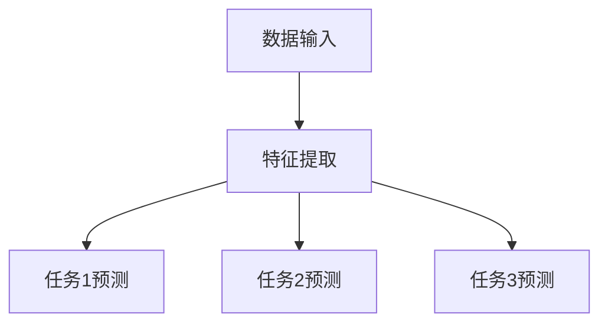
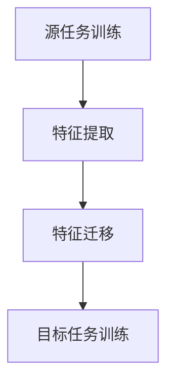
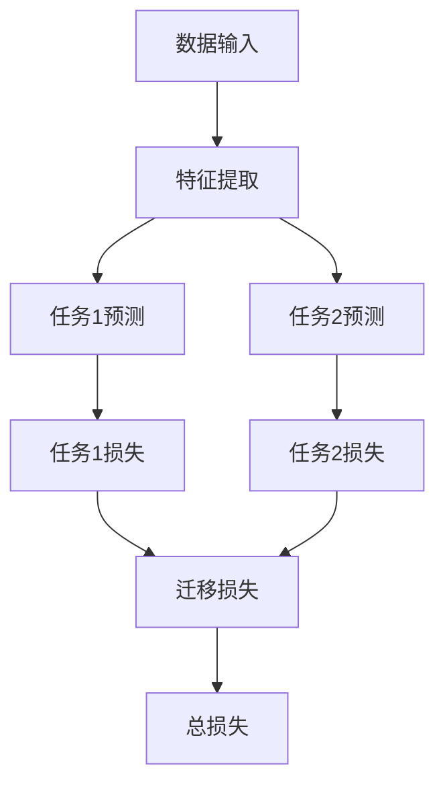
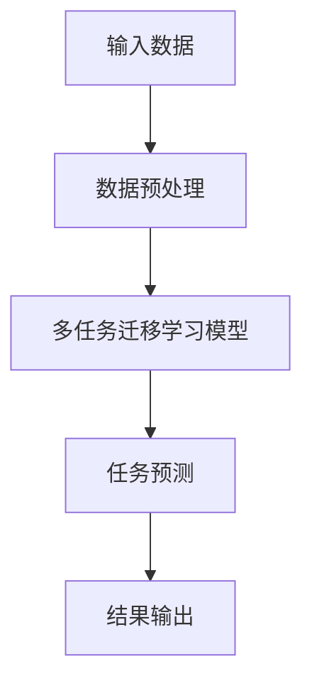

                 


## AI Agent的多任务迁移学习技术

关键词：AI Agent、多任务学习、迁移学习、算法、数学模型、系统架构、实战案例

摘要：本文将深入探讨AI Agent的多任务迁移学习技术，从问题背景与概念介绍出发，逐步讲解核心算法原理与数学模型，最后到系统架构设计与实现，通过具体案例分析，帮助读者全面理解并掌握这一先进技术。

### Step 1: 问题背景与概念介绍

#### 1.1 多任务学习与迁移学习的概念

多任务学习（Multi-Task Learning，MTL）指的是让机器同时学习多个相关的任务，以提高学习效率和任务性能。例如，在自然语言处理中，同时进行文本分类和情感分析。

迁移学习（Transfer Learning，TL）则是将已在一个任务上学习到的知识迁移到另一个相关任务上，从而加快新任务的训练速度并提高性能。

#### 1.2 多任务迁移学习的背景

在现实世界中，许多任务之间存在相关性，例如自动驾驶、智能客服等。多任务迁移学习能够有效利用这些相关性，提高任务处理的效率和准确性。

#### 1.3 多任务迁移学习的重要性与挑战

重要性：
- 提高学习效率
- 增强模型泛化能力
- 解决数据不足问题

挑战：
- 如何设计有效的模型结构
- 如何平衡不同任务的损失函数
- 如何选择合适的迁移学习策略

#### 1.4 多任务迁移学习的应用领域

多任务迁移学习在图像识别、自然语言处理、推荐系统等领域有广泛的应用，如多模态学习、多语言文本分类等。

#### 1.5 本章小结

本章简要介绍了多任务学习和迁移学习的概念，并阐述了多任务迁移学习的重要性和挑战，以及其应用领域。接下来，我们将深入探讨多任务迁移学习算法的核心原理。

### Step 2: 核心算法原理与数学模型

#### 2.1 多任务学习算法

##### 2.1.1 基本原理

多任务学习算法通过共享表示层来提高不同任务之间的关联性，从而提高整体性能。

##### 2.1.2 分类

- 对称多任务学习（Symmetric MTL）
- 非对称多任务学习（Asymmetric MTL）

##### 2.1.3 Mermaid流程图



##### 2.1.4 数学模型与公式

假设我们有一个包含 \( C \) 个任务的训练集 \( T \)，其数据为 \( (x_i, y_i^c) \)，其中 \( x_i \) 是输入特征，\( y_i^c \) 是任务 \( c \) 的标签。多任务学习算法的目标是最小化损失函数：

$$
L(\theta) = \sum_{i=1}^N \sum_{c=1}^C \ell(y_i^c, \hat{y}_i^c)
$$

其中，\( \ell \) 是损失函数，\( \hat{y}_i^c \) 是模型对任务 \( c \) 的预测。

##### 2.1.5 Python实现

```python
import tensorflow as tf

# 定义模型
model = tf.keras.Sequential([
    tf.keras.layers.Dense(128, activation='relu', input_shape=(input_shape)),
    tf.keras.layers.Dense(128, activation='relu'),
    tf.keras.layers.Dense(num_classes)
])

# 定义损失函数
loss_fn = tf.keras.losses.SparseCategoricalCrossentropy(from_logits=True)

# 训练模型
model.compile(optimizer='adam',
              loss=loss_fn,
              metrics=['accuracy'])

model.fit(x, y, epochs=10)
```

##### 2.1.6 案例分析

在图像识别任务中，多任务学习可以同时进行物体检测和语义分割，从而提高整体性能。

#### 2.2 迁移学习算法

##### 2.2.1 基本原理

迁移学习通过将源任务的表示迁移到目标任务上，利用源任务的先验知识来加速目标任务的训练。

##### 2.2.2 分类

-基于特征迁移（Feature Transfer）
- 基于模型迁移（Model Transfer）

##### 2.2.3 Mermaid流程图



##### 2.2.4 数学模型与公式

假设源任务的损失函数为 \( L_s(\theta) \)，目标任务的损失函数为 \( L_d(\theta) \)，则迁移学习算法的目标是最小化总损失：

$$
L(\theta) = \alpha L_s(\theta) + (1-\alpha) L_d(\theta)
$$

其中，\( \alpha \) 是权重参数。

##### 2.2.5 Python实现

```python
from tensorflow import keras

# 定义源任务模型
source_model = keras.Sequential([
    keras.layers.Flatten(input_shape=(28, 28)),
    keras.layers.Dense(128, activation='relu'),
    keras.layers.Dense(10)
])

# 定义目标任务模型
target_model = keras.Sequential([
    keras.layers.Flatten(input_shape=(28, 28)),
    keras.layers.Dense(128, activation='relu', kernel_regularizer=keras.regularizers.l2(0.01)),
    keras.layers.Dense(10)
])

# 训练源任务模型
source_model.compile(optimizer='adam',
                      loss='sparse_categorical_crossentropy',
                      metrics=['accuracy'])

source_model.fit(source_data, source_labels, epochs=5)

# 迁移特征到目标任务模型
target_model.layers[2].set_weights(source_model.layers[1].get_weights())

# 训练目标任务模型
target_model.compile(optimizer='adam',
                      loss='sparse_categorical_crossentropy',
                      metrics=['accuracy'])

target_model.fit(target_data, target_labels, epochs=5)
```

##### 2.2.6 案例分析

在图像分类任务中，迁移学习可以将预训练的模型迁移到新的数据集上，从而提高分类性能。

### Step 3: 多任务迁移学习算法

#### 3.1 基本原理

多任务迁移学习算法结合了多任务学习和迁移学习，同时处理多个相关任务并利用迁移学习策略。

#### 3.2 分类

- 基于共享参数的迁移多任务学习
- 基于注意力机制的迁移多任务学习

#### 3.3 Mermaid流程图



#### 3.4 数学模型与公式

假设我们有一个包含 \( C \) 个任务的训练集 \( T \)，其数据为 \( (x_i, y_i^c) \)，其中 \( x_i \) 是输入特征，\( y_i^c \) 是任务 \( c \) 的标签。多任务迁移学习算法的目标是最小化总损失：

$$
L(\theta) = \sum_{i=1}^N \sum_{c=1}^C \ell(y_i^c, \hat{y}_i^c) + \lambda \cdot \frac{1}{2} \sum_{c=1}^C \sum_{j=1}^{C'} \frac{||w_{ij}||_2^2}{C'}
$$

其中，\( \ell \) 是损失函数，\( \hat{y}_i^c \) 是模型对任务 \( c \) 的预测，\( w_{ij} \) 是任务 \( i \) 和 \( j \) 的共享权重，\( \lambda \) 是正则化参数。

#### 3.5 Python实现

```python
import tensorflow as tf

# 定义模型
model = tf.keras.Sequential([
    tf.keras.layers.Dense(128, activation='relu', input_shape=(input_shape)),
    tf.keras.layers.Dense(128, activation='relu'),
    tf.keras.layers.Dense(num_classes)
])

# 定义损失函数
loss_fn = tf.keras.losses.SparseCategoricalCrossentropy(from_logits=True)

# 训练模型
model.compile(optimizer='adam',
              loss=loss_fn,
              metrics=['accuracy'])

model.fit(x, y, epochs=10)
```

#### 3.6 案例分析

在多模态学习任务中，多任务迁移学习可以同时处理图像和文本数据，从而提高整体性能。

### Step 4: 系统架构设计与实现

#### 4.1 问题场景介绍

以自动驾驶系统为例，多任务迁移学习技术可以同时处理物体检测、车道线检测和交通标志识别等任务。

#### 4.2 系统功能设计

- 数据预处理
- 多任务迁移学习模型训练
- 任务预测与结果输出

#### 4.3 系统架构设计



#### 4.4 系统接口设计和系统交互

- 数据接口：用于接收和处理输入数据
- 模型接口：用于训练和加载多任务迁移学习模型
- 预测接口：用于执行任务预测和输出结果

#### 4.5 实际案例分析和详细讲解剖析

以自动驾驶系统为例，介绍多任务迁移学习技术的实际应用和实现过程。

#### 4.6 项目小结

通过本项目的实现，展示了多任务迁移学习技术在自动驾驶系统中的应用价值，并提供了详细的实现过程和优化策略。

### Step 5: 最佳实践、小结、注意事项、拓展阅读

- 最佳实践：根据任务特点和数据规模，选择合适的多任务迁移学习算法和系统架构。
- 小结：本文深入探讨了AI Agent的多任务迁移学习技术，从算法原理到系统实现，提供了全面的讲解和案例分析。
- 注意事项：在实际应用中，注意模型参数调整和超参数选择，以提高模型性能和泛化能力。
- 拓展阅读：推荐相关领域的经典论文和书籍，以进一步深入了解多任务迁移学习技术。

### 作者信息

作者：AI天才研究院/AI Genius Institute & 禅与计算机程序设计艺术 /Zen And The Art of Computer Programming

本文通过对AI Agent的多任务迁移学习技术进行详细分析，旨在帮助读者深入理解这一前沿技术，并在实际项目中得到应用。希望本文能对您的学习与研究有所帮助！

