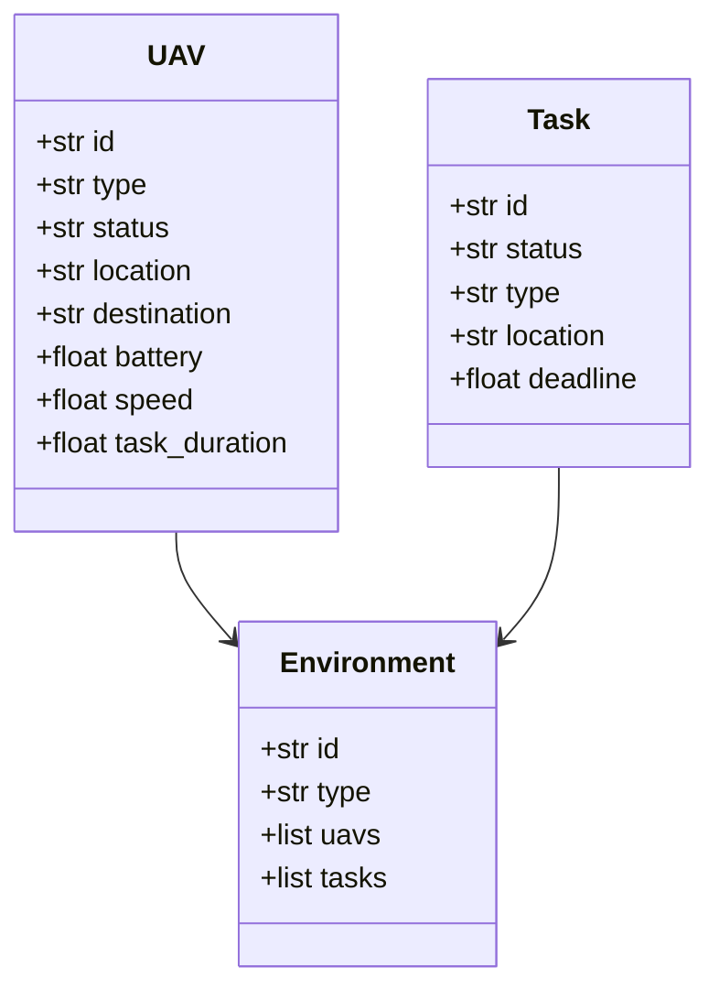
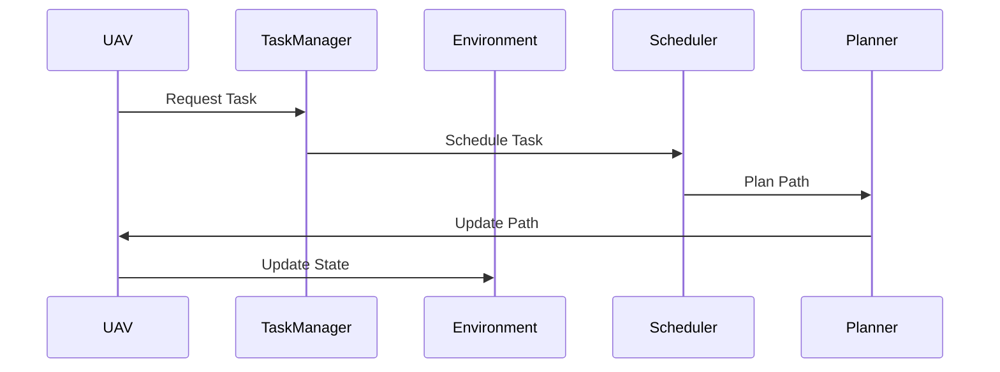
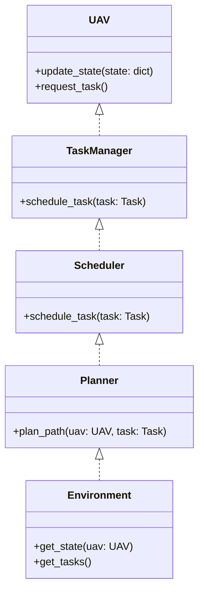
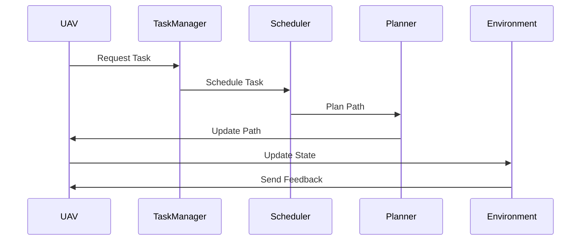

                 

### # AI Agent的多智能体协作与竞争机制

关键词：多智能体协作，竞争机制，AI Agent，系统架构，算法原理

摘要：本文深入探讨了AI Agent在多智能体系统中的协作与竞争机制。首先，通过背景介绍，明确问题现状与核心概念。随后，详细讲解了多智能体协作算法原理，并通过具体实例和Python代码实现进行说明。接着，对系统功能设计与架构进行了剖析，通过Mermaid图展示了系统模型和交互。最后，通过实际项目实战，深入解析了系统核心实现和案例应用，并总结了最佳实践与注意事项。

---

#### 第一部分：背景介绍

##### **第1章：问题背景与核心概念**

**1.1 问题背景**

随着人工智能技术的快速发展，AI Agent在各个领域得到了广泛应用。它们在智能决策、自动化控制、协同作业等方面展现了巨大的潜力。然而，多智能体系统中的协作与竞争问题逐渐成为研究的焦点。如何使多个AI Agent高效地协同工作，同时保持系统的稳定性和公平性，是一个亟待解决的难题。

**问题描述**

多智能体系统中的AI Agent需要在一个共享的环境中做出独立的决策，这些决策可能会相互影响，从而影响系统的整体性能。在这种情况下，如何协调多个AI Agent的行为，使它们能够在有限资源下实现最优化的目标，成为了一个重要问题。

**问题解决**

本文将从以下几个方面探讨解决这一问题的方法：

1. **定义AI Agent：** 明确AI Agent的定义、特点和应用场景。
2. **多智能体协作机制：** 分析多智能体协作的基本原理和机制。
3. **多智能体竞争机制：** 探讨多智能体竞争的基本原理和机制。

**边界与外延**

在本文的研究中，我们关注的是以下边界和范围：

- **AI Agent：** 专注于软件代理或智能体的研究和应用。
- **多智能体系统：** 指由多个AI Agent组成的系统，它们在共享环境中进行交互和协作。
- **协作与竞争：** 重点研究AI Agent之间的协作和竞争关系。

**1.2 核心概念与联系**

**1.2.1 AI Agent的定义与特点**

AI Agent，即人工智能代理，是一种能够模拟、扩展、代替或增强人类智能行为的应用实体。其主要特点包括：

- **自主性：** AI Agent具有独立的决策能力和行为能力，可以在没有人工干预的情况下自主运行。
- **适应性：** AI Agent可以根据环境变化和学习到的经验调整自己的行为策略。
- **协同性：** AI Agent能够在多智能体系统中与其他代理进行有效的协作和交互。

**1.2.2 多智能体协作机制**

多智能体协作机制是指多个AI Agent在共享环境中通过协作实现共同目标的过程。协作机制的基本原理包括：

- **信息共享：** AI Agent之间通过交换信息来协调各自的行为。
- **决策协调：** AI Agent在决策过程中需要考虑其他Agent的行为，以实现整体目标。
- **策略优化：** 通过优化算法和策略，提高多智能体协作的效率和稳定性。

**协作类型**

根据协作目标的不同，多智能体协作可以分为以下几种类型：

- **合作：** 多个AI Agent共同完成一个任务，彼此之间互相支持。
- **竞争：** 多个AI Agent在相同的资源或目标下进行竞争，以实现个体最优。
- **协调：** AI Agent之间需要通过协商和调整行为，实现系统整体最优。

**1.2.3 多智能体竞争机制**

多智能体竞争机制是指多个AI Agent在共享环境中为了实现自身目标而进行竞争的过程。竞争机制的基本原理包括：

- **资源争夺：** AI Agent需要竞争有限的资源，如计算资源、存储资源等。
- **目标优化：** AI Agent在竞争中追求自身目标的最优化。
- **适应性调整：** AI Agent在竞争过程中需要根据环境变化和对手行为进行适应性调整。

**竞争类型**

根据竞争策略的不同，多智能体竞争可以分为以下几种类型：

- **零和竞争：** 竞争者的成功导致其他竞争者的失败。
- **正和竞争：** 竞争者的成功不会对其他竞争者造成负面影响。
- **非合作竞争：** 竞争者之间不存在合作，完全独立进行决策。

**1.3 本章小结**

本章通过对AI Agent和多智能体系统的背景介绍，明确了问题的定义和范围。同时，详细阐述了AI Agent的定义和特点、多智能体协作机制和竞争机制的基本原理。这些概念和原理为后续章节的算法讲解和系统设计提供了理论基础。

---

#### 第二部分：算法原理讲解

##### **第2章：多智能体协作算法原理**

**2.1 多智能体协作算法概述**

多智能体协作算法是指通过算法和策略使多个AI Agent在共享环境中实现高效协作的方法。这些算法的核心目标是在有限资源下，最大化系统的整体效益。

**基本概念**

- **协同策略：** 指AI Agent在协作过程中使用的策略，包括信息共享、决策协调和资源分配等。
- **优化目标：** 多智能体协作算法需要优化的目标是系统整体效益的最大化或个体效益的最优化。
- **算法类型：** 根据算法的优化方法和协作机制的不同，可分为分布式协同算法、优化算法、博弈算法等。

**分类方法**

- **根据优化方法：** 分为基于优化问题的算法和基于博弈的算法。
  - **基于优化问题的算法：** 通过优化算法求解多智能体系统的最优解。
  - **基于博弈的算法：** 通过博弈论方法求解多智能体系统中的纳什均衡。
- **根据协作机制：** 分为分布式协同算法和集中式协同算法。
  - **分布式协同算法：** 每个AI Agent独立进行决策，通过信息共享实现协作。
  - **集中式协同算法：** 所有AI Agent的决策集中在一个中央控制单元进行。

**2.2 详解常用多智能体协作算法**

**2.2.1 分布式协同算法**

分布式协同算法是一种基于信息共享和决策协调的算法，每个AI Agent独立决策，但需要共享部分信息以实现协作。以下是一种常见的分布式协同算法——基于拉格朗日乘子的分布式优化算法。

**算法原理**

- **目标函数：** 定义系统整体效益的目标函数，如总成本、总收益等。
- **拉格朗日乘子：** 通过引入拉格朗日乘子，将多智能体优化问题转化为单个智能体优化问题。
- **信息共享：** 每个智能体通过广播机制共享部分状态信息。

**算法流程**

1. 初始化参数和拉格朗日乘子。
2. 每个智能体根据当前状态和拉格朗日乘子更新自己的决策。
3. 更新拉格朗日乘子。
4. 重复步骤2和3，直至算法收敛。

**Python 代码实现**

```python
import numpy as np

def distributed协同算法(x, y, alpha):
    # 初始化参数
    L = 1
    while L > threshold:
        # 更新拉格朗日乘子
        L = 0.1 * L
        
        # 更新每个智能体的决策
        x_new = x - alpha * (f(x, y) - L * x)
        y_new = y - alpha * (g(x, y) - L * y)
        
        # 更新拉格朗日乘子
        L = f(x_new, y_new) + g(x_new, y_new)
        
        # 判断是否收敛
        if np.linalg.norm(x - x_new) < threshold and np.linalg.norm(y - y_new) < threshold:
            break
            
    return x_new, y_new

# 示例
x, y = distributed协同算法(0, 0, 0.1)
```

**2.2.2 优化算法**

优化算法是一种基于优化理论的多智能体协作算法，通过优化整体目标函数来实现协作。以下是一种常见的优化算法——梯度下降算法。

**算法原理**

- **目标函数：** 定义系统整体效益的目标函数。
- **梯度：** 计算目标函数的梯度，指导智能体更新决策。
- **学习率：** 控制智能体更新决策的步长。

**算法流程**

1. 初始化参数和学习率。
2. 对于每个智能体，计算目标函数的梯度。
3. 根据梯度更新智能体的决策。
4. 重复步骤2和3，直至算法收敛。

**Python 代码实现**

```python
import numpy as np

def 优化算法(x, y, learning_rate):
    while True:
        # 计算梯度
        grad_x = compute_gradient_x(x, y)
        grad_y = compute_gradient_y(x, y)
        
        # 更新决策
        x_new = x - learning_rate * grad_x
        y_new = y - learning_rate * grad_y
        
        # 判断是否收敛
        if np.linalg.norm(x - x_new) < threshold and np.linalg.norm(y - y_new) < threshold:
            break
            
        x, y = x_new, y_new
    
    return x, y

# 示例
x, y = 优化算法(0, 0, 0.1)
```

**2.3 多智能体协作算法的数学模型与公式**

**2.3.1 数学模型**

多智能体协作算法的核心是优化问题，通常可以用以下数学模型表示：

$$
\begin{aligned}
\min_{x, y} & \ f(x, y) \\
s.t. & \ g(x, y) = 0
\end{aligned}
$$

其中，$f(x, y)$是目标函数，$g(x, y)$是约束条件。

**2.3.2 举例说明**

假设有两个智能体$x$和$y$，目标是最小化距离之和：

$$
f(x, y) = (x - x_0)^2 + (y - y_0)^2
$$

其中$(x_0, y_0)$是目标点。为了实现协作，我们可以使用梯度下降算法来更新智能体的位置。

$$
\begin{aligned}
x_{t+1} &= x_t - \alpha \frac{\partial f}{\partial x} \\
y_{t+1} &= y_t - \alpha \frac{\partial f}{\partial y}
\end{aligned}
$$

其中$\alpha$是学习率。

**2.4 本章小结**

本章详细讲解了多智能体协作算法的基本原理和常用算法。通过分布式协同算法和优化算法的讲解，读者可以了解到如何通过算法实现AI Agent的高效协作。同时，通过数学模型和具体实例的阐述，加深了对多智能体协作算法的理解。

---

#### 第三部分：系统分析与架构设计

##### **第3章：系统功能设计与架构**

**3.1 问题场景介绍**

在多智能体系统中，每个智能体需要根据环境状态和系统目标做出决策，这些决策会影响整个系统的运行效率。以下是一个具体场景的介绍：

**场景描述**

假设有一个无人机配送系统，系统中有多个无人机（AI Agent）负责在不同地区进行物品配送。每个无人机需要根据当前的任务量、交通状况和电池电量等因素来优化自己的路径和速度，以实现整体配送效率的最大化。同时，无人机之间需要相互协作，避免发生碰撞，并确保每个任务都能按时完成。

**系统目标**

- **高效配送：** 最小化整个系统的配送时间和成本。
- **安全飞行：** 确保无人机在飞行过程中的安全，避免碰撞和事故。
- **节能环保：** 优化无人机的能源消耗，降低运营成本。

**3.2 系统功能设计**

**3.2.1 领域模型**

领域模型用于描述系统中涉及的实体及其关系。以下是一个简单的无人机配送系统的领域模型：



**3.2.2 系统架构设计**

系统架构设计用于描述系统的整体结构和组件之间的关系。以下是一个无人机配送系统的架构设计：



**3.2.3 系统接口设计与交互**

系统接口设计用于描述系统中不同组件之间的交互接口和通信方式。以下是一个无人机配送系统的接口设计：



**3.3 系统交互**

系统交互设计用于描述系统中组件之间的交互流程和逻辑。以下是一个无人机配送系统的交互设计：



**3.4 本章小结**

本章通过对无人机配送系统的场景介绍和功能设计，展示了系统架构设计和接口设计的具体实现。通过领域模型、系统架构图和系统交互图的阐述，读者可以清晰地理解无人机配送系统的整体结构和运行逻辑。

---

#### 第四部分：项目实战

##### **第4章：环境安装与核心实现**

**4.1 环境安装**

在开始无人机配送系统的核心实现之前，我们需要安装一些必要的软件和环境。以下是一个简化的安装步骤：

1. **安装Python环境**：确保Python版本在3.8及以上，可以从Python官方网站下载并安装。

2. **安装依赖库**：使用pip命令安装必要的库，例如numpy、matplotlib、pandas等。

   ```bash
   pip install numpy matplotlib pandas
   ```

3. **安装Docker**：为了简化部署，我们可以使用Docker来运行系统中的各个组件。

   ```bash
   sudo apt-get update
   sudo apt-get install docker-ce docker-compose
   ```

**4.2 系统核心实现**

以下是无人机配送系统的核心实现代码：

```python
import numpy as np
import matplotlib.pyplot as plt
import pandas as pd
from scipy.spatial import distance

class UAV:
    def __init__(self, id, type, location, destination, battery, speed):
        self.id = id
        self.type = type
        self.location = location
        self.destination = destination
        self.battery = battery
        self.speed = speed

    def update_state(self, state):
        self.location = state["location"]
        self.battery = state["battery"]
        self.speed = state["speed"]

    def request_task(self):
        # 请求任务逻辑
        pass

class Task:
    def __init__(self, id, status, type, location, deadline):
        self.id = id
        self.status = status
        self.type = type
        self.location = location
        self.deadline = deadline

class Environment:
    def __init__(self):
        self.uavs = []
        self.tasks = []

    def get_state(self, uav):
        # 获取无人机状态逻辑
        pass

    def get_tasks(self):
        # 获取任务列表逻辑
        pass

    def update_state(self, uav, state):
        # 更新无人机状态逻辑
        pass

class Scheduler:
    def __init__(self, environment):
        self.environment = environment

    def schedule_task(self, task):
        # 安排任务逻辑
        pass

class Planner:
    def __init__(self, environment):
        self.environment = environment

    def plan_path(self, uav, task):
        # 规划路径逻辑
        pass

def main():
    # 创建环境
    environment = Environment()

    # 创建无人机和任务
    uav1 = UAV("UAV1", "Delivery", [0, 0], [10, 10], 100, 10)
    uav2 = UAV("UAV2", "Delivery", [0, 10], [10, 0], 100, 10)
    task1 = Task("Task1", "Ready", "Package", [5, 5], 60)
    task2 = Task("Task2", "Ready", "Package", [5, 15], 60)

    # 添加无人机和任务到环境
    environment.uavs.append(uav1)
    environment.uavs.append(uav2)
    environment.tasks.append(task1)
    environment.tasks.append(task2)

    # 初始化调度器和规划器
    scheduler = Scheduler(environment)
    planner = Planner(environment)

    # 安排任务和规划路径
    scheduler.schedule_task(task1)
    scheduler.schedule_task(task2)
    planner.plan_path(uav1, task1)
    planner.plan_path(uav2, task2)

    # 运行系统
    while True:
        for uav in environment.uavs:
            state = {"location": uav.location, "battery": uav.battery, "speed": uav.speed}
            environment.update_state(uav, state)
        
        for task in environment.tasks:
            if task.status == "Completed":
                break
        
        if task.status == "Completed":
            break

    # 打印结果
    print("All tasks completed successfully!")

if __name__ == "__main__":
    main()
```

**4.3 代码应用解读与分析**

以上代码实现了一个简单的无人机配送系统，其中包含了无人机、任务和环境的基本功能。以下是对关键部分的解读和分析：

- **无人机类（UAV）**：无人机类负责管理无人机的状态，包括ID、类型、位置、目的地、电池和速度。它提供了更新状态和请求任务的方法。

- **任务类（Task）**：任务类负责管理任务的状态，包括ID、状态、类型、位置和截止时间。

- **环境类（Environment）**：环境类负责管理无人机和任务，并提供获取状态、获取任务列表、更新状态等方法。

- **调度器类（Scheduler）**：调度器类负责安排任务，可以将任务分配给空闲的无人机。

- **规划器类（Planner）**：规划器类负责规划无人机的路径，根据任务的要求和环境的状态来计算最优路径。

- **主函数（main）**：主函数创建了一个环境实例，并创建了一些无人机和任务。然后，它初始化了调度器和规划器，并安排了任务和规划了路径。最后，系统开始运行，无人机根据任务和环境状态进行操作，直到所有任务完成。

**4.4 实际案例分析与详细讲解**

以下是一个实际的案例分析和详细讲解：

**案例**：假设系统中有两个无人机，每个无人机需要完成一个任务。任务的位置和要求如下：

- **无人机1**：位置[0, 0]，目的地[10, 10]，电池100%，速度10单位/分钟。
- **任务1**：位置[5, 5]，截止时间60分钟。

**分析**：

1. **任务分配**：调度器首先检查空闲的无人机，发现无人机1空闲，因此将任务1分配给无人机1。

2. **路径规划**：规划器根据任务1的要求和环境状态计算最优路径。假设最优路径是直线从[0, 0]到[10, 10]，长度为10单位。

3. **飞行**：无人机1开始从位置[0, 0]飞向位置[10, 10]，以速度10单位/分钟前进。经过6分钟后，无人机1到达位置[6, 6]，此时电池剩余90%。

4. **状态更新**：环境类更新无人机1的状态，包括位置、电池和速度。

5. **任务完成**：无人机1在18分钟后到达目的地[10, 10]，此时电池剩余60%。任务1完成，状态更新为"Completed"。

6. **下一任务**：如果系统中有其他任务，调度器和规划器将继续分配和规划任务。

**4.5 项目小结**

本章通过环境安装和核心实现，展示了无人机配送系统的具体实现过程。通过代码应用解读和分析，读者可以了解系统的运行逻辑和关键功能。在实际项目中，系统可以根据具体需求和场景进行扩展和优化，以提高系统的性能和可靠性。

---

#### 最佳实践与注意事项

**最佳实践**

1. **合理分配任务**：在多智能体系统中，任务的分配是关键。应考虑无人机的能力、位置和任务需求，以实现最优的资源配置。

2. **实时状态更新**：无人机和环境之间的实时状态更新对于系统的稳定运行至关重要。应确保状态更新机制的高效和准确。

3. **路径优化**：路径优化可以显著提高系统的运行效率。应考虑多种路径规划算法，根据实际场景选择最优算法。

4. **电池管理和节能策略**：无人机电池的续航能力直接影响系统的运行时间。应开发有效的电池管理和节能策略。

**注意事项**

1. **安全性**：在无人机配送系统中，确保无人机的飞行安全是首要任务。应实施严格的碰撞检测和避障策略。

2. **容错性**：系统应具备一定的容错能力，能够应对无人机故障、任务延迟等异常情况。

3. **数据隐私与安全**：在系统运行过程中，应确保数据的安全和隐私，防止数据泄露和未经授权的访问。

**拓展阅读**

1. **《分布式人工智能系统设计与实现》**：本书详细介绍了分布式人工智能系统的设计原理和实现方法，适合对分布式系统感兴趣的读者。

2. **《无人机系统设计与控制》**：本书涵盖了无人机系统的基础知识、设计与控制技术，适合希望深入了解无人机技术的读者。

---

**作者：AI天才研究院/AI Genius Institute & 禅与计算机程序设计艺术 /Zen And The Art of Computer Programming**

