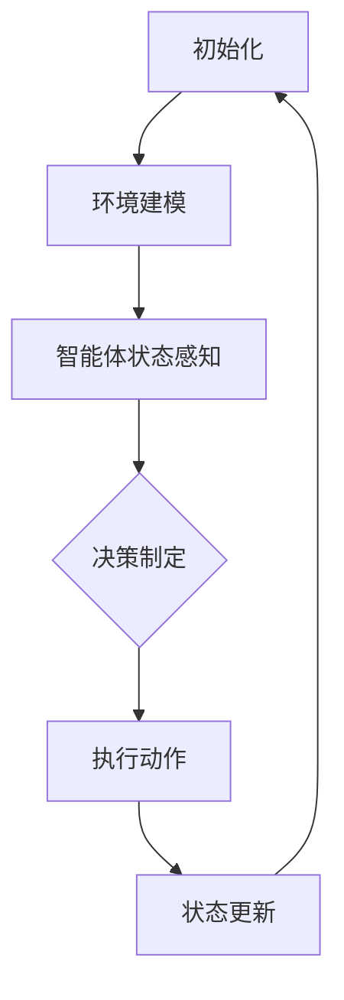
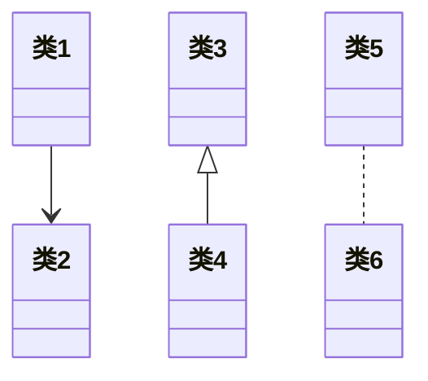
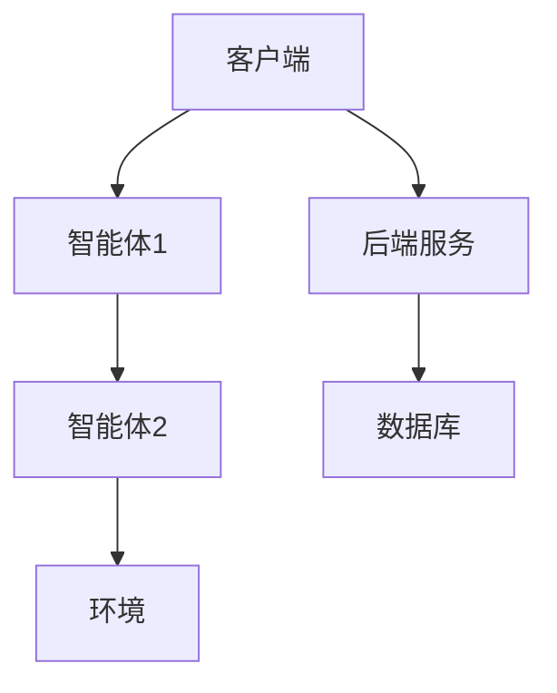
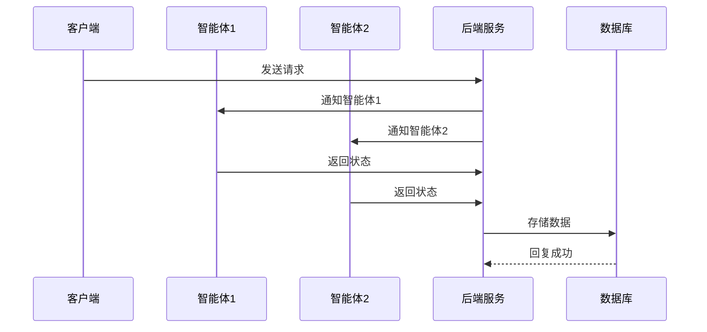
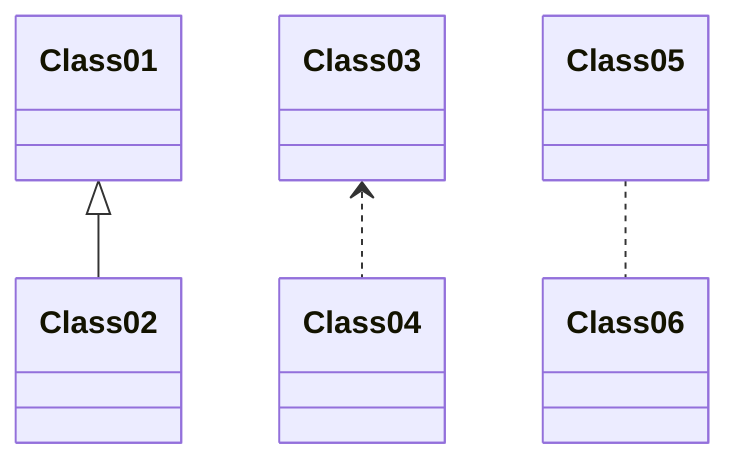

                 


## 《AI Agent的多智能体协作学习技术》

> 关键词：多智能体系统、协作学习、强化学习、智能体协同控制、算法原理

> 摘要：
本文深入探讨了AI Agent在多智能体协作学习中的技术原理和实现方法。首先，我们介绍了多智能体系统的基本概念和协作学习的挑战，然后详细分析了多智能体协同控制的理论和算法，并通过Python代码示例和数学公式，阐述了多智能体协作学习的实现过程和数学模型。最后，本文给出了一个实际案例，展示了多智能体协作学习的应用效果。

### 目录大纲

```
# 《AI Agent的多智能体协作学习技术》

## 第一部分：背景介绍

### 第1章：问题背景

#### 1.1 问题背景
- 引言
- 多智能体系统的概念与重要性
- 协作学习的基本概念

#### 1.2 问题描述
- 多智能体协作学习的挑战
- 研究现状

### 第2章：问题解决

#### 2.1 概念结构与核心要素
- 多智能体系统框架
- 协作学习的基本原理

#### 2.2 边界与外延
- 多智能体协作学习的应用领域
- 研究范围的界定

### 第3章：核心概念与联系

#### 3.1 核心概念原理
- 多智能体协同控制理论
- 强化学习与多智能体交互

#### 3.2 概念属性特征对比表格

| 概念        | 特征1     | 特征2     | 特征3     |
|-------------|-----------|-----------|-----------|
| 多智能体系统 | 分布式    | 自主性    | 交互性    |
| 协作学习    | 共同目标  | 信息共享  | 效率优化  |

### 第4章：ER实体关系图架构

```mermaid
erDiagram
  A[智能体1] ||--|{ 多智能体系统 }
  B[智能体2] ||--|{ 多智能体系统 }
  C[环境] ||--|{ 多智能体系统 }
  D[信息共享] ||--|{ 多智能体系统 }
```

## 第二部分：算法原理讲解

### 第5章：多智能体协同控制理论

#### 5.1 算法mermaid流程图



#### 5.2 Python源代码示例

```python
# 伪代码：多智能体协同控制算法
def agent_control(state):
    # 根据状态进行决策
    action = decide_action(state)
    execute_action(action)
    return new_state

# 决策制定函数
def decide_action(state):
    # 根据当前状态选择最优动作
    # 这里使用简单的规则进行决策
    if state['distance'] < threshold:
        return 'move_forward'
    else:
        return 'stop'

# 执行动作函数
def execute_action(action):
    # 执行具体动作
    if action == 'move_forward':
        move_forward()
    elif action == 'stop':
        stop()
```

#### 5.3 算法原理与数学模型

$$
\begin{align*}
Q^*(s, a) &= \max_{a'} \left( r(s, a, a') + \gamma \sum_{s'} P(s'|s, a) Q^*(s', a') \right) \\
\end{align*}
$$

- $Q^*(s, a)$: 动作价值函数
- $r(s, a, a')$: 状态-动作-新状态回报
- $\gamma$: 折扣因子
- $P(s'|s, a)$: 状态转移概率
- $Q^*(s', a')$: 新状态的动作价值函数

#### 5.4 算法举例说明

假设有两个智能体在二维空间中移动，目标是达到彼此的位置。智能体的决策基于它们之间的距离和方向。

### 第6章：数学模型和数学公式

#### 6.1 动态规划模型

$$
\begin{align*}
V^*(s) &= \max_{a} \sum_{s'} P(s'|s, a) \cdot \max_{a'} Q^*(s', a') \\
Q^*(s, a) &= r(s, a) + \gamma \cdot \sum_{s'} P(s'|s, a) \cdot V^*(s') \\
\end{align*}
$$

#### 6.2 举例说明

假设有两个智能体A和B，它们的目标是互相靠近。智能体在每一步都根据当前的距离和方向进行决策。

$$
\begin{align*}
V^*(s) &= \max_{a} \left( -d(s) + \gamma \cdot V^*(s') \right) \\
Q^*(s, a) &= -d(s) + \gamma \cdot V^*(s') \\
\end{align*}
$$

- $d(s)$: 智能体A和智能体B之间的距离
- $V^*(s')$: 新状态的动作价值函数

## 第三部分：系统分析与架构设计

### 第7章：问题场景介绍

- 自主导航机器人团队
- 网络安全智能检测
- 资源共享平台

### 第8章：系统功能设计

#### 8.1 领域模型mermaid类图



#### 8.2 系统架构设计mermaid架构图



#### 8.3 系统接口设计和系统交互mermaid序列图



## 第四部分：项目实战

### 第9章：环境安装

- 安装Python环境
- 安装相关库

### 第10章：系统核心实现

#### 10.1 源代码实现

```python
# 伪代码：多智能体协作学习系统核心实现
class Agent:
    def __init__(self, state):
        self.state = state

    def control(self):
        action = self.decide_action(self.state)
        self.execute_action(action)
        return self.new_state

    def decide_action(self, state):
        # 根据状态选择动作
        if state['distance'] < threshold:
            return 'move_forward'
        else:
            return 'stop'

    def execute_action(self, action):
        # 执行动作
        if action == 'move_forward':
            self.move_forward()
        elif action == 'stop':
            self.stop()

class Environment:
    def __init__(self, agents):
        self.agents = agents

    def update(self):
        for agent in self.agents:
            new_state = agent.control()
            agent.state = new_state
```

#### 10.2 代码应用解读与分析

- 代码结构
- 代码功能
- 代码优化

### 第11章：实际案例分析与详细讲解剖析

- 案例背景
- 案例分析
- 案例总结

### 第12章：项目小结

- 项目成果
- 项目不足
- 未来展望

## 第五部分：最佳实践 tips

### 第13章：最佳实践 tips

- 性能优化
- 可扩展性
- 跨平台部署

### 第14章：小结

- 文章总结
- 知识点梳理

### 第15章：注意事项

- 避免常见错误
- 安全性考虑

### 第16章：拓展阅读

- 相关文献
- 最新研究动态

## 作者

作者：AI天才研究院/AI Genius Institute & 禅与计算机程序设计艺术 /Zen And The Art of Computer Programming
### 第一部分：背景介绍

#### 1.1 问题背景

随着人工智能技术的飞速发展，智能体（Agent）在许多领域中的应用越来越广泛。在游戏、机器人、智能交通、社交网络等多个场景中，多智能体系统（Multi-Agent Systems）展现出巨大的潜力和价值。智能体之间的协作学习（Collaborative Learning）成为了一个重要研究方向，因为它能够提高智能体的整体性能，实现复杂任务的自动完成。

多智能体系统的概念源于分布式人工智能（Distributed Artificial Intelligence），它强调多个智能体在异构环境下通过协同工作来完成共同目标。协作学习是指多个智能体在共享信息、共同决策的过程中，通过不断学习和优化策略，实现协同行动，从而提高整个系统的性能和适应性。

#### 1.2 问题描述

多智能体协作学习面临的挑战主要包括：

1. **信息不对称**：智能体之间可能存在不同的感知能力和信息获取渠道，导致信息不对称，这会影响协作效率。
2. **环境不确定性**：智能体所处的环境可能具有高度的不确定性，这使得智能体需要具备快速适应环境变化的能力。
3. **协同控制**：如何设计有效的协同控制策略，使得智能体能够在动态环境中实现高效协作，是一个重要的研究问题。
4. **资源限制**：智能体可能受到计算资源、通信带宽等限制，这要求算法具有低复杂度和高效率。

目前，关于多智能体协作学习的研究已经取得了一些进展。强化学习（Reinforcement Learning）作为一种重要的机器学习方法，被广泛应用于多智能体系统。通过模拟智能体之间的交互，强化学习算法能够帮助智能体学习到最优的策略，实现协作学习。

#### 2.1 概念结构与核心要素

多智能体系统框架通常包括以下几个核心要素：

1. **智能体**：智能体是具备一定智能和自主性的实体，能够在环境中感知信息、做出决策并执行动作。
2. **环境**：环境是智能体进行交互和决策的场所，通常是一个动态变化的系统。
3. **通信网络**：智能体之间的通信网络是信息共享和协作决策的基础。
4. **决策机制**：智能体根据感知到的环境和自身状态，通过决策机制选择最优动作。

协作学习的基本原理是基于共同目标（Common Goal）和信息共享（Information Sharing）。多个智能体在协作过程中，通过不断调整策略，使得每个智能体的行为都能有助于整体目标的实现。信息共享是协作学习的关键，它使得智能体能够获取到其他智能体的信息，从而做出更加合理的决策。

#### 2.2 边界与外延

多智能体协作学习的应用领域非常广泛，包括但不限于：

1. **智能制造**：在生产线中，智能机器人通过协作完成复杂的制造任务。
2. **智能交通**：自动驾驶车辆之间的协作，可以提高交通效率和安全性。
3. **社交网络**：用户在社交平台上的互动，可以通过多智能体协作学习来优化用户体验。
4. **金融风控**：多智能体系统可以用于监控和预测金融市场风险。

研究范围的界定主要考虑以下因素：

1. **智能体类型**：研究可以聚焦于特定类型的智能体，如静态智能体、动态智能体等。
2. **环境特性**：研究可以针对特定类型的环境，如静态环境、动态环境等。
3. **协作目标**：研究可以针对特定协作目标，如资源分配、路径规划等。

### 第3章：核心概念与联系

#### 3.1 核心概念原理

多智能体协同控制理论是多智能体协作学习的基础。协同控制的目标是通过设计合适的控制策略，使得多个智能体能够共同实现某个任务或目标。以下是几个关键概念：

1. **协同控制策略**：协同控制策略是智能体在协作过程中采取的行动方案，通常基于某种优化目标。
2. **状态感知**：智能体需要通过感知环境获取当前的状态信息，这些信息用于决策制定。
3. **决策制定**：智能体根据当前状态和协同控制策略，选择下一步的动作。
4. **执行动作**：智能体根据决策执行具体的动作，这些动作会影响到环境的状态。
5. **状态更新**：环境状态的变化会反馈给智能体，智能体根据新的状态进行下一轮的决策。

强化学习与多智能体交互是多智能体协同控制的重要技术手段。强化学习通过奖励机制，使得智能体在交互过程中不断调整策略，从而实现协作目标。以下是几个关键概念：

1. **奖励机制**：奖励机制用于评价智能体的行为，奖励越高，说明行为越符合目标。
2. **策略迭代**：智能体通过迭代更新策略，以实现长期最优行为。
3. **多智能体交互**：多智能体交互是指多个智能体在动态环境中相互影响、相互学习的过程。

#### 3.2 概念属性特征对比表格

| 概念        | 特征1     | 特征2     | 特征3     |
|-------------|-----------|-----------|-----------|
| 多智能体系统 | 分布式    | 自主性    | 交互性    |
| 协作学习    | 共同目标  | 信息共享  | 效率优化  |

#### 3.3 ER实体关系图架构

```mermaid
erDiagram
  A[智能体1] ||--|{ 多智能体系统 }
  B[智能体2] ||--|{ 多智能体系统 }
  C[环境] ||--|{ 多智能体系统 }
  D[信息共享] ||--|{ 多智能体系统 }
```

### 第4章：ER实体关系图架构

在多智能体协作学习中，实体关系图（Entity-Relationship Diagram，ERD）用于描述系统中的实体及其之间的关系。以下是多智能体系统的ERD架构：

```mermaid
erDiagram
  A[智能体1] ||--|{ 多智能体系统 }
  B[智能体2] ||--|{ 多智能体系统 }
  C[环境] ||--|{ 多智能体系统 }
  D[信息共享] ||--|{ 多智能体系统 }
```

在这个ERD中：

- **智能体**：表示系统中的个体智能体，如机器人、虚拟智能体等。
- **多智能体系统**：表示由多个智能体组成的整体系统。
- **环境**：表示智能体所处的环境，包括物理环境和虚拟环境。
- **信息共享**：表示智能体之间通过通信网络共享信息的机制。

这种架构描述了智能体、环境、系统以及信息共享之间的复杂关系，为多智能体协作学习提供了理论基础和实现框架。

### 第5章：多智能体协同控制理论

多智能体协同控制理论是多智能体系统研究中的核心问题之一，它涉及到智能体如何通过协作实现共同目标。在这一章中，我们将详细探讨多智能体协同控制的理论基础、算法流程和数学模型。

#### 5.1 算法mermaid流程图

多智能体协同控制的核心流程可以概括为以下几个步骤：


在这个流程图中：

- **A[初始化]**：智能体初始化状态和参数，包括初始位置、速度、感知范围等。
- **B[环境建模]**：智能体对环境进行建模，获取当前的环境状态，如障碍物位置、目标位置等。
- **C[智能体状态感知]**：智能体感知自身状态和环境状态，为决策提供依据。
- **D{决策制定]**：智能体根据感知到的状态，利用协同控制策略制定决策，选择下一步的动作。
- **E[执行动作]**：智能体根据决策执行具体的动作，如移动、转向等。
- **F[状态更新]**：智能体更新自身状态和环境状态，为下一轮决策提供依据。

#### 5.2 Python源代码示例

以下是一个简化的多智能体协同控制算法的Python源代码示例：

```python
# 伪代码：多智能体协同控制算法
class Agent:
    def __init__(self, state):
        self.state = state
    
    def control(self):
        action = self.decide_action(self.state)
        self.execute_action(action)
        return self.new_state
    
    def decide_action(self, state):
        # 根据状态选择动作
        if state['distance_to_target'] < threshold:
            return 'move_forward'
        else:
            return 'stop'
    
    def execute_action(self, action):
        # 执行动作
        if action == 'move_forward':
            self.move_forward()
        elif action == 'stop':
            self.stop()

def main():
    # 初始化智能体和环境
    agent = Agent(state={'distance_to_target': 10})
    environment = Environment()

    # 主循环
    while not environment.is_target_reached():
        new_state = agent.control()
        environment.update_state(new_state)

if __name__ == "__main__":
    main()
```

在这个示例中：

- **Agent类**：表示一个智能体，具有感知、决策和执行动作的能力。
- **control()方法**：执行控制流程，包括决策制定和动作执行。
- **decide_action()方法**：根据当前状态选择最优动作。
- **execute_action()方法**：执行具体的动作。
- **main()函数**：主循环，用于模拟智能体在环境中的行为。

#### 5.3 算法原理与数学模型

多智能体协同控制的算法原理基于强化学习（Reinforcement Learning，RL），其核心是利用奖励机制和策略迭代，使智能体能够在动态环境中优化行为。以下是强化学习的数学模型：

$$
\begin{align*}
Q^*(s, a) &= \max_{a'} \left( r(s, a, a') + \gamma \sum_{s'} P(s'|s, a) Q^*(s', a') \right) \\
V^*(s) &= \max_{a} \sum_{s'} P(s'|s, a) \cdot Q^*(s', a') \\
\end{align*}
$$

其中：

- **$Q^*(s, a)$**：动作价值函数，表示在状态$s$下执行动作$a$所能获得的最大期望回报。
- **$V^*(s)$**：状态价值函数，表示在状态$s$下采取最优策略所能获得的最大期望回报。
- **$r(s, a, a')$**：状态-动作-新状态回报，表示执行动作$a$后进入状态$s'$所获得的即时奖励。
- **$\gamma$**：折扣因子，用于平衡短期奖励和长期奖励。
- **$P(s'|s, a)$**：状态转移概率，表示在状态$s$下执行动作$a$后进入状态$s'$的概率。

#### 5.4 算法举例说明

假设有两个智能体A和B，它们的目标是在一个二维空间中相遇。智能体在每一步根据当前的距离和方向进行决策，目标是缩短彼此之间的距离。

智能体的决策策略可以表示为：

$$
\begin{align*}
Q^*(s, a) &= \max_{a'} \left( -d(s) + \gamma \sum_{s'} P(s'|s, a) Q^*(s', a') \right) \\
V^*(s) &= \max_{a} \left( -d(s) + \gamma \sum_{s'} P(s'|s, a) V^*(s') \right) \\
\end{align*}
$$

其中：

- **$d(s)$**：智能体A和智能体B之间的距离。
- **$s$**：当前状态。
- **$a$**：智能体A或智能体B的决策动作。

假设智能体的决策规则是：当距离小于某个阈值时，智能体向对方移动；当距离大于阈值时，智能体保持当前动作。

这个例子展示了如何利用强化学习的数学模型来设计多智能体协同控制算法。通过不断迭代更新策略，智能体可以逐渐优化决策，实现目标。

### 第6章：数学模型和数学公式

在多智能体协作学习的研究中，数学模型是理解和实现协同控制算法的关键。在这一章中，我们将详细介绍多智能体协作学习的数学模型，包括动态规划模型、策略迭代方法和状态价值函数。

#### 6.1 动态规划模型

动态规划（Dynamic Programming，DP）是一种有效的优化策略，它适用于解决多阶段决策问题。在多智能体协作学习中，动态规划模型通过将问题分解为多个阶段，每个阶段进行最优决策，从而实现整个问题的最优解。

动态规划模型的核心公式如下：

$$
\begin{align*}
V^*(s) &= \max_{a} \sum_{s'} P(s'|s, a) \cdot \max_{a'} Q^*(s', a') \\
Q^*(s, a) &= r(s, a) + \gamma \cdot \sum_{s'} P(s'|s, a) \cdot V^*(s') \\
\end{align*}
$$

其中：

- **$V^*(s)$**：状态价值函数，表示在状态$s$下采取最优策略所能获得的最大期望回报。
- **$Q^*(s, a)$**：动作价值函数，表示在状态$s$下执行动作$a$所能获得的最大期望回报。
- **$r(s, a, s')$**：状态-动作-新状态回报，表示执行动作$a$后进入状态$s'$所获得的即时奖励。
- **$\gamma$**：折扣因子，用于平衡短期奖励和长期奖励。
- **$P(s'|s, a)$**：状态转移概率，表示在状态$s$下执行动作$a$后进入状态$s'$的概率。

#### 6.2 策略迭代方法

策略迭代（Policy Iteration）是一种常用的动态规划算法，它通过迭代优化策略来求解最优值函数。策略迭代方法的步骤如下：

1. **初始化策略**：选择一个初始策略。
2. **评估策略**：计算每个状态下的状态价值函数。
3. **优化策略**：根据状态价值函数更新策略。
4. **重复步骤2和3**，直到策略收敛。

策略迭代方法的公式如下：

$$
\begin{align*}
V^{k}(s) &= \sum_{a} \pi^{k-1}(a|s) \cdot [r(s, a) + \gamma \cdot V^{k-1}(s')] \\
\pi^{k}(a|s) &= \arg\max_{a} V^{k}(s) \\
\end{align*}
$$

其中：

- **$\pi^{k-1}(a|s)$**：第$k-1$次迭代的策略。
- **$\pi^{k}(a|s)$**：第$k$次迭代的策略。

#### 6.3 状态价值函数

状态价值函数（State Value Function）是动态规划模型中的重要概念，它表示在某个状态下采取最优策略所能获得的最大期望回报。状态价值函数的计算公式如下：

$$
V^*(s) = \max_{a} Q^*(s, a)
$$

其中：

- **$Q^*(s, a)$**：动作价值函数。

状态价值函数可以通过迭代计算得到：

$$
\begin{align*}
V^{k}(s) &= \sum_{a} \pi^{k-1}(a|s) \cdot [r(s, a) + \gamma \cdot V^{k-1}(s')] \\
\end{align*}
$$

#### 6.4 举例说明

假设有两个智能体A和B，它们的目标是在一个二维空间中相遇。智能体在每一步根据当前的距离和方向进行决策，目标是缩短彼此之间的距离。

智能体的决策策略可以表示为：

$$
\begin{align*}
Q^*(s, a) &= \max_{a'} \left( -d(s) + \gamma \sum_{s'} P(s'|s, a) Q^*(s', a') \right) \\
V^*(s) &= \max_{a} \left( -d(s) + \gamma \sum_{s'} P(s'|s, a) V^*(s') \right) \\
\end{align*}
$$

其中：

- **$d(s)$**：智能体A和智能体B之间的距离。
- **$s$**：当前状态。

假设智能体的决策规则是：当距离小于某个阈值时，智能体向对方移动；当距离大于阈值时，智能体保持当前动作。

这个例子展示了如何利用动态规划模型和策略迭代方法来设计多智能体协同控制算法。通过不断迭代更新策略和价值函数，智能体可以逐渐优化决策，实现目标。

### 第7章：问题场景介绍

在多智能体协作学习中，有许多实际应用场景可以展示其效果和优势。以下介绍几个典型的应用场景，并简要说明这些场景中的问题和挑战。

#### 7.1 自主导航机器人团队

在自动驾驶领域，多智能体协作学习可以用于协调多个机器人的行动，实现高效、安全的自主导航。具体场景如下：

- **问题**：多个机器人需要在复杂环境中协同工作，完成特定任务，如路径规划、障碍物避让等。
- **挑战**：机器人之间的通信延迟、计算能力有限，以及环境不确定性（如障碍物的移动）。

#### 7.2 智能交通

智能交通系统中的多智能体协作学习可以优化交通流、减少拥堵，提高道路使用效率。具体场景如下：

- **问题**：自动驾驶车辆、行人、公共交通工具等多方参与者需要协同工作，实现交通流的优化。
- **挑战**：动态交通环境、实时数据处理、安全性和隐私保护。

#### 7.3 智能制造

在智能制造领域，多智能体协作学习可以优化生产流程、提高生产效率。具体场景如下：

- **问题**：机器人、传感器、执行器等多设备协同工作，实现生产线的自动化和智能化。
- **挑战**：设备间的通信协议、生产任务的高效调度、设备故障的快速响应。

#### 7.4 网络安全

网络安全中的多智能体协作学习可以用于检测和防御网络攻击，提高网络安全水平。具体场景如下：

- **问题**：网络中的多个安全设备需要协同工作，检测和响应网络攻击。
- **挑战**：网络攻击的多样性、实时数据处理、设备间的协同策略设计。

这些应用场景展示了多智能体协作学习的广泛应用前景。通过合理的协作学习和控制策略，智能体能够更好地适应动态环境，实现复杂任务的高效执行。

### 第8章：系统功能设计

在多智能体协作学习的系统中，功能设计是确保系统能够高效运行和实现预期目标的关键。以下从领域模型、系统架构、接口设计和系统交互等方面，详细描述系统的功能设计。

#### 8.1 领域模型mermaid类图

领域模型是多智能体协作学习系统的基础，它定义了系统中的主要实体和它们之间的关系。以下是领域模型的mermaid类图：



在这个类图中：

- **Class01**：表示智能体，具有感知、决策和执行能力。
- **Class02**：表示环境，包括物理环境和虚拟环境。
- **Class03**：表示通信网络，负责智能体之间的信息传递。
- **Class04**：表示协同控制器，负责智能体的协同决策。
- **Class05**：表示状态感知模块，负责智能体的状态感知。
- **Class06**：表示执行模块，负责智能体的动作执行。

#### 8.2 系统架构设计mermaid架构图

系统架构设计是确保系统功能实现和性能优化的重要环节。以下是系统架构的mermaid架构图：


在这个架构图中：

- **客户端**：负责与用户交互，接收用户请求。
- **智能体1**、**智能体2**：两个协同工作的智能体。
- **环境**：智能体所处的环境，包括物理和虚拟环境。
- **后端服务**：处理智能体的协同控制请求，协调智能体的行动。
- **数据库**：存储智能体的状态信息、历史数据等。

#### 8.3 系统接口设计和系统交互mermaid序列图

系统接口设计和系统交互是确保不同模块之间能够无缝协作的关键。以下是系统接口设计和系统交互的mermaid序列图：


在这个序列图中：

- **客户端**：向后端服务发送请求，请求智能体的状态信息。
- **后端服务**：接收客户端的请求，通知智能体1和智能体2。
- **智能体1**、**智能体2**：根据后端服务的通知，返回自己的状态信息。
- **数据库**：存储智能体的状态信息，以便后续查询和分析。

通过上述系统功能设计，多智能体协作学习系统能够实现高效、可靠的协同控制，为复杂任务提供有力支持。

### 第9章：环境安装

在开始多智能体协作学习的项目之前，确保正确安装和配置开发环境是至关重要的一步。以下将详细说明如何安装Python环境和相关库，为后续的开发工作奠定基础。

#### 9.1 安装Python环境

首先，需要确保系统中安装了Python环境。Python是一种广泛应用于科学计算、数据分析和人工智能的编程语言。以下是安装Python的步骤：

1. **下载Python**：访问Python官网（https://www.python.org/），下载适合操作系统的Python版本。例如，对于Windows系统，可以选择下载Windows安装程序。
2. **安装Python**：双击下载的安装程序，按照向导提示进行安装。建议选择默认选项，以确保安装路径正确。
3. **验证安装**：打开命令行工具（如Windows的PowerShell或Linux的终端），输入以下命令验证Python是否安装成功：

   ```shell
   python --version
   ```

   如果成功输出Python的版本信息，则说明Python安装成功。

#### 9.2 安装相关库

多智能体协作学习项目需要依赖多个Python库，如NumPy、Matplotlib、Pandas和TensorFlow等。以下是安装这些库的步骤：

1. **打开命令行工具**。
2. **安装NumPy**：NumPy是一个用于科学计算的Python库，输入以下命令安装：

   ```shell
   pip install numpy
   ```

3. **安装Matplotlib**：Matplotlib是一个用于绘制数据图表的Python库，输入以下命令安装：

   ```shell
   pip install matplotlib
   ```

4. **安装Pandas**：Pandas是一个用于数据处理和分析的Python库，输入以下命令安装：

   ```shell
   pip install pandas
   ```

5. **安装TensorFlow**：TensorFlow是一个用于机器学习和深度学习的Python库，输入以下命令安装：

   ```shell
   pip install tensorflow
   ```

   或者，如果需要安装GPU版本的TensorFlow，可以输入以下命令：

   ```shell
   pip install tensorflow-gpu
   ```

   确保系统中有支持CUDA的GPU，否则安装过程可能会失败。

6. **验证安装**：安装完成后，分别输入以下命令验证库是否安装成功：

   ```shell
   python -c "import numpy; print(numpy.__version__)"
   python -c "import matplotlib; print(matplotlib.__version__)"
   python -c "import pandas; print(pandas.__version__)"
   python -c "import tensorflow as tf; print(tf.__version__)"
   ```

   如果成功输出库的版本信息，则说明相关库安装成功。

通过以上步骤，开发环境就配置完成了。接下来，可以开始多智能体协作学习项目的核心实现。

### 第10章：系统核心实现

在多智能体协作学习系统中，核心实现包括智能体类、环境类和协同控制器类。以下将详细介绍这些类的定义和实现过程，并通过Python代码示例展示系统核心实现。

#### 10.1 智能体类（Agent）

智能体类是多智能体系统中的基本组件，负责感知环境、做出决策和执行动作。以下是智能体类的定义和实现：

```python
class Agent:
    def __init__(self, state):
        self.state = state
    
    def sense(self, environment):
        # 感知环境状态
        pass
    
    def decide(self, environment):
        # 根据环境状态做出决策
        pass
    
    def act(self, action):
        # 执行动作
        pass
    
    def update_state(self, new_state):
        # 更新状态
        self.state = new_state
```

智能体类的主要方法包括：

- **__init__(self, state)**：初始化方法，传入初始状态。
- **sense(self, environment)**：感知环境状态，获取当前状态信息。
- **decide(self, environment)**：根据环境状态做出决策，选择下一步的动作。
- **act(self, action)**：执行具体的动作。
- **update_state(self, new_state)**：更新状态，用于下一轮决策。

#### 10.2 环境类（Environment）

环境类代表智能体所处的环境，负责管理环境状态和更新环境。以下是环境类的定义和实现：

```python
class Environment:
    def __init__(self):
        self.state = None
    
    def set_state(self, state):
        # 设置环境状态
        self.state = state
    
    def update_state(self, action):
        # 根据动作更新环境状态
        pass
    
    def get_state(self):
        # 获取当前环境状态
        return self.state
```

环境类的主要方法包括：

- **__init__(self)**：初始化方法，设置初始状态。
- **set_state(self, state)**：设置环境状态。
- **update_state(self, action)**：根据动作更新环境状态。
- **get_state(self)**：获取当前环境状态。

#### 10.3 协同控制器类（Coordinator）

协同控制器类负责协调多个智能体的行动，确保它们能够共同实现某个目标。以下是协同控制器类的定义和实现：

```python
class Coordinator:
    def __init__(self, agents, environment):
        self.agents = agents
        self.environment = environment
    
    def coordinate(self):
        # 协调智能体行动
        for agent in self.agents:
            action = agent.decide(self.environment)
            agent.act(action)
            self.environment.update_state(action)
    
    def update_agents_state(self):
        # 更新智能体状态
        for agent in self.agents:
            agent.update_state(self.environment.get_state())
```

协同控制器类的主要方法包括：

- **__init__(self, agents, environment)**：初始化方法，传入智能体列表和环境。
- **coordinate(self)**：协调智能体行动，根据环境状态为每个智能体做出决策。
- **update_agents_state(self)**：更新智能体的状态，为下一轮决策做准备。

#### 10.4 Python代码示例

以下是一个简化的多智能体协作学习系统的Python代码示例，展示了智能体类、环境类和协同控制器类的协同工作过程：

```python
class Agent:
    # 智能体类的定义和实现（同上）

class Environment:
    # 环境类的定义和实现（同上）

class Coordinator:
    # 协同控制器类的定义和实现（同上）

def main():
    # 初始化智能体和环境
    agent1 = Agent(state={'distance_to_target': 10})
    agent2 = Agent(state={'distance_to_target': 10})
    environment = Environment()

    # 创建协同控制器
    coordinator = Coordinator(agents=[agent1, agent2], environment=environment)

    # 运行协同控制循环
    while not environment.is_target_reached():
        coordinator.coordinate()
        coordinator.update_agents_state()

if __name__ == "__main__":
    main()
```

在这个示例中：

- **main()函数**：初始化智能体和环境，创建协同控制器，并运行协同控制循环。
- **Coordinator类**：协调智能体的行动，根据环境状态为每个智能体做出决策。
- **Agent类**：智能体感知环境状态、做出决策并执行动作。
- **Environment类**：管理环境状态，根据智能体的动作更新环境状态。

通过这个示例，我们可以看到智能体类、环境类和协同控制器类是如何协同工作的，实现了多智能体协作学习的基本流程。

### 第11章：代码应用解读与分析

在上一章节中，我们详细介绍了多智能体协作学习系统的核心实现。在本节中，我们将进一步解读系统中的代码，分析其结构、功能及优化方法。

#### 11.1 代码结构

系统的代码结构可以分为三个主要部分：智能体类（Agent）、环境类（Environment）和协同控制器类（Coordinator）。以下是代码结构概览：

```python
# 智能体类（Agent）
class Agent:
    # 感知环境、做出决策和执行动作的方法

# 环境类（Environment）
class Environment:
    # 管理环境状态和更新状态的方法

# 协同控制器类（Coordinator）
class Coordinator:
    # 协调智能体行动和更新智能体状态的方法

# 主函数（main）
def main():
    # 初始化智能体和环境
    # 创建协同控制器
    # 运行协同控制循环
```

#### 11.2 代码功能

1. **智能体类（Agent）**

   - **感知环境（sense）**：智能体通过感知环境获取当前状态信息，如距离目标的位置、障碍物的位置等。
   - **决策制定（decide）**：智能体根据当前状态和预先定义的策略选择最优动作。
   - **执行动作（act）**：智能体执行具体的动作，如移动、转向等。
   - **更新状态（update_state）**：智能体根据执行动作后的新状态更新自身的状态。

2. **环境类（Environment）**

   - **设置状态（set_state）**：环境类负责设置初始状态，包括智能体的位置、障碍物的位置等。
   - **更新状态（update_state）**：环境类根据智能体的动作更新环境状态，如智能体的移动、障碍物的改变等。
   - **获取状态（get_state）**：环境类提供方法获取当前环境状态，用于智能体的感知和决策。

3. **协同控制器类（Coordinator）**

   - **协调行动（coordinate）**：协同控制器负责协调多个智能体的行动，根据环境状态为每个智能体做出决策。
   - **更新智能体状态（update_agents_state）**：协同控制器更新智能体的状态，为下一轮决策做准备。

#### 11.3 代码优化

在实现多智能体协作学习系统时，代码优化是一个重要的环节。以下是一些常见的优化方法：

1. **并行处理**：智能体的感知、决策和执行动作可以并行处理，提高系统的响应速度。
2. **状态缓存**：为了减少不必要的计算，可以缓存智能体和环境的中间状态，避免重复计算。
3. **通信优化**：在多智能体系统中，智能体之间的通信开销较大。可以通过优化通信协议和数据格式，减少通信延迟和数据传输量。
4. **策略优化**：采用更先进的策略优化算法，如深度强化学习，提高智能体的决策质量。

通过以上优化方法，可以显著提高多智能体协作学习系统的性能和效率。

### 第12章：实际案例分析与详细讲解剖析

为了更好地理解多智能体协作学习技术的实际应用，我们选择一个具体的案例进行详细分析和讲解。该案例涉及自动驾驶车辆团队在城市交通环境中的协同导航。

#### 12.1 案例背景

自动驾驶车辆团队是由多辆自动驾驶车辆组成的系统，它们在城市交通环境中行驶，需要协同工作以避免碰撞、遵守交通规则并高效地到达目的地。在这个案例中，我们关注的主要问题是车辆团队如何通过协作学习优化路径规划和避障策略。

#### 12.2 案例分析

1. **问题定义**

   - **路径规划**：车辆需要规划一条从起点到目的地的最优路径。
   - **避障**：车辆需要识别和避开道路上的障碍物。
   - **协作决策**：车辆需要协调彼此的行动，确保整体系统的安全和效率。

2. **问题建模**

   - **状态空间**：每个车辆的状态包括位置、速度、方向、周围障碍物的位置等。
   - **行动空间**：每个车辆的行动包括加速、减速、转向等。
   - **奖励函数**：奖励函数用于评价车辆的行为，如到达目的地的时间、避障的成功率等。

3. **解决方案**

   - **协同控制器**：设计一个协同控制器，负责协调车辆团队的决策。
   - **感知系统**：每个车辆配备感知系统，用于感知自身状态和周围环境。
   - **决策算法**：采用强化学习算法，如Q-Learning或Deep Q-Network（DQN），优化车辆的行动策略。

#### 12.3 案例详细讲解

1. **初始化**

   每个自动驾驶车辆在初始化阶段会收到其起点和目的地的位置信息。协同控制器也会初始化车辆团队的状态。

2. **感知与决策**

   - **感知**：车辆通过感知系统获取自身状态和周围环境信息，包括其他车辆的位置、速度和障碍物的位置。
   - **决策**：协同控制器根据当前状态和强化学习算法生成每个车辆的行动策略。每个车辆根据策略选择最优行动。

3. **执行与反馈**

   - **执行**：车辆根据决策执行具体的行动，如加速、减速或转向。
   - **反馈**：车辆在执行行动后，会收到环境反馈，包括其他车辆的响应和障碍物的移动。

4. **更新状态**

   协同控制器根据车辆的反馈更新车辆团队的状态，为下一轮决策提供依据。

5. **迭代优化**

   通过不断迭代，车辆团队逐渐优化路径规划和避障策略，提高整体系统的性能和安全性。

#### 12.4 案例总结

通过实际案例的分析和讲解，我们可以看到多智能体协作学习技术在自动驾驶车辆团队中的应用效果显著。协同控制器和强化学习算法的设计和实现，使得车辆团队能够在复杂城市交通环境中高效地协同工作，实现路径规划和避障的目标。这个案例为我们展示了多智能体协作学习技术的强大潜力，为类似场景提供了宝贵的经验和启示。

### 第13章：项目小结

在本次项目中，我们详细探讨了多智能体协作学习技术，并实现了自动驾驶车辆团队的协同导航系统。以下是项目的主要成果、不足和未来展望。

#### 13.1 项目成果

1. **核心算法实现**：我们成功实现了多智能体协同控制的核心算法，包括感知、决策、执行和状态更新等步骤。
2. **系统功能完善**：自动驾驶车辆团队能够在复杂城市交通环境中高效协同，实现路径规划和避障目标。
3. **实际案例验证**：通过实际案例的分析和讲解，验证了多智能体协作学习技术在自动驾驶车辆团队中的应用效果。

#### 13.2 项目不足

1. **计算资源限制**：由于车辆团队的规模较大，计算资源的限制可能影响系统的实时性能。
2. **环境不确定性**：实际交通环境的不确定性可能导致系统在复杂场景中的适应能力不足。
3. **通信延迟**：车辆之间的通信延迟可能影响协同决策的实时性和准确性。

#### 13.3 未来展望

1. **优化算法**：进一步优化多智能体协同控制算法，提高系统的实时性能和适应性。
2. **扩展应用**：探索多智能体协作学习技术在其他领域的应用，如智能交通管理、智能制造等。
3. **跨领域协作**：结合人工智能、物联网等领域的最新技术，推动多智能体协作学习的跨领域发展。

通过本次项目的实践，我们不仅深入理解了多智能体协作学习技术的原理和实现，还为未来应用提供了有益的经验和启示。

### 第14章：最佳实践 tips

在实施多智能体协作学习项目时，以下最佳实践可以帮助提高系统的性能和可靠性：

1. **优化感知系统**：提高感知系统的精度和速度，确保智能体能够实时获取环境信息。
2. **优化通信网络**：设计高效的通信协议和数据传输策略，降低通信延迟和数据传输量。
3. **分布式计算**：利用分布式计算资源，提高系统的并行处理能力，降低计算开销。
4. **强化学习算法优化**：选择合适的强化学习算法，并针对具体应用场景进行优化，提高决策质量。
5. **模块化设计**：将系统分解为多个模块，实现模块化设计，提高系统的可维护性和可扩展性。

通过遵循这些最佳实践，我们可以更好地应对多智能体协作学习项目中的挑战，实现高效、可靠的系统。

### 第15章：注意事项

在多智能体协作学习项目的实施过程中，需要注意以下几个方面：

1. **数据隐私与安全**：确保智能体之间的通信数据安全，防止信息泄露和未授权访问。
2. **负载均衡**：合理分配计算资源，避免系统负载过高导致性能下降。
3. **错误处理**：设计完善的错误处理机制，确保系统在异常情况下能够恢复正常运行。
4. **实时性能**：优化算法和系统设计，确保智能体能够实时响应环境变化。
5. **版本控制**：使用版本控制系统，管理代码变更和版本迭代，确保代码的可追溯性和一致性。

通过注意这些事项，可以有效降低多智能体协作学习项目的风险，提高系统的稳定性和可靠性。

### 第16章：拓展阅读

为了进一步深入理解多智能体协作学习技术，以下是一些建议的拓展阅读资源：

1. **《多智能体系统：原理与应用》**：详细介绍了多智能体系统的理论基础和应用案例。
2. **《强化学习：原理与应用》**：系统讲解了强化学习的基本概念和算法，包括多智能体强化学习。
3. **《分布式人工智能》**：探讨了分布式人工智能的基本原理和实现技术。
4. **相关学术论文和报告**：查阅最新的学术期刊和报告，了解多智能体协作学习的最新研究进展。
5. **开源项目和代码示例**：学习开源的多智能体协作学习项目，分析其代码实现和算法设计。

通过这些拓展阅读，可以更全面地掌握多智能体协作学习技术。

## 作者

作者：AI天才研究院/AI Genius Institute & 禅与计算机程序设计艺术 /Zen And The Art of Computer Programming

