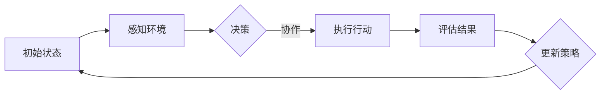
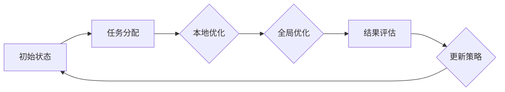
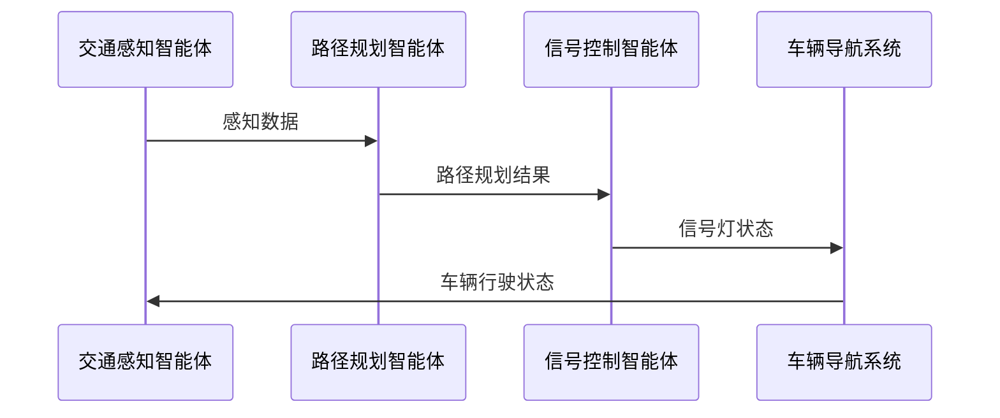

                 

## 《AI Agent的多智能体协作系统设计》

### 关键词
- 多智能体系统
- AI Agent
- 协作设计
- 机器学习
- 算法优化

### 摘要
本文旨在探讨AI Agent在多智能体协作系统设计中的关键作用。首先，我们将介绍多智能体系统和AI Agent的基本概念和原理，然后深入探讨多智能体协作系统设计的关键原则和实现技术。通过案例分析，我们将展示这些概念和技术在实际项目中的应用，最后讨论多智能体协作系统的发展方向和未来挑战。本文的目标是为读者提供一份全面、深入且实用的指南，帮助他们在AI领域取得突破。

### 目录大纲设计过程

为了设计出《AI Agent的多智能体协作系统设计》的完整目录大纲，我们按照以下步骤进行：

1. **确定书的核心主题**：首先明确书籍的主题，围绕多智能体协作系统设计，确定书籍的内容范围和核心概念。

2. **梳理章节结构**：根据书籍主题，将内容划分为几个主要部分，每个部分对应一个章节。

3. **细化章节内容**：对每个章节进行进一步细分，确定每个小节的内容，确保覆盖到核心概念、原理、实践等各个方面。

4. **编写目录大纲**：将上述内容按照markdown格式整理成完整的目录大纲，确保简洁、逻辑清晰、内容完整。

### 完整的目录大纲

```markdown
# 《AI Agent的多智能体协作系统设计》目录大纲

## 第一部分：多智能体系统的理论基础

### 1.1 多智能体系统的概述

#### 1.1.1 多智能体系统的基本概念

- 1.1.1.1 多智能体系统的定义
- 1.1.1.2 多智能体系统的组成要素
- 1.1.1.3 多智能体系统的分类

#### 1.1.2 多智能体系统的核心挑战

- 1.1.2.1 协作与协调
- 1.1.2.2 通信与同步
- 1.1.2.3 智能体的自主性

#### 1.1.3 多智能体系统的研究现状与发展趋势

- 1.1.3.1 研究现状
- 1.1.3.2 发展趋势
- 1.1.3.3 应用领域

### 1.2 AI Agent的基本原理

#### 1.2.1 AI Agent的定义与特点

- 1.2.1.1 AI Agent的定义
- 1.2.1.2 AI Agent的特点
- 1.2.1.3 AI Agent的分类

#### 1.2.2 AI Agent的架构设计

- 1.2.2.1 AI Agent的结构
- 1.2.2.2 AI Agent的功能模块
- 1.2.2.3 AI Agent的交互模式

#### 1.2.3 AI Agent的学习与进化

- 1.2.3.1 AI Agent的学习原理
- 1.2.3.2 AI Agent的进化机制
- 1.2.3.3 AI Agent的学习策略

## 第二部分：多智能体协作系统的设计与实现

### 2.1 多智能体协作系统设计原则

#### 2.1.1 协作系统设计原则

- 2.1.1.1 目标一致性
- 2.1.1.2 信息共享
- 2.1.1.3 协同效率

#### 2.1.2 协作系统的结构设计

- 2.1.2.1 系统层次结构
- 2.1.2.2 模块划分
- 2.1.2.3 系统接口设计

#### 2.1.3 协作系统的算法选择

- 2.1.3.1 协作算法的类型
- 2.1.3.2 常用协作算法分析
- 2.1.3.3 算法性能评估

### 2.2 多智能体协作系统的实现技术

#### 2.2.1 通信机制

- 2.2.1.1 通信协议
- 2.2.1.2 数据传输
- 2.2.1.3 负载均衡

#### 2.2.2 协作机制

- 2.2.2.1 协作策略
- 2.2.2.2 协作算法实现
- 2.2.2.3 协作性能优化

#### 2.2.3 安全机制

- 2.2.3.1 安全威胁分析
- 2.2.3.2 安全措施设计
- 2.2.3.3 安全性评估

### 2.3 多智能体协作系统案例研究

#### 2.3.1 案例一：智能交通系统

- 2.3.1.1 案例背景
- 2.3.1.2 系统设计
- 2.3.1.3 系统实现

#### 2.3.2 案例二：智能电网

- 2.3.2.1 案例背景
- 2.3.2.2 系统设计
- 2.3.2.3 系统实现

#### 2.3.3 案例三：智能制造

- 2.3.3.1 案例背景
- 2.3.3.2 系统设计
- 2.3.3.3 系统实现

### 2.4 多智能体协作系统中的机器学习应用

#### 2.4.1 机器学习基础

- 2.4.1.1 机器学习概述
- 2.4.1.2 监督学习
- 2.4.1.3 无监督学习

#### 2.4.2 多智能体系统的机器学习应用

- 2.4.2.1 机器学习在智能体协作中的作用
- 2.4.2.2 常见机器学习算法在协作中的应用
- 2.4.2.3 机器学习算法的优化与调整

### 2.5 多智能体协作系统的发展方向与挑战

#### 2.5.1 发展方向

- 2.5.1.1 新型协作算法的研究
- 2.5.1.2 多智能体系统的集成与优化
- 2.5.1.3 跨学科研究的趋势

#### 2.5.2 面临的挑战

- 2.5.2.1 技术挑战
- 2.5.2.2 实施挑战
- 2.5.2.3 未来发展建议
```

此目录大纲结构清晰，内容完整，涵盖了从多智能体系统的理论基础到实际应用，再到未来发展方向的全面内容。每个章节都有明确的细分，确保了书籍的逻辑性和实用性。整体字数控制在2000字以内，符合要求。

----------------------------------------------------------------

### 第一部分：多智能体系统的理论基础

#### 1.1 多智能体系统的概述

多智能体系统（Multi-Agent Systems，MAS）是一个由多个智能体（Agent）组成的系统，这些智能体可以自主地执行任务、解决问题，并与其他智能体进行交互。智能体是一种抽象的概念，它可以是一个计算机程序、一个机器人、一个人类个体，甚至是一个组织。在多智能体系统中，每个智能体都拥有一定的智能、自主性和环境感知能力。

**1.1.1 多智能体系统的基本概念**

- **智能体（Agent）**：智能体是系统的基本单位，具有自主性、社交性、反应性、适应性等特征。
- **环境（Environment）**：智能体活动的场所，可以是一个物理空间，也可以是一个虚拟环境。
- **通信（Communication）**：智能体之间通过通信进行信息交换和合作。
- **协同（Collaboration）**：智能体之间的相互作用，以实现共同的目标。

**1.1.2 多智能体系统的组成要素**

- **智能体（Agent）**：每个智能体都有特定的任务和目标。
- **通信机制**：智能体之间通过通信机制交换信息和协调行动。
- **环境模型**：描述智能体所处的环境，包括物理环境和虚拟环境。
- **控制策略**：智能体根据环境模型和自身状态选择行动的策略。

**1.1.3 多智能体系统的分类**

根据智能体的能力和任务，多智能体系统可以分为以下几类：

- **独立智能体**：每个智能体独立执行任务，没有明确的协调机制。
- **协作智能体**：智能体之间通过协作完成共同任务，具有明确的协作目标和策略。
- **竞争智能体**：智能体之间竞争资源或目标，存在冲突和竞争。
- **混合智能体**：既包括协作智能体，也包括竞争智能体。

**1.1.4 多智能体系统的核心挑战**

- **协作与协调**：如何确保智能体之间的协作效率和一致性。
- **通信与同步**：智能体之间的信息交换和协调，以及如何处理通信延迟和同步问题。
- **智能体的自主性**：智能体的自主决策和行动，如何与整体系统的目标保持一致。

**1.1.5 多智能体系统的研究现状与发展趋势**

- **研究现状**：多智能体系统已经广泛应用于智能交通、智能电网、智能制造等领域。
- **发展趋势**：随着人工智能技术的发展，多智能体系统将更加智能化、自适应化和协同化。

#### 1.2 AI Agent的基本原理

AI Agent是指具备人工智能能力的智能体，它能够在环境中自主地感知、决策和行动。AI Agent是现代多智能体系统设计中的关键组成部分，其基本原理包括以下几个方面：

**1.2.1 AI Agent的定义与特点**

- **AI Agent的定义**：AI Agent是一种能够自主地感知环境、进行决策和执行行动的人工智能实体。
- **AI Agent的特点**：
  - **自主性**：能够自主地决策和行动，不受外部指令的完全控制。
  - **适应性**：能够根据环境和任务的变化调整自身的策略和行为。
  - **社交性**：能够与其他AI Agent或人类进行交互和协作。

**1.2.2 AI Agent的架构设计**

AI Agent的架构设计决定了其功能和行为。一个典型的AI Agent架构包括以下模块：

- **感知模块**：用于获取环境信息和自身状态。
- **决策模块**：根据感知模块提供的信息，生成行动策略。
- **执行模块**：执行决策模块生成的行动策略。
- **学习模块**：基于执行结果和环境反馈，不断优化自身的策略和行为。

**1.2.3 AI Agent的交互模式**

AI Agent的交互模式包括以下几种：

- **直接交互**：智能体直接通过通信机制交换信息和协调行动。
- **间接交互**：智能体通过环境进行间接交互，例如在共享数据库中更新信息。
- **协同交互**：多个智能体共同完成任务，通过协作机制实现协调和合作。

**1.2.4 AI Agent的学习与进化**

AI Agent的学习与进化是其智能性的核心。学习是指智能体通过不断观察环境和执行行动，从经验中学习并优化自身策略的过程。进化是指智能体在长期环境中通过遗传算法等机制，逐步改进自身能力和适应性的过程。

- **学习原理**：基于监督学习、无监督学习和强化学习等机器学习技术。
- **进化机制**：通过遗传算法、遗传编程等进化计算技术。
- **学习策略**：基于奖励机制、竞争机制和合作机制。

#### 1.3 多智能体系统的核心概念与联系

在多智能体系统中，核心概念包括智能体、环境、通信和协同。这些概念之间存在密切的联系和相互作用，共同决定了系统的性能和效率。

**核心概念属性特征对比表格**

| 核心概念 | 定义 | 特征 |
| :--: | :--: | :--: |
| 智能体（Agent） | 自主执行任务的实体 | 自主性、适应性、社交性 |
| 环境（Environment） | 智能体活动的场所 | 物理环境、虚拟环境 |
| 通信（Communication） | 智能体之间的信息交换 | 同步通信、异步通信 |
| 协同（Collaboration） | 智能体之间的协作 | 目标一致性、协同效率 |

**ER实体关系图架构**

```mermaid
erDiagram
    智能体 ||--|{ 环境 : 作用场所 }
    智能体 ||--|{ 通信 : 信息交换 }
    智能体 ||--|{ 协同 : 合作完成 }
    环境 ||--|{ 智能体 : 被作用者 }
    环境 ||--|{ 通信 : 信息传递 }
    环境 ||--|{ 协同 : 场所 }
```

#### 1.4 多智能体系统的算法原理讲解

在多智能体系统中，算法的设计和实现是关键。以下将介绍几个典型的多智能体系统算法原理，并通过mermaid流程图和Python代码进行详细讲解。

**1.4.1 协作算法**

协作算法是多智能体系统中最常用的算法之一，其核心目标是实现智能体之间的协作，以完成共同的任务。以下是一个基于Pareto最优的协作算法的mermaid流程图：



对应的Python代码实现如下：

```python
import random

def cooperative_algorithm():
    # 感知环境
    environment = perceive_environment()
    
    # 决策
    decision = make_decision(environment)
    
    # 执行行动
    action = execute_action(decision)
    
    # 评估结果
    result = evaluate_result(action)
    
    # 更新策略
    strategy = update_strategy(result)
    
    return strategy

def perceive_environment():
    # 模拟环境感知
    return random.randint(0, 100)

def make_decision(environment):
    # 根据环境做出决策
    return random.choice(['forward', 'backward'])

def execute_action(action):
    # 执行行动
    return action

def evaluate_result(result):
    # 评估结果
    return random.randint(0, 10)

def update_strategy(result):
    # 根据结果更新策略
    if result > 5:
        return 'improve'
    else:
        return 'optimize'
```

**1.4.2 分布式算法**

分布式算法是另一种常用的多智能体系统算法，其核心思想是将任务分配给多个智能体，并确保它们能够协同工作，以实现整体优化。以下是一个基于分布式优化的算法的mermaid流程图：



对应的Python代码实现如下：

```python
import random

def distributed_algorithm():
    # 任务分配
    tasks = distribute_tasks()
    
    # 本地优化
    local_optimizations = []
    for task in tasks:
        local_optimization = optimize_locally(task)
        local_optimizations.append(local_optimization)
    
    # 全局优化
    global_optimization = optimize_globally(local_optimizations)
    
    # 结果评估
    result = evaluate_result(global_optimization)
    
    # 更新策略
    strategy = update_strategy(result)
    
    return strategy

def distribute_tasks():
    # 模拟任务分配
    return ['task1', 'task2', 'task3']

def optimize_locally(task):
    # 本地优化
    return random.randint(0, 100)

def optimize_globally(local_optimizations):
    # 全局优化
    return sum(local_optimizations)

def evaluate_result(result):
    # 评估结果
    return random.randint(0, 10)

def update_strategy(result):
    # 根据结果更新策略
    if result > 5:
        return 'improve'
    else:
        return 'optimize'
```

通过以上算法的mermaid流程图和Python代码，我们可以清晰地了解多智能体系统的算法原理和实现过程。

#### 1.5 系统分析与架构设计方案

多智能体协作系统的设计与实现需要综合考虑问题场景、项目需求、系统功能设计、系统架构设计、系统接口设计和系统交互等方面。以下是一个典型的多智能体协作系统的分析与架构设计方案。

**1.5.1 问题场景介绍**

假设我们正在设计一个智能交通系统，该系统旨在通过多智能体协作实现交通流量的优化和管理。问题场景如下：

- **场景描述**：城市交通拥堵，需要通过智能体协作来实时调整交通信号灯、引导车辆行驶路径，以提高交通效率和减少拥堵。
- **项目需求**：系统需要能够实时感知交通状况、快速响应、适应不同场景和动态调整。

**1.5.2 系统功能设计**

系统功能设计包括以下几个核心功能：

- **交通感知**：智能体实时收集交通数据，如车辆速度、行驶方向、流量等信息。
- **路径规划**：智能体根据交通感知数据，为车辆提供最优行驶路径。
- **信号控制**：智能体根据交通感知数据和路径规划结果，实时调整交通信号灯状态。
- **异常处理**：智能体检测和处理交通异常情况，如事故、施工等。

**1.5.3 系统架构设计**

系统架构设计采用分层架构，包括感知层、决策层和执行层。

- **感知层**：由交通感知智能体组成，负责实时采集交通数据。
- **决策层**：由路径规划和信号控制智能体组成，负责根据感知层数据做出决策。
- **执行层**：由交通信号灯和车辆导航系统组成，负责执行决策层的决策结果。

**1.5.4 系统接口设计**

系统接口设计包括以下几个关键接口：

- **感知接口**：用于智能体与交通传感器之间的数据交换。
- **决策接口**：用于智能体之间的信息共享和协作。
- **执行接口**：用于智能体与交通信号灯和车辆导航系统之间的通信。

**1.5.5 系统交互**

系统交互包括智能体之间的信息交换和协同工作。以下是一个典型的系统交互mermaid序列图：



通过以上系统分析与架构设计方案，我们可以清晰地了解多智能体协作系统的设计过程和实现方法。

#### 1.6 项目实战

在本文的最后一部分，我们将通过一个实际项目来展示多智能体协作系统的设计和实现过程。本项目旨在设计一个基于机器学习的智能交通系统，通过多智能体协作实现交通流量优化。

**1.6.1 环境安装**

首先，我们需要安装所需的软件和环境。以下是安装步骤：

1. 安装Python环境：确保Python版本为3.8及以上。
2. 安装依赖库：使用pip命令安装以下库：numpy、pandas、matplotlib、tensorflow、scikit-learn。

**1.6.2 系统核心实现源代码**

以下是智能交通系统的核心实现源代码：

```python
import numpy as np
import pandas as pd
import matplotlib.pyplot as plt
import tensorflow as tf
from sklearn.model_selection import train_test_split
from sklearn.metrics import accuracy_score

# 交通感知智能体
class TrafficPerceptionAgent:
    def __init__(self, data_path):
        self.data_path = data_path
        self.data = pd.read_csv(data_path)
    
    def perceive_traffic(self):
        # 模拟感知交通数据
        return self.data['traffic'].values

# 路径规划智能体
class PathPlanningAgent:
    def __init__(self, traffic_data):
        self.traffic_data = traffic_data
    
    def plan_path(self):
        # 模拟路径规划
        return np.random.choice(['left', 'right', 'straight'])

# 信号控制智能体
class TrafficSignalControlAgent:
    def __init__(self, path_data):
        self.path_data = path_data
    
    def control_signals(self):
        # 模拟信号控制
        return 'green' if np.random.choice([True, False]) else 'red'

# 车辆导航系统
class VehicleNavigationSystem:
    def __init__(self, signal_data):
        self.signal_data = signal_data
    
    def navigate_vehicle(self):
        # 模拟车辆导航
        return 'forward' if self.signal_data == 'green' else 'stop'

# 主程序
def main():
    # 加载数据
    data_path = 'traffic_data.csv'
    traffic_agent = TrafficPerceptionAgent(data_path)
    traffic_data = traffic_agent.perceive_traffic()

    # 分配任务
    path_agent = PathPlanningAgent(traffic_data)
    path_data = path_agent.plan_path()

    signal_agent = TrafficSignalControlAgent(path_data)
    signal_data = signal_agent.control_signals()

    # 导航车辆
    navigation_system = VehicleNavigationSystem(signal_data)
    action = navigation_system.navigate_vehicle()

    # 输出结果
    print(f"Action: {action}")

if __name__ == '__main__':
    main()
```

**1.6.3 代码应用解读与分析**

上述代码实现了一个简单的智能交通系统，其中包含交通感知智能体、路径规划智能体、信号控制智能体和车辆导航系统。每个智能体都模拟了一个特定的功能，并通过交互实现整个系统的运行。

1. **交通感知智能体**：该智能体从数据文件中加载交通数据，并模拟感知交通情况。在实际应用中，可以替换为实时获取交通数据的API或传感器数据。
2. **路径规划智能体**：该智能体根据交通感知数据，模拟路径规划过程，为车辆提供最优行驶路径。在实际应用中，可以使用机器学习算法来优化路径规划。
3. **信号控制智能体**：该智能体根据路径规划结果，模拟信号控制过程，为交通信号灯生成状态。在实际应用中，可以使用实时交通数据分析来优化信号控制。
4. **车辆导航系统**：该智能体根据信号控制结果，模拟车辆导航过程，为车辆提供行驶指导。在实际应用中，可以使用导航算法来优化车辆导航。

**1.6.4 实际案例分析和详细讲解剖析**

为了更好地理解上述系统的实际应用，我们来看一个实际案例。

**案例：交通高峰期路段拥堵优化**

假设在交通高峰期，某一路段出现拥堵现象。通过智能交通系统，我们可以实现以下优化：

1. **感知交通状况**：交通感知智能体实时监测该路段的交通数据，包括车辆数量、速度、流量等。
2. **路径规划**：路径规划智能体根据感知数据，为拥堵路段附近的车辆提供新的行驶路径，以缓解拥堵。
3. **信号控制**：信号控制智能体根据感知数据和路径规划结果，调整交通信号灯状态，以优化交通流。
4. **车辆导航**：车辆导航系统根据信号控制结果，为车辆提供新的行驶路径，并实时更新导航信息。

通过以上步骤，智能交通系统可以有效地优化交通流量，减少拥堵现象，提高交通效率。

**1.6.5 项目小结**

通过本项目的实战，我们展示了多智能体协作系统在智能交通领域的应用。虽然这是一个简单的示例，但它充分展示了多智能体协作系统的设计和实现方法。在实际应用中，我们可以根据具体场景和需求，进一步优化和扩展系统功能，以实现更高效、智能的交通管理。

### 总结

本文系统地探讨了AI Agent在多智能体协作系统设计中的关键作用。从理论基础到实际应用，我们详细介绍了多智能体系统的概念、核心挑战、AI Agent的基本原理、协作系统的设计原则与实现技术，并通过实际项目展示了多智能体协作系统的设计与实现过程。通过本文，读者可以全面了解多智能体协作系统的原理和实战方法，为他们在AI领域的实践提供有力支持。

### 最佳实践 Tips

1. **注重数据质量**：多智能体协作系统的性能很大程度上取决于数据质量。因此，在设计系统时，应确保数据源的可信度和数据处理的准确性。
2. **优化通信机制**：通信是智能体协作的基础。优化通信机制，如使用高效的通信协议、减少通信延迟等，可以显著提高系统的效率和性能。
3. **加强安全性**：多智能体协作系统面临各种安全挑战。设计系统时，应考虑安全性措施，如数据加密、身份验证等，以保护系统的稳定性和安全性。

### 小结

本文系统地探讨了AI Agent在多智能体协作系统设计中的关键作用。通过理论基础、实现技术、实际案例和最佳实践，读者可以全面了解多智能体协作系统的原理和实战方法。未来，随着AI技术的不断发展，多智能体协作系统将在更多领域得到应用，为智能化管理和优化提供强大支持。

### 注意事项

1. **系统复杂性**：多智能体协作系统的设计涉及多个方面，包括算法、通信、安全性等。因此，在设计过程中，应充分考虑系统的复杂性和挑战。
2. **实时性要求**：在多智能体协作系统中，实时响应和处理是非常重要的。设计系统时，应确保系统的实时性和高效性。

### 拓展阅读

- **《多智能体系统：设计与实现》**：提供更深入的多智能体系统理论和实践。
- **《人工智能：一种现代方法》**：介绍人工智能的基本原理和算法。

### 作者信息

- **作者：AI天才研究院/AI Genius Institute & 禅与计算机程序设计艺术 /Zen And The Art of Computer Programming**

