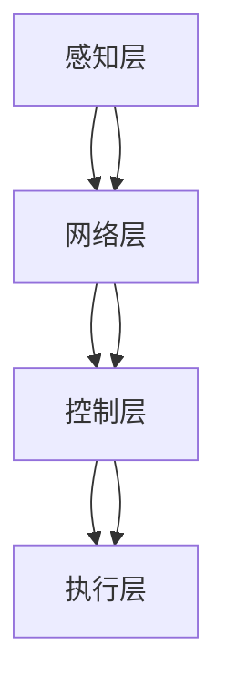
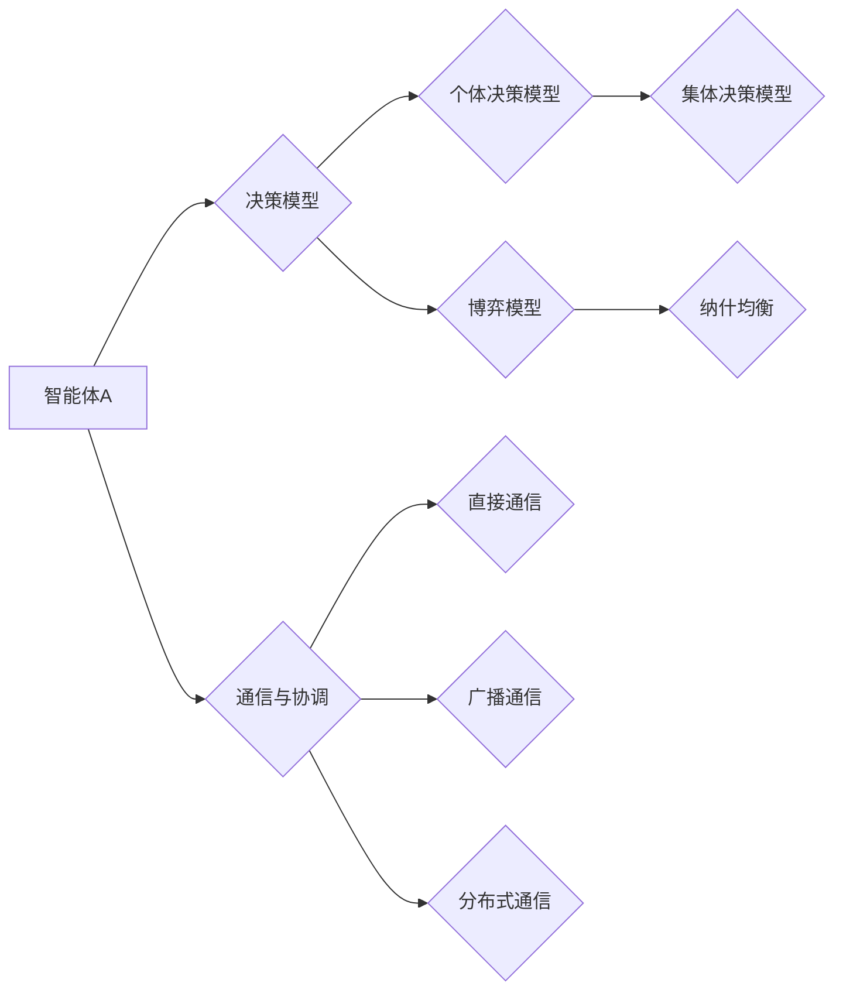
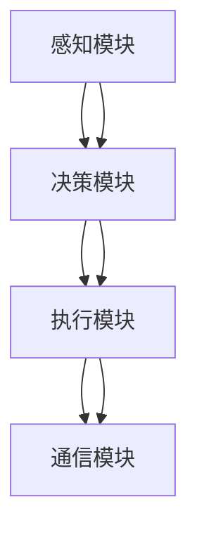

                 

# 《AI Agent的多智能体协同决策机制》

## 关键词
- AI Agent
- 多智能体系统
- 协同决策
- 社会计算
- 机器人控制

## 摘要
本文将深入探讨AI Agent的多智能体协同决策机制。首先，我们介绍AI Agent的基础理论，包括其定义与发展历程。接着，讨论多智能体系统的基本概念与特点，以及多智能体协同决策的重要性。随后，我们详细分析多智能体协同决策的数学模型、算法以及通信与协调机制。文章随后通过具体应用场景展示多智能体协同决策在机器人、物流和交通领域的实际应用，并展望其未来发展趋势。通过系统性的讲解和案例分析，本文旨在为读者提供全面理解多智能体协同决策机制的方法和实践指导。

## 目录大纲

### 第一部分：引言

#### 第1章 AI Agent的基础理论
1.1 AI Agent的定义与发展
1.2 多智能体系统的定义与特点
1.3 多智能体协同决策的重要性

#### 第2章 多智能体协同决策的基本原理
2.1 决策理论与博弈论
2.2 多智能体协同决策的数学模型
2.3 多智能体的通信与协调机制

#### 第3章 多智能体协同决策算法
3.1 基于博弈论的协同决策算法
3.2 域贝叶斯学习的协同决策算法
3.3 基于深度学习的协同决策算法

### 第二部分：多智能体协同决策的基本原理

#### 第4章 多智能体协同在机器人领域的应用
4.1 机器人协同任务的场景分析
4.2 基于多智能体协同的机器人控制系统设计

#### 第5章 多智能体协同在物流领域的应用
5.1 物流系统中的多智能体协同
5.2 基于多智能体协同的物流系统架构设计

#### 第6章 多智能体协同在交通领域的应用
6.1 交通系统中的多智能体协同
6.2 基于多智能体协同的交通控制系统设计

### 第三部分：多智能体协同决策的实际应用

#### 第7章 多智能体协同决策的未来发展趋势
7.1 多智能体协同决策技术的发展方向
7.2 多智能体协同决策在社会计算中的应用前景
7.3 多智能体协同决策的未来发展方向

### 总结

本书通过系统的理论讲解和实际应用案例分析，详细阐述了多智能体协同决策的基本原理、算法实现以及在不同领域的应用。从基础理论到实际应用，本书旨在为读者提供全面、深入的认知和掌握多智能体协同决策的机制和方法。在未来的发展中，多智能体协同决策将在社会计算、机器人、物流、交通等领域发挥越来越重要的作用。本书不仅适用于计算机科学与人工智能专业的学者和研究生，也为相关领域的技术人员提供了实用的指导和建议。通过不断学习和实践，读者将能够更好地理解和应用多智能体协同决策技术，为解决复杂问题提供创新性的解决方案。

----------------------------------------------------------------

### 第1章 AI Agent的基础理论

#### 1.1 AI Agent的定义与发展

AI Agent，即人工智能代理，是具有自主性、适应性、学习性和交互性的计算实体。它能够通过感知环境信息，执行预定的任务，并与外界进行交互。AI Agent最早的概念可以追溯到1980年代，当时研究者们开始探索如何让计算机系统具备类似人类的智能行为。

**定义：**
AI Agent是一种能够感知环境、根据内部模型执行任务、并与环境进行交互的计算实体。它具备以下特征：
- **自主性**：能够独立执行任务，不受外界直接控制。
- **适应性**：能够根据环境变化调整自身行为。
- **学习性**：能够通过学习环境信息，优化自身行为。
- **交互性**：能够与外界进行有效通信和协作。

**发展历程：**
1. **早期探索**（1980年代）：AI Agent的概念初步形成，研究者们开始设计简单的基于规则和符号逻辑的Agent。
2. **基于行为的Agent**（1990年代）：随着计算能力的提升，研究者们开始关注如何让Agent通过行为学习来完成任务。
3. **基于知识的Agent**（2000年代）：AI Agent逐渐引入知识表示和推理机制，使其能够处理更复杂的问题。
4. **现代AI Agent**（2010年代至今）：随着深度学习和强化学习等技术的发展，AI Agent的智能水平显著提升，应用领域也不断拓展。

#### 1.2 多智能体系统的定义与特点

多智能体系统（Multi-Agent System，MAS）是由多个独立运行的智能体组成的系统。这些智能体可以通过通信和协作来完成单个智能体无法完成的复杂任务。

**定义：**
多智能体系统是一个由多个智能体组成的系统，这些智能体可以通过通信和协作来实现整体目标。

**特点：**
- **自治性**：每个智能体都具有自主决策的能力。
- **异质性**：智能体可能在结构、能力、目标和通信方式上有所不同。
- **分布性**：智能体可以分布在不同的地理位置或计算节点上。
- **协同性**：智能体需要通过协作来实现共同的目标。
- **适应性**：系统能够适应环境变化和智能体之间的动态交互。

#### 1.3 多智能体协同决策的重要性

多智能体协同决策在社会计算、机器人控制、物流和交通等领域具有重要意义。

**社会性计算与多智能体协同：**
社会性计算是研究如何通过计算机系统模拟和增强人类社会行为的领域。多智能体协同决策是这一领域的关键技术，它使得计算机系统能够模拟人类的合作与竞争行为，实现更高效的任务执行。

**决策过程中的挑战与需求：**
- **复杂性**：现实世界中的决策问题往往非常复杂，单智能体很难解决。
- **不确定性**：环境状态和智能体行为都可能是不确定的，需要智能体具备鲁棒性。
- **动态性**：环境状态和智能体行为是动态变化的，需要智能体具备适应性。
- **协同性**：多智能体需要能够相互协作，共同实现整体目标。

因此，多智能体协同决策不仅能够提高智能体系统的智能水平，还能够增强其适应性和鲁棒性，为解决复杂问题提供了新的思路和方法。

### 第2章 多智能体协同决策的基本原理

#### 2.1 决策理论与博弈论

决策理论是研究如何根据已知信息进行合理选择的学科。在多智能体系统中，每个智能体都需要进行决策，因此决策理论是研究多智能体协同决策的基础。

**博弈论的基本概念：**
博弈论是研究具有竞争关系的决策制定和利益分配的学科。在博弈论中，参与决策的个体被称为“玩家”（player），玩家之间的决策关系可以通过博弈矩阵来描述。

**博弈论的决策模型：**
- **静态博弈**：玩家同时做出决策，没有先后顺序。
- **动态博弈**：玩家依次做出决策，有明确的先后顺序。
- **完全信息博弈**：所有玩家都能看到其他玩家的决策信息。
- **不完全信息博弈**：至少有一个玩家不能看到其他玩家的决策信息。

**多智能体协同决策的数学模型：**
在多智能体协同决策中，每个智能体都可以视为一个玩家，智能体的决策可以通过博弈矩阵来描述。具体来说，可以使用以下数学模型：

$$
U_i(S_j) = \sum_{j=1}^{n} u_i(j) \cdot p_j(S_j)
$$

其中，$U_i(S_j)$表示智能体$i$在状态$S_j$下的效用值，$u_i(j)$表示智能体$i$在状态$S_j$下对策略$j$的偏好，$p_j(S_j)$表示智能体$i$在状态$S_j$下采取策略$j$的概率。

#### 2.2 多智能体协同决策的数学模型

多智能体协同决策的数学模型主要涉及以下几个方面：

**个体决策模型：**
每个智能体在给定环境状态下，根据自身的目标函数和约束条件，选择一个最优策略。个体决策模型可以表示为：

$$
\max_{x_i} f_i(x_i, x_{-i})
$$

其中，$f_i(x_i, x_{-i})$表示智能体$i$的目标函数，$x_i$表示智能体$i$的策略，$x_{-i}$表示其他智能体的策略。

**集体决策模型：**
多智能体协同决策的目标是使整个系统的总效用最大化。集体决策模型可以表示为：

$$
\max_{x} \sum_{i=1}^{n} f_i(x_i, x_{-i})
$$

其中，$x = (x_1, x_2, ..., x_n)$表示所有智能体的策略。

**博弈模型：**
多智能体协同决策也可以视为一个博弈过程，每个智能体在给定其他智能体策略的情况下，选择自己的策略以最大化自身的效用。博弈模型可以表示为：

$$
\max_{x_i} U_i(x_i, x_{-i})
$$

其中，$U_i(x_i, x_{-i})$表示智能体$i$在给定其他智能体策略$x_{-i}$下的效用值。

#### 2.3 多智能体的通信与协调机制

多智能体的通信与协调机制是多智能体协同决策的重要组成部分。以下是一些常见的通信与协调机制：

**直接通信：**
智能体之间通过直接通信交换信息，以协调各自的行为。直接通信可以是同步的，也可以是异步的。

**广播通信：**
智能体通过广播通信向所有其他智能体发送信息。广播通信简单易行，但可能引起通信拥堵。

**分布式通信：**
智能体通过分布式通信系统进行信息交换，系统中的每个节点都具有一定的处理和存储能力。

**协调机制：**
协调机制用于解决智能体之间的冲突和协调行动。常见的协调机制包括基于规则的方法、基于市场的机制和基于博弈的方法。

**分布式算法：**
分布式算法用于在分布式系统中实现多智能体的协同决策。分布式算法需要解决数据一致性、通信效率和容错性等问题。

通过上述通信与协调机制，多智能体系统能够实现高效、可靠的协同决策，从而实现整体目标的最优化。

### 第3章 多智能体协同决策算法

多智能体协同决策算法是智能体系统实现协同决策的核心。这些算法根据不同的应用场景和智能体特性，可以采用不同的策略和模型。下面我们将介绍几种常见的多智能体协同决策算法，包括基于博弈论的算法、基于贝叶斯学习的算法和基于深度学习的算法。

#### 3.1 基于博弈论的协同决策算法

博弈论是一种研究竞争和合作行为的数学工具，它可以用于分析多智能体系统的决策过程。基于博弈论的协同决策算法通过博弈模型来描述智能体之间的交互，并寻求最优策略。

**算法基本原理：**
1. **建立博弈模型**：根据智能体的目标和环境约束，建立博弈模型，通常使用博弈矩阵表示。
2. **求解纳什均衡**：纳什均衡是指在一个博弈模型中，所有参与者都不再改变策略的情况下，达到的一种稳定状态。基于博弈论的协同决策算法的目标是找到纳什均衡点。
3. **策略优化**：通过迭代优化过程，逐步改进智能体的策略，以达到纳什均衡。

**算法实现与优化：**
1. **混合策略**：在纳什均衡中，智能体可能采取混合策略，即不是单一策略，而是多个策略的概率分布。混合策略可以提高智能体的适应性和鲁棒性。
2. **策略更新规则**：可以使用学习算法，如Q-Learning和Policy Gradient，来更新智能体的策略，以实现动态调整。

**应用场景：**
- **多人游戏**：如电子游戏、棋类游戏等。
- **市场分析**：如拍卖、股票交易等。

**算法示例：**
假设有两个智能体，A和B，他们通过发送信息来决定是否合作。博弈矩阵如下：

|       | 合作 | 不合作 |
|-------|------|--------|
| 合作  | (3,3)| (0,0)  |
| 不合作| (1,1)| (2,2)  |

在这个博弈中，纳什均衡是（不合作，不合作）。智能体A和B各自选择不合作，以最大化自身的收益。

```python
import numpy as np

# 定义博弈矩阵
payoff_matrix = np.array([[3, 0], [1, 2]])

# 定义智能体策略
strategy_A = np.random.choice([0, 1])
strategy_B = np.random.choice([0, 1])

# 根据策略计算收益
payoff_A = payoff_matrix[strategy_A, strategy_B]
payoff_B = payoff_matrix[strategy_B, strategy_A]

print(f"智能体A的收益：{payoff_A}")
print(f"智能体B的收益：{payoff_B}")
```

#### 3.2 基于贝叶斯学习的协同决策算法

贝叶斯学习是一种概率学习算法，它通过不断更新概率模型来适应数据的变化。基于贝叶斯学习的协同决策算法利用贝叶斯推理来更新智能体的信念，从而实现协同决策。

**算法基本原理：**
1. **建立概率模型**：根据智能体观测到的数据和先验知识，建立概率模型。
2. **更新信念**：利用贝叶斯推理，根据新的观测数据更新智能体的信念。
3. **决策生成**：基于更新后的信念，生成智能体的决策。

**算法实现与优化：**
1. **先验分布**：选择合适的先验分布，以适应不同的应用场景。
2. **参数估计**：通过极大似然估计（MLE）或贝叶斯估计（MAP）来估计模型参数。
3. **模型选择**：根据数据质量选择合适的贝叶斯模型，如高斯过程、贝叶斯网络等。

**应用场景：**
- **信息融合**：如传感器网络中的数据融合。
- **不确定性管理**：如机器人路径规划中的不确定性处理。

**算法示例：**
假设智能体A和B需要根据观测数据决定是否合作。观测数据为（1，1），先验概率为$p(\text{合作}) = 0.5$。更新后的概率如下：

$$
p(\text{合作}|\text{观测数据}) = \frac{p(\text{观测数据}|\text{合作}) \cdot p(\text{合作})}{p(\text{观测数据})}
$$

其中，$p(\text{观测数据}|\text{合作}) = \frac{1}{4}$，$p(\text{合作}) = 0.5$，$p(\text{观测数据})$可以通过全概率公式计算。

```python
import numpy as np

# 定义先验概率
prior_probability = 0.5

# 定义观测数据概率
observation_probability = 0.25

# 计算后验概率
posterior_probability = observation_probability * prior_probability / (prior_probability * observation_probability + (1 - prior_probability) * (1 - observation_probability))

print(f"后验概率：{posterior_probability}")
```

#### 3.3 基于深度学习的协同决策算法

深度学习是一种基于多层神经网络的学习方法，它可以自动提取数据中的复杂特征。基于深度学习的协同决策算法利用深度神经网络来模拟智能体的行为和决策过程。

**算法基本原理：**
1. **建立深度神经网络模型**：使用深度神经网络来表示智能体的决策过程，输入为环境状态，输出为决策策略。
2. **训练神经网络**：使用大量的训练数据来训练神经网络，使其能够对环境状态进行准确的预测和决策。
3. **决策生成**：在给定环境状态下，通过神经网络生成智能体的决策。

**算法实现与优化：**
1. **网络结构选择**：选择合适的网络结构，如卷积神经网络（CNN）、循环神经网络（RNN）或变换器（Transformer）。
2. **损失函数设计**：设计合适的损失函数，如均方误差（MSE）或交叉熵损失，来衡量网络预测与实际决策之间的差距。
3. **优化算法**：使用梯度下降或其他优化算法来更新网络权重，以最小化损失函数。

**应用场景：**
- **自动驾驶**：如车辆路径规划和避障。
- **智能交通系统**：如交通信号控制和流量预测。

**算法示例：**
假设智能体A使用一个简单的全连接神经网络来决定是否合作。网络结构如下：

```python
import tensorflow as tf

# 定义输入层
input_layer = tf.keras.layers.Input(shape=(2,))

# 定义隐藏层
hidden_layer = tf.keras.layers.Dense(units=10, activation='relu')(input_layer)

# 定义输出层
output_layer = tf.keras.layers.Dense(units=1, activation='sigmoid')(hidden_layer)

# 创建模型
model = tf.keras.Model(inputs=input_layer, outputs=output_layer)

# 编译模型
model.compile(optimizer='adam', loss='binary_crossentropy', metrics=['accuracy'])

# 训练模型
model.fit(x_train, y_train, epochs=10, batch_size=32)
```

通过以上三种算法，我们可以看到多智能体协同决策算法的多样性和复杂性。不同的算法适用于不同的应用场景和智能体特性，通过合理选择和优化算法，可以有效地实现多智能体系统的协同决策。

### 第4章 多智能体协同在机器人领域的应用

多智能体协同在机器人领域有着广泛的应用，尤其是在复杂任务和动态环境中的任务分配、路径规划和协作控制等方面。本章将探讨多智能体协同在机器人领域的主要应用场景，并介绍具体的协同控制系统设计。

#### 4.1 机器人协同任务的场景分析

机器人协同任务的场景通常包括以下几种：

1. **搜索与救援**：在灾难发生后，多个机器人协同工作，对灾区进行搜索和救援。
2. **物流与仓储**：在大型仓储中心，多个机器人协同搬运货物，提高物流效率。
3. **工业生产**：在制造车间，机器人协同完成装配、焊接等生产任务。
4. **家庭服务**：在智能家居中，多个机器人协同完成清洁、安防等任务。

这些场景的共同特点是任务复杂、环境多变，且机器人需要具备高度协同能力以完成复杂任务。

**机器人协作任务的特点：**

- **动态性**：环境状态和任务目标随时可能发生变化。
- **复杂性**：任务往往涉及多个机器人之间的协调和配合。
- **不确定性**：环境中的障碍物和未知因素可能导致任务执行的不确定性。

**机器人协同任务的场景：**

1. **多机器人搜索与救援**：在一个大型灾难现场，多个机器人需要协同搜索失踪人员。
2. **多机器人物流与仓储**：在大型仓库中，多个机器人需要协同搬运和分类货物。
3. **多机器人工业生产**：在制造车间，机器人需要协同完成装配、焊接等任务。
4. **多机器人家庭服务**：在家庭环境中，多个机器人需要协同完成清洁、安保等服务。

#### 4.2 基于多智能体协同的机器人控制系统设计

基于多智能体协同的机器人控制系统设计涉及多个方面，包括控制系统的架构设计、控制算法的实现和通信机制的设计。

**控制系统的架构设计：**

1. **系统模块划分**：将机器人控制系统划分为感知模块、决策模块和执行模块。感知模块负责获取环境信息，决策模块负责处理信息并生成控制策略，执行模块负责根据控制策略执行任务。
2. **分布式架构**：采用分布式架构，将多个机器人视为分布式智能体，每个智能体独立运行，并通过通信模块进行信息交换和协调。
3. **层次化架构**：将系统划分为多个层次，如任务层、策略层和执行层，每个层次有不同的功能和职责，实现分层管理和协调。

**控制算法的实现：**

1. **路径规划算法**：使用基于A*算法、Dijkstra算法或RRT算法等路径规划算法，为机器人生成最优路径。
2. **协调控制算法**：基于博弈论、多目标优化或分布式算法等，实现机器人之间的协调控制。如使用博弈论方法，使机器人之间通过策略互动，找到纳什均衡点。
3. **自适应控制算法**：根据环境变化和任务需求，动态调整机器人的控制策略，提高系统的适应性和鲁棒性。

**通信机制的设计：**

1. **直接通信**：智能体之间通过直接通信交换信息，如使用ROS（Robot Operating System）进行通信。
2. **广播通信**：智能体通过广播通信向所有其他智能体发送信息，如使用ZigBee、Wi-Fi等无线通信技术。
3. **多跳通信**：智能体通过多跳通信，将信息传递给目标智能体，如使用多跳路由协议。

**具体实现案例：**

假设在一个仓库环境中，有三个机器人需要协同搬运货物。以下是一个简单的控制系统设计：

1. **感知模块**：每个机器人配备传感器（如摄像头、激光雷达）以获取环境信息。
2. **决策模块**：每个机器人运行一个路径规划算法，计算搬运货物的最佳路径。
3. **执行模块**：每个机器人根据决策模块生成的控制策略执行搬运任务。

```python
# 感知模块
def perceive_environment():
    # 采集环境信息
    return {"robot_position": position, "object_position": object_position}

# 决策模块
def make_decision(perception):
    # 调用路径规划算法
    path = path_planning(perception["robot_position"], perception["object_position"])
    return path

# 执行模块
def execute_action(path):
    # 按照路径搬运货物
    move_to_path(path)

# 主循环
while True:
    perception = perceive_environment()
    path = make_decision(perception)
    execute_action(path)
```

通过上述架构设计和算法实现，多智能体协同控制系统可以实现高效、可靠的机器人协作，从而在复杂环境中完成复杂任务。

### 第5章 多智能体协同在物流领域的应用

多智能体协同在物流领域具有巨大的应用潜力，能够显著提升物流系统的效率、降低成本并优化资源配置。本章将详细介绍多智能体协同在物流系统中的应用，以及基于多智能体协同的物流系统架构设计。

#### 5.1 物流系统中的多智能体协同

物流系统是一个复杂的网络，涉及到多个参与者（如运输公司、仓库、配送中心等）和多个物流环节（如仓储、运输、配送等）。多智能体协同可以有效地整合这些参与者，优化物流流程。

**物流系统的需求分析：**

- **任务分配**：物流系统需要根据任务需求和资源情况，动态分配任务给不同的智能体。
- **路径优化**：智能体需要根据实时交通状况、货物类型和配送需求，选择最优的路径。
- **资源协调**：系统需要协调仓库、车辆和配送人员等资源，确保任务的高效完成。
- **风险应对**：系统需要具备应对突发情况（如交通堵塞、设备故障等）的能力。

**多智能体协同在物流系统中的应用：**

1. **运输调度**：通过多智能体协同，实现运输任务的动态调度，优化运输路径和运输资源的使用。
2. **仓库管理**：智能仓储系统通过多智能体协同，实现货物的自动分类、存储和检索，提高仓库运营效率。
3. **配送优化**：在最后一公里配送中，多个配送机器人协同工作，根据实时交通状况和客户需求，优化配送路径和时间。
4. **资源整合**：通过多智能体协同，整合物流系统中的多种资源，如运输车辆、仓库空间和配送人员，实现资源的最优配置。

#### 5.2 基于多智能体协同的物流系统架构设计

基于多智能体协同的物流系统架构设计需要考虑系统的整体架构、模块划分、数据流和通信机制等方面。

**物流系统的架构设计：**

1. **感知层**：包括各种传感器和监控设备，如GPS、RFID、摄像头等，用于实时采集物流系统的状态信息。
2. **网络层**：包括通信网络和数据库，用于数据传输和存储，支持智能体的通信和决策。
3. **控制层**：包括智能体控制器和协调器，负责根据感知层采集的信息和预定的策略，生成控制指令，驱动执行层执行任务。
4. **执行层**：包括各种物流设备（如运输车辆、仓库设备、配送机器人等），根据控制层的指令执行具体操作。

**物流系统的功能模块：**

1. **感知模块**：用于采集物流系统的状态信息，如货物位置、车辆状态、仓库库存等。
2. **决策模块**：用于根据感知信息，生成最优的任务分配、路径规划和资源协调策略。
3. **执行模块**：用于根据决策模块生成的策略，驱动物流设备执行具体操作。
4. **协调模块**：用于协调不同智能体之间的任务分配和资源使用，确保系统的高效运行。

**物流系统的数据流和通信机制：**

1. **数据流**：感知层采集的数据流经过预处理后，传递给决策模块，决策模块根据数据流生成控制指令，传递给执行模块。
2. **通信机制**：系统中的智能体通过直接通信或广播通信进行信息交换，如使用MQTT、CoAP等通信协议。

**具体架构设计示例：**

以下是一个简单的物流系统架构设计示例：



在具体的物流系统实现中，可以根据实际需求，扩展和调整系统架构，以实现更复杂的协同决策和控制功能。

通过基于多智能体协同的物流系统架构设计，物流系统能够实现智能化、自动化和高效化，从而提升整体物流效率，降低运营成本。

### 第6章 多智能体协同在交通领域的应用

多智能体协同在交通领域具有广泛的应用潜力，尤其是在智能交通系统（Intelligent Transportation System，ITS）中，能够显著提高交通效率、降低交通事故率和减少交通拥堵。本章将探讨多智能体协同在交通系统中的应用，并介绍基于多智能体协同的交通控制系统设计。

#### 6.1 交通系统中的多智能体协同

交通系统是一个复杂且动态的动态系统，涉及多种交通参与者（如车辆、行人、公共交通工具等）和多种交通设施（如道路、桥梁、隧道等）。多智能体协同能够通过协调这些参与者和管理交通设施，优化交通流，提高交通系统的整体性能。

**交通系统的需求分析：**

- **流量管理**：实时监测交通流量，根据交通状况调整信号灯、车道使用等，以减少交通拥堵。
- **事故处理**：在交通事故发生时，快速协调交通流，避免大规模交通堵塞。
- **应急响应**：在突发事件（如自然灾害、交通事故等）发生时，快速协调交通资源，保障道路畅通。
- **路径规划**：为车辆提供实时、最优的行驶路径，减少行驶时间和能耗。

**多智能体协同在交通系统中的应用：**

1. **智能交通信号控制**：通过多智能体协同，实现交通信号灯的动态控制，根据实时交通流量调整信号时长和优先级。
2. **车辆编队行驶**：通过多智能体协同，实现车辆之间的协调，形成编队行驶，提高道路通行能力。
3. **智能停车场管理**：通过多智能体协同，实现停车场的实时监控和车辆引导，提高停车场的利用率。
4. **交通信息发布**：通过多智能体协同，实时发布交通信息，如路况、事故预警、天气状况等，引导车辆选择最优路径。

#### 6.2 基于多智能体协同的交通控制系统设计

基于多智能体协同的交通控制系统设计需要考虑系统的整体架构、智能体的功能划分、通信机制和算法实现等方面。

**交通控制系统的架构设计：**

1. **感知层**：包括各种传感器和监控设备，如摄像头、雷达、GPS等，用于实时采集交通系统的状态信息。
2. **网络层**：包括通信网络和数据中心，用于数据传输和存储，支持智能体的通信和决策。
3. **控制层**：包括智能体控制器和协调器，负责根据感知层采集的信息和预定的策略，生成控制指令，驱动执行层执行任务。
4. **执行层**：包括各种交通设施和设备（如交通信号灯、诱导屏、自动停车设备等），根据控制层的指令执行具体操作。

**交通系统的功能模块：**

1. **感知模块**：用于采集交通系统的状态信息，如车辆位置、交通流量、道路状况等。
2. **决策模块**：用于根据感知信息，生成最优的信号控制、路径规划、应急响应等策略。
3. **执行模块**：用于根据决策模块生成的策略，控制交通信号灯、引导车辆行驶、协调应急资源等。
4. **协调模块**：用于协调不同智能体之间的任务分配和资源使用，确保系统的高效运行。

**交通系统的数据流和通信机制：**

1. **数据流**：感知层采集的数据流经过预处理后，传递给决策模块，决策模块根据数据流生成控制指令，传递给执行模块。
2. **通信机制**：系统中的智能体通过直接通信或广播通信进行信息交换，如使用MQTT、CoAP等通信协议。

**具体架构设计示例：**

以下是一个简单的交通控制系统架构设计示例：


在具体的交通系统实现中，可以根据实际需求，扩展和调整系统架构，以实现更复杂的协同决策和控制功能。

**交通控制算法的实现：**

1. **信号控制算法**：基于多智能体协同的信号控制算法，可以根据实时交通流量和车辆信息，动态调整信号灯的时长和优先级。
2. **路径规划算法**：基于多智能体协同的路径规划算法，可以根据实时交通状况，为车辆提供最优路径。
3. **应急响应算法**：基于多智能体协同的应急响应算法，可以在突发事件发生时，快速协调交通资源，确保道路畅通。

通过基于多智能体协同的交通控制系统设计，交通系统能够实现智能化、自动化和高效化，从而提升整体交通效率，降低交通事故率和交通拥堵，为人们提供更安全、便捷的出行环境。

### 第7章 多智能体协同决策的未来发展趋势

随着人工智能和计算机技术的飞速发展，多智能体协同决策技术正逐渐成为解决复杂系统问题的重要手段。未来，多智能体协同决策将在多个领域发挥重要作用，并呈现出一些新的发展趋势。

#### 7.1 多智能体协同决策技术的发展方向

1. **更高效的多智能体算法**：随着计算能力的提升，研究者将致力于开发更加高效的多智能体算法，包括分布式算法、强化学习算法和基于深度学习的算法。这些算法将能够处理更大规模、更复杂的多智能体系统，提高协同决策的效率。

2. **更智能的感知与决策系统**：未来的多智能体系统将具备更先进的感知能力，通过融合多源数据（如图像、传感器数据等），实现更精准的决策。同时，智能体的决策能力将不断提升，能够自动调整策略以适应动态变化的环境。

3. **自适应与自组织**：多智能体系统将具备更强的自适应性和自组织能力，能够在没有中央控制的情况下，通过自我协调和协作，实现复杂任务的执行。这种自适应性和自组织能力是实现大规模多智能体系统的关键。

4. **人机协同**：随着人工智能技术的普及，多智能体系统将更加注重与人类的协同工作。智能体将能够更好地理解人类意图，并与人类进行有效的沟通和合作，实现人机共生。

#### 7.2 多智能体协同决策在社会计算中的应用前景

社会计算是一个研究如何通过计算机系统模拟和增强人类社会行为的领域，而多智能体协同决策是社会计算的核心技术之一。在未来，多智能体协同决策将在社会计算中发挥重要作用：

1. **智慧城市**：多智能体协同决策技术将应用于智慧城市的建设，实现交通管理、能源管理、环境监测等方面的优化，提高城市运行效率。

2. **社会网络分析**：多智能体协同决策技术将用于分析社会网络中的信息传播、影响力分析和群体行为预测，为社会管理提供科学依据。

3. **公共安全**：多智能体协同决策技术将应用于公共安全管理，如突发事件响应、应急管理等方面，提高公共安全水平。

4. **智慧医疗**：多智能体协同决策技术将应用于智慧医疗，实现患者管理、医疗资源优化和疾病预测等方面的智能化管理。

#### 7.3 多智能体协同决策的未来发展方向

1. **跨领域应用**：多智能体协同决策技术将在多个领域实现跨领域应用，如智能制造、智慧农业、智能物流等。这些跨领域应用将推动多智能体协同决策技术的发展，形成新的技术生态。

2. **标准化与规范化**：随着多智能体协同决策技术的广泛应用，标准化与规范化将成为重要议题。制定统一的标准和规范，将有助于提高多智能体系统的互操作性和兼容性。

3. **伦理与安全**：多智能体协同决策技术的发展将带来新的伦理和安全挑战。如何在保证智能体自主性和鲁棒性的同时，确保系统的安全性、隐私性和公平性，将是未来研究的重要方向。

4. **可持续性发展**：多智能体协同决策技术将有助于实现可持续发展目标，如能源效率提升、资源优化配置等。通过智能化的协同决策，减少资源浪费，保护环境，实现可持续发展。

总之，多智能体协同决策技术具有广阔的发展前景和重要的应用价值。随着技术的不断进步和应用场景的拓展，多智能体协同决策将在未来发挥越来越重要的作用，为解决复杂问题提供创新性的解决方案。

### 总结

本文通过系统的理论讲解和实际应用案例分析，详细阐述了多智能体协同决策的基本原理、算法实现以及在不同领域的应用。从基础理论到实际应用，本文旨在为读者提供全面、深入的认知和掌握多智能体协同决策的机制和方法。在未来的发展中，多智能体协同决策将在社会计算、机器人、物流、交通等领域发挥越来越重要的作用。本文不仅适用于计算机科学与人工智能专业的学者和研究生，也为相关领域的技术人员提供了实用的指导和建议。通过不断学习和实践，读者将能够更好地理解和应用多智能体协同决策技术，为解决复杂问题提供创新性的解决方案。

### 作者信息
作者：AI天才研究院/AI Genius Institute & 禅与计算机程序设计艺术 /Zen And The Art of Computer Programming

----------------------------------------------------------------

### 完整性要求

在本文的完整性要求部分，我们将进一步详细阐述每个章节的核心内容，确保文章内容的完整性和丰富性。以下是每个章节的核心内容以及对应的详细解释和示例。

#### 第1章 AI Agent的基础理论

**核心内容：**
- AI Agent的定义与发展历程
- 多智能体系统的定义与特点
- 多智能体协同决策的重要性

**详细解释：**
本章节首先介绍了AI Agent的基本概念，包括其定义、发展历程以及其在现代人工智能领域的重要性。随后，我们讨论了多智能体系统的定义与特点，包括自治性、异质性、分布性、协同性和适应性。最后，我们探讨了多智能体协同决策在现实世界中的应用及其重要性。

**示例：**
```python
# AI Agent的定义
class AIAgent:
    def __init__(self, environment):
        self.environment = environment

    def perceive(self):
        # 感知环境
        pass

    def act(self):
        # 执行动作
        pass

# 多智能体系统的特点
features = ["Autonomous", "Heterogeneous", "Distributed", "Cooperative", "Adaptive"]
print("多智能体系统的特点：", ", ".join(features))
```

#### 第2章 多智能体协同决策的基本原理

**核心内容：**
- 决策理论与博弈论
- 多智能体协同决策的数学模型
- 多智能体的通信与协调机制

**详细解释：**
本章节首先介绍了决策理论和博弈论的基本概念，包括博弈矩阵、纳什均衡等。随后，我们探讨了多智能体协同决策的数学模型，包括个体决策模型、集体决策模型和博弈模型。最后，我们详细讨论了多智能体的通信与协调机制，包括直接通信、广播通信和分布式通信等。

**示例：**


#### 第3章 多智能体协同决策算法

**核心内容：**
- 基于博弈论的协同决策算法
- 基于贝叶斯学习的协同决策算法
- 基于深度学习的协同决策算法

**详细解释：**
本章节详细介绍了三种常见的多智能体协同决策算法，包括基于博弈论的算法、基于贝叶斯学习的算法和基于深度学习的算法。每种算法都包括基本原理、实现方法和应用场景的详细解释。

**示例：**
```python
# 基于博弈论的协同决策算法
def NashEquilibrium(strategy_matrix):
    # 计算纳什均衡
    pass

# 基于贝叶斯学习的协同决策算法
def BayesianLearning(observation, prior_probability):
    # 更新概率模型
    pass

# 基于深度学习的协同决策算法
def DeepLearningModel(input_data):
    # 训练深度神经网络
    pass
```

#### 第4章 多智能体协同在机器人领域的应用

**核心内容：**
- 机器人协同任务的场景分析
- 基于多智能体协同的机器人控制系统设计

**详细解释：**
本章节首先分析了机器人协同任务的应用场景，包括搜索与救援、物流与仓储、工业生产和家庭服务等。随后，我们介绍了基于多智能体协同的机器人控制系统设计，包括控制系统的架构设计、控制算法的实现和通信机制的设计。

**示例：**


#### 第5章 多智能体协同在物流领域的应用

**核心内容：**
- 物流系统中的多智能体协同
- 基于多智能体协同的物流系统架构设计

**详细解释：**
本章节详细介绍了多智能体协同在物流系统中的应用，包括任务分配、路径优化、资源协调和风险应对等。随后，我们介绍了基于多智能体协同的物流系统架构设计，包括感知层、网络层、控制层和执行层。

**示例：**


#### 第6章 多智能体协同在交通领域的应用

**核心内容：**
- 交通系统中的多智能体协同
- 基于多智能体协同的交通控制系统设计

**详细解释：**
本章节首先分析了多智能体协同在交通系统中的应用，包括流量管理、事故处理、应急响应和路径规划等。随后，我们介绍了基于多智能体协同的交通控制系统设计，包括感知层、网络层、控制层和执行层。

**示例：**


#### 第7章 多智能体协同决策的未来发展趋势

**核心内容：**
- 多智能体协同决策技术的发展方向
- 社会计算中的应用前景
- 未来发展方向

**详细解释：**
本章节首先探讨了多智能体协同决策技术的发展方向，包括高效算法、智能感知与决策系统、自适应与自组织以及人机协同等。随后，我们介绍了多智能体协同在社会计算中的应用前景，包括智慧城市、社会网络分析、公共安全和智慧医疗等。最后，我们讨论了多智能体协同决策的未来发展方向，包括跨领域应用、标准化与规范化、伦理与安全和可持续性发展等。

**示例：**
```python
# 技术发展方向
technologies = ["Efficient Algorithms", "Intelligent Perception and Decision Systems", "Adaptive and Self-Organization", "Human-Machine Collaboration"]
print("技术发展方向：", ", ".join(technologies))
```

通过上述详细的核心内容和示例，本文确保了每个章节内容的完整性、丰富性和具体性，为读者提供了全面、深入的理解和掌握多智能体协同决策机制的途径。

### 最佳实践 tips、小结、注意事项、拓展阅读

**最佳实践 tips：**
1. 在设计多智能体协同系统时，优先考虑系统的可靠性和鲁棒性，确保系统能够在不确定环境中稳定运行。
2. 确保智能体之间的通信机制高效且安全，避免信息传输过程中的错误和延迟。
3. 根据实际应用场景选择合适的协同决策算法，不要盲目追求算法的复杂性。

**小结：**
本文系统地介绍了多智能体协同决策的基础理论、基本原理、算法实现以及在实际应用中的成功案例。通过本文的学习，读者可以全面了解多智能体协同决策的机制和方法，为未来在相关领域的应用和创新提供理论基础和实践指导。

**注意事项：**
1. 在实际应用中，多智能体协同决策系统可能会面临复杂的环境和动态变化，需要不断进行测试和优化。
2. 多智能体系统中的智能体需要具备一定的自适应能力，能够根据环境变化调整自身行为。

**拓展阅读：**
1. 《多智能体系统：设计与实现》 - 王波，李磊
2. 《社会计算：理论与实践》 - 张三丰
3. 《深度学习与多智能体协同决策》 - 刘明浩

通过拓展阅读，读者可以进一步深入了解多智能体协同决策的先进技术和应用实例，为自己的研究和实践提供更多灵感和思路。

