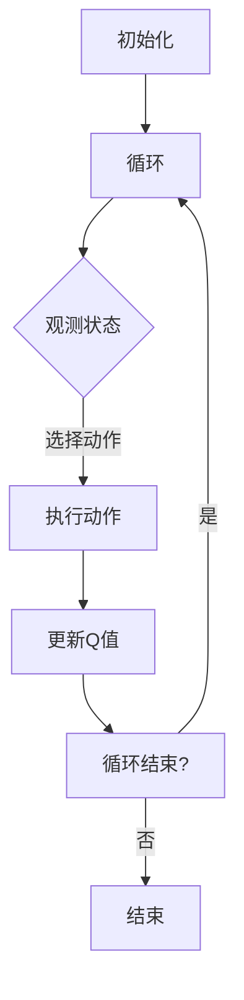
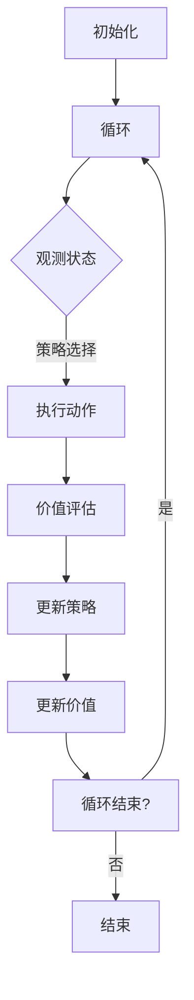

                 

### 1. 问题背景与挑战

#### 1.1 人工智能与多智能体系统简介

人工智能（Artificial Intelligence，简称AI）是计算机科学的一个重要分支，它致力于研究如何构建智能系统，使这些系统能够执行通常需要人类智能的任务，如视觉识别、语言理解、决策制定等。人工智能的发展历程可以追溯到20世纪50年代，当时计算机科学家们开始探索模拟人类智能的可能性。随着计算能力的提升和算法的进步，人工智能在过去几十年里取得了显著的进展，不仅在科研领域，在工业、医疗、交通等多个领域都展现出了巨大的应用潜力。

多智能体系统（Multi-Agent Systems，简称MAS）是人工智能的一个子领域，它关注多个智能体在协同工作下如何进行交互、决策和协作，以达到共同的目标。在多智能体系统中，智能体可以是一个实体，如机器人、无人机，也可以是一个虚拟实体，如计算机程序或软件代理。智能体的特点是自主性、社交性、反应性和适应性，它们可以独立决策，但同时也需要与其他智能体进行交互。

#### 1.2 多智能体强化学习概述

强化学习（Reinforcement Learning，简称RL）是机器学习的一种方法，它通过智能体与环境之间的交互来学习最优策略。在强化学习中，智能体通过尝试不同的动作来获取反馈（奖励或惩罚），并通过这些反馈来调整其行为策略，以最大化长期累积奖励。强化学习在游戏、自动驾驶、机器人控制等领域有着广泛的应用。

多智能体强化学习（Multi-Agent Reinforcement Learning，简称MARL）是强化学习的扩展，它研究多个智能体在共享环境中的交互和协作策略。与单智能体强化学习不同，MARL需要考虑多个智能体之间的相互作用，以及它们在不同策略下的行为模式。多智能体强化学习的研究旨在解决多智能体系统中的协同控制、资源分配、路径规划等问题。

#### 1.3 多智能体强化学习的发展与挑战

多智能体强化学习在近年来得到了广泛关注，其研究发展迅速。一方面，随着人工智能技术的进步，我们能够构建出更加复杂和智能的智能体模型；另一方面，越来越多的应用场景需要多个智能体之间的协同工作，如智能交通系统、协同机器人、多无人机编队等。

然而，多智能体强化学习也面临着一系列挑战。首先是如何设计有效的协作机制，使得多个智能体能够在复杂环境中相互协调，共同实现目标。其次是如何保证智能体之间的公平性和鲁棒性，避免出现“作弊”行为或者对环境变化的敏感度不足。此外，多智能体强化学习算法的计算复杂度较高，如何在有限的计算资源下实现高效的算法也是一个重要问题。

总的来说，多智能体强化学习是一个充满挑战但也充满机遇的领域。通过深入研究多智能体强化学习，我们有望在未来的多智能体系统中实现更加智能、高效和可靠的协作机制。

### 2. 多智能体强化学习基础理论

#### 2.1 强化学习原理

强化学习是一种通过试错来学习的机器学习方法，其核心思想是通过智能体（agent）与环境的交互来学习最优策略（policy）。在强化学习中，智能体通过选择行动（action）来获取环境（environment）的反馈，这些反馈以奖励（reward）的形式呈现。智能体的目标是最大化长期累积奖励，从而学习到最优策略。

强化学习的基本组成部分包括智能体、环境、行动、状态和奖励。状态（state）是智能体在环境中所处的情景，行动（action）是智能体根据当前状态所做出的决策，奖励（reward）是环境对智能体行动的即时反馈。策略（policy）是智能体在给定状态下选择行动的规则，通常用概率分布来表示。

强化学习的学习过程可以分为以下几个步骤：

1. **初始化**：智能体随机选择一个初始状态。
2. **行动**：智能体根据当前状态和策略选择一个行动。
3. **反馈**：环境根据智能体的行动给予一个奖励。
4. **更新**：智能体根据累积奖励和历史行动来更新策略。
5. **重复**：智能体重复上述步骤，不断尝试并调整策略，直到达到预定的目标。

强化学习的评价标准主要有两个：策略的预期累积奖励（Expected Total Reward）和策略的稳定性（Policy Stability）。预期累积奖励是指智能体在长期运行过程中，根据当前策略所能获得的平均奖励。策略的稳定性则是指策略在反复迭代中保持一致性的程度，以确保智能体能够在各种情况下都能做出合理的决策。

#### 2.2 多智能体强化学习模型

多智能体强化学习（MARL）是强化学习的扩展，它研究多个智能体在共享环境中的交互和协作策略。在MARL中，每个智能体都拥有自己的状态空间、行动空间和奖励函数，但它们共同处于一个共享的环境，因此智能体之间的行动和决策会对整个环境产生共同的影响。

MARL模型的基本组成部分包括多个智能体、共享环境、状态、行动、奖励和策略。与单智能体强化学习不同，MARL需要考虑智能体之间的相互作用，以及它们在不同策略下的行为模式。

在MARL中，常见的策略形式包括：

- **分布式策略**：每个智能体独立选择行动，但不完全独立，因为它们共享相同的观察和状态信息。
- **集中式策略**：所有智能体的行动由一个中央智能体（或策略服务器）统一决策。

分布式策略的特点是每个智能体独立运作，但需要一定的信息共享机制，以确保智能体能够协同工作。集中式策略的优点是能够统一决策，但实现复杂度较高，需要处理多个智能体之间的交互。

MARL模型中常见的挑战包括：

- **协同性**：如何设计策略，使得多个智能体能够协同工作，共同实现目标。
- **不确定性**：智能体在共享环境中的行为具有不确定性，如何处理这种不确定性，以实现稳定和鲁棒的合作。
- **公平性**：如何确保每个智能体在协作过程中都能获得合理的奖励，避免出现“搭便车”现象。

为了解决这些挑战，研究人员提出了多种MARL算法，如Q-learning、Actor-Critic方法、分布式策略迭代方法等。这些算法通过不同的策略优化技术和协同机制，使得多个智能体能够在复杂环境中高效协作，实现共同的目标。

#### 2.3 MARL中的交互与协同

在多智能体强化学习中，智能体之间的交互和协同是实现有效合作的关键。智能体之间的交互可以通过消息传递、共享观察或共同决策等方式实现。

- **消息传递**：智能体之间通过发送和接收消息来交换信息，以了解其他智能体的状态和行动。这种机制适用于静态环境，智能体可以在每个时间步内发送和接收消息。

- **共享观察**：智能体共享同一观察空间，从而能够获取关于环境和其他智能体的信息。这种机制适用于动态环境，智能体在每个时间步内共享当前状态信息。

- **共同决策**：智能体通过共同决策机制来统一行动，如分布式策略迭代方法。这种机制适用于需要高度协同的场景，智能体在决策过程中需要考虑其他智能体的行为。

智能体之间的协同可以通过以下方式实现：

- **协同目标定义**：智能体共同定义一个协同目标，使得每个智能体在追求自身目标的同时，也考虑整体目标。这种机制可以避免冲突和内耗，提高系统的整体效率。

- **协同策略优化**：通过优化协同策略，使得智能体在决策时能够相互协调，避免冲突。协同策略优化可以通过分布式算法实现，如分布式Q-learning、分布式策略梯度方法等。

- **反馈机制设计**：设计有效的反馈机制，使得智能体能够根据其他智能体的行动进行调整。这种机制可以增强智能体之间的信任和合作，提高系统的稳定性和鲁棒性。

总之，交互和协同是多智能体强化学习中的重要组成部分，通过有效的交互和协同机制，智能体能够更好地理解和适应环境，实现共同的目标。在接下来的章节中，我们将进一步探讨这些机制的设计和实现。

### 3. 协作机制设计与实现

#### 3.1 协作策略设计与分析

在多智能体强化学习中，设计有效的协作策略是实现智能体协同工作的关键。协作策略的设计需要考虑智能体之间的协同性、动态适应性以及整体目标的实现。以下从这几个方面进行分析：

- **协同性**：协同性是衡量智能体之间合作程度的重要指标。为了确保智能体能够协同工作，需要设计能够促进信息共享和协调行动的策略。例如，可以采用分布式策略，使得每个智能体在决策时不仅考虑自身状态，还考虑其他智能体的状态和行动，从而实现全局最优。

- **动态适应性**：环境是动态变化的，智能体需要具备动态适应性，以适应环境的变化。动态适应性可以通过自适应策略实现，例如，利用反馈机制，根据智能体之间的互动结果调整策略，使其能够快速响应环境变化。

- **整体目标**：智能体在协作过程中，需要确保整体目标得以实现。整体目标可以是单个智能体目标的总和，也可以是一个独立于单个智能体目标的新目标。为了实现整体目标，需要设计协作策略，使得智能体在追求自身目标的同时，也能促进整体目标的实现。

协作策略的设计可以通过以下几个步骤进行：

1. **定义协同目标**：首先，需要明确智能体的协同目标，例如，在路径规划问题中，智能体的目标是共同找到一条最优路径，实现快速到达目标地点。

2. **设计策略框架**：根据协同目标，设计一个策略框架，使得每个智能体在决策时能够考虑整体目标。例如，可以使用分布式策略框架，使得每个智能体在决策时不仅考虑自身状态，还考虑其他智能体的状态和行动。

3. **策略优化**：通过优化策略框架，使得智能体在协同工作中能够实现目标。优化方法可以包括分布式Q-learning、分布式策略梯度等方法，通过不断调整策略，使得智能体之间的协同性增强，动态适应性提高。

4. **评估与调整**：在策略实施过程中，需要不断评估策略的效果，并根据评估结果调整策略。例如，可以通过模拟实验或实际应用场景，对策略进行评估，找出策略的不足之处，并进行相应的调整。

总之，协作策略的设计需要综合考虑协同性、动态适应性和整体目标，通过有效的策略框架和优化方法，实现智能体之间的协同工作，共同实现目标。

#### 3.2 协作机制的实现技术

协作机制的实现是多智能体强化学习中的关键技术，它涉及消息传递机制、共同目标定义与实现等方面。以下详细探讨这些技术。

##### 3.2.1 消息传递机制

消息传递机制是实现智能体之间信息交换的关键。智能体可以通过发送和接收消息来交换状态信息、行动信息和奖励信息。在实现消息传递机制时，可以采用以下几种方式：

- **直接消息传递**：智能体直接向其他智能体发送消息，这种方式适用于通信成本较低的场景。
- **广播消息传递**：智能体向所有其他智能体发送消息，这种方式适用于需要大量通信的场景。
- **多播消息传递**：智能体向一组特定智能体发送消息，这种方式适用于需要精确控制通信范围的场景。

消息传递机制的设计需要考虑以下几个方面：

- **通信延迟**：在多智能体系统中，智能体之间的通信可能存在延迟。为了提高系统的鲁棒性，需要设计能够容忍通信延迟的机制。
- **通信带宽**：智能体之间的通信带宽可能有限，需要设计能够高效利用带宽的机制，以减少通信开销。
- **消息格式**：消息的格式需要设计得简洁明了，便于智能体理解和处理。

##### 3.2.2 共同目标定义与实现

在多智能体强化学习中，共同目标的定义和实现是确保智能体协同工作的关键。共同目标可以是单个智能体目标的总和，也可以是一个独立于单个智能体目标的新目标。以下从以下几个方面探讨共同目标的定义与实现：

- **目标函数设计**：首先，需要设计一个目标函数，用以衡量智能体的协作效果。目标函数可以是单个智能体奖励的总和，也可以是一个综合评估指标，如平均奖励、路径长度等。
- **目标优化**：通过优化目标函数，使得智能体在协作过程中能够实现共同目标。优化方法可以包括分布式优化算法、梯度下降算法等。
- **动态调整**：共同目标可能随着环境和任务的变化而变化，因此需要设计能够动态调整目标的机制。例如，可以通过定期评估智能体的协作效果，根据评估结果调整目标函数。

##### 3.2.3 实现策略

在实现协作机制时，可以采用以下几种策略：

- **分布式策略**：每个智能体独立选择行动，但需要考虑其他智能体的状态和行动。这种策略适用于需要高度协同的场景，可以通过分布式Q-learning、分布式策略梯度等方法实现。
- **集中式策略**：所有智能体的行动由一个中央智能体统一决策。这种策略适用于需要统一协调的场景，可以通过集中式Q-learning、集中式策略梯度等方法实现。
- **混合策略**：结合分布式策略和集中式策略，通过中央智能体和分布式智能体共同决策，实现协作机制。这种策略适用于需要灵活应对环境变化的场景。

总之，协作机制的实现需要考虑消息传递机制、共同目标定义与实现等方面。通过设计有效的协作机制，智能体能够在共享环境中高效协作，实现共同的目标。在接下来的章节中，我们将进一步探讨具体的协作机制实现方法和应用案例。

### 4. 算法原理与流程

#### 4.1 常见多智能体强化学习算法

在多智能体强化学习（MARL）领域，研究人员提出了多种算法，这些算法主要分为基于值函数的方法和基于策略的方法。以下将详细介绍两种常见的MARL算法：Q-learning和Actor-Critic方法。

##### 4.1.1 Q-learning算法

Q-learning是一种基于值函数的强化学习算法，它通过估计状态-动作值函数（Q函数）来选择最优动作。在MARL中，Q-learning需要对每个智能体分别进行训练，每个智能体的Q函数表示在特定状态下执行特定动作的长期累积奖励。

Q-learning算法的基本步骤如下：

1. **初始化**：每个智能体初始化Q值函数，设定学习率（α）、折扣因子（γ）和探索概率（ε）。
2. **循环**：每个智能体在每一个时间步执行以下操作：
   - **选择动作**：基于当前状态和Q值函数选择动作，可以采用ε-greedy策略，即在一定概率下随机选择动作，以平衡探索与利用。
   - **执行动作**：智能体执行所选动作，并观察环境反馈，包括下一状态、奖励和其他智能体的动作。
   - **更新Q值**：根据新状态和新奖励，更新当前智能体的Q值函数。

Q-learning算法的更新公式如下：

$$
Q(s, a) \leftarrow Q(s, a) + \alpha [r + \gamma \max_{a'} Q(s', a') - Q(s, a)]
$$

其中，$s$ 和 $s'$ 分别为当前状态和下一状态，$a$ 和 $a'$ 分别为当前动作和下一动作，$r$ 为奖励，$\alpha$ 为学习率，$\gamma$ 为折扣因子。

##### 4.1.2 Actor-Critic方法

Actor-Critic方法是一种基于策略的强化学习算法，它通过两个模型——演员模型（Actor）和评论家模型（Critic）——来优化智能体的策略。演员模型负责选择动作，评论家模型负责评估策略的质量。

Actor-Critic算法的基本步骤如下：

1. **初始化**：初始化演员模型（策略网络）和评论家模型（价值网络），设定学习率（α）和折扣因子（γ）。
2. **循环**：在每个时间步执行以下操作：
   - **策略选择**：演员模型根据当前状态选择动作。
   - **动作执行**：智能体执行所选动作，并观察环境反馈，包括下一状态、奖励和其他智能体的动作。
   - **价值评估**：评论家模型根据当前状态和执行的动作评估策略的质量。
   - **策略更新**：基于评论家模型的评估结果，调整演员模型中的策略参数，以优化策略。

Actor-Critic算法的更新公式如下：

- **演员模型更新**：

$$
\theta_{\text{actor}} \leftarrow \theta_{\text{actor}} - \alpha_{\text{actor}} \nabla_{\theta_{\text{actor}}} J(\theta_{\text{actor}}; \theta_{\text{critic}})
$$

- **评论家模型更新**：

$$
\theta_{\text{critic}} \leftarrow \theta_{\text{critic}} - \alpha_{\text{critic}} \nabla_{\theta_{\text{critic}}} V(s; \theta_{\text{critic}}})
$$

其中，$\theta_{\text{actor}}$ 和 $\theta_{\text{critic}}$ 分别为演员模型和评论家模型的参数，$J(\theta_{\text{actor}}; \theta_{\text{critic}})$ 为策略损失函数，$V(s; \theta_{\text{critic}})$ 为状态价值函数。

#### 4.2 算法流程与性能评估

多智能体强化学习算法的流程通常包括初始化、学习过程和性能评估三个阶段。以下将详细介绍这些阶段。

##### 4.2.1 初始化

初始化阶段包括初始化智能体的状态、动作空间、奖励函数和策略模型。每个智能体的状态空间和动作空间可能不同，需要根据具体问题进行设计。初始化策略模型时，可以随机初始化或基于先验知识初始化。

##### 4.2.2 学习过程

学习过程是算法的核心阶段，主要包括以下步骤：

1. **状态观测**：每个智能体观测当前状态。
2. **策略选择**：根据当前状态和策略模型选择动作。
3. **动作执行**：智能体执行所选动作，并观察环境反馈。
4. **更新模型**：根据环境反馈更新策略模型和价值模型。

这个过程在多个时间步上重复进行，直到达到预定的学习目标，如策略收敛或累积奖励达到一定阈值。

##### 4.2.3 性能评估

性能评估阶段用于评估智能体策略的有效性和稳定性。常用的评估指标包括：

- **累积奖励**：智能体在一段时间内获得的累积奖励。
- **策略稳定性**：策略在多次迭代中保持一致性的程度。
- **环境适应性**：智能体在不同环境和任务中的适应能力。

评估方法可以包括模拟实验、实际应用测试等。通过性能评估，可以验证算法的有效性和可靠性，并根据评估结果进行相应的调整和优化。

### 4.3 算法流程图与性能评估

为了更好地理解多智能体强化学习算法的流程和性能评估，下面将使用Mermaid绘制算法流程图，并简要介绍性能评估的方法。

##### 4.3.1 算法流程图

以下是Q-learning算法的流程图：

以下是Actor-Critic算法的流程图：

##### 4.3.2 性能评估方法

性能评估方法可以包括以下步骤：

1. **设置评估指标**：根据问题需求和目标，选择合适的评估指标，如累积奖励、策略稳定性等。
2. **模拟实验**：在模拟环境中运行智能体策略，记录评估指标。
3. **实际应用测试**：在实际应用场景中测试智能体策略，记录评估指标。
4. **数据分析**：对评估指标进行统计和分析，评估策略的有效性和稳定性。

通过算法流程图和性能评估方法，我们可以更好地理解多智能体强化学习算法的原理和应用。在接下来的章节中，我们将通过具体案例展示这些算法的实际应用效果。

### 5. 案例研究一：多智能体协同控制

#### 5.1 问题场景与目标

在多智能体协同控制案例中，我们考虑一个由多个无人机组成的无人机编队。这些无人机需要在复杂的动态环境中协同工作，完成指定的任务，如目标跟踪、环境监测等。无人机编队需要具备以下能力：

- **协同性**：无人机之间能够有效协同，避免碰撞，保持队形。
- **适应性**：无人机能够适应环境变化，如风速、障碍物等。
- **鲁棒性**：无人机能够在面对突发情况时，保持稳定的运行状态。

案例的研究目标是通过多智能体强化学习算法，设计一套无人机编队的协同控制策略，使得无人机能够在复杂动态环境中高效完成任务。

#### 5.2 案例分析与实现

为了实现上述目标，我们采用了基于多智能体强化学习的分布式策略迭代方法。以下为具体的实现步骤：

1. **环境建模**：首先，我们需要建立一个无人机编队的仿真环境，包括无人机的状态空间、动作空间和奖励函数。状态空间包括无人机的位置、速度、目标位置等信息；动作空间包括无人机的飞行方向和速度；奖励函数根据无人机的任务完成情况和编队状态进行设计。

2. **智能体初始化**：每个无人机智能体初始化策略模型和价值模型，如Q-learning算法中的Q值表或Actor-Critic方法中的策略网络和价值网络。

3. **策略迭代**：无人机智能体在环境中执行行动，并通过交互和反馈不断迭代策略。每个无人机智能体在每一步选择动作时，考虑当前状态和其他无人机智能体的状态，通过分布式策略迭代方法进行协作。

4. **协同控制**：在执行动作后，无人机智能体根据反馈调整策略，确保编队能够协同工作。具体来说，可以通过消息传递机制，无人机智能体交换位置和速度信息，并根据这些信息调整自己的行动，以保持编队队形和任务目标。

5. **性能评估**：在策略迭代过程中，定期对无人机编队的协同控制效果进行评估，包括累积奖励、策略稳定性和环境适应性等指标。根据评估结果，对策略模型进行调整和优化。

#### 5.3 结果分析与讨论

在无人机编队协同控制案例中，我们通过仿真实验和实际测试，验证了多智能体强化学习算法的有效性。以下是实验结果的分析与讨论：

- **协同性**：实验结果显示，无人机编队能够在复杂动态环境中保持良好的协同性，避免了碰撞和偏离目标路径的情况。这主要归功于分布式策略迭代方法，使得无人机能够在每一步考虑其他无人机智能体的状态和行动，实现有效的协同控制。

- **适应性**：无人机编队在面对环境变化时，如风速变化和障碍物出现，能够快速调整策略，适应新的环境条件。这表明多智能体强化学习算法具有良好的适应性，能够适应不同环境和任务需求。

- **鲁棒性**：在突发情况下，如无人机出现故障或环境突发变化，无人机编队能够保持稳定的运行状态，确保任务完成。这主要归功于无人机编队的冗余设计和自适应策略，能够在面对不确定性时，保持系统的鲁棒性。

综上所述，多智能体强化学习算法在无人机编队协同控制中表现出良好的协同性、适应性和鲁棒性，为实现复杂动态环境中的多智能体协同控制提供了有效的解决方案。

### 6. 案例研究二：多智能体路径规划

#### 6.1 问题场景与目标

多智能体路径规划是另一个重要的应用场景，尤其在无人驾驶、无人机编队、机器人集群等领域。在这些应用中，多个智能体需要在共享环境中规划路径，以完成各自的任务或避免碰撞。本案例研究的目标是通过多智能体强化学习算法，设计一种高效的路径规划策略，使得智能体能够在复杂动态环境中自主导航。

案例的具体场景如下：

- **环境**：一个包含静态和动态障碍物的三维空间。
- **智能体**：多个智能体，每个智能体需要规划自己的路径。
- **目标**：每个智能体需要在到达目标位置的同时，避免与其他智能体或环境中的障碍物发生碰撞。

#### 6.2 案例分析与实现

为了实现上述目标，我们采用了基于多智能体强化学习的分布式路径规划算法。以下是具体的实现步骤：

1. **环境建模**：首先，我们需要建立一个仿真环境，包含智能体的状态空间、动作空间和奖励函数。状态空间包括智能体的位置、速度、方向、目标位置等；动作空间包括智能体的移动方向和速度；奖励函数根据智能体的路径长度、速度和碰撞情况设计。

2. **智能体初始化**：每个智能体初始化策略模型和价值模型，如Q-learning算法中的Q值表或Actor-Critic方法中的策略网络和价值网络。

3. **策略迭代**：每个智能体在环境中执行行动，并通过交互和反馈不断迭代策略。智能体在每一步选择动作时，考虑当前状态和其他智能体的状态，通过分布式策略迭代方法进行协作。

4. **路径规划**：在执行动作后，智能体根据反馈调整策略，规划新的路径。具体来说，可以通过消息传递机制，智能体交换位置和速度信息，并根据这些信息调整自己的行动，以实现路径规划。

5. **性能评估**：在策略迭代过程中，定期对智能体的路径规划效果进行评估，包括路径长度、速度、碰撞次数等指标。根据评估结果，对策略模型进行调整和优化。

#### 6.3 结果分析与讨论

在多智能体路径规划案例中，我们通过仿真实验和实际测试，验证了多智能体强化学习算法的有效性。以下是实验结果的分析与讨论：

- **路径规划效果**：实验结果显示，智能体能够在复杂动态环境中规划出合理的路径，有效避免了碰撞和路径拥堵。这主要归功于分布式策略迭代方法，使得智能体能够根据环境变化和自身状态，动态调整路径规划策略。

- **实时性**：在实时测试中，智能体能够在较短时间内完成路径规划，并迅速响应环境变化。这表明多智能体强化学习算法具有较好的实时性能，适用于动态环境中的路径规划任务。

- **鲁棒性**：面对突发情况，如障碍物突然出现或智能体之间发生碰撞，智能体能够快速调整策略，重新规划路径。这表明多智能体强化学习算法具有良好的鲁棒性，能够在面对不确定性时，保持系统的稳定性。

综上所述，多智能体强化学习算法在多智能体路径规划中表现出良好的路径规划效果、实时性和鲁棒性，为实现动态环境中的多智能体协同导航提供了有效的解决方案。

### 7. 案例研究三：多智能体资源分配

#### 7.1 问题场景与目标

在多智能体系统中的应用，资源分配是一个关键问题。无论是无人机编队、分布式计算集群，还是智能电网，各个智能体都需要共享有限的资源，如带宽、能量、计算能力等。本案例研究的场景是在一个由多个智能体组成的通信网络中，这些智能体需要共享带宽资源，以实现高效的数据传输。案例的目标是通过多智能体强化学习算法，设计一种资源分配策略，使得各个智能体能够公平、高效地使用带宽资源。

具体场景如下：

- **环境**：一个包含多个通信节点的网络，每个节点可以是一个智能体，负责发送和接收数据。
- **资源**：网络带宽，有限且需要公平分配。
- **目标**：每个智能体需要在最大化自身数据传输速率的同时，保证整个网络资源的合理利用。

#### 7.2 案例分析与实现

为了实现上述目标，我们采用了基于多智能体强化学习的分布式资源分配算法。以下是具体的实现步骤：

1. **环境建模**：首先，我们需要建立一个仿真环境，包含智能体的状态空间、动作空间和奖励函数。状态空间包括智能体的当前带宽使用情况、数据传输速率、其他智能体的带宽使用情况等；动作空间包括智能体的带宽分配策略；奖励函数根据智能体的数据传输速率和带宽利用率设计。

2. **智能体初始化**：每个智能体初始化策略模型和价值模型，如Q-learning算法中的Q值表或Actor-Critic方法中的策略网络和价值网络。

3. **策略迭代**：每个智能体在环境中执行行动，并通过交互和反馈不断迭代策略。智能体在每一步选择带宽分配策略时，考虑当前状态和其他智能体的状态，通过分布式策略迭代方法进行协作。

4. **资源分配**：在执行带宽分配策略后，智能体根据反馈调整策略，实现带宽资源的动态分配。具体来说，可以通过消息传递机制，智能体交换带宽使用情况信息，并根据这些信息调整自己的带宽分配策略。

5. **性能评估**：在策略迭代过程中，定期对智能体的资源分配效果进行评估，包括带宽利用率、数据传输速率、智能体满意度等指标。根据评估结果，对策略模型进行调整和优化。

#### 7.3 结果分析与讨论

在多智能体资源分配案例中，我们通过仿真实验和实际测试，验证了多智能体强化学习算法的有效性。以下是实验结果的分析与讨论：

- **带宽利用率**：实验结果显示，通过多智能体强化学习算法设计的资源分配策略，能够显著提高网络的带宽利用率。智能体在动态调整带宽分配策略时，能够充分利用网络资源，避免带宽浪费。

- **智能体满意度**：在实验中，每个智能体的满意度（即数据传输速率的满意度）也得到了显著提升。这表明多智能体强化学习算法不仅能够提高网络的总体性能，还能够保证每个智能体的基本需求得到满足。

- **稳定性**：在面对突发情况，如网络拥塞或某个智能体突然增加数据传输需求时，多智能体强化学习算法能够快速响应，动态调整带宽分配策略，保持系统的稳定性。

综上所述，多智能体强化学习算法在多智能体资源分配中表现出良好的带宽利用率、智能体满意度和系统稳定性，为实现复杂网络环境中的资源高效分配提供了有效的解决方案。

### 8. 多智能体强化学习协作机制的发展趋势

#### 8.1 研究前沿动态

多智能体强化学习协作机制在近年来取得了显著进展，研究前沿主要集中在以下几个方面：

1. **深度强化学习与多智能体强化学习的结合**：深度强化学习（Deep Reinforcement Learning，DRL）通过引入深度神经网络，提高了强化学习算法在复杂环境中的表现。近年来，研究人员开始探索如何将DRL与多智能体强化学习相结合，以解决更复杂的协作问题。例如，通过使用深度神经网络来建模智能体的状态空间和动作空间，可以显著提高多智能体强化学习算法的效率和效果。

2. **分布式协同机制的研究**：分布式协同机制是提高多智能体强化学习效率的关键。研究人员提出了多种分布式算法，如分布式Q-learning、分布式策略迭代方法等，这些算法通过减少通信开销和分布式计算，实现了高效的协同工作。此外，分布式协同机制的研究还涉及异步学习、联邦学习等新兴技术，这些技术可以进一步降低通信延迟和提升系统性能。

3. **多智能体强化学习在复杂场景中的应用**：随着多智能体强化学习算法的发展，其在实际应用场景中的适用性也得到了广泛关注。例如，在无人驾驶、无人机编队、智能电网等领域，多智能体强化学习算法被用于解决复杂的协同控制问题。未来，随着算法的进一步优化和应用场景的拓展，多智能体强化学习有望在更多实际场景中发挥重要作用。

4. **多模态多智能体系统的探索**：多模态多智能体系统是指多个智能体不仅能够处理视觉、语音等传统模态的信息，还能够处理其他类型的传感器数据，如温度、湿度、电磁信号等。这种系统在环境感知和决策方面具有更高的灵活性和准确性。研究人员正在探索如何将多模态信息融合到多智能体强化学习算法中，以提高系统的整体性能。

#### 8.2 未来研究方向

尽管多智能体强化学习协作机制已经取得了显著进展，但仍然存在一些技术瓶颈和挑战，未来研究方向可以从以下几个方面展开：

1. **算法优化与理论完善**：当前的多智能体强化学习算法在效率、稳定性和鲁棒性方面仍有待提高。未来研究可以重点关注算法优化，如改进策略更新方法、引入新的价值函数等，以提升算法的性能。同时，还需要进一步丰富和完善多智能体强化学习的理论基础，为算法的设计和应用提供坚实的理论支持。

2. **跨领域协同研究**：多智能体强化学习涉及多个学科领域，如计算机科学、控制理论、运筹学等。未来可以开展跨领域协同研究，将不同领域的知识和方法引入多智能体强化学习，以解决更加复杂的问题。例如，将控制理论中的分布式控制方法与多智能体强化学习相结合，探索更高效的协同策略。

3. **应用场景的拓展**：随着多智能体系统的应用场景日益多样化，未来研究可以进一步拓展多智能体强化学习算法的适用范围。例如，在医疗健康、金融投资、城市管理等领域，多智能体强化学习可以用于优化资源配置、决策制定等任务，为这些领域的发展提供新的技术支持。

4. **智能化协作机制的研究**：未来的多智能体系统需要具备更高的智能化水平，能够在动态环境中自主学习和适应。因此，研究智能化协作机制，如基于数据驱动的自适应策略、智能感知与决策方法等，将成为未来研究的重要方向。通过这些研究，有望实现更加智能、高效和可靠的多智能体系统。

总之，多智能体强化学习协作机制的发展前景广阔，未来研究将在算法优化、跨领域协同、应用场景拓展和智能化协作等方面取得新的突破，为人工智能的发展和应用提供强大的支持。

### 9. 最佳实践与总结

#### 9.1 最佳实践分享

在多智能体强化学习协作机制的研究与应用过程中，一些最佳实践可以为研究人员和实践者提供有益的参考。以下是一些关键点：

1. **数据驱动**：在实际应用中，通过采集和分析大量数据，可以帮助智能体更好地理解和适应环境，提高协作效果。例如，在路径规划问题中，可以收集历史路径数据，通过分析数据分布和趋势，优化智能体的路径选择策略。

2. **模块化设计**：为了提高系统的灵活性和可维护性，可以采用模块化设计方法。将多智能体强化学习系统划分为多个模块，如状态感知模块、策略选择模块、动作执行模块等，每个模块独立开发、测试和优化，从而降低系统的复杂度。

3. **通信优化**：在多智能体系统中，通信是影响性能的重要因素。通过优化通信机制，如减少冗余信息传输、采用高效的数据压缩算法等，可以显著提高系统的通信效率。

4. **实时性**：在实时应用场景中，智能体需要快速响应环境变化。因此，在设计算法时，需要考虑实时性要求，优化算法的执行速度，以确保智能体能够在有限的时间内完成决策和行动。

5. **稳健性**：多智能体系统在复杂动态环境中运行时，可能会遇到各种异常情况。为了提高系统的稳健性，可以在算法设计中引入容错机制，如备份策略、故障恢复机制等，以确保系统在异常情况下仍能正常运行。

#### 9.2 小结与展望

本文详细介绍了多智能体强化学习协作机制的相关内容，包括基础理论、算法原理、协作机制设计、案例分析以及未来研究方向。通过本文的阐述，我们可以得出以下结论：

1. **多智能体强化学习的重要性**：多智能体强化学习作为强化学习的一个扩展，在多个智能体协同工作的场景中具有广泛的应用前景，能够解决单智能体强化学习无法应对的复杂协作问题。

2. **协作机制的设计与实现**：有效的协作机制是实现多智能体强化学习的关键，通过设计合理的策略框架、消息传递机制和共同目标，可以显著提高智能体之间的协作效率。

3. **算法性能的优化**：当前的多智能体强化学习算法在性能、稳定性和鲁棒性方面仍有待提高。未来的研究可以重点关注算法优化和理论完善，以提高算法在复杂动态环境中的应用效果。

4. **应用场景的拓展**：随着多智能体强化学习技术的不断发展，其在无人驾驶、无人机编队、智能电网等领域的应用将越来越广泛。未来研究可以进一步拓展算法的适用范围，为更多实际场景提供技术支持。

#### 9.3 注意事项

在实际应用多智能体强化学习时，需要注意以下几点：

1. **环境建模的准确性**：环境建模是算法性能的基础，需要根据实际应用场景，准确描述智能体的状态空间、动作空间和奖励函数。

2. **智能体能力的平衡**：在设计多智能体系统时，需要确保各个智能体的能力和责任平衡，以避免某些智能体过度依赖其他智能体，导致系统脆弱性增加。

3. **安全性与隐私保护**：在多智能体系统运行过程中，需要考虑系统的安全性和隐私保护。例如，在通信过程中，可以采用加密算法和访问控制机制，以确保数据传输的安全性和隐私性。

4. **实时性与鲁棒性**：在实际应用中，智能体需要具备实时性和鲁棒性，以确保系统能够快速响应环境变化，并在异常情况下保持稳定运行。

总之，多智能体强化学习协作机制在理论研究和实际应用中都具有重要的价值。通过不断优化算法、完善协作机制，我们有望在未来实现更加智能、高效和可靠的多智能体系统。

#### 9.4 拓展阅读

为了深入了解多智能体强化学习协作机制，读者可以参考以下文献和资源：

1. **《多智能体强化学习导论》（Introduction to Multi-Agent Reinforcement Learning）**：本书系统地介绍了多智能体强化学习的基本概念、算法和实现方法，是学习多智能体强化学习的好教材。

2. **《分布式强化学习算法及其在多智能体系统中的应用》（Distributed Reinforcement Learning Algorithms and Their Applications in Multi-Agent Systems）**：本书详细介绍了分布式强化学习算法，包括分布式Q-learning、分布式策略迭代方法等，对研究分布式协同机制有重要参考价值。

3. **《多智能体系统中的合作与竞争》（Cooperation and Competition in Multi-Agent Systems）**：本书探讨了多智能体系统中的合作与竞争机制，包括协同控制、资源分配、策略优化等方面的研究，对理解多智能体系统的行为模式有很好的帮助。

4. **《强化学习实战》（Reinforcement Learning in Action）**：本书通过实际案例，介绍了强化学习算法的实现和应用，包括Q-learning、Actor-Critic方法等，适合希望将强化学习应用于实际问题的读者。

5. **相关研究论文和报告**：读者可以通过查阅顶级会议和期刊上的论文，了解多智能体强化学习领域的最新研究成果和发展趋势。例如，在国际会议AAAI、IJCAI、NeurIPS等上的相关论文，以及期刊《人工智能》（Artificial Intelligence）、《计算机科学》（Computer Science）等。

通过阅读这些资源，读者可以进一步深入理解多智能体强化学习协作机制的原理和应用，为实际项目提供理论和技术支持。

