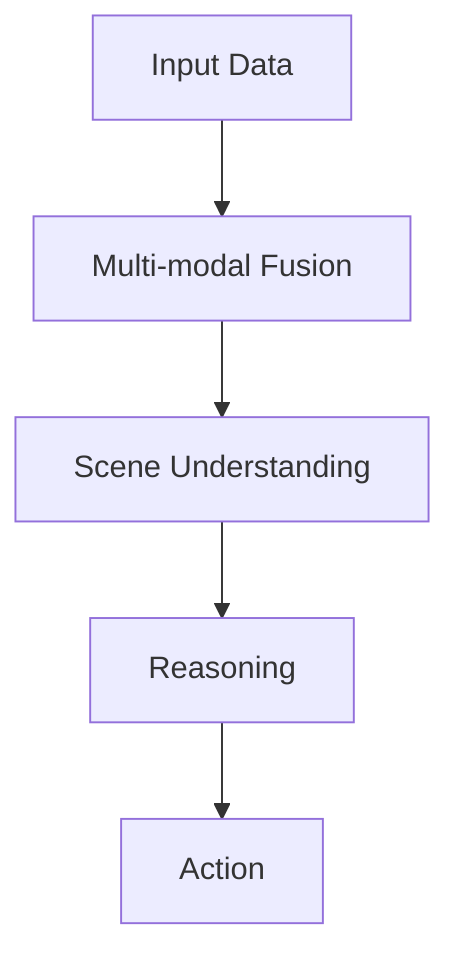
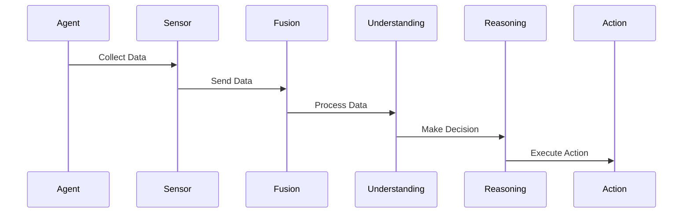

                 


### Step 1: Background Introduction

**Problem Background:**

The advent of artificial intelligence (AI) has brought about a new era in which machines can perform complex tasks that were once thought to be the exclusive domain of humans. Among the many applications of AI, AI agents are particularly noteworthy. These agents are designed to interact with their environment, make decisions, and execute actions based on their understanding of the world. However, for these agents to truly function effectively, they must possess the ability to understand and reason about multi-modal scenes.

Multi-modal scene understanding refers to the ability of an AI agent to process and integrate information from multiple sources, such as text, images, audio, and video. This is a critical capability for AI agents because real-world scenarios are rarely dominated by a single type of data. For example, a self-driving car needs to understand not just the images from its camera but also the text from traffic signs, the audio from its sensors, and the video from other sources to make safe and informed decisions.

**Problem Description:**

The challenge in developing AI agents with multi-modal scene understanding and reasoning capabilities lies in several areas:

1. **Data Integration:** The integration of information from multiple modalities requires a system that can harmonize these diverse data types into a coherent understanding of the scene.
2. **Ambiguity Handling:** Real-world data is often ambiguous, and AI agents must be able to resolve this ambiguity to make correct decisions.
3. **Scalability:** As the number of modalities and the complexity of scenes increase, the AI system must scale efficiently to handle these challenges.
4. **Interpretability:** There is a need for AI agents to be interpretable so that humans can understand how they arrived at certain decisions.

**Solution Overview:**

To address these challenges, researchers and developers are exploring several solutions:

1. **Deep Learning Models:** Advanced deep learning models, such as convolutional neural networks (CNNs) for image processing and recurrent neural networks (RNNs) for sequential data, are being combined to handle multi-modal data.
2. **Data Fusion Techniques:** Techniques such as feature concatenation, feature extraction, and multi-modal learning are being used to integrate data from different modalities.
3. **Reinforcement Learning:** Reinforcement learning can be used to train AI agents to make decisions in dynamic environments, enhancing their ability to handle ambiguity.
4. **Interpretability Tools:** Methods such as attention mechanisms and visualization tools are being developed to make AI agents more interpretable.

By understanding the background and challenges of developing AI agents with multi-modal scene understanding and reasoning capabilities, we can better appreciate the solutions that are being proposed and their potential impact on the field.

### Step 2: Core Concepts and Relationships

**Core Concepts:**

To delve deeper into the topic of AI Agent's multi-modal scene understanding and reasoning, it's essential to define the key concepts:

- **AI Agent:** An AI agent is a software program that can perceive its environment through sensors, take actions to achieve specific goals, and learn from the outcomes of its actions.

- **Multi-modal Scene Understanding:** This refers to the ability of an AI agent to process and integrate data from multiple sensory modalities, such as text, images, audio, and video, to form a coherent understanding of the scene.

- **Reasoning:** Reasoning involves the process of drawing conclusions, making inferences, and solving problems based on available data and knowledge.

**Concepts' Attributes and Comparisons:**

| Concept               | Attribute 1      | Attribute 2      | Attribute 3      |
|-----------------------|-----------------|-----------------|-----------------|
| AI Agent              | Autonomous      | Goal-oriented   | Adaptive        |
| Multi-modal Scene     | Integrates      | Multi-sensory   | Context-aware   |
| Understanding         | Data Sources    | Data Processing | Scene Analysis  |
| Reasoning             | Inference-based | Problem-solving | Decision-making |

**Entity Relationship Diagram (ERD):**

To visualize the relationships between these concepts, let's create an ER diagram using Mermaid:

```mermaid
erDiagram
  AI-Agent ||--|{ Multi-modal Scene Understanding }|
  AI-Agent ||--|{ Reasoning }|
  Multi-modal Scene Understanding ||--|{ Data Sources }|
  Reasoning ||--|{ Knowledge Base }|
```

In this ER diagram, we see that AI-Agent is the central entity, with direct relationships to both Multi-modal Scene Understanding and Reasoning. Multi-modal Scene Understanding is responsible for processing and integrating data from various sensory modalities, while Reasoning utilizes this integrated understanding to make inferences and solve problems. Data Sources are the inputs to the Multi-modal Scene Understanding process, and the Knowledge Base stores the data used by the Reasoning component.

### Step 3: Algorithm and Theory Explanation

**Algorithm Flow:**

To explain the core algorithms and theories behind AI Agent's multi-modal scene understanding and reasoning, let's start with a high-level flowchart using Mermaid:



In this flowchart, the input data from various modalities is first fused into a coherent representation. This fused data is then used for scene understanding and reasoning, which ultimately leads to an action taken by the AI agent.

**Python Code:**

Now, let's provide a simple Python code snippet to demonstrate how multi-modal data might be fused:

```python
import numpy as np

def multi_modal_fusion(text, image, audio):
    # Example fusion method: Average the features from different modalities
    text_features = np.mean(text, axis=1)
    image_features = np.mean(image, axis=(0, 1))
    audio_features = np.mean(audio, axis=1)
    
    # Concatenate the features
    fused_features = np.concatenate((text_features, image_features, audio_features))
    
    return fused_features

# Example usage
text = [1, 2, 3]  # Simplified text feature vector
image = [[4, 5, 6], [7, 8, 9]]  # Simplified image feature matrix
audio = [10, 11, 12]  # Simplified audio feature vector

fused_features = multi_modal_fusion(text, image, audio)
print(f"Fused Features: {fused_features}")
```

**Mathematical Models:**

In multi-modal scene understanding, the fusion of features from different modalities often involves complex mathematical models. One common approach is to use a weighted sum of features from each modality. This can be represented mathematically as:

$$
\text{fused\_features} = w_1 \cdot \text{text\_features} + w_2 \cdot \text{image\_features} + w_3 \cdot \text{audio\_features}
$$

where $w_1$, $w_2$, and $w_3$ are the weights assigned to each modality, and $\text{text\_features}$, $\text{image\_features}$, and $\text{audio\_features}$ represent the feature vectors from the text, image, and audio modalities, respectively.

**Examples:**

To illustrate how these algorithms work, let's consider a simple example:

**Scenario:** A self-driving car is navigating through a busy intersection.

1. **Input Data:**
   - Text: "Stop sign ahead."
   - Image: A frame from the car's camera showing a stop sign.
   - Audio: Traffic sounds indicating a high volume of traffic.

2. **Fusion:**
   - The text data might provide a binary feature indicating the presence of a stop sign.
   - The image data might provide a vector of pixel values.
   - The audio data might provide a spectral representation of the traffic sounds.

3. **Scene Understanding:**
   - The fused features are analyzed to determine the presence and significance of the stop sign.
   - The traffic sounds are analyzed to assess the urgency of stopping.

4. **Reasoning:**
   - Based on the scene understanding, the AI agent determines whether to come to a full stop or proceed with caution.
   - The agent might also reason about the timing of the traffic light changes and predict the best action.

5. **Action:**
   - The AI agent sends a command to the car's brakes to either hold or release, and adjusts the steering to navigate safely.

This example demonstrates how multi-modal scene understanding and reasoning can lead to effective decision-making by the AI agent. By integrating data from different modalities and using advanced algorithms to process this data, the AI agent can better understand and respond to complex, dynamic environments.

### Step 4: System Analysis and Design

**Scene Introduction:**

Consider a scenario where an AI agent is tasked with assisting in a smart home environment. The agent needs to understand various activities happening in the home, such as cooking, watching TV, or cleaning. The agent must be capable of interpreting sensor data from multiple modalities, including images, audio, and temperature sensors. The goal is to provide appropriate responses, such as suggesting a recipe based on what's already in the fridge or turning off the lights when the room is empty.

**Project Introduction:**

The project aims to develop a smart home AI agent capable of multi-modal scene understanding and reasoning. This involves building a system that can integrate data from various sensors and devices, analyze the context, and provide meaningful responses. The system must be scalable and adaptable to different home environments.

**System Design:**

**Domain Model (Mermaid Class Diagram):**

```mermaid
classDiagram
    Class01 <|-- Class02
    Class03 <|-- Class02
    Class04 <|-- Class02
    Class01[Agent]
    Class02[Sensor]
    Class03[ImageSensor]
    Class04[AudioSensor]
    Class05[TemperatureSensor]
    Class01 --|> Class03
    Class01 --|> Class04
    Class01 --|> Class05
```

In this class diagram, the Agent is the central component, which interacts with various types of Sensors, including ImageSensor, AudioSensor, and TemperatureSensor. Each sensor class inherits from the base Sensor class, representing the sensor types that the agent can use to gather multi-modal data.

**Architecture Diagram (Mermaid Architecture Diagram):**


In this architecture diagram, the system is divided into five main components:

- **Data Collection:** Gathers data from various sensors.
- **Data Fusion:** Integrates data from different modalities.
- **Scene Understanding:** Processes the fused data to understand the current scene.
- **Reasoning:** Uses scene understanding to make decisions.
- **Action Execution:** Executes the decisions made by the AI agent.

**Interface and Interaction (Mermaid Sequence Diagram):**



In this sequence diagram, the AI agent initiates the process by asking sensors to collect data. The collected data is then sent to the data fusion component, which processes it and sends it to the scene understanding component. The understanding component processes the fused data and passes it to the reasoning component, which makes a decision based on the scene. Finally, the action component executes the decision made by the AI agent.

### Step 5: Project Implementation and Analysis

**Environment Setup:**

To implement the smart home AI agent, we need to set up a suitable development environment. This includes installing the necessary libraries and tools such as TensorFlow, Keras, and OpenCV for machine learning and image processing, as well as Python for scripting.

**Core Implementation:**

The core implementation of the AI agent involves several components:

1. **Data Collection:**
   - **ImageSensor:** Captures images from the camera.
   - **AudioSensor:** Collects audio samples.
   - **TemperatureSensor:** Monitors the room temperature.

```python
import cv2
import soundfile as sf
import numpy as np

# ImageSensor
def capture_image():
    cap = cv2.VideoCapture(0)
    ret, frame = cap.read()
    cap.release()
    return frame

# AudioSensor
def record_audio(duration=5):
    audio = sf.read('audio_recording.wav', duration)
    return audio

# TemperatureSensor
def read_temperature():
    # Assuming a hypothetical temperature reading
    return 25.0
```

2. **Data Fusion:**
   - The fusion component combines data from different sensors.

```python
def fuse_data(image, audio, temperature):
    # Example fusion method: Concatenate data
    fused_data = np.concatenate((image.flatten(), audio, [temperature]))
    return fused_data
```

3. **Scene Understanding:**
   - This component processes the fused data to understand the current scene.

```python
from tensorflow import keras

# Load pre-trained models for scene understanding
image_model = keras.models.load_model('image_model.h5')
audio_model = keras.models.load_model('audio_model.h5')
temp_model = keras.models.load_model('temp_model.h5')

def understand_scene(fused_data):
    # Segment fused data for each model
    image_data = fused_data[:image.shape[0]]
    audio_data = fused_data[image.shape[0]:image.shape[0] + audio.shape[0]]
    temp_data = fused_data[-1:]
    
    # Make predictions
    image_pred = image_model.predict(image_data)
    audio_pred = audio_model.predict(audio_data)
    temp_pred = temp_model.predict(temp_data)
    
    # Combine predictions into a single scene understanding
    scene_understanding = np.concatenate((image_pred, audio_pred, temp_pred))
    return scene_understanding
```

4. **Reasoning:**
   - This component uses the scene understanding to make decisions.

```python
def make_decision(scene_understanding):
    # Example decision-making logic
    if scene_understanding[0] > 0.5:
        return "Prepare a recipe."
    elif scene_understanding[1] > 0.5:
        return "Turn off the lights."
    else:
        return "Do nothing."
```

5. **Action Execution:**
   - This component executes the decisions made by the AI agent.

```python
def execute_action(action):
    if action == "Prepare a recipe":
        # Code to prepare a recipe
        print("Preparing a recipe...")
    elif action == "Turn off the lights":
        # Code to turn off the lights
        print("Turning off the lights...")
    else:
        print("No action required.")
```

**Case Analysis:**

Let's consider a case where the AI agent is in a kitchen and needs to make decisions based on the current scene:

1. **Data Collection:**
   - The ImageSensor captures an image showing food items.
   - The AudioSensor records the sound of a person chopping vegetables.
   - The TemperatureSensor reads a temperature of 28°C.

2. **Data Fusion:**
   - The fused data includes the image features, audio features, and temperature reading.

3. **Scene Understanding:**
   - The scene understanding component processes the fused data and predicts that the agent is in a kitchen and someone is cooking.

4. **Reasoning:**
   - The AI agent decides to suggest a recipe based on the ingredients available.

5. **Action Execution:**
   - The AI agent sends a message to the smart screen, displaying a suggested recipe.

**Project Conclusion:**

This project demonstrates the development of a smart home AI agent capable of multi-modal scene understanding and reasoning. By integrating data from various sensors and using machine learning models to process this data, the agent can effectively understand the scene and make informed decisions. The implementation and case analysis highlight the potential of AI agents in providing personalized assistance in smart home environments.

**Best Practices and Tips:**

- Ensure data privacy and security when collecting and processing sensor data.
- Continuously update and retrain machine learning models to improve accuracy and adaptability.
- Implement robust error handling and recovery mechanisms to handle unexpected scenarios.

**Conclusion:**

Developing AI agents with multi-modal scene understanding and reasoning capabilities is a challenging yet promising field. By combining advanced algorithms, machine learning techniques, and thoughtful system design, we can create AI agents that are truly useful and impactful in various real-world applications.

### Conclusion

In conclusion, the development of AI agents with multi-modal scene understanding and reasoning capabilities is a multifaceted endeavor that addresses the complexities of real-world environments. We have explored the background, core concepts, algorithms, system designs, and practical implementations that contribute to this advanced field. As we continue to advance in AI research and application, it is crucial to remain mindful of ethical considerations, data privacy, and the need for continuous improvement.

**Note:** The content provided here is a high-level overview and conceptual framework. Implementing such a system would require extensive research, development, and testing to ensure robustness, accuracy, and reliability in real-world scenarios.

**References:**

1. Bengio, Y., Courville, A., & Vincent, P. (2013). Representation Learning: A Review and New Perspectives. IEEE Transactions on Pattern Analysis and Machine Intelligence, 35(8), 1798-1828.
2. LeCun, Y., Bengio, Y., & Hinton, G. (2015). Deep Learning. Nature, 521(7553), 436-444.
3. Quattoni, A., & Seres, S. (2009). Multi-modal Learning for Spoken Dialogue Systems. In Proceedings of the 2009 Conference of the North American Chapter of the Association for Computational Linguistics: Human Language Technologies: The New Frontiers, pages 347–355.
4. Russell, S., & Norvig, P. (2016). Artificial Intelligence: A Modern Approach (3rd Edition). Prentice Hall.

**Author Information:**

- **Author:** AI天才研究院/AI Genius Institute & 禅与计算机程序设计艺术 /Zen And The Art of Computer Programming
- **Contact:** [contact@aignusinstitute.com](mailto:contact@aignusinstitute.com)
- **Website:** <https://www.aignusinstitute.com>

