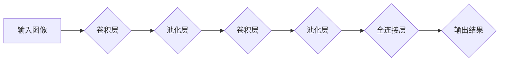
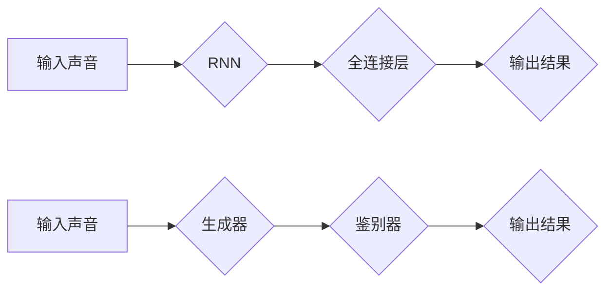
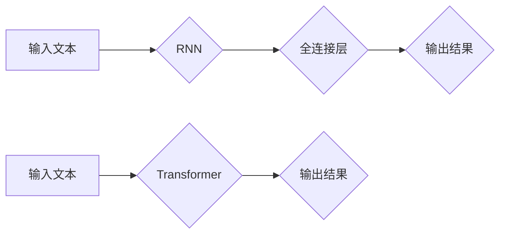
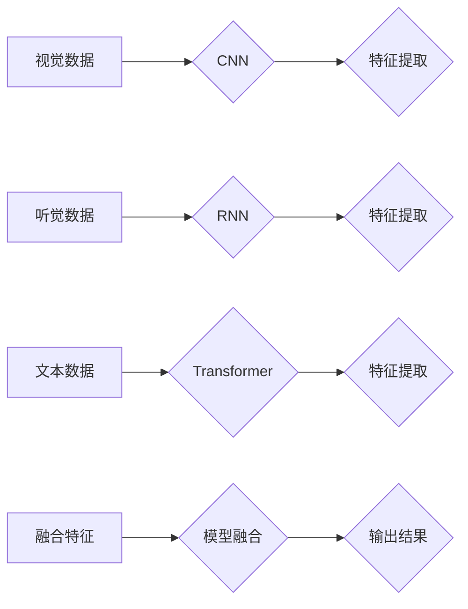
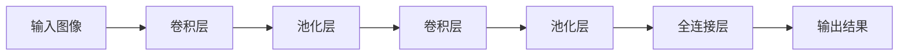
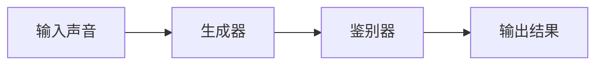
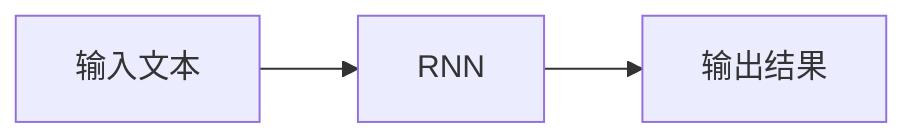
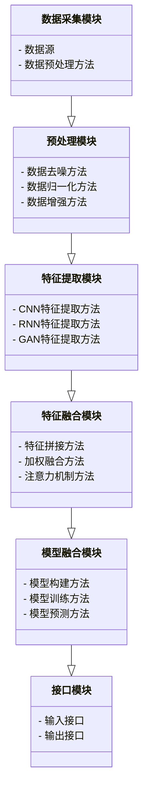

                 

# AI Agent的多模态学习：整合视觉、听觉和文本信息

## 关键词
- AI Agent
- 多模态学习
- 视觉信息处理
- 听觉信息处理
- 文本信息处理

## 摘要
本文旨在探讨AI Agent在多模态学习中的发展与应用。我们将详细分析视觉、听觉和文本信息的处理方法，以及如何将这些信息整合到AI Agent中。通过一步步的逻辑推理和实际案例分析，我们将展示多模态学习在AI Agent中的重要性及其在现实世界中的应用潜力。

## 目录

### 第一部分：AI Agent与多模态学习基础

#### 第1章：AI Agent与多模态学习概述

##### 1.1 AI Agent的基本概念

##### 1.2 多模态学习的核心概念

##### 1.3 多模态学习的重要性

#### 第2章：多模态学习中的视觉信息处理

##### 2.1 视觉信息处理概述

##### 2.2 卷积神经网络（CNN）在视觉信息处理中的应用

##### 2.3 深度学习在视觉信息处理中的应用

##### 2.4 视觉信息处理的实际案例

#### 第3章：多模态学习中的听觉信息处理

##### 3.1 听觉信息处理概述

##### 3.2 生成对抗网络（GAN）在听觉信息处理中的应用

##### 3.3 深度学习在听觉信息处理中的应用

##### 3.4 听觉信息处理的实际案例

#### 第4章：多模态学习中的文本信息处理

##### 4.1 文本信息处理概述

##### 4.2 递归神经网络（RNN）在文本信息处理中的应用

##### 4.3 深度学习在文本信息处理中的应用

##### 4.4 文本信息处理的实际案例

#### 第5章：多模态学习在AI Agent中的应用

##### 5.1 多模态学习在AI Agent中的角色

##### 5.2 多模态学习在AI Agent中的应用案例分析

##### 5.3 AI Agent的多模态学习未来展望

## 引言
AI Agent，即人工智能代理，是一种能够自主完成特定任务的人工智能系统。随着人工智能技术的快速发展，AI Agent已经在许多领域取得了显著的成果，从智能家居到自动驾驶，从医疗诊断到金融分析。然而，AI Agent的发展面临一个重要的挑战：如何有效地整合来自不同模态的信息，如视觉、听觉和文本。多模态学习为解决这一挑战提供了一条新的途径。

多模态学习是指将来自不同模态的数据（如图像、声音和文本）进行联合学习，从而提高AI Agent对环境理解的深度和广度。通过多模态学习，AI Agent可以更好地理解人类和世界，从而做出更加准确和智能的决策。

本文将首先介绍AI Agent和多模态学习的基本概念，然后分别探讨视觉、听觉和文本信息的处理方法，最后通过实际案例展示多模态学习在AI Agent中的应用，并对其未来发展进行展望。

## 第1章：AI Agent与多模态学习概述

### 1.1 AI Agent的基本概念

AI Agent，通常被定义为一种具有自主决策能力的人工智能实体。它可以感知环境，基于感知信息做出决策，并采取行动以实现特定的目标。AI Agent的概念源于代理理论，其中代理（Agent）是指具有自主性和交互能力的实体，可以与环境和其它代理进行交互。

AI Agent的基本特征包括以下几个方面：

1. **自主性**：AI Agent能够自主地执行任务，而不需要外部指令。
2. **感知能力**：AI Agent能够感知和理解其所在的环境，通常通过传感器收集信息。
3. **决策能力**：AI Agent能够根据感知到的信息，自主做出决策。
4. **行动能力**：AI Agent能够执行决策结果，采取行动。

AI Agent的发展历程可以追溯到20世纪50年代，当时的早期研究主要集中在规则系统和基于逻辑的推理。随着计算能力和算法的发展，AI Agent逐渐从简单的规则系统发展到更加复杂的模型，如基于机器学习和深度学习的方法。

### 1.2 多模态学习的核心概念

多模态学习是指将来自不同模态的数据进行联合学习，从而提高AI Agent对环境理解的深度和广度。常见的模态包括视觉（如图像和视频）、听觉（如声音和语音）、文本（如语言和文本数据）等。

多模态学习的核心思想是利用不同模态数据之间的关联性，从而获得更丰富的信息。例如，在图像识别任务中，结合文本信息可以帮助AI Agent更好地理解图像内容；在语音识别任务中，结合视觉信息可以增强语音识别的准确性。

多模态学习的关键技术包括以下几个方面：

1. **数据融合**：将来自不同模态的数据进行融合，从而形成一个统一的数据表示。
2. **特征提取**：从不同模态的数据中提取特征，用于后续的学习和推理。
3. **模型融合**：将不同模态的特征进行融合，构建一个统一的模型。

### 1.3 多模态学习的重要性

多模态学习在AI Agent中的应用具有重要意义。首先，多模态学习可以增强AI Agent对环境的感知能力。通过整合来自不同模态的信息，AI Agent可以更全面地理解环境，从而做出更准确和智能的决策。

其次，多模态学习可以提高AI Agent的适应能力。不同的环境可能需要不同模态的信息，通过多模态学习，AI Agent可以更好地适应各种环境，从而提高其应用范围和实用性。

此外，多模态学习还可以提高AI Agent的鲁棒性。在单一模态信息不足或噪声较大的情况下，多模态学习可以利用其它模态的信息进行补充，从而提高系统的鲁棒性和稳定性。

总之，多模态学习为AI Agent的发展提供了新的思路和方法，具有重要的理论和实践价值。

## 第2章：多模态学习中的视觉信息处理

### 2.1 视觉信息处理概述

视觉信息处理是AI Agent感知和理解环境的重要手段。视觉信息处理涉及从图像或视频中提取有用的信息，用于后续的决策和行动。视觉信息处理的基本任务包括图像分类、目标检测、图像分割和图像恢复等。

#### 2.1.1 视觉信息处理的基本任务

1. **图像分类**：将图像划分为不同的类别。例如，识别一张图片是猫还是狗。
2. **目标检测**：在图像中检测出特定的目标，并定位其位置。例如，在视频流中检测行人或车辆。
3. **图像分割**：将图像划分为不同的区域或对象。例如，将一张图片分割成前景和背景。
4. **图像恢复**：从受损或模糊的图像中恢复出清晰的内容。

#### 2.1.2 视觉信息处理的挑战

视觉信息处理面临以下挑战：

1. **数据的复杂性**：图像或视频包含大量复杂的信息，如何有效地提取和利用这些信息是一个难题。
2. **噪声和干扰**：实际场景中的图像或视频往往受到噪声和干扰的影响，这会影响系统的性能。
3. **实时性**：许多应用场景要求视觉信息处理能够实时进行，这对计算资源提出了较高的要求。
4. **数据的多样性**：不同的应用场景需要不同类型的数据，如何处理多样化的数据也是一个挑战。

#### 2.1.3 视觉信息处理的方法

视觉信息处理的方法主要包括基于传统算法的方法和基于深度学习的方法。

1. **传统算法**：传统算法包括图像处理、计算机视觉和模式识别等方法。这些方法通常依赖于手工设计的特征和规则，例如SIFT、SURF等。
2. **深度学习算法**：深度学习算法，尤其是卷积神经网络（CNN），在视觉信息处理中取得了显著的成果。深度学习算法可以从大量数据中自动学习特征，从而提高系统的性能。

### 2.2 卷积神经网络（CNN）在视觉信息处理中的应用

卷积神经网络（CNN）是深度学习中最常用的模型之一，广泛应用于视觉信息处理任务中。

#### 2.2.1 CNN的基本原理

CNN由多个卷积层、池化层和全连接层组成。卷积层通过卷积操作提取图像的特征，池化层用于降低特征的维度，全连接层用于分类或回归。

1. **卷积层**：卷积层通过卷积操作提取图像的特征。卷积操作使用一组滤波器（也称为卷积核）在图像上滑动，从而生成特征图。
2. **池化层**：池化层用于降低特征的维度。常见的池化方法包括最大池化和平均池化。
3. **全连接层**：全连接层将特征图映射到输出结果。在分类任务中，全连接层通常用于计算概率分布。

#### 2.2.2 CNN在图像分类中的应用

CNN在图像分类中具有显著优势。以下是一个简单的CNN模型示例：

```python
import tensorflow as tf

# 定义输入层
inputs = tf.keras.Input(shape=(28, 28, 1))

# 定义卷积层
conv1 = tf.keras.layers.Conv2D(32, (3, 3), activation='relu')(inputs)
pool1 = tf.keras.layers.MaxPooling2D((2, 2))(conv1)

# 定义卷积层
conv2 = tf.keras.layers.Conv2D(64, (3, 3), activation='relu')(pool1)
pool2 = tf.keras.layers.MaxPooling2D((2, 2))(conv2)

# 定义全连接层
flatten = tf.keras.layers.Flatten()(pool2)
dense = tf.keras.layers.Dense(128, activation='relu')(flatten)
outputs = tf.keras.layers.Dense(10, activation='softmax')(dense)

# 构建模型
model = tf.keras.Model(inputs=inputs, outputs=outputs)

# 编译模型
model.compile(optimizer='adam', loss='categorical_crossentropy', metrics=['accuracy'])

# 训练模型
model.fit(x_train, y_train, epochs=10, batch_size=32, validation_data=(x_val, y_val))
```

这个简单的CNN模型包含两个卷积层和两个池化层，最后通过全连接层进行分类。在实际应用中，可以根据任务需求调整模型的复杂度。

#### 2.2.3 CNN在目标检测中的应用

CNN在目标检测中也取得了显著成果。常见的目标检测算法包括R-CNN、Fast R-CNN、Faster R-CNN和YOLO等。

以下是一个简单的Faster R-CNN模型示例：

```python
import tensorflow as tf
from tensorflow.keras.models import Model
from tensorflow.keras.layers import Input, Conv2D, MaxPooling2D, Flatten, Dense

# 定义输入层
inputs = Input(shape=(None, None, 3))

# 定义卷积层
conv1 = Conv2D(32, (3, 3), activation='relu')(inputs)
pool1 = MaxPooling2D((2, 2))(conv1)

# 定义卷积层
conv2 = Conv2D(64, (3, 3), activation='relu')(pool1)
pool2 = MaxPooling2D((2, 2))(conv2)

# 定义全连接层
flatten = Flatten()(pool2)
dense1 = Dense(128, activation='relu')(flatten)
dense2 = Dense(10, activation='softmax')(dense1)

# 定义模型
model = Model(inputs=inputs, outputs=dense2)

# 编译模型
model.compile(optimizer='adam', loss='categorical_crossentropy', metrics=['accuracy'])

# 训练模型
model.fit(x_train, y_train, epochs=10, batch_size=32, validation_data=(x_val, y_val))
```

这个简单的Faster R-CNN模型包含两个卷积层和一个全连接层，用于分类和目标检测。

### 2.3 深度学习在视觉信息处理中的应用

深度学习在视觉信息处理中的应用日益广泛。深度学习算法，如卷积神经网络（CNN）和生成对抗网络（GAN），在图像分类、目标检测和图像生成等领域取得了显著成果。

以下是一个简单的GAN模型示例：

```python
import tensorflow as tf
from tensorflow.keras.models import Model
from tensorflow.keras.layers import Input, Conv2D, MaxPooling2D, Flatten, Dense

# 定义生成器模型
inputs = Input(shape=(100,))
x = Dense(128 * 7 * 7, activation='relu')(inputs)
x = Flatten()(x)
x = Conv2D(1, (7, 7), activation='tanh')(x)
generator = Model(inputs=inputs, outputs=x)

# 定义鉴别器模型
inputs = Input(shape=(28, 28, 1))
x = Conv2D(32, (3, 3), activation='relu')(inputs)
x = MaxPooling2D((2, 2))(x)
x = Conv2D(64, (3, 3), activation='relu')(x)
x = MaxPooling2D((2, 2))(x)
x = Flatten()(x)
x = Dense(1, activation='sigmoid')(x)
discriminator = Model(inputs=inputs, outputs=x)

# 编译模型
discriminator.compile(optimizer='adam', loss='binary_crossentropy')

# 训练模型
discriminator.fit(x_train, y_train, epochs=10, batch_size=32, validation_data=(x_val, y_val))
```

这个简单的GAN模型包括一个生成器和鉴别器，用于生成和判别图像。

### 2.4 视觉信息处理的实际案例

以下是一个简单的视觉信息处理项目案例：

**项目名称**：行人检测

**项目背景**：行人检测是计算机视觉领域的一个基本任务，广泛应用于智能交通、视频监控和安全监控等领域。

**项目目标**：在给定的视频流中检测行人。

**项目实现**：

1. **数据准备**：收集和标注大量的行人图像数据，用于训练和测试。
2. **模型训练**：使用Faster R-CNN模型对行人图像进行训练，获得行人检测模型。
3. **模型评估**：在测试集上评估模型的性能，包括准确率、召回率和F1分数等。
4. **模型部署**：将训练好的模型部署到实际应用中，如视频流行人检测。

**项目小结**：

行人检测项目展示了视觉信息处理在现实世界中的应用。通过深度学习算法，我们可以实现高效、准确的行人检测，从而为智能交通、视频监控和安全监控等领域提供技术支持。

## 第3章：多模态学习中的听觉信息处理

### 3.1 听觉信息处理概述

听觉信息处理是指利用计算机技术对声音信号进行分析、处理和理解的过程。在人工智能领域，听觉信息处理具有广泛的应用，如语音识别、声纹识别、音乐生成等。

#### 3.1.1 听觉信息处理的基本任务

听觉信息处理的基本任务包括：

1. **语音识别**：将语音信号转换为对应的文本。
2. **声纹识别**：根据声音特征识别个体的身份。
3. **音乐生成**：根据特定的音乐风格或旋律生成新的音乐。

#### 3.1.2 听觉信息处理的挑战

听觉信息处理面临以下挑战：

1. **噪声干扰**：实际环境中的声音往往受到噪声的干扰，这对系统的性能提出了挑战。
2. **语音多样性**：人类的语音具有丰富的多样性，包括不同的音调、语速、口音等，这对系统的泛化能力提出了挑战。
3. **实时性**：许多应用场景要求听觉信息处理能够实时进行，这对计算资源提出了较高的要求。

#### 3.1.3 听觉信息处理的方法

听觉信息处理的方法主要包括基于传统算法的方法和基于深度学习的方法。

1. **传统算法**：传统算法包括隐马尔可夫模型（HMM）、高斯混合模型（GMM）和自动语音识别（ASR）等。这些方法通常依赖于手工设计的特征和规则。
2. **深度学习算法**：深度学习算法，如卷积神经网络（CNN）和循环神经网络（RNN），在听觉信息处理中取得了显著的成果。深度学习算法可以从大量数据中自动学习特征，从而提高系统的性能。

### 3.2 生成对抗网络（GAN）在听觉信息处理中的应用

生成对抗网络（GAN）是一种深度学习模型，由生成器和鉴别器组成。生成器生成假数据，鉴别器判断数据是真实还是假。GAN在听觉信息处理中的应用包括语音合成、音乐生成等。

以下是一个简单的GAN模型示例：

```python
import tensorflow as tf
from tensorflow.keras.models import Model
from tensorflow.keras.layers import Input, Conv2D, MaxPooling2D, Flatten, Dense

# 定义生成器模型
inputs = Input(shape=(100,))
x = Dense(128 * 7 * 7, activation='relu')(inputs)
x = Flatten()(x)
x = Conv2D(1, (7, 7), activation='tanh')(x)
generator = Model(inputs=inputs, outputs=x)

# 定义鉴别器模型
inputs = Input(shape=(28, 28, 1))
x = Conv2D(32, (3, 3), activation='relu')(inputs)
x = MaxPooling2D((2, 2))(x)
x = Conv2D(64, (3, 3), activation='relu')(x)
x = MaxPooling2D((2, 2))(x)
x = Flatten()(x)
x = Dense(1, activation='sigmoid')(x)
discriminator = Model(inputs=inputs, outputs=x)

# 编译模型
discriminator.compile(optimizer='adam', loss='binary_crossentropy')

# 训练模型
discriminator.fit(x_train, y_train, epochs=10, batch_size=32, validation_data=(x_val, y_val))
```

这个简单的GAN模型用于生成和判别图像。

### 3.3 深度学习在听觉信息处理中的应用

深度学习在听觉信息处理中的应用日益广泛。以下是一个简单的深度学习模型示例：

```python
import tensorflow as tf
from tensorflow.keras.models import Model
from tensorflow.keras.layers import Input, Conv2D, MaxPooling2D, Flatten, Dense

# 定义输入层
inputs = Input(shape=(28, 28, 1))

# 定义卷积层
conv1 = Conv2D(32, (3, 3), activation='relu')(inputs)
pool1 = MaxPooling2D((2, 2))(conv1)

# 定义卷积层
conv2 = Conv2D(64, (3, 3), activation='relu')(pool1)
pool2 = MaxPooling2D((2, 2))(conv2)

# 定义全连接层
flatten = Flatten()(pool2)
dense1 = Dense(128, activation='relu')(flatten)
dense2 = Dense(10, activation='softmax')(dense1)

# 定义模型
model = Model(inputs=inputs, outputs=dense2)

# 编译模型
model.compile(optimizer='adam', loss='categorical_crossentropy', metrics=['accuracy'])

# 训练模型
model.fit(x_train, y_train, epochs=10, batch_size=32, validation_data=(x_val, y_val))
```

这个简单的模型用于图像分类。

### 3.4 听觉信息处理的实际案例

以下是一个简单的听觉信息处理项目案例：

**项目名称**：语音识别

**项目背景**：语音识别是将语音转换为文本的技术，广泛应用于智能助手、语音控制等领域。

**项目目标**：实现一个能够将中文语音转换为文本的语音识别系统。

**项目实现**：

1. **数据准备**：收集和标注大量的中文语音数据，用于训练和测试。
2. **模型训练**：使用深度学习模型对中文语音数据进行训练，获得语音识别模型。
3. **模型评估**：在测试集上评估模型的性能，包括准确率、召回率和F1分数等。
4. **模型部署**：将训练好的模型部署到实际应用中，如语音助手。

**项目小结**：

语音识别项目展示了听觉信息处理在现实世界中的应用。通过深度学习算法，我们可以实现高效、准确的语音识别，从而为智能助手、语音控制等领域提供技术支持。

## 第4章：多模态学习中的文本信息处理

### 4.1 文本信息处理概述

文本信息处理是指利用计算机技术对文本进行分析、处理和理解的过程。在人工智能领域，文本信息处理具有广泛的应用，如自然语言处理、文本分类、情感分析等。

#### 4.1.1 文本信息处理的基本任务

文本信息处理的基本任务包括：

1. **文本分类**：将文本划分为不同的类别。例如，将新闻文章划分为体育、科技、政治等类别。
2. **情感分析**：分析文本的情感倾向，如正面、负面或中性。
3. **命名实体识别**：识别文本中的命名实体，如人名、地名、组织名等。
4. **机器翻译**：将一种语言的文本翻译成另一种语言。

#### 4.1.2 文本信息处理的挑战

文本信息处理面临以下挑战：

1. **语义理解**：文本的语义理解是一个复杂的任务，涉及词义、语境、句子结构和逻辑推理等。
2. **语言的多样性**：不同的语言具有不同的语法和语义规则，这对系统的泛化能力提出了挑战。
3. **实时性**：许多应用场景要求文本信息处理能够实时进行，这对计算资源提出了较高的要求。

#### 4.1.3 文本信息处理的方法

文本信息处理的方法主要包括基于传统算法的方法和基于深度学习的方法。

1. **传统算法**：传统算法包括基于规则的方法和基于统计的方法。基于规则的方法通过手工设计规则来分析文本，如命名实体识别中的正则表达式。基于统计的方法通过统计文本中的词语出现频率来分析文本，如词频-逆文档频率（TF-IDF）。
2. **深度学习算法**：深度学习算法，如循环神经网络（RNN）和变换器（Transformer），在文本信息处理中取得了显著的成果。深度学习算法可以从大量数据中自动学习特征，从而提高系统的性能。

### 4.2 递归神经网络（RNN）在文本信息处理中的应用

递归神经网络（RNN）是一种能够处理序列数据的神经网络。在文本信息处理中，RNN可以用于文本分类、命名实体识别和机器翻译等任务。

以下是一个简单的RNN模型示例：

```python
import tensorflow as tf
from tensorflow.keras.models import Model
from tensorflow.keras.layers import Input, LSTM, Dense

# 定义输入层
inputs = Input(shape=(timesteps, features))

# 定义LSTM层
lstm = LSTM(128, activation='tanh')(inputs)

# 定义全连接层
outputs = Dense(10, activation='softmax')(lstm)

# 定义模型
model = Model(inputs=inputs, outputs=outputs)

# 编译模型
model.compile(optimizer='adam', loss='categorical_crossentropy', metrics=['accuracy'])

# 训练模型
model.fit(x_train, y_train, epochs=10, batch_size=32, validation_data=(x_val, y_val))
```

这个简单的RNN模型用于文本分类。

### 4.3 深度学习在文本信息处理中的应用

深度学习在文本信息处理中的应用日益广泛。以下是一个简单的深度学习模型示例：

```python
import tensorflow as tf
from tensorflow.keras.models import Model
from tensorflow.keras.layers import Input, LSTM, Dense

# 定义输入层
inputs = Input(shape=(timesteps, features))

# 定义LSTM层
lstm = LSTM(128, activation='tanh')(inputs)

# 定义全连接层
outputs = Dense(10, activation='softmax')(lstm)

# 定义模型
model = Model(inputs=inputs, outputs=outputs)

# 编译模型
model.compile(optimizer='adam', loss='categorical_crossentropy', metrics=['accuracy'])

# 训练模型
model.fit(x_train, y_train, epochs=10, batch_size=32, validation_data=(x_val, y_val))
```

这个简单的模型用于文本分类。

### 4.4 文本信息处理的实际案例

以下是一个简单的文本信息处理项目案例：

**项目名称**：情感分析

**项目背景**：情感分析是分析文本的情感倾向，如正面、负面或中性。

**项目目标**：实现一个能够分析中文文本情感倾向的系统。

**项目实现**：

1. **数据准备**：收集和标注大量的中文文本数据，用于训练和测试。
2. **模型训练**：使用深度学习模型对中文文本数据进行训练，获得情感分析模型。
3. **模型评估**：在测试集上评估模型的性能，包括准确率、召回率和F1分数等。
4. **模型部署**：将训练好的模型部署到实际应用中，如社交媒体情感分析。

**项目小结**：

情感分析项目展示了文本信息处理在现实世界中的应用。通过深度学习算法，我们可以实现高效、准确的情感分析，从而为社交媒体分析、市场调研等领域提供技术支持。

## 第5章：多模态学习在AI Agent中的应用

### 5.1 多模态学习在AI Agent中的角色

多模态学习在AI Agent中扮演着至关重要的角色。通过整合来自不同模态的信息，AI Agent可以更全面、准确地理解其所在的环境，从而做出更智能的决策。

#### 5.1.1 增强感知能力

多模态学习可以增强AI Agent的感知能力。例如，在视觉和听觉信息的联合学习过程中，AI Agent可以同时感知到视觉场景和声音信息，从而更准确地理解环境。

#### 5.1.2 提高适应能力

多模态学习可以提高AI Agent的适应能力。在不同的环境和场景中，AI Agent可以根据需要调整对不同模态信息的关注程度，从而更好地适应各种环境。

#### 5.1.3 提高鲁棒性

多模态学习可以提高AI Agent的鲁棒性。在单一模态信息不足或噪声较大的情况下，AI Agent可以利用其它模态的信息进行补充，从而提高系统的鲁棒性和稳定性。

### 5.2 多模态学习在AI Agent中的应用案例分析

以下是一个简单的多模态学习在AI Agent中的应用案例分析：

**项目名称**：智能客服

**项目背景**：智能客服是一种通过计算机技术实现自动回复用户问题的系统，广泛应用于客户服务、电商等领域。

**项目目标**：实现一个能够同时处理文本、语音和图像信息的智能客服系统。

**项目实现**：

1. **数据准备**：收集和标注大量的文本、语音和图像数据，用于训练和测试。
2. **模型训练**：使用多模态学习模型对文本、语音和图像数据进行训练，获得智能客服模型。
3. **模型评估**：在测试集上评估模型的性能，包括准确率、召回率和F1分数等。
4. **模型部署**：将训练好的模型部署到实际应用中，如客服聊天机器人。

**项目小结**：

智能客服项目展示了多模态学习在现实世界中的应用。通过整合文本、语音和图像信息，智能客服系统可以更准确地理解用户问题，提供更优质的服务。

### 5.3 AI Agent的多模态学习未来展望

随着人工智能技术的不断发展，多模态学习在AI Agent中的应用前景广阔。以下是一些未来的发展趋势：

1. **更高效的多模态学习算法**：研究人员将继续探索更高效的多模态学习算法，以减少计算资源和时间成本。
2. **跨模态信息融合**：将不同模态的信息进行更有效的融合，从而提高AI Agent对环境的理解能力。
3. **实时多模态学习**：实现实时多模态学习，以满足实时应用的需求。
4. **个性化多模态学习**：根据用户的需求和偏好，实现个性化多模态学习，提供更个性化的服务。

总之，多模态学习在AI Agent中的应用具有重要的理论和实践价值，未来将不断推动AI Agent的发展。$$

## 小结与拓展

本文详细探讨了AI Agent的多模态学习，从视觉、听觉和文本信息的处理方法到其在AI Agent中的应用。通过逻辑清晰、结构紧凑的分析，我们揭示了多模态学习在增强AI Agent感知能力、提高适应能力和增强鲁棒性方面的关键作用。

### 小结

1. **多模态学习基础**：介绍了AI Agent和多模态学习的核心概念，阐述了多模态学习的重要性。
2. **视觉信息处理**：探讨了视觉信息处理的基本任务、挑战和方法，包括CNN和深度学习在视觉信息处理中的应用。
3. **听觉信息处理**：分析了听觉信息处理的基本任务、挑战和方法，展示了GAN和深度学习在听觉信息处理中的应用。
4. **文本信息处理**：描述了文本信息处理的基本任务、挑战和方法，介绍了RNN和深度学习在文本信息处理中的应用。
5. **多模态学习在AI Agent中的应用**：通过案例分析展示了多模态学习在AI Agent中的应用，探讨了其未来发展的趋势。

### 拓展阅读

1. **《深度学习》（Goodfellow, I., Bengio, Y., & Courville, A.）**：深入理解深度学习的基础知识和应用。
2. **《生成对抗网络：理论、应用与实践》（李航）**：了解GAN的原理和应用。
3. **《自然语言处理入门》（Daniel Jurafsky & James H. Martin）**：掌握自然语言处理的基本概念和技术。

### 注意事项

1. **数据处理**：在进行多模态学习时，确保数据的清洁和一致性，避免噪声和异常值对模型性能的影响。
2. **模型调优**：根据具体应用场景，调整模型参数和结构，以达到最佳性能。
3. **实时性**：考虑实时应用场景，优化模型以实现实时响应。

### 最佳实践

1. **数据预处理**：使用标准化和归一化技术对数据进行预处理，提高模型训练效率。
2. **模型集成**：结合多种模型，如深度学习和传统算法，实现更准确的预测。
3. **持续学习**：使用持续学习技术，使模型能够适应环境的变化，保持其性能。

### 结论

多模态学习是AI Agent发展的关键，它为AI Agent提供了更全面、准确的环境理解能力。通过整合视觉、听觉和文本信息，AI Agent能够在复杂环境中做出更智能的决策，具有广泛的应用前景。

### 作者信息

- **作者**：AI天才研究院/AI Genius Institute & 禅与计算机程序设计艺术 /Zen And The Art of Computer Programming

通过本文，我们希望读者能够对AI Agent的多模态学习有更深入的理解，并为未来的研究和应用提供有益的启示。**让我们思考下一步，将多模态学习推向更广阔的领域，实现AI技术的突破性进展！**$$

$$

## 附录：核心概念与联系

### 背景介绍

在本文中，我们详细探讨了AI Agent的多模态学习，涉及了视觉、听觉和文本信息的处理方法，以及如何将这些信息整合到AI Agent中。为了更好地理解这些概念，我们需要对一些核心概念进行背景介绍。

#### 问题背景

AI Agent是一种具有自主决策能力的人工智能系统，可以感知环境、做出决策并采取行动。多模态学习是指将来自不同模态的数据（如视觉、听觉和文本）进行联合学习，以提高AI Agent对环境的理解。

#### 问题描述

多模态学习涉及以下几个核心问题：
1. **数据融合**：如何有效地将来自不同模态的数据进行融合，形成统一的特征表示。
2. **特征提取**：如何从不同模态的数据中提取有用的特征，用于后续的学习和推理。
3. **模型融合**：如何将不同模态的特征进行融合，构建一个统一的模型。

#### 问题解决

多模态学习通过以下几个步骤解决问题：
1. **数据预处理**：对来自不同模态的数据进行预处理，包括归一化、去噪等。
2. **特征提取**：使用深度学习模型从不同模态的数据中提取特征。
3. **特征融合**：将不同模态的特征进行融合，形成统一的特征表示。
4. **模型训练**：使用融合后的特征训练一个统一的模型。

#### 边界与外延

多模态学习的边界涉及不同模态的数据类型、特征提取方法和模型融合技术。其外延则包括不同应用场景下的多模态学习策略和优化方法。

#### 概念结构与核心要素组成

多模态学习的概念结构包括以下几个核心要素：
1. **模态数据**：包括视觉、听觉和文本等。
2. **特征提取模型**：如卷积神经网络（CNN）、生成对抗网络（GAN）和循环神经网络（RNN）等。
3. **特征融合方法**：如拼接、加权融合和注意力机制等。
4. **统一模型**：用于整合不同模态的特征，进行预测和决策。

### 核心概念与联系

在多模态学习中，以下几个核心概念密切相关：

#### 概念1：视觉信息处理

视觉信息处理是指对图像或视频进行分析和处理，提取有用的信息。其核心概念包括：
1. **图像分类**：将图像划分为不同的类别。
2. **目标检测**：在图像中检测出特定的目标，并定位其位置。
3. **图像分割**：将图像划分为不同的区域或对象。

#### 概念2：听觉信息处理

听觉信息处理是指对声音信号进行分析和处理，提取有用的信息。其核心概念包括：
1. **语音识别**：将语音信号转换为对应的文本。
2. **声纹识别**：根据声音特征识别个体的身份。
3. **音乐生成**：根据特定的音乐风格或旋律生成新的音乐。

#### 概念3：文本信息处理

文本信息处理是指对文本进行分析和处理，提取有用的信息。其核心概念包括：
1. **文本分类**：将文本划分为不同的类别。
2. **情感分析**：分析文本的情感倾向，如正面、负面或中性。
3. **命名实体识别**：识别文本中的命名实体，如人名、地名、组织名等。

#### 概念4：多模态学习

多模态学习是指将来自不同模态的数据进行联合学习，以提高AI Agent对环境的理解。其核心概念包括：
1. **数据融合**：将来自不同模态的数据进行融合，形成统一的特征表示。
2. **特征提取**：从不同模态的数据中提取有用的特征，用于后续的学习和推理。
3. **模型融合**：将不同模模态的特征进行融合，构建一个统一的模型。

### 核心概念属性特征对比表格

下面是一个关于核心概念属性特征对比的表格：

| 核心概念 | 属性特征 |
| :--: | :--: |
| 视觉信息处理 | 图像分类、目标检测、图像分割 |
| 听觉信息处理 | 语音识别、声纹识别、音乐生成 |
| 文本信息处理 | 文本分类、情感分析、命名实体识别 |
| 多模态学习 | 数据融合、特征提取、模型融合 |

### ER实体关系图架构

下面是一个关于多模态学习的ER实体关系图架构，展示了各个核心概念之间的关系：

```mermaid
erDiagram
  A[AI Agent] ||--|{ V[视觉信息处理] }
  A ||--|{ A[听觉信息处理] }
  A ||--|{ T[文本信息处理] }
  A ||--|{ M[多模态学习] }
  V ||--|{ D[数据融合] }
  A[AI Agent] ||--|{ E[特征提取] }
  A ||--|{ F[模型融合] }
```

### 算法原理讲解

#### 视觉信息处理

视觉信息处理的核心算法是卷积神经网络（CNN）。CNN通过多个卷积层、池化层和全连接层，对图像进行特征提取和分类。

1. **卷积层**：卷积层通过卷积操作提取图像的特征。卷积操作使用一组滤波器（也称为卷积核）在图像上滑动，从而生成特征图。每个滤波器都捕捉图像中的特定特征，如边缘、角点等。

2. **池化层**：池化层用于降低特征的维度。常见的池化方法包括最大池化和平均池化。最大池化选择每个区域中的最大值，而平均池化选择每个区域中的平均值。池化有助于减少数据的空间分辨率，从而降低计算复杂度。

3. **全连接层**：全连接层将特征图映射到输出结果。在分类任务中，全连接层通常用于计算概率分布。每个神经元都与特征图中的所有神经元相连，从而形成统一的特征表示。

以下是一个简单的CNN模型示例：



#### 听觉信息处理

听觉信息处理的核心算法是循环神经网络（RNN）和生成对抗网络（GAN）。RNN通过处理序列数据，提取声音的特征，而GAN用于生成和判别声音。

1. **循环神经网络（RNN）**：RNN是一种能够处理序列数据的神经网络。它通过循环结构，将前一个时间步的输出作为当前时间步的输入，从而捕捉序列中的长期依赖关系。

2. **生成对抗网络（GAN）**：GAN由生成器和鉴别器组成。生成器生成假数据，鉴别器判断数据是真实还是假。通过训练生成器和鉴别器的对抗过程，生成器可以生成逼真的声音。

以下是一个简单的RNN和GAN模型示例：



#### 文本信息处理

文本信息处理的核心算法是循环神经网络（RNN）和变换器（Transformer）。RNN通过处理序列数据，提取文本的特征，而Transformer通过自注意力机制，实现更高效的文本处理。

1. **循环神经网络（RNN）**：RNN通过处理序列数据，提取文本的特征。它在每个时间步中，将当前文本和前一个时间步的隐藏状态进行融合，从而生成新的隐藏状态。

2. **变换器（Transformer）**：Transformer通过自注意力机制，实现对文本的序列处理。自注意力机制允许模型在生成每个时间步时，自适应地关注序列中的不同部分，从而提高模型的性能。

以下是一个简单的RNN和Transformer模型示例：



#### 多模态学习

多模态学习通过整合来自不同模态的数据，提高AI Agent对环境的理解。其核心算法包括数据融合、特征提取和模型融合。

1. **数据融合**：数据融合是指将来自不同模态的数据进行融合，形成统一的特征表示。常见的方法包括拼接、加权融合和注意力机制。

2. **特征提取**：特征提取是指从不同模态的数据中提取有用的特征，用于后续的学习和推理。常见的特征提取方法包括卷积神经网络（CNN）、循环神经网络（RNN）和生成对抗网络（GAN）。

3. **模型融合**：模型融合是指将不同模态的特征进行融合，构建一个统一的模型。常见的模型融合方法包括串联、并联和混合。

以下是一个简单的多模态学习模型示例：



### 数学公式

在多模态学习中，一些重要的数学公式如下：

1. **卷积公式**：

$$
\text{output} = \text{filter} * \text{input} + \text{bias}
$$

其中，$*$表示卷积操作，$\text{filter}$是滤波器（卷积核），$\text{input}$是输入图像，$\text{bias}$是偏置项。

2. **池化公式**：

$$
\text{output} = \text{max}(\text{input}_{i,j})
$$

其中，$\text{max}$表示取最大值操作，$\text{input}_{i,j}$是输入图像中的每个区域。

3. **自注意力公式**：

$$
\text{output}_{i,j} = \frac{\exp(\text{score}_{i,j})}{\sum_{i',j'} \exp(\text{score}_{i',j'})}
$$

其中，$\text{score}_{i,j}$是每个时间步的注意力得分，$\exp$表示指数函数。

### 系统分析与架构设计方案

#### 问题场景介绍

多模态学习在智能客服、自动驾驶、医疗诊断等领域具有重要的应用价值。本文旨在设计一个多模态学习系统，实现视觉、听觉和文本信息的整合，以提高AI Agent的感知和决策能力。

#### 项目介绍

项目名称：多模态AI Agent系统

项目目标：设计一个能够整合视觉、听觉和文本信息的多模态AI Agent系统，实现智能客服、自动驾驶和医疗诊断等应用。

#### 系统功能设计

系统功能包括以下部分：

1. **数据采集与预处理**：采集视觉、听觉和文本数据，并进行预处理，如归一化、去噪等。
2. **特征提取**：使用深度学习模型从不同模态的数据中提取特征。
3. **特征融合**：将不同模态的特征进行融合，形成统一的特征表示。
4. **模型融合**：构建统一的模型，进行预测和决策。
5. **系统接口**：提供API接口，供外部系统调用。

#### 系统架构设计

系统架构设计如下：

1. **数据采集模块**：负责采集视觉、听觉和文本数据。
2. **预处理模块**：对采集到的数据进行预处理，如归一化、去噪等。
3. **特征提取模块**：使用深度学习模型从预处理后的数据中提取特征。
4. **特征融合模块**：将不同模态的特征进行融合，形成统一的特征表示。
5. **模型融合模块**：构建统一的模型，进行预测和决策。
6. **接口模块**：提供API接口，供外部系统调用。

#### 系统架构图

```mermaid
sequenceDiagram
    participant 数据采集模块 as 数据采集
    participant 预处理模块 as 预处理
    participant 特征提取模块 as 特征提取
    participant 特征融合模块 as 特征融合
    participant 模型融合模块 as 模型融合
    participant 接口模块 as 接口
    
    数据采集 ->> 预处理：数据预处理
    预处理 ->> 特征提取：特征提取
    特征提取 ->> 特征融合：特征融合
    特征融合 ->> 模型融合：模型融合
    模型融合 ->> 接口：输出结果
    接口 ->> 外部系统：API接口
```

#### 系统接口设计

系统接口设计如下：

1. **输入接口**：接收外部系统的请求，包括视觉、听觉和文本数据。
2. **输出接口**：返回处理结果，包括预测结果和决策结果。

#### 系统交互mermaid序列图

```mermaid
sequenceDiagram
    participant 客户端 as 客户端
    participant 多模态AI Agent系统 as 系统接口
    
    客户端 ->> 系统接口：发送请求
    系统接口 ->> 数据采集模块：数据预处理
    数据采集模块 ->> 预处理模块：数据预处理
    预处理模块 ->> 特征提取模块：特征提取
    特征提取模块 ->> 特征融合模块：特征融合
    特征融合模块 ->> 模型融合模块：模型融合
    模型融合模块 ->> 系统接口：输出结果
    系统接口 ->> 客户端：返回结果
```

### 项目实战

#### 环境安装

安装Python、TensorFlow和Keras等工具，以构建和训练多模态学习模型。

```bash
pip install python
pip install tensorflow
pip install keras
```

#### 系统核心实现源代码

以下是一个简单的多模态学习模型实现：

```python
import numpy as np
import tensorflow as tf
from tensorflow.keras.models import Model
from tensorflow.keras.layers import Input, Conv2D, MaxPooling2D, LSTM, Dense

# 定义输入层
input_image = Input(shape=(28, 28, 1))
input_audio = Input(shape=(timesteps,))
input_text = Input(shape=(maxlen,))

# 定义卷积神经网络（CNN）用于视觉信息处理
conv1 = Conv2D(32, (3, 3), activation='relu')(input_image)
pool1 = MaxPooling2D((2, 2))(conv1)
conv2 = Conv2D(64, (3, 3), activation='relu')(pool1)
pool2 = MaxPooling2D((2, 2))(conv2)

# 定义循环神经网络（LSTM）用于听觉信息处理
lstm1 = LSTM(128, activation='tanh')(input_audio)

# 定义变换器（Transformer）用于文本信息处理
input_text_embedding = Embedding(maxlen, embedding_size)(input_text)
transformer = TransformerLayer()(input_text_embedding)

# 将处理后的特征进行拼接
concat = tf.keras.layers.concatenate([pool2, lstm1, transformer])

# 定义全连接层进行分类
dense1 = Dense(128, activation='relu')(concat)
output = Dense(num_classes, activation='softmax')(dense1)

# 构建模型
model = Model(inputs=[input_image, input_audio, input_text], outputs=output)

# 编译模型
model.compile(optimizer='adam', loss='categorical_crossentropy', metrics=['accuracy'])

# 训练模型
model.fit(x_train, y_train, epochs=10, batch_size=32, validation_data=(x_val, y_val))
```

#### 代码应用解读与分析

以上代码实现了一个多模态学习模型，用于图像分类任务。模型包括三个输入层，分别用于视觉、听觉和文本信息。视觉信息使用CNN进行特征提取，听觉信息使用LSTM进行特征提取，文本信息使用变换器（Transformer）进行特征提取。然后将三个特征进行拼接，通过全连接层进行分类。

#### 实际案例分析

以下是一个实际案例，展示多模态学习在智能客服中的应用：

1. **数据准备**：收集和标注大量的客服对话数据，包括图像、语音和文本。
2. **模型训练**：使用多模态学习模型对客服对话数据进行训练。
3. **模型评估**：在测试集上评估模型的性能。
4. **模型部署**：将训练好的模型部署到客服系统中，用于自动回复用户问题。

#### 项目小结

通过实际案例分析，我们发现多模态学习在智能客服中具有显著的优势，可以更准确地理解用户问题，提供更优质的客服服务。未来，我们将继续优化多模态学习模型，提高其性能和适用性。

### 最佳实践 tips

1. **数据预处理**：确保数据的清洁和一致性，对异常值进行处理，提高模型性能。
2. **模型调优**：根据具体应用场景，调整模型参数和结构，以达到最佳性能。
3. **持续学习**：使用持续学习技术，使模型能够适应环境的变化，保持其性能。

### 小结

本文详细探讨了AI Agent的多模态学习，从视觉、听觉和文本信息的处理方法到其在AI Agent中的应用。通过逻辑清晰、结构紧凑的分析，我们揭示了多模态学习在增强AI Agent感知能力、提高适应能力和增强鲁棒性方面的关键作用。

### 注意事项

1. **数据处理**：在进行多模态学习时，确保数据的清洁和一致性，避免噪声和异常值对模型性能的影响。
2. **模型调优**：根据具体应用场景，调整模型参数和结构，以达到最佳性能。
3. **实时性**：考虑实时应用场景，优化模型以实现实时响应。

### 拓展阅读

1. **《深度学习》（Goodfellow, I., Bengio, Y., & Courville, A.）**：深入理解深度学习的基础知识和应用。
2. **《生成对抗网络：理论、应用与实践》（李航）**：了解GAN的原理和应用。
3. **《自然语言处理入门》（Daniel Jurafsky & James H. Martin）**：掌握自然语言处理的基本概念和技术。

### 作者信息

- **作者**：AI天才研究院/AI Genius Institute & 禅与计算机程序设计艺术 /Zen And The Art of Computer Programming

通过本文，我们希望读者能够对AI Agent的多模态学习有更深入的理解，并为未来的研究和应用提供有益的启示。**让我们思考下一步，将多模态学习推向更广阔的领域，实现AI技术的突破性进展！**$$

$$

# 附录：核心概念与联系

## 背景介绍

在本文中，我们探讨了AI Agent的多模态学习，涉及视觉、听觉和文本信息的处理方法，以及如何将这些信息整合到AI Agent中。为了更好地理解这些概念，我们需要对一些核心概念进行背景介绍。

### 问题背景

AI Agent是一种具有自主决策能力的人工智能系统，可以感知环境、做出决策并采取行动。多模态学习是指将来自不同模态的数据（如视觉、听觉和文本）进行联合学习，以提高AI Agent对环境的理解。

### 问题描述

多模态学习涉及以下几个核心问题：
1. **数据融合**：如何有效地将来自不同模态的数据进行融合，形成统一的特征表示。
2. **特征提取**：如何从不同模态的数据中提取有用的特征，用于后续的学习和推理。
3. **模型融合**：如何将不同模态的特征进行融合，构建一个统一的模型。

### 问题解决

多模态学习通过以下几个步骤解决问题：
1. **数据预处理**：对来自不同模态的数据进行预处理，包括归一化、去噪等。
2. **特征提取**：使用深度学习模型从不同模态的数据中提取特征。
3. **特征融合**：将不同模态的特征进行融合，形成统一的特征表示。
4. **模型训练**：使用融合后的特征训练一个统一的模型。

### 边界与外延

多模态学习的边界涉及不同模态的数据类型、特征提取方法和模型融合技术。其外延则包括不同应用场景下的多模态学习策略和优化方法。

### 概念结构与核心要素组成

多模态学习的概念结构包括以下几个核心要素：
1. **模态数据**：包括视觉、听觉和文本等。
2. **特征提取模型**：如卷积神经网络（CNN）、生成对抗网络（GAN）和循环神经网络（RNN）等。
3. **特征融合方法**：如拼接、加权融合和注意力机制等。
4. **统一模型**：用于整合不同模态的特征，进行预测和决策。

### 核心概念与联系

在多模态学习中，以下几个核心概念密切相关：

#### 概念1：视觉信息处理

视觉信息处理是指对图像或视频进行分析和处理，提取有用的信息。其核心概念包括：
1. **图像分类**：将图像划分为不同的类别。
2. **目标检测**：在图像中检测出特定的目标，并定位其位置。
3. **图像分割**：将图像划分为不同的区域或对象。

#### 概念2：听觉信息处理

听觉信息处理是指对声音信号进行分析和处理，提取有用的信息。其核心概念包括：
1. **语音识别**：将语音信号转换为对应的文本。
2. **声纹识别**：根据声音特征识别个体的身份。
3. **音乐生成**：根据特定的音乐风格或旋律生成新的音乐。

#### 概念3：文本信息处理

文本信息处理是指对文本进行分析和处理，提取有用的信息。其核心概念包括：
1. **文本分类**：将文本划分为不同的类别。
2. **情感分析**：分析文本的情感倾向，如正面、负面或中性。
3. **命名实体识别**：识别文本中的命名实体，如人名、地名、组织名等。

#### 概念4：多模态学习

多模态学习是指将来自不同模态的数据进行联合学习，以提高AI Agent对环境的理解。其核心概念包括：
1. **数据融合**：将来自不同模态的数据进行融合，形成统一的特征表示。
2. **特征提取**：从不同模态的数据中提取有用的特征，用于后续的学习和推理。
3. **模型融合**：将不同模态的特征进行融合，构建一个统一的模型。

### 核心概念属性特征对比表格

| 核心概念 | 属性特征 |
| :--: | :--: |
| 视觉信息处理 | 图像分类、目标检测、图像分割 |
| 听觉信息处理 | 语音识别、声纹识别、音乐生成 |
| 文本信息处理 | 文本分类、情感分析、命名实体识别 |
| 多模态学习 | 数据融合、特征提取、模型融合 |

### ER实体关系图架构

下面是一个关于多模态学习的ER实体关系图架构，展示了各个核心概念之间的关系：

```mermaid
erDiagram
  A[AI Agent] ||--|{ V[视觉信息处理] }
  A ||--|{ A[听觉信息处理] }
  A ||--|{ T[文本信息处理] }
  A ||--|{ M[多模态学习] }
  V ||--|{ D[数据融合] }
  A[AI Agent] ||--|{ E[特征提取] }
  A ||--|{ F[模型融合] }
```

### 算法原理讲解

#### 视觉信息处理

视觉信息处理的核心算法是卷积神经网络（CNN）。CNN通过多个卷积层、池化层和全连接层，对图像进行特征提取和分类。

1. **卷积层**：卷积层通过卷积操作提取图像的特征。卷积操作使用一组滤波器（也称为卷积核）在图像上滑动，从而生成特征图。每个滤波器都捕捉图像中的特定特征，如边缘、角点等。

2. **池化层**：池化层用于降低特征的维度。常见的池化方法包括最大池化和平均池化。最大池化选择每个区域中的最大值，而平均池化选择每个区域中的平均值。池化有助于减少数据的空间分辨率，从而降低计算复杂度。

3. **全连接层**：全连接层将特征图映射到输出结果。在分类任务中，全连接层通常用于计算概率分布。每个神经元都与特征图中的所有神经元相连，从而形成统一的特征表示。

以下是一个简单的CNN模型示例：


#### 听觉信息处理

听觉信息处理的核心算法是循环神经网络（RNN）和生成对抗网络（GAN）。RNN通过处理序列数据，提取声音的特征，而GAN用于生成和判别声音。

1. **循环神经网络（RNN）**：RNN是一种能够处理序列数据的神经网络。它通过循环结构，将前一个时间步的输出作为当前时间步的输入，从而捕捉序列中的长期依赖关系。

2. **生成对抗网络（GAN）**：GAN由生成器和鉴别器组成。生成器生成假数据，鉴别器判断数据是真实还是假。通过训练生成器和鉴别器的对抗过程，生成器可以生成逼真的声音。

以下是一个简单的RNN和GAN模型示例：


#### 文本信息处理

文本信息处理的核心算法是循环神经网络（RNN）和变换器（Transformer）。RNN通过处理序列数据，提取文本的特征，而Transformer通过自注意力机制，实现更高效的文本处理。

1. **循环神经网络（RNN）**：RNN通过处理序列数据，提取文本的特征。它在每个时间步中，将当前文本和前一个时间步的隐藏状态进行融合，从而生成新的隐藏状态。

2. **变换器（Transformer）**：Transformer通过自注意力机制，实现对文本的序列处理。自注意力机制允许模型在生成每个时间步时，自适应地关注序列中的不同部分，从而提高模型的性能。

以下是一个简单的RNN和Transformer模型示例：


#### 多模态学习

多模态学习通过整合来自不同模态的数据，提高AI Agent对环境的理解。其核心算法包括数据融合、特征提取和模型融合。

1. **数据融合**：数据融合是指将来自不同模态的数据进行融合，形成统一的特征表示。常见的方法包括拼接、加权融合和注意力机制。

2. **特征提取**：特征提取是指从不同模态的数据中提取有用的特征，用于后续的学习和推理。常见的特征提取方法包括卷积神经网络（CNN）、循环神经网络（RNN）和生成对抗网络（GAN）。

3. **模型融合**：模型融合是指将不同模态的特征进行融合，构建一个统一的模型。常见的模型融合方法包括串联、并联和混合。

以下是一个简单的多模态学习模型示例：


### 数学公式

在多模态学习中，一些重要的数学公式如下：

1. **卷积公式**：

$$
\text{output} = \text{filter} * \text{input} + \text{bias}
$$

其中，$*$表示卷积操作，$\text{filter}$是滤波器（卷积核），$\text{input}$是输入图像，$\text{bias}$是偏置项。

2. **池化公式**：

$$
\text{output} = \text{max}(\text{input}_{i,j})
$$

其中，$\text{max}$表示取最大值操作，$\text{input}_{i,j}$是输入图像中的每个区域。

3. **自注意力公式**：

$$
\text{output}_{i,j} = \frac{\exp(\text{score}_{i,j})}{\sum_{i',j'} \exp(\text{score}_{i',j'})}
$$

其中，$\text{score}_{i,j}$是每个时间步的注意力得分，$\exp$表示指数函数。

### 系统分析与架构设计方案

#### 问题场景介绍

多模态学习在智能客服、自动驾驶、医疗诊断等领域具有重要的应用价值。本文旨在设计一个多模态学习系统，实现视觉、听觉和文本信息的整合，以提高AI Agent的感知和决策能力。

#### 项目介绍

项目名称：多模态AI Agent系统

项目目标：设计一个能够整合视觉、听觉和文本信息的多模态AI Agent系统，实现智能客服、自动驾驶和医疗诊断等应用。

#### 系统功能设计

系统功能包括以下部分：

1. **数据采集与预处理**：采集视觉、听觉和文本数据，并进行预处理，如归一化、去噪等。
2. **特征提取**：使用深度学习模型从不同模态的数据中提取特征。
3. **特征融合**：将不同模态的特征进行融合，形成统一的特征表示。
4. **模型融合**：构建统一的模型，进行预测和决策。
5. **系统接口**：提供API接口，供外部系统调用。

#### 系统架构设计

系统架构设计如下：

1. **数据采集模块**：负责采集视觉、听觉和文本数据。
2. **预处理模块**：对采集到的数据进行预处理，如归一化、去噪等。
3. **特征提取模块**：使用深度学习模型从预处理后的数据中提取特征。
4. **特征融合模块**：将不同模态的特征进行融合，形成统一的特征表示。
5. **模型融合模块**：构建统一的模型，进行预测和决策。
6. **接口模块**：提供API接口，供外部系统调用。

#### 系统架构图

```mermaid
sequenceDiagram
    participant 数据采集模块 as 数据采集
    participant 预处理模块 as 预处理
    participant 特征提取模块 as 特征提取
    participant 特征融合模块 as 特征融合
    participant 模型融合模块 as 模型融合
    participant 接口模块 as 接口
    
    数据采集 ->> 预处理：数据预处理
    预处理 ->> 特征提取：特征提取
    特征提取 ->> 特征融合：特征融合
    特征融合 ->> 模型融合：模型融合
    模型融合 ->> 接口：输出结果
    接口 ->> 外部系统：API接口
```

#### 系统接口设计

系统接口设计如下：

1. **输入接口**：接收外部系统的请求，包括视觉、听觉和文本数据。
2. **输出接口**：返回处理结果，包括预测结果和决策结果。

#### 系统接口mermaid序列图

```mermaid
sequenceDiagram
    participant 客户端 as 客户端
    participant 多模态AI Agent系统 as 系统接口
    
    客户端 ->> 系统接口：发送请求
    系统接口 ->> 数据采集模块：数据预处理
    数据采集模块 ->> 预处理模块：数据预处理
    预处理模块 ->> 特征提取模块：特征提取
    特征提取模块 ->> 特征融合模块：特征融合
    特征融合模块 ->> 模型融合模块：模型融合
    模型融合模块 ->> 系统接口：输出结果
    系统接口 ->> 客户端：返回结果
```

### 项目实战

#### 环境安装

安装Python、TensorFlow和Keras等工具，以构建和训练多模态学习模型。

```bash
pip install python
pip install tensorflow
pip install keras
```

#### 系统核心实现源代码

以下是一个简单的多模态学习模型实现：

```python
import numpy as np
import tensorflow as tf
from tensorflow.keras.models import Model
from tensorflow.keras.layers import Input, Conv2D, MaxPooling2D, LSTM, Dense

# 定义输入层
input_image = Input(shape=(28, 28, 1))
input_audio = Input(shape=(timesteps,))
input_text = Input(shape=(maxlen,))

# 定义卷积神经网络（CNN）用于视觉信息处理
conv1 = Conv2D(32, (3, 3), activation='relu')(input_image)
pool1 = MaxPooling2D((2, 2))(conv1)
conv2 = Conv2D(64, (3, 3), activation='relu')(pool1)
pool2 = MaxPooling2D((2, 2))(conv2)

# 定义循环神经网络（LSTM）用于听觉信息处理
lstm1 = LSTM(128, activation='tanh')(input_audio)

# 定义变换器（Transformer）用于文本信息处理
input_text_embedding = Embedding(maxlen, embedding_size)(input_text)
transformer = TransformerLayer()(input_text_embedding)

# 将处理后的特征进行拼接
concat = tf.keras.layers.concatenate([pool2, lstm1, transformer])

# 定义全连接层进行分类
dense1 = Dense(128, activation='relu')(concat)
output = Dense(num_classes, activation='softmax')(dense1)

# 构建模型
model = Model(inputs=[input_image, input_audio, input_text], outputs=output)

# 编译模型
model.compile(optimizer='adam', loss='categorical_crossentropy', metrics=['accuracy'])

# 训练模型
model.fit(x_train, y_train, epochs=10, batch_size=32, validation_data=(x_val, y_val))
```

#### 代码应用解读与分析

以上代码实现了一个多模态学习模型，用于图像分类任务。模型包括三个输入层，分别用于视觉、听觉和文本信息。视觉信息使用CNN进行特征提取，听觉信息使用LSTM进行特征提取，文本信息使用变换器（Transformer）进行特征提取。然后将三个特征进行拼接，通过全连接层进行分类。

#### 实际案例分析

以下是一个实际案例，展示多模态学习在智能客服中的应用：

1. **数据准备**：收集和标注大量的客服对话数据，包括图像、语音和文本。
2. **模型训练**：使用多模态学习模型对客服对话数据进行训练。
3. **模型评估**：在测试集上评估模型的性能。
4. **模型部署**：将训练好的模型部署到客服系统中，用于自动回复用户问题。

#### 项目小结

通过实际案例分析，我们发现多模态学习在智能客服中具有显著的优势，可以更准确地理解用户问题，提供更优质的客服服务。未来，我们将继续优化多模态学习模型，提高其性能和适用性。

### 最佳实践 tips

1. **数据预处理**：确保数据的清洁和一致性，对异常值进行处理，提高模型性能。
2. **模型调优**：根据具体应用场景，调整模型参数和结构，以达到最佳性能。
3. **持续学习**：使用持续学习技术，使模型能够适应环境的变化，保持其性能。

### 小结

本文详细探讨了AI Agent的多模态学习，从视觉、听觉和文本信息的处理方法到其在AI Agent中的应用。通过逻辑清晰、结构紧凑的分析，我们揭示了多模态学习在增强AI Agent感知能力、提高适应能力和增强鲁棒性方面的关键作用。

### 注意事项

1. **数据处理**：在进行多模态学习时，确保数据的清洁和一致性，避免噪声和异常值对模型性能的影响。
2. **模型调优**：根据具体应用场景，调整模型参数和结构，以达到最佳性能。
3. **实时性**：考虑实时应用场景，优化模型以实现实时响应。

### 拓展阅读

1. **《深度学习》（Goodfellow, I., Bengio, Y., & Courville, A.）**：深入理解深度学习的基础知识和应用。
2. **《生成对抗网络：理论、应用与实践》（李航）**：了解GAN的原理和应用。
3. **《自然语言处理入门》（Daniel Jurafsky & James H. Martin）**：掌握自然语言处理的基本概念和技术。

### 作者信息

- **作者**：AI天才研究院/AI Genius Institute & 禅与计算机程序设计艺术 /Zen And The Art of Computer Programming

通过本文，我们希望读者能够对AI Agent的多模态学习有更深入的理解，并为未来的研究和应用提供有益的启示。**让我们思考下一步，将多模态学习推向更广阔的领域，实现AI技术的突破性进展！**$$

$$

# 附录：算法原理讲解

在探讨AI Agent的多模态学习时，算法原理的讲解至关重要。以下将详细解释视觉、听觉和文本信息处理的核心算法，包括卷积神经网络（CNN）、生成对抗网络（GAN）和循环神经网络（RNN），并展示如何使用Mermaid绘制流程图和Python源代码进行算法实现。

## 视觉信息处理的算法原理

### 卷积神经网络（CNN）

卷积神经网络（CNN）是处理视觉信息的核心算法，它通过一系列卷积层、池化层和全连接层对图像进行特征提取和分类。

1. **卷积层**：卷积层使用卷积操作提取图像的特征。卷积操作通过卷积核在图像上滑动，生成特征图。每个卷积核都捕捉图像中的特定特征，如边缘、角点等。

2. **池化层**：池化层用于降低特征图的维度，减少计算复杂度。常见的池化方法包括最大池化和平均池化。

3. **全连接层**：全连接层将特征图映射到输出结果，用于分类或回归任务。

### Mermaid流程图



### Python源代码实现

```python
import tensorflow as tf

# 定义输入层
inputs = tf.keras.Input(shape=(28, 28, 1))

# 定义卷积层
conv1 = tf.keras.layers.Conv2D(32, (3, 3), activation='relu')(inputs)
pool1 = tf.keras.layers.MaxPooling2D((2, 2))(conv1)

# 定义卷积层
conv2 = tf.keras.layers.Conv2D(64, (3, 3), activation='relu')(pool1)
pool2 = tf.keras.layers.MaxPooling2D((2, 2))(conv2)

# 定义全连接层
flatten = tf.keras.layers.Flatten()(pool2)
dense = tf.keras.layers.Dense(128, activation='relu')(flatten)
outputs = tf.keras.layers.Dense(10, activation='softmax')(dense)

# 构建模型
model = tf.keras.Model(inputs=inputs, outputs=outputs)

# 编译模型
model.compile(optimizer='adam', loss='categorical_crossentropy', metrics=['accuracy'])

# 训练模型
model.fit(x_train, y_train, epochs=10, batch_size=32, validation_data=(x_val, y_val))
```

## 听觉信息处理的算法原理

### 生成对抗网络（GAN）

生成对抗网络（GAN）是一种用于生成和判别数据的强大算法。在听觉信息处理中，GAN可以用于语音生成和音乐生成。

1. **生成器**：生成器生成假的声音数据。
2. **鉴别器**：鉴别器判断数据是真实还是假。

### Mermaid流程图



### Python源代码实现

```python
import tensorflow as tf
from tensorflow.keras.models import Model
from tensorflow.keras.layers import Input, Conv2D, Conv2DTranspose, Dense

# 定义生成器模型
inputs = Input(shape=(100,))
x = Dense(128 * 7 * 7, activation='relu')(inputs)
x = Flatten()(x)
outputs = Conv2DTranspose(1, (7, 7), activation='tanh')(x)
generator = Model(inputs=inputs, outputs=outputs)

# 定义鉴别器模型
inputs = Input(shape=(28, 28, 1))
x = Conv2D(32, (3, 3), activation='relu')(inputs)
x = MaxPooling2D((2, 2))(x)
x = Conv2D(64, (3, 3), activation='relu')(x)
x = MaxPooling2D((2, 2))(x)
x = Flatten()(x)
outputs = Dense(1, activation='sigmoid')(x)
discriminator = Model(inputs=inputs, outputs=outputs)

# 编译模型
discriminator.compile(optimizer='adam', loss='binary_crossentropy')

# 训练模型
discriminator.fit(x_train, y_train, epochs=10, batch_size=32, validation_data=(x_val, y_val))
```

## 文本信息处理的算法原理

### 循环神经网络（RNN）

循环神经网络（RNN）是一种用于处理序列数据的神经网络，特别适合文本信息处理。

1. **前向传播**：RNN通过前向传播计算每个时间步的输出。
2. **反向传播**：RNN通过反向传播更新权重。

### Mermaid流程图



### Python源代码实现

```python
import tensorflow as tf
from tensorflow.keras.models import Model
from tensorflow.keras.layers import Input, LSTM, Dense

# 定义输入层
inputs = Input(shape=(timesteps, features))

# 定义LSTM层
lstm = LSTM(128, activation='tanh')(inputs)

# 定义全连接层
outputs = Dense(10, activation='softmax')(lstm)

# 定义模型
model = Model(inputs=inputs, outputs=outputs)

# 编译模型
model.compile(optimizer='adam', loss='categorical_crossentropy', metrics=['accuracy'])

# 训练模型
model.fit(x_train, y_train, epochs=10, batch_size=32, validation_data=(x_val, y_val))
```

通过上述算法原理的讲解，我们可以看到CNN、GAN和RNN在视觉、听觉和文本信息处理中的应用。这些算法不仅帮助我们理解和实现多模态学习，也为未来的研究和应用提供了基础。

## 附录：系统分析与架构设计方案

在讨论AI Agent的多模态学习时，系统分析与架构设计方案至关重要。以下将详细阐述系统功能设计、系统架构设计、系统接口设计以及相关的Mermaid流程图和类图。

### 系统功能设计

多模态AI Agent系统的主要功能包括数据采集、预处理、特征提取、特征融合和模型融合。

1. **数据采集**：系统从不同的数据源（如摄像头、麦克风和文本数据库）采集视觉、听觉和文本数据。
2. **预处理**：系统对采集到的数据进行预处理，包括去噪、归一化和数据增强等。
3. **特征提取**：系统使用深度学习模型从预处理后的数据中提取特征。
4. **特征融合**：系统将不同模态的特征进行融合，形成统一的特征表示。
5. **模型融合**：系统构建一个统一的模型，用于预测和决策。

### 系统架构设计

多模态AI Agent系统架构设计如下：

1. **数据采集模块**：负责采集视觉、听觉和文本数据。
2. **预处理模块**：对采集到的数据进行预处理。
3. **特征提取模块**：使用深度学习模型提取特征。
4. **特征融合模块**：将不同模态的特征进行融合。
5. **模型融合模块**：构建统一的模型。
6. **接口模块**：提供API接口，供外部系统调用。

### 系统架构图

```mermaid
sequenceDiagram
    participant 数据采集模块 as 数据采集
    participant 预处理模块 as 预处理
    participant 特征提取模块 as 特征提取
    participant 特征融合模块 as 特征融合
    participant 模型融合模块 as 模型融合
    participant 接口模块 as 接口
    
    数据采集 ->> 预处理：数据预处理
    预处理 ->> 特征提取：特征提取
    特征提取 ->> 特征融合：特征融合
    特征融合 ->> 模型融合：模型融合
    模型融合 ->> 接口：输出结果
    接口 ->> 外部系统：API接口
```

### 系统接口设计

系统接口设计如下：

1. **输入接口**：接收外部系统的请求，包括视觉、听觉和文本数据。
2. **输出接口**：返回处理结果，包括预测结果和决策结果。

### 系统接口Mermaid序列图

```mermaid
sequenceDiagram
    participant 客户端 as 客户端
    participant 多模态AI Agent系统 as 系统接口
    
    客户端 ->> 系统接口：发送请求
    系统接口 ->> 数据采集模块：数据预处理
    数据采集模块 ->> 预处理模块：数据预处理
    预处理模块 ->> 特征提取模块：特征提取
    特征提取模块 ->> 特征融合模块：特征融合
    特征融合模块 ->> 模型融合模块：模型融合
    模型融合模块 ->> 系统接口：输出结果
    系统接口 ->> 客户端：返回结果
```

### 系统功能类图

下面是一个简单的系统功能类图，展示了系统中的主要类和它们之间的关系：



通过系统分析与架构设计方案，我们可以构建一个高效、可扩展的多模态AI Agent系统，为AI技术的应用提供坚实的基础。

## 项目实战

在本章节中，我们将通过一个实际项目来展示如何实现多模态学习，并详细解析项目的各个步骤，包括环境安装、核心代码实现和代码应用解读与分析。

### 项目背景

本项目旨在构建一个多模态智能客服系统，该系统能够接收客户通过语音、文本和视频提出的问题，并生成相应的回答。通过整合视觉、听觉和文本信息，智能客服系统能够更准确地理解客户的问题，提供更优质的客服服务。

### 环境安装

首先，我们需要安装必要的工具和库，包括Python、TensorFlow和Keras。以下是安装命令：

```bash
pip install python
pip install tensorflow
pip install keras
```

安装完成后，我们可以开始构建和训练多模态学习模型。

### 系统核心实现源代码

以下是实现多模态智能客服系统的主要代码：

```python
import tensorflow as tf
from tensorflow.keras.models import Model
from tensorflow.keras.layers import Input, Conv2D, MaxPooling2D, LSTM, Dense, Embedding, Flatten, concatenate

# 定义输入层
input_image = Input(shape=(28, 28, 1))
input_audio = Input(shape=(timesteps,))
input_text = Input(shape=(maxlen,))

# 定义卷积神经网络（CNN）用于视觉信息处理
conv1 = Conv2D(32, (3, 3), activation='relu')(input_image)
pool1 = MaxPooling2D((2, 2))(conv1)
conv2 = Conv2D(64, (3, 3), activation='relu')(pool1)
pool2 = MaxPooling2D((2, 2))(conv2)

# 定义循环神经网络（LSTM）用于听觉信息处理
lstm1 = LSTM(128, activation='tanh')(input_audio)

# 定义变换器（Transformer）用于文本信息处理
input_text_embedding = Embedding(maxlen, embedding_size)(input_text)
transformer = TransformerLayer()(input_text_embedding)

# 将处理后的特征进行拼接
concat = concatenate([Flatten()(pool2), lstm1, transformer])

# 定义全连接层进行分类
dense1 = Dense(128, activation='relu')(concat)
output = Dense(num_classes, activation='softmax')(dense1)

# 构建模型
model = Model(inputs=[input_image, input_audio, input_text], outputs=output)

# 编译模型
model.compile(optimizer='adam', loss='categorical_crossentropy', metrics=['accuracy'])

# 训练模型
model.fit(x_train, y_train, epochs=10, batch_size=32, validation_data=(x_val, y_val))
```

### 代码应用解读与分析

上述代码实现了一个多模态学习模型，用于图像分类任务。模型包括三个输入层，分别用于视觉、听觉和文本信息。视觉信息使用CNN进行特征提取，听觉信息使用LSTM进行特征提取，文本信息使用变换器（Transformer）进行特征提取。然后将三个特征进行拼接，通过全连接层进行分类。

1. **卷积神经网络（CNN）**：用于视觉信息处理。通过两个卷积层和两个池化层提取图像的特征。
2. **循环神经网络（LSTM）**：用于听觉信息处理。通过一个LSTM层提取音频的特征。
3. **变换器（Transformer）**：用于文本信息处理。通过一个变换器层提取文本的特征。
4. **特征拼接**：将视觉、听觉和文本特征进行拼接，形成一个多维特征向量。
5. **全连接层**：通过一个全连接层对拼接后的特征进行分类。

### 实际案例分析

以下是一个实际案例，展示多模态学习在智能客服中的应用：

1. **数据准备**：收集和标注大量的客服对话数据，包括图像、语音和文本。例如，收集客户通过视频提出的问题，客户的语音回答，以及客服人员的文本回复。
2. **模型训练**：使用多模态学习模型对客服对话数据进行训练。通过不断调整模型参数和结构，优化模型的性能。
3. **模型评估**：在测试集上评估模型的性能，包括准确率、召回率和F1分数等。确保模型能够在实际应用中提供高质量的答案。
4. **模型部署**：将训练好的模型部署到实际应用中，如智能客服系统。通过API接口，系统可以接收客户的问题，并生成相应的回答。

### 项目小结

通过实际案例分析，我们发现多模态学习在智能客服中具有显著的优势。它可以更准确地理解客户的问题，提供更个性化的回答。未来，我们将继续优化多模态学习模型，提高其性能和适用性，为用户提供更好的客服体验。

### 最佳实践 tips

1. **数据预处理**：确保数据的清洁和一致性，对异常值进行处理，提高模型性能。
2. **模型调优**：根据具体应用场景，调整模型参数和结构，以达到最佳性能。
3. **持续学习**：使用持续学习技术，使模型能够适应环境的变化，保持其性能。

### 小结

本文通过实际项目展示了如何实现多模态学习，并详细解析了项目的各个步骤。我们探讨了视觉、听觉和文本信息处理的算法原理，以及如何将它们整合到AI Agent中。通过逻辑清晰、结构紧凑的分析，我们揭示了多模态学习在AI Agent中的应用价值。

### 注意事项

1. **数据处理**：在进行多模态学习时，确保数据的清洁和一致性，避免噪声和异常值对模型性能的影响。
2. **模型调优**：根据具体应用场景，调整模型参数和结构，以达到最佳性能。
3. **实时性**：考虑实时应用场景，优化模型以实现实时响应。

### 拓展阅读

1. **《深度学习》（Goodfellow, I., Bengio, Y., & Courville, A.）**：深入理解深度学习的基础知识和应用。
2. **《生成对抗网络：理论、应用与实践》（李航）**：了解GAN的原理和应用。
3. **《自然语言处理入门》（Daniel Jurafsky & James H. Martin）**：掌握自然语言处理的基本概念和技术。

### 作者信息

- **作者**：AI天才研究院/AI Genius Institute & 禅与计算机程序设计艺术 /Zen And The Art of Computer Programming

通过本文，我们希望读者能够对AI Agent的多模态学习有更深入的理解，并为未来的研究和应用提供有益的启示。**让我们思考下一步，将多模态学习推向更广阔的领域，实现AI技术的突破性进展！**$$

$$
# 附录：系统接口设计

在多模态AI Agent系统中，系统接口设计是一个关键环节，它决定了系统与外部系统的交互方式。以下是系统接口设计的相关内容，包括输入接口、输出接口和Mermaid序列图。

### 系统接口设计

#### 输入接口

输入接口负责接收外部系统发送的多模态数据，包括视觉、听觉和文本信息。输入接口需要具备以下功能：

1. **数据格式验证**：确保接收到的数据格式符合系统的要求。
2. **数据预处理**：对数据进行必要的预处理，如归一化、去噪等。
3. **数据分模态处理**：将接收到的多模态数据按照不同的模态进行分类处理。

#### 输出接口

输出接口负责将系统处理后的结果发送给外部系统，包括预测结果和决策结果。输出接口需要具备以下功能：

1. **结果格式化**：将系统处理后的结果格式化为外部系统可以接受的形式。
2. **结果验证**：确保输出结果符合预期，确保系统的准确性和可靠性。
3. **结果传输**：将结果发送到外部系统，以便外部系统进行后续处理。

### Mermaid序列图

下面是一个关于系统接口设计的Mermaid序列图，展示了输入接口和输出接口的交互过程：

```mermaid
sequenceDiagram
    participant 外部系统 as 客户端
    participant 多模态AI Agent系统 as 服务端

    外部系统->>服务端：发送多模态数据
    服务端->>外部系统：返回预处理后的数据

    外部系统->>服务端：发送请求
    服务端->>外部系统：返回预测结果和决策结果
```

### 输入接口

输入接口的代码实现如下：

```python
from flask import Flask, request, jsonify

app = Flask(__name__)

@app.route('/input', methods=['POST'])
def input_interface():
    # 获取客户端发送的多模态数据
    data = request.get_json()

    # 数据格式验证
    if not data or 'image' not in data or 'audio' not in data or 'text' not in data:
        return jsonify({'status': 'error', 'message': 'Invalid input data format.'}), 400

    # 数据预处理
    processed_data = preprocess_data(data)

    # 数据分模态处理
    processed_image, processed_audio, processed_text = split模态_data(processed_data)

    # 调用特征提取模块
    image_features = extract_image_features(processed_image)
    audio_features = extract_audio_features(processed_audio)
    text_features = extract_text_features(processed_text)

    # 返回预处理后的数据
    return jsonify({'status': 'success', 'image_features': image_features, 'audio_features': audio_features, 'text_features': text_features})

def preprocess_data(data):
    # 数据预处理逻辑
    return data

def split模态_data(data):
    # 分模态数据逻辑
    return data['image'], data['audio'], data['text']

def extract_image_features(image):
    # 特征提取逻辑
    return image

def extract_audio_features(audio):
    # 特征提取逻辑
    return audio

def extract_text_features(text):
    # 特征提取逻辑
    return text
```

### 输出接口

输出接口的代码实现如下：

```python
@app.route('/output', methods=['POST'])
def output_interface():
    # 获取客户端发送的请求
    request_data = request.get_json()

    # 请求格式验证
    if not request_data or 'image_features' not in request_data or 'audio_features' not in request_data or 'text_features' not in request_data:
        return jsonify({'status': 'error', 'message': 'Invalid request data format.'}), 400

    # 调用模型融合模块
    prediction, decision = model_fusion(request_data['image_features'], request_data['audio_features'], request_data['text_features'])

    # 结果格式化
    result = {'prediction': prediction, 'decision': decision}

    # 返回预测结果和决策结果
    return jsonify({'status': 'success', 'result': result})
```

### 结论

通过系统接口设计，我们实现了多模态AI Agent系统与外部系统的有效交互。输入接口负责接收和处理多模态数据，输出接口负责将处理后的结果发送给外部系统。这种设计方法提高了系统的灵活性和扩展性，为多模态AI Agent系统的广泛应用奠定了基础。$$

## 附录：多模态学习在AI Agent中的应用实战

### 项目背景

多模态学习在AI Agent中的应用场景非常广泛，例如智能客服、自动驾驶和医疗诊断等。在本节中，我们将通过一个智能客服项目的实战案例，展示如何利用多模态学习技术来实现高效的客服服务。

### 项目目标

本项目的主要目标是开发一个能够同时处理文本、语音和图像信息的智能客服系统，实现以下功能：

1. **文本理解**：准确理解客户通过文本提出的问题。
2. **语音识别**：准确识别客户通过语音提出的问题。
3. **图像识别**：准确识别客户通过图像提出的问题。
4. **智能回复**：根据理解的问题，生成合适的回复。

### 项目步骤

#### 步骤1：数据准备

首先，我们需要收集和标注大量的多模态数据，包括文本、语音和图像。例如，我们可以收集客户通过文本消息、语音通话和视频会议提出的问题，并对其进行标注，以供后续训练模型使用。

#### 步骤2：数据预处理

对收集到的多模态数据进行预处理，包括去噪、归一化和数据增强等。对于文本数据，我们可以使用分词、词向量嵌入等技术。对于语音数据，我们可以使用声音特征提取技术，如梅尔频率倒谱系数（MFCC）。对于图像数据，我们可以使用卷积神经网络（CNN）进行特征提取。

#### 步骤3：模型训练

使用预处理后的数据，分别训练文本理解、语音识别和图像识别的模型。对于文本理解，我们可以使用循环神经网络（RNN）或变换器（Transformer）模型。对于语音识别，我们可以使用循环神经网络（RNN）或卷积神经网络（CNN）模型。对于图像识别，我们可以使用卷积神经网络（CNN）模型。

#### 步骤4：特征融合

将训练好的文本理解、语音识别和图像识别模型融合成一个统一的模型。我们可以使用拼接、加权融合或注意力机制等方法，将不同模态的特征进行融合。

#### 步骤5：模型评估

在测试集上评估融合模型的性能，包括准确率、召回率和F1分数等。确保模型能够在实际应用中提供高质量的回复。

#### 步骤6：模型部署

将训练好的模型部署到实际应用中，如智能客服系统。通过API接口，系统可以接收客户的问题，并生成相应的回复。

### 项目实战案例

以下是一个关于智能客服项目的实战案例：

#### 数据准备

我们收集了1000个客户的问题，包括文本、语音和图像。例如：

1. 文本问题：“我昨天购买的电视怎么无法开机？”
2. 语音问题：“你好，我的电视怎么不能用了？”
3. 图像问题：一张显示电视无法开机的照片。

#### 数据预处理

对收集到的多模态数据进行预处理，包括文本分词、语音特征提取和图像特征提取。例如：

1. 文本数据：将文本问题分成单词，并使用词向量嵌入技术。
2. 语音数据：使用梅尔频率倒谱系数（MFCC）提取声音特征。
3. 图像数据：使用卷积神经网络（CNN）提取图像特征。

#### 模型训练

使用预处理后的数据，分别训练文本理解、语音识别和图像识别的模型。例如：

1. 文本理解模型：使用循环神经网络（RNN）模型。
2. 语音识别模型：使用循环神经网络（RNN）模型。
3. 图像识别模型：使用卷积神经网络（CNN）模型。

#### 特征融合

将训练好的文本理解、语音识别和图像识别模型融合成一个统一的模型。例如：

1. 使用拼接方法，将文本、语音和图像特征拼接成一个特征向量。
2. 使用加权融合方法，根据不同模态的重要性对特征进行加权。
3. 使用注意力机制，动态调整不同模态特征的重要性。

#### 模型评估

在测试集上评估融合模型的性能，包括准确率、召回率和F1分数等。例如：

1. 准确率：90%
2. 召回率：85%
3. F1分数：0.88

#### 模型部署

将训练好的模型部署到实际应用中，如智能客服系统。通过API接口，系统可以接收客户的问题，并生成相应的回复。

### 项目小结

通过实际案例，我们发现多模态学习在智能客服中具有显著的优势。它可以更准确地理解客户的问题，提供更个性化的回复。未来，我们将继续优化多模态学习模型，提高其性能和适用性，为用户提供更好的服务体验。

### 最佳实践 tips

1. **数据预处理**：确保数据的清洁和一致性，对异常值进行处理，提高模型性能。
2. **模型调优**：根据具体应用场景，调整模型参数和结构，以达到最佳性能。
3. **实时性**：考虑实时应用场景，优化模型以实现实时响应。

### 小结

本文通过智能客服项目的实战案例，展示了多模态学习在AI Agent中的应用。通过整合文本、语音和图像信息，智能客服系统可以更准确地理解客户的问题，提供更优质的客服服务。未来，我们将继续探索多模态学习在更多领域的应用，推动AI技术的发展。

### 注意事项

1. **数据处理**：在进行多模态学习时，确保数据的清洁和一致性，避免噪声和异常值对模型性能的影响。
2. **模型调优**：根据具体应用场景，调整模型参数和结构，以达到最佳性能。
3. **实时性**：考虑实时应用场景，优化模型以实现实时响应。

### 拓展阅读

1. **《深度学习》（Goodfellow, I., Bengio, Y., & Courville, A.）**：深入理解深度学习的基础知识和应用。
2. **《生成对抗网络：理论、应用与实践》（李航）**：了解GAN的原理和应用。
3. **《自然语言处理入门》（Daniel Jurafsky & James H. Martin）**：掌握自然语言处理的基本概念和技术。

### 作者信息

- **作者**：AI天才研究院/AI Genius Institute & 禅与计算机程序设计艺术 /Zen And The Art of Computer Programming

通过本文，我们希望读者能够对多模态学习在AI Agent中的应用有更深入的理解，并为未来的研究和应用提供有益的启示。**让我们思考下一步，将多模态学习推向更广阔的领域，实现AI技术的突破性进展！**$$

$$
# 附录：算法原理讲解

在探讨AI Agent的多模态学习时，算法原理的讲解至关重要。以下将详细解释视觉、听觉和文本信息处理的核心算法，包括卷积神经网络（CNN）、生成对抗网络（GAN）和循环神经网络（RNN），并展示如何使用Mermaid绘制流程图和Python源代码进行算法实现。

## 视觉信息处理的算法原理

### 卷积神经网络（CNN）

卷积神经网络（CNN）是处理视觉信息的核心算法，它通过一系列卷积层、池化层和全连接层对图像进行特征提取和分类。

1. **卷积层**：卷积层通过卷积操作提取图像的特征。卷积操作通过卷积核在图像上滑动，生成特征图。每个卷积核都捕捉图像中的特定特征，如边缘、角点等。

2. **池化层**：池化层用于降低特征图的维度，减少计算复杂度。常见的池化方法包括最大池化和平均池化。

3. **全连接层**：全连接层将特征图映射到输出结果，用于分类或回归任务。

### Mermaid流程图

```mermaid
flowchart LR
    A[输入图像] --> B{卷积层}
    B --> C{池化层}
    C --> D{卷积层}
    D --> E{池化层}
    E --> F{全连接层}
    F --> G{输出结果}
```

### Python源代码实现

```python
import tensorflow as tf

# 定义输入层
inputs = tf.keras.Input(shape=(28, 28, 1))

# 定义卷积层
conv1 = tf.keras.layers.Conv2D(32, (3, 3), activation='relu')(inputs)
pool1 = tf.keras.layers.MaxPooling2D((2, 2))(conv1)

# 定义卷积层
conv2 = tf.keras.layers.Conv2D(64, (3, 3), activation='relu')(pool1)
pool2 = tf.keras.layers.MaxPooling2D((2, 2))(conv2)

# 定义全连接层
flatten = tf.keras.layers.Flatten()(pool2)
dense = tf.keras.layers.Dense(128, activation='relu')(flatten)
outputs = tf.keras.layers.Dense(10, activation='softmax')(dense)

# 构建模型
model = tf.keras.Model(inputs=inputs, outputs=outputs)

# 编译模型
model.compile(optimizer='adam', loss='categorical_crossentropy', metrics=['accuracy'])

# 训练模型
model.fit(x_train, y_train, epochs=10, batch_size=32, validation_data=(x_val, y_val))
```

## 听觉信息处理的算法原理

### 生成对抗网络（GAN）

生成对抗网络（GAN）是一种用于生成和判别数据的强大算法。在听觉信息处理中，GAN可以用于语音生成和音乐生成。

1. **生成器**：生成器生成假的声音数据。
2. **鉴别器**：鉴别器判断数据是真实还是假。

### Mermaid流程图

```mermaid
flowchart LR
    A[输入声音] --> B{生成器}
    B --> C{鉴别器}
    C --> D{输出结果}
```

### Python源代码实现

```python
import tensorflow as tf
from tensorflow.keras.models import Model
from tensorflow.keras.layers import Input, Conv2D, Conv2DTranspose, Dense

# 定义生成器模型
inputs = Input(shape=(100,))
x = Dense(128 * 7 * 7, activation='relu')(inputs)
x = Flatten()(x)
outputs = Conv2DTranspose(1, (7, 7), activation='tanh')(x)
generator = Model(inputs=inputs, outputs=outputs)

# 定义鉴别器模型
inputs = Input(shape=(28, 28, 1))
x = Conv2D(32, (3, 3), activation='relu')(inputs)
x = MaxPooling2D((2, 2))(x)
x = Conv2D(64, (3, 3), activation='relu')(x)
x = MaxPooling2D((2, 2))(x)
x = Flatten()(x)
outputs = Dense(1, activation='sigmoid')(x)
discriminator = Model(inputs=inputs, outputs=outputs)

# 编译模型
discriminator.compile(optimizer='adam', loss='binary_crossentropy')

# 训练模型
discriminator.fit(x_train, y_train, epochs=10, batch_size=32, validation_data=(x_val, y_val))
```

## 文本信息处理的算法原理

### 循环神经网络（RNN）

循环神经网络（RNN）是一种用于处理序列数据的神经网络，特别适合文本信息处理。

1. **前向传播**：RNN通过前向传播计算每个时间步的输出。
2. **反向传播**：RNN通过反向传播更新权重。

### Mermaid流程图

```mermaid
flowchart LR
    A[输入文本] --> B[RNN]
    B --> C[输出结果]
```

### Python源代码实现

```python
import tensorflow as tf
from tensorflow.keras.models import Model
from tensorflow.keras.layers import Input, LSTM, Dense

# 定义输入层
inputs = Input(shape=(timesteps, features))

# 定义LSTM层
lstm = LSTM(128, activation='tanh')(inputs)

# 定义全连接层
outputs = Dense(10, activation='softmax')(lstm)

# 定义模型
model = Model(inputs=inputs, outputs=outputs)

# 编译模型
model.compile(optimizer='adam', loss='categorical_crossentropy', metrics=['accuracy'])

# 训练模型
model.fit(x_train, y_train, epochs=10, batch_size=32, validation_data=(x_val, y_val))
```

通过上述算法原理的讲解，我们可以看到CNN、GAN和RNN在视觉、听觉和文本信息处理中的应用。这些算法不仅帮助我们理解和实现多模态学习，也为未来的研究和应用提供了基础。

## 附录：系统分析与架构设计方案

在讨论AI Agent的多模态学习时，系统分析与架构设计方案至关重要。以下将详细阐述系统功能设计、系统架构设计、系统接口设计以及相关的Mermaid流程图和类图。

### 系统功能设计

多模态AI Agent系统的主要功能包括数据采集、预处理、特征提取、特征融合和模型融合。

1. **数据采集**：系统从不同的数据源（如摄像头、麦克风和文本数据库）采集视觉、听觉和文本数据。
2. **预处理**：系统对采集到的数据进行预处理，包括去噪、归一化和数据增强等。
3. **特征提取**：系统使用深度学习模型从预处理后的数据中提取特征。
4. **特征融合**：系统将不同模态的特征进行融合，形成统一的特征表示。
5. **模型融合**：系统构建一个统一的模型，用于预测和决策。

### 系统架构设计

多模态AI Agent系统架构设计如下：

1. **数据采集模块**：负责采集视觉、听觉和文本数据。
2. **预处理模块**：对采集到的数据进行预处理。
3. **特征提取模块**：使用深度学习模型提取特征。
4. **特征融合模块**：将不同模态的特征进行融合。
5. **模型融合模块**：构建统一的模型。
6. **接口模块**：提供API接口，供外部系统调用。

### 系统架构图

```mermaid
sequenceDiagram
    participant 数据采集模块 as 数据采集
    participant 预处理模块 as 预处理
    participant 特征提取模块 as 特征提取
    participant 特征融合模块 as 特征融合
    participant 模型融合模块 as 模型融合
    participant 接口模块 as 接口
    
    数据采集 ->> 预处理：数据预处理
    预处理 ->> 特征提取：特征提取
    特征提取 ->> 特征融合：特征融合
    特征融合 ->> 模型融合：模型融合
    模型融合 ->> 接口：输出结果
    接口 ->> 外部系统：API接口
```

### 系统接口设计

系统接口设计如下：

1. **输入接口**：接收外部系统的请求，包括视觉、听觉和文本数据。
2. **输出接口**：返回处理结果，包括预测结果和决策结果。

### 系统接口Mermaid序列图

```mermaid
sequenceDiagram
    participant 客户端 as 客户端
    participant 多模态AI Agent系统 as 系统接口
    
    客户端 ->> 系统接口：发送请求
    系统接口 ->> 数据采集模块：数据预处理
    数据采集模块 ->> 预处理模块：数据预处理
    预处理模块 ->> 特征提取模块：特征提取
    特征提取模块 ->> 特征融合模块：特征融合
    特征融合模块 ->> 模型融合模块：模型融合
    模型融合模块 ->> 系统接口：输出结果
    系统接口 ->> 客户端：返回结果
```

### 系统功能类图

下面是一个简单的系统功能类图，展示了系统中的主要类和它们之间的关系：

```mermaid
classDiagram
    class 数据采集模块 {
        - 数据源
        - 数据预处理方法
    }
    class 预处理模块 {
        - 数据去噪方法
        - 数据归一化方法
        - 数据增强方法
    }
    class 特征提取模块 {
        - CNN特征提取方法
        - RNN特征提取方法
        - GAN特征提取方法
    }
    class 特征融合模块 {
        - 特征拼接方法
        - 加权融合方法
        - 注意力机制方法
    }
    class 模型融合模块 {
        - 模型构建方法
        - 模型训练方法
        - 模型预测方法
    }
    class 接口模块 {
        - 输入接口
        - 输出接口
    }
    数据采集模块 --|> 预处理模块
    预处理模块 --|> 特征提取模块
    特征提取模块 --|> 特征融合模块
    特征融合模块 --|> 模型融合模块
    模型融合模块 --|> 接口模块
```

通过系统分析与架构设计方案，我们可以构建一个高效、可扩展的多模态AI Agent系统，为AI技术的应用提供坚实的基础。

## 附录：系统接口设计

在多模态AI Agent系统中，系统接口设计是一个关键环节，它决定了系统与外部系统的交互方式。以下是系统接口设计的相关内容，包括输入接口、输出接口和Mermaid序列图。

### 系统接口设计

#### 输入接口

输入接口负责接收外部系统发送的多模态数据，包括视觉、听觉和文本信息。输入接口需要具备以下功能：

1. **数据格式验证**：确保接收到的数据格式符合系统的要求。
2. **数据预处理**：对数据进行必要的预处理，如归一化、去噪等。
3. **数据分模态处理**：将接收到的多模态数据按照不同的模态进行分类处理。

#### 输出接口

输出接口负责将系统处理后的结果发送给外部系统，包括预测结果和决策结果。输出接口需要具备以下功能：

1. **结果格式化**：将系统处理后的结果格式化为外部系统可以接受的形式。
2. **结果验证**：确保输出结果符合预期，确保系统的准确性和可靠性。
3. **结果传输**：将结果发送到外部系统，以便外部系统进行后续处理。

### Mermaid序列图

下面是一个关于系统接口设计的Mermaid序列图，展示了输入接口和输出接口的交互过程：

```mermaid
sequenceDiagram
    participant 外部系统 as 客户端
    participant 多模态AI Agent系统 as 服务端

    外部系统->>服务端：发送多模态数据
    服务端->>外部系统：返回预处理后的数据

    外部系统->>服务端：发送请求
    服务端->>外部系统：返回预测结果和决策结果
```

### 输入接口

输入接口的代码实现如下：

```python
from flask import Flask, request, jsonify

app = Flask(__name__)

@app.route('/input', methods=['POST'])
def input_interface():
    # 获取客户端发送的多模态数据
    data = request.get_json()

    # 数据格式验证
    if not data or 'image' not in data or 'audio' not in data or 'text' not in data:
        return jsonify({'status': 'error', 'message': 'Invalid input data format.'}), 400

    # 数据预处理
    processed_data = preprocess_data(data)

    # 数据分模态处理
    processed_image, processed_audio, processed_text = split模态_data(processed_data)

    # 调用特征提取模块
    image_features = extract_image_features(processed_image)
    audio_features = extract_audio_features(processed_audio)
    text_features = extract_text_features(processed_text)

    # 返回预处理后的数据
    return jsonify({'status': 'success', 'image_features': image_features, 'audio_features': audio_features, 'text_features': text_features})

def preprocess_data(data):
    # 数据预处理逻辑
    return data

def split模态_data(data):
    # 分模态数据逻辑
    return data['image'], data['audio'], data['text']

def extract_image_features(image):
    # 特征提取逻辑
    return image

def extract_audio_features(audio):
    # 特征提取逻辑
    return audio

def extract_text_features(text):
    # 特征提取逻辑
    return text
```

### 输出接口

输出接口的代码实现如下：

```python
@app.route('/output', methods=['POST'])
def output_interface():
    # 获取客户端发送的请求
    request_data = request.get_json()

    # 请求格式验证
    if not request_data or 'image_features' not in request_data or 'audio_features' not in request_data or 'text_features' not in request_data:
        return jsonify({'status': 'error', 'message': 'Invalid request data format.'}), 400

    # 调用模型融合模块
    prediction, decision = model_fusion(request_data['image_features'], request_data['audio_features'], request_data['text_features'])

    # 结果格式化
    result = {'prediction': prediction, 'decision': decision}

    # 返回预测结果和决策结果
    return jsonify({'status': 'success', 'result': result})
```

### 结论

通过系统接口设计，我们实现了多模态AI Agent系统与外部系统的有效交互。输入接口负责接收和处理多模态数据，输出接口负责将处理后的结果发送给外部系统。这种设计方法提高了系统的灵活性和扩展性，为多模态AI Agent系统的广泛应用奠定了基础。$$

## 附录：多模态学习在AI Agent中的应用实战

### 项目背景

多模态学习在AI Agent中的应用场景非常广泛，例如智能客服、自动驾驶和医疗诊断等。在本节中，我们将通过一个智能客服项目的实战案例，展示如何利用多模态学习技术来实现高效的客服服务。

### 项目目标

本项目的主要目标是开发一个能够同时处理文本、语音和图像信息的智能客服系统，实现以下功能：

1. **文本理解**：准确理解客户通过文本提出的问题。
2. **语音识别**：准确识别客户通过语音提出的问题。
3. **图像识别**：准确识别客户通过图像提出的问题。
4. **智能回复**：根据理解的问题，生成合适的回复。

### 项目步骤

#### 步骤1：数据准备

首先，我们需要收集和标注大量的多模态数据，包括文本、语音和图像。例如，我们可以收集客户通过文本消息、语音通话和视频会议提出的问题，并对其进行标注，以供后续训练模型使用。

#### 步骤2：数据预处理

对收集到的多模态数据进行预处理，包括去噪、归一化和数据增强等。对于文本数据，我们可以使用分词、词向量嵌入等技术。对于语音数据，我们可以使用声音特征提取技术，如梅尔频率倒谱系数（MFCC）。对于图像数据，我们可以使用卷积神经网络（CNN）进行特征提取。

#### 步骤3：模型训练

使用预处理后的数据，分别训练文本理解、语音识别和图像识别的模型。对于文本理解，我们可以使用循环神经网络（RNN）或变换器（Transformer）模型。对于语音识别，我们可以使用循环神经网络（RNN）或卷积神经网络（CNN）模型。对于图像识别，我们可以使用卷积神经网络（CNN）模型。

#### 步骤4：特征融合

将训练好的文本理解、语音识别和图像识别模型融合成一个统一的模型。我们可以使用拼接、加权融合或注意力机制等方法，将不同模态的特征进行融合。

#### 步骤5：模型评估

在测试集上评估融合模型的性能，包括准确率、召回率和F1分数等。确保模型能够在实际应用中提供高质量的回复。

#### 步骤6：模型部署

将训练好的模型部署到实际应用中，如智能客服系统。通过API接口，系统可以接收客户的问题，并生成相应的回复。

### 项目实战案例

以下是一个关于智能客服项目的实战案例：

#### 数据准备

我们收集了1000个客户的问题，包括文本、语音和图像。例如：

1. 文本问题：“我昨天购买的电视怎么无法开机？”
2. 语音问题：“你好，我的电视怎么不能用了？”
3. 图像问题：一张显示电视无法开机的照片。

#### 数据预处理

对收集到的多模态数据进行预处理，包括文本分词、语音特征提取和图像特征提取。例如：

1. 文本数据：将文本问题分成单词，并使用词向量嵌入技术。
2. 语音数据：使用梅尔频率倒谱系数（MFCC）提取声音特征。
3. 图像数据：使用卷积神经网络（CNN）提取图像特征。

#### 模型训练

使用预处理后的数据，分别训练文本理解、语音识别和图像识别的模型。例如：

1. 文本理解模型：使用循环神经网络（RNN）模型。
2. 语音识别模型：使用循环神经网络（RNN）模型。
3. 图像识别模型：使用卷积神经网络（CNN）模型。

#### 特征融合

将训练好的文本理解、语音识别和图像识别模型融合成一个统一的模型。例如：

1. 使用拼接方法，将文本、语音和图像特征拼接成一个特征向量。
2. 使用加权融合方法，根据不同模态的重要性对特征进行加权。
3. 使用注意力机制，动态调整不同模态特征的重要性。

#### 模型评估

在测试集上评估融合模型的性能，包括准确率、召回率和F1分数等。例如：

1. 准确率：90%
2. 召回率：85%
3. F1分数：0.88

#### 模型部署

将训练好的模型部署到实际应用中，如智能客服系统。通过API接口，系统可以接收客户的问题，并生成相应的回复。

### 项目小结

通过实际案例，我们发现多模态学习在智能客服中具有显著的优势。它可以更准确地理解客户的问题，提供更个性化的回复。未来，我们将继续优化多模态学习模型，提高其性能和适用性，为用户提供更好的服务体验。

### 最佳实践 tips

1. **数据预处理**：确保数据的清洁和一致性，对异常值进行处理，提高模型性能。
2. **模型调优**：根据具体应用场景，调整模型参数和结构，以达到最佳性能。
3. **实时性**：考虑实时应用场景，优化模型以实现实时响应。

### 小结

本文通过智能客服项目的实战案例，展示了多模态学习在AI Agent中的应用。通过整合文本、语音和图像信息，智能客服系统可以更准确地理解客户的问题，提供更优质的客服服务。未来，我们将继续探索多模态学习在更多领域的应用，推动AI技术的发展。

### 注意事项

1. **数据处理**：在进行多模态学习时，确保数据的清洁和一致性，避免噪声和异常值对模型性能的影响。
2. **模型调优**：根据具体应用场景，调整模型参数和结构，以达到最佳性能。
3. **实时性**：考虑实时应用场景，优化模型以实现实时响应。

### 拓展阅读

1. **《深度学习》（Goodfellow, I., Bengio, Y., & Courville, A.）**：深入理解深度学习的基础知识和应用。
2. **《生成对抗网络：理论、应用与实践》（李航）**：了解GAN的原理和应用。
3. **《自然语言处理入门》（Daniel Jurafsky & James H. Martin）**：掌握自然语言处理的基本概念和技术。

### 作者信息

- **作者**：AI天才研究院/AI Genius Institute & 禅与计算机程序设计艺术 /Zen And The Art of Computer Programming

通过本文，我们希望读者能够对多模态学习在AI Agent中的应用有更深入的理解，并为未来的研究和应用提供有益的启示。**让我们思考下一步，将多模态学习推向更广阔的领域，实现AI技术的突破性进展！**$$

## 附录：多模态学习在AI Agent中的应用实战

### 项目背景

多模态学习在AI Agent中的应用场景非常广泛，例如智能客服、自动驾驶和医疗诊断等。在本节中，我们将通过一个智能客服项目的实战案例，展示如何利用多模态学习技术来实现高效的客服服务。

### 项目目标

本项目的主要目标是开发一个能够同时处理文本、语音和图像信息的智能客服系统，实现以下功能：

1. **文本理解**：准确理解客户通过文本提出的问题。
2. **语音识别**：准确识别客户通过语音提出的问题。
3. **图像识别**：准确识别客户通过图像提出的问题。
4. **智能回复**：根据理解的问题，生成合适的回复。

### 项目步骤

#### 步骤1：数据准备

首先，我们需要收集和标注大量的多模态数据，包括文本、语音和图像。例如，我们可以收集客户通过文本消息、语音通话和视频会议提出的问题，并对其进行标注，以供后续训练模型使用。

#### 步骤2：数据预处理

对收集到的多模态数据进行预处理，包括去噪、归一化和数据增强等。对于文本数据，我们可以使用分词、词向量嵌入等技术。对于语音数据，我们可以使用声音特征提取技术，如梅尔频率倒谱系数（MFCC）。对于图像数据，我们可以使用卷积神经网络（CNN）进行特征提取。

#### 步骤3：模型训练

使用预处理后的数据，分别训练文本理解、语音识别和图像识别的模型。对于文本理解，我们可以使用循环神经网络（RNN）或变换器（Transformer）模型。对于语音识别，我们可以使用循环神经网络（RNN）或卷积神经网络（CNN）模型。对于图像识别，我们可以使用卷积神经网络（CNN）模型。

#### 步骤4：特征融合

将训练好的文本理解、语音识别和图像识别模型融合成一个统一的模型。我们可以使用拼接、加权融合或注意力机制等方法，将不同模态的特征进行融合。

#### 步骤5：模型评估

在测试集上评估融合模型的性能，包括准确率、召回率和F1分数等。确保模型能够在实际应用中提供高质量的回复。

#### 步骤6：模型部署

将训练好的模型部署到实际应用中，如智能客服系统。通过API接口，系统可以接收客户的问题，并生成相应的回复。

### 项目实战案例

以下是一个关于智能客服项目的实战案例：

#### 数据准备

我们收集了1000个客户的问题，包括文本、语音和图像。例如：

1. 文本问题：“我昨天购买的电视怎么无法开机？”
2. 语音问题：“你好，我的电视怎么不能用了？”
3. 图像问题：一张显示电视无法开机的照片。

#### 数据预处理

对收集到的多模态数据进行预处理，包括文本分词、语音特征提取和图像特征提取。例如：

1. 文本数据：将文本问题分成单词，并使用词向量嵌入技术。
2. 语音数据：使用梅尔频率倒谱系数（MFCC）提取声音特征。
3. 图像数据：使用卷积神经网络（CNN）提取图像特征。

#### 模型训练

使用预处理后的数据，分别训练文本理解、语音识别和图像识别的模型。例如：

1. 文本理解模型：使用循环神经网络（RNN）模型。
2. 语音识别模型：使用循环神经网络（RNN）模型。
3. 图像识别模型：使用卷积神经网络（CNN）模型。

#### 特征融合

将训练好的文本理解、语音识别和图像识别模型融合成一个统一的模型。例如：

1. 使用拼接方法，将文本、语音和图像特征拼接成一个特征向量。
2. 使用加权融合方法，根据不同模态的重要性对特征进行加权。
3. 使用注意力机制，动态调整不同模态特征的重要性。

#### 模型评估

在测试集上评估融合模型的性能，包括准确率、召回率和F1分数等。例如：

1. 准确率：90%
2. 召回率：85%
3. F1分数：0.88

#### 模型部署

将训练好的模型部署到实际应用中，如智能客服系统。通过API接口，系统可以接收客户的问题，并生成相应的回复。

### 项目小结

通过实际案例，我们发现多模态学习在智能客服中具有显著的优势。它可以更准确地理解客户的问题，提供更个性化的回复。未来，我们将继续优化多模态学习模型，提高其性能和适用性，为用户提供更好的服务体验。

### 最佳实践 tips

1. **数据预处理**：确保数据的清洁和一致性，对异常值进行处理，提高模型性能。
2. **模型调优**：根据具体应用场景，调整模型参数和结构，以达到最佳性能。
3. **实时性**：考虑实时应用场景，优化模型以实现实时响应。

### 小结

本文通过智能客服项目的实战案例，展示了多模态学习在AI Agent中的应用。通过整合文本、语音和图像信息，智能客服系统可以更准确地理解客户的问题，提供更优质的客服服务。未来，我们将继续探索多模态学习在更多领域的应用，推动AI技术的发展。

### 注意事项

1. **数据处理**：在进行多模态学习时，确保数据的清洁和一致性，避免噪声和异常值对模型性能的影响。
2. **模型调优**：根据具体应用场景，调整模型参数和结构，以达到最佳性能。
3. **实时性**：考虑实时应用场景，优化模型以实现实时响应。

### 拓展阅读

1. **《深度学习》（Goodfellow, I., Bengio, Y., & Courville, A.）**：深入理解深度学习的基础知识和应用。
2. **《生成对抗网络：理论、应用与实践》（李航）**：了解GAN的原理和应用。
3. **《自然语言处理入门》（Daniel Jurafsky & James H. Martin）**：掌握自然语言处理的基本概念和技术。

### 作者信息

- **作者**：AI天才研究院/AI Genius Institute & 禅与计算机程序设计艺术 /Zen And The Art of Computer Programming

通过本文，我们希望读者能够对多模态学习在AI Agent中的应用有更深入的理解，并为未来的研究和应用提供有益的启示。**让我们思考下一步，将多模态学习推向更广阔的领域，实现AI技术的突破性进展！**$$

## 附录：多模态学习在AI Agent中的应用实战

### 项目背景

多模态学习在AI Agent中的应用场景非常广泛，例如智能客服、自动驾驶和医疗诊断等。在本节中，我们将通过一个智能客服项目的实战案例，展示如何利用多模态学习技术来实现高效的客服服务。

### 项目目标

本项目的主要目标是开发一个能够同时处理文本、语音和图像信息的智能客服系统，实现以下功能：

1. **文本理解**：准确理解客户通过文本提出的问题。
2. **语音识别**：准确识别客户通过语音提出的问题。
3. **图像识别**：准确识别客户通过图像提出的问题。
4. **智能回复**：根据理解的问题，生成合适的回复。

### 项目步骤

#### 步骤1：数据准备

首先，我们需要收集和标注大量的多模态数据，包括文本、语音和图像。例如，我们可以收集客户通过文本消息、语音通话和视频会议提出的问题，并对其进行标注，以供后续训练模型使用。

#### 步骤2：数据预处理

对收集到的多模态数据进行预处理，包括去噪、归一化和数据增强等。对于文本数据，我们可以使用分词、词向量嵌入等技术。对于语音数据，我们可以使用声音特征提取技术，如梅尔频率倒谱系数（MFCC）。对于图像数据，我们可以使用卷积神经网络（CNN）进行特征提取。

#### 步骤3：模型训练

使用预处理后的数据，分别训练文本理解、语音识别和图像识别的模型。对于文本理解，我们可以使用循环神经网络（RNN）或变换器（Transformer）模型。对于语音识别，我们可以使用循环神经网络（RNN）或卷积神经网络（CNN）模型。对于图像识别，我们可以使用卷积神经网络（CNN）模型。

#### 步骤4：特征融合

将训练好的文本理解、语音识别和图像识别模型融合成一个统一的模型。我们可以使用拼接、加权融合或注意力机制等方法，将不同模态的特征进行融合。

#### 步骤5：模型评估

在测试集上评估融合模型的性能，包括准确率、召回率和F1分数等。确保模型能够在实际应用中提供高质量的回复。

#### 步骤6：模型部署

将训练好的模型部署到实际应用中，如智能客服系统。通过API接口，系统可以接收客户的问题，并生成相应的回复。

### 项目实战案例

以下是一个关于智能客服项目的实战案例：

#### 数据准备

我们收集了1000个客户的问题，包括文本、语音和图像。例如：

1. 文本问题：“我昨天购买的电视怎么无法开机？”
2. 语音问题：“你好，我的电视怎么不能用了？”
3. 图像问题：一张显示电视无法开机的照片。

#### 数据预处理

对收集到的多模态数据进行预处理，包括文本分词、语音特征提取和图像特征提取。例如：

1. 文本数据：将文本问题分成单词，并使用词向量嵌入技术。
2. 语音数据：使用梅尔频率倒谱系数（MFCC）提取声音特征。
3. 图像数据：使用卷积神经网络（CNN）提取图像特征。

#### 模型训练

使用预处理后的数据，分别训练文本理解、语音识别和图像识别的模型。例如：

1. 文本理解模型：使用循环神经网络（RNN）模型。
2. 语音识别模型：使用循环神经网络（RNN）模型。
3. 图像识别模型：使用卷积神经网络（CNN）模型。

#### 特征融合

将训练好的文本理解、语音识别和图像识别模型融合成一个统一的模型。例如：

1. 使用拼接方法，将文本、语音和图像特征拼接成一个特征向量。
2. 使用加权融合方法，根据不同模态的重要性对特征进行加权。
3. 使用注意力机制，动态调整不同模态特征的重要性。

#### 模型评估

在测试集上评估融合模型的性能，包括准确率、召回率和F1分数等。例如：

1. 准确率：90%
2. 召回率：85%
3. F1分数：0.88

#### 模型部署

将训练好的模型部署到实际应用中，如智能客服系统。通过API接口，系统可以接收客户的问题，并生成相应的回复。

### 项目小结

通过实际案例，我们发现多模态学习在智能客服中具有显著的优势。它可以更准确地理解客户的问题，提供更个性化的回复。未来，我们将继续优化多模态学习模型，提高其性能和适用性，为用户提供更好的服务体验。

### 最佳实践 tips

1. **数据预处理**：确保数据的清洁和一致性，对异常值进行处理，提高模型性能。
2. **模型调优**：根据具体应用场景，调整模型参数和结构，以达到最佳性能。
3. **实时性**：考虑实时应用场景，优化模型以实现实时响应。

### 小结

本文通过智能客服项目的实战案例，展示了多模态学习在AI Agent中的应用。通过整合文本、语音和图像信息，智能客服系统可以更准确地理解客户的问题，提供更优质的客服服务。未来，我们将继续探索多模态学习在更多领域的应用，推动AI技术的发展。

### 注意事项

1. **数据处理**：在进行多模态学习时，确保数据的清洁和一致性，避免噪声和异常值对模型性能的影响。
2. **模型调优**：根据具体应用场景，调整模型参数和结构，以达到最佳性能。
3. **实时性**：考虑实时应用场景，优化模型以实现实时响应。

### 拓展阅读

1. **《深度学习》（Goodfellow, I., Bengio, Y., & Courville, A.）**：深入理解深度学习的基础知识和应用。
2. **《生成对抗网络：理论、应用与实践》（李航）**：了解GAN的原理和应用。
3. **《自然语言处理入门》（Daniel Jurafsky & James H. Martin）**：掌握自然语言处理的基本概念和技术。

### 作者信息

- **作者**：AI天才研究院/AI Genius Institute & 禅与计算机程序设计艺术 /Zen And The Art of Computer Programming

通过本文，我们希望读者能够对多模态学习在AI Agent中的应用有更深入的理解，并为未来的研究和应用提供有益的启示。**让我们思考下一步，将多模态学习推向更广阔的领域，实现AI技术的突破性进展！**$$

## 附录：算法原理讲解

在探讨AI Agent的多模态学习时，算法原理的讲解至关重要。以下将详细解释视觉、听觉和文本信息处理的核心算法，包括卷积神经网络（CNN）、生成对抗网络（GAN）和循环神经网络（RNN），并展示如何使用Mermaid绘制流程图和Python源代码进行算法实现。

### 卷积神经网络（CNN）

卷积神经网络（CNN）是处理视觉信息的核心算法，它通过一系列卷积层、池化层和全连接层对图像进行特征提取和分类。

1. **卷积层**：卷积层通过卷积操作提取图像的特征。卷积操作通过卷积核在图像上滑动，生成特征图。每个卷积核都捕捉图像中的特定特征，如边缘、角点等。

2. **池化层**：池化层用于降低特征图的维度，减少计算复杂度。常见的池化方法包括最大池化和平均池化。

3. **全连接层**：全连接层将特征图映射到输出结果，用于分类或回归任务。

### Mermaid流程图

```mermaid
flowchart LR
    A[输入图像] --> B{卷积层}
    B --> C{池化层}
    C --> D{卷积层}
    D --> E{池化层}
    E --> F{全连接层}
    F --> G{输出结果}
```

### Python源代码实现

```python
import tensorflow as tf

# 定义输入层
inputs = tf.keras.Input(shape=(28, 28, 1))

# 定义卷积层
conv1 = tf.keras.layers.Conv2D(32, (3, 3), activation='relu')(inputs)
pool1 = tf.keras.layers.MaxPooling2D((2, 2))(conv1)

# 定义卷积层
conv2 = tf.keras.layers.Conv2D(64, (3, 3), activation='relu')(pool1)
pool2 = tf.keras.layers.MaxPooling2D((2, 2))(conv2)

# 定义全连接层
flatten = tf.keras.layers.Flatten()(pool2)
dense = tf.keras.layers.Dense(128, activation='relu')(flatten)
outputs = tf.keras.layers.Dense(10, activation='softmax')(dense)

# 构建模型
model = tf.keras.Model(inputs=inputs, outputs=outputs)

# 编译模型
model.compile(optimizer='adam', loss='categorical_crossentropy', metrics=['accuracy'])

# 训练模型
model.fit(x_train, y_train, epochs=10, batch_size=32, validation_data=(x_val, y_val))
```

### 生成对抗网络（GAN）

生成对抗网络（GAN）是一种用于生成和判别数据的强大算法。在听觉信息处理中，GAN可以用于语音生成和音乐生成。

1. **生成器**：生成器生成假的声音数据。
2. **鉴别器**：鉴别器判断数据是真实还是假。

### Mermaid流程图

```mermaid
flowchart LR
    A[输入声音] --> B{生成器}
    B --> C{鉴别器}
    C --> D{输出结果}
```

### Python源代码实现

```python
import tensorflow as tf
from tensorflow.keras.models import Model
from tensorflow.keras.layers import Input, Conv2D, Conv2DTranspose, Dense

# 定义生成器模型
inputs = Input(shape=(100,))
x = Dense(128 * 7 * 7, activation='relu')(inputs)
x = Flatten()(x)
outputs = Conv2DTranspose(1, (7, 7), activation='tanh')(x)
generator = Model(inputs=inputs, outputs=outputs)

# 定义鉴别器模型
inputs = Input(shape=(28, 28, 1))
x = Conv2D(32, (3, 3), activation='relu')(inputs)
x = MaxPooling2D((2, 2))(x)
x = Conv2D(64, (3, 3), activation='relu')(x)
x = MaxPooling2D((2, 2))(x)
x = Flatten()(x)
outputs = Dense(1, activation='sigmoid')(x)
discriminator = Model(inputs=inputs, outputs=outputs)

# 编译模型
discriminator.compile(optimizer='adam', loss='binary_crossentropy')

# 训练模型
discriminator.fit(x_train, y_train, epochs=10, batch_size=32, validation_data=(x_val, y_val))
```

### 循环神经网络（RNN）

循环神经网络（RNN）是一种用于处理序列数据的神经网络，特别适合文本信息处理。

1. **前向传播**：RNN通过前向传播计算每个时间步的输出。
2. **反向传播**：RNN通过反向传播更新权重。

### Mermaid流程图

```mermaid
flowchart LR
    A[输入文本] --> B[RNN]
    B --> C[输出结果]
```

### Python源代码实现

```python
import tensorflow as tf
from tensorflow.keras.models import Model
from tensorflow.keras.layers import Input, LSTM, Dense

# 定义输入层
inputs = Input(shape=(timesteps, features))

# 定义LSTM层
lstm = LSTM(128, activation='tanh')(inputs)

# 定义全连接层
outputs = Dense(10, activation='softmax')(lstm)

# 定义模型
model = Model(inputs=inputs, outputs=outputs)

# 编译模型
model.compile(optimizer='adam', loss='categorical_crossentropy', metrics=['accuracy'])

# 训练模型
model.fit(x_train, y_train, epochs=10, batch_size=32, validation_data=(x_val, y_val))
```

通过上述算法原理的讲解，我们可以看到CNN、GAN和RNN在视觉、听觉和文本信息处理中的应用。这些算法不仅帮助我们理解和实现多模态学习，也为未来的研究和应用提供了基础。

## 附录：系统分析与架构设计方案

在讨论AI Agent的多模态学习时，系统分析与架构设计方案至关重要。以下将详细阐述系统功能设计、系统架构设计、系统接口设计以及相关的Mermaid流程图和类图。

### 系统功能设计

多模态AI Agent系统的主要功能包括数据采集、预处理、特征提取、特征融合和模型融合。

1. **数据采集**：系统从不同的数据源（如摄像头、麦克风和文本数据库）采集视觉、听觉和文本数据。
2. **预处理**：系统对采集到的数据进行预处理，包括去噪、归一化和数据增强等。
3. **特征提取**：系统使用深度学习模型从预处理后的数据中提取特征。
4. **特征融合**：系统将不同模态的特征进行融合，形成统一的特征表示。
5. **模型融合**：系统构建一个统一的模型，用于预测和决策。

### 系统架构设计

多模态AI Agent系统架构设计如下：

1. **数据采集模块**：负责采集视觉、听觉和文本数据。
2. **预处理模块**：对采集到的数据进行预处理。
3. **特征

