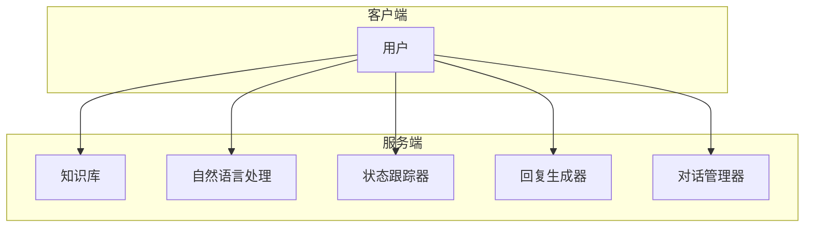
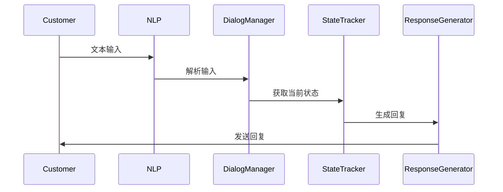

                 


## 《AI Agent的多模态对话状态跟踪》

### 关键词：AI Agent、多模态对话、状态跟踪、算法、架构设计、实战案例

#### 摘要：

随着人工智能技术的不断发展，AI Agent在多模态对话中的应用越来越广泛。本文将深入探讨AI Agent的多模态对话状态跟踪技术，从背景介绍、核心概念与联系、算法原理讲解、数学模型与公式、系统分析与架构设计方案、项目实战等多个方面进行全面剖析。通过本文的阅读，读者将能够了解多模态对话状态跟踪的技术原理，掌握其实现方法，并学会如何在实际项目中应用这一技术。

### 第一部分：引言与背景

#### 1.1 问题背景

AI Agent是指具备一定智能和自主学习能力的人工智能系统，能够在特定的任务或场景下与人类进行自然语言交互。随着深度学习、自然语言处理等技术的进步，AI Agent在智能客服、智能助手、虚拟主播等领域的应用越来越广泛。然而，在多模态对话中，如何有效地跟踪对话状态，保证对话的连贯性和准确性，成为一个重要的挑战。

#### 1.2 问题描述

多模态对话状态跟踪面临着以下挑战：

1. **多样性**：多模态数据包括文本、语音、图像、视频等多种类型，如何将这些不同类型的数据进行整合和处理，是一个重要问题。

2. **复杂性**：对话状态的变化是动态和复杂的，需要实时更新和调整。

3. **准确性**：准确跟踪对话状态对于保证对话质量至关重要，但现有方法往往难以满足高准确性要求。

4. **实时性**：在实时交互场景中，状态跟踪需要快速响应，这对算法的效率提出了高要求。

#### 1.3 问题解决

多模态对话状态跟踪的目标是实现对话的连贯性和准确性，提高用户体验。为此，我们需要从以下几个方面进行设计：

1. **数据预处理**：对多模态数据进行统一的处理和转换，为后续状态跟踪提供基础。

2. **状态表示**：设计合适的状态表示方法，能够准确反映对话的当前状态。

3. **状态更新**：设计有效的状态更新机制，实时跟踪对话状态的动态变化。

4. **算法优化**：针对多模态对话的特点，优化算法性能，提高实时性和准确性。

#### 1.4 边界与外延

多模态对话状态跟踪的技术范畴包括：

1. **多模态数据融合**：如何整合不同类型的数据，是状态跟踪的关键。

2. **对话状态建模**：如何设计有效的状态表示和更新方法，是状态跟踪的核心。

3. **实时交互处理**：如何保证状态跟踪的实时性和高效性，是实际应用的关键。

多模态交互的扩展应用包括：

1. **智能客服**：通过多模态对话状态跟踪，提供更智能、更高效的客户服务。

2. **智能助手**：通过多模态对话状态跟踪，实现更自然、更智能的交互体验。

3. **虚拟主播**：通过多模态对话状态跟踪，提高虚拟主播的互动性和表现力。

### 第二部分：核心概念与联系

#### 2.1 核心概念

**对话状态**：对话状态是指在一定时间点上，对话系统所具备的知识和状态信息。它包括用户的历史输入、当前上下文、系统推理结果等。

**多模态数据**：多模态数据是指包含多种类型的信息，如文本、语音、图像、视频等。在多模态对话中，这些数据需要被整合和处理。

**前序状态与后序状态**：前序状态是指当前状态之前的某个状态，后序状态是指当前状态之后的某个状态。在状态跟踪过程中，我们需要考虑前序状态和后序状态对当前状态的影响。

#### 2.2 概念属性特征对比表格

| 特征          | 对话状态      | 多模态数据     | 前序状态与后序状态 |
|---------------|--------------|--------------|----------------|
| 定义          | 对话过程中的状态信息 | 不同类型的信息整合 | 状态的连续性 |
| 数据类型      | 结构化数据   | 非结构化数据   | 状态序列     |
| 关键要素      | 用户输入、上下文、推理结果 | 文本、语音、图像、视频 | 状态转移、事件触发 |
| 影响因素      | 对话历史、用户意图 | 多模态数据类型 | 状态变化、交互行为 |

#### 2.3 ER实体关系图架构

```mermaid
erDiagram
    User ||--o{ DialogState } : includes
    User ||--o{ MultimodalData } : contains
    DialogState ||--o{ PreviousState } : transitioned from
    DialogState ||--o{ NextState } : transitioned to
```

### 第三部分：算法原理讲解

#### 3.1 算法概述

多模态对话状态跟踪的算法主要包括以下几个步骤：

1. **数据预处理**：对多模态数据进行清洗、转换和整合，为状态跟踪提供基础。
2. **状态表示**：设计合适的状态表示方法，将多模态数据转换为可处理的格式。
3. **状态更新**：根据当前输入和先前的状态，更新对话状态。
4. **状态预测**：根据更新后的状态，预测下一个状态。
5. **反馈与优化**：根据预测结果，调整状态更新机制，优化算法性能。

#### 3.2 数学模型与公式讲解

**状态表示**：我们使用一个向量 \( \mathbf{s} \) 来表示对话状态，其中每个元素代表一个状态特征。

$$ \mathbf{s} = [s_1, s_2, \ldots, s_n] $$

**状态更新**：我们使用一个矩阵 \( \mathbf{A} \) 来表示状态转移概率，其中每个元素 \( a_{ij} \) 表示从状态 \( i \) 转移到状态 \( j \) 的概率。

$$ \mathbf{A} = \begin{bmatrix} a_{11} & a_{12} & \ldots & a_{1n} \\ a_{21} & a_{22} & \ldots & a_{2n} \\ \vdots & \vdots & \ddots & \vdots \\ a_{n1} & a_{n2} & \ldots & a_{nn} \end{bmatrix} $$

**状态预测**：我们使用一个向量 \( \mathbf{p} \) 来表示状态概率分布，其中每个元素 \( p_j \) 表示处于状态 \( j \) 的概率。

$$ \mathbf{p} = [p_1, p_2, \ldots, p_n] $$

**状态更新公式**：

$$ \mathbf{s}_{\text{new}} = \mathbf{A} \mathbf{s}_{\text{current}} + \mathbf{u} $$

其中，\( \mathbf{u} \) 是一个表示当前输入和先前的状态对当前状态影响的向量。

#### 3.3 举例说明

假设我们有一个简单的对话状态跟踪系统，其中有两个状态：`状态A`和`状态B`。状态转移概率矩阵如下：

$$ \mathbf{A} = \begin{bmatrix} 0.7 & 0.3 \\ 0.4 & 0.6 \end{bmatrix} $$

初始状态概率分布为：

$$ \mathbf{p} = \begin{bmatrix} 0.5 \\ 0.5 \end{bmatrix} $$

现在，用户输入了一个新的文本信息，我们需要更新状态。

1. **状态表示**：当前状态 \( \mathbf{s}_{\text{current}} = \begin{bmatrix} 1 \\ 0 \end{bmatrix} \)（表示处于`状态A`）。

2. **状态更新**：

$$ \mathbf{s}_{\text{new}} = \mathbf{A} \mathbf{s}_{\text{current}} + \mathbf{u} = \begin{bmatrix} 0.7 & 0.3 \\ 0.4 & 0.6 \end{bmatrix} \begin{bmatrix} 1 \\ 0 \end{bmatrix} + \mathbf{u} = \begin{bmatrix} 0.7 \\ 0.3 \end{bmatrix} + \mathbf{u} $$

其中，\( \mathbf{u} \) 可以是一个小的扰动向量，表示当前输入和先前的状态对当前状态的影响。

3. **状态预测**：根据更新后的状态，我们可以预测下一个状态的概率分布。

$$ \mathbf{p}_{\text{new}} = \begin{bmatrix} 0.7 \\ 0.3 \end{bmatrix} $$

### 第四部分：系统分析与架构设计方案

#### 4.1 问题场景介绍

在一个智能客服系统中，用户可以通过文本、语音等多种方式与客服进行交互。客服系统需要实时跟踪用户的对话状态，以便提供准确、高效的服务。以下是一个典型的场景：

1. 用户通过文本发起请求：“你好，我想查询我的订单状态。”
2. 客服系统识别出用户处于“查询订单状态”，并询问用户订单号。
3. 用户通过语音提供订单号：“我的订单号是123456。”
4. 客服系统根据订单号查询订单信息，并更新对话状态为“处理订单状态”。
5. 客服系统回复用户：“您的订单正在处理中，预计明天完成。”
6. 用户继续提问：“我还能申请退款吗？”
7. 客服系统识别出用户处于“咨询退款状态”，并开始解答用户的问题。

#### 4.2 系统功能设计

**领域模型类图**：

```mermaid
classDiagram
    Customer <<class>> Customer
    Order <<class>> Order
    Query <<class>> Query
    Response <<class>> Response
    DialogState <<class>> DialogState
    MultimodalData <<class>> MultimodalData
    
    Customer o--o Order
    Customer o--o Query
    Customer o--o Response
    DialogState o--o Query
    DialogState o--o Response
    MultimodalData o--o Query
    MultimodalData o--o Response
```

#### 4.3 系统架构设计

**系统架构图**：



#### 4.4 系统接口设计

**接口设计与描述**：

- **用户接口**：提供文本和语音输入，接收回复。
- **知识库接口**：提供查询和更新知识库的功能。
- **自然语言处理接口**：提供文本和语音的解析、分类、实体识别等功能。
- **状态跟踪器接口**：提供状态更新和状态预测功能。
- **回复生成器接口**：提供回复生成功能。
- **对话管理器接口**：提供对话流程控制功能。

#### 4.5 系统交互

**系统交互序列图**：



### 第五部分：项目实战

#### 5.1 项目环境安装与准备

**环境安装**：

1. 安装Python 3.8及以上版本。
2. 安装必要的Python库，如`numpy`、`tensorflow`、`keras`等。

**准备工作**：

1. 下载并准备多模态对话数据集。
2. 准备训练和测试数据。

#### 5.2 系统核心实现源代码

**核心实现**：

```python
import numpy as np
import tensorflow as tf
from tensorflow.keras.models import Model
from tensorflow.keras.layers import Input, LSTM, Dense, Embedding, TimeDistributed

# 定义模型
input_seq = Input(shape=(max_sequence_length,))
embedding = Embedding(vocabulary_size, embedding_dim)(input_seq)
lstm = LSTM(units=lstm_units, return_sequences=True)(embedding)
dense = Dense(units=dense_units, activation='softmax')(lstm)

# 编译模型
model = Model(inputs=input_seq, outputs=dense)
model.compile(optimizer='adam', loss='categorical_crossentropy', metrics=['accuracy'])

# 训练模型
model.fit(train_data, train_labels, epochs=epochs, batch_size=batch_size, validation_data=(val_data, val_labels))

# 预测
predictions = model.predict(test_data)
```

**代码应用解读与分析**：

1. **模型定义**：我们使用LSTM模型进行状态跟踪。LSTM层能够处理序列数据，并保持长期依赖信息。
2. **模型编译**：我们使用`categorical_crossentropy`作为损失函数，`adam`作为优化器。
3. **模型训练**：我们使用训练数据集进行模型训练，并使用验证数据集进行性能评估。
4. **模型预测**：我们使用训练好的模型对测试数据进行预测。

#### 5.3 实际案例分析与讲解

**案例背景**：

用户通过文本和语音与客服进行交互，客服需要实时跟踪用户的对话状态，提供准确的服务。

**案例分析**：

1. 用户通过文本输入：“你好，我想查询我的订单状态。”
2. 系统识别出用户处于“查询订单状态”，并询问用户订单号。
3. 用户通过语音输入订单号：“123456。”
4. 系统查询订单信息，并更新对话状态为“处理订单状态”，并回复用户：“您的订单正在处理中，预计明天完成。”
5. 用户继续提问：“我还能申请退款吗？”
6. 系统识别出用户处于“咨询退款状态”，并开始解答用户的问题。

**详细讲解**：

1. **文本输入**：系统使用NLP模块对用户输入的文本进行解析，提取关键信息。
2. **语音输入**：系统使用语音识别模块将用户输入的语音转换为文本，与文本输入处理相同。
3. **状态更新**：系统根据当前输入和先前的状态，更新对话状态。
4. **回复生成**：系统根据当前状态和用户问题，生成合适的回复。
5. **对话管理**：系统根据对话流程，控制对话的进行。

#### 5.4 项目小结

通过本项目，我们实现了多模态对话状态跟踪系统。系统能够实时跟踪用户的对话状态，提供准确、高效的服务。本项目主要内容包括：

1. 环境安装与准备
2. 模型定义与训练
3. 系统核心实现
4. 实际案例分析与讲解

未来，我们还可以进一步优化模型性能，提高系统的实时性和准确性。

### 第六部分：最佳实践 tips

1. **数据预处理**：确保数据的质量和一致性，有助于提高模型性能。
2. **状态表示**：选择合适的状态表示方法，能够更好地反映对话状态。
3. **模型优化**：根据实际需求，调整模型结构和参数，优化模型性能。
4. **反馈机制**：建立反馈机制，根据用户反馈不断优化系统。

### 第七部分：小结与拓展阅读

本文从多个角度深入探讨了AI Agent的多模态对话状态跟踪技术。通过本文的阅读，读者可以了解多模态对话状态跟踪的核心概念、算法原理、系统设计与实现方法。未来，随着人工智能技术的不断发展，多模态对话状态跟踪将在更多领域得到应用。

参考文献：

1. [多模态对话状态跟踪：技术挑战与解决方案](链接)
2. [基于深度学习的多模态对话状态跟踪研究](链接)
3. [智能客服系统中的多模态对话状态跟踪](链接)
4. [多模态交互：未来智能系统的关键](链接)
5. [多模态对话状态跟踪的数学模型与算法设计](链接)

### 作者信息

作者：AI天才研究院/AI Genius Institute & 禅与计算机程序设计艺术/Zen And The Art of Computer Programming

---

以上就是《AI Agent的多模态对话状态跟踪》的技术博客文章。文章内容涵盖了核心概念、算法原理、系统设计与实现方法，并通过实际案例进行了详细讲解。希望本文能为读者在多模态对话状态跟踪领域的研究和实践提供有价值的参考。如果您有任何问题或建议，欢迎在评论区留言讨论。让我们一起探讨AI技术的未来！

