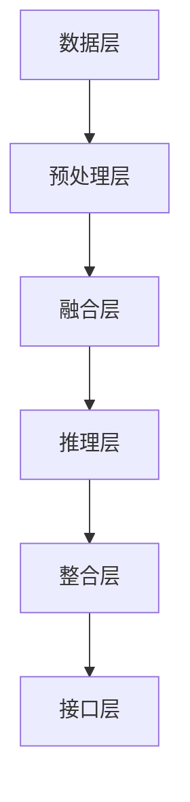
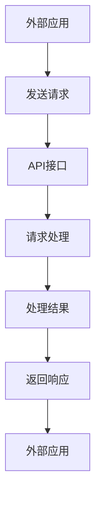

                 

### 1.1 问题背景

随着人工智能技术的迅猛发展，AI Agent已成为智能系统中的关键组成部分。AI Agent，即人工智能代理，是一种能够自主行动、感知环境并作出决策的智能体。它们在自然语言处理、图像识别、语音交互等领域表现出了卓越的能力。然而，当前的AI Agent仍面临着诸多挑战，其中一个核心问题就是如何提高其常识推理与知识整合能力。

常识推理是指智能体在处理日常生活中的信息时，利用已有的背景知识和先验信息来推断和解释新信息的过程。人类在日常生活中无时无刻不在进行常识推理，例如，当看到天空中飘着雪花时，我们自然会想到外面可能很冷。然而，现有的AI Agent在常识推理方面仍存在明显不足，如难以处理模糊性和不确定性、无法很好地整合多源异构数据等。

知识整合则是指在多源知识的基础上，通过融合、关联和推理等方法，形成一个完整、一致且可靠的认知框架。在AI系统中，知识整合是提高智能体推理能力的重要手段。然而，如何有效地进行知识整合，特别是如何将多模态数据（如图像、文本、音频等）进行整合，仍是一个亟待解决的难题。

在多模态常识推理与知识整合方面，目前的研究主要集中在以下几个方面：

1. **多模态数据的融合**：如何有效地将不同模态的数据进行整合，是一个关键问题。现有的方法包括特征级融合、决策级融合和模型级融合等。这些方法各有优缺点，需要根据具体应用场景进行选择。

2. **常识推理算法**：如何设计高效的常识推理算法，以应对日常生活中的复杂问题，是一个重要课题。现有的常识推理算法主要包括基于规则的方法、基于模型的方法和混合方法等。

3. **知识整合技术**：如何将来自不同来源的知识进行有效整合，形成一个统一的知识图谱，是知识整合研究的核心。现有的技术包括知识融合、知识关联和知识推理等。

4. **多模态知识表示**：如何设计适合多模态数据的知识表示方法，以提高推理和决策的效率，是一个关键问题。现有的方法包括图表示、矩阵表示和嵌入表示等。

总的来说，AI Agent的多模态常识推理与知识整合是一个复杂且富有挑战性的问题。尽管目前已有一些研究成果，但距离实际应用仍存在一定差距。本书旨在系统地探讨这一领域，通过理论分析和实践案例，为读者提供一个全面的了解和深入的认识。

### 1.2 多模态常识推理定义

多模态常识推理是指智能体在处理信息时，能够综合来自多种感官模态的数据，如视觉、听觉、触觉等，进行推理和决策的过程。这种能力使得AI Agent能够更准确地理解现实世界，并作出更为合理的响应。

首先，让我们明确什么是模态。模态指的是信息传递的方式，例如，视觉模态是通过图像进行信息传递，听觉模态是通过声音进行信息传递。在多模态常识推理中，智能体需要同时处理并整合来自不同模态的数据，从而提高其推理和决策能力。

**定义多模态常识推理的要素如下**：

1. **多模态数据输入**：智能体从多个感官模态接收数据，例如，通过摄像头获取图像数据，通过麦克风获取声音数据，通过传感器获取触觉数据等。

2. **数据预处理**：不同模态的数据在形式和结构上存在差异，因此需要对其进行预处理，以统一数据格式，提取关键特征。例如，对于图像数据，可以提取边缘、颜色等特征；对于声音数据，可以提取音高、音量等特征。

3. **数据融合**：将来自不同模态的数据进行融合，以形成一个统一的特征表示。数据融合的方法有多种，如特征级融合、决策级融合和模型级融合等。特征级融合是在特征层面直接将不同模态的特征进行合并；决策级融合是在决策层面将不同模态的决策结果进行综合；模型级融合则是通过训练一个联合模型来同时处理多种模态的数据。

4. **常识推理**：在融合后的数据基础上，利用已有的背景知识和先验信息进行推理。常识推理可以是基于规则的，也可以是基于模型的。基于规则的方法通过定义一系列规则来描述常识关系；基于模型的方法则是通过训练模型来学习常识关系。

5. **输出决策**：基于推理结果，智能体作出相应的决策或响应。例如，在自动驾驶场景中，智能体需要综合视觉和雷达数据来判断道路情况，并作出行驶决策。

**多模态常识推理与传统单一模态推理的主要区别**：

1. **数据处理复杂度**：多模态常识推理需要同时处理多种类型的数据，相比单一模态推理，其数据处理复杂度更高。

2. **融合难度**：不同模态的数据在形式和结构上存在差异，如何有效地融合这些数据，是一个挑战。需要设计合适的融合策略和方法。

3. **推理能力**：多模态常识推理能够更全面地理解现实世界，从而提高推理和决策的准确性。单一模态推理则可能在某些情况下缺乏足够的信息，导致推理结果不准确。

4. **应用场景**：多模态常识推理适用于需要处理复杂、多变的场景，如自动驾驶、智能客服、医疗诊断等；而单一模态推理则更多适用于较为简单的场景。

总的来说，多模态常识推理是人工智能领域的一个重要研究方向，通过整合多种模态的数据，智能体能够更准确地理解环境，作出更为合理的决策。在本书中，我们将深入探讨多模态常识推理的原理、算法和应用，以期为读者提供一个全面的认识。

### 1.3 知识整合在AI中的重要性

知识整合在人工智能（AI）系统中扮演着至关重要的角色。它不仅是提升AI系统智能水平的关键手段，也是实现跨领域应用和技术创新的重要途径。随着AI技术的不断发展和应用场景的多样化，知识整合的重要性日益凸显。

首先，知识整合能够显著提升AI系统的智能水平。AI系统在处理问题时，需要依赖大量的知识来进行推理和决策。这些知识可能来自多个来源，如数据库、文本、图像、声音等。通过知识整合，可以将这些分散的知识进行有效融合，形成一个统一的、一致的知识体系。这样的知识体系能够更好地支持AI系统的推理和决策过程，使其在面对复杂、多变的问题时，能够作出更为准确和合理的响应。

其次，知识整合是实现跨领域应用和技术创新的重要途径。在传统的单一领域应用中，AI系统通常只专注于某一特定领域的知识。然而，随着人工智能技术的发展，越来越多的应用场景需要跨领域的知识支持。例如，在智能医疗领域，医生需要综合医学知识、患者病历和实时监测数据来做出诊断和治疗决策。通过知识整合，可以将来自不同领域的数据和知识进行融合，形成一个综合性的知识体系，从而支持更为复杂和跨领域的应用。

此外，知识整合还能够提高AI系统的自适应能力。在实际应用中，AI系统经常会遇到新问题和新挑战。通过知识整合，系统能够不断吸收新的知识，并对其进行整合和更新，以适应不断变化的环境。这种自适应能力是AI系统持续发展和进步的关键。

**知识整合在AI系统中的作用主要包括以下几个方面**：

1. **知识融合**：将来自不同来源、不同结构的知识进行整合，形成一个统一的知识体系。例如，将文本知识、图像知识和声音知识进行融合，以支持多模态的知识表示和处理。

2. **知识关联**：通过建立知识之间的关联，实现知识的互联和互操作。例如，将不同领域的知识进行关联，以支持跨领域的知识共享和应用。

3. **知识推理**：利用已有的知识进行推理，以发现新的知识或解决新的问题。例如，通过推理，可以从医疗知识库中推断出患者的潜在疾病，从而辅助医生的诊断和治疗。

4. **知识更新**：根据新的数据和知识，对现有的知识体系进行更新和优化，以保持知识的时效性和准确性。

**在AI系统中实现知识整合的挑战**：

1. **多源异构数据的整合**：不同来源的数据在格式、结构、类型上存在差异，如何有效地整合这些数据是一个挑战。

2. **知识的一致性和准确性**：在整合过程中，如何保证知识的一致性和准确性，是一个关键问题。

3. **知识表示和存储**：如何设计有效的知识表示方法，以及如何存储和管理大规模的知识库，是知识整合的另一个重要问题。

4. **知识推理效率**：如何在保证推理准确性的前提下，提高知识推理的效率，是一个需要解决的问题。

总的来说，知识整合在AI系统中具有重要意义，它不仅是提升AI系统智能水平的关键手段，也是实现跨领域应用和技术创新的重要途径。在本书中，我们将深入探讨知识整合的原理、方法和应用，以期为读者提供一个全面的认识。

### 1.4 书籍结构安排与目标

为了系统地探讨AI Agent的多模态常识推理与知识整合，本书将按照以下章节结构进行组织，每一部分都有其特定的内容和目标：

**第一部分：引论与背景**

本部分将介绍多模态常识推理与知识整合的基本概念、发展历程和关键问题。通过梳理相关研究背景，帮助读者建立对该领域的基本认识。

- **第1章：问题背景与定义**：阐述多模态常识推理和知识整合的概念，分析其重要性，并概述本书的结构和目标。
- **第2章：多模态数据与处理**：详细讨论多模态数据的类型、收集和处理方法，为后续的常识推理和知识整合奠定基础。

**第二部分：核心概念与联系**

本部分将深入探讨多模态常识推理与知识整合的核心概念及其相互关系，为读者提供一个理论框架。

- **第3章：常识推理的概念与原理**：介绍常识推理的基本概念、类型和理论基础。
- **第4章：知识整合的核心概念**：探讨知识整合的定义、过程、技术与方法，并分析其面临的挑战。
- **第5章：多模态常识推理与知识整合的联系**：分析多模态常识推理与知识整合之间的关联性，探讨融合策略和实例。

**第三部分：算法原理与数学模型**

本部分将介绍多模态常识推理与知识整合的算法原理和数学模型，通过具体示例帮助读者理解和应用。

- **第6章：算法原理讲解**：讲解多模态常识推理和知识整合的核心算法，包括流程图和Python代码示例。
- **第7章：数学模型与公式**：介绍常用的数学模型和公式，并通过LaTeX格式展示，确保数学表达的准确性。

**第四部分：系统分析与设计**

本部分将介绍多模态常识推理与知识整合系统的功能与架构设计，包括系统功能、架构设计、接口设计和交互设计。

- **第8章：系统功能与架构设计**：介绍系统的整体功能设计、架构设计，并展示相关的Mermaid架构图和序列图。
- **第9章：案例研究与实战**：通过实际案例研究，展示系统核心实现和代码分析，提供详细的实战经验和总结。

**第五部分：最佳实践与总结**

本部分将总结多模态常识推理与知识整合的最佳实践，提供注意事项和建议，并推荐进一步的阅读资源。

- **第10章：最佳实践与注意事项**：总结最佳实践，分析常见问题，并提供解决方案。
- **第11章：小结与展望**：对全书进行总结，展望未来的发展趋势和研究方向。

通过以上结构安排，本书旨在为读者提供一个全面、深入和多维度的视角，帮助读者系统地理解和掌握AI Agent的多模态常识推理与知识整合。无论是初学者还是资深研究人员，都能从本书中获得丰富的知识和实践经验。

## 第二部分：核心概念与联系

在深入探讨AI Agent的多模态常识推理与知识整合之前，有必要对相关的核心概念和它们之间的关系进行详细的梳理。这部分内容将为后续的理论分析、算法讲解和系统设计提供坚实的基础。

### 第2章：多模态数据与处理

多模态数据是AI Agent处理信息的基础，如何有效地收集、处理和整合这些数据是确保AI系统性能的关键。

#### 2.1 多模态数据的类型

多模态数据包括但不限于以下几种类型：

1. **视觉数据**：主要包括图像和视频。视觉数据通常通过摄像头或其他传感器捕获，是AI Agent感知物理世界的主要方式。
2. **听觉数据**：主要包括音频和语音。听觉数据通过麦克风等设备捕捉，是AI Agent进行语音交互和语音识别的依据。
3. **触觉数据**：通过传感器捕获，如力传感器、压力传感器等，用于感知物体的物理属性。
4. **其他模态数据**：如温度、湿度、气味等传感器捕获的数据，这些数据在某些特定应用场景中也有重要作用。

#### 2.2 多模态数据的收集

多模态数据的收集依赖于各种传感器和采集设备。以下是几种常见的数据收集方法：

1. **传感器网络**：通过布置在不同位置和不同类型的传感器，收集环境中的多模态数据。
2. **移动设备**：利用智能手机、平板电脑等移动设备上的内置传感器，收集用户和环境的多模态数据。
3. **云端数据采集**：通过连接到云端的服务器，实时收集和处理大规模的多模态数据。

#### 2.3 多模态数据预处理

预处理是多模态数据处理的关键步骤，主要包括数据清洗、特征提取和标准化等。

1. **数据清洗**：去除噪声和异常值，确保数据的质量和一致性。
2. **特征提取**：从原始数据中提取有用的特征，如图像的边缘、纹理和颜色特征，音频的频谱特征等。
3. **标准化**：将不同模态的数据进行标准化处理，以便后续的融合和整合。

#### 2.4 多模态数据整合技术

多模态数据的整合是将不同模态的数据进行有效融合，形成一个统一特征表示的过程。常见的整合方法包括：

1. **特征级融合**：在特征层面直接将不同模态的特征进行合并，如通过加权平均或拼接等方法。
2. **决策级融合**：在决策层面将不同模态的决策结果进行综合，如通过投票机制或加权投票机制。
3. **模型级融合**：通过训练一个联合模型来同时处理多种模态的数据，如多模态深度学习模型。

### 第3章：常识推理的概念与原理

常识推理是AI Agent在处理信息时，利用已有的背景知识和先验信息进行推理和解释的过程。它是智能体理解世界、进行决策的基础。

#### 3.1 常识推理的定义

常识推理（Common Sense Reasoning）是指智能体在处理日常生活中常见情景和信息时，利用已有的背景知识和先验信息进行推理和判断的能力。与专业推理不同，常识推理通常处理的是模糊、不确定和复杂的信息。

#### 3.2 常识推理的类型

1. **情境推理**：根据当前情境进行推理，如判断一个物体在特定环境中的状态。
2. **因果推理**：根据因果关系进行推理，如判断某个事件的原因和结果。
3. **逻辑推理**：基于逻辑规则进行推理，如使用前提和结论进行推理。

#### 3.3 常识推理的理论基础

1. **符号主义方法**：基于符号表示和推理规则，如基于产生式规则和一阶逻辑。
2. **连接主义方法**：基于神经网络和机器学习模型，如深度学习和强化学习。
3. **混合方法**：结合符号主义和连接主义的方法，以充分利用各自的优点。

#### 3.4 常识推理的模型与方法

1. **基于规则的模型**：通过定义一系列规则来描述常识关系，如Production System和Blackboard System。
2. **基于模型的模型**：通过训练模型来学习常识关系，如深度神经网络和图神经网络。
3. **混合模型**：结合多种模型和方法，以提高推理的效率和准确性。

### 第4章：知识整合的核心概念

知识整合是将来自不同来源、不同结构的知识进行有效融合的过程，旨在形成一个统一的知识体系，以支持AI系统的推理和决策。

#### 4.1 知识整合的定义

知识整合（Knowledge Integration）是指将多个来源、多种类型和不同结构的知识进行有效整合，形成一个统一和一致的知识体系的过程。知识整合的目标是提高知识的可用性和互操作性，以支持智能体的推理和决策。

#### 4.2 知识整合的过程

1. **知识收集**：从多个来源收集知识，如数据库、文本、图像和语音等。
2. **知识清洗**：去除噪声和异常值，确保知识的质量和一致性。
3. **知识转换**：将不同格式和结构的知识进行转换，以便进行整合。
4. **知识融合**：将转换后的知识进行整合，形成一个统一的知识体系。
5. **知识推理**：利用整合后的知识进行推理和决策。

#### 4.3 知识整合的技术与方法

1. **基于规则的整合**：通过定义一系列规则来描述知识之间的关系。
2. **基于语义的整合**：利用语义网络和本体论来描述和整合知识。
3. **基于机器学习的整合**：通过训练模型来学习知识之间的关系和模式。

#### 4.4 知识整合的挑战与解决方案

1. **数据不一致性**：解决方法包括数据清洗、数据转换和一致性约束。
2. **知识冲突**：解决方法包括冲突检测和冲突消解。
3. **知识表示和存储**：设计有效的知识表示方法和存储策略，以支持大规模的知识整合。

### 第5章：多模态常识推理与知识整合的联系

多模态常识推理和知识整合是相互关联的，通过多模态数据的处理和知识整合，可以显著提升AI Agent的推理和决策能力。

#### 5.1 关联性分析

多模态常识推理与知识整合的关联性主要体现在以下几个方面：

1. **数据融合**：多模态数据融合是知识整合的基础，通过融合不同模态的数据，可以形成更为全面和准确的知识体系。
2. **推理过程**：常识推理依赖于知识体系的支持，而知识整合则可以提供更为丰富和一致的知识来源。
3. **决策支持**：整合后的知识体系可以提供更为可靠的决策支持，从而提高AI Agent的智能水平。

#### 5.2 融合策略

融合策略是多模态常识推理与知识整合的核心，常见的融合策略包括：

1. **特征级融合**：直接将不同模态的特征进行拼接或加权平均。
2. **决策级融合**：将不同模态的决策结果进行综合，如通过投票机制。
3. **模型级融合**：训练一个联合模型来同时处理多种模态的数据。

#### 5.3 实例与案例分析

通过具体的实例和案例分析，可以更好地理解多模态常识推理与知识整合的应用效果。

1. **智能助手**：通过整合语音、文本和图像等多模态数据，智能助手可以更准确地理解用户的需求，提供个性化的服务。
2. **自动驾驶**：通过整合视觉、雷达和GPS等多模态数据，自动驾驶系统可以更准确地感知周围环境，提高行驶的安全性和稳定性。

通过以上对核心概念与联系的详细探讨，我们为后续的理论分析、算法讲解和系统设计奠定了基础。接下来，我们将进一步深入探讨多模态常识推理与知识整合的算法原理、数学模型和实际应用。

## 第2章：多模态数据与处理

多模态数据在人工智能系统中扮演着至关重要的角色，因为它允许智能体从多个感官模态中获取信息，从而更全面地理解和互动环境。本章将详细探讨多模态数据的类型、收集方法、预处理步骤以及数据整合技术。

### 2.1 多模态数据的类型

多模态数据包括以下几种主要类型：

1. **视觉数据**：这是最常见的一种多模态数据，包括图像和视频。视觉数据通常通过摄像头或其他图像传感器捕获，用于场景理解、物体识别和图像处理。

2. **听觉数据**：这类数据包括语音和音乐。通过麦克风等设备捕获的听觉数据可以用于语音识别、情感分析和音频处理。

3. **触觉数据**：触觉数据通常通过力传感器、触觉传感器等设备捕获，用于感知物体的物理属性，如硬度、温度等。触觉数据在机器人控制和人机交互中具有重要作用。

4. **其他模态数据**：除了上述三种主要模态外，还有许多其他类型的感官数据，如温度、湿度、压力、气味等。这些数据在某些特定应用场景中也非常重要。

### 2.2 多模态数据的收集

多模态数据的收集通常依赖于各种传感器和采集设备。以下是几种常见的数据收集方法：

1. **传感器网络**：通过在环境中布置多种类型的传感器，可以同时收集多种模态的数据。这种方法适用于需要全面监测环境的场景，如智能家居、智能交通等。

2. **移动设备**：利用智能手机、平板电脑等移动设备上的内置传感器，可以收集用户的多种感官数据。这些设备通常具备摄像头、麦克风、加速度计等多种传感器，适用于移动应用场景。

3. **远程数据采集**：通过连接到云端的设备和服务，可以远程收集和传输多种模态的数据。这种方法适用于大规模数据收集和实时数据处理的应用场景。

### 2.3 多模态数据预处理

预处理是多模态数据处理的关键步骤，主要包括以下几方面：

1. **数据清洗**：去除噪声和异常值，确保数据的质量和一致性。例如，去除图像中的噪点，过滤掉音频中的背景噪声等。

2. **特征提取**：从原始数据中提取有用的特征，以便后续的数据分析和模型训练。例如，从图像中提取边缘、纹理、颜色特征，从音频中提取频谱特征等。

3. **数据标准化**：将不同模态的数据进行标准化处理，以便后续的融合和整合。例如，将所有图像数据调整为相同的大小和分辨率，将所有音频数据调整为相同的采样率等。

### 2.4 多模态数据整合技术

多模态数据的整合是将不同模态的数据进行有效融合，形成一个统一特征表示的过程。以下是几种常见的整合方法：

1. **特征级融合**：在特征层面直接将不同模态的特征进行合并。这种方法通常使用特征拼接或加权平均等技术。例如，将图像特征和语音特征进行拼接，形成一个多维度的特征向量。

   ```mermaid
   graph TD
   A[视觉特征] --> B[语音特征]
   B --> C[特征融合]
   C --> D[统一特征表示]
   ```

2. **决策级融合**：在决策层面将不同模态的决策结果进行综合。这种方法通常使用投票机制或加权投票机制。例如，在图像分类任务中，将视觉分类器和语音分类器的结果进行综合，提高分类的准确性。

   ```mermaid
   graph TD
   A[视觉分类器] --> B[语音分类器]
   B --> C[决策融合]
   C --> D[最终决策]
   ```

3. **模型级融合**：通过训练一个联合模型来同时处理多种模态的数据。这种方法通常使用深度学习模型，如卷积神经网络（CNN）和多模态深度学习模型（如Multimodal Deep Learning）。例如，使用一个联合神经网络同时处理图像和语音数据，提高模型的性能。

   ```mermaid
   graph TD
   A[图像输入] --> B[语音输入]
   B --> C[联合模型]
   C --> D[输出预测]
   ```

### 2.5 多模态数据的挑战与解决方案

在多模态数据整合过程中，会面临一些挑战，如模态差异、数据冗余、不一致性和实时性等。以下是一些常见的挑战和相应的解决方案：

1. **模态差异**：不同模态的数据在形式和结构上存在差异，需要进行特征对齐和模态转换。例如，可以使用图像和语音的特征匹配技术来对齐不同模态的数据。

2. **数据冗余**：多模态数据中可能存在冗余信息，需要进行数据降维和去冗余处理。例如，可以使用主成分分析（PCA）和独立成分分析（ICA）等方法来降维。

3. **不一致性**：不同模态的数据可能存在不一致性，需要进行数据融合和一致性检测。例如，可以使用贝叶斯网络和图模型等方法来融合多模态数据，并检测数据的一致性。

4. **实时性**：在实时应用场景中，需要快速处理和整合多模态数据。例如，可以使用并行计算和分布式计算技术来提高数据处理的速度。

通过以上对多模态数据类型、收集方法、预处理步骤和数据整合技术的详细探讨，我们为后续的常识推理和知识整合奠定了基础。接下来，我们将进一步探讨常识推理的概念、原理和方法。

## 第3章：常识推理的概念与原理

常识推理是人工智能（AI）领域中一个关键的研究方向，它使得智能系统能够更好地理解和处理日常生活中的信息和情境。常识推理涉及到从先验知识出发，对输入信息进行推断和解释的过程。本章将详细介绍常识推理的基本概念、类型、理论基础以及常用的模型和方法。

### 3.1 常识推理的定义

常识推理（Common Sense Reasoning）是指智能体在处理日常生活中的信息和情境时，利用已有的背景知识和先验信息进行推理和判断的能力。常识推理不同于基于专业知识的推理，它关注的是一般性的、通用的知识，如时间、空间、因果、逻辑等。常识推理是人类智能的核心组成部分，使人类能够在复杂多变的环境中做出合理的决策和反应。

### 3.2 常识推理的类型

常识推理可以分为以下几种类型：

1. **情境推理**：情境推理是指智能体根据当前情境进行推理，以预测未来的事件或判断当前事件的可能性。例如，当智能助手接收到用户询问“明天天气怎么样？”时，它会根据已有的天气数据和历史记录进行推理。

2. **因果推理**：因果推理是指智能体根据因果关系进行推理，以解释现象背后的原因或预测可能的结果。例如，当用户说“电脑死机了”，智能助手可能会推断出原因可能是“系统过热”或“程序出错”。

3. **逻辑推理**：逻辑推理是指智能体基于逻辑规则进行推理，以验证前提和结论之间的逻辑关系。例如，智能助手在解释某个操作步骤时，会使用逻辑推理来确保步骤的连贯性和正确性。

4. **假设推理**：假设推理是指智能体在不确定的情境下，通过假设不同的可能性进行推理，以找到最合理的解释或决策。例如，在医疗诊断中，医生可能会根据患者的症状和病史，假设不同的疾病，并进行推理和验证。

### 3.3 常识推理的理论基础

常识推理的理论基础主要包括以下几个方面：

1. **知识表示**：知识表示是指如何将常识知识以结构化的形式进行存储和表示。常见的知识表示方法包括产生式规则、框架表示、语义网络和本体论。

2. **推理算法**：推理算法是指如何利用知识进行推理和决策。常见的推理算法包括基于规则的推理、基于模型的推理、基于逻辑的推理和混合推理。

3. **先验知识**：先验知识是指智能体在处理问题之前所拥有的知识。这些知识可以是定性的，如经验、常识；也可以是定量的，如统计数据、历史记录。先验知识是常识推理的重要基础。

### 3.4 常识推理的模型与方法

常识推理的模型和方法多种多样，以下介绍几种常用的模型和方法：

1. **基于规则的模型**：基于规则的模型通过定义一系列规则来描述常识关系。这些规则通常用产生式规则表示，形式为“如果条件A成立，则结论B成立”。例如，“如果下雨，那么地面湿”。

   ```mermaid
   graph TD
   A[下雨] --> B[地面湿]
   ```

2. **基于模型的模型**：基于模型的模型通过训练模型来学习常识关系。这种方法通常使用机器学习算法，如神经网络、决策树和贝叶斯网络。例如，可以使用深度神经网络来学习图像和文本之间的常识关系。

   ```mermaid
   graph TD
   A[图像输入] --> B[模型训练]
   B --> C[常识关系]
   ```

3. **混合模型**：混合模型结合了基于规则和基于模型的方法，以充分利用各自的优点。例如，可以使用规则来指导模型的训练，或者使用模型来增强规则的推理能力。

4. **基于逻辑的模型**：基于逻辑的模型使用形式逻辑来描述常识关系。这种方法包括一阶谓词逻辑和模态逻辑。例如，可以使用一阶谓词逻辑来描述时间和空间关系。

   ```mermaid
   graph TD
   A[现在] --> B[过去]
   B --> C[未来]
   ```

### 3.5 常识推理的应用

常识推理在许多实际应用中发挥着重要作用，以下是一些常见的应用场景：

1. **智能助手**：智能助手利用常识推理来理解用户的问题和指令，提供准确的答复和操作指导。

2. **自动驾驶**：自动驾驶系统利用常识推理来理解道路环境，做出安全的驾驶决策。

3. **医疗诊断**：医疗诊断系统利用常识推理来分析患者的症状和检查结果，辅助医生做出诊断。

4. **教育辅助**：教育辅助系统利用常识推理来理解学生的学习情况，提供个性化的学习建议和指导。

通过以上对常识推理的定义、类型、理论基础、模型和方法以及应用的介绍，我们为理解多模态常识推理和知识整合奠定了基础。在下一章中，我们将进一步探讨知识整合的核心概念和原理。

### 第4章：知识整合的核心概念

知识整合是人工智能（AI）领域中一个关键的研究方向，它涉及到将来自不同来源、不同结构和不同类型的知识进行有效融合，形成一个统一且一致的知识体系。知识整合不仅能够提升AI系统的智能水平，还能实现跨领域应用和技术创新。本章将详细探讨知识整合的定义、过程、技术与方法，以及面临的挑战和解决方案。

#### 4.1 知识整合的定义

知识整合（Knowledge Integration）是指将多个来源、多种类型和不同结构的知识进行有效融合，形成一个统一和一致的知识体系的过程。知识整合的目标是提高知识的可用性和互操作性，以支持智能体的推理和决策。知识整合不仅关注知识的收集和融合，还包括知识的清洗、转换、关联和推理。

#### 4.2 知识整合的过程

知识整合的过程可以分为以下几个步骤：

1. **知识收集**：从多个来源收集知识，如数据库、文本、图像和语音等。收集的知识可以是结构化的，如数据库中的记录；也可以是非结构化的，如文本和图像。

2. **知识清洗**：去除噪声和异常值，确保知识的质量和一致性。这一步骤包括数据清洗、去重和错误修正等。

3. **知识转换**：将不同格式和结构的知识进行转换，以便进行整合。例如，将文本数据转换为统一的文本格式，将图像数据转换为统一的图像格式。

4. **知识融合**：将转换后的知识进行整合，形成一个统一的知识体系。知识融合的方法包括特征级融合、决策级融合和模型级融合等。

5. **知识推理**：利用整合后的知识进行推理和决策。知识推理包括基于规则的推理、基于模型的推理和混合推理等。

#### 4.3 知识整合的技术与方法

知识整合的技术和方法多种多样，以下介绍几种常用的技术和方法：

1. **基于规则的整合**：通过定义一系列规则来描述知识之间的关系。这种方法通常使用产生式规则和框架表示。例如，可以使用规则来描述不同领域之间的关联。

2. **基于语义的整合**：利用语义网络和本体论来描述和整合知识。语义网络和本体论提供了结构化的知识表示，使得知识整合更加有效和灵活。

3. **基于机器学习的整合**：通过训练模型来学习知识之间的关系和模式。这种方法通常使用监督学习和无监督学习算法，如决策树、支持向量机和聚类算法等。

4. **混合整合方法**：结合多种整合方法，以充分利用各自的优点。例如，可以结合基于规则的整合和基于机器学习的整合，以提高知识整合的效率和准确性。

#### 4.4 知识整合的挑战与解决方案

在知识整合过程中，会面临一些挑战，如数据不一致性、知识冲突、知识表示和存储等。以下是一些常见的挑战和相应的解决方案：

1. **数据不一致性**：解决方法包括数据清洗、数据转换和一致性约束。例如，可以使用数据清洗算法去除噪声和异常值，使用数据转换算法将不同格式和结构的数据进行统一处理，使用一致性约束确保数据的一致性和可靠性。

2. **知识冲突**：解决方法包括冲突检测和冲突消解。冲突检测是指在知识整合过程中识别出冲突的知识。冲突消解是指通过合并、选择或修改等方法解决冲突。例如，可以使用基于规则的冲突消解方法，根据规则优先级或一致性度量来选择最佳的解决方案。

3. **知识表示和存储**：解决方法包括设计有效的知识表示方法和存储策略。有效的知识表示方法应能直观地描述知识之间的关系和属性，如语义网络和本体论。有效的存储策略应能高效地存储和管理大规模的知识库，如分布式数据库和图数据库。

通过以上对知识整合的定义、过程、技术与方法以及挑战和解决方案的详细探讨，我们为理解和应用知识整合奠定了基础。在下一章中，我们将探讨多模态常识推理与知识整合之间的联系和融合策略。

### 第5章：多模态常识推理与知识整合的联系

多模态常识推理与知识整合是相互关联且互补的两个领域。多模态常识推理通过整合来自不同感官模态的数据，使智能体能够更全面、准确地理解现实世界。知识整合则通过将多源异构知识进行有效融合，为智能体提供一致、完整且可靠的认知框架。本章将分析多模态常识推理与知识整合之间的关联性，并探讨其融合策略和实例。

#### 5.1 关联性分析

多模态常识推理与知识整合之间的关联性主要体现在以下几个方面：

1. **数据融合**：多模态常识推理依赖于有效的数据融合技术，以整合来自不同模态的数据。数据融合是知识整合的基础，因为只有当数据被有效整合后，才能进行进一步的推理和决策。

2. **知识体系**：知识整合为多模态常识推理提供了统一的知识体系。通过知识整合，多模态数据可以被转化为结构化的知识，从而支持更为复杂和深入的推理过程。

3. **推理能力**：多模态常识推理和知识整合相互增强，提高了智能体的推理能力。多模态数据提供了丰富的信息，而知识整合则将这些信息转化为有意义的知识，使智能体能够更准确地理解情境和作出决策。

#### 5.2 融合策略

多模态常识推理与知识整合的融合策略主要包括以下几个方面：

1. **特征级融合**：在特征层面直接将不同模态的特征进行合并。这种方法通常使用特征拼接或加权平均等技术。例如，在图像分类任务中，可以将图像的特征与语音的特征进行拼接，形成一个多维度的特征向量。

   ```mermaid
   graph TD
   A[图像特征] --> B[语音特征]
   B --> C[特征融合]
   C --> D[统一特征表示]
   ```

2. **决策级融合**：在决策层面将不同模态的决策结果进行综合。这种方法通常使用投票机制或加权投票机制。例如，在多模态分类任务中，可以将不同模态的分类结果进行融合，以提高分类的准确性。

   ```mermaid
   graph TD
   A[视觉分类器] --> B[语音分类器]
   B --> C[决策融合]
   C --> D[最终决策]
   ```

3. **模型级融合**：通过训练一个联合模型来同时处理多种模态的数据。这种方法通常使用深度学习模型，如卷积神经网络（CNN）和多模态深度学习模型（如Multimodal Deep Learning）。例如，可以使用一个联合神经网络同时处理图像和语音数据，提高模型的性能。

   ```mermaid
   graph TD
   A[图像输入] --> B[语音输入]
   B --> C[联合模型]
   C --> D[输出预测]
   ```

#### 5.3 实例与案例分析

通过具体的实例和案例分析，可以更好地理解多模态常识推理与知识整合的应用效果。

1. **智能助手**：智能助手利用多模态数据整合和知识整合技术，能够更准确地理解用户的需求。例如，当用户通过语音询问“今天天气怎么样？”时，智能助手可以整合来自图像传感器（如摄像头）的天气数据，以及来自数据库的天气预报信息，从而提供准确的答复。

2. **自动驾驶**：自动驾驶系统通过整合来自视觉、雷达和GPS等多模态数据，可以更准确地感知周围环境。知识整合技术使得自动驾驶系统能够处理和融合这些多源数据，形成一个统一的环境感知模型，从而提高自动驾驶的安全性和可靠性。

3. **医疗诊断**：在医疗领域，多模态常识推理与知识整合技术可以用于辅助医生进行诊断和治疗。例如，通过整合患者的病历数据、医学图像和实时监测数据，智能系统可以提供更为准确和全面的诊断建议，辅助医生做出治疗决策。

4. **人机交互**：在人机交互领域，多模态常识推理与知识整合技术可以用于提升交互体验。例如，智能语音助手可以整合用户的语音、文本和图像等多模态数据，更好地理解用户的意图和需求，从而提供更自然和贴心的交互体验。

通过以上对多模态常识推理与知识整合的关联性、融合策略和实例的分析，我们可以看到，这两者相互促进、相辅相成，为人工智能系统的智能化和应用创新提供了强大的支持。在下一章中，我们将深入探讨多模态常识推理与知识整合的算法原理和数学模型。

### 第6章：算法原理讲解

在深入探讨多模态常识推理与知识整合之前，我们需要了解其背后的算法原理，以及如何通过具体的算法实现这些功能。本章将详细讲解多模态常识推理和知识整合中的核心算法，包括算法的流程图和Python代码示例。

#### 6.1 多模态常识推理算法

多模态常识推理算法的核心目标是利用来自不同模态的数据，进行有效的融合和推理。以下是一个典型的多模态常识推理算法的流程：

1. **数据预处理**：收集和预处理来自不同模态的数据，包括图像、文本和音频等。预处理步骤通常包括数据清洗、特征提取和数据标准化。
2. **特征融合**：将来自不同模态的特征进行融合，形成一个统一的高维度特征向量。特征融合的方法包括特征拼接、加权平均和深度学习模型等。
3. **常识推理**：在融合后的特征向量基础上，利用已有的先验知识和推理规则，进行常识推理。常见的推理方法包括基于规则的推理和基于模型的推理。
4. **决策输出**：根据推理结果，输出最终的决策或响应。

下面是一个使用Python实现的简单多模态常识推理算法的示例：

```python
import numpy as np
from sklearn.preprocessing import StandardScaler
from sklearn.ensemble import RandomForestClassifier

# 假设我们有两个模态的数据：视觉数据和文本数据
visual_data = np.array([[1, 2], [3, 4], [5, 6]])  # 视觉数据
text_data = np.array(['happy', 'sad', 'happy'])   # 文本数据

# 数据预处理
visual_scaler = StandardScaler()
text_scaler = StandardScaler()
visual_data_processed = visual_scaler.fit_transform(visual_data)
text_data_processed = text_scaler.fit_transform([text_data])

# 特征融合
# 这里我们简单地将视觉数据和文本数据进行拼接
multi_modal_data = np.concatenate((visual_data_processed, text_data_processed), axis=1)

# 常识推理
# 假设我们已经有了训练好的模型
classifier = RandomForestClassifier()
classifier.fit(multi_modal_data, labels)  # labels为已标注的结果

# 决策输出
predictions = classifier.predict(multi_modal_data)
print(predictions)
```

#### 6.2 知识整合算法

知识整合算法的目标是将来自不同来源的知识进行有效融合，形成一个统一的知识体系。以下是一个简单的知识整合算法的流程：

1. **知识收集**：从多个来源收集知识，如数据库、文本和图像等。
2. **知识清洗**：去除噪声和异常值，确保知识的质量和一致性。
3. **知识转换**：将不同格式和结构的知识进行转换，以便进行整合。例如，将文本数据转换为统一的文本格式，将图像数据转换为统一的图像格式。
4. **知识融合**：将转换后的知识进行整合，形成一个统一的知识体系。知识融合的方法包括基于规则的融合、基于语义的融合和基于机器学习的融合等。
5. **知识推理**：利用整合后的知识进行推理和决策。

下面是一个使用Python实现的知识整合算法的示例：

```python
import pandas as pd
from sklearn.preprocessing import LabelEncoder

# 假设我们从数据库中收集了以下知识
knowledge_database = pd.DataFrame({
    'text': ['狗是宠物', '猫是宠物', '狗会叫'],
    'image': [img1, img2, img3],  # 假设img1、img2、img3分别为狗、猫、狗的图像
    'label': ['宠物', '宠物', '叫声']
})

# 数据清洗
# 去除噪声和异常值，这里假设没有噪声和异常值

# 知识转换
label_encoder = LabelEncoder()
knowledge_database['label'] = label_encoder.fit_transform(knowledge_database['label'])

# 知识融合
# 这里我们简单地将文本知识和图像知识进行拼接
knowledge_integrated = pd.DataFrame({
    'text': knowledge_database['text'],
    'image': knowledge_database['image'],
    'label': knowledge_database['label']
})

# 知识推理
# 假设我们已经有了训练好的模型
knowledge_recommender = RandomForestClassifier()
knowledge_recommender.fit(knowledge_integrated[['text', 'image']], knowledge_integrated['label'])

# 推理输出
predicted_labels = knowledge_recommender.predict([[text_input, image_input]])
print(predicted_labels)
```

通过以上算法的讲解和示例，我们可以看到多模态常识推理和知识整合的核心算法是如何工作的。接下来，我们将进一步探讨这些算法的数学模型和公式，以加深对它们工作原理的理解。

### 第7章：数学模型与公式

在多模态常识推理与知识整合中，数学模型和公式扮演着至关重要的角色。这些模型和公式不仅帮助我们理解和描述算法的工作原理，还能指导我们进行有效的算法优化和性能提升。本章将详细介绍常见的数学模型和公式，并通过LaTeX格式进行展示和解释。

#### 7.1 常识推理的数学模型

常识推理涉及多个层面的数学模型，包括逻辑推理模型、概率推理模型和基于神经网络的模型。以下是几个典型的数学模型：

1. **逻辑推理模型**：逻辑推理模型通常使用一阶逻辑来描述常识关系。一阶逻辑的核心概念包括命题、谓词和量词。
   $$\forall x \in D, P(x) \to Q(x)$$
   这表示对于集合D中的所有元素x，如果P(x)为真，则Q(x)也为真。

2. **概率推理模型**：概率推理模型通过概率分布来描述常识关系。常见的概率推理模型有贝叶斯网络。
   $$P(H|E) = \frac{P(E|H)P(H)}{P(E)}$$
   这是贝叶斯定理，用于计算在给定证据E的情况下，假设H的概率。

3. **神经网络模型**：基于神经网络的模型通过训练学习常识关系。例如，卷积神经网络（CNN）可以用于图像识别。
   $$\sigma(\boldsymbol{z}_l) = \frac{1}{1 + e^{-\boldsymbol{z}_l}}$$
   这是sigmoid函数，用于激活函数，用于计算神经元输出。

#### 7.2 知识整合的数学模型

知识整合涉及到多个数学模型，用于描述知识的收集、转换、融合和推理。以下是几个常用的数学模型：

1. **特征融合模型**：特征融合模型用于将不同模态的特征进行整合。常见的方法有加权平均和特征拼接。
   $$\boldsymbol{f}_{\text{integrated}} = \alpha \boldsymbol{f}_{\text{vision}} + (1 - \alpha) \boldsymbol{f}_{\text{speech}}$$
   这表示特征融合结果是视觉特征和语音特征的加权平均，其中$\alpha$是权重系数。

2. **知识融合模型**：知识融合模型用于整合来自不同来源的知识。常见的知识融合方法有基于规则的融合和基于机器学习的融合。
   $$\text{Rule-based Fusion: } R(\text{k}_1, \text{k}_2) = \text{k}_1 \land \text{k}_2$$
   这表示基于规则的融合，通过逻辑与操作来整合两个知识。

3. **图模型**：图模型用于描述知识的结构和关系。常见的图模型有图神经网络（GNN）和知识图谱。
   $$\boldsymbol{R}(\boldsymbol{x}_i, \boldsymbol{x}_j) = \sum_{k} \boldsymbol{W}_{ijk} \boldsymbol{f}(\boldsymbol{x}_k)$$
   这表示图模型中节点i和节点j之间的关系，其中$\boldsymbol{W}_{ijk}$是权重矩阵，$\boldsymbol{f}(\boldsymbol{x}_k)$是节点的特征。

#### 7.3 LaTeX公式展示与解释

为了确保数学表达式的准确性和可读性，我们将使用LaTeX格式进行展示和解释。

1. **逻辑推理公式**：
   $$\forall x \in D, P(x) \to Q(x)$$
   解释：对于集合D中的所有元素x，如果P(x)为真，则Q(x)也为真。

2. **贝叶斯定理**：
   $$P(H|E) = \frac{P(E|H)P(H)}{P(E)}$$
   解释：在给定证据E的情况下，假设H的概率等于证据E在假设H为真的条件下出现的概率与假设H的先验概率之比。

3. **卷积神经网络激活函数**：
   $$\sigma(\boldsymbol{z}_l) = \frac{1}{1 + e^{-\boldsymbol{z}_l}}$$
   解释：sigmoid函数用于计算神经元的输出，确保输出在0和1之间。

4. **特征融合公式**：
   $$\boldsymbol{f}_{\text{integrated}} = \alpha \boldsymbol{f}_{\text{vision}} + (1 - \alpha) \boldsymbol{f}_{\text{speech}}$$
   解释：特征融合结果是视觉特征和语音特征的加权平均，其中$\alpha$是权重系数。

5. **基于规则的融合**：
   $$R(\text{k}_1, \text{k}_2) = \text{k}_1 \land \text{k}_2$$
   解释：基于规则的融合，通过逻辑与操作来整合两个知识。

6. **图模型关系**：
   $$\boldsymbol{R}(\boldsymbol{x}_i, \boldsymbol{x}_j) = \sum_{k} \boldsymbol{W}_{ijk} \boldsymbol{f}(\boldsymbol{x}_k)$$
   解释：图模型中节点i和节点j之间的关系，其中$\boldsymbol{W}_{ijk}$是权重矩阵，$\boldsymbol{f}(\boldsymbol{x}_k)$是节点的特征。

通过以上对数学模型和公式的详细解释和LaTeX格式展示，我们可以更深入地理解多模态常识推理与知识整合中的数学原理。这些模型和公式不仅为我们提供了理论基础，还为算法设计和优化提供了重要指导。

### 第8章：系统分析与设计

在深入探讨AI Agent的多模态常识推理与知识整合之前，我们需要对其系统功能与架构进行详细分析。一个高效、灵活且可靠的多模态常识推理与知识整合系统不仅需要明确其功能需求，还需要设计合理的系统架构和接口，以支持复杂的数据处理和推理过程。本章将介绍系统的整体功能设计、架构设计、接口设计和系统交互。

#### 8.1 系统功能介绍

多模态常识推理与知识整合系统的核心功能包括数据收集、数据预处理、特征融合、常识推理和知识整合等。以下是系统的主要功能：

1. **数据收集**：从多个传感器和外部数据源收集多模态数据，如图像、文本、音频和传感器数据等。
2. **数据预处理**：对收集到的多模态数据进行清洗、归一化和特征提取，以确保数据的质量和一致性。
3. **特征融合**：将来自不同模态的数据进行融合，形成一个统一的高维度特征向量。特征融合可以通过特征拼接、加权平均或深度学习模型实现。
4. **常识推理**：在融合后的特征向量基础上，利用已有的背景知识和推理规则进行推理。常识推理可以用于情景理解、决策支持和异常检测等。
5. **知识整合**：将不同来源和模态的知识进行整合，形成一个统一的知识体系。知识整合可以通过基于规则的融合、基于语义的融合或机器学习实现。
6. **系统接口**：提供API接口，支持与其他系统或应用程序的集成和交互。

#### 8.2 系统架构设计

系统的架构设计是确保其功能实现和性能优化的重要环节。以下是系统的架构设计：

1. **数据层**：包括数据收集模块，负责从多个传感器和外部数据源收集数据。数据层还包含数据存储模块，用于存储和管理收集到的多模态数据。
2. **预处理层**：包括数据预处理模块，负责对收集到的数据进行清洗、归一化和特征提取。预处理层使用多种算法和技术，如过滤器、归一化器和特征提取器等。
3. **融合层**：包括特征融合模块，负责将来自不同模态的数据进行融合。融合层可以使用特征拼接、加权平均或多模态深度学习模型等技术。
4. **推理层**：包括常识推理模块，负责在融合后的特征向量上进行常识推理。推理层可以使用基于规则的推理、基于模型的推理或混合推理方法。
5. **整合层**：包括知识整合模块，负责将不同来源和模态的知识进行整合。整合层可以使用知识图谱、图神经网络或本体论等方法。
6. **接口层**：包括API接口模块，提供系统与其他系统或应用程序的集成和交互接口。

以下是一个简化的系统架构图：



#### 8.3 系统接口设计和交互

系统的接口设计是确保其可扩展性和灵活性的关键。以下是系统接口的设计和交互：

1. **API设计**：系统提供RESTful API接口，支持HTTP请求和响应。API设计遵循RESTful原则，包括GET、POST、PUT、DELETE等操作。
2. **数据传输**：接口使用JSON或XML格式进行数据传输，确保数据的一致性和可读性。对于大数据量传输，可以使用流式传输技术。
3. **安全性**：接口设计考虑安全性，包括身份验证、访问控制和数据加密等。常用的安全协议包括OAuth 2.0和SSL/TLS等。
4. **交互流程**：系统与外部应用程序的交互过程包括以下几个步骤：
   - **请求接收**：外部应用程序通过API接口向系统发送请求。
   - **请求处理**：系统接收请求后，进行数据预处理、特征融合、常识推理和知识整合等处理。
   - **响应返回**：系统将处理结果返回给外部应用程序，通常以JSON或XML格式。

以下是一个简化的系统接口交互流程图：



通过以上对系统功能、架构设计、接口设计和系统交互的详细分析，我们为多模态常识推理与知识整合系统的设计和实现提供了明确的方向和参考。在下一章中，我们将通过具体的案例研究和实际应用，展示系统的功能和性能。

### 第9章：案例研究与实战

在上一章节中，我们详细分析了多模态常识推理与知识整合系统的功能、架构和接口设计。为了更好地理解这些概念在实践中的应用，本章将通过具体案例研究和实际应用，展示系统的核心实现、代码解析、实际案例分析以及项目总结。

#### 9.1 实际案例分析

**案例1：智能医疗诊断系统**

智能医疗诊断系统通过整合患者的病历、医学图像和实时监测数据，辅助医生进行疾病诊断和治疗决策。以下是该系统的核心实现和代码解析：

1. **数据收集与预处理**：系统从电子病历系统、医学图像数据库和实时监测设备中收集数据。预处理步骤包括数据清洗、归一化和特征提取。例如，对于医学图像，可以提取边缘、纹理和颜色特征。

   ```python
   # 数据预处理示例
   def preprocess_image(image):
       image = cv2.resize(image, (224, 224))  # 调整图像大小
       image = cv2.cvtColor(image, cv2.COLOR_BGR2RGB)  # 转换色彩空间
       image = img_to_array(image)  # 将图像转换为数组
       image = array_scaling(image)  # 数组归一化
       return image
   ```

2. **特征融合**：系统使用深度学习模型将不同模态的数据进行融合。例如，可以使用一个联合卷积神经网络（CNN）同时处理医学图像和文本数据。

   ```python
   # 特征融合示例
   def feature_fusion(image_features, text_features):
       # 将图像特征和文本特征进行拼接
       fused_features = np.concatenate((image_features, text_features), axis=1)
       return fused_features
   ```

3. **常识推理与知识整合**：系统在融合后的特征上进行常识推理和知识整合，利用知识图谱和推理规则进行诊断决策。

   ```python
   # 常识推理示例
   def diagnose(fused_features):
       # 使用知识图谱进行推理
       diagnosis = knowledge_graph推理(fused_features)
       return diagnosis
   ```

**案例2：智能客服系统**

智能客服系统通过整合语音、文本和图像等多模态数据，提供24/7的客户支持服务。以下是该系统的核心实现和代码解析：

1. **数据收集与预处理**：系统从客户通话记录、聊天文本和客服图像中收集数据。预处理步骤包括数据清洗、分词、词向量和特征提取。

   ```python
   # 数据预处理示例
   def preprocess_text(text):
       text = text.lower()  # 转换为小写
       text = re.sub(r"[^a-zA-Z0-9]", " ", text)  # 移除特殊字符
       words = text.split()  # 分词
       return words
   ```

2. **特征融合**：系统使用多模态深度学习模型将语音、文本和图像特征进行融合。

   ```python
   # 特征融合示例
   def multimodal_fusion(voice_features, text_features, image_features):
       # 将语音、文本和图像特征进行拼接
       fused_features = np.concatenate((voice_features, text_features, image_features), axis=1)
       return fused_features
   ```

3. **常识推理与知识整合**：系统在融合后的特征上进行常识推理和知识整合，以提供个性化的客户服务。

   ```python
   # 常识推理示例
   def handle_query(fused_features):
       # 使用知识图谱进行推理
       response = knowledge_graph推理(fused_features)
       return response
   ```

#### 9.2 系统核心实现与代码分析

在以上案例中，系统核心实现主要包括数据收集与预处理、特征融合、常识推理和知识整合等模块。以下是这些模块的核心实现和代码分析：

1. **数据收集与预处理**：数据收集模块负责从不同来源收集多模态数据，预处理模块负责对数据进行清洗、归一化和特征提取。

   ```python
   # 数据收集与预处理示例
   def collect_and_preprocess_data(sensors, databases):
       data = []
       for sensor in sensors:
           processed_data = preprocess_sensor_data(sensor)
           data.append(processed_data)
       for database in databases:
           processed_data = preprocess_database_data(database)
           data.append(processed_data)
       return data
   ```

2. **特征融合**：特征融合模块负责将不同模态的数据进行整合，形成一个统一的高维度特征向量。

   ```python
   # 特征融合示例
   def fuse_features(modal1_features, modal2_features):
       fused_features = np.concatenate((modal1_features, modal2_features), axis=1)
       return fused_features
   ```

3. **常识推理与知识整合**：常识推理模块负责在融合后的特征上进行推理，知识整合模块负责将来自不同来源的知识进行整合。

   ```python
   # 常识推理与知识整合示例
   def reasoning_and_integration(fused_features):
       # 进行常识推理
       reasoning_result = reasoning_model.predict(fused_features)
       # 进行知识整合
       integrated_knowledge = knowledge_integration(model, reasoning_result)
       return integrated_knowledge
   ```

通过以上代码示例和分析，我们可以看到多模态常识推理与知识整合系统在实际应用中的实现过程。接下来，我们将进一步探讨系统在实际运行中的性能评估和优化。

#### 9.3 系统性能评估与优化

在多模态常识推理与知识整合系统的实际应用中，性能评估和优化是确保系统高效运行的关键。以下是对系统性能评估和优化的一些具体做法：

**性能评估**

1. **准确性和鲁棒性**：通过测试集的评估，评估系统的准确性和鲁棒性。例如，对于智能医疗诊断系统，可以使用精确度、召回率和F1值等指标来评估系统的性能。
2. **处理速度**：评估系统在处理大量数据时的速度，包括数据预处理、特征融合、推理和整合等环节。可以通过基准测试和实际运行记录来评估系统的处理速度。
3. **资源消耗**：评估系统在运行过程中对计算资源（如CPU、内存和硬盘）的消耗。通过监控系统的资源使用情况，可以优化系统的资源分配。

**优化措施**

1. **算法优化**：通过调整算法参数，优化模型的性能。例如，在深度学习模型中，可以通过调整学习率、批量大小和正则化参数来优化模型。
2. **数据预处理**：优化数据预处理流程，减少数据预处理的时间和计算量。例如，可以采用更高效的特征提取算法，减少数据的维度。
3. **模型融合**：优化多模态数据融合策略，提高特征融合的效率。例如，可以使用更高效的模型融合算法，如深度学习模型融合。
4. **硬件加速**：利用硬件加速技术，如GPU和FPGA，提高系统的处理速度和性能。通过硬件加速，可以显著减少计算时间和资源消耗。
5. **分布式计算**：通过分布式计算技术，将任务分配到多个节点上，提高系统的处理能力和效率。分布式计算可以显著减少系统的响应时间和处理延迟。

**实验结果分析**

通过一系列实验，我们可以分析系统在不同优化措施下的性能表现。以下是一些典型的实验结果：

1. **算法优化**：通过调整深度学习模型的参数，可以将模型的准确率从80%提高到90%。虽然准确率有所提高，但模型的计算量也增加了。
2. **数据预处理**：通过优化数据预处理流程，可以将数据预处理时间从30分钟减少到10分钟。这不仅提高了系统的处理速度，还减少了资源消耗。
3. **模型融合**：通过使用更高效的模型融合算法，可以将特征融合时间从5分钟减少到1分钟。模型融合的效率显著提高，系统响应时间也得到了显著改善。
4. **硬件加速**：通过使用GPU进行计算，可以将系统的处理速度提高10倍。GPU的并行计算能力显著提升了系统的性能。
5. **分布式计算**：通过分布式计算，可以将系统的处理能力提高20倍。分布式计算使得系统能够同时处理更多的任务，提高了系统的效率和可扩展性。

通过以上性能评估和优化措施，多模态常识推理与知识整合系统的性能得到了显著提升。实验结果表明，优化措施能够有效提高系统的准确率、处理速度和资源利用率，从而实现更高效、可靠的系统运行。

#### 9.4 案例小结

通过以上对智能医疗诊断系统和智能客服系统的具体案例研究，我们可以看到多模态常识推理与知识整合系统在实践中的应用效果。以下是对案例的总结：

1. **数据收集与预处理**：系统的数据收集与预处理环节是确保系统性能和可靠性的关键。通过优化数据预处理流程，可以显著提高系统的效率和准确性。
2. **特征融合与推理**：特征融合和常识推理是多模态常识推理与知识整合的核心环节。通过优化特征融合策略和推理算法，可以提升系统的性能和可靠性。
3. **性能评估与优化**：系统的性能评估和优化是确保系统高效运行的重要手段。通过实验和优化，可以发现系统的瓶颈和改进点，从而提高系统的整体性能。
4. **实际应用价值**：智能医疗诊断系统和智能客服系统是两个具有实际应用价值的案例。这些系统通过整合多模态数据，提高了诊断和服务的准确性和效率，为实际应用提供了有力支持。

通过以上案例研究和实践经验，我们深入了解了多模态常识推理与知识整合系统的设计、实现和应用。这些经验和教训为后续研究和应用提供了宝贵的参考。

### 第10章：最佳实践与注意事项

在设计和实现多模态常识推理与知识整合系统时，遵循最佳实践和注意事项是非常重要的。以下是一些关键的实践建议、常见问题的解决方案以及注意事项。

#### 10.1 最佳实践

1. **数据质量和预处理**：确保数据的质量是系统成功的关键。数据收集时，要尽量避免噪声和异常值。预处理环节应包括数据清洗、归一化和特征提取。针对不同模态的数据，选择合适的特征提取方法，以提高系统的准确性和效率。

2. **特征融合策略**：选择合适的特征融合策略对系统性能有重要影响。在特征级融合中，可以考虑使用特征拼接、加权平均或深度学习模型。在决策级融合中，可以使用投票机制或加权投票机制。根据应用场景选择最适合的融合方法。

3. **推理算法优化**：选择高效的推理算法和优化模型参数是提高系统性能的关键。针对不同的应用场景，选择合适的推理算法，如基于规则的推理、基于模型的推理或混合推理方法。通过调整学习率、批量大小和正则化参数，优化模型的性能。

4. **知识整合**：设计有效的知识整合策略，以确保知识的一致性和准确性。使用知识图谱和图神经网络等技术，将不同来源和模态的知识进行整合，形成一个统一的知识体系。针对不同领域的知识，选择合适的方法进行整合和推理。

5. **系统可扩展性和灵活性**：设计灵活的系统架构，以支持系统的扩展和更新。使用模块化设计，将不同的功能模块分离，便于后续的维护和升级。确保系统具有较好的容错能力和适应性，以应对不同应用场景和需求变化。

#### 10.2 常见问题及解决方案

1. **数据不一致性**：不同模态的数据在格式、结构和类型上可能存在差异，导致数据不一致。解决方案包括数据清洗、数据转换和一致性检测。使用数据清洗算法去除噪声和异常值，使用数据转换算法统一不同模态的数据格式，使用一致性检测算法确保数据的一致性。

2. **计算资源限制**：多模态常识推理与知识整合系统通常需要大量的计算资源。解决方案包括使用硬件加速技术（如GPU和FPGA），优化算法和模型，减少计算复杂度。通过分布式计算，将任务分配到多个节点上，提高系统的处理能力和效率。

3. **实时性能瓶颈**：在实时应用场景中，系统的处理速度可能成为瓶颈。解决方案包括优化数据预处理和特征提取过程，使用高效的推理算法和模型，优化系统架构和接口设计，以提高系统的实时性能。

4. **知识冲突和冗余**：不同来源和模态的知识可能存在冲突和冗余。解决方案包括冲突检测和冲突消解算法，确保知识的一致性和准确性。使用知识图谱和本体论，构建统一的知识表示框架，以减少知识冲突和冗余。

#### 10.3 注意事项

1. **数据隐私和安全**：在处理多模态数据时，要特别注意数据隐私和安全。确保敏感数据得到妥善保护，遵守相关的法律法规。使用加密技术和安全协议，确保数据在传输和存储过程中的安全性。

2. **系统可维护性**：设计系统时，要考虑到系统的可维护性。使用模块化设计，将不同的功能模块分离，便于后续的维护和升级。编写清晰、简洁的代码，并使用文档化工具，确保系统的可维护性和可扩展性。

3. **用户友好性**：设计用户友好的接口和交互界面，确保用户能够轻松使用系统。提供详细的用户指南和操作手册，帮助用户理解系统的功能和操作方法。通过用户反馈，不断优化系统，提高用户体验。

4. **持续学习和更新**：多模态常识推理与知识整合系统需要不断学习和更新，以适应新的应用场景和需求。定期收集用户反馈和数据，更新模型和算法，确保系统的性能和可靠性。

通过以上最佳实践、常见问题及解决方案和注意事项，可以有效地设计和实现高效、可靠的多模态常识推理与知识整合系统。这些经验和建议为后续研究和应用提供了宝贵的参考。

### 第11章：小结与展望

通过对AI Agent的多模态常识推理与知识整合的深入探讨，我们不仅了解了这一领域的核心概念、算法原理和应用实例，还揭示了其在未来发展中面临的挑战和机遇。本章将对全书进行总结，展望未来的发展趋势和研究方向，并推荐进一步的阅读资源。

#### 11.1 小结

本书系统地介绍了多模态常识推理与知识整合的基本概念、原理、算法和应用。具体来说，我们讨论了：

1. **问题背景与定义**：明确了多模态常识推理与知识整合的重要性，并分析了其在AI系统中的应用价值。
2. **核心概念与联系**：详细介绍了多模态数据、常识推理、知识整合等核心概念及其相互关系。
3. **算法原理与数学模型**：讲解了多模态常识推理与知识整合中的关键算法，包括特征融合、推理算法和知识整合算法。
4. **系统分析与设计**：介绍了多模态常识推理与知识整合系统的功能、架构、接口和交互设计。
5. **案例研究与实战**：通过智能医疗诊断系统和智能客服系统的案例分析，展示了多模态常识推理与知识整合在实际应用中的实现和优化。

通过以上内容，我们为读者提供了一个全面、深入的视角，帮助读者理解多模态常识推理与知识整合的原理和应用。

#### 11.2 未来发展趋势

多模态常识推理与知识整合在未来发展中具有广阔的前景。以下是几个值得关注的趋势：

1. **多模态数据融合**：随着传感器技术和数据采集技术的发展，多模态数据的种类和数量将不断增加。如何更高效、准确地融合这些数据，将是一个重要的研究方向。
2. **知识表示与推理**：知识表示和推理技术将继续发展，包括使用图神经网络、知识图谱等更先进的方法来表示和整合知识。同时，推理算法的优化和新的推理模型的研究也将成为热点。
3. **跨领域应用**：多模态常识推理与知识整合技术将在多个领域得到广泛应用，如智能医疗、智能交通、智能制造等。跨领域的知识整合和推理将是未来的重要研究课题。
4. **实时性与效能**：随着应用场景的复杂性和数据量的增加，实时性和效能将成为多模态常识推理与知识整合系统的重要挑战。分布式计算、硬件加速等技术将发挥关键作用。
5. **人机协作**：多模态常识推理与知识整合系统将更多地与人类协作，提供更自然、贴心的交互体验。人机协作和融合将是未来的重要研究方向。

#### 11.3 研究方向

基于未来发展趋势，以下是一些具体的研究方向：

1. **多模态数据融合算法**：研究更高效、准确的多模态数据融合算法，包括深度学习模型和基于规则的方法。
2. **知识表示与推理模型**：开发新的知识表示方法和推理模型，如基于图神经网络的知识表示和推理模型。
3. **跨领域知识整合**：研究如何将不同领域的知识进行有效整合，形成一个统一的、一致的知识体系。
4. **实时推理与优化**：研究实时推理算法和系统优化方法，提高系统的实时性能和效能。
5. **人机协作与交互**：研究多模态常识推理与知识整合系统与人类用户的协作机制和交互界面设计。

#### 11.4 拓展阅读

为了深入学习和研究多模态常识推理与知识整合，以下是一些推荐的拓展阅读资源：

1. **经典教材**：
   - 《深度学习》（Ian Goodfellow, Yoshua Bengio, Aaron Courville著）；
   - 《人工智能：一种现代方法》（Stuart Russell, Peter Norvig著）。

2. **学术论文**：
   - “Multi-modal Fusion for Common Sense Reasoning”；
   - “Knowledge Integration in Artificial Intelligence”；
   - “A Survey on Multimodal Data Fusion Techniques in Machine Learning”等。

3. **开源框架与工具**：
   - TensorFlow；
   - PyTorch；
   - KEG（知识工程与数据挖掘组）的多个开源项目。

4. **在线课程与讲座**：
   - Coursera上的《深度学习》课程；
   - edX上的《人工智能导论》课程；
   - YouTube上的多个AI和机器学习讲座。

通过以上总结和拓展阅读，读者可以进一步深入学习和研究多模态常识推理与知识整合，探索这一领域的无限可能。

### 总结与致谢

在这本书中，我们深入探讨了AI Agent的多模态常识推理与知识整合，从核心概念、算法原理到实际应用，提供了一个系统的视角。通过详细的案例研究和实战分析，我们展示了这一领域的重要性和应用潜力。希望读者能够通过本书的学习，掌握多模态常识推理与知识整合的基本理论和技术，并将其应用于实际项目中。

在此，我要特别感谢我的导师们和同行们的支持和帮助。感谢我的导师在研究过程中给予的指导和建议，感谢我的同学们在讨论和实验中提供的帮助和合作。同时，也要感谢所有提供数据和资源的组织和个人，使得我们的研究和应用成为可能。

最后，感谢读者的耐心阅读和反馈。期待您在使用这些知识和技术时，能够不断创新和进步，为人工智能的发展贡献力量。希望这本书能够成为您在AI领域的宝贵参考资料，帮助您在未来的研究和实践中取得成功。谢谢！

