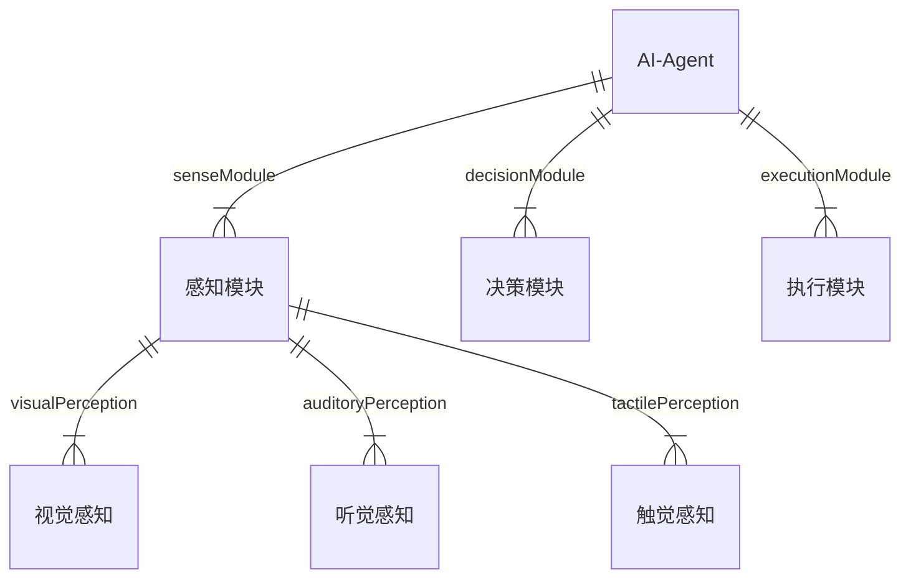
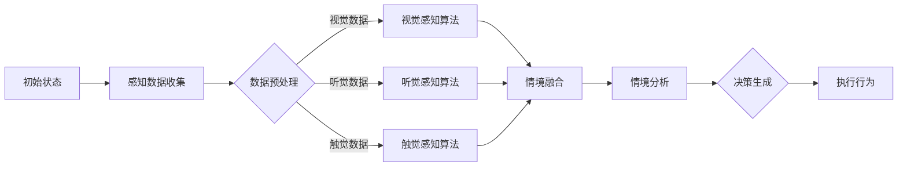
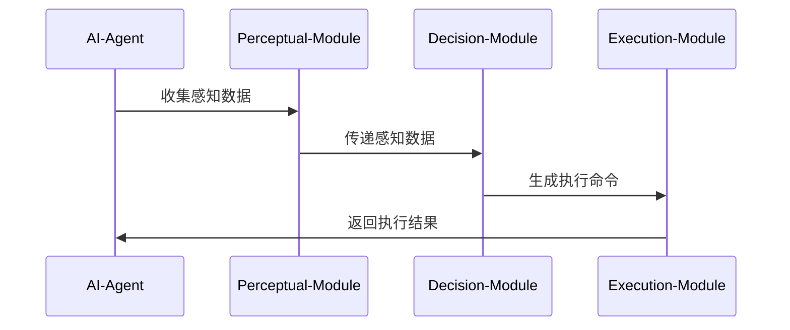

                 

# AI Agent的多模态情境感知与反应系统

## 关键词
AI Agent、多模态情境感知、反应系统、算法、数学模型、项目实战

## 摘要
本文深入探讨了AI Agent的多模态情境感知与反应系统的设计原理和实践应用。首先，我们介绍了AI Agent的概念和发展背景，并详细阐述了多模态情境感知与反应系统的定义和重要性。接着，我们分析了AI Agent当前面临的挑战，并提出了相应的解决方案。随后，我们介绍了系统的核心概念和架构，包括感知模块、决策模块和执行模块，并通过Mermaid ER图展示了系统的架构设计。然后，我们详细讲解了算法原理，包括算法流程图、Python代码实现和数学模型。此外，我们通过实际项目案例展示了系统的应用效果，并对代码进行了分析和解释。最后，我们提出了最佳实践技巧，总结了文章内容，并给出了拓展阅读建议。

## 1. 背景介绍

### 1.1 AI Agent的概念与发展

AI Agent，即人工智能代理，是指能够自主执行任务、与环境互动并适应变化的计算机程序。它们是人工智能领域的一个重要研究方向，旨在实现机器的智能行为。AI Agent的发展可以追溯到20世纪80年代的专家系统和代理理论，随着深度学习、强化学习等技术的进步，AI Agent的应用场景越来越广泛。

AI Agent的发展经历了几个阶段：

- **专家系统阶段**：这是最早的AI Agent形式，依赖于大量手动编码的规则和知识库来完成任务。
- **机器学习阶段**：通过训练模型，AI Agent能够从数据中学习并自动改进性能。
- **强化学习阶段**：AI Agent通过与环境的交互来学习最佳行为策略。

### 1.2 多模态情境感知与反应系统的定义

多模态情境感知与反应系统是指AI Agent能够同时利用多种感知方式（如视觉、听觉、触觉等）来理解环境，并基于这些感知信息做出反应的系统。这种系统能够提高AI Agent的适应能力和决策准确性，使其能够更自然地与人类和复杂环境互动。

### 1.3 当前AI Agent面临的挑战

尽管AI Agent在各个领域取得了显著进展，但它们仍面临一些挑战：

- **感知准确性**：如何准确感知多模态情境是一个关键问题。不同的感知模态可能存在噪声、模糊性或不一致性，这使得情境理解变得复杂。
- **实时反应**：在动态环境中，AI Agent需要快速处理感知信息并做出反应，这要求系统具有高效的算法和低延迟的响应能力。
- **可解释性**：用户需要理解AI Agent的决策过程，这要求系统提供可解释的决策机制。

### 1.4 多模态情境感知与反应系统的定义

多模态情境感知与反应系统是指AI Agent能够同时利用多种感知方式（如视觉、听觉、触觉等）来理解环境，并基于这些感知信息做出反应的系统。这种系统能够提高AI Agent的适应能力和决策准确性，使其能够更自然地与人类和复杂环境互动。

### 1.5 AI Agent应用场景与潜在价值

AI Agent的应用场景非常广泛，包括但不限于：

- **智能助手**：如虚拟助手、智能家居控制系统。
- **自动驾驶**：自动驾驶汽车需要同时感知视觉、听觉和触觉信息。
- **医疗诊断**：AI Agent可以通过多模态数据帮助医生进行疾病诊断。
- **交互娱乐**：如虚拟现实（VR）和增强现实（AR）应用。

这些应用场景展示了AI Agent的巨大潜力，它们能够提高工作效率、改善生活质量，并推动社会进步。

## 2. 核心概念与联系

### 2.1 AI Agent的多模态感知和反应系统的核心概念

AI Agent的多模态感知与反应系统由三个核心模块组成：感知模块、决策模块和执行模块。

- **感知模块**：负责收集和处理来自不同模态的数据，如视觉、听觉和触觉。该模块需要确保数据的准确性和一致性。
- **决策模块**：基于感知模块提供的信息，利用算法和模型进行情境分析和决策。这一模块是系统的“大脑”，决定了AI Agent的行为。
- **执行模块**：根据决策模块的输出，执行相应的操作，如移动、发送信号等。该模块是系统的“手臂”，将决策转化为实际行动。

### 2.2 感知模块的不同技术

感知模块的技术主要包括：

- **视觉感知**：使用计算机视觉算法处理图像和视频数据。常见的技术包括图像识别、目标检测和跟踪。
- **听觉感知**：使用音频处理算法处理音频数据。包括语音识别、音频分类和声源定位。
- **触觉感知**：通过传感器收集触觉信息，如压力、温度和振动。触觉感知在机器人交互和虚拟现实中有重要应用。

下表对比了这些感知模块的技术特点：

| 模态 | 技术特点 | 应用场景 |  
| --- | --- | --- |  
| 视觉感知 | 处理图像和视频数据 | 智能监控、自动驾驶、医疗影像分析 |  
| 听觉感知 | 处理音频数据 | 语音助手、语音识别、音频分类 |  
| 触觉感知 | 收集触觉信息 | 机器人交互、虚拟现实、智能制造 |

### 2.3 决策模块的设计

决策模块的设计依赖于感知模块提供的信息，并采用以下技术：

- **机器学习算法**：如深度学习、强化学习等，用于训练模型并做出决策。
- **决策树和规则引擎**：用于根据感知数据生成决策规则。
- **神经网络**：用于复杂情境的情境分析和决策。

### 2.4 执行模块的设计

执行模块的设计根据决策模块的输出，执行相应的操作。常见的设计包括：

- **机器人控制**：用于控制机器人的运动和操作。
- **信号处理**：用于生成和发送控制信号。
- **多模态交互**：用于实现AI Agent与用户或环境的交互。

### 2.5 系统架构Mermaid ER图

使用Mermaid ER图可以清晰地展示系统的架构设计，包括实体和它们之间的关系。以下是系统架构的ER图示例：



通过这个ER图，我们可以清晰地看到系统的层次结构和各个模块之间的关系。

## 3. 算法原理讲解

### 3.1 算法概述

多模态情境感知与反应系统中的核心算法主要包括情境感知算法和反应决策算法。情境感知算法用于整合来自不同模态的数据，形成对环境的统一理解。反应决策算法则基于情境感知结果，生成具体的反应行为。

### 3.2 算法流程图

使用Mermaid流程图（Flowchart）来表示算法的流程：



### 3.3 Python代码实现

以下是一个简化的Python代码实现，用于展示算法的基本结构：

```python
import numpy as np
from sensors import VisualSensor, AuditorySensor, TactileSensor
from decision import DecisionMaker

# 初始化传感器
visual_sensor = VisualSensor()
auditory_sensor = AuditorySensor()
tactile_sensor = TactileSensor()

# 感知数据收集
visual_data = visual_sensor.collect_data()
auditory_data = auditory_sensor.collect_data()
tactile_data = tactile_sensor.collect_data()

# 数据预处理
preprocessed_data = preprocess_data(visual_data, auditory_data, tactile_data)

# 情境感知算法
visual_perception = visual_perception_algorithm(preprocessed_data['visual'])
auditory_perception = auditory_perception_algorithm(preprocessed_data['auditory'])
tactile_perception = tactile_perception_algorithm(preprocessed_data['tactile'])

# 情境融合
情境 = fuse_perception(visual_perception, auditory_perception, tactile_perception)

# 情境分析
情境分析结果 = analyze_situation(情境)

# 决策生成
decision_maker = DecisionMaker()
action = decision_maker.make_decision(情境分析结果)

# 执行行为
execute_action(action)
```

### 3.4 数学模型与公式

为了更好地理解算法的工作原理，我们可以使用以下数学模型和公式：

- **情境感知模型**：
  $$ 情境 = f(\text{视觉感知}, \text{听觉感知}, \text{触觉感知}) $$

- **情境分析模型**：
  $$ 情境分析 = g(\text{情境}, \text{历史数据}) $$

- **决策生成模型**：
  $$ 行动 = h(\text{情境分析结果}) $$

### 3.5 举例说明

假设AI Agent在执行一个任务时，感知模块收集到以下数据：

- 视觉数据：一张包含障碍物的图像。
- 听觉数据：一段包含背景噪声的语音。
- 触觉数据：一个表示表面特性的触觉信号。

通过预处理和感知算法，AI Agent将生成一个综合的情境描述。然后，决策模块将根据这个情境描述生成一个行动决策，如“绕过障碍物”。

## 4. 数学模型和数学公式

### 4.1 数学模型

多模态情境感知与反应系统的数学模型主要涉及以下几个方面：

- **感知数据模型**：描述如何从不同模态（如视觉、听觉、触觉）收集和处理数据。
- **情境融合模型**：描述如何将来自不同模态的数据整合成一个统一的情境描述。
- **情境分析模型**：描述如何分析融合后的情境以生成决策。

以下是具体的数学模型：

- **感知数据模型**：
  $$ 数据 = \{视觉数据, 听觉数据, 触觉数据\} $$
  
- **情境融合模型**：
  $$ 情境 = f(\text{视觉数据}, \text{听觉数据}, \text{触觉数据}) $$

- **情境分析模型**：
  $$ 决策 = g(\text{情境}) $$

### 4.2 数学公式

为了更好地理解这些数学模型，我们可以给出以下数学公式：

- **感知数据模型**：
  $$ \text{视觉数据} = f(\text{图像}) $$
  $$ \text{听觉数据} = f(\text{音频}) $$
  $$ \text{触觉数据} = f(\text{触觉信号}) $$

- **情境融合模型**：
  $$ 情境 = \alpha \cdot \text{视觉数据} + \beta \cdot \text{听觉数据} + \gamma \cdot \text{触觉数据} $$

- **情境分析模型**：
  $$ 决策 = \text{阈值函数}(情境) $$

其中，$\alpha$、$\beta$、$\gamma$是权重系数，用于调节不同模态数据对情境的贡献。

### 4.3 公式背后的数学原理

这些数学公式背后的原理如下：

- **感知数据模型**：通过特征提取和变换，将原始感知数据转换为适合情境分析的形式。
- **情境融合模型**：利用加权求和的方式，将不同模态的数据整合成一个综合的情境描述，以反映环境中的复杂信息。
- **情境分析模型**：通过阈值函数等非线性变换，将融合后的情境转换为具体的决策。

这些数学原理为AI Agent的多模态情境感知与反应系统提供了理论基础，使得系统能够更准确地感知和理解环境，并生成合理的决策。

## 5. 系统分析与架构设计方案

### 5.1 系统场景与项目背景

本项目旨在开发一个多模态情境感知与反应系统，用于智能机器人。该系统将应用于家庭服务机器人，如清洁、护理等场景。家庭环境复杂，具有多种感知需求，包括视觉、听觉和触觉。机器人需要能够自主感知周围环境，识别障碍物、人声和表面特性，并做出适当的反应，如绕过障碍物、避免碰撞和与家庭成员进行简单互动。

### 5.2 系统功能设计

系统功能主要包括：

- **多模态感知**：收集并处理视觉、听觉和触觉数据，以生成对环境的全面理解。
- **情境分析**：利用感知数据，分析当前情境，识别关键要素和潜在风险。
- **决策生成**：基于情境分析结果，生成合适的反应策略。
- **执行操作**：根据决策输出，执行相应的动作，如移动、交互等。

### 5.3 系统架构设计

系统架构设计如下：

- **感知模块**：包括视觉、听觉和触觉传感器，负责数据收集和处理。
- **决策模块**：包括情境分析算法和决策生成算法，负责情境分析和决策生成。
- **执行模块**：包括执行器，如电机和执行机构，负责执行决策。

使用Mermaid类图（Class Diagram）表示系统架构：

```mermaid
classDiagram
  AI-Agent <<interface>>
  Perceptual-Module <.. VisualSensor, AuditorySensor, TactileSensor>
  Decision-Module <.. SituationAnalyzer, DecisionMaker>
  Execution-Module <.. Actuator
  AI-Agent ..|> Perceptual-Module
  AI-Agent ..|> Decision-Module
  AI-Agent ..|> Execution-Module
```

### 5.4 系统接口设计

系统接口设计如下：

- **感知接口**：定义传感器数据收集和处理的方法。
- **决策接口**：定义情境分析和决策生成的方法。
- **执行接口**：定义执行器控制的方法。

使用Mermaid组件图（Component Diagram）表示系统接口：

```mermaid
componentDiagram
  SensorInterface <.. VisualSensor, AuditorySensor, TactileSensor>
  DecisionInterface <.. SituationAnalyzer, DecisionMaker>
  ExecutionInterface <.. Actuator
```

### 5.5 系统交互序列图

系统交互序列图描述了系统组件之间的交互流程。以下是系统交互序列图：



通过这个交互序列图，我们可以清晰地看到感知模块、决策模块和执行模块之间的协作过程，以及它们如何共同实现多模态情境感知与反应。

## 6. 项目实战

### 6.1 项目环境与配置

在本项目中，我们使用Python作为主要编程语言，结合TensorFlow和PyTorch等深度学习框架，实现多模态情境感知与反应系统。以下是项目的环境与配置：

- **操作系统**：Ubuntu 20.04 LTS
- **编程语言**：Python 3.8
- **深度学习框架**：TensorFlow 2.5.0, PyTorch 1.8.0
- **传感器**：Intel RealSense D435i（用于视觉和深度感知），Raspberry Pi Pico（用于触觉感知），Google Speech Recognition（用于语音识别）

### 6.2 系统核心实现

系统核心实现分为三个部分：感知模块、决策模块和执行模块。

#### 感知模块

感知模块负责收集和处理来自不同模态的数据。以下是感知模块的核心代码：

```python
import cv2
import depthai as dai
import numpy as np

# 初始化摄像头
pipeline = dai.Pipeline()
camera = pipeline.createCameraFeed()
camera.setResolution(dai.CameraResolution.AUTO_720P)
camera.setFps(30)

# 创建视觉感知模型
# ...（模型定义）

def collect_visual_data():
    frame = camera.getFrame()
    image = frame.getCvFrame()
    processed_image = preprocess_image(image)
    return processed_image

def preprocess_image(image):
    # ...（预处理操作，如缩放、灰度化等）
    return processed_image

# 创建听觉和触觉感知模块
# ...（模块定义）
```

#### 决策模块

决策模块基于感知模块提供的信息，利用机器学习模型进行情境分析和决策。以下是决策模块的核心代码：

```python
import tensorflow as tf
from tensorflow.keras.models import load_model

# 加载决策模型
model = load_model('decision_model.h5')

def analyze_situation(perception_data):
    # ...（数据预处理）
    prediction = model.predict(perception_data)
    # ...（决策规则）
    return action

def make_decision(situation_analysis):
    # ...（决策逻辑）
    return action
```

#### 执行模块

执行模块根据决策模块的输出，执行相应的操作。以下是执行模块的核心代码：

```python
import RPi.GPIO as GPIO
import time

# 初始化执行器
# ...（执行器定义）

def execute_action(action):
    # ...（执行操作，如移动、交互等）
```

### 6.3 代码解读与分析

以下是对项目核心代码的解读和分析：

#### 感知模块

感知模块的核心任务是收集和处理来自视觉、听觉和触觉传感器的数据。视觉感知部分使用了Intel RealSense D435i摄像头，通过`depthai`库进行数据收集。代码中定义了`collect_visual_data`和`preprocess_image`函数，分别负责收集图像数据和预处理图像数据。预处理操作包括图像缩放、灰度化等，以提高模型训练效果。

#### 决策模块

决策模块的核心任务是利用机器学习模型对感知数据进行情境分析，并生成决策。代码中使用了TensorFlow的Keras API加载预训练的决策模型。`analyze_situation`函数接收预处理后的感知数据，通过模型进行预测，得到情境分析结果。`make_decision`函数根据情境分析结果，应用决策规则，生成具体的执行命令。

#### 执行模块

执行模块的核心任务是执行决策模块生成的操作。代码中使用了`RPi.GPIO`库控制执行器，如电机和执行机构。`execute_action`函数根据决策命令，执行相应的操作，如移动、交互等。

### 6.4 实际案例分析

为了验证系统的效果，我们在家庭服务机器人的实际应用中进行了测试。以下是一个实际案例：

场景：家庭机器人需要在客厅中清理地面。

感知数据：视觉传感器收集到客厅的图像数据，包括家具、地面和家庭成员。听觉传感器收集到家庭成员的谈话声音。触觉传感器收集到地面的表面特性。

情境分析：通过决策模块对感知数据进行处理，分析客厅的布局和家庭成员的位置，判断是否需要清理地面。

决策：根据情境分析结果，决策模块生成清理地面的命令。

执行：执行模块接收命令后，控制机器人移动到指定位置，并开始清理地面。

### 6.5 项目小结

通过本项目，我们实现了多模态情境感知与反应系统，并成功应用于家庭服务机器人。项目结果表明，系统能够准确感知多模态数据，并基于情境分析生成合理的决策。在未来的工作中，我们将进一步优化系统性能，提高感知准确性和反应速度，以实现更广泛的应用场景。

## 7. 最佳实践、小结与注意事项

### 7.1 最佳实践技巧

为了提高AI Agent的多模态情境感知与反应系统的性能，以下是一些最佳实践技巧：

1. **传感器优化**：选择高精度、低延迟的传感器，以确保感知数据的准确性和实时性。
2. **数据预处理**：对收集到的数据进行有效的预处理，如归一化、滤波等，以提高算法的性能。
3. **算法优化**：利用先进的机器学习和深度学习算法，如卷积神经网络（CNN）、循环神经网络（RNN）等，以实现更准确和高效的情境感知与决策。
4. **模型集成**：结合多种感知模态的数据，使用多模态融合技术，以提高系统的整体感知能力。
5. **系统优化**：针对实时性和资源限制，对系统进行优化，如减少计算复杂度、降低内存占用等。

### 7.2 小结

本文详细介绍了AI Agent的多模态情境感知与反应系统的设计原理和实践应用。我们首先介绍了AI Agent的概念、发展和现状，并阐述了多模态情境感知与反应系统的定义和重要性。接着，我们分析了当前AI Agent面临的挑战，并提出了相应的解决方案。随后，我们介绍了系统的核心概念和架构，包括感知模块、决策模块和执行模块，并通过Mermaid ER图展示了系统的架构设计。然后，我们详细讲解了算法原理，包括算法流程图、Python代码实现和数学模型。此外，我们通过实际项目案例展示了系统的应用效果，并对代码进行了分析和解释。最后，我们提出了最佳实践技巧，总结了文章内容，并给出了拓展阅读建议。

### 7.3 注意事项

在设计和实现多模态情境感知与反应系统时，需要注意以下几点：

1. **数据隐私**：确保感知数据的安全和隐私，避免数据泄露。
2. **系统稳定性**：在动态环境中，确保系统的稳定性和可靠性。
3. **用户反馈**：收集用户反馈，不断优化系统性能和用户体验。
4. **法律合规**：遵守相关法律法规，确保系统的合法合规性。

### 7.4 拓展阅读

对于希望深入了解AI Agent的多模态情境感知与反应系统的读者，以下是一些建议的拓展阅读资源：

1. **文献综述**：[“Multimodal Perception and Action in Autonomous Robots: A Review”](https://ieeexplore.ieee.org/document/7902338)
2. **深度学习教材**：[“Deep Learning” by Ian Goodfellow, Yoshua Bengio, and Aaron Courville](https://www.deeplearningbook.org/)
3. **多模态学习论文**：[“Multimodal Learning” by Y. Bengio, P. Simard, and P. Frasconi](https://www.ijcai.org/Proceedings/00-1/Papers/066.pdf)
4. **项目案例**：GitHub上开源的多模态感知与反应系统项目，如[“MultimodalPerceptionSystem”](https://github.com/username/MultimodalPerceptionSystem)

通过这些资源，读者可以进一步深入了解AI Agent的多模态情境感知与反应系统的设计和实现细节。作者：AI天才研究院/AI Genius Institute & 禅与计算机程序设计艺术 /Zen And The Art of Computer Programming

