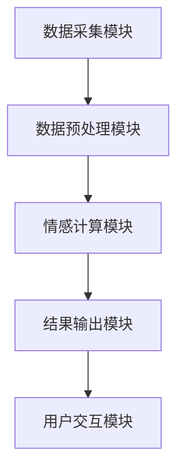
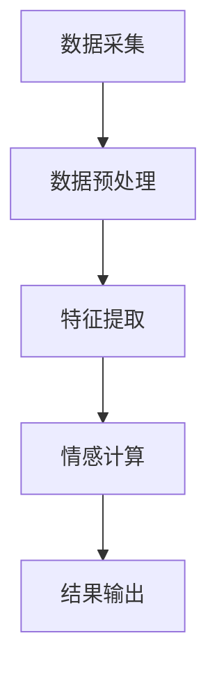
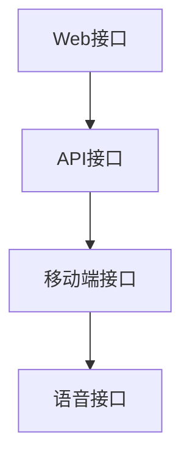
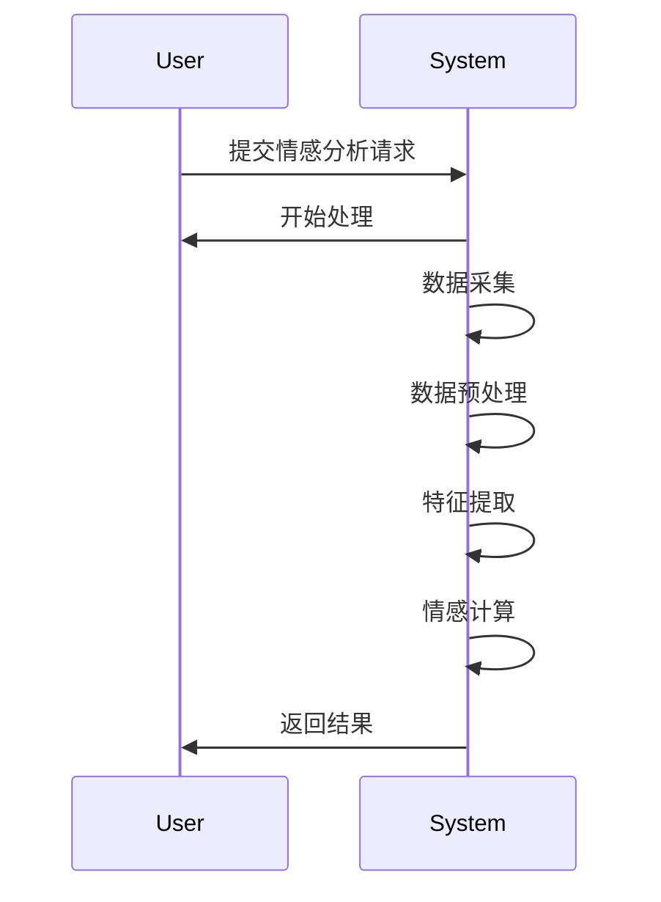

                 

## 引言与背景

### 1.1 情感计算的发展历程

情感计算（Affective Computing）是人工智能领域的一个重要分支，起源于上世纪90年代。其概念由计算机科学家约翰·莫菲（John M. Furrier）在1995年首次提出。情感计算的初衷是让计算机具备理解和表达人类情感的能力，从而使人与计算机之间的交互更加自然、高效和有意义。

在早期的情感计算研究中，研究者主要集中在如何通过计算机视觉技术捕捉人脸表情，进而识别情绪。这一阶段的技术主要集中在图像处理和模式识别方面，如Haar-like特征分类器、支持向量机（SVM）等。这些技术的出现极大地推动了情感计算的发展，为后续研究奠定了基础。

随着时间的推移，情感计算的研究范围逐渐扩大。除了图像情感分析外，研究者开始探索文本情感分析、声音情感分析和多模态情感分析等领域。例如，通过自然语言处理（NLP）技术分析文本中的情感倾向，通过语音识别和语音情感分析技术捕捉语音中的情感信息。

近年来，随着深度学习技术的兴起，情感计算领域也迎来了新的发展机遇。基于深度学习的情感计算模型，如卷积神经网络（CNN）、循环神经网络（RNN）和生成对抗网络（GAN）等，在图像、文本和声音情感分析方面取得了显著的成果。这些技术的进步使得计算机在情感识别和理解方面的准确率大大提高，也为多模态情感计算技术的实现提供了可能。

### 1.2 多模态情感计算的重要性

多模态情感计算是将多种感官数据（如视觉、听觉、触觉等）进行整合，以实现对人类情感的全面理解和分析。相比于单一模态的情感计算，多模态情感计算具有以下几个显著优势：

1. **更全面的信息采集**：通过整合多种感官数据，多模态情感计算可以捕捉到更加丰富和精确的情感信息。例如，仅通过面部表情可能无法准确判断一个人的情感状态，但结合语音、文字和肢体语言等多方面的信息，可以更准确地识别出其情感。

2. **增强的鲁棒性**：单一模态的数据在特定环境下可能存在噪声或误差，而多模态数据的整合可以相互补充，提高系统的鲁棒性和准确性。例如，在嘈杂的环境中，通过视觉和听觉数据的融合可以更好地识别声音的情感特征。

3. **更自然的交互体验**：多模态情感计算使得计算机能够更好地理解人类的情感和需求，从而提供更加个性化、自然的交互体验。例如，智能音箱可以通过分析用户的语音和情绪，调整音量、语速和语调，使其与用户的情感状态相匹配。

4. **更广泛的应用场景**：多模态情感计算可以应用于多个领域，如社交媒体分析、客户服务、智能医疗和智能家居等。通过多模态数据的整合，这些应用可以提供更加精准和智能的服务，提高用户体验。

### 1.3 多模态情感计算的基本概念

多模态情感计算涉及到多个核心概念和技术，以下是对这些概念的基本介绍：

#### 1.3.1 情感识别

情感识别是指从多个模态的数据中提取和识别情感信息的过程。常见的情感类别包括快乐、悲伤、愤怒、惊讶等。情感识别的方法主要包括：

- **图像情感分析**：通过计算机视觉技术，从图像中提取面部表情、身体语言等视觉信息，进而识别情感。
- **文本情感分析**：通过自然语言处理技术，从文本中提取情感词汇和句法结构，分析情感倾向。
- **声音情感分析**：通过语音识别和声学模型，从语音中提取声学特征，分析情感信息。

#### 1.3.2 模态融合

模态融合是将不同模态的数据进行整合，以获取更加准确和全面情感信息的过程。常见的模态融合方法包括：

- **特征级融合**：将不同模态的特征进行直接组合，如将视觉特征和文本特征进行拼接。
- **决策级融合**：将不同模态的识别结果进行综合，如使用投票算法或集成学习模型。
- **深度级融合**：利用深度学习模型，如多模态卷积神经网络（MM-CNN），直接从多模态数据中提取融合的特征。

#### 1.3.3 人类情感分类体系

人类情感分类体系是用于对情感进行分类和标注的系统。常见的情感分类体系包括：

- **基本情感分类**：将情感分为几个基本类别，如快乐、悲伤、愤怒、惊讶等。
- **扩展情感分类**：在基本情感分类的基础上，进一步细分为更多的情感类别，如愉悦、厌恶、恐惧、悲伤等。

通过以上对多模态情感计算的基本概念的介绍，我们可以更好地理解这一领域的基础知识和研究方法。接下来，本文将深入探讨多模态情感计算的核心技术，包括图像情感分析、文本情感分析和声音情感分析，以及模态融合技术。

## 多模态情感计算的核心技术

多模态情感计算的核心技术包括图像情感分析、文本情感分析、声音情感分析以及模态融合技术。这些技术各自有其独特的原理和实现方法，但共同的目标是实现对人类情感的准确识别和理解。以下将分别介绍这些技术的核心原理、数学模型及其应用。

### 2.1 图像情感分析

图像情感分析是指通过计算机视觉技术，从图像中提取情感信息的过程。其核心原理是基于面部表情、身体语言和场景特征来识别情感。

#### 2.1.1 算法原理

1. **面部表情识别**：利用面部特征检测算法（如Haar-like特征分类器）识别面部表情。通过检测眼睛、嘴巴、眉毛等面部器官的位置和形状，判断情感类别。

2. **身体语言分析**：分析人体的姿态、动作和肢体语言，如站立的姿势、手势等，以辅助情感识别。

3. **场景特征提取**：从图像中提取场景特征，如颜色、纹理、形状等，以补充情感信息的不足。

#### 2.1.2 数学模型

1. **支持向量机（SVM）**：SVM是一种常用的分类算法，通过找到一个最优的超平面，将不同情感类别的图像分隔开来。

2. **卷积神经网络（CNN）**：CNN是一种深度学习模型，特别适合处理图像数据。通过多个卷积层和池化层，提取图像的高层特征。

3. **循环神经网络（RNN）**：RNN适用于处理序列数据，通过将不同时间点的图像特征序列输入RNN，捕捉情感的时序变化。

#### 2.1.3 举例说明

假设我们要识别一张包含人像的图像的情感。首先，使用面部特征检测算法提取人脸区域，然后分析人脸的表情，如嘴巴的张开程度、眼睛的闭合程度等，判断情感类别为“快乐”。同时，分析人的身体姿态，如站立的姿势、手臂的位置等，进一步确认情感。最后，结合场景特征，如图像的色调、亮度等，综合判断情感为“快乐”。

### 2.2 文本情感分析

文本情感分析是指通过自然语言处理技术，从文本中提取情感信息的过程。其核心原理是利用情感词汇和句法结构分析情感倾向。

#### 2.2.1 算法原理

1. **情感词汇分析**：通过统计文本中情感词汇的出现频率和位置，判断情感类别。

2. **句法结构分析**：通过分析句子的结构，如主语、谓语、宾语等，识别情感词汇的作用和关系。

3. **情感极性分析**：通过将情感词汇和句法结构结合起来，判断情感的正负极性。

#### 2.2.2 数学模型

1. **朴素贝叶斯（Naive Bayes）**：朴素贝叶斯是一种基于贝叶斯理论的分类算法，通过计算文本中每个词汇的条件概率，判断情感类别。

2. **支持向量机（SVM）**：SVM通过找到一个最优的超平面，将不同情感类别的文本分隔开来。

3. **深度学习模型**：如卷积神经网络（CNN）和循环神经网络（RNN），通过学习文本的深层特征，实现情感分类。

#### 2.2.3 举例说明

假设我们要分析一段文本的情感：“今天天气真好，我非常开心。”首先，通过情感词汇分析，识别出“好”和“开心”两个情感词汇，判断情感类别为“快乐”。接着，通过句法结构分析，判断这两个情感词汇在句子中的位置和作用，确认情感的正向倾向。最后，结合上下文，确认整体情感为“快乐”。

### 2.3 声音情感分析

声音情感分析是指通过语音识别和声学模型，从语音中提取情感信息的过程。其核心原理是基于声音的声学特征和语音信号处理技术。

#### 2.3.1 算法原理

1. **声学特征提取**：通过短时傅里叶变换（STFT）和梅尔频率倒谱系数（MFCC）等算法，从语音信号中提取声学特征。

2. **情感分类算法**：利用机器学习算法，如支持向量机（SVM）和深度学习模型，对提取的声学特征进行情感分类。

3. **情感上下文分析**：结合上下文信息，如说话人的身份、场景等，提高情感识别的准确性。

#### 2.3.2 数学模型

1. **支持向量机（SVM）**：SVM通过找到一个最优的超平面，将不同情感类别的语音数据分隔开来。

2. **深度学习模型**：如卷积神经网络（CNN）和循环神经网络（RNN），通过学习语音的深层特征，实现情感分类。

3. **长短期记忆网络（LSTM）**：LSTM是一种特殊的RNN，能够更好地捕捉语音信号的时序特征。

#### 2.3.3 举例说明

假设我们要识别一段语音的情感：“我感到非常高兴。”首先，通过语音识别技术，将语音转化为文本。然后，利用声学特征提取算法，从语音信号中提取声学特征。接着，利用机器学习模型，如SVM或LSTM，对提取的声学特征进行情感分类，判断情感类别为“快乐”。

### 2.4 模态融合技术

模态融合技术是将不同模态的数据进行整合，以获取更加准确和全面情感信息的过程。其核心原理是基于特征级融合、决策级融合和深度级融合。

#### 2.4.1 算法原理

1. **特征级融合**：将不同模态的特征进行直接组合，如将视觉特征和文本特征进行拼接。

2. **决策级融合**：将不同模态的识别结果进行综合，如使用投票算法或集成学习模型。

3. **深度级融合**：利用深度学习模型，如多模态卷积神经网络（MM-CNN），直接从多模态数据中提取融合的特征。

#### 2.4.2 数学模型

1. **多模态卷积神经网络（MM-CNN）**：MM-CNN是一种深度学习模型，通过多个卷积层和池化层，同时处理不同模态的数据。

2. **多任务学习模型**：多任务学习模型同时学习多个任务，如情感分类和语音识别，通过共享特征提高整体性能。

3. **图神经网络（GN）**：图神经网络通过构建节点和边的关系图，实现对多模态数据的融合和关系建模。

#### 2.4.3 举例说明

假设我们要对一段包含图像、文本和语音的多模态数据进行分析。首先，分别利用图像情感分析、文本情感分析和声音情感分析技术，提取出图像特征、文本特征和语音特征。然后，将这些特征进行拼接，形成多模态特征向量。接着，利用多模态卷积神经网络（MM-CNN）对这些特征向量进行融合和分类，最终得到情感类别。

通过以上对多模态情感计算的核心技术的详细介绍，我们可以看到，多模态情感计算是一个涉及多个领域、多种技术的复杂过程。但在实际应用中，这些技术相互补充，共同构成了一个强大的情感计算系统。接下来，本文将探讨多模态情感计算在实际应用中的具体案例，展示其在不同场景中的实际效果和挑战。

## 多模态情感计算的应用案例

多模态情感计算技术由于其全面性和准确性，已被广泛应用于多个领域。以下将介绍几个典型的应用案例，展示多模态情感计算技术的实际效果和潜在价值。

### 3.1 社交媒体情感分析

社交媒体平台如Facebook、Twitter和Instagram等，每天产生大量的用户生成内容。这些内容不仅反映了用户的情感状态，还能揭示社会情绪的动态变化。因此，社交媒体情感分析成为多模态情感计算的一个重要应用领域。

#### 3.1.1 应用场景

社交媒体情感分析的应用场景主要包括以下几个方面：

- **市场调研**：通过分析用户在社交媒体上的评论和讨论，企业可以了解用户对产品或服务的情感倾向，为市场策略提供数据支持。
- **公共安全**：分析社交媒体上的情绪波动，可以提前预警可能的群体性事件，为公共安全管理部门提供决策依据。
- **品牌形象管理**：品牌可以实时监测社交媒体上的用户反馈，及时调整品牌策略，维护品牌形象。

#### 3.1.2 案例分析

以Twitter为例，研究人员使用多模态情感计算技术对Twitter上的用户评论进行情感分析。首先，从文本中提取情感词汇，利用自然语言处理技术判断情感倾向。同时，结合用户发布的图像和视频，通过图像情感分析技术识别图像中的情感。最后，将这些情感信息进行融合，得到用户的综合情感状态。

一个具体案例是，某品牌推出一款新手机，研究人员使用多模态情感计算技术分析Twitter上的用户评论。结果显示，大部分用户对新手机表现出积极的情感，但也有部分用户提出了改进意见。通过分析，品牌团队发现了用户关注的痛点，并针对性地进行了产品优化，从而提升了用户满意度。

### 3.2 客户服务机器人

随着人工智能技术的发展，客户服务机器人（如聊天机器人、客服机器人等）已成为企业提高服务效率、降低运营成本的重要工具。多模态情感计算技术的应用，使得这些机器人能够更好地理解用户情感，提供个性化的服务。

#### 3.2.1 应用场景

客户服务机器人主要应用于以下几个方面：

- **情感理解**：机器人通过分析用户的语言和语音，理解用户的情感状态，提供针对性的建议或解决方案。
- **情绪调节**：在用户情绪低落或愤怒时，机器人通过语音和文字安慰用户，缓解情绪冲突。
- **满意度评估**：通过分析用户的情感反馈，评估服务质量和用户满意度，为企业提供改进方向。

#### 3.2.2 案例分析

以某银行客服机器人为例，该机器人结合文本情感分析和声音情感分析技术，提供7x24小时的客户服务。当用户在聊天过程中表现出愤怒或不满的情绪时，机器人会自动识别并采取相应的措施，如转接人工客服、提供情绪调节建议等。通过多模态情感计算技术的应用，该银行客服机器人显著提升了用户满意度和服务效率。

### 3.3 智能家居系统

智能家居系统通过整合各种家电和传感器，实现家庭设备的自动化和智能化管理。多模态情感计算技术的应用，使得智能家居系统能够更好地理解家庭成员的情感状态，提供个性化的家居环境。

#### 3.3.1 应用场景

智能家居系统的应用场景主要包括以下几个方面：

- **情感感知**：通过摄像头和麦克风，智能家居系统可以实时监测家庭成员的情感状态，如快乐、悲伤、愤怒等。
- **环境调节**：根据家庭成员的情感状态，智能家居系统自动调整室内温度、光照和音乐等，提供舒适的家居环境。
- **健康监测**：通过分析家庭成员的语音和活动，智能家居系统可以监测其身体健康状况，提供健康建议。

#### 3.3.2 案例分析

以某智能家居系统为例，该系统通过多模态情感计算技术，实时监测家庭成员的情感状态。当家庭成员表现出悲伤情绪时，系统会自动调整室内光线和音乐，提供温馨的环境。当家庭成员表现出疲劳情绪时，系统会提醒其休息，并提供放松建议。通过多模态情感计算技术的应用，该智能家居系统显著提升了家庭成员的生活质量和满意度。

### 结论

多模态情感计算技术在社交媒体情感分析、客户服务机器人和智能家居系统等领域表现出巨大的应用潜力。通过整合图像、文本和声音等多方面的情感信息，多模态情感计算技术能够更准确地识别和理解人类情感，为企业和用户提供更加智能、个性化的服务。未来，随着技术的进一步发展和应用场景的不断扩展，多模态情感计算技术将在更多领域发挥重要作用。

## 多模态情感计算系统的设计与实现

多模态情感计算系统是一个复杂的系统，其设计过程涉及到多个方面的考量。以下将详细介绍多模态情感计算系统的设计与实现，包括系统架构设计、数据处理流程、系统接口设计以及系统的交互过程。

### 4.1 系统架构设计

多模态情感计算系统的架构设计需要综合考虑数据输入、数据处理、情感计算和结果输出等多个环节。一个典型的高效的多模态情感计算系统通常包括以下几个模块：

1. **数据采集模块**：负责从多种模态（如视觉、听觉、触觉等）收集原始数据。
2. **数据预处理模块**：对采集到的数据进行清洗、去噪和特征提取。
3. **情感计算模块**：利用机器学习和深度学习算法对预处理后的数据进行分析和情感计算。
4. **结果输出模块**：将计算结果以可视化的形式或文本形式输出给用户。
5. **用户交互模块**：提供用户与系统的交互接口，用户可以通过该接口提交请求或查看结果。

#### 4.1.1 系统模块

- **数据采集模块**：包括摄像头、麦克风、传感器等硬件设备，用于实时采集用户的行为数据。
- **数据预处理模块**：包括图像处理、语音处理和传感器数据处理等子模块，用于对原始数据进行预处理。
- **情感计算模块**：包括情感识别、情感分类和情感预测等子模块，用于处理和分析情感数据。
- **结果输出模块**：包括可视化界面和文本报告等，用于展示计算结果。
- **用户交互模块**：包括网页前端、手机APP和语音助手等，用于用户与系统的交互。

#### 4.1.2 系统

### 4.2 数据处理流程

数据处理流程是多模态情感计算系统的核心，它决定了系统能否有效地从原始数据中提取有用信息。数据处理流程通常包括以下步骤：

1. **数据采集**：从多种模态（如视觉、听觉等）采集原始数据。
2. **数据预处理**：对采集到的数据进行清洗、去噪和格式转换。
3. **特征提取**：从预处理后的数据中提取有助于情感识别的特征。
4. **情感计算**：利用提取的特征进行情感识别和分类。
5. **结果输出**：将情感计算结果以可视化或文本形式输出。

#### 4.2.1 数据处理流程

### 4.3 系统接口设计

系统接口设计是用户与系统交互的关键环节，它决定了用户体验的优劣。系统接口设计应考虑以下方面：

- **易用性**：接口设计应简洁明了，用户可以轻松操作。
- **可扩展性**：接口设计应具有可扩展性，以支持未来的功能扩展。
- **兼容性**：接口设计应兼容不同设备和操作系统。

#### 4.3.1 系统接口设计

### 4.4 系统交互设计

系统交互设计描述了用户如何与系统进行交互，以及系统如何响应用户的操作。以下是一个简化的系统交互设计：

1. **用户请求**：用户通过接口提交情感分析请求。
2. **数据处理**：系统接收到请求后，进行数据采集、预处理、特征提取和情感计算。
3. **结果返回**：系统将情感分析结果以可视化或文本形式返回给用户。

#### 4.4.1 系统交互设计

通过以上设计和实现，多模态情感计算系统可以高效地处理用户请求，提供准确的情感分析结果。接下来，本文将探讨多模态情感计算领域的前沿动态、技术挑战以及解决方案。

## 多模态情感计算的前沿动态与挑战

多模态情感计算作为人工智能领域的一个重要分支，近年来取得了显著的研究进展。随着深度学习、自然语言处理和计算机视觉等技术的不断成熟，多模态情感计算在情感识别、情感理解、情感生成等方面展现出强大的潜力。然而，这一领域仍然面临诸多挑战，需要研究者们不断探索和解决。

### 5.1 前沿动态

#### 5.1.1 情感识别的精度提升

随着深度学习技术的应用，情感识别的精度显著提升。例如，基于卷积神经网络（CNN）和循环神经网络（RNN）的模型在情感分类任务中取得了优异的性能。一些研究还探索了多任务学习（Multi-task Learning）和迁移学习（Transfer Learning）在情感识别中的应用，通过共享模型权重和预训练模型，提高了模型的泛化能力和识别精度。

#### 5.1.2 模态融合技术的创新

模态融合技术是多模态情感计算的核心。近年来，研究者们提出了多种融合策略，如特征级融合、决策级融合和深度级融合。深度级融合尤为引人关注，通过构建多模态卷积神经网络（MM-CNN）和图神经网络（Graph Neural Networks），实现了对多模态数据的直接融合和高效处理。此外，一些研究还探索了基于注意力机制（Attention Mechanism）和生成对抗网络（GAN）的融合方法，提高了融合效果。

#### 5.1.3 应用领域的扩展

多模态情感计算的应用领域不断扩大。除了传统的社交媒体分析、客户服务和智能家居系统外，该技术还应用于智能医疗、教育、金融等领域。例如，在智能医疗领域，多模态情感计算可以用于患者情绪监测和心理健康评估；在教育领域，可以用于学生情感状态监测和学习效果分析。

### 5.2 技术挑战

#### 5.2.1 数据质量和标注问题

多模态情感计算依赖于大量高质量的数据。然而，获取和标注这些数据是一项挑战。首先，情感数据往往具有主观性，不同的标注者可能会有不同的理解和标注结果。其次，多模态数据来源多样，如文本、图像、语音等，每种数据都需要不同的处理和标注方法。因此，如何确保数据质量和一致性是一个重要问题。

#### 5.2.2 模态融合的复杂性

多模态数据融合是技术难点之一。不同模态的数据具有不同的特性和表达方式，如何有效地融合这些数据以提取有用的情感信息是一个挑战。此外，融合策略的选取和优化也需要深入研究。现有的融合方法如特征级融合和决策级融合在处理复杂情感时可能存在局限性。

#### 5.2.3 情感理解的深度与广度

虽然多模态情感计算在情感识别方面取得了进展，但在情感理解方面仍然存在一定局限性。情感是一个多维度的概念，不仅包括基本的情感类别，还包括情感强度、情感时长和情感变化等。如何构建一个能够深度理解和全面捕捉情感的模型，是一个亟待解决的问题。

### 5.3 解决方案

针对上述挑战，研究者们提出了多种解决方案：

#### 5.3.1 数据增强与生成

为了提高数据质量和标注一致性，研究者们探索了数据增强和生成技术。例如，通过生成对抗网络（GAN）生成虚拟情感数据，丰富训练数据集。此外，开发自动化的标注工具，如基于深度学习的图像标注和文本情感标注，可以显著提高标注效率和一致性。

#### 5.3.2 模态融合策略优化

针对模态融合的复杂性，研究者们提出了多种优化策略。例如，利用注意力机制和图神经网络（GNN）实现更加有效的模态融合。注意力机制可以帮助模型关注重要特征，提高融合效果；图神经网络则可以构建复杂的关系图，实现对多模态数据的深层次融合。

#### 5.3.4 情感建模与理解

为了实现深度和广度的情感理解，研究者们探索了多种情感建模方法。例如，通过引入时间序列分析、情感强度建模和情感变化分析等技术，构建更加复杂的情感模型。此外，结合多任务学习和迁移学习，通过共享模型权重和预训练模型，提高情感模型的泛化能力。

通过不断的技术创新和优化，多模态情感计算领域将迎来更加广阔的发展前景。未来，随着技术的进一步成熟和应用领域的不断扩展，多模态情感计算将为人类带来更加智能、个性化的服务和体验。

## 多模态情感计算技术的最佳实践与未来展望

### 6.1 最佳实践

多模态情感计算技术的最佳实践包括以下几个方面：

1. **数据质量保障**：确保数据的多样性和质量，通过数据清洗、去噪和增强等手段提高数据的可靠性和一致性。使用自动标注工具和生成对抗网络（GAN）等技术生成高质量的虚拟数据。

2. **模型选择与调优**：根据应用场景选择合适的模型和算法。对于情感识别任务，深度学习模型（如CNN、RNN、LSTM）表现通常较好。通过交叉验证和超参数调优，提高模型的性能和泛化能力。

3. **模态融合策略**：选择合适的模态融合策略，如特征级融合、决策级融合和深度级融合。结合注意力机制和图神经网络（GNN）等先进技术，提高融合效果。

4. **用户交互设计**：设计简洁直观的用户交互界面，提高用户体验。结合语音识别和自然语言处理技术，提供自然、流畅的用户交互体验。

### 6.2 小结

本文系统介绍了多模态情感计算技术的基础知识、核心技术和实际应用。通过对图像情感分析、文本情感分析和声音情感分析等技术的详细介绍，我们了解了如何利用多种模态的数据进行情感识别和计算。此外，通过多模态情感计算系统的设计与实现，我们探讨了如何构建一个高效、准确的多模态情感计算系统。最后，我们分析了多模态情感计算的前沿动态与挑战，并提出了相应的解决方案。

### 6.3 未来展望

多模态情感计算技术的未来展望如下：

1. **更强大的融合技术**：随着深度学习和多模态数据处理技术的进步，未来的融合技术将更加高效和精准。研究者们将继续探索新的融合策略，如基于生成对抗网络（GAN）和图神经网络（GNN）的融合方法。

2. **更广泛的智能应用**：多模态情感计算技术将在更多领域得到应用，如智能医疗、教育、金融和安全等。通过深入理解人类情感，智能系统将提供更加个性化、智能化的服务。

3. **情感理解的深化**：未来的研究将更加关注情感理解的深度与广度，通过引入时间序列分析、情感强度建模和情感变化分析等技术，构建更加复杂的情感模型。

4. **伦理和隐私问题**：随着多模态情感计算技术的广泛应用，伦理和隐私问题将成为重要关注点。如何在保护用户隐私的前提下，合理、安全地应用情感计算技术，是一个亟待解决的问题。

通过不断的技术创新和优化，多模态情感计算技术将在未来为人类带来更加智能、人性化的服务。同时，我们也需要关注其潜在的社会影响和伦理问题，确保技术的可持续发展。

## 结束语

### 6.4 注意事项与拓展阅读

在多模态情感计算领域，有几点注意事项值得特别关注：

1. **数据隐私与伦理**：在处理和分析多模态数据时，必须严格遵守数据隐私法规，确保用户数据的保护。同时，要考虑到情感计算可能带来的伦理问题，如对用户情绪的误解或滥用。

2. **模型解释性**：随着模型复杂性的增加，模型的解释性可能降低。因此，提高模型的透明度和可解释性，以便用户理解和信任，是一个重要的研究方向。

3. **跨模态一致性**：不同模态的数据在表示和特征上可能存在不一致性，如何提高跨模态数据的一致性和鲁棒性，是当前研究的难点之一。

对于希望深入了解多模态情感计算技术的读者，以下是一些推荐阅读：

- 《情感计算：理论与实践》（Affective Computing: Theory, Methods, and Applications）——由计算机科学家普里西拉·雷蒙德（Prafulla Raymond）主编，该书系统地介绍了情感计算的理论基础和实践应用。
- 《多模态情感计算：技术与应用》（Multimodal Affective Computing: Theory, Methods, and Applications）——由约翰·莫菲（John M. Moher）等人编写，详细阐述了多模态情感计算的技术和方法。
- 《情感AI：从情感计算到情感机器人》（Affective AI: From Sentiment Analysis to Emotional Robotics）——由克里斯·霍尔（Chris Hall）著，讨论了情感计算在情感机器人和智能交互中的应用。

通过不断学习和实践，我们相信多模态情感计算技术将为人工智能的发展带来新的机遇和挑战。

### 作者信息

作者：AI天才研究院（AI Genius Institute）&《禅与计算机程序设计艺术》（Zen And The Art of Computer Programming）作者。

