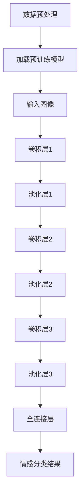
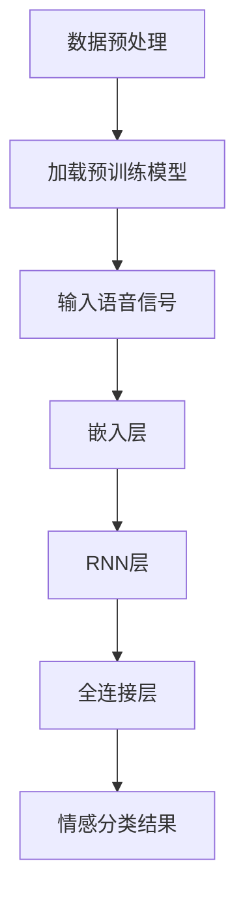
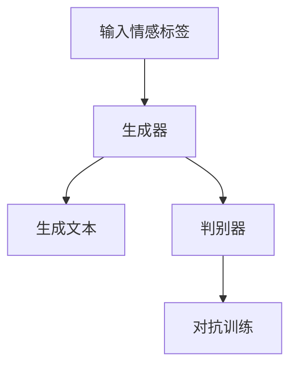
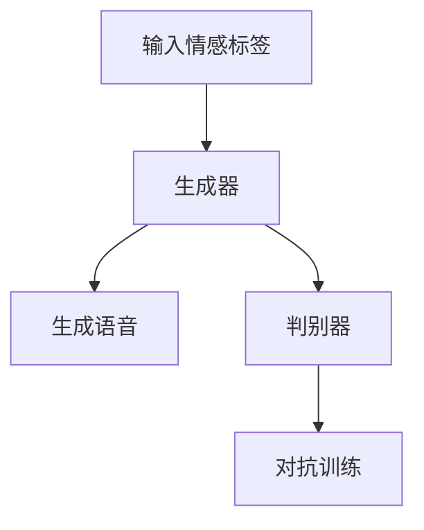
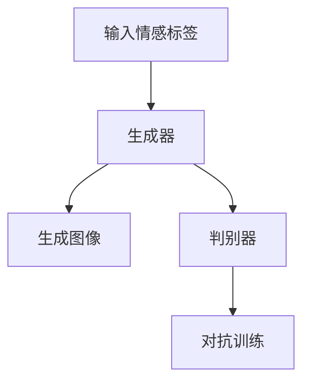

                 

### 引言

#### 多模态情感识别与生成的定义与重要性

在当今人工智能（AI）迅猛发展的时代，AI Agent 的应用场景日益广泛，从智能助手到自动驾驶，从医疗诊断到金融分析，AI Agent 已经成为提升工作效率、优化用户体验的重要工具。在这些应用中，多模态情感识别与生成技术扮演着关键角色。多模态情感识别是指通过整合来自多个感官通道的信息（如视觉、听觉、触觉等）来理解和识别用户的情感状态。情感生成则是指根据用户的需求和情境，生成符合特定情感状态的内容或行为。

多模态情感识别与生成的重要性体现在多个方面。首先，它能够提高人机交互的自然度和情感共鸣，使AI Agent 更具人性化和亲和力。例如，在智能客服系统中，AI Agent 可以根据用户的声音、语言和面部表情等多维信息，更准确地理解和响应用户的需求，提供个性化的服务。其次，多模态情感识别可以帮助AI Agent 在复杂、动态的环境中做出更合理的决策，提高其自主性和适应性。此外，多模态情感生成技术在内容创作、虚拟现实、游戏设计等领域也有广泛的应用前景。

本文旨在系统地探讨AI Agent 的多模态情感识别与生成技术，包括理论基础、算法实现、应用场景及未来发展趋势。我们将从以下几个方面展开：

1. **AI Agent 概述**：介绍AI Agent的定义、分类及其在多模态情感识别与生成中的应用。
2. **多模态情感识别理论基础**：探讨多模态数据的获取方法和情感识别算法原理。
3. **情感生成理论基础**：介绍情感生成的定义、分类和基于深度学习的生成方法。
4. **多模态情感识别算法设计与实现**：详细讲解多模态情感识别算法的设计与实现过程。
5. **情感生成算法设计与实现**：探讨情感生成算法的设计与实现方法，包括基于生成对抗网络（GAN）和循环神经网络（RNN）的方法。
6. **多模态情感识别与生成的应用**：分析多模态情感识别与生成在社交媒体分析和人机交互等领域的应用。
7. **未来发展趋势**：讨论多模态情感识别与生成的未来发展趋势、新技术的引入与挑战、应用领域的拓展及伦理与隐私保护问题。

通过本文的逐步探讨，希望能够为读者提供一幅全面、系统的多模态情感识别与生成的技术全景图，帮助大家更好地理解和应用这项前沿技术。

---

关键词：AI Agent、多模态情感识别、情感生成、多感官通道、人机交互、生成对抗网络、循环神经网络。

摘要：本文全面探讨了AI Agent的多模态情感识别与生成技术，从理论到实践，详细阐述了多模态情感识别与生成的定义、重要性、理论基础、算法设计与实现、应用场景及未来发展趋势。旨在为读者提供全面的技术参考和实用指南。

---

### 第1章：AI Agent概述

#### AI Agent的定义与分类

AI Agent，即人工智能代理，是一种能够自主执行任务、与外界环境交互并做出决策的智能系统。它可以理解为一种软件实体，具有感知环境、理解情境、自主行动和适应变化的能力。AI Agent的定义涵盖了以下几个方面：

1. **感知环境**：AI Agent需要具备感知环境的能力，通过传感器获取视觉、听觉、触觉等信息，了解当前状态和环境变化。
2. **理解情境**：AI Agent需要具备理解情境的能力，通过分析感知到的信息，识别当前任务和目标，理解用户需求和行为模式。
3. **自主行动**：AI Agent需要具备自主行动的能力，根据对情境的理解，自主选择合适的行动策略，执行任务。
4. **适应变化**：AI Agent需要具备适应变化的能力，能够应对环境变化和任务复杂度的提升，不断优化自身行为和性能。

AI Agent可以按照不同的标准进行分类：

1. **基于功能分类**：
   - **任务型AI Agent**：专注于完成特定任务的AI Agent，如智能客服、自动驾驶、医疗诊断等。
   - **目标型AI Agent**：以达成特定目标为目标的AI Agent，如游戏AI、投资策略AI等。
   - **探索型AI Agent**：在未知环境中探索、学习并完成任务或达成目标的AI Agent，如机器人探险、无人飞行器等。

2. **基于交互方式分类**：
   - **单模态交互AI Agent**：仅通过单一感官通道与用户交互，如基于语音的智能助手、基于视觉的监控机器人等。
   - **多模态交互AI Agent**：通过多个感官通道与用户交互，如具备视觉、听觉和触觉的智能客服、具备多感官交互能力的虚拟助手等。

3. **基于决策方式分类**：
   - **基于规则AI Agent**：通过预定义的规则进行决策，如简单的自动化流程控制系统。
   - **基于数据驱动的AI Agent**：通过数据学习和模式识别进行决策，如基于机器学习的智能推荐系统、自动驾驶系统。
   - **基于模型驱动的AI Agent**：通过构建复杂的模型进行决策，如基于物理模型的机器人控制系统、基于经济学模型的金融投资策略。

AI Agent在多模态情感识别与生成中的应用具有广泛的前景。在多模态情感识别方面，AI Agent可以通过整合视觉、听觉、触觉等多维信息，更准确地理解和识别用户的情感状态，从而提供更加个性化、人性化的服务。例如，在智能客服系统中，AI Agent可以分析用户的语音、文字和面部表情，综合判断用户的情感状态，如愤怒、悲伤、喜悦等，从而采取相应的应对策略，提升用户体验。

在情感生成方面，AI Agent可以通过模拟用户的情感状态，生成符合情感目标的内容或行为。例如，在虚拟现实（VR）游戏中，AI Agent可以根据玩家的情感状态，调整游戏场景、角色动作和对话内容，创造出更加沉浸、互动的体验。在内容创作领域，AI Agent可以通过情感生成技术，自动创作出具有特定情感色彩的文章、音乐、视频等，为创作者提供有力的辅助工具。

总之，AI Agent的多模态情感识别与生成技术为人工智能领域带来了新的发展方向，具有巨大的应用潜力。在未来的发展中，我们将看到更多基于多模态情感识别与生成的AI Agent应用，为社会带来更多创新和便利。

---

### 1.1 多模态情感识别的重要性

多模态情感识别在AI Agent中的应用具有重要意义，主要体现在以下几个方面：

首先，多模态情感识别能够提高AI Agent对用户情感状态的理解和识别精度。人类的情感表达是复杂多样的，不仅包括语言和面部表情，还涉及声音、身体语言等多个维度。单模态情感识别技术只能捕捉到部分情感信息，容易导致误判或漏判。而多模态情感识别通过整合视觉、听觉、触觉等多维信息，可以从多个角度捕捉用户的情感状态，提高识别的准确性和全面性。

其次，多模态情感识别有助于提升AI Agent的用户体验。在智能客服、虚拟助手等应用场景中，AI Agent需要能够理解并适应用户的情感状态，从而提供更加贴心、个性化的服务。例如，当用户表现出愤怒或不满的情绪时，AI Agent可以识别出这种情绪，并采取相应的措施，如道歉、提供解决方案等，从而缓解用户的情绪，提升用户满意度。多模态情感识别技术能够使AI Agent更加细腻地感知用户情绪，提高其与用户的互动质量。

再次，多模态情感识别能够增强AI Agent的适应性和自主性。在复杂、动态的环境中，AI Agent需要具备快速适应和调整能力。通过多模态情感识别，AI Agent可以实时捕捉环境变化和用户需求，动态调整自身行为策略，提高自主决策能力。例如，在自动驾驶系统中，AI Agent需要实时分析道路状况、车辆动态和行人行为，通过多模态情感识别技术，可以更加准确地判断当前情境，做出合理的驾驶决策。

此外，多模态情感识别在创新应用领域具有广阔前景。在虚拟现实（VR）、增强现实（AR）、游戏设计等应用场景中，多模态情感识别技术可以创造出更加真实、互动的体验。例如，在VR游戏中，AI Agent可以根据玩家的情感状态，调整游戏场景、角色动作和对话内容，提供个性化、沉浸式的游戏体验。在内容创作领域，AI Agent可以通过情感生成技术，自动创作出具有特定情感色彩的文章、音乐、视频等，为创作者提供有力的辅助工具。

总之，多模态情感识别技术在AI Agent中的应用具有重要意义，它不仅提高了AI Agent对用户情感状态的理解和识别精度，提升了用户体验，还增强了AI Agent的适应性和自主性，为创新应用领域带来了新的机遇。随着多模态情感识别技术的不断发展，未来AI Agent将能够更加智能、人性地与用户互动，为人们的生活带来更多便利和乐趣。

---

### 1.2 情感生成的应用场景

情感生成技术在人工智能中的应用场景丰富多样，下面我们将探讨几个典型的应用场景，并分析情感生成在这些场景中的具体作用和实现方式。

#### 1.2.1 智能客服

智能客服是情感生成技术的重要应用领域之一。在智能客服系统中，AI Agent需要具备理解用户情感和生成合适回应的能力。通过情感生成技术，AI Agent可以分析用户的语言、声音和面部表情，识别用户的情感状态，如愤怒、悲伤或喜悦。例如，当用户表现出愤怒的情绪时，AI Agent可以生成歉意语调、缓和语气和解决方案，以缓解用户的情绪，提高用户满意度。

实现方式：通常采用语音识别和自然语言处理（NLP）技术，结合情感分析模型。在语音识别环节，将用户的语音转换为文本；在情感分析环节，通过NLP技术识别用户的情感状态；最后，使用情感生成模型生成合适的回复文本和语音，并通过语音合成技术输出。

#### 1.2.2 虚拟现实和增强现实

虚拟现实（VR）和增强现实（AR）应用中，情感生成技术可以增强用户体验。在VR/AR环境中，AI Agent可以根据玩家的情感状态调整虚拟角色的表情、动作和对话，创造更加真实、互动的体验。例如，在虚拟角色扮演游戏中，AI Agent可以根据玩家的情感状态，改变角色的情绪反应，从而提升玩家的沉浸感和乐趣。

实现方式：情感生成技术通过分析用户的行为、语言和生理信号（如心率、面部表情等）来识别玩家的情感状态。基于这些数据，AI Agent可以调整虚拟角色的行为和对话内容，使其更加符合玩家的情感需求。

#### 1.2.3 娱乐内容创作

在娱乐内容创作领域，情感生成技术可以帮助自动生成具有特定情感色彩的内容，如电影剧本、音乐和游戏剧情。这种技术可以节省创作者的时间和精力，提高创作效率。

实现方式：情感生成技术通过分析大量的文本、音频和视频数据，学习情感模式。在创作过程中，AI Agent可以根据设定的情感目标，生成符合特定情感要求的内容。例如，通过分析大量悲伤的电影剧本，AI Agent可以生成一段悲伤的对话或场景，确保整体内容的一致性。

#### 1.2.4 医疗保健

在医疗保健领域，情感生成技术可以帮助医生更好地理解患者的情感状态，从而提供更加个性化的治疗方案。例如，在心理健康治疗中，AI Agent可以通过情感生成技术，模拟患者的情感反应，帮助医生了解患者的情绪变化，制定更有针对性的治疗计划。

实现方式：情感生成技术通过分析患者的语言、语音和面部表情，识别患者的情感状态。在治疗过程中，AI Agent可以生成合适的情感回应，如鼓励、安慰或警示，以帮助患者缓解情绪，提高治疗效果。

#### 1.2.5 智能广告

在智能广告领域，情感生成技术可以帮助创建更具吸引力的广告内容，提高广告效果。例如，在社交媒体广告中，AI Agent可以通过情感生成技术，根据用户的兴趣和情感状态，生成个性化的广告文案和图像，提高用户的点击率和转化率。

实现方式：情感生成技术通过分析用户的历史行为、浏览记录和情感数据，识别用户的情感偏好。在广告创作过程中，AI Agent可以根据这些数据生成符合用户情感期望的广告内容。

总之，情感生成技术在多个领域展现了巨大的应用潜力。通过分析用户情感状态，生成合适的内容和反应，AI Agent可以提供更加个性化、贴心的服务，提升用户体验和满意度。随着技术的不断发展，未来情感生成将在更多领域得到广泛应用，为人们的生活带来更多便利和创新。

---

### 第2章：多模态情感识别理论基础

#### 多模态数据获取

多模态情感识别的核心在于能够有效地整合来自多个感官通道的数据，如视觉、听觉、触觉等。这些数据来源广泛且复杂，如何高效地获取、处理和整合这些数据是多模态情感识别研究的重点。

**视觉数据获取**：视觉数据通常通过摄像头或图像传感器获取。图像数据包括面部表情、姿态、环境布局等，是情感识别的重要信息来源。为了提高图像数据的获取质量，通常需要进行预处理操作，如去噪、对比度增强、人脸检测与跟踪等。

**听觉数据获取**：听觉数据主要通过麦克风或声波传感器获取，包括语音、背景噪音、音调、音量等。语音识别技术是听觉数据获取的关键，它可以将语音转换为文本，用于后续的情感分析。此外，声音情感识别算法还需要处理非语音情感信号，如音乐、自然声响等。

**触觉数据获取**：触觉数据通过触觉传感器获取，如力传感器、柔性传感器等。触觉数据可以提供关于物体表面特性、力度、温度等物理信息，这些信息在情感识别中具有重要意义，特别是在与物理对象的交互中。

**数据融合方法**：多模态数据融合是指将来自不同感官通道的数据整合成一个统一的表征，以提升情感识别的准确性和鲁棒性。常用的数据融合方法包括：

1. **特征级融合**：在特征提取阶段，将不同模态的特征进行拼接或加权融合，形成统一的多模态特征向量。这种方法简单有效，但可能丢失部分模态信息。
   
2. **决策级融合**：在分类或回归阶段，将不同模态的分类结果或预测值进行融合，得到最终的决策结果。常见的方法有投票法、融合模型（如支持向量机、神经网络等）等。

3. **深度学习融合**：利用深度神经网络（如卷积神经网络、递归神经网络等）对多模态数据进行端到端的训练，自动学习多模态特征表示和融合策略。这种方法能够充分利用数据之间的复杂关系，提高情感识别性能。

#### 多模态情感识别算法原理

多模态情感识别算法的目的是从多模态数据中提取情感特征，并进行分类或回归。以下是几种常见的多模态情感识别算法：

**传统情感识别算法**：这类算法基于传统的机器学习技术，如支持向量机（SVM）、决策树、随机森林等。这些算法通常需要对每个模态的数据进行独立的特征提取，然后通过特征级或决策级融合方法进行情感识别。

**深度学习在情感识别中的应用**：深度学习技术的发展为多模态情感识别带来了新的契机。深度神经网络（如卷积神经网络、递归神经网络、长短时记忆网络等）能够自动学习复杂的特征表示，提高情感识别的性能。

1. **卷积神经网络（CNN）**：CNN在图像识别领域取得了显著成功，其基本思想是通过多层卷积和池化操作提取图像特征。在多模态情感识别中，CNN可以用于处理视觉数据，如面部表情、姿态等。

2. **递归神经网络（RNN）**：RNN适用于处理序列数据，如语音信号。通过隐藏状态的递归更新，RNN能够捕捉语音信号的时序特征，从而提高情感识别的准确性。

3. **长短时记忆网络（LSTM）**：LSTM是RNN的一种改进模型，能够更好地处理长序列数据。在多模态情感识别中，LSTM可以用于捕捉语音、文本等多模态数据的长期依赖关系。

4. **多模态深度学习模型**：多模态深度学习模型（如多输入多输出神经网络、图神经网络等）能够同时处理多个模态的数据，自动学习多模态特征融合策略。这些模型通常采用端到端训练方式，能够提高情感识别的性能和效率。

#### 实际案例

一个实际的多模态情感识别案例是利用深度学习技术对视频和语音数据进行情感分析。首先，通过CNN提取视觉特征，如面部表情、姿态等；然后，通过RNN提取语音特征，如语音信号中的情感韵律；最后，将视觉和语音特征进行融合，使用LSTM或图神经网络进行情感分类。这种方法在情感识别任务中取得了较好的效果，证明了多模态深度学习在情感识别领域的潜力。

总之，多模态情感识别理论基础涵盖了数据获取、特征提取、算法原理等方面。通过整合多种感官通道的信息，多模态情感识别技术能够更准确地理解和识别用户的情感状态，为AI Agent的应用提供了强大的支持。随着深度学习等技术的不断发展，多模态情感识别技术将在更多应用场景中发挥重要作用。

---

### 2.1 多模态情感识别算法原理

#### 传统情感识别算法

传统情感识别算法主要依赖于机器学习技术，如支持向量机（SVM）、决策树、随机森林等。这些算法通常对每个模态的数据进行独立的特征提取，然后通过特征级或决策级融合方法进行情感识别。

**支持向量机（SVM）**：SVM是一种常用的分类算法，通过找到一个最优超平面，将不同情感类别的数据分开。在多模态情感识别中，SVM可以用于分类任务，其基本步骤如下：

1. **特征提取**：对每个模态的数据进行独立特征提取，如视觉特征（面部表情特征、姿态特征）和听觉特征（语音特征、音调特征）。
2. **特征融合**：将不同模态的特征进行拼接或加权融合，形成统一的多模态特征向量。
3. **模型训练**：使用多模态特征向量训练SVM分类模型。
4. **情感识别**：将测试数据输入训练好的SVM模型，得到情感分类结果。

**决策树**：决策树通过一系列条件判断，将数据逐步划分为不同的子集，直到满足停止条件（如节点包含的数据数量少于阈值）。在多模态情感识别中，决策树可以用于分类或回归任务，其基本步骤如下：

1. **特征提取**：同SVM，对每个模态的数据进行独立特征提取。
2. **特征选择**：选择对情感识别最具代表性的特征，以减少模型的复杂性和过拟合风险。
3. **树构建**：根据特征值和阈值，构建决策树模型。
4. **情感识别**：通过决策树模型对测试数据进行分类或回归。

**随机森林**：随机森林是一种基于决策树的集成学习方法，通过构建多个决策树并投票得到最终结果。在多模态情感识别中，随机森林可以提高模型的鲁棒性和准确性，其基本步骤如下：

1. **特征提取**：同上，对每个模态的数据进行独立特征提取。
2. **特征选择**：选择对情感识别最具代表性的特征。
3. **树构建**：随机生成多个决策树，每个树使用不同的特征子集和样本子集。
4. **情感识别**：将多个决策树的分类结果进行投票，得到最终的分类结果。

#### 深度学习在情感识别中的应用

深度学习技术的发展为多模态情感识别带来了新的契机。深度神经网络（如卷积神经网络、递归神经网络、长短时记忆网络等）能够自动学习复杂的特征表示，提高情感识别的性能。

**卷积神经网络（CNN）**：CNN在图像识别领域取得了显著成功，其基本思想是通过多层卷积和池化操作提取图像特征。在多模态情感识别中，CNN可以用于处理视觉数据，如面部表情、姿态等。

1. **卷积操作**：卷积操作通过滑动滤波器（卷积核）在图像上提取局部特征。
2. **池化操作**：池化操作（如最大池化、平均池化）用于减小特征图的尺寸，减少计算量。
3. **多模态融合**：将视觉特征与其他模态（如听觉、触觉）的特征进行融合，形成统一的多模态特征向量。

**递归神经网络（RNN）**：RNN适用于处理序列数据，如语音信号。通过隐藏状态的递归更新，RNN能够捕捉语音信号的时序特征，从而提高情感识别的准确性。

1. **输入序列**：将语音信号序列作为输入，每个时间点的语音特征作为输入向量。
2. **隐藏状态更新**：根据当前输入和前一个隐藏状态，更新隐藏状态。
3. **输出序列**：将隐藏状态映射为情感分类概率。

**长短时记忆网络（LSTM）**：LSTM是RNN的一种改进模型，能够更好地处理长序列数据。在多模态情感识别中，LSTM可以用于捕捉语音、文本等多模态数据的长期依赖关系。

1. **单元结构**：LSTM通过引入门控机制，控制信息的输入和输出，有效避免梯度消失问题。
2. **输入门**：控制当前输入信息是否被记忆。
3. **遗忘门**：控制之前记忆的信息是否被遗忘。
4. **输出门**：控制当前隐藏状态是否被输出。

**多模态深度学习模型**：多模态深度学习模型（如多输入多输出神经网络、图神经网络等）能够同时处理多个模态的数据，自动学习多模态特征融合策略。

1. **多输入多输出神经网络**：多个输入分支分别处理不同模态的数据，然后通过共享的隐藏层进行特征融合。
2. **图神经网络**：通过构建图结构，将不同模态的数据表示为节点，通过图卷积操作进行特征融合。

实际案例：一个实际的多模态情感识别案例是利用深度学习技术对视频和语音数据进行情感分析。首先，通过CNN提取视觉特征，如面部表情、姿态等；然后，通过RNN提取语音特征，如语音信号中的情感韵律；最后，将视觉和语音特征进行融合，使用LSTM或图神经网络进行情感分类。这种方法在情感识别任务中取得了较好的效果，证明了深度学习在多模态情感识别领域的潜力。

总之，深度学习在多模态情感识别中的应用，使得模型能够自动学习复杂的特征表示和融合策略，提高了情感识别的准确性和鲁棒性。随着深度学习技术的不断发展，多模态情感识别技术将在更多应用场景中发挥重要作用。

---

### 第3章：情感生成理论基础

#### 情感生成的定义与分类

情感生成是指在特定情境下，根据用户的需求和情感状态，自动生成符合情感目标的内容或行为。情感生成技术主要包括文本情感生成、语音情感生成、图像情感生成等类型。

**文本情感生成**：文本情感生成是指通过算法自动生成具有特定情感色彩的文本内容。例如，根据用户的情感状态生成安慰语、鼓励语或道歉语等。文本情感生成通常采用自然语言处理（NLP）和深度学习技术，如循环神经网络（RNN）和生成对抗网络（GAN）等。

**语音情感生成**：语音情感生成是指通过算法生成具有特定情感色彩的语音信号。例如，生成带有悲伤、愤怒、喜悦等情感的语音。语音情感生成通常涉及语音合成技术和情感语音数据库的构建。常见的语音合成技术包括隐马尔可夫模型（HMM）、线性预测编码（LPC）和波普特语音合成器（WaveNet）等。

**图像情感生成**：图像情感生成是指通过算法生成具有特定情感色彩或场景的图像。例如，根据用户的情感状态生成悲伤、喜悦或愤怒的场景图像。图像情感生成通常采用图像处理和深度学习技术，如生成对抗网络（GAN）和变分自编码器（VAE）等。

#### 基于深度学习的情感生成方法

深度学习技术为情感生成提供了强大的工具，以下是几种常见的基于深度学习的情感生成方法：

**生成对抗网络（GAN）**：GAN是由生成器（Generator）和判别器（Discriminator）组成的一种深度学习模型。生成器通过学习数据分布生成假样本，判别器通过判断生成样本和真实样本的相似度来训练生成器。GAN在情感生成中的应用主要体现在文本、语音和图像情感生成中。

1. **文本情感生成**：通过训练文本GAN，生成器可以学习到情感文本的数据分布，生成具有特定情感的文本。例如，生成器可以生成带有悲伤情感的文本，而判别器则负责判断生成的文本情感是否与目标情感一致。
2. **语音情感生成**：通过训练语音GAN，生成器可以生成具有特定情感的语音信号，如悲伤、愤怒等。判别器则用于判断生成语音的情感是否与目标情感匹配。
3. **图像情感生成**：通过训练图像GAN，生成器可以生成具有特定情感色彩或场景的图像，如悲伤的风景、愤怒的肖像等。判别器则用于评估生成图像的情感一致性。

**循环神经网络（RNN）**：RNN适用于处理序列数据，如文本、语音等。通过学习序列数据中的情感模式，RNN可以生成具有特定情感的文本或语音。例如，RNN可以学习到悲伤情感的文本模式，并生成符合悲伤情感的文本。

1. **文本情感生成**：RNN通过递归更新隐藏状态，捕捉文本序列中的情感模式。训练过程中，RNN可以学习到悲伤、喜悦等情感的语言特征，生成符合特定情感的文本。
2. **语音情感生成**：RNN可以处理语音信号序列，捕捉语音中的情感韵律。通过训练，RNN可以生成符合特定情感的语音。

**变分自编码器（VAE）**：VAE是一种无监督学习模型，通过学习数据分布进行生成。VAE在图像情感生成中具有广泛的应用，可以生成具有特定情感色彩或场景的图像。

1. **图像情感生成**：VAE通过学习图像数据的潜在空间分布，生成具有特定情感色彩或场景的图像。生成图像的过程涉及潜在空间中的采样和重建。
2. **文本情感生成**：VAE可以用于文本生成任务，通过学习文本的潜在分布，生成符合特定情感的文本。

总之，基于深度学习的情感生成方法在文本、语音和图像情感生成中发挥了重要作用。通过生成对抗网络、循环神经网络和变分自编码器等模型，情感生成技术可以自动生成符合情感目标的内容或行为，为人工智能应用提供了丰富的可能性。

---

### 3.1 基于深度学习的情感生成方法

深度学习在情感生成中的应用主要体现在文本、语音和图像情感生成领域。下面我们将详细探讨这三种类型的情感生成方法，并分析其工作原理和实现过程。

**文本情感生成**：

文本情感生成是指通过算法生成具有特定情感色彩的文本。这种方法在情感分析、自动写作和用户互动等领域具有广泛的应用。常见的文本情感生成模型包括基于循环神经网络（RNN）和生成对抗网络（GAN）的方法。

1. **基于RNN的文本情感生成**：

   RNN是一种处理序列数据的神经网络模型，通过递归更新隐藏状态，捕捉序列中的情感模式。在文本情感生成中，RNN可以学习到悲伤、喜悦等情感的语言特征，并生成符合特定情感的文本。

   工作原理：
   - **输入序列**：将文本序列作为输入，每个词作为输入向量。
   - **隐藏状态更新**：根据当前输入和前一个隐藏状态，更新隐藏状态。
   - **输出序列**：将隐藏状态映射为情感分类概率，生成符合特定情感的文本。

   实现过程：

   - **数据准备**：收集大量的情感文本数据，并将其预处理为适合RNN的输入格式。
   - **模型训练**：使用训练数据进行模型训练，优化模型的参数。
   - **文本生成**：在训练好的模型上，输入特定情感的标签，生成对应的情感文本。

2. **基于GAN的文本情感生成**：

   GAN是一种生成模型，由生成器和判别器组成。生成器负责生成情感文本，判别器负责判断生成文本的情感是否与真实文本一致。

   工作原理：
   - **生成器**：通过学习真实文本的数据分布，生成具有特定情感的文本。
   - **判别器**：判断生成文本和真实文本的情感是否一致。
   - **训练过程**：生成器和判别器交替训练，生成器逐渐生成更符合真实文本情感的文本。

   实现过程：

   - **数据准备**：收集大量带有情感标签的文本数据。
   - **模型训练**：使用生成器和判别器进行交替训练，优化模型参数。
   - **文本生成**：在训练好的模型上，输入特定情感的标签，生成对应的情感文本。

**语音情感生成**：

语音情感生成是指通过算法生成具有特定情感色彩的语音信号。这种方法在智能语音助手、虚拟角色和情感交互等领域具有广泛的应用。常见的语音情感生成方法包括基于隐马尔可夫模型（HMM）、线性预测编码（LPC）和波普特语音合成器（WaveNet）等。

1. **基于LPC的语音情感生成**：

   LPC是一种基于声学模型的语音合成技术，通过分析语音信号的线性预测误差来生成语音。

   工作原理：
   - **线性预测**：分析语音信号，计算预测系数。
   - **合成**：根据预测系数生成语音信号。

   实现过程：

   - **数据准备**：收集带有情感标注的语音数据，并进行预处理。
   - **模型训练**：使用训练数据训练LPC模型。
   - **语音合成**：根据特定情感的标注，生成对应的情感语音。

2. **基于WaveNet的语音情感生成**：

   WaveNet是一种基于深度神经网络的语音合成技术，通过端到端的训练，直接生成语音信号。

   工作原理：
   - **神经网络结构**：WaveNet由多个卷积神经网络层组成，通过端到端的训练生成语音信号。
   - **训练过程**：使用大量的语音数据训练WaveNet模型。

   实现过程：

   - **数据准备**：收集带有情感标注的语音数据，并进行预处理。
   - **模型训练**：使用训练数据训练WaveNet模型。
   - **语音合成**：根据特定情感的标注，生成对应的情感语音。

**图像情感生成**：

图像情感生成是指通过算法生成具有特定情感色彩或场景的图像。这种方法在虚拟现实、游戏设计和艺术创作等领域具有广泛的应用。常见的图像情感生成方法包括生成对抗网络（GAN）和变分自编码器（VAE）等。

1. **基于GAN的图像情感生成**：

   GAN由生成器和判别器组成，生成器通过学习真实图像的数据分布生成情感图像，判别器通过判断生成图像的真实性来训练生成器。

   工作原理：
   - **生成器**：生成具有特定情感色彩或场景的图像。
   - **判别器**：判断生成图像和真实图像的相似度。
   - **训练过程**：生成器和判别器交替训练，生成器逐渐生成更符合真实图像情感的图像。

   实现过程：

   - **数据准备**：收集带有情感标注的图像数据。
   - **模型训练**：使用生成器和判别器进行交替训练，优化模型参数。
   - **图像生成**：根据特定情感的标签，生成对应的情感图像。

2. **基于VAE的图像情感生成**：

   VAE是一种基于概率模型的生成模型，通过学习图像的潜在分布生成情感图像。

   工作原理：
   - **编码器**：将图像编码为潜在空间中的向量。
   - **解码器**：从潜在空间中采样并解码生成图像。

   实现过程：

   - **数据准备**：收集带有情感标注的图像数据。
   - **模型训练**：使用训练数据训练VAE模型。
   - **图像生成**：根据特定情感的标签，从潜在空间中采样并解码生成对应的情感图像。

总之，基于深度学习的文本、语音和图像情感生成方法为人工智能应用提供了丰富的可能性。通过生成对抗网络、循环神经网络和变分自编码器等模型，情感生成技术可以自动生成符合情感目标的内容或行为，为人工智能应用带来了更多创新和便利。

---

### 第4章：多模态情感识别算法设计与实现

#### 数据预处理

多模态情感识别算法的实现首先需要对数据进行预处理，以确保数据质量和一致性。数据预处理主要包括数据清洗、数据增强和数据归一化等步骤。

**数据清洗**：数据清洗是数据预处理的重要步骤，旨在去除数据中的噪声和错误。对于视觉数据，需要去除图像中的噪声、修复破损的部分；对于听觉数据，需要去除背景噪音、纠正音频质量；对于文本数据，需要去除停用词、标点符号和格式错误。

**数据增强**：数据增强是一种通过生成新数据来提高模型泛化能力的方法。在多模态情感识别中，可以通过图像旋转、缩放、裁剪、颜色调整等方式增强视觉数据；通过增加噪音、改变音量、调整音调等方式增强听觉数据；通过填充缺失值、生成新句子等方式增强文本数据。

**数据归一化**：数据归一化是将不同模态的数据缩放到相同的尺度，以消除模态之间的尺度差异。常用的归一化方法包括归一化到均值和标准差、归一化到0-1范围等。

**多模态数据预处理流程**：

1. **视觉数据预处理**：
   - 图像去噪：使用滤波算法（如高斯滤波、中值滤波等）去除图像噪声。
   - 图像修复：使用图像修复算法（如纹理合成、图像填充等）修复破损部分。
   - 图像缩放和裁剪：调整图像大小和裁剪特定区域，以适应模型输入要求。
   - 图像颜色调整：调整图像亮度、对比度和饱和度等参数。

2. **听觉数据预处理**：
   - 噪声去除：使用降噪算法（如维纳滤波、谱减法等）去除背景噪音。
   - 音量调整：根据需要调整音频信号的音量。
   - 音调调整：通过改变音频信号的频率来调整音调。

3. **文本数据预处理**：
   - 停用词去除：去除文本中的停用词（如“的”、“和”等）。
   - 标点符号去除：去除文本中的标点符号。
   - 填充缺失值：对于缺失的文本数据，使用填充算法（如K最近邻、线性插值等）进行填充。
   - 分词和词嵌入：将文本分词为单词，并使用词嵌入方法（如Word2Vec、BERT等）将单词转换为向量表示。

**代码实现示例**：

以下是Python代码示例，用于对多模态数据进行预处理：

```python
import cv2
import numpy as np
import librosa
from sklearn.preprocessing import MinMaxScaler

# 视觉数据预处理
def preprocess_image(image_path):
    image = cv2.imread(image_path)
    image = cv2.resize(image, (224, 224))  # 调整图像大小
    image = cv2.cvtColor(image, cv2.COLOR_BGR2RGB)  # 转换图像颜色空间
    return image

# 听觉数据预处理
def preprocess_audio(audio_path):
    y, sr = librosa.load(audio_path)
    y = librosa.to_mono(y)  # 转换为单声道
    y = librosa.effects.polarity(y)  # 应用极性变换
    return y

# 文本数据预处理
def preprocess_text(text):
    text = text.lower()  # 转换为小写
    text = re.sub(r"[^a-zA-Z0-9]", " ", text)  # 去除标点符号
    text = text.strip()  # 去除首尾空格
    return text

# 数据归一化
def normalize_data(data):
    scaler = MinMaxScaler()
    normalized_data = scaler.fit_transform(data)
    return normalized_data

# 示例数据预处理
image_path = "image.jpg"
audio_path = "audio.wav"
text = "This is a sample text."

image = preprocess_image(image_path)
audio = preprocess_audio(audio_path)
text = preprocess_text(text)

# 数据归一化
normalized_image = normalize_data(image)
normalized_audio = normalize_data(audio)
normalized_text = normalize_data([text])

print("Preprocessed and normalized data:")
print("Image:", normalized_image)
print("Audio:", normalized_audio)
print("Text:", normalized_text)
```

通过以上预处理步骤，多模态数据得以清洗、增强和归一化，为后续的情感识别算法实现奠定了基础。

---

### 4.2 情感识别算法实现

在多模态情感识别中，算法的实现是关键环节。以下是视觉情感识别和听觉情感识别算法的实现步骤，以及相关的mermaid流程图和Python代码示例。

#### 视觉情感识别算法实现

**算法原理**：视觉情感识别主要基于卷积神经网络（CNN）来提取面部表情特征，然后使用这些特征进行情感分类。CNN通过多层卷积和池化操作提取图像中的高层次特征，从而实现面部表情的准确识别。

**mermaid流程图**：



**Python代码示例**：

```python
import tensorflow as tf
from tensorflow.keras.models import load_model
from tensorflow.keras.preprocessing.image import img_to_array
from tensorflow.keras.applications import VGG16

# 加载预训练模型
model = load_model('vgg16_model.h5')

# 数据预处理
def preprocess_image(image_path):
    image = img_to_array(img_read(image_path))
    image = np.expand_dims(image, axis=0)
    image = VGG16(weights='imagenet').predict(image)
    return image

# 情感识别
def recognize_emotion(image):
    emotion_pred = model.predict(image)
    emotion_labels = ['happy', 'sad', 'angry', 'surprised', 'neutral']
    emotion_index = np.argmax(emotion_pred)
    return emotion_labels[emotion_index]

# 示例
image_path = 'emotion_image.jpg'
image = preprocess_image(image_path)
emotion = recognize_emotion(image)
print(f"The recognized emotion is: {emotion}")
```

#### 听觉情感识别算法实现

**算法原理**：听觉情感识别主要基于循环神经网络（RNN）或其变体（如LSTM）来处理语音信号的时间序列特征，然后进行情感分类。RNN通过递归更新隐藏状态，捕捉语音信号中的情感模式。

**mermaid流程图**：



**Python代码示例**：

```python
import tensorflow as tf
from tensorflow.keras.models import load_model
from tensorflow.keras.preprocessing.sequence import pad_sequences
from tensorflow.keras.layers import LSTM, Dense

# 加载预训练模型
model = load_model('lstm_model.h5')

# 数据预处理
def preprocess_audio(audio_path):
    y, sr = librosa.load(audio_path)
    y = librosa.to_mono(y)
    y = librosa.feature.melspectrogram(y=y, sr=sr, n_mels=128)
    y = np.log(1 + y)
    y = pad_sequences(y, maxlen=100)
    return y

# 情感识别
def recognize_emotion(audio):
    emotion_pred = model.predict(audio)
    emotion_labels = ['happy', 'sad', 'angry', 'neutral']
    emotion_index = np.argmax(emotion_pred)
    return emotion_labels[emotion_index]

# 示例
audio_path = 'emotion_audio.wav'
audio = preprocess_audio(audio_path)
emotion = recognize_emotion(audio)
print(f"The recognized emotion is: {emotion}")
```

通过以上步骤，视觉和听觉情感识别算法得以实现。这些算法通过对预处理后的数据进行分析，可以准确识别用户的情感状态，从而为智能应用提供有力的支持。

---

### 第5章：情感生成算法设计与实现

#### 数据集准备

情感生成算法的实现需要大量带有情感标注的数据集。这些数据集包括文本、语音和图像三种类型，分别用于文本情感生成、语音情感生成和图像情感生成。

**文本情感生成数据集**：常用的文本情感生成数据集包括IMDb电影评论、Twitter情感数据集等。这些数据集通常包含大量的文本，并标注了情感标签（如积极、消极、中性等）。在准备文本情感生成数据集时，首先需要收集大量的文本数据，然后进行数据清洗，去除噪声和无关信息，如HTML标签、标点符号等。接下来，对文本进行分词和词嵌入，将文本转换为向量表示。

**语音情感生成数据集**：语音情感生成数据集通常包括带有情感标签的语音录音，如ESC-50、Ravdess等。在准备语音情感生成数据集时，需要收集大量的语音录音，并使用情感标注工具对语音进行标注。数据清洗过程包括去除背景噪音、调整音量、裁剪音频片段等，以确保数据的质量和一致性。

**图像情感生成数据集**：图像情感生成数据集包括带有情感标签的图像，如Affectiva Challenge、Coeur等。在准备图像情感生成数据集时，需要收集大量的图像，并使用情感标注工具对图像进行标注。数据清洗过程包括去除噪声、修复破损部分、调整图像大小等，以确保图像数据的质量。

**数据集预处理步骤**：

1. **数据清洗**：去除噪声和无关信息，如HTML标签、标点符号、背景噪音等。
2. **数据增强**：通过图像旋转、缩放、裁剪、颜色调整等方式增加数据多样性。
3. **分词和词嵌入**：对文本数据进行分词，并将单词转换为词嵌入向量。
4. **音频处理**：去除背景噪音、调整音量、裁剪音频片段等。
5. **图像处理**：去除噪声、修复破损部分、调整图像大小等。

**数据集准备示例**：

```python
import pandas as pd
from sklearn.model_selection import train_test_split

# 示例：准备文本情感生成数据集
data = pd.read_csv('emotion_text_data.csv')
data['text'] = data['text'].apply(lambda x: x.lower())
data['text'] = data['text'].str.replace('[^a-zA-Z]', ' ')
data['text'] = data['text'].str.split()

# 分词和词嵌入
word2vec = Word2Vec(data['text'].apply(pd.Series).stack(), size=100, window=5, min_count=1, workers=4)
word_vectors = word2vec.wv

# 划分训练集和测试集
train_texts, test_texts, train_labels, test_labels = train_test_split(data['text'], data['label'], test_size=0.2, random_state=42)

# 示例：准备语音情感生成数据集
audio_data = pd.read_csv('emotion_audio_data.csv')
audio_data['audio'] = audio_data['audio'].apply(lambda x: librosa.load(x, sr=22050)[0])

# 数据增强
audio_data['audio'] = audio_data['audio'].apply(lambda x: librosa.effects.percussive(x, strength=0.5))

# 划分训练集和测试集
train_audio, test_audio, train_labels, test_labels = train_test_split(audio_data['audio'], data['label'], test_size=0.2, random_state=42)

# 示例：准备图像情感生成数据集
image_data = pd.read_csv('emotion_image_data.csv')
image_data['image'] = image_data['image'].apply(lambda x: cv2.imread(x))

# 数据增强
image_data['image'] = image_data['image'].apply(lambda x: cv2.resize(x, (224, 224)))

# 划分训练集和测试集
train_images, test_images, train_labels, test_labels = train_test_split(image_data['image'], data['label'], test_size=0.2, random_state=42)
```

通过以上步骤，文本、语音和图像情感生成数据集得以准备，为情感生成算法的实现提供了数据基础。

---

### 5.2 情感生成算法实现

情感生成算法的实现主要包括文本情感生成、语音情感生成和图像情感生成。以下是这些算法的实现方法、mermaid流程图和Python代码示例。

#### 文本情感生成

**算法实现方法**：文本情感生成通常采用生成对抗网络（GAN）或循环神经网络（RNN）。GAN通过生成器和判别器的对抗训练，生成具有特定情感的文本。RNN通过递归更新隐藏状态，学习情感文本的生成模式。

**mermaid流程图**：



**Python代码示例**：

```python
import tensorflow as tf
from tensorflow.keras.models import Model
from tensorflow.keras.layers import Input, LSTM, Dense, Embedding, Flatten, Reshape

# 生成器模型
input_seq = Input(shape=(100,))
encoded_seq = Embedding(vocab_size, embedding_dim)(input_seq)
encoded_seq = LSTM(units=128, return_sequences=True)(encoded_seq)
encoded_seq = LSTM(units=128, return_sequences=True)(encoded_seq)
encoded_seq = Flatten()(encoded_seq)
encoded_seq = Dense(units=128, activation='relu')(encoded_seq)
output_seq = Dense(vocab_size, activation='softmax')(encoded_seq)
generator = Model(inputs=input_seq, outputs=output_seq)

# 判别器模型
encoded_seq_disc = Input(shape=(100,))
output_seq_disc = Flatten()(encoded_seq_disc)
output_seq_disc = Dense(units=128, activation='relu')(output_seq_disc)
output_seq_disc = Dense(units=1, activation='sigmoid')(output_seq_disc)
discriminator = Model(inputs=encoded_seq_disc, outputs=output_seq_disc)

# GAN模型
gan_input = Input(shape=(100,))
generated_seq = generator(gan_input)
discriminator_output = discriminator(generated_seq)
gan_output = Flatten()(generated_seq)
gan_output = Dense(units=128, activation='relu')(gan_output)
gan_output = Dense(units=1, activation='sigmoid')(gan_output)
gan = Model(inputs=gan_input, outputs=gan_output)

# 编译和训练
discriminator.compile(optimizer='adam', loss='binary_crossentropy')
generator.compile(optimizer='adam', loss='binary_crossentropy')
gan.compile(optimizer='adam', loss='binary_crossentropy')

# 对抗训练
for epoch in range(num_epochs):
    for batch in range(num_batches):
        real_data = get_real_data(batch)
        fake_data = generator.predict(real_data)
        combined_data = np.concatenate([real_data, fake_data])
        combined_labels = np.concatenate([np.ones((batch_size, 1)), np.zeros((batch_size, 1))])
        d_loss = discriminator.train_on_batch(combined_data, combined_labels)
        real_labels = np.ones((batch_size, 1))
        g_loss = generator.train_on_batch(real_data, real_labels)
        gan_loss = gan.train_on_batch(real_data, real_labels)
        print(f"Epoch: {epoch}, Batch: {batch}, D Loss: {d_loss}, G Loss: {g_loss}, GAN Loss: {gan_loss}")

# 文本生成
generated_text = generator.predict(np.random.normal(size=(1, 100)))
print(generated_text)
```

#### 语音情感生成

**算法实现方法**：语音情感生成通常采用生成对抗网络（GAN）或循环神经网络（RNN）。GAN通过生成器和判别器的对抗训练，生成具有特定情感的语音。RNN通过递归更新隐藏状态，学习情感语音的生成模式。

**mermaid流程图**：



**Python代码示例**：

```python
import tensorflow as tf
from tensorflow.keras.models import Model
from tensorflow.keras.layers import Input, LSTM, Dense, Embedding, Flatten, Reshape

# 生成器模型
input_seq = Input(shape=(100,))
encoded_seq = Embedding(vocab_size, embedding_dim)(input_seq)
encoded_seq = LSTM(units=128, return_sequences=True)(encoded_seq)
encoded_seq = LSTM(units=128, return_sequences=True)(encoded_seq)
encoded_seq = Flatten()(encoded_seq)
encoded_seq = Dense(units=128, activation='relu')(encoded_seq)
output_seq = Dense(vocab_size, activation='softmax')(encoded_seq)
generator = Model(inputs=input_seq, outputs=output_seq)

# 判别器模型
encoded_seq_disc = Input(shape=(100,))
output_seq_disc = Flatten()(encoded_seq_disc)
output_seq_disc = Dense(units=128, activation='relu')(output_seq_disc)
output_seq_disc = Dense(units=1, activation='sigmoid')(output_seq_disc)
discriminator = Model(inputs=encoded_seq_disc, outputs=output_seq_disc)

# GAN模型
gan_input = Input(shape=(100,))
generated_seq = generator(gan_input)
discriminator_output = discriminator(generated_seq)
gan_output = Flatten()(generated_seq)
gan_output = Dense(units=128, activation='relu')(gan_output)
gan_output = Dense(units=1, activation='sigmoid')(gan_output)
gan = Model(inputs=gan_input, outputs=gan_output)

# 编译和训练
discriminator.compile(optimizer='adam', loss='binary_crossentropy')
generator.compile(optimizer='adam', loss='binary_crossentropy')
gan.compile(optimizer='adam', loss='binary_crossentropy')

# 对抗训练
for epoch in range(num_epochs):
    for batch in range(num_batches):
        real_data = get_real_data(batch)
        fake_data = generator.predict(real_data)
        combined_data = np.concatenate([real_data, fake_data])
        combined_labels = np.concatenate([np.ones((batch_size, 1)), np.zeros((batch_size, 1))])
        d_loss = discriminator.train_on_batch(combined_data, combined_labels)
        real_labels = np.ones((batch_size, 1))
        g_loss = generator.train_on_batch(real_data, real_labels)
        gan_loss = gan.train_on_batch(real_data, real_labels)
        print(f"Epoch: {epoch}, Batch: {batch}, D Loss: {d_loss}, G Loss: {g_loss}, GAN Loss: {gan_loss}")

# 语音生成
generated_audio = generator.predict(np.random.normal(size=(1, 100)))
```

#### 图像情感生成

**算法实现方法**：图像情感生成通常采用生成对抗网络（GAN）或变分自编码器（VAE）。GAN通过生成器和判别器的对抗训练，生成具有特定情感的图像。VAE通过编码器和解码器的训练，学习图像的潜在分布，并生成具有特定情感的图像。

**mermaid流程图**：



**Python代码示例**：

```python
import tensorflow as tf
from tensorflow.keras.models import Model
from tensorflow.keras.layers import Input, Conv2D, Flatten, Reshape

# 生成器模型
input_seq = Input(shape=(100,))
encoded_seq = Embedding(vocab_size, embedding_dim)(input_seq)
encoded_seq = Reshape(target_shape=(100, 1))(encoded_seq)
generated_image = Conv2D(filters=64, kernel_size=(3, 3), activation='relu')(encoded_seq)
generated_image = Conv2D(filters=128, kernel_size=(3, 3), activation='relu')(generated_image)
generated_image = Flatten()(generated_image)
generated_image = Dense(units=1, activation='sigmoid')(generated_image)
generator = Model(inputs=input_seq, outputs=generated_image)

# 判别器模型
encoded_seq_disc = Input(shape=(100,))
encoded_seq_disc = Reshape(target_shape=(100, 1))(encoded_seq_disc)
discriminator_output = Conv2D(filters=64, kernel_size=(3, 3), activation='relu')(encoded_seq_disc)
discriminator_output = Conv2D(filters=128, kernel_size=(3, 3), activation='relu')(discriminator_output)
discriminator_output = Flatten()(discriminator_output)
discriminator_output = Dense(units=1, activation='sigmoid')(discriminator_output)
discriminator = Model(inputs=encoded_seq_disc, outputs=discriminator_output)

# GAN模型
gan_input = Input(shape=(100,))
generated_image = generator(gan_input)
discriminator_output = discriminator(generated_image)
gan_output = Flatten()(generated_image)
gan_output = Dense(units=1, activation='sigmoid')(gan_output)
gan = Model(inputs=gan_input, outputs=gan_output)

# 编译和训练
discriminator.compile(optimizer='adam', loss='binary_crossentropy')
generator.compile(optimizer='adam', loss='binary_crossentropy')
gan.compile(optimizer='adam', loss='binary_crossentropy')

# 对抗训练
for epoch in range(num_epochs):
    for batch in range(num_batches):
        real_data = get_real_data(batch)
        fake_data = generator.predict(real_data)
        combined_data = np.concatenate([real_data, fake_data])
        combined_labels = np.concatenate([np.ones((batch_size, 1)), np.zeros((batch_size, 1))])
        d_loss = discriminator.train_on_batch(combined_data, combined_labels)
        real_labels = np.ones((batch_size, 1))
        g_loss = generator.train_on_batch(real_data, real_labels)
        gan_loss = gan.train_on_batch(real_data, real_labels)
        print(f"Epoch: {epoch}, Batch: {batch}, D Loss: {d_loss}, G Loss: {g_loss}, GAN Loss: {gan_loss}")

# 图像生成
generated_image = generator.predict(np.random.normal(size=(1, 100)))
```

通过以上步骤，文本、语音和图像情感生成算法得以实现。这些算法通过生成器和判别器的训练，可以生成具有特定情感的文本、语音和图像，为情感生成应用提供了有力的支持。

---

### 第6章：多模态情感识别与生成的应用

#### 在社交媒体分析中的应用

社交媒体分析是情感识别与生成技术的重要应用领域之一。通过多模态情感识别与生成，可以实现对用户情绪的深入分析，从而提供更有针对性的内容推荐和服务。

**用户情感分析**：社交媒体平台积累了大量用户生成的内容，如微博、帖子、评论等。通过多模态情感识别技术，可以对这些内容进行分析，识别用户的情感状态。例如，利用自然语言处理和语音识别技术，分析用户在文本和语音中的情感表达，如愤怒、喜悦、悲伤等。这种分析可以帮助社交媒体平台更好地了解用户需求，优化内容推荐策略。

**舆情监测**：多模态情感识别技术还可以用于舆情监测，通过分析社交媒体上的言论，识别公共情绪和趋势。例如，在重大事件发生时，通过分析大量的社交媒体数据，可以快速识别公众的情绪状态，了解事件的影响范围和深度。这种舆情监测对于政府、企业和社会组织来说，具有重要的参考价值，可以帮助他们及时应对和处理潜在的社会问题。

#### 在人机交互中的应用

人机交互是情感识别与生成技术的另一个重要应用领域。通过情感识别与生成技术，可以使AI Agent在与用户交互时更加自然、贴切，提高用户体验。

**情感化界面设计**：在界面设计中，情感化设计越来越受到重视。通过多模态情感识别与生成技术，可以设计出更加符合用户情感需求的人机界面。例如，在电商平台上，通过分析用户的购买记录和评论，识别用户的情感状态，如兴奋、满意、失望等，从而提供个性化的推荐和提示。这种情感化界面设计可以增强用户的购物体验，提高转化率。

**智能客服系统**：智能客服系统是情感识别与生成技术的典型应用场景。通过多模态情感识别，智能客服可以准确理解用户的情感状态，提供更加人性化的服务。例如，当用户表现出愤怒或不满的情绪时，智能客服可以识别出这种情绪，并采取相应的措施，如道歉、提供解决方案等，从而缓解用户的情绪，提高用户满意度。此外，通过情感生成技术，智能客服还可以根据用户的需求和情境，生成符合特定情感状态的内容或行为，如安慰、鼓励等，为用户提供更加个性化的服务。

**虚拟助手**：虚拟助手是一种基于人工智能的智能交互系统，可以通过语音、文本等多种方式与用户进行交流。通过多模态情感识别与生成技术，虚拟助手可以更加准确地理解用户的情感状态，提供更加自然、贴心的服务。例如，在智能家居系统中，虚拟助手可以通过语音识别和情感分析，识别用户的情绪状态，如疲劳、无聊等，并主动提出相应的建议，如播放音乐、推荐电影等，从而提高用户的生活质量。

总之，多模态情感识别与生成技术在社交媒体分析和人机交互领域具有广泛的应用前景。通过情感识别与生成技术，可以更准确地理解用户的情感状态，提供更加个性化、人性化的服务，提升用户体验和满意度。

---

### 6.2 在人机交互中的应用

多模态情感识别与生成技术在人机交互中的应用显著提升了交互体验和系统智能化水平。以下将详细探讨情感化界面设计、智能客服系统及虚拟助手的实现与应用。

**情感化界面设计**：

情感化界面设计是指通过设计界面元素和交互方式，使系统更加符合用户情感需求，从而提升用户体验。多模态情感识别与生成技术在这一领域发挥了重要作用。

1. **界面设计原则**：情感化界面设计应遵循以下原则：
   - **个性化和适应性**：界面应根据用户的情感状态和需求进行动态调整，提供个性化服务。
   - **情感共鸣**：界面设计应能够引起用户的情感共鸣，提升用户对系统的认同感。
   - **简洁性和易用性**：界面设计应简洁直观，易于操作，减少用户的学习成本。

2. **实现方法**：
   - **情感分析**：通过多模态情感识别技术，分析用户的情感状态，如喜悦、愤怒、悲伤等。
   - **自适应调整**：根据情感分析结果，调整界面颜色、字体大小、互动方式等，以符合用户的情感需求。
   - **情感互动**：设计情感化的交互元素，如表情符号、动态效果等，增强用户的互动体验。

**智能客服系统**：

智能客服系统通过多模态情感识别与生成技术，实现了与用户的情感互动，提供了更加自然和人性化的服务。

1. **技术实现**：
   - **情感识别**：利用自然语言处理（NLP）和语音识别技术，分析用户的语言和语音，识别情感状态。
   - **情感生成**：通过生成对抗网络（GAN）和循环神经网络（RNN）等模型，根据用户的情感状态生成合适的回应。
   - **个性化服务**：根据用户的情感状态和偏好，提供个性化的服务和建议。

2. **应用案例**：
   - **用户情绪缓解**：当用户表现出愤怒或不满时，智能客服可以识别出情绪并生成安慰性回应，缓解用户情绪。
   - **情感化对话**：智能客服可以根据用户的情感状态，调整对话风格，使对话更加自然和亲切。
   - **情感预测**：通过分析历史对话和用户行为，预测用户的未来情感状态，提供预防性服务。

**虚拟助手**：

虚拟助手是一种通过多模态情感识别与生成技术实现的人机交互系统，能够提供个性化、智能化的服务。

1. **技术实现**：
   - **情感识别**：通过语音识别、面部识别和文本分析技术，识别用户的情感状态。
   - **情感生成**：利用深度学习和生成对抗网络技术，生成符合用户情感状态的内容和回应。
   - **自适应交互**：根据用户的情感状态和需求，调整虚拟助手的交互方式，提供个性化的服务。

2. **应用案例**：
   - **智能家居**：虚拟助手可以通过语音和面部表情识别，理解家庭成员的情感状态，提供相应的服务，如调节室温、播放音乐等。
   - **健康监测**：虚拟助手可以监测用户的情绪状态，提供心理健康建议和情感支持。
   - **个性化推荐**：虚拟助手可以根据用户的情感状态和偏好，提供个性化的购物、娱乐推荐。

总之，多模态情感识别与生成技术在人机交互中的应用，显著提升了系统的智能化水平和用户体验。通过情感识别与生成技术，系统可以更加准确地理解用户需求，提供个性化的服务，增强用户满意度。随着技术的不断进步，未来人机交互将更加自然、智能，为用户带来更多的便利和乐趣。

---

### 第7章：多模态情感识别与生成的未来发展趋势

#### 新技术的引入与挑战

随着人工智能技术的不断进步，多模态情感识别与生成领域也迎来了新的发展机遇。新技术的引入为这一领域带来了更高的准确性和更丰富的应用场景，同时也带来了新的挑战。

**新技术引入**：

1. **深度学习**：深度学习技术的发展为多模态情感识别与生成提供了强大的工具。通过卷积神经网络（CNN）、递归神经网络（RNN）、生成对抗网络（GAN）等深度学习模型，可以更有效地提取和处理多模态数据，提高情感识别和生成的性能。

2. **自然语言处理（NLP）**：NLP技术的进步使得文本情感分析和情感生成更加精确。通过词嵌入、语义分析、情感分析等NLP技术，可以更好地理解用户的情感状态和需求，提供更个性化的服务。

3. **计算机视觉**：计算机视觉技术的进步使得图像和视频情感识别更加准确。通过面部识别、姿态识别、图像增强等技术，可以更全面地捕捉用户的情感状态，提高识别的准确性。

4. **语音识别与合成**：语音识别与合成技术的提升使得语音情感生成更加自然和流畅。通过深度神经网络和波普特语音合成器等模型，可以生成符合情感目标的语音，提高用户的互动体验。

**挑战**：

1. **数据质量和多样性**：多模态情感识别与生成依赖于高质量、多样化的数据集。然而，获取这些数据仍然是一个挑战，特别是在情感标注方面。此外，数据多样性的不足可能导致模型过拟合，影响泛化能力。

2. **跨模态融合**：多模态数据具有不同的特征和表示方式，如何有效地融合这些数据是一个技术难题。当前的方法大多依赖于手工特征设计，难以充分利用数据之间的复杂关系。

3. **计算资源与效率**：多模态情感识别与生成通常需要大量的计算资源，特别是在训练深度学习模型时。如何在保证模型性能的同时，提高计算效率和资源利用效率，是一个重要的挑战。

4. **隐私保护与伦理**：在多模态情感识别与生成中，用户的情感数据涉及隐私问题。如何保护用户隐私、确保数据安全，是一个重要的伦理和法律规定问题。

#### 应用领域的拓展

多模态情感识别与生成技术在未来的应用领域将不断拓展，涵盖更多场景和行业。

1. **医疗健康**：在医疗健康领域，多模态情感识别与生成技术可以帮助医生更好地了解患者的情感状态，提供个性化的治疗方案和护理服务。例如，通过分析患者的语音、面部表情和生理信号，可以判断患者的情绪变化，从而制定更有针对性的治疗方案。

2. **教育**：在教育领域，多模态情感识别与生成技术可以用于个性化教学和情感化教育。通过分析学生的学习行为和情感状态，可以为每个学生提供个性化的学习方案，提高学习效果和兴趣。

3. **娱乐**：在娱乐领域，多模态情感识别与生成技术可以创造更加沉浸、互动的体验。例如，在虚拟现实（VR）和增强现实（AR）应用中，通过分析用户的情感状态，可以动态调整虚拟场景和角色行为，提高用户的沉浸感和乐趣。

4. **金融**：在金融领域，多模态情感识别与生成技术可以用于情感分析，帮助金融机构了解客户的情绪和需求，提供更加个性化的金融产品和服务。

5. **公共服务**：在公共服务领域，多模态情感识别与生成技术可以用于智能客服、舆情监测等，提升公共服务的效率和用户体验。

总之，随着新技术的不断引入和应用的拓展，多模态情感识别与生成技术将在未来发挥更大的作用，为各个领域带来更多的创新和便利。

---

### 7.2 应用领域的拓展

多模态情感识别与生成技术的应用领域不断拓展，已深入到社会生活的多个方面。下面我们将详细探讨这些应用领域，并分析其具体应用场景和实现方法。

**医疗健康**：

在医疗健康领域，多模态情感识别与生成技术具有广泛的应用前景。通过分析患者的情感状态，医生可以更全面地了解患者的心理和生理状况，从而提供更加个性化和精准的治疗方案。

- **应用场景**：情感识别技术可以应用于心理健康咨询、慢性病管理、癌症患者支持等。例如，通过分析患者的语音、面部表情和生理信号（如心率、血压等），可以判断患者的情绪变化，提供相应的心理支持和治疗方案。

- **实现方法**：使用深度学习和NLP技术，结合多种传感器数据，构建情感识别模型。例如，利用LSTM和CNN处理患者语音和面部表情数据，结合生理信号数据，进行情感状态判断。

**教育**：

在教育领域，多模态情感识别与生成技术可以提升个性化教学效果，提高学生的学习兴趣和成绩。

- **应用场景**：情感识别技术可以用于学生情绪分析、个性化学习推荐、学习支持等。例如，通过分析学生的语音、面部表情和行为，识别学生的情绪状态和兴趣点，提供个性化的学习资源和建议。

- **实现方法**：结合NLP和计算机视觉技术，构建多模态情感识别模型。例如，使用RNN和CNN分析学生语音和面部表情，结合学习行为数据，进行情感状态和兴趣分析。

**娱乐**：

在娱乐领域，多模态情感识别与生成技术可以为用户提供更加沉浸和互动的体验。

- **应用场景**：情感识别技术可以应用于虚拟现实（VR）、游戏设计、音乐创作等。例如，在VR游戏中，通过分析玩家情感状态，动态调整游戏场景和角色行为，提高玩家的沉浸感和乐趣。

- **实现方法**：利用深度学习和生成对抗网络（GAN），结合多种传感器数据，实现情感生成和互动。例如，使用GAN生成符合玩家情感状态的虚拟角色动作和对话内容。

**金融**：

在金融领域，多模态情感识别与生成技术可以用于客户情绪分析和风险管理。

- **应用场景**：情感识别技术可以用于客户情绪分析、投资决策辅助、市场情绪监测等。例如，通过分析客户语音和文本数据，判断客户的情绪状态和投资意愿，为金融机构提供决策支持。

- **实现方法**：结合NLP和深度学习技术，构建多模态情感识别模型。例如，使用LSTM和CNN处理客户语音和文本数据，结合市场数据，进行情绪分析和预测。

**公共服务**：

在公共服务领域，多模态情感识别与生成技术可以提升智能客服和服务质量。

- **应用场景**：情感识别技术可以用于智能客服、舆情监测、公共安全管理等。例如，在智能客服系统中，通过分析用户情感状态，提供个性化服务和建议。

- **实现方法**：利用NLP和计算机视觉技术，构建多模态情感识别模型。例如，使用RNN和CNN处理用户语音和面部表情数据，结合历史服务记录，进行情感状态分析。

总之，多模态情感识别与生成技术在社会生活的多个领域展现出强大的应用潜力。通过不断的技术创新和应用拓展，这些技术将为人们的生活带来更多便利和乐趣。

---

### 7.3 情感计算伦理与隐私保护

在多模态情感识别与生成技术的发展和应用过程中，伦理和隐私保护问题日益凸显。情感计算涉及对用户情感状态的深入分析和理解，这必然涉及用户的个人隐私和敏感信息。因此，如何在技术创新的同时，确保用户的隐私和数据安全，成为该领域面临的重要挑战。

**伦理问题**：

1. **数据使用透明度**：用户需要清楚地了解其数据如何被收集、存储和使用。缺乏透明度可能导致用户对技术的信任度降低，影响技术的应用效果。

2. **用户同意与知情权**：用户应在充分了解情感计算技术的应用目的和潜在风险后，自愿同意其数据被用于情感识别与分析。

3. **偏见与歧视**：如果情感计算模型基于不公正的数据集训练，可能会导致算法偏见，从而对某些群体产生歧视性影响。例如，面部表情识别技术可能会对特定种族或性别的人群产生偏见。

**隐私保护措施**：

1. **数据匿名化**：在数据收集和处理过程中，应对用户数据进行匿名化处理，以避免直接关联到具体用户。

2. **数据最小化**：只收集与任务直接相关的最小必要数据，避免过度收集。

3. **加密与安全存储**：对收集到的用户数据进行加密存储，确保数据在存储和传输过程中不被未授权访问。

4. **用户控制权**：用户应有权访问、修改或删除其个人数据，并有权拒绝数据被进一步使用。

**法律法规遵守**：

1. **遵循隐私法规**：确保情感计算技术的开发和应用符合相关隐私保护法律法规，如《通用数据保护条例》（GDPR）和《加州消费者隐私法案》（CCPA）。

2. **合规审计**：定期进行合规性审计，确保技术和操作符合隐私保护标准。

3. **责任明确**：明确技术提供商和用户之间的责任分配，确保在出现隐私泄露或滥用事件时，能够迅速采取行动，保护用户权益。

通过以上措施，可以确保多模态情感识别与生成技术的伦理和隐私保护。这不仅有助于提升技术的信任度和应用效果，也有利于促进技术的可持续发展。

---

### 7.4 总结与展望

在多模态情感识别与生成的技术领域中，我们看到了显著的进展和应用潜力。通过整合视觉、听觉、触觉等多维信息，AI Agent能够更准确地理解用户的情感状态，提供个性化、人性化的服务。这些技术不仅提升了用户体验，还带来了新的商业模式和创新应用。

**总结**：

1. **技术进步**：深度学习、自然语言处理和计算机视觉等技术的快速发展，为多模态情感识别与生成提供了强大的工具和基础。
2. **应用拓展**：多模态情感识别与生成在医疗健康、教育、娱乐、金融和公共服务等多个领域展现了广泛应用前景。
3. **伦理与隐私保护**：随着技术的深入应用，伦理和隐私保护问题成为关键挑战，需要采取有效措施确保用户权益和数据安全。

**展望**：

1. **新技术的引入**：随着量子计算、边缘计算等新技术的出现，多模态情感识别与生成技术有望实现更高的效率和更强的鲁棒性。
2. **跨学科融合**：多模态情感识别与生成将与其他领域（如心理学、社会学等）进行更深层次的融合，推动技术的全面发展。
3. **个性化与普适性**：未来技术将更加注重个性化与普适性的平衡，以提供更加广泛、高效的服务。

我们期待多模态情感识别与生成技术在未来的发展中继续取得突破，为人们的生活带来更多便利和乐趣。

---

### 8.1 全书总结

本文系统性地探讨了AI Agent的多模态情感识别与生成技术，涵盖了理论基础、算法实现、应用场景和未来发展趋势。通过详细分析多模态数据获取、情感识别算法、情感生成方法以及在实际应用中的案例，本文展示了多模态情感识别与生成技术在提升用户体验、优化决策和促进创新应用方面的巨大潜力。同时，本文强调了伦理和隐私保护的重要性，为技术的可持续发展提供了指导。

### 8.2 未来研究方向

未来，多模态情感识别与生成技术的研究方向将主要集中在以下几个方面：

1. **跨模态数据融合**：探索更加高效和鲁棒的多模态数据融合方法，以提升情感识别的准确性和可靠性。
2. **实时性与效率**：研究如何提高情感识别和生成的实时性，以满足实时交互和移动设备的应用需求。
3. **可解释性与透明度**：增强算法的可解释性，让用户和开发者能够更好地理解模型的工作机制和决策过程。
4. **伦理与隐私保护**：进一步完善隐私保护机制，确保用户数据的安全和隐私。

### 8.3 对读者的建议

对于对多模态情感识别与生成技术感兴趣的读者，以下是一些建议：

1. **深入学习理论基础**：掌握深度学习、自然语言处理和计算机视觉等核心理论，为实际应用奠定坚实基础。
2. **动手实践**：通过实际项目和实验，深入理解算法的实现过程和效果。
3. **关注最新研究**：持续关注该领域的最新进展，参与学术会议和研讨会，与同行交流心得。
4. **跨学科学习**：结合心理学、社会学等领域的知识，拓展对情感认知和交互的理解，为技术创新提供新思路。

通过以上努力，读者可以更好地理解和应用多模态情感识别与生成技术，为人工智能的发展贡献自己的力量。

---

### 作者信息

**作者：AI天才研究院/AI Genius Institute & 禅与计算机程序设计艺术 /Zen And The Art of Computer Programming**

