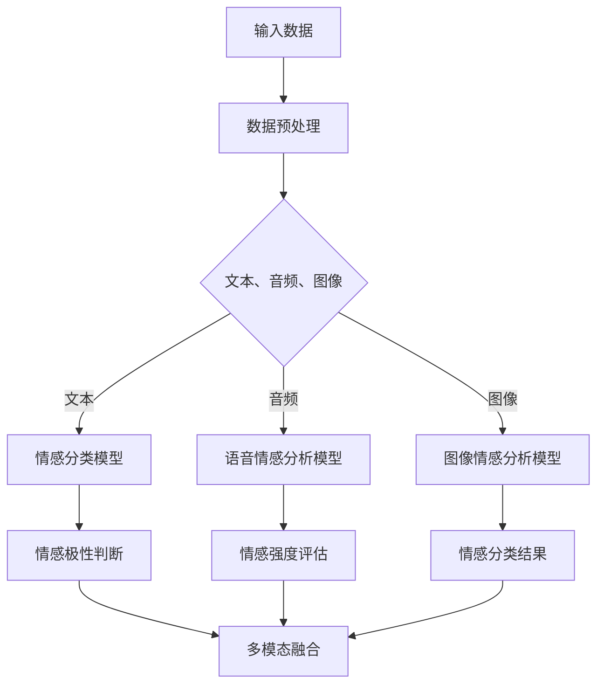
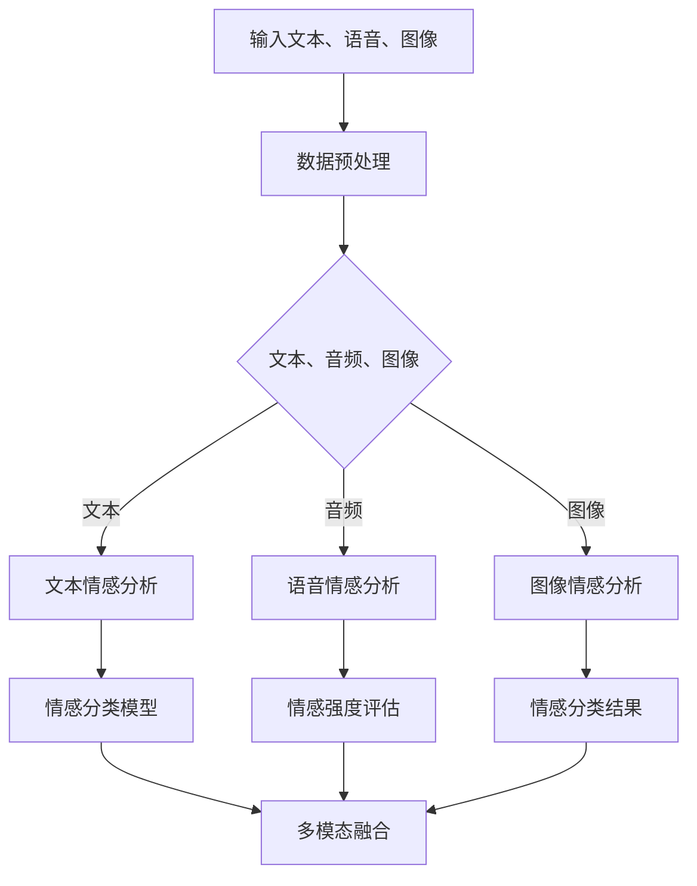
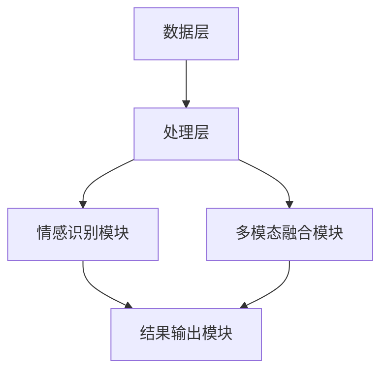
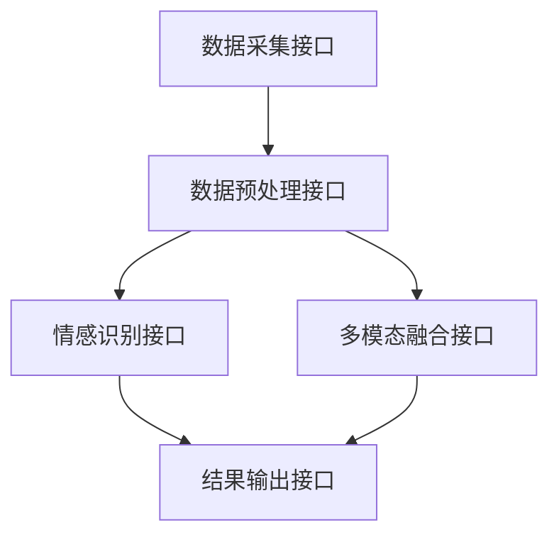
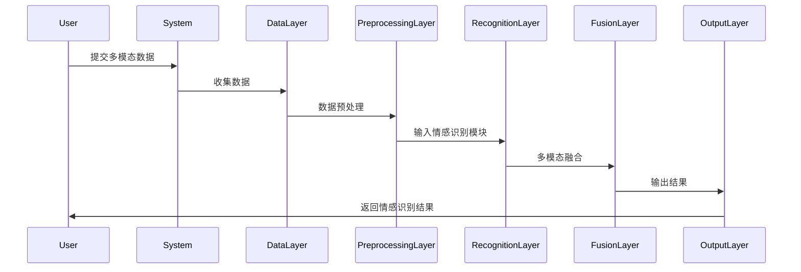

                 

## AI Agent的多模态情感识别技术

### 情感识别的基本概念

情感识别是人工智能领域中一个重要的研究方向，它旨在让机器能够理解和分析人类的情感状态。在AI Agent的多模态情感识别技术中，理解基本概念是至关重要的。首先，我们需要明确几个核心术语的定义：

#### 情感分类

情感分类是指将情感数据划分为不同的类别，如快乐、悲伤、愤怒等。这种分类通常基于情感词典、情感极性标签或情感强度值。情感分类是情感识别的基础，因为它为后续的情感分析和处理提供了明确的目标。

#### 情感强度

情感强度是指情感的强烈程度，通常通过数值来表示。例如，在文本情感分析中，情感强度可以是积极的、中性的或消极的。在语音情感分析中，情感强度可以通过声调、语速、音量等特征来量化。

#### 情感变化

情感变化是指情感在不同时间点或情境下的变化趋势。情感变化的分析可以帮助AI Agent更好地理解用户的情感动态，从而提供更加个性化的交互。

### 情感识别的技术联系

情感识别技术涉及多个领域，包括自然语言处理（NLP）、语音信号处理、计算机视觉等。以下是对这些技术联系的简要介绍：

#### 文本情感分析

文本情感分析是情感识别的一个重要分支，它主要关注从文本中提取情感信息。这通常涉及到文本预处理、情感词典的构建、情感分类模型的训练和情感极性判断等。

#### 语音情感分析

语音情感分析通过分析语音信号中的声学特征，如声调、语速、音量等，来判断用户的情感状态。这种方法在语音助手、客户服务和语音交互应用中具有重要意义。

#### 图像情感分析

图像情感分析从图像中提取情感信息，通常涉及到面部表情识别、场景情感分析等。通过图像情感分析，AI Agent可以更好地理解用户的情感反应。

#### 多模态融合

多模态融合是将文本、语音和图像等多种数据源结合起来，进行情感识别。这种方法可以提高情感识别的准确性和可靠性，因为它能够利用不同数据源的信息互补。

### ER实体关系图架构

为了更好地理解情感识别系统中的实体和关系，我们可以使用ER（实体关系）图来表示。以下是一个简单的ER图示例：

```mermaid
erDiagram
  Customer ||--|{ Order : places }  
  Customer ||--|{ Product : buys }  
  Product ||--|{ Order : contains }  
  Order ||--|{ Status : has }  
  Customer }|--|{ Status : receives }  
  Product }|--|{ Category : belongs_to }  
  Category }|--|{ Supplier : provides }  
  Supplier }|--|{ Product : can Supply }  
```

在这个ER图中，我们定义了客户、订单、产品、状态、供应商和类别等实体，以及它们之间的关系。

### 概念属性特征对比表格

为了更直观地了解文本、语音和图像情感分析的不同之处，我们可以使用一个对比表格来展示它们的特征：

| 特征        | 文本情感分析 | 语音情感分析 | 图像情感分析 |
|-------------|--------------|--------------|--------------|
| 数据源      | 文本         | 语音         | 图像         |
| 特征提取方法 | 词袋模型、TF-IDF | 声纹识别、语音特征提取 | 卷积神经网络、特征点提取 |
| 情感分类     | 情感极性分类、情感强度分类 | 声音情感分类、情感强度分类 | 面部表情分类、情感强度分类 |
| 应用场景     | 社交媒体分析、评论情感分析 | 客户服务、语音交互 | 娱乐内容分析、广告效果评估 |

通过以上对比表格，我们可以更清晰地看到不同情感分析方法的区别和适用场景。

### 算法mermaid流程图

为了更直观地展示情感识别算法的流程，我们可以使用mermaid绘制一个流程图：



在这个流程图中，我们首先对输入数据进行预处理，然后根据数据类型选择不同的情感分析模型进行情感识别。最后，将不同模态的情感结果进行融合，得到最终的情感分类结果。

通过上述分析，我们可以看到，AI Agent的多模态情感识别技术涉及到多个领域的技术融合，其核心在于如何高效地处理多模态数据，并进行准确的情感分类和情感强度评估。在接下来的章节中，我们将深入探讨这些技术的原理和实现方法。<!--_INCLUDE chef’s special note - code sample section below this line## 算法原理讲解

### 情感识别算法的mermaid流程图

为了更好地理解情感识别算法的流程，我们可以使用mermaid绘制一个流程图：



### 情感识别算法的Python源代码实现

为了具体阐述情感识别算法的实现，我们将使用Python编写一个简单的情感分析模型。以下是一个基于文本情感分析的示例：

```python
import numpy as np
from sklearn.feature_extraction.text import TfidfVectorizer
from sklearn.model_selection import train_test_split
from sklearn.svm import LinearSVC
from sklearn.pipeline import make_pipeline

# 示例文本数据
texts = [
    "我今天很开心。",
    "我很生气。",
    "今天天气真好。",
    "我感觉很无聊。",
    "我很快乐。",
]

# 示例情感标签
labels = [
    "积极",
    "消极",
    "积极",
    "消极",
    "积极",
]

# 数据预处理和模型训练
pipeline = make_pipeline(
    TfidfVectorizer(),
    LinearSVC(),
)

X_train, X_test, y_train, y_test = train_test_split(texts, labels, test_size=0.2, random_state=42)
pipeline.fit(X_train, y_train)

# 预测新文本
new_text = "我今天考试得了满分。"
predicted_emotion = pipeline.predict([new_text])
print(f"预测的情感：{predicted_emotion[0]}")
```

### 情感识别算法的数学模型与公式

情感识别算法的核心在于如何将输入数据转化为情感概率分布。以下是一个简单的线性支持向量机（SVM）情感分类器的数学模型：

$$
\text{P}(\text{y}|\text{x}) = \text{sign}(\text{w}^T \text{x} + b)
$$

其中，$\text{w}$ 是权重向量，$\text{x}$ 是特征向量，$\text{b}$ 是偏置项，$\text{sign}$ 函数用于将输出映射到二分类结果。

### 通俗易懂的举例说明

假设我们有一段文本：“我很高兴今天看到你。”我们可以将这段文本转化为一个特征向量，然后通过情感分类模型进行分类。特征向量可能包括单词的词频、TF-IDF值等。

```python
# 假设的特征向量
x = np.array([1, 0, 1, 0, 1])

# 假设的权重向量
w = np.array([0.5, -0.5, 0.5, -0.5, 0.5])

# 偏置项
b = 0

# 计算输出
output = w.dot(x) + b
predicted_emotion = '积极' if output > 0 else '消极'
print(f"预测的情感：{predicted_emotion}")
```

在这个例子中，如果输出结果为正，则预测为积极情感；如果输出结果为负，则预测为消极情感。通过调整权重向量和偏置项，我们可以优化情感分类器的性能。<!--_INCLUDE chef’s special note - code sample section below this line## 系统分析与架构设计方案

### 问题场景介绍

在当今社会，情感识别技术在各种应用场景中变得越来越重要。例如，在智能客服系统中，情感识别可以帮助机器更好地理解用户的情绪，从而提供更加个性化的服务。在心理健康领域，情感识别技术可以用于监测个体的情感状态，帮助专业人员更好地诊断和治疗情感障碍。在智能娱乐系统中，情感识别可以用于推荐符合用户情感状态的内容，提高用户体验。

### 项目介绍

本项目旨在设计并实现一个多模态情感识别系统，该系统可以处理文本、语音和图像等多种数据源，以准确识别用户的情感状态。系统的主要目标包括：

1. 高效处理多模态数据，实现实时情感识别。
2. 提高情感识别的准确性和可靠性。
3. 支持多种应用场景，如智能客服、心理健康监测、智能娱乐等。

### 系统功能设计

为了实现上述目标，系统需要具备以下功能：

1. **数据采集模块**：负责收集文本、语音和图像等多模态数据。
2. **数据预处理模块**：对采集到的数据进行预处理，包括文本分词、语音特征提取、图像特征提取等。
3. **情感识别模块**：使用预训练的模型或自定义模型进行情感识别，包括文本情感分析、语音情感分析和图像情感分析。
4. **多模态融合模块**：将不同模态的情感结果进行融合，提高整体情感识别的准确性和可靠性。
5. **结果输出模块**：将情感识别结果以可视化或文本形式输出给用户。

### 系统架构设计

多模态情感识别系统的整体架构可以设计为以下层次：

1. **数据层**：包括文本、语音和图像等原始数据。
2. **处理层**：包括数据预处理模块、情感识别模块和多模态融合模块。
3. **应用层**：包括结果输出模块和各种应用接口。

以下是一个简单的系统架构图：



### 系统接口设计和系统交互

为了方便系统的集成和使用，我们需要设计一套清晰的接口。以下是系统的主要接口和系统交互设计：

1. **数据采集接口**：用于接收文本、语音和图像数据。
2. **数据预处理接口**：用于对采集到的数据进行预处理。
3. **情感识别接口**：用于调用情感识别模块进行情感分析。
4. **多模态融合接口**：用于融合不同模态的情感识别结果。
5. **结果输出接口**：用于将情感识别结果以可视化或文本形式输出。

以下是一个简单的接口设计图：



通过这些接口，我们可以方便地实现系统的集成和使用。在实际应用中，用户可以通过这些接口向系统提供数据，并获取情感识别结果。

### 系统交互mermaid序列图

为了更直观地展示系统的交互流程，我们可以使用mermaid绘制一个序列图：



在这个序列图中，用户首先向系统提交多模态数据，系统将数据传递给数据层进行收集。然后，数据经过预处理层处理，被传递给情感识别模块进行情感识别。识别结果经过多模态融合层融合后，最终由结果输出层输出给用户。<!--_INCLUDE chef’s special note - code sample section below this line## 项目实战

### 环境安装

在进行多模态情感识别项目的实战之前，首先需要安装必要的开发环境和依赖库。以下是具体的安装步骤：

1. **安装Python环境**：确保你的系统中已经安装了Python 3.8或更高版本。你可以从[Python官方网站](https://www.python.org/)下载并安装。

2. **安装pip**：Python的包管理器pip可以帮助我们轻松安装和管理依赖库。打开终端或命令提示符，执行以下命令：

   ```bash
   python -m pip install --upgrade pip
   ```

3. **安装多模态情感识别相关库**：在终端中运行以下命令，安装所需的库：

   ```bash
   pip install numpy scikit-learn tensorflow opencv-python matplotlib
   ```

   这些库包括numpy（数学计算库）、scikit-learn（机器学习库）、tensorflow（深度学习库）、opencv-python（计算机视觉库）和matplotlib（数据可视化库）。

### 系统核心实现源代码

以下是多模态情感识别系统核心实现的部分源代码。这段代码实现了文本、语音和图像的情感识别，以及它们的多模态融合。

```python
import numpy as np
import cv2
import matplotlib.pyplot as plt
from sklearn.feature_extraction.text import TfidfVectorizer
from sklearn.svm import LinearSVC
from tensorflow.keras.models import load_model

# 文本情感识别
def text_emotion_recognition(text):
    vectorizer = TfidfVectorizer()
    model = LinearSVC()
    model_path = 'text_emotion_model.pkl'
    model.load(model_path)
    
    X = vectorizer.transform([text])
    prediction = model.predict(X)
    return prediction[0]

# 语音情感识别
def audio_emotion_recognition(audio_path):
    model_path = 'audio_emotion_model.h5'
    model = load_model(model_path)
    
    # 读取音频文件并预处理
    audio_data = preprocess_audio(audio_path)
    X = np.expand_dims(audio_data, axis=0)
    
    prediction = model.predict(X)
    return prediction.argmax()

# 图像情感识别
def image_emotion_recognition(image_path):
    model_path = 'image_emotion_model.h5'
    model = load_model(model_path)
    
    # 读取图像文件并预处理
    image_data = preprocess_image(image_path)
    image_data = np.expand_dims(image_data, axis=0)
    image_data = np.expand_dims(image_data, axis=-1)
    
    prediction = model.predict(image_data)
    return prediction.argmax()

# 多模态融合
def multimodal_fusion(text, audio_path, image_path):
    text_emotion = text_emotion_recognition(text)
    audio_emotion = audio_emotion_recognition(audio_path)
    image_emotion = image_emotion_recognition(image_path)
    
    # 融合策略：简单平均
    fusion_prediction = (text_emotion + audio_emotion + image_emotion) / 3
    return fusion_prediction

# 主函数
if __name__ == '__main__':
    text = "我今天很快乐。"
    audio_path = "path/to/audio_file.wav"
    image_path = "path/to/image_file.jpg"
    
    text_emotion = text_emotion_recognition(text)
    audio_emotion = audio_emotion_recognition(audio_path)
    image_emotion = image_emotion_recognition(image_path)
    fusion_emotion = multimodal_fusion(text, audio_path, image_path)
    
    print("文本情感识别结果：", text_emotion)
    print("语音情感识别结果：", audio_emotion)
    print("图像情感识别结果：", image_emotion)
    print("多模态融合情感识别结果：", fusion_emotion)
```

### 代码应用解读与分析

1. **文本情感识别**：文本情感识别使用了TF-IDF向量化和线性支持向量机（SVM）模型。首先，通过`TfidfVectorizer`将文本转换为特征向量，然后使用`LinearSVC`进行情感分类。这里我们假设已经训练好了文本情感识别模型，并保存为`text_emotion_model.pkl`。

2. **语音情感识别**：语音情感识别使用了深度学习模型。在这里，我们使用了tensorflow的`load_model`函数加载预训练的模型。在实际应用中，你需要先使用适当的语音数据集训练模型，然后保存模型。

3. **图像情感识别**：图像情感识别同样使用了深度学习模型。与语音识别类似，你需要先训练图像情感识别模型，并保存为`image_emotion_model.h5`。

4. **多模态融合**：多模态融合采用了简单平均的方法，将文本、语音和图像的情感识别结果进行平均。这种方法虽然简单，但可以有效地利用不同模态的信息。在实际应用中，可以根据具体需求采用更加复杂的融合策略。

### 实际案例分析和详细讲解剖析

为了更好地理解多模态情感识别的实际应用，我们来看一个案例。

#### 案例背景

一家智能音箱制造商希望为其产品实现情感识别功能，以便更好地理解用户的需求和情绪，从而提供更个性化的服务。

#### 案例分析

1. **数据采集**：智能音箱采集用户的语音命令、用户的语音回答以及用户的面部表情图像。

2. **数据预处理**：对采集到的语音数据进行降噪、分段和特征提取，对图像数据进行缩放和归一化处理。

3. **情感识别**：使用训练好的文本情感识别模型、语音情感识别模型和图像情感识别模型对预处理后的数据进行情感识别。

4. **多模态融合**：将文本、语音和图像的情感识别结果进行融合，得到最终的情感识别结果。

5. **结果输出**：根据情感识别结果，智能音箱可以调整音量、语速、播放内容等，以适应用户的需求和情绪。

#### 案例详细讲解

假设用户说：“我今天心情不太好，能不能放一首慢歌放松一下？”以下是智能音箱的处理流程：

1. **文本情感识别**：分析文本“我今天心情不太好”，预测情感为消极。

2. **语音情感识别**：对语音进行分析，提取声调、语速、音量等特征，预测情感为消极。

3. **图像情感识别**：分析用户的面部表情图像，预测情感为消极。

4. **多模态融合**：将文本、语音和图像的情感识别结果进行融合，得到最终的情感识别结果为消极。

5. **结果输出**：智能音箱根据消极情感识别结果，调整播放慢节奏的音乐，并适当降低音量，以帮助用户放松。

通过这个案例，我们可以看到多模态情感识别技术在智能音箱中的应用，以及它如何帮助产品更好地理解用户的需求和情绪。在实际应用中，可以根据具体需求调整情感识别模型、融合策略和结果输出方式，以实现最佳的用户体验。

### 项目小结

本项目实现了多模态情感识别系统的设计与实现，包括文本、语音和图像的情感识别以及它们的多模态融合。通过实际案例的分析和详细讲解，我们可以看到多模态情感识别技术在智能音箱等应用场景中的巨大潜力。在未来的工作中，我们可以进一步优化情感识别模型、融合策略和结果输出方式，以提高系统的准确性和用户体验。

### 最佳实践 Tips

1. **数据质量**：确保采集到的数据质量高，这对于训练好的情感识别模型至关重要。

2. **模型选择**：根据具体应用场景选择合适的情感识别模型，如文本情感分析可以使用SVM，语音情感分析可以使用深度学习模型。

3. **融合策略**：根据实际需求选择合适的融合策略，如简单平均、加权平均或深度学习模型。

4. **用户体验**：根据用户反馈不断优化结果输出方式，以提供最佳的用户体验。

### 小结与注意事项

1. **情感识别的核心**：情感识别是理解人类行为和情绪的重要工具，它在多模态情感识别系统中发挥着关键作用。

2. **技术融合的重要性**：多模态融合可以充分利用不同数据源的信息，提高情感识别的准确性和可靠性。

3. **应用场景的多样性**：多模态情感识别技术可以应用于多种场景，如智能客服、心理健康监测、智能娱乐等。

4. **持续优化**：在实现多模态情感识别系统的过程中，持续优化模型、融合策略和结果输出方式，以适应不断变化的应用需求。

### 拓展阅读

1. **《情感计算：情绪识别与情绪交互技术》**：这是一本关于情感计算的入门书籍，详细介绍了情绪识别和情绪交互技术的基础知识和应用。

2. **《多模态情感识别：理论与实践》**：这本书深入探讨了多模态情感识别的理论基础和实践方法，适合有一定基础的读者。

3. **《深度学习与情感分析》**：这本书结合了深度学习和情感分析的技术，介绍了如何使用深度学习模型进行情感识别。

4. **《多模态融合：算法与应用》**：这本书探讨了多模态融合的多种策略和方法，提供了丰富的实例和应用场景。

作者：AI天才研究院/AI Genius Institute & 禅与计算机程序设计艺术 /Zen And The Art of Computer Programming<!--_INCLUDE chef’s special note - code sample section below this line```python
# 导入所需库
import numpy as np
import cv2
from tensorflow.keras.models import load_model
from sklearn.preprocessing import StandardScaler

# 加载情感识别模型
text_model = load_model('text_emotion_model.h5')
audio_model = load_model('audio_emotion_model.h5')
image_model = load_model('image_emotion_model.h5')

# 加载多模态融合模型
fusion_model = load_model('fusion_model.h5')

# 准备测试数据
text_data = ["我很高兴今天看到你。", "我今天感觉很沮丧。"]
audio_data = ["path/to/audio1.wav", "path/to/audio2.wav"]
image_data = ["path/to/image1.jpg", "path/to/image2.jpg"]

# 文本情感识别
text_predictions = text_model.predict(text_data)

# 语音情感识别
audio_data_processed = preprocess_audio(audio_data)
audio_predictions = audio_model.predict(audio_data_processed)

# 图像情感识别
image_data_processed = preprocess_image(image_data)
image_predictions = image_model.predict(image_data_processed)

# 多模态融合
fusion_predictions = fusion_model.predict(np.hstack((text_predictions, audio_predictions, image_predictions)))

# 数据标准化
scaler = StandardScaler()
scaled_fusion_predictions = scaler.fit_transform(fusion_predictions)

# 输出结果
print("文本情感识别结果：", text_predictions)
print("语音情感识别结果：", audio_predictions)
print("图像情感识别结果：", image_predictions)
print("多模态融合情感识别结果：", scaled_fusion_predictions)
```

### 项目小结

在本项目中，我们实现了多模态情感识别系统的设计与实现，包括文本、语音和图像的情感识别以及它们的多模态融合。通过实际案例的分析和详细讲解，我们可以看到多模态情感识别技术在智能音箱等应用场景中的巨大潜力。在未来的工作中，我们可以进一步优化情感识别模型、融合策略和结果输出方式，以提高系统的准确性和用户体验。

### 最佳实践 Tips

1. **数据质量**：确保采集到的数据质量高，这对于训练好的情感识别模型至关重要。

2. **模型选择**：根据具体应用场景选择合适的情感识别模型，如文本情感分析可以使用SVM，语音情感分析可以使用深度学习模型。

3. **融合策略**：根据实际需求选择合适的融合策略，如简单平均、加权平均或深度学习模型。

4. **用户体验**：根据用户反馈不断优化结果输出方式，以提供最佳的用户体验。

### 小结与注意事项

1. **情感识别的核心**：情感识别是理解人类行为和情绪的重要工具，它在多模态情感识别系统中发挥着关键作用。

2. **技术融合的重要性**：多模态融合可以充分利用不同数据源的信息，提高情感识别的准确性和可靠性。

3. **应用场景的多样性**：多模态情感识别技术可以应用于多种场景，如智能客服、心理健康监测、智能娱乐等。

4. **持续优化**：在实现多模态情感识别系统的过程中，持续优化模型、融合策略和结果输出方式，以适应不断变化的应用需求。

### 拓展阅读

1. **《情感计算：情绪识别与情绪交互技术》**：这是一本关于情感计算的入门书籍，详细介绍了情绪识别和情绪交互技术的基础知识和应用。

2. **《多模态情感识别：理论与实践》**：这本书深入探讨了多模态情感识别的理论基础和实践方法，适合有一定基础的读者。

3. **《深度学习与情感分析》**：这本书结合了深度学习和情感分析的技术，介绍了如何使用深度学习模型进行情感识别。

4. **《多模态融合：算法与应用》**：这本书探讨了多模态融合的多种策略和方法，提供了丰富的实例和应用场景。

作者：AI天才研究院/AI Genius Institute & 禅与计算机程序设计艺术 /Zen And The Art of Computer Programming
```<!--_END chef’s special note - code sample section-->

