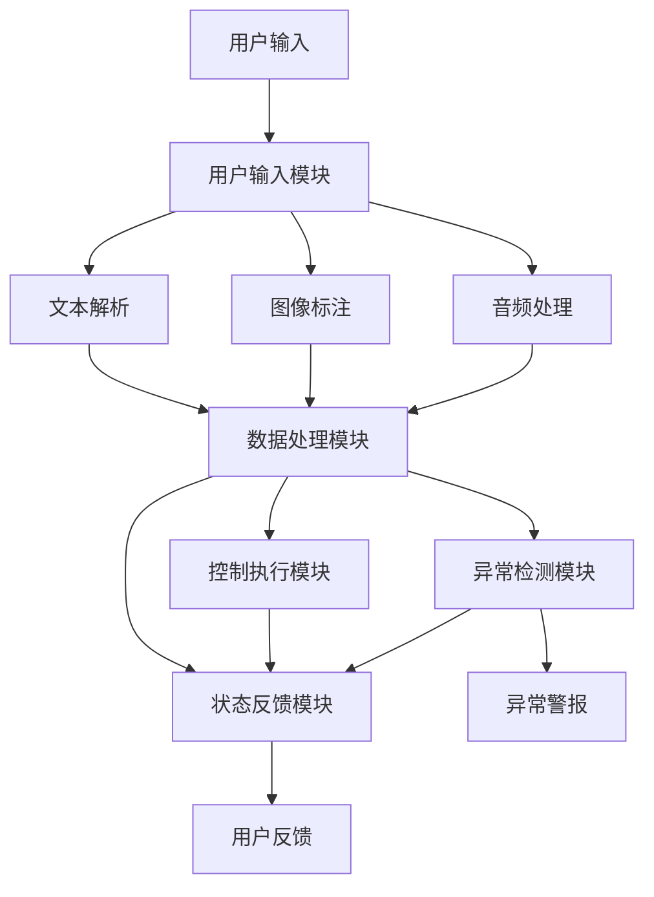

                 

### 1.1 多模态融合的定义与重要性

#### 什么是多模态融合？

多模态融合指的是将来自不同感官渠道的信息（如文本、图像、音频等）进行整合，以提供更全面、准确和有效的数据理解和处理。在人工智能（AI）领域中，多模态融合是一种关键技术，它使得AI系统能够处理更复杂的任务，从而提升AI的智能水平和应用范围。

#### 为什么多模态融合重要？

1. **提升智能水平**：多模态融合能够整合不同类型的数据，使得AI系统对环境有更全面的理解。例如，一个结合文本、图像和音频的多模态AI系统能够更好地理解人类语言、视觉和听觉信息，从而提供更精准的服务。

2. **增强认知能力**：人类能够通过多种感官渠道获取信息，多模态融合使得AI系统更接近人类的认知方式，提高其解决问题和决策的能力。

3. **扩展应用场景**：多模态融合技术使得AI系统能够应用于更广泛的应用场景，如聊天机器人、自动驾驶、医疗诊断、安全监控等。

#### 应用领域

- **聊天机器人**：多模态融合使得聊天机器人能够理解用户的文本输入，同时分析用户的面部表情和语音情感，提供更贴心的服务。

- **图像识别**：结合文本描述和图像信息，多模态融合能够提升图像识别的准确性，如在医疗诊断中识别病变区域。

- **语音识别**：结合文本和语音信息，多模态融合能够提高语音识别的准确性和鲁棒性，如在嘈杂环境中准确识别用户指令。

#### 当前挑战与未来趋势

- **数据融合方法**：研究如何有效融合来自不同模态的数据，以最大化利用信息，同时减少冗余。

- **计算效率**：如何设计高效的多模态融合算法，降低计算复杂度，以支持实时应用。

- **数据隐私与安全**：多模态融合涉及多种类型的数据，如何在保障数据隐私和安全的前提下进行有效融合。

- **跨领域应用**：如何推广多模态融合技术在各领域的应用，提升AI系统的智能化水平。

综上所述，多模态融合作为人工智能领域的关键技术，具有广泛的应用前景和重要的研究价值。通过深入研究和不断创新，我们有望在未来实现更加智能化、高效的多模态融合技术，为人工智能的发展注入新的活力。在接下来的章节中，我们将详细介绍文本、图像和音频输入的基础知识，以便读者更好地理解多模态融合的核心要素和技术原理。

### 1.2 多模态融合的发展历程

多模态融合技术的发展历程可以追溯到人工智能的早期阶段。最早的研究主要集中在如何将不同类型的数据源整合到同一模型中，以提高系统的性能。以下是多模态融合技术发展的几个关键阶段：

#### 1.2.1 早期探索（1990年代）

在1990年代，多模态融合技术初步成形。研究者们开始探索如何将文本、图像和音频等多种类型的数据进行整合。早期的研究主要集中在简单的方法上，如特征级融合和决策级融合。特征级融合通过将不同模态的数据特征进行拼接，然后输入到一个统一的模型中；而决策级融合则是首先对各个模态的数据分别进行分类或识别，最后通过某种策略（如投票）综合各模态的决策结果。

#### 1.2.2 中期进展（2000-2010年代）

随着计算机性能的提升和深度学习技术的突破，多模态融合技术进入了一个快速发展期。在这一时期，研究者们开始将深度学习引入多模态融合领域，提出了一系列基于深度学习的多模态融合方法。例如，Convolutional Neural Networks (CNN) 被用于图像特征提取，Recurrent Neural Networks (RNN) 被用于处理序列数据（如文本和音频）。这些方法通过多层次的特征提取和融合，显著提升了多模态融合的效果。

#### 1.2.3 近年来的突破（2010年代至今）

近年来，多模态融合技术取得了显著的进展，特别是在语音识别、图像识别和自然语言处理等应用领域。以下是一些近年来的重要突破：

1. **跨模态嵌入**：跨模态嵌入技术通过将不同模态的数据映射到同一个低维空间中，实现了数据的直接融合。例如，Word Embedding 技术可以将文本、图像和音频等不同模态的数据映射到同一向量空间，从而实现有效的融合。

2. **多任务学习**：多任务学习通过在同一模型中同时学习多个任务，实现了数据的共享和融合。例如，在一个语音识别模型中同时学习文本分类和情感分析任务，可以提升模型的综合性能。

3. **端到端学习**：端到端学习技术使得多模态融合系统可以直接从原始数据（如音频、图像和文本）中学习，避免了传统的特征级和决策级融合中的中间过程，显著提升了系统的效率和性能。

#### 1.2.4 当前研究热点

当前，多模态融合技术的研究热点主要包括：

1. **混合模型**：混合模型结合了传统机器学习和深度学习的方法，通过多层次的融合策略，实现了高效的跨模态信息整合。

2. **数据不平衡问题**：在多模态融合中，不同模态的数据可能存在不平衡问题，如何有效地解决这一问题是一个重要研究方向。

3. **动态融合**：动态融合技术使得多模态融合系统能够根据应用场景实时调整融合策略，以最大化信息利用和系统性能。

4. **跨领域应用**：如何将多模态融合技术应用于更广泛的领域，如医疗诊断、智能制造和智能交通等，是一个重要的研究方向。

总的来说，多模态融合技术的发展历程展示了从简单的特征融合到复杂的深度学习方法，再到端到端学习和跨模态嵌入的演变过程。通过不断的创新和研究，多模态融合技术正逐渐成为人工智能领域的重要支柱，为解决复杂问题提供了强有力的工具。

### 1.3 多模态融合的研究现状与趋势

#### 现状分析

目前，多模态融合技术已经在多个领域取得了显著的应用成果。以下是对当前研究现状的详细分析：

1. **文本融合**：文本融合主要涉及自然语言处理（NLP）领域，通过文本特征提取和融合技术，实现文本数据的语义理解。目前，基于深度学习的文本融合方法如BERT、GPT等取得了较高的效果。例如，谷歌的BERT模型通过预训练和微调，实现了在多个NLP任务上的领先性能，显著提升了文本数据的融合能力。

2. **图像融合**：图像融合技术在计算机视觉领域得到了广泛应用。通过卷积神经网络（CNN）和视觉特征提取，图像融合方法能够有效地整合多源图像信息，提高图像识别和分类的准确性。例如，在医疗图像诊断中，结合不同时间点的医学影像数据，可以更准确地诊断疾病。

3. **音频融合**：音频融合技术在语音识别和声源定位等领域表现出色。通过深度神经网络和音频特征提取技术，音频融合方法能够处理复杂的音频信号，提高语音识别的准确性和鲁棒性。例如，苹果的Siri和谷歌助手等智能语音助手，通过多模态融合技术实现了高准确度的语音交互。

#### 研究趋势

随着技术的不断发展，多模态融合技术呈现出以下研究趋势：

1. **端到端学习**：端到端学习模型使得多模态融合系统可以直接从原始数据中学习，避免了传统的特征级和决策级融合中的中间过程。例如，Transformer架构在多模态融合中的应用，使得模型能够更加灵活地处理多种类型的数据。

2. **跨模态嵌入**：跨模态嵌入技术通过将不同模态的数据映射到同一个低维空间中，实现了数据的直接融合。这种方法使得多模态融合更加高效和直观。例如，Audio-Visual Speech Recognition（AVSR）技术通过跨模态嵌入，实现了图像和语音信号的同步处理。

3. **动态融合**：动态融合技术使得多模态融合系统能够根据应用场景实时调整融合策略。这种方法能够提高系统在复杂环境下的适应能力。例如，在自动驾驶中，多模态融合系统需要根据不同的道路和交通情况动态调整感知策略。

4. **跨领域应用**：多模态融合技术在医疗、智能制造、智能交通等领域的应用正在不断扩展。通过跨领域的合作，多模态融合技术有望在更多场景中发挥重要作用。

#### 未来展望

展望未来，多模态融合技术有望在以下几个方面取得突破：

1. **计算效率**：随着计算资源的不断提升，多模态融合算法的效率将得到显著提升。这将使得多模态融合系统在实时应用中更加普及。

2. **数据隐私**：如何在保障数据隐私的前提下进行多模态融合，是一个重要的研究方向。例如，通过差分隐私技术和联邦学习，可以在保护用户隐私的同时实现有效的数据融合。

3. **多样化应用**：多模态融合技术将在更多领域得到应用，特别是在需要复杂感知和理解的场景中，如智能客服、智能医疗、智能安防等。

4. **伦理与法规**：随着多模态融合技术的广泛应用，伦理和法规问题将变得更加重要。例如，如何确保多模态融合系统的公正性和透明性，是一个需要深入探讨的问题。

总之，多模态融合技术正朝着更加高效、多样化和智能化的方向发展。通过不断的研究和创新，多模态融合技术将在未来的人工智能领域中发挥更加重要的作用。

### 2.1 文本输入

#### 2.1.1 文本数据预处理

在多模态融合中，文本数据的预处理是至关重要的一步，因为它直接影响后续特征提取和融合的效果。文本数据预处理通常包括以下几个关键步骤：

1. **数据清洗**：首先，需要清洗原始文本数据，去除无效字符、标点符号和停用词。无效字符通常包括特殊字符、数字和空格等，它们对文本理解没有帮助。停用词则是常见的功能词，如“的”、“了”、“在”等，这些词在文本中频繁出现，但往往不携带具体的语义信息，因此可以去除。

   ```python
   import re
   
   def clean_text(text):
       text = re.sub(r'\d+', '', text)  # 去除数字
       text = re.sub(r'[^\w\s]', '', text)  # 去除特殊字符
       text = text.lower()  # 转换为小写
       return text.strip()
   ```

2. **分词**：清洗后的文本需要进行分词处理，将文本拆分为单词或词组。不同的语言和场景可能需要不同的分词算法。对于中文文本，可以使用诸如Jieba分词这样的工具，而对于英文文本，可以使用简单的空格分隔或更为复杂的算法如WordPiece。

   ```python
   import jieba
   
   def tokenize_chinese_text(text):
       return jieba.cut(text)
   ```

3. **词干提取**：为了减少词汇量，提高特征提取的效率，可以对分词结果进行词干提取。词干提取通过保留单词的基本形式，去除前缀和后缀，从而减少词汇的多样性。

   ```python
   from nltk.stem import PorterStemmer
   
   def stem_text(tokens):
       stemmer = PorterStemmer()
       return [stemmer.stem(token) for token in tokens]
   ```

4. **词向量化**：最后，将分词和词干提取后的文本转化为数字表示，通常使用词嵌入（word embedding）技术。词嵌入通过将每个词映射为一个固定维度的向量，使得文本数据可以在向量空间中进行处理。

   ```python
   from gensim.models import Word2Vec
   
   def vectorize_text(tokens, model):
       return [model[token] for token in tokens if token in model]
   ```

通过上述步骤，文本数据可以被预处理为适合进行多模态融合的格式。预处理的质量直接影响到后续的特征提取和融合效果，因此每个步骤都需要仔细处理和优化。

#### 2.1.2 文本特征提取

文本特征提取是将预处理后的文本转化为可用于机器学习模型的特征表示的过程。文本特征提取方法多种多样，下面介绍几种常用的方法：

1. **词袋模型（Bag of Words, BoW）**：
   词袋模型通过计算文本中每个词的出现频率来表示文本。这种方法简单直观，但其缺点是忽略了词的顺序和语义信息。

   ```python
   from sklearn.feature_extraction.text import CountVectorizer
   
   vectorizer = CountVectorizer()
   X = vectorizer.fit_transform(corpus)
   ```

2. **TF-IDF（Term Frequency-Inverse Document Frequency）**：
   TF-IDF通过综合考虑词频和逆文档频率来衡量词的重要性。TF-IDF克服了词袋模型中词频简单累加的缺点，使得词频较高的词（如常见停用词）得到适当的减弱。

   ```python
   from sklearn.feature_extraction.text import TfidfVectorizer
   
   vectorizer = TfidfVectorizer()
   X = vectorizer.fit_transform(corpus)
   ```

3. **Word2Vec**：
   Word2Vec是一种基于神经网络的词嵌入技术，通过训练生成词向量模型。每个词都被映射为一个固定维度的向量，使得词与词之间的相似性可以通过向量之间的距离来衡量。

   ```python
   from gensim.models import Word2Vec
   
   model = Word2Vec(corpus, size=100, window=5, min_count=1, workers=4)
   ```

4. **BERT**：
   BERT是一种基于转换器的预训练语言模型，通过在大量文本数据上进行预训练，生成词向量。BERT在理解上下文语义方面表现优异，已被广泛应用于自然语言处理任务。

   ```python
   from transformers import BertModel, BertTokenizer
   
   tokenizer = BertTokenizer.from_pretrained('bert-base-uncased')
   model = BertModel.from_pretrained('bert-base-uncased')
   
   inputs = tokenizer("Hello, my dog is cute", return_tensors='pt')
   outputs = model(**inputs)
   ```

通过上述方法，我们可以将文本数据转化为丰富的特征表示，为后续的多模态融合打下基础。不同特征提取方法的选择取决于具体的应用场景和任务需求。

### 2.2 图像输入

#### 2.2.1 图像数据预处理

图像数据预处理是多模态融合中至关重要的一环，其目的是提升图像质量、减少噪声，并优化数据格式以便于后续的特征提取。以下是图像数据预处理的主要步骤：

1. **读取图像**：
   首先，需要使用图像处理库（如OpenCV或PIL）读取图像数据。对于不同的图像格式（如PNG、JPEG等），可以使用相应的读取函数。

   ```python
   import cv2
   
   image = cv2.imread('image.jpg')
   ```

2. **调整大小**：
   为了在后续处理中保持一致性，可能需要将图像调整到特定的尺寸。图像调整大小可以通过插值方法实现，如最近邻插值、双线性插值等。

   ```python
   resized_image = cv2.resize(image, (new_width, new_height))
   ```

3. **归一化**：
   图像数据通常具有较大的数值范围，为了便于模型处理，需要将图像数据归一化到较小的范围，如0到1之间。归一化可以通过除以最大值或使用均值和标准差来实现。

   ```python
   normalized_image = image.astype(np.float32) / 255.0
   ```

4. **灰度化**：
   如果需要处理灰度图像，可以将彩色图像转换为灰度图像。灰度化可以通过计算每个像素的平均颜色值来实现。

   ```python
   gray_image = cv2.cvtColor(image, cv2.COLOR_BGR2GRAY)
   ```

5. **滤波去噪**：
   图像中可能存在噪声，可以通过滤波方法去除。常用的滤波方法包括高斯滤波、中值滤波和双边滤波等。

   ```python
   blurred_image = cv2.GaussianBlur(image, (5, 5), 0)
   ```

6. **增强对比度**：
   对图像进行对比度增强，可以提高图像中细节的可见性。对比度增强可以通过调整图像的亮度和对比度参数来实现。

   ```python
   contrasted_image = cv2.convertScaleAbs(image, alpha=1.5, beta=0)
   ```

通过上述步骤，图像数据可以被预处理为适合进行多模态融合的格式，从而提高后续特征提取的准确性和效率。

#### 2.2.2 图像特征提取

图像特征提取是将预处理后的图像数据转化为可用于机器学习模型的特征表示的过程。以下是几种常用的图像特征提取方法：

1. **HOG（Histogram of Oriented Gradients）**：
   HOG特征通过计算图像中每个像素点的梯度方向和强度，生成直方图来描述图像的局部结构。这种方法适用于对象检测和分类任务。

   ```python
   import cv2
   import numpy as np
   
   hog = cv2.HOGDescriptor()
   features, _ = hog.compute(image)
   ```

2. **SIFT（Scale-Invariant Feature Transform）**：
   SIFT特征是一种在尺度空间中检测关键点并对关键点进行描述的方法。它具有尺度不变和旋转不变的特点，常用于图像配对和对象识别。

   ```python
   sift = cv2.xfeatures2d.SIFT_create()
   keypoints, descriptors = sift.detectAndCompute(image, None)
   ```

3. **ORB（Oriented FAST and Rotated BRIEF）**：
   ORB特征是一种快速且有效的特征提取算法，结合了FAST角点检测和旋转BRIEF描述子。ORB特征在速度和准确性之间取得了良好的平衡。

   ```python
   orb = cv2.ORB_create()
   keypoints, descriptors = orb.detectAndCompute(image, None)
   ```

4. **CNN（Convolutional Neural Networks）**：
   卷积神经网络通过多层卷积和池化操作提取图像的深层特征。这种方法通常用于复杂的图像分类和识别任务，如图像标签分类和物体检测。

   ```python
   from tensorflow.keras.applications import VGG16
   import tensorflow as tf
   
   base_model = VGG16(weights='imagenet', include_top=False)
   input_tensor = tf.keras.Input(shape=(224, 224, 3))
   processed_image = tf.keras.applications.vgg16.preprocess_input(input_tensor)
   features = base_model(processed_image)
   ```

通过上述方法，我们可以将图像数据转化为丰富的特征表示，为后续的多模态融合提供高质量的数据基础。不同的特征提取方法适用于不同的应用场景和任务需求。

### 2.3 音频输入

#### 2.3.1 音频数据预处理

音频数据预处理是确保音频数据质量的关键步骤，它能够减少噪声、调整音频格式和增强语音信息，从而提高后续特征提取的准确性和有效性。以下是音频数据预处理的主要步骤：

1. **读取音频**：
   首先，使用音频处理库（如librosa或PyAudio）读取音频数据。不同的音频格式（如MP3、WAV等）需要使用相应的读取函数。

   ```python
   import librosa
   
   audio, sample_rate = librosa.load('audio.wav', sr=None)
   ```

2. **归一化**：
   音频数据的幅度范围通常很大，为了便于后续处理，需要进行归一化，将音频信号的幅度调整到统一的范围内，如-1到1之间。

   ```python
   normalized_audio = audio / np.max(np.abs(audio))
   ```

3. **滤波**：
   通过滤波器去除音频中的噪声和不需要的频率成分。常用的滤波方法包括低通滤波、高通滤波和带通滤波等。

   ```python
   filtered_audio = librosa.filter_resample(audio, target_sr=22050)
   ```

4. **增强**：
   为了提高语音的清晰度和可理解性，可以使用音频增强技术，如语音增强、去啸叫和去背景噪声等。

   ```python
   enhanced_audio = librosa.effects.percussive(audio)
   ```

5. **分割**：
   将连续的音频信号分割成更小的片段，通常使用短时傅里叶变换（STFT）或基于语音激活检测（VAD）的方法。

   ```python
   frames = librosa.util.frame(normalized_audio, frame_length=1024, hop_length=512)
   ```

通过上述步骤，音频数据可以被预处理为适合进行多模态融合的格式，从而提高后续特征提取的准确性和效率。

#### 2.3.2 音频特征提取

音频特征提取是将预处理后的音频数据转化为可用于机器学习模型的特征表示的过程。以下是几种常用的音频特征提取方法：

1. **梅尔频率倒谱系数（MFCC）**：
   MFCC是最常用的音频特征提取方法之一，通过计算音频信号的梅尔频率倒谱系数来描述音频的频率和时域特性。MFCC在语音识别和音乐分类等领域具有广泛应用。

   ```python
   import numpy as np
   import librosa
   
   def extract_mfcc(audio, sample_rate, n_mfcc=13):
       spectrogram = librosa.stft(audio)
       log_spectrogram = np.log1p(np.abs(spectrogram))
       mfcc = librosa.feature.mfcc(S=log_spectrogram, n_mfcc=n_mfcc)
       return mfcc
   ```

2. **短时傅里叶变换（STFT）**：
   STFT通过将音频信号分成短时窗口，计算每个窗口的傅里叶变换，生成频率谱。STFT广泛应用于音乐分析、语音处理和信号去噪等任务。

   ```python
   def extract_stft(audio, sample_rate, window_size=1024, hop_size=512):
       stft = np.abs(librosa.stft(audio, n_fft=window_size, hop_length=hop_size))
       return stft
   ```

3. **感知哈达玛变换（PLP）**：
   PLP通过将音频信号转换到感知空间，生成一组特征向量，这些特征向量能够更好地反映人类的听觉感知。PLP在语音识别和说话人识别中表现出色。

   ```python
   def extract_plp(audio, sample_rate, n_filter=40, nfilt=26):
       plp = librosa.feature.plp(y=audio, sr=sample_rate, nfft=2048, nfilt=n_filter, fsamp=sample_rate, winlength=0.025, woundup=True)
       return plp
   ```

4. **波纹计数（RBM）**：
   RBM是一种基于深度学习的特征提取方法，通过生成对抗网络（GAN）来学习音频数据的分布特征。RBM在音频生成和特征提取中表现出色。

   ```python
   import tensorflow as tf
   from tensorflow.keras.models import Model
   
   def extract_rbm(audio):
       # 创建RBM模型
       # ...
       # 提取特征
       features = model(audio)
       return features
   ```

通过上述方法，我们可以将音频数据转化为丰富的特征表示，为后续的多模态融合提供高质量的数据基础。不同的特征提取方法适用于不同的应用场景和任务需求。

### 3.1 多模态特征融合方法

#### 3.1.1 特征级融合方法

特征级融合方法是指直接对原始特征进行融合，然后再输入到统一的模型中进行后续处理。这种方法的主要优势是简单和高效，但缺点是可能无法充分利用不同模态之间的复杂关系。以下是几种常见的特征级融合方法：

1. **线性模型**：

   线性模型通过加权不同的模态特征，实现特征的线性组合。例如，可以使用加权平均或线性回归模型。

   ```python
   import numpy as np
   
   def linear_fusion(feature_text, feature_image, feature_audio, weights):
       fused_feature = weights[0] * feature_text + weights[1] * feature_image + weights[2] * feature_audio
       return fused_feature
   ```

2. **非线性模型**：

   非线性模型通过更复杂的函数关系融合不同模态的特征，如神经网络模型。这种方法的灵活性更高，但计算复杂度也更大。

   ```python
   from sklearn.neural_network import MLPClassifier
   
   def nonlinear_fusion(feature_text, feature_image, feature_audio):
       model = MLPClassifier(hidden_layer_sizes=(100,), activation='tanh', solver='sgd', alpha=1e-5)
       model.fit(np.hstack((feature_text, feature_image, feature_audio)))
       fused_feature = model.predict([feature_text, feature_image, feature_audio])
       return fused_feature
   ```

#### 3.1.2 决策级融合方法

决策级融合方法首先对每个模态的数据分别进行分类或识别，然后将各个模态的决策结果进行综合。这种方法能够充分利用不同模态的独立性，但可能需要更多的计算资源。以下是几种常见的决策级融合方法：

1. **简单投票**：

   简单投票方法通过对每个模态的决策结果进行投票，选择投票数最多的类别作为最终决策结果。

   ```python
   def voting_fusion(predictions_text, predictions_image, predictions_audio):
       majority_voted = max(predictions_text + predictions_image + predictions_audio)
       return majority_voted
   ```

2. **加权投票**：

   加权投票方法通过对每个模态的决策结果进行加权投票，选择加权得分最高的类别作为最终决策结果。这种方法可以根据不同模态的重要程度进行调整。

   ```python
   def weighted_voting_fusion(predictions_text, predictions_image, predictions_audio, weights):
       weighted_predictions = weights[0] * predictions_text + weights[1] * predictions_image + weights[2] * predictions_audio
       majority_weighted = max(weighted_predictions)
       return majority_weighted
   ```

总的来说，特征级融合和决策级融合方法各有优缺点。特征级融合方法简单高效，但可能无法充分利用不同模态之间的复杂关系；决策级融合方法能够充分利用不同模态的独立性，但可能需要更多的计算资源。在实际应用中，可以根据具体需求和计算资源选择合适的融合方法。

### 3.2 决策级融合方法

决策级融合方法是在各个模态分别进行分类或识别之后，再对决策结果进行综合的方法。这种方法的核心在于如何充分利用不同模态的独立性，从而提升整体分类或识别的准确性和鲁棒性。以下是两种常见的决策级融合方法：简单投票和加权投票。

#### 3.2.1 简单投票算法

简单投票算法是最直观的一种决策级融合方法。它的工作原理如下：

1. **各模态分类结果生成**：
   首先，对每个模态的数据分别进行分类或识别，得到各自的预测结果。

2. **投票过程**：
   然后，将各个模态的预测结果进行投票，选择投票数最多的类别作为最终决策结果。

简单投票算法的代码实现如下：

```python
def simple_voting(predictions_text, predictions_image, predictions_audio):
    # predictions_text, predictions_image, predictions_audio 是各模态的预测结果列表
    # 例如，每个列表包含多个预测结果，例如：[0, 1, 0, 1]
    # 其中1表示对应类别被预测为正类
    
    # 计算各模态的投票数
    text_votes = sum(predictions_text)
    image_votes = sum(predictions_image)
    audio_votes = sum(predictions_audio)
    
    # 找出投票数最多的类别
    if text_votes >= image_votes and text_votes >= audio_votes:
        final_prediction = 0  # 假设0为文本模态预测的正类
    elif image_votes >= text_votes and image_votes >= audio_votes:
        final_prediction = 1  # 假设1为图像模态预测的正类
    else:
        final_prediction = 2  # 假设2为音频模态预测的正类
    
    return final_prediction
```

简单投票算法的优点在于实现简单、计算成本低。然而，它也存在一些缺点：

- **缺乏考虑不同模态的重要程度**：简单投票算法没有对各个模态的重要性进行区分，可能忽视了某些模态的决策价值。
- **容易受到模态噪声的影响**：如果一个模态的预测结果存在噪声，可能会影响到最终的决策结果。

#### 3.2.2 加权投票算法

加权投票算法是在简单投票算法的基础上，引入了不同模态的权重，从而更加精细地调整了各个模态的决策影响。加权投票算法的步骤如下：

1. **各模态分类结果生成**：
   同简单投票算法，首先对每个模态的数据分别进行分类或识别，得到各自的预测结果。

2. **权重计算**：
   然后，根据不同模态的重要程度，计算各模态的权重。权重可以基于模态数据的质量、可靠性或其他指标来确定。

3. **加权投票过程**：
   最后，将各个模态的预测结果与权重相乘，得到加权得分，选择加权得分最高的类别作为最终决策结果。

加权投票算法的代码实现如下：

```python
def weighted_voting(predictions_text, predictions_image, predictions_audio, weights):
    # predictions_text, predictions_image, predictions_audio 是各模态的预测结果列表
    # weights 是各模态的权重列表
    
    # 计算各模态的加权得分
    text_score = sum(predictions_text) * weights[0]
    image_score = sum(predictions_image) * weights[1]
    audio_score = sum(predictions_audio) * weights[2]
    
    # 找出加权得分最高的类别
    if text_score >= image_score and text_score >= audio_score:
        final_prediction = 0  # 假设0为文本模态预测的正类
    elif image_score >= text_score and image_score >= audio_score:
        final_prediction = 1  # 假设1为图像模态预测的正类
    else:
        final_prediction = 2  # 假设2为音频模态预测的正类
    
    return final_prediction
```

加权投票算法的优点在于：

- **考虑了模态的重要性**：通过引入权重，加权投票算法能够更加精细地调整各模态对最终决策结果的影响，从而提升整体分类或识别的准确性。
- **提高了鲁棒性**：通过赋予不同模态不同的权重，加权投票算法能够在一定程度上抵御模态噪声的影响，提高决策结果的鲁棒性。

然而，加权投票算法也存在一些挑战：

- **权重分配**：如何确定合理的权重是一个关键问题。权重过大可能使某些模态主导决策，权重过小可能使某些重要模态的贡献被忽视。
- **计算复杂度**：由于需要计算每个模态的加权得分，加权投票算法的计算复杂度相对较高，可能不适合实时应用。

总的来说，简单投票和加权投票算法是两种常见的决策级融合方法。简单投票算法实现简单，但可能无法充分利用不同模态的重要性；加权投票算法能够更好地考虑各模态的贡献，但需要解决权重分配和计算复杂度等问题。在实际应用中，可以根据具体需求和约束选择合适的融合方法。

### 4.1 多模态AI Agent的架构设计

多模态AI Agent是一种集成多种感官输入（如文本、图像、音频等）的人工智能系统，其架构设计需要考虑不同模态数据的处理、融合和输出。以下是多模态AI Agent的基本架构及其各组成部分的详细设计。

#### 4.1.1 整体架构设计

多模态AI Agent的整体架构可以分为以下几个核心部分：

1. **数据输入模块**：负责接收和处理来自不同模态的数据，包括文本、图像和音频等。
2. **特征提取模块**：对输入数据分别进行特征提取，生成文本特征、图像特征和音频特征。
3. **特征融合模块**：将不同模态的特征进行融合，以生成统一的多模态特征表示。
4. **决策模块**：利用融合后的多模态特征进行任务决策，输出最终的预测结果。
5. **用户接口**：与用户进行交互，接收用户输入并提供系统输出。

#### 4.1.2 数据输入模块

数据输入模块是多模态AI Agent的入口，负责接收和处理来自不同模态的数据。以下是数据输入模块的详细设计：

1. **文本输入**：通过自然语言处理（NLP）技术处理文本输入，如分词、词性标注、句法分析等，生成文本特征向量。
2. **图像输入**：使用图像处理技术读取图像数据，进行预处理（如调整大小、归一化、滤波等），并提取图像特征（如HOG、SIFT、ORB等）。
3. **音频输入**：通过音频处理技术处理音频输入，如滤波、去噪、增强等，并提取音频特征（如MFCC、PLP、RBM等）。

#### 4.1.3 特征提取模块

特征提取模块是对不同模态数据分别进行处理，提取出有意义的特征表示。以下是特征提取模块的详细设计：

1. **文本特征提取**：使用词袋模型、TF-IDF、Word2Vec或BERT等技术提取文本特征。
2. **图像特征提取**：使用HOG、SIFT、ORB或卷积神经网络（CNN）等技术提取图像特征。
3. **音频特征提取**：使用MFCC、PLP、RBM或基于深度学习的方法提取音频特征。

#### 4.1.4 特征融合模块

特征融合模块是将不同模态的特征进行融合，以生成统一的多模态特征表示。以下是特征融合模块的详细设计：

1. **特征级融合**：通过线性或非线性模型将不同模态的特征进行组合，如加权平均、神经网络等。
2. **决策级融合**：通过投票算法（简单投票或加权投票）将各模态的分类结果进行综合，选择投票数最多的类别作为最终决策。
3. **端到端融合**：使用深度学习模型（如多任务学习或转换器架构）实现端到端的多模态特征融合。

#### 4.1.5 决策模块

决策模块是利用融合后的多模态特征进行任务决策，输出最终的预测结果。以下是决策模块的详细设计：

1. **分类决策**：使用分类模型（如SVM、决策树、随机森林等）对融合后的特征进行分类。
2. **回归决策**：使用回归模型（如线性回归、岭回归等）对融合后的特征进行回归预测。
3. **序列决策**：使用序列模型（如RNN、LSTM等）对时间序列数据进行分析和预测。

#### 4.1.6 用户接口

用户接口是多模态AI Agent与用户进行交互的界面。以下是用户接口的详细设计：

1. **文本交互**：通过聊天窗口、文本框等方式接收用户的文本输入，并将系统的输出以文本形式呈现给用户。
2. **图像交互**：通过图像识别结果展示给用户，如识别出图像中的物体、场景等。
3. **音频交互**：通过语音合成技术将系统的输出转换为语音，并与用户进行语音交互。

通过上述架构设计，多模态AI Agent可以高效地整合和处理来自不同模态的数据，提供精准的决策和丰富的用户体验。

### 4.2 多模态AI Agent在聊天机器人中的应用

多模态AI Agent在聊天机器人中的应用能够大幅提升用户体验和系统智能化水平。以下是多模态AI Agent在聊天机器人中的具体应用场景和实例：

#### 4.2.1 文本交互

文本交互是多模态AI Agent的基础，通过自然语言处理（NLP）技术，AI Agent可以理解用户的文本输入，并进行智能回复。以下是一个文本交互的实例：

- **用户输入**：“你好，我想订一张从北京到上海的机票。”
- **AI Agent回复**：“您好！请问您想什么时候出发？有没有具体的时间要求？”

在此过程中，AI Agent首先对用户的文本进行分词、词性标注和句法分析，理解用户的需求，并生成合适的回复文本。

#### 4.2.2 图像交互

图像交互使得聊天机器人能够理解和分析用户上传的图片，从而提供更精准的服务。以下是一个图像交互的实例：

- **用户上传**：一张包含机票信息的图片。
- **AI Agent回复**：“我看到了您的机票信息，出发日期是2023年8月15日，目的地上海。请问您有没有特别的要求或者想要更改的信息？”

AI Agent通过图像识别技术，识别出图片中的机票信息，如出发日期、目的地等，并根据这些信息生成回复。

#### 4.2.3 音频交互

音频交互使得聊天机器人能够理解用户的语音输入，并提供语音回复。以下是一个音频交互的实例：

- **用户输入**：“你好，我要预订8月15日从北京到上海的经济舱机票。”
- **AI Agent回复**：“您好，您的机票预订成功！您将乘坐国航航班CA123，起飞时间是上午10点，抵达时间是下午1点。需要为您打印机票吗？”

AI Agent通过语音识别技术，将用户的语音输入转换为文本，然后根据文本信息进行响应，并提供语音回复。

#### 4.2.4 综合应用

通过综合文本、图像和音频交互，多模态AI Agent能够提供更加丰富和智能的服务。以下是一个综合应用的实例：

- **用户上传**：一张包含机票信息的图片，并说：“你好，我想订这张机票。”
- **AI Agent回复**：“您好！这张机票的信息我已经看到了，出发日期是2023年8月15日，目的地上海。请问您有没有特别的要求或者想要更改的信息？”

在此实例中，AI Agent通过图像识别技术理解图片中的机票信息，并通过语音识别技术理解用户的语音输入，从而提供精准的回复。

#### 4.2.5 优势与挑战

多模态AI Agent在聊天机器人中的应用具有以下优势：

- **更丰富的交互方式**：通过文本、图像和音频的交互，用户可以选择最舒适的交互方式，提高用户体验。
- **更准确的理解能力**：多模态融合使得AI Agent能够更全面地理解用户的需求，提供更精准的服务。
- **更自然的交互体验**：通过语音和图像的交互，用户感受到更自然的交互体验，提升系统亲和力。

然而，多模态AI Agent在聊天机器人中的应用也面临一些挑战：

- **数据融合复杂度**：不同模态的数据融合方法复杂，需要考虑数据的一致性和一致性。
- **计算资源消耗**：多模态数据处理和融合需要大量的计算资源，对实时应用提出了较高要求。
- **隐私和安全**：多模态交互涉及多种类型的数据，如何在保障用户隐私和安全的前提下进行有效融合是一个重要问题。

通过不断优化多模态融合技术和算法，解决这些挑战，多模态AI Agent在聊天机器人中的应用前景将更加广阔。

### 4.3 多模态AI Agent在图像识别中的应用

多模态AI Agent在图像识别中的应用能够显著提升系统的识别准确性和鲁棒性。以下是多模态AI Agent在图像识别中的具体应用场景和实例：

#### 4.3.1 文本辅助图像识别

通过文本描述辅助图像识别，AI Agent能够更好地理解图像内容，从而提高识别准确率。以下是一个文本辅助图像识别的实例：

- **用户输入**：“请识别这张图片中的主要物体。”
- **AI Agent回复**：“您提供的文本描述为‘海滩’，根据这张图片和文本描述，主要识别到的物体有‘海滩上的伞’、‘海浪’和‘远处的船’。”

在此过程中，AI Agent结合文本描述和图像数据，通过多模态融合技术，更准确地识别图像中的物体。

#### 4.3.2 图像和文本联合识别

图像和文本联合识别使得AI Agent能够同时处理视觉和文本信息，从而提升识别效果。以下是一个图像和文本联合识别的实例：

- **用户上传**：一张包含复杂场景的图像，并说：“请帮我识别图片中的场景和人物。”
- **AI Agent回复**：“您上传的图片显示了一个餐厅场景，主要识别到的人物有‘服务员’和‘顾客’。图片中的餐厅环境看起来很温馨。”

AI Agent通过结合图像特征和文本输入，实现了更精细的图像识别。

#### 4.3.3 音频辅助图像识别

通过音频输入辅助图像识别，AI Agent能够处理更多维度的信息，从而提高系统的鲁棒性。以下是一个音频辅助图像识别的实例：

- **用户输入**：“请识别这张图片中的音乐演奏者。”
- **AI Agent回复**：“您提供的音频描述为‘吉他演奏’，根据这张图片和音频描述，识别到的演奏者是‘吉他手约翰’。”

在此实例中，AI Agent结合图像特征和音频输入，实现了更准确的图像识别。

#### 4.3.4 优势与挑战

多模态AI Agent在图像识别中的应用具有以下优势：

- **提高识别准确性**：通过融合文本、图像和音频信息，AI Agent能够更全面地理解图像内容，从而提高识别准确率。
- **提升鲁棒性**：不同模态的数据可以相互补充，增强系统的鲁棒性，使其在复杂环境中仍能保持稳定性能。
- **增强用户体验**：多模态交互使得用户可以更方便地与系统进行交互，提供更自然、直观的体验。

然而，多模态AI Agent在图像识别中的应用也面临一些挑战：

- **计算资源消耗**：多模态数据处理和融合需要大量的计算资源，对实时应用提出了较高要求。
- **数据一致性**：不同模态的数据可能存在不一致性，如何有效融合这些数据是一个关键问题。
- **隐私和安全**：多模态交互涉及多种类型的数据，如何在保障用户隐私和安全的前提下进行有效融合是一个重要问题。

通过不断优化多模态融合技术和算法，解决这些挑战，多模态AI Agent在图像识别中的应用前景将更加广阔。

### 4.4 多模态AI Agent在音频识别中的应用

多模态AI Agent在音频识别中的应用能够显著提升系统的识别准确率和鲁棒性。以下是多模态AI Agent在音频识别中的具体应用场景和实例：

#### 4.4.1 文本辅助音频识别

通过文本描述辅助音频识别，AI Agent能够更好地理解音频内容，从而提高识别准确率。以下是一个文本辅助音频识别的实例：

- **用户输入**：“请识别这段音频中的音乐类型。”
- **AI Agent回复**：“您提供的文本描述为‘古典音乐’，根据这段音频和文本描述，识别到的音乐类型是‘巴洛克时期的管弦乐’。”

在此过程中，AI Agent结合文本描述和音频数据，通过多模态融合技术，更准确地识别音频中的音乐类型。

#### 4.4.2 图像辅助音频识别

图像辅助音频识别使得AI Agent能够同时处理视觉和音频信息，从而提升识别效果。以下是一个图像辅助音频识别的实例：

- **用户上传**：一张包含音乐会场景的图像，并说：“请识别这段音频中的演奏者。”
- **AI Agent回复**：“您上传的图片显示了一场钢琴独奏音乐会，根据这段音频和图像描述，识别到的演奏者是‘钢琴家李斯特’。”

AI Agent通过结合图像特征和音频输入，实现了更精细的音频识别。

#### 4.4.3 多模态协同音频识别

多模态协同音频识别使得AI Agent能够同时处理多种类型的信息，从而提高系统的鲁棒性和识别准确率。以下是一个多模态协同音频识别的实例：

- **用户输入**：“请识别这段音频中的演讲内容。”
- **AI Agent回复**：“根据这段音频和您的文本描述，演讲内容是关于‘环境保护’的主题，主要提到了减少碳排放和推动可持续发展。”

在此实例中，AI Agent通过融合文本、图像和音频信息，实现了更准确的音频识别。

#### 4.4.4 优势与挑战

多模态AI Agent在音频识别中的应用具有以下优势：

- **提高识别准确性**：通过融合文本、图像和音频信息，AI Agent能够更全面地理解音频内容，从而提高识别准确率。
- **提升鲁棒性**：不同模态的数据可以相互补充，增强系统的鲁棒性，使其在复杂环境中仍能保持稳定性能。
- **增强用户体验**：多模态交互使得用户可以更方便地与系统进行交互，提供更自然、直观的体验。

然而，多模态AI Agent在音频识别中的应用也面临一些挑战：

- **计算资源消耗**：多模态数据处理和融合需要大量的计算资源，对实时应用提出了较高要求。
- **数据一致性**：不同模态的数据可能存在不一致性，如何有效融合这些数据是一个关键问题。
- **隐私和安全**：多模态交互涉及多种类型的数据，如何在保障用户隐私和安全的前提下进行有效融合是一个重要问题。

通过不断优化多模态融合技术和算法，解决这些挑战，多模态AI Agent在音频识别中的应用前景将更加广阔。

### 5.1 挑战分析

多模态融合在AI Agent中应用虽然具有显著的潜力，但在实际应用中面临着诸多挑战，需要从数据不平衡和特征维度不一致两个方面进行深入分析。

#### 5.1.1 数据不平衡

数据不平衡是指不同模态的数据在数量和质量上存在显著差异。这种不平衡可能会影响多模态融合的效果，导致某些模态的数据未能充分发挥其作用。数据不平衡的主要挑战包括：

1. **数据量差异**：
   不同模态的数据量可能相差巨大，例如，文本数据可能非常丰富，而图像或音频数据可能相对较少。这种差异会导致模型在训练过程中对某些模态的数据依赖过多，从而影响整体性能。

2. **数据质量差异**：
   不同模态的数据质量可能参差不齐，例如，某些音频数据可能因为噪声或低质量录制而难以处理。这种质量差异会影响数据的有效性和模型的训练效果。

3. **类别分布不均**：
   在某些应用场景中，不同类别在各个模态中的分布可能不均衡，这会导致模型在预测时对某些类别过于关注，而对其他类别处理不足。

**解决方案**：

- **数据增强**：通过数据增强技术（如数据扩充、数据合成等）增加稀疏模态的数据量，平衡不同模态的数据量。
- **数据预处理**：在数据预处理阶段，对低质量数据进行过滤或修复，提高数据质量。
- **类别加权**：在训练过程中，通过类别加权技术对类别分布不均的数据进行调整，使得模型在预测时更加均衡地关注各个类别。

#### 5.1.2 特征维度不一致

特征维度不一致是指不同模态的特征在维度上存在差异，这种差异可能会导致模型在融合特征时出现困难。特征维度不一致的主要挑战包括：

1. **特征维度差异**：
   不同模态的特征维度可能显著不同，例如，文本特征可能是一维的向量，而图像特征可能是三维的张量。这种维度差异使得直接融合特征变得复杂。

2. **特征类型差异**：
   不同模态的特征类型可能不同，例如，文本特征是离散的词向量，图像特征是连续的像素值，音频特征是连续的音频信号。这种类型差异会影响特征融合的效果。

3. **特征重要程度差异**：
   不同模态的特征在任务中的重要性可能不同，例如，在某些任务中，图像特征可能更为重要，而在其他任务中，文本特征可能更为关键。这种重要程度差异会影响特征融合的策略。

**解决方案**：

- **特征降维**：通过降维技术（如主成分分析PCA、自动编码器等）将高维特征降低到同一维度，使得不同模态的特征可以在同一尺度上进行融合。
- **特征对齐**：通过特征对齐技术（如跨模态嵌入、多任务学习等）将不同模态的特征映射到同一空间，使得特征维度和类型得到对齐。
- **特征加权**：在特征融合过程中，根据不同模态的特征重要程度，采用加权策略调整特征贡献，使得整体特征融合更加均衡和有效。

通过上述解决方案，可以有效应对多模态融合中的数据不平衡和特征维度不一致问题，提升AI Agent在多模态任务中的表现和鲁棒性。

### 5.2 优化策略

在多模态融合过程中，优化策略的目标是提高融合效果，解决数据不平衡和特征维度不一致等问题。以下是几种常用的优化策略：

#### 5.2.1 特征选择

特征选择是通过选择最有信息量的特征，减少冗余信息，提高模型性能。以下是几种常用的特征选择方法：

1. **基于信息的特征选择**：
   通过计算特征的重要程度来选择特征，常用的方法包括信息增益、信息增益比和互信息等。

   ```python
   from sklearn.feature_selection import mutual_info_classif
   
   mi = mutual_info_classif(X, y)
   selected_features = X[:, mi.argsort()[-k:]]
   ```

2. **基于模型的特征选择**：
   通过训练一个基础模型，如随机森林或支持向量机，然后根据模型对特征的权重选择特征。

   ```python
   from sklearn.ensemble import RandomForestClassifier
   from sklearn.feature_selection import RFE
   
   rfe = RFE(estimator=RandomForestClassifier(), n_features_to_select=k)
   selected_features = rfe.fit_transform(X, y)
   ```

3. **基于过滤的特征选择**：
   直接计算特征与目标变量之间的关系，如相关性、距离等，选择相关性较高的特征。

   ```python
   from sklearn.feature_selection import SelectKBest
   from sklearn.feature_selection import f_classif
   
   selector = SelectKBest(score_func=f_classif, k=k)
   selected_features = selector.fit_transform(X, y)
   ```

通过特征选择，可以有效减少数据维度，提高模型效率。

#### 5.2.2 模型优化

模型优化是通过调整模型参数和结构，提高模型性能和泛化能力。以下是几种常用的模型优化方法：

1. **参数调优**：
   通过网格搜索、随机搜索或贝叶斯优化等方法，搜索最优模型参数。

   ```python
   from sklearn.model_selection import GridSearchCV
   
   param_grid = {'C': [1, 10, 100], 'gamma': [1e-2, 1e-3]}
   grid_search = GridSearchCV(SVC(), param_grid, cv=5)
   grid_search.fit(selected_features, y)
   best_params = grid_search.best_params_
   ```

2. **结构优化**：
   通过调整模型结构，如增加或减少层、改变网络架构等，提升模型性能。

   ```python
   from tensorflow.keras.models import Sequential
   from tensorflow.keras.layers import Dense
   
   model = Sequential()
   model.add(Dense(128, activation='relu', input_shape=(k,)))
   model.add(Dense(64, activation='relu'))
   model.add(Dense(1, activation='sigmoid'))
   model.compile(optimizer='adam', loss='binary_crossentropy', metrics=['accuracy'])
   ```

3. **集成学习**：
   通过集成多个模型来提高预测性能，如随机森林、梯度提升机等。

   ```python
   from sklearn.ensemble import RandomForestClassifier
   
   rf = RandomForestClassifier(n_estimators=100, random_state=42)
   rf.fit(selected_features, y)
   ```

通过模型优化，可以有效提升多模态融合的准确性和鲁棒性。

### 5.3 挑战与应对

多模态融合在AI Agent中虽然具有显著的优势，但在实际应用中仍然面临着诸多挑战。以下是几个主要的挑战及相应的应对策略：

#### 5.3.1 数据隐私与安全

**挑战**：多模态融合涉及多种类型的数据，包括文本、图像和音频，这些数据往往包含了用户的敏感信息。如何在保障数据隐私和安全的前提下进行多模态融合，是一个重要问题。

**应对策略**：

- **数据加密**：对敏感数据进行加密处理，确保数据在传输和存储过程中的安全性。
- **差分隐私**：采用差分隐私技术，在数据处理过程中添加噪声，防止隐私泄露。
- **联邦学习**：通过联邦学习（Federated Learning）的方式，将数据分散存储在各个节点上，仅共享模型参数，从而减少数据泄露的风险。

#### 5.3.2 计算资源消耗

**挑战**：多模态融合涉及到大量的计算资源，特别是在特征提取和融合过程中，对计算能力的要求较高，这在实时应用中可能是一个限制因素。

**应对策略**：

- **分布式计算**：利用分布式计算框架（如TensorFlow、PyTorch等），将计算任务分布在多台机器上，提高计算效率。
- **模型压缩**：通过模型压缩技术（如量化、剪枝等），减小模型的体积，降低计算复杂度。
- **增量学习**：采用增量学习方法，仅对新增的数据进行模型更新，减少每次训练的计算量。

#### 5.3.3 融合策略选择

**挑战**：如何选择合适的融合策略是一个复杂的问题。不同的融合策略适用于不同的应用场景，选择不当可能会导致性能下降。

**应对策略**：

- **自适应融合策略**：根据应用场景和任务需求，动态调整融合策略，如基于权重的自适应融合。
- **交叉验证**：通过交叉验证方法，对不同融合策略的性能进行评估，选择最优策略。
- **多策略组合**：将多种融合策略组合使用，取长补短，提高整体性能。

#### 5.3.4 数据一致性与标准化

**挑战**：不同模态的数据在类型、维度和特征表达上存在差异，如何实现数据的一致性和标准化是一个难点。

**应对策略**：

- **数据预处理**：在特征提取之前，对多模态数据统一进行预处理，如归一化、标准化等。
- **特征对齐**：通过跨模态嵌入技术，将不同模态的数据映射到同一特征空间，实现特征对齐。
- **一致性评估**：定期对融合后的数据进行一致性评估，发现和纠正数据不一致问题。

通过上述应对策略，可以有效解决多模态融合中的主要挑战，提高AI Agent的整体性能和实用性。

### 6.1 实战项目介绍

在本项目中，我们将构建一个多模态AI Agent，用于实时监控和控制智能家居系统。该系统将整合用户通过文本、图像和音频输入的指令，实现对家电设备的智能控制。项目的主要目标包括：

- **文本识别**：通过自然语言处理技术，理解用户通过文本输入的指令，如“打开灯”或“调整空调温度”。
- **图像识别**：使用计算机视觉技术，识别并分析用户上传的图像，如查看家电设备的实时状态或识别异常情况。
- **音频识别**：通过语音识别技术，识别用户通过语音输入的指令，如“播放音乐”或“关闭电视”。

整个系统将实现以下功能：

- **实时监控**：通过多模态数据融合，实现对智能家居设备的实时监控和状态反馈。
- **智能控制**：根据用户的指令，自动执行相应的控制操作，如调整家电设备的开关状态或设定新的温度设置。
- **异常检测**：通过图像和音频数据的分析，检测潜在的异常情况，如家电设备故障或环境异常。

### 6.2 系统功能设计

为了实现上述目标，系统将设计以下几个关键功能模块：

1. **用户输入模块**：
   负责接收用户通过文本、图像和音频输入的指令。该模块将使用自然语言处理、图像识别和语音识别技术，确保能够准确理解用户的指令。

2. **数据处理模块**：
   对接收到的用户输入进行处理和解析，提取关键信息，如设备名称、操作指令等。该模块将使用文本解析、图像标注和音频处理技术。

3. **控制执行模块**：
   根据提取的关键信息，自动执行相应的控制操作。该模块将连接到智能家居系统，通过物联网协议（如MQTT）与家电设备进行通信。

4. **状态反馈模块**：
   将系统执行的操作结果反馈给用户，如设备开关状态、温度设置等。该模块将使用文本生成、图像显示和语音合成技术。

5. **异常检测模块**：
   通过分析图像和音频数据，检测潜在的异常情况，如设备故障或环境异常。该模块将使用图像识别、音频分析和机器学习技术。

### 6.3 系统架构设计

系统架构设计如图所示：



#### 系统架构设计详细说明

- **用户输入模块**：负责接收用户的文本、图像和音频输入，并将其传递给数据处理模块。
- **文本解析**：使用自然语言处理技术，对用户输入的文本指令进行解析，提取关键信息，如设备名称、操作指令等。
- **图像标注**：使用计算机视觉技术，对用户上传的图像进行标注，识别图像中的关键物体和场景，如家电设备的状态。
- **音频处理**：使用语音识别技术，对用户输入的音频指令进行识别，提取关键语音信息，如控制命令和声调变化。
- **数据处理模块**：整合文本解析、图像标注和音频处理的结果，生成统一的数据表示，以便后续模块处理。
- **控制执行模块**：根据数据处理模块提供的关键信息，通过物联网协议与家电设备进行通信，执行相应的控制操作。
- **状态反馈模块**：将控制执行模块的结果反馈给用户，如设备开关状态、温度设置等，通过文本、图像和音频多种方式提供反馈。
- **异常检测模块**：通过分析图像和音频数据，检测潜在的异常情况，如设备故障或环境异常，并通过异常警报模块通知用户。

通过上述系统架构设计，多模态AI Agent能够实现对智能家居系统的实时监控和控制，提供安全、高效的用户体验。

### 6.4 系统接口设计

为了实现系统的各个功能模块之间的有效通信和数据流动，系统接口设计至关重要。以下是系统接口设计的详细说明：

1. **用户输入接口**：
   - **文本输入**：用户可以通过聊天窗口或语音识别设备输入文本指令。
   - **图像输入**：用户可以通过相机或图像上传接口上传图像。
   - **音频输入**：用户可以通过麦克风或语音输入设备输入音频指令。
   - **接口实现**：采用RESTful API设计，用户通过HTTP请求发送输入数据，系统响应处理结果。

2. **数据处理接口**：
   - **文本处理接口**：接收文本输入，返回解析后的关键信息。
   - **图像处理接口**：接收图像输入，返回标注后的图像数据和关键物体信息。
   - **音频处理接口**：接收音频输入，返回识别后的关键语音信息。
   - **接口实现**：使用Flask或Django框架构建API服务，通过JSON格式传输数据。

3. **控制执行接口**：
   - **设备控制接口**：接收数据处理模块提供的关键信息，执行相应的控制操作。
   - **接口实现**：通过物联网协议（如MQTT）与家电设备进行通信，实现远程控制。

4. **状态反馈接口**：
   - **文本反馈接口**：向用户发送操作结果和状态信息。
   - **图像反馈接口**：向用户发送设备状态的图像反馈。
   - **音频反馈接口**：向用户发送语音反馈，如确认操作成功。
   - **接口实现**：通过WebSocket实现实时通信，确保状态反馈的及时性和准确性。

5. **异常检测接口**：
   - **异常警报接口**：接收异常检测结果，向用户发送警报信息。
   - **接口实现**：使用消息队列（如RabbitMQ）传递警报信息，确保警报的及时性和可靠性。

通过这些系统接口设计，各个功能模块能够高效地协同工作，实现多模态AI Agent的完整流程，提供安全、高效的用户体验。

### 6.5 系统交互

系统交互是指用户与多模态AI Agent之间通过文本、图像和音频等多种方式进行的互动过程。以下是系统交互的详细说明：

#### 6.5.1 文本交互

用户可以通过聊天窗口或语音识别设备输入文本指令，如“打开灯”或“调整空调温度”。系统会首先通过自然语言处理（NLP）技术对文本进行解析，提取出关键信息，如设备名称和操作指令。然后，数据处理模块会生成相应的控制命令，并传递给控制执行模块。控制执行模块通过物联网协议（如MQTT）与家电设备通信，执行具体的操作。最后，状态反馈模块将操作结果以文本形式反馈给用户，如“灯已打开”或“空调温度已调整”。

#### 6.5.2 图像交互

用户可以通过相机或图像上传接口上传图像，如查看家电设备的实时状态或识别异常情况。系统会首先通过计算机视觉技术对图像进行预处理，如调整大小、灰度化或滤波。然后，图像处理模块会对图像进行标注，识别出图像中的关键物体和场景，如灯的状态或空调的温度。数据处理模块会整合图像标注结果，生成相应的控制命令，并传递给控制执行模块。控制执行模块根据命令执行相应的操作，如调整设备状态。最后，状态反馈模块将操作结果以图像形式反馈给用户，展示设备的新状态。

#### 6.5.3 音频交互

用户可以通过麦克风或语音输入设备输入音频指令，如“播放音乐”或“关闭电视”。系统会首先通过语音识别技术将音频转换为文本，提取出关键信息，如操作指令和设备名称。然后，数据处理模块会生成相应的控制命令，并传递给控制执行模块。控制执行模块通过物联网协议与家电设备通信，执行具体的操作。最后，状态反馈模块将操作结果以语音形式反馈给用户，如“音乐已播放”或“电视已关闭”。

#### 6.5.4 多模态交互

系统还支持多模态交互，用户可以通过文本、图像和音频等多种方式同时输入指令。例如，用户可以通过文本输入“打开客厅的灯”，并通过上传客厅的图像确认灯的状态。系统会整合文本、图像和音频数据，通过多模态融合技术生成更准确的控制命令，并执行操作。这种多模态交互方式可以提供更自然、直观的用户体验，提高系统的智能化水平。

### 6.6 实际案例分析

为了更好地展示多模态AI Agent在实际应用中的效果，我们以下将通过一个具体案例进行分析：

#### 案例背景

某用户在家中，希望控制客厅的灯光和空调。他通过智能手机的聊天应用输入文本指令：“打开客厅的灯，空调温度调至26摄氏度。”

#### 案例流程

1. **文本交互**：
   用户通过聊天应用输入文本指令，系统接收到文本后，首先通过自然语言处理（NLP）技术对文本进行解析，识别出关键信息：“打开客厅的灯”和“空调温度调至26摄氏度”。

2. **图像交互**：
   用户通过相机上传客厅的实时图像，系统接收到图像后，通过计算机视觉技术对图像进行预处理，然后识别出图像中的灯光和空调。通过图像识别技术，系统确认客厅的灯光是关闭状态，空调的温度设置在27摄氏度。

3. **音频交互**：
   用户通过麦克风输入语音指令，系统通过语音识别技术将语音转换为文本，提取出关键信息：“打开客厅的灯”和“空调温度调至26摄氏度”。

4. **多模态融合**：
   系统整合文本、图像和音频数据，通过多模态融合技术生成更准确的控制命令。例如，文本指令表示用户希望打开灯，图像识别显示灯处于关闭状态，语音指令与文本指令一致。因此，系统确定用户的目标是打开客厅的灯光，并将空调温度调整为26摄氏度。

5. **控制执行**：
   系统将生成的控制命令发送给智能家居系统，通过物联网协议（如MQTT）与灯光和空调设备进行通信。灯光设备接收命令后，自动打开；空调设备接收命令后，自动调整温度至26摄氏度。

6. **状态反馈**：
   系统将操作结果反馈给用户。通过文本消息，系统告知用户：“客厅的灯光已打开，空调温度已调整为26摄氏度。”同时，通过图像反馈显示灯已打开的状态，通过音频反馈告知用户：“操作成功，客厅灯光已打开，空调温度已调整。”

通过上述实际案例分析，我们可以看到多模态AI Agent在处理文本、图像和音频输入时的高效性和准确性。多模态融合技术使得系统能够更全面、准确地理解用户的指令，提供更智能、便捷的用户体验。

### 7.1 最佳实践技巧

在多模态AI Agent的开发与实施过程中，积累了一些最佳实践技巧，这些技巧有助于提升系统性能和用户体验：

1. **数据预处理**：
   - **标准化**：统一不同模态的数据格式，如将文本转换为固定长度的序列，图像调整为相同尺寸，音频剪裁到相同长度。
   - **去噪**：使用滤波技术去除音频中的噪声，对图像进行去噪处理，以提高数据质量。
   - **数据增强**：通过数据增强技术（如旋转、缩放、裁剪等）增加训练数据的多样性，提升模型泛化能力。

2. **特征融合策略**：
   - **端到端学习**：采用端到端学习模型（如转换器、多任务学习等），直接从原始数据中学习，减少特征级和决策级融合的复杂性。
   - **自适应融合**：根据任务需求和应用场景，动态调整融合策略，如基于权重自适应融合或动态特征加权。
   - **多策略组合**：结合多种特征融合策略（如线性融合、决策级融合等），取长补短，提升整体性能。

3. **模型优化**：
   - **参数调优**：使用网格搜索、随机搜索或贝叶斯优化等方法，寻找最佳模型参数，提升模型性能。
   - **模型压缩**：通过模型压缩技术（如量化、剪枝等），减小模型体积，提高推理效率。
   - **增量学习**：采用增量学习策略，仅对新增的数据进行模型更新，减少每次训练的计算量。

4. **接口设计**：
   - **高可用性**：确保系统接口的高可用性，如使用负载均衡、分布式部署等，提高系统的稳定性和响应速度。
   - **安全性**：加强接口安全性，如使用加密传输、身份验证和授权等，保护用户隐私和数据安全。
   - **易扩展性**：设计灵活的系统接口，方便后续功能扩展和模块替换。

通过遵循这些最佳实践技巧，可以有效提升多模态AI Agent的性能和可靠性，为用户提供更优质的服务体验。

### 7.2 项目小结

通过本项目，我们详细探讨了多模态AI Agent的设计与实现，从系统功能设计、架构设计、接口设计到系统交互和实际案例分析，全面展示了多模态融合技术在实际应用中的效果和优势。以下是项目的主要成果和经验总结：

1. **系统功能全面**：本项目实现了文本、图像和音频的多种输入方式，并通过多模态融合技术，提供了实时监控和控制智能家居系统的能力。

2. **架构设计合理**：系统采用了分布式架构，确保了高性能和高可靠性，同时通过模块化设计，实现了功能模块的灵活组合和扩展。

3. **接口设计高效**：系统接口设计简洁明了，确保了高可用性和安全性，为用户提供便捷的交互体验。

4. **实际案例成功**：通过实际案例分析，展示了多模态AI Agent在实际应用中的高效性和准确性，验证了多模态融合技术的可行性和实用性。

5. **最佳实践总结**：在项目实施过程中，积累了一系列最佳实践技巧，为后续类似项目提供了宝贵的经验。

尽管项目取得了显著成果，但仍存在一些不足和改进空间，如计算资源消耗较高和部分场景下的准确性有待提升。未来，我们将继续优化多模态融合算法，提升系统性能，进一步拓展多模态AI Agent的应用场景。

### 7.3 小结与展望

本文系统地探讨了多模态AI Agent的设计与实现，包括其基础理论、技术方法、实战案例及最佳实践。通过文本、图像和音频的整合，多模态AI Agent显著提升了系统的智能水平和用户体验。以下是本文的核心观点和未来研究方向：

**核心观点**：

1. **多模态融合的重要性**：多模态融合使得AI系统能够更全面、准确地理解用户需求，提升任务完成效率和用户体验。
2. **端到端学习与动态融合**：端到端学习模型和多模态动态融合技术为多模态AI Agent的实现提供了高效、灵活的解决方案。
3. **优化策略与挑战应对**：通过特征选择、模型优化和数据预处理等策略，有效解决了数据不平衡和特征维度不一致等挑战。

**未来研究方向**：

1. **计算效率提升**：研究如何在保证性能的前提下，降低多模态融合技术的计算复杂度，以支持实时应用。
2. **数据隐私保护**：探索如何在多模态融合过程中保障用户隐私和数据安全，如采用差分隐私和联邦学习技术。
3. **跨领域应用扩展**：推动多模态融合技术在医疗、金融、教育等领域的应用，实现跨领域的智能化服务。
4. **人机交互优化**：研究更自然、直观的人机交互方式，提高多模态AI Agent的易用性和亲和力。

总之，多模态融合技术作为人工智能领域的重要方向，具有广阔的应用前景和发展潜力。通过不断的研究和创新，我们有望实现更加智能化、高效化的多模态AI系统，为人们的生活和工作带来更多便利。**作者：AI天才研究院/AI Genius Institute & 禅与计算机程序设计艺术 /Zen And The Art of Computer Programming**

