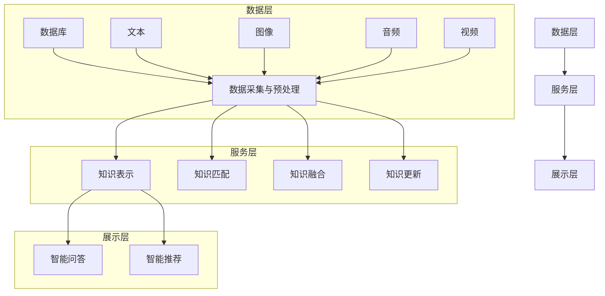

                 

### 引言

**1.1 问题背景**

在当今信息化和数字化时代，人工智能（AI）已经深入到社会生产和生活的各个领域。AI Agent，作为一种智能化实体，正逐渐成为人们工作和生活中的重要组成部分。AI Agent可以理解、解释和执行任务，从而提高工作效率、优化决策过程。然而，随着AI Agent的应用场景越来越复杂，其所需要处理的知识源也日益多样化。这就引出了多源知识融合学习技术的需求。

传统的AI系统往往依赖于单一的、结构化的数据源，如数据库或文本。然而，现实世界的知识源是多样化的，包括结构化数据、半结构化数据和非结构化数据，如图像、音频和视频。这些知识源不仅形式各异，而且可能存在冲突、冗余和不一致的问题。如何从这些多样化的知识源中提取有用信息，并有效地融合这些信息，是当前AI研究中的一个重要课题。

**1.2 问题描述**

多源知识融合学习技术的核心问题是如何有效地整合来自不同领域、不同格式和不同来源的知识，使其能够被AI Agent所理解和利用。具体而言，问题描述如下：

1. **知识表示问题**：如何将多种不同类型的数据转化为一种统一的形式，使其可以被计算机处理和理解？
2. **知识匹配问题**：如何找到不同知识源之间的关联和匹配，以确保知识融合的准确性和一致性？
3. **知识融合问题**：如何将匹配后的知识进行整合和优化，以生成一个更全面、更准确的知识表示？
4. **知识更新和维护问题**：如何确保知识库的实时性和准确性，以应对知识源的不断更新和变化？

**1.3 问题解决**

多源知识融合学习技术旨在解决上述问题，其基本原理和方法如下：

1. **知识表示**：采用多种知识表示方法，如基于符号表示、向量表示和图表示，将不同类型的数据转化为统一的形式。
2. **知识匹配**：使用知识匹配算法，如基于相似度计算、基于图论的匹配算法，找到不同知识源之间的关联。
3. **知识融合**：采用知识融合算法，如基于规则的融合、基于机器学习的融合，将匹配后的知识进行整合和优化。
4. **知识更新和维护**：通过实时数据采集和知识库更新机制，确保知识库的实时性和准确性。

**1.4 边界与外延**

多源知识融合学习技术的应用范围广泛，包括但不限于以下领域：

- **智能搜索与推荐系统**：利用多源知识融合技术，实现更精准的搜索和推荐。
- **智能监控与预警系统**：利用多源知识融合技术，实时分析监控数据，及时发现异常情况。
- **智能问答系统**：利用多源知识融合技术，提供更准确、更全面的回答。
- **智能决策支持系统**：利用多源知识融合技术，为决策者提供基于多种数据的综合分析。

然而，多源知识融合学习技术也面临一些挑战和限制，如知识表示的复杂度、知识匹配的精度和知识融合的效率等。在实际应用中，需要根据具体场景和需求，选择合适的技术和方法。

**1.5 核心概念**

为了更好地理解多源知识融合学习技术，以下是一些核心概念：

- **知识源**：提供知识的原始数据源，可以是数据库、文本、图像、音频、视频等。
- **知识表示**：将知识源中的数据转化为计算机可以处理和理解的形式。
- **知识匹配**：找到不同知识源之间的关联和匹配，确保知识融合的准确性和一致性。
- **知识融合**：将匹配后的知识进行整合和优化，生成一个更全面、更准确的知识表示。
- **知识更新和维护**：确保知识库的实时性和准确性，以应对知识源的不断更新和变化。

通过本章的介绍，我们为后续章节的深入探讨奠定了基础。接下来，我们将对多源知识融合学习技术进行详细的概述，包括其概念、挑战和学习框架。让我们在下一章中继续探索这一领域的奥秘。

---

### 多源知识融合学习技术概述

**2.1 概念与联系**

多源知识融合学习技术是一种利用多种知识源进行知识整合的方法，旨在生成一个更全面、更准确的知识表示。其基本概念包括知识源、知识表示、知识匹配、知识融合和知识更新。这些概念相互关联，共同构成了多源知识融合学习技术的核心。

首先，**知识源**是提供知识的原始数据源，可以是数据库、文本、图像、音频、视频等。不同的知识源具有不同的特点和表现形式，这使得知识融合过程变得复杂和多样化。

**知识表示**是将知识源中的数据转化为计算机可以处理和理解的形式。知识表示方法多种多样，包括基于符号表示、向量表示和图表示等。符号表示方法通常使用逻辑推理和符号计算，而向量表示方法则基于机器学习技术，通过将知识转化为向量空间中的点来进行处理。图表示方法则利用图结构来表示知识，能够更好地处理复杂关系和依赖。

**知识匹配**是找到不同知识源之间的关联和匹配，确保知识融合的准确性和一致性。知识匹配方法包括基于相似度计算、基于图论的匹配算法等。这些方法通过计算知识源之间的相似度或相似关系，来识别和匹配相关的知识。

**知识融合**是将匹配后的知识进行整合和优化，生成一个更全面、更准确的知识表示。知识融合方法包括基于规则的融合、基于机器学习的融合等。这些方法通过综合多种知识源的信息，生成一个统一的、优化的知识表示。

最后，**知识更新和维护**是确保知识库的实时性和准确性，以应对知识源的不断更新和变化。知识更新和维护方法包括实时数据采集、知识库更新机制等。这些方法能够确保知识库中的知识始终是最新的、最准确的。

**2.2 多源知识融合的挑战**

多源知识融合学习技术在实际应用中面临诸多挑战。首先，知识源的多样性和复杂性使得知识表示变得困难。不同知识源具有不同的结构和语义，如何将这些知识源统一表示是关键问题。

其次，知识匹配的准确性是影响知识融合效果的重要因素。由于知识源之间的差异和冲突，知识匹配过程容易出现误差。如何提高知识匹配的准确性，是当前研究中的一个重要课题。

此外，知识融合的效率也是一个关键问题。随着知识源数量的增加，知识融合过程的时间和计算资源需求也会显著增加。如何设计高效的知识融合算法，是一个具有挑战性的问题。

最后，知识更新和维护也是一个挑战。随着知识源的不断更新和变化，知识库需要实时更新以保持其准确性和实用性。如何设计有效的知识更新和维护机制，是一个需要深入研究的问题。

**2.3 多源知识融合的学习框架**

多源知识融合学习技术的基本框架包括以下步骤：

1. **数据采集与预处理**：从各种知识源中采集数据，并进行预处理，包括数据清洗、格式转换和特征提取等。

2. **知识表示**：将预处理后的数据进行知识表示，选择合适的表示方法，如符号表示、向量表示和图表示等。

3. **知识匹配**：使用知识匹配算法，找到不同知识源之间的关联和匹配，确保知识融合的准确性和一致性。

4. **知识融合**：使用知识融合算法，将匹配后的知识进行整合和优化，生成一个更全面、更准确的知识表示。

5. **知识更新与维护**：通过实时数据采集和知识库更新机制，确保知识库的实时性和准确性，以应对知识源的不断更新和变化。

6. **应用与评估**：将融合后的知识应用于实际场景，如智能搜索、智能监控、智能问答等，并对知识融合效果进行评估。

通过上述步骤，多源知识融合学习技术能够有效地整合多种知识源，生成一个统一、准确的知识表示，为AI Agent提供强大的知识支持。

在接下来的章节中，我们将深入探讨多源知识表示方法、多源知识融合算法以及AI Agent在多源知识融合中的应用，为读者提供全面的技术解读和实际案例剖析。

---

### 多源知识表示方法

**3.1 知识表示概述**

知识表示是人工智能领域中的一项核心任务，其目的是将知识从人类可理解的形式转换为计算机可处理的形式。有效的知识表示方法能够提高AI系统的理解能力和处理效率。在多源知识融合学习中，知识表示扮演着至关重要的角色，它决定了不同知识源之间能否有效融合。

**3.2 传统知识表示方法**

传统知识表示方法主要包括符号表示、语义网络和框架表示等。

1. **符号表示**：符号表示法使用逻辑和数学符号来表示知识，通常涉及谓词逻辑、一阶谓词逻辑等。这种方法的优势在于其形式化程度高，易于进行推理和验证。然而，符号表示法的缺点在于其表示能力有限，难以处理复杂和模糊的信息。

2. **语义网络**：语义网络通过节点和边来表示实体及其关系。每个节点代表一个概念或实体，边表示概念之间的关系。这种方法能够较好地表示复杂的关系结构，但其表示能力仍然有限，且难以处理大量数据。

3. **框架表示**：框架表示法通过一组框架和角色来描述场景和事件。每个框架包含一组角色和它们之间的关系，适用于表示具有固定结构的情境。这种方法在处理特定领域的知识时表现出色，但难以适应多变的现实世界。

**3.3 现代知识表示方法**

随着机器学习技术的发展，现代知识表示方法如基于向量表示和图神经网络的方法逐渐成为主流。

1. **基于向量表示**：向量表示法将知识源中的数据转化为高维向量空间中的点，通过计算向量之间的相似度来表示知识。词嵌入（Word Embedding）是一种典型的向量表示方法，通过将词汇映射为向量，实现了文本数据的向量表示。向量表示法在处理文本数据时表现出色，但其表示能力有限，难以处理复杂的关系。

2. **图神经网络（GNN）**：图神经网络是一种用于处理图结构数据的神经网络模型。通过将图中的节点和边表示为高维向量，GNN能够自动学习节点和边之间的复杂关系。图神经网络在处理复杂数据关系和知识表示方面具有显著优势，适用于多源知识融合学习。

**3.2 传统知识表示方法与现代知识表示方法的对比**

以下是传统知识表示方法与现代知识表示方法的对比表格：

| 对比维度 | 传统知识表示方法 | 现代知识表示方法 |
| :------: | :--------------: | :--------------: |
| 表示能力 | 较弱，难以处理复杂关系 | 较强，能够处理复杂数据关系 |
| 推理能力 | 较强，但受限于表示能力 | 较弱，通过机器学习提高推理能力 |
| 适用领域 | 结构化数据，特定领域知识 | 非结构化数据，多源数据融合 |
| 实时性 | 较差，依赖人工定义和更新 | 较好，自适应学习机制 |
| 计算效率 | 较低，复杂推理过程 | 较高，高效计算方法 |

**3.3 知识表示在多源知识融合学习中的重要性**

知识表示是多源知识融合学习的基础，其质量直接影响到知识融合的效果。以下是知识表示在多源知识融合学习中的重要性：

1. **知识一致性**：通过统一的表示方法，将不同来源的数据转化为相同格式，确保知识融合的一致性和准确性。
2. **知识互补性**：不同知识源具有不同的优势和局限性，通过有效的知识表示，能够利用各知识源的优势，实现知识互补。
3. **知识扩展性**：现代知识表示方法如GNN具有较高的表示能力和扩展性，能够适应多变的现实世界，为知识融合提供更多可能性。
4. **知识共享与协作**：统一的表示方法使得不同知识源之间的数据能够更容易地共享和协作，提高知识融合的效率。

在接下来的章节中，我们将深入探讨多源知识融合算法，分析不同算法的基本原理和应用场景，为读者提供全面的技术解读。

---

### 多源知识融合算法

**4.1 算法概述**

多源知识融合算法是将多个知识源中的信息进行整合，生成一个更全面、更准确的知识表示的方法。这些算法旨在解决知识源之间的不一致性、冗余和冲突，从而提高AI系统的理解和决策能力。多源知识融合算法可以分为知识匹配算法和知识融合算法。

**4.2 知识匹配算法**

知识匹配算法用于找到不同知识源之间的关联和匹配，其核心任务是识别出相似或相关的知识片段。以下是一些常见的知识匹配算法：

1. **基于相似度计算的方法**：这种方法通过计算知识源之间的相似度来识别匹配关系。常用的相似度计算方法包括余弦相似度、欧几里得距离和曼哈顿距离等。以下是一个基于余弦相似度的Python代码示例：

```python
import numpy as np

def cosine_similarity(x, y):
    dot_product = np.dot(x, y)
    norm_x = np.linalg.norm(x)
    norm_y = np.linalg.norm(y)
    return dot_product / (norm_x * norm_y)

x = np.array([1, 2, 3])
y = np.array([4, 5, 6])

similarity = cosine_similarity(x, y)
print(f"余弦相似度：{similarity}")
```

2. **基于图论的方法**：这种方法通过构建知识源之间的图结构，利用图算法来识别匹配关系。例如，K-近邻算法（KNN）可以用于知识匹配。以下是一个使用KNN进行知识匹配的Python代码示例：

```python
from sklearn.neighbors import NearestNeighbors

# 构建知识库
knowledge_base = [[1, 2, 3], [4, 5, 6], [7, 8, 9]]

# 训练KNN模型
knn = NearestNeighbors(n_neighbors=1)
knn.fit(knowledge_base)

# 查找匹配的知识源
query = [2, 3, 4]
neighbors = knn.kneighbors([query], return_distance=False)
matched_knowledge = knowledge_base[neighbors[0][0]]
print(f"匹配的知识源：{matched_knowledge}")
```

**4.3 知识融合算法**

知识融合算法用于将匹配后的知识进行整合和优化，生成一个更全面、更准确的知识表示。以下是一些常见的知识融合算法：

1. **基于规则的融合方法**：这种方法通过定义一系列规则来融合知识。以下是一个基于规则的融合方法的Python代码示例：

```python
def rule_based_fusion(knowledge1, knowledge2, rule_set):
    fused_knowledge = []
    for rule in rule_set:
        if rule_applies(rule, knowledge1, knowledge2):
            fused_knowledge.append(rule_apply(rule, knowledge1, knowledge2))
    return fused_knowledge

def rule_applies(rule, knowledge1, knowledge2):
    # 根据规则判断是否适用
    return True

def rule_apply(rule, knowledge1, knowledge2):
    # 根据规则应用知识
    return knowledge1 + knowledge2

knowledge1 = [1, 2, 3]
knowledge2 = [4, 5, 6]
rule_set = [["add", 0, 0]]

fused_knowledge = rule_based_fusion(knowledge1, knowledge2, rule_set)
print(f"融合后的知识：{fused_knowledge}")
```

2. **基于机器学习的融合方法**：这种方法利用机器学习算法，如决策树、神经网络等，来自动学习知识融合规则。以下是一个使用决策树进行知识融合的Python代码示例：

```python
from sklearn.tree import DecisionTreeRegressor

# 构建训练数据
X_train = np.array([[1, 2], [4, 5], [7, 8]])
y_train = np.array([3, 6, 9])

# 训练决策树模型
regressor = DecisionTreeRegressor()
regressor.fit(X_train, y_train)

# 融合知识
query = [2, 3]
fused_knowledge = regressor.predict([query])
print(f"融合后的知识：{fused_knowledge}")
```

**4.4 算法比较与评估**

不同知识匹配和知识融合算法在性能和适用场景上存在差异。以下是比较和评估不同算法的一些关键因素：

1. **匹配精度**：算法能够准确识别出知识源之间的匹配关系的能力。
2. **融合效果**：算法生成的融合知识的准确性和完整性。
3. **计算效率**：算法的计算复杂度和运行时间。
4. **适应性**：算法适应不同知识源和场景的能力。
5. **可解释性**：算法生成的知识表示是否易于理解和解释。

在实际应用中，通常需要根据具体需求和场景选择合适的算法。例如，在处理大量结构化数据时，基于机器学习的融合算法可能表现更好；而在处理复杂、非结构化数据时，基于规则的方法可能更为有效。

通过本章的探讨，我们了解了多源知识融合算法的基本原理和实现方法。在接下来的章节中，我们将深入探讨AI Agent在多源知识融合学习中的应用，并分析其实际应用案例。

---

### AI Agent 在多源知识融合中的应用

**5.1 AI Agent 的概述**

AI Agent，即人工智能代理，是指能够模拟人类智能行为，在特定环境下自主决策和执行的计算机系统。AI Agent具有感知环境、理解意图、自主学习和协作等能力，其在多源知识融合中的应用具有重要意义。

AI Agent的核心组成部分包括感知器、决策器、执行器和学习器。感知器负责接收环境信息，决策器根据感知到的信息和预设的目标，选择最优行动策略，执行器则将决策转化为实际操作，学习器则通过不断学习和优化，提高AI Agent的性能和适应性。

**5.2 AI Agent 在多源知识融合中的角色**

在多源知识融合学习中，AI Agent扮演着关键角色。其具体作用如下：

1. **知识获取与表示**：AI Agent能够从多个知识源中获取信息，并使用合适的知识表示方法将其转化为计算机可处理的形式。
2. **知识匹配与融合**：AI Agent利用知识匹配算法，找到不同知识源之间的关联和匹配，并使用知识融合算法，将这些匹配的知识进行整合和优化。
3. **知识应用与推理**：AI Agent将融合后的知识应用于实际场景，通过推理机制，为用户提供合理的决策和建议。
4. **知识更新与维护**：AI Agent能够实时更新知识库，确保其内容的准确性和时效性，以适应不断变化的环境和需求。

**5.3 实际应用案例**

以下是一些AI Agent在多源知识融合学习中的实际应用案例：

1. **智能客服系统**：智能客服系统通过整合用户历史交互记录、在线论坛帖子、产品说明书等多源知识，为用户提供高效、准确的咨询服务。AI Agent能够理解用户的查询意图，匹配相关的知识，并生成合适的回答。

2. **智能推荐系统**：智能推荐系统通过融合用户行为数据、商品信息、用户评价等多源知识，为用户提供个性化的商品推荐。AI Agent能够分析用户的历史购买记录和浏览行为，找到相关商品，并根据用户偏好进行推荐。

3. **智能监控与预警系统**：智能监控与预警系统通过整合多源数据，如视频监控、传感器数据、历史事件记录等，实时分析系统状态，及时发现异常情况。AI Agent能够匹配相关事件，生成预警报告，并采取相应的应对措施。

4. **智能医疗诊断系统**：智能医疗诊断系统通过融合患者病历、实验室检测结果、医学文献等多源知识，为医生提供诊断建议。AI Agent能够分析患者症状、检查结果和病历信息，匹配相关的医学知识，辅助医生做出准确的诊断。

通过以上实际应用案例，我们可以看到AI Agent在多源知识融合学习中的强大作用。AI Agent不仅能够提高知识融合的效率和准确性，还能够为各个领域的实际应用提供有力支持。

在接下来的章节中，我们将深入探讨多源知识融合系统的设计与实现，分析系统的架构设计、接口设计和实现过程。

---

### 多源知识融合系统的设计与实现

**6.1 系统设计概述**

多源知识融合系统旨在整合来自不同领域的多样化知识，生成一个统一、准确的知识表示，为AI Agent提供强大的知识支持。系统设计分为以下几个关键阶段：

1. **需求分析与系统架构设计**：明确系统的功能需求，设计系统的总体架构，包括数据层、服务层和展示层。
2. **数据采集与预处理**：从各种知识源中采集数据，并进行预处理，包括数据清洗、格式转换和特征提取等。
3. **知识表示与存储**：选择合适的知识表示方法，将预处理后的数据进行知识表示，并存储到知识库中。
4. **知识匹配与融合**：使用知识匹配算法和知识融合算法，找到不同知识源之间的关联，并生成一个统一的知识表示。
5. **知识更新与维护**：通过实时数据采集和知识库更新机制，确保知识库的实时性和准确性。
6. **应用与评估**：将融合后的知识应用于实际场景，并对知识融合效果进行评估。

**6.2 系统架构设计**

多源知识融合系统的架构设计分为数据层、服务层和展示层三个部分。

1. **数据层**：数据层包括各种知识源，如数据库、文本、图像、音频、视频等。数据层的主要任务是采集和存储数据。

2. **服务层**：服务层包括知识表示、知识匹配、知识融合和知识更新等模块。这些模块共同实现多源知识的整合和处理。

   - **知识表示模块**：负责将预处理后的数据进行知识表示，采用多种表示方法，如基于向量表示、图神经网络等。
   - **知识匹配模块**：负责找到不同知识源之间的关联和匹配，采用基于相似度计算、基于图论等方法。
   - **知识融合模块**：负责将匹配后的知识进行整合和优化，生成一个统一的知识表示，采用基于规则、基于机器学习等方法。
   - **知识更新模块**：负责实时更新知识库，确保知识库的准确性和时效性。

3. **展示层**：展示层负责将融合后的知识呈现给用户，如智能问答系统、智能推荐系统等。

以下是一个多源知识融合系统的架构设计图（使用Mermaid流程图表示）：



**6.3 系统接口设计**

系统接口设计包括API设计和数据库接口设计。

1. **API设计**：系统提供一套API，用于用户与其他系统之间的数据交换和功能调用。以下是一个API设计示例：

   - **知识表示接口**：`GET /knowledge/representation` 获取知识表示。
   - **知识匹配接口**：`POST /knowledge/matching` 提交知识匹配请求。
   - **知识融合接口**：`POST /knowledge/fusion` 提交知识融合请求。
   - **知识更新接口**：`POST /knowledge/update` 更新知识库。

2. **数据库接口设计**：数据库接口设计用于实现数据层的功能，包括数据采集、存储和查询等操作。以下是一个数据库接口设计示例：

   - **数据采集接口**：`INSERT INTO data_source (source_type, data) VALUES (?, ?)` 插入新数据。
   - **数据查询接口**：`SELECT * FROM data_source WHERE source_type = ?` 根据类型查询数据。
   - **数据更新接口**：`UPDATE data_source SET data = ? WHERE source_type = ?` 更新数据。

**6.4 系统实现与部署**

系统实现和部署分为以下几个步骤：

1. **数据采集与预处理**：从各种知识源中采集数据，并进行预处理，包括数据清洗、格式转换和特征提取等。
2. **知识表示**：根据预处理后的数据，选择合适的知识表示方法，如基于向量表示、图神经网络等，将数据转化为知识表示。
3. **知识匹配**：使用知识匹配算法，如基于相似度计算、基于图论等方法，找到不同知识源之间的关联和匹配。
4. **知识融合**：使用知识融合算法，如基于规则、基于机器学习等方法，将匹配后的知识进行整合和优化，生成一个统一的知识表示。
5. **知识更新**：通过实时数据采集和知识库更新机制，确保知识库的实时性和准确性。
6. **API与数据库接口实现**：实现系统提供的API和数据库接口，确保数据交换和功能调用顺畅。
7. **系统部署**：将系统部署到服务器或云平台，确保系统的稳定运行和扩展性。

通过上述步骤，多源知识融合系统可以有效地整合多种知识源，生成一个统一、准确的知识表示，为AI Agent提供强大的知识支持。

在下一章中，我们将总结多源知识融合技术的最佳实践，并探讨未来的发展趋势。

---

### 多源知识融合技术的最佳实践与展望

**7.1 最佳实践**

在多源知识融合技术的应用过程中，以下是一些最佳实践，有助于提升系统的效果和稳定性：

1. **数据质量保障**：确保数据源的准确性和一致性，通过数据清洗和预处理，减少数据中的噪声和错误。
2. **知识表示多样化**：结合多种知识表示方法，如向量表示、图表示等，以适应不同类型和格式的数据。
3. **算法选择与优化**：根据具体应用场景选择合适的知识匹配和知识融合算法，并进行优化和调整，以提高系统性能。
4. **实时更新与维护**：建立实时数据采集和知识库更新机制，确保知识库的时效性和准确性。
5. **用户反馈与迭代**：收集用户反馈，不断优化系统功能，实现知识的动态更新和迭代。

**7.2 注意事项**

在多源知识融合技术的应用过程中，需要注意以下事项：

1. **知识源选择**：选择具有高相关性和可靠性的知识源，避免引入无效或错误的信息。
2. **隐私保护**：确保数据的安全和隐私，遵循相关法律法规，防止数据泄露和滥用。
3. **系统扩展性**：设计系统时考虑扩展性，以适应知识源的增加和数据量的增长。
4. **计算资源管理**：合理分配计算资源，优化系统性能，确保知识融合过程的高效执行。

**7.3 拓展阅读**

对于对多源知识融合技术有更深入兴趣的读者，以下是一些推荐的拓展阅读资源：

1. **《多源数据融合与知识表示》**：刘铁岩著，详细介绍了多源数据融合的理论和方法。
2. **《图神经网络基础》**：唐杰等著，介绍了图神经网络的基本原理和应用。
3. **《知识图谱：原理、算法与应用》**：曾华等著，全面介绍了知识图谱的构建与应用。
4. **《人工智能：一种现代的方法》**： Stuart Russell & Peter Norvig 著，涵盖了人工智能领域的多个方面，包括知识表示和学习。

通过本章的总结，我们希望读者对多源知识融合学习技术有了一个全面的理解，并在实际应用中能够灵活运用这些技术，为AI Agent的发展贡献力量。

---

**总结**

本文深入探讨了《AI Agent的多源知识融合学习技术》，首先介绍了问题背景和问题描述，然后详细阐述了多源知识融合学习技术的基本原理、核心概念、表示方法、融合算法以及AI Agent的应用。通过多源知识融合系统设计与实现的案例分析，我们展示了如何将理论知识应用到实际场景中。最后，我们总结了最佳实践和注意事项，并提供了拓展阅读资源。

多源知识融合学习技术在人工智能领域具有重要地位，它能够有效提升AI Agent的理解能力和决策水平。随着技术的不断发展和应用场景的扩大，多源知识融合学习技术将迎来更广阔的发展空间。

未来，我们期待看到更多创新的多源知识融合算法和系统设计，以应对日益复杂的现实世界需求。同时，随着数据隐私和安全问题的日益突出，如何在保障隐私和安全的前提下进行多源知识融合也将成为重要研究方向。

感谢读者对本文的关注，期待在未来的技术探讨中与您再次相见。

---

**作者信息**

作者：AI天才研究院/AI Genius Institute & 禅与计算机程序设计艺术 /Zen And The Art of Computer Programming

