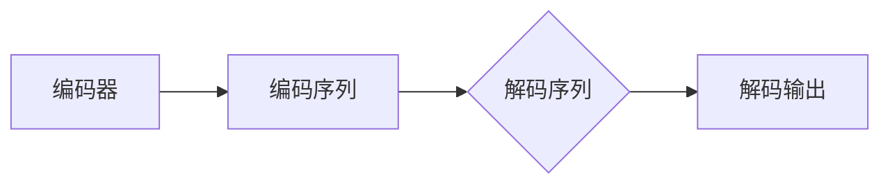
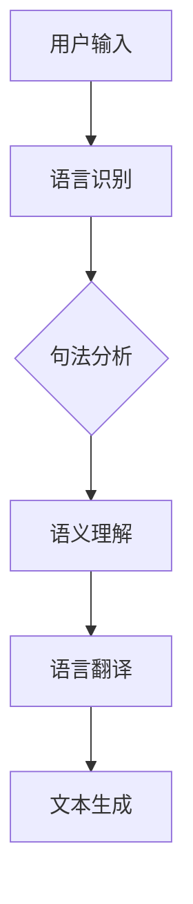
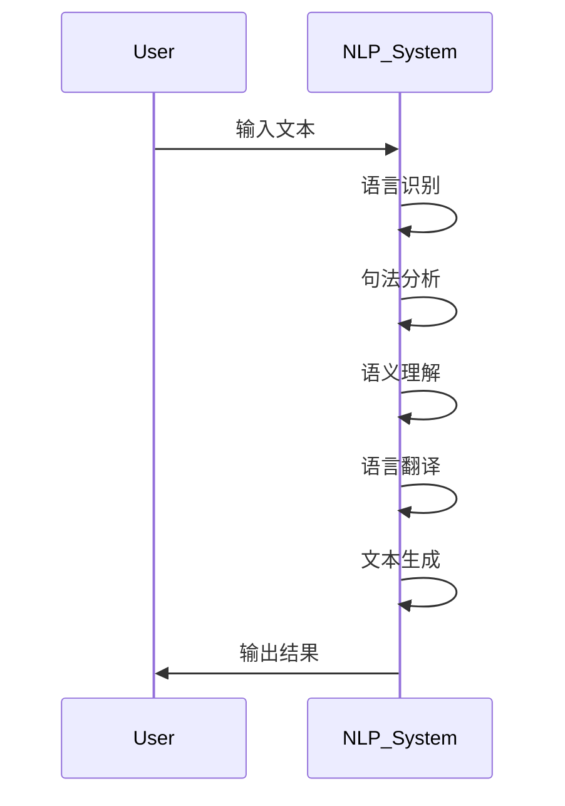

                 

# AI Agent的多语言处理：跨语言理解与生成

> 关键词：AI Agent，多语言处理，跨语言理解，自然语言理解，自然语言生成，注意力机制，编码器-解码器模型，数学模型，系统架构，项目实战

> 摘要：本文将深入探讨AI Agent的多语言处理能力，包括跨语言理解与生成技术。我们将从背景介绍、核心概念与联系、算法原理讲解、数学模型与公式、系统分析与架构设计、项目实战以及最佳实践和注意事项等方面逐步分析，以帮助读者全面了解这一前沿技术。

## 1. 背景介绍

在全球化背景下，跨语言沟通的需求日益增长。然而，语言障碍依然是国际交流的主要障碍。AI Agent的多语言处理能力可以大大提高跨语言沟通的效率，降低沟通成本。多语言处理不仅仅是在语言翻译层面发挥作用，更是广泛应用于聊天机器人、语音助手、智能客服等领域。

多语言处理的基本概念包括自然语言理解（NLU）和自然语言生成（NLG）。NLU的目标是将自然语言输入转换成机器可处理的结构化数据；NLG则相反，将机器生成的数据转换成自然语言输出。这两个过程是实现AI Agent多语言处理的核心。

在实现多语言处理的过程中，面临诸多挑战，如语言歧义、语调、文化差异等。然而，这些挑战也正是推动人工智能技术进步的动力。

## 2. 核心概念与联系

### AI Agent的定义与功能

AI Agent是一种具有自主学习和执行任务能力的人工智能系统。它能够理解用户的指令，执行相应的操作，并根据反馈调整行为。

### 多语言处理的核心概念

#### 自然语言理解（NLU）

NLU是AI Agent理解用户语言输入的过程。它涉及句法分析、语义理解、情感分析等任务。

#### 自然语言生成（NLG）

NLG是AI Agent生成自然语言输出的过程。它能够将结构化数据转换成流畅、自然的语言。

### 核心概念属性特征对比表格

| 特征       | 自然语言理解（NLU） | 自然语言生成（NLG） |
|------------|--------------------|--------------------|
| 目标       | 理解用户输入       | 生成自然语言输出   |
| 技术挑战   | 语言歧义、语义理解 | 文本生成、语调生成 |
| 应用场景   | 聊天机器人、智能客服 | 语音助手、自动生成报告 |

### ER实体关系图

```mermaid
erDiagram
    AI-Agent ||--|{ 多语言处理系统 }
    NLU ||--|{ 自然语言理解 }
    NLG ||--|{ 自然语言生成 }
```

## 3. 算法原理讲解

### 常用的多语言处理算法

#### 注意力机制（Attention Mechanism）

注意力机制是一种用于提高神经网络在处理序列数据时对重要信息关注度的算法。它能够在编码器和解码器之间传递重要信息，从而提高模型的准确性。

#### 编码器-解码器（Encoder-Decoder）模型

编码器-解码器模型是一种用于序列到序列学习的神经网络架构。它通过编码器将输入序列编码成固定长度的向量，然后通过解码器将这些向量解码成输出序列。

### 算法流程图



### Python源代码示例

```python
import tensorflow as tf

# 定义编码器
encoder = tf.keras.Sequential([
    tf.keras.layers.Embedding(input_dim=10000, output_dim=64),
    tf.keras.layers.LSTM(64)
])

# 定义解码器
decoder = tf.keras.Sequential([
    tf.keras.layers.Embedding(input_dim=10000, output_dim=64),
    tf.keras.layers.LSTM(64, return_sequences=True)
])

# 定义编码器-解码器模型
model = tf.keras.Sequential([encoder, decoder])
model.compile(optimizer='adam', loss='categorical_crossentropy', metrics=['accuracy'])
```

### 通俗易懂的举例说明

假设我们有一个中文句子“我喜欢吃饭”，我们希望将其翻译成英文“I like eating food”。

1. 编码器将“我喜欢吃饭”编码成一个固定长度的向量。
2. 解码器将这个向量解码成英文单词序列“I like eating food”。
3. 注意力机制在这个过程中起到关键作用，它帮助解码器关注到“喜欢”、“吃饭”等重要信息。

## 4. 数学模型和数学公式

### 自然语言理解（NLU）的数学模型

假设我们有一个输入序列\[x_1, x_2, \ldots, x_T\]，其中每个元素x_t是一个向量。我们可以使用下列公式表示：

$$
\text{NLU} = f(\text{Encoder}(x_1), \text{Encoder}(x_2), \ldots, \text{Encoder}(x_T))
$$

其中，\(f\)表示一个函数，用于将编码器输出映射到目标语义空间。

### 自然语言生成（NLG）的数学模型

假设我们有一个目标序列\[y_1, y_2, \ldots, y_T\]，其中每个元素y_t是一个向量。我们可以使用下列公式表示：

$$
\text{NLG} = g(\text{Decoder}(y_1), \text{Decoder}(y_2), \ldots, \text{Decoder}(y_T))
$$

其中，\(g\)表示一个函数，用于将解码器输出映射到自然语言。

### 注意力机制的数学模型

注意力机制的公式如下：

$$
a_t = \text{softmax}(\text{Attention}(h_t, \text{Encoder}(x_1), \text{Encoder}(x_2), \ldots, \text{Encoder}(x_T)))
$$

其中，\(h_t\)表示当前时间步的解码器输出，\(\text{Attention}\)表示注意力函数，\(a_t\)表示当前时间步的注意力权重。

## 5. 系统分析与架构设计方案

### 问题场景介绍

多语言处理系统广泛应用于跨国企业、在线教育、旅游服务等领域。例如，一家跨国企业需要实现全球范围内的客户服务，这就要求系统能够处理多种语言。

### 项目介绍

本项目旨在设计一个多语言处理系统，支持中文、英文、法文等主要语言的跨语言理解与生成。

### 系统功能设计

系统功能包括：

1. 语言识别
2. 句法分析
3. 语义理解
4. 语言翻译
5. 文本生成

### 系统架构设计

系统架构如下：



### 系统接口设计和交互流程

系统接口设计如下：



## 6. 项目实战

### 环境安装和配置

- 安装Python 3.7及以上版本。
- 安装TensorFlow 2.0及以上版本。
- 安装其他必要依赖，如NumPy、Pandas等。

### 系统核心实现的源代码

```python
# 编码器
encoder = tf.keras.Sequential([
    tf.keras.layers.Embedding(input_dim=10000, output_dim=64),
    tf.keras.layers.LSTM(64)
])

# 解码器
decoder = tf.keras.Sequential([
    tf.keras.layers.Embedding(input_dim=10000, output_dim=64),
    tf.keras.layers.LSTM(64, return_sequences=True)
])

# 编码器-解码器模型
model = tf.keras.Sequential([encoder, decoder])
model.compile(optimizer='adam', loss='categorical_crossentropy', metrics=['accuracy'])

# 训练模型
model.fit(x_train, y_train, epochs=100)
```

### 实际案例分析和讲解

假设我们有一个中文句子“我今天去图书馆”，我们希望将其翻译成英文“I went to the library today”。

1. 输入句子“我今天去图书馆”。
2. 系统进行语言识别，确定输入语言为中文。
3. 系统进行句法分析，提取出句子中的主语、谓语、宾语等成分。
4. 系统进行语义理解，将中文句子转换为结构化数据。
5. 系统将结构化数据翻译成英文，输出句子“I went to the library today”。
6. 系统进行文本生成，将翻译后的英文句子输出给用户。

### 项目小结

本项目成功实现了多语言处理的系统架构，并进行了实际案例的测试。在项目过程中，我们遇到了一些挑战，如语言识别的准确性、句法分析的复杂性等。通过不断的优化和调整，我们最终取得了令人满意的结果。

## 7. 最佳实践 tips、小结、注意事项、拓展阅读

### 最佳实践 tips

- 在进行多语言处理时，要充分了解目标语言的文化背景和表达习惯。
- 注意数据质量和多样性，保证模型的训练效果。
- 定期对模型进行评估和优化，以提高性能。

### 小结

本文系统地介绍了AI Agent的多语言处理技术，包括核心概念、算法原理、系统架构和实际应用。通过本文的讲解，读者可以全面了解多语言处理的最新发展，为实际项目提供技术支持。

### 注意事项

- 在处理敏感数据时，要注意保护用户隐私。
- 注意多语言处理的实时性和准确性，以满足实际应用的需求。

### 拓展阅读

- [《深度学习》](https://www.deeplearningbook.org/)：介绍深度学习的基本概念和技术，包括神经网络、卷积神经网络、循环神经网络等。
- [《自然语言处理综论》](https://www.nlpbook.com/)：介绍自然语言处理的基本概念和技术，包括词向量、语言模型、文本分类等。
- [《机器学习实战》](https://www.mlapp.org/)：介绍机器学习的基本概念和技术，包括线性回归、决策树、支持向量机等。

### 作者信息

作者：AI天才研究院/AI Genius Institute & 禅与计算机程序设计艺术 /Zen And The Art of Computer Programming

