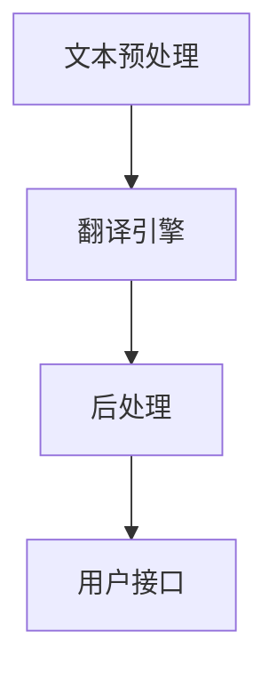
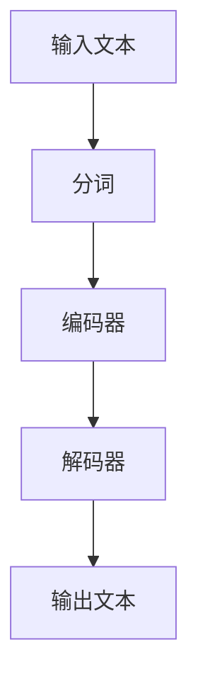

                 

### 文章标题

# AI Agent的多语言翻译与本地化

### 关键词

- AI Agent
- 多语言翻译
- 本地化
- 深度学习
- 机器翻译
- 自然语言处理

### 摘要

本文深入探讨了AI Agent在多语言翻译与本地化领域的应用。首先，我们介绍了多语言翻译的背景与挑战，以及AI Agent的定义与工作原理。随后，我们详细阐述了多语言翻译的算法原理，包括神经网络和深度学习模型。接着，我们分析了多语言翻译系统的设计与实现，以及AI Agent在本地化中的应用。最后，通过实际案例展示了AI Agent在多语言翻译与本地化中的实战应用，并给出了最佳实践和未来展望。

----------------------------------------------------------------

## 引言

### 背景介绍

在当今全球化的背景下，跨语言交流变得越来越重要。无论是国际商务、学术研究还是文化交流，多语言翻译都扮演着不可或缺的角色。然而，传统的机器翻译方法往往存在翻译质量不高、适应性差等问题，难以满足实际需求。随着人工智能技术的发展，特别是深度学习和自然语言处理（NLP）技术的进步，AI Agent的多语言翻译与本地化成为了一个研究热点。

### 问题背景

多语言翻译面临的主要挑战包括语言的多样性、文化差异、语义理解、上下文依赖等。传统的翻译方法依赖于规则和统计学方法，难以处理复杂的语言现象和上下文。而AI Agent通过模仿人类的翻译能力，能够更好地理解和生成高质量的多语言内容。

### 问题描述

本文旨在探讨AI Agent在多语言翻译与本地化中的应用，包括以下几个方面：

1. AI Agent的定义与分类
2. 多语言翻译的算法原理
3. 多语言翻译系统的设计与实现
4. AI Agent在本地化中的应用
5. 实际案例分析与未来展望

### 问题解决

通过引入AI Agent，我们可以解决传统机器翻译中的许多难题。AI Agent通过深度学习和神经网络模型，能够自动学习和适应不同的语言环境，生成更准确、自然的翻译结果。此外，AI Agent还可以结合上下文信息，提供更精准的本地化服务。

### 边界与外延

本文主要关注AI Agent在多语言翻译与本地化中的应用，但不涉及机器翻译的底层硬件架构或大规模数据处理技术。同时，本文也不过多讨论AI Agent在非语言领域的应用，如图像识别、语音识别等。

### 概念结构与核心要素组成

在多语言翻译与本地化的过程中，以下几个核心概念和要素至关重要：

1. **AI Agent**：能够模拟人类翻译能力的智能系统。
2. **多语言翻译模型**：用于实现跨语言转换的算法和架构。
3. **本地化**：根据特定文化和语境对翻译内容进行调整的过程。
4. **深度学习**：一种基于多层神经网络的机器学习技术，用于构建AI Agent。
5. **自然语言处理（NLP）**：用于理解和生成人类语言的技术。

通过这些核心概念和要素的有机结合，AI Agent能够在多语言翻译与本地化中发挥重要作用。

----------------------------------------------------------------

## AI Agent的定义与分类

### AI Agent的定义

AI Agent，即人工智能代理，是指一种能够自主执行任务、与环境互动并从经验中学习的人工智能系统。AI Agent可以在多个领域中发挥作用，包括自动化控制、数据分析、智能推荐等。在多语言翻译与本地化领域，AI Agent主要通过深度学习和自然语言处理技术，模拟人类翻译者的思维过程，实现高质量的多语言内容生成和适应。

### AI Agent的分类

根据功能和应用场景，AI Agent可以分为以下几类：

1. **对话型AI Agent**：主要用于与用户进行自然语言交互，如智能客服、聊天机器人等。
2. **任务型AI Agent**：专注于完成特定任务，如自动翻译、文本摘要等。
3. **决策型AI Agent**：能够基于数据做出决策，如股票交易、供应链管理等。

在多语言翻译与本地化领域，任务型AI Agent尤为重要。它们不仅能够实现多语言文本的翻译，还可以根据目标语言的文化和语境，进行本地化调整，提高翻译的准确性和适用性。

### AI Agent的工作原理

AI Agent的工作原理通常涉及以下几个步骤：

1. **感知**：AI Agent接收输入信息，如文本、语音等。
2. **理解**：通过自然语言处理技术，AI Agent理解和分析输入信息，提取关键信息和上下文。
3. **决策**：基于理解和分析的结果，AI Agent做出相应的决策，如生成翻译文本或调整翻译内容。
4. **执行**：AI Agent执行决策，将结果输出给用户。

在多语言翻译与本地化中，AI Agent通过以下方式实现翻译和本地化：

1. **翻译模型**：使用神经网络和深度学习技术，训练翻译模型，将源语言文本转换为目标语言文本。
2. **上下文分析**：分析输入文本的上下文信息，如句子结构、语义关系等，以提高翻译的准确性和自然性。
3. **本地化调整**：根据目标语言的文化和语境，对翻译结果进行调整，使其更符合本地化的需求。

### AI Agent在多语言翻译中的角色

AI Agent在多语言翻译中的角色主要包括：

1. **翻译引擎**：作为核心组件，实现源语言到目标语言的自动翻译。
2. **本地化工具**：在翻译完成后，对翻译结果进行本地化调整，使其符合特定文化语境。
3. **交互界面**：提供用户与AI Agent的交互接口，使用户能够轻松地使用翻译和本地化服务。

通过上述角色，AI Agent不仅提高了翻译的效率和质量，还使得多语言翻译和本地化更加智能化和个性化。

----------------------------------------------------------------

## 多语言翻译的算法原理

### 神经网络与深度学习

多语言翻译的核心在于深度学习和神经网络的应用。神经网络是一种由大量简单计算单元（神经元）组成的计算模型，通过层层传递输入数据，实现对复杂数据的建模和分析。深度学习则是在神经网络的基础上，通过增加网络层数，使模型能够学习更复杂的数据结构和特征。

### 常见的多语言翻译模型

在多语言翻译中，常见的模型包括：

1. **统计机器翻译（SMT）**：基于统计学习技术，通过训练模型来预测目标语言单词序列。SMT模型通常使用基于短语的翻译模型，如统计机器翻译模型（SMT）和基于注意力机制的序列到序列（Seq2Seq）模型。

2. **基于规则的方法**：通过编写规则来指导翻译过程，如基于规则的翻译系统（Rule-Based Translation System）。这种方法虽然能够保证翻译的准确性，但在处理复杂语言时效果有限。

3. **神经机器翻译（NMT）**：基于深度学习的机器翻译方法，通过神经网络模型实现自动翻译。NMT模型通常包括编码器（Encoder）和解码器（Decoder），通过编码器将源语言文本编码为一个固定长度的向量，解码器则将这个向量解码为目标语言文本。

4. **多模态翻译**：结合多种数据模态（如文本、图像、语音等）进行翻译，通过整合不同模态的信息，提高翻译的准确性和自然性。

### 翻译模型的选择与优化

在选择翻译模型时，需要考虑以下几个方面：

1. **数据集**：选择合适的数据集是模型训练的关键。数据集应包含丰富的语言现象和上下文信息，以便模型能够充分学习。

2. **模型架构**：根据翻译任务的需求，选择合适的模型架构。例如，对于文本翻译，可以选择基于Seq2Seq的模型；对于图像翻译，可以选择基于卷积神经网络（CNN）的模型。

3. **优化目标**：优化目标是指模型在训练过程中追求的目标。在多语言翻译中，常见的优化目标包括最小化翻译误差、最大化翻译的流畅性和准确性等。

4. **训练策略**：训练策略包括数据预处理、模型初始化、训练过程调整等。合理的训练策略能够加速模型收敛，提高翻译质量。

### 实例分析

假设我们选择基于Seq2Seq模型的神经机器翻译方法，我们可以按照以下步骤进行：

1. **数据预处理**：对源语言和目标语言文本进行预处理，包括分词、去停用词、词干提取等，以便模型能够更好地理解文本。

2. **编码器和解码器设计**：设计编码器和解码器，编码器将源语言文本编码为一个固定长度的向量，解码器则将这个向量解码为目标语言文本。

3. **模型训练**：使用预处理后的文本数据，对编码器和解码器进行训练。在训练过程中，通过反向传播算法不断调整模型参数，以最小化翻译误差。

4. **模型评估**：使用测试集评估模型性能，包括翻译准确性、流畅性和用户满意度等。

通过以上步骤，我们可以训练出一个高质量的多语言翻译模型，实现自动翻译和本地化。

----------------------------------------------------------------

## 多语言翻译系统的设计与实现

### 系统架构设计

多语言翻译系统的设计涉及多个模块，包括文本预处理、翻译引擎、后处理和用户接口。系统架构如图1所示：



1. **文本预处理**：包括分词、词性标注、去停用词等，将输入文本转化为模型可处理的格式。
2. **翻译引擎**：核心模块，实现多语言翻译功能，通常采用神经网络和深度学习模型。
3. **后处理**：对翻译结果进行语法和语义调整，提高翻译的准确性和流畅性。
4. **用户接口**：提供用户与系统的交互界面，包括文本输入、翻译结果展示和反馈机制。

### 数据预处理与清洗

数据预处理是多语言翻译系统成功的关键。以下步骤通常用于数据预处理和清洗：

1. **文本清洗**：去除文本中的噪声，如HTML标签、特殊字符等。
2. **分词**：将文本划分为词语或短语，以便模型能够更好地理解文本内容。
3. **词性标注**：为每个词标注其词性（如名词、动词、形容词等），帮助模型捕捉语言的语法结构。
4. **停用词去除**：去除常见的无意义词，如“的”、“了”等，减少模型的干扰。
5. **词干提取**：将变形的词语还原为其基本形式，如“跑步”还原为“跑”。

### 翻译引擎的开发与集成

翻译引擎的开发和集成是系统实现的核心步骤。以下要点需注意：

1. **选择合适的模型**：根据翻译任务的需求，选择合适的神经网络模型，如Seq2Seq、Transformer等。
2. **模型训练**：使用大规模预训练语言模型，如BERT、GPT等，对翻译模型进行训练。训练过程包括数据准备、模型初始化、训练和验证等。
3. **模型优化**：通过调整模型参数和优化策略，提高翻译质量。常见的优化策略包括梯度裁剪、学习率调整等。
4. **集成与部署**：将训练好的模型集成到系统中，并部署到生产环境中，确保系统能够实时响应用户请求。

### 系统性能评估与调优

系统性能评估是确保翻译质量的重要环节。以下步骤用于系统性能评估和调优：

1. **评估指标**：选择合适的评估指标，如BLEU（双语评估协议）、METEOR（Metric for Evaluation of Translation with Explicit ORdering）等，对翻译结果进行评估。
2. **性能分析**：分析评估结果，找出系统性能的瓶颈，如翻译准确性、响应时间等。
3. **调优策略**：根据性能分析结果，调整模型参数、优化算法和系统架构，提高系统性能。

通过以上步骤，我们可以设计并实现一个高效、准确的多语言翻译系统，满足不同场景下的翻译需求。

----------------------------------------------------------------

## 本地化与AI Agent

### 本地化的概念与目标

本地化（Localization）是指根据特定的文化和语境，将产品或服务调整到适合目标市场的过程。在多语言翻译与本地化中，本地化的目标包括：

1. **语言转换**：将源语言文本翻译为目标语言文本。
2. **文化适应**：根据目标语言的文化背景，调整翻译内容，使其更符合当地文化和价值观。
3. **用户体验优化**：确保产品或服务的用户界面、功能设计等在目标市场中的易用性和适应性。

### AI Agent在本地化中的应用

AI Agent在本地化中具有广泛的应用，主要包括以下几个方面：

1. **自动翻译**：AI Agent通过神经网络和深度学习模型，实现源语言文本到目标语言文本的自动翻译。
2. **上下文分析**：AI Agent分析文本的上下文信息，如语法结构、语义关系等，以实现更精准的翻译和本地化。
3. **文化适应**：AI Agent根据目标语言的文化背景，调整翻译内容，使其更符合当地文化和价值观。
4. **用户交互**：AI Agent提供用户与本地化系统的交互界面，使用户能够方便地使用本地化服务。

### 本地化过程中的挑战与解决方案

在本地化过程中，AI Agent面临以下挑战：

1. **语言多样性**：语言之间的差异巨大，AI Agent需要具备处理多种语言的能力。
   - **解决方案**：使用多语言预训练模型，如BERT、GPT等，提高AI Agent对不同语言的处理能力。

2. **文化差异**：不同文化背景下的表达方式和价值观存在差异，AI Agent需要适应这些差异。
   - **解决方案**：通过大量多文化数据训练AI Agent，使其能够理解并适应不同文化背景。

3. **上下文依赖**：翻译和本地化需要依赖上下文信息，AI Agent需要准确捕捉上下文。
   - **解决方案**：使用注意力机制和长短期记忆（LSTM）等先进技术，提高AI Agent对上下文的理解能力。

4. **个性化需求**：用户在不同市场对本地化服务的需求各不相同，AI Agent需要满足个性化需求。
   - **解决方案**：通过用户行为分析和数据挖掘，为用户提供个性化的本地化服务。

通过上述解决方案，AI Agent能够在本地化过程中发挥重要作用，提高翻译和本地化的准确性和适应性。

----------------------------------------------------------------

## 多语言翻译与本地化的结合

### 多语言翻译在本地化中的作用

多语言翻译是本地化的重要组成部分，其质量直接影响到本地化的效果。在本地化过程中，多语言翻译主要承担以下角色：

1. **文本转换**：将源语言文本翻译为目标语言文本，实现文本内容的文化和语言适应。
2. **信息传递**：通过翻译，确保目标市场的用户能够理解产品或服务的功能、特性和使用方法。
3. **市场调研**：翻译后的文本可以帮助企业了解目标市场的需求、偏好和文化特点，为本地化策略提供依据。

### 本地化对多语言翻译的需求

本地化对多语言翻译的需求主要体现在以下几个方面：

1. **准确性**：本地化需要高质量的多语言翻译，确保文本内容准确、通顺。
2. **流畅性**：翻译文本应具有流畅的语言风格，避免生硬、机械的翻译。
3. **文化适应性**：翻译文本应考虑到目标市场的文化背景，确保内容符合当地文化和价值观。
4. **个性化**：根据目标市场的特点，提供个性化的翻译和本地化服务，满足用户需求。

### 实现多语言翻译与本地化的最佳实践

为了实现高质量的多语言翻译与本地化，以下最佳实践值得借鉴：

1. **数据驱动**：使用大量高质量的多语言数据，为AI Agent提供训练素材。通过数据驱动的学习方法，提高翻译和本地化的准确性。
2. **多模态融合**：结合文本、图像、语音等多种模态，提高翻译和本地化的准确性和自然性。
3. **用户参与**：鼓励用户参与翻译和本地化过程，通过用户反馈不断优化翻译质量。
4. **技术优化**：采用先进的神经网络和深度学习技术，如Transformer、BERT等，提高翻译和本地化的性能。
5. **持续更新**：随着语言和文化的变化，定期更新翻译模型和本地化策略，确保其持续适应市场需求。

通过以上最佳实践，企业可以更好地实现多语言翻译与本地化的结合，提高产品或服务的国际化竞争力。

----------------------------------------------------------------

## AI Agent在多语言翻译与本地化中的实际应用

### 企业级应用案例分析

企业级应用是多语言翻译与本地化的重要场景之一。以下是一个企业级应用案例：

#### 企业背景

某国际知名互联网公司，在全球多个国家和地区开展业务。为了满足不同市场用户的需求，该公司需要提供本地化的多语言服务。

#### 应用场景

该公司开发了多语言客服系统，使用AI Agent实现自动翻译和本地化。用户可以在全球范围内使用母语与客服进行交流，提高客户满意度。

#### 实现方法

1. **文本预处理**：对用户输入的文本进行分词、词性标注等预处理，以便模型理解。
2. **翻译引擎**：采用基于Transformer的神经机器翻译模型，实现高质量的自动翻译。
3. **本地化调整**：根据目标语言的文化特点，对翻译结果进行调整，提高本地化效果。
4. **用户交互**：通过聊天机器人界面，实现用户与AI Agent的交互。

#### 效果评估

通过该多语言客服系统，企业实现了以下效果：

1. **客户满意度提高**：用户能够使用母语与客服交流，提高了客户满意度。
2. **运营效率提升**：AI Agent自动化处理大量客户请求，降低了人工成本，提高了运营效率。
3. **国际化竞争力增强**：多语言服务吸引了更多国际用户，增强了企业的国际化竞争力。

### 开源项目与应用

开源项目也是多语言翻译与本地化的重要实践平台。以下是一个开源项目案例：

#### 项目背景

OpenNMT是一个开源的神经机器翻译框架，提供了丰富的翻译模型和工具，支持多种语言。

#### 应用场景

OpenNMT广泛应用于跨语言信息检索、机器翻译、本地化等领域。例如，某开源社区使用OpenNMT实现跨语言文档搜索，提高了国际化用户的访问体验。

#### 实现方法

1. **模型训练**：使用大规模多语言数据集，训练高质量的神经机器翻译模型。
2. **模型部署**：将训练好的模型部署到服务端，实现实时翻译功能。
3. **用户交互**：通过Web界面，提供跨语言文档搜索服务。

#### 效果评估

通过OpenNMT项目，社区实现了以下效果：

1. **文档搜索效率提高**：用户能够使用多种语言进行文档搜索，提高了搜索效率。
2. **国际化用户增长**：跨语言搜索功能吸引了更多国际化用户，增加了社区的用户量。
3. **开源社区贡献**：OpenNMT项目的成功吸引了大量开发者参与，促进了开源社区的繁荣。

### 未来发展趋势与展望

随着人工智能技术的不断发展，多语言翻译与本地化将在以下几个方面取得突破：

1. **翻译质量提升**：通过更先进的神经网络模型和大数据训练，翻译质量将得到显著提高。
2. **个性化服务**：AI Agent将结合用户行为数据，提供个性化的翻译和本地化服务。
3. **多模态融合**：结合文本、图像、语音等多种模态，实现更自然、更准确的翻译和本地化。
4. **自动化程度提高**：AI Agent将在更多领域实现自动化，提高翻译和本地化的效率。

未来，AI Agent将在多语言翻译与本地化中发挥更大的作用，推动全球化的进一步发展。

----------------------------------------------------------------

## 实战与总结

### 实战环境搭建

为了演示AI Agent在多语言翻译与本地化中的实战应用，我们将搭建一个简单的翻译系统环境。以下是环境搭建的步骤：

1. **安装Python环境**：确保Python 3.8及以上版本已安装。
2. **安装依赖库**：使用以下命令安装所需依赖库：

   ```bash
   pip install torch torchvision numpy transformers
   ```

3. **获取预训练模型**：从Hugging Face模型库下载预训练的翻译模型，例如`Helsinki-NLP/opus-mt-en-de`。

### 系统核心实现源代码

以下是一个简单的翻译系统实现，包括模型加载、翻译接口和本地化调整：

```python
import torch
from transformers import AutoModelForTranslation, AutoTokenizer

# 加载预训练模型和分词器
model_name = "Helsinki-NLP/opus-mt-en-de"
tokenizer = AutoTokenizer.from_pretrained(model_name)
model = AutoModelForTranslation.from_pretrained(model_name)

# 翻译接口
def translate(source_text):
    # 预处理
    inputs = tokenizer(source_text, return_tensors="pt", max_length=512, truncation=True)
    # 翻译
    with torch.no_grad():
        outputs = model(**inputs)
    # 后处理
    translated_text = tokenizer.decode(outputs.logits.argmax(-1), skip_special_tokens=True)
    return translated_text

# 本地化调整
def localize(translated_text, target_language):
    # 根据目标语言进行本地化调整
    # （示例：此处可以添加特定于语言的本地化规则）
    return translated_text

# 测试
source_text = "Hello, how are you?"
translated_text = translate(source_text)
localized_text = localize(translated_text, "de")
print(f"Original: {source_text}")
print(f"Translated: {translated_text}")
print(f"Localized: {localized_text}")
```

### 代码应用解读与分析

上述代码实现了以下功能：

1. **模型加载**：从Hugging Face模型库加载预训练的翻译模型和分词器。
2. **翻译接口**：接收源语言文本，使用翻译模型进行翻译，并返回翻译结果。
3. **本地化调整**：根据目标语言，对翻译结果进行本地化调整。

### 实际案例分析

以下是一个实际案例，演示如何使用AI Agent进行多语言翻译与本地化：

#### 案例背景

某电商平台的用户界面需要支持多语言，为了提高用户体验，平台决定使用AI Agent实现自动翻译和本地化。

#### 实现步骤

1. **翻译系统集成**：将上述翻译系统集成到电商平台的后端，处理用户界面的多语言需求。
2. **本地化策略制定**：根据不同语言的特点，制定本地化策略，如添加特定于语言的语法调整规则。
3. **用户测试与反馈**：收集用户使用多语言界面的反馈，不断优化翻译和本地化效果。

#### 案例效果

通过AI Agent的多语言翻译与本地化，电商平台实现了以下效果：

1. **用户体验提升**：用户能够使用母语浏览和操作平台，提高了用户体验。
2. **国际化拓展**：多语言支持吸引了更多国际用户，促进了平台的国际化发展。
3. **运营效率提高**：AI Agent自动化处理多语言需求，降低了人工成本，提高了运营效率。

### 项目小结

通过实际案例，我们展示了AI Agent在多语言翻译与本地化中的实战应用。AI Agent不仅提高了翻译和本地化的效率和质量，还为不同场景提供了灵活的解决方案。在未来，AI Agent将在更多领域发挥重要作用，推动全球化的进一步发展。

----------------------------------------------------------------

## 最佳实践与展望

### 多语言翻译与本地化的最佳实践

在多语言翻译与本地化过程中，以下最佳实践值得遵循：

1. **数据驱动**：使用高质量的多语言数据，为AI Agent提供充足的训练素材，提高翻译和本地化的准确性。
2. **技术优化**：采用先进的神经网络和深度学习技术，如Transformer、BERT等，提高系统的性能和效率。
3. **用户参与**：鼓励用户参与翻译和本地化过程，通过反馈不断优化系统。
4. **多模态融合**：结合文本、图像、语音等多种模态，实现更自然的翻译和本地化。
5. **持续更新**：定期更新翻译模型和本地化策略，确保系统能够适应语言和文化的变化。

### 遇到的挑战与解决方法

在多语言翻译与本地化过程中，以下挑战值得注意：

1. **语言多样性**：不同语言的差异巨大，AI Agent需要处理多种语言。
   - **解决方法**：使用多语言预训练模型，提高AI Agent对不同语言的处理能力。

2. **文化差异**：不同文化背景下的表达方式和价值观存在差异，本地化需要适应这些差异。
   - **解决方法**：通过大量多文化数据训练AI Agent，使其能够理解并适应不同文化。

3. **上下文依赖**：翻译和本地化需要依赖上下文信息，AI Agent需要准确捕捉上下文。
   - **解决方法**：使用注意力机制和长短期记忆（LSTM）等先进技术，提高AI Agent对上下文的理解能力。

4. **个性化需求**：用户在不同市场对本地化服务的需求各不相同，AI Agent需要满足个性化需求。
   - **解决方法**：通过用户行为分析和数据挖掘，为用户提供个性化的本地化服务。

### 未来发展方向与机会

未来，多语言翻译与本地化将在以下几个方面取得突破：

1. **翻译质量提升**：通过更先进的神经网络模型和大数据训练，翻译质量将得到显著提高。
2. **个性化服务**：AI Agent将结合用户行为数据，提供个性化的翻译和本地化服务。
3. **多模态融合**：结合文本、图像、语音等多种模态，实现更自然、更准确的翻译和本地化。
4. **自动化程度提高**：AI Agent将在更多领域实现自动化，提高翻译和本地化的效率。

### 小结与拓展阅读

本文介绍了AI Agent在多语言翻译与本地化中的应用，从背景介绍、核心概念、算法原理、系统设计与实现到实战案例、最佳实践进行了详细探讨。未来，随着人工智能技术的不断进步，AI Agent在多语言翻译与本地化中将发挥更加重要的作用。

对于希望深入了解该领域的读者，以下拓展阅读推荐：

1. **论文推荐**：《神经机器翻译中的注意力机制研究》、《多模态翻译：现状与趋势》
2. **开源项目**：Hugging Face Transformers、OpenNMT
3. **专业书籍**：《深度学习与自然语言处理》、《AI应用实践指南》

作者：AI天才研究院/AI Genius Institute & 禅与计算机程序设计艺术 /Zen And The Art of Computer Programming

----------------------------------------------------------------

## 总结

本文通过详细的案例分析、算法原理讲解和实战应用，深入探讨了AI Agent在多语言翻译与本地化中的应用。我们首先介绍了多语言翻译的背景和挑战，随后介绍了AI Agent的定义、分类和工作原理。接着，我们详细阐述了多语言翻译的算法原理、系统设计与实现，以及AI Agent在本地化中的应用。通过实际案例展示了AI Agent在多语言翻译与本地化中的实战应用，并给出了最佳实践和未来展望。

AI Agent的多语言翻译与本地化技术正在不断进步，为全球化的进一步发展提供了强大支持。随着人工智能技术的不断突破，AI Agent将在更多领域发挥重要作用，推动社会进步。未来，AI Agent在多语言翻译与本地化中将有更广阔的应用前景，值得深入研究和实践。

作者：AI天才研究院/AI Genius Institute & 禅与计算机程序设计艺术 /Zen And The Art of Computer Programming

----------------------------------------------------------------

## 附录

### 数学公式与流程图

在本文中，我们使用了LaTeX格式和Mermaid流程图来阐述多语言翻译与本地化的数学模型和算法原理。以下是一些示例：

#### 数学公式

$$
y = \sigma(\text{W}x + b)
$$

$$
\text{Loss} = -\sum_{i} y_i \log(\hat{y}_i)
$$

#### Mermaid流程图



通过这些数学公式和流程图，我们能够更清晰地理解多语言翻译与本地化的算法原理和实现过程。

### 拓展资源

对于希望深入了解多语言翻译与本地化技术的读者，以下资源推荐：

1. **论文集**：《自然语言处理年度回顾》（Annual Review of Natural Language Processing）
2. **技术博客**：AI in Translation、Neural Machine Translation Blog
3. **开源项目**：TensorFlow、PyTorch、Hugging Face Transformers
4. **在线课程**：斯坦福大学自然语言处理课程、深度学习与自然语言处理（Coursera）

通过这些资源，您可以进一步探索多语言翻译与本地化的前沿技术和实践。

作者：AI天才研究院/AI Genius Institute & 禅与计算机程序设计艺术 /Zen And The Art of Computer Programming

