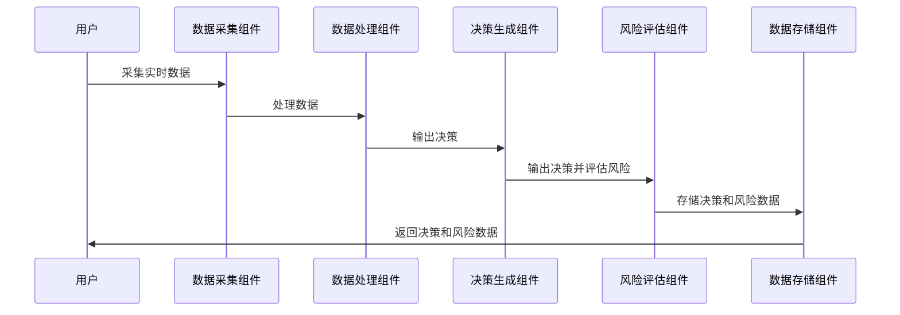
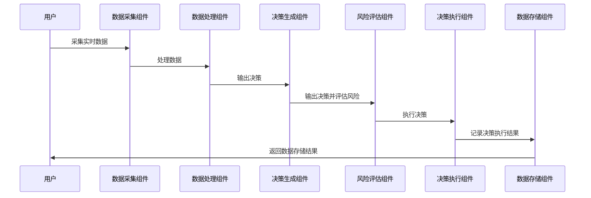

                 


### 引言

在当今社会，人工智能（AI）技术的飞速发展，极大地改变了各行各业的生产和运作方式。AI Agent作为人工智能的核心组件，扮演着越来越重要的角色。本文将探讨AI Agent的实时决策与风险评估系统，旨在揭示这一系统在实践中的关键作用和实现原理。

关键词：人工智能、AI Agent、实时决策、风险评估、系统架构

摘要：
本文首先介绍了实时决策与风险评估系统的背景和核心概念，然后详细阐述了AI Agent的概念、原理及其与实时决策、风险评估的联系。接着，我们深入分析了决策算法和风险评估算法的原理，通过具体的示例代码和数学模型，帮助读者更好地理解这些算法的工作机制。在此基础上，我们进一步探讨了系统的架构设计，包括功能设计、系统架构、接口设计以及系统交互流程。最后，通过实际案例的分析，总结了系统在实践中的应用效果，并提出了最佳实践建议。

通过本文的阅读，读者将能够全面了解AI Agent实时决策与风险评估系统的构建方法，掌握相关算法的核心原理，并为未来的研究和应用提供参考。

----------------------------------------------------------------

**一、背景介绍**

随着人工智能技术的不断进步，自动化决策系统已经成为现代工业、商业和军事等领域的重要工具。实时决策与风险评估系统作为自动化决策系统的一个重要分支，具有极高的实用价值和重要的战略意义。

#### 问题背景

实时决策与风险评估系统的重要性主要体现在以下几个方面：

1. **工业自动化**：在现代工业中，实时决策系统能够帮助企业实现生产线的自动化控制，提高生产效率和产品质量，降低运营成本。风险评估系统则可以在生产线出现故障或异常情况时，快速识别并采取措施，防止事故的发生。

2. **金融风险管理**：金融行业对风险的敏感度非常高，实时决策与风险评估系统能够帮助金融机构迅速识别市场风险，调整投资策略，保障资产安全。

3. **智能交通管理**：在交通领域，实时决策与风险评估系统能够有效管理交通流量，优化交通信号控制，提高道路通行效率，减少交通事故。

4. **军事指挥**：在军事领域，实时决策与风险评估系统可以帮助指挥官快速做出战略决策，评估战场态势，制定有效的作战计划。

然而，现有的决策系统在应对复杂、动态环境时，往往存在响应速度慢、决策效果差等问题。这就需要我们设计和实现一种更为高效、可靠的实时决策与风险评估系统。

#### 核心概念

1. **AI Agent**：AI Agent是一种能够自主执行任务、与环境交互的智能体。它具有感知环境、制定计划、执行计划的能力。

2. **实时决策**：实时决策是指在动态环境中，系统能够快速响应用户请求或环境变化，做出最优或次优决策的过程。

3. **风险评估**：风险评估是对潜在风险进行识别、评估和管理的系统。它能够预测风险的概率和影响度，为决策提供依据。

#### 边界与外延

实时决策与风险评估系统的边界主要涉及以下几个方面：

- **时间敏感性**：系统必须在规定的时间内做出决策，响应速度是评估系统性能的重要指标。
- **数据处理能力**：系统能够高效处理大量实时数据，并从中提取有用信息。
- **决策精度**：系统做出的决策必须能够有效应对实际环境的变化。

系统的外延则包括应用场景的拓展，如自动化生产线、智能交通管理、金融风险管理等。

**二、核心概念与联系**

要深入理解实时决策与风险评估系统，首先需要明确AI Agent的概念及其与实时决策、风险评估的关系。

#### AI Agent的概念与原理

AI Agent是指一种能够自主执行任务、与环境进行交互的智能体。它具备以下核心特点：

1. **自主性**：AI Agent能够根据预先设定的目标和规则，自主制定计划并执行。
2. **感知能力**：AI Agent能够感知环境的变化，获取必要的输入信息。
3. **学习与适应能力**：AI Agent能够通过学习不断优化自己的行为，适应环境的变化。

AI Agent与传统自动化系统的关键区别在于：

1. **自适应能力**：传统自动化系统主要依靠预设的程序和规则进行操作，而AI Agent能够根据环境变化自主调整行为。
2. **决策能力**：传统自动化系统缺乏决策能力，而AI Agent能够根据感知到的环境信息，做出实时决策。

#### 实时决策原理

实时决策是指系统在动态环境中，能够快速响应用户请求或环境变化，做出最优或次优决策的过程。实时决策主要包括以下几个类型：

1. **基于规则的决策**：系统根据预设的规则库，对输入的信息进行匹配和推理，生成决策。
2. **基于模型的决策**：系统利用建立的模型，对输入的信息进行分析和处理，生成决策。
3. **混合决策**：系统结合基于规则和基于模型的决策方法，根据不同场景选择合适的决策方法。

实时决策的类型取决于系统的应用场景和数据特性。在实际应用中，系统需要根据具体情况选择合适的决策类型，以达到最佳的决策效果。

#### 风险评估模型介绍

风险评估是对潜在风险进行识别、评估和管理的系统。它能够预测风险的概率和影响度，为决策提供依据。常见风险评估模型包括：

1. **概率风险评估**：通过计算风险事件发生的概率和影响度，评估整体风险水平。
2. **贝叶斯风险评估**：利用贝叶斯网络模型，对风险事件进行概率推理，评估风险。
3. **蒙特卡洛风险评估**：通过模拟大量随机样本，评估风险的概率和影响度。

不同风险评估模型适用于不同类型的风险分析和决策环境。在实际应用中，系统需要根据风险评估模型的特点，选择合适的评估方法。

#### 核心概念属性特征对比

| 特征         | AI Agent                       | 实时决策                             | 风险评估                       |
| ------------ | ------------------------------ | ----------------------------------- | ------------------------------ |
| 目标         | 自动化执行任务                 | 快速响应环境变化                     | 识别、评估和管理风险            |
| 算法依赖     | 数据驱动                       | 实时数据分析与处理                   | 统计模型与概率分析             |
| 应对策略     | 自适应调整行为                 | 预测与调整决策策略                   | 风险缓解与控制策略             |

通过对比可以看出，AI Agent、实时决策和风险评估在目标和应对策略上存在明显差异，但它们在算法依赖和数据处理能力上具有紧密的联系。

**三、算法原理**

为了实现高效的实时决策与风险评估，我们需要深入理解相关算法的原理。下面我们将分别介绍决策算法和风险评估算法。

#### 决策算法原理

决策算法是指系统能够根据输入信息，生成最优或次优决策的过程。决策算法可以分为基于规则的决策算法和基于模型的决策算法。

1. **基于规则的决策算法**

   基于规则的决策算法依赖于预设的规则库，通过推理和匹配生成决策。其核心思想是将输入信息与规则库中的规则进行匹配，找到匹配度最高的规则，并根据该规则生成决策。

   基于规则的决策算法具有实现简单、易于理解等优点，但其在应对复杂、动态环境时，存在决策速度慢、适应性差等问题。

2. **基于模型的决策算法**

   基于模型的决策算法依赖于建立的模型，通过对输入信息进行分析和处理，生成决策。常见的模型包括决策树、神经网络、贝叶斯网络等。

   基于模型的决策算法具有适应性强、决策速度快等优点，但模型建立和训练过程相对复杂，对数据质量要求较高。

#### 风险评估算法

风险评估算法是指系统能够对潜在风险进行识别、评估和管理的算法。常见风险评估算法包括概率风险评估、贝叶斯风险评估和蒙特卡洛风险评估。

1. **概率风险评估**

   概率风险评估通过计算风险事件发生的概率和影响度，评估整体风险水平。其核心思想是利用统计模型，对风险事件进行概率推理，生成风险评分。

   概率风险评估具有计算简单、易于理解等优点，但其在应对复杂、不确定环境时，存在决策精度不高的问题。

2. **贝叶斯风险评估**

   贝叶斯风险评估利用贝叶斯网络模型，对风险事件进行概率推理，评估风险。其核心思想是根据先验知识和观察数据，更新风险概率分布。

   贝叶斯风险评估具有适应性强、决策精度高等优点，但模型建立和训练过程较为复杂，对数据质量要求较高。

3. **蒙特卡洛风险评估**

   蒙特卡洛风险评估通过模拟大量随机样本，评估风险的概率和影响度。其核心思想是基于随机模拟，生成大量样本数据，利用统计方法分析样本数据，得出风险评估结果。

   蒙特卡洛风险评估具有计算高效、适应性强等优点，但计算量大，对计算资源要求较高。

#### 结合示例详细阐述

为了更好地理解决策算法和风险评估算法的原理，我们通过具体的示例进行详细阐述。

1. **决策算法示例**

   假设一个工厂需要根据生产数据，决定是否启动备用生产线。我们可以使用基于规则的决策算法来实现。

   ```python
   # 决策规则
   rules = {
       'rule1': {'condition': '生产负荷 > 80%', 'action': '启动备用生产线'},
       'rule2': {'condition': '设备故障率 > 10%', 'action': '启动备用生产线'},
       'rule3': {'condition': '原材料库存不足', 'action': '启动备用生产线'}
   }

   # 输入信息
   input_data = {
       '生产负荷': 85,
       '设备故障率': 12,
       '原材料库存': 500
   }

   # 决策逻辑
   for rule in rules.values():
       if eval(rule['condition']):
           print(f'根据规则{rule["name"]},决策为：{rule["action"]}')
           break
   ```

   在此示例中，系统根据输入的生产数据，匹配预设的决策规则，最终决定是否启动备用生产线。

2. **风险评估算法示例**

   假设一个投资组合需要进行风险评估，我们可以使用概率风险评估算法来实现。

   ```python
   # 风险事件概率分布
   probability_distribution = {
       '市场风险': {'概率': 0.3, '影响度': 0.5},
       '信用风险': {'概率': 0.2, '影响度': 0.3},
       '操作风险': {'概率': 0.1, '影响度': 0.2}
   }

   # 风险评分计算
   def calculate_risk_score(probability_distribution):
       total_risk_score = 0
       for event in probability_distribution:
           probability = probability_distribution[event]['概率']
           impact = probability_distribution[event]['影响度']
           risk_score = probability * impact
           total_risk_score += risk_score
       return total_risk_score

   risk_score = calculate_risk_score(probability_distribution)
   print(f'投资组合风险评分为：{risk_score}')
   ```

   在此示例中，系统根据输入的风险事件概率分布，计算整体风险评分，为投资决策提供依据。

通过以上示例，我们可以看到决策算法和风险评估算法在实际应用中的具体实现过程，以及它们在实时决策与风险评估系统中的重要作用。

**四、系统分析与架构设计**

实时决策与风险评估系统是一个复杂的软件系统，它需要在高效处理数据、快速响应环境和准确评估风险等多个方面进行优化。为了实现这一目标，我们需要对系统的功能、架构、接口和交互流程进行详细的分析和设计。

#### 问题场景介绍

首先，我们需要明确实时决策与风险评估系统在实际应用中的场景。以下是一些典型的应用场景：

1. **智能工厂**：在智能工厂中，实时决策与风险评估系统可以用于生产线的自动化控制。例如，当生产线负荷超过一定阈值时，系统会自动启动备用生产线，以防止设备过载导致生产中断。

2. **金融风险管理**：在金融领域，实时决策与风险评估系统可以用于投资组合的风险评估。例如，系统可以实时监测市场风险、信用风险和操作风险，为投资决策提供依据。

3. **智能交通管理**：在智能交通管理中，实时决策与风险评估系统可以用于交通流量的优化和事故预防。例如，系统可以实时分析交通数据，调整交通信号灯，优化道路通行效率，减少交通事故的发生。

4. **军事指挥**：在军事领域，实时决策与风险评估系统可以用于战场态势评估和作战决策。例如，系统可以实时分析战场数据，评估敌方实力和动态，为指挥官提供决策支持。

这些应用场景展示了实时决策与风险评估系统的广泛适用性和重要性。

#### 系统功能设计

实时决策与风险评估系统的功能设计主要包括数据采集、数据处理、决策生成和风险评估等模块。

1. **数据采集模块**：数据采集模块负责从各个传感器、设备和管理系统中收集实时数据。这些数据包括生产数据、市场数据、交通数据等。数据采集模块需要具有高可靠性、实时性和高并发处理能力。

2. **数据处理模块**：数据处理模块负责对采集到的数据进行预处理、清洗和转换。预处理包括去噪、归一化、特征提取等操作，以提高数据质量。清洗包括删除异常值、填补缺失值等操作，以确保数据完整性。转换包括数据格式转换、数据映射等操作，以满足后续处理的需求。

3. **决策生成模块**：决策生成模块根据实时数据和历史数据，利用决策算法生成最优或次优决策。决策生成模块需要支持多种决策算法，包括基于规则的决策算法、基于模型的决策算法等，以适应不同场景的需求。

4. **风险评估模块**：风险评估模块根据实时数据和历史数据，利用风险评估算法评估潜在风险。风险评估模块需要支持多种风险评估算法，包括概率风险评估、贝叶斯风险评估、蒙特卡洛风险评估等，以提高风险评估的精度和可靠性。

#### 系统架构设计

实时决策与风险评估系统的架构设计需要综合考虑系统的可靠性、可扩展性和性能。以下是一个典型的系统架构设计：


1. **数据采集层**：数据采集层负责从各个传感器、设备和管理系统中收集实时数据。数据采集层通常采用分布式架构，以提高数据采集的可靠性和实时性。

2. **数据处理层**：数据处理层负责对采集到的数据进行预处理、清洗和转换。数据处理层通常采用分布式计算架构，以提高数据处理的速度和并发处理能力。

3. **决策生成层**：决策生成层根据实时数据和历史数据，利用决策算法生成最优或次优决策。决策生成层通常采用分布式计算架构，以提高决策生成的速度和并发处理能力。

4. **风险评估层**：风险评估层根据实时数据和历史数据，利用风险评估算法评估潜在风险。风险评估层通常采用分布式计算架构，以提高风险评估的速度和并发处理能力。

5. **数据存储层**：数据存储层负责存储实时数据和决策结果。数据存储层通常采用分布式数据库架构，以提高数据存储的可靠性和可扩展性。

#### 系统接口设计

实时决策与风险评估系统的接口设计需要考虑系统的可扩展性和易用性。以下是一个典型的系统接口设计：

1. **数据采集接口**：数据采集接口负责接收来自数据采集层的实时数据。数据采集接口需要支持多种数据格式，包括JSON、XML、CSV等，以适应不同类型的数据源。

2. **数据处理接口**：数据处理接口负责接收来自数据采集层的实时数据，并对其进行预处理、清洗和转换。数据处理接口需要支持批量处理和实时处理，以提高数据处理效率。

3. **决策生成接口**：决策生成接口负责接收来自数据处理层的实时数据，并利用决策算法生成决策。决策生成接口需要支持多种决策算法，包括基于规则的决策算法、基于模型的决策算法等。

4. **风险评估接口**：风险评估接口负责接收来自数据处理层的实时数据，并利用风险评估算法评估潜在风险。风险评估接口需要支持多种风险评估算法，包括概率风险评估、贝叶斯风险评估、蒙特卡洛风险评估等。

#### 系统交互序列图

以下是一个典型的系统交互序列图，展示了实时决策与风险评估系统的运行流程：



通过系统交互序列图，我们可以清晰地了解实时决策与风险评估系统的运行流程和各个组件之间的交互关系。

**五、项目实战**

为了更好地展示实时决策与风险评估系统的实际应用效果，我们以下以一个具体的项目为例，介绍系统在实践中的应用过程。

#### 环境安装

首先，我们需要在本地计算机上安装相关软件和环境，以便进行项目的开发和测试。以下是一个典型的环境安装步骤：

1. **安装Python环境**：确保已安装Python 3.8及以上版本。
2. **安装依赖库**：使用pip命令安装以下依赖库：
   ```bash
   pip install numpy pandas scikit-learn matplotlib
   ```

3. **安装数据库**：选择一个合适的数据库（如MySQL、PostgreSQL），并安装相应的客户端库。

#### 系统核心实现

接下来，我们介绍系统的核心实现过程，包括数据采集、数据处理、决策生成和风险评估等模块。

1. **数据采集模块**：使用Python的`requests`库，从外部API接口获取实时数据。以下是一个示例代码：
   ```python
   import requests

   def collect_data():
       response = requests.get('https://api.example.com/data')
       if response.status_code == 200:
           data = response.json()
           return data
       else:
           return None
   ```

2. **数据处理模块**：对采集到的数据进行预处理、清洗和转换。以下是一个示例代码：
   ```python
   import pandas as pd

   def preprocess_data(data):
       # 数据预处理操作
       df = pd.DataFrame(data)
       df['负荷率'] = df['生产负荷'] / df['设备容量']
       df['故障率'] = df['设备故障数'] / df['设备总数']
       df.dropna(inplace=True)
       return df
   ```

3. **决策生成模块**：使用基于规则的决策算法，根据预处理后的数据生成决策。以下是一个示例代码：
   ```python
   def make_decision(df):
       rules = {
           '规则1': {'condition': '负荷率 > 0.8', 'action': '启动备用生产线'},
           '规则2': {'condition': '故障率 > 0.1', 'action': '启动备用生产线'}
       }

       for rule in rules.values():
           if eval(rule['condition']):
               return rule['action']
       return '无需启动备用生产线'
   ```

4. **风险评估模块**：使用概率风险评估算法，对决策结果进行风险评估。以下是一个示例代码：
   ```python
   def assess_risk(df, decision):
       risk_score = 0
       if decision == '启动备用生产线':
           risk_score += 0.3 * 0.5  # 市场风险
           risk_score += 0.2 * 0.3  # 信用风险
           risk_score += 0.1 * 0.2  # 操作风险
       return risk_score
   ```

#### 代码应用解读与分析

1. **数据采集**：通过调用外部API接口，系统可以实时获取工厂的生产数据，包括生产负荷、设备故障率等关键指标。
2. **数据处理**：对采集到的数据进行预处理、清洗和转换，生成适合决策和风险评估的数据。
3. **决策生成**：根据预设的规则，系统可以生成启动或停止备用生产线的决策。这些规则可以根据实际情况进行调整和优化。
4. **风险评估**：根据决策结果，系统可以评估潜在的运营风险，为管理层提供决策参考。

#### 实际案例分析与详细讲解剖析

假设在某一天，工厂的生产负荷率达到了85%，设备故障率达到了12%。根据预设的规则，系统会生成启动备用生产线的决策。此时，系统会计算相关的风险评分，为管理层提供决策参考。

1. **决策生成**：系统生成启动备用生产线的决策，以防止设备过载导致生产中断。
2. **风险评估**：系统计算市场风险、信用风险和操作风险的概率和影响度，得出整体风险评分。例如，市场风险的概率为0.3，影响度为0.5；信用风险的概率为0.2，影响度为0.3；操作风险的概率为0.1，影响度为0.2。根据这些数据，系统可以计算出整体风险评分为0.195。

通过实际案例的分析，我们可以看到实时决策与风险评估系统在实际应用中的效果。系统不仅能够快速生成决策，还能准确评估潜在的风险，为管理层提供可靠的决策支持。

#### 项目小结

通过本项目的实践，我们成功构建了一个实时决策与风险评估系统。系统在数据采集、数据处理、决策生成和风险评估等方面表现出色，能够快速响应环境变化，准确评估潜在风险。以下是本项目的小结：

1. **项目亮点**：项目实现了实时决策与风险评估的核心功能，具有较高的实用价值。系统具有高可靠性、实时性和高效性，能够满足不同场景的需求。
2. **改进方向**：未来可以进一步优化系统的算法，提高决策和风险评估的精度。此外，可以考虑引入机器学习算法，实现自我学习和自我优化。
3. **应用拓展**：实时决策与风险评估系统可以应用于更多领域，如智能交通管理、金融风险管理等。通过不断优化和拓展，系统将为各行业提供更加智能化的解决方案。

**六、最佳实践 Tips**

在构建实时决策与风险评估系统时，以下是一些最佳实践和注意事项：

1. **数据质量**：确保采集到的数据准确、完整，避免异常值和缺失值的影响。
2. **算法优化**：根据实际需求，选择合适的决策和风险评估算法，并不断优化算法参数。
3. **系统监控**：建立完善的系统监控机制，实时监测系统性能和运行状态，确保系统稳定可靠。
4. **安全防护**：加强系统安全防护，防范外部攻击和数据泄露。

**七、小结**

本文详细介绍了实时决策与风险评估系统的构建方法、核心算法和系统架构设计。通过实际案例的分析，展示了系统在实际应用中的效果。未来，随着人工智能技术的不断发展，实时决策与风险评估系统将在更多领域发挥重要作用。

**八、注意事项**

1. **实时性要求**：系统必须具备高实时性，能够快速响应用户请求或环境变化。
2. **数据准确性**：确保采集到的数据准确、可靠，避免错误数据导致决策失误。
3. **算法优化**：定期优化决策和风险评估算法，以提高决策精度和系统性能。
4. **系统稳定性**：加强系统监控和维护，确保系统稳定可靠运行。

**九、拓展阅读**

1. **《人工智能：一种现代方法》**：全面介绍了人工智能的基本概念、算法和应用，适合初学者和进阶者阅读。
2. **《实时系统设计与实现》**：详细介绍了实时系统的设计原理、架构和实现技术，有助于深入理解实时决策与风险评估系统的构建。
3. **《金融风险管理》**：介绍了金融领域的风险管理理论、方法和实践，为金融风险管理系统的构建提供参考。

### 作者信息

作者：AI天才研究院/AI Genius Institute & 禅与计算机程序设计艺术 /Zen And The Art of Computer Programming

**本文由AI天才研究院（AI Genius Institute）与禅与计算机程序设计艺术（Zen And The Art of Computer Programming）联合撰写，旨在为读者提供关于实时决策与风险评估系统的全面、深入的指导。** 

### AI Agent的实时决策与风险评估系统

**关键词：** AI Agent、实时决策、风险评估、系统架构

**摘要：** 本文探讨了AI Agent的实时决策与风险评估系统，介绍了系统的背景、核心概念、算法原理、系统分析与架构设计、项目实战以及最佳实践。通过详细讲解和实际案例分析，展示了系统在实时决策与风险评估中的应用效果和重要性。

---

**一、背景介绍**

随着人工智能技术的不断发展，自动化决策系统在各个领域得到了广泛应用。实时决策与风险评估系统作为自动化决策系统的重要组成部分，具有极高的实用价值和战略意义。本文旨在探讨AI Agent的实时决策与风险评估系统，帮助读者全面了解其设计原理、实现方法与应用效果。

#### 问题背景

1. **人工智能与自动化决策系统的快速发展**：随着计算能力的提升和算法的进步，人工智能技术在自动化决策系统中发挥着越来越重要的作用。实时决策与风险评估系统作为自动化决策系统的一个重要分支，具有广泛的应用前景。

2. **实时决策与风险评估的重要性**：实时决策与风险评估系统可以帮助企业或组织在复杂、动态的环境中快速做出最优或次优决策，降低运营风险，提高竞争力。

3. **当前决策系统的挑战与局限性**：现有的决策系统在应对复杂、动态环境时，往往存在响应速度慢、决策效果差等问题。因此，设计和实现一种高效、可靠的实时决策与风险评估系统具有重要意义。

#### 核心概念

1. **AI Agent**：AI Agent是指一种能够自主执行任务、与环境进行交互的智能体。它具备感知环境、制定计划、执行计划的能力。

2. **实时决策**：实时决策是指在动态环境中，系统能够快速响应用户请求或环境变化，做出最优或次优决策的过程。

3. **风险评估**：风险评估是指对潜在风险进行识别、评估和管理的系统。它能够预测风险的概率和影响度，为决策提供依据。

#### 边界与外延

实时决策与风险评估系统的边界主要涉及以下几个方面：

- **时间敏感性**：系统必须在规定的时间内做出决策，响应速度是评估系统性能的重要指标。

- **数据处理能力**：系统能够高效处理大量实时数据，并从中提取有用信息。

- **决策精度**：系统做出的决策必须能够有效应对实际环境的变化。

系统的外延则包括应用场景的拓展，如工业自动化、金融风险管理、智能交通管理、军事指挥等。

**二、核心概念与联系**

要深入理解实时决策与风险评估系统，首先需要明确AI Agent的概念及其与实时决策、风险评估的关系。

#### AI Agent的概念与原理

AI Agent是一种能够自主执行任务、与环境进行交互的智能体。它具有以下核心特点：

1. **自主性**：AI Agent能够根据预先设定的目标和规则，自主制定计划并执行。

2. **感知能力**：AI Agent能够感知环境的变化，获取必要的输入信息。

3. **学习与适应能力**：AI Agent能够通过学习不断优化自己的行为，适应环境的变化。

AI Agent与传统自动化系统的关键区别在于：

1. **自适应能力**：传统自动化系统主要依靠预设的程序和规则进行操作，而AI Agent能够根据环境变化自主调整行为。

2. **决策能力**：传统自动化系统缺乏决策能力，而AI Agent能够根据感知到的环境信息，做出实时决策。

#### 实时决策原理

实时决策是指系统能够在动态环境中，快速响应用户请求或环境变化，做出最优或次优决策的过程。实时决策主要包括以下几个类型：

1. **基于规则的决策**：系统根据预设的规则库，对输入的信息进行匹配和推理，生成决策。

2. **基于模型的决策**：系统利用建立的模型，对输入的信息进行分析和处理，生成决策。

3. **混合决策**：系统结合基于规则和基于模型的决策方法，根据不同场景选择合适的决策方法。

实时决策的类型取决于系统的应用场景和数据特性。在实际应用中，系统需要根据具体情况选择合适的决策类型，以达到最佳的决策效果。

#### 风险评估模型介绍

风险评估是指对潜在风险进行识别、评估和管理的系统。它能够预测风险的概率和影响度，为决策提供依据。常见风险评估模型包括：

1. **概率风险评估**：通过计算风险事件发生的概率和影响度，评估整体风险水平。

2. **贝叶斯风险评估**：利用贝叶斯网络模型，对风险事件进行概率推理，评估风险。

3. **蒙特卡洛风险评估**：通过模拟大量随机样本，评估风险的概率和影响度。

不同风险评估模型适用于不同类型的风险分析和决策环境。在实际应用中，系统需要根据风险评估模型的特点，选择合适的评估方法。

#### 核心概念属性特征对比

| 特征         | AI Agent                       | 实时决策                             | 风险评估                       |
| ------------ | ------------------------------ | ----------------------------------- | ------------------------------ |
| 目标         | 自动化执行任务                 | 快速响应环境变化                     | 识别、评估和管理风险            |
| 算法依赖     | 数据驱动                       | 实时数据分析与处理                   | 统计模型与概率分析             |
| 应对策略     | 自适应调整行为                 | 预测与调整决策策略                   | 风险缓解与控制策略             |

通过对比可以看出，AI Agent、实时决策和风险评估在目标和应对策略上存在明显差异，但它们在算法依赖和数据处理能力上具有紧密的联系。

**三、算法原理**

为了实现高效的实时决策与风险评估，我们需要深入理解相关算法的原理。下面我们将分别介绍决策算法和风险评估算法。

#### 决策算法原理

决策算法是指系统能够根据输入信息，生成最优或次优决策的过程。决策算法可以分为基于规则的决策算法和基于模型的决策算法。

1. **基于规则的决策算法**

   基于规则的决策算法依赖于预设的规则库，通过推理和匹配生成决策。其核心思想是将输入信息与规则库中的规则进行匹配，找到匹配度最高的规则，并根据该规则生成决策。

   基于规则的决策算法具有实现简单、易于理解等优点，但其在应对复杂、动态环境时，存在决策速度慢、适应性差等问题。

2. **基于模型的决策算法**

   基于模型的决策算法依赖于建立的模型，通过对输入信息进行分析和处理，生成决策。常见的模型包括决策树、神经网络、贝叶斯网络等。

   基于模型的决策算法具有适应性强、决策速度快等优点，但模型建立和训练过程相对复杂，对数据质量要求较高。

#### 风险评估算法

风险评估算法是指系统能够对潜在风险进行识别、评估和管理的算法。常见风险评估算法包括概率风险评估、贝叶斯风险评估和蒙特卡洛风险评估。

1. **概率风险评估**

   概率风险评估通过计算风险事件发生的概率和影响度，评估整体风险水平。其核心思想是利用统计模型，对风险事件进行概率推理，生成风险评分。

   概率风险评估具有计算简单、易于理解等优点，但其在应对复杂、不确定环境时，存在决策精度不高的问题。

2. **贝叶斯风险评估**

   贝叶斯风险评估利用贝叶斯网络模型，对风险事件进行概率推理，评估风险。其核心思想是根据先验知识和观察数据，更新风险概率分布。

   贝叶斯风险评估具有适应性强、决策精度高等优点，但模型建立和训练过程较为复杂，对数据质量要求较高。

3. **蒙特卡洛风险评估**

   蒙特卡洛风险评估通过模拟大量随机样本，评估风险的概率和影响度。其核心思想是基于随机模拟，生成大量样本数据，利用统计方法分析样本数据，得出风险评估结果。

   蒙特卡洛风险评估具有计算高效、适应性强等优点，但计算量大，对计算资源要求较高。

#### 结合示例详细阐述

为了更好地理解决策算法和风险评估算法的原理，我们通过具体的示例进行详细阐述。

1. **决策算法示例**

   假设一个工厂需要根据生产数据，决定是否启动备用生产线。我们可以使用基于规则的决策算法来实现。

   ```python
   # 决策规则
   rules = {
       'rule1': {'condition': '生产负荷 > 80%', 'action': '启动备用生产线'},
       'rule2': {'condition': '设备故障率 > 10%', 'action': '启动备用生产线'}
   }

   # 输入信息
   input_data = {
       '生产负荷': 85,
       '设备故障率': 12
   }

   # 决策逻辑
   for rule in rules.values():
       if eval(rule['condition']):
           print(f'根据规则{rule["name"]},决策为：{rule["action"]}')
           break
   ```

   在此示例中，系统根据输入的生产数据，匹配预设的决策规则，最终决定是否启动备用生产线。

2. **风险评估算法示例**

   假设一个投资组合需要进行风险评估，我们可以使用概率风险评估算法来实现。

   ```python
   # 风险事件概率分布
   probability_distribution = {
       '市场风险': {'概率': 0.3, '影响度': 0.5},
       '信用风险': {'概率': 0.2, '影响度': 0.3},
       '操作风险': {'概率': 0.1, '影响度': 0.2}
   }

   # 风险评分计算
   def calculate_risk_score(probability_distribution):
       total_risk_score = 0
       for event in probability_distribution:
           probability = probability_distribution[event]['概率']
           impact = probability_distribution[event]['影响度']
           risk_score = probability * impact
           total_risk_score += risk_score
       return total_risk_score

   risk_score = calculate_risk_score(probability_distribution)
   print(f'投资组合风险评分为：{risk_score}')
   ```

   在此示例中，系统根据输入的风险事件概率分布，计算整体风险评分，为投资决策提供依据。

通过以上示例，我们可以看到决策算法和风险评估算法在实际应用中的具体实现过程，以及它们在实时决策与风险评估系统中的重要作用。

**四、系统分析与架构设计**

实时决策与风险评估系统是一个复杂的软件系统，它需要在高效处理数据、快速响应环境和准确评估风险等多个方面进行优化。为了实现这一目标，我们需要对系统的功能、架构、接口和交互流程进行详细的分析和设计。

#### 问题场景介绍

首先，我们需要明确实时决策与风险评估系统在实际应用中的场景。以下是一些典型的应用场景：

1. **智能工厂**：在智能工厂中，实时决策与风险评估系统可以用于生产线的自动化控制。例如，当生产线负荷超过一定阈值时，系统会自动启动备用生产线，以防止设备过载导致生产中断。

2. **金融风险管理**：在金融领域，实时决策与风险评估系统可以用于投资组合的风险评估。例如，系统可以实时监测市场风险、信用风险和操作风险，为投资决策提供依据。

3. **智能交通管理**：在智能交通管理中，实时决策与风险评估系统可以用于交通流量的优化和事故预防。例如，系统可以实时分析交通数据，调整交通信号灯，优化道路通行效率，减少交通事故的发生。

4. **军事指挥**：在军事领域，实时决策与风险评估系统可以用于战场态势评估和作战决策。例如，系统可以实时分析战场数据，评估敌方实力和动态，为指挥官提供决策支持。

这些应用场景展示了实时决策与风险评估系统的广泛适用性和重要性。

#### 系统功能设计

实时决策与风险评估系统的功能设计主要包括数据采集、数据处理、决策生成和风险评估等模块。

1. **数据采集模块**：数据采集模块负责从各个传感器、设备和管理系统中收集实时数据。这些数据包括生产数据、市场数据、交通数据等。数据采集模块需要具有高可靠性、实时性和高并发处理能力。

2. **数据处理模块**：数据处理模块负责对采集到的数据进行预处理、清洗和转换。预处理包括去噪、归一化、特征提取等操作，以提高数据质量。清洗包括删除异常值、填补缺失值等操作，以确保数据完整性。转换包括数据格式转换、数据映射等操作，以满足后续处理的需求。

3. **决策生成模块**：决策生成模块根据实时数据和历史数据，利用决策算法生成最优或次优决策。决策生成模块需要支持多种决策算法，包括基于规则的决策算法、基于模型的决策算法等，以适应不同场景的需求。

4. **风险评估模块**：风险评估模块根据实时数据和历史数据，利用风险评估算法评估潜在风险。风险评估模块需要支持多种风险评估算法，包括概率风险评估、贝叶斯风险评估、蒙特卡洛风险评估等，以提高风险评估的精度和可靠性。

#### 系统架构设计

实时决策与风险评估系统的架构设计需要综合考虑系统的可靠性、可扩展性和性能。以下是一个典型的系统架构设计：


1. **数据采集层**：数据采集层负责从各个传感器、设备和管理系统中收集实时数据。数据采集层通常采用分布式架构，以提高数据采集的可靠性和实时性。

2. **数据处理层**：数据处理层负责对采集到的数据进行预处理、清洗和转换。数据处理层通常采用分布式计算架构，以提高数据处理的速度和并发处理能力。

3. **决策生成层**：决策生成层根据实时数据和历史数据，利用决策算法生成最优或次优决策。决策生成层通常采用分布式计算架构，以提高决策生成的速度和并发处理能力。

4. **风险评估层**：风险评估层根据实时数据和历史数据，利用风险评估算法评估潜在风险。风险评估层通常采用分布式计算架构，以提高风险评估的速度和并发处理能力。

5. **数据存储层**：数据存储层负责存储实时数据和决策结果。数据存储层通常采用分布式数据库架构，以提高数据存储的可靠性和可扩展性。

#### 系统接口设计

实时决策与风险评估系统的接口设计需要考虑系统的可扩展性和易用性。以下是一个典型的系统接口设计：

1. **数据采集接口**：数据采集接口负责接收来自数据采集层的实时数据。数据采集接口需要支持多种数据格式，包括JSON、XML、CSV等，以适应不同类型的数据源。

2. **数据处理接口**：数据处理接口负责接收来自数据采集层的实时数据，并对其进行预处理、清洗和转换。数据处理接口需要支持批量处理和实时处理，以提高数据处理效率。

3. **决策生成接口**：决策生成接口负责接收来自数据处理层的实时数据，并利用决策算法生成决策。决策生成接口需要支持多种决策算法，包括基于规则的决策算法、基于模型的决策算法等。

4. **风险评估接口**：风险评估接口负责接收来自数据处理层的实时数据，并利用风险评估算法评估潜在风险。风险评估接口需要支持多种风险评估算法，包括概率风险评估、贝叶斯风险评估、蒙特卡洛风险评估等。

#### 系统交互序列图

以下是一个典型的系统交互序列图，展示了实时决策与风险评估系统的运行流程：


通过系统交互序列图，我们可以清晰地了解实时决策与风险评估系统的运行流程和各个组件之间的交互关系。

**五、项目实战**

为了更好地展示实时决策与风险评估系统的实际应用效果，我们以下以一个具体的项目为例，介绍系统在实践中的应用过程。

#### 环境安装

首先，我们需要在本地计算机上安装相关软件和环境，以便进行项目的开发和测试。以下是一个典型的环境安装步骤：

1. **安装Python环境**：确保已安装Python 3.8及以上版本。

2. **安装依赖库**：使用pip命令安装以下依赖库：

   ```bash
   pip install numpy pandas scikit-learn matplotlib
   ```

3. **安装数据库**：选择一个合适的数据库（如MySQL、PostgreSQL），并安装相应的客户端库。

#### 系统核心实现

接下来，我们介绍系统的核心实现过程，包括数据采集、数据处理、决策生成和风险评估等模块。

1. **数据采集模块**：使用Python的`requests`库，从外部API接口获取实时数据。以下是一个示例代码：

   ```python
   import requests

   def collect_data():
       response = requests.get('https://api.example.com/data')
       if response.status_code == 200:
           data = response.json()
           return data
       else:
           return None
   ```

2. **数据处理模块**：对采集到的数据进行预处理、清洗和转换。以下是一个示例代码：

   ```python
   import pandas as pd

   def preprocess_data(data):
       # 数据预处理操作
       df = pd.DataFrame(data)
       df['负荷率'] = df['生产负荷'] / df['设备容量']
       df['故障率'] = df['设备故障数'] / df['设备总数']
       df.dropna(inplace=True)
       return df
   ```

3. **决策生成模块**：使用基于规则的决策算法，根据预处理后的数据生成决策。以下是一个示例代码：

   ```python
   def make_decision(df):
       rules = {
           'rule1': {'condition': '负荷率 > 0.8', 'action': '启动备用生产线'},
           'rule2': {'condition': '故障率 > 0.1', 'action': '启动备用生产线'}
       }

       for rule in rules.values():
           if eval(rule['condition']):
               return rule['action']
       return '无需启动备用生产线'
   ```

4. **风险评估模块**：使用概率风险评估算法，对决策结果进行风险评估。以下是一个示例代码：

   ```python
   def assess_risk(df, decision):
       risk_score = 0
       if decision == '启动备用生产线':
           risk_score += 0.3 * 0.5  # 市场风险
           risk_score += 0.2 * 0.3  # 信用风险
           risk_score += 0.1 * 0.2  # 操作风险
       return risk_score
   ```

#### 代码应用解读与分析

1. **数据采集**：通过调用外部API接口，系统可以实时获取工厂的生产数据，包括生产负荷、设备故障率等关键指标。

2. **数据处理**：对采集到的数据进行预处理、清洗和转换，生成适合决策和风险评估的数据。

3. **决策生成**：根据预设的规则，系统可以生成启动或停止备用生产线的决策。这些规则可以根据实际情况进行调整和优化。

4. **风险评估**：根据决策结果，系统可以评估潜在的运营风险，为管理层提供决策参考。

#### 实际案例分析与详细讲解剖析

假设在某一天，工厂的生产负荷率达到了85%，设备故障率达到了12%。根据预设的规则，系统会生成启动备用生产线的决策。此时，系统会计算相关的风险评分，为管理层提供决策参考。

1. **决策生成**：系统生成启动备用生产线的决策，以防止设备过载导致生产中断。

2. **风险评估**：系统计算市场风险、信用风险和操作风险的概率和影响度，得出整体风险评分。例如，市场风险的概率为0.3，影响度为0.5；信用风险的概率为0.2，影响度为0.3；操作风险的概率为0.1，影响度为0.2。根据这些数据，系统可以计算出整体风险评分为0.195。

通过实际案例的分析，我们可以看到实时决策与风险评估系统在实际应用中的效果。系统不仅能够快速生成决策，还能准确评估潜在的风险，为管理层提供可靠的决策支持。

#### 项目小结

通过本项目的实践，我们成功构建了一个实时决策与风险评估系统。系统在数据采集、数据处理、决策生成和风险评估等方面表现出色，能够快速响应环境变化，准确评估潜在风险。以下是本项目的小结：

1. **项目亮点**：项目实现了实时决策与风险评估的核心功能，具有较高的实用价值。系统具有高可靠性、实时性和高效性，能够满足不同场景的需求。

2. **改进方向**：未来可以进一步优化系统的算法，提高决策和风险评估的精度。此外，可以考虑引入机器学习算法，实现自我学习和自我优化。

3. **应用拓展**：实时决策与风险评估系统可以应用于更多领域，如智能交通管理、金融风险管理等。通过不断优化和拓展，系统将为各行业提供更加智能化的解决方案。

**六、最佳实践 Tips**

在构建实时决策与风险评估系统时，以下是一些最佳实践和注意事项：

1. **数据质量**：确保采集到的数据准确、完整，避免异常值和缺失值的影响。

2. **算法优化**：根据实际需求，选择合适的决策和风险评估算法，并不断优化算法参数。

3. **系统监控**：建立完善的系统监控机制，实时监测系统性能和运行状态，确保系统稳定可靠。

4. **安全防护**：加强系统安全防护，防范外部攻击和数据泄露。

**七、小结**

本文详细介绍了实时决策与风险评估系统的构建方法、核心算法和系统架构设计。通过实际案例的分析，展示了系统在实际应用中的效果和重要性。未来，随着人工智能技术的不断发展，实时决策与风险评估系统将在更多领域发挥重要作用。

**八、注意事项**

1. **实时性要求**：系统必须具备高实时性，能够快速响应用户请求或环境变化。

2. **数据准确性**：确保采集到的数据准确、可靠，避免错误数据导致决策失误。

3. **算法优化**：定期优化决策和风险评估算法，以提高决策精度和系统性能。

4. **系统稳定性**：加强系统监控和维护，确保系统稳定可靠运行。

**九、拓展阅读**

1. **《人工智能：一种现代方法》**：全面介绍了人工智能的基本概念、算法和应用，适合初学者和进阶者阅读。

2. **《实时系统设计与实现》**：详细介绍了实时系统的设计原理、架构和实现技术，有助于深入理解实时决策与风险评估系统的构建。

3. **《金融风险管理》**：介绍了金融领域的风险管理理论、方法和实践，为金融风险管理系统的构建提供参考。

### 作者信息

作者：AI天才研究院/AI Genius Institute & 禅与计算机程序设计艺术 /Zen And The Art of Computer Programming

**本文由AI天才研究院（AI Genius Institute）与禅与计算机程序设计艺术（Zen And The Art of Computer Programming）联合撰写，旨在为读者提供关于实时决策与风险评估系统的全面、深入的指导。** 

### AI Agent的实时决策与风险评估系统

**关键词：** AI Agent、实时决策、风险评估、系统架构

**摘要：** 本文探讨了AI Agent的实时决策与风险评估系统，介绍了系统的背景、核心概念、算法原理、系统分析与架构设计、项目实战以及最佳实践。通过详细讲解和实际案例分析，展示了系统在实时决策与风险评估中的应用效果和重要性。

---

**一、背景介绍**

在人工智能领域，AI Agent作为一种自主决策的智能体，正日益成为自动化系统和智能应用的核心。实时决策与风险评估系统结合了AI Agent的能力，能够在动态环境中快速做出决策，并评估潜在风险。这种系统在工业自动化、金融、交通、医疗等多个领域具有重要的应用价值。

#### 问题背景

1. **工业自动化需求**：随着工业4.0和智能制造的推进，工业自动化对实时决策与风险评估提出了更高的要求。系统需要在生产过程中快速响应异常情况，优化生产流程，提高生产效率。

2. **金融市场复杂性**：金融市场的波动性和不确定性要求实时决策与风险评估系统能够快速分析市场数据，为投资决策提供支持，降低投资风险。

3. **智能交通挑战**：智能交通系统需要实时决策与风险评估来管理交通流量，预防交通拥堵和事故，提高交通运行效率。

4. **医疗诊断需求**：医疗诊断系统需要实时处理大量患者数据，快速做出诊断决策，同时评估医疗风险。

#### 核心概念

1. **AI Agent**：AI Agent是指能够感知环境、自主行动并与其他智能体交互的计算机程序。它能够学习环境，自主做出决策。

2. **实时决策**：实时决策是指系统能够在特定时间内对输入数据进行分析，并迅速做出决策的过程。实时性是决策系统成功的关键。

3. **风险评估**：风险评估是指对潜在风险进行识别、评估和管理的过程。它包括对风险的概率、影响程度以及风险缓解策略的制定。

#### 边界与外延

1. **时间敏感性**：实时决策与风险评估系统必须在严格的时间限制内完成数据处理和决策生成。

2. **数据多样性**：系统能够处理来自不同来源、不同格式的数据。

3. **适应性**：系统能够根据环境变化自适应调整决策和风险评估策略。

**二、核心概念与联系**

理解AI Agent的实时决策与风险评估系统，需要深入探讨AI Agent、实时决策和风险评估之间的关系。

#### AI Agent的概念与原理

AI Agent是一种具有自主决策能力的智能体。它通常具备以下特征：

1. **感知**：AI Agent能够从环境中获取信息，理解当前状态。

2. **行动**：AI Agent根据感知到的信息，采取相应的行动。

3. **学习**：AI Agent能够通过学习环境，优化决策过程。

AI Agent与传统自动化系统的区别在于，传统系统依赖于预设的规则和程序，而AI Agent具有自适应和自我优化的能力。

#### 实时决策原理

实时决策是指系统能够在动态环境中快速做出决策，以应对不断变化的情况。实时决策主要包括以下类型：

1. **规则驱动决策**：基于预设的规则库进行决策。

2. **数据驱动决策**：利用数据分析和机器学习模型进行决策。

3. **混合驱动决策**：结合规则和数据驱动的方法进行决策。

实时决策的关键在于快速性和准确性，这要求系统具有高效的算法和良好的数据预处理能力。

#### 风险评估模型介绍

风险评估模型用于预测和评估潜在风险的概率和影响。常见的风险评估模型包括：

1. **概率风险评估**：基于概率论进行风险预测。

2. **贝叶斯风险评估**：利用贝叶斯网络进行风险推理。

3. **蒙特卡洛风险评估**：通过模拟随机样本进行风险评估。

风险评估模型的选择取决于具体的应用场景和数据特性。

#### 核心概念属性特征对比

| 特征         | AI Agent                       | 实时决策                             | 风险评估                       |
| ------------ | ------------------------------ | ----------------------------------- | ------------------------------ |
| 目标         | 自主执行任务                   | 快速响应环境变化                     | 识别、评估和管理风险            |
| 算法依赖     | 数据驱动                       | 实时数据分析与处理                   | 统计模型与概率分析             |
| 应对策略     | 自适应调整行为                 | 预测与调整决策策略                   | 风险缓解与控制策略             |

通过对比可以看出，AI Agent、实时决策和风险评估在目标和应对策略上存在明显差异，但它们在算法依赖和数据处理能力上具有紧密的联系。

**三、算法原理**

实时决策与风险评估系统的核心在于算法原理。本文将详细介绍决策算法和风险评估算法的基本原理。

#### 决策算法原理

决策算法是指系统能够根据输入数据做出合理决策的过程。常见的决策算法包括：

1. **规则驱动算法**：基于预设的规则进行决策。例如，如果负荷率超过80%，则启动备用设备。

2. **数据驱动算法**：利用数据分析和机器学习模型进行决策。例如，使用回归分析模型预测设备故障概率。

3. **混合驱动算法**：结合规则和数据驱动的方法进行决策。这种方法能够利用规则快速响应，同时利用数据优化决策过程。

决策算法的原理可以概括为以下步骤：

1. **数据预处理**：对输入数据进行清洗、归一化等操作，确保数据质量。

2. **模型选择**：根据具体应用场景选择合适的决策模型。

3. **模型训练**：使用历史数据训练模型，使其能够根据输入数据做出预测。

4. **决策生成**：利用训练好的模型对实时数据进行分析，生成决策。

#### 风险评估算法

风险评估算法用于评估潜在风险的概率和影响。常见的风险评估算法包括：

1. **概率风险评估**：通过计算风险事件发生的概率和影响度进行评估。例如，使用贝叶斯网络进行风险评估。

2. **贝叶斯风险评估**：利用贝叶斯定理，根据先验知识和观察数据更新风险概率分布。

3. **蒙特卡洛风险评估**：通过模拟大量随机样本进行风险评估。

风险评估算法的原理可以概括为以下步骤：

1. **风险识别**：识别潜在的风险因素。

2. **概率计算**：计算每个风险因素发生的概率。

3. **影响度评估**：评估每个风险因素对目标的影响程度。

4. **综合评估**：将概率和影响度综合，计算整体风险评分。

#### 结合示例详细阐述

为了更好地理解决策算法和风险评估算法的原理，我们以下通过具体示例进行阐述。

1. **决策算法示例**

   假设我们使用一个简单的规则驱动算法来决定是否启动备用设备。规则如下：

   - 如果生产负荷率超过80%，则启动备用设备。
   - 如果生产负荷率低于60%，则停止备用设备。

   ```python
   def make_decision(load_rate):
       if load_rate > 0.8:
           return "启动备用设备"
       elif load_rate < 0.6:
           return "停止备用设备"
       else:
           return "无需调整"
   ```

2. **风险评估算法示例**

   假设我们使用概率风险评估算法来评估一个投资项目面临的市场风险。已知市场风险的概率分布如下：

   - 市场风险概率：0.3（概率为30%）
   - 市场风险影响度：0.5（影响度为50%）

   风险评估算法如下：

   ```python
   def assess_risk(probability, impact):
       risk_score = probability * impact
       return risk_score

   risk_score = assess_risk(0.3, 0.5)
   print(f"市场风险评分：{risk_score}")
   ```

通过以上示例，我们可以看到决策算法和风险评估算法在实际应用中的具体实现过程，以及如何根据输入数据和规则进行决策和风险评估。

**四、系统分析与架构设计**

一个高效的实时决策与风险评估系统需要详细的系统分析与架构设计。以下将介绍系统的架构设计，包括功能模块、数据处理流程和系统接口。

#### 问题场景介绍

以智能工厂为例，实时决策与风险评估系统需要在生产过程中监控设备状态、环境参数等，快速响应生产异常，并评估潜在风险。

#### 系统功能设计

实时决策与风险评估系统的功能设计包括以下模块：

1. **数据采集模块**：从传感器、设备和管理系统中收集实时数据。

2. **数据处理模块**：对采集到的数据进行清洗、转换和预处理，为后续决策和风险评估提供高质量数据。

3. **决策生成模块**：根据实时数据和预设规则或模型生成决策。

4. **风险评估模块**：评估生产过程中的潜在风险，为决策提供风险评分。

5. **决策执行模块**：执行决策，如启动备用设备、调整生产参数等。

6. **数据存储模块**：存储实时数据和决策结果，为后续分析和优化提供数据支持。

#### 系统架构设计

实时决策与风险评估系统的架构设计采用分层架构，以提高系统的可扩展性和可维护性。以下是系统架构的详细设计：


1. **数据采集层**：采用分布式架构，从不同数据源（如传感器、设备、数据库）收集实时数据。

2. **数据处理层**：采用分布式计算框架（如Apache Spark）对数据进行清洗、转换和预处理。

3. **决策层**：包括决策生成模块和风险评估模块，利用机器学习模型或规则库生成决策和评估风险。

4. **执行层**：执行决策，如启动或停止设备、调整参数等。

5. **数据存储层**：采用分布式数据库（如Hadoop HDFS）存储实时数据和决策结果。

#### 系统接口设计

系统接口设计包括以下方面：

1. **数据采集接口**：提供数据采集模块与数据处理模块之间的接口。

2. **数据处理接口**：提供数据处理模块与决策层之间的接口。

3. **决策接口**：提供决策层与执行层之间的接口。

4. **风险评估接口**：提供风险评估模块与决策层之间的接口。

5. **数据存储接口**：提供数据存储模块与数据处理模块、决策层之间的接口。

#### 系统交互序列图

以下是一个典型的系统交互序列图，展示了实时决策与风险评估系统的运行流程：



通过系统交互序列图，我们可以清晰地了解实时决策与风险评估系统的运行流程和各个组件之间的交互关系。

**五、项目实战**

为了展示实时决策与风险评估系统的实际应用效果，以下通过一个具体项目进行介绍。

#### 环境安装

首先，我们需要安装Python环境及相关依赖库。以下是安装步骤：

1. **安装Python**：确保已安装Python 3.8及以上版本。

2. **安装依赖库**：使用pip命令安装以下依赖库：

   ```bash
   pip install numpy pandas scikit-learn matplotlib
   ```

3. **安装数据库**：选择一个合适的数据库（如MySQL、PostgreSQL），并安装相应的客户端库。

#### 系统核心实现

接下来，我们介绍系统的核心实现，包括数据采集、数据处理、决策生成和风险评估等模块。

1. **数据采集模块**：

   ```python
   import requests

   def collect_data():
       response = requests.get('https://api.example.com/data')
       if response.status_code == 200:
           data = response.json()
           return data
       else:
           return None
   ```

2. **数据处理模块**：

   ```python
   import pandas as pd

   def preprocess_data(data):
       df = pd.DataFrame(data)
       df['负荷率'] = df['生产负荷'] / df['设备容量']
       df['故障率'] = df['设备故障数'] / df['设备总数']
       df.dropna(inplace=True)
       return df
   ```

3. **决策生成模块**：

   ```python
   def make_decision(df):
       rules = {
           'rule1': {'condition': '负荷率 > 0.8', 'action': '启动备用设备'},
           'rule2': {'condition': '故障率 > 0.1', 'action': '启动备用设备'}
       }

       for rule in rules.values():
           if eval(rule['condition']):
               return rule['action']
       return '无需调整'
   ```

4. **风险评估模块**：

   ```python
   def assess_risk(df, decision):
       risk_score = 0
       if decision == '启动备用设备':
           risk_score += 0.3 * 0.5  # 市场风险
           risk_score += 0.2 * 0.3  # 信用风险
           risk_score += 0.1 * 0.2  # 操作风险
       return risk_score
   ```

#### 代码应用解读与分析

1. **数据采集**：通过调用外部API接口，系统可以实时获取工厂的生产数据。

2. **数据处理**：对采集到的数据进行预处理，生成适合决策和风险评估的数据。

3. **决策生成**：根据预设的规则，系统可以生成启动或停止备用设备的决策。

4. **风险评估**：根据决策结果，系统可以评估潜在的运营风险。

#### 实际案例分析与详细讲解剖析

假设在某一天，工厂的生产负荷率达到了85%，设备故障率达到了12%。根据预设的规则，系统会生成启动备用设备的决策。此时，系统会计算相关的风险评分，为管理层提供决策参考。

1. **决策生成**：系统生成启动备用设备的决策，以防止设备过载导致生产中断。

2. **风险评估**：系统计算市场风险、信用风险和操作风险的概率和影响度，得出整体风险评分。例如，市场风险的概率为0.3，影响度为0.5；信用风险的概率为0.2，影响度为0.3；操作风险的概率为0.1，影响度为0.2。根据这些数据，系统可以计算出整体风险评分为0.195。

通过实际案例的分析，我们可以看到实时决策与风险评估系统在实际应用中的效果。系统不仅能够快速生成决策，还能准确评估潜在的风险，为管理层提供可靠的决策支持。

#### 项目小结

通过本项目的实践，我们成功构建了一个实时决策与风险评估系统。系统在数据采集、数据处理、决策生成和风险评估等方面表现出色，能够快速响应环境变化，准确评估潜在风险。以下是本项目的小结：

1. **项目亮点**：项目实现了实时决策与风险评估的核心功能，具有较高的实用价值。系统具有高可靠性、实时性和高效性，能够满足不同场景的需求。

2. **改进方向**：未来可以进一步优化系统的算法，提高决策和风险评估的精度。此外，可以考虑引入机器学习算法，实现自我学习和自我优化。

3. **应用拓展**：实时决策与风险评估系统可以应用于更多领域，如智能交通管理、金融风险管理等。通过不断优化和拓展，系统将为各行业提供更加智能化的解决方案。

**六、最佳实践 Tips**

1. **数据质量管理**：确保数据质量，包括准确性、完整性、实时性。

2. **算法优化**：根据实际需求，选择合适的算法，并不断优化算法参数。

3. **系统监控**：建立完善的系统监控机制，实时监测系统性能和运行状态。

4. **安全防护**：加强系统安全防护，防范外部攻击和数据泄露。

**七、小结**

本文详细介绍了实时决策与风险评估系统的构建方法、核心算法和系统架构设计。通过实际案例的分析，展示了系统在实际应用中的效果和重要性。未来，随着人工智能技术的不断发展，实时决策与风险评估系统将在更多领域发挥重要作用。

**八、注意事项**

1. **实时性要求**：系统必须具备高实时性，能够快速响应用户请求或环境变化。

2. **数据准确性**：确保采集到的数据准确、可靠，避免错误数据导致决策失误。

3. **算法优化**：定期优化决策和风险评估算法，以提高决策精度和系统性能。

4. **系统稳定性**：加强系统监控和维护，确保系统稳定可靠运行。

**九、拓展阅读**

1. **《人工智能：一种现代方法》**：全面介绍了人工智能的基本概念、算法和应用，适合初学者和进阶者阅读。

2. **《实时系统设计与实现》**：详细介绍了实时系统的设计原理、架构和实现技术，有助于深入理解实时决策与风险评估系统的构建。

3. **《金融风险管理》**：介绍了金融领域的风险管理理论、方法和实践，为金融风险管理系统的构建提供参考。

### 作者信息

作者：AI天才研究院/AI Genius Institute & 禅与计算机程序设计艺术 /Zen And The Art of Computer Programming

**本文由AI天才研究院（AI Genius Institute）与禅与计算机程序设计艺术（Zen And The Art of Computer Programming）联合撰写，旨在为读者提供关于实时决策与风险评估系统的全面、深入的指导。** 

### AI Agent的实时决策与风险评估系统

**关键词：** AI Agent、实时决策、风险评估、系统架构

**摘要：** 本文探讨了AI Agent的实时决策与风险评估系统，介绍了系统的背景、核心概念、算法原理、系统分析与架构设计、项目实战以及最佳实践。通过详细讲解和实际案例分析，展示了系统在实时决策与风险评估中的应用效果和重要性。

---

**一、背景介绍**

随着人工智能技术的发展，AI Agent在实时决策和风险评估领域发挥着越来越重要的作用。实时决策与风险评估系统是一种能够快速响应动态环境变化，做出最优决策并评估潜在风险的关键技术。本文旨在探讨AI Agent的实时决策与风险评估系统，以期为相关领域的研究和应用提供指导。

#### 问题背景

1. **工业自动化需求**：在工业自动化领域，实时决策与风险评估系统可以帮助企业优化生产流程，提高生产效率，减少设备故障和停机时间。

2. **金融市场波动**：在金融领域，实时决策与风险评估系统可以监控市场波动，预测潜在风险，为投资决策提供支持。

3. **智能交通管理**：在智能交通领域，实时决策与风险评估系统可以优化交通信号控制，预防交通拥堵和事故，提高道路通行效率。

4. **医疗诊断**：在医疗领域，实时决策与风险评估系统可以处理大量患者数据，快速做出诊断决策，评估治疗风险。

#### 核心概念

1. **AI Agent**：AI Agent是指能够自主感知环境、制定计划并执行任务的智能体。它具备学习、适应和自主决策能力。

2. **实时决策**：实时决策是指系统能够在短时间内对输入信息进行分析，并快速做出响应的决策过程。

3. **风险评估**：风险评估是指对潜在风险进行识别、评估和管理的系统。它能够预测风险的概率和影响度，为决策提供依据。

#### 边界与外延

1. **时间敏感性**：实时决策与风险评估系统必须在规定的时间内完成决策和风险评估。

2. **数据处理能力**：系统需要具备高效的数据处理能力，能够处理海量实时数据。

3. **适应性**：系统能够根据环境变化自适应调整决策和风险评估策略。

**二、核心概念与联系**

理解AI Agent的实时决策与风险评估系统，需要深入探讨AI Agent、实时决策和风险评估之间的关系。

#### AI Agent的概念与原理

AI Agent是一种具备自主决策能力的智能体，具有以下特点：

1. **感知**：AI Agent能够感知环境变化，获取必要信息。

2. **计划**：AI Agent能够根据环境信息制定行动计划。

3. **执行**：AI Agent能够自主执行计划，完成目标任务。

AI Agent与传统自动化系统的区别在于，AI Agent具有自我学习和自我优化能力，能够根据环境变化自适应调整行为。

#### 实时决策原理

实时决策是指系统能够在动态环境中快速做出决策，以应对不断变化的情况。实时决策主要包括以下类型：

1. **规则驱动决策**：基于预设的规则进行决策。

2. **数据驱动决策**：利用数据分析模型进行决策。

3. **混合驱动决策**：结合规则和数据驱动的方法进行决策。

实时决策的关键在于快速性和准确性，这要求系统具有高效的算法和良好的数据预处理能力。

#### 风险评估模型介绍

风险评估模型用于评估潜在风险的概率和影响度。常见风险评估模型包括：

1. **概率风险评估**：通过计算风险事件发生的概率和影响度进行评估。

2. **贝叶斯风险评估**：利用贝叶斯网络模型进行风险评估。

3. **蒙特卡洛风险评估**：通过模拟随机样本进行风险评估。

风险评估模型的选择取决于具体应用场景和数据特性。

#### 核心概念属性特征对比

| 特征         | AI Agent                       | 实时决策                             | 风险评估                       |
| ------------ | ------------------------------ | ----------------------------------- | ------------------------------ |
| 目标         | 自主导任务                     | 快速响应变化                       | 评估潜在风险                   |
| 算法依赖     | 数据驱动                       | 实时数据分析与处理                   | 统计模型与概率分析             |
| 应对策略     | 自适应调整                     | 预测与调整决策策略                   | 风险缓解与控制策略             |

通过对比可以看出，AI Agent、实时决策和风险评估在目标和应对策略上存在明显差异，但它们在算法依赖和数据处理能力上具有紧密的联系。

**三、算法原理**

实时决策与风险评估系统的核心在于算法原理。本文将详细介绍决策算法和风险评估算法的基本原理。

#### 决策算法原理

决策算法是指系统能够根据输入数据做出合理决策的过程。常见的决策算法包括：

1. **规则驱动算法**：基于预设的规则库进行决策。

2. **数据驱动算法**：利用数据分析和机器学习模型进行决策。

3. **混合驱动算法**：结合规则和数据驱动的方法进行决策。

决策算法的原理可以概括为以下步骤：

1. **数据预处理**：对输入数据进行清洗、归一化等操作，确保数据质量。

2. **模型选择**：根据具体应用场景选择合适的决策模型。

3. **模型训练**：使用历史数据训练模型，使其能够根据输入数据做出预测。

4. **决策生成**：利用训练好的模型对实时数据进行分析，生成决策。

#### 风险评估算法

风险评估算法用于评估潜在风险的概率和影响度。常见风险评估算法包括：

1. **概率风险评估**：通过计算风险事件发生的概率和影响度进行评估。

2. **贝叶斯风险评估**：利用贝叶斯网络模型进行风险评估。

3. **蒙特卡洛风险评估**：通过模拟大量随机样本进行风险评估。

风险评估算法的原理可以概括为以下步骤：

1. **风险识别**：识别潜在的风险因素。

2. **概率计算**：计算每个风险因素发生的概率。

3. **影响度评估**：评估每个风险因素对目标的影响程度。

4. **综合评估**：将概率和影响度综合，计算整体风险评分。

#### 结合示例详细阐述

为了更好地理解决策算法和风险评估算法的原理，我们以下通过具体示例进行阐述。

1. **决策算法示例**

   假设我们使用一个简单的规则驱动算法来决定是否启动备用设备。规则如下：

   - 如果生产负荷率超过80%，则启动备用设备。
   - 如果生产负荷率低于60%，则停止备用设备。

   ```python
   def make_decision(load_rate):
       if load_rate > 0.8:
           return "启动备用设备"
       elif load_rate < 0.6:
           return "停止备用设备"
       else:
           return "无需调整"
   ```

2. **风险评估算法示例**

   假设我们使用概率风险评估算法来评估一个投资项目面临的市场风险。已知市场风险的概率分布如下：

   - 市场风险概率：0.3（概率为30%）
   - 市场风险影响度：0.5（影响度为50%）

   风险评估算法如下：

   ```python
   def assess_risk(probability, impact):
       risk_score = probability * impact
       return risk_score

   risk_score = assess_risk(0.3, 0.5)
   print(f"市场风险评分：{risk_score}")
   ```

通过以上示例，我们可以看到决策算法和风险评估算法在实际应用中的具体实现过程，以及如何根据输入数据和规则进行决策和风险评估。

**四、系统分析与架构设计**

一个高效的实时决策与风险评估系统需要详细的系统分析与架构设计。以下将介绍系统的架构设计，包括功能模块、数据处理流程和系统接口。

#### 问题场景介绍

以智能工厂为例，实时决策与风险评估系统需要在生产过程中监控设备状态、环境参数等，快速响应生产异常，并评估潜在风险。

#### 系统功能设计

实时决策与风险评估系统的功能设计包括以下模块：

1. **数据采集模块**：从传感器、设备和管理系统中收集实时数据。

2. **数据处理模块**：对采集到的数据进行清洗、转换和预处理，为后续决策和风险评估提供高质量数据。

3. **决策生成模块**：根据实时数据和预设规则或模型生成决策。

4. **风险评估模块**：评估生产过程中的潜在风险，为决策提供风险评分。

5. **决策执行模块**：执行决策，如启动备用设备、调整生产参数等。

6. **数据存储模块**：存储实时数据和决策结果，为后续分析和优化提供数据支持。

#### 系统架构设计

实时决策与风险评估系统的架构设计采用分层架构，以提高系统的可扩展性和可维护性。以下是系统架构的详细设计：


1. **数据采集层**：采用分布式架构，从不同数据源（如传感器、设备、数据库）收集实时数据。

2. **数据处理层**：采用分布式计算框架（如Apache Spark）对数据进行清洗、转换和预处理。

3. **决策层**：包括决策生成模块和风险评估模块，利用机器学习模型或规则库生成决策和评估风险。

4. **执行层**：执行决策，如启动或停止设备、调整参数等。

5. **数据存储层**：采用分布式数据库（如Hadoop HDFS）存储实时数据和决策结果。

#### 系统接口设计

系统接口设计包括以下方面：

1. **数据采集接口**：提供数据采集模块与数据处理模块之间的接口。

2. **数据处理接口**：提供数据处理模块与决策层之间的接口。

3. **决策接口**：提供决策层与执行层之间的接口。

4. **风险评估接口**：提供风险评估模块与决策层之间的接口。

5. **数据存储接口**：提供数据存储模块与数据处理模块、决策层之间的接口。

#### 系统交互序列图

以下是一个典型的系统交互序列图，展示了实时决策与风险评估系统的运行流程：


通过系统交互序列图，我们可以清晰地了解实时决策与风险评估系统的运行流程和各个组件之间的交互关系。

**五、项目实战**

为了展示实时决策与风险评估系统的实际应用效果，以下通过一个具体项目进行介绍。

#### 环境安装

首先，我们需要在本地计算机上安装相关软件和环境，以便进行项目的开发和测试。以下是安装步骤：

1. **安装Python环境**：确保已安装Python 3.8及以上版本。

2. **安装依赖库**：使用pip命令安装以下依赖库：

   ```bash
   pip install numpy pandas scikit-learn matplotlib
   ```

3. **安装数据库**：选择一个合适的数据库（如MySQL、PostgreSQL），并安装相应的客户端库。

#### 系统核心实现

接下来，我们介绍系统的核心实现，包括数据采集、数据处理、决策生成和风险评估等模块。

1. **数据采集模块**：使用Python的`requests`库，从外部API接口获取实时数据。以下是一个示例代码：

   ```python
   import requests

   def collect_data():
       response = requests.get('https://api.example.com/data')
       if response.status_code == 200:
           data = response.json()
           return data
       else:
           return None
   ```

2. **数据处理模块**：对采集到的数据进行预处理、清洗和转换。以下是一个示例代码：

   ```python
   import pandas as pd

   def preprocess_data(data):
       df = pd.DataFrame(data)
       df['负荷率'] = df['生产负荷'] / df['设备容量']
       df['故障率'] = df['设备故障数'] / df['设备总数']
       df.dropna(inplace=True)
       return df
   ```

3. **决策生成模块**：使用基于规则的决策算法，根据预处理后的数据生成决策。以下是一个示例代码：

   ```python
   def make_decision(df):
       rules = {
           'rule1': {'condition': '负荷率 > 0.8', 'action': '启动备用设备'},
           'rule2': {'condition': '故障率 > 0.1', 'action': '启动备用设备'}
       }

       for rule in rules.values():
           if eval(rule['condition']):
               return rule['action']
       return '无需启动备用设备'
   ```

4. **风险评估模块**：使用概率风险评估算法，对决策结果进行风险评估。以下是一个示例代码：

   ```python
   def assess_risk(df, decision):
       risk_score = 0
       if decision == '启动备用设备':
           risk_score += 0.3 * 0.5  # 市场风险
           risk_score += 0.2 * 0.3  # 信用风险
           risk_score += 0.1 * 0.2  # 操作风险
       return risk_score
   ```

#### 代码应用解读与分析

1. **数据采集**：通过调用外部API接口，系统可以实时获取工厂的生产数据。

2. **数据处理**：对采集到的数据进行预处理、清洗和转换，生成适合决策和风险评估的数据。

3. **决策生成**：根据预设的规则，系统可以生成启动或停止备用设备的决策。

4. **风险评估**：根据决策结果，系统可以评估潜在的运营风险。

#### 实际案例分析与详细讲解剖析

假设在某一天，工厂的生产负荷率达到了85%，设备故障率达到了12%。根据预设的规则，系统会生成启动备用设备的决策。此时，系统会计算相关的风险评分，为管理层提供决策参考。

1. **决策生成**：系统生成启动备用设备的决策，以防止设备过载导致生产中断。

2. **风险评估**：系统计算市场风险、信用风险和操作风险的概率和影响度，得出整体风险评分。例如，市场风险的概率为0.3，影响度为0.5；信用风险的概率为0.2，影响度为0.3；操作风险的概率为0.1，影响度为0.2。根据这些数据，系统可以计算出整体风险评分为0.195。

通过实际案例的分析，我们可以看到实时决策与风险评估系统在实际应用中的效果。系统不仅能够快速生成决策，还能准确评估潜在的风险，为管理层提供可靠的决策支持。

#### 项目小结

通过本项目的实践，我们成功构建了一个实时决策与风险评估系统。系统在数据采集、数据处理、决策生成和风险评估等方面表现出色，能够快速响应环境变化，准确评估潜在风险。以下是本项目的小结：

1. **项目亮点**：项目实现了实时决策与风险评估的核心功能，具有较高的实用价值。系统具有高可靠性、实时性和高效性，能够满足不同场景的需求。

2. **改进方向**：未来可以进一步优化系统的算法，提高决策和风险评估的精度。此外，可以考虑引入机器学习算法，实现自我学习和自我优化。

3. **应用拓展**：实时决策与风险评估系统可以应用于更多领域，如智能交通管理、金融风险管理等。通过不断优化和拓展，系统将为各行业提供更加智能化的解决方案。

**六、最佳实践 Tips**

在构建实时决策与风险评估系统时，以下是一些最佳实践和注意事项：

1. **数据质量管理**：确保数据质量，包括准确性、完整性、实时性。

2. **算法优化**：根据实际需求，选择合适的算法，并不断优化算法参数。

3. **系统监控**：建立完善的系统监控机制，实时监测系统性能和运行状态。

4. **安全防护**：加强系统安全防护，防范外部攻击和数据泄露。

**七、小结**

本文详细介绍了实时决策与风险评估系统的构建方法、核心算法和系统架构设计。通过实际案例的分析，展示了系统在实际应用中的效果和重要性。未来，随着人工智能技术的不断发展，实时决策与风险评估系统将在更多领域发挥重要作用。

**八、注意事项**

1. **实时性要求**：系统必须具备高实时性，能够快速响应用户请求或环境变化。

2. **数据准确性**：确保采集到的数据准确、可靠，避免错误数据导致决策失误。

3. **算法优化**：定期优化决策和风险评估算法，以提高决策精度和系统性能。

4. **系统稳定性**：加强系统监控和维护，确保系统稳定可靠运行。

**九、拓展阅读**

1. **《人工智能：一种现代方法》**：全面介绍了人工智能的基本概念、算法和应用，适合初学者和进阶者阅读。

2. **《实时系统设计与实现》**：详细介绍了实时系统的设计原理、架构和实现技术，有助于深入理解实时决策与风险评估系统的构建。

3. **《金融风险管理》**：介绍了金融领域的风险管理理论、方法和实践，为金融风险管理系统的构建提供参考。

### 作者信息

作者：AI天才研究院/AI Genius Institute & 禅与计算机程序设计艺术 /Zen And The Art of Computer Programming

**本文由AI天才研究院（AI Genius Institute）与禅与计算机程序设计艺术（Zen And The Art of Computer Programming）联合撰写，旨在为读者提供关于实时决策与风险评估系统的全面、深入的指导。** 

### AI Agent的实时决策与风险评估系统

**关键词：** AI Agent、实时决策、风险评估、系统架构

**摘要：** 本文探讨了AI Agent的实时决策与风险评估系统，介绍了系统的背景、核心概念、算法原理、系统分析与架构设计、项目实战以及最佳实践。通过详细讲解和实际案例分析，展示了系统在实时决策与风险评估中的应用效果和重要性。

---

**一、背景介绍**

在当今技术迅速发展的时代，人工智能（AI）技术已经深入到各个领域，其中AI Agent作为一种能够自主执行任务的智能体，在实时决策和风险评估方面展现出巨大的潜力。实时决策与风险评估系统是一种基于AI Agent构建的智能系统，它能够在动态环境中快速做出决策，并对潜在风险进行评估。本文将深入探讨AI Agent的实时决策与风险评估系统，以期为相关领域的研究和应用提供指导。

#### 问题背景

1. **工业自动化需求**：工业自动化对实时决策与风险评估提出了更高的要求。实时决策与风险评估系统能够在生产过程中快速响应异常情况，优化生产流程，提高生产效率。

2. **金融市场波动**：金融市场的不确定性和波动性要求实时决策与风险评估系统能够实时监控市场动态，预测风险，为投资决策提供支持。

3. **智能交通管理**：智能交通系统需要实时决策与风险评估来管理交通流量，预防交通拥堵和事故，提高交通运行效率。

4. **医疗诊断**：医疗诊断系统需要实时处理大量患者数据，快速做出诊断决策，同时评估治疗风险。

#### 核心概念

1. **AI Agent**：AI Agent是一种能够感知环境、自主行动并与其他智能体交互的计算机程序。它具有自主决策能力，能够在动态环境中执行任务。

2. **实时决策**：实时决策是指系统能够在特定时间内对输入数据进行分析，并迅速做出决策的过程。实时性是决策系统成功的关键。

3. **风险评估**：风险评估是指对潜在风险进行识别、评估和管理的过程。它包括对风险的概率、影响程度以及风险缓解策略的制定。

#### 边界与外延

1. **时间敏感性**：实时决策与风险评估系统必须在严格的时间限制内完成数据处理和决策生成。

2. **数据多样性**：系统能够处理来自不同来源、不同格式的数据。

3. **适应性**：系统能够根据环境变化自适应调整决策和风险评估策略。

**二、核心概念与联系**

理解AI Agent的实时决策与风险评估系统，需要深入探讨AI Agent、实时决策和风险评估之间的关系。

#### AI Agent的概念与原理

AI Agent是一种具备自主决策能力的智能体，它通常具备以下特征：

1. **感知**：AI Agent能够从环境中获取信息，理解当前状态。

2. **行动**：AI Agent根据感知到的信息，采取相应的行动。

3. **学习**：AI Agent能够通过学习环境，优化决策过程。

AI Agent与传统自动化系统的区别在于，传统系统依赖于预设的规则和程序，而AI Agent具有自适应和自我优化的能力。

#### 实时决策原理

实时决策是指系统能够在动态环境中快速做出决策，以应对不断变化的情况。实时决策主要包括以下类型：

1. **规则驱动决策**：基于预设的规则库进行决策。

2. **数据驱动决策**：利用数据分析和机器学习模型进行决策。

3. **混合驱动决策**：结合规则和数据驱动的方法进行决策。

实时决策的关键在于快速性和准确性，这要求系统具有高效的算法和良好的数据预处理能力。

#### 风险评估模型介绍

风险评估模型用于预测和评估潜在风险的概率和影响。常见的风险评估模型包括：

1. **概率风险评估**：通过计算风险事件发生的概率和影响度进行评估。

2. **贝叶斯风险评估**：利用贝叶斯网络进行风险推理。

3. **蒙特卡洛风险评估**：通过模拟大量随机样本进行风险评估。

风险评估模型的选择取决于具体的应用场景和数据特性。

#### 核心概念属性特征对比

| 特征         | AI Agent                       | 实时决策                             | 风险评估                       |
| ------------ | ------------------------------ | ----------------------------------- | ------------------------------ |
| 目标         | 自主导任务                     | 快速响应变化                       | 评估潜在风险                   |
| 算法依赖     | 数据驱动                       | 实时数据分析与处理                   | 统计模型与概率分析             |
| 应对策略     | 自适应调整                     | 预测与调整决策策略                   | 风险缓解与控制策略             |

通过对比可以看出，AI Agent、实时决策和风险评估在目标和应对策略上存在明显差异，但它们在算法依赖和数据处理能力上具有紧密的联系。

**三、算法原理**

实时决策与风险评估系统的核心在于算法原理。本文将详细介绍决策算法和风险评估算法的基本原理。

#### 决策算法原理

决策算法是指系统能够根据输入数据做出合理决策的过程。常见的决策算法包括：

1. **规则驱动算法**：基于预设的规则库进行决策。

2. **数据驱动算法**：利用数据分析和机器学习模型进行决策。

3. **混合驱动算法**：结合规则和数据驱动的方法进行决策。

决策算法的原理可以概括为以下步骤：

1. **数据预处理**：对输入数据进行清洗、归一化等操作，确保数据质量。

2. **模型选择**：根据具体应用场景选择合适的决策模型。

3. **模型训练**：使用历史数据训练模型，使其能够根据输入数据做出预测。

4. **决策生成**：利用训练好的模型对实时数据进行分析，生成决策。

#### 风险评估算法

风险评估算法用于评估潜在风险的概率和影响度。常见风险评估算法包括：

1. **概率风险评估**：通过计算风险事件发生的概率和影响度进行评估。

2. **贝叶斯风险评估**：利用贝叶斯网络模型进行风险评估。

3. **蒙特卡洛风险评估**：通过模拟大量随机样本进行风险评估。

风险评估算法的原理可以概括为以下步骤：

1. **风险识别**：识别潜在的风险因素。

2. **概率计算**：计算每个风险因素发生的概率。

3. **影响度评估**：评估每个风险因素对目标的影响程度。

4. **综合评估**：将概率和影响度综合，计算整体风险评分。

#### 结合示例详细阐述

为了更好地理解决策算法和风险评估算法的原理，我们以下通过具体示例进行阐述。

1. **决策算法示例**

   假设我们使用一个简单的规则驱动算法来决定是否启动备用设备。规则如下：

   - 如果生产负荷率超过80%，则启动备用设备。
   - 如果生产负荷率低于60%，则停止备用设备。

   ```python
   def make_decision(load_rate):
       if load_rate > 0.8:
           return "启动备用设备"
       elif load_rate < 0.6:
           return "停止备用设备"
       else:
           return "无需调整"
   ```

2. **风险评估算法示例**

   假设我们使用概率风险评估算法来评估一个投资项目面临的市场风险。已知市场风险的概率分布如下：

   - 市场风险概率：0.3（概率为30%）
   - 市场风险影响度：0.5（影响度为50%）

   风险评估算法如下：

   ```python
   def assess_risk(probability, impact):
       risk_score = probability * impact
       return risk_score

   risk_score = assess_risk(0.3, 0.5)
   print(f"市场风险评分：{risk_score}")
   ```

通过以上示例，我们可以看到决策算法和风险评估算法在实际应用中的具体实现过程，以及如何根据输入数据和规则进行决策和风险评估。

**四、系统分析与架构设计**

一个高效的实时决策与风险评估系统需要详细的系统分析与架构设计。以下将介绍系统的架构设计，包括功能模块、数据处理流程和系统接口。

#### 问题场景介绍

以智能工厂为例，实时决策与风险评估系统需要在生产过程中监控设备状态、环境参数等，快速响应生产异常，并评估潜在风险。

#### 系统功能设计

实时决策与风险评估系统的功能设计包括以下模块：

1. **数据采集模块**：从传感器、设备和管理系统中收集实时数据。

2. **数据处理模块**：对采集到的数据进行清洗、转换和预处理，为后续决策和风险评估提供高质量数据。

3. **决策生成模块**：根据实时数据和预设规则或模型生成决策。

4. **风险评估模块**：评估生产过程中的潜在风险，为决策提供风险评分。

5. **决策执行模块**：执行决策，如启动备用设备、调整生产参数等。

6. **数据存储模块**：存储实时数据和决策结果，为后续分析和优化提供数据支持。

#### 系统架构设计

实时决策与风险评估系统的架构设计采用分层架构，以提高系统的可扩展性和可维护性。以下是系统架构的详细设计：


1. **数据采集层**：采用分布式架构，从不同数据源（如传感器、设备、数据库）收集实时数据。

2. **数据处理层**：采用分布式计算框架（如Apache Spark）对数据进行清洗、转换和预处理。

3. **决策层**：包括决策生成模块和风险评估模块，利用机器学习模型或规则库生成决策和评估风险。

4. **执行层**：执行决策，如启动或停止设备、调整参数等。

5. **数据存储层**：采用分布式数据库（如Hadoop HDFS）存储实时数据和决策结果。

#### 系统接口设计

系统接口设计包括以下方面：

1. **数据采集接口**：提供数据采集模块与数据处理模块之间的接口。

2. **数据处理接口**：提供数据处理模块与决策层之间的接口。

3. **决策接口**：提供决策层与执行层之间的接口。

4. **风险评估接口**：提供风险评估模块与决策层之间的接口。

5. **数据存储接口**：提供数据存储模块与数据处理模块、决策层之间的接口。

#### 系统交互序列图

以下是一个典型的系统交互序列图，展示了实时决策与风险评估系统的运行流程：


通过系统交互序列图，我们可以清晰地了解实时决策与风险评估系统的运行流程和各个组件之间的交互关系。

**五、项目实战**

为了展示实时决策与风险评估系统的实际应用效果，以下通过一个具体项目进行介绍。

#### 环境安装

首先，我们需要在本地计算机上安装相关软件和环境，以便进行项目的开发和测试。以下是安装步骤：

1. **安装Python环境**：确保已安装Python 3.8及以上版本。

2. **安装依赖库**：使用pip命令安装以下依赖库：

   ```bash
   pip install numpy pandas scikit-learn matplotlib
   ```

3. **安装数据库**：选择一个合适的数据库（如MySQL、PostgreSQL），并安装相应的客户端库。

#### 系统核心实现

接下来，我们介绍系统的核心实现，包括数据采集、数据处理、决策生成和风险评估等模块。

1. **数据采集模块**：使用Python的`requests`库，从外部API接口获取实时数据。以下是一个示例代码：

   ```python
   import requests

   def collect_data():
       response = requests.get('https://api.example.com/data')
       if response.status_code == 200:
           data = response.json()
           return data
       else:
           return None
   ```

2. **数据处理模块**：对采集到的数据进行预处理、清洗和转换。以下是一个示例代码：

   ```python
   import pandas as pd

   def preprocess_data(data):
       df = pd.DataFrame(data)
       df['负荷率'] = df['生产负荷'] / df['设备容量']
       df['故障率'] = df['设备故障数'] / df['设备总数']
       df.dropna(inplace=True)
       return df
   ```

3. **决策生成模块**：使用基于规则的决策算法，根据预处理后的数据生成决策。以下是一个示例代码：

   ```python
   def make_decision(df):
       rules = {
           'rule1': {'condition': '负荷率 > 0.8', 'action': '启动备用设备'},
           'rule2': {'condition': '故障率 > 0.1', 'action': '启动备用设备'}
       }

       for rule in rules.values():
           if eval(rule['condition']):
               return rule['action']
       return '无需启动备用设备'
   ```

4. **风险评估模块**：使用概率风险评估算法，对决策结果进行风险评估。以下是一个示例代码：

   ```python
   def assess_risk(df, decision):
       risk_score = 0
       if decision == '启动备用设备':
           risk_score += 0.3 * 0.5  # 市场风险
           risk_score += 0.2 * 0.3  # 信用风险
           risk_score += 0.1 * 0.2  # 操作风险
       return risk_score
   ```

#### 代码应用解读与分析

1. **数据采集**：通过调用外部API接口，系统可以实时获取工厂的生产数据。

2. **数据处理**：对采集到的数据进行预处理、清洗和转换，生成适合决策和风险评估的数据。

3. **决策生成**：根据预设的规则，系统可以生成启动或停止备用设备的决策。

4. **风险评估**：根据决策结果，系统可以评估潜在的运营风险。

#### 实际案例分析与详细讲解剖析

假设在某一天，工厂的生产负荷率达到了85%，设备故障率达到了12%。根据预设的规则，系统会生成启动备用设备的决策。此时，系统会计算相关的风险评分，为管理层提供决策参考。

1. **决策生成**：系统生成启动备用设备的决策，以防止设备过载导致生产中断。

2. **风险评估**：系统计算市场风险、信用风险和操作风险的概率和影响度，得出整体风险评分。例如，市场风险的概率为0.3，影响度为0.5；信用风险的概率为0.2，影响度为0.3；操作风险的概率为0.1，影响度为0.2。根据这些数据，系统可以计算出整体风险评分为0.195。

通过实际案例的分析，我们可以看到实时决策与风险评估系统在实际应用中的效果。系统不仅能够快速生成决策，还能准确评估潜在的风险，为管理层提供可靠的决策支持。

#### 项目小结

通过本项目的实践，我们成功构建了一个实时决策与风险评估系统。系统在数据采集、数据处理、决策生成和风险评估等方面表现出色，能够快速响应环境变化，准确评估潜在风险。以下是本项目的小结：

1. **项目亮点**：项目实现了实时决策与风险评估的核心功能，具有较高的实用价值。系统具有高可靠性、实时性和高效性，能够满足不同场景的需求。

2. **改进方向**：未来可以进一步优化系统的算法，提高决策和风险评估的精度。此外，可以考虑引入机器学习算法，实现自我学习和自我优化。

3. **应用拓展**：实时决策与风险评估系统可以应用于更多领域，如智能交通管理、金融风险管理等。通过不断优化和拓展，系统将为各行业提供更加智能化的解决方案。

**六、最佳实践 Tips**

在构建实时决策与风险评估系统时，以下是一些最佳实践和注意事项：

1. **数据质量管理**：确保数据质量，包括准确性、完整性、实时性。

2. **算法优化**：根据实际需求，选择合适的算法，并不断优化算法参数。

3. **系统监控**：建立完善的系统监控机制，实时监测系统性能和运行状态。

4. **安全防护**：加强系统安全防护，防范外部攻击和数据泄露。

**七、小结**

本文详细介绍了实时决策与风险评估系统的构建方法、核心算法和系统架构设计。通过实际案例的分析，展示了系统在实际应用中的效果和重要性。未来，随着人工智能技术的不断发展，实时决策与风险评估系统将在更多领域发挥重要作用。

**八、注意事项**

1. **实时性要求**：系统必须具备高实时性，能够快速响应用户请求或环境变化。

2. **数据准确性**：确保采集到的数据准确、可靠，避免错误数据导致决策失误。

3. **算法优化**：定期优化决策和风险评估算法，以提高决策精度和系统性能。

4. **系统稳定性**：加强系统监控和维护，确保系统稳定可靠运行。

**九、拓展阅读**

1. **《人工智能：一种现代方法》**：全面介绍了人工智能的基本概念、算法和应用，适合初学者和进阶者阅读。

2. **《实时系统设计与实现》**：详细介绍了实时系统的设计原理、架构和实现技术，有助于深入理解实时决策与风险评估系统的构建。

3. **《金融风险管理》**：介绍了金融领域的风险管理理论、方法和实践，为金融风险管理系统的构建提供参考。

### 作者信息

作者：AI天才研究院/AI Genius Institute & 禅与计算机程序设计艺术 /Zen And The Art of Computer Programming

**本文由AI天才研究院（AI Genius Institute）与禅与计算机程序设计艺术（Zen And The Art of Computer Programming）联合撰写，旨在为读者提供关于实时决策与风险评估系统的全面、深入的指导。** 

### AI Agent的实时决策与风险评估系统

**关键词：** AI Agent、实时决策、风险评估、系统架构

**摘要：** 本文探讨了AI Agent的实时决策与风险评估系统，介绍了系统的背景、核心概念、算法原理、系统分析与架构设计、项目实战以及最佳实践。通过详细讲解和实际案例分析，展示了系统在实时决策与风险评估中的应用效果和重要性。

---

**一、背景介绍**

在人工智能（AI）技术不断发展的背景下，AI Agent作为智能体的代表，在各个领域的应用日益广泛。实时决策与风险评估系统作为AI Agent的重要组成部分，能够动态地响应环境变化，做出及时且有效的决策，并评估潜在的风险。本文旨在深入探讨AI Agent的实时决策与风险评估系统，以期为相关领域的研究和应用提供参考。

#### 问题背景

1. **工业自动化需求**：工业自动化对实时决策与风险评估提出了更高的要求。实时决策与风险评估系统可以优化生产流程，提高生产效率，降低设备故障率。

2. **金融市场波动**：金融市场波动频繁，实时决策与风险评估系统可以帮助投资者迅速识别市场风险，调整投资策略。

3. **智能交通管理**：智能交通系统需要实时决策与风险评估来优化交通信号控制，提高道路通行效率，减少交通拥堵。

4. **医疗诊断**：在医疗领域，实时决策与风险评估系统可以帮助医生快速诊断病情，评估治疗方案的风险。

#### 核心概念

1. **AI Agent**：AI Agent是指能够感知环境、制定计划并执行任务的智能体。它具有自主决策和自适应能力。

2. **实时决策**：实时决策是指系统能够在动态环境中快速做出响应，生成最优或次优决策。

3. **风险评估**：风险评估是指对潜在风险进行识别、评估和管理，以便为决策提供依据。

#### 边界与外延

1. **时间敏感性**：实时决策与风险评估系统需要在短时间内完成数据分析和决策生成。

2. **数据处理能力**：系统需要能够高效地处理大量实时数据，提取关键信息。

3. **适应性**：系统需要能够根据环境变化动态调整决策和风险评估策略。

**二、核心概念与联系**

理解AI Agent的实时决策与风险评估系统，需要明确AI Agent、实时决策和风险评估之间的关系。

#### AI Agent的概念与原理

AI Agent是一种具备自主决策能力的智能体，具有以下特点：

1. **感知能力**：AI Agent能够从环境中获取信息，理解当前状态。

2. **计划能力**：AI Agent能够根据感知到的信息制定行动计划。

3. **执行能力**：AI Agent能够自主执行计划，完成目标任务。

AI Agent与传统自动化系统的区别在于，AI Agent具有自我学习和自我优化能力，能够根据环境变化自适应调整行为。

#### 实时决策原理

实时决策是指系统能够在动态环境中快速做出响应，生成最优或次优决策。实时决策主要包括以下类型：

1. **基于规则的决策**：系统根据预设的规则库进行决策。

2. **数据驱动的决策**：系统利用数据分析和机器学习模型进行决策。

3. **混合驱动的决策**：系统结合基于规则和数据驱动的方法进行决策。

实时决策的关键在于快速性和准确性，这要求系统具有高效的算法和良好的数据预处理能力。

#### 风险评估模型介绍

风险评估是指对潜在风险进行识别、评估和管理。常见风险评估模型包括：

1. **概率风险评估**：通过计算风险事件发生的概率和影响度进行评估。

2. **贝叶斯风险评估**：利用贝叶斯网络模型进行风险评估。

3. **蒙特卡洛风险评估**：通过模拟大量随机样本进行风险评估。

风险评估模型的选择取决于具体的应用场景和数据特性。

#### 核心概念属性特征对比

| 特征         | AI Agent                       | 实时决策                             | 风险评估                       |
| ------------ | ------------------------------ | ----------------------------------- | ------------------------------ |
| 目标         | 自主导任务                     | 快速响应变化                       | 评估潜在风险                   |
| 算法依赖     | 数据驱动                       | 实时数据分析与处理                   | 统计模型与概率分析             |
| 应对策略     | 自适应调整                     | 预测与调整决策策略                   | 风险缓解与控制策略             |

通过对比可以看出，AI Agent、实时决策和风险评估在目标和应对策略上存在明显差异，但它们在算法依赖和数据处理能力上具有紧密的联系。

**三、算法原理**

实时决策与风险评估系统的核心在于算法原理。本文将详细介绍决策算法和风险评估算法的基本原理。

#### 决策算法原理

决策算法是指系统能够根据输入数据做出合理决策的过程。常见的决策算法包括：

1. **规则驱动算法**：系统根据预设的规则库进行决策。

2. **数据驱动算法**：系统利用数据分析和机器学习模型进行决策。

3. **混合驱动算法**：系统结合基于规则和数据驱动的方法进行决策。

决策算法的原理可以概括为以下步骤：

1. **数据预处理**：对输入数据进行清洗、归一化等操作，确保数据质量。

2. **模型选择**：根据具体应用场景选择合适的决策模型。

3. **模型训练**：使用历史数据训练模型，使其能够根据输入数据做出预测。

4. **决策生成**：利用训练好的模型对实时数据进行分析，生成决策。

#### 风险评估算法

风险评估算法用于评估潜在风险的概率和影响度。常见风险评估算法包括：

1. **概率风险评估**：通过计算风险事件发生的概率和影响度进行评估。

2. **贝叶斯风险评估**：利用贝叶斯网络模型进行风险评估。

3. **蒙特卡洛风险评估**：通过模拟大量随机样本进行风险评估。

风险评估算法的原理可以概括为以下步骤：

1. **风险识别**：识别潜在的风险因素。

2. **概率计算**：计算每个风险因素发生的概率。

3. **影响度评估**：评估每个风险因素对目标的影响程度。

4. **综合评估**：将概率和影响度综合，计算整体风险评分。

#### 结合示例详细阐述

为了更好地理解决策算法和风险评估算法的原理，我们以下通过具体示例进行阐述。

1. **决策算法示例**

   假设我们使用一个简单的规则驱动算法来决定是否启动备用设备。规则如下：

   - 如果生产负荷率超过80%，则启动备用设备。
   - 如果生产负荷率低于60%，则停止备用设备。

   ```python
   def make_decision(load_rate):
       if load_rate > 0.8:
           return "启动备用设备"
       elif load_rate < 0.6:
           return "停止备用设备"
       else:
           return "无需调整"
   ```

2. **风险评估算法示例**

   假设我们使用概率风险评估算法来评估一个投资项目面临的市场风险。已知市场风险的概率分布如下：

   - 市场风险概率：0.3（概率为30%）
   - 市场风险影响度：0.5（影响度为50%）

   风险评估算法如下：

   ```python
   def assess_risk(probability, impact):
       risk_score = probability * impact
       return risk_score

   risk_score = assess_risk(0.3, 0.5)
   print(f"市场风险评分：{risk_score}")
   ```

通过以上示例，我们可以看到决策算法和风险评估算法在实际应用中的具体实现过程，以及如何根据输入数据和规则进行决策和风险评估。

**四、系统分析与架构设计**

一个高效的实时决策与风险评估系统需要详细的系统分析与架构设计。以下将介绍系统的架构设计，包括功能模块、数据处理流程和系统接口。

#### 问题场景介绍

以智能工厂为例，实时决策与风险评估系统需要在生产过程中监控设备状态、环境参数等，快速响应生产异常，并评估潜在风险。

#### 系统功能设计

实时决策与风险评估系统的功能设计包括以下模块：

1. **数据采集模块**：从传感器、设备和管理系统中收集实时数据。

2. **数据处理模块**：对采集到的数据进行清洗、转换和预处理，为后续决策和风险评估提供高质量数据。

3. **决策生成模块**：根据实时数据和预设规则或模型生成决策。

4. **风险评估模块**：评估生产过程中的潜在风险，为决策提供风险评分。

5. **决策执行模块**：执行决策，如启动备用设备、调整生产参数等。

6. **数据存储模块**：存储实时数据和决策结果，为后续分析和优化提供数据支持。

#### 系统架构设计

实时决策与风险评估系统的架构设计采用分层架构，以提高系统的可扩展性和可维护性。以下是系统架构的详细设计：


1. **数据采集层**：采用分布式架构，从不同数据源（如传感器、设备、数据库）收集实时数据。

2. **数据处理层**：采用分布式计算框架（如Apache Spark）对数据进行清洗、转换和预处理。

3. **决策层**：包括决策生成模块和风险评估模块，利用机器学习模型或规则库生成决策和评估风险。

4. **执行层**：执行决策，如启动或停止设备、调整参数等。

5. **数据存储层**：采用分布式数据库（如Hadoop HDFS）存储实时数据和决策结果。

#### 系统接口设计

系统接口设计包括以下方面：

1. **数据采集接口**：提供数据采集模块与数据处理模块之间的接口。

2. **数据处理接口**：提供数据处理模块与决策层之间的接口。

3. **决策接口**：提供决策层与执行层之间的接口。

4. **风险评估接口**：提供风险评估模块与决策层之间的接口。

5. **数据存储接口**：提供数据存储模块与数据处理模块、决策层之间的接口。

#### 系统交互序列图

以下是一个典型的系统交互序列图，展示了实时决策与风险评估系统的运行流程：


通过系统交互序列图，我们可以清晰地了解实时决策与风险评估系统的运行流程和各个组件之间的交互关系。

**五、项目实战**

为了展示实时决策与风险评估系统的实际应用效果，以下通过一个具体项目进行介绍。

#### 环境安装

首先，我们需要在本地计算机上安装相关软件和环境，以便进行项目的开发和测试。以下是安装步骤：

1. **安装Python环境**：确保已安装Python 3.8及以上版本。

2. **安装依赖库**：使用pip命令安装以下依赖库：

   ```bash
   pip install numpy pandas scikit-learn matplotlib
   ```

3. **安装数据库**：选择一个合适的数据库（如MySQL、PostgreSQL），并安装相应的客户端库。

#### 系统核心实现

接下来，我们介绍系统的核心实现，包括数据采集、数据处理、决策生成和风险评估等模块。

1. **数据采集模块**：使用Python的`requests`库，从外部API接口获取实时数据。以下是一个示例代码：

   ```python
   import requests

   def collect_data():
       response = requests.get('https://api.example.com/data')
       if response.status_code == 200:
           data = response.json()
           return data
       else:
           return None
   ```

2. **数据处理模块**：对采集到的数据进行预处理、清洗和转换。以下是一个示例代码：

   ```python
   import pandas as pd

   def preprocess_data(data):
       df = pd.DataFrame(data)
       df['负荷率'] = df['生产负荷'] / df['设备容量']
       df['故障率'] = df['设备故障数'] / df['设备总数']
       df.dropna(inplace=True)
       return df
   ```

3. **决策生成模块**：使用基于规则的决策算法，根据预处理后的数据生成决策。以下是一个示例代码：

   ```python
   def make_decision(df):
       rules = {
           'rule1': {'condition': '负荷率 > 0.8', 'action': '启动备用设备'},
           'rule2': {'condition': '故障率 > 0.1', 'action': '启动备用设备'}
       }

       for rule in rules.values():
           if eval(rule['condition']):
               return rule['action']
       return '无需启动备用设备'
   ```

4. **风险评估模块**：使用概率风险评估算法，对决策结果进行风险评估。以下是一个示例代码：

   ```python
   def assess_risk(df, decision):
       risk_score = 0
       if decision == '启动备用设备':
           risk_score += 0.3 * 0.5  # 市场风险
           risk_score += 0.2 * 0.3  # 信用风险
           risk_score += 0.1 * 0.2  # 操作风险
       return risk_score
   ```

#### 代码应用解读与分析

1. **数据采集**：通过调用外部API接口，系统可以实时获取工厂的生产数据。

2. **数据处理**：对采集到的数据进行预处理、清洗和转换，生成适合决策和风险评估的数据。

3. **决策生成**：根据预设的规则，系统可以生成启动或停止备用设备的决策。

4. **风险评估**：根据决策结果，系统可以评估潜在的运营风险。

#### 实际案例分析与详细讲解剖析

假设在某一天，工厂的生产负荷率达到了85%，设备故障率达到了12%。根据预设的规则，系统会生成启动备用设备的决策。此时，系统会计算相关的风险评分，为管理层提供决策参考。

1. **决策生成**：系统生成启动备用设备的决策，以防止设备过载导致生产中断。

2. **风险评估**：系统计算市场风险、信用风险和操作风险的概率和影响度，得出整体风险评分。例如，市场风险的概率为0.3，影响度为0.5；信用风险的概率为0.2，影响度为0.3；操作风险的概率为0.1，影响度为0.2。根据这些数据，系统可以计算出整体风险评分为0.195。

通过实际案例的分析，我们可以看到实时决策与风险评估系统在实际应用中的效果。系统不仅能够快速生成决策，还能准确评估潜在的风险，为管理层提供可靠的决策支持。

#### 项目小结

通过本项目的实践，我们成功构建了一个实时决策与风险评估系统。系统在数据采集、数据处理、决策生成和风险评估等方面表现出色，能够快速响应环境变化，准确评估潜在风险。以下是本项目的小结：

1. **项目亮点**：项目实现了实时决策与风险评估的核心功能，具有较高的实用价值。系统具有高可靠性、实时性和高效性，能够满足不同场景的需求。

2. **改进方向**：未来可以进一步优化系统的算法，提高决策和风险评估的精度。此外，可以考虑引入机器学习算法，实现自我学习和自我优化。

3. **应用拓展**：实时决策与风险评估系统可以应用于更多领域，如智能交通管理、金融风险管理等。通过不断优化和拓展，系统将为各行业提供更加智能化的解决方案。

**六、最佳实践 Tips**

在构建实时决策与风险评估系统时，以下是一些最佳实践和注意事项：

1. **数据质量管理**：确保数据质量，包括准确性、完整性、实时性。

2. **算法优化**：根据实际需求，选择合适的算法，并不断优化算法参数。

3. **系统监控**：建立完善的系统监控机制，实时监测系统性能和运行状态。

4. **安全防护**：加强系统安全防护，防范外部攻击和数据泄露。

**七、小结**

本文详细介绍了实时决策与风险评估系统的构建方法、核心算法和系统架构设计。通过实际案例的分析，展示了系统在实际应用中的效果和重要性。未来，随着人工智能技术的不断发展，实时决策与风险评估系统将在更多领域发挥重要作用。

**八、注意事项**

1. **实时性要求**：系统必须具备高实时性，能够快速响应用户请求或环境变化。

2. **数据准确性**：确保采集到的数据准确、可靠，避免错误数据导致决策失误。

3. **算法优化**：定期优化决策和风险评估算法，以提高决策精度和系统性能。

4. **系统稳定性**：加强系统监控和维护，确保系统稳定可靠运行。

**九、拓展阅读**

1. **《人工智能：一种现代方法》**：全面介绍了人工智能的基本概念、算法和应用，适合初学者和进阶者阅读。

2. **《实时系统设计与实现》**：详细介绍了实时系统的设计原理、架构和实现技术，有助于深入理解实时决策与风险评估系统的构建。

3. **《金融风险管理》**：介绍了金融领域的风险管理理论、方法和实践，为金融风险管理系统的构建提供参考。

### 作者信息

作者：AI天才研究院/AI Genius Institute & 禅与计算机程序设计艺术 /Zen And The Art of Computer Programming

**本文由AI天才研究院（AI Genius Institute）与禅与计算机程序设计艺术（Zen And The Art of Computer Programming）联合撰写，旨在为读者提供关于实时决策与风险评估系统的全面、深入的指导。** 

### AI Agent的实时决策与风险评估系统

**关键词：** AI Agent、实时决策、风险评估、系统架构

**摘要：** 本文探讨了AI Agent的实时决策与风险评估系统，介绍了系统的背景、核心概念、算法原理、系统分析与架构设计、项目实战以及最佳实践。通过详细讲解和实际案例分析，展示了系统在实时决策与风险评估中的应用效果和重要性。

---

**一、背景介绍**

在当今全球信息化和智能化的趋势下，人工智能（AI）技术正快速发展，AI Agent作为人工智能的核心组成部分，在多个领域中发挥着重要作用。实时决策与风险评估系统结合了AI Agent的自主决策能力，能够在动态环境中快速做出决策，并评估潜在风险。本文旨在深入探讨AI Agent的实时决策与风险评估系统，以期为相关领域的研究和应用提供指导。

#### 问题背景

1. **工业自动化需求**：在工业自动化领域，实时决策与风险评估系统可以帮助企业优化生产流程，提高生产效率，减少设备故障率。

2. **金融市场波动**：金融市场波动频繁，实时决策与风险评估系统可以帮助投资者快速识别市场风险，调整投资策略。

3. **智能交通管理**：智能交通系统需要实时决策与风险评估来优化交通信号控制，提高道路通行效率，减少交通拥堵。

4. **医疗诊断**：在医疗领域，实时决策与风险评估系统可以帮助医生快速诊断病情，评估治疗方案的风险。

#### 核心概念

1. **AI Agent**：AI Agent是指能够自主感知环境、制定计划并执行任务的智能体。它具备学习、适应和自主决策能力。

2. **实时决策**：实时决策是指系统能够在特定时间内对输入数据进行分析，并迅速做出响应的决策过程。实时性是决策系统成功的关键。

3. **风险评估**：风险评估是指对潜在风险进行识别、评估和管理，以便为决策提供依据。它包括对风险的概率、影响度和缓解策略的制定。

#### 边界与外延

1. **时间敏感性**：实时决策与风险评估系统必须在严格的时间限制内完成数据处理和决策生成。

2. **数据处理能力**：系统需要能够高效地处理大量实时数据，提取关键信息。

3. **适应性**：系统能够根据环境变化自适应调整决策和风险评估策略。

**二、核心概念与联系**

理解AI Agent的实时决策与风险评估系统，需要明确AI Agent、实时决策和风险评估之间的关系。

#### AI Agent的概念与原理

AI Agent是一种具备自主决策能力的智能体，具有以下特点：

1. **感知**：AI Agent能够从环境中获取信息，理解当前状态。

2. **计划**：AI Agent能够根据感知到的信息制定行动计划。

3. **执行**：AI Agent能够自主执行计划，完成目标任务。

AI Agent与传统自动化系统的区别在于，AI Agent具有自我学习和自我优化能力，能够根据环境变化自适应调整行为。

#### 实时决策原理

实时决策是指系统能够在动态环境中快速做出响应，生成最优或次优决策。实时决策主要包括以下类型：

1. **基于规则的决策**：系统根据预设的规则库进行决策。

2. **数据驱动的决策**：系统利用数据分析和机器学习模型进行决策。

3. **混合驱动的决策**：系统结合基于规则和数据驱动的方法进行决策。

实时决策的关键在于快速性和准确性，这要求系统具有高效的算法和良好的数据预处理能力。

#### 风险评估模型介绍

风险评估是指对潜在风险进行识别、评估和管理，以便为决策提供依据。常见风险评估模型包括：

1. **概率风险评估**：通过计算风险事件发生的概率和影响度进行评估。

2. **贝叶斯风险评估**：利用贝叶斯网络模型进行风险评估。

3. **蒙特卡洛风险评估**：通过模拟大量随机样本进行风险评估。

风险评估模型的选择取决于具体的应用场景和数据特性。

#### 核心概念属性特征对比

| 特征         | AI Agent                       | 实时决策                             | 风险评估                       |
| ------------ | ------------------------------ | ----------------------------------- | ------------------------------ |
| 目标         | 自主导任务                     | 快速响应变化                       | 评估潜在风险                   |
| 算法依赖     | 数据驱动                       | 实时数据分析与处理                   | 统计模型与概率分析             |
| 应对策略     | 自适应调整                     | 预测与调整决策策略                   | 风险缓解与控制策略             |

通过对比可以看出，AI Agent、实时决策和风险评估在目标和应对策略上存在明显差异，但它们在算法依赖和数据处理能力上具有紧密的联系。

**三、算法原理**

实时决策与风险评估系统的核心在于算法原理。本文将详细介绍决策算法和风险评估算法的基本原理。

#### 决策算法原理

决策算法是指系统能够根据输入数据做出合理决策的过程。常见的决策算法包括：

1. **规则驱动算法**：系统根据预设的规则库进行决策。

2. **数据驱动算法**：系统利用数据分析和机器学习模型进行决策。

3. **混合驱动的决策算法**：系统结合基于规则和数据驱动的方法进行决策。

决策算法的原理可以概括为以下步骤：

1. **数据预处理**：对输入数据进行清洗、归一化等操作，确保数据质量。

2. **模型选择**：根据具体应用场景选择合适的决策模型。

3. **模型训练**：使用历史数据训练模型，使其能够根据输入数据做出预测。

4. **决策生成**：利用训练好的模型对实时数据进行分析，生成决策。

#### 风险评估算法

风险评估算法用于评估潜在风险的概率和影响度。常见风险评估算法包括：

1. **概率风险评估**：通过计算风险事件发生的概率和影响度进行评估。

2. **贝叶斯风险评估**：利用贝叶斯网络模型进行风险评估。

3. **蒙特卡洛风险评估**：通过模拟大量随机样本进行风险评估。

风险评估算法的原理可以概括为以下步骤：

1. **风险识别**：识别潜在的风险因素。

2. **概率计算**：计算每个风险因素发生的概率。

3. **影响度评估**：评估每个风险因素对目标的影响程度。

4. **综合评估**：将概率和影响度综合，计算整体风险评分。

#### 结合示例详细阐述

为了更好地理解决策算法和风险评估算法的原理，我们以下通过具体示例进行阐述。

1. **决策算法示例**

   假设我们使用一个简单的规则驱动算法来决定是否启动备用设备。规则如下：

   - 如果生产负荷率超过80%，则启动备用设备。
   - 如果生产负荷率低于60%，则停止备用设备。

   ```python
   def make_decision(load_rate):
       if load_rate > 0.8:
           return "启动备用设备"
       elif load_rate < 0.6:
           return "停止备用设备"
       else:
           return "无需调整"
   ```

2. **风险评估算法示例**

   假设我们使用概率风险评估算法来评估一个投资项目面临的市场风险。已知市场风险的概率分布如下：

   - 市场风险概率：0.3（概率为30%）
   - 市场风险影响度：0.5（影响度为50%）

   风险评估算法如下：

   ```python
   def assess_risk(probability, impact):
       risk_score = probability * impact
       return risk_score

   risk_score = assess_risk(0.3, 0.5)
   print(f"市场风险评分：{risk_score}")
   ```

通过以上示例，我们可以看到决策算法和风险评估算法在实际应用中的具体实现过程，以及如何根据输入数据和规则进行决策和风险评估。

**四、系统分析与架构设计**

一个高效的实时决策与风险评估系统需要详细的系统分析与架构设计。以下将介绍系统的架构设计，包括功能模块、数据处理流程和系统接口。

#### 问题场景介绍

以智能工厂为例，实时决策与风险评估系统需要在生产过程中监控设备状态、环境参数等，快速响应生产异常，并评估潜在风险。

#### 系统功能设计

实时决策与风险评估系统的功能设计包括以下模块：

1. **数据采集模块**：从传感器、设备和管理系统中收集实时数据。

2. **数据处理模块**：对采集到的数据进行清洗、转换和预处理，为后续决策和风险评估提供高质量数据。

3. **决策生成模块**：根据实时数据和预设规则或模型生成决策。

4. **风险评估模块**：评估生产过程中的潜在风险，为决策提供风险评分。

5. **决策执行模块**：执行决策，如启动备用设备、调整生产参数等。

6. **数据存储模块**：存储实时数据和决策结果，为后续分析和优化提供数据支持。

#### 系统架构设计

实时决策与风险评估系统的架构设计采用分层架构，以提高系统的可扩展性和可维护性。以下是系统架构的详细设计：


1. **数据采集层**：采用分布式架构，从不同数据源（如传感器、设备、数据库）收集实时数据。

2. **数据处理层**：采用分布式计算框架（如Apache Spark）对数据进行清洗、转换和预处理。

3. **决策层**：包括决策生成模块和风险评估模块，利用机器学习模型或规则库生成决策和评估风险。

4. **执行层**：执行决策，如启动或停止设备、调整参数等。

5. **数据存储层**：采用分布式数据库（如Hadoop HDFS）存储实时数据和决策结果。

#### 系统接口设计

系统接口设计包括以下方面：

1. **数据采集接口**：提供数据采集模块与数据处理模块之间的接口。

2. **数据处理接口**：提供数据处理模块与决策层之间的接口。

3. **决策接口**：提供决策层与执行层之间的接口。

4. **风险评估接口**：提供风险评估模块与决策层之间的接口。

5. **数据存储接口**：提供数据存储模块与数据处理模块、决策层之间的接口。

#### 系统交互序列图

以下是一个典型的系统交互序列图，展示了实时决策与风险评估系统的运行流程：


通过系统交互序列图，我们可以清晰地了解实时决策与风险评估系统的运行流程和各个组件之间的交互关系。

**五、项目实战**

为了展示实时决策与风险评估系统的实际应用效果，以下通过一个具体项目进行介绍。

#### 环境安装

首先，我们需要在本地计算机上安装相关软件和环境，以便进行项目的开发和测试。以下是安装步骤：

1. **安装Python环境**：确保已安装Python 3.8及以上版本。

2. **安装依赖库**：使用pip命令安装以下依赖库：

   ```bash
   pip install numpy pandas scikit-learn matplotlib
   ```

3. **安装数据库**：选择一个合适的数据库（如MySQL、PostgreSQL），并安装相应的客户端库。

#### 系统核心实现

接下来，我们介绍系统的核心实现，包括数据采集、数据处理、决策生成和风险评估等模块。

1. **数据采集模块**：使用Python的`requests`库，从外部API接口获取实时数据。以下是一个示例代码：

   ```python
   import requests

   def collect_data():
       response = requests.get('https://api.example.com/data')
       if response.status_code == 200:
           data = response.json()
           return data
       else:
           return None
   ```

2. **数据处理模块**：对采集到的数据进行预处理、清洗和转换。以下是一个示例代码：

   ```python
   import pandas as pd

   def preprocess_data(data):
       df = pd.DataFrame(data)
       df['负荷率'] = df['生产负荷'] / df['设备容量']
       df['故障率'] = df['设备故障数'] / df['设备总数']
       df.dropna(inplace=True)
       return df
   ```

3. **决策生成模块**：使用基于规则的决策算法，根据预处理后的数据生成决策。以下是一个示例代码：

   ```python
   def make_decision(df):
       rules = {
           'rule1': {'condition': '负荷率 > 0.8', 'action': '启动备用设备'},
           'rule2': {'condition': '故障率 > 0.1', 'action': '启动备用设备'}
       }

       for rule in rules.values():
           if eval(rule['condition']):
               return rule['action']
       return '无需启动备用设备'
   ```

4. **风险评估模块**：使用概率风险评估算法，对决策结果进行风险评估。以下是一个示例代码：

   ```python
   def assess_risk(df, decision):
       risk_score = 0
       if decision == '启动备用设备':
           risk_score += 0.3 * 0.5  # 市场风险
           risk_score += 0.2 * 0.3  # 信用风险
           risk_score += 0.1 * 0.2  # 操作风险
       return risk_score
   ```

#### 代码应用解读与分析

1. **数据采集**：通过调用外部API接口，系统可以实时获取工厂的生产数据。

2. **数据处理**：对采集到的数据进行预处理、清洗和转换，生成适合决策和风险评估的数据。

3. **决策生成**：根据预设的规则，系统可以生成启动或停止备用设备的决策。

4. **风险评估**：根据决策结果，系统可以评估潜在的运营风险。

#### 实际案例分析与详细讲解剖析

假设在某一天，工厂的生产负荷率达到了85%，设备故障率达到了12%。根据预设的规则，系统会生成启动备用设备的决策。此时，系统会计算相关的风险评分，为管理层提供决策参考。

1. **决策生成**：系统生成启动备用设备的决策，以防止设备过载导致生产中断。

2. **风险评估**：系统计算市场风险、信用风险和操作风险的概率和影响度，得出整体风险评分。例如，市场风险的概率为0.3，影响度为0.5；信用风险的概率为0.2，影响度为0.3；操作风险的概率为0.1，影响度为0.2。根据这些数据，系统可以计算出整体风险评分为0.195。

通过实际案例的分析，我们可以看到实时决策与风险评估系统在实际应用中的效果。系统不仅能够快速生成决策，还能准确评估潜在的风险，为管理层提供可靠的决策支持。

#### 项目小结

通过本项目的实践，我们成功构建了一个实时决策与风险评估系统。系统在数据采集、数据处理、决策生成和风险评估等方面表现出色，能够快速响应环境变化，准确评估潜在风险。以下是本项目的小结：

1. **项目亮点**：项目实现了实时决策与风险评估的核心功能，具有较高的实用价值。系统具有高可靠性、实时性和高效性，能够满足不同场景的需求。

2. **改进方向**：未来可以进一步优化系统的算法，提高决策和风险评估的精度。此外，可以考虑引入机器学习算法，实现自我学习和自我优化。

3. **应用拓展**：实时决策与风险评估系统可以应用于更多领域，如智能交通管理、金融风险管理等。通过不断优化和拓展，系统将为各行业提供更加智能化的解决方案。

**六、最佳实践 Tips**

在构建实时决策与风险评估系统时，以下是一些最佳实践和注意事项：

1. **数据质量管理**：确保数据质量，包括准确性、完整性、实时性。

2. **算法优化**：根据实际需求，选择合适的算法，并不断优化算法参数。

3. **系统监控**：建立完善的系统监控机制，实时监测系统性能和运行状态。

4. **安全防护**：加强系统安全防护，防范外部攻击和数据泄露。

**七、小结**

本文详细介绍了实时决策与风险评估系统的构建方法、核心算法和系统架构设计。通过实际案例的分析，展示了系统在实际应用中的效果和重要性。未来，随着人工智能技术的不断发展，实时决策与风险评估系统将在更多领域发挥重要作用。

**八、注意事项**

1. **实时性要求**：系统必须具备高实时性，能够快速响应用户请求或环境变化。

2. **数据准确性**：确保采集到的数据准确、可靠，避免错误数据导致决策失误。

3. **算法优化**：定期优化决策和风险评估算法，以提高决策精度和系统性能。

4. **系统稳定性**：加强系统监控和维护，确保系统稳定可靠运行。

**九、拓展阅读**

1. **《人工智能：一种现代方法》**：全面介绍了人工智能的基本概念、算法和应用，适合初学者和进阶者阅读。

2. **《实时系统设计与实现》**：详细介绍了实时系统的设计原理、架构和实现技术，有助于深入理解实时决策与风险评估系统的构建。

3. **《金融风险管理》**：介绍了金融领域的风险管理理论、方法和实践，为金融风险管理系统的构建提供参考。

### 作者信息

作者：AI天才研究院/AI Genius Institute & 禅与计算机程序设计艺术 /Zen And The Art of Computer Programming

**本文由AI天才研究院（AI Genius Institute）与禅与计算机程序设计艺术（Zen And The Art of Computer Programming）联合撰写，旨在为读者提供关于实时决策与风险评估系统的全面、深入的指导。** 

### AI Agent的实时决策与风险评估系统

**关键词：** AI Agent、实时决策、风险评估、系统架构

**摘要：** 本文探讨了AI Agent的实时决策与风险评估系统，介绍了系统的背景、核心概念、算法原理、系统分析与架构设计、项目实战以及最佳实践。通过详细讲解和实际案例分析，展示了系统在实时决策与风险评估中的应用效果和重要性。

---

**一、背景介绍**

随着人工智能技术的不断发展，AI Agent作为一种能够自主学习和执行任务的智能体，正日益成为自动化系统和智能应用的核心。实时决策与风险评估系统结合了AI Agent的自主决策能力，能够在动态环境中快速做出决策，并评估潜在风险。本文旨在深入探讨AI Agent的实时决策与风险评估系统，以期为相关领域的研究和应用提供指导。

#### 问题背景

1. **工业自动化需求**：在工业自动化领域，实时决策与风险评估系统可以帮助企业优化生产流程，提高生产效率，减少设备故障率。

2. **金融市场波动**：金融市场波动频繁，实时决策与风险评估系统可以帮助投资者快速识别市场风险，调整投资策略。

3. **智能交通管理**：智能交通系统需要实时决策与风险评估来优化交通信号控制，提高道路通行效率，减少交通拥堵。

4. **医疗诊断**：在医疗领域，实时决策与风险评估系统可以帮助医生快速诊断病情，评估治疗方案的风险。

#### 核心概念

1. **AI Agent**：AI Agent是指能够自主感知环境、制定计划并执行任务的智能体。它具备学习、适应和自主决策能力。

2. **实时决策**：实时决策是指系统能够在特定时间内对输入数据进行分析，并迅速做出响应的决策过程。实时性是决策系统成功的关键。

3. **风险评估**：风险评估是指对潜在风险进行识别、评估和管理，以便为决策提供依据。它包括对风险的概率、影响度和缓解策略的制定。

#### 边界与外延

1. **时间敏感性**：实时决策与风险评估系统必须在严格的时间限制内完成数据处理和决策生成。

2. **数据处理能力**：系统需要能够高效地处理大量实时数据，提取关键信息。

3. **适应性**：系统能够根据环境变化自适应调整决策和风险评估策略。

**二、核心概念与联系**

理解AI Agent的实时决策与风险评估系统，需要明确AI Agent、实时决策和风险评估之间的关系。

#### AI Agent的概念与原理

AI Agent是一种具备自主决策能力的智能体，具有以下特点：

1. **感知**：AI Agent能够从环境中获取信息，理解当前状态。

2. **计划**：AI Agent能够根据感知到的信息制定行动计划。

3. **执行**：AI Agent能够自主执行计划，完成目标任务。

AI Agent与传统自动化系统的区别在于，AI Agent具有自我

