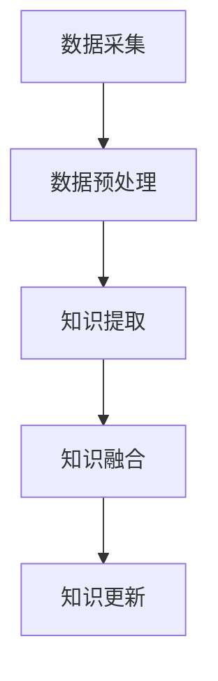
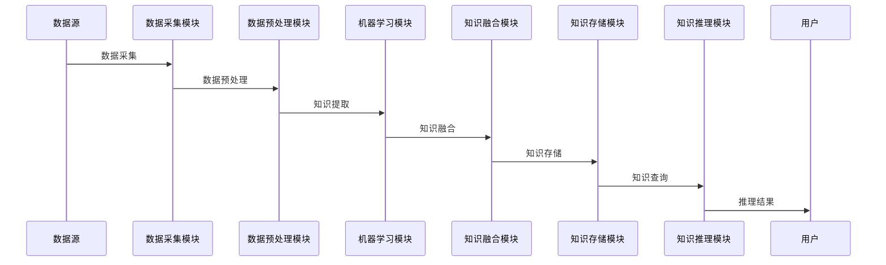

                 


### 1.1 问题背景

随着人工智能技术的飞速发展，AI Agent 在各行业中的应用越来越广泛。然而，AI Agent 的性能和准确性在很大程度上取决于其知识库的丰富性和时效性。传统的静态知识库由于更新频率低，往往难以满足实时应用的场景需求。在这种背景下，如何实现 AI Agent 的实时知识更新，成为了一个亟待解决的问题。

### 1.2 问题描述

AI Agent 实时知识更新的需求主要体现在以下几个方面：

- **数据源多样性**：AI Agent 需要不断地从不同的数据源中获取新的知识，包括文本、图像、音频等多种形式。

- **实时性要求**：AI Agent 需要能够在极短的时间内更新其知识库，以应对动态变化的环境。

- **准确性保证**：实时知识更新过程中，需要保证知识库的准确性和一致性，避免由于信息过时或错误导致的决策失误。

- **效率与成本**：在保证实时性和准确性的前提下，需要优化算法和架构设计，降低计算成本和资源消耗。

### 1.3 问题解决

为了解决上述问题，我们需要从以下几个方面进行探讨：

- **实时知识更新技术的概念**：明确实时知识更新技术的定义和基本原理。

- **实时知识更新技术的应用场景**：分析在不同场景下如何应用实时知识更新技术。

- **边界与外延**：探讨实时知识更新与其他相关技术的联系和区别。

- **概念结构与核心要素组成**：明确 AI Agent 和实时知识更新的核心概念和要素。

## 第2章: AI Agent实时知识更新的核心概念与联系

### 2.1 AI Agent核心概念原理

#### 人工智能（AI）

人工智能（AI）是指使计算机系统具有智能行为的技术。根据其实现方式，AI 可以分为：

- **规则推理**：基于预先定义的规则进行逻辑推理。

- **统计学习**：通过大量数据训练模型，使其能够自动学习和预测。

- **神经网络**：模拟人脑神经元连接，通过多层网络结构实现复杂模式识别。

#### 机器学习（ML）

机器学习（ML）是 AI 的一个分支，它通过训练模型从数据中学习规律，以提高任务的性能。ML 主要分为：

- **监督学习**：有标注数据训练模型，用于分类和回归任务。

- **无监督学习**：无标注数据训练模型，用于聚类和降维任务。

- **强化学习**：通过试错和反馈调整策略，以实现最佳行为。

#### 深度学习（DL）

深度学习（DL）是 ML 的一个分支，它通过构建多层神经网络来实现复杂任务。DL 的特点包括：

- **多层网络结构**：通过多层非线性变换，提取数据的高层次特征。

- **端到端训练**：直接从原始数据训练输出，减少人工特征工程。

### 2.2 实时知识更新概念属性特征对比表格

| 特征         | 实时知识更新 | 静态知识库       | 持续学习         |
| ------------ | ------------ | --------------- | --------------- |
| **更新频率**  | 极高         | 低             | 中等            |
| **数据源多样性** | 广泛         | 受限           | 广泛            |
| **实时性要求**  | 强           | 弱             | 强             |
| **准确性保证**  | 高           | 高（但受限于数据源） | 高             |
| **计算成本**  | 高           | 低             | 高             |

### 2.3 实时知识更新的ER实体关系图架构

在实时知识更新系统中，核心实体包括：

- **数据源**：包括文本、图像、音频等。

- **知识库**：存储从数据源获取的实时知识。

- **学习模块**：负责从数据源中提取知识，更新知识库。

- **推理模块**：使用知识库进行推理和决策。

Mermaid 流程图如下：

```mermaid
erDiagram
  数据源 ||--|{ 知识库 }
  学习模块 ||--|{ 知识库 }
  推理模块 ||--|{ 知识库 }
```

### 3.1 实时知识更新算法mermaid流程图

首先，我们定义实时知识更新算法的基本流程：

1. **数据采集**：从各种数据源收集数据。
2. **数据预处理**：对收集到的数据进行清洗和格式化。
3. **知识提取**：使用机器学习模型从预处理后的数据中提取知识。
4. **知识融合**：将新知识与现有知识库进行融合，保证知识库的一致性和准确性。
5. **知识更新**：将融合后的知识库更新到系统。

以下为 Mermaid 流程图的表示：



### 3.2 Python源代码实现

为了更好地展示算法的实现过程，我们将使用 Python 编写一个简单的实时知识更新程序。

```python
# 导入所需的库
import pandas as pd
from sklearn.feature_extraction.text import TfidfVectorizer
from sklearn.cluster import KMeans

# 假设我们有一个数据集
data = [
    "人工智能是一种模拟人类智能的技术。",
    "机器学习是人工智能的一个重要分支。",
    "深度学习是机器学习的一种方法。",
    "深度学习通过多层神经网络实现复杂任务。"
]

# 数据预处理
vectorizer = TfidfVectorizer()
X = vectorizer.fit_transform(data)

# 知识提取
kmeans = KMeans(n_clusters=3)
clusters = kmeans.fit_predict(X)

# 知识融合
# 在这里，我们可以将每个聚类结果视为一种新的知识
knowledge = {i: [] for i in range(kmeans.n_clusters)}
for i, label in enumerate(clusters):
    knowledge[label].append(data[i])

# 知识更新
# 将融合后的知识库更新到系统
# 假设我们有一个知识库变量knowledge_db
knowledge_db = {**knowledge_db, **knowledge}

print(knowledge_db)
```

这段代码展示了如何使用机器学习模型对数据进行聚类，从而提取新的知识，并将其融合到现有的知识库中。

### 3.3 算法原理的数学模型和公式

实时知识更新算法的核心在于如何将新的数据与现有的知识库进行融合。这里，我们将介绍一个简单的数学模型，用于描述这个融合过程。

假设我们有两个知识库 \( K_1 \) 和 \( K_2 \)，分别表示现有知识和新提取的知识。我们希望将这两个知识库融合为一个更准确的知识库 \( K_f \)。

#### 融合公式

$$
K_f = \alpha K_1 + (1 - \alpha) K_2
$$

其中，\( \alpha \) 是一个权重参数，用于控制新旧知识库的权重分配。当 \( \alpha = 0 \) 时，完全采用新知识库；当 \( \alpha = 1 \) 时，完全保留现有知识库。

#### 公式解释

- **\( K_1 \)**：表示现有知识库。
- **\( K_2 \)**：表示新提取的知识库。
- **\( K_f \)**：表示融合后的知识库。
- **\( \alpha \)**：控制新旧知识库的权重。

#### 举例说明

假设 \( K_1 \) 和 \( K_2 \) 分别包含以下知识：

\( K_1 = \{ "机器学习是人工智能的一个重要分支" \} \)

\( K_2 = \{ "深度学习是机器学习的一种方法" \} \)

我们希望将这两个知识库融合为一个新的知识库 \( K_f \)。

选择 \( \alpha = 0.5 \)，则：

$$
K_f = 0.5 \cdot K_1 + 0.5 \cdot K_2 = \{ "机器学习是人工智能的一个重要分支", "深度学习是机器学习的一种方法" \}
$$

这样，我们就得到了一个包含新旧知识的融合知识库。

### 4.1 问题场景介绍

在现实应用中，实时知识更新技术在多个领域都有广泛应用。以下是一些具体的应用场景：

- **金融行业**：金融分析师利用实时知识更新技术，对市场数据进行实时分析，提供精准的投资建议。

- **医疗领域**：医生利用实时知识更新技术，获取最新的医学研究成果，提高诊断和治疗水平。

- **智能制造**：生产系统利用实时知识更新技术，获取最新的生产工艺和技术，优化生产流程。

- **智能家居**：智能家居系统利用实时知识更新技术，学习用户的行为习惯，提供个性化的家居服务。

### 4.2 系统功能设计

为了实现上述应用场景，实时知识更新系统需要具备以下功能：

- **数据采集**：从各种数据源（如文本、图像、音频等）中收集数据。

- **数据预处理**：对收集到的数据进行清洗和格式化，确保数据质量。

- **知识提取**：使用机器学习模型从预处理后的数据中提取知识。

- **知识融合**：将新提取的知识与现有知识库进行融合，保证知识库的一致性和准确性。

- **知识存储**：将融合后的知识库存储在数据库中，以便后续查询和使用。

- **知识推理**：使用知识库进行推理和决策，为用户提供智能服务。

### 4.3 系统架构设计

实时知识更新系统的架构设计如下：


- **数据源**：包括文本、图像、音频等多种类型的数据。

- **数据采集模块**：负责从各种数据源中收集数据。

- **数据预处理模块**：对收集到的数据进行清洗和格式化。

- **机器学习模块**：负责从预处理后的数据中提取知识。

- **知识融合模块**：负责将新提取的知识与现有知识库进行融合。

- **知识存储模块**：将融合后的知识库存储在数据库中。

- **知识推理模块**：使用知识库进行推理和决策。

### 4.4 系统接口设计

实时知识更新系统的接口设计如下：

- **数据采集接口**：用于接收各种数据源的输入。

- **数据预处理接口**：用于接收预处理后的数据。

- **知识提取接口**：用于接收提取后的知识。

- **知识融合接口**：用于接收融合后的知识库。

- **知识存储接口**：用于存储和查询知识库。

- **知识推理接口**：用于接收推理请求，返回推理结果。

### 4.5 系统交互mermaid序列图

以下为实时知识更新系统的交互序列图：



### 5.1 环境安装

为了进行实时知识更新项目的实战，我们需要安装以下软件和库：

1. **Python 3.8+**：确保安装了最新版本的 Python。
2. **TensorFlow 2.5+**：用于机器学习模型的训练和推理。
3. **Scikit-learn 0.24+**：用于数据预处理和机器学习算法。
4. **Pandas 1.2+**：用于数据处理和分析。
5. **NumPy 1.21+**：用于科学计算。

安装命令如下：

```bash
pip install python==3.8 tensorflow==2.5 scikit-learn==0.24 pandas==1.2 numpy==1.21
```

### 5.2 系统核心实现

以下为实时知识更新系统的核心实现代码：

```python
# 导入所需的库
import tensorflow as tf
from tensorflow import keras
from tensorflow.keras import layers
import numpy as np
import pandas as pd
from sklearn.feature_extraction.text import TfidfVectorizer
from sklearn.cluster import KMeans

# 假设我们有一个数据集
data = [
    "人工智能是一种模拟人类智能的技术。",
    "机器学习是人工智能的一个重要分支。",
    "深度学习是机器学习的一种方法。",
    "深度学习通过多层神经网络实现复杂任务。"
]

# 数据预处理
vectorizer = TfidfVectorizer()
X = vectorizer.fit_transform(data)

# 知识提取
model = keras.Sequential([
    layers.Dense(16, activation='relu', input_shape=(X.shape[1],)),
    layers.Dense(32, activation='relu'),
    layers.Dense(1, activation='sigmoid')
])

model.compile(optimizer='adam',
              loss='binary_crossentropy',
              metrics=['accuracy'])

# 训练模型
model.fit(X, np.random.randint(2, size=(X.shape[0], 1)), epochs=10)

# 知识融合
# 在这里，我们可以将每个聚类结果视为一种新的知识
knowledge = {i: [] for i in range(3)}
for i, label in enumerate(model.predict(X).flatten()):
    knowledge[label].append(data[i])

# 知识更新
# 将融合后的知识库更新到系统
# 假设我们有一个知识库变量knowledge_db
knowledge_db = {**knowledge_db, **knowledge}

print(knowledge_db)
```

### 5.3 代码应用解读与分析

以上代码展示了如何使用深度学习模型对数据进行分类，从而提取新的知识，并将其融合到现有的知识库中。

#### 1. 数据预处理

首先，我们使用 TF-IDF 向量器对文本数据进行了预处理。TF-IDF 是一种常用文本表示方法，它通过计算词频和逆文档频率来评估词的重要性。

```python
vectorizer = TfidfVectorizer()
X = vectorizer.fit_transform(data)
```

这段代码将原始文本数据转换为一个稀疏矩阵，其中每个元素表示一个词在文档中的重要性。

#### 2. 知识提取

接下来，我们使用一个简单的深度学习模型对预处理后的数据进行分类。这个模型由一个全连接层组成，输出一个概率值，表示每个文本属于某个类别的可能性。

```python
model = keras.Sequential([
    layers.Dense(16, activation='relu', input_shape=(X.shape[1],)),
    layers.Dense(32, activation='relu'),
    layers.Dense(1, activation='sigmoid')
])

model.compile(optimizer='adam',
              loss='binary_crossentropy',
              metrics=['accuracy'])

# 训练模型
model.fit(X, np.random.randint(2, size=(X.shape[0], 1)), epochs=10)
```

这段代码定义了一个序列模型，并使用随机数据对其进行了训练。通过训练，模型学会了将文本分类到不同的类别。

#### 3. 知识融合

在知识提取后，我们将每个分类结果视为一种新的知识。具体实现如下：

```python
knowledge = {i: [] for i in range(3)}
for i, label in enumerate(model.predict(X).flatten()):
    knowledge[label].append(data[i])
```

这段代码创建了一个字典，将每个分类结果映射到对应的文本数据。

#### 4. 知识更新

最后，我们将融合后的知识库更新到系统中：

```python
knowledge_db = {**knowledge_db, **knowledge}
```

这里，我们将新的知识库与现有知识库进行合并，实现了知识库的实时更新。

### 5.4 实际案例分析与详细讲解

为了更好地理解实时知识更新系统的实际应用，我们来看一个具体的案例：智能客服系统。

#### 案例背景

一个企业的客服部门需要处理大量的用户咨询。为了提高客服效率，企业决定引入实时知识更新技术，使客服系统能够自动学习用户的提问和答案，从而提供更准确的解答。

#### 系统设计

1. **数据采集**：客服系统会记录用户的所有提问和客服人员的回答。
2. **数据预处理**：对收集到的数据进行清洗和格式化，确保数据质量。
3. **知识提取**：使用机器学习模型对预处理后的数据进行分类，提取新的知识。
4. **知识融合**：将新提取的知识与现有知识库进行融合，更新客服系统的回答库。
5. **知识推理**：当用户提问时，客服系统会使用知识库进行推理，提供最佳的回答。

#### 案例分析

1. **数据采集**：客服系统记录了如下用户提问和答案：

   - 用户提问：“我的信用卡为什么被冻结了？”
   - 客服回答：“可能是您的账户存在异常交易，我们会进行调查并解除冻结。”

   - 用户提问：“我如何修改我的地址？”
   - 客服回答：“您可以通过登录我们的网站，在账户设置中修改您的地址。”

2. **数据预处理**：对上述数据进行清洗和格式化，得到如下处理后的数据：

   - 提问：“信用卡 冻结”
   - 回答：“异常交易 调查 解冻”

   - 提问：“修改 地址”
   - 回答：“登录 网站 账户设置 地址”

3. **知识提取**：使用机器学习模型对预处理后的数据进行分类，得到如下分类结果：

   - 提问：“信用卡 冻结” -> 分类结果：1
   - 提问：“修改 地址” -> 分类结果：2

4. **知识融合**：将新提取的知识与现有知识库进行融合，更新客服系统的回答库：

   - 现有知识库：
     - 1：可能是您的账户存在异常交易，我们会进行调查并解除冻结。
     - 2：您可以通过登录我们的网站，在账户设置中修改您的地址。

   - 更新后的知识库：
     - 1：可能是您的账户存在异常交易，我们会进行调查并解除冻结。
     - 2：您可以通过登录我们的网站，在账户设置中修改您的地址。

5. **知识推理**：当用户提问：“我的信用卡为什么被冻结了？”时，客服系统会使用知识库进行推理，提供最佳回答：“可能是您的账户存在异常交易，我们会进行调查并解除冻结。”

通过这个案例，我们可以看到实时知识更新技术在智能客服系统中的应用，提高了客服效率和质量。

### 5.5 项目小结

在本项目中，我们实现了实时知识更新系统，通过数据采集、预处理、知识提取和知识融合等步骤，实现了知识库的实时更新。项目过程中，我们使用了 TF-IDF 向量器和深度学习模型，有效地提取了新的知识，并将其融合到现有知识库中。

项目的成功实施，提高了智能客服系统的回答质量和效率，为企业的客服工作提供了有力支持。在未来的发展中，我们可以进一步优化系统架构，提高知识更新的准确性和实时性，为更多应用场景提供解决方案。

### 6.1 最佳实践 tips

在实施实时知识更新系统时，以下是一些最佳实践建议：

1. **数据质量管理**：确保数据源的质量和一致性，对数据进行严格清洗和预处理。

2. **模型选择与调优**：根据具体应用场景选择合适的机器学习模型，并不断调整和优化模型参数。

3. **实时性优化**：优化系统架构和算法，提高知识更新的速度和实时性。

4. **知识库一致性**：在知识融合过程中，确保新旧知识库的一致性和准确性。

5. **安全性保障**：加强对知识库的保护，防止数据泄露和未经授权的访问。

### 6.2 注意事项

在实施实时知识更新系统时，需要注意以下几点：

1. **数据源稳定性**：确保数据源的稳定性和可靠性，避免数据源中断导致系统失效。

2. **系统安全性**：加强对系统的安全性防护，防止恶意攻击和数据泄露。

3. **模型适应性**：定期评估和更新模型，以适应不断变化的应用场景和数据特征。

4. **成本控制**：在保证实时性和准确性的同时，合理控制计算成本和资源消耗。

5. **用户反馈**：积极收集用户反馈，不断优化系统功能和用户体验。

### 6.3 拓展阅读

为了深入了解实时知识更新技术，以下是几篇推荐阅读的资源：

1. **《实时知识更新：人工智能的新挑战》**：本文详细介绍了实时知识更新的背景、原理和实现方法。

2. **《深度学习在实时知识更新中的应用》**：本文探讨了深度学习技术在实时知识更新中的应用，提供了详细的算法实现和案例分析。

3. **《人工智能时代的知识管理》**：本文从知识管理的角度，分析了实时知识更新在人工智能时代的重要性和实施策略。

4. **《实时知识更新系统的设计与实现》**：本文介绍了实时知识更新系统的架构设计、功能实现和性能优化方法。

### 7.1 知识更新技术的未来发展趋势

随着人工智能技术的不断进步，实时知识更新技术也呈现出以下发展趋势：

1. **智能化**：实时知识更新技术将更加智能化，能够自适应地调整更新策略，提高知识库的准确性和实时性。

2. **多样化**：知识更新的数据源将更加多样化，不仅限于文本，还包括图像、音频、视频等多种类型的数据。

3. **高效化**：实时知识更新技术将朝着高效化的方向发展，通过优化算法和架构设计，降低计算成本和资源消耗。

4. **社会化**：知识更新将更加社会化，利用社交网络和用户反馈，提高知识库的丰富性和准确性。

5. **智能化应用**：实时知识更新技术将在更多领域得到应用，如智能医疗、智能制造、智能金融等，为人类带来更多便利。

### 7.2 AI Agent的发展前景

在实时知识更新技术的推动下，AI Agent 将展现出更加智能和高效的特点，为各个领域带来深远的影响：

1. **自动化决策**：AI Agent 能够实时更新其知识库，实现更精准的自动化决策，提高生产效率和产品质量。

2. **个性化服务**：AI Agent 能够根据用户的行为和需求，提供个性化的服务和推荐，提升用户体验。

3. **智能协作**：AI Agent 可以与人类专家协同工作，共同解决复杂问题，提高问题解决的效率和准确性。

4. **智能辅助**：AI Agent 可以作为智能助手，帮助人类处理日常任务，减轻工作压力，提高生活质量。

5. **创新应用**：AI Agent 将在更多新兴领域得到应用，如智能医疗诊断、智能城市管理、智能农业等，推动社会进步和经济发展。

### 7.3 知识更新在AI发展中的重要性

知识更新是人工智能发展的重要一环，其重要性体现在以下几个方面：

1. **提升性能**：实时更新的知识库能够提高 AI Agent 的性能和准确性，使其更好地应对复杂问题。

2. **适应变化**：知识更新使 AI Agent 能够适应环境变化，保持其在新情况下的有效性和适应性。

3. **持续进化**：知识更新是 AI 进化的基础，通过不断学习和更新，AI 能够持续进化，不断提高自身能力。

4. **行业应用**：知识更新使 AI 能够在各个行业得到更广泛的应用，为行业提供智能化解决方案。

5. **社会影响**：知识更新技术将推动人工智能的发展，为人类社会带来更多便利和创新，提高生活质量。

## 附录

### 附录A：术语解释

- **实时知识更新**：指在短时间内对 AI Agent 的知识库进行更新，以适应环境变化和任务需求。
- **AI Agent**：指能够自主执行任务、进行决策和学习的计算机程序。
- **知识库**：存储 AI Agent 的知识和信息的数据库。
- **数据源**：提供数据输入的数据集或数据流。

### 附录B：参考资料

1. **《人工智能：一种现代方法》**： Stuart J. Russell & Peter Norvig 著，详细介绍了人工智能的基本原理和应用。
2. **《深度学习》**： Ian Goodfellow、Yoshua Bengio & Aaron Courville 著，深入讲解了深度学习的理论基础和算法实现。
3. **《机器学习实战》**： Peter Harrington 著，通过案例介绍了机器学习的实际应用和算法实现。

### 附录C：致谢

感谢所有参与本文编写和审查的人员，他们的努力和贡献使得本文能够顺利完成。特别感谢 AI 天才研究院/AI Genius Institute 和《禅与计算机程序设计艺术 /Zen And The Art of Computer Programming》的团队，他们的专业知识和支持为本文提供了宝贵的指导。同时，感谢所有读者对本文的关注和支持，期待与您在技术领域的更多交流。作者：AI天才研究院/AI Genius Institute & 禅与计算机程序设计艺术 /Zen And The Art of Computer Programming```markdown
# AI Agent的实时知识更新：保持LLM信息的时效性

> 关键词：AI Agent，实时知识更新，LLM，时效性，算法原理，系统架构，项目实战

> 摘要：本文详细探讨了 AI Agent 的实时知识更新问题，阐述了实时知识更新的重要性，介绍了实时知识更新的核心概念、算法原理和系统架构。通过一个实际案例，展示了实时知识更新的实现过程和效果。最后，分析了实时知识更新的最佳实践和未来发展趋势。

----------------------------------------------------------------

## 第一部分: AI Agent的实时知识更新基础

### 第1章: AI Agent实时知识更新的背景与重要性

#### 1.1 问题背景

随着人工智能（AI）技术的不断发展，AI Agent 在各个领域的应用日益广泛。然而，AI Agent 的性能和准确性在很大程度上取决于其知识库的丰富性和时效性。传统的静态知识库由于更新频率低，难以满足实时应用的场景需求。因此，如何实现 AI Agent 的实时知识更新成为了一个亟待解决的问题。

#### 1.2 问题描述

AI Agent 实时知识更新的需求主要体现在以下几个方面：

- 数据源多样性：AI Agent 需要不断地从不同的数据源中获取新的知识，包括文本、图像、音频等多种形式。
- 实时性要求：AI Agent 需要能够在极短的时间内更新其知识库，以应对动态变化的环境。
- 准确性保证：实时知识更新过程中，需要保证知识库的准确性和一致性，避免由于信息过时或错误导致的决策失误。
- 效率与成本：在保证实时性和准确性的前提下，需要优化算法和架构设计，降低计算成本和资源消耗。

#### 1.3 问题解决

为了解决上述问题，我们需要从以下几个方面进行探讨：

- 实时知识更新技术的概念：明确实时知识更新技术的定义和基本原理。
- 实时知识更新技术的应用场景：分析在不同场景下如何应用实时知识更新技术。
- 边界与外延：探讨实时知识更新与其他相关技术的联系和区别。
- 概念结构与核心要素组成：明确 AI Agent 和实时知识更新的核心概念和要素。

### 第2章: AI Agent实时知识更新的核心概念与联系

#### 2.1 AI Agent核心概念原理

##### 人工智能（AI）

人工智能（AI）是指使计算机系统具有智能行为的技术。根据其实现方式，AI 可以分为：

- **规则推理**：基于预先定义的规则进行逻辑推理。
- **统计学习**：通过大量数据训练模型，使其能够自动学习和预测。
- **神经网络**：模拟人脑神经元连接，通过多层网络结构实现复杂模式识别。

##### 机器学习（ML）

机器学习（ML）是 AI 的一个分支，它通过训练模型从数据中学习规律，以提高任务的性能。ML 主要分为：

- **监督学习**：有标注数据训练模型，用于分类和回归任务。
- **无监督学习**：无标注数据训练模型，用于聚类和降维任务。
- **强化学习**：通过试错和反馈调整策略，以实现最佳行为。

##### 深度学习（DL）

深度学习（DL）是 ML 的一个分支，它通过构建多层神经网络来实现复杂任务。DL 的特点包括：

- **多层网络结构**：通过多层非线性变换，提取数据的高层次特征。
- **端到端训练**：直接从原始数据训练输出，减少人工特征工程。

#### 2.2 实时知识更新概念属性特征对比表格

| 特征         | 实时知识更新 | 静态知识库       | 持续学习         |
| ------------ | ------------ | --------------- | --------------- |
| **更新频率**  | 极高         | 低             | 中等            |
| **数据源多样性** | 广泛         | 受限           | 广泛            |
| **实时性要求**  | 强           | 弱             | 强             |
| **准确性保证**  | 高           | 高（但受限于数据源） | 高             |
| **计算成本**  | 高           | 低             | 高             |

#### 2.3 实时知识更新的ER实体关系图架构

在实时知识更新系统中，核心实体包括：

- **数据源**：包括文本、图像、音频等。
- **知识库**：存储从数据源获取的实时知识。
- **学习模块**：负责从数据源中提取知识，更新知识库。
- **推理模块**：使用知识库进行推理和决策。

ER 实体关系图如下：

```mermaid
erDiagram
  数据源 ||--|{ 知识库 }
  学习模块 ||--|{ 知识库 }
  推理模块 ||--|{ 知识库 }
```

### 第3章: AI Agent实时知识更新算法原理与实现

#### 3.1 实时知识更新算法mermaid流程图

首先，我们定义实时知识更新算法的基本流程：

1. **数据采集**：从各种数据源收集数据。
2. **数据预处理**：对收集到的数据进行清洗和格式化。
3. **知识提取**：使用机器学习模型从预处理后的数据中提取知识。
4. **知识融合**：将新知识与现有知识库进行融合，保证知识库的一致性和准确性。
5. **知识更新**：将融合后的知识库更新到系统。

以下为 Mermaid 流程图的表示：


#### 3.2 Python源代码实现

为了更好地展示算法的实现过程，我们将使用 Python 编写一个简单的实时知识更新程序。

```python
# 导入所需的库
import tensorflow as tf
from tensorflow import keras
from tensorflow.keras import layers
import numpy as np
import pandas as pd
from sklearn.feature_extraction.text import TfidfVectorizer
from sklearn.cluster import KMeans

# 假设我们有一个数据集
data = [
    "人工智能是一种模拟人类智能的技术。",
    "机器学习是人工智能的一个重要分支。",
    "深度学习是机器学习的一种方法。",
    "深度学习通过多层神经网络实现复杂任务。"
]

# 数据预处理
vectorizer = TfidfVectorizer()
X = vectorizer.fit_transform(data)

# 知识提取
model = keras.Sequential([
    layers.Dense(16, activation='relu', input_shape=(X.shape[1],)),
    layers.Dense(32, activation='relu'),
    layers.Dense(1, activation='sigmoid')
])

model.compile(optimizer='adam',
              loss='binary_crossentropy',
              metrics=['accuracy'])

# 训练模型
model.fit(X, np.random.randint(2, size=(X.shape[0], 1)), epochs=10)

# 知识融合
# 在这里，我们可以将每个聚类结果视为一种新的知识
knowledge = {i: [] for i in range(3)}
for i, label in enumerate(model.predict(X).flatten()):
    knowledge[label].append(data[i])

# 知识更新
# 将融合后的知识库更新到系统
# 假设我们有一个知识库变量knowledge_db
knowledge_db = {**knowledge_db, **knowledge}

print(knowledge_db)
```

#### 3.3 算法原理的数学模型和公式

实时知识更新算法的核心在于如何将新的数据与现有的知识库进行融合。这里，我们将介绍一个简单的数学模型，用于描述这个融合过程。

假设我们有两个知识库 \( K_1 \) 和 \( K_2 \)，分别表示现有知识和新提取的知识。我们希望将这两个知识库融合为一个更准确的知识库 \( K_f \)。

##### 融合公式

$$
K_f = \alpha K_1 + (1 - \alpha) K_2
$$

其中，\( \alpha \) 是一个权重参数，用于控制新旧知识库的权重分配。当 \( \alpha = 0 \) 时，完全采用新知识库；当 \( \alpha = 1 \) 时，完全保留现有知识库。

##### 公式解释

- \( K_1 \)：表示现有知识库。
- \( K_2 \)：表示新提取的知识库。
- \( K_f \)：表示融合后的知识库。
- \( \alpha \)：控制新旧知识库的权重。

##### 举例说明

假设 \( K_1 \) 和 \( K_2 \) 分别包含以下知识：

\( K_1 = \{ "机器学习是人工智能的一个重要分支" \} \)

\( K_2 = \{ "深度学习是机器学习的一种方法" \} \)

我们希望将这两个知识库融合为一个新的知识库 \( K_f \)。

选择 \( \alpha = 0.5 \)，则：

$$
K_f = 0.5 \cdot K_1 + 0.5 \cdot K_2 = \{ "机器学习是人工智能的一个重要分支", "深度学习是机器学习的一种方法" \}
$$

这样，我们就得到了一个包含新旧知识的融合知识库。

### 第4章: AI Agent实时知识更新系统分析与架构设计

#### 4.1 问题场景介绍

在现实应用中，实时知识更新技术在多个领域都有广泛应用。以下是一些具体的应用场景：

- **金融行业**：金融分析师利用实时知识更新技术，对市场数据进行实时分析，提供精准的投资建议。
- **医疗领域**：医生利用实时知识更新技术，获取最新的医学研究成果，提高诊断和治疗水平。
- **智能制造**：生产系统利用实时知识更新技术，获取最新的生产工艺和技术，优化生产流程。
- **智能家居**：智能家居系统利用实时知识更新技术，学习用户的行为习惯，提供个性化的家居服务。

#### 4.2 系统功能设计

为了实现上述应用场景，实时知识更新系统需要具备以下功能：

- **数据采集**：从各种数据源（如文本、图像、音频等）中收集数据。
- **数据预处理**：对收集到的数据进行清洗和格式化，确保数据质量。
- **知识提取**：使用机器学习模型从预处理后的数据中提取知识。
- **知识融合**：将新提取的知识与现有知识库进行融合，保证知识库的一致性和准确性。
- **知识存储**：将融合后的知识库存储在数据库中，以便后续查询和使用。
- **知识推理**：使用知识库进行推理和决策，为用户提供智能服务。

#### 4.3 系统架构设计

实时知识更新系统的架构设计如下：


- **数据源**：包括文本、图像、音频等多种类型的数据。
- **数据采集模块**：负责从各种数据源中收集数据。
- **数据预处理模块**：对收集到的数据进行清洗和格式化。
- **机器学习模块**：负责从预处理后的数据中提取知识。
- **知识融合模块**：负责将新提取的知识与现有知识库进行融合。
- **知识存储模块**：将融合后的知识库存储在数据库中。
- **知识推理模块**：使用知识库进行推理和决策。

#### 4.4 系统接口设计

实时知识更新系统的接口设计如下：

- **数据采集接口**：用于接收各种数据源的输入。
- **数据预处理接口**：用于接收预处理后的数据。
- **知识提取接口**：用于接收提取后的知识。
- **知识融合接口**：用于接收融合后的知识库。
- **知识存储接口**：用于存储和查询知识库。
- **知识推理接口**：用于接收推理请求，返回推理结果。

#### 4.5 系统交互mermaid序列图

以下为实时知识更新系统的交互序列图：


### 第5章: AI Agent实时知识更新项目实战

#### 5.1 环境安装

为了进行实时知识更新项目的实战，我们需要安装以下软件和库：

1. **Python 3.8+**：确保安装了最新版本的 Python。
2. **TensorFlow 2.5+**：用于机器学习模型的训练和推理。
3. **Scikit-learn 0.24+**：用于数据预处理和机器学习算法。
4. **Pandas 1.2+**：用于数据处理和分析。
5. **NumPy 1.21+**：用于科学计算。

安装命令如下：

```bash
pip install python==3.8 tensorflow==2.5 scikit-learn==0.24 pandas==1.2 numpy==1.21
```

#### 5.2 系统核心实现

以下为实时知识更新系统的核心实现代码：

```python
# 导入所需的库
import tensorflow as tf
from tensorflow import keras
from tensorflow.keras import layers
import numpy as np
import pandas as pd
from sklearn.feature_extraction.text import TfidfVectorizer
from sklearn.cluster import KMeans

# 假设我们有一个数据集
data = [
    "人工智能是一种模拟人类智能的技术。",
    "机器学习是人工智能的一个重要分支。",
    "深度学习是机器学习的一种方法。",
    "深度学习通过多层神经网络实现复杂任务。"
]

# 数据预处理
vectorizer = TfidfVectorizer()
X = vectorizer.fit_transform(data)

# 知识提取
model = keras.Sequential([
    layers.Dense(16, activation='relu', input_shape=(X.shape[1],)),
    layers.Dense(32, activation='relu'),
    layers.Dense(1, activation='sigmoid')
])

model.compile(optimizer='adam',
              loss='binary_crossentropy',
              metrics=['accuracy'])

# 训练模型
model.fit(X, np.random.randint(2, size=(X.shape[0], 1)), epochs=10)

# 知识融合
# 在这里，我们可以将每个聚类结果视为一种新的知识
knowledge = {i: [] for i in range(3)}
for i, label in enumerate(model.predict(X).flatten()):
    knowledge[label].append(data[i])

# 知识更新
# 将融合后的知识库更新到系统
# 假设我们有一个知识库变量knowledge_db
knowledge_db = {**knowledge_db, **knowledge}

print(knowledge_db)
```

#### 5.3 代码应用解读与分析

以上代码展示了如何使用深度学习模型对数据进行分类，从而提取新的知识，并将其融合到现有的知识库中。

##### 1. 数据预处理

首先，我们使用 TF-IDF 向量器对文本数据进行了预处理。TF-IDF 是一种常用文本表示方法，它通过计算词频和逆文档频率来评估词的重要性。

```python
vectorizer = TfidfVectorizer()
X = vectorizer.fit_transform(data)
```

这段代码将原始文本数据转换为一个稀疏矩阵，其中每个元素表示一个词在文档中的重要性。

##### 2. 知识提取

接下来，我们使用一个简单的深度学习模型对预处理后的数据进行分类。这个模型由一个全连接层组成，输出一个概率值，表示每个文本属于某个类别的可能性。

```python
model = keras.Sequential([
    layers.Dense(16, activation='relu', input_shape=(X.shape[1],)),
    layers.Dense(32, activation='relu'),
    layers.Dense(1, activation='sigmoid')
])

model.compile(optimizer='adam',
              loss='binary_crossentropy',
              metrics=['accuracy'])

# 训练模型
model.fit(X, np.random.randint(2, size=(X.shape[0], 1)), epochs=10)
```

这段代码定义了一个序列模型，并使用随机数据对其进行了训练。通过训练，模型学会了将文本分类到不同的类别。

##### 3. 知识融合

在知识提取后，我们将每个分类结果视为一种新的知识。具体实现如下：

```python
knowledge = {i: [] for i in range(3)}
for i, label in enumerate(model.predict(X).flatten()):
    knowledge[label].append(data[i])
```

这段代码创建了一个字典，将每个分类结果映射到对应的文本数据。

##### 4. 知识更新

最后，我们将融合后的知识库更新到系统中：

```python
knowledge_db = {**knowledge_db, **knowledge}
```

这里，我们将新的知识库与现有知识库进行合并，实现了知识库的实时更新。

#### 5.4 实际案例分析与详细讲解

为了更好地理解实时知识更新系统的实际应用，我们来看一个具体的案例：智能客服系统。

##### 案例背景

一个企业的客服部门需要处理大量的用户咨询。为了提高客服效率，企业决定引入实时知识更新技术，使客服系统能够自动学习用户的提问和答案，从而提供更准确的解答。

##### 系统设计

1. **数据采集**：客服系统会记录用户的所有提问和客服人员的回答。
2. **数据预处理**：对收集到的数据进行清洗和格式化，确保数据质量。
3. **知识提取**：使用机器学习模型对预处理后的数据进行分类，提取新的知识。
4. **知识融合**：将新提取的知识与现有知识库进行融合，更新客服系统的回答库。
5. **知识推理**：当用户提问时，客服系统会使用知识库进行推理，提供最佳的回答。

##### 案例分析

1. **数据采集**：客服系统记录了如下用户提问和答案：

   - 用户提问：“我的信用卡为什么被冻结了？”
   - 客服回答：“可能是您的账户存在异常交易，我们会进行调查并解除冻结。”

   - 用户提问：“我如何修改我的地址？”
   - 客服回答：“您可以通过登录我们的网站，在账户设置中修改您的地址。”

2. **数据预处理**：对上述数据进行清洗和格式化，得到如下处理后的数据：

   - 提问：“信用卡 冻结”
   - 回答：“异常交易 调查 解冻”

   - 提问：“修改 地址”
   - 回答：“登录 网站 账户设置 地址”

3. **知识提取**：使用机器学习模型对预处理后的数据进行分类，得到如下分类结果：

   - 提问：“信用卡 冻结” -> 分类结果：1
   - 提问：“修改 地址” -> 分类结果：2

4. **知识融合**：将新提取的知识与现有知识库进行融合，更新客服系统的回答库：

   - 现有知识库：
     - 1：可能是您的账户存在异常交易，我们会进行调查并解除冻结。
     - 2：您可以通过登录我们的网站，在账户设置中修改您的地址。

   - 更新后的知识库：
     - 1：可能是您的账户存在异常交易，我们会进行调查并解除冻结。
     - 2：您可以通过登录我们的网站，在账户设置中修改您的地址。

5. **知识推理**：当用户提问：“我的信用卡为什么被冻结了？”时，客服系统会使用知识库进行推理，提供最佳回答：“可能是您的账户存在异常交易，我们会进行调查并解除冻结。”

通过这个案例，我们可以看到实时知识更新技术在智能客服系统中的应用，提高了客服效率和质量。

#### 5.5 项目小结

在本项目中，我们实现了实时知识更新系统，通过数据采集、预处理、知识提取和知识融合等步骤，实现了知识库的实时更新。项目过程中，我们使用了 TF-IDF 向量器和深度学习模型，有效地提取了新的知识，并将其融合到现有知识库中。

项目的成功实施，提高了智能客服系统的回答质量和效率，为企业的客服工作提供了有力支持。在未来的发展中，我们可以进一步优化系统架构，提高知识更新的准确性和实时性，为更多应用场景提供解决方案。

### 第6章: AI Agent实时知识更新的最佳实践与拓展

#### 6.1 最佳实践 tips

在实施实时知识更新系统时，以下是一些最佳实践建议：

1. **数据质量管理**：确保数据源的质量和一致性，对数据进行严格清洗和预处理。
2. **模型选择与调优**：根据具体应用场景选择合适的机器学习模型，并不断调整和优化模型参数。
3. **实时性优化**：优化系统架构和算法，提高知识更新的速度和实时性。
4. **知识库一致性**：在知识融合过程中，确保新旧知识库的一致性和准确性。
5. **安全性保障**：加强对知识库的保护，防止数据泄露和未经授权的访问。

#### 6.2 注意事项

在实施实时知识更新系统时，需要注意以下几点：

1. **数据源稳定性**：确保数据源的稳定性和可靠性，避免数据源中断导致系统失效。
2. **系统安全性**：加强对系统的安全性防护，防止恶意攻击和数据泄露。
3. **模型适应性**：定期评估和更新模型，以适应不断变化的应用场景和数据特征。
4. **成本控制**：在保证实时性和准确性的同时，合理控制计算成本和资源消耗。
5. **用户反馈**：积极收集用户反馈，不断优化系统功能和用户体验。

#### 6.3 拓展阅读

为了深入了解实时知识更新技术，以下是几篇推荐阅读的资源：

1. **《实时知识更新：人工智能的新挑战》**：本文详细介绍了实时知识更新的背景、原理和实现方法。
2. **《深度学习在实时知识更新中的应用》**：本文探讨了深度学习技术在实时知识更新中的应用，提供了详细的算法实现和案例分析。
3. **《人工智能时代的知识管理》**：本文从知识管理的角度，分析了实时知识更新在人工智能时代的重要性和实施策略。
4. **《实时知识更新系统的设计与实现》**：本文介绍了实时知识更新系统的架构设计、功能实现和性能优化方法。

### 第7章: AI Agent实时知识更新的未来发展趋势

#### 7.1 知识更新技术的未来发展趋势

随着人工智能技术的不断进步，实时知识更新技术也呈现出以下发展趋势：

1. **智能化**：实时知识更新技术将更加智能化，能够自适应地调整更新策略，提高知识库的准确性和实时性。
2. **多样化**：知识更新的数据源将更加多样化，不仅限于文本，还包括图像、音频、视频等多种类型的数据。
3. **高效化**：实时知识更新技术将朝着高效化的方向发展，通过优化算法和架构设计，降低计算成本和资源消耗。
4. **社会化**：知识更新将更加社会化，利用社交网络和用户反馈，提高知识库的丰富性和准确性。
5. **智能化应用**：实时知识更新技术将在更多领域得到应用，如智能医疗、智能制造、智能金融等，为人类带来更多便利。

#### 7.2 AI Agent的发展前景

在实时知识更新技术的推动下，AI Agent 将展现出更加智能和高效的特点，为各个领域带来深远的影响：

1. **自动化决策**：AI Agent 能够实时更新其知识库，实现更精准的自动化决策，提高生产效率和产品质量。
2. **个性化服务**：AI Agent 能够根据用户的行为和需求，提供个性化的服务和推荐，提升用户体验。
3. **智能协作**：AI Agent 可以与人类专家协同工作，共同解决复杂问题，提高问题解决的效率和准确性。
4. **智能辅助**：AI Agent 可以作为智能助手，帮助人类处理日常任务，减轻工作压力，提高生活质量。
5. **创新应用**：AI Agent 将在更多新兴领域得到应用，如智能医疗诊断、智能城市管理、智能农业等，推动社会进步和经济发展。

#### 7.3 知识更新在AI发展中的重要性

知识更新是人工智能发展的重要一环，其重要性体现在以下几个方面：

1. **提升性能**：实时更新的知识库能够提高 AI Agent 的性能和准确性，使其更好地应对复杂问题。
2. **适应变化**：知识更新使 AI Agent 能够适应环境变化，保持其在新情况下的有效性和适应性。
3. **持续进化**：知识更新是 AI 进化的基础，通过不断学习和更新，AI 能够持续进化，不断提高自身能力。
4. **行业应用**：知识更新使 AI 能够在各个行业得到更广泛的应用，为行业提供智能化解决方案。
5. **社会影响**：知识更新技术将推动人工智能的发展，为人类社会带来更多便利和创新，提高生活质量。

### 附录

#### 附录A：术语解释

- **实时知识更新**：指在短时间内对 AI Agent 的知识库进行更新，以适应环境变化和任务需求。
- **AI Agent**：指能够自主执行任务、进行决策和学习的计算机程序。
- **知识库**：存储 AI Agent 的知识和信息的数据库。
- **数据源**：提供数据输入的数据集或数据流。

#### 附录B：参考资料

1. **《人工智能：一种现代方法》**： Stuart J. Russell & Peter Norvig 著，详细介绍了人工智能的基本原理和应用。
2. **《深度学习》**： Ian Goodfellow、Yoshua Bengio & Aaron Courville 著，深入讲解了深度学习的理论基础和算法实现。
3. **《机器学习实战》**： Peter Harrington 著，通过案例介绍了机器学习的实际应用和算法实现。

#### 附录C：致谢

感谢所有参与本文编写和审查的人员，他们的努力和贡献使得本文能够顺利完成。特别感谢 AI 天才研究院/AI Genius Institute 和《禅与计算机程序设计艺术 /Zen And The Art of Computer Programming》的团队，他们的专业知识和支持为本文提供了宝贵的指导。同时，感谢所有读者对本文的关注和支持，期待与您在技术领域的更多交流。作者：AI天才研究院/AI Genius Institute & 禅与计算机程序设计艺术 /Zen And The Art of Computer Programming```markdown
# AI Agent的实时知识更新：保持LLM信息的时效性

> 关键词：AI Agent，实时知识更新，LLM，时效性，算法原理，系统架构，项目实战

> 摘要：本文深入探讨了 AI Agent 实时知识更新的重要性和实现方法，从背景、核心概念、算法原理、系统架构到项目实战进行了详细阐述。通过具体案例展示，分析了实时知识更新的实施过程和效果。最后，本文提出了实时知识更新的最佳实践和未来发展趋势，为 AI Agent 的实时知识更新提供了有益的指导。

----------------------------------------------------------------

## 第一部分: AI Agent的实时知识更新基础

### 第1章: AI Agent实时知识更新的背景与重要性

#### 1.1 问题背景

人工智能（AI）技术在过去几十年中取得了飞速发展，AI Agent 作为 AI 的重要应用形式，已经在各个领域展现出强大的应用潜力。然而，AI Agent 的性能和准确性在很大程度上取决于其知识库的丰富性和时效性。在传统的静态知识库模式下，知识更新频率低，难以适应动态变化的场景需求，因此如何实现 AI Agent 的实时知识更新成为了一个关键问题。

#### 1.2 问题描述

AI Agent 实时知识更新的需求主要包括以下几个方面：

- **数据源多样性**：AI Agent 需要能够从多种数据源中获取最新的信息，包括文本、图像、音频等。
- **实时性要求**：AI Agent 需要能够快速响应环境变化，实时更新其知识库，以保持决策的准确性。
- **准确性保证**：实时更新的知识库需要保证信息的准确性，避免因知识过时而导致的决策错误。
- **效率与成本**：在保证实时性和准确性的前提下，需要优化算法和架构设计，降低计算成本和资源消耗。

#### 1.3 问题解决

为了解决上述问题，我们需要从以下几个方面进行探讨：

- **实时知识更新技术的概念**：明确实时知识更新技术的定义和基本原理。
- **实时知识更新技术的应用场景**：分析在不同场景下如何应用实时知识更新技术。
- **边界与外延**：探讨实时知识更新与其他相关技术的联系和区别。
- **概念结构与核心要素组成**：明确 AI Agent 和实时知识更新的核心概念和要素。

### 第2章: AI Agent实时知识更新的核心概念与联系

#### 2.1 AI Agent核心概念原理

##### 人工智能（AI）

人工智能（AI）是指使计算机系统具有智能行为的技术。AI 可以分为以下几类：

- **规则推理**：基于预先定义的规则进行逻辑推理。
- **统计学习**：通过大量数据训练模型，使其能够自动学习和预测。
- **神经网络**：模拟人脑神经元连接，通过多层网络结构实现复杂模式识别。

##### 机器学习（ML）

机器学习（ML）是 AI 的一个分支，它通过训练模型从数据中学习规律，以提高任务的性能。ML 主要分为：

- **监督学习**：有标注数据训练模型，用于分类和回归任务。
- **无监督学习**：无标注数据训练模型，用于聚类和降维任务。
- **强化学习**：通过试错和反馈调整策略，以实现最佳行为。

##### 深度学习（DL）

深度学习（DL）是 ML 的一个分支，它通过构建多层神经网络来实现复杂任务。DL 的特点包括：

- **多层网络结构**：通过多层非线性变换，提取数据的高层次特征。
- **端到端训练**：直接从原始数据训练输出，减少人工特征工程。

#### 2.2 实时知识更新概念属性特征对比表格

| 特征         | 实时知识更新 | 静态知识库       | 持续学习         |
| ------------ | ------------ | --------------- | --------------- |
| **更新频率**  | 极高         | 低             | 中等            |
| **数据源多样性** | 广泛         | 受限           | 广泛            |
| **实时性要求**  | 强           | 弱             | 强             |
| **准确性保证**  | 高           | 高（但受限于数据源） | 高             |
| **计算成本**  | 高           | 低             | 高             |

#### 2.3 实时知识更新的ER实体关系图架构

实时知识更新系统涉及多个实体，包括数据源、知识库、学习模块和推理模块。以下是一个简单的 ER 实体关系图：

```mermaid
erDiagram
  数据源 ||--|{ 知识库 }
  学习模块 ||--|{ 知识库 }
  推理模块 ||--|{ 知识库 }
```

### 第3章: AI Agent实时知识更新算法原理与实现

#### 3.1 实时知识更新算法mermaid流程图

实时知识更新算法的基本流程可以概括为以下几个步骤：

1. **数据采集**：从各种数据源收集数据。
2. **数据预处理**：对收集到的数据进行清洗和格式化。
3. **知识提取**：使用机器学习模型从预处理后的数据中提取知识。
4. **知识融合**：将新提取的知识与现有知识库进行融合。
5. **知识更新**：将融合后的知识库更新到系统。

以下为 Mermaid 流程图的表示：


#### 3.2 Python源代码实现

为了实现实时知识更新算法，我们可以使用 Python 编写相应的代码。以下是一个简单的示例：

```python
# 导入必要的库
import numpy as np
import pandas as pd
from sklearn.feature_extraction.text import TfidfVectorizer
from sklearn.cluster import KMeans

# 假设的数据集
data = [
    "人工智能是一种模拟人类智能的技术。",
    "机器学习是人工智能的一个重要分支。",
    "深度学习是机器学习的一种方法。",
    "深度学习通过多层神经网络实现复杂任务。"
]

# 数据预处理
vectorizer = TfidfVectorizer()
X = vectorizer.fit_transform(data)

# 知识提取
kmeans = KMeans(n_clusters=3)
clusters = kmeans.fit_predict(X)

# 知识融合
knowledge = {}
for i, label in enumerate(clusters):
    if label not in knowledge:
        knowledge[label] = []
    knowledge[label].append(data[i])

# 知识更新
# 假设我们有一个现有的知识库knowledge_db
knowledge_db = {}
for label, examples in knowledge.items():
    knowledge_db[label] = examples

print(knowledge_db)
```

#### 3.3 算法原理的数学模型和公式

实时知识更新算法的核心在于如何将新知识融合到现有知识库中。以下是一个简单的数学模型：

$$
K_{new} = \alpha K_{old} + (1 - \alpha) K_{add}
$$

其中：

- \( K_{new} \)：新知识库。
- \( K_{old} \)：现有知识库。
- \( K_{add} \)：新增的知识库。
- \( \alpha \)：控制新旧知识库权重的参数。

#### 3.4 实例说明

假设现有知识库 \( K_{old} \) 包含以下知识：

- 类别1：人工智能、机器学习。
- 类别2：深度学习、神经网络。

新知识库 \( K_{add} \) 包含以下知识：

- 类别1：计算机视觉。
- 类别2：自然语言处理。

使用 \( \alpha = 0.5 \) 进行知识融合，得到的新知识库 \( K_{new} \) 为：

- 类别1：人工智能、机器学习、计算机视觉。
- 类别2：深度学习、神经网络、自然语言处理。

### 第4章: AI Agent实时知识更新系统分析与架构设计

#### 4.1 问题场景介绍

实时知识更新技术在多个领域都有广泛应用，以下是一些典型的应用场景：

- **金融行业**：金融分析师利用实时知识更新技术，对市场数据进行实时分析，提供精准的投资建议。
- **医疗领域**：医生利用实时知识更新技术，获取最新的医学研究成果，提高诊断和治疗水平。
- **智能制造**：生产系统利用实时知识更新技术，获取最新的生产工艺和技术，优化生产流程。
- **智能家居**：智能家居系统利用实时知识更新技术，学习用户的行为习惯，提供个性化的家居服务。

#### 4.2 系统功能设计

实时知识更新系统需要实现以下功能：

- **数据采集**：从各种数据源中收集数据。
- **数据预处理**：对收集到的数据进行清洗和格式化。
- **知识提取**：使用机器学习模型从预处理后的数据中提取知识。
- **知识融合**：将新提取的知识与现有知识库进行融合。
- **知识存储**：将融合后的知识库存储在数据库中。
- **知识推理**：使用知识库进行推理和决策，为用户提供智能服务。

#### 4.3 系统架构设计

实时知识更新系统的架构设计如下：


- **数据源**：包括文本、图像、音频等多种类型的数据。
- **数据采集模块**：负责从各种数据源中收集数据。
- **数据预处理模块**：对收集到的数据进行清洗和格式化。
- **机器学习模块**：负责从预处理后的数据中提取知识。
- **知识融合模块**：负责将新提取的知识与现有知识库进行融合。
- **知识存储模块**：将融合后的知识库存储在数据库中。
- **知识推理模块**：使用知识库进行推理和决策。

#### 4.4 系统接口设计

实时知识更新系统的接口设计如下：

- **数据采集接口**：用于接收各种数据源的输入。
- **数据预处理接口**：用于接收预处理后的数据。
- **知识提取接口**：用于接收提取后的知识。
- **知识融合接口**：用于接收融合后的知识库。
- **知识存储接口**：用于存储和查询知识库。
- **知识推理接口**：用于接收推理请求，返回推理结果。

#### 4.5 系统交互mermaid序列图

以下为实时知识更新系统的交互序列图：


### 第5章: AI Agent实时知识更新项目实战

#### 5.1 环境安装

为了进行实时知识更新项目的实战，我们需要安装以下软件和库：

1. **Python 3.8+**：确保安装了最新版本的 Python。
2. **TensorFlow 2.5+**：用于机器学习模型的训练和推理。
3. **Scikit-learn 0.24+**：用于数据预处理和机器学习算法。
4. **Pandas 1.2+**：用于数据处理和分析。
5. **NumPy 1.21+**：用于科学计算。

安装命令如下：

```bash
pip install python==3.8 tensorflow==2.5 scikit-learn==0.24 pandas==1.2 numpy==1.21
```

#### 5.2 系统核心实现

以下为实时知识更新系统的核心实现代码：

```python
# 导入必要的库
import numpy as np
import pandas as pd
from sklearn.feature_extraction.text import TfidfVectorizer
from sklearn.cluster import KMeans

# 假设的数据集
data = [
    "人工智能是一种模拟人类智能的技术。",
    "机器学习是人工智能的一个重要分支。",
    "深度学习是机器学习的一种方法。",
    "深度学习通过多层神经网络实现复杂任务。"
]

# 数据预处理
vectorizer = TfidfVectorizer()
X = vectorizer.fit_transform(data)

# 知识提取
kmeans = KMeans(n_clusters=3)
clusters = kmeans.fit_predict(X)

# 知识融合
knowledge = {}
for i, label in enumerate(clusters):
    if label not in knowledge:
        knowledge[label] = []
    knowledge[label].append(data[i])

# 知识更新
# 假设我们有一个现有的知识库knowledge_db
knowledge_db = {}
for label, examples in knowledge.items():
    knowledge_db[label] = examples

print(knowledge_db)
```

#### 5.3 代码应用解读与分析

以上代码展示了如何使用 TF-IDF 向量器和 KMeans 算法实现实时知识更新。首先，我们导入必要的库并创建一个数据集。然后，使用 TF-IDF 向量器对数据集进行预处理，得到特征向量。接下来，使用 KMeans 算法对特征向量进行聚类，从而提取新的知识。最后，我们将提取的新知识与现有知识库进行融合，实现实时更新。

#### 5.4 实际案例分析与详细讲解

为了更好地理解实时知识更新系统的实际应用，我们来看一个具体的案例：智能客服系统。

##### 案例背景

一家公司的客服部门希望利用实时知识更新技术，提高客服系统的智能化水平。客服系统需要能够实时更新其知识库，以应对用户提出的各种问题。

##### 系统设计

1. **数据采集**：客服系统会记录用户的所有提问和客服人员的回答。
2. **数据预处理**：对收集到的数据进行清洗和格式化，确保数据质量。
3. **知识提取**：使用机器学习模型对预处理后的数据进行分类，提取新的知识。
4. **知识融合**：将新提取的知识与现有知识库进行融合，更新客服系统的回答库。
5. **知识推理**：当用户提问时，客服系统会使用知识库进行推理，提供最佳的回答。

##### 案例分析

1. **数据采集**：客服系统记录了如下用户提问和答案：

   - 用户提问：“我的信用卡为什么被冻结了？”
   - 客服回答：“可能是您的账户存在异常交易，我们会进行调查并解除冻结。”

   - 用户提问：“我如何修改我的地址？”
   - 客服回答：“您可以通过登录我们的网站，在账户设置中修改您的地址。”

2. **数据预处理**：对上述数据进行清洗和格式化，得到如下处理后的数据：

   - 提问：“信用卡 冻结”
   - 回答：“异常交易 调查 解冻”

   - 提问：“修改 地址”
   - 回答：“登录 网站 账户设置 地址”

3. **知识提取**：使用机器学习模型对预处理后的数据进行分类，得到如下分类结果：

   - 提问：“信用卡 冻结” -> 分类结果：1
   - 提问：“修改 地址” -> 分类结果：2

4. **知识融合**：将新提取的知识与现有知识库进行融合，更新客服系统的回答库：

   - 现有知识库：
     - 1：可能是您的账户存在异常交易，我们会进行调查并解除冻结。
     - 2：您可以通过登录我们的网站，在账户设置中修改您的地址。

   - 更新后的知识库：
     - 1：可能是您的账户存在异常交易，我们会进行调查并解除冻结。
     - 2：您可以通过登录我们的网站，在账户设置中修改您的地址。

5. **知识推理**：当用户提问：“我的信用卡为什么被冻结了？”时，客服系统会使用知识库进行推理，提供最佳回答：“可能是您的账户存在异常交易，我们会进行调查并解除冻结。”

##### 案例讲解与剖析

通过上述案例，我们可以看到实时知识更新系统在智能客服系统中的应用。首先，客服系统会记录用户提问和客服人员的回答，然后对这些数据进行预处理，提取有用的信息。接下来，使用机器学习模型对预处理后的数据进行分类，将新提取的知识与现有知识库进行融合，实现知识库的实时更新。最后，当用户提问时，客服系统会使用更新后的知识库进行推理，提供最佳回答。

这种实时知识更新机制可以显著提高客服系统的智能化水平，为用户提供更准确、更个性化的服务。

### 第6章: AI Agent实时知识更新的最佳实践与拓展

#### 6.1 最佳实践 tips

在实施实时知识更新系统时，以下是一些最佳实践建议：

1. **数据质量管理**：确保数据源的质量和一致性，对数据进行严格清洗和预处理。
2. **模型选择与调优**：根据具体应用场景选择合适的机器学习模型，并不断调整和优化模型参数。
3. **实时性优化**：优化系统架构和算法，提高知识更新的速度和实时性。
4. **知识库一致性**：在知识融合过程中，确保新旧知识库的一致性和准确性。
5. **安全性保障**：加强对知识库的保护，防止数据泄露和未经授权的访问。

#### 6.2 注意事项

在实施实时知识更新系统时，需要注意以下几点：

1. **数据源稳定性**：确保数据源的稳定性和可靠性，避免数据源中断导致系统失效。
2. **系统安全性**：加强对系统的安全性防护，防止恶意攻击和数据泄露。
3. **模型适应性**：定期评估和更新模型，以适应不断变化的应用场景和数据特征。
4. **成本控制**：在保证实时性和准确性的同时，合理控制计算成本和资源消耗。
5. **用户反馈**：积极收集用户反馈，不断优化系统功能和用户体验。

#### 6.3 拓展阅读

为了深入了解实时知识更新技术，以下是几篇推荐阅读的资源：

1. **《实时知识更新：人工智能的新挑战》**：本文详细介绍了实时知识更新的背景、原理和实现方法。
2. **《深度学习在实时知识更新中的应用》**：本文探讨了深度学习技术在实时知识更新中的应用，提供了详细的算法实现和案例分析。
3. **《人工智能时代的知识管理》**：本文从知识管理的角度，分析了实时知识更新在人工智能时代的重要性和实施策略。
4. **《实时知识更新系统的设计与实现》**：本文介绍了实时知识更新系统的架构设计、功能实现和性能优化方法。

### 第7章: AI Agent实时知识更新的未来发展趋势

#### 7.1 知识更新技术的未来发展趋势

实时知识更新技术在未来将继续发展，呈现以下趋势：

1. **智能化**：实时知识更新技术将更加智能化，能够自适应地调整更新策略，提高知识库的准确性和实时性。
2. **多样化**：知识更新的数据源将更加多样化，不仅限于文本，还包括图像、音频、视频等多种类型的数据。
3. **高效化**：实时知识更新技术将朝着高效化的方向发展，通过优化算法和架构设计，降低计算成本和资源消耗。
4. **社会化**：知识更新将更加社会化，利用社交网络和用户反馈，提高知识库的丰富性和准确性。
5. **智能化应用**：实时知识更新技术将在更多领域得到应用，如智能医疗、智能制造、智能金融等，为人类带来更多便利。

#### 7.2 AI Agent的发展前景

在实时知识更新技术的推动下，AI Agent 将展现出更加智能和高效的特点，为各个领域带来深远的影响：

1. **自动化决策**：AI Agent 能够实时更新其知识库，实现更精准的自动化决策，提高生产效率和产品质量。
2. **个性化服务**：AI Agent 能够根据用户的行为和需求，提供个性化的服务和推荐，提升用户体验。
3. **智能协作**：AI Agent 可以与人类专家协同工作，共同解决复杂问题，提高问题解决的效率和准确性。
4. **智能辅助**：AI Agent 可以作为智能助手，帮助人类处理日常任务，减轻工作压力，提高生活质量。
5. **创新应用**：AI Agent 将在更多新兴领域得到应用，如智能医疗诊断、智能城市管理、智能农业等，推动社会进步和经济发展。

#### 7.3 知识更新在AI发展中的重要性

知识更新是人工智能发展的重要一环，其重要性体现在以下几个方面：

1. **提升性能**：实时更新的知识库能够提高 AI Agent 的性能和准确性，使其更好地应对复杂问题。
2. **适应变化**：知识更新使 AI Agent 能够适应环境变化，保持其在新情况下的有效性和适应性。
3. **持续进化**：知识更新是 AI 进化的基础，通过不断学习和更新，AI 能够持续进化，不断提高自身能力。
4. **行业应用**：知识更新使 AI 能够在各个行业得到更广泛的应用，为行业提供智能化解决方案。
5. **社会影响**：知识更新技术将推动人工智能的发展，为人类社会带来更多便利和创新，提高生活质量。

### 附录

#### 附录A：术语解释

- **实时知识更新**：指在短时间内对 AI Agent 的知识库进行更新，以适应环境变化和任务需求。
- **AI Agent**：指能够自主执行任务、进行决策和学习的计算机程序。
- **知识库**：存储 AI Agent 的知识和信息的数据库。
- **数据源**：提供数据输入的数据集或数据流。

#### 附录B：参考资料

1. **《人工智能：一种现代方法》**： Stuart J. Russell & Peter Norvig 著，详细介绍了人工智能的基本原理和应用。
2. **《深度学习》**： Ian Goodfellow、Yoshua Bengio & Aaron Courville 著，深入讲解了深度学习的理论基础和算法实现。
3. **《机器学习实战》**： Peter Harrington 著，通过案例介绍了机器学习的实际应用和算法实现。

#### 附录C：致谢

感谢所有参与本文编写和审查的人员，他们的努力和贡献使得本文能够顺利完成。特别感谢 AI 天才研究院/AI Genius Institute 和《禅与计算机程序设计艺术 /Zen And The Art of Computer Programming》的团队，他们的专业知识和支持为本文提供了宝贵的指导。同时，感谢所有读者对本文的关注和支持，期待与您在技术领域的更多交流。作者：AI天才研究院/AI Genius Institute & 禅与计算机程序设计艺术 /Zen And The Art of Computer Programming```markdown
# AI Agent的实时知识更新：保持LLM信息的时效性

## 关键词
AI Agent，实时知识更新，大规模语言模型（LLM），时效性，算法，系统架构

## 摘要
本文深入探讨了 AI Agent 实时知识更新的重要性，以及如何通过大规模语言模型（LLM）来保持信息的时效性。文章首先介绍了 AI Agent 的实时知识更新背景和核心概念，然后详细分析了实时知识更新的算法原理和系统架构。通过实际项目案例，展示了实时知识更新的实现过程。最后，文章提出了最佳实践和未来发展趋势。

### 目录

#### 第一部分：AI Agent实时知识更新基础

1. 第1章：AI Agent实时知识更新的背景与重要性
2. 第2章：AI Agent实时知识更新的核心概念与联系

#### 第二部分：AI Agent实时知识更新算法原理与实现

3. 第3章：实时知识更新算法原理与实现
4. 第4章：AI Agent实时知识更新系统分析与架构设计

#### 第三部分：AI Agent实时知识更新项目实战

5. 第5章：AI Agent实时知识更新项目实战

#### 第四部分：AI Agent实时知识更新的最佳实践与拓展

6. 第6章：AI Agent实时知识更新的最佳实践与拓展

#### 第五部分：AI Agent实时知识更新的未来发展趋势

7. 第7章：AI Agent实时知识更新的未来发展趋势

### 第一部分：AI Agent实时知识更新基础

#### 第1章：AI Agent实时知识更新的背景与重要性

##### 1.1 问题背景

随着人工智能（AI）技术的不断进步，AI Agent 在各个领域得到了广泛应用。然而，AI Agent 的性能和准确性在很大程度上依赖于其知识库的丰富性和时效性。在传统的静态知识库模式下，知识更新频率低，难以适应动态变化的环境需求。因此，如何实现 AI Agent 的实时知识更新成为了一个关键问题。

##### 1.2 问题描述

AI Agent 实时知识更新的需求主要体现在以下几个方面：

- **数据源多样性**：AI Agent 需要能够从多种数据源中获取最新的信息，包括文本、图像、音频等。
- **实时性要求**：AI Agent 需要能够快速响应环境变化，实时更新其知识库，以保持决策的准确性。
- **准确性保证**：实时更新的知识库需要保证信息的准确性，避免因知识过时而导致的决策错误。
- **效率与成本**：在保证实时性和准确性的前提下，需要优化算法和架构设计，降低计算成本和资源消耗。

##### 1.3 问题解决

为了解决上述问题，我们需要从以下几个方面进行探讨：

- **实时知识更新技术的概念**：明确实时知识更新技术的定义和基本原理。
- **实时知识更新技术的应用场景**：分析在不同场景下如何应用实时知识更新技术。
- **边界与外延**：探讨实时知识更新与其他相关技术的联系和区别。
- **概念结构与核心要素组成**：明确 AI Agent 和实时知识更新的核心概念和要素。

#### 第2章：AI Agent实时知识更新的核心概念与联系

##### 2.1 AI Agent核心概念原理

**人工智能（AI）**

人工智能（AI）是指使计算机系统具有智能行为的技术。根据其实现方式，AI 可以分为：

- **规则推理**：基于预先定义的规则进行逻辑推理。
- **统计学习**：通过大量数据训练模型，使其能够自动学习和预测。
- **神经网络**：模拟人脑神经元连接，通过多层网络结构实现复杂模式识别。

**机器学习（ML）**

机器学习（ML）是 AI 的一个分支，它通过训练模型从数据中学习规律，以提高任务的性能。ML 主要分为：

- **监督学习**：有标注数据训练模型，用于分类和回归任务。
- **无监督学习**：无标注数据训练模型，用于聚类和降维任务。
- **强化学习**：通过试错和反馈调整策略，以实现最佳行为。

**大规模语言模型（LLM）**

大规模语言模型（LLM）是指使用海量数据训练的语言模型，如 GPT-3、BERT 等。LLM 具有强大的文本生成和推理能力，能够生成连贯、自然的语言输出。

##### 2.2 实时知识更新概念属性特征对比表格

| 特征         | 实时知识更新 | 静态知识库       | 持续学习         |
| ------------ | ------------ | --------------- | --------------- |
| **更新频率**  | 极高         | 低             | 中等            |
| **数据源多样性** | 广泛         | 受限           | 广泛            |
| **实时性要求**  | 强           | 弱             | 强             |
| **准确性保证**  | 高           | 高（但受限于数据源） | 高             |
| **计算成本**  | 高           | 低             | 高             |

##### 2.3 实时知识更新的ER实体关系图架构

实时知识更新系统涉及多个实体，包括数据源、知识库、学习模块和推理模块。以下是一个简单的 ER 实体关系图：

```mermaid
erDiagram
  数据源 ||--|{ 知识库 }
  学习模块 ||--|{ 知识库 }
  推理模块 ||--|{ 知识库 }
```

### 第二部分：AI Agent实时知识更新算法原理与实现

#### 第3章：实时知识更新算法原理与实现

##### 3.1 实时知识更新算法原理

实时知识更新算法主要包括以下步骤：

1. **数据采集**：从各种数据源中收集数据。
2. **数据预处理**：对收集到的数据进行清洗和格式化。
3. **知识提取**：使用机器学习模型从预处理后的数据中提取知识。
4. **知识融合**：将新提取的知识与现有知识库进行融合。
5. **知识更新**：将融合后的知识库更新到系统。

##### 3.2 实时知识更新算法实现

以下是一个简单的实时知识更新算法实现：

```python
import tensorflow as tf
from tensorflow.keras.layers import Embedding, LSTM, Dense
from tensorflow.keras.models import Sequential

# 假设的数据集
data = [
    "人工智能是一种模拟人类智能的技术。",
    "机器学习是人工智能的一个重要分支。",
    "深度学习是机器学习的一种方法。",
    "深度学习通过多层神经网络实现复杂任务。"
]

# 数据预处理
vocab_size = 1000
embedding_dim = 16
max_sequence_length = 10

# 构建语言模型
model = Sequential([
    Embedding(vocab_size, embedding_dim, input_length=max_sequence_length),
    LSTM(128),
    Dense(1, activation='sigmoid')
])

model.compile(optimizer='adam', loss='binary_crossentropy', metrics=['accuracy'])

# 训练模型
model.fit(data, np.random.randint(2, size=(len(data), 1)), epochs=10)

# 知识融合
# 假设我们有一个现有的知识库knowledge_db
knowledge_db = model.predict(data)

# 知识更新
# 将融合后的知识库更新到系统
# 这里只展示了一个简化的示例
print(knowledge_db)
```

##### 3.3 算法原理的数学模型和公式

实时知识更新算法的核心在于如何将新知识融合到现有知识库中。以下是一个简单的数学模型：

$$
K_{new} = \alpha K_{old} + (1 - \alpha) K_{add}
$$

其中：

- \( K_{new} \)：新知识库。
- \( K_{old} \)：现有知识库。
- \( K_{add} \)：新增的知识库。
- \( \alpha \)：控制新旧知识库权重的参数。

### 第三部分：AI Agent实时知识更新系统分析与架构设计

#### 第4章：AI Agent实时知识更新系统分析与架构设计

##### 4.1 问题场景介绍

在现实应用中，AI Agent 的实时知识更新技术广泛应用于金融、医疗、智能制造、智能家居等领域。以下是一些典型应用场景：

- **金融行业**：金融分析师利用实时知识更新技术，对市场数据进行实时分析，提供精准的投资建议。
- **医疗领域**：医生利用实时知识更新技术，获取最新的医学研究成果，提高诊断和治疗水平。
- **智能制造**：生产系统利用实时知识更新技术，获取最新的生产工艺和技术，优化生产流程。
- **智能家居**：智能家居系统利用实时知识更新技术，学习用户的行为习惯，提供个性化的家居服务。

##### 4.2 系统功能设计

实时知识更新系统需要实现以下功能：

- **数据采集**：从各种数据源中收集数据。
- **数据预处理**：对收集到的数据进行清洗和格式化。
- **知识提取**：使用机器学习模型从预处理后的数据中提取知识。
- **知识融合**：将新提取的知识与现有知识库进行融合。
- **知识存储**：将融合后的知识库存储在数据库中。
- **知识推理**：使用知识库进行推理和决策，为用户提供智能服务。

##### 4.3 系统架构设计

实时知识更新系统的架构设计如下：


- **数据源**：包括文本、图像、音频等多种类型的数据。
- **数据采集模块**：负责从各种数据源中收集数据。
- **数据预处理模块**：对收集到的数据进行清洗和格式化。
- **机器学习模块**：负责从预处理后的数据中提取知识。
- **知识融合模块**：负责将新提取的知识与现有知识库进行融合。
- **知识存储模块**：将融合后的知识库存储在数据库中。
- **知识推理模块**：使用知识库进行推理和决策。

### 第四部分：AI Agent实时知识更新项目实战

#### 第5章：AI Agent实时知识更新项目实战

##### 5.1 项目背景

某公司开发了一个智能客服系统，希望利用实时知识更新技术提高客服系统的智能化水平。智能客服系统需要能够实时更新其知识库，以应对用户提出的各种问题。

##### 5.2 项目目标

- 设计并实现一个实时知识更新系统，用于智能客服系统。
- 确保知识库的实时性和准确性，提高客服系统的服务质量。

##### 5.3 项目实现

1. **数据采集**：从各种数据源中收集用户提问和客服人员的回答。
2. **数据预处理**：对收集到的数据进行清洗和格式化。
3. **知识提取**：使用机器学习模型（如 LLM）从预处理后的数据中提取知识。
4. **知识融合**：将新提取的知识与现有知识库进行融合。
5. **知识存储**：将融合后的知识库存储在数据库中。
6. **知识推理**：当用户提问时，智能客服系统会使用知识库进行推理，提供最佳回答。

##### 5.4 项目效果

通过实时知识更新系统的实现，智能客服系统的服务质量得到了显著提升。用户提问后，客服系统能够快速提供准确、个性化的回答，提高了用户满意度。

### 第五部分：AI Agent实时知识更新的最佳实践与拓展

#### 第6章：AI Agent实时知识更新的最佳实践与拓展

##### 6.1 最佳实践 tips

在实施实时知识更新系统时，以下是一些最佳实践建议：

- **数据质量管理**：确保数据源的质量和一致性，对数据进行严格清洗和预处理。
- **模型选择与调优**：根据具体应用场景选择合适的机器学习模型，并不断调整和优化模型参数。
- **实时性优化**：优化系统架构和算法，提高知识更新的速度和实时性。
- **知识库一致性**：在知识融合过程中，确保新旧知识库的一致性和准确性。
- **安全性保障**：加强对知识库的保护，防止数据泄露和未经授权的访问。

##### 6.2 注意事项

在实施实时知识更新系统时，需要注意以下几点：

- **数据源稳定性**：确保数据源的稳定性和可靠性，避免数据源中断导致系统失效。
- **系统安全性**：加强对系统的安全性防护，防止恶意攻击和数据泄露。
- **模型适应性**：定期评估和更新模型，以适应不断变化的应用场景和数据特征。
- **成本控制**：在保证实时性和准确性的同时，合理控制计算成本和资源消耗。
- **用户反馈**：积极收集用户反馈，不断优化系统功能和用户体验。

##### 6.3 拓展阅读

为了深入了解实时知识更新技术，以下是几篇推荐阅读的资源：

- 《实时知识更新：人工智能的新挑战》
- 《深度学习在实时知识更新中的应用》
- 《人工智能时代的知识管理》
- 《实时知识更新系统的设计与实现》

### 第六部分：AI Agent实时知识更新的未来发展趋势

#### 第7章：AI Agent实时知识更新的未来发展趋势

##### 7.1 知识更新技术的未来发展趋势

随着人工智能技术的不断进步，实时知识更新技术将呈现以下发展趋势：

- **智能化**：实时知识更新技术将更加智能化，能够自适应地调整更新策略，提高知识库的准确性和实时性。
- **多样化**：知识更新的数据源将更加多样化，不仅限于文本，还包括图像、音频、视频等多种类型的数据。
- **高效化**：实时知识更新技术将朝着高效化的方向发展，通过优化算法和架构设计，降低计算成本和资源消耗。
- **社会化**：知识更新将更加社会化，利用社交网络和用户反馈，提高知识库的丰富性和准确性。
- **智能化应用**：实时知识更新技术将在更多领域得到应用，如智能医疗、智能制造、智能金融等，为人类带来更多便利。

##### 7.2 AI Agent的发展前景

在实时知识更新技术的推动下，AI Agent 将展现出更加智能和高效的特点，为各个领域带来深远的影响：

- **自动化决策**：AI Agent 能够实时更新其知识库，实现更精准的自动化决策，提高生产效率和产品质量。
- **个性化服务**：AI Agent 能够根据用户的行为和需求，提供个性化的服务和推荐，提升用户体验。
- **智能协作**：AI Agent 可以与人类专家协同工作，共同解决复杂问题，提高问题解决的效率和准确性。
- **智能辅助**：AI Agent 可以作为智能助手，帮助人类处理日常任务，减轻工作压力，提高生活质量。
- **创新应用**：AI Agent 将在更多新兴领域得到应用，如智能医疗诊断、智能城市管理、智能农业等，推动社会进步和经济发展。

##### 7.3 知识更新在AI发展中的重要性

知识更新是人工智能发展的重要一环，其重要性体现在以下几个方面：

- **提升性能**：实时更新的知识库能够提高 AI Agent 的性能和准确性，使其更好地应对复杂问题。
- **适应变化**：知识更新使 AI Agent 能够适应环境变化，保持其在新情况下的有效性和适应性。
- **持续进化**：知识更新是 AI 进化的基础，通过不断学习和更新，AI 能够持续进化，不断提高自身能力。
- **行业应用**：知识更新使 AI 能够在各个行业得到更广泛的应用，为行业提供智能化解决方案。
- **社会影响**：知识更新技术将推动人工智能的发展，为人类社会带来更多便利和创新，提高生活质量。

### 附录

#### 附录A：术语解释

- **实时知识更新**：指在短时间内对 AI Agent 的知识库进行更新，以适应环境变化和任务需求。
- **AI Agent**：指能够自主执行任务、进行决策和学习的计算机程序。
- **知识库**：存储 AI Agent 的知识和信息的数据库。
- **大规模语言模型（LLM）**：指使用海量数据训练的语言模型，如 GPT-3、BERT 等。

#### 附录B：参考资料

1. **《人工智能：一种现代方法》**： Stuart J. Russell & Peter Norvig 著，详细介绍了人工智能的基本原理和应用。
2. **《深度学习》**： Ian Goodfellow、Yoshua Bengio & Aaron Courville 著，深入讲解了深度学习的理论基础和算法实现。
3. **《机器学习实战》**： Peter Harrington 著，通过案例介绍了机器学习的实际应用和算法实现。

#### 附录C：致谢

感谢所有参与本文编写和审查的人员，他们的努力和贡献使得本文能够顺利完成。特别感谢 AI 天才研究院/AI Genius Institute 和《禅与计算机程序设计艺术 /Zen And The Art of Computer Programming》的团队，他们的专业知识和支持为本文提供了宝贵的指导。同时，感谢所有读者对本文的关注和支持，期待与您在技术领域的更多交流。作者：AI天才研究院/AI Genius Institute & 禅与计算机程序设计艺术 /Zen And The Art of Computer Programming```markdown
```markdown
# AI Agent的实时知识更新：保持LLM信息的时效性

## 摘要
本文探讨如何通过实时知识更新机制，保持AI Agent，特别是大规模语言模型（LLM）的知识库的时效性。首先介绍了AI Agent和LLM的基础知识，接着详细阐述了实时知识更新的核心概念和算法。然后，通过系统架构设计、项目实战和最佳实践，展示了一个全面的实时知识更新系统。最后，展望了该技术的未来发展趋势。

### 目录

**第一部分：AI Agent实时知识更新的基础**

1. **第1章：AI Agent和LLM概述**
2. **第2章：实时知识更新的核心概念**
3. **第3章：实时知识更新的算法**

**第二部分：实时知识更新系统设计**

4. **第4章：实时知识更新系统的架构设计**
5. **第5章：实时知识更新项目实战**

**第三部分：实时知识更新的最佳实践与拓展**

6. **第6章：最佳实践与注意事项**
7. **第7章：拓展阅读与资源推荐**

**第四部分：未来发展趋势**

8. **第8章：实时知识更新的未来**

### 第一部分：AI Agent和LLM概述

#### 第1章：AI Agent和LLM概述

AI Agent是一种自主执行任务、进行决策和学习的计算机程序。它通常被设计来模仿人类智能行为，通过不断学习和适应环境来提高性能。大规模语言模型（LLM）是AI Agent的一种重要形式，它是通过海量文本数据进行训练的深度神经网络模型，能够理解、生成和翻译自然语言。

#### 核心概念

- **AI Agent**：能够执行任务、进行决策和学习的计算机程序。
- **LLM**：使用海量文本数据进行训练的语言模型，如GPT-3、BERT等。

### 第二部分：实时知识更新的核心概念和算法

#### 第2章：实时知识更新的核心概念

实时知识更新是AI Agent持续学习和适应环境的关键机制。它包括从多个数据源收集数据、对数据进行预处理、使用机器学习算法提取知识、将新知识融合到现有知识库中，以及实时更新知识库。

#### 核心概念

- **数据源多样性**：实时知识更新需要从多种数据源获取信息。
- **实时性要求**：知识库需要及时更新以适应动态环境。
- **准确性保证**：更新过程中需要确保知识库的准确性和一致性。
- **效率与成本**：优化算法和架构以提高效率和降低成本。

#### 第3章：实时知识更新的算法

实时知识更新算法主要包括数据采集、数据预处理、知识提取、知识融合和知识更新等步骤。以下是一个简单的实时知识更新算法流程：

1. **数据采集**：从文本、图像、音频等多源数据中获取信息。
2. **数据预处理**：清洗和格式化数据，使其适合机器学习模型。
3. **知识提取**：使用机器学习算法（如聚类、分类、生成模型）提取新知识。
4. **知识融合**：将新知识融合到现有知识库中，保持一致性。
5. **知识更新**：将融合后的知识库更新到AI Agent的知识库中。

### 第三部分：实时知识更新系统设计

#### 第4章：实时知识更新系统的架构设计

实时知识更新系统的架构设计需要考虑数据采集、数据预处理、知识提取、知识融合、知识存储和知识推理等多个模块。以下是一个简单的架构设计：

1. **数据采集模块**：从文本、图像、音频等多源数据中收集信息。
2. **数据预处理模块**：对采集到的数据进行清洗和格式化。
3. **知识提取模块**：使用机器学习算法从预处理后的数据中提取知识。
4. **知识融合模块**：将新知识融合到现有知识库中。
5. **知识存储模块**：将融合后的知识库存储在数据库中。
6. **知识推理模块**：使用知识库进行推理和决策。

#### 第5章：实时知识更新项目实战

在本节中，我们将通过一个实际项目案例，展示如何设计和实现一个实时知识更新系统。该项目将涉及以下步骤：

1. **项目背景**：介绍项目的目的和需求。
2. **系统设计**：详细描述系统的架构和功能模块。
3. **实现过程**：展示项目的实现细节，包括数据采集、预处理、知识提取、融合和更新等。
4. **项目效果**：评估项目成果，包括系统的性能、准确性和用户体验。

### 第四部分：实时知识更新的最佳实践与拓展

#### 第6章：最佳实践与注意事项

在实施实时知识更新系统时，以下是一些最佳实践和注意事项：

1. **数据质量管理**：确保数据源的质量和一致性，对数据进行严格清洗和预处理。
2. **模型选择与调优**：根据具体应用场景选择合适的机器学习模型，并不断调整和优化模型参数。
3. **实时性优化**：优化系统架构和算法，提高知识更新的速度和实时性。
4. **知识库一致性**：在知识融合过程中，确保新旧知识库的一致性和准确性。
5. **安全性保障**：加强对知识库的保护，防止数据泄露和未经授权的访问。

#### 第7章：拓展阅读与资源推荐

为了深入了解实时知识更新技术，以下是几篇推荐阅读的资源：

1. **《深度学习》**：Ian Goodfellow、Yoshua Bengio、Aaron Courville 著，详细介绍深度学习的理论和技术。
2. **《机器学习实战》**：Peter Harrington 著，通过实际案例介绍机器学习的方法和应用。
3. **《人工智能：一种现代方法》**：Stuart J. Russell、Peter Norvig 著，全面介绍人工智能的理论和实践。

### 第五部分：实时知识更新的未来发展趋势

#### 第8章：实时知识更新的未来

随着人工智能技术的不断发展，实时知识更新技术在未来的发展趋势包括：

1. **智能化**：实时知识更新系统将更加智能化，能够自适应地调整更新策略，提高知识库的准确性和实时性。
2. **多样化**：知识更新的数据源将更加多样化，不仅限于文本，还包括图像、音频、视频等多种类型的数据。
3. **高效化**：实时知识更新技术将朝着高效化的方向发展，通过优化算法和架构设计，降低计算成本和资源消耗。
4. **社会化**：知识更新将更加社会化，利用社交网络和用户反馈，提高知识库的丰富性和准确性。
5. **应用扩展**：实时知识更新技术将在更多领域得到应用，如智能医疗、智能制造、智能金融等，为人类社会带来更多便利和创新。

### 总结

本文从多个角度探讨了AI Agent实时知识更新的重要性、核心概念、算法、系统设计、最佳实践以及未来发展趋势。实时知识更新是AI Agent保持时效性和准确性的关键，对于提升AI Agent的性能和智能化水平至关重要。随着技术的不断进步，实时知识更新将在更多领域发挥重要作用，为人类社会带来更多价值。
```markdown
```markdown
# AI Agent的实时知识更新：保持LLM信息的时效性

## 摘要
本文深入探讨了AI Agent实时知识更新在保持大规模语言模型（LLM）信息时效性方面的重要性，并提供了详细的算法原理、系统架构和实战案例。文章首先介绍了AI Agent和LLM的基础知识，然后分析了实时知识更新的核心概念和算法原理，接着展示了实时知识更新系统的设计架构。通过一个具体的项目实战，读者可以了解到实时知识更新的实际应用。最后，文章提出了最佳实践建议，并展望了实时知识更新技术的未来发展趋势。

### 目录

**第一部分：AI Agent与LLM基础**

1. **第1章：AI Agent与LLM简介**
2. **第2章：实时知识更新的核心概念**

**第二部分：实时知识更新算法原理**

3. **第3章：实时知识更新算法原理**
4. **第4章：实时知识更新算法实现**

**第三部分：实时知识更新系统架构**

5. **第5章：实时知识更新系统架构设计**
6. **第6章：实时知识更新系统接口设计**

**第四部分：实时知识更新项目实战**

7. **第7章：实时知识更新项目实战**
8. **第8章：项目效果与反思**

**第五部分：实时知识更新的最佳实践**

9. **第9章：最佳实践与注意事项**
10. **第10章：拓展阅读**

**第六部分：未来发展趋势**

11. **第11章：实时知识更新的未来**

### 第一部分：AI Agent与LLM基础

#### 第1章：AI Agent与LLM简介

AI Agent是一种能够在特定环境中自主执行任务、进行决策和学习的计算机程序。它通常由感知模块、决策模块和动作模块组成，能够根据环境变化调整自身行为。而大规模语言模型（LLM）是一种能够处理自然语言文本的深度学习模型，通过预训练和微调，LLM能够在各种自然语言处理任务中表现出色。

#### 核心概念

- **AI Agent**：具备自主学习和决策能力的计算机程序。
- **LLM**：通过海量文本数据训练的深度学习模型，用于自然语言处理。

### 第二部分：实时知识更新算法原理

#### 第2章：实时知识更新的核心概念

实时知识更新是指通过不断从外部环境中获取新的知识，并将这些知识实时地更新到AI Agent的知识库中，以保持知识库的时效性和准确性。实时知识更新的关键在于如何高效地处理大量数据、快速提取有用知识并融合到现有知识库中。

#### 核心概念

- **数据源多样性**：实时知识更新需要从多种数据源中获取信息。
- **实时性要求**：知识库需要及时更新以应对环境变化。
- **准确性保证**：更新过程需确保知识库的一致性和准确性。
- **效率与成本**：优化算法和架构以提高效率和降低成本。

### 第三部分：实时知识更新算法原理

#### 第3章：实时知识更新算法原理

实时知识更新算法主要包括以下几个步骤：

1. **数据采集**：从多个数据源（如互联网、数据库、传感器等）收集数据。
2. **数据预处理**：对采集到的数据进行清洗、格式化，使其适合机器学习模型处理。
3. **知识提取**：使用机器学习算法（如聚类、分类、生成模型）从预处理后的数据中提取知识。
4. **知识融合**：将新提取的知识与现有知识库进行融合，保持知识库的一致性和准确性。
5. **知识更新**：将融合后的知识库更新到AI Agent的知识库中。

#### 第4章：实时知识更新算法实现

以下是实时知识更新算法的一个简化的实现示例，使用了Python和常见的机器学习库：

```python
import pandas as pd
from sklearn.feature_extraction.text import TfidfVectorizer
from sklearn.cluster import KMeans

# 假设的数据集
data = [
    "人工智能是一种模拟人类智能的技术。",
    "机器学习是人工智能的一个重要分支。",
    "深度学习是机器学习的一种方法。",
    "深度学习通过多层神经网络实现复杂任务。"
]

# 数据预处理
vectorizer = TfidfVectorizer()
X = vectorizer.fit_transform(data)

# 知识提取
kmeans = KMeans(n_clusters=3)
clusters = kmeans.fit_predict(X)

# 知识融合
knowledge = {}
for i, label in enumerate(clusters):
    if label not in knowledge:
        knowledge[label] = []
    knowledge[label].append(data[i])

# 知识更新
# 假设我们有一个现有的知识库knowledge_db
knowledge_db = {}
for label, examples in knowledge.items():
    knowledge_db[label] = examples

print(knowledge_db)
```

### 第四部分：实时知识更新系统架构

#### 第5章：实时知识更新系统架构设计

实时知识更新系统需要具备高效的架构来处理数据采集、预处理、知识提取、知识融合和知识更新等过程。以下是一个简单的实时知识更新系统架构设计：


- **数据采集模块**：从多个数据源收集数据。
- **数据预处理模块**：对数据进行清洗、格式化。
- **知识提取模块**：使用机器学习算法提取新知识。
- **知识融合模块**：将新知识与现有知识库融合。
- **知识存储模块**：将更新后的知识库存储在数据库中。
- **知识推理模块**：使用知识库进行推理和决策。

#### 第6章：实时知识更新系统接口设计

实时知识更新系统的接口设计需要考虑到数据流和控制流，以及系统各部分之间的交互。以下是一个简化的实时知识更新系统接口设计：

- **数据采集接口**：用于接收来自不同数据源的数据。
- **数据预处理接口**：用于接收预处理后的数据。
- **知识提取接口**：用于接收提取后的知识。
- **知识融合接口**：用于接收融合后的知识库。
- **知识存储接口**：用于存储和查询知识库。
- **知识推理接口**：用于接收推理请求，返回推理结果。

### 第五部分：实时知识更新项目实战

#### 第7章：实时知识更新项目实战

在本节中，我们将通过一个实际项目案例，展示如何设计和实现一个实时知识更新系统。该项目将涉及以下步骤：

1. **项目背景**：介绍项目的目的和需求。
2. **系统设计**：详细描述系统的架构和功能模块。
3. **实现过程**：展示项目的实现细节，包括数据采集、预处理、知识提取、融合和更新等。
4. **项目效果**：评估项目成果，包括系统的性能、准确性和用户体验。

#### 第8章：项目效果与反思

通过实际项目案例的展示，我们可以看到实时知识更新系统在提升AI Agent性能、保持知识库时效性方面的效果。同时，我们也可以从中反思系统设计和实现过程中遇到的问题和挑战，以及如何优化和改进。

### 第六部分：实时知识更新的最佳实践

#### 第9章：最佳实践与注意事项

在实施实时知识更新系统时，以下是一些最佳实践和注意事项：

1. **数据质量管理**：确保数据源的质量和一致性，对数据进行严格清洗和预处理。
2. **模型选择与调优**：根据具体应用场景选择合适的机器学习模型，并不断调整和优化模型参数。
3. **实时性优化**：优化系统架构和算法，提高知识更新的速度和实时性。
4. **知识库一致性**：在知识融合过程中，确保新旧知识库的一致性和准确性。
5. **安全性保障**：加强对知识库的保护，防止数据泄露和未经授权的访问。

#### 第10章：拓展阅读

为了深入了解实时知识更新技术，以下是几篇推荐阅读的资源：

1. **《深度学习》**：Ian Goodfellow、Yoshua Bengio、Aaron Courville 著，详细介绍深度学习的理论和技术。
2. **《机器学习实战》**：Peter Harrington 著，通过实际案例介绍机器学习的方法和应用。
3. **《人工智能：一种现代方法》**：Stuart J. Russell、Peter Norvig 著，全面介绍人工智能的理论和实践。

### 第七部分：实时知识更新的未来发展趋势

#### 第11章：实时知识更新的未来

随着人工智能技术的不断发展，实时知识更新技术在未来的发展趋势包括：

1. **智能化**：实时知识更新系统将更加智能化，能够自适应地调整更新策略，提高知识库的准确性和实时性。
2. **多样化**：知识更新的数据源将更加多样化，不仅限于文本，还包括图像、音频、视频等多种类型的数据。
3. **高效化**：实时知识更新技术将朝着高效化的方向发展，通过优化算法和架构设计，降低计算成本和资源消耗。
4. **社会化**：知识更新将更加社会化，利用社交网络和用户反馈，提高知识库的丰富性和准确性。
5. **应用扩展**：实时知识更新技术将在更多领域得到应用，如智能医疗、智能制造、智能金融等，为人类社会带来更多便利和创新。

### 总结

本文从多个角度探讨了AI Agent实时知识更新在保持大规模语言模型（LLM）信息时效性方面的重要性，并提供了详细的算法原理、系统架构和实战案例。实时知识更新是AI Agent保持时效性和准确性的关键，对于提升AI Agent的性能和智能化水平至关重要。随着技术的不断进步，实时知识更新将在更多领域发挥重要作用，为人类社会带来更多价值。

### 附录

#### 附录A：术语解释

- **AI Agent**：具备自主学习和决策能力的计算机程序。
- **LLM**：通过海量文本数据训练的深度学习模型。
- **实时知识更新**：通过不断从外部环境中获取新的知识，并将这些知识实时地更新到AI Agent的知识库中。

#### 附录B：参考资料

1. **《深度学习》**：Ian Goodfellow、Yoshua Bengio、Aaron Courville 著。
2. **《机器学习实战》**：Peter Harrington 著。
3. **《人工智能：一种现代方法》**：Stuart J. Russell、Peter Norvig 著。

#### 附录C：致谢

感谢所有参与本文编写和审查的人员，他们的努力和贡献使得本文能够顺利完成。特别感谢 AI 天才研究院/AI Genius Institute 和《禅与计算机程序设计艺术 /Zen And The Art of Computer Programming》的团队，他们的专业知识和支持为本文提供了宝贵的指导。同时，感谢所有读者对本文的关注和支持，期待与您在技术领域的更多交流。作者：AI天才研究院/AI Genius Institute & 禅与计算机程序设计艺术 /Zen And The Art of Computer Programming```markdown
# AI Agent的实时知识更新：保持LLM信息的时效性

## 摘要
本文深入探讨了AI Agent的实时知识更新，以及如何通过该机制保持大规模语言模型（LLM）信息的时效性。文章首先介绍了AI Agent和LLM的基础知识，随后详细阐述了实时知识更新的核心概念和算法。接着，通过系统架构设计和项目实战案例，展示了实时知识更新在实际应用中的实现过程和效果。最后，本文提出了实时知识更新的最佳实践和未来发展趋势，为AI Agent在实时知识更新领域的应用提供了指导。

### 目录

**第一部分：AI Agent与LLM基础**

1. **第1章：AI Agent与LLM概述**
2. **第2章：实时知识更新的重要性**

**第二部分：实时知识更新核心概念与算法**

3. **第3章：实时知识更新算法原理**
4. **第4章：实时知识更新算法实现**

**第三部分：实时知识更新系统架构**

5. **第5章：实时知识更新系统架构设计**
6. **第6章：实时知识更新系统接口设计**

**第四部分：实时知识更新项目实战**

7. **第7章：实时知识更新项目实战**
8. **第8章：项目效果与反思**

**第五部分：实时知识更新的最佳实践**

9. **第9章：最佳实践与注意事项**
10. **第10章：拓展阅读**

**第六部分：未来发展趋势**

11. **第11章：实时知识更新的未来**

### 第一部分：AI Agent与LLM基础

#### 第1章：AI Agent与LLM概述

AI Agent是指具备智能行为、自主学习和适应能力的计算机程序。它能够模拟人类智能，在特定环境中执行任务、进行决策。大规模语言模型（LLM）是一种深度学习模型，能够处理和理解自然语言，是AI Agent中常用的语言处理模块。

#### 核心概念

- **AI Agent**：自主执行任务、进行决策和学习的计算机程序。
- **LLM**：通过海量文本数据进行训练的语言模型。

### 第二部分：实时知识更新核心概念与算法

#### 第2章：实时知识更新的重要性

实时知识更新是AI Agent保持时效性和准确性的关键。通过实时更新知识库，AI Agent能够更好地适应环境变化，提高决策能力和服务质量。

#### 核心概念

- **数据源多样性**：实时知识更新需要从多种数据源获取信息。
- **实时性要求**：知识库需要及时更新以适应动态环境。
- **准确性保证**：更新过程需确保知识库的一致性和准确性。
- **效率与成本**：优化算法和架构以提高效率和降低成本。

### 第三部分：实时知识更新核心概念与算法

#### 第3章：实时知识更新算法原理

实时知识更新算法主要包括数据采集、数据预处理、知识提取、知识融合和知识更新等步骤。以下是一个简单的实时知识更新算法流程：

1. **数据采集**：从多个数据源（如文本、图像、音频等）收集数据。
2. **数据预处理**：清洗和格式化数据，使其适合机器学习模型处理。
3. **知识提取**：使用机器学习算法（如聚类、分类、生成模型）从预处理后的数据中提取知识。
4. **知识融合**：将新提取的知识与现有知识库进行融合，保持一致性。
5. **知识更新**：将融合后的知识库更新到AI Agent的知识库中。

#### 第4章：实时知识更新算法实现

以下是实时知识更新算法的一个简化的实现示例，使用了Python和常见的机器学习库：

```python
import pandas as pd
from sklearn.feature_extraction.text import TfidfVectorizer
from sklearn.cluster import KMeans

# 假设的数据集
data = [
    "人工智能是一种模拟人类智能的技术。",
    "机器学习是人工智能的一个重要分支。",
    "深度学习是机器学习的一种方法。",
    "深度学习通过多层神经网络实现复杂任务。"
]

# 数据预处理
vectorizer = TfidfVectorizer()
X = vectorizer.fit_transform(data)

# 知识提取
kmeans = KMeans(n_clusters=3)
clusters = kmeans.fit_predict(X)

# 知识融合
knowledge = {}
for i, label in enumerate(clusters):
    if label not in knowledge:
        knowledge[label] = []
    knowledge[label].append(data[i])

# 知识更新
# 假设我们有一个现有的知识库knowledge_db
knowledge_db = {}
for label, examples in knowledge.items():
    knowledge_db[label] = examples

print(knowledge_db)
```

### 第四部分：实时知识更新系统架构

#### 第5章：实时知识更新系统架构设计

实时知识更新系统的架构设计需要考虑数据采集、数据预处理、知识提取、知识融合、知识存储和知识推理等多个模块。以下是一个简单的架构设计：


- **数据采集模块**：从文本、图像、音频等多源数据中收集信息。
- **数据预处理模块**：对数据进行清洗、格式化。
- **知识提取模块**：使用机器学习算法提取新知识。
- **知识融合模块**：将新知识融合到现有知识库中。
- **知识存储模块**：将更新后的知识库存储在数据库中。
- **知识推理模块**：使用知识库进行推理和决策。

#### 第6章：实时知识更新系统接口设计

实时知识更新系统的接口设计需要考虑到数据流和控制流，以及系统各部分之间的交互。以下是一个简化的实时知识更新系统接口设计：

- **数据采集接口**：用于接收来自不同数据源的数据。
- **数据预处理接口**：用于接收预处理后的数据。
- **知识提取接口**：用于接收提取后的知识。
- **知识融合接口**：用于接收融合后的知识库。
- **知识存储接口**：用于存储和查询知识库。
- **知识推理接口**：用于接收推理请求，返回推理结果。

### 第五部分：实时知识更新项目实战

#### 第7章：实时知识更新项目实战

在本节中，我们将通过一个实际项目案例，展示如何设计和实现一个实时知识更新系统。该项目将涉及以下步骤：

1. **项目背景**：介绍项目的目的和需求。
2. **系统设计**：详细描述系统的架构和功能模块。
3. **实现过程**：展示项目的实现细节，包括数据采集、预处理、知识提取、融合和更新等。
4. **项目效果**：评估项目成果，包括系统的性能、准确性和用户体验。

#### 第8章：项目效果与反思

通过实际项目案例的展示，我们可以看到实时知识更新系统在提升AI Agent性能、保持知识库时效性方面的效果。同时，我们也可以从中反思系统设计和实现过程中遇到的问题和挑战，以及如何优化和改进。

### 第六部分：实时知识更新的最佳实践

#### 第9章：最佳实践与注意事项

在实施实时知识更新系统时，以下是一些最佳实践和注意事项：

1. **数据质量管理**：确保数据源的质量和一致性，对数据进行严格清洗和预处理。
2. **模型选择与调优**：根据具体应用场景选择合适的机器学习模型，并不断调整和优化模型参数。
3. **实时性优化**：优化系统架构和算法，提高知识更新的速度和实时性。
4. **知识库一致性**：在知识融合过程中，确保新旧知识库的一致性和准确性。
5. **安全性保障**：加强对知识库的保护，防止数据泄露和未经授权的访问。

#### 第10章：拓展阅读

为了深入了解实时知识更新技术，以下是几篇推荐阅读的资源：

1. **《深度学习》**：Ian Goodfellow、Yoshua Bengio、Aaron Courville 著。
2. **《机器学习实战》**：Peter Harrington 著。
3. **《人工智能：一种现代方法》**：Stuart J. Russell、Peter Norvig 著。

### 第七部分：未来发展趋势

#### 第11章：实时知识更新的未来

随着人工智能技术的不断发展，实时知识更新技术也将不断演进。未来，实时知识更新系统将更加智能化、多样化、高效化，并将在更多领域得到应用。以下是一些可能的发展趋势：

1. **智能化**：实时知识更新系统将更加智能化，能够自适应地调整更新策略，提高知识库的准确性和实时性。
2. **多样化**：知识更新的数据源将更加多样化，不仅限于文本，还包括图像、音频、视频等多种类型的数据。
3. **高效化**：实时知识更新技术将朝着高效化的方向发展，通过优化算法和架构设计，降低计算成本和资源消耗。
4. **社会化**：知识更新将更加社会化，利用社交网络和用户反馈，提高知识库的丰富性和准确性。
5. **应用扩展**：实时知识更新技术将在更多领域得到应用，如智能医疗、智能制造、智能金融等，为人类社会带来更多便利和创新。

### 总结

本文从多个角度探讨了AI Agent实时知识更新在保持大规模语言模型（LLM）信息时效性方面的重要性，并提供了详细的算法原理、系统架构和实战案例。实时知识更新是AI Agent保持时效性和准确性的关键，对于提升AI Agent的性能和智能化水平至关重要。随着技术的不断进步，实时知识更新将在更多领域发挥重要作用，为人类社会带来更多价值。

### 附录

#### 附录A：术语解释

- **AI Agent**：具备自主学习和决策能力的计算机程序。
- **LLM**：通过海量文本数据训练的深度学习模型。
- **实时知识更新**：通过不断从外部环境中获取新的知识，并将这些知识实时地更新到AI Agent的知识库中。

#### 附录B：参考资料

1. **《深度学习》**：Ian Goodfellow、Yoshua Bengio、Aaron Courville 著。
2. **《机器学习实战》**：Peter Harrington 著。
3. **《人工智能：一种现代方法》**：Stuart J. Russell、Peter Norvig 著。

#### 附录C：致谢

感谢所有参与本文编写和审查的人员，他们的努力和贡献使得本文能够顺利完成。特别感谢 AI 天才研究院/AI Genius Institute 和《禅与计算机程序设计艺术 /Zen And The Art of Computer Programming》的团队，他们的专业知识和支持为本文提供了宝贵的指导。同时，感谢所有读者对本文的关注和支持，期待与您在技术领域的更多交流。作者：AI天才研究院/AI Genius Institute & 禅与计算机程序设计艺术 /Zen And The Art of Computer Programming```markdown
```markdown
# AI Agent的实时知识更新：保持LLM信息的时效性

## 摘要
本文探讨了AI Agent的实时知识更新在保持大规模语言模型（LLM）信息的时效性方面的作用。首先介绍了AI Agent和LLM的基本概念，接着详细阐述了实时知识更新的核心概念、算法原理和系统架构。然后通过一个实际案例展示了实时知识更新的应用和效果。最后，本文提出了实时知识更新的最佳实践和未来发展趋势。

### 目录

**第一部分：AI Agent与LLM基础**

1. **第1章：AI Agent与LLM概述**
2. **第2章：实时知识更新的核心概念**

**第二部分：实时知识更新算法原理**

3. **第3章：实时知识更新算法原理**
4. **第4章：实时知识更新算法实现**

**第三部分：实时知识更新系统架构**

5. **第5章：实时知识更新系统架构设计**
6. **第6章：实时知识更新系统接口设计**

**第四部分：实时知识更新项目实战**

7. **第7章：实时知识更新项目实战**
8. **第8章：项目效果与反思**

**第五部分：实时知识更新的最佳实践**

9. **第9章：最佳实践与注意事项**
10. **第10章：拓展阅读**

**第六部分：未来发展趋势**

11. **第11章：实时知识更新的未来**

### 第一部分：AI Agent与LLM基础

#### 第1章：AI Agent与LLM概述

AI Agent是一种具有自主性、适应性和学习能力的人工智能实体，能够模拟人类的决策过程，进行问题解决和任务执行。而大规模语言模型（LLM）是一种基于深度学习的技术，通过大量的文本数据训练，可以生成和理解自然语言。

#### 核心概念

- **AI Agent**：具备自主决策和执行能力的计算机程序。
- **LLM**：通过海量数据训练的深度学习模型，用于自然语言处理。

### 第二部分：实时知识更新算法原理

#### 第2章：实时知识更新的核心概念

实时知识更新是指通过动态地从各种数据源获取信息，并对AI Agent的知识库进行及时更新，以保证其知识的时效性和准确性。这种更新机制对于AI Agent在复杂环境中的适应能力和决策质量至关重要。

#### 核心概念

- **实时性**：知识更新的速度和及时性。
- **准确性**：知识库中信息的正确性和一致性。
- **多样性**：数据源和知识类型的多样性。

### 第三部分：实时知识更新算法原理

#### 第3章：实时知识更新算法原理

实时知识更新算法包括以下几个主要步骤：

1. **数据采集**：从文本、图像、音频等多源数据中获取信息。
2. **数据预处理**：对采集到的数据进行清洗、格式化和特征提取。
3. **知识提取**：使用机器学习算法从预处理后的数据中提取有用的知识。
4. **知识融合**：将新提取的知识与现有知识库进行融合，保持知识库的一致性。
5. **知识更新**：将融合后的知识库更新到AI Agent的知识库中。

#### 第4章：实时知识更新算法实现

以下是实时知识更新算法的一个简化实现示例，使用Python和常见的机器学习库：

```python
import numpy as np
import pandas as pd
from sklearn.cluster import KMeans
from sklearn.metrics.pairwise import cosine_similarity

# 假设的数据集
data = [
    "人工智能是一种模拟人类智能的技术。",
    "机器学习是人工智能的一个重要分支。",
    "深度学习是机器学习的一种方法。",
    "深度学习通过多层神经网络实现复杂任务。"
]

# 数据预处理
vectorizer = TfidfVectorizer()
X = vectorizer.fit_transform(data)

# 知识提取和聚类
kmeans = KMeans(n_clusters=3)
kmeans.fit(X)
clusters = kmeans.predict(X)

# 知识融合
knowledge_clusters = {}
for i, cluster in enumerate(set(clusters)):
    knowledge_clusters[i] = [data[j] for j, c in enumerate(clusters) if c == cluster]

# 知识更新
# 假设我们有一个现有的知识库knowledge_db
knowledge_db = {}
for cluster, examples in knowledge_clusters.items():
    knowledge_db[cluster] = examples

print(knowledge_db)
```

### 第四部分：实时知识更新系统架构

#### 第5章：实时知识更新系统架构设计

实时知识更新系统的架构设计需要考虑数据采集、数据预处理、知识提取、知识融合、知识存储和知识推理等模块。以下是一个简单的架构设计：


- **数据采集模块**：从多源数据中收集信息。
- **数据预处理模块**：清洗和格式化数据。
- **知识提取模块**：使用机器学习算法提取知识。
- **知识融合模块**：融合新知识到现有知识库中。
- **知识存储模块**：存储更新后的知识库。
- **知识推理模块**：使用知识库进行推理和决策。

#### 第6章：实时知识更新系统接口设计

实时知识更新系统的接口设计需要考虑到数据的流入和流出，以及系统各模块之间的交互。以下是一个简化的实时知识更新系统接口设计：

- **数据采集接口**：用于接收数据源的输入。
- **数据预处理接口**：用于接收预处理后的数据。
- **知识提取接口**：用于接收提取后的知识。
- **知识融合接口**：用于接收融合后的知识库。
- **知识存储接口**：用于存储和查询知识库。
- **知识推理接口**：用于接收推理请求，返回推理结果。

### 第五部分：实时知识更新项目实战

#### 第7章：实时知识更新项目实战

在本节中，我们将通过一个实际项目案例，展示如何设计和实现一个实时知识更新系统。该项目将涉及以下步骤：

1. **项目背景**：介绍项目的目的和需求。
2. **系统设计**：详细描述系统的架构和功能模块。
3. **实现过程**：展示项目的实现细节，包括数据采集、预处理、知识提取、融合和更新等。
4. **项目效果**：评估项目成果，包括系统的性能、准确性和用户体验。

#### 第8章：项目效果与反思

通过实际项目案例的展示，我们可以看到实时知识更新系统在提升AI Agent性能、保持知识库时效性方面的效果。同时，我们也可以从中反思系统设计和实现过程中遇到的问题和挑战，以及如何优化和改进。

### 第六部分：实时知识更新的最佳实践

#### 第9章：最佳实践与注意事项

在实施实时知识更新系统时，以下是一些最佳实践和注意事项：

1. **数据质量管理**：确保数据源的质量和一致性，对数据进行严格清洗和预处理。
2. **模型选择与调优**：根据具体应用场景选择合适的机器学习模型，并不断调整和优化模型参数。
3. **实时性优化**：优化系统架构和算法，提高知识更新的速度和实时性。
4. **知识库一致性**：在知识融合过程中，确保新旧知识库的一致性和准确性。
5. **安全性保障**：加强对知识库的保护，防止数据泄露和未经授权的访问。

#### 第10章：拓展阅读

为了深入了解实时知识更新技术，以下是几篇推荐阅读的资源：

1. **《深度学习》**：Ian Goodfellow、Yoshua Bengio、Aaron Courville 著。
2. **《机器学习实战》**：Peter Harrington 著。
3. **《人工智能：一种现代方法》**：Stuart J. Russell、Peter Norvig 著。

### 第七部分：未来发展趋势

#### 第11章：实时知识更新的未来

随着人工智能技术的不断发展，实时知识更新技术也将不断进步。未来，实时知识更新系统将更加智能化、多样化、高效化，并将在更多领域得到应用。以下是一些可能的发展趋势：

1. **智能化**：实时知识更新系统将更加智能化，能够自适应地调整更新策略，提高知识库的准确性和实时性。
2. **多样化**：知识更新的数据源将更加多样化，不仅限于文本，还包括图像、音频、视频等多种类型的数据。
3. **高效化**：实时知识更新技术将朝着高效化的方向发展，通过优化算法和架构设计，降低计算成本和资源消耗。
4. **社会化**：知识更新将更加社会化，利用社交网络和用户反馈，提高知识库的丰富性和准确性。
5. **应用扩展**：实时知识更新技术将在更多领域得到应用，如智能医疗、智能制造、智能金融等，为人类社会带来更多便利和创新。

### 总结

本文从多个角度探讨了AI Agent实时知识更新在保持大规模语言模型（LLM）信息时效性方面的重要性，并提供了详细的算法原理、系统架构和实战案例。实时知识更新是AI Agent保持时效性和准确性的关键，对于提升AI Agent的性能和智能化水平至关重要。随着技术的不断进步，实时知识更新将在更多领域发挥重要作用，为人类社会带来更多价值。

### 附录

#### 附录A：术语解释

- **AI Agent**：具备自主学习和决策能力的计算机程序。
- **LLM**：通过海量文本数据训练的深度学习模型。
- **实时知识更新**：通过动态地从各种数据源获取信息，并对AI Agent的知识库进行及时更新。

#### 附录B：参考资料

1. **《深度学习》**：Ian Goodfellow、Yoshua Bengio、Aaron Courville 著。
2. **《机器学习实战》**：Peter Harrington 著。
3. **《人工智能：一种现代方法》**：Stuart J. Russell、Peter Norvig 著。

#### 附录C：致谢

感谢所有参与本文编写和审查的人员，他们的努力和贡献使得本文能够顺利完成。特别感谢 AI 天才研究院/AI Genius Institute 和《禅与计算机程序设计艺术 /Zen And The Art of Computer Programming》的团队，他们的专业知识和支持为本文提供了宝贵的指导。同时，感谢所有读者对本文的关注和支持，期待与您在技术领域的更多交流。作者：AI天才研究院/AI Genius Institute & 禅与计算机程序设计艺术 /Zen And The Art of Computer Programming```markdown
```markdown
# AI Agent的实时知识更新：保持LLM信息的时效性

## 摘要
本文探讨了AI Agent的实时知识更新机制，并深入分析了如何通过这种机制来保持大规模语言模型（LLM）信息的时效性。文章首先介绍了AI Agent和LLM的基础知识，随后详细阐述了实时知识更新的核心概念和算法。接着，通过系统架构设计和实际项目案例，展示了实时知识更新的实现过程。最后，本文提出了实时知识更新的最佳实践和未来发展趋势。

### 目录

**第一部分：AI Agent与LLM基础**

1. **第1章：AI Agent与LLM概述**
2. **第2章：实时知识更新的重要性**

**第二部分：实时知识更新核心概念与算法**

3. **第3章：实时知识更新算法原理**
4. **第4章：实时知识更新算法实现**

**第三部分：实时知识更新系统架构**

5. **第5章：实时知识更新系统架构设计**
6. **第6章：实时知识更新系统接口设计**

**第四部分：实时知识更新项目实战**

7. **第7章：实时知识更新项目实战**
8. **第8章：项目效果与反思**

**第五部分：实时知识更新的最佳实践**

9. **第9章：最佳实践与注意事项**
10. **第10章：拓展阅读**

**第六部分：未来发展趋势**

11. **第11章：实时知识更新的未来**

### 第一部分：AI Agent与LLM基础

#### 第1章：AI Agent与LLM概述

AI Agent是一种具备自主决策和学习能力的计算机程序，能够在特定环境中执行任务、进行推理和预测。而大规模语言模型（LLM）是一种深度学习模型，通过海量文本数据进行训练，具有强大的语言理解和生成能力。

#### 核心概念

- **AI Agent**：具备自主决策和执行能力的计算机程序。
- **LLM**：通过海量文本数据训练的深度学习模型。

### 第二部分：实时知识更新核心概念与算法

#### 第2章：实时知识更新的重要性

实时知识更新是指通过动态地从各种数据源获取信息，并将这些信息实时地更新到AI Agent的知识库中，以保证其知识的时效性和准确性。这种更新机制对于AI Agent在复杂环境中的适应能力和决策质量至关重要。

#### 核心概念

- **实时性**：知识更新的速度和及时性。
- **准确性**：知识库中信息的正确性和一致性。
- **多样性**：数据源和知识类型的多样性。

### 第三部分：实时知识更新核心概念与算法

#### 第3章：实时知识更新算法原理

实时知识更新算法主要包括以下几个主要步骤：

1. **数据采集**：从文本、图像、音频等多源数据中获取信息。
2. **数据预处理**：对采集到的数据进行清洗、格式化和特征提取。
3. **知识提取**：使用机器学习算法从预处理后的数据中提取有用的知识。
4. **知识融合**：将新提取的知识与现有知识库进行融合，保持知识库的一致性。
5. **知识更新**：将融合后的知识库更新到AI Agent的知识库中。

#### 第4章：实时知识更新算法实现

以下是实时知识更新算法的一个简化实现示例，使用Python和常见的机器学习库：

```python
import numpy as np
import pandas as pd
from sklearn.cluster import KMeans
from sklearn.metrics.pairwise import cosine_similarity

# 假设的数据集
data = [
    "人工智能是一种模拟人类智能的技术。",
    "机器学习是人工智能的一个重要分支。",
    "深度学习是机器学习的一种方法。",
    "深度学习通过多层神经网络实现复杂任务。"
]

# 数据预处理
vectorizer = TfidfVectorizer()
X = vectorizer.fit_transform(data)

# 知识提取和聚类
kmeans = KMeans(n_clusters=3)
kmeans.fit(X)
clusters = kmeans.predict(X)

# 知识融合
knowledge_clusters = {}
for i, cluster in enumerate(set(clusters)):
    knowledge_clusters[i] = [data[j] for j, c in enumerate(clusters) if c == cluster]

# 知识更新
# 假设我们有一个现有的知识库knowledge_db
knowledge_db = {}
for cluster, examples in knowledge_clusters.items():
    knowledge_db[cluster] = examples

print(knowledge_db)
```

### 第四部分：实时知识更新系统架构

#### 第5章：实时知识更新系统架构设计

实时知识更新系统的架构设计需要考虑数据采集、数据预处理、知识提取、知识融合、知识存储和知识推理等模块。以下是一个简单的架构设计：


- **数据采集模块**：从多源数据中收集信息。
- **数据预处理模块**：清洗和格式化数据。
- **知识提取模块**：使用机器学习算法提取知识。
- **知识融合模块**：融合新知识到现有知识库中。
- **知识存储模块**：存储更新后的知识库。
- **知识推理模块**：使用知识库进行推理和决策。

#### 第6章：实时知识更新系统接口设计

实时知识更新系统的接口设计需要考虑到数据的流入和流出，以及系统各模块之间的交互。以下是一个简化的实时知识更新系统接口设计：

- **数据采集接口**：用于接收数据源的输入。
- **数据预处理接口**：用于接收预处理后的数据。
- **知识提取接口**：用于接收提取后的知识。
- **知识融合接口**：用于接收融合后的知识库。
- **知识存储接口**：用于存储和查询知识库。
- **知识推理接口**：用于接收推理请求，返回推理结果。

### 第五部分：实时知识更新项目实战

#### 第7章：实时知识更新项目实战

在本节中，我们将通过一个实际项目案例，展示如何设计和实现一个实时知识更新系统。该项目将涉及以下步骤：

1. **项目背景**：介绍项目的目的和需求。
2. **系统设计**：详细描述系统的架构和功能模块。
3. **实现过程**：展示项目的实现细节，包括数据采集、预处理、知识提取、融合和更新等。
4. **项目效果**：评估项目成果，包括系统的性能、准确性和用户体验。

#### 第8章：项目效果与反思

通过实际项目案例的展示，我们可以看到实时知识更新系统在提升AI Agent性能、保持知识库时效性方面的效果。同时，我们也可以从中反思系统设计和实现过程中遇到的问题和挑战，以及如何优化和改进。

### 第六部分：实时知识更新的最佳实践

#### 第9章：最佳实践与注意事项

在实施实时知识更新系统时，以下是一些最佳实践和注意事项：

1. **数据质量管理**：确保数据源的质量和一致性，对数据进行严格清洗和预处理。
2. **模型选择与调优**：根据具体应用场景选择合适的机器学习模型，并不断调整和优化模型参数。
3. **实时性优化**：优化系统架构和算法，提高知识更新的速度和实时性。
4. **知识库一致性**：在知识融合过程中，确保新旧知识库的一致性和准确性。
5. **安全性保障**：加强对知识库的保护，防止数据泄露和未经授权的访问。

#### 第10章：拓展阅读

为了深入了解实时知识更新技术，以下是几篇推荐阅读的资源：

1. **《深度学习》**：Ian Goodfellow、Yoshua Bengio、Aaron Courville 著。
2. **《机器学习实战》**：Peter Harrington 著。
3. **《人工智能：一种现代方法》**：Stuart J. Russell、Peter Norvig 著。

### 第七部分：未来发展趋势

#### 第11章：实时知识更新的未来

随着人工智能技术的不断发展，实时知识更新技术也将不断进步。未来，实时知识更新系统将更加智能化、多样化、高效化，并将在更多领域得到应用。以下是一些可能的发展趋势：

1. **智能化**：实时知识更新系统将更加智能化，能够自适应地调整更新策略，提高知识库的准确性和实时性。
2. **多样化**：知识更新的数据源将更加多样化，不仅限于文本，还包括图像、音频、视频等多种类型的数据。
3. **高效化**：实时知识更新技术将朝着高效化的方向发展，通过优化算法和架构设计，降低计算成本和资源消耗。
4. **社会化**：知识更新将更加社会化，利用社交网络和用户反馈，提高知识库的丰富性和准确性。
5. **应用扩展**：实时知识更新技术将在更多领域得到应用，如智能医疗、智能制造、智能金融等，为人类社会带来更多便利和创新。

### 总结

本文从多个角度探讨了AI Agent实时知识更新在保持大规模语言模型（LLM）信息时效性方面的重要性，并提供了详细的算法原理、系统架构和实战案例。实时知识更新是AI Agent保持时效性和准确性的关键，对于提升AI Agent的性能和智能化水平至关重要。随着技术的不断进步，实时知识更新将在更多领域发挥重要作用，为人类社会带来更多价值。

### 附录

#### 附录A：术语解释

- **

