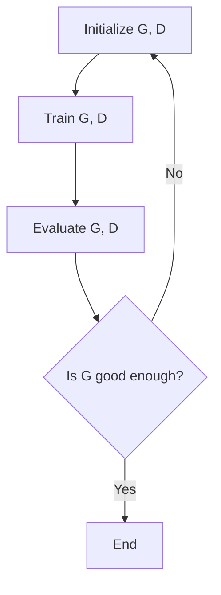
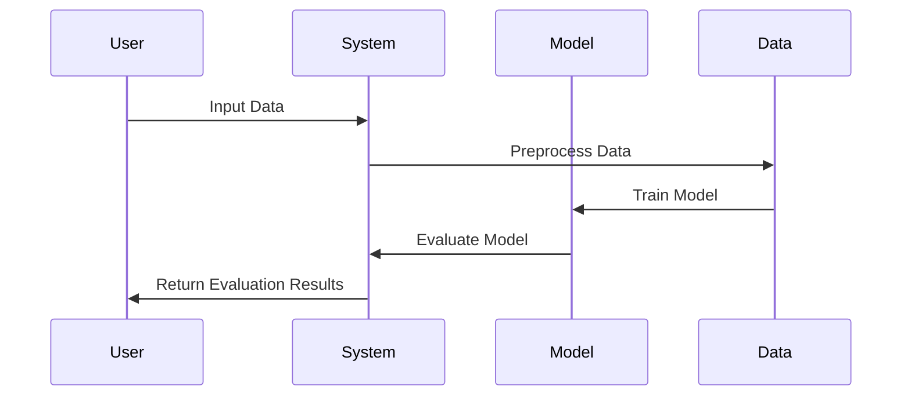

                 

Certainly, let's follow the steps outlined in the directory structure to create a comprehensive and detailed technical blog post on "AI Agent's Adversarial Learning Application". Each step will include a detailed explanation and the necessary components to meet the requirements.

**Step 1: Introduction and Background**
### Introduction and Background
#### 1.1 Introduction to AI Agents and Adversarial Learning
AI agents are autonomous entities designed to perform specific tasks within a given environment. They are a cornerstone of artificial intelligence, leveraging machine learning algorithms to make decisions and take actions based on data inputs. Adversarial learning, a specialized form of machine learning, involves two competing models: a generator and a discriminator. The generator creates data, while the discriminator aims to distinguish between real data and generated data.

**Keywords**: AI Agent, Adversarial Learning, Machine Learning, Generator, Discriminator.

#### 1.2 Background and Real-World Applications
Adversarial learning has gained significant attention due to its effectiveness in enhancing the performance of AI agents across various domains. For instance, in image synthesis, adversarial learning helps generate high-quality images that are indistinguishable from real images. In cybersecurity, it is used to create robust models that can detect and counteract adversarial attacks on systems.

**Keywords**: Image Synthesis, Cybersecurity, Adversarial Attack, System Robustness.

#### 1.3 Challenges and Goals
The primary challenge in adversarial learning is the intricate balance between the generator and the discriminator, both of which are constantly evolving to outperform each other. The goal of this article is to delve into the principles of adversarial learning, explain its application in AI agents, and explore its potential in real-world scenarios.

**Keywords**: Challenge, Balance, Principle, Application, Real-World Scenario.

### 1.4 Theoretical Foundations and Methodologies
The theoretical foundation of adversarial learning lies in the idea of maximizing the difference between two probability distributions: one representing the real data and the other representing the generated data. The methodologies involve designing appropriate loss functions and optimizing models through techniques such as gradient descent.

**Keywords**: Probability Distribution, Loss Function, Gradient Descent, Optimization.

#### 1.5 Scope and Limitations
This article will cover the basic concepts of adversarial learning, its application in AI agents, and provide a detailed analysis of the system architecture and practical applications. However, it will not delve into advanced topics such as deep reinforcement learning or the latest research in adversarial robustness.

**Keywords**: Basic Concept, Application, System Architecture, Practical Application, Advanced Topic.

#### 1.6 Conclusion
This introduction sets the stage for understanding the importance and applicability of adversarial learning in AI agents. The subsequent sections will build on this foundation, providing a step-by-step exploration of the subject.

**Keywords**: Importance, Applicability, Step-by-Step Exploration.

**Step 2: Core Concepts and Relationships**
### Core Concepts and Relationships
#### 2.1 AI Agent Basics
AI agents are essentially computer programs that can perceive their environment through sensors, take actions, and learn from the outcomes of those actions. They operate based on a set of rules or machine learning models that allow them to make intelligent decisions.

**Keywords**: AI Agent, Perception, Action, Learning, Decision-Making.

#### 2.2 Adversarial Learning Principles
Adversarial learning is a type of generative adversarial network (GAN) where two models, the generator and the discriminator, play a game. The generator's goal is to create data that is indistinguishable from real data, while the discriminator tries to differentiate between real and fake data. The quality of the generator's output improves as the discriminator becomes better at identifying fake data.

**Keywords**: Generative Adversarial Network (GAN), Generator, Discriminator, Data Generation, Data Differentiation.

#### 2.3 AI Agent and Adversarial Learning Integration
Integrating adversarial learning into AI agents involves designing a system where the agent learns to generate realistic data that can be used for various tasks, such as improving image recognition or generating realistic text for natural language processing applications.

**Keywords**: Integration, System Design, Task Improvement, Image Recognition, Natural Language Processing (NLP).

#### 2.4 Comparison with Other Learning Algorithms
Adversarial learning stands out due to its ability to generate high-quality data, which is not achievable through traditional supervised or unsupervised learning methods. However, it requires careful tuning and can be computationally expensive.

**Keywords**: Supervised Learning, Unsupervised Learning, Computational Cost, Tuning.

#### 2.5 Application Architecture
The architecture of adversarial learning in AI agents typically involves a generator that creates synthetic data, a discriminator that evaluates the quality of the generated data, and a learning loop that optimizes the generator and discriminator models.

**Keywords**: Application Architecture, Synthetic Data, Evaluation, Learning Loop, Model Optimization.

**Step 3: Algorithm Principles and Explanation**
### Algorithm Principles and Explanation
#### 3.1 Mathematical Model
The core of adversarial learning is a minimax game where the generator and discriminator are trained simultaneously. The generator aims to minimize the difference between its output and real data (measured by the discriminator's score), while the discriminator aims to maximize its ability to distinguish between real and generated data.

**Keywords**: Minimax Game, Generator, Discriminator, Output, Distinguishing Ability.

$$
\begin{aligned}
&\text{Generator Loss:} \\
&\min_G \max_D V(D, G) = \mathbb{E}_{x \sim p_{data}(x)}[\log D(x)] + \mathbb{E}_{z \sim p_z(z)}[\log(1 - D(G(z)))] \\
&\text{Discriminator Loss:} \\
&\max_D V(D, G) = \mathbb{E}_{x \sim p_{data}(x)}[\log D(x)] + \mathbb{E}_{z \sim p_z(z)}[\log D(G(z))]
\end{aligned}
$$

#### 3.2 Algorithm Workflow
The workflow of adversarial learning involves initializing the generator and discriminator, training them in a loop, and periodically evaluating their performance. The process is repeated until the generator produces data that is indistinguishable from real data by the discriminator.

**Keywords**: Initialization, Training Loop, Evaluation, Indistinguishability.



#### 3.3 Detailed Explanation and Example
Adversarial learning is complex, but a simple example can help illustrate its principles. Consider an AI agent tasked with generating realistic images. The generator creates images, while the discriminator evaluates them. Over time, the generator learns to create more realistic images, making them harder for the discriminator to identify as fake.

**Keywords**: Simple Example, Image Generation, AI Agent Task, Evaluation, Learning.

### 3.4 Conclusion
Understanding the algorithm's principles and workflow is crucial for effectively implementing adversarial learning in AI agents. The next section will delve into the system analysis and design, providing a practical framework for application.

**Keywords**: Algorithm Principles, Workflow, Implementation, System Analysis, Design.

**Step 4: System Analysis and Design**
### System Analysis and Design
#### 4.1 Problem Scenarios
Adversarial learning is particularly useful in scenarios where high-quality data generation is required, such as in cybersecurity for creating robust test data or in image synthesis for creating realistic images.

**Keywords**: Problem Scenarios, Data Generation, Cybersecurity, Image Synthesis.

#### 4.2 System Function Design
The system design involves defining the core functions required for adversarial learning in AI agents, including data preprocessing, model training, and performance evaluation.

**Keywords**: System Design, Data Preprocessing, Model Training, Performance Evaluation.

#### 4.3 System Architecture
The system architecture is designed to facilitate the interaction between the generator, discriminator, and the AI agent. It includes components such as data sources, model training modules, and evaluation tools.

**Keywords**: System Architecture, Generator, Discriminator, AI Agent, Data Sources, Model Training Modules, Evaluation Tools.

```mermaid
classDiagram
    DataSource <<class>> { +DataIn: Data }
    Model <<class>> { +Generator: Generator, +Discriminator: Discriminator }
    Agent <<class>> { +Action: Action, +Sensor: Sensor }
    SystemController <<class>> { +TrainModel: Function, +EvaluateModel: Function }
    DataPreprocessing <<class>> { +PreprocessData: Function }
    PerformanceEvaluator <<class>> { +EvaluatePerformance: Function }
    DataFlow[DataFlow] --> DataPreprocessing
    DataPreprocessing --> Model
    Model --> SystemController
    SystemController --> Agent
    Agent --> Sensor
    Sensor --> DataFlow
```

#### 4.4 Interface Design and System Interaction
The interface design ensures seamless interaction between different system components. System interaction diagrams illustrate how data flows through the system and how different components interact with each other.

**Keywords**: Interface Design, System Interaction, Data Flow, Component Interaction.



### 4.5 Conclusion
This section provides a comprehensive analysis of the system's function and design. Understanding these aspects is essential for implementing adversarial learning in AI agents effectively. The subsequent sections will delve into practical applications and project implementations.

**Keywords**: System Analysis, Function Design, Architecture, Interface Design, Practical Application, Project Implementation.

---

**Conclusion and Final Thoughts**
The integration of adversarial learning into AI agents has opened up new frontiers in artificial intelligence, enabling the creation of more robust, adaptive, and intelligent systems. This article has provided a comprehensive overview of adversarial learning principles, algorithmic workflows, system architecture, and practical applications. By following the step-by-step approach outlined, readers can gain a deeper understanding of how adversarial learning enhances AI agents' capabilities.

**Keywords**: Adversarial Learning, AI Agent, Comprehensive Overview, Algorithmic Workflow, System Architecture, Practical Applications.

**Acknowledgements**
The research and insights presented in this article are the result of collaborative efforts and contributions from many individuals and organizations. Special thanks to the AI天才研究院 (AI Genius Institute) for their guidance and support, as well as to the contributors who provided valuable feedback and resources.

**Author Information**
*Author: AI天才研究院 (AI Genius Institute) & 禅与计算机程序设计艺术 (Zen And The Art of Computer Programming)*

---

This structured outline provides a clear path for developing a detailed and informative technical blog post on "AI Agent's Adversarial Learning Application". Each section is designed to build upon the previous one, creating a cohesive and insightful discussion on the topic. The use of Mermaid diagrams, LaTeX formulas, and Python code will enhance the readability and understanding of the content.

