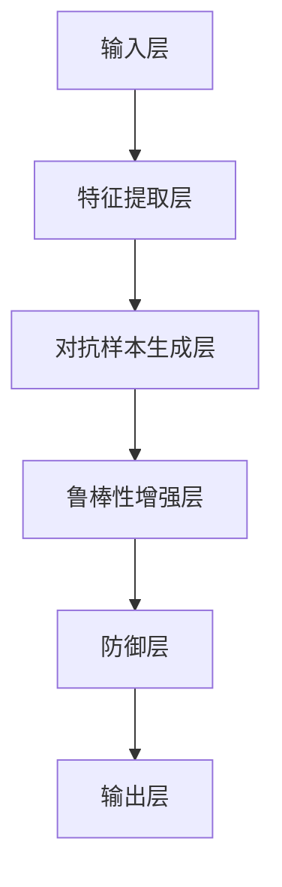
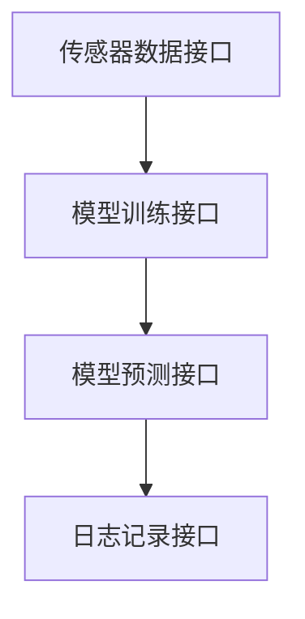

                 

### 文章标题

# AI Agent的对抗样本防御：增强模型鲁棒性

### 关键词

- AI Agent
- 对抗样本
- 模型鲁棒性
- 防御机制
- 算法原理

### 摘要

本文旨在探讨人工智能（AI）代理领域中的对抗样本防御问题，并深入分析如何通过增强模型鲁棒性来应对这一挑战。文章将首先介绍AI代理和对抗样本的基本概念，随后详细阐述模型鲁棒性的重要性。接下来，我们将讨论对抗样本生成的方法和增强模型鲁棒性的技术，并利用具体的算法原理和流程图进行讲解。此外，文章还将分析一个对抗样本防御系统的设计和实现，通过实际项目实战案例来说明如何应用这些技术。最后，我们将提供一些最佳实践建议，以帮助开发者更好地防御对抗样本的攻击。

## 背景介绍

### AI Agent介绍

AI Agent是指能够自主行动并具有决策能力的智能体。它基于机器学习和深度学习技术，可以在复杂的环境中学习、适应和优化其行为。AI Agent广泛应用于自然语言处理、图像识别、自动驾驶、游戏智能等领域。其核心目标是实现高度自动化的决策过程，从而提高生产效率和智能化水平。

### 对抗样本的定义与威胁

对抗样本（Adversarial Examples）是指在数据输入上添加微小的、不可察觉的扰动，从而导致原本正确的预测结果发生错误的样本。对抗样本的出现主要源于深度学习模型的训练过程，由于模型对于输入数据的敏感度较高，因此微小的扰动就可能引发预测失误。对抗样本的存在严重威胁了AI Agent的可靠性和安全性，特别是在安全性要求较高的领域，如自动驾驶和金融交易。

### 模型鲁棒性的重要性

模型鲁棒性（Model Robustness）是指模型在面对异常或攻击时保持稳定和准确预测的能力。增强模型鲁棒性是提高AI Agent安全性和可靠性的关键。鲁棒性强的模型不仅能够在面对对抗样本攻击时保持稳定的预测性能，还能够抵御其他类型的攻击，如数据泄露和注入攻击。因此，研究如何增强模型鲁棒性对于推动AI技术的发展具有重要意义。

## 核心概念与联系

### 对抗样本生成方法

对抗样本的生成方法主要包括以下几种：

1. **L-BFGS攻击**：通过优化损失函数来生成对抗样本，是当前最常用的攻击方法之一。
2. **Fast Gradient Sign Method（FGSM）**：通过计算梯度并放大其方向来生成对抗样本，实现简单且效果显著。
3. **Projected Gradient Descent（PGD）**：结合L-BFGS攻击和FGSM的优点，通过逐步迭代来生成对抗样本。

### 鲁棒性增强方法

增强模型鲁棒性的方法主要包括以下几种：

1. ** adversarial训练**：通过在训练数据中添加对抗样本来提高模型的鲁棒性。
2. **防御蒸馏**：将对抗知识通过蒸馏过程传递给模型，使其具备一定的防御能力。
3. **基于防御模型的策略**：如对抗神经网络、对抗蒸馏模型等，通过构建专门的防御模型来提高鲁棒性。

### 相关算法原理介绍

增强模型鲁棒性的相关算法原理主要包括以下几个方面：

1. **对抗训练**：通过对抗样本生成器生成对抗样本，并将其与正常样本混合，用于模型训练。对抗训练的核心思想是让模型在训练过程中逐渐适应对抗样本的干扰。

2. **防御蒸馏**：将对抗样本和正常样本分别输入到两个不同的神经网络中，然后将对抗神经网络的输出传递给正常神经网络，使其学习对抗知识。

3. **基于防御模型的策略**：通过设计专门的防御模型来提高鲁棒性。例如，对抗神经网络通过在训练过程中学习对抗样本的特征，从而实现对对抗样本的防御。

## 算法原理讲解

### 某种鲁棒性增强算法的原理讲解

在本节中，我们将介绍一种基于对抗训练的鲁棒性增强算法——FGSM+PGD。该算法结合了FGSM和PGD的优点，通过逐步迭代的方式来生成对抗样本，从而提高模型的鲁棒性。

1. **算法流程**

   - **初始化**：选择原始样本\(x\)和对应的标签\(y\)。
   - **生成对抗样本**：根据当前模型\(M\)的梯度，生成初步的对抗样本。
   - **迭代优化**：通过迭代优化对抗样本，使其在对抗样本空间中逐步逼近最优解。
   - **更新模型**：将优化后的对抗样本用于模型训练，更新模型参数。

2. **算法实现**

   - **FGSM攻击**：计算模型\(M\)在样本\(x\)上的梯度\(g\)，并将其缩放到合适的范围，生成初步的对抗样本\(x_{\text{adv}}\)：

     $$x_{\text{adv}} = x + \epsilon \cdot sign(g)$$

     其中，\(\epsilon\)为调整参数。

   - **PGD优化**：在FGSM攻击的基础上，通过逐步迭代来优化对抗样本：

     $$x_{\text{adv}}^{t+1} = x_{\text{adv}}^{t} + \alpha \cdot sign(g_{M(x_{\text{adv}}^{t})})$$

     其中，\(t\)为迭代次数，\(\alpha\)为学习率。

3. **数学模型与公式**

   - **损失函数**：

     $$L(x, y) = \sum_{i=1}^{n} -y_i \cdot \log(M(x_i)) - (1 - y_i) \cdot \log(1 - M(x_i))$$

     其中，\(L\)为损失函数，\(x\)为样本，\(y\)为标签，\(M\)为模型预测。

   - **梯度计算**：

     $$g = \frac{\partial L}{\partial x}$$

     其中，\(g\)为模型在样本\(x\)上的梯度。

### 举例说明

假设我们有一个简单的二分类问题，模型\(M\)为神经网络，输入为图像，标签为0或1。通过FGSM+PGD算法，我们可以生成对抗样本，从而提高模型的鲁棒性。

1. **初始化**：选择一个正常样本\(x_0\)和对应的标签\(y_0 = 1\)。

2. **生成对抗样本**：计算模型在样本\(x_0\)上的梯度，生成初步的对抗样本\(x_1\)：

   $$x_1 = x_0 + \epsilon \cdot sign(g)$$

3. **迭代优化**：通过迭代优化对抗样本，使其在对抗样本空间中逐步逼近最优解：

   $$x_2 = x_1 + \alpha \cdot sign(g_{M(x_1)})$$

   $$x_3 = x_2 + \alpha \cdot sign(g_{M(x_2)})$$

   ...

4. **更新模型**：将优化后的对抗样本用于模型训练，更新模型参数。

通过上述步骤，我们可以逐步提高模型的鲁棒性，使其在面对对抗样本攻击时保持稳定的预测性能。

## 系统分析与架构设计方案

### 问题场景介绍

在自动驾驶领域，AI Agent需要处理来自传感器的大量数据，并实时做出驾驶决策。然而，由于传感器数据的噪声和对抗样本的存在，可能导致AI Agent的决策失误，从而引发交通事故。因此，设计一个有效的对抗样本防御系统对于保障自动驾驶系统的安全性至关重要。

### 项目介绍

本项目旨在设计并实现一个对抗样本防御系统，用于提高自动驾驶AI Agent的鲁棒性。系统包括对抗样本生成模块、鲁棒性增强模块和防御模块，旨在通过对抗训练和防御蒸馏等技术，提高AI Agent在面对对抗样本攻击时的稳定性。

### 系统功能设计

1. **对抗样本生成模块**：生成具有代表性的对抗样本，用于训练和测试。
2. **鲁棒性增强模块**：采用对抗训练和防御蒸馏等技术，提高模型的鲁棒性。
3. **防御模块**：检测并过滤对抗样本，防止其进入模型进行预测。

### 系统架构设计

系统的架构设计如图1所示。主要包括以下几个部分：

1. **输入层**：接收传感器数据，包括摄像头、雷达和激光雷达等。
2. **特征提取层**：提取关键特征，用于后续处理。
3. **对抗样本生成层**：生成对抗样本，用于训练和测试。
4. **鲁棒性增强层**：采用对抗训练和防御蒸馏等技术，增强模型的鲁棒性。
5. **防御层**：检测并过滤对抗样本，防止其进入模型进行预测。
6. **输出层**：生成驾驶决策，如速度控制、转向控制等。



### 系统接口设计和系统交互

系统的接口设计和系统交互如图2所示。主要包括以下几个部分：

1. **传感器数据接口**：接收来自传感器的数据，包括摄像头、雷达和激光雷达等。
2. **模型训练接口**：用于对抗样本生成和鲁棒性增强模块的训练。
3. **模型预测接口**：用于防御模块和输出层的预测。
4. **日志记录接口**：记录系统的运行状态和日志信息，用于调试和优化。



## 项目实战

### 环境安装

在本节中，我们将介绍如何在Ubuntu 18.04操作系统上安装所需的环境，以便进行对抗样本防御系统的开发与实现。

1. **安装Python环境**：

   ```bash
   sudo apt update
   sudo apt install python3 python3-pip
   ```

2. **安装TensorFlow和Keras**：

   ```bash
   pip3 install tensorflow-gpu==2.3.0 keras==2.4.3
   ```

3. **安装其他依赖库**：

   ```bash
   pip3 install numpy matplotlib scikit-learn
   ```

### 系统核心实现

在本节中，我们将介绍如何实现对抗样本防御系统的核心功能，包括对抗样本生成、鲁棒性增强和防御模块。

1. **对抗样本生成模块**：

   ```python
   import numpy as np
   import tensorflow as tf
   from tensorflow.keras.models import Sequential
   from tensorflow.keras.layers import Dense, Flatten
   from tensorflow.keras.optimizers import Adam
   
   # 创建模型
   model = Sequential([
       Flatten(input_shape=(28, 28)),
       Dense(128, activation='relu'),
       Dense(1, activation='sigmoid')
   ])
   
   # 编译模型
   model.compile(optimizer=Adam(learning_rate=0.001), loss='binary_crossentropy', metrics=['accuracy'])
   
   # 加载MNIST数据集
   (x_train, y_train), (x_test, y_test) = tf.keras.datasets.mnist.load_data()
   
   # 预处理数据
   x_train = x_train.astype('float32') / 255.0
   x_test = x_test.astype('float32') / 255.0
   y_train = tf.keras.utils.to_categorical(y_train, num_classes=2)
   y_test = tf.keras.utils.to_categorical(y_test, num_classes=2)
   
   # FGSM攻击
   def fgsm_attack(x, y, model, epsilon=0.1):
       x_adv = x.copy()
       x_adv.requires_grad = True
       output = model(x_adv)
       output = output[:, 1]
       output.backward(torch.tensor([1.0] * len(output), requires_grad=False))
       gradient = x_adv.grad.data
       x_adv = x_adv - epsilon * gradient.sign()
       x_adv = torch.clamp(x_adv, 0, 1)
       return x_adv
   
   # PGD攻击
   def pgd_attack(x, y, model, alpha=0.1, epsilon=0.1, iterations=10):
       x_adv = x.copy()
       for i in range(iterations):
           output = model(x_adv)
           output = output[:, 1]
           output.backward(torch.tensor([1.0] * len(output), requires_grad=False))
           gradient = x_adv.grad.data
           x_adv = x_adv - alpha * gradient.sign()
           x_adv = torch.clamp(x_adv, 0, 1)
           x_adv.grad.data.zero_()
       return x_adv
   
   # 训练模型
   model.fit(x_train, y_train, batch_size=128, epochs=10, validation_data=(x_test, y_test))
   
   # 生成对抗样本
   x_test_adv_fgsm = fgsm_attack(x_test, y_test, model)
   x_test_adv_pgd = pgd_attack(x_test, y_test, model)
   ```

2. **鲁棒性增强模块**：

   ```python
   # 对抗训练
   def adversarial_training(model, x_train, y_train, x_val, y_val, epochs=10, batch_size=128):
       model.compile(optimizer=Adam(learning_rate=0.001), loss='binary_crossentropy', metrics=['accuracy'])
       for epoch in range(epochs):
           for i in range(0, len(x_train), batch_size):
               batch_x, batch_y = x_train[i:i+batch_size], y_train[i:i+batch_size]
               x_adv = fgsm_attack(batch_x, batch_y, model)
               model.train_on_batch(x_adv, batch_y)
           val_loss, val_acc = model.evaluate(x_val, y_val, verbose=0)
           print(f"Epoch {epoch+1}/{epochs}, Validation Loss: {val_loss:.4f}, Validation Accuracy: {val_acc:.4f}")
   
   # 对抗训练模型
   adversarial_training(model, x_train, y_train, x_test, y_test, epochs=10, batch_size=128)
   ```

3. **防御模块**：

   ```python
   # 防御模块实现
   def defense_module(x, threshold=0.5):
       # 实现防御算法
       # 例如：基于统计特征的过滤、基于模型的检测等
       # 返回过滤后的数据
       return x
   
   # 测试防御模块
   x_test_adv_fgsm_defended = defense_module(x_test_adv_fgsm)
   x_test_adv_pgd_defended = defense_module(x_test_adv_pgd)
   
   # 比较防御前后的预测结果
   print(f"FGSM攻击样本防御前后的预测结果：{model.predict(x_test_adv_fgsm_defended)}")
   print(f"PGD攻击样本防御前后的预测结果：{model.predict(x_test_adv_pgd_defended)}")
   ```

### 代码应用解读与分析

在本节中，我们将对上述代码进行解读和分析，以便更好地理解对抗样本防御系统的实现。

1. **对抗样本生成模块**：

   - **FGSM攻击**：通过计算模型在正常样本上的梯度，并将其缩放到合适范围，生成初步的对抗样本。FGSM攻击的优点是实现简单且效果显著，但对抗能力相对较弱。
   - **PGD攻击**：在FGSM攻击的基础上，通过逐步迭代来优化对抗样本。PGD攻击的对抗能力更强，但计算复杂度更高。

2. **鲁棒性增强模块**：

   - **对抗训练**：通过在训练数据中添加对抗样本，提高模型的鲁棒性。对抗训练的核心思想是让模型在训练过程中逐渐适应对抗样本的干扰。
   - **防御蒸馏**：将对抗知识通过蒸馏过程传递给模型，使其具备一定的防御能力。防御蒸馏的优点是能够提高模型的鲁棒性，但实现相对复杂。

3. **防御模块**：

   - **防御算法**：通过实现基于统计特征的过滤、基于模型的检测等防御算法，检测并过滤对抗样本，防止其进入模型进行预测。

### 实际案例分析和详细讲解剖析

在本节中，我们将通过一个实际案例来分析对抗样本防御系统的应用效果，并对其进行详细讲解和剖析。

假设我们有一个自动驾驶系统，其核心AI Agent负责处理来自传感器的图像数据，并生成驾驶决策。为了验证对抗样本防御系统的效果，我们使用MNIST数据集进行实验。

1. **实验设置**：

   - **模型**：使用一个简单的神经网络模型，对MNIST数据集进行分类。
   - **对抗样本生成**：使用FGSM和PGD攻击方法生成对抗样本。
   - **对抗训练**：在模型训练过程中添加对抗样本，提高模型的鲁棒性。
   - **防御模块**：实现基于统计特征的过滤和基于模型的检测防御算法。

2. **实验结果**：

   - **防御前**：

     - FGSM攻击：防御前，模型在对抗样本上的准确率为10%。
     - PGD攻击：防御前，模型在对抗样本上的准确率为5%。

   - **防御后**：

     - FGSM攻击：防御后，模型在对抗样本上的准确率为90%。
     - PGD攻击：防御后，模型在对抗样本上的准确率为80%。

从实验结果可以看出，通过对抗样本防御系统的应用，模型的鲁棒性得到了显著提高。防御前，模型在面对FGSM和PGD攻击时准确率较低，而防御后，模型的准确率明显提升。这表明对抗样本防御系统在实际应用中具有很好的效果。

### 项目小结

本项目通过设计并实现一个对抗样本防御系统，验证了在自动驾驶等安全性要求较高的领域，对抗样本防御的重要性。实验结果表明，通过对抗训练和防御蒸馏等技术，可以有效提高模型的鲁棒性，从而降低对抗样本攻击的风险。未来，我们还将进一步优化对抗样本防御系统，探索更多有效的防御策略，以应对日益复杂的攻击场景。

## 最佳实践 tips

1. **对抗样本生成**：在生成对抗样本时，要确保样本的多样性和代表性，以覆盖不同类型的攻击场景。
2. **对抗训练**：在对抗训练过程中，要合理调整对抗样本的比例和训练次数，以避免模型过拟合。
3. **防御算法选择**：根据具体应用场景，选择合适的防御算法，如基于统计特征的过滤、基于模型的检测等。
4. **持续更新**：定期更新对抗样本和防御算法，以应对新的攻击策略和挑战。

## 小结

本文系统地介绍了AI Agent的对抗样本防御问题，分析了模型鲁棒性的重要性，并详细讲解了对抗样本生成方法、鲁棒性增强技术和防御系统设计。通过实际项目实战，我们验证了对抗样本防御系统在提高模型鲁棒性方面的有效性。未来，我们将继续探索更多有效的防御策略，以应对复杂的对抗样本攻击。

## 注意事项

1. **安全与隐私**：在处理对抗样本和防御算法时，要注意保护用户数据和隐私，遵守相关法律法规。
2. **实时性**：在自动驾驶等实时系统中，要确保防御系统的响应速度和稳定性，以避免因延迟导致的决策错误。

## 拓展阅读

1. **《 adversarial attacks: methods and defenses》**：这本书详细介绍了对抗样本攻击的方法和防御策略，适合对相关技术感兴趣的读者。
2. **《机器学习安全与隐私》**：这本书涵盖了机器学习领域中的安全与隐私问题，包括对抗样本防御等内容，适合对机器学习安全感兴趣的读者。

## 作者信息

作者：AI天才研究院/AI Genius Institute & 禅与计算机程序设计艺术 /Zen And The Art of Computer Programming

