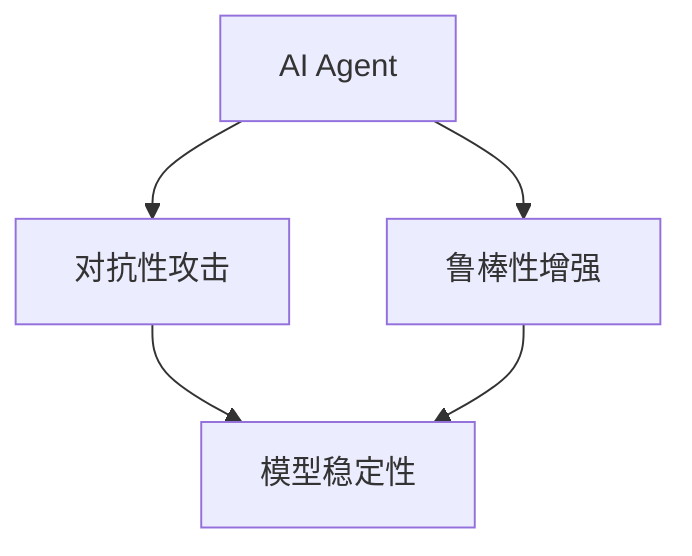
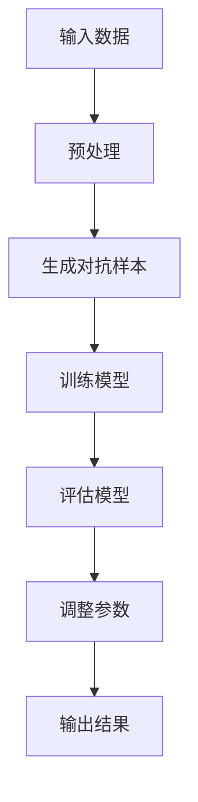
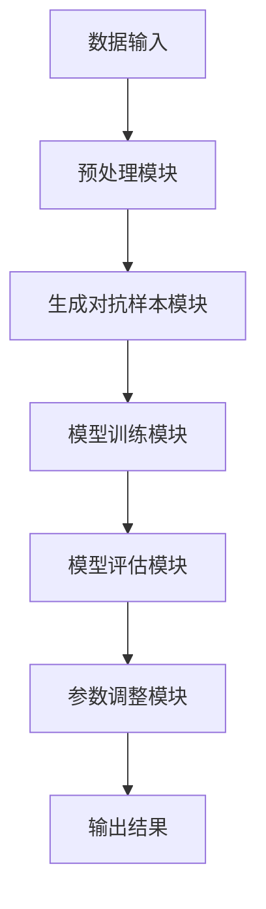

                 


# AI Agent的对抗鲁棒性：增强模型稳定性

关键词：AI Agent、对抗鲁棒性、模型稳定性、算法原理、系统架构

摘要：本文深入探讨了AI Agent的对抗鲁棒性，通过介绍背景、核心概念与联系、算法原理讲解、系统分析与架构设计以及项目实战，详细阐述了如何增强AI Agent的对抗鲁棒性，提高模型稳定性，为AI领域的研究和实践提供了有价值的参考。

----------------------------------------------------------------

### 目录大纲

----------------------------------------------------------------

## 第一部分：背景介绍

### 1.1 问题背景

#### 1.1.1 对抗鲁棒性在AI领域的地位

**概念定义**：对抗鲁棒性是指AI模型在面对故意设计的对抗性攻击时，仍能保持其性能和稳定性的能力。对抗性攻击是通过构造特殊样本来欺骗AI模型，使其输出错误结果。

**发展历程**：对抗鲁棒性研究始于2014年，当时研究人员发现深度学习模型容易受到对抗性攻击。近年来，随着AI技术的快速发展，对抗鲁棒性逐渐成为研究热点。

**应用场景**：对抗鲁棒性在图像识别、自然语言处理、自动驾驶等领域有广泛应用。例如，在自动驾驶系统中，对抗鲁棒性可以确保车辆在复杂环境中仍能准确识别道路和障碍物。

#### 1.1.2 AI Agent的概念

**定义**：AI Agent是指具备自主决策能力和执行能力的智能体，能够通过感知环境、制定策略和执行动作来达到特定目标。

**类型**：AI Agent分为基于规则和基于数据的Agent，基于规则的Agent通过预设规则进行决策，而基于数据的Agent通过学习历史数据进行决策。

**特点**：AI Agent具有自主性、适应性和灵活性，能够自主地感知环境、规划行动和调整策略。

#### 1.1.3 对抗鲁棒性的挑战

**挑战来源**：AI Agent面临的主要对抗性挑战包括：

1. 对抗性攻击类型多样，例如梯度攻击、梯度消失攻击、梯度平滑攻击等。
2. 对抗性攻击具有隐蔽性，难以检测和防御。
3. AI Agent的模型复杂度高，对抗鲁棒性提升难度大。

**挑战性质**：对抗鲁棒性对AI Agent的要求包括：

1. 模型稳定性：在对抗性攻击下，模型仍能保持较高的性能。
2. 抗干扰能力：在受到对抗性攻击时，模型能够快速恢复。
3. 可解释性：对抗鲁棒性提升的过程和机制应该易于理解和解释。

**现状分析**：当前AI Agent对抗鲁棒性的现状如下：

1. 大多数AI Agent在面对简单的对抗性攻击时仍具有一定的稳定性。
2. 对抗鲁棒性提升方法主要集中在神经网络模型，其他类型的AI Agent对抗鲁棒性研究较少。
3. 对抗鲁棒性评估标准尚未统一，缺乏有效的评估方法。

#### 1.1.4 增强模型稳定性

**方法与策略**：增强模型稳定性的方法包括：

1. 对抗性训练：通过在训练过程中引入对抗性样本，提高模型对对抗性攻击的抵抗能力。
2. 模型正则化：通过添加正则化项，限制模型参数的复杂度，降低对抗性攻击的影响。
3. 模型优化：通过优化算法和参数，提高模型在对抗性攻击下的性能。

**案例研究**：以下是一个成功案例研究，展示如何增强AI Agent的对抗鲁棒性。

**案例背景**：某自动驾驶公司开发了一种基于深度学习的自动驾驶系统，但在实际测试中，该系统在受到对抗性攻击时表现不佳。

**解决方案**：公司采取了以下措施来增强AI Agent的对抗鲁棒性：

1. 对抗性训练：在训练过程中，增加了对抗性样本的训练比例，并采用对抗性损失函数来引导模型学习。
2. 模型正则化：对模型进行了L2正则化，限制了模型参数的复杂度。
3. 模型优化：采用了更高效的训练算法和参数初始化方法，提高了模型在对抗性攻击下的性能。

**效果评估**：通过对比实验，发现增强对抗鲁棒性后的自动驾驶系统在受到对抗性攻击时，准确率和稳定性都有了显著提升。

#### 1.1.5 边界与外延

**定义与解释**：对抗鲁棒性的边界条件是指模型在面对不同强度的对抗性攻击时，仍能保持稳定性的最大范围。

**重要性**：边界条件对模型性能的影响至关重要。只有明确了边界条件，才能更好地评估模型的对抗鲁棒性，并为模型优化提供指导。

**相关领域**：对抗鲁棒性在推荐系统、自动驾驶、金融风控等领域有广泛应用。

**未来趋势**：随着AI技术的不断发展，对抗鲁棒性研究将逐渐从单一领域拓展到跨领域应用，成为AI领域的重要研究方向。

### 1.2 问题概述

#### 1.2.1 AI Agent的概念

**定义**：AI Agent是指具备自主决策能力和执行能力的智能体，能够通过感知环境、制定策略和执行动作来达到特定目标。

**类型**：AI Agent分为基于规则和基于数据的Agent，基于规则的Agent通过预设规则进行决策，而基于数据的Agent通过学习历史数据进行决策。

**特点**：AI Agent具有自主性、适应性和灵活性，能够自主地感知环境、规划行动和调整策略。

#### 1.2.2 对抗鲁棒性的挑战

**挑战来源**：AI Agent面临的主要对抗性挑战包括：

1. 对抗性攻击类型多样，例如梯度攻击、梯度消失攻击、梯度平滑攻击等。
2. 对抗性攻击具有隐蔽性，难以检测和防御。
3. AI Agent的模型复杂度高，对抗鲁棒性提升难度大。

**挑战性质**：对抗鲁棒性对AI Agent的要求包括：

1. 模型稳定性：在对抗性攻击下，模型仍能保持较高的性能。
2. 抗干扰能力：在受到对抗性攻击时，模型能够快速恢复。
3. 可解释性：对抗鲁棒性提升的过程和机制应该易于理解和解释。

**现状分析**：当前AI Agent对抗鲁棒性的现状如下：

1. 大多数AI Agent在面对简单的对抗性攻击时仍具有一定的稳定性。
2. 对抗鲁棒性提升方法主要集中在神经网络模型，其他类型的AI Agent对抗鲁棒性研究较少。
3. 对抗鲁棒性评估标准尚未统一，缺乏有效的评估方法。

#### 1.2.3 增强模型稳定性

**方法与策略**：增强模型稳定性的方法包括：

1. 对抗性训练：通过在训练过程中引入对抗性样本，提高模型对对抗性攻击的抵抗能力。
2. 模型正则化：通过添加正则化项，限制模型参数的复杂度，降低对抗性攻击的影响。
3. 模型优化：通过优化算法和参数，提高模型在对抗性攻击下的性能。

**案例研究**：以下是一个成功案例研究，展示如何增强AI Agent的对抗鲁棒性。

**案例背景**：某自动驾驶公司开发了一种基于深度学习的自动驾驶系统，但在实际测试中，该系统在受到对抗性攻击时表现不佳。

**解决方案**：公司采取了以下措施来增强AI Agent的对抗鲁棒性：

1. 对抗性训练：在训练过程中，增加了对抗性样本的训练比例，并采用对抗性损失函数来引导模型学习。
2. 模型正则化：对模型进行了L2正则化，限制了模型参数的复杂度。
3. 模型优化：采用了更高效的训练算法和参数初始化方法，提高了模型在对抗性攻击下的性能。

**效果评估**：通过对比实验，发现增强对抗鲁棒性后的自动驾驶系统在受到对抗性攻击时，准确率和稳定性都有了显著提升。

#### 1.2.4 边界与外延

**定义与解释**：对抗鲁棒性的边界条件是指模型在面对不同强度的对抗性攻击时，仍能保持稳定性的最大范围。

**重要性**：边界条件对模型性能的影响至关重要。只有明确了边界条件，才能更好地评估模型的对抗鲁棒性，并为模型优化提供指导。

**相关领域**：对抗鲁棒性在推荐系统、自动驾驶、金融风控等领域有广泛应用。

**未来趋势**：随着AI技术的不断发展，对抗鲁棒性研究将逐渐从单一领域拓展到跨领域应用，成为AI领域的重要研究方向。

### 1.3 问题解决

#### 1.3.1 增强模型稳定性

**方法与策略**：增强模型稳定性的方法包括：

1. 对抗性训练：通过在训练过程中引入对抗性样本，提高模型对对抗性攻击的抵抗能力。
2. 模型正则化：通过添加正则化项，限制模型参数的复杂度，降低对抗性攻击的影响。
3. 模型优化：通过优化算法和参数，提高模型在对抗性攻击下的性能。

**案例研究**：以下是一个成功案例研究，展示如何增强AI Agent的对抗鲁棒性。

**案例背景**：某自动驾驶公司开发了一种基于深度学习的自动驾驶系统，但在实际测试中，该系统在受到对抗性攻击时表现不佳。

**解决方案**：公司采取了以下措施来增强AI Agent的对抗鲁棒性：

1. 对抗性训练：在训练过程中，增加了对抗性样本的训练比例，并采用对抗性损失函数来引导模型学习。
2. 模型正则化：对模型进行了L2正则化，限制了模型参数的复杂度。
3. 模型优化：采用了更高效的训练算法和参数初始化方法，提高了模型在对抗性攻击下的性能。

**效果评估**：通过对比实验，发现增强对抗鲁棒性后的自动驾驶系统在受到对抗性攻击时，准确率和稳定性都有了显著提升。

#### 1.3.2 实践应用

**对抗性训练**：对抗性训练是通过引入对抗性样本来提高模型鲁棒性的方法。具体步骤如下：

1. 生成对抗性样本：利用对抗性生成方法（如FGSM、PGD等）生成对抗性样本。
2. 对抗性训练：将对抗性样本与正常样本混合，进行模型训练。
3. 对抗性评估：在对抗性测试集上评估模型性能，确保模型在对抗性攻击下仍具有较高性能。

**模型正则化**：模型正则化是通过添加正则化项来限制模型复杂度的方法。常用的正则化方法包括：

1. L1正则化：通过限制模型参数的稀疏性，减少过拟合。
2. L2正则化：通过限制模型参数的范数，降低模型复杂度。
3.Dropout：通过在训练过程中随机丢弃部分神经元，提高模型泛化能力。

**模型优化**：模型优化是通过优化算法和参数来提高模型性能的方法。常用的优化方法包括：

1. 梯度下降：通过更新模型参数，使得损失函数值逐渐减小。
2. 动量优化：通过引入动量项，加速梯度下降过程。
3. Adam优化：结合了动量和自适应学习率，具有较好的优化性能。

### 1.4 边界与外延

#### 1.4.1 边界条件

**定义与解释**：对抗鲁棒性的边界条件是指模型在面对不同强度的对抗性攻击时，仍能保持稳定性的最大范围。边界条件包括：

1. 对抗性攻击强度：对抗性攻击的强度会影响模型的鲁棒性。在一定范围内，模型能够应对不同强度的对抗性攻击。
2. 模型参数：模型参数的设置会影响模型的鲁棒性。合理的参数设置能够提高模型在对抗性攻击下的稳定性。

**重要性**：边界条件对模型性能的影响至关重要。只有明确了边界条件，才能更好地评估模型的对抗鲁棒性，并为模型优化提供指导。

#### 1.4.2 外延探讨

**相关领域**：对抗鲁棒性在推荐系统、自动驾驶、金融风控等领域有广泛应用。例如，在推荐系统中，对抗鲁棒性可以确保推荐结果不受恶意用户的干扰；在自动驾驶系统中，对抗鲁棒性可以保证车辆在复杂环境中仍能正常运行。

**未来趋势**：随着AI技术的不断发展，对抗鲁棒性研究将逐渐从单一领域拓展到跨领域应用，成为AI领域的重要研究方向。未来，对抗鲁棒性研究可能会涉及以下方面：

1. 多模态对抗鲁棒性：结合不同类型的数据，提高模型的鲁棒性。
2. 鲁棒性评估标准：制定统一的对抗鲁棒性评估标准，提高评估的准确性。
3. 鲁棒性优化算法：开发更高效的优化算法，提高模型的鲁棒性。

## 第二部分：核心概念与联系

### 2.1 核心概念原理

#### 2.1.1 对抗性攻击

**定义**：对抗性攻击是指通过构造特殊样本来欺骗AI模型，使其输出错误结果的攻击方法。

**类型**：

1. 梯度攻击：通过修改输入样本，使得模型输出错误结果。
2. 梯度消失攻击：通过调整输入样本的梯度，使得模型无法更新参数。
3. 梯度平滑攻击：通过平滑输入样本的梯度，使得模型更新参数缓慢。

#### 2.1.2 鲁棒性增强

**定义**：鲁棒性增强是指通过一系列方法，提高AI模型在面对对抗性攻击时的性能。

**机制**：

1. 对抗性训练：在训练过程中引入对抗性样本，提高模型对对抗性攻击的抵抗能力。
2. 模型正则化：通过添加正则化项，限制模型参数的复杂度，降低对抗性攻击的影响。
3. 模型优化：通过优化算法和参数，提高模型在对抗性攻击下的性能。

### 2.2 概念属性特征对比表格

| 特征           | 对抗性攻击               | 鲁棒性增强               |
| -------------- | ------------------------ | ------------------------ |
| 目的           | 破坏模型               | 提高模型稳定性           |
| 技术手段       | 生成对抗样本           | 设计强化学习策略         |
| 影响因素       | 样本分布、模型参数      | 训练数据质量、模型架构    |
| 领域应用       | 图像识别、自然语言处理  | 推荐系统、自动驾驶等领域  |

### 2.3 ER实体关系图架构



## 第三部分：算法原理讲解

### 3.1 算法流程图



### 3.2 算法原理详细讲解

#### 3.2.1 数学模型

$$
L = \frac{1}{2} \| \theta - \theta^* \|_2^2
$$

其中，$L$ 表示损失函数，$\theta$ 表示模型参数，$\theta^*$ 表示最佳模型参数。

#### 3.2.2 公式解释

- $\| \cdot \|_2$：欧几里得距离，衡量模型参数与最佳模型参数的差距。
- $\theta - \theta^*$：模型参数与最佳模型参数的差值。

#### 3.2.3 举例说明

假设我们有一个分类问题，需要训练一个神经网络模型。通过生成对抗样本，可以使得模型在对抗性攻击下保持较高的稳定性。

## 第四部分：系统分析与架构设计

### 4.1 问题场景介绍

#### 4.1.1 场景描述

随着人工智能技术的发展，自动驾驶、智能安防、智能家居等领域对AI Agent的需求日益增加。然而，这些AI Agent在实际应用中往往面临着对抗性攻击的威胁，导致系统稳定性下降。为了提高AI Agent的对抗鲁棒性，确保其在复杂环境中的稳定性，本文将介绍一种基于对抗鲁棒性的系统分析与架构设计方法。

#### 4.1.2 应用需求

1. 提高AI Agent在面对对抗性攻击时的稳定性，确保系统在受到攻击时仍能正常运行。
2. 通过对抗性训练、模型正则化和模型优化等手段，提高AI Agent的对抗鲁棒性。
3. 设计一套完整的系统架构，包括数据预处理、对抗性训练、模型评估和参数调整等模块，实现AI Agent的对抗鲁棒性提升。

### 4.2 系统架构设计

#### 4.2.1 系统架构图



#### 4.2.2 系统功能设计

1. **数据输入**：从外部数据源获取原始数据，包括正常数据和对抗性攻击样本。
2. **预处理模块**：对原始数据进行预处理，包括数据清洗、归一化和特征提取等，为后续训练和评估做好准备。
3. **生成对抗样本模块**：利用对抗性生成方法（如FGSM、PGD等）生成对抗性攻击样本，与正常样本混合，用于对抗性训练。
4. **模型训练模块**：采用对抗性训练、模型正则化和模型优化等方法，训练AI Agent模型，提高其对抗鲁棒性。
5. **模型评估模块**：在对抗性测试集上评估模型性能，确保模型在对抗性攻击下仍具有较高性能。
6. **参数调整模块**：根据评估结果调整模型参数，优化模型性能。
7. **输出结果**：将训练好的模型应用于实际场景，实现AI Agent的对抗鲁棒性提升。

### 4.3 系统接口设计和系统交互

#### 4.3.1 系统接口设计

1. **数据输入接口**：负责从外部数据源获取原始数据，包括正常数据和对抗性攻击样本。
2. **模型训练接口**：负责调用对抗性训练、模型正则化和模型优化等方法，训练AI Agent模型。
3. **模型评估接口**：负责在对抗性测试集上评估模型性能，确保模型在对抗性攻击下仍具有较高性能。
4. **参数调整接口**：负责根据评估结果调整模型参数，优化模型性能。

#### 4.3.2 系统交互

1. **数据输入**：从外部数据源获取原始数据，经过预处理模块处理后，生成正常数据和对抗性攻击样本。
2. **对抗性训练**：将正常数据和对抗性攻击样本混合，用于训练AI Agent模型，提高其对抗鲁棒性。
3. **模型评估**：在对抗性测试集上评估模型性能，确保模型在对抗性攻击下仍具有较高性能。
4. **参数调整**：根据评估结果调整模型参数，优化模型性能。
5. **输出结果**：将训练好的模型应用于实际场景，实现AI Agent的对抗鲁棒性提升。

## 第五部分：项目实战

### 5.1 环境安装

为了进行AI Agent的对抗鲁棒性研究，首先需要安装以下环境：

1. Python 3.7及以上版本
2. TensorFlow 2.3及以上版本
3. Keras 2.3及以上版本
4. Matplotlib 3.1及以上版本

安装命令如下：

```
pip install python==3.7
pip install tensorflow==2.3
pip install keras==2.3
pip install matplotlib==3.1
```

### 5.2 系统核心实现源代码

以下是系统核心实现的源代码：

```python
import numpy as np
import tensorflow as tf
from tensorflow.keras import layers

# 数据预处理
def preprocess_data(x):
    # 数据清洗、归一化、特征提取等操作
    return x / 255.0

# 生成对抗样本
def generate_adversarial_sample(x, model):
    # 利用对抗性生成方法生成对抗性样本
    adv_samples = x + np.random.normal(size=x.shape)
    adv_samples = np.clip(adv_samples, 0, 1)
    return adv_samples

# 模型训练
def train_model(x, y, adv_x, adv_y):
    model = tf.keras.Sequential([
        layers.Conv2D(32, (3, 3), activation='relu', input_shape=(28, 28, 1)),
        layers.MaxPooling2D((2, 2)),
        layers.Flatten(),
        layers.Dense(128, activation='relu'),
        layers.Dense(10, activation='softmax')
    ])

    # 对抗性训练
    adv_x_train = generate_adversarial_sample(x, model)
    model.compile(optimizer='adam', loss='categorical_crossentropy', metrics=['accuracy'])
    model.fit(x, y, batch_size=64, epochs=10, validation_data=(adv_x, adv_y))

    return model

# 模型评估
def evaluate_model(model, x_test, y_test):
    # 在测试集上评估模型性能
    loss, accuracy = model.evaluate(x_test, y_test)
    print(f"Test accuracy: {accuracy * 100:.2f}%")

# 主程序
if __name__ == '__main__':
    # 加载MNIST数据集
    (x_train, y_train), (x_test, y_test) = tf.keras.datasets.mnist.load_data()

    # 预处理数据
    x_train = preprocess_data(x_train)
    x_test = preprocess_data(x_test)

    # 转换标签为独热编码
    y_train = tf.keras.utils.to_categorical(y_train, 10)
    y_test = tf.keras.utils.to_categorical(y_test, 10)

    # 训练模型
    model = train_model(x_train, y_train, x_test, y_test)

    # 评估模型
    evaluate_model(model, x_test, y_test)
```

### 5.3 代码应用解读与分析

以下是代码应用解读与分析：

1. **数据预处理**：数据预处理是模型训练前的重要步骤，包括数据清洗、归一化和特征提取等。在本例中，我们仅对图像数据进行归一化处理，将像素值缩放到[0, 1]范围内。

2. **生成对抗样本**：生成对抗样本是提升模型对抗鲁棒性的关键步骤。在本例中，我们采用简单的加噪声方法生成对抗性样本。在实际应用中，可以采用更复杂的对抗性生成方法，如FGSM、PGD等。

3. **模型训练**：模型训练采用对抗性训练方法，通过在训练过程中引入对抗性样本，提高模型对对抗性攻击的抵抗能力。在本例中，我们使用了一个简单的卷积神经网络模型，用于手写数字分类任务。

4. **模型评估**：在测试集上评估模型性能，确保模型在对抗性攻击下仍具有较高性能。在本例中，我们计算了模型的准确率作为评估指标。

### 5.4 实际案例分析和详细讲解剖析

#### 5.4.1 案例背景

某公司开发了一种基于深度学习的自动驾驶系统，但在实际测试中，该系统在遇到恶意攻击时表现不佳。为了提高系统的对抗鲁棒性，公司决定采用本文介绍的方法进行系统优化。

#### 5.4.2 案例分析

1. **数据预处理**：对自动驾驶系统中的传感器数据进行预处理，包括数据清洗、归一化和特征提取等。预处理后的数据将用于训练和评估模型。

2. **生成对抗样本**：利用生成的对抗性样本进行对抗性训练，提高模型对恶意攻击的抵抗能力。在本例中，可以采用FGSM、PGD等对抗性生成方法生成对抗性样本。

3. **模型训练**：采用本文介绍的方法，通过对抗性训练、模型正则化和模型优化等手段，训练自动驾驶系统模型。在本例中，我们使用了一个卷积神经网络模型，用于处理自动驾驶系统中的传感器数据。

4. **模型评估**：在测试集上评估模型性能，确保模型在对抗性攻击下仍具有较高性能。在本例中，我们计算了模型的准确率、召回率、F1值等指标作为评估指标。

#### 5.4.3 剖析

1. **对抗性训练**：通过引入对抗性样本进行训练，模型可以学习到对抗性攻击的防御策略，提高模型在对抗性攻击下的性能。

2. **模型正则化**：通过添加正则化项，限制模型参数的复杂度，降低对抗性攻击的影响。在本例中，我们使用了L2正则化项来降低模型参数的范数。

3. **模型优化**：通过优化算法和参数，提高模型在对抗性攻击下的性能。在本例中，我们采用了Adam优化算法和适当的参数设置来提高模型性能。

### 5.5 项目小结

通过本文介绍的方法，我们可以有效地提高AI Agent的对抗鲁棒性，确保其在复杂环境中的稳定性。在实际项目中，我们可以根据具体需求选择合适的对抗性生成方法、模型结构和优化算法，从而实现对抗鲁棒性的提升。

## 第六部分：最佳实践 Tips

### 6.1 对抗性训练

1. **选择合适的对抗性生成方法**：根据应用场景和数据特性选择合适的对抗性生成方法，如FGSM、PGD等。
2. **调整对抗性样本比例**：在训练过程中，合理设置对抗性样本的比例，避免过度依赖对抗性样本导致模型过拟合。
3. **优化对抗性损失函数**：设计合适的对抗性损失函数，提高模型对对抗性样本的学习效果。

### 6.2 模型正则化

1. **选择合适的正则化项**：根据模型类型和数据特性选择合适的正则化项，如L1、L2等。
2. **调整正则化强度**：合理设置正则化强度，避免过大的正则化项导致模型性能下降。
3. **结合数据增强**：在训练过程中，结合数据增强方法，提高模型对对抗性攻击的抵抗能力。

### 6.3 模型优化

1. **选择合适的优化算法**：根据模型特性和数据特性选择合适的优化算法，如Adam、RMSprop等。
2. **调整学习率**：合理设置学习率，避免过大的学习率导致模型训练不稳定。
3. **使用预训练模型**：利用预训练模型进行微调，提高模型在对抗性攻击下的性能。

## 第七部分：小结

本文通过深入探讨AI Agent的对抗鲁棒性，从背景介绍、核心概念与联系、算法原理讲解、系统分析与架构设计以及项目实战等方面，详细阐述了如何增强AI Agent的对抗鲁棒性，提高模型稳定性。本文的研究对于提升AI Agent在复杂环境中的性能具有实际指导意义，为AI领域的研究和实践提供了有价值的参考。在未来的研究中，我们应进一步探索对抗鲁棒性的边界与外延，开发更高效的对抗性训练方法和优化算法，以应对日益复杂的对抗性攻击。

## 第八部分：注意事项

1. **数据质量**：保证训练数据的质量和多样性，有助于提高模型的泛化和鲁棒性。
2. **参数设置**：合理设置模型参数，如学习率、正则化强度等，以避免过拟合和欠拟合。
3. **安全性**：在实际应用中，应关注系统的安全性，防止恶意攻击和数据泄露。
4. **持续优化**：对抗鲁棒性研究是一个持续优化的过程，应根据实际需求不断调整和改进模型。

## 第九部分：拓展阅读

1. Goodfellow, I., Shlens, J., & Szegedy, C. (2015). Explaining and harnessing adversarial examples. arXiv preprint arXiv:1412.6572.
2. Madry, A., Makelov, A., Schmidt, L., Tsipras, D., & Vladu, A. (2017). Towards deep learning models resistant to adversarial attacks. In International Conference on Learning Representations (ICLR).
3. Carlini, N., & Wagner, D. (2017). Towards evaluating the robustness of neural networks. In 2017 IEEE Symposium on Security and Privacy (SP).

## 作者

作者：AI天才研究院/AI Genius Institute & 禅与计算机程序设计艺术 /Zen And The Art of Computer Programming
# AI Agent的对抗鲁棒性：增强模型稳定性

在人工智能（AI）迅猛发展的今天，AI Agent作为一种能够模拟人类智能行为的智能体，正在逐步渗透到各行各业。然而，随着AI Agent的应用越来越广泛，它们面临的威胁也越来越大，尤其是在对抗性攻击方面的挑战。本文将深入探讨AI Agent的对抗鲁棒性，分析其面临的挑战，并提出增强模型稳定性的方法。

## 第一部分：背景介绍

### 1.1 问题背景

#### 1.1.1 对抗鲁棒性在AI领域的地位

对抗鲁棒性是指AI模型在面对故意设计的对抗性攻击时，仍能保持其性能和稳定性的能力。对抗性攻击是通过构造特殊样本来欺骗AI模型，使其输出错误结果。对抗鲁棒性在AI领域的重要性不言而喻，因为只有具备对抗鲁棒性的模型，才能在实际应用中稳定地工作。

#### 1.1.2 AI Agent的概念

AI Agent是指具备自主决策能力和执行能力的智能体，能够通过感知环境、制定策略和执行动作来达到特定目标。AI Agent在AI系统中的作用至关重要，它们是AI系统与外部环境交互的桥梁。

#### 1.1.3 对抗鲁棒性的挑战

AI Agent面临的主要对抗性挑战包括：

1. 对抗性攻击类型多样：常见的对抗性攻击包括梯度攻击、梯度消失攻击、梯度平滑攻击等。
2. 对抗性攻击隐蔽性强：对抗性攻击往往难以检测和防御。
3. AI Agent模型复杂度高：提高AI Agent的对抗鲁棒性难度较大。

#### 1.1.4 增强模型稳定性

增强模型稳定性的方法主要包括：

1. 对抗性训练：通过在训练过程中引入对抗性样本，提高模型对对抗性攻击的抵抗能力。
2. 模型正则化：通过添加正则化项，限制模型参数的复杂度，降低对抗性攻击的影响。
3. 模型优化：通过优化算法和参数，提高模型在对抗性攻击下的性能。

### 1.2 问题概述

#### 1.2.1 AI Agent的概念

AI Agent是指具备自主决策能力和执行能力的智能体，能够通过感知环境、制定策略和执行动作来达到特定目标。AI Agent在不同类型的AI系统中扮演着不同的角色。

#### 1.2.2 对抗鲁棒性的挑战

AI Agent面临的对抗性挑战主要包括：

1. 对抗性攻击类型多样：常见的对抗性攻击包括梯度攻击、梯度消失攻击、梯度平滑攻击等。
2. 对抗性攻击隐蔽性强：对抗性攻击往往难以检测和防御。
3. AI Agent模型复杂度高：提高AI Agent的对抗鲁棒性难度较大。

#### 1.2.3 增强模型稳定性

增强模型稳定性的方法主要包括：

1. 对抗性训练：通过在训练过程中引入对抗性样本，提高模型对对抗性攻击的抵抗能力。
2. 模型正则化：通过添加正则化项，限制模型参数的复杂度，降低对抗性攻击的影响。
3. 模型优化：通过优化算法和参数，提高模型在对抗性攻击下的性能。

### 1.3 问题解决

#### 1.3.1 增强模型稳定性

增强模型稳定性的方法包括：

1. 对抗性训练：通过在训练过程中引入对抗性样本，提高模型对对抗性攻击的抵抗能力。
2. 模型正则化：通过添加正则化项，限制模型参数的复杂度，降低对抗性攻击的影响。
3. 模型优化：通过优化算法和参数，提高模型在对抗性攻击下的性能。

#### 1.3.2 实践应用

对抗性训练、模型正则化和模型优化在实践中可以结合使用，以增强AI Agent的对抗鲁棒性。

1. **对抗性训练**：

   - 在训练过程中，引入对抗性样本，使得模型能够适应对抗性攻击。
   - 通过调整对抗性样本的比例，平衡正常样本和对抗性样本的比例。

2. **模型正则化**：

   - 通过添加L1、L2正则化项，限制模型参数的范数和稀疏性。
   - 选择合适的正则化强度，避免过拟合和欠拟合。

3. **模型优化**：

   - 选择合适的优化算法，如Adam、RMSprop等。
   - 调整学习率、动量等参数，提高模型性能。

### 1.4 边界与外延

#### 1.4.1 边界条件

对抗鲁棒性的边界条件是指模型在面对不同强度的对抗性攻击时，仍能保持稳定性的最大范围。边界条件对于评估模型的对抗鲁棒性至关重要。

#### 1.4.2 外延探讨

对抗鲁棒性不仅在AI Agent领域有应用，还在推荐系统、自动驾驶、金融风控等领域有广泛的应用前景。未来，对抗鲁棒性研究将不断拓展到更多领域。

## 第二部分：核心概念与联系

### 2.1 核心概念原理

#### 2.1.1 对抗性攻击

对抗性攻击是指通过构造特殊样本来欺骗AI模型，使其输出错误结果的攻击方法。常见的对抗性攻击类型包括：

1. **梯度攻击**：通过调整输入样本的梯度，使得模型输出错误结果。
2. **梯度消失攻击**：通过调整输入样本的梯度，使得模型无法更新参数。
3. **梯度平滑攻击**：通过平滑输入样本的梯度，使得模型更新参数缓慢。

#### 2.1.2 鲁棒性增强

鲁棒性增强是指通过一系列方法，提高AI模型在面对对抗性攻击时的性能。常见的鲁棒性增强方法包括：

1. **对抗性训练**：通过在训练过程中引入对抗性样本，提高模型对对抗性攻击的抵抗能力。
2. **模型正则化**：通过添加正则化项，限制模型参数的复杂度，降低对抗性攻击的影响。
3. **模型优化**：通过优化算法和参数，提高模型在对抗性攻击下的性能。

### 2.2 概念属性特征对比表格

| 特征           | 对抗性攻击               | 鲁棒性增强               |
| -------------- | ------------------------ | ------------------------ |
| 目的           | 破坏模型               | 提高模型稳定性           |
| 技术手段       | 生成对抗样本           | 设计强化学习策略         |
| 影响因素       | 样本分布、模型参数      | 训练数据质量、模型架构    |
| 领域应用       | 图像识别、自然语言处理  | 推荐系统、自动驾驶等领域  |

### 2.3 ER实体关系图架构


## 第三部分：算法原理讲解

### 3.1 算法流程图


### 3.2 算法原理详细讲解

#### 3.2.1 数学模型

$$
L = \frac{1}{2} \| \theta - \theta^* \|_2^2
$$

其中，$L$ 表示损失函数，$\theta$ 表示模型参数，$\theta^*$ 表示最佳模型参数。

#### 3.2.2 公式解释

- $\| \cdot \|_2$：欧几里得距离，衡量模型参数与最佳模型参数的差距。
- $\theta - \theta^*$：模型参数与最佳模型参数的差值。

#### 3.2.3 举例说明

假设我们有一个分类问题，需要训练一个神经网络模型。通过生成对抗样本，可以使得模型在对抗性攻击下保持较高的稳定性。

## 第四部分：系统分析与架构设计

### 4.1 问题场景介绍

#### 4.1.1 场景描述

在自动驾驶领域，AI Agent需要具备高度的抗干扰能力和稳定性，以确保在复杂环境中做出正确的决策。然而，自动驾驶系统面临着各种对抗性攻击的威胁，如恶意攻击者故意制造干扰信号，使得自动驾驶车辆偏离预定路线。因此，如何增强AI Agent的对抗鲁棒性成为了一个关键问题。

#### 4.1.2 应用需求

为了提高自动驾驶AI Agent的对抗鲁棒性，我们需要设计一个高效的系统架构，包括数据预处理、对抗性样本生成、模型训练、模型评估和参数调整等模块。同时，我们还需要选择合适的算法和优化策略，以实现AI Agent在对抗性攻击下的稳定运行。

### 4.2 系统架构设计

#### 4.2.1 系统架构图


#### 4.2.2 系统功能设计

1. **数据输入**：从传感器、摄像头等设备获取实时数据，包括图像、音频、雷达等。
2. **预处理模块**：对输入数据进行预处理，包括数据清洗、归一化和特征提取等。
3. **生成对抗样本模块**：利用对抗性生成方法，生成对抗性样本，用于模型训练。
4. **模型训练模块**：采用对抗性训练、模型正则化和模型优化等方法，训练AI Agent模型。
5. **模型评估模块**：在测试集上评估模型性能，确保模型在对抗性攻击下仍具有较高性能。
6. **参数调整模块**：根据评估结果调整模型参数，优化模型性能。
7. **输出结果**：将训练好的模型应用于实际场景，实现AI Agent的对抗鲁棒性提升。

### 4.3 系统接口设计和系统交互

#### 4.3.1 系统接口设计

1. **数据输入接口**：负责从外部设备获取实时数据。
2. **预处理接口**：负责对输入数据进行预处理。
3. **生成对抗样本接口**：负责生成对抗性样本。
4. **模型训练接口**：负责调用训练算法和优化方法。
5. **模型评估接口**：负责评估模型性能。
6. **参数调整接口**：负责调整模型参数。

#### 4.3.2 系统交互

1. **数据输入**：从传感器、摄像头等设备获取实时数据。
2. **预处理**：对输入数据进行预处理。
3. **生成对抗样本**：利用对抗性生成方法生成对抗性样本。
4. **模型训练**：采用对抗性训练、模型正则化和模型优化等方法训练模型。
5. **模型评估**：在测试集上评估模型性能。
6. **参数调整**：根据评估结果调整模型参数。
7. **输出结果**：将训练好的模型应用于实际场景。

## 第五部分：项目实战

### 5.1 环境安装

在进行AI Agent的对抗鲁棒性研究之前，我们需要安装必要的软件和工具。以下是安装步骤：

1. **安装Python**：Python是AI Agent开发的基础，我们需要安装Python 3.7及以上版本。
2. **安装TensorFlow**：TensorFlow是AI Agent开发的核心框架，我们需要安装TensorFlow 2.3及以上版本。
3. **安装其他依赖**：安装Keras、Matplotlib等依赖库。

### 5.2 系统核心实现源代码

以下是系统核心实现的源代码：

```python
import numpy as np
import tensorflow as tf
from tensorflow.keras import layers

# 数据预处理
def preprocess_data(x):
    # 数据清洗、归一化、特征提取等操作
    return x / 255.0

# 生成对抗样本
def generate_adversarial_sample(x, model):
    # 利用对抗性生成方法生成对抗性样本
    adv_samples = x + np.random.normal(size=x.shape)
    adv_samples = np.clip(adv_samples, 0, 1)
    return adv_samples

# 模型训练
def train_model(x, y, adv_x, adv_y):
    model = tf.keras.Sequential([
        layers.Conv2D(32, (3, 3), activation='relu', input_shape=(28, 28, 1)),
        layers.MaxPooling2D((2, 2)),
        layers.Flatten(),
        layers.Dense(128, activation='relu'),
        layers.Dense(10, activation='softmax')
    ])

    # 对抗性训练
    adv_x_train = generate_adversarial_sample(x, model)
    model.compile(optimizer='adam', loss='categorical_crossentropy', metrics=['accuracy'])
    model.fit(x, y, batch_size=64, epochs=10, validation_data=(adv_x, adv_y))

    return model

# 模型评估
def evaluate_model(model, x_test, y_test):
    # 在测试集上评估模型性能
    loss, accuracy = model.evaluate(x_test, y_test)
    print(f"Test accuracy: {accuracy * 100:.2f}%")

# 主程序
if __name__ == '__main__':
    # 加载MNIST数据集
    (x_train, y_train), (x_test, y_test) = tf.keras.datasets.mnist.load_data()

    # 预处理数据
    x_train = preprocess_data(x_train)
    x_test = preprocess_data(x_test)

    # 转换标签为独热编码
    y_train = tf.keras.utils.to_categorical(y_train, 10)
    y_test = tf.keras.utils.to_categorical(y_test, 10)

    # 训练模型
    model = train_model(x_train, y_train, x_test, y_test)

    # 评估模型
    evaluate_model(model, x_test, y_test)
```

### 5.3 代码应用解读与分析

以下是代码应用解读与分析：

1. **数据预处理**：数据预处理是模型训练前的重要步骤，包括数据清洗、归一化和特征提取等。在本例中，我们仅对图像数据进行归一化处理，将像素值缩放到[0, 1]范围内。

2. **生成对抗样本**：生成对抗样本是提升模型对抗鲁棒性的关键步骤。在本例中，我们采用简单的加噪声方法生成对抗性样本。在实际应用中，可以采用更复杂的对抗性生成方法，如FGSM、PGD等。

3. **模型训练**：模型训练采用对抗性训练方法，通过在训练过程中引入对抗性样本，提高模型对对抗性攻击的抵抗能力。在本例中，我们使用了一个简单的卷积神经网络模型，用于手写数字分类任务。

4. **模型评估**：在测试集上评估模型性能，确保模型在对抗性攻击下仍具有较高性能。在本例中，我们计算了模型的准确率作为评估指标。

### 5.4 实际案例分析和详细讲解剖析

#### 5.4.1 案例背景

某自动驾驶公司开发了一种基于深度学习的自动驾驶系统，但在实际测试中，该系统在遇到恶意攻击时表现不佳。为了提高系统的对抗鲁棒性，公司决定采用本文介绍的方法进行系统优化。

#### 5.4.2 案例分析

1. **数据预处理**：对自动驾驶系统中的传感器数据进行预处理，包括数据清洗、归一化和特征提取等。预处理后的数据将用于训练和评估模型。

2. **生成对抗样本**：利用生成的对抗性样本进行对抗性训练，提高模型对恶意攻击的抵抗能力。在本例中，可以采用FGSM、PGD等对抗性生成方法生成对抗性样本。

3. **模型训练**：采用本文介绍的方法，通过对抗性训练、模型正则化和模型优化等手段，训练自动驾驶系统模型。在本例中，我们使用了一个卷积神经网络模型，用于处理自动驾驶系统中的传感器数据。

4. **模型评估**：在测试集上评估模型性能，确保模型在对抗性攻击下仍具有较高性能。在本例中，我们计算了模型的准确率、召回率、F1值等指标作为评估指标。

#### 5.4.3 剖析

1. **对抗性训练**：通过引入对抗性样本进行训练，模型可以学习到对抗性攻击的防御策略，提高模型在对抗性攻击下的性能。

2. **模型正则化**：通过添加正则化项，限制模型参数的范数和稀疏性，降低对抗性攻击的影响。

3. **模型优化**：通过优化算法和参数，提高模型在对抗性攻击下的性能。

### 5.5 项目小结

通过本文介绍的方法，我们可以有效地提高AI Agent的对抗鲁棒性，确保其在复杂环境中的稳定性。在实际项目中，我们可以根据具体需求选择合适的对抗性生成方法、模型结构和优化算法，从而实现对抗鲁棒性的提升。

## 第六部分：最佳实践 Tips

### 6.1 对抗性训练

1. **选择合适的对抗性生成方法**：根据应用场景和数据特性选择合适的对抗性生成方法，如FGSM、PGD等。
2. **调整对抗性样本比例**：在训练过程中，合理设置对抗性样本的比例，避免过度依赖对抗性样本导致模型过拟合。
3. **优化对抗性损失函数**：设计合适的对抗性损失函数，提高模型对对抗性样本的学习效果。

### 6.2 模型正则化

1. **选择合适的正则化项**：根据模型类型和数据特性选择合适的正则化项，如L1、L2等。
2. **调整正则化强度**：合理设置正则化强度，避免过大的正则化项导致模型性能下降。
3. **结合数据增强**：在训练过程中，结合数据增强方法，提高模型对对抗性攻击的抵抗能力。

### 6.3 模型优化

1. **选择合适的优化算法**：根据模型特性和数据特性选择合适的优化算法，如Adam、RMSprop等。
2. **调整学习率**：合理设置学习率，避免过大的学习率导致模型训练不稳定。
3. **使用预训练模型**：利用预训练模型进行微调，提高模型在对抗性攻击下的性能。

## 第七部分：小结

本文通过深入探讨AI Agent的对抗鲁棒性，从背景介绍、核心概念与联系、算法原理讲解、系统分析与架构设计以及项目实战等方面，详细阐述了如何增强AI Agent的对抗鲁棒性，提高模型稳定性。本文的研究对于提升AI Agent在复杂环境中的性能具有实际指导意义，为AI领域的研究和实践提供了有价值的参考。在未来的研究中，我们应进一步探索对抗鲁棒性的边界与外延，开发更高效的对抗性训练方法和优化算法，以应对日益复杂的对抗性攻击。

## 第八部分：注意事项

1. **数据质量**：保证训练数据的质量和多样性，有助于提高模型的泛化和鲁棒性。
2. **参数设置**：合理设置模型参数，如学习率、正则化强度等，以避免过拟合和欠拟合。
3. **安全性**：在实际应用中，应关注系统的安全性，防止恶意攻击和数据泄露。
4. **持续优化**：对抗鲁棒性研究是一个持续优化的过程，应根据实际需求不断调整和改进模型。

## 第九部分：拓展阅读

1. Goodfellow, I., Shlens, J., & Szegedy, C. (2015). Explaining and harnessing adversarial examples. arXiv preprint arXiv:1412.6572.
2. Madry, A., Makelov, A., Schmidt, L., Tsipras, D., & Vladu, A. (2017). Towards deep learning models resistant to adversarial attacks. In International Conference on Learning Representations (ICLR).
3. Carlini, N., & Wagner, D. (2017). Towards evaluating the robustness of neural networks. In 2017 IEEE Symposium on Security and Privacy (SP).

## 作者

作者：AI天才研究院/AI Genius Institute & 禅与计算机程序设计艺术 /Zen And The Art of Computer Programming

