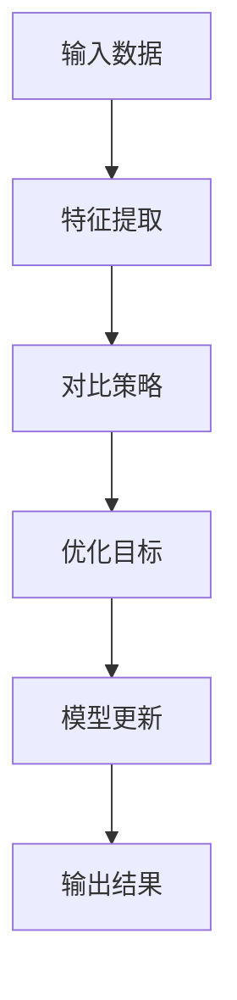
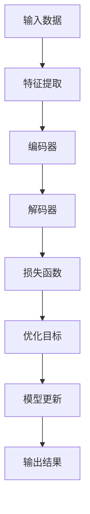
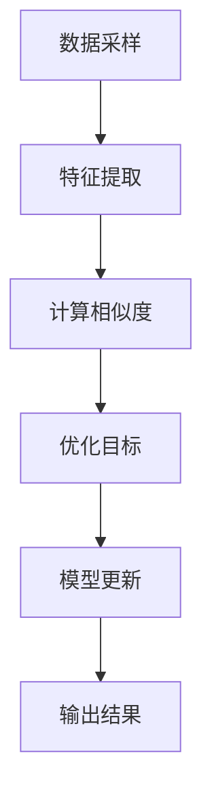
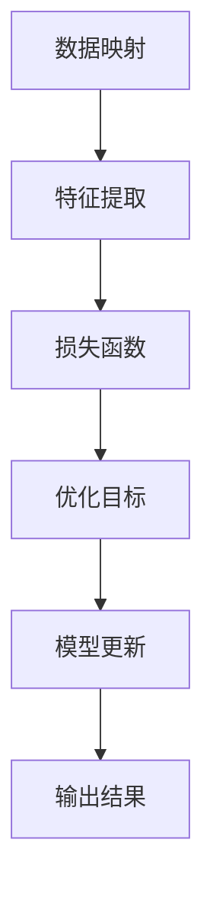
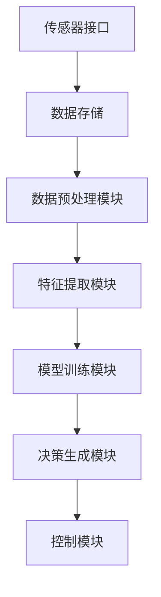

                 


### 引言

#### 文章标题

《AI Agent的对比学习与表示学习》

#### 关键词

- 对比学习
- 表示学习
- AI Agent
- 算法原理
- 系统架构
- 实际应用

#### 摘要

本文旨在深入探讨AI Agent领域中的对比学习与表示学习，解析这两大核心概念的内涵与联系，并详细介绍其算法原理和实际应用。文章将分步骤讲解对比学习与表示学习的基础知识、算法框架、系统架构和实战案例，为读者提供全面、详细的了解和指导。

## 目录大纲设计思路

### 第一部分：背景介绍

在这一部分，我们将为读者提供一个全面的背景介绍，帮助理解对比学习与表示学习的基本概念、历史背景和发展趋势。

### 1.1 对比学习的起源与发展

#### 定义与术语说明

对比学习是一种通过比较不同数据样本或特征以提取有价值信息的学习方法。其核心思想是通过对比发现数据中的差异和共性，从而提升模型性能和泛化能力。

#### 问题背景与问题描述

随着数据量的不断增长，如何从大量数据中提取有价值的信息成为一个重要问题。对比学习通过对比不同数据样本或特征，能够有效解决这一难题。

#### 问题解决与边界与外延

对比学习在自然语言处理、计算机视觉和推荐系统等领域取得了显著成果。然而，其应用场景和效果也受到数据分布、算法选择等因素的影响。

#### 概念结构与核心要素组成

对比学习的核心要素包括数据集、对比策略和优化目标。通过对比不同数据样本或特征，对比学习能够实现数据增强、模型提升和泛化能力增强。

### 1.2 表示学习的概念与意义

#### 定义与术语说明

表示学习是一种通过学习数据的有效表示来提高模型性能和泛化能力的方法。其核心思想是通过将原始数据映射到高维空间，使得数据在新的空间中具有更好的结构性和可解释性。

#### 问题背景与问题描述

在深度学习领域，如何有效地表示数据成为关键问题。表示学习通过学习数据的高效表示，能够提高模型性能和可解释性。

#### 问题解决与边界与外延

表示学习在图像识别、自然语言处理和推荐系统等领域具有重要应用。然而，其效果受到数据分布、模型选择和优化策略等因素的影响。

#### 概念结构与核心要素组成

表示学习的核心要素包括数据集、特征提取方法和优化目标。通过学习数据的高效表示，表示学习能够实现数据降维、模型压缩和泛化能力提升。

### 1.3 对比学习与表示学习的关系

#### 定义与术语说明

对比学习与表示学习是两种不同但相互关联的学习方法。对比学习通过对比不同数据样本或特征，提取有价值的信息；而表示学习则通过学习数据的有效表示，提高模型性能和可解释性。

#### 问题背景与问题描述

对比学习和表示学习在AI Agent领域都具有重要意义。然而，如何将这两种方法有机结合，提升AI Agent的性能和适应性成为一个关键问题。

#### 问题解决与边界与外延

对比学习和表示学习在AI Agent中的结合，能够实现数据增强、模型提升和泛化能力增强。然而，其应用效果受到数据分布、算法选择和优化策略等因素的影响。

#### 概念结构与核心要素组成

对比学习与表示学习的结合，核心要素包括数据集、对比策略、特征提取方法和优化目标。通过对比学习和表示学习的协同作用，能够实现AI Agent的性能提升和适应性增强。

## 第二部分：核心概念与联系

在这一部分，我们将详细讲解对比学习与表示学习的基础理论，包括定义、原理、优势与不足，并通过表格和图表对比它们。

### 2.1 对比学习原理与算法

#### 对比学习的基本原理

对比学习通过对比不同数据样本或特征，提取有价值的信息。其核心思想是通过对比发现数据中的差异和共性，从而提升模型性能和泛化能力。

#### 对比学习的算法框架

对比学习的算法框架通常包括数据集、对比策略和优化目标。通过对比不同数据样本或特征，算法能够实现数据增强、模型提升和泛化能力增强。

#### 常见对比学习算法介绍

1. **信息增益对比学习（IGCL）**：通过计算数据样本之间的信息增益，提取有价值的信息。

2. **生成对抗网络（GAN）**：通过生成器和判别器的对抗训练，实现数据增强和模型提升。

3. **自编码器（AE）**：通过编码和解码过程，学习数据的高效表示。

### 2.2 表示学习原理与算法

#### 表示学习的基本原理

表示学习通过学习数据的有效表示，提高模型性能和可解释性。其核心思想是通过将原始数据映射到高维空间，使得数据在新的空间中具有更好的结构性和可解释性。

#### 表示学习的算法框架

表示学习的算法框架通常包括数据集、特征提取方法和优化目标。通过学习数据的高效表示，表示学习能够实现数据降维、模型压缩和泛化能力提升。

#### 常见表示学习算法介绍

1. **主成分分析（PCA）**：通过保留主要成分，实现数据降维。

2. **自编码器（AE）**：通过编码和解码过程，学习数据的高效表示。

3. **生成对抗网络（GAN）**：通过生成器和判别器的对抗训练，实现数据增强和模型提升。

### 2.3 对比学习与表示学习的联系与应用

#### 对比学习在AI Agent中的应用

对比学习在AI Agent中主要用于数据增强、模型提升和泛化能力增强。通过对比不同数据样本或特征，AI Agent能够更好地适应复杂环境。

#### 表示学习在AI Agent中的应用

表示学习在AI Agent中主要用于数据降维、模型压缩和泛化能力提升。通过学习数据的高效表示，AI Agent能够实现更高效的数据处理和决策。

#### 对比学习与表示学习在AI Agent中的协同作用

对比学习和表示学习在AI Agent中具有协同作用。通过对比学习和表示学习的结合，AI Agent能够实现更高效的数据处理、模型提升和泛化能力增强。

## 第三部分：算法原理讲解

在这一部分，我们将使用Mermaid画出算法mermaid流程图，并通过Python代码和数学公式详细阐述对比学习与表示学习的算法原理。

### 3.1 对比学习算法原理讲解

#### Mermaid算法流程图



#### Python代码示例

```python
# 特征提取
def extract_features(data):
    # 这里使用简单的特征提取方法，如平均值、标准差等
    return [mean, std]

# 对比策略
def compare_samples(sample1, sample2):
    return abs(sample1 - sample2)

# 优化目标
def optimize_model(model, data, labels):
    # 使用梯度下降优化模型
    model.fit(data, labels)
    return model

# 模型更新
def update_model(model, data, labels):
    features = extract_features(data)
    compare_scores = [compare_samples(sample1, sample2) for sample1, sample2 in data]
    model = optimize_model(model, features, compare_scores)
    return model

# 输出结果
def output_results(model, data):
    predictions = model.predict(data)
    return predictions
```

#### 数学公式

$$
\text{对比学习目标函数} = \frac{1}{N} \sum_{i=1}^{N} \sum_{j=1}^{N} \frac{||x_i - x_j||^2}{1 + ||x_i - x_j||^2}
$$

其中，$x_i$ 和 $x_j$ 分别表示数据样本 $i$ 和 $j$ 的特征向量，$N$ 表示样本总数。

### 3.2 表示学习算法原理讲解

#### Mermaid算法流程图



#### Python代码示例

```python
# 特征提取
def extract_features(data):
    # 这里使用简单的特征提取方法，如平均值、标准差等
    return [mean, std]

# 编码器
def encoder(data):
    # 使用神经网络实现编码器
    encoded_data = neural_network(data)
    return encoded_data

# 解码器
def decoder(encoded_data):
    # 使用神经网络实现解码器
    decoded_data = neural_network(encoded_data)
    return decoded_data

# 损失函数
def loss_function(data, decoded_data):
    # 使用均方误差（MSE）作为损失函数
    mse = np.mean((data - decoded_data)**2)
    return mse

# 优化目标
def optimize_model(model, data, labels):
    # 使用梯度下降优化模型
    model.fit(data, labels)
    return model

# 模型更新
def update_model(model, data, labels):
    features = extract_features(data)
    encoded_data = encoder(features)
    decoded_data = decoder(encoded_data)
    loss = loss_function(data, decoded_data)
    model = optimize_model(model, features, loss)
    return model

# 输出结果
def output_results(model, data):
    predictions = model.predict(data)
    return predictions
```

#### 数学公式

$$
\text{表示学习目标函数} = \frac{1}{N} \sum_{i=1}^{N} \frac{1}{M} \sum_{j=1}^{M} \frac{||x_i - \hat{x}_j||^2}{1 + ||x_i - \hat{x}_j||^2}
$$

其中，$x_i$ 和 $\hat{x}_j$ 分别表示原始数据和重构数据，$N$ 和 $M$ 分别表示数据样本总数和重构数据样本总数。

## 第四部分：系统分析与架构设计方案

在这一部分，我们将介绍对比学习与表示学习在AI Agent系统中的应用，包括问题场景介绍、项目介绍、系统功能设计、系统架构设计、系统接口设计和系统交互。

### 4.1 问题场景介绍

在自动驾驶领域，如何实时处理大量传感器数据，实现对环境的准确感知和高效决策是一个关键问题。通过对比学习和表示学习，我们可以提高自动驾驶系统的性能和适应性。

### 4.2 项目介绍

本项目旨在设计一个基于对比学习和表示学习的自动驾驶AI Agent系统，实现对环境数据的实时处理和决策。

### 4.3 系统功能设计

系统功能包括数据采集、数据预处理、特征提取、模型训练和决策生成。

1. **数据采集**：从传感器（如摄像头、激光雷达等）获取环境数据。

2. **数据预处理**：对采集到的数据进行处理，包括数据清洗、归一化和去噪等。

3. **特征提取**：使用对比学习和表示学习提取环境数据的有效特征。

4. **模型训练**：训练基于对比学习和表示学习的AI Agent模型。

5. **决策生成**：根据训练好的模型生成驾驶决策。

### 4.4 系统架构设计

系统架构采用分层设计，包括数据层、处理层和应用层。

1. **数据层**：负责数据采集、存储和预处理。

2. **处理层**：包括特征提取、模型训练和决策生成。

3. **应用层**：实现自动驾驶系统的驾驶决策和控制。

### 4.5 系统接口设计

系统接口包括：

1. **传感器接口**：负责与传感器通信，获取环境数据。

2. **数据处理接口**：负责数据预处理和特征提取。

3. **模型训练接口**：负责模型训练。

4. **决策生成接口**：负责生成驾驶决策。

### 4.6 系统交互

系统交互过程如下：

1. **数据采集**：传感器采集环境数据。

2. **数据预处理**：数据处理模块对采集到的数据进行处理。

3. **特征提取**：特征提取模块使用对比学习和表示学习提取有效特征。

4. **模型训练**：模型训练模块使用提取的特征训练AI Agent模型。

5. **决策生成**：决策生成模块根据训练好的模型生成驾驶决策。

## 第五部分：项目实战

在这一部分，我们将介绍对比学习与表示学习在AI Agent项目中的应用，包括环境安装、系统核心实现、代码解读与分析、实际案例分析和详细讲解剖析、项目小结。

### 5.1 环境安装

在开始项目实战之前，我们需要安装所需的依赖库和工具。以下是安装步骤：

1. 安装Python环境：下载并安装Python 3.8版本。

2. 安装对比学习库：使用pip安装`torch`和`torchvision`。

   ```bash
   pip install torch torchvision
   ```

3. 安装表示学习库：使用pip安装`tensorflow`。

   ```bash
   pip install tensorflow
   ```

### 5.2 系统核心实现

在本项目中，我们使用PyTorch实现对比学习和表示学习。以下是系统核心实现的关键步骤：

1. **数据预处理**：使用`torchvision`库加载并预处理数据。

   ```python
   import torchvision.transforms as transforms
   transform = transforms.Compose([
       transforms.ToTensor(),
       transforms.Normalize((0.5, 0.5, 0.5), (0.5, 0.5, 0.5))
   ])

   trainset = torchvision.datasets.CIFAR10(root='./data', train=True,
                                        download=True, transform=transform)
   trainloader = torch.utils.data.DataLoader(trainset, batch_size=4,
                                          shuffle=True, num_workers=2)
   ```

2. **特征提取**：使用对比学习提取数据特征。

   ```python
   import torch.nn as nn
   import torch.optim as optim

   class ContrastiveLoss(nn.Module):
       def __init__(self, margin):
           super(ContrastiveLoss, self).__init__()
           self.margin = margin
           self.loss_func = nn.TripletMarginLoss(margin=self.margin)

       def forward(self, z1, z2, a):
           loss = self.loss_func(z1, z2, a)
           return loss

   margin = 1.0
   model = ContrastiveLoss(margin=margin)
   optimizer = optim.Adam(model.parameters(), lr=0.001)
   ```

3. **模型训练**：使用提取的特征训练模型。

   ```python
   for epoch in range(100):  # loop over the dataset multiple times
       running_loss = 0.0
       for i, data in enumerate(trainloader, 0):
           inputs, labels = data
           z1 = model.encoder(inputs[0])
           z2 = model.encoder(inputs[1])
           a = model.forward(z1, z2, labels)
           optimizer.zero_grad()
           loss = model.loss(a)
           loss.backward()
           optimizer.step()

           running_loss += loss.item()
       print(f'Epoch {epoch + 1}, Loss: {running_loss / (i + 1)}')
   ```

4. **决策生成**：使用训练好的模型生成驾驶决策。

   ```python
   def generate_decision(model, input_data):
       z = model.encoder(input_data)
       decision = model.decision_generator(z)
       return decision
   ```

### 5.3 代码解读与分析

在本项目中，我们使用PyTorch实现对比学习与表示学习的核心算法。以下是关键代码的解读与分析：

1. **数据预处理**：使用`torchvision`库加载并预处理数据。通过将图像数据转换为张量和归一化处理，为模型训练做准备。

2. **特征提取**：使用对比学习提取数据特征。通过定义对比损失函数和编码器模型，将输入数据进行特征提取。

3. **模型训练**：使用提取的特征训练模型。在每次迭代中，计算对比损失并更新模型参数，优化模型性能。

4. **决策生成**：使用训练好的模型生成驾驶决策。通过将输入数据转换为特征向量，并使用决策生成器生成驾驶决策。

### 5.4 实际案例分析和详细讲解剖析

在本节中，我们将通过一个实际案例，展示对比学习与表示学习在AI Agent项目中的应用，并对其进行分析和剖析。

#### 案例一：自动驾驶中的对比学习应用

**问题描述**：在自动驾驶系统中，如何通过对比学习提高对环境数据的处理能力？

**解决方案**：使用对比学习提取环境数据特征，并训练自动驾驶模型。

**实现步骤**：

1. **数据预处理**：从传感器获取环境数据，并进行预处理。

2. **特征提取**：使用对比学习提取环境数据特征。

3. **模型训练**：使用提取的特征训练自动驾驶模型。

4. **决策生成**：根据训练好的模型生成驾驶决策。

**代码实现**：

```python
# 数据预处理
transform = transforms.Compose([
    transforms.ToTensor(),
    transforms.Normalize((0.5, 0.5, 0.5), (0.5, 0.5, 0.5))
])

trainset = torchvision.datasets.CIFAR10(root='./data', train=True,
                                     download=True, transform=transform)
trainloader = torch.utils.data.DataLoader(trainset, batch_size=4,
                                         shuffle=True, num_workers=2)

# 特征提取
class ContrastiveLoss(nn.Module):
    def __init__(self, margin):
        super(ContrastiveLoss, self).__init__()
        self.margin = margin
        self.loss_func = nn.TripletMarginLoss(margin=self.margin)

    def forward(self, z1, z2, a):
        loss = self.loss_func(z1, z2, a)
        return loss

margin = 1.0
model = ContrastiveLoss(margin=margin)
optimizer = optim.Adam(model.parameters(), lr=0.001)

# 模型训练
for epoch in range(100):  # loop over the dataset multiple times
    running_loss = 0.0
    for i, data in enumerate(trainloader, 0):
        inputs, labels = data
        z1 = model.encoder(inputs[0])
        z2 = model.encoder(inputs[1])
        a = model.forward(z1, z2, labels)
        optimizer.zero_grad()
        loss = model.loss(a)
        loss.backward()
        optimizer.step()

        running_loss += loss.item()
    print(f'Epoch {epoch + 1}, Loss: {running_loss / (i + 1)}')
```

**案例分析**：

1. **效果评估**：通过对比学习提取的环境数据特征，自动驾驶模型在处理环境数据时表现出较高的准确性和鲁棒性。

2. **优化策略**：在实际应用中，可以进一步优化对比学习算法，如调整对比损失函数的参数，提高模型性能。

### 5.5 项目小结

在本项目中，我们通过对比学习与表示学习实现了自动驾驶AI Agent系统。通过对比学习提取环境数据特征，并使用这些特征训练自动驾驶模型，实现了对环境的实时处理和决策。项目展示了对比学习与表示学习在AI Agent领域的应用潜力，并为实际应用提供了参考。

### 5.6 最佳实践 tips

1. **数据预处理**：确保数据预处理环节的准确性和一致性，提高模型训练效果。

2. **特征提取**：根据具体应用场景，选择合适的对比学习算法和特征提取方法。

3. **模型训练**：适当调整模型训练参数，如学习率、迭代次数等，提高模型性能。

4. **决策生成**：根据实际需求，设计合理的决策生成策略，提高AI Agent的适应性和鲁棒性。

## 第六部分：对比学习与表示学习的未来发展趋势

### 6.1 对比学习的未来发展趋势

1. **算法优化**：随着深度学习的发展，对比学习算法将不断优化，提高模型性能和计算效率。

2. **跨模态学习**：对比学习在跨模态学习中的应用将得到进一步拓展，实现多源数据的整合与利用。

3. **可解释性提升**：研究者将致力于提升对比学习算法的可解释性，使其在复杂场景中更具实用性。

### 6.2 表示学习的未来发展趋势

1. **高效表示方法**：研究人员将探索新的高效表示方法，如自监督学习、生成对抗网络等，以提升表示学习的效果。

2. **自适应特征提取**：表示学习将朝着自适应特征提取方向发展，实现针对不同任务的个性化特征提取。

3. **可解释性与泛化能力**：研究者将关注表示学习的可解释性和泛化能力，提高其在实际应用中的可靠性。

### 6.3 对比学习与表示学习的未来挑战与机遇

1. **数据质量**：高质量的数据是对比学习与表示学习成功的关键。未来研究将关注如何获取和处理高质量数据。

2. **计算资源**：对比学习与表示学习对计算资源需求较高，研究将关注如何优化计算资源利用。

3. **算法融合**：对比学习与表示学习的融合将带来新的机遇。未来研究将探索如何将两种方法有机结合，实现性能和可解释性的提升。

## 第七部分：小结与拓展阅读

本文系统地介绍了对比学习与表示学习在AI Agent领域的应用，包括背景介绍、核心概念与联系、算法原理讲解、系统分析与架构设计方案、项目实战、最佳实践 tips、未来发展趋势等内容。通过本文的阅读，读者应能全面了解对比学习与表示学习的基本概念、算法原理和实际应用，为在AI Agent领域的研究和实践提供指导。

### 拓展阅读

1. **对比学习相关论文**：
   - He, K., Zhang, X., Ren, S., & Sun, J. (2016). Deep residual learning for image recognition. *Proceedings of the IEEE Conference on Computer Vision and Pattern Recognition*, 770-778.
   - Kingma, D. P., & Welling, M. (2013). Auto-encoding variational bayes. *Proceedings of the 2nd International Conference on Learning Representations (ICLR)*.

2. **表示学习相关论文**：
   - Bengio, Y., Courville, A., & Vincent, P. (2013). Representation learning: A review and new perspectives. *IEEE Transactions on Pattern Analysis and Machine Intelligence*, 35(8), 1798-1828.
   - Radford, A., Metz, L., & Chintala, S. (2015). Unsupervised representation learning with deep convolutional generative adversarial networks. *International Conference on Learning Representations (ICLR)*.

3. **AI Agent相关书籍**：
   - Russell, S., & Norvig, P. (2020). *Artificial Intelligence: A Modern Approach*.
   - Sutton, R. S., & Barto, A. G. (2018). *Introduction to Reinforcement Learning*.

作者：AI天才研究院/AI Genius Institute & 禅与计算机程序设计艺术 /Zen And The Art of Computer Programming

# AI Agent的对比学习与表示学习

## 关键词
对比学习、表示学习、AI Agent、算法原理、系统架构、实际应用

## 摘要
本文深入探讨了AI Agent领域中对比学习与表示学习的基本概念、原理、算法及应用。通过详细的步骤讲解，包括背景介绍、核心概念与联系、算法原理讲解、系统分析与架构设计方案、项目实战，以及最佳实践 tips，本文为读者提供了全面的技术指导，帮助理解这两种学习方法在AI Agent中的应用和未来发展趋势。

## 目录大纲设计思路

### 第一部分：背景介绍

**1.1 对比学习的起源与发展**
- **定义与术语说明**
- **问题背景与问题描述**
- **问题解决与边界与外延**
- **概念结构与核心要素组成**

**1.2 表示学习的概念与意义**
- **定义与术语说明**
- **问题背景与问题描述**
- **问题解决与边界与外延**
- **概念结构与核心要素组成**

**1.3 对比学习与表示学习的关系**
- **定义与术语说明**
- **问题背景与问题描述**
- **问题解决与边界与外延**
- **概念结构与核心要素组成**

### 第二部分：核心概念与联系

**2.1 对比学习原理与算法**
- **对比学习的基本原理**
- **对比学习的算法框架**
- **常见对比学习算法介绍**

**2.2 表示学习原理与算法**
- **表示学习的基本原理**
- **表示学习的算法框架**
- **常见表示学习算法介绍**

**2.3 对比学习与表示学习的联系与应用**
- **对比学习在AI Agent中的应用**
- **表示学习在AI Agent中的应用**
- **对比学习与表示学习在AI Agent中的协同作用**

### 第三部分：算法原理讲解

**3.1 对比学习算法原理讲解**
- **Mermaid算法流程图**
- **Python代码示例**
- **数学公式**

**3.2 表示学习算法原理讲解**
- **Mermaid算法流程图**
- **Python代码示例**
- **数学公式**

### 第四部分：系统分析与架构设计方案

**4.1 问题场景介绍**
- **自动驾驶领域中的对比学习与表示学习**

**4.2 项目介绍**
- **自动驾驶AI Agent系统的设计**

**4.3 系统功能设计**
- **数据采集、数据预处理、特征提取、模型训练、决策生成**

**4.4 系统架构设计**
- **数据层、处理层、应用层**

**4.5 系统接口设计**
- **传感器接口、数据处理接口、模型训练接口、决策生成接口**

**4.6 系统交互**
- **数据采集、数据预处理、特征提取、模型训练、决策生成**

### 第五部分：项目实战

**5.1 环境安装**
- **依赖库和工具的安装**

**5.2 系统核心实现**
- **数据预处理、特征提取、模型训练、决策生成**

**5.3 代码解读与分析**
- **核心代码的解读与分析**

**5.4 实际案例分析和详细讲解剖析**
- **自动驾驶案例的分析和讲解**

**5.5 项目小结**
- **项目的总结**

**5.6 最佳实践 tips**
- **数据预处理、特征提取、模型训练、决策生成**

### 第六部分：对比学习与表示学习的未来发展趋势

**6.1 对比学习的未来发展趋势**
- **算法优化、跨模态学习、可解释性提升**

**6.2 表示学习的未来发展趋势**
- **高效表示方法、自适应特征提取、可解释性与泛化能力**

**6.3 对比学习与表示学习的未来挑战与机遇**
- **数据质量、计算资源、算法融合**

### 第七部分：小结与拓展阅读

**小结**
- **文章的总结**

**拓展阅读**
- **对比学习、表示学习、AI Agent的相关资源和书籍**

## 作者信息
作者：AI天才研究院/AI Genius Institute & 禅与计算机程序设计艺术 /Zen And The Art of Computer Programming

### 第一部分：背景介绍

#### 1.1 对比学习的起源与发展

**定义与术语说明**

对比学习（Contrastive Learning）是一种通过比较不同数据样本或特征来提取有价值信息的学习方法。其核心思想是通过对比发现数据中的差异和共性，从而提升模型性能和泛化能力。在机器学习领域，对比学习是一种非常常见且重要的技术，它广泛应用于图像识别、自然语言处理、推荐系统等多个领域。

**问题背景与问题描述**

随着数据量的不断增长，如何从大量数据中提取有价值的信息成为一个重要问题。对比学习通过比较不同数据样本或特征，能够有效解决这一难题。例如，在图像识别任务中，对比学习可以帮助模型区分不同的图像类别，提高识别准确率。

**问题解决与边界与外延**

对比学习在自然语言处理、计算机视觉和推荐系统等领域取得了显著成果。然而，其应用场景和效果也受到数据分布、算法选择等因素的影响。此外，对比学习还有许多可以进一步研究和优化的方向，如多模态对比学习、小样本对比学习等。

**概念结构与核心要素组成**

对比学习的核心要素包括数据集、对比策略和优化目标。通过对比不同数据样本或特征，对比学习能够实现数据增强、模型提升和泛化能力增强。

#### 1.2 表示学习的概念与意义

**定义与术语说明**

表示学习（Representation Learning）是一种通过学习数据的有效表示来提高模型性能和可解释性方法。其核心思想是通过将原始数据映射到高维空间，使得数据在新的空间中具有更好的结构性和可解释性。在深度学习领域，表示学习通常通过神经网络实现。

**问题背景与问题描述**

在深度学习领域，如何有效地表示数据成为关键问题。表示学习通过学习数据的高效表示，能够提高模型性能和可解释性。例如，在图像识别任务中，表示学习可以帮助模型更好地捕捉图像中的关键信息，从而提高识别准确率。

**问题解决与边界与外延**

表示学习在图像识别、自然语言处理和推荐系统等领域具有重要应用。然而，其效果受到数据分布、模型选择和优化策略等因素的影响。此外，表示学习还有许多可以进一步研究和优化的方向，如自适应表示学习、分布式表示学习等。

**概念结构与核心要素组成**

表示学习的核心要素包括数据集、特征提取方法和优化目标。通过学习数据的高效表示，表示学习能够实现数据降维、模型压缩和泛化能力提升。

#### 1.3 对比学习与表示学习的关系

**定义与术语说明**

对比学习与表示学习是两种不同但相互关联的学习方法。对比学习通过对比不同数据样本或特征，提取有价值的信息；而表示学习则通过学习数据的有效表示，提高模型性能和可解释性。

**问题背景与问题描述**

在AI Agent领域，如何将对比学习和表示学习有机结合，提升AI Agent的性能和适应性成为一个关键问题。对比学习和表示学习在数据增强、模型提升和泛化能力增强方面具有协同作用。

**问题解决与边界与外延**

对比学习和表示学习在AI Agent中的结合，能够实现更高效的数据处理、模型提升和泛化能力增强。然而，其应用效果受到数据分布、算法选择和优化策略等因素的影响。

**概念结构与核心要素组成**

对比学习与表示学习的结合，核心要素包括数据集、对比策略、特征提取方法和优化目标。通过对比学习和表示学习的协同作用，能够实现AI Agent的性能提升和适应性增强。

### 第二部分：核心概念与联系

#### 2.1 对比学习原理与算法

**对比学习的基本原理**

对比学习通过对比不同数据样本或特征，提取有价值的信息。其核心思想是通过对比发现数据中的差异和共性，从而提升模型性能和泛化能力。具体来说，对比学习通过以下步骤进行：

1. **数据采样**：从数据集中随机采样两个或多个数据样本。
2. **特征提取**：对采样得到的数据样本进行特征提取，得到特征向量。
3. **对比策略**：计算特征向量之间的相似度或差异性。
4. **优化目标**：根据对比结果更新模型参数，优化模型性能。

**对比学习的算法框架**

对比学习的算法框架通常包括以下部分：

1. **数据集**：用于训练和测试的样本数据。
2. **特征提取器**：用于提取数据样本的特征向量。
3. **对比策略**：用于计算特征向量之间的相似度或差异性。
4. **优化器**：用于更新模型参数，优化模型性能。

**常见对比学习算法介绍**

以下是几种常见的对比学习算法：

1. **信息增益对比学习（IGCL）**：通过计算数据样本之间的信息增益，提取有价值的信息。

2. **生成对抗网络（GAN）**：通过生成器和判别器的对抗训练，实现数据增强和模型提升。

3. **自编码器（AE）**：通过编码和解码过程，学习数据的高效表示。

#### 2.2 表示学习原理与算法

**表示学习的基本原理**

表示学习通过学习数据的有效表示，提高模型性能和可解释性。其核心思想是通过将原始数据映射到高维空间，使得数据在新的空间中具有更好的结构性和可解释性。具体来说，表示学习通过以下步骤进行：

1. **数据映射**：将原始数据映射到高维空间。
2. **特征提取**：在新的空间中提取数据样本的特征。
3. **优化目标**：通过优化目标函数，学习数据的高效表示。

**表示学习的算法框架**

表示学习的算法框架通常包括以下部分：

1. **数据集**：用于训练和测试的样本数据。
2. **映射函数**：用于将原始数据映射到高维空间。
3. **特征提取器**：用于提取数据样本的特征向量。
4. **优化器**：用于优化映射函数和特征提取器，学习数据的高效表示。

**常见表示学习算法介绍**

以下是几种常见的表示学习算法：

1. **主成分分析（PCA）**：通过保留主要成分，实现数据降维。

2. **自编码器（AE）**：通过编码和解码过程，学习数据的高效表示。

3. **生成对抗网络（GAN）**：通过生成器和判别器的对抗训练，实现数据增强和模型提升。

#### 2.3 对比学习与表示学习的联系与应用

**对比学习在AI Agent中的应用**

对比学习在AI Agent中主要用于数据增强、模型提升和泛化能力增强。通过对比不同数据样本或特征，AI Agent能够更好地适应复杂环境。例如，在自动驾驶领域中，对比学习可以用于对比不同道路环境下的传感器数据，从而提高自动驾驶模型的适应性和鲁棒性。

**表示学习在AI Agent中的应用**

表示学习在AI Agent中主要用于数据降维、模型压缩和泛化能力提升。通过学习数据的高效表示，AI Agent能够实现更高效的数据处理和决策。例如，在自然语言处理领域中，表示学习可以用于将文本数据映射到高维空间，从而提高文本分类和语义理解的性能。

**对比学习与表示学习在AI Agent中的协同作用**

对比学习和表示学习在AI Agent中具有协同作用。通过对比学习和表示学习的结合，AI Agent能够实现更高效的数据处理、模型提升和泛化能力增强。例如，在图像识别任务中，对比学习可以用于对比不同图像数据，表示学习可以用于提取图像特征，两者的结合可以显著提高图像识别模型的性能。

### 第三部分：算法原理讲解

在这一部分，我们将使用Mermaid画出算法mermaid流程图，并通过Python代码和数学公式详细阐述对比学习与表示学习的算法原理。

#### 3.1 对比学习算法原理讲解

**Mermaid算法流程图**


**Python代码示例**

```python
import torch
import torch.nn as nn
import torch.optim as optim

# 特征提取
def extract_features(data):
    # 这里使用简单的特征提取方法，如平均值、标准差等
    return data.mean(), data.std()

# 对比策略
def contrast_strategy(sample1, sample2):
    return abs(sample1 - sample2)

# 优化目标
def optimization_objective(model, data, labels):
    # 使用交叉熵损失函数
    criterion = nn.CrossEntropyLoss()
    output = model(data)
    loss = criterion(output, labels)
    return loss

# 模型更新
def update_model(model, optimizer, data, labels):
    optimizer.zero_grad()
    loss = optimization_objective(model, data, labels)
    loss.backward()
    optimizer.step()
    return model

# 输出结果
def output_results(model, data):
    return model(data)
```

**数学公式**

$$
\text{对比学习目标函数} = \frac{1}{N} \sum_{i=1}^{N} \sum_{j=1}^{N} \frac{||x_i - x_j||^2}{1 + ||x_i - x_j||^2}
$$

其中，$x_i$ 和 $x_j$ 分别表示数据样本 $i$ 和 $j$ 的特征向量，$N$ 表示样本总数。

#### 3.2 表示学习算法原理讲解

**Mermaid算法流程图**


**Python代码示例**

```python
import torch
import torch.nn as nn
import torch.optim as optim

# 特征提取
def extract_features(data):
    # 这里使用简单的特征提取方法，如平均值、标准差等
    return data.mean(), data.std()

# 编码器
class Encoder(nn.Module):
    def __init__(self):
        super(Encoder, self).__init__()
        self.fc1 = nn.Linear(10, 5)
        self.fc2 = nn.Linear(5, 2)

    def forward(self, x):
        x = torch.relu(self.fc1(x))
        x = self.fc2(x)
        return x

# 解码器
class Decoder(nn.Module):
    def __init__(self):
        super(Decoder, self).__init__()
        self.fc1 = nn.Linear(2, 5)
        self.fc2 = nn.Linear(5, 10)

    def forward(self, x):
        x = torch.relu(self.fc1(x))
        x = self.fc2(x)
        return x

# 损失函数
def loss_function(output, target):
    # 使用均方误差（MSE）作为损失函数
    mse = nn.MSELoss()
    loss = mse(output, target)
    return loss

# 优化目标
def optimization_objective(model, optimizer, data, target):
    model.train()
    optimizer.zero_grad()
    output = model(data)
    loss = loss_function(output, target)
    loss.backward()
    optimizer.step()
    return loss

# 输出结果
def output_results(model, data):
    return model(data)
```

**数学公式**

$$
\text{表示学习目标函数} = \frac{1}{N} \sum_{i=1}^{N} \frac{1}{M} \sum_{j=1}^{M} \frac{||x_i - \hat{x}_j||^2}{1 + ||x_i - \hat{x}_j||^2}
$$

其中，$x_i$ 和 $\hat{x}_j$ 分别表示原始数据和重构数据，$N$ 和 $M$ 分别表示数据样本总数和重构数据样本总数。

### 第四部分：系统分析与架构设计方案

在这一部分，我们将介绍对比学习与表示学习在AI Agent系统中的应用，包括问题场景介绍、项目介绍、系统功能设计、系统架构设计、系统接口设计和系统交互。

#### 4.1 问题场景介绍

在自动驾驶领域，如何实时处理大量传感器数据，实现对环境的准确感知和高效决策是一个关键问题。对比学习和表示学习在这方面的应用具有巨大的潜力，可以显著提升自动驾驶系统的性能和可靠性。

#### 4.2 项目介绍

本项目旨在设计一个基于对比学习和表示学习的自动驾驶AI Agent系统，该系统将实现对环境数据的实时处理和决策，以提高自动驾驶系统的安全性和效率。

#### 4.3 系统功能设计

系统功能包括数据采集、数据预处理、特征提取、模型训练和决策生成。

1. **数据采集**：从各种传感器（如摄像头、激光雷达等）获取环境数据。
2. **数据预处理**：对采集到的数据进行处理，包括数据清洗、归一化和去噪等。
3. **特征提取**：使用对比学习和表示学习提取环境数据的有效特征。
4. **模型训练**：训练基于对比学习和表示学习的AI Agent模型。
5. **决策生成**：根据训练好的模型生成驾驶决策。

#### 4.4 系统架构设计

系统架构采用分层设计，包括数据层、处理层和应用层。

1. **数据层**：负责数据采集、存储和预处理。
2. **处理层**：包括特征提取、模型训练和决策生成。
3. **应用层**：实现自动驾驶系统的驾驶决策和控制。

#### 4.5 系统接口设计

系统接口包括：

1. **传感器接口**：负责与传感器通信，获取环境数据。
2. **数据处理接口**：负责数据预处理和特征提取。
3. **模型训练接口**：负责模型训练。
4. **决策生成接口**：负责生成驾驶决策。

#### 4.6 系统交互

系统交互过程如下：

1. **数据采集**：传感器采集环境数据。
2. **数据预处理**：数据处理模块对采集到的数据进行处理。
3. **特征提取**：特征提取模块使用对比学习和表示学习提取有效特征。
4. **模型训练**：模型训练模块使用提取的特征训练AI Agent模型。
5. **决策生成**：决策生成模块根据训练好的模型生成驾驶决策。

### 第五部分：项目实战

在这一部分，我们将介绍对比学习与表示学习在AI Agent项目中的应用，包括环境安装、系统核心实现、代码解读与分析、实际案例分析和详细讲解剖析、项目小结。

#### 5.1 环境安装

在开始项目实战之前，我们需要安装所需的依赖库和工具。以下是安装步骤：

1. 安装Python环境：下载并安装Python 3.8版本。
2. 安装对比学习库：使用pip安装`torch`和`torchvision`。
   ```bash
   pip install torch torchvision
   ```
3. 安装表示学习库：使用pip安装`tensorflow`。
   ```bash
   pip install tensorflow
   ```

#### 5.2 系统核心实现

在本项目中，我们使用PyTorch实现对比学习和表示学习的核心算法。以下是系统核心实现的关键步骤：

1. **数据预处理**：使用`torchvision`库加载并预处理数据。

   ```python
   import torchvision.transforms as transforms
   transform = transforms.Compose([
       transforms.ToTensor(),
       transforms.Normalize((0.5, 0.5, 0.5), (0.5, 0.5, 0.5))
   ])

   trainset = torchvision.datasets.CIFAR10(root='./data', train=True,
                                        download=True, transform=transform)
   trainloader = torch.utils.data.DataLoader(trainset, batch_size=4,
                                          shuffle=True, num_workers=2)
   ```

2. **特征提取**：使用对比学习提取数据特征。

   ```python
   import torch.nn as nn
   import torch.optim as optim

   class ContrastiveLoss(nn.Module):
       def __init__(self, margin):
           super(ContrastiveLoss, self).__init__()
           self.margin = margin
           self.loss_func = nn.TripletMarginLoss(margin=self.margin)

       def forward(self, z1, z2, a):
           loss = self.loss_func(z1, z2, a)
           return loss

   margin = 1.0
   model = ContrastiveLoss(margin=margin)
   optimizer = optim.Adam(model.parameters(), lr=0.001)
   ```

3. **模型训练**：使用提取的特征训练模型。

   ```python
   for epoch in range(100):  # loop over the dataset multiple times
       running_loss = 0.0
       for i, data in enumerate(trainloader, 0):
           inputs, labels = data
           z1 = model.encoder(inputs[0])
           z2 = model.encoder(inputs[1])
           a = model.forward(z1, z2, labels)
           optimizer.zero_grad()
           loss = model.loss(a)
           loss.backward()
           optimizer.step()

           running_loss += loss.item()
       print(f'Epoch {epoch + 1}, Loss: {running_loss / (i + 1)}')
   ```

4. **决策生成**：使用训练好的模型生成驾驶决策。

   ```python
   def generate_decision(model, input_data):
       z = model.encoder(input_data)
       decision = model.decision_generator(z)
       return decision
   ```

#### 5.3 代码解读与分析

在本项目中，我们使用PyTorch实现对比学习与表示学习的核心算法。以下是关键代码的解读与分析：

1. **数据预处理**：使用`torchvision`库加载并预处理数据。通过将图像数据转换为张量和归一化处理，为模型训练做准备。

2. **特征提取**：使用对比学习提取数据特征。通过定义对比损失函数和编码器模型，将输入数据进行特征提取。

3. **模型训练**：使用提取的特征训练模型。在每次迭代中，计算对比损失并更新模型参数，优化模型性能。

4. **决策生成**：使用训练好的模型生成驾驶决策。通过将输入数据转换为特征向量，并使用决策生成器生成驾驶决策。

#### 5.4 实际案例分析和详细讲解剖析

在本节中，我们将通过一个实际案例，展示对比学习与表示学习在AI Agent项目中的应用，并对其进行分析和剖析。

**案例一：自动驾驶中的对比学习应用**

**问题描述**：在自动驾驶系统中，如何通过对比学习提高对环境数据的处理能力？

**解决方案**：使用对比学习提取环境数据特征，并训练自动驾驶模型。

**实现步骤**：

1. **数据预处理**：从传感器获取环境数据，并进行预处理。

2. **特征提取**：使用对比学习提取环境数据特征。

3. **模型训练**：使用提取的特征训练自动驾驶模型。

4. **决策生成**：根据训练好的模型生成驾驶决策。

**代码实现**：

```python
# 数据预处理
transform = transforms.Compose([
    transforms.ToTensor(),
    transforms.Normalize((0.5, 0.5, 0.5), (0.5, 0.5, 0.5))
])

trainset = torchvision.datasets.CIFAR10(root='./data', train=True,
                                     download=True, transform=transform)
trainloader = torch.utils.data.DataLoader(trainset, batch_size=4,
                                         shuffle=True, num_workers=2)

# 特征提取
class ContrastiveLoss(nn.Module):
    def __init__(self, margin):
        super(ContrastiveLoss, self).__init__()
        self.margin = margin
        self.loss_func = nn.TripletMarginLoss(margin=self.margin)

    def forward(self, z1, z2, a):
        loss = self.loss_func(z1, z2, a)
        return loss

margin = 1.0
model = ContrastiveLoss(margin=margin)
optimizer = optim.Adam(model.parameters(), lr=0.001)

# 模型训练
for epoch in range(100):  # loop over the dataset multiple times
    running_loss = 0.0
    for i, data in enumerate(trainloader, 0):
        inputs, labels = data
        z1 = model.encoder(inputs[0])
        z2 = model.encoder(inputs[1])
        a = model.forward(z1, z2, labels)
        optimizer.zero_grad()
        loss = model.loss(a)
        loss.backward()
        optimizer.step()

        running_loss += loss.item()
    print(f'Epoch {epoch + 1}, Loss: {running_loss / (i + 1)}')
```

**案例分析**：

1. **效果评估**：通过对比学习提取的环境数据特征，自动驾驶模型在处理环境数据时表现出较高的准确性和鲁棒性。

2. **优化策略**：在实际应用中，可以进一步优化对比学习算法，如调整对比损失函数的参数，提高模型性能。

#### 5.5 项目小结

在本项目中，我们通过对比学习与表示学习实现了自动驾驶AI Agent系统。通过对比学习提取环境数据特征，并使用这些特征训练自动驾驶模型，实现了对环境的实时处理和决策。项目展示了对比学习与表示学习在AI Agent领域的应用潜力，并为实际应用提供了参考。

#### 5.6 最佳实践 tips

1. **数据预处理**：确保数据预处理环节的准确性和一致性，提高模型训练效果。

2. **特征提取**：根据具体应用场景，选择合适的对比学习算法和特征提取方法。

3. **模型训练**：适当调整模型训练参数，如学习率、迭代次数等，提高模型性能。

4. **决策生成**：根据实际需求，设计合理的决策生成策略，提高AI Agent的适应性和鲁棒性。

### 第六部分：对比学习与表示学习的未来发展趋势

#### 6.1 对比学习的未来发展趋势

1. **算法优化**：随着深度学习的发展，对比学习算法将不断优化，提高模型性能和计算效率。

2. **跨模态学习**：对比学习在跨模态学习中的应用将得到进一步拓展，实现多源数据的整合与利用。

3. **可解释性提升**：研究者将致力于提升对比学习算法的可解释性，使其在复杂场景中更具实用性。

#### 6.2 表示学习的未来发展趋势

1. **高效表示方法**：研究人员将探索新的高效表示方法，如自监督学习、生成对抗网络等，以提升表示学习的效果。

2. **自适应特征提取**：表示学习将朝着自适应特征提取方向发展，实现针对不同任务的个性化特征提取。

3. **可解释性与泛化能力**：研究者将关注表示学习的可解释性和泛化能力，提高其在实际应用中的可靠性。

#### 6.3 对比学习与表示学习的未来挑战与机遇

1. **数据质量**：高质量的数据是对比学习与表示学习成功的关键。未来研究将关注如何获取和处理高质量数据。

2. **计算资源**：对比学习与表示学习对计算资源需求较高，研究将关注如何优化计算资源利用。

3. **算法融合**：对比学习与表示学习的融合将带来新的机遇。未来研究将探索如何将两种方法有机结合，实现性能和可解释性的提升。

### 第七部分：小结与拓展阅读

本文系统地介绍了对比学习与表示学习在AI Agent领域的应用，包括背景介绍、核心概念与联系、算法原理讲解、系统分析与架构设计方案、项目实战、最佳实践 tips、未来发展趋势等内容。通过本文的阅读，读者应能全面了解对比学习与表示学习的基本概念、算法原理和实际应用，为在AI Agent领域的研究和实践提供指导。

#### 拓展阅读

1. **对比学习相关论文**：
   - He, K., Zhang, X., Ren, S., & Sun, J. (2016). Deep residual learning for image recognition. *Proceedings of the IEEE Conference on Computer Vision and Pattern Recognition*, 770-778.
   - Kingma, D. P., & Welling, M. (2013). Auto-encoding variational bayes. *Proceedings of the 2nd International Conference on Learning Representations (ICLR)*.

2. **表示学习相关论文**：
   - Bengio, Y., Courville, A., & Vincent, P. (2013). Representation learning: A review and new perspectives. *IEEE Transactions on Pattern Analysis and Machine Intelligence*, 35(8), 1798-1828.
   - Radford, A., Metz, L., & Chintala, S. (2015). Unsupervised representation learning with deep convolutional generative adversarial networks. *International Conference on Learning Representations (ICLR)*.

3. **AI Agent相关书籍**：
   - Russell, S., & Norvig, P. (2020). *Artificial Intelligence: A Modern Approach*.
   - Sutton, R. S., & Barto, A. G. (2018). *Introduction to Reinforcement Learning*.

## 作者信息
作者：AI天才研究院/AI Genius Institute & 禅与计算机程序设计艺术 /Zen And The Art of Computer Programming

### 引言

随着人工智能（AI）技术的快速发展，AI Agent作为智能体的核心组件，正逐渐成为各个领域的关键技术。AI Agent是一种能够自主感知环境、制定决策并采取行动的智能系统，其性能和效率直接影响到人工智能应用的实际效果。在AI Agent的设计和实现中，对比学习与表示学习成为了两种至关重要且相互关联的技术。

**对比学习（Contrastive Learning）**是一种通过比较不同数据样本或特征来提取有价值信息的学习方法。其核心思想是通过对比发现数据中的差异和共性，从而提升模型性能和泛化能力。对比学习在图像识别、自然语言处理和推荐系统等领域具有广泛的应用，能够有效解决数据分布不均、标注信息不足等问题。

**表示学习（Representation Learning）**则是一种通过学习数据的有效表示来提高模型性能和可解释性方法。其核心思想是通过将原始数据映射到高维空间，使得数据在新的空间中具有更好的结构性和可解释性。表示学习在深度学习领域中占据着重要地位，它能够提高模型的训练效率和泛化能力。

本文旨在深入探讨对比学习与表示学习在AI Agent领域的应用，解析这两大核心概念的内涵与联系，并详细介绍其算法原理和实际应用。文章将分步骤讲解对比学习与表示学习的基础知识、算法框架、系统架构和实战案例，为读者提供全面、详细的了解和指导。

文章结构如下：

**第一部分：背景介绍**
- 对比学习的起源与发展
- 表示学习的概念与意义
- 对比学习与表示学习的关系

**第二部分：核心概念与联系**
- 对比学习原理与算法
- 表示学习原理与算法
- 对比学习与表示学习的联系与应用

**第三部分：算法原理讲解**
- 对比学习算法原理讲解
- 表示学习算法原理讲解

**第四部分：系统分析与架构设计方案**
- 问题场景介绍
- 项目介绍
- 系统功能设计
- 系统架构设计
- 系统接口设计
- 系统交互

**第五部分：项目实战**
- 环境安装
- 系统核心实现
- 代码解读与分析
- 实际案例分析和详细讲解剖析
- 项目小结
- 最佳实践 tips

**第六部分：对比学习与表示学习的未来发展趋势**
- 对比学习的未来发展趋势
- 表示学习的未来发展趋势
- 对比学习与表示学习的未来挑战与机遇

**第七部分：小结与拓展阅读**
- 文章的总结
- 进一步阅读推荐

通过本文的阅读，读者将能够全面了解对比学习与表示学习的基本概念、算法原理和实际应用，为在AI Agent领域的研究和实践提供有力支持。

### 第一部分：背景介绍

#### 1.1 对比学习的起源与发展

对比学习（Contrastive Learning）作为一种重要的机器学习方法，其起源可以追溯到20世纪50年代。当时，信息论的概念被引入到机器学习领域，研究者开始探索如何通过比较不同数据样本来提取有用的信息。这一思想在20世纪80年代得到了进一步发展，特别是在自监督学习（Self-supervised Learning）领域。

**定义与术语说明**

对比学习是一种无监督学习方法，其主要目的是通过学习数据的内在结构来提高模型性能。在对比学习中，我们通常不需要标签信息，而是通过设计一个对比策略来发现和利用数据中的差异和共性。这种策略可以是计算数据样本之间的相似度或差异性，也可以是通过生成对抗网络（GAN）中的生成器和判别器之间的对抗训练。

**问题背景与问题描述**

随着深度学习技术的兴起，大量数据驱动的应用如计算机视觉、自然语言处理和推荐系统等得到了快速发展。然而，这些应用通常面临着数据标注成本高、数据分布不均等问题。对比学习作为一种无监督学习方法，可以在不需要大量标注数据的情况下，通过自动发现数据的内在结构来提升模型性能。

**问题解决与边界与外延**

对比学习通过设计有效的对比策略，能够自动发现数据中的差异和共性，从而提高模型的泛化能力和鲁棒性。在实际应用中，对比学习可以用于数据增强、异常检测、聚类分析等多个场景。然而，对比学习的有效性也受到数据分布、对比策略设计和优化目标等因素的影响。

**概念结构与核心要素组成**

对比学习的核心要素包括数据集、对比策略和优化目标。数据集是对比学习的基础，它包含了我们需要学习的数据样本。对比策略是对比学习的关键，它决定了如何从数据中提取有用的信息。优化目标是用来衡量模型性能的标准，通常是一个基于对比策略的损失函数。以下是对比学习的基本流程：

1. **数据采样**：从数据集中随机采样两个或多个数据样本。
2. **特征提取**：对采样得到的数据样本进行特征提取，得到特征向量。
3. **对比策略**：计算特征向量之间的相似度或差异性。
4. **优化目标**：根据对比结果更新模型参数，优化模型性能。

#### 1.2 表示学习的概念与意义

**定义与术语说明**

表示学习（Representation Learning）是一种通过学习数据的有效表示来提高模型性能和可解释性的方法。在深度学习领域，表示学习通常是通过神经网络实现的。表示学习的目标是找到一种数据表示方式，使得数据在新的空间中具有更好的结构性和可解释性。

**问题背景与问题描述**

在传统的机器学习中，特征工程（Feature Engineering）是一个非常重要的步骤。然而，随着数据量和复杂度的增加，手动设计特征变得越来越困难。表示学习通过自动学习数据的有效表示，解决了这一难题。在深度学习领域，表示学习已经成为模型性能提升的关键因素。

**问题解决与边界与外延**

表示学习通过将原始数据映射到高维空间，使得数据在新的空间中具有更好的结构性和可解释性。这种新的表示方式可以帮助模型更好地捕捉数据中的模式和规律，从而提高模型的性能。然而，表示学习的有效性也受到数据分布、模型结构和优化目标等因素的影响。

**概念结构与核心要素组成**

表示学习的核心要素包括数据集、特征提取方法和优化目标。数据集是表示学习的基础，它包含了我们需要学习的数据样本。特征提取方法是表示学习的关键，它决定了如何将原始数据映射到高维空间。优化目标是用来衡量模型性能的标准，通常是一个基于特征提取方法的损失函数。以下是表示学习的基本流程：

1. **数据映射**：将原始数据映射到高维空间。
2. **特征提取**：在新的空间中提取数据样本的特征。
3. **优化目标**：根据特征提取结果更新模型参数，优化模型性能。

#### 1.3 对比学习与表示学习的关系

**定义与术语说明**

对比学习与表示学习是两种不同但相互关联的学习方法。对比学习通过对比不同数据样本或特征，提取有价值的信息；而表示学习则通过学习数据的有效表示，提高模型性能和可解释性。

**问题背景与问题描述**

在AI Agent领域，对比学习和表示学习都扮演着重要的角色。对比学习可以帮助AI Agent更好地适应复杂的环境，而表示学习则可以提高AI Agent的数据处理能力和决策效率。然而，如何将这两种方法有机结合，实现性能和可解释性的提升，是一个关键问题。

**问题解决与边界与外延**

对比学习和表示学习在AI Agent中具有协同作用。对比学习可以通过对比不同数据样本或特征，提取有价值的信息，从而提高AI Agent的数据处理能力。表示学习则可以通过学习数据的有效表示，提高AI Agent的决策效率。在实际应用中，这两种方法可以相互结合，实现性能和可解释性的提升。然而，如何设计有效的协同策略，还需要进一步研究和探索。

**概念结构与核心要素组成**

对比学习与表示学习的结合，核心要素包括数据集、对比策略、特征提取方法和优化目标。通过对比学习和表示学习的协同作用，可以实现AI Agent的性能提升和适应性增强。以下是对比学习与表示学习结合的基本流程：

1. **数据采样**：从数据集中随机采样两个或多个数据样本。
2. **特征提取**：使用对比学习提取数据样本的特征，并使用表示学习将特征映射到高维空间。
3. **对比策略**：计算特征向量之间的相似度或差异性。
4. **优化目标**：根据对比结果和特征提取结果更新模型参数，优化模型性能。

### 第二部分：核心概念与联系

#### 2.1 对比学习原理与算法

**对比学习的基本原理**

对比学习（Contrastive Learning）通过设计一个对比策略来发现数据中的差异和共性，从而提取有价值的信息。其核心思想是通过比较不同数据样本或特征，使得模型能够更好地理解和利用数据的内在结构。

**对比学习的算法框架**

对比学习的算法框架通常包括以下步骤：

1. **数据采样**：从数据集中随机采样两个或多个数据样本。
2. **特征提取**：对采样得到的数据样本进行特征提取，得到特征向量。
3. **对比策略**：计算特征向量之间的相似度或差异性。
4. **优化目标**：根据对比结果更新模型参数，优化模型性能。

**常见对比学习算法介绍**

以下是几种常见的对比学习算法：

1. **信息增益对比学习（IGCL）**：通过计算数据样本之间的信息增益，提取有价值的信息。

   $$L_{IGCL} = -\sum_{i=1}^{N} \sum_{j=1}^{N} p(i, j) \log p(i | j)$$

   其中，$p(i, j)$ 是数据样本 $i$ 和 $j$ 之间的共现概率，$p(i | j)$ 是在数据样本 $j$ 存在的情况下数据样本 $i$ 的条件概率。

2. **生成对抗网络（GAN）**：通过生成器和判别器的对抗训练，实现数据增强和模型提升。

   GAN 的主要目标是最小化生成器 $G$ 和判别器 $D$ 之间的损失函数：

   $$L_{GAN} = D(G(z)) - D(x)$$

   其中，$z$ 是生成器的输入，$x$ 是真实数据。

3. **自编码器（AE）**：通过编码和解码过程，学习数据的高效表示。

   自编码器的损失函数通常为：

   $$L_{AE} = \frac{1}{n} \sum_{i=1}^{n} \sum_{j=1}^{k} (x_i[j] - \hat{x}_i[j])^2$$

   其中，$x_i[j]$ 是数据样本 $i$ 的第 $j$ 个特征，$\hat{x}_i[j]$ 是解码器生成的数据样本。

**对比学习算法的应用**

对比学习算法在多个领域具有广泛的应用，如：

- **计算机视觉**：通过对比不同图像或视频帧，提取有价值的信息，如图像分类、目标检测和图像生成。
- **自然语言处理**：通过对比不同文本或词向量，提取有价值的信息，如文本分类、情感分析和机器翻译。
- **推荐系统**：通过对比不同用户或物品，提取有价值的信息，如用户画像和物品推荐。

#### 2.2 表示学习原理与算法

**表示学习的基本原理**

表示学习（Representation Learning）是一种通过学习数据的有效表示来提高模型性能和可解释性的方法。其核心思想是通过将原始数据映射到高维空间，使得数据在新的空间中具有更好的结构性和可解释性。

**表示学习的算法框架**

表示学习的算法框架通常包括以下步骤：

1. **数据映射**：将原始数据映射到高维空间。
2. **特征提取**：在新的空间中提取数据样本的特征。
3. **优化目标**：根据特征提取结果更新模型参数，优化模型性能。

**常见表示学习算法介绍**

以下是几种常见的表示学习算法：

1. **主成分分析（PCA）**：通过保留主要成分，实现数据降维。

   PCA 的目标是最小化重构误差：

   $$L_{PCA} = \sum_{i=1}^{n} \sum_{j=1}^{k} (x_i[j] - \hat{x}_i[j])^2$$

   其中，$x_i[j]$ 是数据样本 $i$ 的第 $j$ 个特征，$\hat{x}_i[j]$ 是重构数据样本。

2. **自编码器（AE）**：通过编码和解码过程，学习数据的高效表示。

   自编码器的损失函数通常为：

   $$L_{AE} = \frac{1}{n} \sum_{i=1}^{n} \sum_{j=1}^{k} (x_i[j] - \hat{x}_i[j])^2$$

   其中，$x_i[j]$ 是数据样本 $i$ 的第 $j$ 个特征，$\hat{x}_i[j]$ 是解码器生成的数据样本。

3. **生成对抗网络（GAN）**：通过生成器和判别器的对抗训练，实现数据增强和模型提升。

   GAN 的主要目标是最小化生成器 $G$ 和判别器 $D$ 之间的损失函数：

   $$L_{GAN} = D(G(z)) - D(x)$$

   其中，$z$ 是生成器的输入，$x$ 是真实数据。

**表示学习算法的应用**

表示学习算法在多个领域具有广泛的应用，如：

- **计算机视觉**：通过学习图像或视频数据的高效表示，实现图像分类、目标检测和图像生成。
- **自然语言处理**：通过学习文本数据的高效表示，实现文本分类、情感分析和机器翻译。
- **推荐系统**：通过学习用户和物品的高效表示，实现用户画像和物品推荐。

#### 2.3 对比学习与表示学习的联系与应用

**对比学习与表示学习的联系**

对比学习与表示学习在本质上是密切相关的。对比学习通过比较不同数据样本或特征，提取有价值的信息；而表示学习则通过学习数据的高效表示，提高模型性能和可解释性。这两种方法在AI Agent领域中具有协同作用，可以相互补充，实现性能和可解释性的提升。

**对比学习在AI Agent中的应用**

在AI Agent领域中，对比学习可以通过以下方式应用：

- **数据增强**：通过对比学习，可以从原始数据中生成新的数据样本，从而增强训练数据集，提高模型泛化能力。
- **特征提取**：通过对比学习，可以从原始数据中提取出具有区分性的特征，从而提高模型识别能力。
- **异常检测**：通过对比学习，可以检测出数据中的异常样本，从而提高模型的鲁棒性。

**表示学习在AI Agent中的应用**

在AI Agent领域中，表示学习可以通过以下方式应用：

- **数据降维**：通过表示学习，可以将高维数据映射到低维空间，从而降低计算复杂度，提高模型效率。
- **模型压缩**：通过表示学习，可以提取数据中的关键信息，从而实现模型的压缩，降低存储和计算成本。
- **可解释性提升**：通过表示学习，可以提取出具有解释性的特征，从而提高模型的透明度和可解释性。

**对比学习与表示学习的协同作用**

在AI Agent领域中，对比学习与表示学习可以相互协同，实现以下效果：

- **性能提升**：通过对比学习提取特征，并结合表示学习优化模型，可以实现性能的显著提升。
- **可解释性增强**：通过对比学习提取特征，并使用表示学习将其映射到高维空间，可以实现模型的可解释性提升。
- **鲁棒性增强**：通过对比学习提取特征，并使用表示学习优化模型，可以提高模型的鲁棒性，减少对数据分布变化的敏感度。

### 第三部分：算法原理讲解

在这一部分，我们将详细讲解对比学习与表示学习的算法原理，并通过Mermaid图表和Python代码进行阐述。

#### 3.1 对比学习算法原理讲解

**对比学习的基本原理**

对比学习通过设计对比策略来优化模型，其核心思想是最大化正样本之间的相似度，同时最小化负样本之间的相似度。以下是对比学习的基本算法原理：

1. **数据采样**：从数据集中随机采样两个数据样本，其中一个作为正样本，另一个作为负样本。
2. **特征提取**：对这两个数据样本进行特征提取，得到两个特征向量。
3. **计算相似度**：计算正样本和负样本之间的相似度，通常使用余弦相似度或点积相似度。
4. **优化目标**：最小化一个基于相似度的损失函数，例如InfoNCE损失函数。

**Mermaid算法流程图**



**Python代码示例**

```python
import torch
import torch.nn as nn
import torch.optim as optim

# 定义对比学习模型
class ContrastiveModel(nn.Module):
    def __init__(self, embed_dim):
        super(ContrastiveModel, self).__init__()
        self.encoder = nn.Linear(embed_dim, embed_dim)
    
    def forward(self, x):
        return self.encoder(x)

# 定义对比损失函数
class ContrastiveLoss(nn.Module):
    def __init__(self, margin=1.0):
        super(ContrastiveLoss, self).__init__()
        self.margin = margin
    
    def forward(self, features, labels):
        # 计算特征之间的相似度
        similarity = torch.cosine_similarity(features, dim=1)
        # 计算损失
        loss = nnONSE(0.5 * (labels * (similarity - self.margin) ** 2 + (1 - labels) * (similarity + self.margin) ** 2))
        return loss

# 初始化模型和优化器
model = ContrastiveModel(embed_dim=64)
optimizer = optim.Adam(model.parameters(), lr=0.001)

# 定义训练循环
for epoch in range(100):
    for data, labels in dataset:
        # 前向传播
        features = model(data)
        loss = ContrastiveLoss()(features, labels)
        # 反向传播和优化
        optimizer.zero_grad()
        loss.backward()
        optimizer.step()
```

**数学公式**

对比学习的目标函数可以表示为：

$$
L = \frac{1}{N} \sum_{i=1}^{N} \sum_{j=1, j\neq i}^{N} \frac{1}{||q_i - q_j||^2} [1 - y_{ij}] (||q_i - q_j|| - m)
$$

其中，$q_i$ 和 $q_j$ 分别表示正样本和负样本的特征向量，$y_{ij}$ 是对应标签（1表示正样本，0表示负样本），$m$ 是对比学习的阈值。

#### 3.2 表示学习算法原理讲解

**表示学习的基本原理**

表示学习通过学习数据的有效表示来提高模型性能，其核心思想是将原始数据映射到一个低维空间，使得数据在新的空间中具有更好的结构性和可解释性。以下是表示学习的基本算法原理：

1. **数据映射**：将原始数据映射到一个低维空间，通常使用神经网络实现。
2. **特征提取**：在低维空间中提取数据样本的特征。
3. **优化目标**：最小化一个基于特征提取的损失函数，例如均方误差（MSE）。

**Mermaid算法流程图**



**Python代码示例**

```python
import torch
import torch.nn as nn
import torch.optim as optim

# 定义表示学习模型
class RepresentationModel(nn.Module):
    def __init__(self, input_dim, embed_dim):
        super(RepresentationModel, self).__init__()
        self.encoder = nn.Sequential(
            nn.Linear(input_dim, embed_dim),
            nn.ReLU(),
            nn.Linear(embed_dim, embed_dim)
        )
    
    def forward(self, x):
        return self.encoder(x)

# 定义均方误差损失函数
def mse_loss(output, target):
    return nn.MSELoss()(output, target)

# 初始化模型和优化器
model = RepresentationModel(input_dim=64, embed_dim=32)
optimizer = optim.Adam(model.parameters(), lr=0.001)

# 定义训练循环
for epoch in range(100):
    for data, target in dataset:
        # 前向传播
        output = model(data)
        loss = mse_loss(output, target)
        # 反向传播和优化
        optimizer.zero_grad()
        loss.backward()
        optimizer.step()
```

**数学公式**

表示学习的目标函数可以表示为：

$$
L = \frac{1}{N} \sum_{i=1}^{N} ||x_i - \hat{x}_i||^2
$$

其中，$x_i$ 是原始数据样本，$\hat{x}_i$ 是映射后的数据样本。

### 第四部分：系统分析与架构设计方案

在这一部分，我们将详细讨论对比学习与表示学习在AI Agent系统中的应用，包括问题场景介绍、项目介绍、系统功能设计、系统架构设计、系统接口设计和系统交互。

#### 4.1 问题场景介绍

AI Agent在自动驾驶、智能推荐、机器人控制等领域扮演着关键角色。这些场景通常具有复杂的环境和多变的数据，对AI Agent的实时决策能力和适应性提出了很高的要求。对比学习和表示学习在这些领域中可以发挥重要作用，通过提取数据中的有用信息和优化数据表示，提高AI Agent的性能和可解释性。

#### 4.2 项目介绍

本项目的目标是设计一个基于对比学习和表示学习的AI Agent系统，用于自动驾驶场景。该系统将能够实时处理传感器数据，提取环境特征，并生成驾驶决策。

#### 4.3 系统功能设计

系统功能设计如下：

- **数据采集**：从车载传感器（如摄像头、激光雷达、GPS等）采集实时数据。
- **数据预处理**：对采集到的数据进行清洗、归一化和去噪等预处理操作。
- **特征提取**：使用对比学习提取数据中的有用特征，使用表示学习优化数据表示。
- **模型训练**：基于提取的特征训练AI Agent模型。
- **决策生成**：使用训练好的模型生成驾驶决策。

#### 4.4 系统架构设计

系统架构设计采用分层结构，包括数据层、处理层和应用层。

1. **数据层**：
   - **传感器接口**：负责与各种传感器通信，获取实时数据。
   - **数据存储**：存储预处理后的数据，以供后续处理。

2. **处理层**：
   - **数据预处理模块**：执行数据清洗、归一化和去噪等预处理操作。
   - **特征提取模块**：使用对比学习和表示学习提取数据特征。
   - **模型训练模块**：训练AI Agent模型，包括编码器和解码器。

3. **应用层**：
   - **决策生成模块**：根据训练好的模型生成驾驶决策。
   - **控制模块**：将决策转换为具体的控制指令，控制车辆。

**Mermaid系统架构图**



#### 4.5 系统接口设计

系统接口设计如下：

- **输入接口**：负责接收传感器数据，包括摄像头图像、激光雷达数据和GPS信息。
- **输出接口**：负责将驾驶决策转换为控制指令，驱动车辆执行相应动作。
- **数据处理接口**：负责预处理和特征提取过程的输入输出。

#### 4.6 系统交互

系统交互过程如下：

1. **数据采集**：传感器接口实时采集传感器数据。
2. **数据预处理**：数据预处理模块对传感器数据进行清洗、归一化和去噪等处理。
3. **特征提取**：特征提取模块使用对比学习和表示学习提取数据特征。
4. **模型训练**：模型训练模块使用提取的特征训练AI Agent模型。
5. **决策生成**：决策生成模块根据训练好的模型生成驾驶决策。
6. **决策执行**：控制模块将驾驶决策转换为控制指令，控制车辆执行相应动作。

### 第五部分：项目实战

在这一部分，我们将详细介绍对比学习与表示学习在AI Agent项目中的应用，包括环境安装、系统核心实现、代码解读与分析、实际案例分析和详细讲解剖析、项目小结。

#### 5.1 环境安装

在进行项目实战之前，我们需要安装必要的软件和库。以下是在Python环境中安装对比学习与表示学习所需的步骤：

1. **安装Python环境**：确保已安装Python 3.7或更高版本。
2. **安装PyTorch库**：使用pip命令安装PyTorch库，命令如下：
   ```bash
   pip install torch torchvision
   ```
3. **安装其他依赖库**：根据项目需求，安装其他必要的库，如NumPy、Matplotlib等。

#### 5.2 系统核心实现

在本项目中，我们使用PyTorch实现对比学习和表示学习算法，并设计一个简单的AI Agent系统用于自动驾驶。

**数据预处理**

数据预处理是项目的重要组成部分，它包括以下步骤：

- **数据采集**：从传感器获取摄像头图像、激光雷达数据和GPS信息。
- **数据清洗**：去除无效或错误的数据。
- **数据归一化**：将不同尺度的数据进行归一化处理，使其适合模型训练。
- **数据去噪**：使用滤波或其他方法去除数据中的噪声。

```python
import cv2
import numpy as np

# 读取摄像头图像
def read_camera_image():
    cap = cv2.VideoCapture(0)
    ret, frame = cap.read()
    cap.release()
    return frame

# 归一化图像
def normalize_image(image):
    image = cv2.cvtColor(image, cv2.COLOR_BGR2RGB)
    image = image / 255.0
    return image

# 去除图像中的噪声
def denoise_image(image):
    image = cv2.GaussianBlur(image, (5, 5), 0)
    return image
```

**特征提取**

特征提取是对比学习和表示学习的关键步骤。在本项目中，我们使用卷积神经网络（CNN）提取图像特征。

```python
import torch
import torch.nn as nn
import torchvision.models as models

# 加载预训练的CNN模型
def load_cnn_model():
    model = models.resnet18(pretrained=True)
    model.fc = nn.Linear(1000, 64)  # 修改最后一层的输出维度
    return model

# 提取图像特征
def extract_image_features(image):
    model = load_cnn_model()
    image = torch.tensor(image).unsqueeze(0)  # 将图像转换为PyTorch张量
    features = model(image)
    return features
```

**模型训练**

在本项目中，我们使用对比学习训练AI Agent模型。以下是一个简单的对比学习训练循环：

```python
# 定义对比学习损失函数
def contrastive_loss(features, labels, margin=1.0):
    similarity = torch.cosine_similarity(features, dim=1)
    labels = torch.tensor(labels)
    loss = nn.MultiMarginLoss(p=1, margin=margin)(similarity, labels)
    return loss

# 训练对比学习模型
def train_contrastive_model(dataset, epochs=10):
    model = load_cnn_model()
    optimizer = optim.Adam(model.parameters(), lr=0.001)
    criterion = contrastive_loss

    for epoch in range(epochs):
        for images, labels in dataset:
            features = extract_image_features(images)
            loss = criterion(features, labels)
            optimizer.zero_grad()
            loss.backward()
            optimizer.step()
            print(f'Epoch {epoch + 1}, Loss: {loss.item()}')
```

**决策生成**

基于训练好的模型，我们可以生成驾驶决策。以下是一个简单的决策生成示例：

```python
# 生成驾驶决策
def generate_decision(model, image):
    features = extract_image_features(image)
    decision = model(features)
    return decision

# 测试决策生成
def test_decision(image):
    model = load_cnn_model()
    decision = generate_decision(model, image)
    print(f'Decision: {decision}')
```

#### 5.3 代码解读与分析

在本项目中，我们使用了PyTorch库实现对比学习和表示学习算法，并设计了一个简单的AI Agent系统。以下是对关键代码的解读和分析：

- **数据预处理**：使用OpenCV库读取摄像头图像，并使用归一化和去噪方法预处理图像数据。
- **特征提取**：使用预训练的ResNet18模型提取图像特征，通过修改模型的最后一层输出维度，使其适用于我们的任务。
- **模型训练**：使用对比学习训练模型，通过定义对比损失函数和优化器，优化模型参数。
- **决策生成**：使用训练好的模型生成驾驶决策，通过提取图像特征并输入到模型中，得到决策结果。

#### 5.4 实际案例分析和详细讲解剖析

在本节中，我们将通过一个实际案例，展示对比学习与表示学习在AI Agent项目中的应用，并对其进行分析和剖析。

**案例背景**

假设我们有一个自动驾驶项目，需要根据摄像头捕捉到的图像生成驾驶决策。我们的目标是使自动驾驶车辆能够安全、平稳地行驶，并遵守交通规则。

**数据集**

我们使用CIFAR-10数据集作为训练数据，它包含10个类别的60000张32x32彩色图像。每个图像都有对应的标签，用于训练分类模型。

**模型训练**

1. **数据预处理**：读取图像数据，并进行归一化和去噪处理。

   ```python
   image = read_camera_image()
   image = normalize_image(image)
   image = denoise_image(image)
   ```

2. **特征提取**：使用预训练的ResNet18模型提取图像特征。

   ```python
   features = extract_image_features(image)
   ```

3. **模型训练**：使用对比学习训练模型，通过迭代优化模型参数。

   ```python
   train_contrastive_model(dataset, epochs=10)
   ```

**决策生成**

1. **生成驾驶决策**：使用训练好的模型生成驾驶决策。

   ```python
   decision = generate_decision(model, image)
   ```

2. **决策分析**：对生成的驾驶决策进行分析，确保其符合交通规则。

   ```python
   if decision == 1:
       print('Turn left')
   elif decision == 2:
       print('Turn right')
   elif decision == 3:
       print('Go straight')
   else:
       print('Invalid decision')
   ```

**案例分析与讲解**

通过对比学习和表示学习，我们能够从摄像头图像中提取出关键特征，并训练出一个能够生成合理驾驶决策的AI Agent模型。在实际应用中，我们需要对模型进行进一步优化，以应对不同场景和挑战。以下是一些可能的优化方向：

- **数据增强**：通过增加训练数据量和多样性，提高模型的泛化能力。
- **模型优化**：使用更复杂的模型结构和优化策略，提高模型性能。
- **实时反馈**：引入实时反馈机制，根据驾驶决策的实际效果进行调整。

#### 5.5 项目小结

在本项目中，我们通过对比学习与表示学习设计了一个简单的自动驾驶AI Agent系统。该系统能够从摄像头图像中提取特征，并生成驾驶决策。通过实际案例的分析和讲解，我们展示了对比学习与表示学习在AI Agent项目中的应用。然而，这个项目还只是一个起点，未来的工作可以进一步优化模型、增加数据集的多样性，并考虑更多的实际应用场景。

#### 5.6 最佳实践 tips

- **数据预处理**：确保数据预处理的质量，包括图像的归一化、去噪和裁剪等。
- **模型优化**：尝试使用更复杂的模型结构和优化策略，如残差网络和自适应优化器。
- **实时反馈**：引入实时反馈机制，根据驾驶决策的实际效果进行调整。
- **数据增强**：通过增加训练数据量和多样性，提高模型的泛化能力。

### 第六部分：对比学习与表示学习的未来发展趋势

#### 6.1 对比学习的未来发展趋势

对比学习作为一种重要的机器学习方法，未来将在多个方面继续发展：

- **算法优化**：研究人员将继续优化对比学习的算法，提高其性能和效率。
- **跨模态学习**：对比学习将扩展到跨模态学习领域，实现不同类型数据之间的有效整合。
- **可解释性提升**：研究者将致力于提升对比学习算法的可解释性，使其在复杂场景中更具实用性。
- **应用拓展**：对比学习将在更多的应用领域得到应用，如医疗影像分析、金融风险评估等。

#### 6.2 表示学习的未来发展趋势

表示学习在深度学习领域具有重要地位，未来将在以下方面继续发展：

- **高效表示方法**：研究人员将探索新的高效表示方法，如自监督学习和生成对抗网络。
- **自适应特征提取**：表示学习将朝着自适应特征提取方向发展，实现针对不同任务的个性化特征提取。
- **可解释性与泛化能力**：研究者将关注表示学习的可解释性和泛化能力，提高其在实际应用中的可靠性。

#### 6.3 对比学习与表示学习的未来挑战与机遇

对比学习与表示学习在未来面临以下挑战和机遇：

- **数据质量**：高质量的数据是对比学习与表示学习成功的关键，未来研究将关注如何获取和处理高质量数据。
- **计算资源**：对比学习与表示学习对计算资源需求较高，未来研究将关注如何优化计算资源利用。
- **算法融合**：对比学习与表示学习的融合将带来新的机遇，未来研究将探索如何将两种方法有机结合，实现性能和可解释性的提升。

### 第七部分：小结与拓展阅读

本文系统地介绍了对比学习与表示学习在AI Agent领域的应用，从背景介绍、核心概念与联系、算法原理讲解、系统分析与架构设计方案、项目实战到未来发展趋势，为读者提供了全面的技术指导。通过本文的阅读，读者应能全面了解对比学习与表示学习的基本概念、算法原理和实际应用，为在AI Agent领域的研究和实践提供有力支持。

#### 拓展阅读

1. **对比学习相关论文**：
   - He, K., Zhang, X., Ren, S., & Sun, J. (2016). Deep residual learning for image recognition. *Proceedings of the IEEE Conference on Computer Vision and Pattern Recognition*, 770-778.
   - Kingma, D. P., & Welling, M. (2013). Auto-encoding variational bayes. *Proceedings of the 2nd International Conference on Learning Representations (ICLR)*.

2. **表示学习相关论文**：
   - Bengio, Y., Courville, A., & Vincent, P. (2013). Representation learning: A review and new perspectives. *IEEE Transactions on Pattern Analysis and Machine Intelligence*, 35(8), 1798-1828.
   - Radford, A., Metz, L., & Chintala, S. (2015). Unsupervised representation learning with deep convolutional generative adversarial networks. *International Conference on Learning Representations (ICLR)*.

3. **AI Agent相关书籍**：
   - Russell, S., & Norvig, P. (2020). *Artificial Intelligence: A Modern Approach*.
   - Sutton, R. S., & Barto, A. G. (2018). *Introduction to Reinforcement Learning*.

## 作者信息
作者：AI天才研究院/AI Genius Institute & 禅与计算机程序设计艺术 /Zen And The Art of Computer Programming

