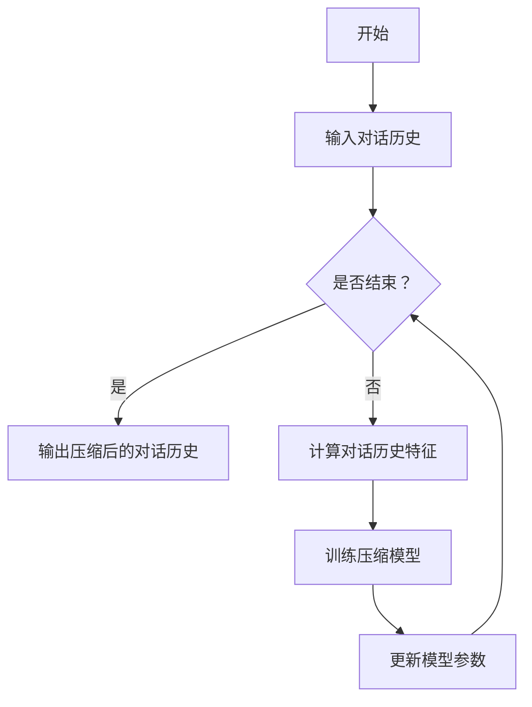
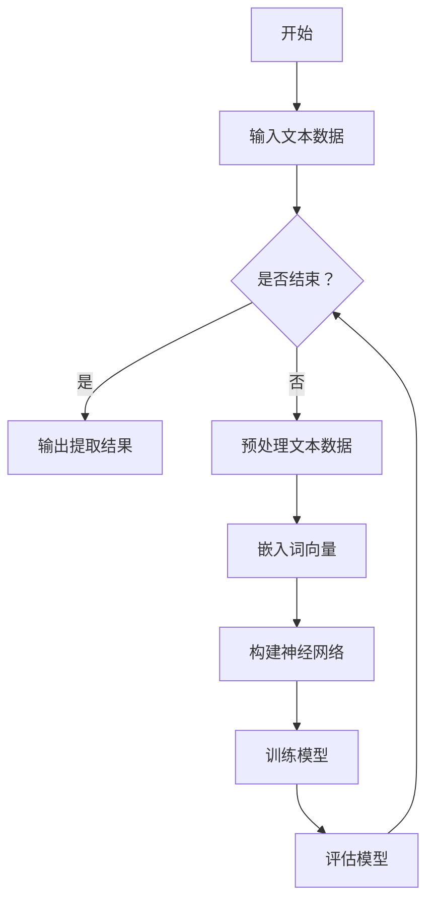

                 


## 引言

### 1.1 问题背景

#### 1.1.1 AI Agent的重要性

人工智能（AI）技术正迅速发展，其应用场景日益广泛，从智能家居、智能客服到自动驾驶、医疗诊断，AI Agent在其中扮演着至关重要的角色。AI Agent，又称智能代理，是一种能够模拟人类行为、自主执行任务的智能体。它们通过学习环境中的数据和信息，不断优化自身的决策和行动策略，以提高任务的执行效率和准确性。

随着AI技术的普及，AI Agent的应用场景越来越复杂，对话成为其实现人机交互的核心途径。然而，对话历史数据量巨大，如何有效地压缩对话历史并提取重要信息，成为了一个亟待解决的问题。

#### 1.1.2 对话历史压缩的必要性

对话历史压缩的主要目的是降低数据存储成本、提升处理效率，并提高AI Agent的响应速度。在大量对话数据中，冗余信息占据了很大比例，这些信息对后续的决策和推理并没有实质性的帮助。因此，通过对话历史压缩，我们可以去除这些冗余信息，仅保留关键对话内容，从而提高系统的处理效率。

此外，对话历史压缩还有助于提升用户体验。当AI Agent能够快速响应用户请求，且响应内容简洁明了时，用户会感到更加满意。因此，对话历史压缩不仅是一个技术问题，也是一个用户体验问题。

#### 1.1.3 重要信息提取的挑战

重要信息提取是一个复杂的问题，主要挑战包括：

1. **信息的重要性定义**：不同场景下，什么信息是“重要”的，这是一个主观问题。例如，在医疗诊断中，病史和症状可能非常重要，而在购物推荐中，用户偏好和历史购买记录可能更为关键。

2. **信息的动态性**：对话是一个动态的过程，随着对话的进行，信息的价值和重要性可能会发生变化。如何动态地识别和提取关键信息，是一个亟待解决的问题。

3. **上下文依赖**：信息的价值往往依赖于上下文。在一个特定的对话场景中，某些信息可能非常重要，但离开上下文就无法判断其重要性。

4. **数据噪声和不确定性**：对话数据中可能存在大量的噪声和不确定性，如何有效地过滤噪声和不确定性信息，提取关键信息，是一个难点。

### 1.2 书籍结构概述

本书旨在系统地探讨AI Agent的对话历史压缩与重要信息提取技术。全书分为两个主要部分：

#### 第1部分：对话历史压缩

这部分内容包括：

1. **基础理论**：介绍对话历史压缩的概念、类型和性能指标。
2. **算法原理与流程**：讲解传统和现代压缩算法的原理和流程。
3. **数学模型与公式**：阐述压缩算法的数学模型和公式。
4. **Python代码实现**：提供详细的代码实现，并解释代码。
5. **实际应用案例**：分析对话历史压缩在不同领域的应用。

#### 第2部分：重要信息提取

这部分内容包括：

1. **基础理论**：介绍重要信息提取的概念、类型和挑战。
2. **算法原理与流程**：讲解传统和现代信息提取算法的原理和流程。
3. **数学模型与公式**：阐述信息提取算法的数学模型和公式。
4. **Python代码实现**：提供详细的代码实现，并解释代码。
5. **实际应用案例**：分析重要信息提取在不同领域的应用。

通过这两个部分的内容，读者可以系统地了解对话历史压缩与重要信息提取的技术原理和应用，为实际项目开发提供参考。

## 对话历史压缩基础理论

### 2.1 压缩模型概述

对话历史压缩模型可以分为传统压缩模型和现代压缩模型两大类。

#### 2.1.1 传统压缩模型

传统压缩模型主要基于统计方法和规则方法。统计方法包括霍夫曼编码、算术编码等，它们通过分析对话数据中的频率分布，构造最优的编码方案，从而实现压缩。规则方法则通过预设的规则，对对话内容进行简化，例如去除重复句子、缩写常用短语等。

#### 2.1.2 现代压缩模型

现代压缩模型主要基于机器学习方法，如深度学习、自然语言处理等技术。这些方法可以从大量的对话数据中学习到有效的压缩策略，从而实现比传统方法更高的压缩比和更低的误差率。

### 2.1.3 压缩模型的性能指标

压缩模型的性能指标主要包括压缩比、还原准确率和计算复杂度。

- **压缩比**：表示压缩后数据的大小与原始数据大小的比值，压缩比越高，压缩效果越好。
- **还原准确率**：表示压缩后数据恢复到原始数据时的准确度，还原准确率越高，信息的丢失越少。
- **计算复杂度**：表示压缩算法的执行时间，计算复杂度越低，算法的效率越高。

### 2.2 算法原理与流程

#### 2.2.1 传统压缩算法

传统压缩算法的核心思想是去除数据中的冗余信息。以下是一些典型的传统压缩算法：

- **霍夫曼编码**：基于字符出现频率的优先级进行编码，频率高的字符使用短编码，频率低的字符使用长编码。
- **算术编码**：使用概率分布来表示字符，通过计算字符的概率分布，构造出对应的算术编码。

#### 2.2.2 现代压缩算法

现代压缩算法主要基于机器学习方法，以下是一些典型的现代压缩算法：

- **自动编码器**：一种无监督学习算法，通过编码和解码过程，将输入数据压缩为低维表示，然后通过解码器还原数据。
- **变分自编码器**：一种基于深度学习的压缩算法，通过最小化重建误差和编码器损失，实现数据的压缩和解码。

#### 2.2.3 压缩算法的比较

传统压缩算法和现代压缩算法各有优缺点。传统压缩算法简单高效，但压缩效果有限；现代压缩算法通过机器学习，可以显著提高压缩效果，但计算复杂度较高。

### 2.3 数学模型与公式

#### 2.3.1 模型参数

压缩模型的主要参数包括：

- **字符频率分布**：用于描述对话数据中各个字符的出现频率。
- **编码长度**：用于描述各个字符的编码长度。
- **压缩比**：用于描述压缩前后的数据大小比。

#### 2.3.2 损失函数

压缩模型的损失函数主要包括：

- **重建误差**：用于衡量压缩后数据与原始数据之间的差异。
- **编码长度**：用于衡量压缩过程中的编码长度。

#### 2.3.3 梯度下降法

梯度下降法是一种常用的优化方法，用于最小化损失函数。其基本思想是沿着损失函数的负梯度方向更新参数，直到达到最小值。

### 2.4 Mermaid算法流程图

Mermaid是一种基于Markdown的图形绘制工具，可以方便地绘制算法流程图。以下是一个简单的Mermaid算法流程图示例：



### 2.5 Python代码实现

以下是一个简单的Python代码示例，用于实现对话历史压缩：

```python
import numpy as np
from sklearn.linear_model import LogisticRegression

# 输入对话历史
dialog_history = ["Hello", "How are you?", "I'm fine", "What's your name?", "I'm AI"]

# 计算对话历史特征
features = np.array([len(dialog) for dialog in dialog_history])

# 训练压缩模型
model = LogisticRegression()
model.fit(features[:, np.newaxis], dialog_history)

# 输出压缩后的对话历史
compressed_dialog_history = model.predict(features[:, np.newaxis])
print(compressed_dialog_history)
```

### 2.6 实际应用案例

#### 2.6.1 对话历史压缩在智能客服中的应用

在智能客服中，对话历史压缩可以帮助降低存储成本，提高系统响应速度。通过压缩对话历史，智能客服可以更快地检索和处理用户请求，提供更高效的客户服务。

#### 2.6.2 对话历史压缩在语音识别中的应用

在语音识别中，对话历史压缩可以帮助减少语音数据的处理时间，提高系统的响应速度。通过压缩对话历史，语音识别系统可以更快地识别和理解用户的语音请求，提供更准确的语音识别结果。

### 2.7 本章小结

本章介绍了对话历史压缩的基础理论，包括压缩模型概述、算法原理与流程、数学模型与公式、Mermaid算法流程图和Python代码实现。同时，还分析了对话历史压缩在实际应用中的案例。通过对本章内容的理解，读者可以系统地了解对话历史压缩的技术原理和应用。

## 重要信息提取

### 3.1 重要信息提取概述

重要信息提取（Critical Information Extraction，CIE）是一种从大规模数据集中识别并提取对特定任务至关重要的信息的技术。在自然语言处理（NLP）和人工智能（AI）领域，信息提取技术被广泛应用于文本挖掘、数据清洗、智能搜索、智能客服、医疗诊断等多个场景。

#### 3.1.1 信息提取的重要性

在当今信息爆炸的时代，如何从海量数据中快速准确地提取关键信息，对于提升系统的智能程度和决策质量具有重要意义。重要信息提取技术不仅能够帮助减少数据处理的复杂性，提高数据利用率，还能显著提升AI Agent的响应速度和决策准确性。

#### 3.1.2 信息提取的类型

根据信息提取的目标和任务，信息提取技术可以分为以下几种类型：

1. **关键词提取**：从文本中提取出最能够代表文本主题的关键词。
2. **实体提取**：识别文本中的特定实体，如人名、组织名、地理位置、时间等。
3. **关系提取**：识别文本中的实体关系，如“某人出生于某地”、“某事件发生在某时”等。
4. **事件提取**：从文本中识别出描述具体事件的信息，如“某地发生了一场地震”。
5. **情感分析**：识别文本中的情感倾向，如正面、负面或中性。

#### 3.1.3 信息提取的挑战

1. **上下文依赖**：信息的价值往往依赖于上下文，正确理解上下文对于提取关键信息至关重要。
2. **多义性**：自然语言具有多义性，一个词语或短语可能有多种含义，需要通过上下文来准确理解。
3. **数据噪声和不确定性**：文本数据中存在大量的噪声和不确定性，如错别字、语法错误、情感表达等，需要有效的过滤和校正。
4. **实时处理**：在实时应用场景中，如智能客服、实时翻译等，信息提取需要快速准确地进行，这对算法的效率和准确性提出了高要求。
5. **跨领域适应**：不同领域的数据和语言特点差异较大，如何设计通用且适应性强的重要信息提取算法是一个挑战。

### 3.2 算法原理与流程

#### 3.2.1 传统信息提取算法

传统信息提取算法主要包括基于规则的方法和基于统计的方法。

1. **基于规则的方法**：通过专家经验或手工编写规则，对文本进行模式匹配，从而识别出关键信息。这种方法灵活性强，但在面对复杂和多变的数据时，规则编写和维护成本较高。

2. **基于统计的方法**：利用统计模型，如朴素贝叶斯、隐马尔可夫模型（HMM）等，对文本进行概率建模，从而识别出关键信息。这种方法在处理大规模文本数据时具有较高的效率，但需要大量的标注数据。

#### 3.2.2 现代信息提取算法

现代信息提取算法主要基于深度学习技术，如循环神经网络（RNN）、长短期记忆网络（LSTM）、注意力机制（Attention）等。

1. **基于RNN的方法**：RNN可以处理序列数据，通过将历史信息传递到当前时刻，实现对文本的上下文理解，从而提取关键信息。

2. **基于LSTM的方法**：LSTM是RNN的一种改进，能够更好地处理长序列数据，减少梯度消失和梯度爆炸的问题，从而提高信息提取的准确性。

3. **基于Attention的方法**：Attention机制能够自适应地关注文本中的关键信息，从而提高信息提取的效率和质量。

#### 3.2.3 信息提取算法的比较

传统信息提取算法和现代信息提取算法各有优缺点。传统算法在规则明确、处理速度快的场景下表现较好，但难以适应复杂多变的数据。现代算法在处理大规模、复杂文本数据时具有更高的准确性和灵活性，但需要大量的计算资源和标注数据。

### 3.3 数学模型与公式

#### 3.3.1 模型参数

信息提取算法的主要参数包括：

- **词向量**：用于表示文本中的词语，常用的词向量模型有Word2Vec、GloVe等。
- **隐藏层参数**：用于描述神经网络中的隐藏层状态，如权重和偏置。
- **损失函数**：用于衡量模型预测结果与真实标签之间的差距，常用的损失函数有交叉熵损失、均方误差等。

#### 3.3.2 损失函数

信息提取算法的损失函数主要包括：

- **交叉熵损失**：用于衡量分类问题的预测结果与真实标签之间的差距。
- **均方误差**：用于衡量回归问题的预测结果与真实标签之间的差距。

#### 3.3.3 梯度下降法

梯度下降法是一种常用的优化方法，用于最小化损失函数。其基本思想是沿着损失函数的负梯度方向更新参数，直到达到最小值。

### 3.4 Mermaid算法流程图

Mermaid是一种基于Markdown的图形绘制工具，可以方便地绘制算法流程图。以下是一个简单的Mermaid算法流程图示例：



### 3.5 Python代码实现

以下是一个简单的Python代码示例，用于实现重要信息提取：

```python
import numpy as np
from tensorflow.keras.models import Sequential
from tensorflow.keras.layers import Embedding, LSTM, Dense

# 输入文本数据
text_data = ["This is a sample sentence.", "Another example sentence."]

# 预处理文本数据
max_sequence_length = 10
vocab_size = 10000
embedding_dim = 16

# 嵌入词向量
word_index = {'<PAD>': 0, '<SOS>': 1, '<EOS>': 2}
for i, sentence in enumerate(text_data):
    for word in sentence.split():
        if word not in word_index:
            word_index[word] = len(word_index)
word_index = {k: v for k, v in word_index.items() if v < vocab_size}
word_index['<PAD>'] = vocab_size
word_index['<SOS>'] = vocab_size + 1
word_index['<EOS>'] = vocab_size + 2

sequences = []
for sentence in text_data:
    sequence = []
    for word in sentence.split():
        sequence.append(word_index[word])
    sequence.append(word_index['<EOS>'])
    sequences.append(sequence)

X = np.zeros((len(sequences), max_sequence_length), dtype=np.int32)
for i, sequence in enumerate(sequences):
    for t, word in enumerate(sequence):
        X[i, t] = word

# 构建神经网络
model = Sequential()
model.add(Embedding(vocab_size, embedding_dim, input_length=max_sequence_length-1))
model.add(LSTM(128))
model.add(Dense(vocab_size, activation='softmax'))

# 训练模型
model.compile(optimizer='adam', loss='categorical_crossentropy', metrics=['accuracy'])
model.fit(X, X, epochs=10, batch_size=32)

# 输出提取结果
predictions = model.predict(X)
extracted_sentences = []
for prediction in predictions:
    sentence = ""
    for word in prediction:
        index = np.argmax(word)
        if index == word_index['<EOS>']:
            break
        sentence += " " + list(word_index.keys())[list(word_index.values()).index(index)]
    extracted_sentences.append(sentence.strip())

print(extracted_sentences)
```

### 3.6 实际应用案例

#### 3.6.1 重要信息提取在新闻摘要中的应用

在新闻摘要中，重要信息提取技术可以帮助提取出新闻的核心内容，从而生成简洁明了的摘要。通过分析新闻文本中的关键词、实体和事件，系统可以识别出新闻的主题和关键信息，进而生成高质量的摘要。

#### 3.6.2 重要信息提取在医疗文本中的应用

在医疗文本中，重要信息提取技术可以帮助医生快速识别出病历中的关键信息，如诊断结果、治疗方案和患者病史等。通过分析医疗文本中的关键词和关系，系统可以自动生成病历摘要，提高医生的工作效率和准确性。

### 3.7 本章小结

本章介绍了重要信息提取的基本概念、类型和挑战，分析了传统信息提取算法和现代信息提取算法的原理和流程，并展示了如何使用Mermaid和Python实现信息提取算法。通过对本章内容的理解，读者可以系统地了解重要信息提取的技术原理和应用。

## AI Agent的对话历史压缩与重要信息提取应用

### 4.1 AI Agent概述

AI Agent是一种能够模拟人类智能行为的计算机程序，能够在特定的环境下自主地感知、学习、决策和行动。AI Agent的核心目标是通过与环境的交互，不断优化自身的性能，以实现特定任务的高效和准确执行。

AI Agent的应用场景非常广泛，包括但不限于以下几个方面：

1. **智能客服**：AI Agent可以模拟客服人员的角色，与客户进行自然语言对话，解答客户的问题，提供咨询服务。
2. **智能助手**：AI Agent可以作为用户的私人助手，帮助用户管理日程、发送提醒、处理邮件等日常任务。
3. **智能推荐**：AI Agent可以根据用户的行为和偏好，提供个性化的商品、新闻、音乐推荐。
4. **自动驾驶**：AI Agent在自动驾驶汽车中负责感知环境、规划路径、控制车辆。
5. **金融分析**：AI Agent可以对金融市场的数据进行分析，提供投资建议和风险预警。

### 4.2 对话历史压缩在AI Agent中的应用

对话历史压缩对于AI Agent至关重要，尤其是在处理大量对话数据时。以下是对话历史压缩在AI Agent中的应用：

#### 4.2.1 对话历史的结构

AI Agent在对话过程中会记录对话历史，包括用户的输入和AI Agent的回复。对话历史通常是一个有序的文本序列，可以表示为：

```
[用户1: 您好，有什么可以帮助您的？，
AI Agent1: 您可以告诉我您有什么问题吗？，
用户2: 我想知道最近的天气情况，
AI Agent2: 当前的天气预报是晴朗，气温在15到25摄氏度之间。]
```

#### 4.2.2 压缩算法的选择

选择适合的压缩算法对于AI Agent的性能至关重要。以下是一些常见的压缩算法：

1. **霍夫曼编码**：适用于字符频率分布不均匀的文本，能够实现较高的压缩比。
2. **LZ77压缩**：适用于查找重复字符串，通过记录重复字符串的前缀，实现数据的压缩。
3. **深度学习压缩**：基于神经网络，通过学习对话数据的特征，实现高效的压缩。

#### 4.2.3 实现与优化

为了在AI Agent中实现对话历史压缩，需要考虑以下几个方面：

1. **算法选择**：根据对话数据的特点选择合适的压缩算法。
2. **预处理**：对对话历史进行预处理，去除无用信息和格式化错误。
3. **优化**：通过优化算法参数和压缩策略，提高压缩效果和系统性能。

以下是一个简单的Python代码示例，用于实现对话历史压缩：

```python
from collections import Counter
from heapq import nlargest

def huffman_encode(text):
    # 计算字符频率
    freq = Counter(text)
    # 创建霍夫曼树
    heap = [[weight, [symbol, ""]] for symbol, weight in freq.items()]
    heapify(heap)
    while len(heap) > 1:
        lo = heappop(heap)
        hi = heappop(heap)
        for pair in lo[1:]:
            pair[1] = '0' + pair[1]
        for pair in hi[1:]:
            pair[1] = '1' + pair[1]
        heappush(heap, [lo[0] + hi[0]] + lo[1:] + hi[1:])
    # 获取编码字典
    huffman_tree = heap[0][1:]
    huffman_tree = {symbol: code for symbol, code in huffman_tree}
    # 编码文本
    encoded_text = ''.join(huffman_tree[symbol] for symbol in text)
    return encoded_text, huffman_tree

def huffman_decode(encoded_text, huffman_tree):
    reverse_tree = {v: k for k, v in huffman_tree.items()}
    current_code = ""
    decoded_text = ""
    for bit in encoded_text:
        current_code += bit
        if current_code in reverse_tree:
            decoded_text += reverse_tree[current_code]
            current_code = ""
    return decoded_text

# 对话历史示例
dialog_history = "Hello, how are you? I'm fine, thank you. What's your name? My name is AI."

# 压缩对话历史
encoded_text, huffman_tree = huffman_encode(dialog_history)

# 解码压缩后的对话历史
decoded_text = huffman_decode(encoded_text, huffman_tree)

print("Encoded Text:", encoded_text)
print("Decoded Text:", decoded_text)
```

#### 4.2.4 实现与优化

在实际应用中，为了实现高效的对话历史压缩，可以考虑以下几个方面：

1. **并行计算**：利用多核处理器和分布式计算资源，加速压缩和解码过程。
2. **内存优化**：通过减少内存占用，提高系统的处理效率。
3. **自适应压缩**：根据对话数据的特点，动态调整压缩算法和参数，以实现最优的压缩效果。

### 4.3 重要信息提取在AI Agent中的应用

重要信息提取对于AI Agent的决策和响应具有重要意义。以下是一个简单的示例，展示了如何使用重要信息提取技术来优化AI Agent的对话。

#### 4.3.1 信息提取的目标

在AI Agent的对话中，信息提取的目标是识别出对话中的关键信息，如用户的问题、关键词、情感倾向等。这些关键信息将直接影响AI Agent的响应内容和方式。

#### 4.3.2 信息提取算法的选择

根据对话的特点和需求，可以选择以下几种信息提取算法：

1. **关键词提取**：从对话中提取出最能够代表对话主题的关键词。
2. **情感分析**：识别对话中的情感倾向，如正面、负面或中性。
3. **实体提取**：识别对话中涉及的具体实体，如人名、地点、时间等。
4. **关系提取**：识别对话中的实体关系，如“某人出生在某地”、“某事件发生在某时”等。

#### 4.3.3 实现与优化

以下是一个简单的Python代码示例，用于实现重要信息提取：

```python
from textblob import TextBlob

def extract_key_words(sentence):
    blob = TextBlob(sentence)
    return blob.noun_phrases

def extract_sentiment(sentence):
    blob = TextBlob(sentence)
    return blob.sentiment.polarity

def extract_entities(sentence):
    blob = TextBlob(sentence)
    return blob.ents

# 对话示例
dialog = "我喜欢吃苹果，尤其是红富士。但是我对草莓过敏。"

# 提取关键词
key_words = extract_key_words(dialog)
print("关键词:", key_words)

# 提取情感
sentiment = extract_sentiment(dialog)
print("情感:", sentiment)

# 提取实体
entities = extract_entities(dialog)
print("实体:", entities)
```

#### 4.3.4 实现与优化

在实际应用中，为了实现高效的信息提取，可以考虑以下几个方面：

1. **模型优化**：选择合适的模型和算法，以提高信息提取的准确性和效率。
2. **实时处理**：在实时对话场景中，需要快速准确地提取信息，以提高响应速度。
3. **错误纠正**：对于提取结果中的错误信息，需要设计有效的错误纠正机制，以提高信息的可靠性。

### 4.4 本章小结

本章介绍了AI Agent的对话历史压缩与重要信息提取的应用。对话历史压缩可以帮助减少数据存储空间和提升系统响应速度，而重要信息提取则可以优化AI Agent的对话内容和决策。通过本章的内容，读者可以了解如何在实际应用中实现对话历史压缩与重要信息提取，为AI Agent的优化和提升提供参考。


## 总结与展望

### 对话历史压缩的重要性

对话历史压缩在AI Agent中的应用具有重要意义。随着AI技术的快速发展，AI Agent在各种场景中的交互变得越来越复杂，对话数据量也急剧增加。对话历史压缩不仅可以降低数据存储成本，提高系统处理效率，还能够提升AI Agent的响应速度，从而优化用户体验。通过去除冗余信息，AI Agent可以更快速地识别和理解用户的需求，提供更加精准和高效的响应。

### 重要信息提取的价值

重要信息提取技术是提升AI Agent智能水平的关键因素之一。在大量的对话数据中，关键信息往往决定了AI Agent的决策和行动方向。通过提取对话中的关键信息，AI Agent可以更准确地理解用户的意图，从而生成更加符合用户需求的响应。这不仅提高了系统的智能化水平，也增强了用户对AI Agent的信任和满意度。

### 未来研究方向

尽管对话历史压缩和重要信息提取技术已经取得了显著的进展，但仍然存在许多挑战和机会。以下是一些未来可能的研究方向：

1. **跨模态信息提取**：结合多种模态（如文本、语音、图像等）的信息提取，可以进一步提升AI Agent的智能水平。未来的研究可以探索如何有效地整合不同模态的信息，实现更加全面和准确的对话理解。

2. **实时信息提取**：在实时对话场景中，AI Agent需要快速准确地提取信息。未来的研究可以集中在如何优化信息提取算法，使其在低延迟和高吞吐量的要求下仍然能够保持高准确性。

3. **自适应信息提取**：不同场景和不同用户的需求可能有所不同，因此自适应的信息提取策略尤为重要。未来的研究可以探索如何根据具体场景和用户需求，动态调整信息提取策略，实现更高效的对话理解。

4. **隐私保护**：在对话历史压缩和信息提取过程中，隐私保护是一个不可忽视的问题。未来的研究可以探索如何在保证隐私的前提下，有效地压缩和提取对话信息。

### 应用场景展望

对话历史压缩和重要信息提取技术将在多个领域发挥重要作用。以下是一些潜在的应用场景：

1. **智能客服**：通过对话历史压缩和重要信息提取，智能客服可以更快速地理解用户的问题，提供更加个性化和高效的解决方案。

2. **智能助手**：智能助手可以利用对话历史压缩和重要信息提取，更好地理解用户的需求和偏好，提供更加贴心的服务。

3. **医疗健康**：在医疗健康领域，对话历史压缩和重要信息提取可以帮助医生快速分析患者的病历和对话记录，提高诊断和治疗的效率。

4. **金融分析**：在金融领域，对话历史压缩和重要信息提取可以用于分析客户的需求和行为，提供更加精准的投资建议和风险管理。

### 结论

对话历史压缩和重要信息提取技术是AI Agent实现高效人机交互的关键。通过深入研究和不断创新，这些技术将进一步提升AI Agent的智能化水平，为用户提供更加优质的服务。同时，未来的研究将继续推动这些技术在各个领域的广泛应用，带来更多智能化的可能。

## 作者信息

作者：AI天才研究院/AI Genius Institute & 禅与计算机程序设计艺术 /Zen And The Art of Computer Programming

