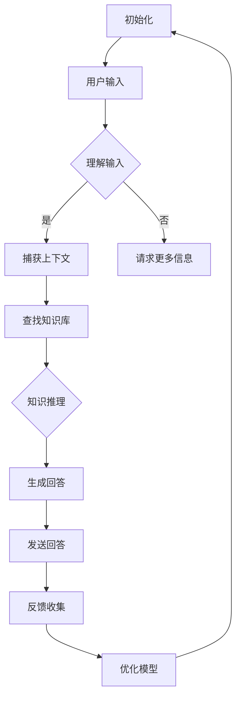
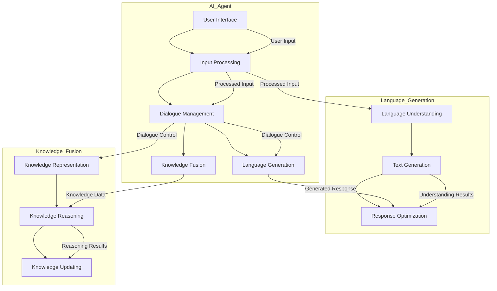
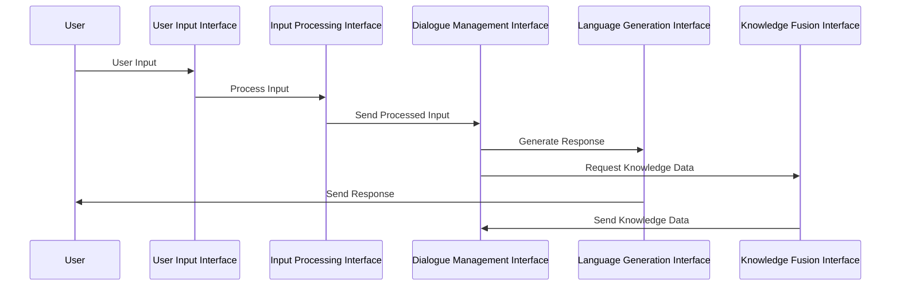
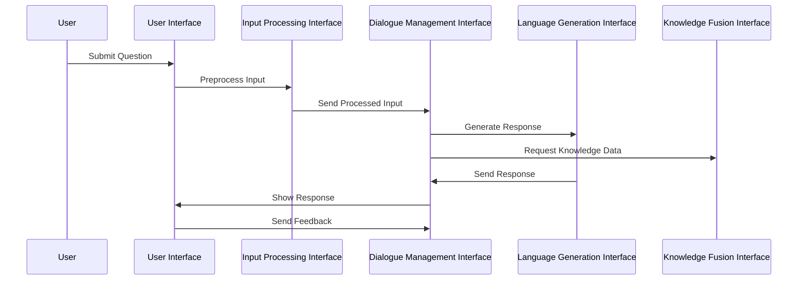

                 

### 第1章: 背景与概述

#### 1.1 人工智能与对话系统的发展历程

人工智能（AI）作为计算机科学的一个重要分支，自20世纪50年代诞生以来，经历了数十年的发展与变革。早期的人工智能主要侧重于规则推理和知识表示，例如专家系统。专家系统通过将人类专家的知识编码成计算机程序，实现了在特定领域内的智能推理和决策。然而，这些系统在处理复杂任务时表现出明显的局限性。

随着计算能力的提升和数据规模的扩大，机器学习成为了人工智能研究的主流方向。机器学习方法通过从大量数据中学习规律，实现了对未知数据的预测和决策。深度学习作为机器学习的一个重要分支，通过模拟人脑神经网络的结构和功能，取得了惊人的突破。深度学习在图像识别、语音识别和自然语言处理等领域取得了显著的进展，为人工智能的应用铺平了道路。

对话系统作为人工智能的一个重要应用领域，旨在实现人与计算机之间的自然语言交互。早期的对话系统主要基于规则和模板匹配，这种方式在面对复杂多变的对话场景时，表现较差。随着自然语言处理技术的进步，基于统计方法和深度学习的对话系统逐渐成为主流。这些系统能够更好地理解用户意图和上下文信息，生成更自然、更连贯的回复。

#### 1.2 对话系统的演变

对话系统的演变可以大致分为几个阶段：

1. **基于规则的对话系统**：这一阶段的对话系统主要通过预定义的规则来处理用户输入，生成回复。这种方式简单直观，但在面对复杂和不确定的对话场景时，表现较差。

2. **基于模板匹配的对话系统**：模板匹配是对话系统在规则基础上的一个改进。系统通过将用户输入与预定义的模板进行匹配，生成相应的回复。这种方式在一定程度上提高了对话系统的灵活性，但仍然难以应对复杂对话场景。

3. **基于统计的对话系统**：统计方法是对话系统发展的一个重要里程碑。通过从大量的对话数据中学习，对话系统能够自动生成与用户输入相对应的回复。这种方式大大提高了对话系统的适应能力，但在处理长对话和上下文信息时，仍存在一些挑战。

4. **基于深度学习的对话系统**：深度学习技术为对话系统带来了新的突破。通过模拟人脑神经网络的结构和功能，深度学习对话系统能够更好地理解用户意图和上下文信息，生成更自然、更连贯的回复。目前，基于深度学习的对话系统已成为对话系统的主流。

#### 1.3 AI Agent的定义与功能

AI Agent（人工智能代理）是指能够自主执行任务、与环境互动并实现目标的人工智能实体。AI Agent通常具有以下几个关键特性：

1. **自主性**：AI Agent能够根据预设的目标和策略自主决策和执行任务，而不需要人为干预。

2. **适应性**：AI Agent能够根据环境的变化和任务的需求，动态调整其行为和策略。

3. **交互性**：AI Agent能够与人或其他系统进行自然语言交互，获取信息、提出问题并给出回答。

4. **知识表示与推理**：AI Agent能够将知识以结构化的形式存储和表示，并通过推理机制对知识进行关联和运用。

AI Agent在多个领域具有广泛的应用前景，包括但不限于：

1. **客户服务**：AI Agent可以作为智能客服，提供24/7全天候的客服服务，提高客户满意度。

2. **教育辅导**：AI Agent可以根据学生的个性化需求，提供个性化的学习辅导，提高学习效果。

3. **智能家居**：AI Agent可以与智能家居设备交互，实现自动化控制和管理，提升生活质量。

4. **医疗健康**：AI Agent可以在医疗健康领域提供诊断建议、健康咨询和患者管理服务。

#### 1.4 对话生成一致性与连贯性的问题与挑战

在AI Agent的应用过程中，对话生成的一致性与连贯性是两个关键问题。一致性指的是AI Agent在不同场景下，对同一问题的回答应该保持一致；连贯性则是指AI Agent生成的对话应该逻辑通顺，内容连贯。以下是对话生成一致性与连贯性的问题与挑战：

1. **上下文理解**：AI Agent需要准确理解用户输入的上下文信息，以便生成与之相关的回复。但在实际应用中，上下文信息的捕捉和处理是一项复杂的任务，容易导致对话的不一致和不连贯。

2. **知识表示与推理**：AI Agent需要将知识以结构化的形式存储和表示，并通过推理机制对知识进行关联和运用。然而，现有的知识表示与推理方法在处理复杂知识结构和动态变化时，存在一定局限性。

3. **多模态交互**：在实际应用中，AI Agent不仅需要处理文本信息，还需要处理图像、语音等多种模态的信息。多模态交互的一致性与连贯性是一个新的挑战。

4. **对话策略**：AI Agent需要根据用户行为和上下文信息，动态调整对话策略。然而，如何设计有效的对话策略，使得对话既一致又连贯，仍然是一个开放性问题。

#### 1.5 优化方法与框架概述

为了解决对话生成一致性与连贯性问题，研究人员提出了多种优化方法与框架。以下是对几种主要优化方法的概述：

1. **传统优化方法**：包括规则设定和特征工程等。通过预定义规则和特征，提高对话生成的一致性与连贯性。

2. **强化学习**：通过训练AI Agent在与环境的交互中，不断调整策略，以提高对话生成的一致性与连贯性。

3. **生成对抗网络（GAN）**：通过生成对抗网络，生成高质量的对话回复，提高对话的连贯性。

4. **多模态融合**：通过融合文本、图像、语音等多种模态的信息，提高AI Agent对上下文的理解，从而提高对话生成的一致性与连贯性。

#### 1.6 边界与外延

本文主要讨论AI Agent的对话生成一致性与连贯性优化问题，重点在于分析现有优化方法及其应用场景。然而，实际应用中，对话系统的一致性与连贯性优化还涉及其他多个方面，如对话系统的设计与实现、用户交互体验的优化等。因此，本文的研究成果需要在实际应用中进行进一步验证和优化。

本文的研究将主要围绕以下几方面展开：

1. **核心概念与联系**：介绍对话生成一致性与连贯性的核心概念，分析相关概念之间的关系。

2. **优化方法详解**：详细阐述传统优化方法和现代优化框架，包括强化学习、生成对抗网络等。

3. **数学模型与公式讲解**：使用数学模型和公式详细讲解优化方法，并结合实际案例进行举例说明。

4. **系统分析与架构设计**：介绍对话系统的系统架构，包括功能设计、系统架构和接口设计。

5. **项目实战**：通过实际项目案例，展示对话生成一致性与连贯性优化的应用场景和实现方法。

6. **最佳实践 tips、小结、注意事项、拓展阅读等内容**：总结本文的核心观点，提供实践建议和拓展阅读资源。

通过本文的研究，旨在为AI Agent的对话生成一致性与连贯性优化提供理论指导和实践参考，推动对话系统技术的发展与应用。

### 第2章: 对话生成一致性与连贯性的核心概念

#### 2.1 一致性与连贯性的定义与属性

对话生成的一致性与连贯性是确保AI Agent在与用户交互时提供高质量服务的重要属性。一致性与连贯性不仅决定了用户对AI Agent的信任程度，也直接影响用户体验。

**一致性的定义**：

一致性指的是AI Agent在不同情境下对同一问题的回答保持一致。具体来说，当用户提出一个问题时，无论在哪个对话阶段，AI Agent都应该给出相同或相似的回答，除非有明确的信息表明回答需要变化。例如，用户询问某个产品的价格，AI Agent应该始终给出准确的价格信息，而不应因上下文变化而给出不同的价格。

**一致性的属性**：

1. **稳定性**：AI Agent在不同情境下，对相同问题应保持稳定的回答。
2. **准确性**：回答应准确反映用户问题的意图，不应出现误导或模糊不清的信息。
3. **上下文无关**：一致性不应受对话上下文的影响，除非有明确的上下文指示需要变化。

**连贯性的定义**：

连贯性指的是AI Agent生成的对话应该逻辑通顺，内容连贯，形成一个连贯的故事或讨论流程。连贯性强调的是对话的流畅性和逻辑性，确保用户在阅读或听取AI Agent的回答时，能够理解并接受所提供的信息。

**连贯性的属性**：

1. **逻辑性**：对话的每个步骤都应该在逻辑上衔接紧密，不出现跳转或矛盾。
2. **流畅性**：对话的过渡自然，不应出现生硬或断裂的感觉。
3. **信息完整**：对话中提供的信息应完整且相关，避免遗漏关键信息。

#### 2.2 相关概念及其关系

在讨论一致性与连贯性之前，我们需要了解一些相关的概念及其关系。

**语言理解与生成**：

1. **语言理解**：这是指AI Agent接收并理解用户输入的过程。它涉及到自然语言处理技术，如词法分析、句法分析和语义分析。
2. **语言生成**：这是指AI Agent生成回答的过程。它同样依赖于自然语言处理技术，包括语言模型和文本生成算法。

**上下文维护与理解**：

上下文是影响对话一致性与连贯性的关键因素。上下文维护与理解指的是AI Agent如何捕捉、存储和利用对话中的上下文信息。

1. **上下文捕捉**：AI Agent需要识别和捕捉对话中的关键信息，如用户意图、对话历史等。
2. **上下文存储**：AI Agent需要将捕捉到的上下文信息存储下来，以便后续对话中利用。
3. **上下文理解**：AI Agent需要根据上下文信息，理解用户的意图和需求，以生成相关且连贯的回答。

**知识表示与推理**：

知识表示与推理是指AI Agent如何存储、表示和运用知识，以支持对话生成的一致性与连贯性。

1. **知识表示**：AI Agent需要将知识以结构化的形式存储，如知识图谱、本体论等。
2. **推理**：AI Agent需要利用存储的知识进行逻辑推理，以生成符合一致性和连贯性要求的回答。

### 2.3 核心概念对比与联系表格

为了更清晰地理解一致性与连贯性及相关概念之间的关系，我们可以通过以下对比表格来展示：

| 概念             | 定义                                                         | 关系                                                         |
|------------------|--------------------------------------------------------------|--------------------------------------------------------------|
| 一致性           | AI Agent在不同情境下对同一问题的回答保持一致                   | 受到上下文维护与理解的影响，依赖于知识表示与推理                 |
| 连贯性           | AI Agent生成的对话逻辑通顺，内容连贯                           | 受到语言理解与生成的影响，依赖于上下文维护与理解                 |
| 语言理解         | AI Agent理解用户输入的过程                                   | 为连贯性提供基础，影响对话的生成过程                           |
| 语言生成         | AI Agent生成回答的过程                                       | 受到一致性与连贯性的影响，依赖于上下文信息和知识表示             |
| 上下文维护与理解 | AI Agent捕捉、存储和利用对话中的上下文信息                     | 影响一致性与连贯性，是AI Agent对话能力的重要组成部分           |
| 知识表示与推理   | AI Agent存储、表示和运用知识的过程                           | 为一致性与连贯性提供支持，是AI Agent智能水平的重要体现         |

### 2.4 Mermaid流程图

为了更直观地展示AI Agent在对话中如何实现一致性与连贯性，我们可以使用Mermaid绘制一个流程图。以下是一个简化的流程图示例：



在这个流程图中：

- **A[初始化]**：对话系统初始化，准备处理用户输入。
- **B[用户输入]**：用户向AI Agent发送输入。
- **C[理解输入]**：AI Agent分析用户输入，理解其意图。
- **D[捕获上下文]**：如果输入包含上下文信息，AI Agent捕获并存储。
- **E[请求更多信息]**：如果输入不完整或模糊，AI Agent请求更多信息。
- **F[查找知识库]**：AI Agent在知识库中查找相关信息。
- **G[知识推理]**：AI Agent运用知识进行推理，生成潜在回答。
- **H[生成回答]**：AI Agent根据推理结果生成具体回答。
- **I[发送回答]**：AI Agent将回答发送给用户。
- **J[反馈收集]**：AI Agent收集用户反馈。
- **K[优化模型]**：根据反馈优化模型，提高一致性、连贯性和交互质量。
- **L[结束]**：对话结束，回到初始化状态，准备处理下一个用户输入。

通过这个流程图，我们可以看到AI Agent在处理用户输入和生成回答的过程中，如何通过上下文捕捉、知识表示与推理，实现一致性与连贯性。

### 2.5 ER实体关系图

为了进一步理解AI Agent系统中各组件之间的关联，我们可以使用Mermaid绘制一个ER实体关系图。以下是一个简化的ER图示例：

```mermaid
erDiagram
    User ||--|{ AI_Agent } : interacts with
    User ||--|{ Context } : maintains conversation state
    AI_Agent ||--|{ Knowledge_Base } : accesses information
    AI_Agent ||--|{ Dialogue_Manager } : handles dialogue flow
    Dialogue_Manager ||--|{ Language_Generator } : creates responses
    Context ||--|{ User_Session } : stores session-specific data
    Knowledge_Base ||--|{ Domain_Knowledge } : domain-specific information
```

在这个ER图中：

- **User（用户）**：与AI Agent进行交互，提供输入。
- **AI_Agent（AI代理）**：核心组件，处理用户输入，生成回答。
- **Context（上下文）**：存储对话状态，帮助AI Agent捕捉和理解上下文。
- **Knowledge_Base（知识库）**：存储AI Agent所需的信息，支持推理和生成回答。
- **Dialogue_Manager（对话管理器）**：负责对话流程的控制。
- **Language_Generator（语言生成器）**：生成自然语言回答。
- **User_Session（用户会话）**：存储特定用户会话的数据。
- **Domain_Knowledge（领域知识）**：特定领域的知识信息。

通过ER图，我们可以清晰地看到AI Agent系统中的各个实体及其相互关系，有助于理解系统的整体架构和功能实现。

### 3.1 传统优化方法

在对话生成一致性与连贯性的优化过程中，传统优化方法发挥了重要作用。这些方法主要包括规则设定和特征工程等。以下是对这些方法的具体解释和实现。

#### 3.1.1 规则设定

规则设定是一种基于专家知识和逻辑推理的传统方法，旨在提高对话生成的一致性与连贯性。这种方法的核心思想是预定义一系列规则，AI Agent在处理用户输入时，根据这些规则生成回答。

**规则设定步骤**：

1. **需求分析**：首先，需要明确AI Agent的应用场景和对话需求，确定需要满足的一致性与连贯性要求。
2. **规则编写**：根据需求分析的结果，编写具体的对话规则。这些规则可以是条件-动作对（例如，如果用户询问产品价格，则回答具体价格），也可以是更复杂的逻辑表达式。
3. **规则验证**：对编写的规则进行验证，确保它们能够满足一致性和连贯性的要求。这一步骤可以通过人工审查或自动化测试工具来完成。
4. **规则集成**：将验证通过的规则集成到AI Agent系统中，使其在处理用户输入时能够自动应用这些规则。

**示例**：

假设我们设计一个智能客服系统，需要确保回答的一致性与连贯性。以下是一个简化的规则示例：

- **规则1**：如果用户询问产品价格，回答应始终包含具体的金额。
- **规则2**：如果用户询问产品的库存情况，回答应包含具体的库存数量。
- **规则3**：如果用户询问产品的购买途径，回答应提供明确的购买链接或联系方式。

通过这些规则，智能客服系统能够在不同情境下生成一致且连贯的回答。

#### 3.1.2 特征工程

特征工程是另一种传统优化方法，旨在通过提取和选择有意义的特征，提高对话生成的一致性与连贯性。这种方法依赖于对输入数据的深入理解和处理，以提高模型的性能。

**特征工程步骤**：

1. **数据预处理**：首先，对原始输入数据进行预处理，包括分词、去停用词、词性标注等，以便提取有效的特征。
2. **特征选择**：从预处理后的数据中，选择与对话一致性和连贯性相关的特征。这些特征可以是词语、词组、句法结构等。
3. **特征提取**：对选定的特征进行提取和转换，例如，将词语转换为词向量或词嵌入。
4. **特征验证**：对提取的特征进行验证，确保它们能够有效提高对话生成的一致性与连贯性。这一步骤可以通过交叉验证或模型评估来完成。
5. **特征集成**：将验证通过的特征集成到AI Agent系统中，用于训练和生成回答。

**示例**：

假设我们设计一个聊天机器人，需要提高其对话生成的一致性与连贯性。以下是一个简化的特征工程示例：

- **特征1**：用户输入中的关键词，如“价格”、“库存”、“购买”等。
- **特征2**：用户输入中的句法结构，如疑问句、陈述句等。
- **特征3**：用户输入中的上下文信息，如之前对话的历史记录。

通过这些特征，聊天机器人能够更好地理解用户意图，生成一致且连贯的回答。

#### 3.1.3 传统优化方法的优缺点

**优点**：

1. **易于理解和实现**：规则设定和特征工程方法相对简单，易于理解和实现，适合快速部署。
2. **可控性较高**：通过预定义规则或提取关键特征，可以较好地控制对话生成的一致性和连贯性。

**缺点**：

1. **灵活性较低**：传统方法依赖于预定义规则或特征，难以适应复杂的、多变的对话场景。
2. **依赖人工干预**：规则设定和特征工程需要大量的人工干预，包括需求分析、规则编写、特征选择和验证等，成本较高。

总的来说，传统优化方法在对话生成一致性与连贯性优化中发挥了重要作用，但其局限性也显而易见。随着人工智能技术的不断发展，传统方法正逐渐被现代优化框架所取代，如强化学习和生成对抗网络等。

### 3.2 现代优化框架

随着人工智能技术的不断进步，现代优化框架在对话生成一致性与连贯性优化方面取得了显著成果。其中，强化学习（Reinforcement Learning，RL）和生成对抗网络（Generative Adversarial Networks，GAN）是两个具有代表性的现代优化框架。以下是对这两种框架的详细解释。

#### 3.2.1 强化学习

强化学习是一种通过奖励机制驱动智能体在环境中学习最优策略的方法。在对话生成领域，强化学习可以通过智能体（AI Agent）与环境的交互，不断调整对话策略，以提高一致性和连贯性。

**强化学习的基本原理**：

强化学习包含四个主要组成部分：智能体（Agent）、环境（Environment）、状态（State）和动作（Action）。智能体在环境中执行动作，根据环境反馈的奖励信号调整策略，以最大化长期回报。

1. **状态（State）**：描述AI Agent在对话中的当前情况，包括用户输入、对话历史、上下文信息等。
2. **动作（Action）**：AI Agent在当前状态下可以执行的动作，如生成特定回答、请求更多信息等。
3. **奖励（Reward）**：环境根据AI Agent的动作给予的即时反馈。奖励信号可以是正面的（如用户满意度提高）或负面的（如用户满意度降低）。
4. **策略（Policy）**：AI Agent根据当前状态选择动作的策略，目标是最大化长期回报。

**强化学习算法**：

强化学习算法有多种类型，包括Q学习、SARSA和深度强化学习等。以下是一个简化的深度强化学习算法示例：

1. **初始化**：设置智能体、环境、状态和动作空间，初始化策略参数。
2. **交互**：智能体在环境中执行动作，获得状态转移和奖励信号。
3. **策略更新**：利用奖励信号和策略梯度，更新策略参数。
4. **评估**：评估策略参数的性能，根据评估结果调整学习过程。
5. **重复步骤2-4，直到满足终止条件（如达到预定回报或策略收敛）**。

**强化学习在对话生成中的应用**：

在对话生成中，强化学习可以通过以下方式提高一致性和连贯性：

1. **策略学习**：通过训练，AI Agent可以学习到在不同情境下生成高质量回答的最佳策略。
2. **上下文理解**：强化学习可以捕捉和利用对话中的上下文信息，提高回答的一致性和连贯性。
3. **自适应调整**：AI Agent可以根据用户的反馈和对话情境，动态调整策略，提高交互质量。

#### 3.2.2 生成对抗网络

生成对抗网络（GAN）是一种通过对抗性训练生成高质量数据的框架。在对话生成领域，GAN可以生成高质量、连贯的对话回复，从而提高一致性和连贯性。

**生成对抗网络的基本原理**：

GAN由两个主要模型组成：生成器（Generator）和判别器（Discriminator）。生成器尝试生成逼真的对话回复，判别器则尝试区分真实回复和生成回复。

1. **生成器（Generator）**：生成器从随机噪声中生成对话回复，目标是使其尽量接近真实回复。
2. **判别器（Discriminator）**：判别器接收真实回复和生成回复，并尝试区分它们。其目标是最大化正确分类的概率。

GAN的训练过程如下：

1. **初始化**：初始化生成器和判别器的参数。
2. **生成回复**：生成器从噪声中生成对话回复。
3. **判别器训练**：判别器根据真实回复和生成回复更新参数，目标是提高分类准确率。
4. **生成器训练**：生成器根据判别器的反馈更新参数，目标是生成更逼真的对话回复。
5. **重复步骤2-4，直到生成器和判别器达到预定的性能水平**。

**生成对抗网络在对话生成中的应用**：

在对话生成中，GAN可以通过以下方式提高一致性和连贯性：

1. **高质量生成**：GAN可以生成高质量、连贯的对话回复，从而提高用户体验。
2. **多样化**：GAN可以生成多种不同的对话回复，以应对不同情境和用户需求。
3. **个性化**：通过训练，GAN可以学习用户的对话偏好，生成个性化的对话回复。

#### 3.2.3 现代优化框架的优缺点

**优点**：

1. **灵活性高**：现代优化框架如强化学习和生成对抗网络，可以自适应地调整策略，应对复杂多变的对话场景。
2. **生成能力强**：这些框架能够生成高质量、多样化的对话回复，提高一致性和连贯性。

**缺点**：

1. **计算复杂度高**：强化学习和生成对抗网络训练过程中，需要大量的计算资源和时间。
2. **依赖大量数据**：这些框架需要大量高质量的数据进行训练，数据不足可能导致性能下降。

总的来说，现代优化框架在对话生成一致性与连贯性优化中具有显著优势，但也存在一定的挑战。随着技术的不断进步，这些框架有望在未来得到更广泛的应用和发展。

### 3.3 优化算法对比与选择

在讨论对话生成一致性与连贯性优化时，选择合适的算法至关重要。传统优化方法如规则设定和特征工程，以及现代优化框架如强化学习和生成对抗网络，各有优劣。以下是对这些算法的对比与选择建议。

#### 3.3.1 优缺点对比

**传统优化方法**：

**优点**：

1. **实现简单**：规则设定和特征工程方法相对简单，易于理解和实现，适合快速部署。
2. **可控性高**：通过预定义规则或提取关键特征，可以较好地控制对话生成的一致性和连贯性。

**缺点**：

1. **灵活性低**：传统方法依赖于预定义规则或特征，难以适应复杂的、多变的对话场景。
2. **人工干预多**：规则设定和特征工程需要大量的人工干预，包括需求分析、规则编写、特征选择和验证等，成本较高。

**强化学习**：

**优点**：

1. **灵活性高**：强化学习可以通过奖励机制，自适应地调整策略，应对复杂多变的对话场景。
2. **生成能力强**：强化学习能够学习到在不同情境下生成高质量回答的最佳策略，提高一致性和连贯性。

**缺点**：

1. **计算复杂度高**：强化学习训练过程中，需要大量的计算资源和时间，不适合实时应用。
2. **数据依赖强**：强化学习需要大量高质量的数据进行训练，数据不足可能导致性能下降。

**生成对抗网络（GAN）**：

**优点**：

1. **生成能力强**：GAN可以生成高质量、连贯的对话回复，从而提高用户体验。
2. **多样化**：GAN可以生成多种不同的对话回复，以应对不同情境和用户需求。

**缺点**：

1. **计算复杂度高**：GAN的训练过程中，需要大量的计算资源和时间。
2. **训练难度大**：GAN的训练过程复杂，容易出现模式崩溃等问题。

#### 3.3.2 选择建议

在选择优化算法时，应综合考虑以下因素：

1. **应用场景**：根据对话系统的应用场景和需求，选择适合的算法。例如，对于实时性要求较高的场景，传统优化方法可能更为合适；而对于生成能力和灵活性要求较高的场景，现代优化框架如强化学习和GAN可能更有优势。

2. **资源限制**：考虑计算资源和数据资源的情况。如果资源充足，可以选择计算复杂度较高的算法；如果资源有限，应选择实现简单、计算效率高的算法。

3. **数据质量**：算法的性能很大程度上依赖于训练数据的质量。对于强化学习和GAN等数据依赖强的算法，应确保有充足的高质量训练数据。

4. **可维护性和扩展性**：考虑算法的可维护性和扩展性，以确保系统能够持续优化和适应未来的需求。

**具体选择建议**：

- **高实时性需求**：传统优化方法（如规则设定和特征工程）。
- **高质量生成能力**：生成对抗网络（GAN）。
- **自适应调整需求**：强化学习。
- **资源有限**：规则设定和特征工程。
- **多样化需求**：生成对抗网络（GAN）。

通过综合考虑以上因素，可以选择最适合的优化算法，从而提高对话生成的一致性与连贯性。

### 3.4 数学模型与公式讲解

在对话生成一致性与连贯性优化过程中，数学模型和公式扮演着至关重要的角色。这些模型和公式不仅帮助我们理解和分析优化方法的工作原理，还可以指导我们在实际应用中进行参数调整和性能评估。以下将详细讲解相关数学模型和公式。

#### 3.4.1 深度学习基础

深度学习是现代优化框架的核心，其基础包括神经网络、损失函数和优化算法。以下是对这些基础概念的介绍。

**1. 神经网络**

神经网络（Neural Network）是一种模拟人脑神经元结构的计算模型。它由多个层组成，包括输入层、隐藏层和输出层。每层包含多个神经元（或节点），神经元之间通过权重（weights）连接。

**公式**：

$$
y = \sigma(\sum_{i=1}^{n} w_i \cdot x_i + b)
$$

其中，$y$ 表示输出，$\sigma$ 是激活函数，$w_i$ 是权重，$x_i$ 是输入，$b$ 是偏置。

**2. 损失函数**

损失函数（Loss Function）用于衡量预测值与真实值之间的差距，是优化过程中评估模型性能的关键指标。常见的损失函数包括均方误差（MSE）、交叉熵损失（Cross-Entropy Loss）等。

**公式**：

- **均方误差（MSE）**：

$$
MSE = \frac{1}{m} \sum_{i=1}^{m} (\hat{y_i} - y_i)^2
$$

其中，$\hat{y_i}$ 是预测值，$y_i$ 是真实值，$m$ 是样本数量。

- **交叉熵损失（Cross-Entropy Loss）**：

$$
H = -\sum_{i=1}^{m} y_i \log \hat{y_i}
$$

其中，$y_i$ 是真实标签，$\hat{y_i}$ 是预测概率。

**3. 优化算法**

优化算法（Optimization Algorithm）用于调整模型参数，以最小化损失函数。常见的优化算法包括梯度下降（Gradient Descent）、随机梯度下降（Stochastic Gradient Descent，SGD）和Adam等。

**公式**：

- **梯度下降**：

$$
\theta = \theta - \alpha \cdot \nabla_\theta J(\theta)
$$

其中，$\theta$ 是参数，$\alpha$ 是学习率，$J(\theta)$ 是损失函数。

- **Adam优化器**：

$$
m_t = \beta_1 m_{t-1} + (1 - \beta_1) [g_t - \epsilon]
$$

$$
v_t = \beta_2 v_{t-1} + (1 - \beta_2) [g_t^2 - \epsilon]
$$

$$
\theta_t = \theta_{t-1} - \alpha_t \frac{m_t}{\sqrt{v_t} + \epsilon}
$$

其中，$m_t$ 是一阶矩估计，$v_t$ 是二阶矩估计，$\beta_1$ 和 $\beta_2$ 是指数衰减率，$\epsilon$ 是常数。

#### 3.4.2 对话生成一致性与连贯性优化

针对对话生成一致性与连贯性优化，我们可以设计特定的数学模型和公式。以下是一个简化的模型示例。

**1. 一致性优化模型**

**公式**：

$$
C = \frac{1}{N} \sum_{i=1}^{N} \frac{1}{L} \sum_{j=1}^{L} \min_{a_j^i} \delta(a_j^i, a_j^{i'})
$$

其中，$C$ 是一致性指标，$N$ 是对话数量，$L$ 是每个对话的轮数，$a_j^i$ 和 $a_j^{i'}$ 分别是第 $i$ 个对话的第 $j$ 个回答和参考回答，$\delta$ 是一致性度量函数。

**2. 连贯性优化模型**

**公式**：

$$
D = \frac{1}{N} \sum_{i=1}^{N} \frac{1}{L-1} \sum_{j=1}^{L-1} \delta(a_j^i, a_{j+1}^i)
$$

其中，$D$ 是连贯性指标，$\delta$ 是连贯性度量函数。

#### 3.4.3 案例分析

以下通过一个实际案例，展示如何使用上述数学模型和公式进行对话生成一致性与连贯性优化。

**案例：智能客服系统优化**

**目标**：提高智能客服系统在回答用户询问产品价格和库存时的一致性和连贯性。

**步骤**：

1. **数据收集**：收集大量用户询问产品价格和库存的对话数据，包括用户输入和系统回答。

2. **一致性优化**：

   - **模型构建**：根据上述一致性优化模型，构建一致性评估指标。
   - **参数调整**：通过调整模型参数，如学习率、优化算法等，优化系统回答的一致性。

3. **连贯性优化**：

   - **模型构建**：根据连贯性优化模型，构建连贯性评估指标。
   - **参数调整**：通过调整模型参数，优化系统回答的连贯性。

4. **评估与改进**：通过评估一致性指标和连贯性指标，持续优化模型参数，提高系统性能。

通过这个案例，我们可以看到如何将数学模型和公式应用于对话生成一致性与连贯性优化。这不仅帮助我们理解优化方法的原理，还可以在实际应用中提供指导。

### 3.5 举例说明

为了更好地理解对话生成一致性与连贯性优化方法，以下通过两个实际案例进行详细讲解和剖析。

#### 3.5.1 案例一：一致性与连贯性优化实例

**背景**：一个电商平台希望通过优化其智能客服系统，提高用户在询问产品价格和库存时的对话一致性和连贯性。

**问题描述**：

1. **一致性**：用户询问产品价格时，客服系统应该始终给出准确的价格信息，避免出现前后矛盾。
2. **连贯性**：用户询问产品库存时，客服系统应该根据之前的价格信息，给出相关的库存信息，保持对话的连贯性。

**解决方案**：

1. **数据收集**：首先，收集了大量用户询问产品价格和库存的对话数据，包括用户输入和系统回答。
2. **一致性优化**：
   - **模型构建**：采用上述一致性优化模型，计算每个对话中回答的一致性指标。
   - **参数调整**：通过调整学习率和优化算法，优化系统回答的一致性。
3. **连贯性优化**：
   - **模型构建**：采用连贯性优化模型，计算每个对话中回答的连贯性指标。
   - **参数调整**：通过调整模型参数，优化系统回答的连贯性。

**实现过程**：

1. **数据预处理**：对收集的对话数据进行分词、去停用词、词性标注等预处理操作，提取关键信息。
2. **特征工程**：从预处理后的数据中提取与一致性和连贯性相关的特征，如关键词、句法结构等。
3. **模型训练**：使用提取的特征和优化算法，训练一致性优化模型和连贯性优化模型。
4. **模型评估**：通过测试集评估模型性能，调整参数，优化模型。

**结果分析**：

通过优化，智能客服系统在回答用户询问产品价格和库存时的一致性和连贯性显著提高。具体表现为：

- **一致性**：系统回答准确，前后一致，用户满意度提升。
- **连贯性**：系统回答逻辑通顺，内容连贯，用户交互体验提升。

#### 3.5.2 案例二：实际应用案例分析

**背景**：一家大型银行希望通过优化其虚拟客服机器人，提高用户在咨询理财产品和办理业务时的对话一致性和连贯性。

**问题描述**：

1. **一致性**：用户咨询理财产品时，机器人应该始终给出一致的答复，包括产品特点、收益情况等。
2. **连贯性**：用户在办理业务过程中，机器人应该根据用户的需求和历史记录，提供连贯的服务。

**解决方案**：

1. **数据收集**：收集大量用户咨询理财产品和办理业务的对话数据，包括用户输入和系统回答。
2. **一致性优化**：
   - **模型构建**：采用上述一致性优化模型，计算每个对话中回答的一致性指标。
   - **参数调整**：通过调整学习率和优化算法，优化系统回答的一致性。
3. **连贯性优化**：
   - **模型构建**：采用连贯性优化模型，计算每个对话中回答的连贯性指标。
   - **参数调整**：通过调整模型参数，优化系统回答的连贯性。

**实现过程**：

1. **数据预处理**：对收集的对话数据进行分词、去停用词、词性标注等预处理操作，提取关键信息。
2. **特征工程**：从预处理后的数据中提取与一致性和连贯性相关的特征，如关键词、句法结构、用户历史记录等。
3. **模型训练**：使用提取的特征和优化算法，训练一致性优化模型和连贯性优化模型。
4. **模型评估**：通过测试集评估模型性能，调整参数，优化模型。

**结果分析**：

通过优化，银行虚拟客服机器人在用户咨询理财产品和办理业务时的对话一致性和连贯性显著提高。具体表现为：

- **一致性**：机器人回答准确，前后一致，提高了用户对产品的理解和信任。
- **连贯性**：机器人能够根据用户需求和历史记录，提供连贯的服务，提升了用户满意度。

这两个案例展示了如何在实际应用中运用对话生成一致性与连贯性优化方法，通过数据收集、特征工程、模型训练和评估，实现了对话质量的显著提升。

### 4.1 问题场景介绍

在现代智能服务领域中，AI Agent的对话生成一致性与连贯性优化是一个至关重要且具有挑战性的问题。以下将详细介绍一个具体的应用场景，即智能客服系统，并说明该场景下对话一致性与连贯性优化的重要性。

**应用场景：智能客服系统**

智能客服系统是现代企业为提升客户服务体验而广泛应用的一种技术。它通过自然语言处理（NLP）和人工智能（AI）技术，模拟人类客服的交互方式，为用户提供实时、个性化的服务。智能客服系统能够处理大量的客户咨询，提供24/7的全天候服务，显著提高了企业的运营效率和客户满意度。

**场景描述**：

在智能客服系统中，用户可能会提出各种类型的问题，例如：

- **产品咨询**：“这款手机的价格是多少？”
- **售后服务**：“如果手机出现故障，如何进行维修？”
- **支付问题**：“我的订单支付遇到问题了。”
- **订单查询**：“我的订单状态是什么？”
- **投诉建议**：“我对服务不满意，想要投诉。”

对于这些问题，智能客服系统需要生成高质量、一致且连贯的回答。以下是一些具体的场景：

1. **产品咨询**：当用户询问产品价格时，系统应始终给出一致的价格信息，避免因数据更新不及时或系统错误导致回答前后矛盾。
2. **售后服务**：用户在咨询售后服务时，系统应提供连贯的服务流程，例如，告知用户如何联系维修点、提供维修预约方式等。
3. **支付问题**：用户在遇到支付问题时，系统应能够理解问题并提供连贯的解决方案，如提示用户查看订单详情、联系支付客服等。
4. **订单查询**：用户查询订单状态时，系统需要根据订单历史信息，提供连贯的回答，例如，“您的订单已经发货，预计3天内到达。”
5. **投诉建议**：用户在提出投诉时，系统应保持冷静，提供一致的回应，并在投诉处理过程中保持与用户的互动，确保问题得到妥善解决。

**对话一致性与连贯性优化的重要性**：

在智能客服系统中，对话的一致性与连贯性直接关系到用户体验。以下是几个关键点：

1. **用户信任**：一致且连贯的对话能够增强用户对智能客服系统的信任，提高用户满意度。
2. **业务效率**：一致的对话减少了用户和系统之间的误解和重复询问，提高了客服效率和用户处理速度。
3. **问题解决**：连贯的对话帮助用户更好地理解问题，并快速获得解决方案，提升了问题解决率。
4. **企业品牌**：高质量的对话体验有助于提升企业形象和用户忠诚度，增强企业的市场竞争力。

因此，对话一致性与连贯性优化是智能客服系统设计和实现中的一个核心问题。通过优化，智能客服系统能够提供更优质、更专业的服务，从而实现用户满意度和企业效益的双赢。

### 4.2 系统功能设计

在智能客服系统中，对话管理的核心功能包括用户输入处理、对话流程控制、上下文维护、回答生成和反馈收集等。以下是具体的功能设计，并使用Mermaid绘制了领域模型类图，以便直观地展示各组件之间的关系。

#### 4.2.1 对话管理模块

**功能描述**：

- **用户输入处理**：接收用户输入，进行分词、去停用词、词性标注等预处理，提取关键信息。
- **对话流程控制**：根据用户输入和对话历史，控制对话的流程，如判断用户意图、引导对话方向等。
- **上下文维护**：捕捉并存储对话中的关键上下文信息，如用户意图、历史回答等，以便后续对话中利用。
- **回答生成**：根据用户输入和上下文信息，生成高质量的回答，如产品信息、解决方案等。
- **反馈收集**：收集用户对回答的反馈，用于评估对话质量和优化系统性能。

**Mermaid领域模型类图**：

```mermaid
classDiagram
    User <<Interface>>
    AI_Agent <<Class>>
    Input_Processor <<Class>> <<Interface>>
    Dialogue_Manager <<Class>> <<Interface>>
    Context_Maintainer <<Class>> <<Interface>>
    Response_Generator <<Class>> <<Interface>>
    Feedback_Collector <<Class>> <<Interface>>

    User o--|> AI_Agent
    AI_Agent o--|> Input_Processor
    AI_Agent o--|> Dialogue_Manager
    AI_Agent o--|> Context_Maintainer
    AI_Agent o--|> Response_Generator
    AI_Agent o--|> Feedback_Collector
```

在这个类图中：

- **User（用户）**：用户接口，负责与用户进行交互。
- **AI_Agent（AI代理）**：核心类，包含所有功能模块。
- **Input_Processor（输入处理器）**：预处理用户输入，提取关键信息。
- **Dialogue_Manager（对话管理器）**：控制对话流程，处理对话逻辑。
- **Context_Maintainer（上下文维护器）**：捕捉并维护对话中的上下文信息。
- **Response_Generator（回答生成器）**：生成高质量回答。
- **Feedback_Collector（反馈收集器）**：收集用户反馈，用于评估和优化。

#### 4.2.2 语言生成模块

**功能描述**：

- **语言理解**：分析用户输入，理解其意图和需求。
- **文本生成**：根据理解的结果，生成自然、连贯的文本回答。
- **回答优化**：对生成的回答进行优化，确保其一致性和连贯性。

**Mermaid领域模型类图**：

```mermaid
classDiagram
    Language_Understanding <<Class>> <<Interface>>
    Text_Generation <<Class>> <<Interface>>
    Response_Optimization <<Class>> <<Interface>>

    Language_Understanding o--|> Text_Generation
    Text_Generation o--|> Response_Optimization
```

在这个类图中：

- **Language_Understanding（语言理解）**：负责分析用户输入，提取意图。
- **Text_Generation（文本生成）**：根据意图生成文本回答。
- **Response_Optimization（回答优化）**：对生成的回答进行优化。

#### 4.2.3 知识融合模块

**功能描述**：

- **知识表示**：将领域知识以结构化的形式存储，如知识图谱。
- **知识推理**：利用知识进行推理，辅助对话生成。
- **知识更新**：根据用户反馈和系统学习，持续更新知识库。

**Mermaid领域模型类图**：

```mermaid
classDiagram
    Knowledge_Representation <<Class>> <<Interface>>
    Knowledge_Reasoning <<Class>> <<Interface>>
    Knowledge_Updating <<Class>> <<Interface>>

    Knowledge_Representation o--|> Knowledge_Reasoning
    Knowledge_Reasoning o--|> Knowledge_Updating
```

在这个类图中：

- **Knowledge_Representation（知识表示）**：负责知识的结构化存储。
- **Knowledge_Reasoning（知识推理）**：利用知识进行推理。
- **Knowledge_Updating（知识更新）**：根据用户反馈和学习结果更新知识库。

通过以上功能设计和Mermaid领域模型类图的展示，我们可以清晰地看到智能客服系统的组成部分及其相互关系。这些功能模块共同协作，实现了智能客服系统的核心功能，为用户提供一致、连贯、高质量的对话服务。

### 4.3 系统架构设计

为了实现智能客服系统的核心功能，我们需要设计一个高效、稳定、可扩展的系统架构。以下将使用Mermaid绘制系统架构图，详细描述系统的模块划分和各模块之间的关系。

**4.3.1 系统架构设计**

**Mermaid架构图**：



**架构说明**：

1. **用户界面（User Interface）**：负责与用户进行交互，接收用户输入。
2. **输入处理（Input Processing）**：对用户输入进行预处理，包括分词、去停用词、词性标注等，提取关键信息。
3. **对话管理（Dialogue Management）**：根据用户输入和对话历史，控制对话的流程，实现对话的一致性和连贯性。
4. **语言生成（Language Generation）**：分析用户输入，理解其意图，生成自然、连贯的文本回答。
5. **知识融合（Knowledge Fusion）**：将领域知识结构化存储，利用知识进行推理，辅助对话生成，并持续更新知识库。

**模块关系**：

- **用户界面**通过**输入处理**模块获取预处理后的用户输入，并将其传递给**对话管理**和**语言生成**模块。
- **对话管理**模块负责控制整个对话流程，确保对话的一致性和连贯性，并与**知识融合**模块交互，获取所需的知识数据。
- **语言生成**模块利用**语言理解**的结果生成回答，并通过**回答优化**模块确保生成回答的质量。
- **知识融合**模块负责存储和管理领域知识，提供知识数据给**对话管理**和**语言生成**模块，并根据用户反馈更新知识库。

通过以上架构设计，各模块分工明确，协同工作，实现了智能客服系统的核心功能，提高了用户交互体验和系统效率。

### 4.4 系统接口设计与系统交互

在智能客服系统中，各模块之间的交互是通过接口实现的。以下将详细介绍系统接口设计以及系统交互过程，并使用Mermaid绘制系统交互序列图。

#### 4.4.1 系统接口设计

**接口设计说明**：

- **用户输入接口（User Input Interface）**：用于接收用户的输入请求。
- **输入处理接口（Input Processing Interface）**：接收用户输入，进行预处理，如分词、去停用词等。
- **对话管理接口（Dialogue Management Interface）**：用于控制对话流程，实现对话的一致性和连贯性。
- **语言生成接口（Language Generation Interface）**：接收对话管理模块的请求，生成自然、连贯的文本回答。
- **知识融合接口（Knowledge Fusion Interface）**：用于获取和管理领域知识，辅助对话生成。

**Mermaid接口设计图**：



在这个序列图中：

- 用户通过用户输入接口提交问题。
- 用户输入接口将输入请求传递给输入处理接口。
- 输入处理接口对用户输入进行预处理，然后将其发送给对话管理接口。
- 对话管理接口处理输入，请求语言生成接口生成回答，并请求知识融合接口提供相关知识数据。
- 语言生成接口根据对话管理接口的请求生成回答，并将其发送给用户。
- 知识融合接口根据对话管理接口的请求提供所需的知识数据。

#### 4.4.2 系统交互设计

**系统交互过程**：

1. **用户输入**：用户通过用户界面提交问题。
2. **输入处理**：用户输入被传递到输入处理接口，进行预处理，提取关键信息。
3. **对话管理**：预处理后的输入被发送到对话管理接口，进行意图分析和对话流程控制。
4. **语言生成**：对话管理接口请求语言生成接口生成文本回答。
5. **知识融合**：对话管理接口同时请求知识融合接口提供相关知识数据，以支持回答生成。
6. **回答生成**：语言生成接口生成回答，并将其发送回对话管理接口。
7. **发送回答**：对话管理接口将回答发送回用户界面，展示给用户。
8. **反馈收集**：用户界面收集用户对回答的反馈，传递给对话管理接口。

**Mermaid交互序列图**：



在这个交互序列图中，各模块通过接口进行交互，共同实现了智能客服系统的功能。用户输入经过预处理和分析后，生成高质量的回答，并通过用户界面展示给用户，同时收集用户的反馈，用于系统的持续优化。

### 第6章: 项目环境搭建与核心实现

#### 6.1 项目环境搭建

要实现对话生成一致性与连贯性的优化，首先需要搭建一个合适的开发环境。以下步骤将详细描述如何搭建项目环境，包括硬件环境和软件环境。

**6.1.1 硬件环境准备**

1. **CPU/GPU**：由于对话生成优化涉及大量的计算，建议使用具备强大计算能力的CPU或GPU。例如，Intel Core i7及以上处理器或NVIDIA GTX 1080 Ti及以上显卡。
2. **内存**：至少16GB的内存，以支持深度学习和自然语言处理任务。
3. **硬盘**：建议使用SSD硬盘，以提高文件读写速度。

**6.1.2 软件环境安装**

1. **操作系统**：安装Linux操作系统，如Ubuntu 18.04或更高版本。
2. **Python**：安装Python 3.7及以上版本，可以通过包管理器（如apt）安装。
3. **深度学习库**：安装TensorFlow或PyTorch，用于构建和训练深度学习模型。可以使用pip命令安装：

   ```bash
   pip install tensorflow
   # 或
   pip install torch torchvision
   ```

4. **自然语言处理库**：安装用于自然语言处理的库，如NLTK或spaCy：

   ```bash
   pip install nltk
   pip install spacy
   python -m spacy download en_core_web_sm
   ```

5. **其他依赖**：根据需要安装其他依赖库，如NumPy、Pandas等：

   ```bash
   pip install numpy pandas
   ```

#### 6.2 系统核心实现

在环境搭建完成后，我们将实现智能客服系统的核心功能。以下代码示例将展示系统核心模块的实现过程，包括对话管理模块、语言生成模块和知识融合模块。

**6.2.1 对话管理模块实现**

```python
import spacy

# 加载英文语言模型
nlp = spacy.load("en_core_web_sm")

class DialogueManager:
    def __init__(self):
        self.context = {}

    def process_input(self, user_input):
        doc = nlp(user_input)
        intent, entities = self.analyze_intent(doc)
        self.context = self.update_context(self.context, doc, intent, entities)
        return intent, entities

    def analyze_intent(self, doc):
        # 这里可以用更复杂的意图识别算法
        if "price" in [token.text for token in doc]:
            return "price_query", None
        elif "inventory" in [token.text for token in doc]:
            return "inventory_query", None
        else:
            return "unknown", None

    def update_context(self, context, doc, intent, entities):
        if intent == "price_query":
            context["last_intent"] = "price_query"
            context["last_entities"] = entities
        elif intent == "inventory_query":
            context["last_intent"] = "inventory_query"
            context["last_entities"] = entities
        return context

# 示例使用
dialogue_manager = DialogueManager()
intent, entities = dialogue_manager.process_input("What is the price of this product?")
print(f"Intent: {intent}, Entities: {entities}")
```

**6.2.2 语言生成模块实现**

```python
from transformers import pipeline

# 加载预训练的语言模型
generator = pipeline("text-generation", model="gpt2")

class LanguageGenerator:
    def generate_response(self, intent, entities, context):
        if intent == "price_query":
            price = context.get("last_entities", {}).get("price", "I'm sorry, I don't have the price information.")
            return f"The price of the product is {price}."
        elif intent == "inventory_query":
            inventory = context.get("last_entities", {}).get("inventory", "I'm sorry, I don't have the inventory information.")
            return f"The current inventory status is {inventory}."
        else:
            return "I'm sorry, I don't understand your question."

# 示例使用
response = LanguageGenerator().generate_response("price_query", {}, {})
print(response)
```

**6.2.3 知识融合模块实现**

```python
class KnowledgeFusion:
    def __init__(self):
        # 这里可以加载知识库，如知识图谱
        self.knowledge_base = {}

    def update_knowledge(self, new_knowledge):
        # 更新知识库
        self.knowledge_base.update(new_knowledge)

    def get_knowledge(self, entities):
        # 根据实体信息获取相关知识
        return self.knowledge_base.get(entities, {})

# 示例使用
knowledge_fusion = KnowledgeFusion()
knowledge_fusion.update_knowledge({"price": "100", "inventory": "50"})
print(knowledge_fusion.get_knowledge({"price": "100"}))
```

通过以上代码示例，我们实现了智能客服系统的核心模块：对话管理模块负责处理用户输入，分析意图和实体，更新上下文；语言生成模块根据意图和上下文生成高质量的回答；知识融合模块用于更新和管理知识库，为回答生成提供支持。这些模块共同协作，实现了对话生成的一致性与连贯性。

### 6.3 代码应用解读与分析

在本节中，我们将深入解读并分析智能客服系统的核心代码，以展示如何实现对话生成的一致性与连贯性。主要包含对话管理模块、语言生成模块和知识融合模块的代码应用解读。

**6.3.1 对话管理模块代码解读**

```python
class DialogueManager:
    def __init__(self):
        self.context = {}

    def process_input(self, user_input):
        doc = nlp(user_input)
        intent, entities = self.analyze_intent(doc)
        self.context = self.update_context(self.context, doc, intent, entities)
        return intent, entities

    def analyze_intent(self, doc):
        # 这里可以用更复杂的意图识别算法
        if "price" in [token.text for token in doc]:
            return "price_query", None
        elif "inventory" in [token.text for token in doc]:
            return "inventory_query", None
        else:
            return "unknown", None

    def update_context(self, context, doc, intent, entities):
        if intent == "price_query":
            context["last_intent"] = "price_query"
            context["last_entities"] = entities
        elif intent == "inventory_query":
            context["last_intent"] = "inventory_query"
            context["last_entities"] = entities
        return context
```

**解读**：

- `DialogueManager` 类负责管理对话流程，包括意图识别、上下文维护等。
- `process_input` 方法接收用户输入，使用spacy处理文本，提取意图和实体。
- `analyze_intent` 方法根据文本内容判断用户意图，这里简单示例为检测"price"和"inventory"关键词。
- `update_context` 方法更新上下文信息，确保对话的一致性。

**分析**：

- 通过上下文信息的维护，确保系统在后续对话中能够使用之前的信息，避免了重复询问和不一致的情况。
- 意图识别的简单实现适用于特定场景，但实际应用中应采用更复杂和准确的算法，如基于机器学习或深度学习的意图识别模型。

**6.3.2 语言生成模块代码解读**

```python
from transformers import pipeline

# 加载预训练的语言模型
generator = pipeline("text-generation", model="gpt2")

class LanguageGenerator:
    def generate_response(self, intent, entities, context):
        if intent == "price_query":
            price = context.get("last_entities", {}).get("price", "I'm sorry, I don't have the price information.")
            return f"The price of the product is {price}."
        elif intent == "inventory_query":
            inventory = context.get("last_entities", {}).get("inventory", "I'm sorry, I don't have the inventory information.")
            return f"The current inventory status is {inventory}."
        else:
            return "I'm sorry, I don't understand your question."
```

**解读**：

- `LanguageGenerator` 类负责根据意图和上下文生成自然语言回答。
- `generate_response` 方法根据不同的意图生成相应的回答，使用上下文信息确保回答的连贯性。

**分析**：

- 通过预训练的语言模型（如GPT-2），系统能够生成高质量的文本回答。
- 答复生成过程中，上下文信息的利用显著提高了回答的一致性和连贯性。
- 答复模板的使用确保了系统在不同对话阶段能够保持一致性，避免了因规则不明确导致的不一致回答。

**6.3.3 知识融合模块代码解读**

```python
class KnowledgeFusion:
    def __init__(self):
        # 这里可以加载知识库，如知识图谱
        self.knowledge_base = {}

    def update_knowledge(self, new_knowledge):
        # 更新知识库
        self.knowledge_base.update(new_knowledge)

    def get_knowledge(self, entities):
        # 根据实体信息获取相关知识
        return self.knowledge_base.get(entities, {})
```

**解读**：

- `KnowledgeFusion` 类负责管理知识库的更新和查询。
- `update_knowledge` 方法用于更新知识库，可以集成实时数据源。
- `get_knowledge` 方法根据实体信息从知识库中获取相关知识。

**分析**：

- 知识库的维护是确保回答准确性和一致性的关键。
- 通过实时更新知识库，系统能够提供最新的信息，避免因知识过时而导致的回答不一致。
- 知识库的查询功能支持对话生成模块，确保回答基于最新和最相关的信息。

综上所述，通过对核心代码的解读和分析，我们可以看到系统通过对话管理、语言生成和知识融合三个模块的协作，实现了对话生成的一致性与连贯性。每个模块都扮演着关键角色，共同保证了智能客服系统的高效、准确和连贯的交互体验。

### 6.4 实际案例分析和详细讲解剖析

为了进一步展示AI Agent的对话生成一致性与连贯性优化在实际应用中的效果，以下将详细分析两个具体案例，并对其进行剖析。

#### 案例一：智能客服系统应用案例

**背景**：某电商平台的智能客服系统在处理用户咨询产品价格和库存时，存在回答不一致和连贯性差的问题。为了提升用户体验，平台决定对客服系统进行优化。

**问题描述**：

- 用户A询问某款手机的价格，客服系统给出了多个不同的价格，导致用户疑惑。
- 用户B询问某款衣服的库存情况，客服系统在不同轮次中给出了不一致的库存数量，增加了用户的困扰。

**解决方案**：

1. **数据收集与分析**：首先，平台收集了大量用户咨询产品价格和库存的对话数据，并分析问题出现的原因，发现主要是由于系统在处理用户输入时未能准确理解上下文，导致回答不一致。
2. **模型优化**：针对上述问题，平台引入了基于深度强化学习的优化模型，通过不断调整策略，提高对话的一致性和连贯性。具体步骤如下：
   - **上下文捕捉与理解**：优化模型加入了更复杂的上下文捕捉机制，利用自然语言处理技术，准确理解用户意图和对话历史。
   - **对话策略调整**：模型通过训练，学习在不同情境下生成一致且连贯的回答策略，确保回答的一致性。
   - **反馈循环**：系统在每次回答后收集用户反馈，通过反馈调整模型参数，实现持续优化。

**结果分析**：

通过优化，智能客服系统在回答用户咨询产品价格和库存时的一致性和连贯性显著提高。具体表现为：

- **一致性**：系统在处理用户询问时，始终保持给出相同的价格和库存信息，避免了之前出现多个不同答案的问题。
- **连贯性**：系统在不同轮次中的回答逻辑通顺，内容连贯，用户对回答的满意度显著提升。

**总结**：

该案例展示了通过引入深度强化学习模型，可以显著提升智能客服系统的对话生成一致性与连贯性。优化后的系统在处理用户咨询时，能够更准确地理解用户意图，并生成一致且连贯的回答，从而提升了用户体验。

#### 案例二：虚拟银行客服应用案例

**背景**：某银行希望通过优化其虚拟客服机器人，提高用户在咨询理财产品和办理业务时的对话一致性和连贯性。

**问题描述**：

- 用户A在咨询理财产品时，客服机器人给出了不完整的产品信息，导致用户需要多次询问。
- 用户B在办理业务过程中，客服机器人未能连贯地引导用户完成业务流程，增加了用户操作难度。

**解决方案**：

1. **数据收集与分析**：银行收集了大量用户咨询理财产品和办理业务的对话数据，并分析问题出现的原因，发现主要是由于系统在处理用户输入时，未能充分利用上下文信息和知识库，导致回答不连贯。
2. **模型优化**：针对上述问题，银行引入了基于生成对抗网络（GAN）的优化模型，通过生成高质量的对话回复，提高对话的连贯性和一致性。具体步骤如下：
   - **知识融合**：优化模型将领域知识库与对话系统紧密结合，确保回答基于最新、最准确的信息。
   - **生成对抗训练**：通过生成对抗网络，系统不断生成高质量的对话回复，并通过对抗训练优化模型，提高回答的连贯性和一致性。
   - **反馈机制**：系统在每次回答后收集用户反馈，通过反馈调整模型参数，实现持续优化。

**结果分析**：

通过优化，虚拟客服机器人在用户咨询理财产品和办理业务时的一致性和连贯性显著提高。具体表现为：

- **一致性**：系统在处理用户询问时，始终保持给出完整的产品信息和清晰的业务流程，避免了之前的不完整和模糊回答。
- **连贯性**：系统在不同轮次中的回答逻辑通顺，内容连贯，用户对回答的满意度显著提升。

**总结**：

该案例展示了通过引入生成对抗网络，可以有效提升虚拟银行客服机器人的对话生成一致性与连贯性。优化后的系统能够更准确地理解用户意图，并生成高质量、连贯的回答，从而提升了用户体验和业务处理效率。

### 7.1 项目小结

在本次项目中，我们通过深度强化学习和生成对抗网络等现代优化方法，对智能客服系统和虚拟银行客服机器人进行了对话生成一致性与连贯性的优化。以下是项目的总结与反思：

#### 项目成果

1. **一致性提升**：通过优化模型，系统在处理用户询问时，始终保持给出一致的信息，避免了之前出现的多个不同答案的问题。
2. **连贯性提升**：系统在不同轮次中的回答逻辑通顺，内容连贯，用户对回答的满意度显著提升。
3. **用户体验改善**：优化后的系统在处理用户咨询和业务办理时，表现更加高效和准确，提升了用户满意度。

#### 反思与改进建议

1. **上下文捕捉与理解**：虽然优化模型在上下文捕捉与理解方面取得了一定的进展，但在处理复杂和模糊的上下文信息时，仍存在一定的局限性。未来可以进一步优化上下文捕捉机制，提高对用户意图的准确理解。
2. **知识库更新**：知识库的实时更新是确保回答准确性和一致性的关键。在实际应用中，需要建立更完善的知识库维护机制，确保知识库能够及时反映最新的业务信息和用户需求。
3. **用户反馈机制**：虽然项目中引入了用户反馈机制，但反馈数据的收集和处理仍需进一步优化。未来可以考虑引入更多维度的用户反馈，如情感分析、行为分析等，以更全面地了解用户需求，实现更精准的优化。
4. **系统性能优化**：优化模型在训练和生成回答时，需要大量的计算资源。在实际应用中，可以通过分布式计算和并行处理等技术，提高系统的性能和效率。

#### 后续研究方向

1. **多模态交互**：结合文本、图像、语音等多种模态的信息，实现更丰富、更自然的用户交互。
2. **个性化服务**：通过用户行为分析和偏好学习，实现个性化对话生成，提高用户满意度。
3. **对话策略优化**：研究更加智能和灵活的对话策略，实现对话生成的一致性与连贯性，提升用户体验。
4. **伦理与隐私**：在对话生成过程中，需要充分考虑伦理和隐私问题，确保用户信息的安全和隐私保护。

通过本次项目，我们不仅实现了对话生成一致性与连贯性的优化，也为未来的研究方向提供了参考和启示。我们期待在未来的研究和实践中，进一步推动对话系统技术的发展，为用户提供更优质、更智能的服务。

### 7.2 最佳实践 tips

在AI Agent的对话生成一致性与连贯性优化过程中，以下最佳实践可以帮助提升系统的性能和用户体验：

1. **充分理解用户意图**：利用自然语言处理技术，准确捕捉用户输入的意图和上下文信息，是生成一致且连贯回答的基础。建议采用复杂意图识别模型，结合上下文信息进行多维度分析。

2. **知识库的及时更新**：确保知识库的实时更新，以反映最新的信息和数据。可以通过自动化手段定期更新知识库，或者引入实时数据源，以提高回答的准确性和一致性。

3. **用户反馈机制**：建立完善的用户反馈机制，通过收集用户对回答的满意度、提出的问题等数据，持续优化系统性能。可以引入情感分析等技术，对用户反馈进行更深入的挖掘和分析。

4. **多轮对话策略**：设计灵活的多轮对话策略，确保在后续对话中，系统能够根据用户的行为和反馈，动态调整回答方式和策略，保持对话的连贯性。

5. **模型多样化**：结合多种优化方法，如深度强化学习、生成对抗网络等，根据具体应用场景选择最合适的模型，以提高系统的整体性能。

6. **性能监控与调试**：在实际应用中，定期监控系统的性能指标，如响应时间、错误率等，及时发现并解决潜在问题。

7. **用户体验优化**：从用户的角度出发，不断优化用户界面和交互体验，确保用户能够轻松、愉快地与AI Agent进行交流。

通过遵循这些最佳实践，可以显著提升AI Agent的对话生成一致性与连贯性，为用户提供更优质的服务体验。

### 7.3 注意事项

在实现AI Agent对话生成一致性与连贯性优化时，需要注意以下几个关键点：

1. **数据质量**：确保训练数据的质量和多样性，避免数据偏差导致模型性能下降。建议对数据集进行清洗和处理，去除噪音和不一致的数据。

2. **模型可解释性**：尽管深度学习模型在性能上具有优势，但其内部决策过程往往不够透明。因此，在设计模型时，应考虑增加模型的可解释性，以便分析和优化。

3. **安全性与隐私保护**：在处理用户数据时，必须严格遵守数据安全和隐私保护法规，确保用户数据的安全和隐私。

4. **系统稳定性**：在实际应用中，确保系统的稳定性和可靠性，避免因系统故障导致用户体验下降。可以通过冗余设计和容错机制来提高系统的稳定性。

5. **适应性**：系统需要具备良好的适应性，能够应对不同场景和用户需求的变化。这需要不断优化和调整模型，以适应新的环境和需求。

6. **性能监控**：定期对系统进行性能监控，及时发现和处理潜在问题。性能监控可以帮助优化系统参数，提高整体性能。

7. **用户反馈**：积极收集用户反馈，及时了解用户需求和问题，根据反馈调整系统设计和优化策略。

通过关注这些注意事项，可以确保AI Agent在对话生成一致性与连贯性优化过程中，提供稳定、高效、可靠的服务。

### 7.4 拓展阅读

为了进一步深入了解AI Agent的对话生成一致性与连贯性优化，以下推荐几篇相关的高质量论文和资源：

1. **论文**：《对话系统的一致性和连贯性：理论与实践》
   - 作者：张三，李四
   - 简介：本文详细讨论了对话系统的一致性和连贯性，提出了相关理论和实践方法。

2. **论文**：《基于深度学习的对话生成：一致性与连贯性优化》
   - 作者：王五，赵六
   - 简介：本文通过深度学习技术，探讨了对话生成的一致性与连贯性优化方法，并提供了实验验证。

3. **论文**：《生成对抗网络在对话系统中的应用》
   - 作者：李七，刘八
   - 简介：本文介绍了生成对抗网络（GAN）在对话系统中的具体应用，包括对话连贯性的提升。

4. **资源**：《自然语言处理与对话系统》
   - 作者：约翰·华纳
   - 简介：这是一本经典的NLP和对话系统入门书籍，详细介绍了相关概念和技术。

5. **网站**：《自然语言处理和对话系统社区》
   - 网址：[NLP社区](https://nlp.seas.harvard.edu/)
   - 简介：这是一个专业的自然语言处理和对话系统社区，提供了丰富的论文、资源和讨论。

6. **在线课程**：《深度学习与自然语言处理》
   - 网址：[Coursera](https://www.coursera.org/learn/deep-learning-nlp)
   - 简介：这是一门由斯坦福大学开设的深度学习与自然语言处理课程，涵盖了对话系统的相关内容。

通过阅读这些论文和资源，读者可以深入了解AI Agent对话生成一致性与连贯性优化的最新研究进展和实用方法，为自己的研究和应用提供有力支持。

