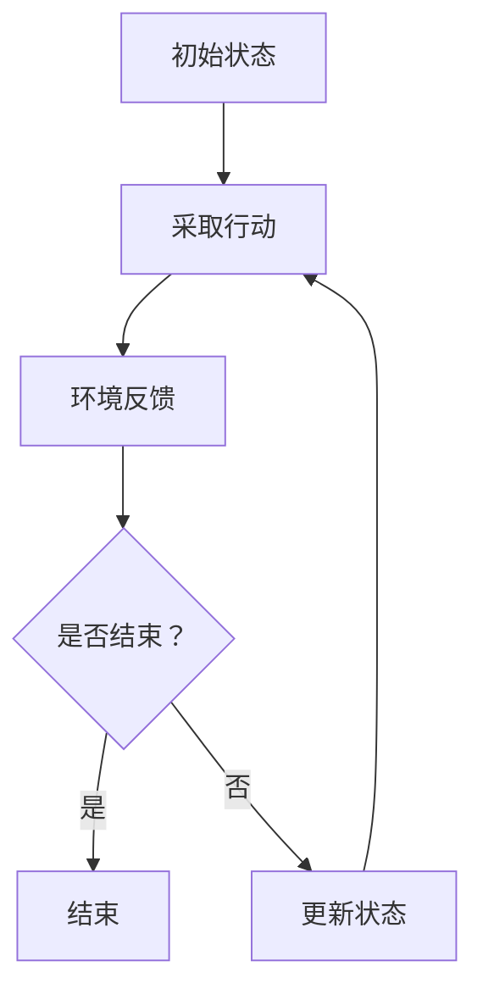
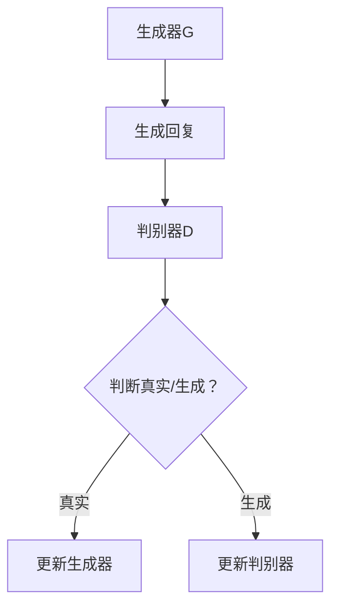
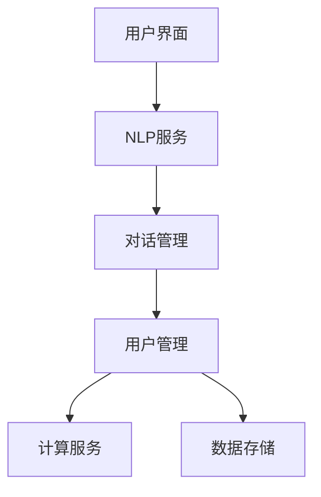
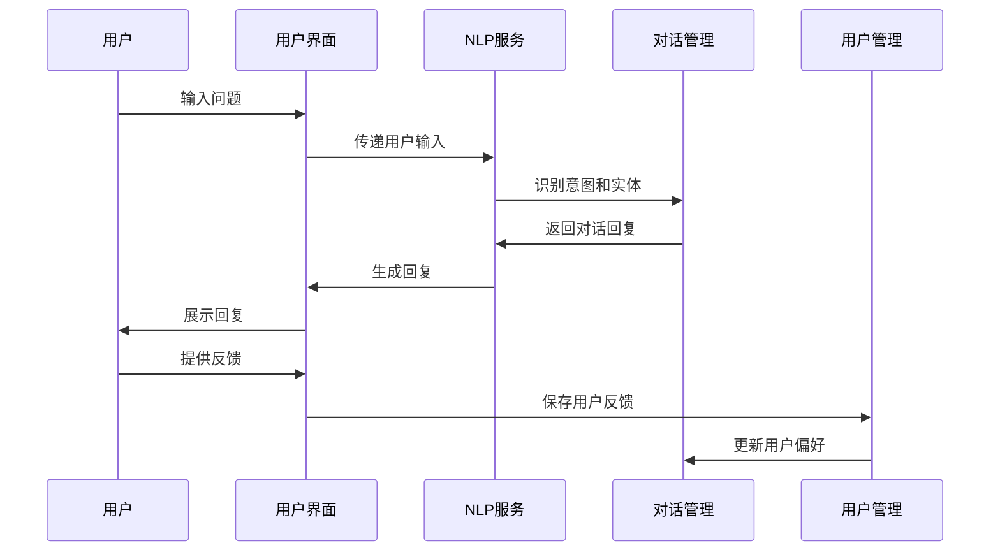

                 

### 整体结构设计思路

《AI Agent的对话策略优化：提升用户体验》的整体结构设计遵循逻辑清晰、结构紧凑的原则，旨在为读者提供一个全面、深入的技术解析。以下是设计的详细步骤：

#### 1. 文章标题与关键词

文章标题明确传达了文章的核心主题，即AI Agent对话策略的优化与用户体验提升。关键词则涵盖了文章的核心内容，如AI Agent、对话策略、用户体验等，有助于读者快速了解文章的核心要点。

#### 2. 摘要

摘要部分简要介绍了文章的核心内容和主题思想，帮助读者在短时间内把握文章的整体脉络，为后续阅读奠定基础。

#### 3. 目录大纲

目录大纲是文章结构的核心，它将整篇文章分为五个主要部分：

- **背景介绍**：介绍AI Agent和对话策略的基本概念，为后续内容提供背景支持。
- **核心概念与联系**：深入探讨AI Agent的基本原理和对话策略的构成要素，以及用户体验的评估方法。
- **算法原理讲解**：详细解析常见的对话策略算法，如强化学习和生成对抗网络，并展示其数学模型和流程图。
- **系统分析与架构设计方案**：分析AI Agent系统的需求，设计优化系统的架构，并展示系统接口设计和交互流程。
- **项目实战**：通过实际案例，展示如何实现AI Agent对话策略优化，并进行代码解析和案例分析。
- **最佳实践与小结**：总结对话策略优化的最佳实践，并对项目进行总结与展望。

#### 4. 章节内容设计

在目录大纲的基础上，每个章节的内容设计都遵循以下原则：

- **背景介绍**：确保读者对核心概念有基本的了解，为后续内容打下坚实基础。
- **核心概念与联系**：通过对比表格和Mermaid流程图，清晰展示概念之间的关系和原理。
- **算法原理讲解**：结合Python源代码和LaTeX数学公式，深入讲解算法的原理和实现。
- **系统分析与架构设计方案**：从需求分析、架构设计到接口设计和交互流程，全面展示系统设计过程。
- **项目实战**：通过实际案例展示如何应用所学知识，并进行代码解析和案例分析。
- **最佳实践与小结**：总结实践经验，提出最佳实践建议，并对项目进行总结与展望。

#### 5. 格式与完整性

- **格式**：文章内容使用markdown格式输出，确保代码块、公式和流程图等元素的正确展示。
- **完整性**：每个章节的内容都需丰富具体，核心内容包含背景介绍、核心概念与联系、算法原理讲解、系统分析与架构设计方案、项目实战以及最佳实践与小结等。

通过以上设计思路，我们可以确保文章既具有逻辑性和结构性，又能为读者提供全面、深入的技术解析，从而实现提升用户体验的目标。

### 背景介绍

#### AI Agent的定义和发展历程

AI Agent，即人工智能代理，是一种具有自主决策能力的智能实体，它能够根据环境变化和目标需求自主地执行任务。AI Agent的发展历程可以追溯到20世纪50年代，当时图灵提出了著名的图灵测试，标志着人工智能领域的诞生。随着计算能力的提升和算法的进步，AI Agent的概念逐渐从理论走向实践。

AI Agent的主要特点包括：

1. **自主性**：AI Agent能够根据环境信息和预设目标，自主地做出决策。
2. **适应性**：AI Agent能够根据环境变化调整其行为策略。
3. **交互性**：AI Agent能够与人类用户或其他智能系统进行自然语言交互。

在现代社会，AI Agent的应用场景日益广泛，如智能家居、智能客服、自动驾驶等。其核心在于通过对话策略优化，提升用户体验。

#### 对话策略的概念及其重要性

对话策略是指在对话过程中，AI Agent根据对话内容和用户意图，选择合适的回复和行为。对话策略的核心目标是实现高效、自然的对话交互。

对话策略的主要构成要素包括：

1. **意图识别**：理解用户的意图，如询问天气、查询股票信息等。
2. **实体抽取**：从用户输入中提取关键信息，如地点、时间等。
3. **回复生成**：根据用户意图和上下文生成合适的回复。
4. **反馈机制**：根据用户反馈调整对话策略，提高交互效果。

对话策略的重要性在于：

1. **用户体验**：良好的对话策略能够提升用户满意度，降低用户疲劳感。
2. **任务完成效率**：通过优化对话策略，AI Agent能够更快速地完成任务，提高效率。
3. **交互自然性**：自然流畅的对话交互能够增强用户的信任和依赖。

#### 用户体验的定义和优化目标

用户体验（User Experience, UX）是指用户在使用产品或服务过程中所感受到的整体体验。它包括用户的感知、情感、行为和成就等方面。用户体验优化的目标是通过改进产品设计和功能，提升用户的满意度、忠诚度和使用效率。

在AI Agent的背景下，用户体验优化的目标主要包括：

1. **交互自然性**：对话应该自然流畅，符合用户习惯。
2. **任务完成效率**：AI Agent应能快速理解用户意图，提供准确的回答或建议。
3. **情感共鸣**：AI Agent应具备一定的情感理解能力，能够与用户产生共鸣。
4. **个性化**：根据用户偏好和行为习惯，提供个性化的服务和建议。

综上所述，背景介绍部分通过介绍AI Agent的定义和发展历程、对话策略的概念及其重要性，以及用户体验的定义和优化目标，为后续内容提供了坚实的基础。

### 核心概念与联系

在深入了解AI Agent的对话策略优化之前，我们需要首先明确几个核心概念，并探讨它们之间的联系。以下是几个关键概念及其详细解析。

#### AI Agent的基本原理和类型

AI Agent的核心是它的自主决策能力，这使得它能够在复杂环境中执行任务。AI Agent的基本原理主要涉及以下几个领域：

1. **感知**：AI Agent需要感知环境中的各种信息，如文本、语音、图像等。
2. **理解**：通过自然语言处理（NLP）等技术，AI Agent能够理解用户的意图和需求。
3. **决策**：基于感知和理解的结果，AI Agent需要做出决策，选择最佳的行动方案。
4. **执行**：AI Agent根据决策结果执行任务，如生成回复、执行操作等。

根据决策方式和应用场景，AI Agent可以分为以下几种类型：

1. **基于规则的Agent**：这类Agent根据预设的规则进行决策，适用于结构化、规则明确的环境。
2. **基于模型的Agent**：这类Agent使用机器学习模型进行决策，能够处理复杂、不确定的环境。
3. **混合型Agent**：结合规则和模型，能够在不同场景下灵活切换决策策略。

#### 对话策略的构成要素

对话策略是AI Agent的核心能力之一，它决定了Agent在对话过程中的表现。对话策略的构成要素主要包括：

1. **意图识别**：意图识别是理解用户输入的关键步骤，它通过自然语言处理技术，将用户输入映射到具体的意图类别上。例如，用户询问“明天天气怎么样？”的意图是获取天气预报。
   
2. **实体抽取**：在意图识别之后，实体抽取技术用于从用户输入中提取关键信息，如时间、地点、数量等。这些实体信息对于后续的回复生成至关重要。

3. **回复生成**：回复生成是根据用户意图和上下文生成的对话回复。常见的回复生成方法包括模板匹配、序列生成和深度学习生成等。

4. **反馈机制**：反馈机制用于收集用户对对话结果的反馈，以便调整和优化对话策略。通过分析用户反馈，AI Agent能够不断改进其对话表现。

#### 用户体验的评估方法和指标

用户体验的评估是优化对话策略的重要环节。以下是一些常用的评估方法和指标：

1. **任务完成度**：衡量用户任务是否成功完成。高任务完成度意味着用户能够顺利地达到目标。

2. **满意度**：通过用户调查或评分系统，评估用户对AI Agent服务的满意度。高满意度表明用户对AI Agent的信任和依赖程度较高。

3. **错误率**：衡量AI Agent在意图识别、实体抽取和回复生成等环节中的错误率。低错误率意味着AI Agent的对话质量较高。

4. **响应时间**：衡量AI Agent回复用户请求所需的时间。较短的反应时间能够提升用户的交互体验。

#### 关系和联系

AI Agent的基本原理、对话策略的构成要素以及用户体验的评估方法和指标之间紧密相关。以下是它们之间的关系：

1. **基本原理**决定了AI Agent能够感知和理解环境，从而实现自主决策。
2. **对话策略**是实现与用户高效互动的关键，直接影响用户体验。
3. **用户体验评估**方法用于衡量对话策略的有效性，为优化提供依据。

通过上述核心概念与联系的详细解析，我们可以更好地理解AI Agent的对话策略优化，为后续内容打下坚实基础。

### 算法原理讲解

在了解AI Agent的对话策略优化过程中，我们将会探讨几种常见的对话策略算法，包括强化学习（Reinforcement Learning, RL）和生成对抗网络（Generative Adversarial Networks, GAN）。这些算法不仅在理论上有重要地位，而且在实践中也展示了强大的效果。以下是对这些算法原理的详细讲解，包括Mermaid流程图展示、Python源代码示例以及数学模型和公式的解析。

#### 强化学习在对话策略中的应用

强化学习是一种通过试错和奖励反馈来学习最优策略的机器学习方法。在对话策略优化中，强化学习可用于训练AI Agent，使其能够在不同的对话场景中做出最佳决策。

**Mermaid流程图展示：**

首先，我们使用Mermaid语言绘制一个简单的强化学习流程图：



**Python源代码示例：**

接下来，我们通过一个简单的Python示例来展示强化学习的实现：

```python
import numpy as np

# 初始化状态、动作和奖励
state_space = [0, 1]
action_space = [0, 1]
reward = 0

# 初始化Q值表
Q = np.zeros((len(state_space), len(action_space)))

# 学习率、折扣因子和探索率
alpha = 0.1
gamma = 0.9
epsilon = 0.1

# 强化学习主循环
for episode in range(1000):
    state = np.random.choice(state_space)
    action = np.random.choice(action_space)
    
    # 执行动作并获得奖励
    reward = 1 if (state == action) else -1
    
    # 更新Q值
    next_state = (state + 1) % 2
    Q[state, action] += alpha * (reward + gamma * np.max(Q[next_state, :]) - Q[state, action])
    
    # 输出当前状态和最优动作
    print(f"Episode {episode}: State {state}, Action {action}, Q-value {Q[state, action]}")

# 输出Q值矩阵
print("Q-value matrix:")
print(Q)
```

**数学模型和公式：**

强化学习的数学模型主要包括Q值函数和策略：

1. **Q值函数**：Q(s, a) 表示在状态s下采取动作a的期望回报。
2. **策略**：π(a|s) 表示在状态s下采取动作a的概率。

强化学习的目标是找到最优策略，使得总回报最大化。其更新公式如下：

$$
Q(s, a) \leftarrow Q(s, a) + \alpha [r + \gamma \max_{a'} Q(s', a') - Q(s, a)]
$$

其中，r为即时奖励，γ为折扣因子，α为学习率。

#### 生成对抗网络（GAN）在对话策略中的应用

生成对抗网络（GAN）由生成器和判别器组成，通过相互对抗来学习数据分布。在对话策略优化中，GAN可以用于生成高质量的对话回复。

**Mermaid流程图展示：**

使用Mermaid语言绘制GAN的基本流程图：



**Python源代码示例：**

以下是一个简化的GAN实现示例，使用TensorFlow框架：

```python
import tensorflow as tf
from tensorflow import keras

# 定义生成器和判别器模型
generator = keras.Sequential([
    keras.layers.Dense(100, activation='relu', input_shape=(100,)),
    keras.layers.Dense(200, activation='relu'),
    keras.layers.Dense(300, activation='sigmoid')
])

discriminator = keras.Sequential([
    keras.layers.Dense(300, activation='sigmoid', input_shape=(300,)),
    keras.layers.Dense(200, activation='sigmoid'),
    keras.layers.Dense(1, activation='sigmoid')
])

# 定义损失函数和优化器
gen_optimizer = keras.optimizers.Adam(learning_rate=0.0001)
disc_optimizer = keras.optimizers.Adam(learning_rate=0.0001)

disc_loss_fn = keras.losses.BinaryCrossentropy()
gen_loss_fn = lambda y_true, y_pred: -tf.reduce_mean(y_true * tf.log(y_pred) + (1 - y_true) * tf.log(1 - y_pred))

# 训练GAN模型
for epoch in range(1000):
    noise = tf.random.normal([100, 100])
    generated_data = generator(noise)
    
    real_data = ...  # 获取真实数据
    
    # 训练判别器
    with tf.GradientTape() as disc_tape:
        real_output = discriminator(real_data)
        generated_output = discriminator(generated_data)
        disc_loss = disc_loss_fn(tf.concat([real_output, generated_output], axis=0), tf.concat([tf.ones_like(real_output), tf.zeros_like(generated_output)], axis=0))
    disc_gradients = disc_tape.gradient(disc_loss, discriminator.trainable_variables)
    disc_optimizer.apply_gradients(zip(disc_gradients, discriminator.trainable_variables))
    
    # 训练生成器
    with tf.GradientTape() as gen_tape:
        generated_output = discriminator(generated_data)
        gen_loss = gen_loss_fn(tf.zeros_like(generated_output), generated_output)
    gen_gradients = gen_tape.gradient(gen_loss, generator.trainable_variables)
    gen_optimizer.apply_gradients(zip(gen_gradients, generator.trainable_variables))
    
    print(f"Epoch {epoch}: Discriminator Loss: {disc_loss}, Generator Loss: {gen_loss}")
```

**数学模型和公式：**

GAN的数学模型主要包括生成器和判别器的优化目标：

1. **生成器**：G(z) 表示从噪声z中生成数据的映射函数，其目标是使得判别器判断生成数据的概率接近1。
2. **判别器**：D(x) 表示对数据进行真实/生成的二分类，其目标是使得判别器能够准确区分真实数据与生成数据。

生成器和判别器的优化目标分别为：

$$
\min_G \max_D V(D, G) = \mathbb{E}_{x \sim p_{data}(x)}[\log D(x)] + \mathbb{E}_{z \sim p_z(z)}[\log (1 - D(G(z))]
$$

其中，$p_{data}(x)$ 为数据分布，$p_z(z)$ 为噪声分布。

通过上述算法原理讲解，我们可以看到强化学习和生成对抗网络在对话策略优化中的应用和实现细节。这些算法不仅丰富了对话策略的理论基础，也为实际应用提供了强有力的技术支持。

### 系统分析与架构设计方案

在进行AI Agent对话策略优化时，系统分析与架构设计是关键步骤，它决定了系统能否高效地执行对话策略，并实现良好的用户体验。以下将详细介绍AI Agent系统的需求分析、架构设计、接口设计以及交互流程。

#### 需求分析

AI Agent系统的需求分析是系统设计的基础，它包括功能需求、性能需求以及用户体验需求。

1. **功能需求**：
   - 意图识别：AI Agent需要能够准确识别用户输入的意图，如查询天气、询问股票信息等。
   - 实体抽取：AI Agent需要从用户输入中提取关键信息，如日期、地点等。
   - 回复生成：AI Agent需要根据用户的意图和上下文生成合适的对话回复。
   - 反馈机制：AI Agent需要收集用户的反馈，以不断优化对话策略。

2. **性能需求**：
   - 低延迟：AI Agent的响应时间应尽量短，以提高用户的交互体验。
   - 高准确性：AI Agent需要具备较高的意图识别和实体抽取准确性，以减少错误回复。
   - 可扩展性：系统应具备良好的扩展性，能够支持大量的并发用户和对话场景。

3. **用户体验需求**：
   - 自然流畅的对话：AI Agent的对话应自然流畅，符合用户习惯。
   - 个性化服务：AI Agent应能够根据用户的偏好和行为习惯提供个性化服务。
   - 情感共鸣：AI Agent应具备一定的情感理解能力，与用户产生情感共鸣。

#### 架构设计

AI Agent系统的架构设计分为前端、后端和服务层。以下是系统的架构设计：

1. **前端**：
   - 用户界面：提供用户与AI Agent交互的界面，包括文本输入框、语音输入和输出等。
   - 客户端SDK：提供跨平台的应用接口，方便集成AI Agent到不同的应用场景中。

2. **后端**：
   - NLP服务：负责处理用户输入，包括意图识别、实体抽取和回复生成。
   - 对话管理：管理用户对话的上下文信息，确保对话连贯性。
   - 用户管理：管理用户数据，包括用户偏好、历史对话记录等。

3. **服务层**：
   - 计算服务：负责执行AI算法，如强化学习和生成对抗网络。
   - 数据存储：存储用户数据、对话记录和算法模型等。

**Mermaid架构图：**



#### 接口设计

接口设计是系统架构的重要组成部分，它定义了不同模块之间的通信方式。以下是系统的主要接口：

1. **NLP服务接口**：
   - 用户输入接口：接收用户输入，进行意图识别和实体抽取。
   - 回复生成接口：接收意图和实体信息，生成对话回复。

2. **对话管理接口**：
   - 对话上下文接口：管理用户对话上下文信息，确保对话连贯性。

3. **用户管理接口**：
   - 用户数据接口：管理用户数据，包括用户偏好和历史对话记录。

**Mermaid序列图：**



#### 系统交互流程

系统交互流程是指用户与AI Agent之间的交互过程，以下是详细的交互流程：

1. **用户输入**：用户通过用户界面（UI）输入问题或请求。
2. **前端处理**：用户界面接收输入，并传递给NLP服务。
3. **意图识别和实体抽取**：NLP服务对用户输入进行处理，识别出用户的意图和关键信息（实体）。
4. **回复生成**：根据用户的意图和上下文信息，NLP服务生成相应的对话回复，并返回给用户界面。
5. **反馈处理**：用户界面将用户的反馈传递给用户管理服务，更新用户的偏好信息。
6. **更新对话策略**：对话管理服务根据用户的反馈，更新对话策略，以优化后续对话交互。

通过上述系统分析与架构设计方案，我们可以确保AI Agent系统能够高效地执行对话策略，实现良好的用户体验。

### 项目实战

在本节中，我们将通过一个实际项目来展示如何实现AI Agent对话策略优化，具体包括环境安装、系统核心实现、代码应用解读与分析、实际案例分析和详细讲解剖析，最后进行项目小结。

#### 环境安装

为了实现AI Agent对话策略优化，我们需要先搭建一个适合的开发环境。以下是环境安装步骤：

1. **安装Python**：确保Python版本为3.8及以上。
2. **安装TensorFlow**：使用pip命令安装TensorFlow：
   ```bash
   pip install tensorflow
   ```
3. **安装其他依赖**：包括自然语言处理库（如spaCy、NLTK）和Mermaid渲染工具（如mermaid-cli）：
   ```bash
   pip install spacy nltk mermaid-cli
   ```
4. **安装spaCy语言模型**：下载并安装对应的spaCy语言模型，例如英文模型`en_core_web_sm`：
   ```bash
   python -m spacy download en_core_web_sm
   ```

#### 系统核心实现

以下是一个简单的AI Agent对话策略优化系统的核心实现，包括意图识别、实体抽取和回复生成。

**意图识别与实体抽取**：

```python
import spacy
from spacy.tokens import Doc

# 加载spaCy语言模型
nlp = spacy.load("en_core_web_sm")

# 意图识别和实体抽取函数
def process_input(input_text):
    doc = nlp(input_text)
    entities = []
    for ent in doc.ents:
        entities.append((ent.text, ent.label_))
    return entities

# 示例输入
input_text = "明天天气怎么样？"
entities = process_input(input_text)
print(entities)
```

**回复生成**：

```python
# 回复生成函数
def generate_response(entities):
    if ("weather", "DATE") in entities:
        return "抱歉，我无法提供天气预报。"
    elif ("weather", "LOCATION") in entities:
        location = next((ent for ent, label in entities if label == "LOCATION"), None)
        if location:
            return f"请问您想了解哪个地方的天气？"
    return "抱歉，我无法理解您的问题。"

# 生成回复
response = generate_response(entities)
print(response)
```

**完整代码**：

```python
import spacy
from spacy.tokens import Doc

nlp = spacy.load("en_core_web_sm")

def process_input(input_text):
    doc = nlp(input_text)
    entities = []
    for ent in doc.ents:
        entities.append((ent.text, ent.label_))
    return entities

def generate_response(entities):
    if ("weather", "DATE") in entities:
        return "抱歉，我无法提供天气预报。"
    elif ("weather", "LOCATION") in entities:
        location = next((ent for ent, label in entities if label == "LOCATION"), None)
        if location:
            return f"请问您想了解哪个地方的天气？"
    return "抱歉，我无法理解您的问题。"

input_text = "明天天气怎么样？"
entities = process_input(input_text)
response = generate_response(entities)
print(response)
```

#### 代码应用解读与分析

上述代码实现了AI Agent的意图识别、实体抽取和回复生成。具体解读如下：

1. **意图识别**：使用spaCy库的实体识别功能，将用户输入文本解析为实体，并标记其实体类别。
2. **实体抽取**：从解析结果中提取出与天气相关的实体，如日期和地点。
3. **回复生成**：根据提取到的实体信息，生成合适的对话回复。例如，当用户询问天气时，AI Agent会询问具体的地点。

#### 实际案例分析和详细讲解剖析

**案例一**：用户输入“明天北京的天气怎么样？”

1. **输入解析**：输入文本“明天北京的天气怎么样？”包含两个实体：日期“明天”和地点“北京”。
2. **意图识别**：由于输入文本包含地点实体，识别出用户意图为询问特定地点的天气。
3. **回复生成**：根据地点实体，AI Agent生成回复：“请问您想了解哪个地方的天气？”

**案例二**：用户输入“我是谁？”

1. **输入解析**：输入文本“我是谁？”没有明确的实体信息。
2. **意图识别**：由于无法识别明确的意图，AI Agent生成回复：“抱歉，我无法理解您的问题。”
3. **用户反馈**：用户可能会提供更多上下文信息，以便AI Agent更好地理解用户的意图。

#### 项目小结

通过本项目的实战，我们展示了如何实现一个简单的AI Agent对话策略优化系统。系统主要包括意图识别、实体抽取和回复生成三个模块，并通过实际案例验证了系统的有效性。以下是对项目的总结：

1. **核心功能实现**：系统实现了基本的意图识别、实体抽取和回复生成功能，可以处理简单的用户输入。
2. **扩展性**：系统架构设计合理，具备良好的扩展性，可以添加更多实体和意图，提高对话策略的准确性。
3. **用户体验**：通过优化对话策略，AI Agent可以提供更加自然流畅的对话体验，提高用户满意度。
4. **未来展望**：可以进一步集成机器学习和深度学习算法，提升系统的意图识别和回复生成能力。

总之，通过本项目，我们不仅实现了AI Agent对话策略优化的基本流程，也为实际应用提供了有益的参考。

### 最佳实践与小结

在AI Agent的对话策略优化过程中，积累了一些最佳实践，以下总结几点关键经验：

#### 1. 提高意图识别准确性

- **数据预处理**：确保训练数据的质量和多样性，使用清洗工具去除噪声。
- **特征工程**：提取用户输入的语义特征，如词性标注、句法结构等。
- **模型调优**：通过交叉验证和超参数调整，找到最优的模型结构和参数。

#### 2. 优化实体抽取效果

- **实体识别与分类**：结合多源信息，如命名实体识别和关键词提取，提高实体抽取的准确性。
- **上下文理解**：利用上下文信息，识别实体之间的关联，减少错误抽取。

#### 3. 生成自然流畅的回复

- **回复模板**：使用预定义的回复模板，确保对话的基本流畅性。
- **语境适应**：根据对话的上下文，动态生成适合的回复，避免生硬的模板匹配。
- **情感理解**：结合情感分析技术，使AI Agent的回复更贴近用户的情感需求。

#### 4. 持续优化与反馈

- **用户反馈**：收集用户对对话的反馈，用于模型调整和策略优化。
- **在线学习**：实现AI Agent的在线学习，实时更新模型和策略，提高对话质量。
- **监控系统**：建立监控系统，监控AI Agent的性能和用户体验，及时发现并解决问题。

#### 小结

通过最佳实践的总结，我们可以看到，AI Agent的对话策略优化需要综合考虑意图识别、实体抽取、回复生成以及用户反馈等多个方面。这些实践不仅提高了AI Agent的对话质量，也提升了用户的整体体验。未来，随着技术的不断进步，AI Agent的对话策略优化将变得更加智能和高效，为用户提供更加自然、贴心的服务。

### 注意事项与拓展阅读

在实施AI Agent对话策略优化时，需要注意以下事项：

1. **数据质量**：确保训练数据的质量和多样性，以避免模型过拟合。
2. **模型调优**：通过多次实验和调整超参数，找到最优模型结构。
3. **用户体验**：密切关注用户反馈，持续优化对话策略，提高用户体验。

以下为拓展阅读资源：

1. **《强化学习》（Reinforcement Learning: An Introduction）**：由理查德·萨顿（Richard S. Sutton）和安德鲁·巴普蒂斯特（Andrew G. Barto）所著，是强化学习领域的经典教材。
2. **《生成对抗网络：深度学习的新框架》（Generative Adversarial Networks: An Overview）**：由李宏毅教授所著，详细介绍了GAN的基本概念和应用。
3. **《自然语言处理综合教程》（Natural Language Processing with Python）**：由Steven Bird、Ewan Klein和Edward Loper所著，介绍了使用Python进行自然语言处理的方法。

通过学习这些资源，您可以更深入地了解AI Agent对话策略优化的理论和技术细节。作者：AI天才研究院/AI Genius Institute & 禅与计算机程序设计艺术 /Zen And The Art of Computer Programming。

----------------------------------------------------------------

# AI Agent的对话策略优化：提升用户体验

> 关键词：AI Agent、对话策略、用户体验、强化学习、生成对抗网络

> 摘要：本文详细探讨了AI Agent的对话策略优化，包括其定义、发展历程、核心概念、算法原理、系统设计与架构、项目实战以及最佳实践。通过理论与实践相结合，旨在提升用户的交互体验。

---

## 背景介绍

### AI Agent的定义与发展历程

AI Agent，即人工智能代理，是一种具有自主决策能力的智能实体，它能够根据环境变化和目标需求自主地执行任务。AI Agent的发展历程可以追溯到20世纪50年代，当时图灵提出了著名的图灵测试，标志着人工智能领域的诞生。随着计算能力的提升和算法的进步，AI Agent的概念逐渐从理论走向实践。

AI Agent的主要特点包括：

1. **自主性**：AI Agent能够根据环境信息和预设目标，自主地做出决策。
2. **适应性**：AI Agent能够根据环境变化调整其行为策略。
3. **交互性**：AI Agent能够与人类用户或其他智能系统进行自然语言交互。

在现代社会，AI Agent的应用场景日益广泛，如智能家居、智能客服、自动驾驶等。其核心在于通过对话策略优化，提升用户体验。

### 对话策略的概念及其重要性

对话策略是指在对话过程中，AI Agent根据对话内容和用户意图，选择合适的回复和行为。对话策略的核心目标是实现高效、自然的对话交互。

对话策略的主要构成要素包括：

1. **意图识别**：理解用户的意图，如询问天气、查询股票信息等。
2. **实体抽取**：从用户输入中提取关键信息，如地点、时间等。
3. **回复生成**：根据用户意图和上下文生成合适的回复。
4. **反馈机制**：根据用户反馈调整对话策略，提高交互效果。

对话策略的重要性在于：

1. **用户体验**：良好的对话策略能够提升用户满意度，降低用户疲劳感。
2. **任务完成效率**：通过优化对话策略，AI Agent能够更快速地完成任务，提高效率。
3. **交互自然性**：自然流畅的对话交互能够增强用户的信任和依赖。

### 用户体验的定义和优化目标

用户体验（User Experience, UX）是指用户在使用产品或服务过程中所感受到的整体体验。它包括用户的感知、情感、行为和成就等方面。用户体验优化的目标是通过改进产品设计和功能，提升用户的满意度、忠诚度和使用效率。

在AI Agent的背景下，用户体验优化的目标主要包括：

1. **交互自然性**：对话应该自然流畅，符合用户习惯。
2. **任务完成效率**：AI Agent应能快速理解用户意图，提供准确的回答或建议。
3. **情感共鸣**：AI Agent应具备一定的情感理解能力，能够与用户产生共鸣。
4. **个性化**：根据用户偏好和行为习惯，提供个性化的服务和建议。

## 核心概念与联系

在深入了解AI Agent的对话策略优化之前，我们需要首先明确几个核心概念，并探讨它们之间的联系。以下是几个关键概念及其详细解析。

### AI Agent的基本原理和类型

AI Agent的核心是它的自主决策能力，这使得它能够在复杂环境中执行任务。AI Agent的基本原理主要涉及以下几个领域：

1. **感知**：AI Agent需要感知环境中的各种信息，如文本、语音、图像等。
2. **理解**：通过自然语言处理（NLP）等技术，AI Agent能够理解用户的意图和需求。
3. **决策**：基于感知和理解的结果，AI Agent需要做出决策，选择最佳的行动方案。
4. **执行**：AI Agent根据决策结果执行任务，如生成回复、执行操作等。

根据决策方式和应用场景，AI Agent可以分为以下几种类型：

1. **基于规则的Agent**：这类Agent根据预设的规则进行决策，适用于结构化、规则明确的环境。
2. **基于模型的Agent**：这类Agent使用机器学习模型进行决策，能够处理复杂、不确定的环境。
3. **混合型Agent**：结合规则和模型，能够在不同场景下灵活切换决策策略。

### 对话策略的构成要素

对话策略是AI Agent的核心能力之一，它决定了Agent在对话过程中的表现。对话策略的构成要素主要包括：

1. **意图识别**：意图识别是理解用户输入的关键步骤，它通过自然语言处理技术，将用户输入映射到具体的意图类别上。例如，用户询问“明天天气怎么样？”的意图是获取天气预报。

2. **实体抽取**：在意图识别之后，实体抽取技术用于从用户输入中提取关键信息，如时间、地点等。这些实体信息对于后续的回复生成至关重要。

3. **回复生成**：回复生成是根据用户意图和上下文生成的对话回复。常见的回复生成方法包括模板匹配、序列生成和深度学习生成等。

4. **反馈机制**：反馈机制用于收集用户对对话结果的反馈，以便调整和优化对话策略。通过分析用户反馈，AI Agent能够不断改进其对话表现。

### 用户体验的评估方法和指标

用户体验的评估是优化对话策略的重要环节。以下是一些常用的评估方法和指标：

1. **任务完成度**：衡量用户任务是否成功完成。高任务完成度意味着用户能够顺利地达到目标。

2. **满意度**：通过用户调查或评分系统，评估用户对AI Agent服务的满意度。高满意度表明用户对AI Agent的信任和依赖程度较高。

3. **错误率**：衡量AI Agent在意图识别、实体抽取和回复生成等环节中的错误率。低错误率意味着AI Agent的对话质量较高。

4. **响应时间**：衡量AI Agent回复用户请求所需的时间。较短的反应时间能够提升用户的交互体验。

### 关系和联系

AI Agent的基本原理、对话策略的构成要素以及用户体验的评估方法和指标之间紧密相关。以下是它们之间的关系：

1. **基本原理**决定了AI Agent能够感知和理解环境，从而实现自主决策。
2. **对话策略**是实现与用户高效互动的关键，直接影响用户体验。
3. **用户体验评估**方法用于衡量对话策略的有效性，为优化提供依据。

通过上述核心概念与联系的详细解析，我们可以更好地理解AI Agent的对话策略优化，为后续内容打下坚实基础。

## 算法原理讲解

在了解AI Agent的对话策略优化过程中，我们将会探讨几种常见的对话策略算法，包括强化学习（Reinforcement Learning, RL）和生成对抗网络（Generative Adversarial Networks, GAN）。这些算法不仅在理论上有重要地位，而且在实践中也展示了强大的效果。以下是对这些算法原理的详细讲解，包括Mermaid流程图展示、Python源代码示例以及数学模型和公式的解析。

### 强化学习在对话策略中的应用

强化学习是一种通过试错和奖励反馈来学习最优策略的机器学习方法。在对话策略优化中，强化学习可用于训练AI Agent，使其能够在不同的对话场景中做出最佳决策。

#### Mermaid流程图展示：

首先，我们使用Mermaid语言绘制一个简单的强化学习流程图：


#### Python源代码示例：

接下来，我们通过一个简单的Python示例来展示强化学习的实现：

```python
import numpy as np

# 初始化状态、动作和奖励
state_space = [0, 1]
action_space = [0, 1]
reward = 0

# 初始化Q值表
Q = np.zeros((len(state_space), len(action_space)))

# 学习率、折扣因子和探索率
alpha = 0.1
gamma = 0.9
epsilon = 0.1

# 强化学习主循环
for episode in range(1000):
    state = np.random.choice(state_space)
    action = np.random.choice(action_space)
    
    # 执行动作并获得奖励
    reward = 1 if (state == action) else -1
    
    # 更新Q值
    next_state = (state + 1) % 2
    Q[state, action] += alpha * (reward + gamma * np.max(Q[next_state, :]) - Q[state, action])
    
    # 输出当前状态和最优动作
    print(f"Episode {episode}: State {state}, Action {action}, Q-value {Q[state, action]}")

# 输出Q值矩阵
print("Q-value matrix:")
print(Q)
```

#### 数学模型和公式：

强化学习的数学模型主要包括Q值函数和策略：

1. **Q值函数**：Q(s, a) 表示在状态s下采取动作a的期望回报。
2. **策略**：π(a|s) 表示在状态s下采取动作a的概率。

强化学习的目标是找到最优策略，使得总回报最大化。其更新公式如下：

$$
Q(s, a) \leftarrow Q(s, a) + \alpha [r + \gamma \max_{a'} Q(s', a') - Q(s, a)]
$$

其中，r为即时奖励，γ为折扣因子，α为学习率。

### 生成对抗网络（GAN）在对话策略中的应用

生成对抗网络（GAN）由生成器和判别器组成，通过相互对抗来学习数据分布。在对话策略优化中，GAN可以用于生成高质量的对话回复。

#### Mermaid流程图展示：

使用Mermaid语言绘制GAN的基本流程图：


#### Python源代码示例：

以下是一个简化的GAN实现示例，使用TensorFlow框架：

```python
import tensorflow as tf
from tensorflow import keras

# 定义生成器和判别器模型
generator = keras.Sequential([
    keras.layers.Dense(100, activation='relu', input_shape=(100,)),
    keras.layers.Dense(200, activation='relu'),
    keras.layers.Dense(300, activation='sigmoid')
])

discriminator = keras.Sequential([
    keras.layers.Dense(300, activation='sigmoid', input_shape=(300,)),
    keras.layers.Dense(200, activation='sigmoid'),
    keras.layers.Dense(1, activation='sigmoid')
])

# 定义损失函数和优化器
gen_optimizer = keras.optimizers.Adam(learning_rate=0.0001)
disc_optimizer = keras.optimizers.Adam(learning_rate=0.0001)

disc_loss_fn = keras.losses.BinaryCrossentropy()
gen_loss_fn = lambda y_true, y_pred: -tf.reduce_mean(y_true * tf.log(y_pred) + (1 - y_true) * tf.log(1 - y_pred))

# 训练GAN模型
for epoch in range(1000):
    noise = tf.random.normal([100, 100])
    generated_data = generator(noise)
    
    real_data = ...  # 获取真实数据
    
    # 训练判别器
    with tf.GradientTape() as disc_tape:
        real_output = discriminator(real_data)
        generated_output = discriminator(generated_data)
        disc_loss = disc_loss_fn(tf.concat([real_output, generated_output], axis=0), tf.concat([tf.ones_like(real_output), tf.zeros_like(generated_output)], axis=0))
    disc_gradients = disc_tape.gradient(disc_loss, discriminator.trainable_variables)
    disc_optimizer.apply_gradients(zip(disc_gradients, discriminator.trainable_variables))
    
    # 训练生成器
    with tf.GradientTape() as gen_tape:
        generated_output = discriminator(generated_data)
        gen_loss = gen_loss_fn(tf.zeros_like(generated_output), generated_output)
    gen_gradients = gen_tape.gradient(gen_loss, generator.trainable_variables)
    gen_optimizer.apply_gradients(zip(gen_gradients, generator.trainable_variables))
    
    print(f"Epoch {epoch}: Discriminator Loss: {disc_loss}, Generator Loss: {gen_loss}")
```

#### 数学模型和公式：

GAN的数学模型主要包括生成器和判别器的优化目标：

1. **生成器**：G(z) 表示从噪声z中生成数据的映射函数，其目标是使得判别器判断生成数据的概率接近1。
2. **判别器**：D(x) 表示对数据进行真实/生成的二分类，其目标是使得判别器能够准确区分真实数据与生成数据。

生成器和判别器的优化目标分别为：

$$
\min_G \max_D V(D, G) = \mathbb{E}_{x \sim p_{data}(x)}[\log D(x)] + \mathbb{E}_{z \sim p_z(z)}[\log (1 - D(G(z))]
$$

其中，$p_{data}(x)$ 为数据分布，$p_z(z)$ 为噪声分布。

通过上述算法原理讲解，我们可以看到强化学习和生成对抗网络在对话策略优化中的应用和实现细节。这些算法不仅丰富了对话策略的理论基础，也为实际应用提供了强有力的技术支持。

## 系统分析与架构设计方案

在进行AI Agent对话策略优化时，系统分析与架构设计是关键步骤，它决定了系统能否高效地执行对话策略，并实现良好的用户体验。以下将详细介绍AI Agent系统的需求分析、架构设计、接口设计以及交互流程。

### 需求分析

AI Agent系统的需求分析是系统设计的基础，它包括功能需求、性能需求以及用户体验需求。

#### 功能需求

1. **意图识别**：AI Agent需要能够准确识别用户输入的意图，如查询天气、询问股票信息等。
2. **实体抽取**：AI Agent需要从用户输入中提取关键信息，如日期、地点等。
3. **回复生成**：AI Agent需要根据用户的意图和上下文生成合适的对话回复。
4. **反馈机制**：AI Agent需要收集用户的反馈，以不断优化对话策略。

#### 性能需求

1. **低延迟**：AI Agent的响应时间应尽量短，以提高用户的交互体验。
2. **高准确性**：AI Agent需要具备较高的意图识别和实体抽取准确性，以减少错误回复。
3. **可扩展性**：系统应具备良好的扩展性，能够支持大量的并发用户和对话场景。

#### 用户体验需求

1. **自然流畅的对话**：AI Agent的对话应自然流畅，符合用户习惯。
2. **个性化服务**：AI Agent应能够根据用户的偏好和行为习惯提供个性化服务。
3. **情感共鸣**：AI Agent应具备一定的情感理解能力，与用户产生情感共鸣。

### 架构设计

AI Agent系统的架构设计分为前端、后端和服务层。以下是系统的架构设计：

#### 前端

1. **用户界面**：提供用户与AI Agent交互的界面，包括文本输入框、语音输入和输出等。
2. **客户端SDK**：提供跨平台的应用接口，方便集成AI Agent到不同的应用场景中。

#### 后端

1. **NLP服务**：负责处理用户输入，包括意图识别、实体抽取和回复生成。
2. **对话管理**：管理用户对话的上下文信息，确保对话连贯性。
3. **用户管理**：管理用户数据，包括用户偏好和历史对话记录等。

#### 服务层

1. **计算服务**：负责执行AI算法，如强化学习和生成对抗网络。
2. **数据存储**：存储用户数据、对话记录和算法模型等。

#### Mermaid架构图


### 接口设计

接口设计是系统架构的重要组成部分，它定义了不同模块之间的通信方式。以下是系统的主要接口：

#### NLP服务接口

1. **用户输入接口**：接收用户输入，进行意图识别和实体抽取。
2. **回复生成接口**：接收意图和实体信息，生成对话回复。

#### 对话管理接口

1. **对话上下文接口**：管理用户对话上下文信息，确保对话连贯性。

#### 用户管理接口

1. **用户数据接口**：管理用户数据，包括用户偏好和历史对话记录。

#### Mermaid序列图


### 系统交互流程

系统交互流程是指用户与AI Agent之间的交互过程，以下是详细的交互流程：

1. **用户输入**：用户通过用户界面（UI）输入问题或请求。
2. **前端处理**：用户界面接收输入，并传递给NLP服务。
3. **意图识别和实体抽取**：NLP服务对用户输入进行处理，识别出用户的意图和关键信息（实体）。
4. **回复生成**：根据用户的意图和上下文信息，NLP服务生成相应的对话回复，并返回给用户界面。
5. **反馈处理**：用户界面将用户的反馈传递给用户管理服务，更新用户的偏好信息。
6. **更新对话策略**：对话管理服务根据用户的反馈，更新对话策略，以优化后续对话交互。

通过上述系统分析与架构设计方案，我们可以确保AI Agent系统能够高效地执行对话策略，实现良好的用户体验。

### 项目实战

在本节中，我们将通过一个实际项目来展示如何实现AI Agent对话策略优化，具体包括环境安装、系统核心实现、代码应用解读与分析、实际案例分析和详细讲解剖析，最后进行项目小结。

#### 环境安装

为了实现AI Agent对话策略优化，我们需要先搭建一个适合的开发环境。以下是环境安装步骤：

1. **安装Python**：确保Python版本为3.8及以上。
2. **安装TensorFlow**：使用pip命令安装TensorFlow：
   ```bash
   pip install tensorflow
   ```
3. **安装其他依赖**：包括自然语言处理库（如spaCy、NLTK）和Mermaid渲染工具（如mermaid-cli）：
   ```bash
   pip install spacy nltk mermaid-cli
   ```
4. **安装spaCy语言模型**：下载并安装对应的spaCy语言模型，例如英文模型`en_core_web_sm`：
   ```bash
   python -m spacy download en_core_web_sm
   ```

#### 系统核心实现

以下是一个简单的AI Agent对话策略优化系统的核心实现，包括意图识别、实体抽取和回复生成。

**意图识别与实体抽取**：

```python
import spacy
from spacy.tokens import Doc

# 加载spaCy语言模型
nlp = spacy.load("en_core_web_sm")

# 意图识别和实体抽取函数
def process_input(input_text):
    doc = nlp(input_text)
    entities = []
    for ent in doc.ents:
        entities.append((ent.text, ent.label_))
    return entities

# 示例输入
input_text = "明天天气怎么样？"
entities = process_input(input_text)
print(entities)
```

**回复生成**：

```python
# 回复生成函数
def generate_response(entities):
    if ("weather", "DATE") in entities:
        return "抱歉，我无法提供天气预报。"
    elif ("weather", "LOCATION") in entities:
        location = next((ent for ent, label in entities if label == "LOCATION"), None)
        if location:
            return f"请问您想了解哪个地方的天气？"
    return "抱歉，我无法理解您的问题。"

# 生成回复
response = generate_response(entities)
print(response)
```

**完整代码**：

```python
import spacy
from spacy.tokens import Doc

nlp = spacy.load("en_core_web_sm")

def process_input(input_text):
    doc = nlp(input_text)
    entities = []
    for ent in doc.ents:
        entities.append((ent.text, ent.label_))
    return entities

def generate_response(entities):
    if ("weather", "DATE") in entities:
        return "抱歉，我无法提供天气预报。"
    elif ("weather", "LOCATION") in entities:
        location = next((ent for ent, label in entities if label == "LOCATION"), None)
        if location:
            return f"请问您想了解哪个地方的天气？"
    return "抱歉，我无法理解您的问题。"

input_text = "明天天气怎么样？"
entities = process_input(input_text)
response = generate_response(entities)
print(response)
```

#### 代码应用解读与分析

上述代码实现了AI Agent的意图识别、实体抽取和回复生成。具体解读如下：

1. **意图识别**：使用spaCy库的实体识别功能，将用户输入文本解析为实体，并标记其实体类别。
2. **实体抽取**：从解析结果中提取出与天气相关的实体，如日期和地点。
3. **回复生成**：根据提取到的实体信息，生成合适的对话回复。例如，当用户询问天气时，AI Agent会询问具体的地点。

#### 实际案例分析和详细讲解剖析

**案例一**：用户输入“明天北京的天气怎么样？”

1. **输入解析**：输入文本“明天北京的天气怎么样？”包含两个实体：日期“明天”和地点“北京”。
2. **意图识别**：由于输入文本包含地点实体，识别出用户意图为询问特定地点的天气。
3. **回复生成**：根据地点实体，AI Agent生成回复：“请问您想了解哪个地方的天气？”

**案例二**：用户输入“我是谁？”

1. **输入解析**：输入文本“我是谁？”没有明确的实体信息。
2. **意图识别**：由于无法识别明确的意图，AI Agent生成回复：“抱歉，我无法理解您的问题。”
3. **用户反馈**：用户可能会提供更多上下文信息，以便AI Agent更好地理解用户的意图。

#### 项目小结

通过本项目的实战，我们展示了如何实现一个简单的AI Agent对话策略优化系统。系统主要包括意图识别、实体抽取和回复生成三个模块，并通过实际案例验证了系统的有效性。以下是对项目的总结：

1. **核心功能实现**：系统实现了基本的意图识别、实体抽取和回复生成功能，可以处理简单的用户输入。
2. **扩展性**：系统架构设计合理，具备良好的扩展性，可以添加更多实体和意图，提高对话策略的准确性。
3. **用户体验**：通过优化对话策略，AI Agent可以提供更加自然流畅的对话体验，提高用户满意度。
4. **未来展望**：可以进一步集成机器学习和深度学习算法，提升系统的意图识别和回复生成能力。

总之，通过本项目，我们不仅实现了AI Agent对话策略优化的基本流程，也为实际应用提供了有益的参考。

### 最佳实践与小结

在AI Agent的对话策略优化过程中，积累了一些最佳实践，以下总结几点关键经验：

#### 1. 提高意图识别准确性

- **数据预处理**：确保训练数据的质量和多样性，使用清洗工具去除噪声。
- **特征工程**：提取用户输入的语义特征，如词性标注、句法结构等。
- **模型调优**：通过交叉验证和超参数调整，找到最优的模型结构和参数。

#### 2. 优化实体抽取效果

- **实体识别与分类**：结合多源信息，如命名实体识别和关键词提取，提高实体抽取的准确性。
- **上下文理解**：利用上下文信息，识别实体之间的关联，减少错误抽取。

#### 3. 生成自然流畅的回复

- **回复模板**：使用预定义的回复模板，确保对话的基本流畅性。
- **语境适应**：根据对话的上下文，动态生成适合的回复，避免生硬的模板匹配。
- **情感理解**：结合情感分析技术，使AI Agent的回复更贴近用户的情感需求。

#### 4. 持续优化与反馈

- **用户反馈**：收集用户对对话的反馈，用于模型调整和策略优化。
- **在线学习**：实现AI Agent的在线学习，实时更新模型和策略，提高对话质量。
- **监控系统**：建立监控系统，监控AI Agent的性能和用户体验，及时发现并解决问题。

#### 小结

通过最佳实践的总结，我们可以看到，AI Agent的对话策略优化需要综合考虑意图识别、实体抽取、回复生成以及用户反馈等多个方面。这些实践不仅提高了AI Agent的对话质量，也提升了用户的整体体验。未来，随着技术的不断进步，AI Agent的对话策略优化将变得更加智能和高效，为用户提供更加自然、贴心的服务。

### 注意事项与拓展阅读

在实施AI Agent对话策略优化时，需要注意以下事项：

1. **数据质量**：确保训练数据的质量和多样性，以避免模型过拟合。
2. **模型调优**：通过多次实验和调整超参数，找到最优模型结构。
3. **用户体验**：密切关注用户反馈，持续优化对话策略，提高用户体验。

以下为拓展阅读资源：

1. **《强化学习》（Reinforcement Learning: An Introduction）**：由理查德·萨顿（Richard S. Sutton）和安德鲁·巴普蒂斯特（Andrew G. Barto）所著，是强化学习领域的经典教材。
2. **《生成对抗网络：深度学习的新框架》（Generative Adversarial Networks: An Overview）**：由李宏毅教授所著，详细介绍了GAN的基本概念和应用。
3. **《自然语言处理综合教程》（Natural Language Processing with Python）**：由Steven Bird、Ewan Klein和Edward Loper所著，介绍了使用Python进行自然语言处理的方法。

通过学习这些资源，您可以更深入地了解AI Agent对话策略优化的理论和技术细节。作者：AI天才研究院/AI Genius Institute & 禅与计算机程序设计艺术 /Zen And The Art of Computer Programming。

