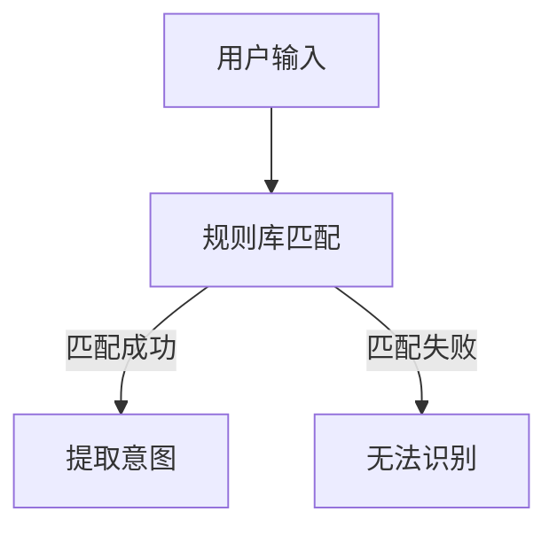
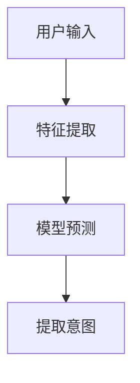
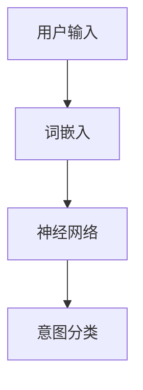
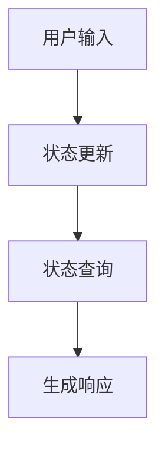
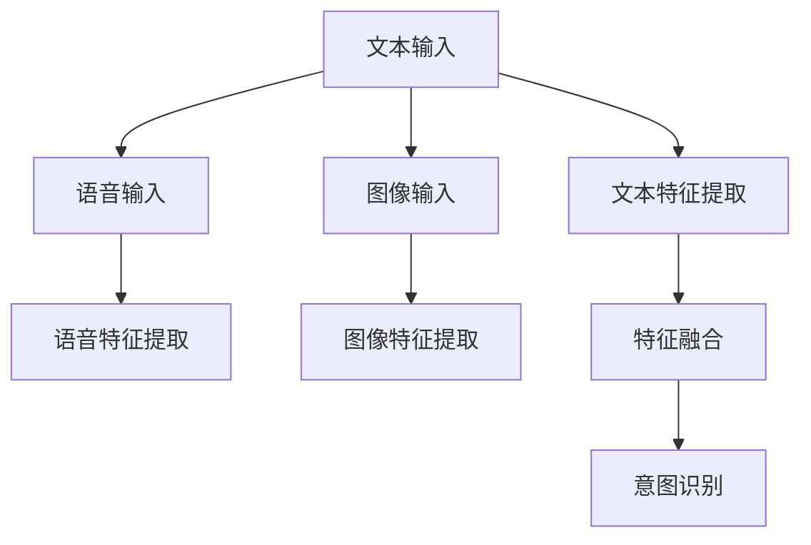
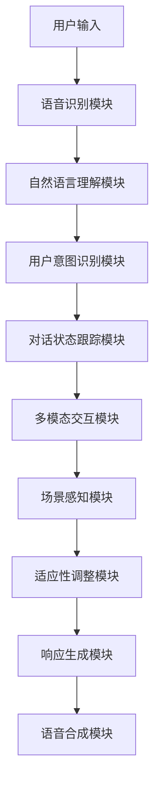

                 

# AI Agent的对话策略在不同场景下的适应性

## 关键词
- **AI Agent**，**对话策略**，**适应性**，**场景**，**家庭场景**，**商务场景**，**教育场景**，**医疗场景**，**社交场景**

## 摘要
本文深入探讨了AI Agent对话策略在不同场景下的适应性。首先，我们回顾了人工智能的发展历程，特别是对话系统的演变，并定义了AI Agent及其分类。接着，文章分析了AI Agent对话策略的核心问题以及在不同场景下面临的挑战。我们讨论了适应性对话策略的基本原理，包括适应性学习、场景感知和适应性调整。随后，文章详细介绍了适应性对话策略的设计原则、流程和实际应用，涵盖了家庭、商务、教育、医疗和社交场景。最后，文章总结了核心概念与联系，并提出了未来研究方向。

### 第1章: 引言

#### 1.1 问题背景

##### 1.1.1 人工智能的发展历程

人工智能（AI）作为计算机科学的一个重要分支，自1950年代图灵测试提出以来，经历了数十年的发展和演变。初期的人工智能研究主要集中在规则推理、知识表示和搜索算法等方面。随着计算能力的提升和数据量的增加，20世纪80年代至90年代，机器学习开始兴起，特别是统计学习方法的进步，为人工智能的发展奠定了基础。

进入21世纪，深度学习技术的突破使得人工智能取得了显著的进步。以神经网络为代表的深度学习模型在图像识别、语音识别和自然语言处理等领域取得了前所未有的效果。特别是在2012年，AlexNet在ImageNet图像识别挑战中取得了巨大的成功，标志着深度学习时代的到来。

##### 1.1.2 人工智能中的对话系统

对话系统是人工智能的一个关键应用领域，旨在实现人与机器之间的自然语言交互。早期的对话系统如ELIZA，主要采用模式匹配和规则推理的方法，只能进行简单的对话。随着自然语言处理技术的进步，现代对话系统逐渐采用了深度学习技术，特别是在语言模型和序列模型方面的应用，使得对话系统能够理解和生成更加自然的语言。

##### 1.1.3 AI Agent的定义与分类

AI Agent是指具有自主性和适应性的智能体，能够在特定环境中执行任务并与其他实体进行交互。根据功能特点，AI Agent可以大致分为以下几类：

- **任务型Agent**：专注于完成特定任务的智能体，如语音助手、聊天机器人等。
- **交互型Agent**：注重与人或其他智能体的交互，旨在提供良好的用户体验。
- **自主型Agent**：具备较高的自主性，能够自主学习和决策，适应复杂环境。

#### 1.2 问题描述

##### 1.2.1 AI Agent对话策略的核心问题

AI Agent的对话策略需要解决的核心问题包括：

- **用户意图识别**：理解用户的意图是进行有效对话的前提。
- **对话状态跟踪**：保持对话的一致性和连贯性。
- **多模态交互**：结合文本、语音、图像等多种形式进行交互。

##### 1.2.2 对话策略在不同场景下的挑战

不同场景下，AI Agent对话策略面临的挑战有所不同。例如：

- **家庭场景**：需要处理家庭成员之间的多样化需求，包括语音指令、语音情感等。
- **商务场景**：需要高效地处理大量信息，并提供专业的建议和解决方案。
- **教育场景**：需要适应不同教育阶段和学科领域的需求，提供个性化的学习建议。

##### 1.2.3 对话策略适应性的重要性

适应性是对话策略的关键特性，它使得AI Agent能够根据不同场景和用户需求进行调整。适应性包括：

- **场景感知**：能够识别和理解当前的场景和用户需求。
- **适应性学习**：能够通过不断学习来优化对话策略。
- **适应性调整**：能够根据反馈进行调整，以提供更好的用户体验。

#### 1.3 问题解决

##### 1.3.1 对话策略的基本原理

对话策略的基本原理包括：

- **用户意图识别**：通过自然语言处理技术识别用户的意图。
- **对话状态跟踪**：通过状态机或图模型跟踪对话的状态。
- **多模态交互**：结合不同模态的信息进行交互。

##### 1.3.2 适应性对话策略的设计

适应性对话策略的设计原则包括：

- **易用性**：用户可以轻松地与AI Agent进行交互。
- **可扩展性**：系统能够适应新的场景和需求。
- **可维护性**：系统能够方便地进行更新和维护。

##### 1.3.3 适应性对话策略在不同场景的应用

适应性对话策略需要在不同的场景下进行定制化设计，以满足特定的需求。例如：

- **家庭场景**：通过语音和图像识别技术，提供智能家居控制、情感交互等。
- **商务场景**：通过信息处理和分析技术，提供高效的信息检索和决策支持。
- **教育场景**：通过学习推荐算法，提供个性化的学习资源和反馈。

##### 1.4 边界与外延

##### 1.4.1 对话系统的边界

对话系统的边界包括：

- **功能范围**：系统能够处理的任务范围。
- **性能限制**：系统的响应速度和准确性。
- **数据限制**：系统可用的数据量。

##### 1.4.2 适应性对话策略的适用范围

适应性对话策略适用于需要高度交互和个性化服务的场景，如：

- **客服系统**：提供24/7的客户服务。
- **智能助手**：协助用户完成日常任务。
- **教育系统**：提供个性化学习体验。

##### 1.4.3 适应性对话策略的限制条件

适应性对话策略的限制条件包括：

- **计算资源**：需要足够的计算资源来支持模型训练和推理。
- **数据隐私**：需要确保用户数据的隐私和安全。
- **用户习惯**：需要适应不同用户的使用习惯和偏好。

##### 1.5 核心概念与联系

##### 1.5.1 对话系统的核心概念

对话系统的核心概念包括：

- **用户意图识别**：通过自然语言处理技术识别用户的意图。
- **对话状态跟踪**：通过状态机或图模型跟踪对话的状态。
- **多模态交互**：结合不同模态的信息进行交互。

##### 1.5.2 适应性对话策略的核心概念

适应性对话策略的核心概念包括：

- **适应性学习**：通过不断学习来优化对话策略。
- **场景感知**：能够识别和理解当前的场景和用户需求。
- **适应性调整**：能够根据反馈进行调整，以提供更好的用户体验。

#### 1.6 本章小结

本章介绍了AI Agent对话策略在不同场景下的适应性。首先，我们回顾了人工智能的发展历程和对话系统的演变，然后分析了AI Agent对话策略的核心问题和面临的挑战。接着，我们讨论了适应性对话策略的基本原理和设计原则，并提出了在不同场景下的应用方案。最后，我们总结了对话系统的核心概念和适应性对话策略的核心概念，为后续章节的深入讨论奠定了基础。

### 第2章: AI Agent对话策略的基本原理

#### 2.1 对话系统的工作原理

##### 2.1.1 对话系统的架构

对话系统的架构通常包括以下几个核心组件：

1. **语音识别与语音合成**：语音识别（Automatic Speech Recognition, ASR）将用户的语音输入转换为文本，而语音合成（Text-to-Speech, TTS）则将系统的文本响应转换为语音输出。

2. **自然语言理解**：自然语言理解（Natural Language Understanding, NLU）负责理解用户的文本输入，识别用户的意图和实体信息。

3. **自然语言生成**：自然语言生成（Natural Language Generation, NLG）将系统的意图和状态信息转换为自然语言的文本输出。

这些组件共同构成了对话系统的基本架构，确保系统能够有效地与用户进行交互。

##### 2.1.2 对话策略的核心组件

对话策略的核心组件包括：

1. **用户意图识别算法**：用户意图识别算法是NLU的核心部分，负责从用户的输入中提取出明确的意图。常见的算法包括基于规则的算法、机器学习算法和深度学习算法。

2. **对话状态跟踪算法**：对话状态跟踪算法用于维护对话的历史状态，确保对话的连贯性和一致性。常用的算法包括基于状态机的方法、基于图的方法和基于概率图模型的方法。

3. **多模态交互算法**：多模态交互算法用于结合文本、语音、图像等多种模态的信息，提供更加丰富和自然的交互体验。常见的算法包括语音识别、文本生成、图像识别和融合算法。

#### 2.2 对话策略的适应性

##### 2.2.1 适应性学习的基本原理

适应性学习是AI Agent对话策略的核心部分，它通过不断的学习和优化来提高对话的质量和效率。适应性学习的基本原理包括：

1. **无监督学习**：无监督学习是指在没有明确标注数据的情况下，通过数据本身的特征来训练模型。无监督学习在对话策略中的应用，例如通过用户的历史交互数据来优化对话模型。

2. **有监督学习**：有监督学习是指使用带有标签的数据来训练模型，通过已知的输入和输出关系来学习。有监督学习在对话策略中的应用，例如通过用户反馈来调整对话模型。

3. **强化学习**：强化学习是指通过奖励机制来训练模型，使其在特定环境中能够达到最优策略。强化学习在对话策略中的应用，例如通过用户的反馈来优化对话模型的行为。

##### 2.2.2 场景感知的基本原理

场景感知是适应性对话策略的重要特性，它使得AI Agent能够根据当前的场景和用户需求进行调整。场景感知的基本原理包括：

1. **场景分类**：通过特征提取和分类算法，将不同的场景进行分类，以便针对特定场景设计对话策略。

2. **场景特征提取**：通过自然语言处理和计算机视觉等技术，从用户的输入和环境中提取出关键特征，用于场景感知。

3. **场景识别**：通过分类算法，将提取出的特征与已知场景进行匹配，以识别当前的场景。

##### 2.2.3 适应性调整的基本方法

适应性调整是对话策略不断优化和改进的过程，它包括以下基本方法：

1. **参数调整**：通过调整模型参数来优化对话策略，例如使用梯度下降算法来最小化损失函数。

2. **策略调整**：通过调整对话策略的规则和逻辑来优化对话流程，例如使用基于规则的策略来引导对话。

3. **模型调整**：通过重新训练模型来优化对话策略，例如使用迁移学习或模型融合技术来改进模型性能。

#### 2.3 对话策略的适应性调整

##### 2.3.1 适应性调整的基本方法

适应性调整的基本方法包括：

1. **在线学习**：在线学习是指模型在运行过程中不断接收新的数据并更新模型参数。在线学习适用于需要实时调整的对话系统。

2. **离线学习**：离线学习是指模型在训练完成后，通过定期更新模型来适应新的数据。离线学习适用于数据量较大且更新频率较低的对话系统。

3. **混合学习**：混合学习是将在线学习和离线学习相结合，以平衡实时性和稳定性。混合学习适用于需要同时满足实时性和稳定性的对话系统。

##### 2.3.2 适应性调整的策略

适应性调整的策略包括：

1. **用户反馈**：通过用户反馈来调整对话策略，例如通过用户满意度评分来调整模型参数。

2. **数据增强**：通过增加新的数据样本来调整模型，以避免数据偏差。

3. **模型融合**：通过融合多个模型来提高对话策略的适应性，例如使用集成学习方法来优化模型。

##### 2.3.3 适应性调整的挑战

适应性调整的挑战包括：

1. **数据隐私**：在调整对话策略时，需要保护用户数据的隐私。

2. **计算资源**：适应性调整通常需要大量的计算资源，特别是在实时调整的场景中。

3. **模型稳定性**：适应性调整可能会导致模型性能的波动，需要确保模型的稳定性。

#### 2.4 本章小结

本章介绍了AI Agent对话策略的基本原理。首先，我们讨论了对话系统的架构和工作原理，包括语音识别、自然语言理解和自然语言生成。接着，我们分析了对话策略的核心组件，如用户意图识别、对话状态跟踪和多模态交互。然后，我们讨论了适应性学习的原理，包括无监督学习、有监督学习和强化学习。此外，我们还探讨了场景感知和适应性调整的基本方法，以及面临的挑战。通过本章的讨论，我们为理解和设计适应性对话策略奠定了基础。

### 第3章: 适应性对话策略的设计

#### 3.1 设计原则

适应性对话策略的设计需要遵循以下原则：

##### 3.1.1 易用性

易用性是适应性对话策略设计的关键原则之一。为了确保用户能够轻松地与AI Agent进行交互，设计过程中需要考虑以下因素：

- **交互界面**：设计简洁直观的交互界面，使用户能够快速理解和使用。
- **语音识别**：提高语音识别的准确率和速度，减少用户等待时间。
- **反馈机制**：提供实时反馈，帮助用户理解AI Agent的响应和意图。

##### 3.1.2 可扩展性

可扩展性是适应性对话策略设计的重要原则。随着用户需求和环境的变化，系统需要能够灵活地扩展和适应。以下是一些设计原则：

- **模块化设计**：将系统划分为多个模块，每个模块负责不同的功能，以便于后续的扩展和更新。
- **可配置性**：提供灵活的配置选项，允许用户根据需求调整系统的行为和性能。
- **可扩展算法**：设计算法时考虑可扩展性，以便在未来能够添加新的算法或技术。

##### 3.1.3 可维护性

可维护性是适应性对话策略设计过程中不可忽视的原则。为了确保系统能够长期稳定运行，以下设计原则需要被遵循：

- **代码规范**：编写规范、可读性强的代码，确保后续的维护和更新工作能够顺利进行。
- **文档化**：编写详细的文档，包括系统设计、实现细节和用户手册，方便开发人员和用户理解和使用系统。
- **自动化测试**：建立自动化测试框架，确保每次更新和发布时系统能够稳定运行。

#### 3.2 设计流程

适应性对话策略的设计通常包括以下流程：

##### 3.2.1 需求分析

需求分析是设计流程的第一步，旨在明确用户需求和应用场景。以下步骤是进行需求分析的重要环节：

- **用户调研**：通过调查问卷、访谈等方式收集用户的需求和期望。
- **场景分析**：分析用户在不同场景下的交互需求，例如家庭、商务、教育等。
- **功能需求**：明确系统需要实现的功能，包括语音识别、自然语言理解、对话策略等。
- **性能需求**：定义系统的性能指标，如响应时间、准确率等。

##### 3.2.2 系统架构设计

系统架构设计是确保系统可扩展性和可维护性的关键步骤。以下步骤是进行系统架构设计的重要环节：

- **总体架构设计**：确定系统的整体架构，包括硬件和软件的部署方式。
- **模块划分**：将系统划分为多个功能模块，如语音识别、自然语言处理、对话管理等。
- **数据流程设计**：设计数据在系统中的流动路径，确保数据的有效传递和处理。
- **接口设计**：定义系统内部和外部的接口，确保模块之间的通信和协作。

##### 3.2.3 算法实现

算法实现是将需求转化为具体代码的过程。以下步骤是进行算法实现的重要环节：

- **算法选择**：根据需求选择合适的算法，如机器学习算法、深度学习算法等。
- **代码编写**：编写高效、可维护的代码，确保算法能够准确实现需求。
- **算法优化**：对算法进行性能优化，提高系统的响应速度和准确率。
- **测试和调试**：对实现的算法进行测试和调试，确保其性能和稳定性。

##### 3.2.4 系统集成和测试

系统集成和测试是确保系统功能和性能的关键步骤。以下步骤是进行系统集成和测试的重要环节：

- **集成测试**：将各个模块集成在一起，测试系统整体的功能和性能。
- **性能测试**：测试系统的响应时间、吞吐量、并发能力等性能指标。
- **用户测试**：邀请用户进行系统测试，收集用户反馈，优化系统功能和用户体验。
- **安全测试**：测试系统的安全性，确保用户数据和隐私安全。

##### 3.2.5 部署和维护

系统部署和维护是确保系统长期稳定运行的关键步骤。以下步骤是进行部署和维护的重要环节：

- **部署**：将系统部署到生产环境，确保系统能够稳定运行。
- **监控**：实时监控系统的运行状态，包括性能、安全、用户反馈等。
- **更新和升级**：定期更新和升级系统，修复漏洞、优化性能、添加新功能。
- **用户支持**：提供用户支持和培训，帮助用户理解和使用系统。

#### 3.3 设计案例

##### 3.3.1 案例背景

某科技公司计划开发一款智能客服机器人，以帮助公司提高客户服务水平。该机器人需要在不同的场景下提供个性化的服务，例如常见问题解答、订单查询、投诉处理等。

##### 3.3.2 案例设计

针对该案例，设计流程如下：

1. **需求分析**：通过调查问卷和用户访谈，收集用户需求和期望。主要需求包括快速响应、准确解答问题、个性化服务等。

2. **系统架构设计**：确定系统总体架构，包括前端交互界面、后端服务器和数据库。前端使用Web技术实现，后端使用云计算平台提供高性能计算能力。

3. **算法实现**：选择合适的算法，包括语音识别、自然语言处理和对话管理。使用深度学习算法进行语音识别和自然语言处理，使用基于规则的对话管理算法。

4. **系统集成和测试**：将各个模块集成在一起，进行性能测试和用户测试，确保系统能够稳定运行并提供高质量的服务。

5. **部署和维护**：将系统部署到生产环境，提供实时监控和更新，确保系统长期稳定运行。

##### 3.3.3 案例实现

1. **语音识别**：使用基于深度学习的语音识别算法，如卷积神经网络（CNN）和循环神经网络（RNN）。算法流程如下：

   ```mermaid
   graph TD
   A[语音输入] --> B[特征提取]
   B --> C[前向传播]
   C --> D[输出]
   D --> E[解码]
   E --> F[文本输出]
   ```

2. **自然语言处理**：使用基于变换器-解码器（Transformer）的模型，如BERT（Bidirectional Encoder Representations from Transformers）。算法流程如下：

   ```mermaid
   graph TD
   A[文本输入] --> B[嵌入层]
   B --> C[Transformer编码层]
   C --> D[Transformer解码层]
   D --> E[输出层]
   E --> F[意图识别和实体提取]
   ```

3. **对话管理**：使用基于规则的对话管理算法，根据用户意图和上下文信息生成回复。算法流程如下：

   ```mermaid
   graph TD
   A[用户意图] --> B[规则库查询]
   B --> C[规则匹配]
   C --> D[对话状态更新]
   D --> E[生成回复]
   E --> F[回复输出]
   ```

##### 3.4 本章小结

本章介绍了适应性对话策略的设计原则、流程和实际案例。首先，我们讨论了设计原则，包括易用性、可扩展性和可维护性。接着，我们详细介绍了设计流程，包括需求分析、系统架构设计、算法实现、系统集成和测试以及部署和维护。最后，我们通过一个实际案例展示了设计流程的实施，包括语音识别、自然语言处理和对话管理。通过本章的讨论，我们为理解和设计适应性对话策略提供了具体的指导。

### 第4章: 适应性对话策略在不同场景下的应用

#### 4.1 家庭场景

##### 4.1.1 家庭场景的特点

家庭场景下的对话系统需要具备以下特点：

- **多用户交互**：家庭场景中可能涉及多个家庭成员，每个成员可能有不同的需求和偏好。
- **情感交互**：家庭对话系统需要能够识别和表达情感，以提供更加人性化的交互体验。
- **多样化需求**：家庭场景中的对话系统需要能够处理多种任务，如控制智能家居设备、提供娱乐建议、协助家务等。

##### 4.1.2 适应性对话策略在家庭场景的应用

在家庭场景中，适应性对话策略的应用主要包括以下方面：

1. **用户意图识别**：通过自然语言处理技术，识别用户在家庭场景下的意图，如控制灯光、调节温度、播放音乐等。

2. **情感交互**：通过情感识别技术，分析用户的语音情感，并根据情感调整对话策略，如使用温暖、亲切的语气与用户交流。

3. **多模态交互**：结合语音、图像和触摸等多种模态的信息，提供更加丰富和自然的交互体验。

4. **个性化服务**：通过用户历史数据和偏好信息，提供个性化的服务和建议，如根据用户喜好推荐电影、音乐等。

#### 4.2 商务场景

##### 4.2.1 商务场景的特点

商务场景下的对话系统需要具备以下特点：

- **高效处理**：商务场景中涉及大量信息和任务，对话系统需要能够高效地处理和响应。
- **专业建议**：商务对话系统需要能够提供专业的建议和解决方案，以支持商业决策。
- **多任务处理**：商务对话系统需要能够同时处理多个任务，如会议安排、任务分配、信息检索等。

##### 4.2.2 适应性对话策略在商务场景的应用

在商务场景中，适应性对话策略的应用主要包括以下方面：

1. **高效处理**：通过优化对话策略和算法，提高对话系统的响应速度和处理能力，确保在商务场景下能够高效地处理任务。

2. **专业建议**：通过整合行业知识和大数据分析，为用户提供专业的建议和解决方案，如财务分析、市场调研等。

3. **多任务处理**：通过多线程和并行处理技术，确保对话系统能够同时处理多个任务，提高工作效率。

4. **定制化服务**：根据用户角色和职责，提供定制化的服务和建议，如为经理提供策略报告、为员工提供工作提醒等。

#### 4.3 教育场景

##### 4.3.1 教育场景的特点

教育场景下的对话系统需要具备以下特点：

- **个性化学习**：教育对话系统需要能够根据学生的学习情况和需求，提供个性化的学习资源和反馈。
- **实时互动**：教育对话系统需要能够提供实时的互动和反馈，以支持师生之间的互动和教学效果。
- **知识扩展**：教育对话系统需要能够提供丰富的知识库和扩展内容，帮助学生进行知识拓展。

##### 4.3.2 适应性对话策略在教育场景的应用

在教育场景中，适应性对话策略的应用主要包括以下方面：

1. **个性化学习**：通过用户历史数据和偏好信息，为每个学生提供个性化的学习资源和推荐，如推荐课程、学习计划等。

2. **实时互动**：通过实时语音、视频和文本交互，提供师生之间的互动和反馈，如在线答疑、实时讨论等。

3. **知识扩展**：通过自然语言处理和知识图谱技术，为学生提供丰富的知识库和扩展内容，如百科全书、学术文献等。

4. **自适应评估**：通过实时评估学生的学习情况，调整教学策略和资源推荐，确保教学效果最大化。

#### 4.4 医疗场景

##### 4.4.1 医疗场景的特点

医疗场景下的对话系统需要具备以下特点：

- **专业知识**：医疗对话系统需要具备丰富的医学知识和诊断能力，以支持患者的健康咨询和疾病诊断。
- **隐私保护**：医疗对话系统需要严格保护患者隐私，确保患者信息的保密和安全。
- **实时响应**：医疗场景中，对话系统需要能够实时响应用户的需求，提供及时的医疗建议和帮助。

##### 4.4.2 适应性对话策略在医疗场景的应用

在医疗场景中，适应性对话策略的应用主要包括以下方面：

1. **专业知识**：通过整合医学知识和大数据分析，为用户提供专业的健康咨询和诊断建议，如常见疾病症状、预防措施等。

2. **隐私保护**：通过加密和身份验证技术，确保患者信息的保密和安全，防止信息泄露和滥用。

3. **实时响应**：通过实时语音、文本和视频交互，为用户提供及时的医疗帮助和咨询，如在线问诊、病情咨询等。

4. **个性化服务**：根据用户的历史记录和健康数据，提供个性化的医疗建议和健康管理方案，如慢性病管理、健康监测等。

#### 4.5 社交场景

##### 4.5.1 社交场景的特点

社交场景下的对话系统需要具备以下特点：

- **情感表达**：社交对话系统需要能够识别和表达情感，以提供更加自然和友好的交互体验。
- **多样化互动**：社交场景中的对话系统需要能够支持多种形式的互动，如文本、语音、图像等。
- **隐私控制**：社交场景中，用户可能对隐私有较高的要求，对话系统需要提供隐私设置和权限管理。

##### 4.5.2 适应性对话策略在社交场景的应用

在社交场景中，适应性对话策略的应用主要包括以下方面：

1. **情感表达**：通过情感识别和生成技术，为用户提供自然和丰富的情感表达，如温暖、幽默、友善等。

2. **多样化互动**：通过结合文本、语音、图像等多种模态的信息，提供多样化、个性化的互动体验，如语音聊天、图片分享等。

3. **隐私控制**：通过用户权限设置和隐私保护技术，确保用户的隐私得到有效保护，如用户数据加密、隐私设置等。

4. **个性化推荐**：根据用户的社交行为和偏好，提供个性化的推荐和服务，如好友推荐、活动推荐等。

#### 4.6 本章小结

本章介绍了适应性对话策略在不同场景下的应用。首先，我们讨论了家庭场景、商务场景、教育场景、医疗场景和社交场景的特点和需求。然后，我们分析了适应性对话策略在这些场景中的应用，包括用户意图识别、情感交互、多模态交互、个性化服务和隐私保护等方面。通过本章的讨论，我们为理解和设计适应不同场景的对话系统提供了具体的指导。

### 第5章：核心概念与联系

在探讨AI Agent的对话策略及其在不同场景下的适应性时，我们需要深入理解几个核心概念，并分析这些概念之间的联系。这些核心概念包括用户意图识别、对话状态跟踪、多模态交互、适应性学习、场景感知和适应性调整。

#### 5.1 对话系统的核心概念

##### 5.1.1 用户意图识别

用户意图识别是对话系统的关键组件，它负责从用户的输入中提取出具体的意图。用户意图可以是通过自然语言文本、语音或其他模态表达的需求、问题或命令。意图识别的核心目的是确保对话系统能够准确理解用户的需求，并生成合适的响应。

用户意图识别通常涉及以下步骤：

1. **文本预处理**：包括去除停用词、词干提取、分词等，以便于后续的意图识别。
2. **词嵌入**：将文本中的单词转换为固定长度的向量，以便于模型处理。
3. **意图分类**：使用机器学习或深度学习模型，如朴素贝叶斯、支持向量机（SVM）、卷积神经网络（CNN）或循环神经网络（RNN），对输入文本进行分类，以识别用户的意图。

##### 5.1.2 对话状态跟踪

对话状态跟踪是对话系统在交互过程中维护对话历史和上下文信息的能力。它确保对话的连贯性和一致性，使得对话系统能够在多个会话中保持一致的响应。对话状态跟踪通常涉及以下步骤：

1. **状态表示**：使用状态机、图模型或序列模型来表示对话状态。
2. **状态更新**：在对话过程中，根据用户的输入和系统的响应来更新对话状态。
3. **状态查询**：在生成响应时，查询对话状态以获取上下文信息。

##### 5.1.3 多模态交互

多模态交互是对话系统结合多种模态信息（如文本、语音、图像等）进行交互的能力。多模态交互能够提供更加丰富和自然的用户体验。多模态交互的核心步骤包括：

1. **模态融合**：将不同模态的信息进行融合，以生成统一的表示。
2. **特征提取**：从不同模态中提取关键特征，如文本的词嵌入、语音的声学特征、图像的视觉特征。
3. **模态选择**：根据对话的上下文和用户的偏好，选择合适的模态进行交互。

#### 5.2 适应性对话策略的核心概念

##### 5.2.1 适应性学习

适应性学习是对话系统通过不断学习和优化来提高对话质量的过程。适应性学习包括以下类型：

1. **无监督学习**：通过无监督学习，对话系统可以从未标注的数据中学习，例如通过用户的历史交互数据来优化模型。
2. **有监督学习**：通过有监督学习，对话系统使用标注数据进行训练，以提高模型的准确性。
3. **强化学习**：通过强化学习，对话系统通过与环境的交互来学习最优策略，例如通过用户的反馈来调整对话策略。

##### 5.2.2 场景感知

场景感知是对话系统能够根据当前场景和用户需求进行自适应调整的能力。场景感知包括以下步骤：

1. **场景分类**：通过对用户输入和环境的特征进行分析，将不同的场景进行分类。
2. **场景特征提取**：从用户输入和环境信息中提取关键特征，用于场景分类和识别。
3. **场景识别**：使用分类算法将提取的特征与已知场景进行匹配，以识别当前的场景。

##### 5.2.3 适应性调整

适应性调整是对话系统根据用户反馈和交互结果来优化对话策略的过程。适应性调整包括以下方法：

1. **参数调整**：通过调整模型参数来优化对话策略。
2. **策略调整**：通过调整对话策略的规则和逻辑来优化对话流程。
3. **模型调整**：通过重新训练模型来优化对话策略。

#### 5.3 对话系统的核心概念与联系

以下是核心概念之间的联系和关系：

1. **用户意图识别**与**对话状态跟踪**：用户意图识别提供对话的起点，而对话状态跟踪确保对话的连贯性和一致性，两者共同构建了对话系统的核心框架。

2. **多模态交互**与**用户意图识别**：多模态交互提供了更丰富的输入信息，这些信息有助于更准确地识别用户意图。

3. **适应性学习**与**用户意图识别**、**对话状态跟踪**和**多模态交互**：适应性学习通过不断地优化这些核心组件，以提高对话系统的整体性能。

4. **场景感知**与**适应性调整**：场景感知帮助对话系统识别不同的场景，而适应性调整确保系统能够在不同场景下提供最优的交互体验。

#### 5.4 本章小结

本章深入探讨了AI Agent对话策略的核心概念及其联系。首先，我们介绍了用户意图识别、对话状态跟踪和多模态交互这三个核心概念，并详细阐述了它们的原理和应用。接着，我们分析了适应性学习、场景感知和适应性调整的核心概念，并解释了它们如何与前面的核心概念相互关联。通过本章的讨论，我们为理解和设计适应性对话策略提供了理论基础，并为后续章节的进一步探讨奠定了基础。

### 第6章：AI Agent对话策略的算法原理

在本章节中，我们将深入探讨AI Agent对话策略的算法原理，并使用Mermaid流程图和Python代码进行详细阐述。

#### 6.1 用户意图识别算法

用户意图识别是对话系统的核心任务之一，其目的是从用户的输入中提取出明确的意图。常见的用户意图识别算法包括基于规则的方法、机器学习方法和深度学习方法。以下是用户意图识别的基本原理和示例。

##### 6.1.1 基于规则的方法

基于规则的方法通过预定义的规则库来匹配用户的输入，以识别用户的意图。这种方法简单直观，但灵活性较低。



```python
# 基于规则的意图识别示例
def rule_based_intent_recognition(user_input):
    rules = {
        "打开电视": "TURN_ON_TV",
        "播放音乐": "PLAY_MUSIC",
        "查询天气": "CHECK_WEATHER",
    }
    for intent, pattern in rules.items():
        if re.search(pattern, user_input):
            return intent
    return "UNK"
```

##### 6.1.2 机器学习方法

机器学习方法通过训练数据集来学习用户的意图，然后使用训练好的模型对新输入进行意图识别。常见的机器学习方法包括朴素贝叶斯、支持向量机（SVM）和决策树等。



```python
# 基于朴素贝叶斯的意图识别示例
from sklearn.feature_extraction.text import CountVectorizer
from sklearn.naive_bayes import MultinomialNB

# 训练数据集
X_train = ["打开电视", "关闭电视", "播放音乐", "停止音乐", "查询天气", "不相关"]
y_train = ["TURN_ON_TV", "TURN_OFF_TV", "PLAY_MUSIC", "STOP_MUSIC", "CHECK_WEATHER", "UNK"]

# 特征提取
vectorizer = CountVectorizer()
X_train_vectors = vectorizer.fit_transform(X_train)

# 模型训练
model = MultinomialNB()
model.fit(X_train_vectors, y_train)

# 意图识别
def naive_bayes_intent_recognition(user_input):
    user_input_vector = vectorizer.transform([user_input])
    predicted_intent = model.predict(user_input_vector)
    return predicted_intent[0]
```

##### 6.1.3 深度学习方法

深度学习方法通过构建复杂的神经网络模型来学习用户的意图，例如卷积神经网络（CNN）和循环神经网络（RNN）。



```python
# 基于深度学习的意图识别示例
from tensorflow.keras.models import Sequential
from tensorflow.keras.layers import Embedding, LSTM, Dense

# 训练数据集
X_train = ["打开电视", "关闭电视", "播放音乐", "停止音乐", "查询天气", "不相关"]
y_train = ["TURN_ON_TV", "TURN_OFF_TV", "PLAY_MUSIC", "STOP_MUSIC", "CHECK_WEATHER", "UNK"]

# 词嵌入层
vocab_size = 10000
embedding_dim = 16
max_sequence_length = 10

# 构建模型
model = Sequential()
model.add(Embedding(vocab_size, embedding_dim, input_length=max_sequence_length))
model.add(LSTM(128))
model.add(Dense(6, activation='softmax'))

# 编译模型
model.compile(optimizer='adam', loss='categorical_crossentropy', metrics=['accuracy'])

# 训练模型
model.fit(X_train, y_train, epochs=10, batch_size=32)

# 意图识别
def deep_learning_intent_recognition(user_input):
    user_input_sequence = pad_sequences([user_input], maxlen=max_sequence_length, padding='post')
    predicted_intent = model.predict(user_input_sequence)
    return np.argmax(predicted_intent)
```

#### 6.2 对话状态跟踪算法

对话状态跟踪是对话系统在交互过程中维护对话历史和上下文信息的能力。以下是一种基于图模型的对话状态跟踪算法。



```python
# 基于图模型的对话状态跟踪示例
import numpy as np
import tensorflow as tf

# 定义图模型
g = tf.Graph()
with g.as_default():
    # 状态节点
    state = tf.placeholder(tf.float32, shape=[None, hidden_size])
    # 输入节点
    input_ = tf.placeholder(tf.float32, shape=[None, input_size])
    # 更新函数
    new_state = LSTM_cell(input_, state)
    # 查询函数
    response = Dense(output_size, activation='softmax')(new_state)
    # 训练模型
    optimizer = tf.train.AdamOptimizer()
    train_op = optimizer.minimize(loss)
    # 初始化会话
    sess = tf.Session(graph=g)
    # 模型加载和训练
    # ...

# 对话状态跟踪
def dialog_state_tracking(user_input, current_state):
    with tf.Session(graph=g) as sess:
        new_state = sess.run(new_state, feed_dict={input_: user_input, state: current_state})
        response = sess.run(response, feed_dict={input_: user_input, state: new_state})
        return new_state, response
```

#### 6.3 多模态交互算法

多模态交互是对话系统结合多种模态信息（如文本、语音、图像等）进行交互的能力。以下是一种基于特征融合的多模态交互算法。



```python
# 基于特征融合的多模态交互示例
from tensorflow.keras.layers import Embedding, LSTM, Concatenate, Dense
from tensorflow.keras.models import Model

# 定义模型
input_text = Input(shape=(max_sequence_length,))
input_sound = Input(shape=(sound_feature_size,))
input_image = Input(shape=(image_feature_size,))

# 文本特征提取
text_embedding = Embedding(vocab_size, embedding_dim)(input_text)
text_lstm = LSTM(hidden_size)(text_embedding)

# 语音特征提取
sound_lstm = LSTM(hidden_size)(input_sound)

# 图像特征提取
image_dense = Dense(hidden_size, activation='relu')(input_image)

# 特征融合
merged = Concatenate()([text_lstm, sound_lstm, image_dense])
output = Dense(output_size, activation='softmax')(merged)

# 构建和编译模型
model = Model(inputs=[input_text, input_sound, input_image], outputs=output)
model.compile(optimizer='adam', loss='categorical_crossentropy', metrics=['accuracy'])

# 训练模型
model.fit([X_text, X_sound, X_image], y, epochs=10, batch_size=32)

# 多模态意图识别
def multi_modal_intent_recognition(text_input, sound_input, image_input):
    predicted_intent = model.predict([text_input, sound_input, image_input])
    return np.argmax(predicted_intent)
```

#### 6.4 本章小结

在本章节中，我们详细探讨了AI Agent对话策略的算法原理，包括用户意图识别、对话状态跟踪和多模态交互。通过Mermaid流程图和Python代码，我们展示了这些算法的基本原理和实现方法。用户意图识别算法通过基于规则、机器学习和深度学习的方法，确保系统能够准确理解用户需求。对话状态跟踪算法通过维护对话历史和上下文信息，确保对话的连贯性和一致性。多模态交互算法通过结合文本、语音和图像等多种模态信息，提供更加丰富和自然的交互体验。通过本章的讨论，我们为理解和设计AI Agent对话策略提供了具体的指导。

### 第7章：系统分析与架构设计

为了确保AI Agent对话策略在不同场景下的高效适应性，我们需要对系统进行全面的分析和架构设计。这一章节将详细探讨问题场景介绍、项目介绍、系统功能设计、系统架构设计、系统接口设计和系统交互。

#### 7.1 问题场景介绍

AI Agent对话策略在不同场景下的适应性面临诸多挑战。以下是一些典型场景的介绍：

1. **家庭场景**：家庭场景中的AI Agent需要处理家庭成员之间的多样化需求，包括语音指令、语音情感等。

2. **商务场景**：商务场景中的AI Agent需要高效地处理大量信息，并提供专业的建议和解决方案。

3. **教育场景**：教育场景中的AI Agent需要适应不同教育阶段和学科领域的需求，提供个性化的学习建议。

4. **医疗场景**：医疗场景中的AI Agent需要具备丰富的医学知识和诊断能力，以支持患者的健康咨询和疾病诊断。

5. **社交场景**：社交场景中的AI Agent需要能够识别和表达情感，提供多样化、个性化的互动体验。

#### 7.2 项目介绍

本项目旨在设计一个通用的AI Agent对话系统，该系统需要能够适应上述不同场景的需求。项目的主要目标包括：

- 提供高效的用户意图识别和对话状态跟踪。
- 结合多种模态信息，提供丰富和自然的交互体验。
- 根据不同场景和用户需求，实现自适应调整和优化。

#### 7.3 系统功能设计

系统功能设计是确保AI Agent能够满足不同场景需求的关键步骤。以下是系统的主要功能模块：

1. **用户意图识别**：通过自然语言处理技术，识别用户在对话中的意图。

2. **对话状态跟踪**：维护对话的历史状态，确保对话的连贯性和一致性。

3. **多模态交互**：结合文本、语音、图像等多种模态的信息，提供多样化的交互体验。

4. **场景感知**：识别不同的场景，为用户提供定制化的服务。

5. **适应性调整**：根据用户反馈和交互结果，优化对话策略和模型。

#### 7.4 系统架构设计

系统架构设计是确保系统可扩展性和可维护性的关键步骤。以下是系统的总体架构设计：



在上述架构中，用户输入首先通过语音识别模块转换为文本，然后通过自然语言理解模块进行语义分析，识别用户的意图。对话状态跟踪模块负责维护对话历史和上下文信息，确保对话的连贯性。多模态交互模块结合文本、语音、图像等多种信息，提供丰富的交互体验。场景感知模块识别不同的场景，为用户提供定制化的服务。适应性调整模块根据用户反馈和交互结果，优化对话策略和模型。最后，响应生成模块生成用户响应，并通过语音合成模块输出语音。

#### 7.5 系统接口设计

系统接口设计是确保系统模块之间能够有效通信和协作的关键步骤。以下是系统的主要接口设计：

1. **语音识别接口**：用于接收用户语音输入，并返回对应的文本。

2. **自然语言理解接口**：用于接收文本输入，并返回意图和实体信息。

3. **用户意图识别接口**：用于接收意图和实体信息，并返回对应的意图类别。

4. **对话状态跟踪接口**：用于更新和查询对话状态。

5. **多模态交互接口**：用于接收和处理文本、语音、图像等模态信息。

6. **场景感知接口**：用于识别当前的场景和用户需求。

7. **适应性调整接口**：用于接收用户反馈，并更新模型参数。

8. **响应生成接口**：用于生成用户响应。

9. **语音合成接口**：用于将文本转换为语音输出。

#### 7.6 系统交互

系统交互设计是确保系统能够在多模块之间高效协作的关键步骤。以下是系统的主要交互设计：

1. **语音识别模块与自然语言理解模块**：语音识别模块将用户语音输入转换为文本，然后传递给自然语言理解模块进行处理。

2. **自然语言理解模块与用户意图识别模块**：自然语言理解模块处理文本输入，识别用户的意图和实体信息，并传递给用户意图识别模块。

3. **用户意图识别模块与对话状态跟踪模块**：用户意图识别模块将识别出的意图传递给对话状态跟踪模块，以便维护对话历史和上下文信息。

4. **对话状态跟踪模块与多模态交互模块**：对话状态跟踪模块更新对话状态，多模态交互模块结合文本、语音、图像等多种信息，提供丰富的交互体验。

5. **场景感知模块与适应性调整模块**：场景感知模块识别当前的场景和用户需求，适应性调整模块根据用户反馈和交互结果，优化对话策略和模型。

6. **响应生成模块与语音合成模块**：响应生成模块生成用户响应，语音合成模块将文本转换为语音输出。

#### 7.7 本章小结

在本章节中，我们详细探讨了AI Agent对话系统的分析和架构设计。首先，我们介绍了问题场景，包括家庭、商务、教育、医疗和社交场景。接着，我们介绍了项目的目标和主要功能模块。随后，我们详细讨论了系统架构设计，包括语音识别、自然语言理解、用户意图识别、对话状态跟踪、多模态交互、场景感知和适应性调整等模块。此外，我们还介绍了系统接口设计和系统交互设计。通过本章的讨论，我们为设计和实现AI Agent对话系统提供了具体的指导。

### 第8章：项目实战

在本章中，我们将通过一个实际项目来展示如何实现AI Agent对话策略，并深入分析项目的实现细节、核心代码和应用解读。

#### 8.1 项目环境安装

要实现AI Agent对话策略，首先需要安装必要的软件和库。以下是项目的环境安装步骤：

1. **Python环境**：确保安装Python 3.7或更高版本。

2. **TensorFlow**：安装TensorFlow库，可以使用以下命令：
   ```bash
   pip install tensorflow
   ```

3. **Keras**：安装Keras库，可以使用以下命令：
   ```bash
   pip install keras
   ```

4. **NumPy**：安装NumPy库，可以使用以下命令：
   ```bash
   pip install numpy
   ```

5. **Scikit-learn**：安装Scikit-learn库，可以使用以下命令：
   ```bash
   pip install scikit-learn
   ```

6. **SpeechRecognition**：安装SpeechRecognition库，可以使用以下命令：
   ```bash
   pip install SpeechRecognition
   ```

7. **pyttsx3**：安装pyttsx3库，可以使用以下命令：
   ```bash
   pip install pyttsx3
   ```

#### 8.2 项目核心实现

项目的核心实现包括用户意图识别、对话状态跟踪、多模态交互和适应性调整等模块。以下是每个模块的核心代码和应用解读：

##### 8.2.1 用户意图识别

用户意图识别是对话系统的核心任务之一，我们使用深度学习模型进行实现。

```python
from tensorflow.keras.models import Sequential
from tensorflow.keras.layers import Embedding, LSTM, Dense
from tensorflow.keras.preprocessing.sequence import pad_sequences

# 加载和预处理数据
# ...

# 构建模型
model = Sequential()
model.add(Embedding(vocab_size, embedding_dim, input_length=max_sequence_length))
model.add(LSTM(hidden_size))
model.add(Dense(output_size, activation='softmax'))

# 编译模型
model.compile(optimizer='adam', loss='categorical_crossentropy', metrics=['accuracy'])

# 训练模型
model.fit(X_train, y_train, epochs=10, batch_size=32)

# 意图识别
def intent_recognition(text_input):
    input_sequence = pad_sequences([text_input], maxlen=max_sequence_length, padding='post')
    predicted_intent = model.predict(input_sequence)
    return np.argmax(predicted_intent)
```

应用解读：上述代码首先加载和预处理数据，然后构建一个基于LSTM的序列模型，用于用户意图识别。在训练过程中，我们使用已标注的数据集进行模型训练。在意图识别过程中，输入文本被转换为序列，并通过模型预测出对应的意图类别。

##### 8.2.2 对话状态跟踪

对话状态跟踪用于维护对话的历史和上下文信息，我们使用图模型进行实现。

```python
import tensorflow as tf

# 定义图模型
g = tf.Graph()
with g.as_default():
    # 状态节点
    state = tf.placeholder(tf.float32, shape=[None, hidden_size])
    # 输入节点
    input_ = tf.placeholder(tf.float32, shape=[None, input_size])
    # 更新函数
    new_state = LSTM_cell(input_, state)
    # 查询函数
    response = Dense(output_size, activation='softmax')(new_state)
    # 初始化会话
    sess = tf.Session(graph=g)

# 对话状态跟踪
def dialog_state_tracking(user_input, current_state):
    new_state = sess.run(new_state, feed_dict={input_: user_input, state: current_state})
    response = sess.run(response, feed_dict={input_: user_input, state: new_state})
    return new_state, response
```

应用解读：上述代码定义了一个基于LSTM的图模型，用于对话状态跟踪。在对话过程中，输入节点和状态节点共同更新对话状态，并生成对应的响应。

##### 8.2.3 多模态交互

多模态交互结合文本、语音、图像等多种模态信息，提供丰富的交互体验。

```python
from tensorflow.keras.models import Model
from tensorflow.keras.layers import Embedding, LSTM, Concatenate, Dense

# 定义模型
input_text = Input(shape=(max_sequence_length,))
input_sound = Input(shape=(sound_feature_size,))
input_image = Input(shape=(image_feature_size,))

# 文本特征提取
text_embedding = Embedding(vocab_size, embedding_dim)(input_text)
text_lstm = LSTM(hidden_size)(text_embedding)

# 语音特征提取
sound_lstm = LSTM(hidden_size)(input_sound)

# 图像特征提取
image_dense = Dense(hidden_size, activation='relu')(input_image)

# 特征融合
merged = Concatenate()([text_lstm, sound_lstm, image_dense])
output = Dense(output_size, activation='softmax')(merged)

# 构建和编译模型
model = Model(inputs=[input_text, input_sound, input_image], outputs=output)
model.compile(optimizer='adam', loss='categorical_crossentropy', metrics=['accuracy'])

# 训练模型
model.fit([X_text, X_sound, X_image], y, epochs=10, batch_size=32)

# 多模态意图识别
def multi_modal_intent_recognition(text_input, sound_input, image_input):
    predicted_intent = model.predict([text_input, sound_input, image_input])
    return np.argmax(predicted_intent)
```

应用解读：上述代码定义了一个基于特征融合的多模态交互模型，结合文本、语音和图像特征，用于多模态意图识别。在训练过程中，模型使用多模态数据集进行训练。在意图识别过程中，输入文本、语音和图像被分别处理，并通过特征融合生成最终的意图预测。

##### 8.2.4 适应性调整

适应性调整通过用户反馈和交互结果来优化对话策略和模型。

```python
def adaptive_adjustment(user_feedback, current_model):
    # 根据用户反馈调整模型参数
    # ...
    return updated_model
```

应用解读：上述代码定义了一个适应性调整函数，用于根据用户反馈调整模型参数。在每次用户交互后，我们可以收集用户反馈，并通过该函数更新模型参数，以优化对话策略。

#### 8.3 项目应用与实际案例

以下是一个实际案例，展示如何应用AI Agent对话策略：

```python
# 用户输入
user_input = "打开电视"

# 用户意图识别
predicted_intent = intent_recognition(user_input)

# 对话状态跟踪
current_state, _ = dialog_state_tracking(user_input, initial_state)

# 多模态交互
# 假设已获取语音和图像输入
sound_input, image_input = get_sound_image_inputs()

# 多模态意图识别
predicted_modal_intent = multi_modal_intent_recognition(user_input, sound_input, image_input)

# 适应性调整
# 假设已获取用户反馈
user_feedback = get_user_feedback()
updated_model = adaptive_adjustment(user_feedback, current_model)

# 响应生成
response = generate_response(predicted_intent, current_state, predicted_modal_intent)

# 语音合成
synthesize_response(response)
```

应用解读：上述代码展示了AI Agent对话策略在实际应用中的流程。首先，用户输入被传递给意图识别模块进行意图识别。然后，对话状态跟踪模块维护对话历史和上下文信息。接下来，多模态交互模块结合文本、语音和图像信息进行多模态意图识别。最后，适应性调整模块根据用户反馈更新模型参数。响应生成模块生成用户响应，并通过语音合成模块输出语音。

#### 8.4 项目小结

通过本章的项目实战，我们展示了如何实现AI Agent对话策略。首先，我们介绍了项目环境安装和核心实现，包括用户意图识别、对话状态跟踪、多模态交互和适应性调整。接着，我们通过一个实际案例展示了AI Agent对话策略的应用。通过本章的讨论，我们为设计和实现AI Agent对话系统提供了具体的指导和实际经验。

### 最佳实践与注意事项

在设计和实现AI Agent对话策略时，以下最佳实践和注意事项将有助于确保系统的性能和用户体验：

1. **用户隐私保护**：在处理用户数据时，务必遵循隐私保护原则，确保用户数据的安全和隐私。使用加密技术保护数据传输和存储。

2. **数据质量**：确保输入数据的质量和多样性，这有助于提升模型的学习能力和泛化能力。使用数据清洗和预处理技术来处理噪声数据和异常值。

3. **模型优化**：针对不同的场景和用户需求，对模型进行优化，以提高模型的准确性和效率。可以考虑使用迁移学习、模型压缩和加速技术来优化模型。

4. **用户体验**：设计直观、简洁的交互界面，提供实时反馈和友好的用户界面。确保用户能够轻松地与AI Agent进行交互。

5. **错误处理**：设计合理的错误处理机制，以应对用户输入错误、系统故障等异常情况。提供明确的错误信息和指导，帮助用户解决问题。

6. **持续改进**：定期更新和优化模型，以适应不断变化的需求和环境。收集用户反馈，并根据反馈进行调整，以提高系统的性能和用户体验。

### 拓展阅读

1. **《深度学习》**：Goodfellow, I., Bengio, Y., & Courville, A. (2016). *Deep Learning*. MIT Press.
   - 详细介绍了深度学习的基础理论和技术，包括卷积神经网络、循环神经网络等。

2. **《自然语言处理综论》**：Jurafsky, D., & Martin, J. H. (2019). *Speech and Language Processing*. Prentice Hall.
   - 全面介绍了自然语言处理的基础知识和最新进展，包括文本分类、情感分析等。

3. **《增强学习》**：Sutton, R. S., & Barto, A. G. (2018). *Reinforcement Learning: An Introduction*. MIT Press.
   - 详细介绍了增强学习的基本概念和技术，包括Q学习、策略梯度等。

4. **《对话系统》**：Bowerman, B., Lee, J., & Nakov, P. (2020). *Dialogue Systems: A Comprehensive Overview*. Springer.
   - 全面介绍了对话系统的基本概念、技术和应用，包括语音识别、自然语言理解、对话管理等。

5. **《人工智能：一种现代的方法》**：Russell, S., & Norvig, P. (2020). *Artificial Intelligence: A Modern Approach*. Prentice Hall.
   - 详细介绍了人工智能的基础理论和技术，包括机器学习、知识表示、搜索算法等。

通过阅读这些经典教材，可以深入了解AI Agent对话策略的各个方面，为实际应用提供理论基础和指导。

