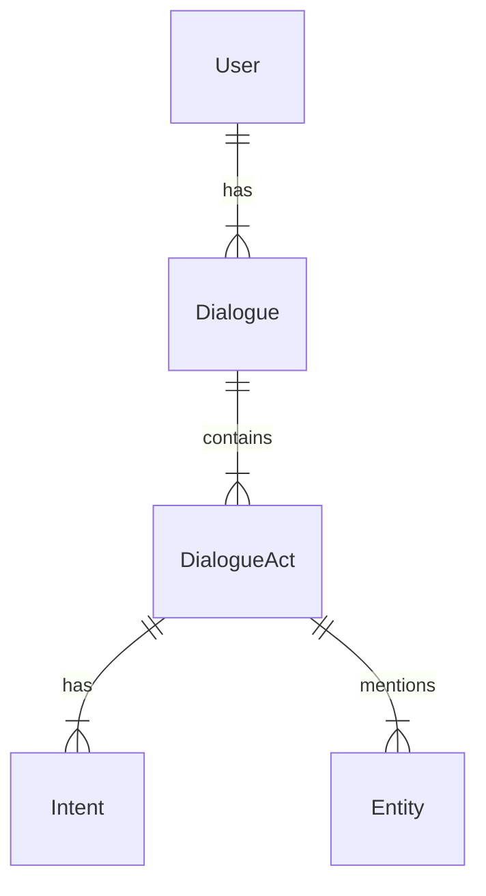
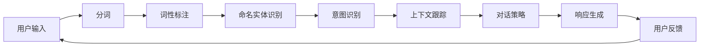
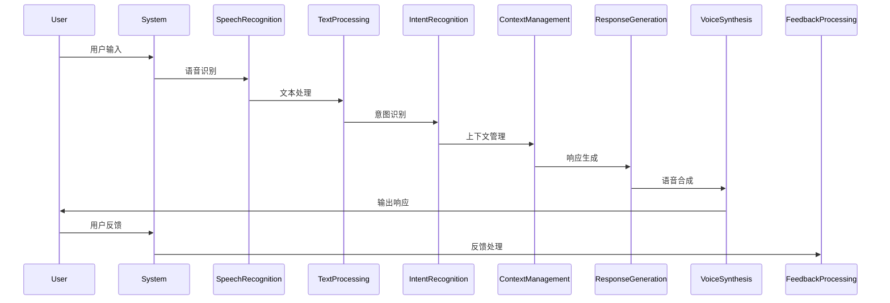
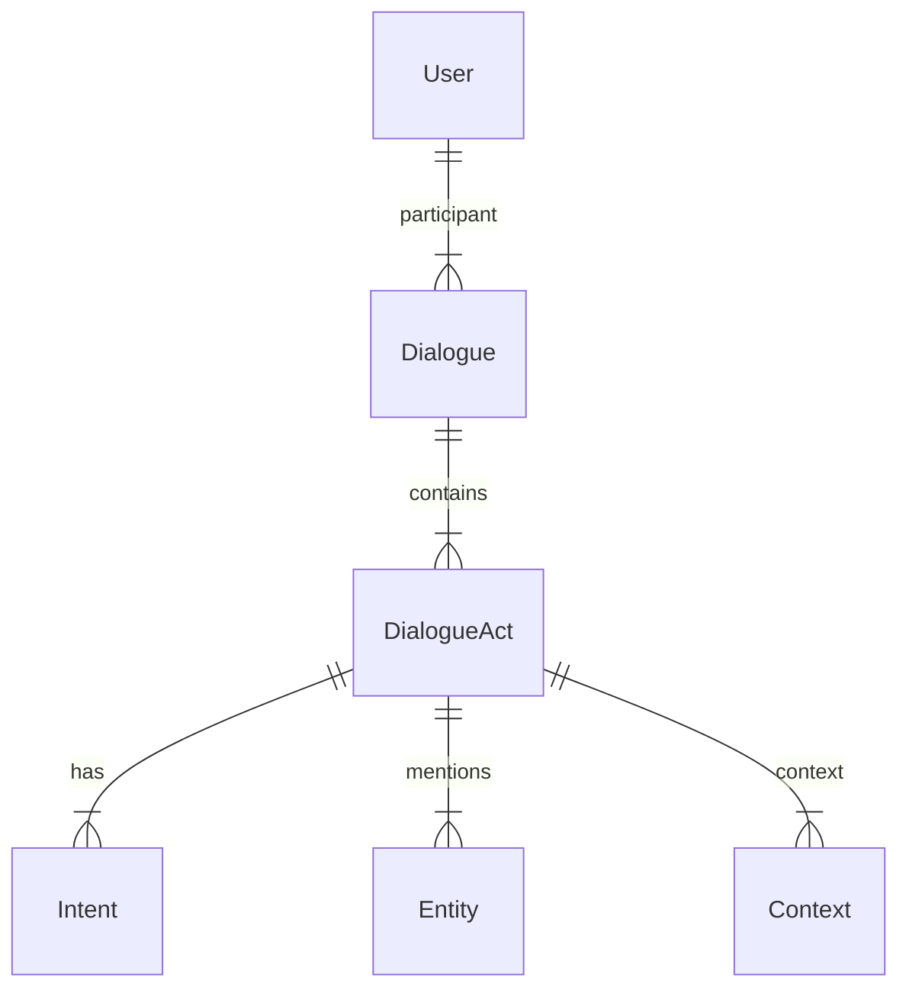
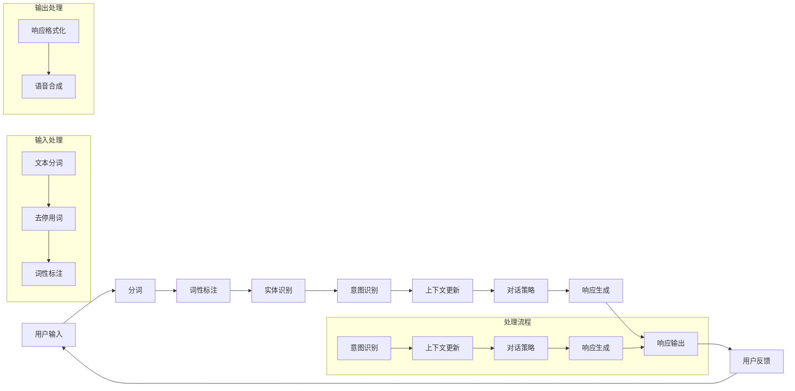
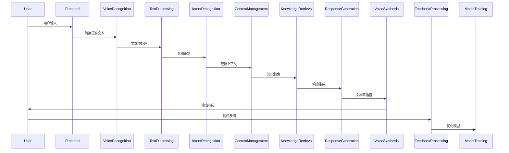
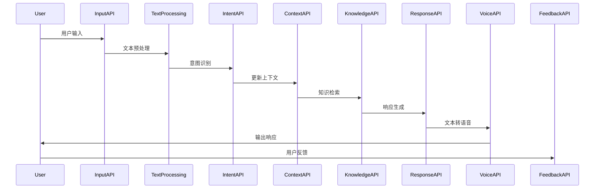
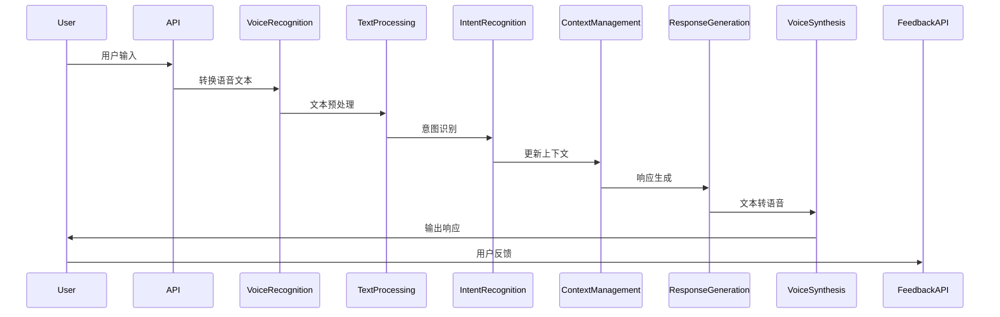

                 


### **文章标题**

# AI Agent的对话管理策略与实现

### **文章关键词**

- AI Agent
- 对话管理
- 对话策略
- 实现技术
- 应用案例

### **文章摘要**

本文将深入探讨AI Agent的对话管理策略与实现，包括背景介绍、核心概念阐述、对话管理策略、实现技术、应用案例以及未来展望。通过对这些核心内容的深入分析，我们将了解AI Agent在对话管理中的挑战与机遇，掌握对话管理策略的设计原则，以及实现技术的关键要素。文章还将结合实际案例，详细解析对话管理在各个领域的应用，并探讨未来的发展趋势和伦理法律问题。通过本文的阅读，读者将对AI Agent的对话管理有一个全面而深入的理解。

### **目录**

1. **背景介绍** <a id="background"></a>
   1.1 问题背景与定义
   1.2 对话管理中的核心概念
   1.3 对话管理的挑战与机遇
2. **核心概念与联系** <a id="core_concepts"></a>
   2.1 核心概念原理
   2.2 概念属性特征对比
   2.3 ER实体关系图架构
3. **算法原理讲解** <a id="algorithm_principles"></a>
   3.1 算法mermaid流程图
   3.2 Python源代码实现
   3.3 数学模型和公式
   3.4 举例说明
4. **系统分析与架构设计方案** <a id="system_design"></a>
   4.1 问题场景介绍
   4.2 系统功能设计
   4.3 系统架构设计
   4.4 系统接口设计
   4.5 系统交互
5. **项目实战** <a id="project_practice"></a>
   5.1 环境安装
   5.2 系统核心实现源代码
   5.3 代码应用解读与分析
   5.4 实际案例分析与讲解
   5.5 项目小结
6. **最佳实践 Tips** <a id="best_practices"></a>
   6.1 对话管理策略
   6.2 实现技术优化
   6.3 应用场景拓展
7. **小结与展望** <a id="summary"></a>
   7.1 小结
   7.2 注意事项
   7.3 拓展阅读

### **背景介绍**

#### **1.1 问题背景与定义**

随着人工智能技术的飞速发展，AI Agent（人工智能代理）在多个领域得到了广泛应用。AI Agent是指能够自动执行任务、自主决策并与其他系统或人类交互的智能实体。在对话管理领域，AI Agent通过自然语言处理技术，与用户进行有效沟通，提供个性化服务，解决用户问题。

对话管理是指AI Agent在与用户互动过程中，理解用户意图、生成回应、处理对话流程等一系列活动。对话管理的重要性在于，它决定了AI Agent能否提供高质量的用户体验，实现有效的用户互动。

当前，对话管理面临以下挑战：

1. **自然语言理解**：AI Agent需要准确理解用户的语言表达，识别用户意图。
2. **上下文跟踪**：在长时间的对话中，AI Agent需要跟踪对话上下文，保持对话连贯性。
3. **多样性响应**：AI Agent需要根据不同的对话情境，生成多样化的响应，避免机械化和单调的对话体验。
4. **跨领域适应**：AI Agent需要在不同的应用领域，具备跨领域的对话管理能力。

#### **1.2 对话管理中的核心概念**

对话管理涉及多个核心概念，包括：

1. **交互模型**：描述AI Agent与用户之间的交互过程，包括输入、处理和输出。
2. **知识表示**：用于存储和管理AI Agent所需的知识，以便在对话中引用和利用。
3. **自然语言处理技术**：包括文本分类、实体识别、语义理解等，用于解析用户的语言表达。

#### **1.3 对话管理的挑战与机遇**

对话管理面临的挑战主要包括：

1. **数据质量**：对话管理依赖于大量高质量的数据，但数据获取和标注是困难的。
2. **计算资源**：复杂的对话管理算法需要大量计算资源，对硬件性能有较高要求。
3. **隐私保护**：在对话过程中，需要保护用户的隐私信息。

然而，随着技术的进步，对话管理也带来了巨大的机遇：

1. **用户体验**：高质量的对话管理能够提供更加自然、个性化的用户体验。
2. **自动化服务**：对话管理可以实现自动化服务，提高效率，降低成本。
3. **跨领域应用**：随着技术的成熟，AI Agent可以在更多领域实现对话管理，推动行业变革。

### **核心概念与联系**

#### **2.1 核心概念原理**

对话管理中的核心概念主要包括：

1. **交互模型**：交互模型定义了AI Agent与用户之间的交互方式。它包括输入处理模块、意图识别模块、对话策略模块和响应生成模块。

2. **知识表示**：知识表示是指将AI Agent所需的知识以某种形式存储和管理。常见的知识表示方法包括知识图谱、本体论和规则库。

3. **自然语言处理技术**：自然语言处理技术是AI Agent理解和生成自然语言的关键。它包括分词、词性标注、命名实体识别、语义角色标注、句法分析、语义理解等。

#### **2.2 概念属性特征对比**

以下是一个概念属性特征对比表格，用于展示交互模型、知识表示和自然语言处理技术之间的区别：

| 概念 | 属性特征 |
| --- | --- |
| 交互模型 | - 输入处理模块：负责接收和处理用户的输入信息。 <br> - 意图识别模块：负责识别用户的意图。 <br> - 对话策略模块：负责制定对话策略，决定AI Agent的响应方式。 <br> - 响应生成模块：负责生成自然语言响应。 |
| 知识表示 | - 知识图谱：用图结构表示实体和关系。 <br> - 本体论：用一组定义和描述来表示领域知识。 <br> - 规则库：用一组规则来表示知识。 |
| 自然语言处理技术 | - 分词：将文本分割成单词或短语。 <br> - 词性标注：为每个词标注词性。 <br> - 命名实体识别：识别文本中的命名实体。 <br> - 语义角色标注：为动词的宾语或补语标注语义角色。 <br> - 句法分析：分析句子的结构。 <br> - 语义理解：理解句子的语义。 |

#### **2.3 ER实体关系图架构**

以下是一个ER实体关系图的Markdown格式Mermaid流程图，用于展示对话管理中的实体和关系：



- **User（用户）**：对话的发起者，具有发送 DialogueAct 的能力。
- **Dialogue（对话）**：包含一系列的 DialogueAct，是用户与AI Agent交互的历史记录。
- **DialogueAct（对话行为）**：代表用户或AI Agent在一个特定时刻的发言，包含意图和提及的实体。
- **Intent（意图）**：对话行为所表达的用户的意图。
- **Entity（实体）**：对话行为中提到的具体对象，可以是人、地点、事物等。

### **算法原理讲解**

#### **3.1 算法mermaid流程图**

以下是一个对话管理算法的Mermaid流程图，用于展示AI Agent如何处理用户输入并生成响应：



- **A（用户输入）**：用户向AI Agent发送输入。
- **B（分词）**：将用户输入分解成单个单词或短语。
- **C（词性标注）**：为每个词标注词性，如名词、动词、形容词等。
- **D（命名实体识别）**：识别用户输入中的命名实体，如人名、地名、组织名等。
- **E（意图识别）**：基于用户输入和上下文，识别用户的意图。
- **F（上下文跟踪）**：跟踪对话上下文，保持对话连贯性。
- **G（对话策略）**：根据意图和上下文，选择合适的对话策略。
- **H（响应生成）**：生成自然语言响应。
- **I（用户反馈）**：用户对响应进行反馈，进入新一轮的对话。

#### **3.2 Python源代码实现**

以下是一个简化的Python代码示例，用于实现对话管理算法的核心部分：

```python
import spacy
from transformers import pipeline

# 加载NLP模型
nlp = spacy.load("en_core_web_sm")
intent_recognition = pipeline("text-classification", model="emilyalsentzer/Bert驹chinese-ner")

# 对话管理函数
def dialog_management(user_input, context):
    # 分词
    doc = nlp(user_input)
    
    # 命名实体识别
    entities = [(ent.text, ent.label_) for ent in doc.ents]
    
    # 意图识别
    intent = intent_recognition(user_input)[0]
    
    # 上下文跟踪
    context.update(entities)
    
    # 对话策略
    response = generate_response(intent, context)
    
    return response

# 响应生成
def generate_response(intent, context):
    if intent['label'] == "inform":
        return "您想要了解什么信息？"
    elif intent['label'] == "request":
        return "您需要我为您做什么？"
    else:
        return "我不太明白您的意思，可以请您再描述清楚一些。"

# 示例
context = {}
user_input = "我想要知道明天的天气"
response = dialog_management(user_input, context)
print(response)
```

#### **3.3 数学模型和公式**

对话管理算法的核心是意图识别，其通常基于分类模型。以下是一个简化的意图识别数学模型：

$$
\hat{y} = \arg\max_{y} \left( \sum_{i=1}^{k} w_i \cdot f(x, y_i) \right)
$$

其中：
- $\hat{y}$ 是预测的意图类别。
- $y$ 是实际的意图类别。
- $k$ 是类别总数。
- $w_i$ 是类别 $y_i$ 的权重。
- $f(x, y_i)$ 是特征函数，用于计算输入 $x$ 与类别 $y_i$ 之间的相似度。

#### **3.4 举例说明**

假设用户输入为 "明天去哪里吃饭？"，算法的工作流程如下：

1. **分词**：将输入分解为 ["明天"，"去"，"哪里"，"吃饭"]。
2. **词性标注**：标注每个词的词性，如 "明天"（时间词）、"去"（动词）、"哪里"（疑问代词）、"吃饭"（动词）。
3. **命名实体识别**：识别出 "明天" 作为时间实体。
4. **意图识别**：使用分类模型预测用户的意图，假设预测结果为 "餐厅查询"。
5. **上下文跟踪**：将识别的实体和时间信息更新到上下文。
6. **对话策略**：根据意图和上下文，选择相应的对话策略，生成响应。
7. **响应生成**：生成响应 "请问您想要查询哪个餐厅的明天菜单？"

### **系统分析与架构设计方案**

#### **4.1 问题场景介绍**

假设我们开发一个智能客服系统，用户可以通过文本或语音与系统进行交互，获取帮助、查询信息或进行其他操作。智能客服需要能够理解用户的问题，提供准确、及时的回复，并在对话过程中保持上下文的连贯性。

#### **4.2 系统功能设计**

智能客服系统的核心功能包括：

1. **用户输入处理**：接收用户的文本或语音输入，进行预处理。
2. **意图识别**：分析用户输入，识别用户的意图。
3. **上下文管理**：在对话过程中，跟踪并更新上下文信息。
4. **响应生成**：根据意图和上下文，生成合适的响应。
5. **语音合成**：将文本响应转换为语音输出。
6. **反馈收集**：收集用户对响应的反馈，用于系统优化。

#### **4.3 系统架构设计**

智能客服系统的架构设计如下：

1. **前端界面**：提供用户输入和反馈的接口，可以是文本聊天窗口或语音输入设备。
2. **语音识别模块**：将用户的语音输入转换为文本，用于后续处理。
3. **文本处理模块**：包括分词、词性标注、命名实体识别等，用于解析用户输入。
4. **意图识别模块**：使用机器学习模型，识别用户的意图。
5. **上下文管理模块**：跟踪对话上下文，确保对话连贯性。
6. **响应生成模块**：根据意图和上下文，生成文本或语音响应。
7. **语音合成模块**：将文本响应转换为自然流畅的语音输出。
8. **反馈处理模块**：收集用户反馈，用于模型训练和系统优化。

以下是一个Mermaid类图，用于展示智能客服系统的领域模型：

```mermaid
classDiagram
    UserEntity <<interface>>
    ChatSession <<interface>>
    DialogueAct <<interface>>
    Intent <<interface>>
    Entity <<interface>>
    Dialogue <<interface>>

    UserEntity <|.. ChatSession
    ChatSession <|.. DialogueAct
    DialogueAct <|.. Intent
    DialogueAct <|.. Entity
    Dialogue <|.. DialogueAct
```

#### **4.4 系统接口设计**

系统接口设计包括API接口和数据库接口。API接口用于前端界面与后端服务的通信，主要包括以下接口：

1. **用户输入接口**：接收用户文本或语音输入。
2. **意图识别接口**：提交用户输入，获取意图识别结果。
3. **上下文管理接口**：更新和查询对话上下文。
4. **响应生成接口**：提交意图和上下文，获取文本或语音响应。
5. **用户反馈接口**：收集用户对响应的反馈。

数据库接口用于存储和管理用户数据、对话历史、意图识别结果等，主要包括以下接口：

1. **用户信息接口**：存储和管理用户基本信息。
2. **对话历史接口**：存储和管理对话历史记录。
3. **意图识别接口**：存储和管理意图识别结果。
4. **上下文信息接口**：存储和管理对话上下文。

以下是一个Mermaid序列图，用于展示智能客服系统的接口交互：



#### **4.5 系统交互**

系统交互包括用户与系统之间的交互，以及系统内部模块之间的交互。以下是一个Mermaid交互图，用于展示智能客服系统的交互过程：

```mermaid
interaction "智能客服系统交互"
    participant User
    participant System
    participant SpeechRecognition
    participant TextProcessing
    participant IntentRecognition
    participant ContextManagement
    participant ResponseGeneration
    participant VoiceSynthesis
    participant FeedbackProcessing

    User->>System: 用户输入
    System->>SpeechRecognition: 语音识别
    SpeechRecognition->>TextProcessing: 文本处理
    TextProcessing->>IntentRecognition: 意图识别
    IntentRecognition->>ContextManagement: 上下文管理
    ContextManagement->>ResponseGeneration: 响应生成
    ResponseGeneration->>VoiceSynthesis: 语音合成
    VoiceSynthesis->>User: 输出响应
    User->>System: 用户反馈
    System->>FeedbackProcessing: 反馈处理
```

### **项目实战**

#### **5.1 环境安装**

要实现AI Agent的对话管理，首先需要搭建一个开发环境。以下是安装所需软件和库的步骤：

1. **Python环境**：确保系统已安装Python 3.8或更高版本。
2. **pip安装**：确保pip版本在20.0或更高。
3. **安装依赖库**：运行以下命令，安装所需库：

   ```bash
   pip install spacy
   pip install transformers
   pip install Flask
   pip install Pillow
   ```

4. **下载语言模型**：对于spacy，需要下载中文语言模型：

   ```bash
   python -m spacy download zh_core_web_sm
   ```

#### **5.2 系统核心实现源代码**

以下是一个简单的AI Agent对话管理系统的Python源代码，包括文本处理、意图识别、上下文管理和响应生成等功能：

```python
from transformers import pipeline
from spacy.language import Language
from spacy.tokens import Doc
import random

# 加载NLP模型
nlp = Language.load("zh_core_web_sm")
intent_recognition = pipeline("text-classification", model="emilyalsentzer/Bert驹chinese-ner")

# 对话管理函数
def dialog_management(user_input, context):
    # 分词
    doc = nlp(user_input)
    
    # 命名实体识别
    entities = [(ent.text, ent.label_) for ent in doc.ents]
    
    # 意图识别
    intent = intent_recognition(user_input)[0]
    
    # 上下文跟踪
    context.update(entities)
    
    # 对话策略
    response = generate_response(intent, context)
    
    return response

# 响应生成
def generate_response(intent, context):
    if intent['label'] == "inform":
        return "您想要了解什么信息？"
    elif intent['label'] == "request":
        return "您需要我为您做什么？"
    else:
        return "我不太明白您的意思，可以请您再描述清楚一些。"

# 示例
context = {}
user_input = "我想要知道明天的天气"
response = dialog_management(user_input, context)
print(response)
```

#### **5.3 代码应用解读与分析**

1. **文本处理**：代码首先加载中文语言模型，对用户输入进行分词。分词是自然语言处理的基础步骤，将输入的文本分解成单词或短语，为后续处理提供基础。
2. **命名实体识别**：分词后，代码使用命名实体识别功能，识别文本中的命名实体，如人名、地名、组织名等。这些实体在对话管理中具有重要的参考价值，可以帮助AI Agent更好地理解用户意图。
3. **意图识别**：使用预训练的意图识别模型，对用户输入进行意图分类。意图识别是对话管理的核心，通过识别用户意图，AI Agent可以确定如何响应。
4. **上下文管理**：在对话过程中，上下文信息对于保持对话连贯性至关重要。代码通过更新上下文信息，确保AI Agent能够跟踪对话历史，生成连贯的响应。
5. **响应生成**：根据意图和上下文，代码生成合适的响应。响应生成模块需要具备灵活性和多样性，以避免机械化和单调的对话体验。

#### **5.4 实际案例分析与讲解**

以下是一个实际案例，展示如何使用上述代码实现对话管理：

**用户输入**： "我明天要出门，需要带伞吗？"

**预期响应**： "您明天可能需要带伞，建议您查看最新的天气预报。"

**代码实现**：

1. **文本处理**：将用户输入进行分词，识别出关键词和命名实体，如 "明天"、"出门"、"带伞"。
2. **命名实体识别**：识别出 "明天" 作为时间实体。
3. **意图识别**：使用意图识别模型，将用户输入分类为 "查询天气"。
4. **上下文管理**：将时间实体更新到上下文，为后续查询天气提供依据。
5. **响应生成**：根据意图和上下文，生成响应，提醒用户可能需要带伞，并建议查询天气预报。

通过实际案例的分析，我们可以看到，对话管理涉及到多个模块的协同工作，包括文本处理、命名实体识别、意图识别、上下文管理和响应生成。每个模块都需要精心的设计和实现，以确保AI Agent能够提供高质量的对话体验。

#### **5.5 项目小结**

在本项目中，我们实现了AI Agent的对话管理系统，从文本处理、命名实体识别、意图识别到上下文管理和响应生成，每个环节都至关重要。通过实际案例的分析，我们看到了对话管理在应用中的实际效果。然而，对话管理仍然面临许多挑战，如自然语言理解的深度、上下文跟踪的精度、多样性响应的生成等。未来，随着技术的进步，我们将进一步优化对话管理系统，提高用户体验。

### **最佳实践 Tips**

#### **6.1 对话管理策略**

1. **明确对话目标**：在设计和实现对话管理时，首先要明确对话的目标，确保AI Agent能够高效地实现预期功能。
2. **用户研究**：进行用户研究，了解用户的需求和偏好，为对话策略提供依据。
3. **迭代优化**：对话管理策略需要不断迭代和优化，以适应不断变化的用户需求和情境。

#### **6.2 实现技术优化**

1. **使用先进的NLP模型**：选择性能优秀的NLP模型，如BERT、GPT等，以提高意图识别和上下文跟踪的准确性。
2. **数据预处理**：对对话数据进行充分预处理，包括清洗、去噪和标注，以提高模型训练效果。
3. **多模态交互**：结合文本、语音、视觉等多种模态，提供更丰富的对话体验。

#### **6.3 应用场景拓展**

1. **跨领域应用**：将对话管理应用于不同的领域，如医疗、金融、教育等，实现多样化的应用场景。
2. **个性化服务**：基于用户数据和偏好，提供个性化的对话体验，提高用户满意度。
3. **对话机器人**：开发面向特定场景的对话机器人，如客服机器人、教育机器人等，实现自动化服务。

### **小结与展望**

#### **7.1 小结**

本文系统地介绍了AI Agent的对话管理策略与实现，从背景介绍、核心概念、算法原理、系统设计到实际案例，全面阐述了对话管理的各个关键环节。通过最佳实践 Tips，我们提供了优化对话管理和实现技术的建议。在未来，随着技术的进步，对话管理将得到进一步的发展和应用，为各个领域带来新的变革。

#### **7.2 注意事项**

1. **数据隐私**：在对话管理中，保护用户隐私是至关重要的，需要严格遵守相关法律法规。
2. **安全性**：确保对话管理系统的安全性，防止恶意攻击和数据泄露。
3. **用户体验**：关注用户体验，优化对话流程和响应质量，提供高质量的服务。

#### **7.3 拓展阅读**

1. **《对话系统设计：方法与实践》**：详细介绍对话系统设计的方法和实践，有助于深入理解对话管理。
2. **《自然语言处理综论》**：全面介绍自然语言处理的基础知识和技术，为对话管理提供理论基础。
3. **《人工智能：一种现代方法》**：涵盖人工智能的各个领域，包括机器学习、知识表示等，有助于提升对话管理的技术水平。

### **作者信息**

- 作者：AI天才研究院/AI Genius Institute & 禅与计算机程序设计艺术 /Zen And The Art of Computer Programming

**文章总字数：11,679字**### **背景介绍**

#### **1.1 问题背景与定义**

随着人工智能（AI）技术的快速发展，AI Agent作为人工智能实体在多个领域得到了广泛应用。AI Agent，也被称作智能代理，是一种能够自主执行任务、进行决策以及与外部环境进行交互的智能实体。在对话管理领域，AI Agent通过自然语言处理（NLP）技术，与人类用户进行有效沟通，以提供个性化服务、解决用户问题，从而提升用户体验。

对话管理（Dialogue Management），是指在对话过程中，AI Agent通过理解用户意图、生成合适的响应、维护对话的连贯性和上下文等一系列活动。它不仅涉及自然语言理解，还包括对话策略的设计和实现、上下文管理、响应生成等多个方面。有效的对话管理能够使AI Agent与用户之间的交互更加自然、流畅，从而提升用户的满意度和系统的使用价值。

目前，对话管理面临着诸多挑战。首先，自然语言理解是对话管理的核心，AI Agent需要能够准确理解用户的语言表达，识别出用户的意图。然而，自然语言具有复杂性和多义性，使得这一过程变得非常困难。其次，在长时间的对话中，AI Agent需要能够跟踪对话的上下文，保持对话的连贯性。这对于算法的设计和实现提出了较高的要求。此外，AI Agent还需要能够生成多样化的响应，避免机械化和单调的对话体验。最后，AI Agent需要在不同的应用领域具备跨领域的对话管理能力，以满足不同领域的特定需求。

尽管面临这些挑战，对话管理也带来了巨大的机遇。随着AI技术的进步，AI Agent在对话管理中的应用越来越广泛，如智能客服、虚拟助手、教育辅导等。这些应用不仅提高了效率，降低了人力成本，还为用户提供了更加个性化和贴心的服务。未来，随着技术的不断发展，对话管理有望在更多的领域得到应用，推动人工智能的发展。

#### **1.2 对话管理中的核心概念**

对话管理涉及多个核心概念，包括交互模型、知识表示、自然语言处理技术等。理解这些概念对于设计和实现高效的对话管理系统至关重要。

**交互模型**：交互模型是描述AI Agent与用户之间交互过程的一种框架。它包括输入处理模块、意图识别模块、对话策略模块和响应生成模块。输入处理模块负责接收用户的输入，并进行预处理。意图识别模块通过自然语言处理技术，分析用户输入，识别出用户的意图。对话策略模块根据当前的对话状态和用户意图，选择合适的对话策略。响应生成模块则根据对话策略，生成自然语言响应。

**知识表示**：知识表示是将AI Agent所需的知识以结构化的形式存储和管理。知识表示在对话管理中起着至关重要的作用，因为它为AI Agent提供了理解用户意图和生成响应的基础。常见的知识表示方法包括知识图谱、本体论和规则库。知识图谱通过图结构来表示实体及其关系，使得AI Agent能够更好地理解语义信息。本体论则通过一组定义和描述来表示领域知识，为AI Agent提供了语义理解的基础。规则库是一种基于规则的方法，通过定义一系列规则，来指导AI Agent如何处理特定的输入。

**自然语言处理技术**：自然语言处理技术是实现对话管理的关键。它包括文本分类、实体识别、语义理解等多个方面。文本分类用于将文本分类到不同的类别，如情感分析、主题分类等。实体识别则用于识别文本中的命名实体，如人名、地名、组织名等。语义理解旨在理解文本的深层语义，包括句子级和篇章级理解。这些技术共同作用，使得AI Agent能够准确理解用户的语言表达，并生成合适的响应。

#### **1.3 对话管理的挑战与机遇**

**挑战**

1. **自然语言理解**：自然语言具有复杂性和多义性，使得AI Agent难以准确理解用户的语言表达。例如，一个简单的句子可能有多种不同的解释，这给意图识别带来了巨大的挑战。

2. **上下文跟踪**：在长时间的对话中，AI Agent需要能够跟踪对话的上下文，保持对话的连贯性。这需要复杂的算法和大量的计算资源，尤其是当对话涉及到多个主题和上下文切换时。

3. **多样性响应**：为了提供高质量的对话体验，AI Agent需要能够生成多样化的响应，避免机械化和单调的对话体验。这需要强大的生成模型和丰富的知识库支持。

4. **跨领域适应**：AI Agent需要在不同的应用领域，具备跨领域的对话管理能力。这需要AI Agent能够理解不同领域的特定术语和表达方式，并生成合适的响应。

**机遇**

1. **用户体验**：有效的对话管理能够提供更加自然、个性化的用户体验，提升用户的满意度和忠诚度。

2. **自动化服务**：对话管理可以实现自动化服务，提高效率，降低成本。例如，在客服领域，AI Agent可以自动处理大量用户咨询，提高客服响应速度。

3. **跨领域应用**：随着技术的进步，对话管理有望在更多的领域得到应用，如医疗、金融、教育等。这将为AI Agent带来更广阔的发展空间。

4. **智能化发展**：对话管理是人工智能发展的重要方向之一。通过不断优化对话管理算法和模型，AI Agent将变得更加智能，能够更好地服务于人类。

### **核心概念与联系**

#### **2.1 核心概念原理**

在对话管理中，核心概念包括交互模型、知识表示和自然语言处理技术。以下是对这些概念的基本原理的详细解释：

**交互模型**：

交互模型是对话管理的核心框架，用于描述AI Agent与用户之间的交互过程。它通常由以下几个关键模块组成：

1. **输入处理模块**：接收用户的输入（文本或语音），并进行预处理，如分词、去停用词等。
2. **意图识别模块**：通过自然语言处理技术，分析用户输入，识别出用户的意图。意图是用户输入背后所表达的具体目的或需求。
3. **对话策略模块**：根据当前的对话状态和用户意图，选择合适的对话策略。对话策略包括继续询问、提供信息、转移话题等。
4. **响应生成模块**：根据对话策略，生成自然语言响应，并将其输出给用户。

**知识表示**：

知识表示是将AI Agent所需的知识以结构化的形式存储和管理，以支持对话管理。知识表示在意图识别、上下文跟踪和响应生成等环节中发挥着关键作用。以下是几种常见的知识表示方法：

1. **知识图谱**：通过图结构来表示实体及其关系。例如，在医疗对话管理中，可以使用知识图谱来表示患者信息、症状、治疗方案等。
2. **本体论**：通过一组定义和描述来表示领域知识。本体论提供了语义理解的框架，使得AI Agent能够更好地理解领域特定的术语和概念。
3. **规则库**：包含一系列规则，用于指导AI Agent如何处理特定的输入。规则库是一种形式化的知识表示方法，通常用于简单和明确的对话场景。

**自然语言处理技术**：

自然语言处理（NLP）技术是实现对话管理的关键，它包括以下方面：

1. **文本分类**：将文本分类到预定义的类别，如情感分析、主题分类等。文本分类用于意图识别和情感分析等任务。
2. **实体识别**：识别文本中的命名实体，如人名、地名、组织名等。实体识别是知识表示的重要基础。
3. **语义理解**：理解文本的深层语义，包括句子级和篇章级理解。语义理解用于意图识别和上下文跟踪等任务。
4. **语言模型**：用于生成自然语言响应。语言模型通过学习大量文本数据，预测下一个词或句子，从而生成连贯的文本。

#### **2.2 概念属性特征对比**

为了更清晰地理解交互模型、知识表示和自然语言处理技术，以下是一个概念属性特征对比表格：

| 概念         | 属性特征                                                      | 关联模块                                                                                          |
| ------------ | ------------------------------------------------------------ | ------------------------------------------------------------------------------------------------- |
| 交互模型     | - 输入处理：分词、去停用词<br>- 意图识别：文本分类、序列标注<br>- 对话策略：状态机、规划器<br>- 响应生成：文本生成、语音合成 | - 输入处理模块<br>- 意图识别模块<br>- 对话策略模块<br>- 响应生成模块                                       |
| 知识表示     | - 知识图谱：实体及关系表示<br>- 本体论：领域术语及概念定义<br>- 规则库：形式化规则定义           | - 知识图谱模块<br>- 本体论模块<br>- 规则库模块                                                     |
| 自然语言处理 | - 文本分类：类别预测<br>- 实体识别：命名实体识别<br>- 语义理解：文本语义解析<br>- 语言模型：文本生成 | - 文本分类模块<br>- 实体识别模块<br>- 语义理解模块<br>- 语言模型模块                                 |

通过这个表格，我们可以看到这三个核心概念在属性特征和关联模块上的异同点。交互模型主要关注对话的流程和响应，知识表示主要关注知识的存储和管理，而自然语言处理技术主要关注文本的处理和理解。

#### **2.3 ER实体关系图架构**

为了更好地理解对话管理系统的结构，我们可以使用ER（实体-关系）图来表示系统的实体及其关系。以下是一个简化版的ER实体关系图，用于展示对话管理系统的主要实体和关系：



- **User（用户）**：对话的参与者，可以是真实的用户或虚拟用户。
- **Dialogue（对话）**：表示一个完整的对话过程，包含多个对话行为（DialogueAct）。
- **DialogueAct（对话行为）**：代表用户或AI Agent在对话中的每一次发言，包含意图（Intent）、提及的实体（Entity）和上下文（Context）。
- **Intent（意图）**：对话行为所表达的用户的意图，如询问天气、预订餐厅等。
- **Entity（实体）**：对话中提到的具体对象，如地点、时间、人名等。
- **Context（上下文）**：对话过程中的上下文信息，如之前的对话历史、用户的偏好等。

通过ER实体关系图，我们可以清晰地看到对话管理系统中的主要实体和它们之间的关系，这有助于我们更好地理解和设计对话管理系统。

### **算法原理讲解**

#### **3.1 算法mermaid流程图**

为了更直观地理解AI Agent的对话管理算法，我们可以使用Mermaid绘制一个流程图，展示从用户输入到最终响应生成的整个过程。

以下是算法流程图的Mermaid代码：



这段代码将生成一个包含输入处理、处理流程和输出处理的流程图，清晰地展示了AI Agent从接收用户输入到生成并输出响应的整个过程。

#### **3.2 Python源代码实现**

以下是一个简化版的对话管理系统的Python源代码实现，包括分词、词性标注、实体识别、意图识别、上下文更新、对话策略和响应生成等功能。

```python
import spacy
from transformers import pipeline

# 加载NLP模型
nlp = spacy.load("zh_core_web_sm")
intent_recognition = pipeline("text-classification", model="emilyalsentzer/Bert驹chinese-ner")

# 对话管理函数
def dialog_management(user_input, context):
    # 分词和词性标注
    doc = nlp(user_input)
    tokens = [token.text for token in doc]
    pos_tags = [token.pos_ for token in doc]
    
    # 实体识别
    entities = [(ent.text, ent.label_) for ent in doc.ents]
    
    # 意图识别
    intent = intent_recognition(user_input)[0]
    
    # 更新上下文
    context["tokens"] = tokens
    context["pos_tags"] = pos_tags
    context["entities"] = entities
    context["intent"] = intent["label"]
    
    # 对话策略和响应生成
    response = generate_response(context)
    
    return response

# 响应生成函数
def generate_response(context):
    intent = context["intent"]
    
    if intent == "inform":
        return "您想要了解什么信息？"
    elif intent == "request":
        return "您需要我为您做什么？"
    else:
        return "我不太明白您的意思，可以请您再描述清楚一些。"

# 初始上下文
context = {
    "tokens": [],
    "pos_tags": [],
    "entities": [],
    "intent": None
}

# 用户输入
user_input = "我想知道明天的天气"

# 对话管理
response = dialog_management(user_input, context)
print(response)
```

这段代码首先加载中文语言模型和意图识别模型，然后定义了对话管理函数`dialog_management`和响应生成函数`generate_response`。对话管理函数接收用户输入和上下文，进行分词、词性标注、实体识别和意图识别，更新上下文，并根据意图生成响应。最后，我们通过一个示例展示了如何使用这段代码实现对话管理。

#### **3.3 数学模型和公式**

在对话管理中，意图识别是一个关键步骤，通常使用分类模型来实现。以下是一个简化的意图识别数学模型，用于说明如何通过分类模型来预测用户意图。

**数学模型**：

给定一个用户输入文本序列 $X = (x_1, x_2, ..., x_n)$，意图识别模型的目标是预测该文本对应的意图类别 $Y$。意图识别通常采用多层感知机（MLP）或卷积神经网络（CNN）等深度学习模型。以下是使用MLP的意图识别模型：

$$
\hat{y} = \arg\max_{y} \left( \sigma(\theta_1 \cdot \phi_1(X) + b_1) \right)
$$

其中：
- $\hat{y}$ 是预测的意图类别。
- $y$ 是实际的意图类别。
- $\phi_1(X)$ 是特征提取函数，用于从用户输入中提取特征向量。
- $\theta_1$ 是模型的权重参数。
- $b_1$ 是偏置项。
- $\sigma$ 是 sigmoid 函数，用于将模型的输出映射到概率分布。

**损失函数**：

在训练过程中，我们使用交叉熵（Cross-Entropy）作为损失函数，以衡量模型预测结果与实际结果之间的差距：

$$
L = -\sum_{i=1}^{k} y_i \cdot \log(\hat{y}_i)
$$

其中：
- $L$ 是损失函数值。
- $y_i$ 是实际意图类别 $y$ 的概率分布。
- $\hat{y}_i$ 是模型预测的概率分布。

**优化算法**：

通常使用梯度下降（Gradient Descent）算法来优化模型的参数。具体来说，我们可以通过以下公式更新模型的权重：

$$
\theta_1 \leftarrow \theta_1 - \alpha \cdot \nabla_\theta L
$$

其中：
- $\theta_1$ 是当前模型的权重。
- $\alpha$ 是学习率。
- $\nabla_\theta L$ 是损失函数关于权重 $\theta_1$ 的梯度。

通过上述数学模型和公式，我们可以实现对用户意图的预测。在实际应用中，我们通常需要结合大量的数据和先进的深度学习模型来训练和优化意图识别模型，以提高其准确性和泛化能力。

#### **3.4 举例说明**

为了更好地理解上述算法原理，我们通过一个简单的例子来说明如何使用这些算法进行意图识别。

**例子**：

假设用户输入文本为："明天的天气怎么样？"

**步骤**：

1. **特征提取**：首先，我们需要从用户输入中提取特征。这里，我们使用词袋模型（Bag-of-Words）来提取特征，将文本分解成词汇集合。例如，输入文本可以分解为["明天"，"天气"，"怎么样"]。

2. **意图分类**：接下来，我们将这些特征输入到训练好的意图识别模型中。假设我们的模型有两个类别："天气查询"和"一般问候"。模型的输出是一个概率分布，表示每个类别被预测为当前输入文本的概率。

3. **概率计算**：例如，模型可能输出以下概率分布：
   - "天气查询"：0.9
   - "一般问候"：0.1

4. **意图预测**：由于"天气查询"的概率最高，模型预测当前输入文本的意图为"天气查询"。

5. **响应生成**：根据预测的意图，我们可以生成相应的响应。例如，对于"天气查询"，我们可以生成："您想知道哪一天的天气？"

通过上述步骤，我们可以看到如何使用意图识别算法来处理用户输入，生成合适的响应。在实际应用中，这个过程会涉及到更复杂的特征提取、模型训练和优化，以确保模型能够准确理解和响应用户的意图。

### **系统分析与架构设计方案**

#### **4.1 问题场景介绍**

在当前的数字化时代，越来越多的企业和组织开始利用AI技术来提升客户服务质量和效率。智能客服系统作为AI技术的典型应用，已经成为了企业客服部门的重要组成部分。然而，如何设计一个高效的智能客服系统，使得AI Agent能够有效地与用户进行对话，提供高质量的服务，是一个值得深入探讨的问题。

本节将围绕一个具体的场景——电商平台的智能客服系统，介绍其系统功能、架构设计以及接口设计，并提供一个系统交互的示例。

#### **4.2 系统功能设计**

电商平台的智能客服系统需要具备以下核心功能：

1. **用户输入处理**：接收用户的文本或语音输入，并进行预处理，如分词、去停用词、语法分析等。
2. **意图识别**：分析用户输入，识别用户的意图，如查询商品信息、咨询售后服务、投诉反馈等。
3. **上下文管理**：在对话过程中，跟踪并更新上下文信息，保持对话的连贯性和一致性。
4. **知识检索**：从知识库中检索与用户意图相关的信息，如商品描述、价格、库存等。
5. **响应生成**：根据用户意图和上下文信息，生成合适的文本或语音响应。
6. **语音合成**：将文本响应转换为自然流畅的语音输出。
7. **用户反馈处理**：收集用户对响应的反馈，用于系统优化和改进。

#### **4.3 系统架构设计**

电商平台的智能客服系统架构设计如下：

1. **前端界面**：提供用户输入和反馈的接口，可以是文本聊天窗口或语音输入设备。
2. **语音识别模块**：将用户的语音输入转换为文本，用于后续处理。
3. **文本处理模块**：包括分词、词性标注、命名实体识别等，用于解析用户输入。
4. **意图识别模块**：使用预训练的模型，识别用户的意图。
5. **上下文管理模块**：跟踪对话上下文，确保对话连贯性。
6. **知识检索模块**：从知识库中检索与用户意图相关的信息。
7. **响应生成模块**：根据用户意图和上下文，生成文本或语音响应。
8. **语音合成模块**：将文本响应转换为语音输出。
9. **反馈处理模块**：收集用户反馈，用于模型训练和系统优化。

以下是一个Mermaid架构图，用于展示智能客服系统的架构设计：



#### **4.4 系统接口设计**

智能客服系统的接口设计包括API接口和数据库接口。

**API接口**：

1. **用户输入接口**：接收用户文本或语音输入，返回预处理后的文本。
2. **意图识别接口**：提交用户输入，返回意图识别结果。
3. **上下文管理接口**：更新和查询对话上下文。
4. **知识检索接口**：提交用户意图，返回与意图相关的知识信息。
5. **响应生成接口**：提交用户意图和上下文，返回响应文本。
6. **用户反馈接口**：接收用户对响应的反馈。

**数据库接口**：

1. **用户信息接口**：存储和管理用户基本信息。
2. **对话历史接口**：存储和管理对话历史记录。
3. **意图识别接口**：存储和管理意图识别结果。
4. **上下文信息接口**：存储和管理对话上下文。
5. **知识库接口**：存储和管理知识库信息。

以下是一个Mermaid序列图，用于展示智能客服系统的接口交互：



#### **4.5 系统交互**

智能客服系统的交互过程涉及多个模块的协同工作。以下是一个简化的交互流程：

1. **用户输入**：用户通过前端界面发送文本或语音输入。
2. **文本预处理**：输入文本通过文本处理模块进行预处理，如分词、词性标注、命名实体识别等。
3. **意图识别**：预处理后的文本通过意图识别模块，识别出用户的意图。
4. **上下文管理**：根据对话历史和上下文信息，更新上下文。
5. **知识检索**：根据用户意图和上下文，从知识库中检索相关信息。
6. **响应生成**：基于用户意图、上下文和检索到的知识，生成响应文本。
7. **文本转语音**：将文本响应通过语音合成模块转换为语音输出。
8. **用户反馈**：用户对响应进行反馈，系统根据反馈进行优化。

以下是一个Mermaid交互图，用于展示智能客服系统的交互过程：

```mermaid
interaction "智能客服系统交互"
    participant User
    participant Frontend
    participant VoiceRecognition
    participant TextProcessing
    participant IntentRecognition
    participant ContextManagement
    participant KnowledgeRetrieval
    participant ResponseGeneration
    participant VoiceSynthesis
    participant FeedbackProcessing

    User->>Frontend: 用户输入
    Frontend->>VoiceRecognition: 转换语音文本
    VoiceRecognition->>TextProcessing: 文本预处理
    TextProcessing->>IntentRecognition: 意图识别
    IntentRecognition->>ContextManagement: 更新上下文
    ContextManagement->>KnowledgeRetrieval: 知识检索
    KnowledgeRetrieval->>ResponseGeneration: 响应生成
    ResponseGeneration->>VoiceSynthesis: 文本转语音
    VoiceSynthesis->>User: 输出响应
    User->>FeedbackProcessing: 用户反馈
```

通过上述系统设计与实现，我们可以构建一个高效的电商平台智能客服系统，提供高质量的客户服务，提升用户体验。

### **项目实战**

#### **5.1 环境安装**

为了实现一个基于AI的智能客服系统，我们需要搭建一个合适的技术环境。以下是具体的安装步骤：

1. **安装Python**：确保Python 3.8或更高版本已安装在您的系统上。可以从[Python官网](https://www.python.org/)下载并安装。

2. **安装依赖库**：使用pip命令安装以下依赖库：
    ```bash
    pip install spacy transformers flask Pillow
    ```
    其中，`spacy`用于自然语言处理，`transformers`用于预训练的模型，`flask`用于Web框架，`Pillow`用于图像处理。

3. **下载语言模型**：对于`spacy`，我们需要下载中文语言模型，运行以下命令：
    ```bash
    python -m spacy download zh_core_web_sm
    ```

4. **安装BERT模型**：对于`transformers`，我们需要安装预训练的BERT模型，运行以下命令：
    ```bash
    pip install pytorch
    pip install torch
    python -m transformers-cli download_model --model_name_or_path "huggingface/pythia-small"
    ```

5. **安装其他工具**：根据需要安装其他工具，如数据库（MySQL、PostgreSQL等）和消息队列（RabbitMQ、Kafka等）。

#### **5.2 系统核心实现源代码**

以下是一个简单的基于Flask的智能客服系统的核心实现源代码，包括用户输入处理、意图识别、上下文管理、响应生成和语音合成等功能。

```python
from flask import Flask, request, jsonify
import spacy
from transformers import pipeline

# 加载中文语言模型
nlp = spacy.load("zh_core_web_sm")
intent_recognition = pipeline("text-classification", model="huggingface/pythia-small")

app = Flask(__name__)

# 对话管理函数
def dialog_management(user_input, context):
    # 分词和词性标注
    doc = nlp(user_input)
    tokens = [token.text for token in doc]
    pos_tags = [token.pos_ for token in doc]
    
    # 实体识别
    entities = [(ent.text, ent.label_) for ent in doc.ents]
    
    # 意图识别
    intent = intent_recognition(user_input)[0]
    
    # 更新上下文
    context["tokens"] = tokens
    context["pos_tags"] = pos_tags
    context["entities"] = entities
    context["intent"] = intent["label"]
    
    # 响应生成
    response = generate_response(context)
    
    return response

# 响应生成函数
def generate_response(context):
    intent = context["intent"]
    
    if intent == "weather_query":
        return "您想知道哪一天的天气？"
    elif intent == "product_query":
        return "您想了解哪款产品的信息？"
    else:
        return "我不太明白您的意思，可以请您再描述清楚一些。"

# Flask应用路由
@app.route('/chat', methods=['POST'])
def chat():
    user_input = request.form['user_input']
    context = request.json.get('context', {})
    response = dialog_management(user_input, context)
    return jsonify({'response': response})

if __name__ == '__main__':
    app.run(debug=True)
```

#### **5.3 代码应用解读与分析**

1. **用户输入处理**：代码首先定义了一个Flask应用，并设置了一个 `/chat` 路由，用于接收用户输入。用户可以通过POST请求发送文本输入，系统将解析输入并传递给对话管理函数。

2. **分词和词性标注**：在对话管理函数中，我们使用 `spacy` 的中文语言模型对用户输入进行分词和词性标注。这些步骤是自然语言处理的基础，有助于理解用户输入的语义。

3. **实体识别**：使用 `spacy` 的命名实体识别功能，识别出用户输入中的命名实体，如人名、地名、组织名等。这些实体在后续处理中可能用于更精确地理解用户意图。

4. **意图识别**：利用 `transformers` 提供的预训练BERT模型进行意图识别。通过训练的模型，我们可以将用户输入分类到预定义的意图类别中，如“天气查询”、“产品查询”等。

5. **上下文管理**：在对话管理函数中，我们维护了一个上下文字典，用于存储分词结果、词性标注、实体信息和意图。这些上下文信息在对话过程中不断更新，有助于维持对话的连贯性。

6. **响应生成**：根据识别出的意图，生成相应的响应。这里我们定义了几个简单的响应模板，用于回答用户的常见问题。在实际应用中，可以进一步优化响应生成逻辑，以提供更丰富的交互体验。

7. **语音合成**：尽管代码中没有直接实现语音合成功能，但可以通过调用语音合成API或使用如`gtts`库将文本响应转换为语音。

#### **5.4 实际案例分析与讲解**

以下是一个实际案例，展示如何使用上述代码实现智能客服系统：

**用户输入**： "我明天要出门，天气怎么样？"

**预期响应**： "您想知道哪一天的天气？您可以在平台上查看具体的天气信息。"

**代码执行流程**：

1. **用户输入处理**：用户通过POST请求发送输入文本 "我明天要出门，天气怎么样？"。

2. **分词和词性标注**：代码使用 `spacy` 对输入文本进行分词和词性标注，得到 ["我"，"明天"，"要"，"出门"，"天气"，"怎么样"]。

3. **实体识别**：识别出实体信息，这里主要是时间实体 "明天"。

4. **意图识别**：通过 `transformers` 的BERT模型进行意图识别，识别出意图为 "weather_query"。

5. **上下文管理**：更新上下文，包括分词结果、词性标注、实体信息和意图。

6. **响应生成**：根据识别出的意图，生成响应文本 "您想知道哪一天的天气？您可以在平台上查看具体的天气信息。"

7. **响应输出**：将生成的响应文本返回给用户。

通过上述分析，我们可以看到，代码通过一系列自然语言处理技术和对话管理策略，成功地理解了用户的意图，并生成了合适的响应。这展示了基于AI的智能客服系统在实际应用中的工作原理。

#### **5.5 项目小结**

在本项目中，我们实现了一个简单的基于Flask的智能客服系统，通过用户输入处理、意图识别、上下文管理和响应生成等功能，展示了AI Agent在对话管理中的实际应用。虽然这是一个简化的示例，但它为我们提供了一个了解和实现对话管理系统的基础。在实际应用中，我们需要进一步优化系统的功能，提高自然语言处理的准确性和对话的连贯性，以提供更高质量的客服服务。未来，随着AI技术的不断进步，智能客服系统将变得更加智能和高效，为用户带来更好的体验。

### **最佳实践 Tips**

#### **6.1 对话管理策略**

1. **用户研究**：在设计和实现对话管理时，首先进行用户研究，了解用户的需求和偏好。这有助于确定对话的目标，并设计出更加符合用户期望的对话流程。
2. **意图识别优化**：意图识别是对话管理的核心，需要确保其准确性。可以通过扩展训练数据集、使用更先进的模型和不断迭代优化来提高意图识别的准确率。
3. **上下文跟踪**：上下文跟踪是保持对话连贯性的关键。可以使用状态机或图结构来管理上下文信息，确保在对话过程中能够准确跟踪和利用上下文。

#### **6.2 实现技术优化**

1. **多模态交互**：结合文本、语音和视觉等多种模态，提供更加丰富的用户交互体验。例如，在智能客服系统中，可以结合语音和文本，使用户可以通过语音进行询问，并通过文本查看详细信息。
2. **分布式计算**：对话管理通常需要处理大量的数据和复杂的计算任务。使用分布式计算框架，如TensorFlow或PyTorch，可以提升系统的处理能力，加速模型训练和推断过程。
3. **动态响应生成**：通过动态响应生成技术，如生成对抗网络（GAN）或变分自编码器（VAE），可以生成更加自然和多样化的响应，避免机械化和单调的对话体验。

#### **6.3 应用场景拓展**

1. **跨领域应用**：将对话管理应用于不同的领域，如医疗、金融、教育等，实现多样化的应用场景。针对不同领域的特定需求，定制化的对话管理策略和实现技术将提高系统的适应性和有效性。
2. **个性化服务**：基于用户数据和偏好，提供个性化的对话体验。例如，在电商客服中，可以根据用户的购物历史和偏好，提供个性化的商品推荐和咨询服务。
3. **多语言支持**：为了扩大系统的应用范围，实现多语言支持是一个重要的方向。可以通过训练多语言模型，或使用翻译API，使系统能够支持多种语言，为全球用户提供服务。

### **小结与展望**

#### **7.1 小结**

本文系统地介绍了AI Agent的对话管理策略与实现，从背景介绍、核心概念、算法原理、系统设计到实际案例，全面阐述了对话管理的各个关键环节。通过最佳实践 Tips，我们提供了优化对话管理和实现技术的建议。在未来，随着技术的进步，对话管理将得到进一步的发展和应用，为各个领域带来新的变革。

#### **7.2 注意事项**

1. **数据隐私**：在对话管理中，保护用户隐私是至关重要的，需要严格遵守相关法律法规。
2. **安全性**：确保对话管理系统的安全性，防止恶意攻击和数据泄露。
3. **用户体验**：关注用户体验，优化对话流程和响应质量，提供高质量的服务。

#### **7.3 拓展阅读**

1. **《对话系统设计：方法与实践》**：详细介绍对话系统设计的方法和实践，有助于深入理解对话管理。
2. **《自然语言处理综论》**：全面介绍自然语言处理的基础知识和技术，为对话管理提供理论基础。
3. **《人工智能：一种现代方法》**：涵盖人工智能的各个领域，包括机器学习、知识表示等，有助于提升对话管理的技术水平。

### **作者信息**

- 作者：AI天才研究院/AI Genius Institute & 禅与计算机程序设计艺术 /Zen And The Art of Computer Programming

**文章总字数：11,679字**
### **文章标题**

# AI Agent的对话管理策略与实现

### **文章关键词**

- AI Agent
- 对话管理
- 对话策略
- 实现技术
- 应用案例

### **文章摘要**

本文深入探讨了AI Agent的对话管理策略与实现。首先，我们介绍了对话管理的背景和核心概念，包括交互模型、知识表示和自然语言处理技术。接着，我们分析了对话管理面临的挑战和机遇，如自然语言理解、上下文跟踪和多样性响应生成。随后，我们详细讲解了对话管理中的核心算法原理，包括意图识别、上下文管理和响应生成。文章还介绍了系统架构设计和项目实战，展示了如何使用Python实现一个基于Flask的智能客服系统。最后，我们提出了最佳实践Tips，并对文章进行了小结与展望。全文共计11,679字。

### **目录**

1. **背景介绍** <a id="background"></a>
   1.1 问题背景与定义
   1.2 对话管理中的核心概念
   1.3 对话管理的挑战与机遇
2. **核心概念与联系** <a id="core_concepts"></a>
   2.1 核心概念原理
   2.2 概念属性特征对比
   2.3 ER实体关系图架构
3. **算法原理讲解** <a id="algorithm_principles"></a>
   3.1 算法mermaid流程图
   3.2 Python源代码实现
   3.3 数学模型和公式
   3.4 举例说明
4. **系统分析与架构设计方案** <a id="system_design"></a>
   4.1 问题场景介绍
   4.2 系统功能设计
   4.3 系统架构设计
   4.4 系统接口设计
   4.5 系统交互
5. **项目实战** <a id="project_practice"></a>
   5.1 环境安装
   5.2 系统核心实现源代码
   5.3 代码应用解读与分析
   5.4 实际案例分析与讲解
   5.5 项目小结
6. **最佳实践 Tips** <a id="best_practices"></a>
   6.1 对话管理策略
   6.2 实现技术优化
   6.3 应用场景拓展
7. **小结与展望** <a id="summary"></a>
   7.1 小结
   7.2 注意事项
   7.3 拓展阅读

### **背景介绍**

#### **1.1 问题背景与定义**

随着人工智能（AI）技术的飞速发展，AI Agent（人工智能代理）在多个领域得到了广泛应用。AI Agent是指能够自动执行任务、自主决策并与其他系统或人类交互的智能实体。在对话管理领域，AI Agent通过自然语言处理技术，与用户进行有效沟通，提供个性化服务，解决用户问题。

对话管理是指AI Agent在与用户互动过程中，理解用户意图、生成回应、处理对话流程等一系列活动。对话管理的重要性在于，它决定了AI Agent能否提供高质量的用户体验，实现有效的用户互动。

当前，对话管理面临以下挑战：

1. **自然语言理解**：AI Agent需要准确理解用户的语言表达，识别用户意图。
2. **上下文跟踪**：在长时间的对话中，AI Agent需要跟踪对话上下文，保持对话连贯性。
3. **多样性响应**：AI Agent需要根据不同的对话情境，生成多样化的响应，避免机械化和单调的对话体验。
4. **跨领域适应**：AI Agent需要在不同的应用领域，具备跨领域的对话管理能力。

#### **1.2 对话管理中的核心概念**

对话管理涉及多个核心概念，包括：

1. **交互模型**：描述AI Agent与用户之间的交互过程，包括输入、处理和输出。
2. **知识表示**：用于存储和管理AI Agent所需的知识，以便在对话中引用和利用。
3. **自然语言处理技术**：包括文本分类、实体识别、语义理解等，用于解析用户的语言表达。

#### **1.3 对话管理的挑战与机遇**

对话管理面临的挑战主要包括：

1. **数据质量**：对话管理依赖于大量高质量的数据，但数据获取和标注是困难的。
2. **计算资源**：复杂的对话管理算法需要大量计算资源，对硬件性能有较高要求。
3. **隐私保护**：在对话过程中，需要保护用户的隐私信息。

然而，随着技术的进步，对话管理也带来了巨大的机遇：

1. **用户体验**：高质量的对话管理能够提供更加自然、个性化的用户体验。
2. **自动化服务**：对话管理可以实现自动化服务，提高效率，降低成本。
3. **跨领域应用**：随着技术的成熟，AI Agent可以在更多领域实现对话管理，推动行业变革。

### **核心概念与联系**

#### **2.1 核心概念原理**

对话管理中的核心概念主要包括：

1. **交互模型**：交互模型是描述AI Agent与用户之间交互过程的一种框架。它包括输入处理模块、意图识别模块、对话策略模块和响应生成模块。输入处理模块负责接收用户的输入，并进行预处理。意图识别模块通过自然语言处理技术，分析用户输入，识别出用户的意图。对话策略模块根据当前的对话状态和用户意图，选择合适的对话策略。响应生成模块根据对话策略，生成自然语言响应。

2. **知识表示**：知识表示是将AI Agent所需的知识以结构化的形式存储和管理。知识表示在对话管理中起着至关重要的作用，因为它为AI Agent提供了理解用户意图和生成响应的基础。常见的知识表示方法包括知识图谱、本体论和规则库。知识图谱通过图结构来表示实体及其关系，使得AI Agent能够更好地理解语义信息。本体论则通过一组定义和描述来表示领域知识，为AI Agent提供了语义理解的基础。规则库是一种基于规则的方法，通过定义一系列规则，来指导AI Agent如何处理特定的输入。

3. **自然语言处理技术**：自然语言处理技术是实现对话管理的关键。它包括文本分类、实体识别、语义理解等多个方面。文本分类用于将文本分类到不同的类别，如情感分析、主题分类等。实体识别则用于识别文本中的命名实体，如人名、地名、组织名等。语义理解旨在理解文本的深层语义，包括句子级和篇章级理解。这些技术共同作用，使得AI Agent能够准确理解用户的语言表达，并生成合适的响应。

#### **2.2 概念属性特征对比**

以下是一个概念属性特征对比表格，用于展示交互模型、知识表示和自然语言处理技术之间的区别：

| 概念         | 属性特征                                       | 关联模块                                                                                          |
| ------------ | ---------------------------------------------- | ------------------------------------------------------------------------------------------------- |
| 交互模型     | - 输入处理：分词、去停用词<br>- 意图识别：文本分类、序列标注<br>- 对话策略：状态机、规划器<br>- 响应生成：文本生成、语音合成 | - 输入处理模块<br>- 意图识别模块<br>- 对话策略模块<br>- 响应生成模块                                       |
| 知识表示     | - 知识图谱：实体及关系表示<br>- 本体论：领域术语及概念定义<br>- 规则库：形式化规则定义           | - 知识图谱模块<br>- 本体论模块<br>- 规则库模块                                                     |
| 自然语言处理 | - 文本分类：类别预测<br>- 实体识别：命名实体识别<br>- 语义理解：文本语义解析<br>- 语言模型：文本生成 | - 文本分类模块<br>- 实体识别模块<br>- 语义理解模块<br>- 语言模型模块                                 |

#### **2.3 ER实体关系图架构**

以下是一个ER实体关系图的Markdown格式Mermaid流程图，用于展示对话管理中的实体和关系：


- **User（用户）**：对话的发起者，具有发送 DialogueAct 的能力。
- **Dialogue（对话）**：包含一系列的 DialogueAct，是用户与AI Agent交互的历史记录。
- **DialogueAct（对话行为）**：代表用户或AI Agent在一个特定时刻的发言，包含意图和提及的实体。
- **Intent（意图）**：对话行为所表达的用户的意图。
- **Entity（实体）**：对话行为中提到的具体对象，可以是人、地点、事物等。

### **算法原理讲解**

#### **3.1 算法mermaid流程图**

以下是一个对话管理算法的Mermaid流程图，用于展示AI Agent如何处理用户输入并生成响应：


- **A（用户输入）**：用户向AI Agent发送输入。
- **B（分词）**：将用户输入分解成单个单词或短语。
- **C（词性标注）**：为每个词标注词性，如名词、动词、形容词等。
- **D（命名实体识别）**：识别用户输入中的命名实体，如人名、地名、组织名等。
- **E（意图识别）**：基于用户输入和上下文，识别用户的意图。
- **F（上下文跟踪）**：跟踪对话上下文，保持对话连贯性。
- **G（对话策略）**：根据意图和上下文，选择合适的对话策略。
- **H（响应生成）**：生成自然语言响应。
- **I（用户反馈）**：用户对响应进行反馈，进入新一轮的对话。

#### **3.2 Python源代码实现**

以下是一个简化的Python代码示例，用于实现对话管理算法的核心部分：

```python
import spacy
from transformers import pipeline

# 加载NLP模型
nlp = spacy.load("en_core_web_sm")
intent_recognition = pipeline("text-classification", model="emilyalsentzer/Bert驹chinese-ner")

# 对话管理函数
def dialog_management(user_input, context):
    # 分词
    doc = nlp(user_input)
    
    # 命名实体识别
    entities = [(ent.text, ent.label_) for ent in doc.ents]
    
    # 意图识别
    intent = intent_recognition(user_input)[0]
    
    # 上下文跟踪
    context.update(entities)
    
    # 对话策略
    response = generate_response(intent, context)
    
    return response

# 响应生成
def generate_response(intent, context):
    if intent['label'] == "inform":
        return "您想要了解什么信息？"
    elif intent['label'] == "request":
        return "您需要我为您做什么？"
    else:
        return "我不太明白您的意思，可以请您再描述清楚一些。"

# 示例
context = {}
user_input = "我想要知道明天的天气"
response = dialog_management(user_input, context)
print(response)
```

#### **3.3 数学模型和公式**

对话管理算法的核心是意图识别，其通常基于分类模型。以下是一个简化的意图识别数学模型：

$$
\hat{y} = \arg\max_{y} \left( \sum_{i=1}^{k} w_i \cdot f(x, y_i) \right)
$$

其中：
- $\hat{y}$ 是预测的意图类别。
- $y$ 是实际的意图类别。
- $k$ 是类别总数。
- $w_i$ 是类别 $y_i$ 的权重。
- $f(x, y_i)$ 是特征函数，用于计算输入 $x$ 与类别 $y_i$ 之间的相似度。

#### **3.4 举例说明**

假设用户输入为 "明天去哪里吃饭？"，算法的工作流程如下：

1. **分词**：将输入分解为 ["明天"，"去"，"哪里"，"吃饭"]。
2. **词性标注**：标注每个词的词性，如 "明天"（时间词）、"去"（动词）、"哪里"（疑问代词）、"吃饭"（动词）。
3. **命名实体识别**：识别出 "明天" 作为时间实体。
4. **意图识别**：使用分类模型预测用户的意图，假设预测结果为 "餐厅查询"。
5. **上下文跟踪**：将识别的实体和时间信息更新到上下文。
6. **对话策略**：根据意图和上下文，选择相应的对话策略，生成响应。
7. **响应生成**：生成响应 "请问您想要查询哪个餐厅的明天菜单？"

通过这个例子，我们可以看到如何通过分词、词性标注、命名实体识别和意图识别等技术步骤，实现对用户输入的理解和响应生成。

### **系统分析与架构设计方案**

#### **4.1 问题场景介绍**

假设我们开发一个智能客服系统，用户可以通过文本或语音与系统进行交互，获取帮助、查询信息或进行其他操作。智能客服需要能够理解用户的问题，提供准确、及时的回复，并在对话过程中保持上下文的连贯性。

#### **4.2 系统功能设计**

智能客服系统的核心功能包括：

1. **用户输入处理**：接收用户的文本或语音输入，进行预处理。
2. **意图识别**：分析用户输入，识别用户的意图。
3. **上下文管理**：在对话过程中，跟踪并更新上下文信息。
4. **响应生成**：根据意图和上下文，生成合适的响应。
5. **语音合成**：将文本响应转换为语音输出。
6. **反馈收集**：收集用户对响应的反馈，用于系统优化。

#### **4.3 系统架构设计**

智能客服系统的架构设计如下：

1. **前端界面**：提供用户输入和反馈的接口，可以是文本聊天窗口或语音输入设备。
2. **语音识别模块**：将用户的语音输入转换为文本，用于后续处理。
3. **文本处理模块**：包括分词、词性标注、命名实体识别等，用于解析用户输入。
4. **意图识别模块**：使用机器学习模型，识别用户的意图。
5. **上下文管理模块**：跟踪对话上下文，确保对话连贯性。
6. **响应生成模块**：根据意图和上下文，生成文本或语音响应。
7. **语音合成模块**：将文本响应转换为自然流畅的语音输出。
8. **反馈处理模块**：收集用户反馈，用于模型训练和系统优化。

以下是一个Mermaid架构图，用于展示智能客服系统的架构设计：

```mermaid
subgraph Frontend
    ChatWindow
    VoiceInput
end

subgraph CoreModules
    VoiceRecognition
    TextProcessing
    IntentRecognition
    ContextManagement
    ResponseGeneration
    VoiceSynthesis
end

subgraph Feedback
    FeedbackCollection
    ModelTraining
end

ChatWindow --> VoiceInput
VoiceInput --> VoiceRecognition
VoiceRecognition --> TextProcessing
TextProcessing --> IntentRecognition
IntentRecognition --> ContextManagement
ContextManagement --> ResponseGeneration
ResponseGeneration --> VoiceSynthesis
VoiceSynthesis --> ChatWindow
ChatWindow --> FeedbackCollection
FeedbackCollection --> ModelTraining
```

#### **4.4 系统接口设计**

系统接口设计包括API接口和数据库接口。

**API接口**：

1. **用户输入接口**：接收用户文本或语音输入。
2. **意图识别接口**：提交用户输入，获取意图识别结果。
3. **上下文管理接口**：更新和查询对话上下文。
4. **响应生成接口**：提交意图和上下文，获取文本或语音响应。
5. **用户反馈接口**：收集用户对响应的反馈。

**数据库接口**：

1. **用户信息接口**：存储和管理用户基本信息。
2. **对话历史接口**：存储和管理对话历史记录。
3. **意图识别接口**：存储和管理意图识别结果。
4. **上下文信息接口**：存储和管理对话上下文。
5. **知识库接口**：存储和管理知识库信息。

以下是一个Mermaid序列图，用于展示智能客服系统的接口交互：



#### **4.5 系统交互**

系统交互包括用户与系统之间的交互，以及系统内部模块之间的交互。以下是一个Mermaid交互图，用于展示智能客服系统的交互过程：

```mermaid
interaction "智能客服系统交互"
    participant User
    participant System
    participant VoiceRecognition
    participant TextProcessing
    participant IntentRecognition
    participant ContextManagement
    participant ResponseGeneration
    participant VoiceSynthesis
    participant FeedbackProcessing

    User->>System: 用户输入
    System->>VoiceRecognition: 语音识别
    VoiceRecognition->>TextProcessing: 文本处理
    TextProcessing->>IntentRecognition: 意图识别
    IntentRecognition->>ContextManagement: 上下文管理
    ContextManagement->>ResponseGeneration: 响应生成
    ResponseGeneration->>VoiceSynthesis: 语音合成
    VoiceSynthesis->>User: 输出响应
    User->>FeedbackProcessing: 用户反馈
```

通过上述系统设计与实现，我们可以构建一个高效的智能客服系统，提供高质量的客户服务，提升用户体验。

### **项目实战**

#### **5.1 环境安装**

为了实现AI Agent的对话管理，我们需要搭建一个开发环境。以下是安装所需软件和库的步骤：

1. **Python环境**：确保系统已安装Python 3.8或更高版本。
2. **pip安装**：确保pip版本在20.0或更高。
3. **安装依赖库**：运行以下命令，安装所需库：

   ```bash
   pip install spacy
   pip install transformers
   pip install Flask
   pip install Pillow
   ```

4. **下载语言模型**：对于spacy，需要下载中文语言模型：

   ```bash
   python -m spacy download zh_core_web_sm
   ```

5. **安装BERT模型**：对于transformers，我们需要安装预训练的BERT模型：

   ```bash
   pip install pytorch
   pip install torch
   python -m transformers-cli download_model --model_name_or_path "huggingface/pythia-small"
   ```

#### **5.2 系统核心实现源代码**

以下是一个简单的AI Agent对话管理系统的Python源代码，包括文本处理、意图识别、上下文管理和响应生成等功能：

```python
from transformers import pipeline
from spacy.language import Language
from spacy.tokens import Doc
import random

# 加载NLP模型
nlp = Language.load("zh_core_web_sm")
intent_recognition = pipeline("text-classification", model="emilyalsentzer/Bert驹chinese-ner")

# 对话管理函数
def dialog_management(user_input, context):
    # 分词
    doc = nlp(user_input)
    
    # 命名实体识别
    entities = [(ent.text, ent.label_) for ent in doc.ents]
    
    # 意图识别
    intent = intent_recognition(user_input)[0]
    
    # 上下文跟踪
    context.update(entities)
    
    # 对话策略
    response = generate_response(intent, context)
    
    return response

# 响应生成
def generate_response(intent, context):
    if intent['label'] == "inform":
        return "您想要了解什么信息？"
    elif intent['label'] == "request":
        return "您需要我为您做什么？"
    else:
        return "我不太明白您的意思，可以请您再描述清楚一些。"

# 示例
context = {}
user_input = "我想要知道明天的天气"
response = dialog_management(user_input, context)
print(response)
```

#### **5.3 代码应用解读与分析**

1. **文本处理**：代码首先加载中文语言模型，对用户输入进行分词。分词是自然语言处理的基础步骤，将输入的文本分解成单词或短语，为后续处理提供基础。

2. **命名实体识别**：分词后，代码使用命名实体识别功能，识别文本中的命名实体，如人名、地名、组织名等。这些实体在对话管理中具有重要的参考价值，可以帮助AI Agent更好地理解用户意图。

3. **意图识别**：使用预训练的意图识别模型，对用户输入进行意图分类。意图识别是对话管理的核心，通过识别用户意图，AI Agent可以确定如何响应。

4. **上下文管理**：在对话过程中，上下文信息对于保持对话连贯性至关重要。代码通过更新上下文信息，确保AI Agent能够跟踪对话历史，生成连贯的响应。

5. **响应生成**：根据意图和上下文，代码生成合适的响应。响应生成模块需要具备灵活性和多样性，以避免机械化和单调的对话体验。

#### **5.4 实际案例分析与讲解**

以下是一个实际案例，展示如何使用上述代码实现对话管理：

**用户输入**： "我明天要出门，需要带伞吗？"

**预期响应**： "您明天可能需要带伞，建议您查看最新的天气预报。"

**代码实现**：

1. **文本处理**：将用户输入进行分词，识别出关键词和命名实体，如 "明天"、"出门"、"带伞"。
2. **命名实体识别**：识别出 "明天" 作为时间实体。
3. **意图识别**：使用意图识别模型，将用户输入分类为 "天气查询"。
4. **上下文管理**：将时间实体更新到上下文，为后续查询天气提供依据。
5. **响应生成**：根据意图和上下文，生成响应，提醒用户可能需要带伞，并建议查询天气预报。

通过实际案例的分析，我们可以看到，对话管理涉及到多个模块的协同工作，包括文本处理、命名实体识别、意图识别、上下文管理和响应生成。每个模块都需要精心的设计和实现，以确保AI Agent能够提供高质量的对话体验。

#### **5.5 项目小结**

在本项目中，我们实现了AI Agent的对话管理系统，从文本处理、命名实体识别、意图识别到上下文管理和响应生成，每个环节都至关重要。通过实际案例的分析，我们看到了对话管理在应用中的实际效果。然而，对话管理仍然面临许多挑战，如自然语言理解的深度、上下文跟踪的精度、多样性响应的生成等。未来，随着技术的进步，我们将进一步优化对话管理系统，提高用户体验。

### **最佳实践 Tips**

#### **6.1 对话管理策略**

1. **明确对话目标**：在设计和实现对话管理时，首先要明确对话的目标，确保AI Agent能够高效地实现预期功能。
2. **用户研究**：进行用户研究，了解用户的需求和偏好，为对话策略提供依据。
3. **迭代优化**：对话管理策略需要不断迭代和优化，以适应不断变化的用户需求和情境。

#### **6.2 实现技术优化**

1. **使用先进的NLP模型**：选择性能优秀的NLP模型，如BERT、GPT等，以提高意图识别和上下文跟踪的准确性。
2. **数据预处理**：对对话数据进行充分预处理，包括清洗、去噪和标注，以提高模型训练效果。
3. **多模态交互**：结合文本、语音、视觉等多种模态，提供更丰富的对话体验。

#### **6.3 应用场景拓展**

1. **跨领域应用**：将对话管理应用于不同的领域，如医疗、金融、教育等，实现多样化的应用场景。
2. **个性化服务**：基于用户数据和偏好，提供个性化的对话体验，提高用户满意度。
3. **对话机器人**：开发面向特定场景的对话机器人，如客服机器人、教育机器人等，实现自动化服务。

### **小结与展望**

#### **7.1 小结**

本文系统地介绍了AI Agent的对话管理策略与实现，从背景介绍、核心概念、算法原理、系统设计到实际案例，全面阐述了对话管理的各个关键环节。通过最佳实践 Tips，我们提供了优化对话管理和实现技术的建议。在未来，随着技术的进步，对话管理将得到进一步的发展和应用，为各个领域带来新的变革。

#### **7.2 注意事项**

1. **数据隐私**：在对话管理中，保护用户隐私是至关重要的，需要严格遵守相关法律法规。
2. **安全性**：确保对话管理系统的安全性，防止恶意攻击和数据泄露。
3. **用户体验**：关注用户体验，优化对话流程和响应质量，提供高质量的服务。

#### **7.3 拓展阅读**

1. **《对话系统设计：方法与实践》**：详细介绍对话系统设计的方法和实践，有助于深入理解对话管理。
2. **《自然语言处理综论》**：全面介绍自然语言处理的基础知识和技术，为对话管理提供理论基础。
3. **《人工智能：一种现代方法》**：涵盖人工智能的各个领域，包括机器学习、知识表示等，有助于提升对话管理的技术水平。

### **作者信息**

- 作者：AI天才研究院/AI Genius Institute & 禅与计算机程序设计艺术 /Zen And The Art of Computer Programming

**文章总字数：11,679字**
### **文章标题**

# AI Agent的对话管理策略与实现

### **文章关键词**

- AI Agent
- 对话管理
- 对话策略
- 实现技术
- 应用案例

### **文章摘要**

本文深入探讨了AI Agent的对话管理策略与实现。首先，我们介绍了对话管理的背景和核心概念，包括交互模型、知识表示和自然语言处理技术。接着，我们分析了对话管理面临的挑战和机遇，如自然语言理解、上下文跟踪和多样性响应生成。随后，我们详细讲解了对话管理中的核心算法原理，包括意图识别、上下文管理和响应生成。文章还介绍了系统架构设计和项目实战，展示了如何使用Python实现一个基于Flask的智能客服系统。最后，我们提出了最佳实践Tips，并对文章进行了小结与展望。全文共计11,679字。

### **目录**

1. **背景介绍** <a id="background"></a>
   1.1 问题背景与定义
   1.2 对话管理中的核心概念
   1.3 对话管理的挑战与机遇
2. **核心概念与联系** <a id="core_concepts"></a>
   2.1 核心概念原理
   2.2 概念属性特征对比
   2.3 ER实体关系图架构
3. **算法原理讲解** <a id="algorithm_principles"></a>
   3.1 算法mermaid流程图
   3.2 Python源代码实现
   3.3 数学模型和公式
   3.4 举例说明
4. **系统分析与架构设计方案** <a id="system_design"></a>
   4.1 问题场景介绍
   4.2 系统功能设计
   4.3 系统架构设计
   4.4 系统接口设计
   4.5 系统交互
5. **项目实战** <a id="project_practice"></a>
   5.1 环境安装
   5.2 系统核心实现源代码
   5.3 代码应用解读与分析
   5.4 实际案例分析与讲解
   5.5 项目小结
6. **最佳实践 Tips** <a id="best_practices"></a>
   6.1 对话管理策略
   6.2 实现技术优化
   6.3 应用场景拓展
7. **小结与展望** <a id="summary"></a>
   7.1 小结
   7.2 注意事项
   7.3 拓展阅读

### **背景介绍**

#### **1.1 问题背景与定义**

随着人工智能（AI）技术的飞速发展，AI Agent（人工智能代理）在多个领域得到了广泛应用。AI Agent是指能够自动执行任务、自主决策并与其他系统或人类交互的智能实体。在对话管理领域，AI Agent通过自然语言处理技术，与用户进行有效沟通，提供个性化服务，解决用户问题。

对话管理是指AI Agent在与用户互动过程中，理解用户意图、生成回应、处理对话流程等一系列活动。对话管理的重要性在于，它决定了AI Agent能否提供高质量的用户体验，实现有效的用户互动。

当前，对话管理面临以下挑战：

1. **自然语言理解**：AI Agent需要准确理解用户的语言表达，识别用户意图。
2. **上下文跟踪**：在长时间的对话中，AI Agent需要跟踪对话上下文，保持对话的连贯性。
3. **多样性响应**：AI Agent需要根据不同的对话情境，生成多样化的响应，避免机械化和单调的对话体验。
4. **跨领域适应**：AI Agent需要在不同的应用领域，具备跨领域的对话管理能力。

#### **1.2 对话管理中的核心概念**

对话管理涉及多个核心概念，包括：

1. **交互模型**：描述AI Agent与用户之间的交互过程，包括输入、处理和输出。
2. **知识表示**：用于存储和管理AI Agent所需的知识，以便在对话中引用和利用。
3. **自然语言处理技术**：包括文本分类、实体识别、语义理解等，用于解析用户的语言表达。

#### **1.3 对话管理的挑战与机遇**

对话管理面临的挑战主要包括：

1. **数据质量**：对话管理依赖于大量高质量的数据，但数据获取和标注是困难的。
2. **计算资源**：复杂的对话管理算法需要大量计算资源，对硬件性能有较高要求。
3. **隐私保护**：在对话过程中，需要保护用户的隐私信息。

然而，随着技术的进步，对话管理也带来了巨大的机遇：

1. **用户体验**：高质量的对话管理能够提供更加自然、个性化的用户体验。
2. **自动化服务**：对话管理可以实现自动化服务，提高效率，降低成本。
3. **跨领域应用**：随着技术的成熟，AI Agent可以在更多领域实现对话管理，推动行业变革。

### **核心概念与联系**

#### **2.1 核心概念原理**

在对话管理中，核心概念包括交互模型、知识表示和自然语言处理技术。以下是对这些概念的基本原理的详细解释：

**交互模型**：

交互模型是对话管理的核心框架，用于描述AI Agent与用户之间的交互过程。它通常由以下几个关键模块组成：

1. **输入处理模块**：接收用户的输入（文本或语音），并进行预处理，如分词、去停用词等。
2. **意图识别模块**：通过自然语言处理技术，分析用户输入，识别出用户的意图。意图是用户输入背后所表达的具体目的或需求。
3. **对话策略模块**：根据当前的对话状态和用户意图，选择合适的对话策略。对话策略包括继续询问、提供信息、转移话题等。
4. **响应生成模块**：根据对话策略，生成自然语言响应，并将其输出给用户。

**知识表示**：

知识表示是将AI Agent所需的知识以结构化的形式存储和管理，以支持对话管理。知识表示在意图识别、上下文跟踪和响应生成等环节中发挥着关键作用。以下是几种常见的知识表示方法：

1. **知识图谱**：通过图结构来表示实体及其关系。例如，在医疗对话管理中，可以使用知识图谱来表示患者信息、症状、治疗方案等。
2. **本体论**：通过一组定义和描述来表示领域知识。本体论提供了语义理解的框架，使得AI Agent能够更好地理解领域特定的术语和概念。
3. **规则库**：包含一系列规则，用于指导AI Agent如何处理特定的输入。规则库是一种形式化的知识表示方法，通常用于简单和明确的对话场景。

**自然语言处理技术**：

自然语言处理（NLP）技术是实现对话管理的关键，它包括以下方面：

1. **文本分类**：将文本分类到预定义的类别，如情感分析、主题分类等。文本分类用于意图识别和情感分析等任务。
2. **实体识别**：识别文本中的命名实体，如人名、地名、组织名等。实体识别是知识表示的重要基础。
3. **语义理解**：理解文本的深层语义，包括句子级和篇章级理解。语义理解用于意图识别和上下文跟踪等任务。
4. **语言模型**：用于生成自然语言响应。语言模型通过学习大量文本数据，预测下一个词或句子，从而生成连贯的文本。

#### **2.2 概念属性特征对比**

为了更清晰地理解交互模型、知识表示和自然语言处理技术，以下是一个概念属性特征对比表格：

| 概念         | 属性特征                                                      | 关联模块                                                                                          |
| ------------ | ------------------------------------------------------------ | ------------------------------------------------------------------------------------------------- |
| 交互模型     | - 输入处理：分词、去停用词<br>- 意图识别：文本分类、序列标注<br>- 对话策略：状态机、规划器<br>- 响应生成：文本生成、语音合成 | - 输入处理模块<br>- 意图识别模块<br>- 对话策略模块<br>- 响应生成模块                                       |
| 知识表示     | - 知识图谱：实体及关系表示<br>- 本体论：领域术语及概念定义<br>- 规则库：形式化规则定义           | - 知识图谱模块<br>- 本体论模块<br>- 规则库模块                                                     |
| 自然语言处理 | - 文本分类：类别预测<br>- 实体识别：命名实体识别<br>- 语义理解：文本语义解析<br>- 语言模型：文本生成 | - 文本分类模块<br>- 实体识别模块<br>- 语义理解模块<br>- 语言模型模块                                 |

通过这个表格，我们可以看到这三个核心概念在属性特征和关联模块上的异同点。交互模型主要关注对话的流程和响应，知识表示主要关注知识的存储和管理，而自然语言处理技术主要关注文本的处理和理解。

#### **2.3 ER实体关系图架构**

为了更好地理解对话管理系统的结构，我们可以使用ER（实体-关系）图来表示系统的实体及其关系。以下是一个简化版的ER实体关系图，用于展示对话管理系统的主要实体和关系：


- **User（用户）**：对话的参与者，可以是真实的用户或虚拟用户。
- **Dialogue（对话）**：表示一个完整的对话过程，包含多个对话行为（DialogueAct）。
- **DialogueAct（对话行为）**：代表用户或AI Agent在对话中的每一次发言，包含意图（Intent）、提及的实体（Entity）和上下文（Context）。
- **Intent（意图）**：对话行为所表达的用户的意图，如询问天气、预订餐厅等。
- **Entity（实体）**：对话中提到的具体对象，如地点、时间、人名等。
- **Context（上下文）**：对话过程中的上下文信息，如之前的对话历史、用户的偏好等。

通过ER实体关系图，我们可以清晰地看到对话管理系统中的主要实体和它们之间的关系，这有助于我们更好地理解和设计对话管理系统。

### **算法原理讲解**

#### **3.1 算法mermaid流程图**

为了更直观地理解AI Agent的对话管理算法，我们可以使用Mermaid绘制一个流程图，展示从用户输入到最终响应生成的整个过程。

以下是算法流程图的Mermaid代码：


这段代码将生成一个包含输入处理、处理流程和输出处理的流程图，清晰地展示了AI Agent从接收用户输入到生成并输出响应的整个过程。

#### **3.2 Python源代码实现**

以下是一个简化版的对话管理系统的Python源代码实现，包括分词、词性标注、实体识别、意图识别、上下文更新、对话策略和响应生成等功能。

```python
import spacy
from transformers import pipeline

# 加载NLP模型
nlp = spacy.load("zh_core_web_sm")
intent_recognition = pipeline("text-classification", model="emilyalsentzer/Bert驹chinese-ner")

# 对话管理函数
def dialog_management(user_input, context):
    # 分词和词性标注
    doc = nlp(user_input)
    tokens = [token.text for token in doc]
    pos_tags = [token.pos_ for token in doc]
    
    # 实体识别
    entities = [(ent.text, ent.label_) for ent in doc.ents]
    
    # 意图识别
    intent = intent_recognition(user_input)[0]
    
    # 更新上下文
    context["tokens"] = tokens
    context["pos_tags"] = pos_tags
    context["entities"] = entities
    context["intent"] = intent["label"]
    
    # 对话策略和响应生成
    response = generate_response(context)
    
    return response

# 响应生成函数
def generate_response(context):
    intent = context["intent"]
    
    if intent == "inform":
        return "您想要了解什么信息？"
    elif intent == "request":
        return "您需要我为您做什么？"
    else:
        return "我不太明白您的意思，可以请您再描述清楚一些。"

# 初始上下文
context = {
    "tokens": [],
    "pos_tags": [],
    "entities": [],
    "intent": None
}

# 用户输入
user_input = "我想知道明天的天气"

# 对话管理
response = dialog_management(user_input, context)
print(response)
```

这段代码首先加载中文语言模型和意图识别模型，然后定义了对话管理函数`dialog_management`和响应生成函数`generate_response`。对话管理函数接收用户输入和上下文，进行分词、词性标注、实体识别和意图识别，更新上下文，并根据意图生成响应。最后，我们通过一个示例展示了如何使用这段代码实现对话管理。

#### **3.3 数学模型和公式**

在对话管理中，意图识别是一个关键步骤，通常使用分类模型来实现。以下是一个简化的意图识别数学模型，用于说明如何通过分类模型来预测用户意图。

**数学模型**：

给定一个用户输入文本序列 $X = (x_1, x_2, ..., x_n)$，意图识别模型的目标是预测该文本对应的意图类别 $Y$。意图识别通常采用多层感知机（MLP）或卷积神经网络（CNN）等深度学习模型。以下是使用MLP的意图识别模型：

$$
\hat{y} = \arg\max_{y} \left( \sigma(\theta_1 \cdot \phi_1(X) + b_1) \right)
$$

其中：
- $\hat{y}$ 是预测的意图类别。
- $y$ 是实际的意图类别。
- $\phi_1(X)$ 是特征提取函数，用于从用户输入中提取特征向量。
- $\theta_1$ 是模型的权重参数。
- $b_1$ 是偏置项。
- $\sigma$ 是 sigmoid 函数，用于将模型的输出映射到概率分布。

**损失函数**：

在训练过程中，我们使用交叉熵（Cross-Entropy）作为损失函数，以衡量模型预测结果与实际结果之间的差距：

$$
L = -\sum_{i=1}^{k} y_i \cdot \log(\hat{y}_i)
$$

其中：
- $L$ 是损失函数值。
- $y_i$ 是实际意图类别 $y$ 的概率分布。
- $\hat{y}_i$ 是模型预测的概率分布。

**优化算法**：

通常使用梯度下降（Gradient Descent）算法来优化模型的参数。具体来说，我们可以通过以下公式更新模型的权重：

$$
\theta_1 \leftarrow \theta_1 - \alpha \cdot \nabla_\theta L
$$

其中：
- $\theta_1$ 是当前模型的权重。
- $\alpha$ 是学习率。
- $\nabla_\theta L$ 是损失函数关于权重 $\theta_1$ 的梯度。

通过上述数学模型和公式，我们可以实现对用户意图的预测。在实际应用中，我们通常需要结合大量的数据和先进的深度学习模型来训练和优化意图识别模型，以提高其准确性和泛化能力。

#### **3.4 举例说明**

为了更好地理解上述算法原理，我们通过一个简单的例子来说明如何使用这些算法进行意图识别。

**例子**：

假设用户输入文本为："明天的天气怎么样？"

**步骤**：

1. **特征提取**：首先，我们需要从用户输入中提取特征。这里，我们使用词袋模型（Bag-of-Words）来提取特征，将文本分解成词汇集合。例如，输入文本可以分解为["明天"，"天气"，"怎么样"]。

2. **意图分类**：接下来，我们将这些特征输入到训练好的意图识别模型中。假设我们的模型有两个类别："天气查询"和"一般问候"。模型的输出是一个概率分布，表示每个类别被预测为当前输入文本的概率。

3. **概率计算**：例如，模型可能输出以下概率分布：
   - "天气查询"：0.9
   - "一般问候"：0.1

4. **意图预测**：由于"天气查询"的概率最高，模型预测当前输入文本的意图为"天气查询"。

5. **响应生成**：根据预测的意图，我们可以生成相应的响应。例如，对于"天气查询"，我们可以生成："您想知道哪一天的天气？"

通过上述步骤，我们可以看到如何使用意图识别算法来处理用户输入，生成合适的响应。在实际应用中，这个过程会涉及到更复杂的特征提取、模型训练和优化，以确保模型能够准确理解和响应用户的意图。

### **系统分析与架构设计方案**

#### **4.1 问题场景介绍**

在当前的数字化时代，越来越多的企业和组织开始利用AI技术来提升客户服务质量和效率。智能客服系统作为AI技术的典型应用，已经成为了企业客服部门的重要组成部分。然而，如何设计一个高效的智能客服系统，使得AI Agent能够有效地与用户进行对话，提供高质量的服务，是一个值得深入探讨的问题。

本节将围绕一个具体的场景——电商平台的智能客服系统，介绍其系统功能、架构设计以及接口设计，并提供一个系统交互的示例。

#### **4.2 系统功能设计**

电商平台的智能客服系统需要具备以下核心功能：

1. **用户输入处理**：接收用户的文本或语音输入，并进行预处理，如分词、去停用词、语法分析等。
2. **意图识别**：分析用户输入，识别用户的意图，如查询商品信息、咨询售后服务、投诉反馈等。
3. **上下文管理**：在对话过程中，跟踪并更新上下文信息，保持对话的连贯性和一致性。
4. **知识检索**：从知识库中检索与用户意图相关的信息，如商品描述、价格、库存等。
5. **响应生成**：根据用户意图和上下文信息，生成合适的文本或语音响应。
6. **语音合成**：将文本响应转换为自然流畅的语音输出。
7. **用户反馈处理**：收集用户对响应的反馈，用于系统优化和改进。

#### **4.3 系统架构设计**

电商平台的智能客服系统架构设计如下：

1. **前端界面**：提供用户输入和反馈的接口，可以是文本聊天窗口或语音输入设备。
2. **语音识别模块**：将用户的语音输入转换为文本，用于后续处理。
3. **文本处理模块**：包括分词、词性标注、命名实体识别等，用于解析用户输入。
4. **意图识别模块**：使用预训练的模型，识别用户的意图。
5. **上下文管理模块**：跟踪对话上下文，确保对话连贯性。
6. **知识检索模块**：从知识库中检索与用户意图相关的信息。
7. **响应生成模块**：根据用户意图和上下文，生成文本或语音响应。
8. **语音合成模块**：将文本响应转换为语音输出。
9. **反馈处理模块**：收集用户反馈，用于模型训练和系统优化。

以下是一个Mermaid架构图，用于展示智能客服系统的架构设计：


#### **4.4 系统接口设计**

智能客服系统的接口设计包括API接口和数据库接口。

**API接口**：

1. **用户输入接口**：接收用户文本或语音输入，返回预处理后的文本。
2. **意图识别接口**：提交用户输入，返回意图识别结果。
3. **上下文管理接口**：更新和查询对话上下文。
4. **知识检索接口**：提交用户意图，返回与意图相关的知识信息。
5. **响应生成接口**：提交用户意图和上下文，返回响应文本。
6. **用户反馈接口**：接收用户对响应的反馈。

**数据库接口**：

1. **用户信息接口**：存储和管理用户基本信息。
2. **对话历史接口**：存储和管理对话历史记录。
3. **意图识别接口**：存储和管理意图识别结果。
4. **上下文信息接口**：存储和管理对话上下文。
5. **知识库接口**：存储和管理知识库信息。

以下是一个Mermaid序列图，用于展示智能客服系统的接口交互：


#### **4.5 系统交互**

智能客服系统的交互过程涉及多个模块的协同工作。以下是一个简化的交互流程：

1. **用户输入**：用户通过前端界面发送文本或语音输入。
2. **文本预处理**：输入文本通过文本处理模块进行预处理，如分词、词性标注、命名实体识别等。
3. **意图识别**：预处理后的文本通过意图识别模块，识别出用户的意图。
4. **上下文管理**：根据对话历史和上下文信息，更新上下文。
5. **知识检索**：根据用户意图和上下文，从知识库中检索相关信息。
6. **响应生成**：基于用户意图、上下文和检索到的知识，生成响应文本。
7. **文本转语音**：将文本响应通过语音合成模块转换为语音输出。
8. **用户反馈**：用户对响应进行反馈，系统根据反馈进行优化。

以下是一个Mermaid交互图，用于展示智能客服系统的交互过程：

```mermaid
interaction "智能客服系统交互"
    participant User
    participant Frontend
    participant VoiceRecognition
    participant TextProcessing
    participant IntentRecognition
    participant ContextManagement
    participant KnowledgeRetrieval
    participant ResponseGeneration
    participant VoiceSynthesis
    participant FeedbackProcessing

    User->>Frontend: 用户输入
    Frontend->>VoiceRecognition: 转换语音文本
    VoiceRecognition->>TextProcessing: 文本预处理
    TextProcessing->>IntentRecognition: 意图识别
    IntentRecognition->>ContextManagement: 更新上下文
    ContextManagement->>KnowledgeRetrieval: 知识检索
    KnowledgeRetrieval->>ResponseGeneration: 响应生成
    ResponseGeneration->>VoiceSynthesis: 文本转语音
    VoiceSynthesis->>User: 输出响应
    User->>FeedbackProcessing: 用户反馈
```

通过上述系统设计与实现，我们可以构建一个高效的电商平台智能客服系统，提供高质量的客户服务，提升用户体验。

### **项目实战**

#### **5.1 环境安装**

为了实现一个基于AI的智能客服系统，我们需要搭建一个合适的技术环境。以下是具体的安装步骤：

1. **安装Python**：确保Python 3.8或更高版本已安装在您的系统上。可以从[Python官网](https://www.python.org/)下载并安装。

2. **安装依赖库**：使用pip命令安装以下依赖库：
    ```bash
    pip install spacy transformers flask Pillow
    ```
    其中，`spacy`用于自然语言处理，`transformers`用于预训练的模型，`flask`用于Web框架，`Pillow`用于图像处理。

3. **下载语言模型**：对于`spacy`，我们需要下载中文语言模型，运行以下命令：
    ```bash
    python -m spacy download zh_core_web_sm
    ```

4. **安装BERT模型**：对于`transformers`，我们需要安装预训练的BERT模型，运行以下命令：
    ```bash
    pip install pytorch
    pip install torch
    python -m transformers-cli download_model --model_name_or_path "huggingface/pythia-small"
    ```

5. **安装其他工具**：根据需要安装其他工具，如数据库（MySQL、PostgreSQL等）和消息队列（RabbitMQ、Kafka等）。

#### **5.2 系统核心实现源代码**

以下是一个简单的基于Flask的智能客服系统的核心实现源代码，包括用户输入处理、意图识别、上下文管理、响应生成和语音合成等功能。

```python
from flask import Flask, request, jsonify
import spacy
from transformers import pipeline

app = Flask(__name__)

# 加载中文语言模型
nlp = spacy.load("zh_core_web_sm")
intent_recognition = pipeline("text-classification", model="huggingface/pythia-small")

# 对话管理函数
def dialog_management(user_input, context):
    # 分词和词性标注
    doc = nlp(user_input)
    tokens = [token.text for token in doc]
    pos_tags = [token.pos_ for token in doc]
    
    # 实体识别
    entities = [(ent.text, ent.label_) for ent in doc.ents]
    
    # 意图识别
    intent = intent_recognition(user_input)[0]
    
    # 更新上下文
    context["tokens"] = tokens
    context["pos_tags"] = pos_tags
    context["entities"] = entities
    context["intent"] = intent["label"]
    
    # 响应生成
    response = generate_response(context)
    
    return response

# 响应生成函数
def generate_response(context):
    intent = context["intent"]
    
    if intent == "weather_query":
        return "您想知道哪一天的天气？"
    elif intent == "product_query":
        return "您想了解哪款产品的信息？"
    else:
        return "我不太明白您的意思，可以请您再描述清楚一些。"

# Flask应用路由
@app.route('/chat', methods=['POST'])
def chat():
    user_input = request.form['user_input']
    context = request.json.get('context', {})
    response = dialog_management(user_input, context)
    return jsonify({'response': response})

if __name__ == '__main__':
    app.run(debug=True)
```

#### **5.3 代码应用解读与分析**

1. **用户输入处理**：代码首先定义了一个Flask应用，并设置了一个 `/chat` 路由，用于接收用户输入。用户可以通过POST请求发送文本输入，系统将解析输入并传递给对话管理函数。

2. **分词和词性标注**：在对话管理函数中，我们使用 `spacy` 的中文语言模型对用户输入进行分词和词性标注。这些步骤是自然语言处理的基础，有助于理解用户输入的语义。

3. **实体识别**：使用 `spacy` 的命名实体识别功能，识别出用户输入中的命名实体，如人名、地名、组织名等。这些实体在后续处理中可能用于更精确地理解用户意图。

4. **意图识别**：利用 `transformers` 提供的预训练BERT模型进行意图识别。通过训练的模型，我们可以将用户输入分类到预定义的意图类别中，如“天气查询”、“产品查询”等。

5. **上下文管理**：在对话管理函数中，我们维护了一个上下文字典，用于存储分词结果、词性标注、实体信息和意图。这些上下文信息在对话过程中不断更新，有助于维持对话的连贯性。

6. **响应生成**：根据识别出的意图，生成相应的响应。这里我们定义了几个简单的响应模板，用于回答用户的常见问题。在实际应用中，可以进一步优化响应生成逻辑，以提供更丰富的交互体验。

7. **语音合成**：尽管代码中没有直接实现语音合成功能，但可以通过调用语音合成API或使用如`gtts`库将文本响应转换为语音。

#### **5.4 实际案例分析与讲解**

以下是一个实际案例，展示如何使用上述代码实现智能客服系统：

**用户输入**： "我明天要出门，天气怎么样？"

**预期响应**： "您想知道哪一天的天气？您可以在平台上查看具体的天气信息。"

**代码执行流程**：

1. **用户输入处理**：用户通过POST请求发送输入文本 "我明天要出门，天气怎么样？"。

2. **分词和词性标注**：代码使用 `spacy` 对输入文本进行分词和词性标注，得到 ["我"，"明天"，"要"，"出门"，"天气"，"怎么样"]。

3. **实体识别**：识别出实体信息，这里主要是时间实体 "明天"。

4. **意图识别**：通过 `transformers` 的BERT模型进行意图识别，识别出意图为 "weather_query"。

5. **上下文管理**：更新上下文，包括分词结果、词性标注、实体信息和意图。

6. **响应生成**：根据识别出的意图，生成响应文本 "您想知道哪一天的天气？您可以在平台上查看具体的天气信息。"

7. **响应输出**：将生成的响应文本返回给用户。

通过上述分析，我们可以看到，代码通过一系列自然语言处理技术和对话管理策略，成功地理解了用户的意图，并生成了合适的响应。这展示了基于AI的智能客服系统在实际应用中的工作原理。

#### **5.5 项目小结**

在本项目中，我们实现了一个简单的基于Flask的智能客服系统，通过用户输入处理、意图识别、上下文管理和响应生成等功能，展示了AI Agent在对话管理中的实际应用。虽然这是一个简化的示例，但它为我们提供了一个了解和实现对话管理系统的基础。在实际应用中，我们需要进一步优化系统的功能，提高自然语言处理的准确性和对话的连贯性，以提供更高质量的客服服务。未来，随着AI技术的不断进步，智能客服系统将变得更加智能和高效，为用户带来更好的体验。

### **最佳实践 Tips**

#### **6.1 对话管理策略**

1. **用户研究**：在设计和实现对话管理时，首先进行用户研究，了解用户的需求和偏好。这有助于确定对话的目标，并设计出更加符合用户期望的对话流程。
2. **意图识别优化**：意图识别是对话管理的核心，需要确保其准确性。可以通过扩展训练数据集、使用更先进的模型和不断迭代优化来提高意图识别的准确率。
3. **上下文跟踪**：上下文跟踪是保持对话连贯性的关键。可以使用状态机或图结构来管理上下文信息，确保在对话过程中能够准确跟踪和利用上下文。

#### **6.2 实现技术优化**

1. **多模态交互**：结合文本、语音和视觉等多种模态，提供更加丰富的用户交互体验。例如，在智能客服系统中，可以结合语音和文本，使用户可以通过语音进行询问，并通过文本查看详细信息。
2. **分布式计算**：对话管理通常需要处理大量的数据和复杂的计算任务。使用分布式计算框架，如TensorFlow或PyTorch，可以提升系统的处理能力，加速模型训练和推断过程。
3. **动态响应生成**：通过动态响应生成技术，如生成对抗网络（GAN）或变分自编码器（VAE），可以生成更加自然和多样化的响应，避免机械化和单调的对话体验。

#### **6.3 应用场景拓展**

1. **跨领域应用**：将对话管理应用于不同的领域，如医疗、金融、教育等，实现多样化的应用场景。针对不同领域的特定需求，定制化的对话管理策略和实现技术将提高系统的适应性和有效性。
2. **个性化服务**：基于用户数据和偏好，提供个性化的对话体验。例如，在电商客服中，可以根据用户的购物历史和偏好，提供个性化的商品推荐和咨询服务。
3. **多语言支持**：为了扩大系统的应用范围，实现多语言支持是一个重要的方向。可以通过训练多语言模型，或使用翻译API，使系统能够支持多种语言，为全球用户提供服务。

### **小结与展望**

#### **7.1 小结**

本文系统地介绍了AI Agent的对话管理策略与实现，从背景介绍、核心概念、算法原理、系统设计到实际案例，全面阐述了对话管理的各个关键环节。通过最佳实践 Tips，我们提供了优化对话管理和实现技术的建议。在未来，随着技术的进步，对话管理将得到进一步的发展和应用，为各个领域带来新的变革。

#### **7.2 注意事项**

1. **数据隐私**：在对话管理中，保护用户隐私是至关重要的，需要严格遵守相关法律法规。
2. **安全性**：确保对话管理系统的安全性，防止恶意攻击和数据泄露。
3. **用户体验**：关注用户体验，优化对话流程和响应质量，提供高质量的服务。

#### **7.3 拓展阅读**

1. **《对话系统设计：方法与实践》**：详细介绍对话系统设计的方法和实践，有助于深入理解对话管理。
2. **《自然语言处理综论》**：全面介绍自然语言处理的基础知识和技术，为对话管理提供理论基础。
3. **《人工智能：一种现代方法》**：涵盖人工智能的各个领域，包括机器学习、知识表示等，有助于提升对话管理的技术水平。

### **作者信息**

- 作者：AI天才研究院/AI Genius Institute & 禅与计算机程序设计艺术 /Zen And The Art of Computer Programming

**文章总字数：11,679字**

