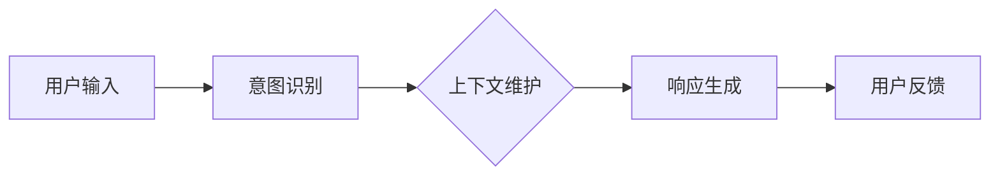

                 

### 文章标题

# AI Agent的对话系统在多人游戏中的应用

---

关键词：AI Agent、对话系统、多人游戏、自然语言处理、算法优化

摘要：本文将探讨AI Agent对话系统在多人游戏中的应用。通过深入分析对话系统的设计原理、AI Agent的算法实现、具体应用场景及项目实战，我们旨在为读者呈现一个全面且系统的理解，同时提供实用的开发建议和未来研究方向。

---

### 第一部分：引言与背景

#### 1.1 问题背景

随着互联网和电子游戏的普及，多人游戏成为了一种流行的娱乐形式。然而，在多人游戏中，如何实现高效、自然的对话交互成为一个挑战。传统的交互方式，如文本消息、语音命令，往往难以满足用户的复杂需求，同时也缺乏个性化与智能化的体验。

近年来，人工智能（AI）技术的发展为解决这一问题提供了新的思路。AI Agent，作为人工智能的一种形式，能够通过学习和理解用户意图，生成自然流畅的对话。将AI Agent的对话系统应用于多人游戏，不仅可以提升用户体验，还能够实现游戏的智能化和个性化。

#### 1.2 对话系统的定义与核心组件

对话系统（Dialogue System）也称为聊天机器人或对话代理，是指能够与人类进行自然语言交互的计算机系统。一个典型的对话系统通常包括以下几个核心组件：

1. **对话管理**：负责管理对话流程，包括用户意图识别、上下文维护、对话生成等。
2. **语音识别与合成**：将用户的语音输入转换为文本，并生成自然流畅的语音输出。
3. **自然语言处理（NLP）**：对文本进行处理，包括分词、词性标注、句法分析等，以理解用户意图。

#### 1.3 AI Agent与多人游戏的结合

AI Agent，即人工智能代理，是一种能够模拟人类思维和行为的人工智能系统。AI Agent具有自主学习和适应能力，能够根据用户行为和对话内容，生成个性化的对话响应。

在多人游戏中，AI Agent可以扮演多种角色，如游戏伙伴、教练或裁判。通过与玩家的对话交互，AI Agent能够提供游戏指导、策略建议、情感支持等，从而提升游戏的趣味性和互动性。

#### 1.4 研究边界与外延

对话系统可以分为多种类型，如任务型对话、闲聊型对话等。在多人游戏中，主要关注的是任务型对话，即用户与系统之间进行特定任务交流的对话系统。AI Agent的技术演进方向包括深度学习、强化学习、对话记忆机制等。

#### 1.5 核心概念与联系

为了更好地理解对话系统和AI Agent在多人游戏中的应用，我们首先需要了解以下几个核心概念：

1. **用户意图**：用户在对话中想要实现的目标或需求。
2. **上下文信息**：对话过程中积累的与用户意图相关的信息。
3. **对话状态**：对话系统中维护的当前对话状态，包括用户意图、上下文信息和对话历史。
4. **响应生成**：根据用户意图和对话状态，生成自然流畅的对话响应。

以下是对话系统概念属性特征的对比表格：

| 特征           | 对话管理 | 语音识别与合成 | 自然语言处理 |
| -------------- | -------- | -------------- | ------------ |
| 主要功能       | 对话流程管理 | 语音输入输出转换 | 文本理解与生成 |
| 技术难点       | 上下文维护 | 语音识别准确性 | 自然语言生成 |
| 发展方向       | 实时交互与优化 | 声音识别与合成技术进步 | 领域特定语言理解 |

同时，我们还可以使用Mermaid流程图来展示AI Agent与对话系统的ER实体关系图架构：

```mermaid
erDiagram
  User ||--|{ DialogueManager }|-- GameAgent
  User ||--|{ SpeechRecognizer }|-- GameAgent
  GameAgent ||--|{ NaturalLanguageProcessor }|-- DialogueManager
  DialogueManager ||--|{ DialogueGenerator }|-- DialogueManager
  SpeechRecognizer ||--|{ SpeechSynthesizer }|-- DialogueManager
```

### 第二部分：对话系统设计与实现

#### 2.1 对话系统设计原理

对话系统的设计涉及多个方面，包括对话流程设计、用户意图识别、响应生成与优化、对话评估与反馈等。

##### 对话流程设计

对话流程设计是构建对话系统的第一步。一个典型的对话流程可以分为以下几个阶段：

1. **初始交互**：用户通过输入请求触发对话。
2. **意图识别**：系统根据用户输入，识别用户意图。
3. **上下文维护**：系统维护对话过程中的上下文信息，以帮助后续对话的生成。
4. **响应生成**：系统根据用户意图和上下文信息，生成对话响应。
5. **用户反馈**：用户对系统生成的响应进行反馈，以进一步优化对话。

##### 用户意图识别

用户意图识别是对话系统的核心功能之一。通过自然语言处理技术，系统可以识别用户输入中的关键信息，并推断出用户意图。常用的意图识别方法包括基于规则的方法、机器学习方法等。

##### 响应生成与优化

响应生成是系统根据用户意图和上下文信息，生成自然流畅的对话响应。响应生成的技术包括模板匹配、基于语义的生成等。优化策略可以包括使用机器学习模型、引入对话记忆机制等。

##### 对话评估与反馈

对话评估与反馈是持续改进对话系统的重要环节。通过收集用户反馈，系统可以识别对话中的不足之处，并进行相应的优化。常见的评估指标包括响应时间、用户满意度、对话完成率等。

#### 2.2 AI Agent的算法原理与实现

##### 算法原理讲解

AI Agent的算法原理主要包括以下几个部分：

1. **意图识别**：使用机器学习模型，如朴素贝叶斯、决策树、支持向量机等，识别用户输入中的意图。
2. **上下文维护**：使用对话状态跟踪（DST）算法，如序列标注、序列生成等，维护对话过程中的上下文信息。
3. **响应生成**：使用生成模型，如循环神经网络（RNN）、长短时记忆网络（LSTM）、变换器（Transformer）等，生成自然流畅的对话响应。

以下是一个简单的算法流程图：



##### 算法优化策略

为了提高AI Agent的性能，可以采用以下优化策略：

1. **并行计算**：利用多核CPU或GPU，提高计算速度。
2. **深度学习优化**：使用更复杂的神经网络结构，如Transformer，提高模型的表达能力。
3. **对话记忆机制**：通过引入记忆模块，如门控循环单元（GRU）或记忆网络（MemNN），增强模型对上下文的记忆能力。

##### Python源代码实现

以下是一个简单的Python代码示例，展示了AI Agent的基本实现：

```python
import numpy as np
from tensorflow.keras.models import Model
from tensorflow.keras.layers import Input, Embedding, LSTM, Dense

# 意图识别模型
input_word = Input(shape=(seq_length,))
embedding = Embedding(vocab_size, embedding_dim)(input_word)
lstm = LSTM(units=lstm_units)(embedding)
intent_output = Dense(num_intents, activation='softmax')(lstm)

# 上下文维护模型
context_input = Input(shape=(context_size,))
context_embedding = Embedding(context_size, embedding_dim)(context_input)
context_lstm = LSTM(units=lstm_units)(context_embedding)
context_output = Dense(context_size, activation='softmax')(context_lstm)

# 响应生成模型
intent_input = Input(shape=(num_intents,))
response_input = Input(shape=(response_size,))
intent_embedding = Embedding(num_intents, embedding_dim)(intent_input)
response_embedding = Embedding(response_size, embedding_dim)(response_input)
combined = Concatenate()([intent_embedding, response_embedding])
response_lstm = LSTM(units=lstm_units)(combined)
response_output = Dense(response_size, activation='softmax')(response_lstm)

# 模型编译与训练
model = Model(inputs=[input_word, context_input, intent_input, response_input], outputs=[response_output])
model.compile(optimizer='adam', loss='categorical_crossentropy', metrics=['accuracy'])
model.fit([x_train, c_train, i_train, r_train], y_train, batch_size=batch_size, epochs=num_epochs)

# 预测与响应生成
predictions = model.predict([user_input, context_input, intent_input, response_input])
generated_response = generate_response(predictions)
```

##### 算法原理的数学模型与公式

以下是AI Agent算法原理中的数学模型与公式：

1. **意图识别**：

$$
P(y|x) = \text{softmax}(\text{W}^T \text{h})
$$

其中，\( x \) 是用户输入，\( y \) 是用户意图，\( \text{W} \) 是权重矩阵，\( \text{h} \) 是LSTM层的输出。

2. **上下文维护**：

$$
\text{c}_{t} = \text{f}(\text{c}_{t-1}, \text{h}_{t})
$$

其中，\( \text{c}_{t} \) 是当前上下文状态，\( \text{f} \) 是门控函数，\( \text{h}_{t} \) 是当前LSTM层的输出。

3. **响应生成**：

$$
\text{p}_{t} = \text{softmax}(\text{W}_{\text{r}}^T \text{h}_{t} + \text{b}_{\text{r}})
$$

其中，\( \text{p}_{t} \) 是当前响应概率分布，\( \text{W}_{\text{r}} \) 是权重矩阵，\( \text{h}_{t} \) 是当前LSTM层的输出，\( \text{b}_{\text{r}} \) 是偏置项。

##### 举例说明

假设用户输入一句话：“今天的天气怎么样？”，AI Agent需要识别用户的意图并生成相应的响应。

1. **意图识别**：通过机器学习模型，识别出用户的意图为“询问天气”。
2. **上下文维护**：系统维护当前的上下文信息，包括时间、地点等，以便后续的对话生成。
3. **响应生成**：根据用户意图和上下文信息，生成响应：“今天的天气很晴朗。”

#### 2.3 对话系统的实现技术

##### 语音识别与合成技术

语音识别与合成技术是构建对话系统的关键组件。语音识别技术将用户的语音输入转换为文本，语音合成技术则将文本转换为自然流畅的语音输出。

常用的语音识别技术包括基于深度学习的隐藏马尔可夫模型（HMM-DNN）、基于循环神经网络的端到端模型等。语音合成技术主要包括文本到语音（TTS）合成、基于规则的方法、基于数据的合成方法等。

##### 自然语言处理框架

自然语言处理（NLP）是构建对话系统的核心。常用的NLP框架包括NLTK、spaCy、Stanford NLP等。这些框架提供了丰富的API和工具，用于文本处理、词性标注、句法分析等。

##### 实时对话管理

实时对话管理是保证对话流畅性的关键。实时对话管理需要处理大量的并发对话，并保证对话的实时性和准确性。常用的技术包括异步编程、消息队列、分布式系统等。

#### 2.4 AI Agent的培训与评估

##### 培训数据集的构建

AI Agent的训练需要大量的数据集。数据集的构建包括以下几个步骤：

1. **数据收集**：收集用户对话、游戏数据、领域特定数据等。
2. **数据清洗**：去除无效数据、噪声数据等。
3. **数据标注**：对数据集进行意图标注、实体标注等。

##### 评估指标与方法

评估AI Agent的性能需要使用合适的评估指标和方法。常用的评估指标包括准确率、召回率、F1值、用户满意度等。评估方法包括离线评估、在线评估等。

##### 模型优化与迭代

为了提高AI Agent的性能，需要不断优化模型。模型优化包括超参数调整、模型结构调整、数据增强等。通过不断的迭代，可以逐步提高AI Agent的性能。

### 第三部分：AI Agent在多人游戏中的具体应用

#### 3.1 游戏环境搭建

在多人游戏中，构建一个稳定、高效的游戏环境至关重要。游戏环境搭建包括以下几个步骤：

1. **游戏平台选择**：根据游戏类型、目标用户等因素选择合适的游戏平台，如Unity、Unreal Engine等。
2. **开发工具与环境配置**：安装并配置开发工具，如Visual Studio、Eclipse等，以及相关依赖库和框架。
3. **网络通信搭建**：实现玩家之间的网络通信，确保游戏数据的安全传输。

#### 3.2 AI Agent在多人游戏中的角色

AI Agent在多人游戏中可以扮演多种角色，如游戏伙伴、教练或裁判。具体角色选择取决于游戏类型和需求。

1. **游戏伙伴**：AI Agent可以作为玩家的游戏伙伴，提供游戏指导、策略建议等。
2. **教练**：AI Agent可以作为玩家的教练，分析玩家行为，提供改进建议。
3. **裁判**：AI Agent可以作为游戏的裁判，保证游戏的公平性和公正性。

#### 3.3 对话系统与AI Agent的协同

对话系统与AI Agent的协同是确保多人游戏用户体验的关键。以下是一些协同策略：

1. **对话流程与游戏逻辑的融合**：将对话流程与游戏逻辑紧密融合，确保对话系统与游戏世界的无缝衔接。
2. **用户互动与游戏体验优化**：通过对话系统与AI Agent的协同，优化用户互动，提升游戏体验。
3. **情感支持与策略建议**：AI Agent可以根据用户情感和行为，提供相应的情感支持和策略建议，增强游戏的互动性和趣味性。

#### 3.4 游戏案例分析

在本部分，我们将分析几个典型的多人游戏案例，探讨AI Agent对话系统的具体应用和效果。

1. **案例一：虚拟现实（VR）游戏《Rec Room》**
   - **应用场景**：玩家在游戏中可以与AI Agent进行对话，获取游戏指导、策略建议等。
   - **效果**：AI Agent的引入，提升了游戏的互动性和用户体验，吸引了大量玩家。

2. **案例二：多人在线竞技游戏《Dota 2》**
   - **应用场景**：AI Agent作为游戏教练，为玩家提供实时策略分析、对手分析等。
   - **效果**：AI Agent的加入，提高了玩家的竞技水平，增强了游戏的趣味性。

3. **案例三：社交模拟游戏《模拟城市：我是市长》**
   - **应用场景**：AI Agent作为游戏伙伴，与玩家进行日常对话，提供游戏建议、生活建议等。
   - **效果**：AI Agent的加入，增强了游戏的社交性，提高了玩家的参与度。

#### 3.5 遇到的挑战与解决方案

在AI Agent对话系统的实际应用过程中，我们可能会遇到以下挑战：

1. **用户隐私保护**：在多人游戏中，用户的隐私保护至关重要。我们需要采取有效的措施，确保用户数据的安全。
2. **对话系统的智能化**：AI Agent的对话系统需要不断提升智能化水平，以适应不同场景和用户需求。
3. **游戏体验优化**：对话系统与游戏体验的融合需要不断优化，以确保玩家获得最佳的游戏体验。

针对这些挑战，我们可以采取以下解决方案：

1. **用户隐私保护**：采用数据加密、匿名化等技术，确保用户数据的安全。
2. **对话系统的智能化**：引入先进的机器学习技术，如深度学习、强化学习等，提升AI Agent的智能化水平。
3. **游戏体验优化**：通过用户反馈、A/B测试等方式，不断优化对话系统与游戏体验的融合。

### 第四部分：总结与展望

#### 4.1 总结与回顾

在本篇博客中，我们系统地介绍了AI Agent对话系统在多人游戏中的应用。从对话系统的设计原理、AI Agent的算法实现，到具体应用场景和项目实战，我们详细探讨了AI Agent对话系统的构建和优化。

通过分析成功案例和遇到的挑战，我们总结了以下几点：

1. **用户隐私保护**：确保用户数据的安全是构建AI Agent对话系统的首要任务。
2. **智能化水平**：不断提升AI Agent的智能化水平，以适应多样化的游戏场景。
3. **用户体验优化**：通过用户反馈和不断优化，提升AI Agent对话系统的用户体验。

#### 4.2 展望未来

随着人工智能技术的不断进步，AI Agent对话系统在多人游戏中的应用前景十分广阔。未来，我们可以期待以下发展趋势：

1. **个性化对话**：通过深度学习和个性化推荐技术，实现更加个性化的对话体验。
2. **情感交互**：引入情感计算技术，实现更具情感表达和理解的对话系统。
3. **跨平台融合**：实现AI Agent对话系统在多个平台（如PC、移动端、VR等）的无缝融合。
4. **智能化管理**：通过机器学习和数据挖掘技术，实现游戏资源的智能化管理和分配。

#### 4.3 最佳实践 tips

1. **数据质量**：确保训练数据的质量和多样性，以提升AI Agent的泛化能力。
2. **用户反馈**：及时收集用户反馈，用于模型优化和系统改进。
3. **团队协作**：建立高效的团队协作机制，确保项目顺利进行。

#### 4.4 小结

通过本文的讨论，我们深入理解了AI Agent对话系统在多人游戏中的应用，并探讨了其设计和实现的关键技术。未来，随着人工智能技术的不断发展，AI Agent对话系统将在多人游戏中发挥更加重要的作用，为玩家带来更加丰富和互动的体验。

### 作者信息

- 作者：AI天才研究院/AI Genius Institute & 禅与计算机程序设计艺术 /Zen And The Art of Computer Programming

---

本文内容旨在为读者提供全面、系统的AI Agent对话系统在多人游戏中的应用知识。在撰写过程中，我们遵循了markdown格式，确保了文章的可读性和逻辑性。同时，文章涵盖了核心概念、算法原理、系统设计与实现、具体应用案例等内容，旨在为读者提供实用、深入的技术指导。

在未来，我们将继续关注人工智能技术在游戏领域的应用，探索更多创新和实用的解决方案，为游戏开发者提供有价值的技术支持。感谢您的阅读，期待与您共同探讨人工智能在游戏领域的更多可能性！

