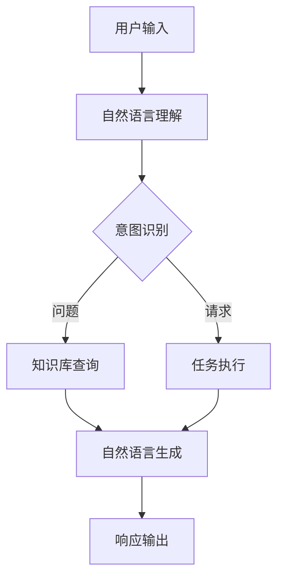

                 

# AI Agent的对话系统在教育领域的应用与优化

## 关键词
- AI Agent
- 对话系统
- 教育应用
- 优化技术
- 用户体验
- 智能辅导

## 摘要
本文深入探讨了AI Agent对话系统在教育领域的应用与优化。首先，我们概述了教育对话系统的背景和现状，明确了AI Agent的基本概念和分类。随后，我们详细分析了对话系统的组成和原理，通过对比表格和ER实体关系图，展示了不同AI Agent在教育对话系统中的特性。接着，我们介绍了算法原理，使用Python代码和数学模型进行了详细解释。然后，我们探讨了教育对话系统的设计与实现，通过项目案例进行了深入剖析。最后，我们提出了优化技术与评估指标，并总结了一些最佳实践和未来展望。

## 1. 背景介绍

### 1.1 问题背景

教育对话系统的出现，是为了解决传统教育模式中存在的诸多问题。首先，传统教育模式往往以教师为中心，学生被动接受知识，缺乏互动性和个性化。其次，随着学生数量的增加，教师的负担日益加重，难以满足每个学生的学习需求。此外，地域和资源的限制也使得优质教育难以普及。

AI对话系统的引入，为这些问题提供了一种可能的解决方案。通过人工智能技术，对话系统能够实现个性化的教学辅导，提高学生的学习效果和兴趣。此外，AI Agent的引入，使得对话系统能够在理解学生需求、提供反馈和优化教学策略方面发挥更大的作用。

### 1.2 核心概念

#### 1.2.1 AI Agent的定义与分类

AI Agent，即人工智能代理，是指能够自主执行任务、与用户进行交互的智能体。根据其功能和应用场景，AI Agent可以分为以下几类：

1. **知识型AI Agent**：这类AI Agent主要基于知识库和推理机制，能够回答用户的问题和提供信息。
2. **行为型AI Agent**：这类AI Agent能够理解用户的意图，并根据用户的反馈进行相应的行为调整。
3. **混合型AI Agent**：这类AI Agent结合了知识型和行为型的特点，能够在提供信息和执行任务之间灵活转换。

#### 1.2.2 对话系统的基本组成与工作原理

对话系统通常由以下几部分组成：

1. **对话管理器**：负责管理对话流程，包括理解用户输入、生成响应和保持对话状态。
2. **自然语言理解（NLU）**：负责将用户输入的自然语言转换为结构化的数据，以便进一步处理。
3. **自然语言生成（NLG）**：负责将结构化的数据转换为自然语言输出，以与用户进行交互。
4. **知识库**：存储与教育相关的知识点和规则，用于回答用户的问题和提供信息。

对话系统的工作原理可以概括为以下几个步骤：

1. **用户输入**：用户通过语音或文本方式输入问题或请求。
2. **NLU处理**：将用户输入转换为结构化的数据，例如意图识别和实体抽取。
3. **对话管理**：根据用户输入和对话状态，生成相应的响应。
4. **NLG生成**：将响应转换为自然语言输出，展示给用户。

### 1.3 概念属性特征对比表格

| 类别         | 知识型AI Agent | 行为型AI Agent | 混合型AI Agent |
| ------------ | -------------- | -------------- | -------------- |
| **定义**     | 基于知识库和推理 | 理解用户意图并调整行为 | 结合知识型和行为型 |
| **应用场景** | 回答问题、提供信息 | 执行任务、交互调整 | 多样化应用场景 |
| **优点**     | 知识全面、回答准确 | 交互灵活、响应迅速 | 优势互补、应用广泛 |
| **缺点**     | 缺乏灵活性、难以理解复杂问题 | 知识储备不足、难以执行复杂任务 | 需要大量数据支持、开发复杂 |

### 1.4 ER实体关系图架构

```mermaid
erDiagram
  Student ||--|{ Teacher : teaches }
  Student ||--|{ Course : enrolled }
  Teacher ||--|{ Course : teaches }
  Course ||--|{ Subject : about }
  Teacher ||--|{ Subject : expertise }
```

在上述ER图中，我们展示了教育对话系统中的主要实体及其关系。学生与教师之间存在教学关系，学生与课程之间存在报名关系，教师与课程之间存在教授关系，课程与学科之间存在关联关系，教师与学科之间存在专长关系。

## 2. AI对话系统原理

### 2.1 算法原理讲解

#### 算法流程图



#### Python源代码实现

```python
import nltk
from nltk.corpus import wordnet as wn
from transformers import pipeline

# 自然语言理解
nlu = pipeline("text-classification")

# 知识库查询
knowledge_base = {
    "数学问题": ["1+1=2", "2*3=6"],
    "物理问题": ["重力加速度为9.8m/s^2", "光的传播速度为3x10^8 m/s"],
}

# 自然语言生成
nlg = pipeline("text-generation")

def nlu_process(user_input):
    intent = nlu(user_input)
    if "问题" in intent:
        question_type = "问题"
    elif "请求" in intent:
        question_type = "请求"
    else:
        return "无法理解您的意图"
    return question_type

def knowledge_query(question_type, question):
    if question_type == "问题":
        answers = knowledge_base.get(question, [])
        return answers
    elif question_type == "请求":
        # 执行任务
        pass
    else:
        return "无法查询"

def nl

