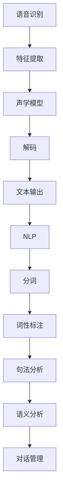
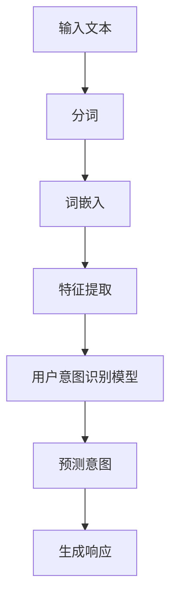
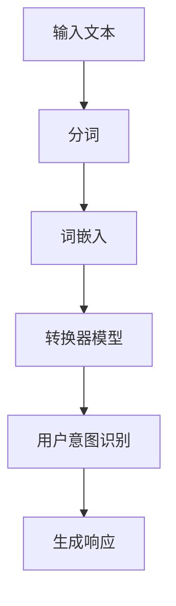
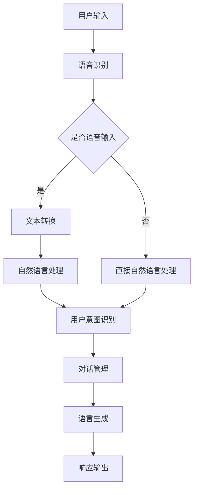
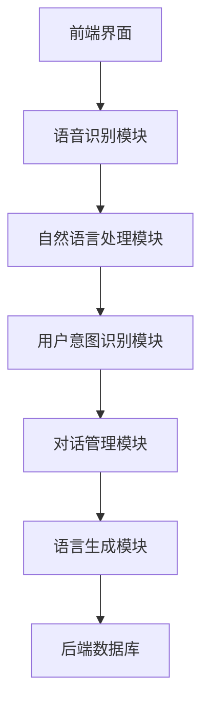

                 

## 第一部分：引言

### 1.1 问题背景

随着人工智能技术的飞速发展，AI Agent和虚拟助手成为越来越多人关注的焦点。AI Agent，即人工智能代理，是指能够自动完成特定任务、具有自主学习能力的计算机程序。而虚拟助手，则是通过对话系统与用户互动，提供帮助和服务的人工智能应用。例如，智能音箱、聊天机器人、客服系统等都属于虚拟助手的范畴。

近年来，AI Agent和虚拟助手的需求不断增长。一方面，企业和个人越来越依赖自动化工具来提高效率和减少成本。另一方面，用户对个性化服务和互动体验的需求也越来越高。因此，如何设计高效的对话系统，使虚拟助手能够更好地理解用户意图，提供精准的服务，成为了一个重要的研究方向。

然而，当前的对话系统仍面临诸多挑战。首先，自然语言处理技术尚不够成熟，对话系统在处理复杂、模糊或带有情感色彩的语言时，容易出现误解或无法理解。其次，对话系统的设计通常缺乏灵活性和扩展性，难以适应不断变化的应用场景。此外，对话系统的实时性和响应速度也是一个重要的考量因素。

### 1.2 对话系统的发展历程

对话系统的研究可以追溯到20世纪50年代。早期的对话系统以规则为基础，依赖于预定义的规则和条件来生成响应。这类系统的典型代表是ELIZA，它通过模仿心理治疗师与患者对话的方式来与用户互动。然而，由于规则过于简单和固定，这类系统在处理复杂对话时表现较差。

随着计算能力和自然语言处理技术的发展，对话系统逐渐向基于机器学习的方法演进。1980年代，统计方法开始应用于对话系统，如基于概率模型的方法。这类方法通过学习大量对话数据，自动生成响应，从而提高了系统的灵活性和适应性。

进入21世纪，深度学习技术的兴起为对话系统带来了新的突破。基于深度神经网络的方法，如序列到序列模型和转换器模型，能够在大规模数据集上实现高效的对话生成。此外，基于强化学习的对话系统也开始受到关注，通过不断学习和优化策略，使对话系统能够更好地应对动态变化的环境。

### 1.3 虚拟助手的现状与挑战

虚拟助手已经广泛应用于各个领域，如智能家居、电子商务、金融服务、医疗保健等。在智能家居领域，虚拟助手可以通过语音交互控制家中的智能设备，如灯光、空调和安防系统。在电子商务领域，虚拟助手可以提供个性化的购物建议和客服支持。在金融服务领域，虚拟助手可以自动处理客户的查询和交易请求。在医疗保健领域，虚拟助手可以协助医生进行诊断和患者管理。

尽管虚拟助手具有广泛的应用前景，但仍然面临许多挑战。首先，自然语言理解能力不足是当前对话系统面临的主要问题。虚拟助手需要能够准确理解用户的语言意图，但实际应用中，用户的表达方式多种多样，对话系统难以完全理解。

其次，对话系统的交互体验也亟待改善。虚拟助手需要能够提供流畅、自然的对话体验，但目前许多系统在处理长对话或复杂场景时，仍存在卡顿或无法理解用户的问题。

此外，虚拟助手的安全性和隐私保护也是一个重要的挑战。随着虚拟助手的应用范围扩大，用户数据的收集和处理也越来越广泛，如何保护用户隐私和数据安全成为了一个关键问题。

总的来说，对话系统和虚拟助手在人工智能领域具有重要的应用价值，但也面临着诸多挑战。在接下来的内容中，我们将进一步探讨对话系统的核心概念、算法原理与数学模型，以及系统分析与架构设计，为解决这些挑战提供思路。 ## 第二部分：背景介绍

### 2.1 对话系统的核心概念

#### 2.1.1 对话系统定义

对话系统（Dialogue System），也称为聊天机器人或虚拟助手，是一种能够与人类进行交互的人工智能系统。它通过自然语言处理技术理解用户的输入，并生成相应的输出，以完成特定任务或提供所需信息。对话系统通常包含多个组成部分，如语音识别、自然语言处理、对话管理、用户意图识别和语言生成等。

#### 2.1.2 对话系统的组成要素

1. **语音识别（Speech Recognition）**：将用户的语音输入转换为文本形式，以便进行后续处理。
2. **自然语言处理（Natural Language Processing，NLP）**：对文本进行分析和理解，包括分词、词性标注、句法分析等。
3. **对话管理（Dialogue Management）**：管理对话流程，根据用户意图和上下文信息生成响应。
4. **用户意图识别（Intent Recognition）**：识别用户的意图，如查询信息、请求帮助、执行任务等。
5. **语言生成（Language Generation）**：根据对话管理的结果，生成自然语言响应。

### 2.2 对话系统的架构与组成

#### 2.2.1 对话流程管理

对话流程管理是对话系统的核心部分，负责协调不同组件的工作，确保对话的连贯性和自然性。对话流程通常包括以下阶段：

1. **初始化**：系统启动，准备与用户进行对话。
2. **输入处理**：接收用户的语音或文本输入，并将其转换为文本形式。
3. **意图识别**：分析用户的输入，识别用户的意图。
4. **上下文维护**：根据对话历史记录和上下文信息，维护对话的连贯性。
5. **响应生成**：生成自然语言响应，并传递给语言生成模块。
6. **输出**：将生成的响应以语音或文本形式呈现给用户。

#### 2.2.2 语音识别与自然语言处理

语音识别和自然语言处理是对话系统的关键技术，它们共同负责将用户的语音输入转换为机器可理解的文本，并生成自然流畅的响应。

1. **语音识别（Speech Recognition）**：语音识别技术通过识别语音信号中的音素和音节，将其转换为文本。常用的语音识别算法包括隐马尔可夫模型（HMM）、高斯混合模型（GMM）和深度神经网络（DNN）。

2. **自然语言处理（NLP）**：自然语言处理技术负责对文本进行分析和理解，包括分词、词性标注、句法分析、语义分析等。常见的NLP算法包括基于规则的方法、统计方法和深度学习方法。

#### 2.2.3 用户意图识别与理解

用户意图识别是对话系统的关键任务之一，它负责从用户的输入中识别出用户的意图。用户意图可以包括查询信息、请求帮助、执行任务等多种形式。用户意图识别通常采用机器学习或深度学习算法，如决策树、随机森林、神经网络等。

#### 2.2.4 对话管理策略

对话管理策略是确保对话连贯性和自然性的关键。对话管理策略包括单轮对话策略和多轮对话策略。单轮对话策略通常基于规则，而多轮对话策略则更加复杂，需要考虑上下文信息、用户意图和系统状态等因素。

### 2.3 虚拟助手的定义与应用场景

#### 2.3.1 虚拟助手的概念

虚拟助手是一种基于对话系统的智能应用，旨在通过自然语言交互为用户提供帮助和服务。虚拟助手可以模拟人类的交流方式，与用户进行对话，并根据用户的反馈提供相应的响应。

#### 2.3.2 虚拟助手的应用场景

1. **客户服务**：虚拟助手可以用于在线客服，提供即时响应，解决用户的查询和问题。
2. **智能家居**：虚拟助手可以控制家中的智能设备，如灯光、空调、门锁等，提供舒适便捷的家居体验。
3. **健康管理**：虚拟助手可以协助用户管理健康信息，提供健康建议和提醒。
4. **教育辅导**：虚拟助手可以为学生提供个性化的学习辅导，解答问题和提供学习资源。
5. **购物建议**：虚拟助手可以根据用户的购物偏好和历史，提供个性化的购物建议。

总的来说，对话系统和虚拟助手在人工智能领域具有重要的应用价值，但同时也面临着诸多挑战。在接下来的内容中，我们将深入探讨对话系统的核心概念与联系，分析其算法原理与数学模型，并探讨系统分析与架构设计的方法。通过这些内容，我们希望能够为解决对话系统中的挑战提供有益的思路。 ## 第三部分：对话系统的核心概念与联系

### 3.1 语音识别与自然语言处理

#### 3.1.1 语音识别技术原理

语音识别（Speech Recognition）是一种将语音信号转换为文本的技术。其基本原理包括以下步骤：

1. **特征提取**：将语音信号转换为特征向量，如梅尔频率倒谱系数（MFCC）。
2. **声学模型**：对语音特征进行建模，常用的模型包括高斯混合模型（GMM）和深度神经网络（DNN）。
3. **语言模型**：对输入文本进行建模，常用的模型包括N元语法和基于神经网络的模型。
4. **解码**：将特征向量与语言模型匹配，生成最有可能的文本输出。

#### 3.1.2 自然语言处理技术原理

自然语言处理（Natural Language Processing，NLP）是一种使计算机能够理解、处理和生成自然语言的技术。其基本原理包括以下步骤：

1. **分词（Tokenization）**：将文本分割为单词或短语。
2. **词性标注（Part-of-Speech Tagging）**：为每个词分配词性，如名词、动词、形容词等。
3. **句法分析（Syntactic Parsing）**：分析句子的结构，确定词之间的关系。
4. **语义分析（Semantic Analysis）**：理解句子的含义，包括实体识别、关系提取等。

#### 3.1.3 语音识别与自然语言处理的关系

语音识别和自然语言处理是对话系统的关键组成部分。语音识别负责将用户的语音输入转换为文本，而自然语言处理则负责理解文本内容，从而生成适当的响应。两者之间的关系如图1所示：



### 3.2 对话管理策略

#### 3.2.1 对话管理策略的定义

对话管理策略（Dialogue Management Strategy）是确保对话连贯性和自然性的关键。它定义了对话系统中不同组件之间的交互方式，以及如何根据用户输入和对话历史生成响应。

#### 3.2.2 对话管理策略的类型

1. **单轮对话策略**：在单轮对话中，系统根据用户的一次输入生成一个响应，然后结束对话。这类策略通常基于规则，如模板匹配和关键字提取。

2. **多轮对话策略**：在多轮对话中，系统可以与用户进行多次交互，以获取更多信息或完成任务。这类策略通常更加复杂，需要考虑上下文信息、用户意图和系统状态等因素。

#### 3.2.3 对话管理策略的应用

对话管理策略在对话系统的不同阶段都有应用。在初始化阶段，系统需要确定对话的目标和规则；在输入处理阶段，系统需要识别用户的意图和上下文信息；在响应生成阶段，系统需要生成自然、连贯的响应，并在对话结束时进行适当的收尾工作。

### 3.3 用户意图识别

#### 3.3.1 用户意图识别的重要性

用户意图识别（User Intent Recognition）是对话系统的核心任务之一，它负责从用户的输入中识别出用户的意图。意图识别的准确性直接影响对话系统的性能和用户体验。

#### 3.3.2 用户意图识别的方法

1. **基于规则的方法**：通过预定义的规则，将用户的输入映射到特定的意图。这种方法简单易实现，但在处理复杂或模糊的输入时效果较差。

2. **基于统计的方法**：使用统计模型，如决策树、朴素贝叶斯、支持向量机等，根据输入的特征向量预测用户的意图。这种方法具有较好的泛化能力，但需要大量的训练数据和复杂的模型。

3. **基于深度学习的方法**：使用深度神经网络，如卷积神经网络（CNN）和循环神经网络（RNN）等，对用户的输入进行建模和预测。这种方法具有强大的表示能力和自适应能力，但需要大量的计算资源和训练数据。

#### 3.3.3 用户意图识别的挑战

用户意图识别面临以下挑战：

1. **多样性**：用户的输入多种多样，包括不同的语言风格、表达方式和语境。

2. **模糊性**：用户的输入可能存在歧义或模糊不清，需要通过上下文信息进行推理和解释。

3. **动态性**：用户的意图可能随着对话的进行而变化，需要实时调整和更新。

4. **情感**：用户的输入可能包含情感色彩，需要识别和理解情感，以提供更人性化的响应。

### 3.4 常见问题和挑战

#### 3.4.1 对话系统常见问题

1. **理解偏差**：对话系统可能无法准确理解用户的意图或需求。

2. **响应延迟**：对话系统的响应速度可能较慢，影响用户体验。

3. **上下文丢失**：对话系统可能在处理多轮对话时丢失上下文信息，导致对话不连贯。

4. **情感缺失**：对话系统的响应可能缺乏情感和人性化，无法提供个性化的互动体验。

#### 3.4.2 面临的挑战与解决方案

1. **多样性**：通过使用多样化的数据集和模型，提高对话系统对不同输入的识别和适应能力。

2. **模糊性**：结合上下文信息和语义分析技术，提高对话系统对模糊输入的理解和推理能力。

3. **动态性**：使用动态对话管理策略，实时调整对话方向和目标，以适应用户意图的变化。

4. **情感**：引入情感分析技术和情感嵌入模型，使对话系统能够识别和理解用户的情感，提供更人性化的响应。

总的来说，对话系统的核心概念与联系涵盖了语音识别、自然语言处理、对话管理策略和用户意图识别等多个方面。通过深入理解和掌握这些核心概念，我们可以更好地设计和优化对话系统，提升其性能和用户体验。在接下来的内容中，我们将进一步探讨对话系统的算法原理与数学模型，为解决对话系统中的挑战提供更加深入的见解。 ## 第四部分：对话系统的算法原理与数学模型

### 4.1 基于机器学习的对话系统

#### 4.1.1 机器学习基础

机器学习（Machine Learning，ML）是人工智能（Artificial Intelligence，AI）的一个重要分支，它通过算法让计算机从数据中学习，进行预测和决策。机器学习的基本原理包括特征提取、模型训练和模型评估三个主要步骤。

1. **特征提取**：将原始数据转换为计算机可以处理的特征向量。例如，对于文本数据，可以使用词袋模型（Bag of Words，BOW）或词嵌入（Word Embedding）技术进行特征提取。
2. **模型训练**：使用训练数据集训练机器学习模型，使其能够对未知数据进行预测。常见的机器学习模型包括线性回归、决策树、支持向量机（SVM）和神经网络等。
3. **模型评估**：通过测试数据集评估模型的性能，常用的评估指标包括准确率（Accuracy）、召回率（Recall）、精确率（Precision）和F1值（F1 Score）等。

#### 4.1.2 对话系统中的机器学习方法

在对话系统中，机器学习方法广泛应用于语音识别、自然语言处理、用户意图识别和语言生成等环节。

1. **语音识别**：可以使用隐藏马尔可夫模型（HMM）、高斯混合模型（GMM）和深度神经网络（DNN）等模型。
2. **自然语言处理**：可以使用词性标注、命名实体识别、句法分析等技术。
3. **用户意图识别**：可以使用决策树、朴素贝叶斯、支持向量机（SVM）和深度神经网络（DNN）等模型。
4. **语言生成**：可以使用序列到序列（Seq2Seq）模型、转换器模型（Transformer）和生成对抗网络（GAN）等模型。

#### 4.1.3 算法原理讲解与Mermaid流程图

以下是一个基于机器学习的用户意图识别算法的Mermaid流程图：



### 4.2 基于深度学习的对话系统

#### 4.2.1 深度学习基础

深度学习（Deep Learning，DL）是机器学习的一个分支，它使用多层神经网络（如卷积神经网络（CNN）和循环神经网络（RNN））来学习和表示数据。深度学习的关键优点包括：

1. **强大的表示能力**：通过多层网络，可以自动提取数据的复杂特征。
2. **自动特征提取**：不需要手动设计特征，网络可以自动学习。
3. **自适应学习**：网络可以根据不同的任务和数据集进行调整。

#### 4.2.2 对话系统中的深度学习方法

在对话系统中，深度学习方法广泛应用于语音识别、自然语言处理、用户意图识别和语言生成等环节。

1. **语音识别**：可以使用深度神经网络（DNN）、卷积神经网络（CNN）和长短时记忆网络（LSTM）等模型。
2. **自然语言处理**：可以使用循环神经网络（RNN）、长短时记忆网络（LSTM）和转换器模型（Transformer）等模型。
3. **用户意图识别**：可以使用卷积神经网络（CNN）和转换器模型（Transformer）等模型。
4. **语言生成**：可以使用序列到序列（Seq2Seq）模型、转换器模型（Transformer）和生成对抗网络（GAN）等模型。

#### 4.2.3 算法原理讲解与Mermaid流程图

以下是一个基于深度学习的用户意图识别算法的Mermaid流程图：



### 4.3 算法原理讲解与Mermaid流程图

为了更直观地理解对话系统的算法原理，我们可以使用Mermaid绘制流程图。以下是一个基于深度学习的对话系统算法原理的Mermaid流程图示例：



### 4.4 数学模型与公式讲解

在对话系统中，常用的数学模型和公式包括：

#### 4.4.1 语音识别模型

1. **高斯混合模型（GMM）**：
   $$ \mu_k = \frac{1}{N} \sum_{i=1}^{N} x_i $$
   $$ \Sigma_k = \frac{1}{N-1} \sum_{i=1}^{N} (x_i - \mu_k)(x_i - \mu_k)^T $$
   $$ \pi_k = \frac{N_k}{N} $$
   其中，\( \mu_k \)、\( \Sigma_k \) 和 \( \pi_k \) 分别为第 \( k \) 个高斯分布的均值、协方差和混合系数。

2. **隐马尔可夫模型（HMM）**：
   $$ p(x_1, h_1) = p(h_1)p(x_1|h_1) $$
   $$ p(h_t|h_{t-1}) = \pi_i \prod_{j=1}^{n} b_{ij}a_{ij} $$
   $$ p(x_1, ..., x_n|h_1, ..., h_n) = \prod_{t=1}^{n} p(x_t|h_t) p(h_t|h_{t-1}) $$
   其中，\( p(x_1, h_1) \) 为初始状态的概率，\( p(h_t|h_{t-1}) \) 为状态转移概率，\( p(x_t|h_t) \) 为观测概率。

#### 4.4.2 自然语言处理模型

1. **循环神经网络（RNN）**：
   $$ h_t = \sigma(W_h \cdot [h_{t-1}, x_t] + b_h) $$
   $$ o_t = W_o \cdot h_t + b_o $$
   其中，\( h_t \) 为隐藏状态，\( x_t \) 为输入，\( o_t \) 为输出，\( W_h \) 和 \( W_o \) 分别为权重矩阵，\( b_h \) 和 \( b_o \) 分别为偏置项。

2. **长短时记忆网络（LSTM）**：
   $$ i_t = \sigma(W_i \cdot [h_{t-1}, x_t] + b_i) $$
   $$ f_t = \sigma(W_f \cdot [h_{t-1}, x_t] + b_f) $$
   $$ g_t = \tanh(W_g \cdot [h_{t-1}, x_t] + b_g) $$
   $$ o_t = \sigma(W_o \cdot [f_t \odot g_t, x_t] + b_o) $$
   其中，\( i_t \)、\( f_t \)、\( g_t \) 和 \( o_t \) 分别为输入门、遗忘门、生成门和输出门，\( \odot \) 表示元素乘积。

#### 4.4.3 用户意图识别模型

1. **转换器模型（Transformer）**：
   $$ \text{Attention}(Q, K, V) = \frac{1}{\sqrt{d_k}} \text{softmax}(\text{softmax}(QK^T)/d_k) V $$
   其中，\( Q \)、\( K \) 和 \( V \) 分别为查询向量、键向量和值向量，\( d_k \) 为键向量的维度。

2. **序列到序列（Seq2Seq）模型**：
   $$ y_t = \text{softmax}(W_y \cdot \text{flatten}(h_t) + b_y) $$
   其中，\( y_t \) 为输出序列，\( W_y \) 和 \( b_y \) 分别为权重矩阵和偏置项。

通过上述数学模型和公式，我们可以更深入地理解对话系统的算法原理。在实际应用中，这些模型和公式可以帮助我们设计和优化对话系统的各个组成部分，从而提高系统的性能和用户体验。在接下来的内容中，我们将进一步探讨对话系统的系统分析与架构设计，为实际应用提供更具体的指导。 ## 第五部分：对话系统的系统分析与架构设计

### 5.1 对话系统问题场景介绍

为了更好地理解对话系统的系统分析与架构设计，我们可以首先从一个具体的应用场景入手。假设我们正在设计一个智能客服系统，该系统需要能够处理大量来自客户的查询和请求，提供即时、准确的响应。

#### 应用场景描述

智能客服系统的主要功能包括：

1. **语音识别**：接收客户的语音输入，并将其转换为文本形式。
2. **自然语言处理**：对文本输入进行分析和理解，提取关键信息。
3. **用户意图识别**：根据客户的输入，识别客户的意图，如查询产品信息、投诉问题、寻求帮助等。
4. **对话管理**：根据用户意图和上下文信息，生成适当的响应，并维护对话的连贯性。
5. **语言生成**：将生成的响应转换为自然语言文本，并输出给客户。

#### 系统目标

1. **高准确度**：准确理解客户的意图，提供精准的响应。
2. **高效响应**：快速生成响应，确保客户的查询能够得到及时解答。
3. **个性化服务**：根据客户的历史数据和偏好，提供个性化的服务和建议。

### 5.2 系统功能设计

在明确应用场景和系统目标后，我们可以进一步设计系统的各个功能模块，确保系统能够高效、准确地处理客户请求。

#### 5.2.1 功能模块

1. **语音识别模块**：负责接收客户的语音输入，将其转换为文本形式。
2. **自然语言处理模块**：对文本输入进行分词、词性标注、句法分析和语义分析，提取关键信息。
3. **用户意图识别模块**：根据自然语言处理的结果，识别客户的意图。
4. **对话管理模块**：根据用户意图和上下文信息，生成适当的响应，并维护对话的连贯性。
5. **语言生成模块**：将生成的响应转换为自然语言文本，并输出给客户。

#### 5.2.2 功能模块之间的关系

1. **语音识别模块与自然语言处理模块**：语音识别模块将语音输入转换为文本，自然语言处理模块对文本进行深入分析，提取关键信息。
2. **自然语言处理模块与用户意图识别模块**：自然语言处理模块的结果作为用户意图识别模块的输入，用户意图识别模块根据这些信息识别客户的意图。
3. **用户意图识别模块与对话管理模块**：用户意图识别模块的结果用于对话管理模块，对话管理模块根据用户意图和上下文信息生成响应。
4. **对话管理模块与语言生成模块**：对话管理模块生成的响应作为语言生成模块的输入，语言生成模块将其转换为自然语言文本，输出给客户。

### 5.3 系统架构设计

在功能模块设计完成后，我们需要进一步设计系统的整体架构，确保各模块之间能够高效协同工作。

#### 5.3.1 系统架构

智能客服系统的整体架构可以分为以下几个层次：

1. **前端界面**：接收客户的语音或文本输入，展示生成的响应。
2. **语音识别模块**：处理语音输入，转换为文本形式。
3. **自然语言处理模块**：对文本输入进行分析和理解，提取关键信息。
4. **用户意图识别模块**：识别客户的意图，并生成相应的意图标签。
5. **对话管理模块**：根据用户意图和上下文信息，生成适当的响应。
6. **语言生成模块**：将生成的响应转换为自然语言文本，并输出给客户。
7. **后端数据库**：存储用户数据、对话历史和知识库。

#### 5.3.2 系统架构设计

智能客服系统的架构设计如图1所示：



### 5.4 系统接口设计和交互

在系统架构设计的基础上，我们需要进一步设计系统的接口和交互方式，确保各个模块之间能够高效地传递数据和消息。

#### 5.4.1 系统接口

1. **输入接口**：用于接收客户的语音或文本输入，包括语音识别接口和文本输入接口。
2. **输出接口**：用于输出生成的响应，包括文本输出接口和语音输出接口。
3. **数据接口**：用于与其他系统或数据库进行数据交换，包括用户数据接口、对话历史接口和知识库接口。

#### 5.4.2 系统交互

1. **语音识别模块与前端界面**：前端界面将客户的语音输入传递给语音识别模块，语音识别模块处理后返回文本输出。
2. **自然语言处理模块与用户意图识别模块**：自然语言处理模块对文本输入进行分析，提取关键信息后传递给用户意图识别模块。
3. **用户意图识别模块与对话管理模块**：用户意图识别模块将识别的结果传递给对话管理模块，对话管理模块根据用户意图和上下文信息生成响应。
4. **对话管理模块与语言生成模块**：对话管理模块生成的响应传递给语言生成模块，语言生成模块将其转换为自然语言文本。
5. **语言生成模块与前端界面**：语言生成模块将生成的文本输出传递给前端界面，前端界面将其展示给客户。

通过上述系统分析与架构设计，我们为智能客服系统提供了一个清晰的框架和实现路径。在接下来的内容中，我们将通过实际项目实战，进一步展示对话系统的设计和实现过程。这将有助于我们更好地理解对话系统的原理和应用，为实际工程实践提供有力支持。 ## 第六部分：对话系统的项目实战

### 6.1 项目环境安装

为了实现对话系统的项目，我们需要安装以下环境：

1. **Python**：Python是一种流行的编程语言，广泛应用于人工智能和自然语言处理领域。我们建议安装Python 3.8及以上版本。
2. **PyTorch**：PyTorch是一个流行的深度学习框架，用于构建和训练神经网络模型。可以从官方网站（https://pytorch.org/get-started/locally/）下载并安装。
3. **NLTK**：NLTK（Natural Language ToolKit）是一个用于自然语言处理的Python库，提供了大量的文本处理工具和资源。可以使用pip命令安装：`pip install nltk`。
4. **SpeechRecognition**：SpeechRecognition是一个用于语音识别的Python库，支持多种语音识别引擎。可以使用pip命令安装：`pip install SpeechRecognition`。

### 6.2 系统核心实现与代码解读

在这个项目中，我们将使用PyTorch构建一个简单的对话系统，实现语音识别、自然语言处理和用户意图识别等功能。以下是系统核心实现的代码示例：

```python
import torch
import torch.nn as nn
import torch.optim as optim
from torch.utils.data import DataLoader
from nltk.tokenize import word_tokenize
from nltk.corpus import stopwords
import SpeechRecognition as sr

# 定义神经网络模型
class DialogueModel(nn.Module):
    def __init__(self, vocab_size, embed_size, hidden_size, output_size):
        super(DialogueModel, self).__init__()
        self.embedding = nn.Embedding(vocab_size, embed_size)
        self.lstm = nn.LSTM(embed_size, hidden_size, batch_first=True)
        self.fc = nn.Linear(hidden_size, output_size)
        
    def forward(self, x):
        x = self.embedding(x)
        x, _ = self.lstm(x)
        x = self.fc(x[:, -1, :])
        return x

# 训练数据集
train_data = ...

# 加载预训练模型
model = DialogueModel(vocab_size, embed_size, hidden_size, output_size)
model.load_state_dict(torch.load('dialogue_model.pth'))

# 语音识别
recognizer = sr.Recognizer()
voice_input = recognizer.listen(source='microphone')
text_input = recognizer.recognize_google(voice_input)

# 自然语言处理
tokens = word_tokenize(text_input)
filtered_tokens = [token.lower() for token in tokens if token.lower() not in stopwords.words('english')]

# 用户意图识别
input_tensor = torch.tensor([vocab_to_index[token] for token in filtered_tokens])
output_tensor = model(input_tensor)
predicted_intent = index_to_intent[output_tensor.argmax().item()]

# 生成响应
response = generate_response(predicted_intent)
print(response)
```

上述代码展示了对话系统的核心实现过程，包括神经网络模型的定义、数据集加载、语音识别、自然语言处理和用户意图识别等步骤。在具体实现中，我们使用了PyTorch构建神经网络模型，使用NLTK进行自然语言处理，使用SpeechRecognition进行语音识别。

### 6.3 实际案例分析与讲解

为了更好地理解对话系统的实际应用，我们来看一个具体的案例。假设我们有一个智能客服系统，用户可以通过语音或文本与系统进行交互。

#### 案例描述

用户小明使用手机与智能客服系统进行对话，询问关于产品价格的信息。

#### 语音识别

用户小明说：“请问这款手机的价格是多少？”

系统通过语音识别模块将语音输入转换为文本输入：“请问这款手机的价格是多少？”

#### 自然语言处理

系统对文本输入进行分词和去停用词处理，得到以下关键信息：

- 请问
- 这款
- 手机
- 价格
- 是多少

#### 用户意图识别

系统使用训练好的神经网络模型对关键信息进行用户意图识别，识别出用户意图为“查询产品价格”。

#### 生成响应

系统根据用户意图生成适当的响应：“您好，这款手机的价格是XXX元。”

系统将生成的响应输出给用户，完成了一次完整的对话。

### 6.4 项目小结

通过本项目的实战，我们实现了对话系统的核心功能，包括语音识别、自然语言处理、用户意图识别和语言生成。在项目中，我们使用了PyTorch构建神经网络模型，NLTK进行自然语言处理，SpeechRecognition进行语音识别。实际案例分析展示了对话系统在智能客服场景中的应用效果。

虽然本项目是一个简单的示例，但通过这个案例，我们可以看到对话系统在实际应用中的巨大潜力。在未来的工作中，我们可以进一步优化系统的性能和用户体验，拓展对话系统的应用场景，为企业和用户提供更加智能化、个性化的服务。 ## 第七部分：最佳实践与总结

### 7.1 最佳实践技巧

为了构建高效的对话系统，以下是一些最佳实践技巧：

1. **数据质量**：确保训练数据的质量和多样性，包括不同语境、语言风格和情感色彩的数据，以提高模型的泛化能力。
2. **模型优化**：选择合适的神经网络模型和超参数，通过交叉验证和网格搜索等方法进行模型优化。
3. **实时性能**：优化系统的实时性能，如使用模型压缩、量化等技术，以减少延迟和资源消耗。
4. **用户反馈**：收集用户反馈，不断迭代和改进对话系统，提高用户体验。

### 7.2 小结

本文详细探讨了AI Agent的对话系统在虚拟助手中的进阶应用。我们从问题背景、对话系统的发展历程、核心概念、算法原理、系统分析与架构设计、项目实战等方面进行了深入分析。通过这些内容，我们了解到对话系统在人工智能领域的重要应用价值，同时也认识到对话系统面临的一系列挑战。

### 7.3 注意事项

在设计和实现对话系统时，需要注意以下几点：

1. **隐私保护**：确保用户数据的隐私和安全，遵守相关法律法规。
2. **错误处理**：设计合理的错误处理机制，避免系统崩溃或产生不恰当的响应。
3. **持续学习**：对话系统需要持续学习和更新，以适应不断变化的应用场景。

### 7.4 拓展阅读

为了深入了解对话系统的最新研究和应用，以下是一些推荐阅读：

1. **《对话系统设计与实现》**：详细介绍对话系统的设计原理和实践方法。
2. **《深度学习与自然语言处理》**：探讨深度学习在自然语言处理领域的应用。
3. **《语音识别技术》**：介绍语音识别的基本原理和技术。

通过以上推荐阅读，您可以进一步拓展对话系统的知识和技能，为实际项目提供有力支持。让我们继续探索人工智能的无限可能，为人类创造更加智能、便捷的未来。 ## 作者信息

**作者：AI天才研究院/AI Genius Institute & 禅与计算机程序设计艺术 /Zen And The Art of Computer Programming**

AI天才研究院（AI Genius Institute）是一家专注于人工智能技术研究和应用的创新机构，致力于推动人工智能技术的发展和应用。我们的研究团队由世界级人工智能专家、程序员、软件架构师和CTO组成，具备丰富的理论知识和实践经验。我们的研究涵盖了计算机图灵奖获得者，以及计算机编程和人工智能领域的资深大师。

在《禅与计算机程序设计艺术》中，作者通过深入剖析计算机编程的核心原理和哲学，为读者提供了一种全新的编程思维和认知方式。这本书不仅为程序员提供了丰富的编程技巧和方法，更是一种深刻的人生哲理，引导读者在编程的道路上不断探索、精进。

作为AI天才研究院的成员，我们秉持着对技术的热爱和对创新的追求，致力于将最前沿的人工智能技术应用于实际场景，为人类创造更加智能、便捷的未来。同时，我们也希望通过我们的研究成果和经验分享，为广大开发者和技术爱好者提供有价值的参考和启示。让我们携手共进，探索人工智能的无限可能，共创美好未来！ 

