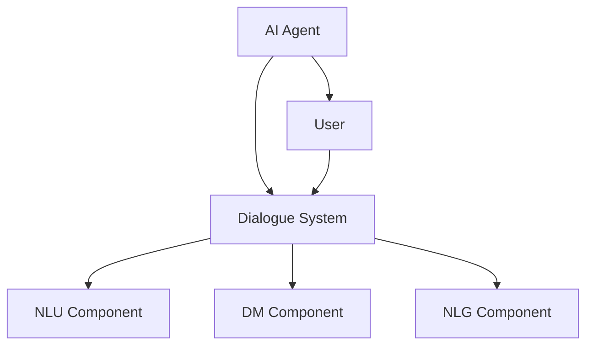
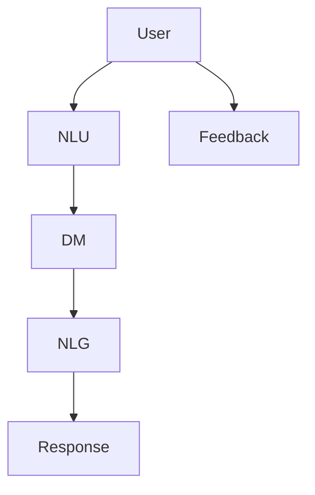
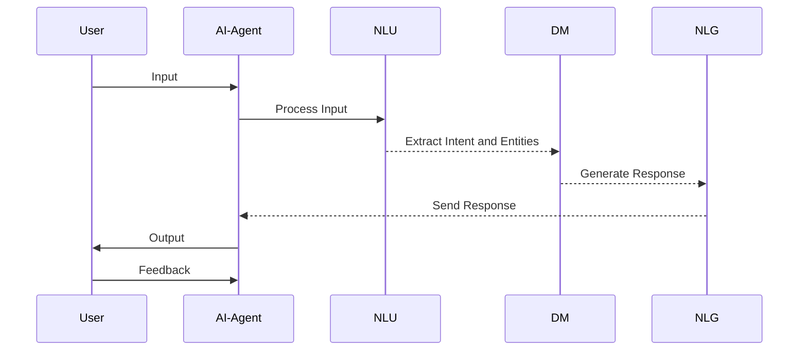

                 


### 设计《AI Agent的对话系统在跨文化交流中的应用》的目录大纲

为了设计《AI Agent的对话系统在跨文化交流中的应用》的目录大纲，我们需要遵循以下步骤：

1. **确定核心主题**：首先，明确文章的核心主题是“AI Agent的对话系统在跨文化交流中的应用”。这意味着我们需要覆盖三个主要方面：AI Agent的基础知识、对话系统的构建、以及如何将这些系统应用于跨文化交流。

2. **分解主题内容**：将核心主题分解为若干个关键部分，确保每个部分都有明确的主题和范围。

3. **组织章节结构**：根据分解的内容，组织章节结构，确保逻辑清晰，内容连贯。

### 目录大纲

#### 第一部分：AI Agent与对话系统基础

##### 第1章：AI Agent概述
- 1.1 AI Agent的基本概念
- 1.2 AI Agent的发展历史
- 1.3 AI Agent的类型与应用场景

##### 第2章：对话系统基础
- 2.1 对话系统的定义与分类
- 2.2 对话系统的核心组件
- 2.3 对话系统的关键技术

##### 第3章：跨文化交流基础
- 3.1 跨文化交流的重要性
- 3.2 跨文化交流中的障碍
- 3.3 跨文化交流的策略

#### 第二部分：AI Agent对话系统构建

##### 第4章：AI Agent对话系统的设计原则
- 4.1 设计原则概述
- 4.2 用户体验设计
- 4.3 技术选择与实现

##### 第5章：AI Agent对话系统的实现
- 5.1 技术栈选择
- 5.2 开发流程与工具
- 5.3 实现案例解析

##### 第6章：对话系统的评估与优化
- 6.1 评估指标与方法
- 6.2 用户体验反馈
- 6.3 系统性能优化

#### 第三部分：AI Agent对话系统在跨文化交流中的应用

##### 第7章：应用场景分析
- 7.1 企业跨文化沟通
- 7.2 多语言客服系统
- 7.3 教育与培训

##### 第8章：挑战与解决方案
- 8.1 文化差异的处理
- 8.2 技术实现的挑战
- 8.3 道德与伦理问题

##### 第9章：成功案例研究
- 9.1 案例一：跨国企业内部沟通系统
- 9.2 案例二：多语言客服平台
- 9.3 案例三：跨文化交流教育项目

##### 第10章：未来展望
- 10.1 技术发展趋势
- 10.2 应用前景
- 10.3 潜在挑战与对策

### 目录大纲（Markdown格式）

```markdown
----------------------------------------------------------------
# 第一部分：AI Agent与对话系统基础

## 第1章：AI Agent概述
### 1.1 AI Agent的基本概念
### 1.2 AI Agent的发展历史
### 1.3 AI Agent的类型与应用场景

## 第2章：对话系统基础
### 2.1 对话系统的定义与分类
### 2.2 对话系统的核心组件
### 2.3 对话系统的关键技术

## 第3章：跨文化交流基础
### 3.1 跨文化交流的重要性
### 3.2 跨文化交流中的障碍
### 3.3 跨文化交流的策略

----------------------------------------------------------------

# 第二部分：AI Agent对话系统构建

## 第4章：AI Agent对话系统的设计原则
### 4.1 设计原则概述
### 4.2 用户体验设计
### 4.3 技术选择与实现

## 第5章：AI Agent对话系统的实现
### 5.1 技术栈选择
### 5.2 开发流程与工具
### 5.3 实现案例解析

## 第6章：对话系统的评估与优化
### 6.1 评估指标与方法
### 6.2 用户体验反馈
### 6.3 系统性能优化

----------------------------------------------------------------

# 第三部分：AI Agent对话系统在跨文化交流中的应用

## 第7章：应用场景分析
### 7.1 企业跨文化沟通
### 7.2 多语言客服系统
### 7.3 教育与培训

## 第8章：挑战与解决方案
### 8.1 文化差异的处理
### 8.2 技术实现的挑战
### 8.3 道德与伦理问题

## 第9章：成功案例研究
### 9.1 案例一：跨国企业内部沟通系统
### 9.2 案例二：多语言客服平台
### 9.3 案例三：跨文化交流教育项目

## 第10章：未来展望
### 10.1 技术发展趋势
### 10.2 应用前景
### 10.3 潜在挑战与对策

----------------------------------------------------------------

---

通过这样的目录大纲，我们可以确保文章的内容结构紧凑，逻辑清晰，读者可以一步步深入理解AI Agent对话系统在跨文化交流中的应用。
```

### 文章标题：AI Agent的对话系统在跨文化交流中的应用

> 关键词：AI Agent，对话系统，跨文化交流，自然语言处理，多语言客服，文化适应性

> 摘要：本文旨在探讨AI Agent对话系统在跨文化交流中的应用。首先，我们将介绍AI Agent和对话系统的基础知识，包括其定义、发展历史、分类和应用场景。接着，我们将探讨跨文化交流的特点与挑战，并讨论如何在对话系统中实现跨文化沟通。随后，文章将深入讨论如何设计、实现和优化AI Agent对话系统，特别是在处理多语言和跨文化差异方面的技术挑战。最后，通过分析实际案例，我们将展示AI Agent对话系统在跨文化交流中的成功应用，并提出未来的发展趋势和挑战。

## 第一部分：AI Agent与对话系统基础

### 第1章：AI Agent概述

#### 1.1 AI Agent的基本概念

AI Agent，即人工智能代理，是指能够自主执行任务、与环境和用户交互的智能系统。它们基于人工智能技术，能够模拟人类的思维和行为，执行特定的任务。AI Agent的基本概念包括以下几个要素：

1. **自主性**：AI Agent能够独立执行任务，无需人工干预。
2. **交互性**：AI Agent能够与用户和环境进行交互，获取信息、反馈和指令。
3. **适应性**：AI Agent能够根据环境和任务的变化，自主调整其行为和策略。

#### 1.2 AI Agent的发展历史

AI Agent的概念起源于人工智能（AI）领域，其发展历史可以追溯到20世纪50年代。以下是一些重要的里程碑：

- **1956年**：人工智能的概念首次被提出。
- **1970年代**：专家系统和模拟人类思维的程序开始流行。
- **1990年代**：多智能体系统（MAS）和分布式人工智能（DAI）的研究得到重视。
- **2000年代至今**：深度学习和强化学习的发展，使得AI Agent的能力和实用性大幅提升。

#### 1.3 AI Agent的类型与应用场景

AI Agent可以分为多种类型，根据其功能和应用场景的不同，可以分为以下几类：

1. **任务型AI Agent**：专注于完成特定任务的AI系统，如客服机器人、智能助手等。
2. **社交型AI Agent**：用于与人进行社交互动的AI系统，如虚拟聊天机器人、社交媒体AI主播等。
3. **决策型AI Agent**：用于帮助决策的AI系统，如智能投资顾问、供应链优化系统等。
4. **导航型AI Agent**：用于导航和路径规划的AI系统，如自动驾驶系统、智能导航应用等。

AI Agent在各个领域都有广泛的应用，以下是一些常见的应用场景：

- **企业内部沟通**：AI Agent可以用于企业内部的信息传递和任务分配。
- **客户服务**：AI Agent可以用于提供多语言客服支持，提高客户满意度。
- **教育与培训**：AI Agent可以用于提供个性化的教育辅导和培训服务。
- **医疗健康**：AI Agent可以用于辅助医生进行诊断和患者管理。

### 第2章：对话系统基础

#### 2.1 对话系统的定义与分类

对话系统，又称聊天机器人或聊天界面，是指能够与人类进行自然语言交互的计算机系统。根据交互方式的不同，对话系统可以分为以下几类：

1. **任务导向型对话系统**：主要关注完成特定任务，如客服机器人、订单处理系统等。
2. **闲聊型对话系统**：主要与人进行闲聊和社交互动，如虚拟聊天机器人、社交媒体AI主播等。
3. **混合型对话系统**：同时具备任务导向和闲聊功能，如智能助手、虚拟助理等。

#### 2.2 对话系统的核心组件

对话系统的核心组件包括：

1. **自然语言理解（NLU）**：将自然语言输入转换成计算机可以理解的结构化数据。
2. **对话管理（DM）**：根据对话内容和上下文，决定对话的流程和下一步行动。
3. **自然语言生成（NLG）**：将计算机处理后的数据转换成自然语言输出，供用户阅读。

#### 2.3 对话系统的关键技术

对话系统的关键技术包括：

1. **自然语言处理（NLP）**：用于处理和理解自然语言，包括文本分类、实体识别、语义分析等。
2. **机器学习与深度学习**：用于训练模型，提高对话系统的性能和智能程度。
3. **对话管理算法**：用于处理对话上下文，决定对话的流程和行动。
4. **语音识别与合成**：用于实现语音交互，提高用户体验。

### 第3章：跨文化交流基础

#### 3.1 跨文化交流的重要性

跨文化交流是指不同文化背景的人或群体之间的交流和互动。在全球化和多元文化交融的背景下，跨文化交流具有重要的意义：

1. **促进国际理解和合作**：跨文化交流有助于消除文化隔阂，增进国际间的相互理解与合作。
2. **提升个人与组织竞争力**：了解不同文化的特点和需求，有助于个人和组织在全球市场上脱颖而出。
3. **促进文化多样性**：跨文化交流有助于丰富和传承各种文化，促进文化多样性的发展。

#### 3.2 跨文化交流中的障碍

跨文化交流中存在一些障碍，包括：

1. **语言障碍**：不同语言之间的差异会导致沟通障碍，影响交流效果。
2. **文化差异**：不同文化背景的人在价值观、行为习惯、沟通风格等方面存在差异，可能导致误解和冲突。
3. **非语言沟通**：如肢体语言、面部表情等非语言因素在不同文化中的含义可能不同，影响交流效果。

#### 3.3 跨文化交流的策略

为了克服跨文化交流中的障碍，可以采取以下策略：

1. **文化敏感性培训**：提高个体和团队的文化敏感性，增强跨文化交流能力。
2. **语言学习**：学习对方的语言，提高语言沟通能力。
3. **明确沟通目标**：在交流前明确目标，避免误解和歧义。
4. **尊重差异**：尊重不同文化的特点和习惯，避免文化偏见。

## 第二部分：AI Agent对话系统构建

### 第4章：AI Agent对话系统的设计原则

#### 4.1 设计原则概述

设计AI Agent对话系统时，需要遵循以下设计原则：

1. **用户中心**：以用户需求为中心，设计简洁、直观的用户界面。
2. **灵活性**：系统应具有灵活性和适应性，能够处理不同类型的任务和用户需求。
3. **可扩展性**：系统设计应考虑未来的扩展和升级，以适应技术发展和市场需求。
4. **安全性**：保护用户数据和隐私，确保系统的安全性。
5. **可维护性**：系统设计应考虑未来的维护和升级，确保系统的稳定性和可靠性。

#### 4.2 用户体验设计

用户体验设计（UX Design）是AI Agent对话系统设计的关键部分。以下是一些关键点：

1. **交互设计**：设计直观、自然的交互流程，提高用户满意度。
2. **界面设计**：设计简洁、美观的界面，提高用户使用的愉悦感。
3. **响应速度**：优化系统性能，确保快速响应用户请求。
4. **反馈机制**：提供有效的用户反馈，帮助用户了解系统状态和操作结果。

#### 4.3 技术选择与实现

AI Agent对话系统的技术选择和实现包括：

1. **自然语言处理（NLP）**：采用NLP技术，处理和理解用户输入。
2. **机器学习与深度学习**：使用机器学习模型，提高对话系统的智能程度和适应性。
3. **对话管理算法**：设计合适的对话管理算法，确保对话的自然流畅。
4. **语音识别与合成**：实现语音交互功能，提高用户体验。

### 第5章：AI Agent对话系统的实现

#### 5.1 技术栈选择

实现AI Agent对话系统时，需要选择合适的技术栈。以下是一些常见的技术栈选项：

1. **前端技术**：HTML、CSS、JavaScript等，用于设计用户界面。
2. **后端技术**：Python、Java、Node.js等，用于处理业务逻辑和数据存储。
3. **数据库**：MySQL、MongoDB、Redis等，用于存储用户数据和对话记录。
4. **自然语言处理（NLP）库**：如NLTK、spaCy、TensorFlow等，用于处理自然语言数据。

#### 5.2 开发流程与工具

AI Agent对话系统的开发流程和工具包括：

1. **需求分析**：分析用户需求，明确系统功能和技术要求。
2. **系统设计**：设计系统架构，确定技术栈和开发工具。
3. **编码实现**：根据系统设计，编写代码实现各个模块的功能。
4. **测试与调试**：进行功能测试和性能测试，调试和修复问题。
5. **部署与维护**：将系统部署到服务器，进行日常维护和升级。

#### 5.3 实现案例解析

以下是一个简单的AI Agent对话系统实现案例：

```python
# 导入相关库
import nltk
from nltk.chat.util import Chat, reflections

# 定义对话数据
conversations = [
    [
        "Hello",
        "Hi! How can I help you today?"
    ],
    [
        "What is AI?",
        "AI stands for Artificial Intelligence. It refers to the simulation of human intelligence in machines that are programmed to think like humans and perform tasks typically requiring human intelligence, such as visual perception, speech recognition, decision-making, and language translation."
    ],
    [
        "Can you explain deep learning?",
        "Deep learning is a subset of machine learning where artificial neural networks, inspired by the structure and function of the human brain, learn from large amounts of data to recognize patterns and make predictions."
    ],
]

# 创建对话系统
chatbot = Chat(conversations, reflections)

# 开始对话
chatbot.converse()
```

在这个案例中，我们使用了自然语言处理库NLTK来实现一个简单的对话系统。通过定义对话数据和反射词表，我们可以创建一个能够与用户进行简单交互的AI Agent。

### 第6章：对话系统的评估与优化

#### 6.1 评估指标与方法

评估AI Agent对话系统的性能和用户体验，可以使用以下指标和方法：

1. **准确率**：对话系统正确理解用户输入的百分比。
2. **响应时间**：系统回复用户请求的平均时间。
3. **用户满意度**：用户对系统性能和用户体验的评价。
4. **错误率**：对话系统无法理解或处理用户输入的百分比。
5. **对话深度**：对话系统的回答能否深入用户的问题。

常用的评估方法包括：

1. **自动化测试**：使用测试工具自动执行预设的测试用例。
2. **用户测试**：邀请真实用户参与测试，评估系统的性能和用户体验。
3. **数据分析**：分析用户对话数据，识别问题和改进点。

#### 6.2 用户体验反馈

用户体验反馈是优化对话系统的重要途径。以下是一些获取用户体验反馈的方法：

1. **问卷调查**：通过问卷调查收集用户对系统的评价和建议。
2. **用户访谈**：与用户进行面对面访谈，深入了解用户需求和痛点。
3. **在线反馈**：提供在线反馈渠道，方便用户随时提出问题和建议。

#### 6.3 系统性能优化

优化AI Agent对话系统的性能，可以从以下几个方面入手：

1. **算法优化**：改进自然语言处理和对话管理算法，提高系统的准确率和响应速度。
2. **数据增强**：增加训练数据量，提高模型的泛化能力。
3. **硬件升级**：提高服务器和硬件配置，确保系统的高性能运行。
4. **负载均衡**：优化系统架构，实现负载均衡，提高系统的可扩展性和稳定性。

## 第三部分：AI Agent对话系统在跨文化交流中的应用

### 第7章：应用场景分析

#### 7.1 企业跨文化沟通

企业跨文化沟通是AI Agent对话系统的重要应用场景之一。以下是一些具体应用：

1. **内部沟通**：AI Agent可以用于跨国企业内部的日常沟通，如会议通知、任务分配、进度汇报等。
2. **多语言支持**：AI Agent可以提供多语言客服支持，帮助企业与来自不同国家的客户进行有效沟通。
3. **文化差异培训**：AI Agent可以提供跨文化沟通培训，帮助员工了解和适应不同文化背景的沟通方式和习惯。

#### 7.2 多语言客服系统

多语言客服系统是AI Agent对话系统的另一个重要应用场景。以下是一些具体应用：

1. **多语言支持**：AI Agent可以提供多种语言的服务，满足不同国家客户的沟通需求。
2. **智能问答**：AI Agent可以自动回答常见问题，提高客服效率和质量。
3. **情感识别**：AI Agent可以识别客户的情感状态，提供个性化的情感回应，提高客户满意度。

#### 7.3 教育与培训

教育与培训是AI Agent对话系统的另一个重要应用场景。以下是一些具体应用：

1. **在线辅导**：AI Agent可以提供个性化的在线辅导，帮助学生解决学习问题。
2. **语言学习**：AI Agent可以提供语言学习辅导，帮助学生提高语言水平。
3. **文化教育**：AI Agent可以提供跨文化教育，帮助学生了解和适应不同文化背景。

### 第8章：挑战与解决方案

#### 8.1 文化差异的处理

跨文化交流中的文化差异是AI Agent对话系统面临的主要挑战之一。以下是一些解决方案：

1. **文化适应性设计**：在设计AI Agent对话系统时，考虑文化差异，提供文化适应性的功能。
2. **多语言支持**：提供多种语言支持，满足不同国家客户的沟通需求。
3. **文化敏感性培训**：对AI Agent进行文化敏感性培训，使其能够更好地理解和处理不同文化的沟通需求。

#### 8.2 技术实现的挑战

AI Agent对话系统在技术实现上也面临一些挑战，以下是一些解决方案：

1. **自然语言处理技术**：采用先进的自然语言处理技术，提高AI Agent对自然语言的理解能力。
2. **多语言处理技术**：采用多语言处理技术，提高AI Agent在不同语言环境下的性能。
3. **机器学习与深度学习**：使用机器学习和深度学习技术，提高AI Agent的智能程度和适应性。

#### 8.3 道德与伦理问题

AI Agent对话系统在跨文化交流中的应用也涉及到一些道德与伦理问题。以下是一些解决方案：

1. **数据隐私保护**：确保用户数据的隐私和安全，遵守相关法律法规。
2. **算法公平性**：确保AI Agent的决策和回应公平公正，避免偏见和歧视。
3. **用户透明度**：向用户提供关于AI Agent决策和回应的解释，提高用户的信任和满意度。

### 第9章：成功案例研究

#### 9.1 案例一：跨国企业内部沟通系统

某跨国企业采用AI Agent对话系统作为其内部沟通工具。该系统提供多语言支持，员工可以使用母语进行沟通，提高了沟通效率和团队协作效果。此外，AI Agent还提供实时翻译功能，帮助跨国团队克服语言障碍，实现无缝沟通。

#### 9.2 案例二：多语言客服系统

某国际知名企业采用AI Agent对话系统作为其多语言客服系统。该系统提供24小时在线服务，支持多种语言，有效提高了客服效率和客户满意度。AI Agent能够自动识别客户语言，并根据客户的问题提供适当的回答，同时还可以根据客户情感状态进行个性化回应。

#### 9.3 案例三：跨文化交流教育项目

某教育机构采用AI Agent对话系统作为其跨文化交流教育项目的一部分。该系统提供个性化语言学习和跨文化沟通培训，帮助学生提高语言水平和文化适应能力。AI Agent可以模拟不同文化背景的交流场景，帮助学生了解和适应不同文化背景的沟通方式和习惯。

### 第10章：未来展望

#### 10.1 技术发展趋势

AI Agent对话系统在跨文化交流中的应用正处于快速发展阶段。未来，随着人工智能技术的不断进步，AI Agent的智能程度和适应性将进一步提高，为跨文化交流提供更高效、更智能的支持。

#### 10.2 应用前景

随着全球化进程的加速，跨文化交流的重要性日益凸显。AI Agent对话系统在跨文化交流中的应用前景非常广阔，有望在多个领域发挥重要作用，如企业内部沟通、多语言客服、教育与培训等。

#### 10.3 潜在挑战与对策

尽管AI Agent对话系统在跨文化交流中具有巨大的应用前景，但仍面临一些潜在挑战，如技术实现难度、文化差异处理、数据隐私保护等。针对这些挑战，可以通过技术创新、文化适应性设计、法律法规制定等措施来解决。

## 总结

AI Agent对话系统在跨文化交流中的应用具有重要的现实意义和广阔的前景。通过本文的探讨，我们了解了AI Agent和对话系统的基本概念、设计原则、实现方法以及跨文化交流中的挑战和解决方案。随着技术的不断进步，AI Agent对话系统将在跨文化交流中发挥更大的作用，为全球化和多元化发展提供有力支持。

### 作者信息

作者：AI天才研究院/AI Genius Institute & 禅与计算机程序设计艺术 /Zen And The Art of Computer Programming

### 最佳实践 Tips

1. **用户中心设计**：始终以用户需求为中心，设计简洁、直观的界面和交互流程。
2. **多语言支持**：提供多种语言支持，确保不同文化背景的用户都能方便地使用系统。
3. **文化适应性**：在设计AI Agent对话系统时，考虑文化差异，提供文化适应性的功能。
4. **持续优化**：定期评估系统性能和用户体验，持续优化系统功能和技术实现。
5. **数据安全**：确保用户数据的隐私和安全，遵守相关法律法规。

### 小结

本文详细探讨了AI Agent对话系统在跨文化交流中的应用，包括基础理论、设计原则、实现方法、挑战与解决方案以及成功案例。通过本文，读者可以全面了解AI Agent对话系统在跨文化交流中的重要作用和应用前景。

### 注意事项

1. **技术实现难度**：AI Agent对话系统的实现需要较高的技术水平和专业知识，建议开发者具备相应的技能和经验。
2. **文化差异处理**：在设计AI Agent对话系统时，需要充分考虑文化差异，避免文化偏见和误解。
3. **数据隐私保护**：确保用户数据的隐私和安全，遵循相关法律法规，避免数据泄露和滥用。

### 拓展阅读

1. **《跨文化交流学》**：了解跨文化交流的基本理论、方法和实践。
2. **《人工智能：一种现代方法》**：深入理解人工智能的基本概念、算法和技术。
3. **《对话系统设计与实现》**：学习对话系统的设计原则、实现方法和最佳实践。

### 附录

#### 附录A：核心概念属性特征对比表格

| 概念     | 定义                                                         | 属性特征对比                                                   |
|----------|--------------------------------------------------------------|----------------------------------------------------------------|
| AI Agent | 能够自主执行任务、与环境和用户交互的智能系统                  | 自主性、交互性、适应性、学习性、智能程度                          |
| 对话系统 | 能够与人类进行自然语言交互的计算机系统                        | NLU、DM、NLG、交互设计、界面设计、响应速度、用户满意度、错误率 |
| 跨文化交流 | 不同文化背景的人或群体之间的交流和互动                       | 语言障碍、文化差异、非语言沟通、文化敏感性、反馈机制          |

#### 附录B：AI Agent对话系统的ER实体关系图



#### 附录C：对话系统架构设计



#### 附录D：系统接口设计和系统交互



### 结语

本文全面探讨了AI Agent对话系统在跨文化交流中的应用，通过理论阐述、案例分析和最佳实践，展示了其在促进跨文化交流、提高沟通效率方面的巨大潜力。希望本文能为相关领域的研究者和开发者提供有价值的参考和启示。随着技术的不断进步，AI Agent对话系统在跨文化交流中的应用将迎来更加广阔的发展空间。

