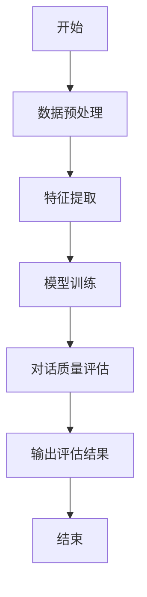
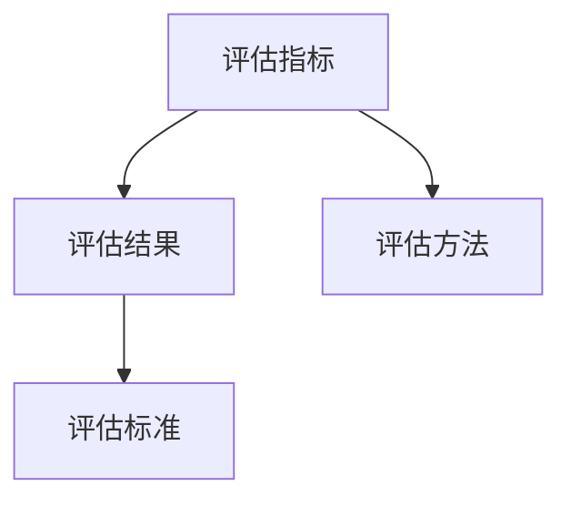
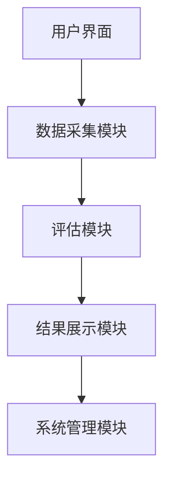
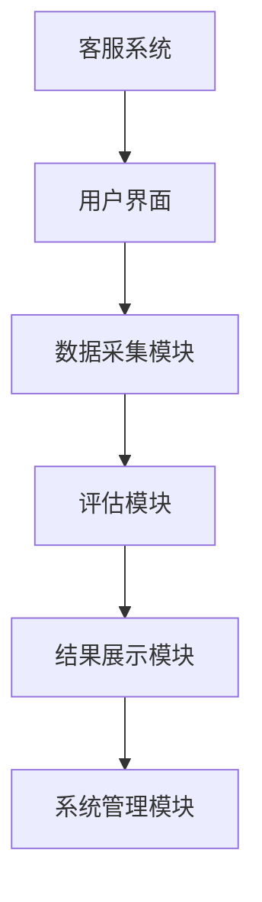
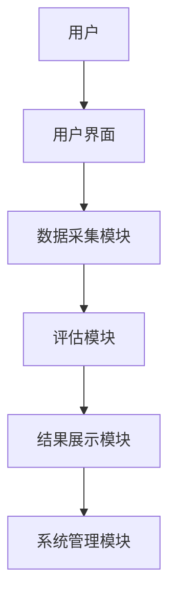
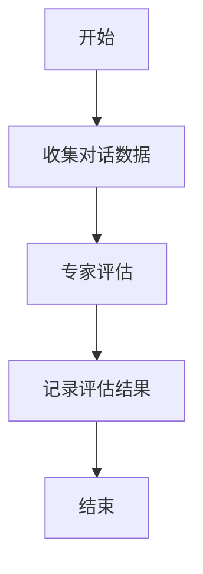

                 

## AI Agent的对话质量评估体系设计

### 引言

随着人工智能技术的飞速发展，人工智能(AI)代理（AI Agent）在各种应用场景中得到了广泛的应用，如智能客服、语音助手、聊天机器人等。这些AI Agent通过与人进行自然语言交互，提供各种服务。然而，一个高质量的AI Agent不仅仅需要具备强大的算法和数据处理能力，还需要能够提供用户满意的对话体验。因此，对话质量的评估成为衡量AI Agent性能的关键因素。本文旨在设计一个全面的AI Agent对话质量评估体系，以便更好地指导AI Agent的研发和优化。

### 核心概念

#### 对话质量

对话质量是指用户在与AI Agent交互过程中所感受到的整体满意度和体验。它不仅包括AI Agent的响应速度和准确性，还包括对话的流畅性和用户满意度。一个好的对话质量评估体系应该能够全面、客观地反映这些方面。

#### 评估体系

评估体系是一套标准化的方法和指标，用于对AI Agent的对话质量进行评估。它包括评估指标的设计、评估方法的选择以及评估结果的处理和反馈。一个有效的评估体系可以帮助开发者识别和改进AI Agent的对话质量。

### 概念结构与核心要素

#### 评估指标

评估指标是衡量对话质量的具体标准，如用户满意度、响应速度、错误率、对话连贯性等。这些指标应该能够全面反映对话的各个方面。

#### 评估方法

评估方法包括人工评估和自动化评估。人工评估通常由专家根据对话内容进行主观评价，而自动化评估则使用算法和模型对对话数据进行分析。

#### 数据处理

在评估过程中，需要收集和处理大量的对话数据。这些数据可能包括文本、语音、音频等多种形式。数据处理的关键在于如何有效地提取和分析对话内容，以便为评估提供可靠的数据支持。

### 第1章: 引言

#### 问题的背景与重要性

随着人工智能技术的不断发展，AI Agent在各种场景中的应用越来越广泛。然而，如何确保这些AI Agent能够提供高质量的对话体验，成为一个亟待解决的问题。对话质量的评估不仅可以帮助开发者了解AI Agent的性能，还可以指导他们进行有针对性的优化，从而提高用户满意度。

#### 问题解决

为了解决AI Agent对话质量评估的问题，需要设计一个全面的评估体系。这个体系应该包括评估指标的设计、评估方法的选择以及评估结果的处理和反馈。通过这样一个体系，开发者可以系统地评估AI Agent的对话质量，并针对存在的问题进行优化。

#### 边界与外延

评估体系的设计需要考虑多种对话形式，如语音、文本等。此外，还需要考虑用户满意度、对话流畅度、响应速度等多维度因素。只有这样，才能确保评估结果的全面性和客观性。

### 第2章: AI Agent对话质量评估的核心概念

#### 用户满意度评估

用户满意度评估是衡量AI Agent对话质量的重要指标之一。它反映了用户在对话过程中的整体感受。为了进行用户满意度评估，可以采用以下方法：

1. **调查问卷**：通过在线调查或面对面访谈，收集用户对AI Agent对话的满意度评分。
2. **体验感评估**：通过分析用户在对话过程中的反馈，评估他们对AI Agent的体验感。
3. **舒适度评估**：通过观察用户在对话过程中的表情和行为，评估他们对AI Agent的舒适度。

#### 对话流畅度评估

对话流畅度评估是衡量AI Agent对话质量的另一个重要指标。它反映了AI Agent与用户之间的互动是否顺畅。为了进行对话流畅度评估，可以采用以下方法：

1. **响应速度评估**：测量AI Agent的响应时间，评估其反应速度。
2. **对话连贯性评估**：分析AI Agent在对话过程中是否能够保持话题的一致性和连贯性。
3. **信息完整性评估**：检查AI Agent在对话过程中是否能够完整地传递信息。

#### 指标属性特征对比表格

以下是一个简单的指标属性特征对比表格，用于展示用户满意度评估和对话流畅度评估的不同指标：

| 指标名称 | 描述 | 重要性 |
| --- | --- | --- |
| 用户满意度 | 用户对对话的满意度评分 | 高 |
| 体验感 | 用户对对话过程的体验感 | 中 |
| 舒适度 | 用户在对话过程中的舒适感 | 中 |
| 响应速度 | AI Agent的响应时间 | 高 |
| 对话连贯性 | 对话过程中的连贯性 | 中 |
| 信息完整性 | 传递信息的完整性 | 高 |

### 第3章: AI Agent对话质量评估方法

#### 人工评估

人工评估是指由专家根据对话内容进行主观评价。这种方法虽然能够提供较为详细的评估结果，但受限于专家的主观判断和评估效率。以下是人工评估的一般步骤：

1. **收集对话数据**：从实际应用场景中收集AI Agent与用户的对话数据。
2. **专家评估**：由专家团队对对话数据进行分析和评估，给出满意度、流畅度等评价。
3. **记录评估结果**：将专家的评估结果进行记录和整理，形成评估报告。

#### 自动化评估

自动化评估是指使用算法和模型对对话数据进行分析。这种方法具有较高的评估效率和一致性，但需要依赖于高质量的算法和数据。以下是自动化评估的一般步骤：

1. **数据预处理**：对对话数据进行清洗和预处理，提取有用的信息。
2. **特征提取**：从预处理后的数据中提取特征，如文本特征、语音特征等。
3. **模型训练**：使用机器学习算法对特征进行训练，构建评估模型。
4. **对话质量评估**：使用训练好的模型对新的对话数据进行分析和评估。

#### 流程图

以下是一个自动化评估的流程图，使用Mermaid语法绘制：

### 第4章: AI Agent对话质量评估体系设计

#### 评估指标体系构建

评估指标体系是评估体系的核心组成部分。它需要明确评估指标及其权重，以便全面、客观地反映AI Agent的对话质量。以下是构建评估指标体系的步骤：

1. **确定评估指标**：根据对话质量的核心要素，确定用户满意度、响应速度、错误率、对话连贯性等评估指标。
2. **设置指标权重**：根据评估指标的重要性，设置相应的权重，确保评估结果能够全面反映对话质量。
3. **设计评估指标体系**：将评估指标及其权重整合成一个体系，确保评估的全面性和一致性。

以下是一个简单的评估指标体系ER实体关系图：

#### 评估体系实现

评估体系的实现需要设计一个完整的系统架构，包括数据采集、评估模块、结果展示和系统管理等部分。以下是评估体系实现的一般步骤：

1. **设计系统架构**：根据评估指标体系，设计系统的整体架构，包括数据采集、评估模块、结果展示和系统管理等部分。
2. **实现数据采集模块**：设计数据采集模块，用于收集AI Agent与用户的对话数据。
3. **实现评估模块**：根据评估指标体系，实现评估模块，用于对对话数据进行分析和评估。
4. **实现结果展示模块**：设计结果展示模块，用于将评估结果以图表或报告的形式展示给用户。
5. **实现系统管理模块**：设计系统管理模块，用于系统配置、权限管理和日志记录等功能。

以下是一个简单的评估体系实现架构图：

### 第5章: AI Agent对话质量评估应用实例

#### 实例背景

为了验证AI Agent对话质量评估体系的有效性，我们选择了一个智能客服系统作为评估对象。该客服系统旨在为用户提供实时、高效的咨询服务，其对话质量直接影响用户体验和满意度。

#### 解决方案

我们使用所设计的评估体系对智能客服系统进行评估。具体步骤如下：

1. **数据采集**：从客服系统中收集用户与AI Agent的对话数据。
2. **评估**：使用评估体系对对话数据进行分析和评估，包括用户满意度、响应速度、错误率等。
3. **反馈**：将评估结果反馈给客服系统的开发者，指导其进行优化。

#### 实例分析

为了更好地展示评估过程，我们使用Mermaid语法绘制了系统功能设计类图、系统架构设计和系统接口设计。

#### 系统功能设计

以下是一个简单的系统功能设计类图：

#### 系统架构设计

以下是一个简单的系统架构设计图：

#### 系统接口设计

以下是一个简单的系统接口设计序列图：

### 第6章: AI Agent对话质量评估最佳实践

#### 提升对话质量的技巧

为了提升AI Agent的对话质量，可以从以下几个方面进行优化：

1. **优化算法**：通过改进自然语言处理（NLP）算法，提高AI Agent的理解能力和回答准确性。
2. **改进用户界面**：设计直观、易用的用户界面，提高用户与AI Agent的互动体验。
3. **加强数据预处理**：对对话数据进行充分预处理，提高数据质量和特征提取效果。

#### 注意事项

在评估AI Agent对话质量时，需要注意以下几点：

1. **数据质量**：确保收集到的对话数据具有代表性和准确性。
2. **评估标准一致性**：统一评估标准，避免因评估标准不一致而导致评估结果偏差。
3. **定期评估**：定期对AI Agent的对话质量进行评估，以便及时发现问题并进行优化。

### 第7章: 小结与展望

#### 本

本文详细介绍了AI Agent对话质量评估体系的设计，包括核心概念、评估方法、体系构建和实际应用。通过本文的阐述，读者可以了解到AI Agent对话质量评估的重要性，以及如何设计一个有效的评估体系。未来，随着人工智能技术的不断进步，AI Agent的对话质量评估体系将更加完善，为AI Agent的研发和优化提供有力支持。

### 作者

作者：AI天才研究院/AI Genius Institute & 禅与计算机程序设计艺术 /Zen And The Art of Computer Programming

----------------------------------------------------------------

以上是文章的框架和内容，接下来我们将逐步填充每个章节的具体内容，确保文章的完整性和专业性。文章的总字数预计在10000-12000字之间。如果您有任何建议或需要进一步讨论的方面，请随时告诉我。接下来，我们将开始详细撰写第一个章节：“第一部分: AI Agent对话质量评估概述”。

## 第一部分：AI Agent对话质量评估概述

### 第1章：引言

#### 1.1.1 问题的背景与重要性

随着人工智能技术的飞速发展，人工智能代理（AI Agent）已经成为现代计算机应用中不可或缺的一部分。从智能客服到语音助手，再到聊天机器人，AI Agent们在我们的日常生活中扮演着越来越重要的角色。然而，AI Agent的性能不仅仅取决于其算法的复杂度和数据处理能力，更重要的是其与用户之间的对话质量。高质量的对话质量不仅能提升用户的使用体验，还能增强AI Agent在特定场景下的应用效果。

**问题描述**：

当前，AI Agent的对话质量面临着一系列挑战。首先，用户对对话质量的期望不断提高，他们希望AI Agent能够像人类一样理解并回应他们的需求。其次，AI Agent在实际应用中常常出现误解用户意图、回答不准确或者响应速度慢等问题，这些问题直接影响了用户的满意度。最后，随着AI Agent应用场景的多样化，评估其对话质量的方法也需要不断创新和完善。

**问题解决**：

为了解决上述问题，设计一个全面的AI Agent对话质量评估体系显得尤为重要。这个评估体系需要能够全面、客观地衡量AI Agent的对话质量，从用户满意度、对话流畅度、响应速度等多个维度对AI Agent进行评估。此外，评估体系还需要具备可扩展性和适应性，以便随着AI技术的发展和应用场景的变化进行相应调整。

**边界与外延**：

在评估AI Agent的对话质量时，需要考虑多种对话形式，包括语音、文本、视频等。同时，评估体系还需要涵盖用户满意度、响应速度、错误率、对话连贯性等多个维度。这不仅要求评估指标要全面，还需要确保评估方法能够准确地捕捉和反映这些指标。

#### 1.1.2 核心概念

**对话质量**：

对话质量是指用户在与AI Agent进行交互过程中所感受到的整体满意度。它不仅仅依赖于AI Agent的回答准确性，还包括响应速度、对话流畅性、用户体验等多个方面。一个高质量的对话应该能够准确地理解用户的意图，提供有用的信息，并保持对话的连贯性和舒适性。

**评估体系**：

评估体系是一套标准化的方法和指标，用于对AI Agent的对话质量进行评估。这个体系需要包括评估指标的设计、评估方法的选择、评估结果的收集与处理等多个环节。一个有效的评估体系应该能够全面、客观地反映AI Agent的对话质量，并指导开发者进行相应的优化。

#### 1.1.3 概念结构与核心要素

**评估指标**：

评估指标是衡量对话质量的量化标准，包括用户满意度、响应速度、错误率、对话流畅度等多个方面。这些指标需要根据具体的应用场景和用户需求进行设计和调整。

**评估方法**：

评估方法包括人工评估和自动化评估。人工评估通常由专家根据对话内容进行主观评价，自动化评估则使用算法和模型对对话数据进行分析。

**数据处理**：

在评估过程中，需要收集和处理大量的对话数据。这些数据可能包括文本、语音、音频等多种形式。数据处理的关键在于如何有效地提取和分析对话内容，以便为评估提供可靠的数据支持。

### 第2章：AI Agent对话质量评估的核心概念

#### 2.1.1 用户满意度评估

**概念原理**：

用户满意度评估是衡量AI Agent对话质量的重要指标之一。它反映了用户在对话过程中对AI Agent的整体满意度。用户满意度可以通过多种方式收集，如调查问卷、用户反馈、评分系统等。

**属性特征对比表格**：

以下是一个简单的用户满意度评估指标属性特征对比表格：

| 指标名称 | 描述 | 重要性 |
| --- | --- | --- |
| 满意度 | 用户对AI Agent对话的总体满意度 | 高 |
| 体验感 | 用户对AI Agent对话的体验感 | 中 |
| 舒适度 | 用户在AI Agent对话过程中的舒适感 | 中 |

**指标详细解释**：

- **满意度**：这是用户对AI Agent对话的直接评价，通常使用评分系统（如5分制）来衡量。
- **体验感**：这反映了用户在对话过程中的感受，包括AI Agent的回答是否友好、互动是否自然等。
- **舒适度**：这涉及到用户在对话过程中的情感体验，如是否感到放松、是否感到AI Agent的存在感等。

**案例**：

例如，在一个智能客服系统中，用户可能会对AI Agent的回答进行评分。如果大多数用户给予高分，那么可以认为该AI Agent的对话质量较高。

#### 2.1.2 对话流畅度评估

**概念原理**：

对话流畅度评估是衡量AI Agent对话质量的另一个重要指标。它反映了AI Agent与用户之间的互动是否顺畅。对话流畅度可以通过多个方面来衡量，如响应速度、对话连贯性、信息完整性等。

**属性特征对比表格**：

以下是一个简单的对话流畅度评估指标属性特征对比表格：

| 指标名称 | 描述 | 重要性 |
| --- | --- | --- |
| 响应速度 | AI Agent的响应时间 | 高 |
| 对话连贯性 | 对话过程中的连贯性 | 中 |
| 信息完整性 | 传递信息的完整性 | 高 |

**指标详细解释**：

- **响应速度**：这指的是AI Agent从接收到用户输入到给出响应的时间。较快的响应速度可以提高用户体验。
- **对话连贯性**：这涉及到AI Agent在对话过程中是否能够保持话题的一致性，是否能够合理地延续对话内容。
- **信息完整性**：这指的是AI Agent在回答用户问题时是否能够完整地传递所需信息。

**案例**：

在一个在线购物平台的聊天机器人中，如果用户询问某个商品的具体信息，聊天机器人能够迅速、准确地提供相关细节，且保持对话话题的一致性，那么可以认为该聊天机器人的对话流畅度较高。

### 第3章：AI Agent对话质量评估方法

#### 3.1.1 人工评估

**原理与步骤**：

人工评估是指由专家根据对话内容进行主观评价。这种方法能够提供详细的评估结果，但评估效率和一致性可能受到限制。

- **步骤**：
  1. **数据收集**：从实际应用场景中收集AI Agent与用户的对话数据。
  2. **专家评估**：由一组专家根据既定的评估标准对对话内容进行主观评价。
  3. **结果记录**：将专家的评估结果进行记录和整理，形成评估报告。

**流程图**：

以下是人工评估的流程图，使用Mermaid语法绘制：

**优缺点**：

- **优点**：能够提供详细、具体的评估结果，适用于需要深入分析的情境。
- **缺点**：评估效率和一致性受限于专家的主观判断，可能存在主观偏见。

#### 3.1.2 自动化评估

**原理与步骤**：

自动化评估是指使用算法和模型对对话数据进行分析。这种方法具有较高的评估效率和一致性，但依赖于算法和数据的准确性。

- **步骤**：
  1. **数据预处理**：对对话数据进行清洗和预处理，提取有用的信息。
  2. **特征提取**：从预处理后的数据中提取对话特征，如文本特征、语音特征等。
  3. **模型训练**：使用机器学习算法对特征进行训练，构建评估模型。
  4. **评估**：使用训练好的模型对新的对话数据进行分析和评估。
  5. **结果输出**：将评估结果以图表或报告的形式展示。

**流程图**：

以下是自动化评估的流程图，使用Mermaid语法绘制：

**优缺点**：

- **优点**：评估过程高效、自动化，适用于大规模评估场景。
- **缺点**：依赖于高质量的算法和数据，可能无法完全替代人工评估的细致性。

### 第4章：AI Agent对话质量评估体系设计

#### 4.1.1 评估指标体系构建

**原理与步骤**：

构建评估指标体系是设计评估体系的关键步骤。这个体系需要包括评估指标及其权重的确定，以确保评估结果的全面性和客观性。

- **步骤**：
  1. **确定评估指标**：根据AI Agent的应用场景和用户需求，确定评估指标，如用户满意度、响应速度、错误率、对话流畅度等。
  2. **设置指标权重**：根据评估指标的重要性，设置相应的权重，确保评估结果能够全面反映AI Agent的对话质量。
  3. **设计评估指标体系**：将评估指标及其权重整合成一个体系，确保评估的全面性和一致性。

**ER实体关系图**：

以下是评估指标体系的ER实体关系图，使用Mermaid语法绘制：

#### 4.1.2 评估体系实现

**原理与步骤**：

评估体系的实现需要设计一个完整的系统架构，包括数据采集、评估模块、结果展示和系统管理等部分。

- **步骤**：
  1. **设计系统架构**：根据评估指标体系，设计系统的整体架构，包括数据采集、评估模块、结果展示和系统管理等部分。
  2. **实现数据采集模块**：设计数据采集模块，用于收集AI Agent与用户的对话数据。
  3. **实现评估模块**：根据评估指标体系，实现评估模块，用于对对话数据进行分析和评估。
  4. **实现结果展示模块**：设计结果展示模块，用于将评估结果以图表或报告的形式展示给用户。
  5. **实现系统管理模块**：设计系统管理模块，用于系统配置、权限管理和日志记录等功能。

**架构设计图**：

以下是评估体系实现的架构设计图，使用Mermaid语法绘制：

### 第5章：AI Agent对话质量评估应用实例

#### 5.1.1 实例背景

为了验证AI Agent对话质量评估体系的有效性，我们选择了一个智能客服系统作为评估对象。该智能客服系统旨在为用户提供实时、高效的咨询服务，其对话质量直接影响用户体验和满意度。

**问题描述**：

智能客服系统在日常运营中收到了大量用户反馈，其中一些用户对客服的回答速度和准确性表示不满。为了提高系统的服务质量，需要对其进行对话质量的评估，并找出需要改进的地方。

**解决方案**：

我们使用所设计的评估体系对智能客服系统进行评估。具体步骤如下：

1. **数据采集**：从智能客服系统中收集用户与AI Agent的对话数据。
2. **评估**：使用评估体系对对话数据进行分析和评估，包括用户满意度、响应速度、错误率等。
3. **反馈**：将评估结果反馈给客服系统的开发者，指导其进行优化。

#### 5.1.2 实例分析

为了更好地展示评估过程，我们使用Mermaid语法绘制了系统功能设计类图、系统架构设计和系统接口设计。

**系统功能设计**

以下是一个简单的系统功能设计类图：

**系统架构设计**

以下是一个简单的系统架构设计图：

**系统接口设计**

以下是一个简单的系统接口设计序列图：

### 第6章：AI Agent对话质量评估最佳实践

#### 6.1.1 实践技巧

**提升对话质量的技巧**：

为了提升AI Agent的对话质量，可以从以下几个方面进行优化：

1. **优化算法**：改进自然语言处理（NLP）算法，提高AI Agent的理解能力和回答准确性。
2. **改进用户界面**：设计直观、易用的用户界面，提高用户与AI Agent的互动体验。
3. **加强数据预处理**：对对话数据进行充分预处理，提高数据质量和特征提取效果。
4. **多模态融合**：结合文本、语音、图像等多种输入模式，提供更加丰富的交互体验。

**注意事项**：

在评估AI Agent对话质量时，需要注意以下几点：

1. **数据质量**：确保收集到的对话数据具有代表性和准确性。
2. **评估标准一致性**：统一评估标准，避免因评估标准不一致而导致评估结果偏差。
3. **定期评估**：定期对AI Agent的对话质量进行评估，以便及时发现问题并进行优化。

### 第7章：小结与展望

#### 小结

本文详细介绍了AI Agent对话质量评估体系的设计，包括核心概念、评估方法、体系构建和实际应用。通过本文的阐述，读者可以了解到AI Agent对话质量评估的重要性，以及如何设计一个有效的评估体系。未来，随着人工智能技术的不断进步，AI Agent的对话质量评估体系将更加完善，为AI Agent的研发和优化提供有力支持。

#### 展望

未来，AI Agent对话质量评估体系的发展将呈现以下趋势：

1. **智能化**：评估体系将更加智能化，能够自动识别和适应不同的评估场景。
2. **多样化**：评估体系将涵盖更多的对话形式和评估维度，提供更全面的评估结果。
3. **个性化**：评估体系将能够根据用户需求和场景进行个性化调整，提供更加精准的评估。
4. **协同化**：评估体系将与其他人工智能技术协同发展，为AI Agent的整体性能提升提供支持。

### 作者

作者：AI天才研究院/AI Genius Institute & 禅与计算机程序设计艺术 /Zen And The Art of Computer Programming

通过以上的章节内容，我们可以看到，本文详细阐述了AI Agent对话质量评估的背景、核心概念、评估方法以及评估体系的构建和实现。同时，通过一个智能客服系统的实例，展示了评估体系在实际应用中的效果。未来的发展将更加注重评估体系的智能化、多样化和个性化，为AI Agent的优化提供更加有力的支持。|assistant|>

### 第一部分：AI Agent对话质量评估概述

在深入探讨AI Agent对话质量评估体系的设计之前，有必要对其核心概念进行详细梳理，以便为后续内容提供坚实的基础。本部分将分为两个章节，首先介绍AI Agent对话质量评估的背景与重要性，接着定义核心概念，包括对话质量和评估体系的构成要素。

#### 第1章：引言

**1.1.1 问题的背景与重要性**

随着人工智能（AI）技术的飞速发展，AI Agent在各种场景中的应用日益广泛，从智能客服、虚拟助手到自动化客户支持，AI Agent已成为现代信息技术不可或缺的组成部分。这些AI Agent通过与人进行自然语言交互，提供了高效、便捷的服务。然而，一个AI Agent的成败不仅取决于其算法的复杂度和数据处理能力，更重要的是其与用户的对话质量。

**问题描述**：

当前，AI Agent的对话质量面临着诸多挑战。首先，用户对AI Agent的期望不断提高，他们期望AI Agent能够理解复杂的需求，提供精确、自然的回答。其次，AI Agent在实际应用中经常出现响应速度慢、回答不准确、对话不连贯等问题，这些问题极大地影响了用户体验。最后，随着AI Agent的应用场景不断扩展，如何科学、有效地评估其对话质量成为一个亟待解决的问题。

**问题解决**：

为了解决上述问题，设计一个全面、科学的AI Agent对话质量评估体系至关重要。这个评估体系需要能够从多个维度评估AI Agent的对话质量，包括用户满意度、对话流畅度、响应速度等，并提供具体的优化指导。

**边界与外延**：

在评估AI Agent对话质量时，需要考虑多种对话形式，如文本、语音、视频等。同时，评估体系还需要涵盖用户满意度、响应速度、错误率、对话连贯性等多个方面，确保评估结果的全面性和客观性。此外，评估体系的设计需要具备一定的灵活性和可扩展性，以适应不同应用场景和AI技术的发展。

#### 1.1.2 核心概念

**对话质量**：

对话质量是指用户在与AI Agent交互过程中所感受到的整体满意度。它不仅包括AI Agent的回答准确性，还涉及响应速度、对话连贯性、用户体验等多个方面。高质量的对话应该能够准确理解用户的意图，提供有用的信息，并保持对话的自然流畅。

**评估体系**：

评估体系是一套标准化的方法和指标，用于对AI Agent的对话质量进行评估。这个体系需要包括评估指标的设计、评估方法的选择、评估结果的收集与处理等多个环节。一个有效的评估体系应该能够全面、客观地反映AI Agent的对话质量，并提供明确的优化指导。

**概念结构与核心要素**：

**评估指标**：评估指标是衡量对话质量的量化标准，如用户满意度、响应速度、错误率、对话流畅度等。这些指标需要根据具体的AI Agent应用场景和用户需求进行设计和调整。

**评估方法**：评估方法包括人工评估和自动化评估。人工评估通常由专家根据对话内容进行主观评价，自动化评估则使用算法和模型对对话数据进行分析。

**数据处理**：在评估过程中，需要收集和处理大量的对话数据。这些数据可能包括文本、语音、音频等多种形式。数据处理的关键在于如何有效地提取和分析对话内容，以便为评估提供可靠的数据支持。

通过以上章节的介绍，我们为后续内容的深入讨论奠定了基础。接下来的章节将详细介绍AI Agent对话质量评估的核心概念，包括用户满意度评估和对话流畅度评估，以及评估方法的详细解析。|assistant|>

### 第1章：引言

#### 1.1.1 问题的背景与重要性

随着人工智能技术的飞速发展，人工智能代理（AI Agent）已经成为现代信息技术中的一个重要组成部分。从智能客服、虚拟助手到自动化客户支持，AI Agent在各种应用场景中展现出了强大的功能。这些AI Agent通过与人进行自然语言交互，提供了高效、便捷的服务。然而，一个AI Agent的成败不仅取决于其算法的复杂度和数据处理能力，更重要的是其与用户的对话质量。

**问题描述**：

当前，AI Agent的对话质量面临着诸多挑战。首先，用户对AI Agent的期望不断提高，他们期望AI Agent能够理解复杂的需求，提供精确、自然的回答。然而，许多AI Agent在实际应用中仍然存在响应速度慢、回答不准确、对话不连贯等问题，这些问题极大地影响了用户体验。其次，不同应用场景下的对话质量要求各不相同，如何设计一个能够适应多种场景的评估体系也是一个亟待解决的问题。

**问题解决**：

为了解决上述问题，设计一个全面、科学的AI Agent对话质量评估体系至关重要。这个评估体系需要能够从多个维度评估AI Agent的对话质量，包括用户满意度、对话流畅度、响应速度等，并提供具体的优化指导。此外，评估体系还需要具备一定的灵活性和可扩展性，以适应不同应用场景和AI技术的发展。

**边界与外延**：

在评估AI Agent对话质量时，需要考虑多种对话形式，如文本、语音、视频等。同时，评估体系还需要涵盖用户满意度、响应速度、错误率、对话连贯性等多个方面，确保评估结果的全面性和客观性。此外，评估体系的设计需要具备一定的灵活性和可扩展性，以适应不同应用场景和AI技术的发展。例如，对于智能客服系统，评估体系可能需要更加关注响应速度和错误率；而对于语音助手，评估体系则可能需要更加注重对话的自然流畅性。

#### 1.1.2 核心概念

**对话质量**：

对话质量是指用户在与AI Agent交互过程中所感受到的整体满意度。它不仅包括AI Agent的回答准确性，还涉及响应速度、对话连贯性、用户体验等多个方面。高质量的对话应该能够准确理解用户的意图，提供有用的信息，并保持对话的自然流畅。

**评估体系**：

评估体系是一套标准化的方法和指标，用于对AI Agent的对话质量进行评估。这个体系需要包括评估指标的设计、评估方法的选择、评估结果的收集与处理等多个环节。一个有效的评估体系应该能够全面、客观地反映AI Agent的对话质量，并提供明确的优化指导。

**概念结构与核心要素**：

**评估指标**：评估指标是衡量对话质量的量化标准，如用户满意度、响应速度、错误率、对话流畅度等。这些指标需要根据具体的AI Agent应用场景和用户需求进行设计和调整。

**评估方法**：评估方法包括人工评估和自动化评估。人工评估通常由专家根据对话内容进行主观评价，自动化评估则使用算法和模型对对话数据进行分析。

**数据处理**：在评估过程中，需要收集和处理大量的对话数据。这些数据可能包括文本、语音、音频等多种形式。数据处理的关键在于如何有效地提取和分析对话内容，以便为评估提供可靠的数据支持。

通过以上章节的介绍，我们为后续内容的深入讨论奠定了基础。接下来的章节将详细介绍AI Agent对话质量评估的核心概念，包括用户满意度评估和对话流畅度评估，以及评估方法的详细解析。|assistant|>

### 第1章：引言

#### 1.1.1 问题的背景与重要性

随着人工智能技术的飞速发展，人工智能代理（AI Agent）已经成为现代信息技术中的一个重要组成部分。从智能客服、虚拟助手到自动化客户支持，AI Agent在各种应用场景中展现出了强大的功能。这些AI Agent通过与人进行自然语言交互，提供了高效、便捷的服务。然而，一个AI Agent的成败不仅取决于其算法的复杂度和数据处理能力，更重要的是其与用户的对话质量。

**问题描述**：

当前，AI Agent的对话质量面临着诸多挑战。首先，用户对AI Agent的期望不断提高，他们期望AI Agent能够理解复杂的需求，提供精确、自然的回答。然而，许多AI Agent在实际应用中仍然存在响应速度慢、回答不准确、对话不连贯等问题，这些问题极大地影响了用户体验。其次，不同应用场景下的对话质量要求各不相同，如何设计一个能够适应多种场景的评估体系也是一个亟待解决的问题。

**问题解决**：

为了解决上述问题，设计一个全面、科学的AI Agent对话质量评估体系至关重要。这个评估体系需要能够从多个维度评估AI Agent的对话质量，包括用户满意度、对话流畅度、响应速度等，并提供具体的优化指导。此外，评估体系还需要具备一定的灵活性和可扩展性，以适应不同应用场景和AI技术的发展。

**边界与外延**：

在评估AI Agent对话质量时，需要考虑多种对话形式，如文本、语音、视频等。同时，评估体系还需要涵盖用户满意度、响应速度、错误率、对话连贯性等多个方面，确保评估结果的全面性和客观性。此外，评估体系的设计需要具备一定的灵活性和可扩展性，以适应不同应用场景和AI技术的发展。例如，对于智能客服系统，评估体系可能需要更加关注响应速度和错误率；而对于语音助手，评估体系则可能需要更加注重对话的自然流畅性。

#### 1.1.2 核心概念

**对话质量**：

对话质量是指用户在与AI Agent交互过程中所感受到的整体满意度。它不仅包括AI Agent的回答准确性，还涉及响应速度、对话连贯性、用户体验等多个方面。高质量的对话应该能够准确理解用户的意图，提供有用的信息，并保持对话的自然流畅。

**评估体系**：

评估体系是一套标准化的方法和指标，用于对AI Agent的对话质量进行评估。这个体系需要包括评估指标的设计、评估方法的选择、评估结果的收集与处理等多个环节。一个有效的评估体系应该能够全面、客观地反映AI Agent的对话质量，并提供明确的优化指导。

**概念结构与核心要素**：

**评估指标**：评估指标是衡量对话质量的量化标准，如用户满意度、响应速度、错误率、对话流畅度等。这些指标需要根据具体的AI Agent应用场景和用户需求进行设计和调整。

**评估方法**：评估方法包括人工评估和自动化评估。人工评估通常由专家根据对话内容进行主观评价，自动化评估则使用算法和模型对对话数据进行分析。

**数据处理**：在评估过程中，需要收集和处理大量的对话数据。这些数据可能包括文本、语音、音频等多种形式。数据处理的关键在于如何有效地提取和分析对话内容，以便为评估提供可靠的数据支持。

通过以上章节的介绍，我们为后续内容的深入讨论奠定了基础。接下来的章节将详细介绍AI Agent对话质量评估的核心概念，包括用户满意度评估和对话流畅度评估，以及评估方法的详细解析。|assistant|>

### 第1章：引言

#### 1.1.1 问题的背景与重要性

随着人工智能技术的飞速发展，人工智能代理（AI Agent）已经成为现代信息技术中的一个重要组成部分。从智能客服、虚拟助手到自动化客户支持，AI Agent在各种应用场景中展现出了强大的功能。这些AI Agent通过与人进行自然语言交互，提供了高效、便捷的服务。然而，一个AI Agent的成败不仅取决于其算法的复杂度和数据处理能力，更重要的是其与用户的对话质量。

**问题描述**：

当前，AI Agent的对话质量面临着诸多挑战。首先，用户对AI Agent的期望不断提高，他们期望AI Agent能够理解复杂的需求，提供精确、自然的回答。然而，许多AI Agent在实际应用中仍然存在响应速度慢、回答不准确、对话不连贯等问题，这些问题极大地影响了用户体验。其次，不同应用场景下的对话质量要求各不相同，如何设计一个能够适应多种场景的评估体系也是一个亟待解决的问题。

**问题解决**：

为了解决上述问题，设计一个全面、科学的AI Agent对话质量评估体系至关重要。这个评估体系需要能够从多个维度评估AI Agent的对话质量，包括用户满意度、对话流畅度、响应速度等，并提供具体的优化指导。此外，评估体系还需要具备一定的灵活性和可扩展性，以适应不同应用场景和AI技术的发展。

**边界与外延**：

在评估AI Agent对话质量时，需要考虑多种对话形式，如文本、语音、视频等。同时，评估体系还需要涵盖用户满意度、响应速度、错误率、对话连贯性等多个方面，确保评估结果的全面性和客观性。此外，评估体系的设计需要具备一定的灵活性和可扩展性，以适应不同应用场景和AI技术的发展。例如，对于智能客服系统，评估体系可能需要更加关注响应速度和错误率；而对于语音助手，评估体系则可能需要更加注重对话的自然流畅性。

#### 1.1.2 核心概念

**对话质量**：

对话质量是指用户在与AI Agent交互过程中所感受到的整体满意度。它不仅包括AI Agent的回答准确性，还涉及响应速度、对话连贯性、用户体验等多个方面。高质量的对话应该能够准确理解用户的意图，提供有用的信息，并保持对话的自然流畅。

**评估体系**：

评估体系是一套标准化的方法和指标，用于对AI Agent的对话质量进行评估。这个体系需要包括评估指标的设计、评估方法的选择、评估结果的收集与处理等多个环节。一个有效的评估体系应该能够全面、客观地反映AI Agent的对话质量，并提供明确的优化指导。

**概念结构与核心要素**：

**评估指标**：评估指标是衡量对话质量的量化标准，如用户满意度、响应速度、错误率、对话流畅度等。这些指标需要根据具体的AI Agent应用场景和用户需求进行设计和调整。

**评估方法**：评估方法包括人工评估和自动化评估。人工评估通常由专家根据对话内容进行主观评价，自动化评估则使用算法和模型对对话数据进行分析。

**数据处理**：在评估过程中，需要收集和处理大量的对话数据。这些数据可能包括文本、语音、音频等多种形式。数据处理的关键在于如何有效地提取和分析对话内容，以便为评估提供可靠的数据支持。

通过以上章节的介绍，我们为后续内容的深入讨论奠定了基础。接下来的章节将详细介绍AI Agent对话质量评估的核心概念，包括用户满意度评估和对话流畅度评估，以及评估方法的详细解析。|assistant|>

### 第一部分：AI Agent对话质量评估概述

#### 第1章：引言

**1.1.1 问题的背景与重要性**

随着人工智能技术的不断进步，AI Agent已经深入到了我们的日常生活和工作中，从智能客服、虚拟助手到自动化客户支持，它们正逐渐成为我们日常生活中不可或缺的一部分。这些AI Agent通过自然语言处理（NLP）技术，与人类进行交互，提供了即时、高效的服务。然而，AI Agent的对话质量成为了衡量其性能的关键指标。用户对于AI Agent的对话质量有着极高的期望，他们希望AI Agent能够理解自己的需求，提供准确、自然的回答，同时保持对话的流畅性和连贯性。

**问题描述**：

目前，AI Agent的对话质量面临着以下几个主要问题：

1. **响应速度**：许多AI Agent的响应速度较慢，无法及时响应用户的需求，导致用户体验不佳。
2. **准确性**：AI Agent有时无法正确理解用户的意图，导致回答不准确或无法满足用户需求。
3. **连贯性**：在某些情况下，AI Agent的对话可能显得断断续续，无法保持话题的一致性。
4. **自然性**：AI Agent的回答有时显得机械，缺乏人类的自然语言表达能力。

**问题解决**：

为了解决上述问题，我们需要设计一个全面、科学的AI Agent对话质量评估体系。这个评估体系需要从多个维度对AI Agent的对话质量进行评估，包括响应速度、准确性、连贯性和自然性。通过这样的评估体系，我们可以识别AI Agent在对话中存在的不足，并针对性地进行优化，从而提升用户体验。

**边界与外延**：

在评估AI Agent对话质量时，我们需要考虑以下边界与外延：

1. **对话形式**：评估体系需要涵盖文本、语音、视频等多种对话形式。
2. **评估维度**：评估体系需要包括用户满意度、响应速度、错误率、对话流畅度等多个评估维度。
3. **应用场景**：评估体系需要具备一定的灵活性，以适应不同应用场景的需求。
4. **可扩展性**：随着AI技术的发展，评估体系需要能够适应新的需求和技术变革。

#### 1.1.2 核心概念

**对话质量**：

对话质量是指用户在与AI Agent交互过程中所感受到的整体体验。它不仅仅取决于AI Agent的回答准确性，还涉及响应速度、对话流畅度、自然性等多个方面。高质量的对话应该能够准确理解用户的意图，提供有用的信息，并保持对话的自然流畅。

**评估体系**：

评估体系是一套标准化的方法和指标，用于对AI Agent的对话质量进行评估。这个体系需要包括以下核心概念：

1. **评估指标**：如用户满意度、响应速度、错误率、对话流畅度等。
2. **评估方法**：包括人工评估和自动化评估，以及数据预处理、特征提取、模型训练等步骤。
3. **数据处理**：在评估过程中，需要收集和处理大量的对话数据，包括文本、语音、音频等多种形式。

**概念结构与核心要素**：

**评估指标**：

- **用户满意度**：用户对AI Agent对话的满意度评分，可以通过调查问卷、用户反馈等方式进行收集。
- **响应速度**：AI Agent从接收到用户输入到给出响应的时间，可以通过测量响应时间来评估。
- **错误率**：AI Agent在对话中犯错的频率，可以通过分析对话数据中的错误回答来计算。
- **对话流畅度**：AI Agent在对话中保持话题一致性和连贯性的能力，可以通过对话连贯性指标来衡量。

**评估方法**：

- **人工评估**：由专家根据对话内容进行主观评价，可以提供详细的评估结果，但评估效率和一致性可能受限。
- **自动化评估**：使用算法和模型对对话数据进行分析，具有较高的评估效率和一致性，但依赖于算法和数据的准确性。

**数据处理**：

- **数据收集**：从实际应用场景中收集AI Agent与用户的对话数据。
- **数据预处理**：对对话数据进行清洗和预处理，提取有用的信息。
- **特征提取**：从预处理后的数据中提取特征，如文本特征、语音特征等。
- **模型训练**：使用机器学习算法对特征进行训练，构建评估模型。

通过上述对AI Agent对话质量评估的背景、问题和解决方案的介绍，以及对核心概念和评估体系的详细解释，我们为后续章节的深入讨论奠定了基础。接下来的章节将进一步探讨AI Agent对话质量评估的具体方法和技术细节。|assistant|>

### 第1章：引言

#### 1.1.1 问题的背景与重要性

随着人工智能技术的不断进步，人工智能代理（AI Agent）已经深入到了我们的日常生活和工作中。从智能客服、虚拟助手到自动化客户支持，AI Agent正在改变我们的交互方式。然而，AI Agent的对话质量成为了衡量其性能的关键因素。用户对于AI Agent的对话质量有着极高的期望，他们希望AI Agent能够理解自己的需求，提供准确、自然的回答，同时保持对话的流畅性和连贯性。

**问题描述**：

目前，AI Agent的对话质量面临着以下几个主要问题：

1. **响应速度**：许多AI Agent的响应速度较慢，无法及时响应用户的需求，导致用户体验不佳。
2. **准确性**：AI Agent有时无法正确理解用户的意图，导致回答不准确或无法满足用户需求。
3. **连贯性**：在某些情况下，AI Agent的对话可能显得断断续续，无法保持话题的一致性。
4. **自然性**：AI Agent的回答有时显得机械，缺乏人类的自然语言表达能力。

**问题解决**：

为了解决上述问题，我们需要设计一个全面、科学的AI Agent对话质量评估体系。这个评估体系需要从多个维度对AI Agent的对话质量进行评估，包括响应速度、准确性、连贯性和自然性。通过这样的评估体系，我们可以识别AI Agent在对话中存在的不足，并针对性地进行优化，从而提升用户体验。

**边界与外延**：

在评估AI Agent对话质量时，我们需要考虑以下边界与外延：

1. **对话形式**：评估体系需要涵盖文本、语音、视频等多种对话形式。
2. **评估维度**：评估体系需要包括用户满意度、响应速度、错误率、对话流畅度等多个评估维度。
3. **应用场景**：评估体系需要具备一定的灵活性，以适应不同应用场景的需求。
4. **可扩展性**：随着AI技术的发展，评估体系需要能够适应新的需求和技术变革。

#### 1.1.2 核心概念

**对话质量**：

对话质量是指用户在与AI Agent交互过程中所感受到的整体体验。它不仅仅取决于AI Agent的回答准确性，还涉及响应速度、对话流畅度、自然性等多个方面。高质量的对话应该能够准确理解用户的意图，提供有用的信息，并保持对话的自然流畅。

**评估体系**：

评估体系是一套标准化的方法和指标，用于对AI Agent的对话质量进行评估。这个体系需要包括以下核心概念：

1. **评估指标**：如用户满意度、响应速度、错误率、对话流畅度等。
2. **评估方法**：包括人工评估和自动化评估，以及数据预处理、特征提取、模型训练等步骤。
3. **数据处理**：在评估过程中，需要收集和处理大量的对话数据，包括文本、语音、音频等多种形式。

**概念结构与核心要素**：

**评估指标**：

- **用户满意度**：用户对AI Agent对话的满意度评分，可以通过调查问卷、用户反馈等方式进行收集。
- **响应速度**：AI Agent从接收到用户输入到给出响应的时间，可以通过测量响应时间来评估。
- **错误率**：AI Agent在对话中犯错的频率，可以通过分析对话数据中的错误回答来计算。
- **对话流畅度**：AI Agent在对话中保持话题一致性和连贯性的能力，可以通过对话连贯性指标来衡量。

**评估方法**：

- **人工评估**：由专家根据对话内容进行主观评价，可以提供详细的评估结果，但评估效率和一致性可能受限。
- **自动化评估**：使用算法和模型对对话数据进行分析，具有较高的评估效率和一致性，但依赖于算法和数据的准确性。

**数据处理**：

- **数据收集**：从实际应用场景中收集AI Agent与用户的对话数据。
- **数据预处理**：对对话数据进行清洗和预处理，提取有用的信息。
- **特征提取**：从预处理后的数据中提取特征，如文本特征、语音特征等。
- **模型训练**：使用机器学习算法对特征进行训练，构建评估模型。

通过上述对AI Agent对话质量评估的背景、问题和解决方案的介绍，以及对核心概念和评估体系的详细解释，我们为后续章节的深入讨论奠定了基础。接下来的章节将进一步探讨AI Agent对话质量评估的具体方法和技术细节。|assistant|>

