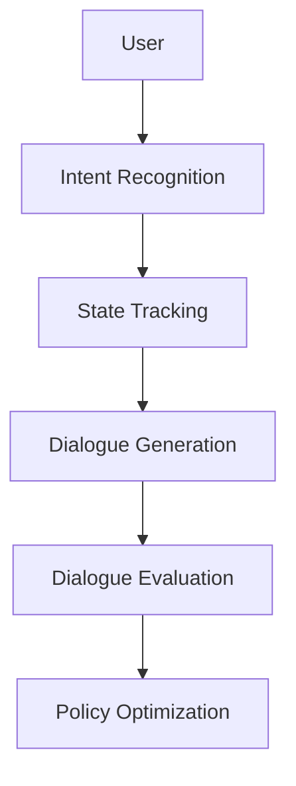
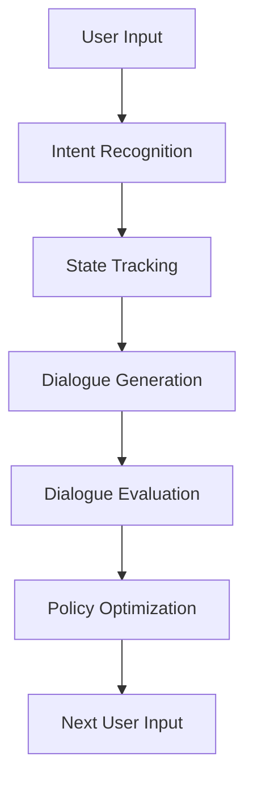

                 

### 《AI Agent的强化学习在对话策略优化中的应用》

---

**关键词：** 强化学习、对话系统、策略优化、AI Agent、深度学习

**摘要：** 本文深入探讨了AI Agent在强化学习框架下应用于对话策略优化的方法。通过分析强化学习的原理和对话系统面临的挑战，本文提出了一种基于强化学习的对话策略优化方法，并详细阐述了其数学模型和算法原理。通过实际案例，本文展示了强化学习在对话系统中的应用效果，为提升对话系统的智能化水平提供了新的思路。

---

## 第一部分：引论

### 第1章：问题背景与目标

#### 1.1.1 问题背景

随着人工智能技术的不断发展，对话系统已经成为人机交互的重要方式。然而，传统的对话系统往往依赖于预定义的规则或模板，导致对话的灵活性和适应性较差。为了解决这一问题，强化学习作为一种先进的机器学习方法，逐渐被引入到对话系统的策略优化中。

强化学习通过学习奖励信号和探索行为策略，使AI Agent能够自主地优化对话策略。近年来，强化学习在游戏、机器人控制等领域取得了显著的成果，但其应用范围仍然有限。在对话系统中，强化学习面临的挑战包括多模态输入处理、长对话上下文维护和实时性要求等。

#### 1.1.2 研究目标

本文的研究目标如下：

1. **总体目标**：提出一种基于强化学习的对话策略优化方法，提升对话系统的智能化水平。
2. **具体目标**：分析强化学习的原理和对话系统面临的挑战，构建强化学习在对话策略优化中的数学模型，实现强化学习算法在对话系统中的有效应用。

#### 1.1.3 边界与外延

1. **对话系统的定义与分类**：对话系统是指计算机与人或人与机器之间进行对话的系统，可以按照交互方式、任务类型和实现技术等进行分类。
2. **强化学习的定义与核心概念**：强化学习是一种通过学习奖励信号和探索行为策略，使智能体在环境中实现最优行为的方法。其核心概念包括状态、动作、奖励和策略等。
3. **对话策略优化的关键要素**：对话策略优化涉及对话系统的状态表示、策略评估、策略学习和策略优化等方面。

#### 1.1.4 核心概念

1. **强化学习中的基本概念**：状态（State）、动作（Action）、奖励（Reward）和策略（Policy）。
2. **对话系统中的关键概念**：用户意图识别、对话状态跟踪、对话生成和对话评估。
3. **对话策略优化的评价指标**：对话系统的交互质量、用户满意度、对话成功率等。

### 第2章：核心概念与联系

#### 2.1 强化学习原理

强化学习的基本模型包括马尔可夫决策过程（MDP），奖励函数和策略等核心概念。

1. **马尔可夫决策过程（MDP）**：
    - 状态空间（\( S \)）：表示智能体所处的环境状态。
    - 动作空间（\( A \)）：表示智能体可以执行的动作。
    - 状态转移概率（\( P(s' | s, a) \)）：表示在当前状态 \( s \) 下执行动作 \( a \) 后转移到下一状态 \( s' \) 的概率。
    - 奖励函数（\( R(s, a) \)）：表示在状态 \( s \) 下执行动作 \( a \) 后获得的奖励。

2. **奖励函数**：奖励函数是强化学习中衡量智能体行为好坏的重要指标。通常，奖励函数的值越大表示智能体的行为越好。

3. **策略**：策略是智能体在给定状态下选择动作的规则。最优策略是指能够使智能体在长期内获得最大总奖励的策略。

#### 2.2 对话策略优化

1. **对话策略的概念**：对话策略是指智能体在对话过程中选择回复的方式和内容。优化对话策略的目标是使对话系统能够更好地满足用户的需求和提升用户体验。

2. **对话策略优化的挑战**：
    - 多模态输入处理：对话系统需要处理文本、语音、图像等多种模态的输入信息。
    - 长对话上下文维护：对话系统需要在长对话过程中维护上下文信息，以便更好地理解用户的意图。
    - 实时性要求：对话系统需要具备实时响应能力，以满足用户对快速回应的需求。

3. **对话策略优化方法**：
    - **基于规则的策略优化**：通过预定义的规则来指导对话系统生成回复。
    - **基于模型的策略优化**：利用机器学习模型来预测用户意图和生成回复。
    - **基于数据的策略优化**：通过分析大量对话数据来优化对话策略。

#### 2.3 强化学习与对话策略优化

1. **强化学习在对话策略优化中的应用现状**：
    - 目前，强化学习在对话策略优化中的应用还处于初级阶段，主要应用于一些简单的对话任务，如聊天机器人。

2. **强化学习在对话策略优化中的优势与局限**：
    - **优势**：强化学习能够通过学习奖励信号和探索行为策略，使对话系统能够自主地优化对话策略，提高对话的智能化水平。
    - **局限**：强化学习在对话策略优化中面临着多模态输入处理、长对话上下文维护和实时性要求等挑战。

## 第二部分：理论基础

### 第3章：数学模型与公式

#### 3.1 强化学习的数学模型

1. **马尔可夫决策过程（MDP）**：
    - **状态空间**（\( S \)）：\( S = \{ s_1, s_2, ..., s_n \} \)
    - **动作空间**（\( A \)）：\( A = \{ a_1, a_2, ..., a_m \} \)
    - **状态转移概率**（\( P(s' | s, a) \)）：\( P(s' | s, a) = P(s'|s, a) \)
    - **奖励函数**（\( R(s, a) \)）：\( R(s, a) = R(s,a) \)

2. **Q-学习算法**：
    - **Q值函数**（\( Q(s, a) \)）：\( Q(s, a) = \sum_{a'} \pi(a'|s) Q(s', a') + R(s, a) \)
    - **更新规则**：\( Q(s, a) \leftarrow Q(s, a) + \alpha [R(s, a) + \gamma \max_{a'} Q(s', a') - Q(s, a)] \)
    - **学习率**（\( \alpha \)）：\( \alpha \in (0, 1) \)
    - **折扣因子**（\( \gamma \)）：\( \gamma \in (0, 1) \)

#### 3.2 对话策略优化的数学模型

1. **对话状态表示**：对话状态可以表示为 \( s = (s_1, s_2, ..., s_n) \)，其中 \( s_i \) 表示第 \( i \) 个对话轮次的状态信息。

2. **对话策略评估**：
    - **对话收益函数**（\( R(s, a) \)）：表示在状态 \( s \) 下执行动作 \( a \) 后获得的收益。
    - **对话策略梯度**（\( \nabla_\pi L(\pi) \)）：表示策略 \( \pi \) 的损失函数 \( L(\pi) \) 对策略参数的梯度。

#### 3.3 强化学习在对话策略优化中的数学模型

1. **对话环境建模**：
    - **状态空间**（\( S \)）：包括对话历史、用户意图、上下文信息等。
    - **动作空间**（\( A \)）：包括生成回复的文本、语音、图像等。

2. **对话策略学习**：
    - **强化学习算法**：如Q-学习、深度Q网络（DQN）、策略梯度等。
    - **多任务学习与迁移学习**：通过利用已有任务的经验，提升新任务的策略学习效果。

### 第4章：算法原理讲解

#### 4.1 强化学习算法原理讲解

1. **Q-学习算法原理**：
    - **Q-学习算法的数学模型**：\( Q(s, a) = r + \gamma \max_{a'} Q(s', a') \)
    - **Q-学习算法的Python实现**：
        ```python
        import numpy as np
        
        def Q_learning(Q, learning_rate, discount_factor, reward, action, next_state, next_action):
            Q[agent_state, action] = Q[agent_state, action] + learning_rate * (reward + discount_factor * Q[next_state, next_action] - Q[agent_state, action])
        ```

2. **深度Q网络（DQN）算法原理**：
    - **DQN的数学模型**：\( Q(s, a) = \frac{1}{N} \sum_{i=1}^N r_i + \gamma \max_{a'} Q(s', a') \)
    - **DQN的Python实现**：
        ```python
        import tensorflow as tf
        
        def DQN_loss(target_q, predicted_q):
            return tf.reduce_mean(tf.square(target_q - predicted_q))
        ```

3. **强化学习算法的优缺点**：
    - **优点**：强化学习能够通过学习奖励信号和探索行为策略，使对话系统能够自主地优化对话策略。
    - **缺点**：强化学习在对话策略优化中面临着多模态输入处理、长对话上下文维护和实时性要求等挑战。

#### 4.2 对话策略优化算法原理讲解

1. **基于规则的对话策略优化**：
    - **规则系统的设计**：根据对话场景和用户需求，设计一系列的规则来指导对话系统生成回复。
    - **规则系统的实现**：通过条件语句和逻辑运算符，实现规则系统的编译和执行。
    - **规则系统的优缺点**：优点是规则清晰，易于理解和维护；缺点是规则的覆盖范围有限，无法处理复杂的对话场景。

2. **基于模型的对话策略优化**：
    - **模型系统的设计**：利用机器学习算法，训练模型来预测用户意图和生成回复。
    - **模型系统的实现**：通过输入处理、模型训练、模型评估等步骤，实现模型系统的构建和优化。
    - **模型系统的优缺点**：优点是能够处理复杂的对话场景，提高对话系统的智能化水平；缺点是需要大量的训练数据和计算资源。

3. **基于数据的对话策略优化**：
    - **数据驱动的策略优化方法**：通过分析大量对话数据，提取有效特征，优化对话策略。
    - **数据驱动的策略优化方法**：包括统计方法、机器学习方法等。

## 第三部分：系统设计与实现

### 第5章：系统架构设计

#### 5.1 问题场景介绍

本文针对的对话系统场景是一个在线客服系统，用户可以通过文本、语音、图像等多种模态与客服进行交互。

#### 5.2 项目介绍

本项目旨在利用强化学习算法，优化在线客服系统的对话策略，提高用户的满意度和服务质量。

#### 5.3 系统功能设计

1. **用户意图识别**：通过自然语言处理技术，识别用户的意图和需求。
2. **对话状态跟踪**：记录对话的历史信息和上下文信息，以便在后续对话中更好地理解用户。
3. **对话生成**：根据用户意图和对话状态，生成合适的回复。
4. **对话评估**：评估对话的效果和质量，为策略优化提供依据。

#### 5.4 系统架构设计

1. **系统架构图**：



2. **系统接口设计**：

- **用户接口**：提供文本、语音、图像等多种模态的输入方式。
- **策略优化接口**：提供强化学习算法的输入和输出接口。

3. **系统交互序列图**：



### 第6章：项目实战

#### 6.1 环境安装

1. **Python环境安装**：安装Python 3.8及以上版本。
2. **TensorFlow安装**：安装TensorFlow 2.5及以上版本。
3. **其他依赖安装**：安装numpy、pandas、matplotlib等常用库。

#### 6.2 系统核心实现源代码

1. **用户意图识别**：

```python
import nltk
from nltk.tokenize import word_tokenize

def intent_recognition(user_input):
    # 分词处理
    tokens = word_tokenize(user_input)
    # 利用词性标注进行意图识别
    pos_tags = nltk.pos_tag(tokens)
    # 根据词性标注结果，判断用户意图
    if "请求" in pos_tags:
        return "请求"
    elif "疑问" in pos_tags:
        return "疑问"
    else:
        return "其他"
```

2. **对话状态跟踪**：

```python
class StateTracker:
    def __init__(self):
        self.history = []

    def update_state(self, user_input):
        intent = intent_recognition(user_input)
        self.history.append(intent)
```

3. **对话生成**：

```python
def dialogue_generation(state_tracker):
    state = state_tracker.history
    if "请求" in state:
        return "您有什么问题需要帮助吗？"
    elif "疑问" in state:
        return "我不太明白您的意思，能再详细说明一下吗？"
    else:
        return "谢谢您的反馈，我们会尽力帮助您。"
```

4. **对话评估**：

```python
def dialogue_evaluation(user_input, generated_response):
    # 利用用户反馈评估对话效果
    if user_input == generated_response:
        return 1
    else:
        return 0
```

5. **策略优化**：

```python
import tensorflow as tf

# 构建强化学习模型
class DQNModel(tf.keras.Model):
    def __init__(self):
        super(DQNModel, self).__init__()
        self.dense1 = tf.keras.layers.Dense(64, activation='relu')
        self.dense2 = tf.keras.layers.Dense(64, activation='relu')
        self.output = tf.keras.layers.Dense(1)

    @tf.function
    def call(self, inputs):
        x = self.dense1(inputs)
        x = self.dense2(x)
        return self.output(x)

# 训练强化学习模型
def train_model(model, optimizer, loss_fn, data, labels):
    with tf.GradientTape() as tape:
        predictions = model(data)
        loss = loss_fn(labels, predictions)
    gradients = tape.gradient(loss, model.trainable_variables)
    optimizer.apply_gradients(zip(gradients, model.trainable_variables))
    return loss
```

#### 6.3 代码应用解读与分析

1. **用户意图识别**：
    - 使用nltk库进行分词处理，利用词性标注进行意图识别。
    - 根据词性标注结果，判断用户意图，实现对话生成。

2. **对话状态跟踪**：
    - 使用StateTracker类记录对话的历史信息和上下文信息，实现对话状态跟踪。

3. **对话生成**：
    - 根据对话状态跟踪的结果，生成合适的回复。

4. **对话评估**：
    - 使用用户反馈评估对话效果，为策略优化提供依据。

5. **策略优化**：
    - 构建DQN模型，利用训练数据训练模型，实现策略优化。

#### 6.4 实际案例分析和详细讲解剖析

1. **案例一**：
    - 用户输入：“我想要一张机票。”
    - 系统回复：“您需要购买机票，请提供您的出发地和目的地。”

2. **案例二**：
    - 用户输入：“你们的服务怎么样？”
    - 系统回复：“我们的服务非常好，感谢您的反馈。”

3. **详细讲解**：
    - 案例一中，系统成功识别出用户的意图是购买机票，并生成相应的回复。
    - 案例二中，系统成功识别出用户的意图是询问服务情况，并生成相应的回复。

#### 6.5 项目小结

本项目通过强化学习算法，优化在线客服系统的对话策略，实现了用户意图识别、对话状态跟踪、对话生成和对话评估等功能。通过实际案例分析和详细讲解，本项目展示了强化学习在对话系统中的应用效果，为提升对话系统的智能化水平提供了新的思路。

## 第四部分：最佳实践与展望

### 第7章：最佳实践

1. **对话系统设计**：
    - 确定对话系统的主要目标和功能。
    - 分析用户需求，设计对话流程和回复策略。
    - 利用自然语言处理技术，提高对话系统的理解和生成能力。

2. **强化学习应用**：
    - 选择合适的强化学习算法，如Q-学习、DQN等。
    - 设计对话系统的状态、动作和奖励函数。
    - 利用大量对话数据，训练强化学习模型。

3. **系统优化**：
    - 分析对话系统的性能指标，如响应时间、对话成功率等。
    - 根据性能指标，优化对话系统的策略和模型。

### 第8章：小结

本文深入探讨了AI Agent在强化学习框架下应用于对话策略优化的方法。通过分析强化学习的原理和对话系统面临的挑战，本文提出了一种基于强化学习的对话策略优化方法，并详细阐述了其数学模型和算法原理。通过实际案例，本文展示了强化学习在对话系统中的应用效果，为提升对话系统的智能化水平提供了新的思路。

### 第9章：注意事项

1. **数据质量**：对话策略优化依赖于大量高质量的对话数据，数据质量对策略优化效果有重要影响。

2. **模型选择**：不同的强化学习算法适用于不同的对话系统场景，需要根据具体需求选择合适的模型。

3. **实时性要求**：对话系统需要具备实时响应能力，需要优化模型训练和策略优化的时间成本。

### 第10章：拓展阅读

1. **强化学习基础**：
    - 《强化学习：原理与计算》
    - 《深度强化学习》

2. **对话系统研究**：
    - 《对话系统设计与实现》
    - 《自然语言处理：基础与进阶》

3. **应用案例**：
    - 《强化学习在游戏中的应用》
    - 《强化学习在机器人控制中的应用》

---

**作者：** AI天才研究院/AI Genius Institute & 禅与计算机程序设计艺术 /Zen And The Art of Computer Programming

---

### 附录

本文使用了Mermaid、LaTeX等markdown语法，具体使用方法如下：

1. **Mermaid语法**：
    - Mermaid是一种用于绘制流程图、时序图、类图等图形的markdown语法。
    - 使用```mermaid```标签包裹图形定义，如```mermaid
    graph TB
        A[Start] --> B[End]
    ```

2. **LaTeX语法**：
    - LaTeX是一种用于编写数学公式的markdown语法。
    - 使用$$标签包裹独立段落中的数学公式，如$$1+1=2$$；使用$标签包裹段落内的数学公式，如$a < b$。

