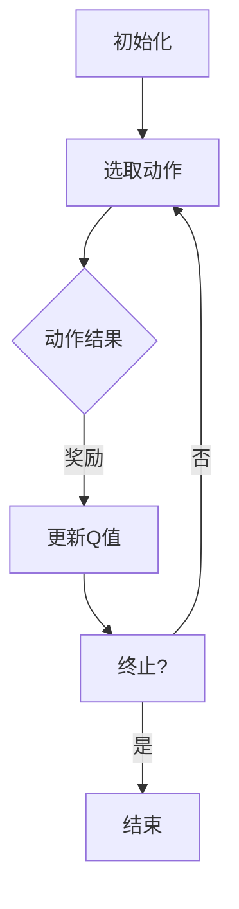
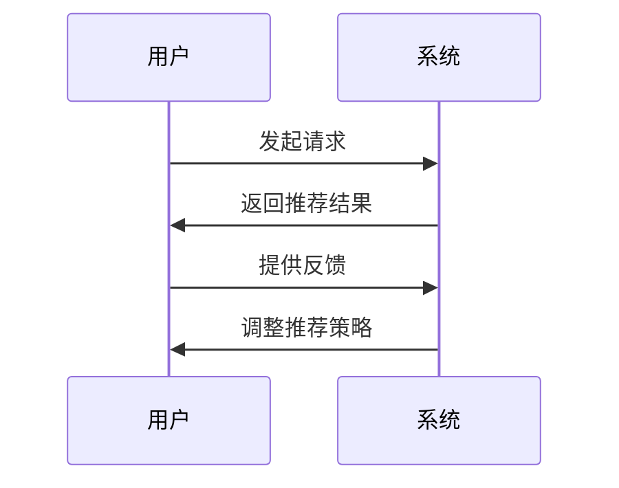

                 

### 《AI Agent的强化学习在推荐系统中的应用》

关键词：AI Agent、强化学习、推荐系统、算法、应用

摘要：本文将深入探讨AI Agent的强化学习在推荐系统中的应用。首先，我们将介绍推荐系统的背景和问题，然后分析AI Agent和强化学习的基本概念。接着，我们将讲解强化学习算法的原理及其在推荐系统中的实现。随后，文章将介绍推荐系统的功能设计和架构，并通过一个实际案例展示强化学习在推荐系统中的应用效果。最后，我们将总结强化学习与推荐系统的结合价值，并提出一些最佳实践和注意事项。

### 目录大纲

1. **第一部分：背景介绍**

   - **第1章：问题背景与解决**
     - 1.1 推荐系统的重要性
     - 1.2 AI Agent与强化学习的发展与应用
     - 1.3 问题解决
     - 1.4 边界与外延
     - 1.5 概念结构与核心要素组成

2. **第二部分：核心概念与联系**

   - **第2章：核心概念原理**
     - 2.1 AI Agent的基本概念
     - 2.2 强化学习的基本概念
     - 2.3 推荐系统与AI Agent的联系
     - 2.4 概念属性特征对比表格
     - 2.5 ER实体关系图架构

3. **第三部分：算法原理讲解**

   - **第3章：算法原理与数学模型**
     - 3.1 强化学习算法的mermaid流程图
     - 3.2 算法原理讲解
     - 3.3 算法Python源代码
     - 3.4 算法原理示例说明
     - 3.5 数学模型和公式讲解

4. **第四部分：系统分析与架构设计**

   - **第4章：系统功能设计与架构**
     - 4.1 问题场景介绍
     - 4.2 系统功能设计
     - 4.3 系统架构设计
     - 4.4 系统接口设计
     - 4.5 系统交互mermaid序列图

5. **第五部分：项目实战**

   - **第5章：环境安装与核心实现**
     - 5.1 环境安装
     - 5.2 系统核心实现
     - 5.3 代码应用解读与分析
     - 5.4 实际案例分析与讲解
     - 5.5 项目小结

6. **第六部分：最佳实践与拓展**

   - **第6章：最佳实践与注意事项**
     - 6.1 最佳实践
     - 6.2 小结
     - 6.3 注意事项
     - 6.4 拓展阅读

### 让我们一步一步思考（LET'S THINK STEP BY STEP）

#### 第1步：问题背景与解决

**问题背景：**

推荐系统是当今互联网中不可或缺的一部分，它帮助用户从大量信息中找到他们可能感兴趣的内容。然而，传统的推荐系统面临着各种挑战，如数据稀疏、冷启动问题以及用户偏好动态变化。

**解决思路：**

AI Agent和强化学习为推荐系统带来了新的解决方案。AI Agent可以模拟智能体在动态环境中学习策略，而强化学习则提供了一种有效的学习策略的方式。

**问题解决：**

强化学习算法，如Q-learning和SARSA，通过不断的尝试和错误，可以帮助AI Agent学习如何更好地在推荐系统中为用户提供个性化推荐。

#### 第2步：核心概念与联系

**AI Agent的基本概念：**

AI Agent是一种能够感知环境、执行动作并基于奖励信号学习优化行为的计算机程序。AI Agent可以是智能代理、智能体或智能实体。

**强化学习的基本概念：**

强化学习是一种通过试错和奖励信号来学习策略的机器学习方法。强化学习的主要目标是找到一种策略，使得智能体在长期内获得最大的累积奖励。

**推荐系统与AI Agent的联系：**

在推荐系统中，AI Agent可以作为一个推荐智能体，通过感知用户行为和系统状态，生成个性化的推荐列表。

#### 第3步：算法原理讲解

**Q-learning算法的mermaid流程图：**

**Q-learning算法原理与数学模型：**

Q-learning算法通过不断地尝试选择动作，并根据动作结果更新Q值，从而学习最优策略。其数学模型为：

$$ Q(s, a) = \frac{1}{N(s, a)} \sum_{t=0}^{N-1} r_t + \gamma \max_{a'} Q(s', a') $$

其中，$Q(s, a)$是状态s下动作a的Q值，$r_t$是第t次动作的奖励，$\gamma$是折扣因子，$N(s, a)$是状态s下动作a的次数。

**SARSA算法原理与数学模型：**

SARSA算法与Q-learning算法类似，但SARSA算法在更新Q值时使用实际选择的动作，而不是预测的最优动作。其数学模型为：

$$ Q(s, a) = Q(s, a) + \alpha [r + \gamma \max_{a'} Q(s', a') - Q(s, a)] $$

其中，$\alpha$是学习率。

#### 第4步：系统分析与架构设计

**问题场景介绍：**

我们考虑一个电子商务平台，用户在平台上浏览商品、添加购物车、进行购买等操作。

**系统功能设计：**

系统功能设计包括用户行为分析、商品推荐、用户反馈处理等模块。

**系统架构设计：**

系统架构设计包括数据层、服务层和展示层。数据层负责存储用户行为数据和商品信息，服务层负责处理用户请求并生成推荐结果，展示层负责将推荐结果展示给用户。

**系统接口设计：**

系统接口设计包括用户接口、API接口和数据处理接口。

**系统交互mermaid序列图：**

#### 第5步：项目实战

**环境安装：**

我们需要安装Python环境、推荐系统所需的库（如scikit-learn）以及强化学习相关的库（如tensorflow）。

**系统核心实现：**

实现推荐系统的基本功能，如用户行为分析、商品推荐和用户反馈处理。然后，实现强化学习算法在推荐系统中的应用。

**代码应用解读与分析：**

分析代码中的每个部分，解释其功能，并提供详细的注释。

**实际案例分析与讲解：**

通过一个实际案例，展示强化学习在推荐系统中的应用效果，并进行分析和讲解。

**项目小结：**

总结项目中的关键技术与难点，并对项目进行反思和总结。

#### 第6步：最佳实践与拓展

**最佳实践：**

- 根据用户行为数据实时调整推荐策略。
- 使用多模态数据（如文本、图像、音频）进行推荐。

**小结：**

强化学习与推荐系统的结合为个性化推荐提供了新的可能性。

**注意事项：**

- 需要平衡用户体验和数据隐私。
- 强化学习算法需要大量的数据进行训练。

**拓展阅读：**

- 了解最新的强化学习算法（如深度强化学习）。
- 探索强化学习在推荐系统中的其他应用场景。

### 总结

AI Agent的强化学习在推荐系统中的应用，为我们提供了一种新的解决推荐系统问题的方法。通过本文的逐步分析，我们了解了强化学习算法在推荐系统中的原理、实现和应用。接下来，我们将通过实际案例来进一步探讨强化学习在推荐系统中的效果。让我们继续深入探索这个激动人心的领域！

